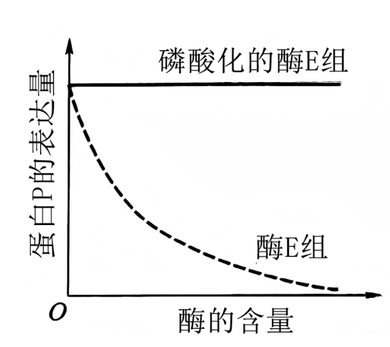
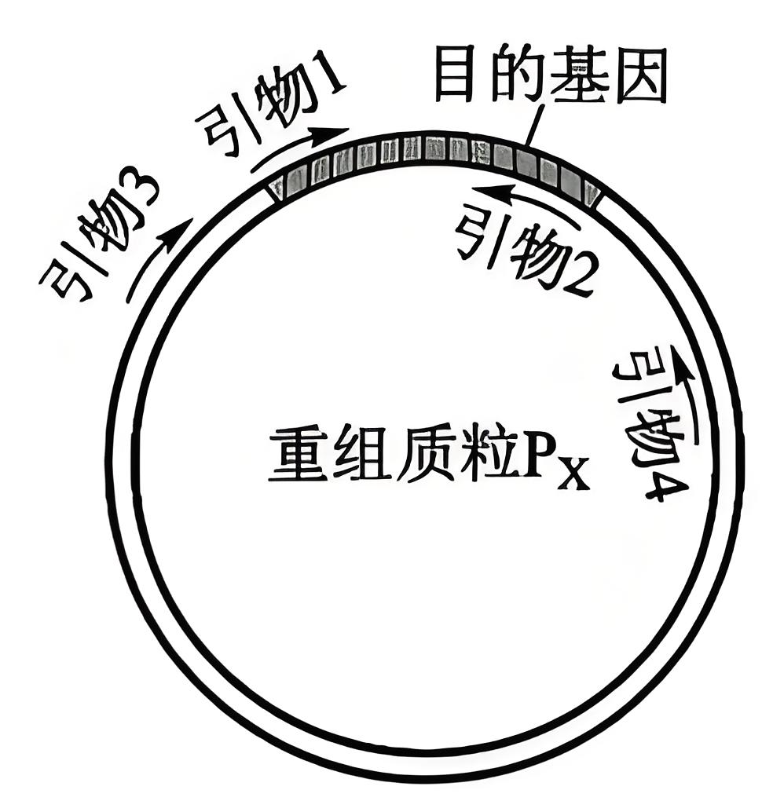

**绝密★启用前**

**2025年普通高等学校招生全国统一考试**

**生物部分**

**注意事项：**

**1．答卷前，考生务必将自己的姓名、准考证号填写在答题卡上。**

**2．回答选择题时，选出每小题答案后，用铅笔把答题卡上对应题目的答案标号涂黑。如需改动，用橡皮擦干净后，再选涂其他答案标号。回答非选择题时，将答案写在答题卡上。写在本试卷上无效。**

**3．考试结束后，将本试卷和答题卡一并交回。**

**一、选择题：每小题6分。在每小题给出的四个选项中，只有一项符合题目要求。**

1\. 蛋白质是结构和功能多样的生物大分子。下列叙述错误的是（ ）

A. 二硫键的断裂不会改变蛋白质的空间结构

B. 改变蛋白质的空间结构可能会影响其功能

C. 用乙醇等有机溶剂处理可使蛋白质发生变性

D. 利用蛋白质工程可获得氨基酸序列改变的蛋白质

【答案】A

【解析】

【分析】蛋白质的空间结构易受外界条件影响，空间结构破坏可导致蛋白质失去生物活性，二硫键很容易被还原而断裂，断裂后可以再次氧化重新形成二硫键。

【详解】A、二硫键是连接不同半胱氨酸残基的化学键，属于蛋白质一级结构的一部分。若二硫键断裂，会破坏蛋白质的空间结构，导致其功能丧失，A错误；

B、蛋白质的功能依赖其特定的空间结构，若空间结构改变（如高温、强酸强碱导致的变性），其功能通常也会受到影响，B正确；

C、乙醇等有机溶剂可破坏蛋白质分子中的氢键，导致其空间结构改变而变性，C正确；

D、蛋白质工程是指以蛋白质分子的结构规律及其与生物功能的关系作为基础，通过改造或合成基因，来改造现有蛋白质，或合成一种新的蛋白质，因此利用蛋白质工程可获得氨基酸序列改变的蛋白质，D正确。

故选A。

2\. 在一定温度下，生长在大田的某种植物光合速率（CO2固定速率）和呼吸速率（CO2释放速率）对光照强度的响应曲线如图所示。下列叙述错误的是（ ）

A. 光照强度为a时，该植物的干重不会增加

B. 光照强度从a逐渐增加到b时，该植物生长速率逐渐增大

C 光照强度小于b时，提高大田CO2浓度，CO2固定速率会增大

D. 光照强度为b时，适当降低光反应速率，CO2固定速率会降低

【答案】C

【解析】

【分析】该曲线是植物光合速率（CO2固定速率）和呼吸速率（CO2释放速率）随光照强度变化的曲线；光照强度为a时，光合速率等于呼吸速率，即 “光补偿点”，此时植物光合作用固定的CO2量，恰好抵消呼吸作用释放的CO2量，净光合为为0，植物干重不增不减 。光照强度为b时，光合速率达到“光饱和点”，此后再增加光照强度，光合速率不再提升（受温度、CO2浓度等其他环境因素或自身酶、色素等内部因素限制），此时光合速率与呼吸速率差值最大，植物积累有机物最快 。

【详解】A、光照强度为a时，光合速率等于呼吸速率，即净光合速率为0。植物干重增加依赖净光合积累有机物，净光合速率=光合速率-呼吸速率，此时净光合为0，干重不会增加，A 正确；

B、光照强度从a逐渐增加到b时，光合速率与呼吸速率差值逐渐增大。净光合速率越大，植物积累有机物越多，生长速率逐渐增大，B正确；

C、光照强度小于b时，光照强度未达饱和的阶段，在光照强度为主要限制因素时，提高大田CO2浓度，CO2固定速率不会增大（因为光照不足，光反应提供的ATP和NADPH有限，限制暗反应）；只有当光照强度饱和后，提高CO2浓度，CO2固定速率才会增大，C错误；

D、光照强度为b时，光反应为暗反应提供ATP和NADPH。适当降低光反应速率，提供的ATP和NADPH减少，会使暗反应中CO2固定速率降低，D正确。

故选C。

3\. 为研究肾上腺的生理机能，某研究小组将小鼠按照下表进行处理，一定时间后检测相关指标。

|     |             |
|:--- |:----------- |
| 分组  | 实验处理        |
| 甲   | 不摘除肾上腺      |
| 乙   | 摘除肾上腺       |
| 丙   | 摘除肾上腺，注射醛固酮 |

下列叙述错误的是（ ）

A. 乙组小鼠的促肾上腺皮质激素水平会升高

B. 乙组小鼠饮生理盐水有利于改善水盐平衡

C. 三组小鼠均饮清水时，丙组小鼠血钠含量最低

D. 甲组小鼠受寒冷刺激时，肾上腺素释放量增加

【答案】C

【解析】

【分析】激素分泌的分级调节：下丘脑-垂体-肾上腺皮质轴：下丘脑分泌的促肾上腺皮质激素释放激素（CRH）作用于垂体，使得垂体分泌促肾上腺皮质激素（ACTH），作用于肾上腺皮质分泌糖皮质激素，糖皮质激素能通过负反馈调节影响下丘脑、垂体的分泌活动。

【详解】A、乙组摘除肾上腺后，糖皮质激素减少，通过负反馈调节使下丘脑分泌的促肾上腺皮质激素释放激素（CRH）和垂体分泌的促肾上腺皮质激素（ACTH）水平升高，A正确；

B、乙组因缺乏醛固酮（保钠排钾），导致血钠降低，饮用生理盐水可补充钠离子，改善水盐平衡，B正确；

C、丙组虽摘除肾上腺，但注射了醛固酮，醛固酮可促进肾小管对钠的重吸收，血钠应接近正常水平；乙组因缺乏醛固酮且未补充，血钠最低；甲组正常。因此，丙组血钠并非最低，C错误；

D、肾上腺髓质分泌肾上腺素，甲组肾上腺未被摘除，寒冷刺激时肾上腺素释放量增加以促进产热，D正确。

故选C。

4\. 某同学在甲、乙两个植物群落中设置样方调查其特征，样方中植物的物种数随样方面积扩大而逐渐增加，但样方面积扩大到一定程度后物种数的变化明显趋缓（如图所示），此时对应的样方面积（a和b）通常称为最小面积。下列叙述错误的是（ ）

A. 最小面积样方中应包含群落中绝大多数的物种

B. 与甲相比，乙群落的物种丰富度较高，调查时最小面积更大

C. 调查甲群落的物种丰富度时，设置的样方面积应不小于a

D. 调查乙群落中植物的种群密度时，针对每种植物设置的样方面积应不小于b

【答案】D

【解析】

【分析】最小面积是指能包含群落中绝大多数物种的最小样方面积。当样方面积扩大到该值后，物种数变化趋缓，说明已涵盖群落主要物种。图中 a、b 分别为甲、乙群落的最小面积。

【详解】A、最小面积的定义就是能包含群落中绝大多数物种的样方面积，此时再扩大样方面积，新增物种极少，A正确；

B、乙群落的最小面积b大于甲群落的a，说明乙群落物种更丰富（需要更大样方面积才能包含绝大多数物种），物种丰富度越高，调查所需的最小面积越大，B正确；

C、调查甲群落的物种丰富度时，需至少使用最小面积a的样方，才能保证涵盖绝大多数物种，避免漏测，若样方面积小于a，可能无法反映群落真实物种组成，C正确；

D、最小面积b是针对乙群落物种丰富度调查的标准，而种群密度调查需根据不同物种的分布特征设置合适样方面积，并非所有物种都需不小于b的样方面积，D错误。

故选D。

5\. 为获得作物新品种，可采用不同的育种技术。下列叙述错误的是（ ）

A. 三倍体西瓜育种时，利用了人工诱导染色体加倍获得的多倍体

B. 作物单倍体育种时，利用了由植物茎尖组织培养获得的单倍体

C. 航天育种时，利用了太空多种因素导致基因突变产生的突变体

D. 水稻杂交育种时，利用了水稻有性繁殖过程中产生的重组个体

【答案】B

【解析】

【分析】几种常考的育种方法：

|     |                       |                               |                 |                          |
|:---:|:---------------------:|:-----------------------------:|:---------------:|:------------------------:|
|     | 杂交育种                  | 诱变育种                          | 单倍体育种           | 多倍体育种                    |
| 方法  | （1）杂交→自交→选优（2）杂交      | 物理因素、化学因素、生物因素                | 花药离体培养、秋水仙素诱导加倍 | 秋水仙素处理萌发的种子或幼苗           |
| 原理  | 基因重组                  | 基因突变                          | 染色体数目变异         | 染色体数目变异                  |
| 优点  | 不同个体的优良性状可集中于同一个体上    | 提高变异频率，出现新性状，大幅度改良某些性状，加速育种进程 | 明显缩短育种年限        | 营养器官增大、提高产量与营养成分         |
| 缺点  | 时间长，需要及时发现优良性状        | 有利变异少，需要处理大量实验材料，具有不确定性       | 技术复杂，成本高        | 技术复杂，且需要与杂交育种配合；在动物中难以实现 |
| 举例  | 高杆抗病与矮杆不抗病小麦杂产生矮杆抗病品种 | 高产量青霉素菌株的育成                   | 抗病植株的育成         | 三倍体西瓜、八倍体小黑麦             |

【详解】A、三倍体西瓜的培育需先通过秋水仙素处理二倍体幼苗获得四倍体，再与二倍体杂交得到三倍体，四倍体的形成属于人工诱导染色体加倍，A正确；B、单倍体育种需通过花粉（生殖细胞）离体培养获得单倍体植株，而茎尖组织培养属于无性繁殖，所得植株染色体数目与原植株相同，并非单倍体，B错误；

C、航天育种利用太空中的辐射、微重力等因素诱导基因突变，属于诱变育种，C正确；

D、杂交育种通过有性生殖（减数分裂）过程中基因重组产生新性状的个体，D正确。

故选B。

6\. 琼脂糖凝胶电泳常用于核酸样品的分析，样品1～4的电泳结果如图所示（“+”“-”分别代表电泳槽的阳极和阴极）。已知样品1和2中的DNA分子分别是甲和乙，甲只有限制酶R的一个酶切位点，样品3和4中有一个样品是甲的酶切产物。下列叙述错误的是（ ）

A. 配制琼脂糖凝胶时需选用适当的缓冲溶液

B. 该实验条件下甲、乙两种DNA分子均带负电荷

C. 甲、乙两种DNA分子所含碱基对的数量可能不同

D. 据图推测样品3可能是甲被酶R完全酶切后的产物

【答案】D

【解析】

【分析】限制酶酶切其基本原理是利用限制酶对DNA上特定序列的识别，来确定切割位点并实现切割，从而获得所需的特定序列。

【详解】A、配制琼脂糖凝胶时选用适当缓冲溶液，可维持电泳过程中体系的pH稳定，保证核酸分子正常泳动，A正确；

B、电泳时，样品向+极移动，说明在该实验条件下甲、乙两种 DNA 分子均带负电荷，符合核酸分子在电泳中的带电特性，B正确；

C、电泳中，DNA分子的迁移速率与分子大小、电荷的多少等多种因素有关。甲、乙电泳条带位置虽然相同，但影响DNA分子的迁移速率的因素很多，所以碱基对的数量可能不同，C正确；

D、甲只有限制酶R的一个酶切位点，若被酶R完全酶切，只会得到2种DNA片段（2个条带），这两个条带的碱基数量比甲要少，电泳跑的距离要比甲更远，所以据图推测样品4才是甲被酶R完全酶切后的产物，D 错误。

故选D。

**三、非选择题。**

7\. 将某植物叶肉细胞放入一定浓度的KCl溶液中，起初细胞失水发生质壁分离，一定时间（t）后细胞开始吸水，并逐渐复原。回答下列问题：

（1）植物细胞与外界溶液进行水分交换时，水分子跨膜运输的两种方式是\_\_\_\_\_\_\_\_。

（2）细胞失水发生质壁分离，原生质层与细胞壁分离的原因是\_\_\_\_\_\_\_\_。

（3）一定时间（t）后细胞开始吸水的原因是\_\_\_\_\_\_\_\_。

【答案】（1）自由扩散、协助扩散

（2）细胞失水体积缩小，原生质层比细胞壁的伸缩性大

（3）K+和C1-进入细胞，使细胞内渗透压高于外界溶液

【解析】

【分析】当细胞液的浓度小于外界溶液的浓度时,细胞液中的水分就透过原生质层进入外界溶液中,使细胞壁和原生质层都出现一定程度的收缩.由于原生质层比细胞壁的伸缩性大,当细胞不断失水时,原生质层就会与细胞壁逐渐分离开来,也就是逐渐发生了质壁分离。当细胞液的浓度大于外界溶液的浓度时,外界溶液中的水分就透过原生质层进入细胞液中,整个原生质层就会慢慢地恢复成原来的状态,使植物细胞逐渐发生质壁分离的复原。

【小问1详解】

水分子跨膜运输的方式有自由扩散、协助扩散，水分子更多的是借助膜上的水通道蛋白以协助扩散的方式进出细胞。

【小问2详解】

当外界溶液浓度大于细胞液浓度时，细胞发生失水导致体积缩小，且原生质层比细胞壁的伸缩性大，细胞会发生质壁分离现象。

【小问3详解】

KCl会电离出K+和C1-，K+和C1-进入细胞，使细胞内渗透压高于外界溶液，细胞吸水。

8\. 有研究显示，机体内蛋白P表达量降低会引起免疫失调。已知酶E可催化蛋白P基因的启动子甲基化，酶E被磷酸化后失活。研究人员用酶E（或磷酸化的酶E）、含蛋白P基因及其启动子的表达质粒等进行实验，结果如图所示。回答下列问题：

（1）免疫失调包括过敏反应和\_\_\_\_\_\_\_\_（答出2点即可）等。

（2）根据实验结果判断，蛋白P基因的启动子甲基化\_\_\_\_\_\_\_\_（填“促进”“抑制”或“不影响”）蛋白P的表达，判断依据是\_\_\_\_\_\_\_\_。

（3）为治疗因蛋白P表达量降低起的免疫失调，可使用抑制\_\_\_\_\_\_\_\_（填“酶E”“磷酸化的酶E”或“蛋白P”）活性的药物。免疫失调也可以通过调节抗体的生成进行治疗，机体产生抗体过程中记忆B细胞的作用是\_\_\_\_\_\_\_\_。

【答案】（1）自身免疫病、免疫缺陷病

（2） ①. 抑制 ②. 酶E催化蛋白P基因的启动子甲基化，酶E含量增加导致蛋白P的表达量下降，磷酸化的酶E含量增加不会影响蛋白P的表达量

（3） ①. 酶E ②. 再次接触抗原时，能迅速增殖分化，快速产生大量抗体

【解析】

【分析】免疫失调包括过敏反应、自身免疫病和免疫缺陷病等。当相同抗原再次入侵机体时，记忆 B 细胞迅速增殖分化为浆细胞，浆细胞产生大量抗体。

【小问1详解】

免疫失调包括过敏反应、自身免疫病和免疫缺陷病等。自身免疫病是免疫系统对自身成分发生免疫反应，免疫缺陷病是由于机体免疫功能不足或缺乏而引起的疾病。

【小问2详解】

从实验结果来看，酶 E 组中酶 E 可催化蛋白 P 基因的启动子甲基化，且随着酶 E 含量增加，蛋白 P 的表达量下降；而磷酸化的酶 E 组中，磷酸化的酶 E 失活，不能催化蛋白 P 基因的启动子甲基化，蛋白 P 表达量相对稳定。所以蛋白 P 基因的启动子甲基化抑制蛋白 P 的表达。 判断依据是：酶E催化蛋白P基因的启动子甲基化，酶E含量增加导致蛋白P的表达量下降，磷酸化的酶E含量增加不会影响蛋白P的表达量。

【小问3详解】

因为酶 E 可催化蛋白 P 基因的启动子甲基化从而降低蛋白 P 表达量，所以为治疗因蛋白 P 表达量降低引起的免疫失调，可使用抑制酶 E 活性的药物，这样就能减少蛋白 P 基因启动子的甲基化，提高蛋白 P 的表达量。 机体产生抗体过程中，记忆 B 细胞的作用是：当相同抗原再次入侵机体时，记忆 B 细胞迅速增殖分化为浆细胞，浆细胞产生大量抗体。

9\. 在“绿水青山就是金山银山”理念的感召下，同学们积极讨论某退化荒山的生态恢复方案。A同学提出选择一种树种进行全覆盖造林；B同学提出应该种植多种草本和木本植物。回答下列问题：

（1）在生态恢复过程中，退化荒山会发生群落演替。通常，群落演替的类型有初生演替和次生演替，二者的区别有\_\_\_\_\_\_\_\_（答出2点即可）。

（2）与A同学的方案相比，B同学的方案可能有利于控制害虫的爆发，从种间关系的角度分析其原因是\_\_\_\_\_\_\_\_。

（3）为合理利用环境资源，从群落空间结构的角度考虑，设计荒山绿化方案时应遵循的原则是\_\_\_\_\_\_\_\_（答出2点即可）。

（4）为维护恢复后生态系统的稳定性，需要采取的措施有\_\_\_\_\_\_\_\_（答出2点即可）。

【答案】（1）起点不同；速度不同

（2）B同学方案中植物种类多，动物种类会相应增加，物种间的竞争、捕食等关系更复杂，使害虫种群数量增长受到限制

（3）群落水平方向上种植不同种类的植物；群落垂直方向上种植不同高度的植物

（4）控制对生态系统的干扰强度；给予相应的物质、能量投入

【解析】

【分析】本题围绕退化荒山生态恢复方案展开，考查群落与生态系统知识：退化荒山生态恢复中，群落演替因起点（有无土壤等生物生存基础 ）和速度（初生演替慢、次生演替快 ）区分初生与次生演替；B 方案多种植物搭配可增加动物种类，借复杂种间关系（竞争、捕食等 ）限制害虫增长；设计绿化方案遵循群落水平与垂直空间结构（水平种不同植物、垂直配不同高度植物 ）提升资源利用率；维护生态系统稳定需控制干扰强度、适时补充物质能量，保障生态系统结构功能完整 。

【小问1详解】

初生演替和次生演替起点不同：初生演替是在从未有过生物或被彻底消灭过生物的地方（如裸岩、沙丘 ）开始；次生演替是在原有群落虽被破坏，但保留了土壤条件和部分生物的地方（如退化荒山 ）开始。二者速度不同：初生演替因要从无到有建立生态，过程漫长（比如裸岩演替到森林需数百年 ）；次生演替有土壤、种子等基础，速度更快（像荒山恢复，几年就能有明显变化 ）。

【小问2详解】

B方案种多种植物，会让生态更复杂。多种植物能吸引更多种类的动物（比如有的植物吸引食草虫，有的吸引食虫鸟 ）。物种多了，种间关系就复杂：害虫会被天敌（如鸟 ）捕食，还会和其他生物竞争资源（如食物、空间 ），这些都会限制害虫数量疯长，所以利于控制虫害。

【小问3详解】

群落有水平和垂直空间结构。水平方向：不同位置环境（光照、水分 ）有差异，种不同植物能充分利用这些环境（比如阳处种喜阳植物，阴处种喜阴植物 ）。垂直方向：不同高度的植物（矮草、灌木、乔木 ）能利用不同层次的光照、空间，比如乔木用上层光，灌木用中层，草用下层，这样就把环境资源（光、空间 ）都 “占满”，提高利用率。

【小问4详解】

生态系统稳定靠自身调节，但也需人为助力。控制干扰强度：比如别过度砍伐、放牧，不然生态系统承受不住，容易崩溃。给予物质、能量投入：如果生态系统自身资源不够（比如土壤贫瘠 ），补充肥料（物质 ）、营造适宜气候（能量相关 ），能帮它维持稳定，像给荒山定期补水、施肥 。

10\. 植物合成的色素会影响花色。某二倍体植物的花色有深红、浅红和白三种表型。研究小组用甲、乙两个浅红色表型的植株进行相关实验。回答下列问题：

（1）甲、乙分别自交，子一代均出现浅红色：白色=3：1的表型分离比；甲和乙杂交，子一代出现深红色（丙）：浅红色：白色（丁）=1：2：1的表型分离比。综上判断，甲和乙的基因型\_\_\_\_\_\_\_\_（填“相同”或“不同”），判断依据是\_\_\_\_\_\_\_\_。

（2）丙自交子一代出现深红色：浅红色：白色=9：6：1的表型分离比，其中与丙基因型相同的个体所占比例为\_\_\_\_\_\_\_\_。若丙与丁杂交，子一代的表型及分离比为\_\_\_\_\_\_\_\_，其中纯合体所占比例为\_\_\_\_\_\_\_\_。

【答案】（1） ①. 不同 ②. 甲、乙自交的结果与甲乙杂交的结果不同

（2） ①. 1/4 ②. 深红色:浅红色:白色=1:2:1 ③. 1/4

【解析】

【分析】基因自由组合定律的实质是：位于非同源染色体上的非等位基因的分离或自由组合是互不干扰的；在减数分裂过程中，同源染色体上的等位基因彼此分离的同时，非同源染色体上的非等位基因自由组合。

【小问1详解】

甲和乙的基因型不同，甲、乙分别自交，子一代均出现浅红色：白色 = 3：1 的表型分离比，这符合杂合子（Aa）自交的性状分离比，说明甲、乙均为杂合子。若甲和乙基因型相同，设为 Aa，那么甲和乙杂交后代的基因型及比例为 AA：Aa：aa = 1：2：1，表型应该是浅红色：白色 = 3：1，而实际甲和乙杂交子一代出现深红色：浅红色：白色 = 1：2：1 的表型分离比，所以甲和乙的基因型不同。

小问2详解】

丙自交子一代出现深红色：浅红色：白色 = 9：6：1 的表型分离比，这是 9：3：3：1 的变式，说明花色由两对等位基因控制（设为 A、a 和 B、b），且丙的基因型为 AaBb。根据基因自由组合定律，AaBb 自交后代中 AaBb 的比例为1/4（2/4×2/4=4/16=1/4）。因为甲、乙杂交产生丙（AaBb），且甲、乙自交都出现浅红色：白色 = 3：1，可推测甲、乙基因型为 Aabb 和 aaBb（二者可互换），丁为白色，基因型为 aabb。丙（AaBb）与丁（aabb）杂交，即测交，后代基因型及比例为 AaBb：Aabb：aaBb：aabb = 1：1：1：1，对应的表型及比例为深红色：浅红色：白色 = 1：2：1。丙（AaBb）与丁（aabb）杂交，后代中纯合体只有 aabb，所占比例为1/4。

11\. 为在大肠杆菌中表达酶X，某同学将编码酶X的基因（目的基因）插入质粒P0，构建重组质粒Px，并转入大肠杆菌。该同学设计引物用PCR方法验证重组质粒构建成功（引物1~4结合位置如图所示，→表示引物5＇→3＇方向）。回答下列问题：

（1）PCR是根据DNA复制原理在体外扩增DNA的技术。在细胞中DNA复制时解开双链的酶是\_\_\_\_\_\_\_\_，而PCR过程中解开双链的方法是\_\_\_\_\_\_\_\_。

（2）PCR过程中，因参与合成反应、不断消耗而浓度下降的组分有\_\_\_\_\_\_\_\_。

（3）该同学进行PCR实验时，所用模板与引物见下表。实验中①和④的作用是：\_\_\_\_\_\_\_\_；②无扩增产物，原因是\_\_\_\_\_\_\_\_；③、⑤和⑥有扩增产物，扩增出的DNA产物分别是\_\_\_\_\_\_\_\_。

<table style="width:64%;">
<colgroup>
<col style="width: 10%" />
<col style="width: 8%" />
<col style="width: 8%" />
<col style="width: 8%" />
<col style="width: 8%" />
<col style="width: 8%" />
<col style="width: 8%" />
</colgroup>
<tbody>
<tr>
<td style="text-align: left;">管号</td>
<td style="text-align: left;">①</td>
<td style="text-align: left;">②</td>
<td style="text-align: left;">③</td>
<td style="text-align: left;">④</td>
<td style="text-align: left;">⑤</td>
<td style="text-align: left;">⑥</td>
</tr>
<tr>
<td style="text-align: left;">模板</td>
<td style="text-align: left;">无</td>
<td style="text-align: left;">P0</td>
<td style="text-align: left;">Px</td>
<td style="text-align: left;">无</td>
<td style="text-align: left;">P0</td>
<td style="text-align: left;">Px</td>
</tr>
<tr>
<td style="text-align: left;">引物对</td>
<td colspan="3" style="text-align: left;">引物1和引物2</td>
<td colspan="3" style="text-align: left;">引物3和引物4</td>
</tr>
</tbody>
</table>

（4）设计实验验证大肠杆菌表达的酶X有活性，简要写出实验思路和预期结果\_\_\_\_\_\_\_\_。

【答案】（1） ①. 解旋酶 ②. 高温变性

（2）引物、脱氧核苷三磷酸

（3） ①. 作为对照（或答:鉴定反应体系是否有模板污染） ②. P0不含与引物1和引物2互补的碱基序列 ③. 目的基因、质粒片段、含目的基因和部分质粒序列的片段

（4）提取酶X，催化相应底物（反应物）的反应，检测是否有产物生成。有产物生成，则证明酶X有活性

【解析】

【分析】PCR（聚合酶链式反应）技术扩增基因的原理是DNA 半保留复制 。 在适宜的温度、引物、DNA 聚合酶、脱氧核苷酸等条件下，以目的基因的两条链为模板，按照碱基互补配对原则（A - T、G - C 配对），通过变性（高温使 DNA 双链解开）、退火（低温使引物与模板结合）、延伸（中温下 DNA 聚合酶催化脱氧核苷酸连接到引物上延伸成新链 ）三个步骤循环往复，实现目的基因的大量扩增，每一轮循环后 DNA 分子数量呈指数增长 。

【小问1详解】

在细胞中，DNA 复制时解开双链的酶是解旋酶。而在 PCR 过程中，是通过高温变性（加热至 90 - 95℃）的方法使 DNA 双链解开。

【小问2详解】

PCR 过程中，参与合成反应且不断消耗的组分有引物和 dNTP（脱氧核苷三磷酸）。引物用于引导 DNA 聚合酶合成新的 DNA 链，dNTP 脱去两分子磷酸，产生dAMP，进而为合成新的 DNA 链提供原料。

【小问3详解】

实验中①和④的作用是作为对照。①无模板且引物对与③④相同，④无模板且引物对与⑤⑥相同，可对比说明模板对扩增的影响。②之所以无扩增产物，是因为P0不含与引物1和引物2互补的碱基序列，无法扩增出子链DNA序列。③以Px为模板，引物1和引物2扩增出的是含目的基因的 DNA 片段；⑤以P0为模板，引物3和引物4扩增出的是质粒P0上一段 DNA 片段；⑥以Px为模板，引物3和引物4扩增出的是含目的基因和部分质粒序列的 DNA 片段。

【小问4详解】

实验思路：将大肠杆菌培养后，提取酶X，设置一组含有酶X的反应体系和一组不含酶X的反应体系（作为对照），在适宜条件下，加入酶X的底物，检测底物的消耗情况或产物的生成情况。 预期结果：含有酶X的反应体系中底物减少或有产物生成，而不含酶X的反应体系中底物无明显变化或无产物生成。
