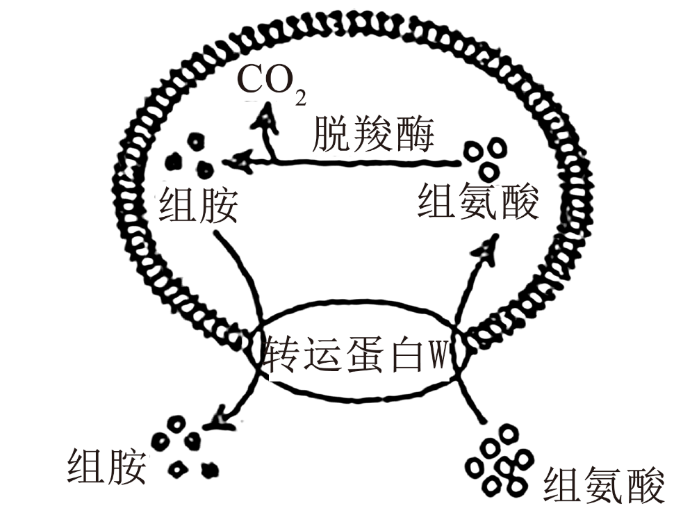
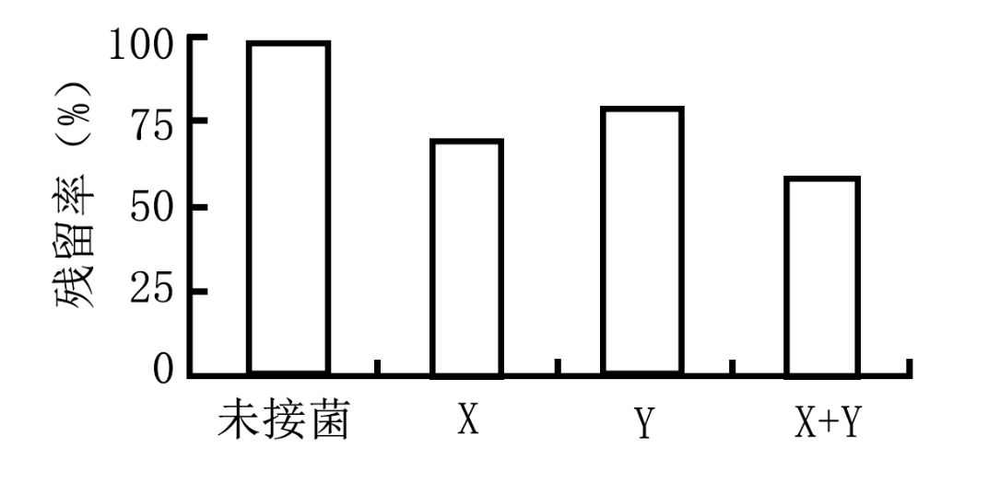
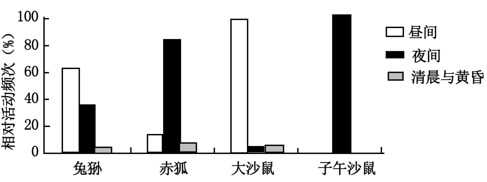
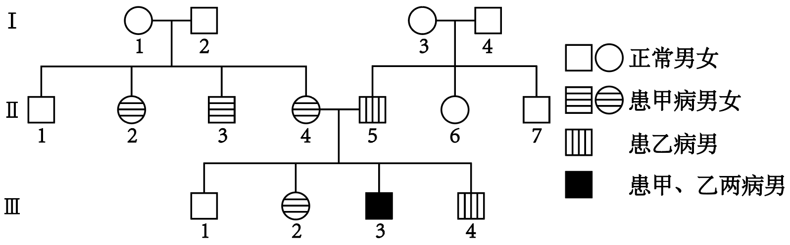
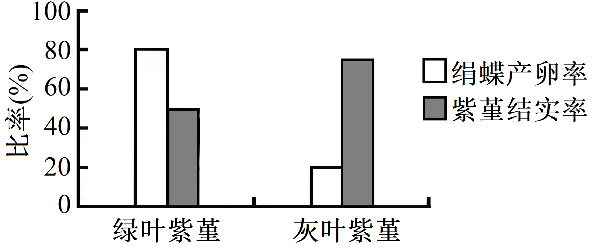
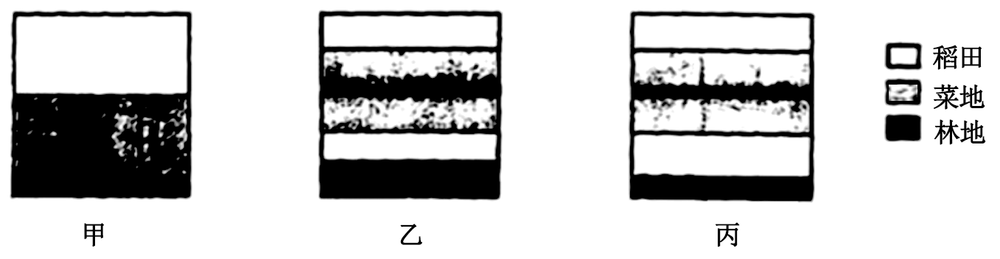
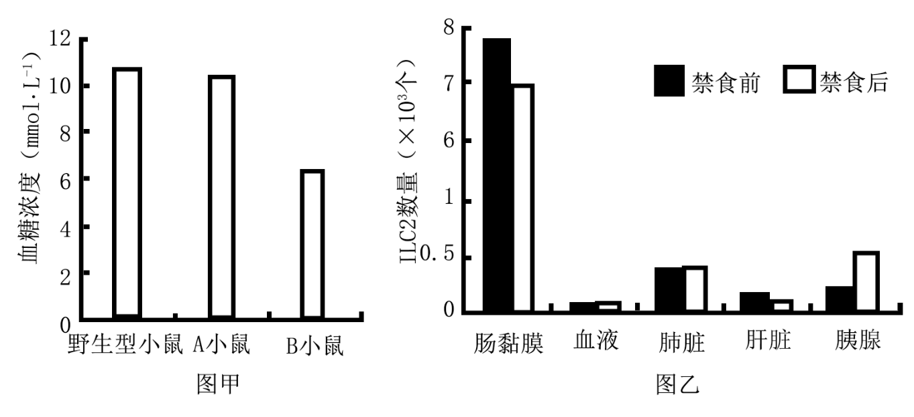
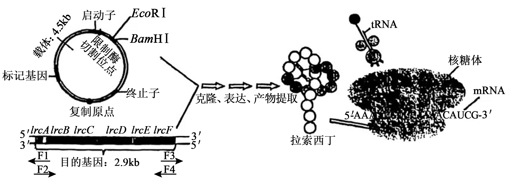

**绝密★启用前**

**2025年普通高等学校招生全国统一考试**

**生物试题**

**注意事项：**

**1．答题前，考生务必将自己的姓名、准考证号填写在答题卡上。**

**2．回答选择题时，选出每小题答案后，用铅笔把答题卡上对应题目的答案标号涂黑。如需改动，用橡皮擦干净后，再选涂其他答案标号。回答非选择题时，将案写在答题卡上。写在本试卷上无效。**

**3．考试结束后，监考员将试卷、答题卡一并交回。**

**一、单项选择题：本题共15小题，每小题3分，共45分。在每小题给出的四个选项中，只有一项是最符合题目要求的。**

1\. 真核细胞的核孔含有多种蛋白质，这些蛋白质的主要区别是（ ）

A. 基本组成元素不同 B. 单体连接方式不同

C. 肽链空间结构不同 D. 合成加工场所不同

2\. 我国大熊猫保护工作已取得显著成效，但仍面临部分种群遗传多样性较低的问题。下列措施中不属于保护大熊猫遗传多样性的是（ ）

A. 选繁殖能力强的个体进行人工繁育

B. 建立基因库保存不同种群的遗传材料

C. 建立生态走廊促进种群间基因交流

D. 在隔离的小种群中引入野化放归个体

3\. 通俗地说，细胞自噬就是细胞“吃掉”自身的结构和物质。下列叙述错误的是（ ）

A. 溶酶体作为“消化车间”可为细胞自噬过程提供水解酶

B. 线粒体作为“动力车间”为细胞自噬过程提供所需能量

C. 细胞自噬产生的氨基酸可作为原料重新用于蛋白质合成

D. 细胞自噬“吃掉”细胞器不利于维持细胞内部环境稳定

4\. 某细菌能将组氨酸脱羧生成组胺和CO2，相关物质的跨膜运输过程如下图。下列叙述正确的是（ ）

A. 转运蛋白W可协助组氨酸逆浓度梯度进入细胞

B. 胞内产生的组胺跨膜运输过程需要消耗能量

C. 转运蛋白W能同时转运两种物质，故不具特异性

D CO2分子经自由扩散，只能从胞内运输到胞外

5\. 下列以土豆为材料的实验描述，错误的是（ ）

A. 土豆DNA溶于酒精后，与二苯胺试剂混合呈蓝色

B. 向土豆匀浆中加入一定量的碘液后，溶液会呈蓝色

C. 利用土豆匀浆制备的培养基，可用于酵母菌的培养

D. 土豆中的过氧化氢酶可用于探究pH对酶活性的影响

6\. 研究人员用花椰菜（BB，2n=18）根与黑芥（CC，2n=16）叶片分别制备原生质体，经PEG诱导融合形成杂种细胞，进一步培养获得再生植株，其中的植株N经鉴定有33条染色体。下列叙述正确的是（ ）

A. 两个原生质体融合形成的细胞即为杂种细胞

B. 再生植株N的形成证明杂种细胞仍具有全能性

C. 花椰菜和黑芥的原生质体能融合，证明两种植物间不存在生殖隔离

D. 植株N的B组和C组染色体不能正常联会配对，无法产生可育配子

7\. 为杀死蜜蜂寄生虫瓦螨，研究人员对蜜蜂肠道中的S菌进行改造，使其能释放特定的双链RNA（dsRNA）。进入瓦螨体内的dsRNA被加工成siRNA后，能与瓦螨目标基因的mRNA特异性结合使其降解，导致瓦螨死亡。下列叙述正确的是（ ）

A. siRNA的嘌呤与嘧啶之比和dsRNA相同

B. dsRNA加工成siRNA会发生氢键的断裂

C. 瓦螨死亡的原因是目标基因的转录被抑制

D. 用改造后的S菌来杀死瓦螨属于化学防治

8\. 微塑料由塑料废弃物风化形成，难以降解，会危害生态环境和人体健康。有人分离到X和Y两种微塑料降解菌，将总菌量相同的X、Y、X+Y（X:Y=1:1）分别接种于含有等量微塑料的蛋白胨液体培养基中，培养一段时间后测定微塑料的残留率（残留率=剩余量/添加量×100%），结果如下图。下列叙述正确的是（ ）

A. 用平板划线法能测定X菌组中的活菌数

B. Y菌组微塑料残留率较高，故菌浓度也高

C. 混合菌种对微塑料的降解能力高于单一菌种

D. 能在该培养基中生长繁殖的微生物都能降解微塑料

9\. 为更好地保护草原生态系统，有人对某草原两种鼠类及其天敌的昼夜相对活动频次进行统计，结果如下图。下列推断不合理的是（ ）

A. 子午沙鼠的昼夜活动节律主要受到了兔狲的影响

B. 两种鼠类的活动节律显示它们已发生生态位分化

C. 两种天敌间的竞争比两种沙鼠间的竞争更为激烈

D. 一定数量的兔狲和赤狐有利于维持草原生态平衡

10\. D-阿洛酮糖是一种低热量多功能糖，有助于肥胖人群的体重管理。Co2+可协助酶Y催化D-果糖转化为D-阿洛酮糖。有人在相同体积、相同酶量且最适反应条件（含Co2+条件）下，测定不同浓度D-果糖的转化率（转化率=产物量/底物量×100%），其变化趋势如下图。下列叙述正确的是（ ）

A. 升高反应温度，可进一步提高D-果糖转化率

B. D-果糖的转化率越高，说明酶Y的活性越强

C. 若将Co2+的浓度加倍，酶促反应速率也加倍

D. 2h时，三组中500g·L-1果糖组产物量最高

11\. 系统性红斑狼疮的发生与部分B细胞的异常活化有关，人体绝大多数B细胞表面具有CD19抗原。科学家将患者的T细胞改造成表达CD19抗原受体的T细胞（CD19CAR-T细胞），使其能特异性识别并裂解具有CD19抗原的B细胞，为治疗系统性红斑狼疮开辟新途径。下列叙述正确的是（ ）

A. 系统性红斑狼疮是一种人体自身免疫病，其发病机制与细胞免疫异常有关

B. 治疗选取的T细胞为辅助性T细胞，可从血液、淋巴液和免疫器官中获得

C. CD19CAR-T细胞主要通过增强患者的体液免疫来治疗系统性红斑狼疮

D. CD19CAR-T细胞不仅能裂解异常活化的B细胞，也会攻击正常B细胞

12\. 足底黑斑病（甲病）和杜氏肌营养不良（乙病）均为单基因遗传病，其中至少一种是伴性遗传病。下图为某家族遗传系谱图，不考虑新的突变，下列叙述正确的是（ ）

A. 甲病为X染色体隐性遗传病

B. Ⅱ2与Ⅲ2的基因型相同

C. Ⅲ3的乙病基因来自Ⅰ1

D. Ⅱ4和Ⅱ5再生一个正常孩子概率为1/8

13\. 为模拟大脑控制骨骼肌运动的生理过程，科学家将人干细胞诱导分化成三种细胞（图甲），并分别培养成具有相应功能的细胞团，再将不同细胞团组合培养一段时间后，观察骨骼肌细胞团（简称肌）的收缩频率（图乙）。下列推断最合理的是（ ）

注：谷氨酸和乙酰胆碱为两种神经元释放的神经递质

A. 若在③培养液中加入谷氨酸，肌收缩频率不会发生变化

B. 若将④中乙酰胆碱受体阻断，刺激X会增加肌收缩频率

C. 分析②③④可知，X需要通过Y与肌发生功能上的联系

D. 由实验结果可知，肌与神经元共培养时收缩频率均增加

14\. 生长素（IAA）和H2O2都参与中胚轴生长的调节。有人切取玉米幼苗的中胚轴、将其培养在含有不同外源物质的培养液中，一段时间后测定中胚轴长度，结果如下图（DPI可以抑制植物中H2O2的生成）。下列叙述错误的是（ ）

A. 本实验运用了实验设计的加法原理和减法原理

B. 切去芽可以减少内源生长素对本实验结果的影响

C. IAA通过细胞中H2O2含量的增加促进中胚轴生长

D. 若另设IAA抑制剂+H2O2组，中胚轴长度应与④相近

15\. 青藏高原砾石（呈灰色）荒漠中生活着一种紫堇，每年7月开蓝花，叶片通常为绿色，但部分植株出现H基因，导致叶片呈灰色。绢蝶是紫堇的头号天敌，主要靠识别紫堇与环境的颜色差异来定位植株。绢蝶5~6月将卵产在紫堇附近的砾石上，便于孵化的幼虫就近取食。绢蝶产卵率与紫堇结实率如下图。下列推断不合理的是（ ）

注：产卵率指绢蝶在绿叶或灰叶紫堇附近产卵的机率；结实率=结实植株数/总植株数×100%

A. 灰叶紫堇具有保护色，被天敌取食的机率更低，结实率更高

B. 紫堇开花时间与绢蝶产卵时间不重叠，不利于H基因的保留

C. 若绢蝶种群数量锐减，绿叶紫堇在种群中所占的比例会增加

D. 灰叶紫堇占比增加有助于绢蝶演化出更敏锐的视觉定位能力

**二、非选择题：本题共5小题，共55分。**

16\. 在温室中种植番茄，光照强度和CO2浓度是制约产量的主要因素。某地冬季温室的平均光照强度约为200μmol·m-2·s-1，CO2浓度约为400μmol·mol-1。为提高温室番茄产量，有人测定了补充光照和CO2后番茄植株相关生理指标，结果见下表。回答下列问题。

|     |                                        |                                       |                                         |                                       |                        |
|:--- |:-------------------------------------- |:------------------------------------- |:--------------------------------------- |:------------------------------------- |:---------------------- |
| 组别  | 光照强度μmol·m-2·s-1 | CO2浓度μmol·mol-1 | 净光合速率μmol·m-2·s-1 | 气孔导度mol·m-2·s-1 | 叶绿素含量mg·g-1 |
| 对照  | 200                                    | 400                                   | 7.5                                     | 0.08                                  | 42.8                   |
| 甲   | 400                                    | 400                                   | 14.0                                    | 0.15                                  | 59.1                   |
| 乙   | 200                                    | 800                                   | 10.0                                    | 0.08                                  | 55.3                   |
| 丙   | 400                                    | 800                                   | 17.5                                    | 0.13                                  | 65.0                   |

注：气孔导度和气孔开放程度呈正相关

（1）为测定番茄叶片的叶绿素含量，可用\_\_\_\_\_\_\_\_\_提取叶绿素。色素对特定波长光的吸收量可反映色素的含量，为减少类胡萝卜素的干扰，应选择\_\_\_\_\_\_\_\_\_（填“蓝紫光”或“红光”）来测定叶绿素含量。

（2）与对照组相比，甲组光合作用光反应为暗反应提供了更多的\_\_\_\_\_\_\_\_\_，从而提高了净光合速率。与甲组相比，丙组的净光合速率更高，气孔导度略低，但经测定发现其叶肉细胞间的CO2浓度却更高，可能的原因是\_\_\_\_\_\_\_\_\_。

（3）根据本研究结果，在冬季温室种植番茄的过程中，若只能从CO2浓度加倍或光照强度加倍中选择一种措施来提高番茄产量，应选择\_\_\_\_\_\_\_\_\_，依据是\_\_\_\_\_\_\_\_\_。

17\. 川西林盘是人与自然和谐共生的典型代表，一般由宅院、林地及外围耕地等组成。林盘的植被丰富，林地中有乔木、灌丛和草本植物，耕地种植有多种农作物。有人在某林盘选取A、B、C三种样地（见下图），用样方法调查食叶害虫（蚜虫）及其主要天敌（蜘蛛和步甲虫）的种类和数量，结果见下表。回答下列问题。

<table style="width:68%;">
<colgroup>
<col style="width: 7%" />
<col style="width: 10%" />
<col style="width: 10%" />
<col style="width: 10%" />
<col style="width: 10%" />
<col style="width: 10%" />
<col style="width: 10%" />
</colgroup>
<tbody>
<tr>
<td style="text-align: left;"></td>
<td colspan="2" style="text-align: left;">蚜虫</td>
<td colspan="2" style="text-align: left;">蜘蛛</td>
<td colspan="2" style="text-align: left;">步甲虫</td>
</tr>
<tr>
<td style="text-align: left;">样地</td>
<td style="text-align: left;">物种数</td>
<td style="text-align: left;">个体数</td>
<td style="text-align: left;">物种数</td>
<td style="text-align: left;">个体数</td>
<td style="text-align: left;">物种数</td>
<td style="text-align: left;">个体数</td>
</tr>
<tr>
<td style="text-align: left;">A</td>
<td style="text-align: left;">3</td>
<td style="text-align: left;">171</td>
<td style="text-align: left;">8</td>
<td style="text-align: left;">36</td>
<td style="text-align: left;">7</td>
<td style="text-align: left;">32</td>
</tr>
<tr>
<td style="text-align: left;">B</td>
<td style="text-align: left;">4</td>
<td style="text-align: left;">234</td>
<td style="text-align: left;">13</td>
<td style="text-align: left;">80</td>
<td style="text-align: left;">10</td>
<td style="text-align: left;">39</td>
</tr>
<tr>
<td style="text-align: left;">C</td>
<td style="text-align: left;">3</td>
<td style="text-align: left;">243</td>
<td style="text-align: left;">15</td>
<td style="text-align: left;">78</td>
<td style="text-align: left;">12</td>
<td style="text-align: left;">45</td>
</tr>
</tbody>
</table>

注：表中物种数和个体数为多个样方统计的平均值

（1）该林盘中，蜘蛛和步甲虫均属于\_\_\_\_\_\_\_\_\_\_\_\_（填生态系统组分）；若它们数量大量减少，\_\_\_\_\_\_\_\_\_\_\_\_（填“有利于”“不利于”或“不影响”）能量流向对人类有益的部分。

（2）与样地A相比，样地B中的高大乔木可降低风速，减少土壤侵蚀，能更好地发挥生物多样性的\_\_\_\_\_\_\_\_\_\_\_\_价值；同时，样地B的植物群落结构更复杂，有利于增强该样地的\_\_\_\_\_\_\_\_\_\_\_\_稳定性。

（3）研究结果显示，害虫天敌多样性最高的样地为\_\_\_\_\_\_\_\_\_\_\_\_，该样地能维持更多天敌物种共存的原因是\_\_\_\_\_\_\_\_\_\_\_\_。

（4）土地利用布局对林盘生态系统稳定性有重要影响。综上分析，以下甲、乙、丙三个林盘布局示意图中，生态系统稳定性从高到低依次为\_\_\_\_\_\_\_\_\_\_\_\_，依据是\_\_\_\_\_\_\_\_\_\_\_\_。

18\. 淋巴细胞参与饥饿状态下血糖稳态的调控，以下是对其机制的研究。回答下列问题。

（1）科学家测定野生型小鼠、A小鼠（缺乏适应性淋巴细胞）和B小鼠（同时缺乏适应性和先天淋巴细胞）在禁食状态下的血糖浓度（图甲）。由图可知，参与饥饿状态下血糖调控的淋巴细胞主要是\_\_\_\_\_\_\_\_\_\_\_\_。进一步研究发现，参与血糖调控的主要是该类淋巴细胞的ILC2亚群。

（2）用荧光蛋白标记肠黏膜中的ILC2，检测禁食前后小鼠部分器官带标记的ILC2数量（图乙）。由图可知，禁食后肠黏膜中ILC2主要迁移到了\_\_\_\_\_\_\_\_\_\_\_\_（填器官名称）。禁食前后血液中ILC2数量无变化，但不能排除ILC2经血液途径迁移的可能，理由是\_\_\_\_\_\_\_\_\_\_\_\_。

（3）为研究ILC2分泌的IL-5和IL-13对该器官分泌激素X的影响，取该器官中某种细胞体外培养一段时间后，测定激素X的浓度，结果见下表。表中第2组加入的物质为\_\_\_\_\_\_\_\_\_\_\_\_。由表可知，IL-5、IL-13对激素X分泌的影响是\_\_\_\_\_\_\_\_\_\_\_\_。

|     |      |       |                                                                    |
|:--- |:---- |:----- |:------------------------------------------------------------------ |
| 组别  | IL-5 | IL-13 | 激素X浓度（pg·mL-1）                                          |
| 1   | \-   | \-    | 5.3                                                                |
| 2   | ?    | ?     | 157 |
| 3   | \-   | \+    | 30.6                                                               |
| 4   | \+   | \+    | 69.2                                                               |

注：“-”未添加该物质：“+”添加该物质

（4）综上可知：激素X是\_\_\_\_\_\_\_\_\_\_；饥饿状态下ILC2参与调控血糖稳态的具体机制是\_\_\_\_\_\_\_\_\_\_。

19\. 杆菌M2合成的短肽拉索西丁能有效杀死多种临床耐药细菌。拉索西丁能与细菌的核糖体结合，阻止携带氨基酸的tRNA进入核糖体位点2。有人将合成拉索西丁的相关基因（lrcA-lrcF）导入链霉菌，基因克隆流程及拉索西丁的作用机制如下图。回答下列问题。

注：①F1、F2、F3和F4为与相应位置的DNA配对的单链引物，“→”指引物5-3方向。②密码子对应的氨基酸：AAA-赖氨酸；AUG-甲硫氨酸（起始）；UUC-苯丙氨酸；ACA-苏氨酸：UCG-丝氨酸。

（1）用PCR技术从杆菌M2基因组中扩增lrcA-lrcF目的基因时，应选用\_\_\_\_\_\_\_\_引物。本研究载体使用了链霉菌的复制原点，其目的是\_\_\_\_\_\_\_\_。

（2）采用EcoRI和BamHI完全酶切构建的重组质粒，产物通过琼脂糖凝胶电泳检测应产生\_\_\_\_\_\_\_\_\_条电泳条带，电泳检测酶切产物的目的是\_\_\_\_\_\_\_\_。

（3）由图可知，拉索西丁与核糖体结合后，会阻止携带\_\_\_\_\_\_\_\_（填氨基酸名称）的tRNA进入结合位点，导致\_\_\_\_\_\_\_\_，最终引起细菌死亡。

（4）重组链霉菌的目的基因产物经验证有杀菌活性，但重组菌在实验室多次培养后，提取的目的基因产物杀菌活性丧失，可能的原因是\_\_\_\_\_\_\_\_。若运用发酵工程来生产拉索西丁工程药物，除产物活性外还需进一步研究的问题有\_\_\_\_\_\_\_\_（答出1点即可）。

20\. 水稻的叶色（紫色、绿色）是一对相对性状，由两对等位基因（A/a、D/d）控制；其籽粒颜色（紫色、棕色和白色）也由两对等位基因控制。为研究水稻叶色和粒色的遗传规律，有人用纯合的水稻植株进行了杂交实验，结果见下表。回答下列问题（不考虑基因突变、染色体变异和互换）。

|     |          |                 |                    |
|:--- |:-------- |:--------------- |:------------------ |
| 实验  | 亲本       | F1表型 | F2表型及比例 |
| 实验1 | 叶色：紫叶×绿叶 | 紫叶              | 紫叶：绿叶=9：7          |
| 实验2 | 粒色：紫粒×白粒 | 紫粒              | 紫粒：棕粒：白粒=9：3：4     |

（1）实验1中，F2的绿叶水稻有\_\_\_\_\_\_\_\_\_种基因型；实验2中，控制水稻粒色的两对基因\_\_\_\_\_\_\_\_（填“能”或“不能”）独立遗传。

（2）研究发现，基因D/d控制水稻叶色的同时，也控制水稻的粒色。已知基因型为BBdd的水稻籽粒为白色，则紫叶水稻籽粒的颜色有\_\_\_\_\_\_\_\_种；基因型为Bbdd的水稻与基因型为\_\_\_\_\_\_\_\_的水稻杂交，子代籽粒的颜色最多。

（3）为探究A/a和B/b的位置关系，用基因型为AaBbDD的水稻植株M与纯合的绿叶棕粒水稻杂交，若A/a和B/b位于非同源染色体上，则理论上子代植株的表型及比例为\_\_\_\_\_\_\_\_\_。

（4）研究证实A/a和B/b均位于水稻的4号染色体上，继续开展如下实验，请预测结果。

①若用红色和黄色荧光分子分别标记植株M细胞中的A、B基因，则在一个处于减数分裂Ⅱ的细胞中，最多能观察到\_\_\_\_\_\_\_\_个荧光标记。

②若植株M自交，理论上子代中紫叶紫粒植株所占比例为\_\_\_\_\_\_\_\_。
