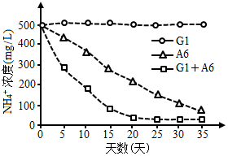
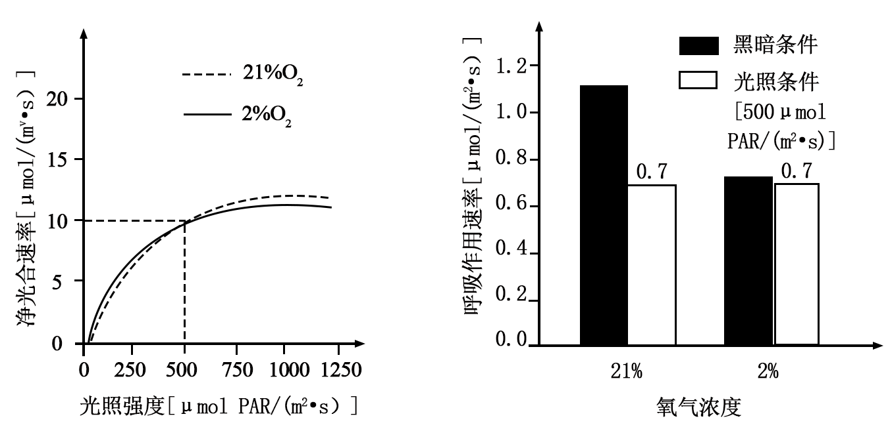

**机密★启用前**

**2025年天津市普通高中学业水平等级性考试**

**生物学**

**本试卷分为第Ⅰ卷（选择题）和第Ⅱ卷（非选择题）两部分，共100分。考试用时60分钟。第Ⅰ卷1至4页，第Ⅱ卷5至8页，共100分。**

**答卷前，考生务必将自己的姓名、准考号填写在答题卡上，并在规定位置粘贴考试用条形码。答卷时，考生务必将答案涂写在答题卡上，答在试卷上的无效。考试结束后，将本试卷和答题卡一并交回。**

**祝各位考生考试顺利！**

**第Ⅰ卷**

**注意事项：**

**1．每题选出答案后，用铅笔将答题卡上对应题目的答案标号涂黑。如需改动，用橡皮擦干净后，再选涂其他答案标号。**

**2．本卷共12题，每题4分，共48分。在每题列出的四个选项中，只有一项是最符合题目要求的。**

1\. 无机电解质在水溶液中能够电离成自由移动的离子，在动物体内可（ ）

A. 分解产生能量 B. 维持酸碱平衡

C. 缩合形成多肽 D. 携带遗传信息

2\. 果蝇（2n=8）的精原细胞减数分裂过程中，染色体或DNA数量不可能发生的变化是（ ）

A. 染色体：16→8 B. DNA：16→8

C. 染色体：8→4 D. DNA：8→4

3\. 治疗癌症的某脂溶性小分子药物进入细胞后经信号传导，激活癌细胞内促凋亡基因的表达，进而发挥治疗作用。试验表明，该药物对某些病人疗效较差，原因不可能是（ ）

A. 药物进入细胞的方式改变 B. 药物在细胞内降解较快

C. 结合药物的胞内受体活性较低 D. 促凋亡基因的表达水平较低

4\. 关于细胞膜组成与功能的探究，推论正确的是（ ）

A. 细胞膜与双缩脲试剂反应呈紫色，表明细胞膜含有糖类

B. 同位素标记的固醇类物质可以穿过细胞膜，表明细胞膜含有胆固醇

C. 细胞膜上聚集的荧光标记蛋白能均匀分散开，表明细胞膜具有信息传递功能

D. 植物细胞能发生质壁分离和复原，表明细胞膜具有选择透过性

5\. 青霉素可采取液体发酵方式以青霉菌（一种需氧、多细胞丝状真菌）为生产菌株进行生产，过程中操作不当的是（ ）

A. 用诱变或基因工程等途径得到的菌种进行接种 B. 监控pH、温度、溶解氧等参数

C. 用血细胞计数板实时监测活菌数量 D. 用大肠杆菌为指示菌监测青霉素产量

6\. 老师检查同学们的生物实验报告时，发现其中有误的是（ ）

A. 电泳分离DNA片段时，需用缓冲液配制琼脂糖凝胶

B. 检测酵母是否产生酒精时，需向培养液滤液中加入酸性重铬酸钾

C. 提取和分离菠菜叶中的色素时，用层析液进行提取，用无水乙醇进行分离

D. 为维持有丝分裂样品最佳观察状态，需在分裂旺盛时剪取根尖，用卡诺氏液固定

7\. 为探究高NH4+含量废水的生物处理效果，配制NH4+为唯一氮源的人工模拟废水，均分至3个密闭反应器中，分别添加等量的G1菌、A6菌及两菌等比例混合的菌液，培养后NH4+浓度变化如图所示。分析错误的是（ ）

A. 人工模拟废水需进行灭菌处理

B. G1菌单独培养时，种群数量不增加

C. A6菌单独培养时，NH4+的去除速率持续降低

D. 两菌混合培养可促进NH4+的去除

8\. T1蛋白和生长素在植物组织水平上的分布高度重合。T1基因突变后细胞内的脂类会发生改变，且生长素载体蛋白从高尔基体到细胞膜的运输异常。描述错误的是（ ）

A. T1蛋白主要表达在胚芽鞘、茎尖和根尖的分生区等部位

B. T1突变影响了核糖体、高尔基体的组成和功能

C. T1突变体内的生长素极性运输异常

D. T1突变体幼苗的根变短

9\. 对高寒草原牧场长期围封（禁牧）前后的植物群落进行调查，结果如下表：

<table style="width:41%;">
<colgroup>
<col style="width: 7%" />
<col style="width: 15%" />
<col style="width: 9%" />
<col style="width: 9%" />
</colgroup>
<tbody>
<tr>
<td rowspan="2" style="text-align: left;"></td>
<td rowspan="2" style="text-align: left;">物种</td>
<td colspan="2" style="text-align: left;">相对数量（%）</td>
</tr>
<tr>
<td style="text-align: left;">围封前</td>
<td style="text-align: left;">围封后</td>
</tr>
<tr>
<td rowspan="4" style="text-align: left;">牧草</td>
<td style="text-align: left;">紫花针茅</td>
<td style="text-align: left;">10.6</td>
<td style="text-align: left;">10.6</td>
</tr>
<tr>
<td style="text-align: left;">草地早熟禾</td>
<td style="text-align: left;">76</td>
<td style="text-align: left;">8.2</td>
</tr>
<tr>
<td style="text-align: left;">赖草</td>
<td style="text-align: left;">7.1</td>
<td style="text-align: left;">47.1</td>
</tr>
<tr>
<td style="text-align: left;">其他非优势种</td>
<td style="text-align: left;">29.7</td>
<td style="text-align: left;">198</td>
</tr>
<tr>
<td rowspan="4" style="text-align: left;">杂草</td>
<td style="text-align: left;">马蔺</td>
<td style="text-align: left;">4.6</td>
<td style="text-align: left;">0.0</td>
</tr>
<tr>
<td style="text-align: left;">阿尔泰狗娃花</td>
<td style="text-align: left;">4.5</td>
<td style="text-align: left;">3.3</td>
</tr>
<tr>
<td style="text-align: left;">三辐柴胡</td>
<td style="text-align: left;">3.2</td>
<td style="text-align: left;">0.9</td>
</tr>
<tr>
<td style="text-align: left;">其他非优势种</td>
<td style="text-align: left;">32.7</td>
<td style="text-align: left;">10.1</td>
</tr>
</tbody>
</table>

对于围封前后的变化，说法错误的是（ ）

A. 紫花针茅的生态位未发生改变

B. 群落中赖草逐渐占据优势

C. 影响群落结构的主要因素由捕食变为种间竞争

D. 草原牧场功能得到恢复，体现生态系统具有恢复力稳定性

阅读下列材料，完成下面小题。

近年，我国科研人员发现了一种调节血糖的新激素——肠促生存素。它在禁食条件下由肠道分泌，可与胰岛A细胞上的受体R1结合，激活该细胞内质网的钙通道并释放钙，从而促进胰高血糖素分泌。

在许多Ⅱ型糖尿病患者体内，血液中的肠促生存素异常增高。肠促生存素可以在高血糖时仍促进胰高血糖素分泌，加重糖尿病病情。虽然这些患者口服葡萄糖可以抑制胰高血糖素分泌，但静脉注射葡萄糖却不能抑制。

在某些Ⅱ型糖尿病患者中，发现一种罕见变异，其R1基因编码序列事务第193位碱基由C变成T，导致R1蛋白的翻译提前终止，从而使其不能与肠促生存素结合，显著降低胰高血糖素的分泌水平。

10\. 关于肠促生存素对血糖的调节，分析错误的是（ ）

A. 空腹可激活胰岛A细胞 B. 肠促生存素可促进肝脏生成葡萄糖

C. 抑制受体R1可导致血糖升高 D. 肠促生存素对血糖的调节属于体液调节

11\. R1基因的罕见变异可引起（ ）

A. R1基因的甲基化水平升高 B. R1基因转录的mRNA变短

C. R1蛋白前体的前64个氨基酸序列改变 D. R1蛋白的空间构象改变

12\. 关于肠促生存素信号通路与Ⅱ型糖尿病的关系，分析合理的是（ ）

A. 胰岛A细胞内质网钙通道的活化能力下降，可成为Ⅱ型糖尿病的病因

B. 肠促生存素增高的Ⅱ型糖尿病患者，口服葡萄糖可以抑制肠促生存素分泌

C. 肠促生存素事务·功能类似物可作为治疗Ⅱ型糖尿病的候选药物

D. R1基因的罕见变异，不利于Ⅱ型糖尿病患者血糖水平降低

**第Ⅱ卷**

**注意事项：**

**1．用黑色墨水的钢笔或签字笔将答案填写在答题卡上。**

**2．本卷共5题，共52分。**

13\. 牡蛎具有强大的净水与碳沉积能力，可大量滤食水体中的浮游植物及碎屑等有机颗粒物，其中大部分未被利用而排出，有的沉积至底层、暂不进入物质循环，有的再次成为碎屑。为有效保护牡蛎礁生态系统，对某天然牡蛎礁的物质循环和能量流动进行研究。

（1）区别牡蛎礁群落与其他生物群落的重要特征是\_\_\_\_\_不同。采用样方法调查牡蛎礁的物种时，应做到\_\_\_\_\_取样。

（2）牡蛎是第\_\_\_\_\_营养级的主要组成物种。已知牡蛎流向捕食者的能量传递效率为0.5%，推测此生态系统中高营养级生物的数量较\_\_\_\_\_。

（3）下图是牡蛎参与的部分碳循环途径，请在图中补充另外两条碳元素进出牡蛎的路径\_\_\_\_\_。

（4）为提高此类牡蛎礁生态系统稳定性，恢复高营养级生物的数量，应先禁止捕捞高营养级生物，待种群数量恢复后再适度捕捞，使其维持在K/2处，理由是\_\_\_\_\_。

14\. 脊髓损伤是一种严重的中枢神经系统损伤，会进一步引发炎症等免疫反应，加剧神经功能的丧失。为探究程序性细胞死亡配体（P蛋白）及其抗体（P抗体）通过调节免疫反应在脊髓损伤中的作用，进行如下实验。

（1）脊髓是\_\_\_\_\_与躯干、内脏之间的联系通路。用小鼠建立脊髓损伤模型，实验分组及操作见下表（“+”表示施加，“-”表示不施加），请补充空白处的操作。

<table style="width:86%;">
<colgroup>
<col style="width: 18%" />
<col style="width: 19%" />
<col style="width: 17%" />
<col style="width: 14%" />
<col style="width: 14%" />
</colgroup>
<tbody>
<tr>
<td style="text-align: left;">
组别

实施操作
</td>
<td style="text-align: left;">基本手术操作</td>
<td style="text-align: left;">挫伤脊髓</td>
<td style="text-align: left;">P蛋白</td>
<td style="text-align: left;">P抗体</td>
</tr>
<tr>
<td style="text-align: left;">假手术组</td>
<td style="text-align: left;">+</td>
<td style="text-align: left;">-</td>
<td style="text-align: left;">-</td>
<td style="text-align: left;">-</td>
</tr>
<tr>
<td style="text-align: left;">脊髓损伤组</td>
<td style="text-align: left;">+</td>
<td style="text-align: left;">+</td>
<td style="text-align: left;">-</td>
<td style="text-align: left;">-</td>
</tr>
<tr>
<td style="text-align: left;">P蛋白组</td>
<td style="text-align: left;">+</td>
<td style="text-align: left;">_____</td>
<td style="text-align: left;">+</td>
<td style="text-align: left;">-</td>
</tr>
<tr>
<td style="text-align: left;">P抗体组</td>
<td style="text-align: left;">+</td>
<td style="text-align: left;">_____</td>
<td style="text-align: left;">-</td>
<td style="text-align: left;">+</td>
</tr>
</tbody>
</table>

其中，P抗体组以\_\_\_\_\_组为对照，能检测P抗体对脊髓损伤的作用。

（2）处理一段时间后，检测各组脊髓处辅助性T细胞（Th细胞）不同亚群的水平，见右图。其中，Th1细胞可活化巨噬细胞和细胞毒性T细胞，Th2细胞可诱导B细胞增殖、分化并分泌抗体。与假手术组相比，脊髓损伤组的\_\_\_\_\_免疫会增强，\_\_\_\_\_免疫会减弱。已知Th1细胞为促炎性T细胞，Th2细胞为抗炎性T细胞。与脊髓损伤组相比，P蛋白组炎症水平\_\_\_\_\_，说明P蛋白具有\_\_\_\_\_作用。

15\. 为研究低氧条件下光合作用与呼吸作用的关系，采集某植物叶片，将叶柄浸入后，放于氧气置换为的密闭装置中，浓度设正常（21%）和低氧（2%）两个水平，测定短时间内、不同光照条件下的净光合速率和呼吸作用速率。其中，净光合速率=光合作用速率-呼吸作用速率。结果如下：

（1）光照条件下，密闭装置中逐渐减少，而逐渐增加，此时呼吸作用消耗的氧气来源于\_\_\_\_\_和\_\_\_\_\_。设最初密闭装置中的量为，120秒后测得的量为，的量为，叶片面积为，则净光合速率为\_\_\_\_\_。

（2）低氧下，光照强度下，叶片光合作用速率为\_\_\_\_\_。

（3）低氧在\_\_\_\_\_（光照、黑暗、光照和黑暗）条件下构成呼吸作用的限制因素。

（4）在两种氧浓度下，将叶片置于光照（强度为）、黑暗各1小时后，测定叶片中的糖含量。请推测低氧对叶片糖积累是否有利，并给出相应理由：\_\_\_\_\_。

16\. 内共生假说认为，线粒体起源于在厌氧真核细胞中共生的需氧细菌。研究人员将经过改造的大肠杆菌导入相应的专性厌氧酵母细胞质中构建共生体，为上述假说提供证据。

（1）获得专性厌氧呼吸的酵母菌株利用基因敲除技术破坏酵母菌\_\_\_\_\_的功能，导致该细胞器不能产生ATP。

（2）获得维生素营养缺陷且能分泌ATP的大肠杆菌菌株

①利用基因敲除技术获得维生素营养缺陷型大肠杆菌菌株A。

②构建含有ATP转运蛋白基因X的质粒2。

已知在基因X和质粒1上均无EcoRⅠ和NotⅠ酶切位点。研究者采用引物P1（含EcoRⅠ识别序列）和P2（含NotⅠ识别序列）对基因X进行扩增，并采用引物P3（含EcoRⅠ识别序列）和P4（含NotⅠ识别序列）对质粒1进行扩增，使质粒1线性化，再经酶切、连接，使基因X与质粒1重组为质粒2．请在下图质粒1处标出引物P3和P4的位置及方向\_\_\_\_\_。

③将质粒2转入菌株A中，筛选获得菌株B。

（3）采用下图所示过程将菌株B导入步骤（1）获得的酵母菌中，筛选获得融合菌株

促进膜融合的化学试剂通常选择\_\_\_\_\_。大肠杆菌细胞壁为双层结构，内层为坚固的肽聚糖，外层为脂质双分子层膜结构。融合细胞中的大肠杆菌形态正常且具有活性，说明与酵母细胞膜融合的是菌株B的\_\_\_\_\_。

在以丙酮酸为唯一碳源的选择培养基上筛选到能够增殖的融合菌株，其中酵母菌为大肠杆菌提供\_\_\_\_\_，大肠杆菌为酵母菌提供\_\_\_\_\_，表明二者建立了互利共生关系。在筛选融合菌株时，不能用葡萄糖为碳源，原因是：\_\_\_\_\_。

17\. 二倍体番茄浆果中的小分子化合物H对食用者有益。H是由前体物甲经酶A催化成乙，乙经酶B催化成丙，丙再经酶C催化而成。浆果积累这些化合物，仅影响自身籽粒数及食用者健康，对应关系如下表：

|       |     |     |     |     |
|:----- |:--- |:--- |:--- |:--- |
| 累积物   | 甲   | 乙   | 丙   | H   |
| 食用者健康 | 无影响 | 有害  | 有害  | 有益  |
| 浆果籽粒数 | 多   | 无   | 少   | 多   |

表达酶A、B和C的基因分别为A、B和C，位于非同源染色体上。为获取浆果含H的纯合番茄植株（不考虑突变与染色体互换），开展以下研究。

（1）浆果含H的纯合番茄植株的基因型为\_\_\_\_\_。

（2）基因型AaBbCc植株自交，中浆果籽粒数有\_\_\_\_\_种表型，有籽浆果植株占\_\_\_\_\_。为获得理想番茄植株，须遴选浆果籽粒数\_\_\_\_\_的，具有该性状的自交，后代不出现性状分离的基因型有\_\_\_\_\_种（类群M）。随后，再遴选浆果含H且该性状不分离的植株。

（3）除直接测量浆果H含量外，还可分别提取类群M各自交子代浆果的蛋白质来筛选目标植株，其方法是：用\_\_\_\_\_抗体对提取的蛋白质进行特异性识别，阳性率为\_\_\_\_\_%的子代即为目标品系。
