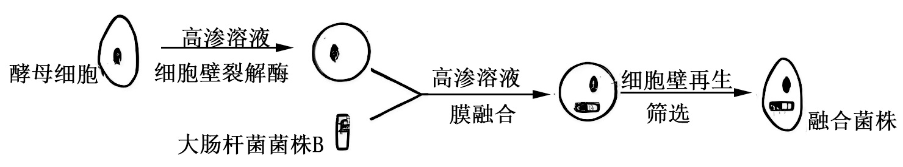
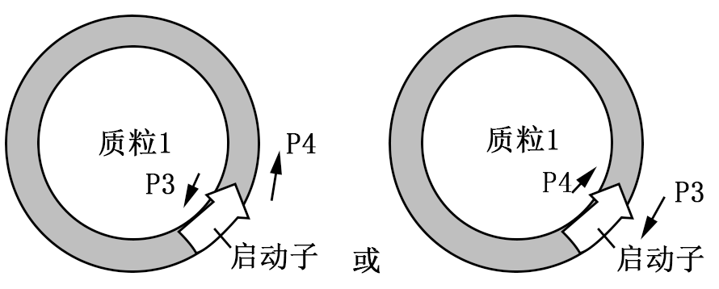

**机密★启用前**

**2025年天津市普通高中学业水平等级性考试**

**生物学**

**本试卷分为第Ⅰ卷（选择题）和第Ⅱ卷（非选择题）两部分，共100分。考试用时60分钟。第Ⅰ卷1至4页，第Ⅱ卷5至8页，共100分。**

**答卷前，考生务必将自己的姓名、准考号填写在答题卡上，并在规定位置粘贴考试用条形码。答卷时，考生务必将答案涂写在答题卡上，答在试卷上的无效。考试结束后，将本试卷和答题卡一并交回。**

**祝各位考生考试顺利！**

**第Ⅰ卷**

**注意事项：**

**1．每题选出答案后，用铅笔将答题卡上对应题目的答案标号涂黑。如需改动，用橡皮擦干净后，再选涂其他答案标号。**

**2．本卷共12题，每题4分，共48分。在每题列出的四个选项中，只有一项是最符合题目要求的。**

1\. 无机电解质在水溶液中能够电离成自由移动的离子，在动物体内可（ ）

A. 分解产生能量 B. 维持酸碱平衡

C. 缩合形成多肽 D. 携带遗传信息

【答案】B

【解析】

【详解】A、无机电解质一般不能分解产生能量，能为动物体提供能量的主要是糖类、脂肪等有机物，A错误；

B、无机电解质中的一些离子，如HCO3-、HPO42-等，在动物体内可以参与酸碱平衡的调节，维持机体的酸碱平衡，B正确；

C、缩合形成多肽的是氨基酸，氨基酸属于有机物，不是无机电解质，C错误；

D、携带遗传信息的是核酸（DNA、RNA），核酸属于有机物，不是无机电解质，D错误。

故选B。

2\. 果蝇（2n=8）的精原细胞减数分裂过程中，染色体或DNA数量不可能发生的变化是（ ）

A. 染色体：16→8 B. DNA：16→8

C. 染色体：8→4 D. DNA：8→4

【答案】A

【解析】

【详解】A、果蝇体细胞染色体数为8条，精原细胞染色体数也为8条，在减数分裂过程中，染色体数目最多为8条（减数第一次分裂前的间期、减数第一次分裂过程中），不可能出现16→8的变化，A错误；

B、精原细胞DNA为8个，经过间期复制后DNA变为16个，减数第一次分裂结束后DNA变为8个，即DNA数量可以发生16→8的变化，B正确；

C、精原细胞染色体数为8条，减数第一次分裂结束后，染色体数目减半为4条，即染色体数量可以发生8→4的变化，C正确；

D、精原细胞DNA为8个，经过间期复制后DNA变为16个，减数第一次分裂结束后DNA变为8个，减数第二次分裂结束后DNA变为4个，即DNA数量可以发生8→4的变化，D正确。

故选A。

3\. 治疗癌症的某脂溶性小分子药物进入细胞后经信号传导，激活癌细胞内促凋亡基因的表达，进而发挥治疗作用。试验表明，该药物对某些病人疗效较差，原因不可能是（ ）

A. 药物进入细胞的方式改变 B. 药物在细胞内降解较快

C. 结合药物的胞内受体活性较低 D. 促凋亡基因的表达水平较低

【答案】A

【解析】

【详解】A、该药物是脂溶性小分子，通常以自由扩散方式进入细胞，这种运输方式是由物质性质和细胞膜结构决定的，一般不会改变。若药物进入细胞的方式改变，不符合其脂溶性小分子的特性，所以这不是药物对某些病人疗效较差的原因，A错误；

B、药物在细胞内降解较快，会使细胞内有效药物浓度降低，从而导致疗效较差，B正确；

C、结合药物的胞内受体活性较低，药物难以有效发挥作用，激活促凋亡基因的效果就会减弱，进而使疗效较差，C正确；

D、促凋亡基因的表达水平较低，即使药物能正常发挥作用，促凋亡的效果也会不好，导致疗效较差，D正确。

故选A

4\. 关于细胞膜组成与功能的探究，推论正确的是（ ）

A. 细胞膜与双缩脲试剂反应呈紫色，表明细胞膜含有糖类

B. 同位素标记的固醇类物质可以穿过细胞膜，表明细胞膜含有胆固醇

C. 细胞膜上聚集的荧光标记蛋白能均匀分散开，表明细胞膜具有信息传递功能

D. 植物细胞能发生质壁分离和复原，表明细胞膜具有选择透过性

【答案】D

【解析】

【详解】A、双缩脲试剂与蛋白质反应呈紫色，若细胞膜与双缩脲试剂反应呈紫色，表明细胞膜含有蛋白质，而非糖类，A错误；

B、固醇类物质能穿过细胞膜，是因为细胞膜的基本支架是磷脂双分子层，根据“相似相容”原理，固醇类（脂质）易通过，不能据此表明细胞膜含有胆固醇，B错误；

C、荧光标记蛋白均匀分散体现细胞膜的流动性（结构特点），与信息传递功能无关，C错误；

D、植物细胞能发生质壁分离和复原，是因为细胞膜允许水分子自由通过，而对蔗糖等物质的通过具有选择性，这表明细胞膜具有选择透过性（功能特性），D正确。

故选D。

5\. 青霉素可采取液体发酵方式以青霉菌（一种需氧、多细胞丝状真菌）为生产菌株进行生产，过程中操作不当的是（ ）

A. 用诱变或基因工程等途径得到的菌种进行接种 B. 监控pH、温度、溶解氧等参数

C. 用血细胞计数板实时监测活菌数量 D. 用大肠杆菌为指示菌监测青霉素产量

【答案】C

【解析】

【详解】A、诱变或基因工程等途径可改造青霉菌菌株，获得高产等优良菌种，用于接种发酵生产青霉素，操作恰当，A正确；

B、发酵过程中，pH、温度、溶解氧等参数会影响青霉菌的生长和代谢，监控这些参数是必要的，操作恰当，B正确；

C、血细胞计数板无法区分死菌与活菌，且青霉菌为多细胞丝状结构，难以分散计数，实时监测活菌数不准确，操作不当，C错误；

D、大肠杆菌对青霉素敏感，可用大肠杆菌为指示菌，通过观察大肠杆菌的生长情况来监测青霉素产量，操作恰当，D正确。

故选C。

6\. 老师检查同学们的生物实验报告时，发现其中有误的是（ ）

A. 电泳分离DNA片段时，需用缓冲液配制琼脂糖凝胶

B. 检测酵母是否产生酒精时，需向培养液滤液中加入酸性重铬酸钾

C. 提取和分离菠菜叶中的色素时，用层析液进行提取，用无水乙醇进行分离

D. 为维持有丝分裂样品最佳观察状态，需在分裂旺盛时剪取根尖，用卡诺氏液固定

【答案】C

【解析】

【详解】A、电泳分离 DNA 片段时，缓冲液可维持电泳环境的 pH 稳定，保证 DNA 片段正常分离，需用缓冲液配制琼脂糖凝胶，A正确；

B、酸性重铬酸钾与酒精反应会由橙色变为灰绿色，检测酵母是否产生酒精时，需向抽取的培养液滤液中加入酸性重铬酸钾，B正确；

C、提取菠菜叶中的色素时用无水乙醇，分离色素时用层析液，C错误；

D、有丝分裂旺盛的根尖细胞便于观察有丝分裂过程，卡诺氏液可固定细胞形态，为维持有丝分裂样品最佳观察状态，需在分裂旺盛时剪取根尖，用卡诺氏液固定，D正确。

故选C。

7\. 为探究高NH4+含量废水的生物处理效果，配制NH4+为唯一氮源的人工模拟废水，均分至3个密闭反应器中，分别添加等量的G1菌、A6菌及两菌等比例混合的菌液，培养后NH4+浓度变化如图所示。分析错误的是（ ）

A. 人工模拟废水需进行灭菌处理

B. G1菌单独培养时，种群数量不增加

C. A6菌单独培养时，NH4+的去除速率持续降低

D. 两菌混合培养可促进NH4+的去除

【答案】C

【解析】

【详解】A、人工模拟废水需灭菌以避免杂菌干扰实验结果，确保实验变量唯一，A正确；

B、G1菌单独培养时，NH₄⁺浓度变化小，说明其无法有效利用NH₄⁺增殖，种群数量未显著增加，B正确；

C、A6菌单独培养时，NH₄⁺浓度持续下降，但去除速率受菌群生长阶段影响：初期菌群对数增长，速率可能加快；后期因底物减少或代谢产物积累，速率降低。因此去除速率并非“持续降低”，C错误；

D、混合培养时NH₄⁺去除效果优于单独培养，表明两菌可能存在协同作用，D正确；

故选C。

8\. T1蛋白和生长素在植物组织水平上的分布高度重合。T1基因突变后细胞内的脂类会发生改变，且生长素载体蛋白从高尔基体到细胞膜的运输异常。描述错误的是（ ）

A. T1蛋白主要表达在胚芽鞘、茎尖和根尖的分生区等部位

B. T1突变影响了核糖体、高尔基体的组成和功能

C. T1突变体内的生长素极性运输异常

D. T1突变体幼苗的根变短

【答案】B

【解析】

【详解】A、因为T1蛋白和生长素在植物组织水平上的分布高度重合，而胚芽鞘、茎尖和根尖的分生区等部位是生长素集中且细胞分裂旺盛的区域，所以推测T1蛋白主要表达在这些部位，A正确；

B、题干中提到T1基因突变后细胞内的脂类会发生改变，且生长素载体蛋白从高尔基体到细胞膜的运输异常。但并没有信息表明T1突变影响了核糖体的组成和功能，B错误；

C、由于生长素载体蛋白从高尔基体到细胞膜的运输异常，而生长素的极性运输需要载体蛋白，所以T1突变体内的生长素极性运输会异常，C正确；

D、生长素对根的生长有调节作用，T1突变导致生长素极性运输异常，会影响根的生长，使T1突变体幼苗的根变短，D正确。

故选B。

9\. 对高寒草原牧场长期围封（禁牧）前后的植物群落进行调查，结果如下表：

<table style="width:41%;">
<colgroup>
<col style="width: 7%" />
<col style="width: 15%" />
<col style="width: 9%" />
<col style="width: 9%" />
</colgroup>
<tbody>
<tr>
<td rowspan="2" style="text-align: left;"></td>
<td rowspan="2" style="text-align: left;">物种</td>
<td colspan="2" style="text-align: left;">相对数量（%）</td>
</tr>
<tr>
<td style="text-align: left;">围封前</td>
<td style="text-align: left;">围封后</td>
</tr>
<tr>
<td rowspan="4" style="text-align: left;">牧草</td>
<td style="text-align: left;">紫花针茅</td>
<td style="text-align: left;">10.6</td>
<td style="text-align: left;">10.6</td>
</tr>
<tr>
<td style="text-align: left;">草地早熟禾</td>
<td style="text-align: left;">7.6</td>
<td style="text-align: left;">8.2</td>
</tr>
<tr>
<td style="text-align: left;">赖草</td>
<td style="text-align: left;">7.1</td>
<td style="text-align: left;">47.1</td>
</tr>
<tr>
<td style="text-align: left;">其他非优势种</td>
<td style="text-align: left;">29.7</td>
<td style="text-align: left;">19.8</td>
</tr>
<tr>
<td rowspan="4" style="text-align: left;">杂草</td>
<td style="text-align: left;">马蔺</td>
<td style="text-align: left;">4.6</td>
<td style="text-align: left;">0.0</td>
</tr>
<tr>
<td style="text-align: left;">阿尔泰狗娃花</td>
<td style="text-align: left;">4.5</td>
<td style="text-align: left;">3.3</td>
</tr>
<tr>
<td style="text-align: left;">三辐柴胡</td>
<td style="text-align: left;">3.2</td>
<td style="text-align: left;">0.9</td>
</tr>
<tr>
<td style="text-align: left;">其他非优势种</td>
<td style="text-align: left;">32.7</td>
<td style="text-align: left;">10.1</td>
</tr>
</tbody>
</table>

对于围封前后的变化，说法错误的是（ ）

A. 紫花针茅的生态位未发生改变

B. 群落中赖草逐渐占据优势

C. 影响群落结构的主要因素由捕食变为种间竞争

D. 草原牧场功能得到恢复，体现生态系统具有恢复力稳定性

【答案】A

【解析】

【详解】A、紫花针茅的相对数量未变，但围封后牲畜啃食消失，其生长环境和资源竞争可能改变，导致生态位变化，A错误；

B、赖草相对数量从7.1%增至47.1%，成为优势种，B正确；

C、围封前有放牧（捕食压力），围封后放牧消失，物种间的种间竞争成为影响群落结构的主要因素，C正确；

D、围封后草原牧场的物种组成向更优方向发展，功能得到恢复，体现了生态系统的恢复力稳定性，D正确。

故选A。

阅读下列材料，完成下面小题。

近年，我国科研人员发现了一种调节血糖的新激素——肠促生存素。它在禁食条件下由肠道分泌，可与胰岛A细胞上的受体R1结合，激活该细胞内质网的钙通道并释放钙，从而促进胰高血糖素分泌。

在许多Ⅱ型糖尿病患者体内，血液中的肠促生存素异常增高。肠促生存素可以在高血糖时仍促进胰高血糖素分泌，加重糖尿病病情。虽然这些患者口服葡萄糖可以抑制胰高血糖素分泌，但静脉注射葡萄糖却不能抑制。

在某些Ⅱ型糖尿病患者中，发现一种罕见变异，其R1基因编码序列的第193位碱基由C变成T，导致R1蛋白的翻译提前终止，从而使其不能与肠促生存素结合，显著降低胰高血糖素的分泌水平。

10\. 关于肠促生存素对血糖的调节，分析错误的是（ ）

A. 空腹可激活胰岛A细胞 B. 肠促生存素可促进肝脏生成葡萄糖

C. 抑制受体R1可导致血糖升高 D. 肠促生存素对血糖的调节属于体液调节

11\. R1基因的罕见变异可引起（ ）

A. R1基因的甲基化水平升高 B. R1基因转录的mRNA变短

C. R1蛋白前体的前64个氨基酸序列改变 D. R1蛋白的空间构象改变

12\. 关于肠促生存素信号通路与Ⅱ型糖尿病的关系，分析合理的是（ ）

A. 胰岛A细胞内质网钙通道的活化能力下降，可成为Ⅱ型糖尿病的病因

B. 肠促生存素增高的Ⅱ型糖尿病患者，口服葡萄糖可以抑制肠促生存素分泌

C. 肠促生存素的功能类似物可作为治疗Ⅱ型糖尿病的候选药物

D. R1基因的罕见变异，不利于Ⅱ型糖尿病患者血糖水平降低

【答案】10. C 11. D 12. B

【解析】

【10题详解】

A、禁食（空腹）时，肠促生存素分泌增加，激活胰岛A细胞，A正确；

B、肠促生存素促进胰高血糖素分泌，胰高血糖素可促使肝糖原分解为葡萄糖，B正确；

C、抑制受体R1会阻断肠促生存素的作用，减少胰高血糖素分泌，导致血糖降低，C错误；

D、肠促生存素通过体液运输调节血糖，属于体液调节，D正确。

故选C。

【11题详解】

A、碱基替换属于基因突变，与甲基化无关，A错误；

B、基因突变导致翻译提前终止，但mRNA的转录长度由DNA决定，未缩短，B错误；

C、第193位碱基突变可能影响第65个密码子，前64个氨基酸未改变，C错误；

D、翻译提前终止导致R1蛋白结构不完整，空间构象改变，无法结合肠促生存素，D正确。

故选D。

【12题详解】

A、内质网钙通道活化能力下降会减少胰高血糖素分泌，缓解高血糖，A错误；

B、由题干信息可知，这些患者口服葡萄糖可以抑制胰高血糖素分泌，而肠促生存素促进胰高血糖素分泌，推测口服葡萄糖可以抑制肠促生存素分泌，B正确；

C、肠促生存素类似物会加重胰高血糖素分泌，恶化糖尿病，C错误；

D、R1基因罕见变异使R1蛋白不能与肠促生存素结合，胰高血糖素分泌减少，有利于Ⅱ型糖尿病患者血糖水平降低，D错误。

故选B。

**第Ⅱ卷**

**注意事项：**

**1．用黑色墨水的钢笔或签字笔将答案填写在答题卡上。**

**2．本卷共5题，共52分。**

13\. 牡蛎具有强大的净水与碳沉积能力，可大量滤食水体中的浮游植物及碎屑等有机颗粒物，其中大部分未被利用而排出，有的沉积至底层、暂不进入物质循环，有的再次成为碎屑。为有效保护牡蛎礁生态系统，对某天然牡蛎礁的物质循环和能量流动进行研究。

（1）区别牡蛎礁群落与其他生物群落的重要特征是\_\_\_\_\_不同。采用样方法调查牡蛎礁的物种时，应做到\_\_\_\_\_取样。

（2）牡蛎是第\_\_\_\_\_营养级的主要组成物种。已知牡蛎流向捕食者的能量传递效率为0.5%，推测此生态系统中高营养级生物的数量较\_\_\_\_\_。

（3）下图是牡蛎参与的部分碳循环途径，请在图中补充另外两条碳元素进出牡蛎的路径\_\_\_\_\_。

（4）为提高此类牡蛎礁生态系统稳定性，恢复高营养级生物的数量，应先禁止捕捞高营养级生物，待种群数量恢复后再适度捕捞，使其维持在K/2处，理由是\_\_\_\_\_。

【答案】（1） ①. 物种组成 ②. 随机

（2） ①. 二 ②. 少

（3） （4）种群增长速率最快，有利于持续获得较大捕捞量

【解析】

【分析】在相同时间聚集在一定地域中各种生物种群的集合，叫作生物群落，简称群落，要认识一个群落，首先要分析该群落的物种组成。物种组成是区别不同群落的重要特征，也是决定群落性质最重要的因素。

【小问1详解】

群落的物种组成是区别不同群落的重要特征，所以区别牡蛎礁群落与其他生物群落的重要特征是群落的物种组成不同。采用样方法调查种群密度时，为了使结果更准确，应做到随机取样。

【小问2详解】

牡蛎可大量滤食水体中的浮游植物及碎屑等有机颗粒物，浮游植物属于第一营养级，牡蛎滤食浮游植物，属于第二营养级的主要组成物种。已知牡蛎流向捕食者的能量传递效率为0.5%，由于能量流动具有逐级递减的特点，传递效率低，所以此生态系统中高营养级生物获得的能量少，数量较少。

【小问3详解】

碳元素进出牡蛎的路径，除了图中所示，还应该有：牡蛎被捕食者捕食，从而使碳进入下一营养级，即流入次级消费者，牡蛎还可大量滤食水体中的碎屑等有机颗粒物，从而使碎屑等有机颗粒物中的碳元素进入牡蛎体内，所以另外两条碳元素进出牡蛎的路径如图。

【小问4详解】

在K/2处，种群增长速率最快，此时适度捕捞，既能使种群保持较大的增长速率，快速恢复种群数量，又能获得较多的捕捞量，所以为提高此类牡蛎礁生态系统稳定性，恢复高营养级生物的数量，应先禁止捕捞高营养级生物，待种群数量恢复后再适度捕捞，使其维持在K/2处，理由是K/2时种群增长速率最快，有利于持续获得较大捕捞量。

14\. 脊髓损伤是一种严重的中枢神经系统损伤，会进一步引发炎症等免疫反应，加剧神经功能的丧失。为探究程序性细胞死亡配体（P蛋白）及其抗体（P抗体）通过调节免疫反应在脊髓损伤中的作用，进行如下实验。

（1）脊髓是\_\_\_\_\_与躯干、内脏之间的联系通路。用小鼠建立脊髓损伤模型，实验分组及操作见下表（“+”表示施加，“-”表示不施加），请补充空白处的操作。

<table style="width:86%;">
<colgroup>
<col style="width: 18%" />
<col style="width: 19%" />
<col style="width: 17%" />
<col style="width: 14%" />
<col style="width: 14%" />
</colgroup>
<tbody>
<tr>
<td style="text-align: left;">
组别

实施操作
</td>
<td style="text-align: left;">基本手术操作</td>
<td style="text-align: left;">挫伤脊髓</td>
<td style="text-align: left;">P蛋白</td>
<td style="text-align: left;">P抗体</td>
</tr>
<tr>
<td style="text-align: left;">假手术组</td>
<td style="text-align: left;">+</td>
<td style="text-align: left;">-</td>
<td style="text-align: left;">-</td>
<td style="text-align: left;">-</td>
</tr>
<tr>
<td style="text-align: left;">脊髓损伤组</td>
<td style="text-align: left;">+</td>
<td style="text-align: left;">+</td>
<td style="text-align: left;">-</td>
<td style="text-align: left;">-</td>
</tr>
<tr>
<td style="text-align: left;">P蛋白组</td>
<td style="text-align: left;">+</td>
<td style="text-align: left;">_____</td>
<td style="text-align: left;">+</td>
<td style="text-align: left;">-</td>
</tr>
<tr>
<td style="text-align: left;">P抗体组</td>
<td style="text-align: left;">+</td>
<td style="text-align: left;">_____</td>
<td style="text-align: left;">-</td>
<td style="text-align: left;">+</td>
</tr>
</tbody>
</table>

其中，P抗体组以\_\_\_\_\_组为对照，能检测P抗体对脊髓损伤的作用。

（2）处理一段时间后，检测各组脊髓处辅助性T细胞（Th细胞）不同亚群的水平，见右图。其中，Th1细胞可活化巨噬细胞和细胞毒性T细胞，Th2细胞可诱导B细胞增殖、分化并分泌抗体。与假手术组相比，脊髓损伤组的\_\_\_\_\_免疫会增强，\_\_\_\_\_免疫会减弱。已知Th1细胞为促炎性T细胞，Th2细胞为抗炎性T细胞。与脊髓损伤组相比，P蛋白组炎症水平\_\_\_\_\_，说明P蛋白具有\_\_\_\_\_作用。

【答案】（1） ①. 脑 ②. + ③. + ④. 脊髓损伤

（2） ①. 非特异性免疫和细胞 ②. 体液 ③. 降低 ④. 减少脊髓损伤后的炎症反应，促进组织修复

【解析】

【分析】在特异性免疫中，B细胞激活后可以产生抗体，由于抗体存在于体液中，所以这种主要靠抗体“作战”的方式称为体液免疫。一旦病原体进入细胞，抗体对它们就无能为力了，这就要靠T细胞直接接触靶细胞来“作战”，这种方式称为细胞免疫。

【小问1详解】

脊髓是脑与躯干、内脏之间的联系通路。为探究程序性细胞死亡配体（P蛋白）及其抗体（P抗体）通过调节免疫反应在脊髓损伤中的作用，自变量为脊髓是否损伤、是否施加某种治疗措施，可将实验分组为：

假手术组：不施加任何脊髓损伤的操作，作为正常小鼠的对照；

脊髓损伤组：施加脊髓损伤的操作，但不进行任何治疗干预，作为施加某种治疗的对照；

治疗组：即表中的P蛋白组和P抗体组，施加脊髓损伤的操作，并施加某种治疗措施。

综上分析，表中空白处都应施加“挫伤脊髓”的操作，即用“+”表示。其中，P抗体组以脊髓损伤组为对照，能检测P抗体对脊髓损伤的作用。

【小问2详解】

Th1细胞可活化巨噬细胞和细胞毒性T细胞，巨噬细胞可在非特异性免疫中发挥作用，细胞毒性T细胞在细胞免疫中可以识别并接触、裂解靶细胞。Th2细胞可诱导B细胞增殖、分化并分泌抗体，而B细胞增殖、分化并分泌抗体发生在体液免疫中。由图可知：与假手术组相比，脊髓损伤组的Th1细胞相对含量明显增多，而Th2细胞相对含量明显减少，说明脊髓损伤组的非特异性免疫和细胞免疫会增强，体液免疫会减弱。已知Th1细胞为促炎性T细胞，Th2细胞为抗炎性T细胞。与脊髓损伤组相比，P蛋白组的Th1细胞相对含量明显减少，而Th2细胞相对含量明显增多，因此P蛋白组炎症水平降低，说明P蛋白对免疫反应产生了调节作用，可能通过调节Th1和Th2细胞的比例，减少了脊髓损伤后的炎症反应，促进组织修复。

15\. 为研究低氧条件下光合作用与呼吸作用的关系，采集某植物叶片，将叶柄浸入后，放于氧气置换为的密闭装置中，浓度设正常（21%）和低氧（2%）两个水平，测定短时间内、不同光照条件下的净光合速率和呼吸作用速率。其中，净光合速率=光合作用速率-呼吸作用速率。结果如下：

（1）光照条件下，密闭装置中逐渐减少，而逐渐增加，此时呼吸作用消耗的氧气来源于\_\_\_\_\_和\_\_\_\_\_。设最初密闭装置中的量为，120秒后测得的量为，的量为，叶片面积为，则净光合速率为\_\_\_\_\_。

（2）低氧下，光照强度下，叶片光合作用速率为\_\_\_\_\_。

（3）低氧在\_\_\_\_\_（光照、黑暗、光照和黑暗）条件下构成呼吸作用的限制因素。

（4）在两种氧浓度下，将叶片置于光照（强度为）、黑暗各1小时后，测定叶片中的糖含量。请推测低氧对叶片糖积累是否有利，并给出相应理由：\_\_\_\_\_。

【答案】（1） ①. （或光合作用） ②. 光合作用（或） ③. 

（2）10.7 （3）黑暗

（4）有利，因为光照时两种氧浓度下净光合速率相同，但黑暗时低氧下呼吸作用速率更低

【解析】

【分析】影响光合作用的环境因素主要有光照强度、温度和二氧化碳浓度等。光合作用的色素主要吸收红光和蓝紫光。

【小问1详解】

光照条件下，植物同时进行光合作用和呼吸作用：叶柄浸入H218O，光合作用光反应会产生18O2。呼吸作用消耗的氧气有两个来源：① 18O2；② 光合作用。净光合速率是单位时间单位面积的氧气积累量：初始18O2为xμmol，120秒后18O2为yμmol，16O2为zμmol。总氧气积累量为(y+z−x)μmol（最终总氧气量y+z减去初始x）。时间为120秒，叶片面积为am2，因此净光合速率为(y+z-x)/(120×a)μmol/(m2⋅s)。

【小问2详解】

从左侧 “光照强度 - 净光合速率” 图可知，低氧（2% O2）条件下，500μmolPAR/(m2⋅s)时净光合速率为 10 μmol/(m2⋅s)。从右侧 “氧浓度 - 呼吸作用速率” 图可知，低氧（2% O2）黑暗条件下呼吸作用速率为 0.7 μmol/(m2⋅s)。光合作用速率 = 净光合速率 + 呼吸作用速率，因此光合作用速率为10+0.7=10.7μmol/(m2⋅s)。

【小问3详解】

光照条件下，21% 和 2% O2的呼吸作用速率几乎一致，说明低氧在光照下对呼吸无限制。黑暗条件下，21% O2的呼吸速率高于 2% O2，说明低氧在黑暗条件下限制了呼吸作用。

【小问4详解】

光照时，两种氧浓度下净光合速率相同（由左侧图可知，500μmolPAR/(m2⋅s)时净光合速率一致），说明光照下有机物积累量相同。黑暗时，低氧下呼吸作用速率更低（由右侧图可知，黑暗条件下低氧呼吸速率小于正常氧），说明黑暗下低氧消耗的有机物更少。综上，低氧对叶片糖积累有利，理由是：光照时两种氧浓度下净光合速率相同，但黑暗时低氧下呼吸作用速率更低，总有机物积累更多。

16\. 内共生假说认为，线粒体起源于在厌氧真核细胞中共生需氧细菌。研究人员将经过改造的大肠杆菌导入相应的专性厌氧酵母细胞质中构建共生体，为上述假说提供证据。

（1）获得专性厌氧呼吸的酵母菌株利用基因敲除技术破坏酵母菌\_\_\_\_\_的功能，导致该细胞器不能产生ATP。

（2）获得维生素营养缺陷且能分泌ATP的大肠杆菌菌株

①利用基因敲除技术获得维生素营养缺陷型大肠杆菌菌株A。

②构建含有ATP转运蛋白基因X的质粒2。

已知在基因X和质粒1上均无EcoRⅠ和NotⅠ酶切位点。研究者采用引物P1（含EcoRⅠ识别序列）和P2（含NotⅠ识别序列）对基因X进行扩增，并采用引物P3（含EcoRⅠ识别序列）和P4（含NotⅠ识别序列）对质粒1进行扩增，使质粒1线性化，再经酶切、连接，使基因X与质粒1重组为质粒2．请在下图质粒1处标出引物P3和P4的位置及方向\_\_\_\_\_。

③将质粒2转入菌株A中，筛选获得菌株B。

（3）采用下图所示过程将菌株B导入步骤（1）获得的酵母菌中，筛选获得融合菌株

促进膜融合的化学试剂通常选择\_\_\_\_\_。大肠杆菌细胞壁为双层结构，内层为坚固的肽聚糖，外层为脂质双分子层膜结构。融合细胞中的大肠杆菌形态正常且具有活性，说明与酵母细胞膜融合的是菌株B的\_\_\_\_\_。

在以丙酮酸为唯一碳源的选择培养基上筛选到能够增殖的融合菌株，其中酵母菌为大肠杆菌提供\_\_\_\_\_，大肠杆菌为酵母菌提供\_\_\_\_\_，表明二者建立了互利共生关系。在筛选融合菌株时，不能用葡萄糖为碳源，原因是：\_\_\_\_\_。

【答案】（1）线粒体 （2）

（3） ①. PEG（或聚乙二醇，或高Ca2+-高pH） ②. 细胞壁外层（或外层脂质双分子层膜） ③. 维生素B1 ④. ATP ⑤. 葡萄糖可在酵母细胞质中分解产生ATP，未与大肠杆菌融合的酵母也可存活

【解析】

【分析】PCR技术：

（1）概念：PCR全称为聚合酶链式反应，是一项在生物体外复制特定DNA的核酸合成技术。

（2）原理：DNA复制。

（3）前提条件：要有一段已知目的基因的核苷酸序列以便合成一对引物。

（4）条件：Mg2+、模板DNA、四种脱氧核苷酸、一对引物、热稳定DNA聚合酶（Taq酶）。

（5）过程：①高温变性：DNA解旋过程；②低温复性：引物结合到互补链DNA上；③中温延伸：合成子链。PCR扩增中双链DNA解开不需要解旋酶，高温条件下氢键可自动解开。

【小问1详解】

线粒体是有氧呼吸产生ATP的主要场所，要获得专性厌氧呼吸的酵母菌株，利用基因敲除技术破坏酵母菌线粒体的功能，就能导致该细胞器不能产生ATP。

【小问2详解】

要使质粒1线性化，且能与扩增后的基因X经酶切、连接重组为质粒2，引物P3和P4应分别位于质粒1的两端，且方向相反（因为PCR扩增时引物是从5’到3’方向延伸的，这样才能保证扩增出的线性化质粒两端分别带有EcoR Ⅰ和Not Ⅰ识别序列，与基因X两端的酶切位点匹配）。位置及方向如图：。

【小问3详解】

促进膜融合的化学试剂通常选择PEG（或聚乙二醇，或高Ca2+-高pH）。大肠杆菌细胞壁外层为脂质双分子层膜结构，融合细胞中的大肠杆菌形态正常且具有活性，说明与酵母细胞膜融合的是菌株B的细胞壁外层（或外层脂质双分子层膜）。

在以丙酮酸为唯一碳源的选择培养基上，酵母菌可进行代谢为大肠杆菌提供维生素B1，大肠杆菌能分泌ATP，为酵母菌提供ATP，表明二者建立了互利共生关系。不能用葡萄糖为碳源筛选融合菌株，原因是葡萄糖可在酵母细胞质中分解产生ATP，未与大肠杆菌融合的酵母也可存活，二者都能在以葡萄糖为碳源的培养基上都能生长，无法区分出只有二者互利共生才能生长的融合菌株。

17\. 二倍体番茄浆果中的小分子化合物H对食用者有益。H是由前体物甲经酶A催化成乙，乙经酶B催化成丙，丙再经酶C催化而成。浆果积累这些化合物，仅影响自身籽粒数及食用者健康，对应关系如下表：

|       |     |     |     |     |
|:----- |:--- |:--- |:--- |:--- |
| 累积物   | 甲   | 乙   | 丙   | H   |
| 食用者健康 | 无影响 | 有害  | 有害  | 有益  |
| 浆果籽粒数 | 多   | 无   | 少   | 多   |

表达酶A、B和C的基因分别为A、B和C，位于非同源染色体上。为获取浆果含H的纯合番茄植株（不考虑突变与染色体互换），开展以下研究。

（1）浆果含H的纯合番茄植株的基因型为\_\_\_\_\_。

（2）基因型AaBbCc植株自交，中浆果籽粒数有\_\_\_\_\_种表型，有籽浆果植株占\_\_\_\_\_。为获得理想番茄植株，须遴选浆果籽粒数\_\_\_\_\_的，具有该性状的自交，后代不出现性状分离的基因型有\_\_\_\_\_种（类群M）。随后，再遴选浆果含H且该性状不分离的植株。

（3）除直接测量浆果H含量外，还可分别提取类群M各自交子代浆果的蛋白质来筛选目标植株，其方法是：用\_\_\_\_\_抗体对提取的蛋白质进行特异性识别，阳性率为\_\_\_\_\_%的子代即为目标品系。

【答案】（1）AABBCC

（2） ①. 3 ②. 13/16（或81.25%） ③. 多 ④. 11

（3） ①. 酶A ②. 100

【解析】

【分析】基因分离定律的实质：进行有性生殖的生物在进行减数分裂产生配子时，等位基因随同源染色体分离而分离，分别进入不同的配子中，随配子独立遗传给后代。

【小问1详解】

根据题干信息，H是由前体物甲经酶A催化成乙，乙经酶B催化成丙，丙再经酶C催化而成，而表达酶A、B和C的基因分别为A、B和C，所以浆果含H的纯合番茄植株的基因型为AABBCC。

【小问2详解】

基因型AaBbCc植株自交，根据基因的自由组合定律，后代基因型有多种组合，浆果籽粒数的表型由基因控制，结合表格信息，多籽浆果的基因型aa----、A-B-C-，无籽浆果的基因型是A-bb--，少籽浆果的基因型是A-B-cc，所以F1中浆果籽粒数有3种表型。无籽浆果植株的基因型为A-bb--，其比例为3/4×1/4×1=3/16，所以有籽浆果植株占1-3/16=13/16。理想番茄植株要求浆果含H且籽粒数多，籽粒数多的表型对应的是有籽情况，所以须遴选浆果籽粒数多的F1，具有该性状（籽粒数多）的F1基因型为A-B-C-，自交后代不出现性状分离的基因型有aa----（1×3×3=9种）、A-BBCC（2种），共11种。

【小问3详解】

类群M的基因型有2种，分别为aa----、A-BBCC，要筛选含H的植株，其基因型为A-BBCC，与aa----的植株相比，基因型为A-BBCC的植株含有酶A，所以除直接测量浆果H含量外，还可以分别提取类群M各自交子代浆果的蛋白质来筛选目标植株，用酶A抗体对提取的蛋白质进行特异性识别，阳性率为100%的子代即为目标品系（AABBCC）。
