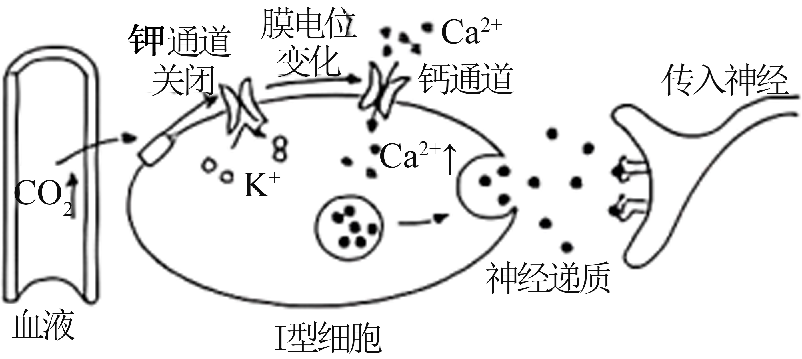
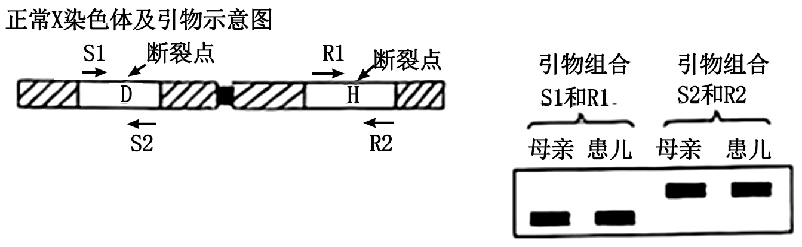
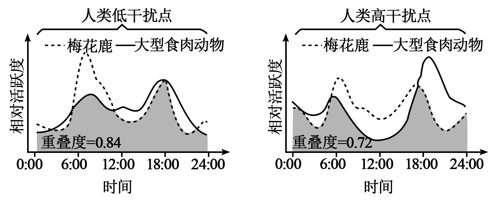
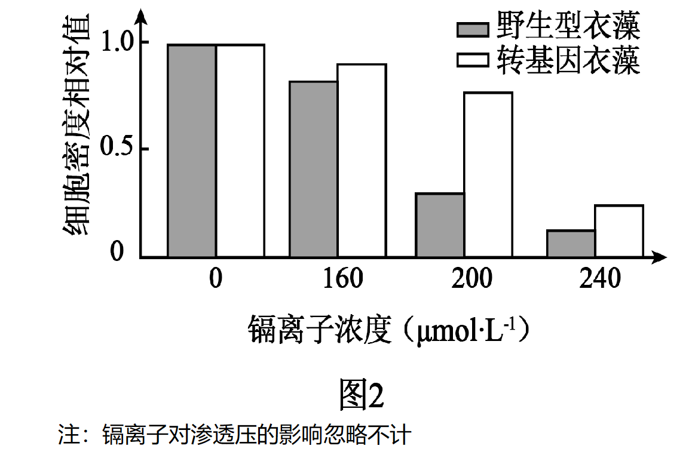

**2025年普通高中学业水平选择性考试（河北卷）**

**生物学**

**本试卷共100分，考试时间75分钟。**

**一、单项选择题：本题共13小题，每小题2分，共26分。在每小题给出的四个选项中，只有一项是符合题目要求的。**

1\. ATP是一种能为生命活动供能的化合物，下列过程不消耗ATP的是（ ）

A. 肌肉的收缩 B. 光合作用的暗反应

C. Ca2+载体蛋白的磷酸化 D. 水的光解

2\. 下列过程涉及酶催化作用的是（ ）

A. Fe3+催化H2O2的分解 B. O2通过自由扩散进入细胞

C. PCR过程中DNA双链的解旋 D. 植物体细胞杂交前细胞壁的去除

3\. 下列对生物体有机物的相关叙述，错误的是（ ）

A. 纤维素、淀粉酶和核酸的组成元素中都有C、H和O

B. 糖原、蛋白质和脂肪都是由单体连接成的多聚体

C. 多肽链和核酸单链可在链内形成氢键

D. 多糖、蛋白质和固醇可参与组成细胞结构

4\. 对绿色植物的光合作用和呼吸作用过程进行比较，下列叙述错误的是（ ）

A. 类囊体膜上消耗H2O、而线粒体基质中生成H2O

B. 叶绿体基质中消耗CO2，而线粒体基质中生成CO2

C. 类囊体膜上生成O2，而线粒体内膜上消耗O2

D. 叶绿体基质中合成有机物，而线粒体基质中分解有机物

5\. 某科创小组将叶绿素合成相关基因转入小麦愈伤组织，获得再生植株，并进行相关检测。下列实验操作错误的是（ ）

A. 将种子消毒后，取种胚接种到适当的固体培养基诱导愈伤组织

B. 在提取的DNA溶液中加入二苯胺试剂，沸水浴后观察颜色以鉴定DNA

C. 将小麦色素提取液滴加到滤纸条，然后将色素滴加部位浸入层析液进行层析

D. 对叶片抽气处理后，转到富含CO2的清水中，探究不同光照下的光合作用强度

6\. M和N是同一染色体上两个基因的部分序列，其转录方向如图所示。表中对M和N转录产物的碱基序列分析正确的是（ ）

|     |              |     |              |
|:--- |:------------ |:--- |:------------ |
| 编号  | M的转录产物       | 编号  | N的转录产物       |
| ①   | 5'-UCUACA-3' | ③   | 5'-AGCUGU-3' |
| ②   | 5'-UGUAGA-3' | ④   | 5'-ACAGCU-3' |

A. ①③ B. ①④ C. ②③ D. ②④

7\. 血液中CO2浓度升高刺激Ⅰ型细胞，由此引发的Ca2+内流促使神经递质释放，引起传入神经兴奋，最终使呼吸加深加快。通过Ⅰ型细胞对信息进行转换和传递的通路如图所示。下列叙述错误的是（ ）

A. Ⅰ型细胞受CO2浓度升高刺激时，胞内K+浓度降低，引发膜电位变化

B. 阻断Ⅰ型细胞的Ca2+内流，可阻断该通路对呼吸的调节作用

C. 该通路可将CO2浓度升高的刺激转换为传入神经的电信号

D. 机体通过Ⅰ型细胞维持CO2浓度相对稳定的过程存在负反馈调节

8\. 轮状病毒引起的小儿腹泻是主要经消化道感染的常见传染病，多表现出高热和腹泻等症状。病毒繁殖后，经消化道排出体外。下列叙述错误的是（ ）

A. 当体温维持在39℃时，患儿的产热量与散热量相等

B. 检查粪便可诊断腹泻患儿是否为轮状病毒感染

C. 抗病毒抗体可诱导机体产生针对该病毒的特异性免疫

D. 保持手的清洁和饮食卫生有助于预防该传染病

9\. 根据子代病毒释放时宿主细胞是否裂解，病毒可分为裂解型和非裂解型。下列叙述错误的是（ ）

A. 与裂解型相比，非裂解型病毒被清除过程中细胞免疫发挥更关键的作用

B. 裂解型病毒引起的体液免疫不需要抗原呈递细胞的参与

C. 病毒的感染可引起辅助性T细胞分泌细胞因子，促进B细胞的分裂和分化

D. 病毒感染后，浆细胞产生的抗体可特异性结合胞外游离的病毒

10\. 口袋公园是指在城市中利用零星空地建设的小型绿地，可满足群众就近休闲需求，为群众增添身边的绿、眼前的美。下列分析错误的是（ ）

A. 大量口袋公园的建设有效增加了绿地面积，有助于吸收和固定CO2

B. 适当提高口袋公园的植物多样性，可增强其抵抗力稳定性

C. 口袋公园生态系统不具备自我调节能力，需依赖人工维护

D. 从空地到公园，鸟类等动物类群逐渐丰富，加快了生态系统的物质循环

11\. 被誉为“太行新愚公”的李保国在太行山区摸索出了一种成功的生态经济沟建设模式——山顶种植水土保持林、山腰种植干果林和山脚种植水果林，切实践行了“绿水青山就是金山银山”的理念。下列叙述错误的是（ ）

A. 山顶、山腰和山脚不同林种的布局体现了群落的垂直结构

B. 生态经济沟的建设提高了当地的生态效益和经济效益

C. 该模式体现了生物与环境的协调与适应

D. 生态经济沟的建设促进了人与自然的和谐发展

12\. 僧帽蚤接触到天敌昆虫的气味分子（利它素）后，头盔会明显增大，从而降低被天敌昆虫捕食的风险。如图所示，僧帽蚤母本和子代接触利它素的情况不同，对子代头盔占身体比例的影响具有明显差异。下列分析错误的是（ ）

A. 母本接触利它素可增大幼年子代头盔占身体的比例

B. 受利它素刺激后，僧帽蚤发生基因突变，导致头盔占身体的比例增大

C. 僧帽蚤受利它素刺激后头盔增大的特性是自然选择的结果

D. 在没有利它素时，僧帽蚤发育过程中头盔占身体的比例会减小

13\. 生物工程在社会生产中的应用日益广泛，下列相关技术和方法错误的是（ ）

A. 利用组织培养技术实现兰花的快速繁殖和优良性状的保持

B. 在没有CO2的有氧环境中进行胚胎干细胞培养

C. 利用灭活病毒诱导B淋巴细胞和骨髓瘤细胞融合

D. 对供体母牛注射促性腺激素使其超数排卵用于胚胎制备

**二、多项选择题：本题共5小题，每小题3分，共15分。在每小题给出的四个选项中，有两个或两个以上选项符合题目要求，全部选对得3分，选对但不全的得1分，有选错的得0分。**

14\. 玉米T蛋白可影响线粒体内与呼吸作用相关的多种酶、T蛋白缺失还会造成线粒体内膜受损。针对T基因缺失突变体和野生型玉米胚乳，研究者检测了其线粒体中有氧呼吸中间产物和细胞质基质中无氧呼吸产物乳酸的含量，结果如图。下列分析正确的是（ ）

A. 线粒体中的\[H\]可来自细胞质基质 B. 突变体中有氧呼吸的第二阶段增强

C. 突变体线粒体内膜上的呼吸作用阶段受阻 D. 突变体有氧呼吸强度的变化可导致无氧呼吸的增强

15\. X染色体上的D基因异常可导致人体患病，在男性中发病率为1/3500，某患病男孩（其母亲没有患病）X染色体上的基因D和H内各有一处断裂，断裂点间的染色体片段发生颠倒重接。研究者对患儿和母亲的DNA进行了PCR检测，所用引物和扩增产物电泳结果如图。不考虑其他变异，下列分析错误的是（ ）

注：引物组合S1和S2，R1和R2可分别用于对正常基因D和H序列的扩增检测

A. 该病患者中男性显著多于女性，女性中携带者的占比为1/3500

B. 用R1和R2对母亲和患儿DNA进行PCR检测的结果相同

C. 与正常男性相比，患病男孩X染色体上的基因排列顺序发生改变

D. 利用S1和S2进行PCR检测，可诊断母亲再次孕育的胎儿是否患该病

16\. 研究者对不同受试者的检查发现：①丘脑（位于下丘脑旁侧的较高级中枢）受损患者对皮肤的触碰刺激无反应；②看到食物，引起唾液分泌；③受到惊吓时，咀嚼和吞咽食物变慢。下列叙述正确的是（ ）

A. ①说明触觉产生于丘脑

B. ②中引起唾液分泌的反射为条件反射

C. 控制咀嚼和吞咽的传出神经属于外周神经系统

D. 受到惊吓时，机体通过神经系统影响内分泌，肾上腺素分泌减少

17\. 某林地去除所有植被后，耐阴性不同的树种类群在植被恢复过程中优势度的变化如图所示。下列叙述正确的是（ ）

A. 去除林中所有植被后，该地发生的演替为初生演替

B. 该地恢复的最初阶段，林冠层郁闭度低，不耐阴类群具有竞争优势

C. 不耐阴类群优势度的丧失，可能是由于该地环境逐渐不适于其繁殖

D. 恢复末期，中间性类群优势度下降，耐阴性类群可获得的资源增加

18\. 隐甲藻是一种好氧的异养真核微藻。多在海水中腐烂的植物叶片上生长繁殖，是工业生产DHA（一种功能性脂肪酸）的藻类之一、从海洋中筛选获得的高产油脂隐甲藻，可用于DHA的发酵生产。下列叙述正确的是（ ）

A. 隐甲藻可从腐烂的叶片获得生长必需的碳源

B. 采集海水中腐烂的叶片，湿热灭菌后接种到固体培养基，以获得隐甲藻

C. 选择培养基中可加入抑制细菌生长的抗生素，以减少杂菌生长

D. 适当提高发酵时的通气量和搅拌速率均可增加溶氧量，以提高DHA产量

**三、非选择题：本题共5题，共59分。**

19\. 砷可严重影响植物的生长发育。拟南芥对砷胁迫具有一定的耐受性，为探究其机制，研究者进行了相关实验。回答下列问题：

（1）砷通过转运蛋白F进入根细胞时需消耗能量，该运输方式属于\_\_\_\_\_。砷的累积可导致细胞内自由基含量升高。自由基造成细胞损伤甚至死亡的原因为\_\_\_\_\_（答出两点即可）。

（2）针对砷吸收相关基因C缺失和过量表达的拟南芥，研究者检测了其根细胞中砷的含量，结果如图。由此推测，蛋白C可\_\_\_\_\_（填“增强”或“减弱”）根对砷的吸收。进一步研究表明，砷激活的蛋白C可使F磷酸化、磷酸化的F诱导细胞膜内陷、形成含有蛋白F的囊泡。由此判断，激活的蛋白C可使细胞膜上转运蛋白F的数量\_\_\_\_\_，造成根对砷吸收量的改变。囊泡的形成过程体现了细胞膜在结构上具有\_\_\_\_\_的特点。

（3）砷和磷可竞争性通过转运蛋白F进入细胞。推测在砷胁迫下植物对磷的吸收量\_\_\_\_\_（填“增加”或“减少”），结合（2）和（3）的信息，分析其原因：\_\_\_\_\_（答出两点即可）。

20\. 运动过程中，人体会通过神经调节和体液调节等方式使机体适时做出多种适应性反应，以维持内环境稳态。回答下列问题：

（1）运动时，自主神经系统中的\_\_\_\_\_神经兴奋，支气管舒张，心跳加快，胃肠蠕动\_\_\_\_\_，体现了不同系统之间的协调配合。

（2）运动过程中，机体大量出汗，抗利尿激素分泌增多，该激素的作用是\_\_\_\_\_。运动还可导致血糖消耗增加，机体中可直接促使血糖升高的激素有\_\_\_\_\_（答出两种即可）。

（3）运动时，机体血压会适度升高，血液中的肾上腺髓质素（ADM）含量升高数倍。已知血管收缩可使血压升高，ADM可舒张血管。据此分析，运动时自主神经和ADM升高对血压的影响分别是\_\_\_\_\_。

（4）研究发现高血压模型大鼠长期运动后，其安静状态下的ADM和ADM受体的量均明显升高。据此推测，血压偏高人群长期坚持锻炼的作用是\_\_\_\_\_。

21\. 我国东北虎豹国家公园的设立使东北虎和东北豹的生存环境明显改善。为更好保护东北虎和东北豹，研究者根据国家公园内人类活动强度，将调查区域分为人类低干扰点和高干扰点，以研究人类活动对相关动物活动节律的影响。回答下列问题：

（1）梅花鹿是东北虎的主要猎物，二者的种间关系是\_\_\_\_\_。对二者种间关系的研究属于\_\_\_\_\_（填“种群”或“群落”）水平的研究。人类活动产生的噪音会影响动物的活动节律，这些噪音属于生态系统中的\_\_\_\_\_信息。

（2）在人类低干扰点和高干扰点，大型食肉动物（东北虎、东北豹）和梅花鹿的日活动节律如下图所示。低干扰点的大型食肉动物和梅花鹿的活动时间都集中在晨昏，但也存在一定差异，二者分别占据着相对稳定的生态位，这是\_\_\_\_\_的结果。与低干扰点相比，高干扰点的大型食肉动物在\_\_\_\_\_（填“日间”或“夜间”）的活跃度明显较高。

注：相对活跃度：某时间点出现的次数与全天出现总次数的比值；重叠度：大型食肉动物和梅花鹿日活动节律的重叠程度

（3）如果大型食肉动物和梅花鹿每天的活动次数不变，据上图所示，从重叠度角度分析人类高干扰对大型食肉动物的影响是\_\_\_\_\_。

（4）根据上述研究结果，在东北虎豹国家公园内可以从哪些方面提高东北虎和东北豹的环境容纳量：\_\_\_\_\_（答出两点即可）。

22\. 为治理水体中对生物有毒害的镉污染，研究者构建了分泌信号肽SP7、镉离子结合蛋白CADR、定位于细胞壁的蛋白GP1和黄色荧光蛋白YFP编码序列融合表达的载体，转入单细胞衣藻，实现CADR大量合成、分泌并定位于细胞壁，以吸附水体中的镉离子。回答下列问题：

（1）在DNA聚合酶、引物、模板DNA和脱氧核苷酸中，随着PCR反应进行，分子数量逐渐减少的是\_\_\_\_\_和\_\_\_\_\_。模板与引物在PCR反应的\_\_\_\_\_阶段开始结合。PCR中使用的DNA聚合酶需耐高温，其原因为\_\_\_\_\_。

（2）载体中可用的酶切位点信息和拟构建载体的部分结构如图1所示。在将CADR、GP1和YFP基因逐个构建到载体时，为避免错误连接，需向以上三个基因的两端分别添加限制酶识别序列，其中GPl两端应添加\_\_\_\_\_（填两种限制酶）的识别序列。用DNA连接酶连接时，可催化载体和目的基因之间形成\_\_\_\_\_键。

（3）若在荧光显微镜下观察到转基因衣藻表现为\_\_\_\_\_，初步表明融合蛋白表达成功。将转基因衣藻和野生型衣藻置于含镉离子的培养液中培养一段时间后，若转基因衣藻细胞壁比野生型衣藻细胞壁的镉离子含量\_\_\_\_\_，则表明融合蛋白能结合镉离子。

（4）将转基因衣藻和野生型衣藻在不同镉离子浓度的培养液中培养6天后，检测细胞密度，结果见图2。转基因衣藻在含有不同浓度镉离子的培养液中生长均优于野生型衣藻的原因可能是\_\_\_\_\_。240μmol·L-1镉离子浓度下，转基因衣藻和野生型衣藻生长均被明显抑制的原因可能是\_\_\_\_\_。

（5）转基因衣藻可用于水体镉污染治理，与施加化学药物法相比，能体现出其环境治理优势的两个特性是\_\_\_\_\_和\_\_\_\_\_。（填标号）

①衣藻作为生物材料在水体中可自我繁殖②衣藻生长速率受镉离子浓度影响③衣藻可吸收水体中能引起富营养化的物质④衣藻吸附的镉可沿食物链传递

23\. T-DNA插入失活是研究植物基因功能的常用方法，研究者将带有卡那霉素抗性基因的T-DNA插入拟南芥2号染色体的A基因内，使其突变为丧失功能的a基因，花粉中A基因功能的缺失会造成其不育。回答下列问题：

（1）基因内碱基的增添、缺失或\_\_\_\_\_都可导致基因突变。

（2）以Aa植株为\_\_\_\_\_（填“父本”或“母本”）与野生型拟南芥杂交，F1中卡那霉素抗性植株的占比为0，其反交的F1中卡那霉素抗性植株的占比为\_\_\_\_\_。

（3）为进一步验证基因A的功能，将另一个A基因插入Aa植株的3号染色体。仅考虑基因A和a，该植株会产生\_\_\_\_\_种基因型的可育花粉，其中具有a基因的花粉占比为\_\_\_\_\_。该植株自交得到F1。利用图1所示引物P1和P2、P1和P3分别对F1进行PCR检测，电泳结果如图2所示。根据电泳结果F1植株分为Ⅰ型和Ⅱ型，其中Ⅰ型植株占比为\_\_\_\_\_。F1中没有检测到仅扩增出600bp条带的植株，其原因为\_\_\_\_\_。

（4）实验中还获得了一个E基因被T-DNA插入突变为e基因的植株，e基因纯合的种子不能正常发育而退化。为分析基因E/e和A/a在染色体上的位置关系，进行下列实验：

①利用基因型为AaEE和AAEe的植株进行杂交，筛选出基因型为\_\_\_\_\_的F1植株。

②选出的F1植株自交获得F2．不考虑其他突变，若F2植株中花粉和自交所结种子均发育正常的植株占比为0，E/e和A/a在染色体上的位置关系及染色体交换情况为\_\_\_\_\_；若两对基因位于非同源染色体，该类植株的占比为\_\_\_\_\_。除了上述两种占比，分析该类植株还可能的其他占比和原因：\_\_\_\_\_。
