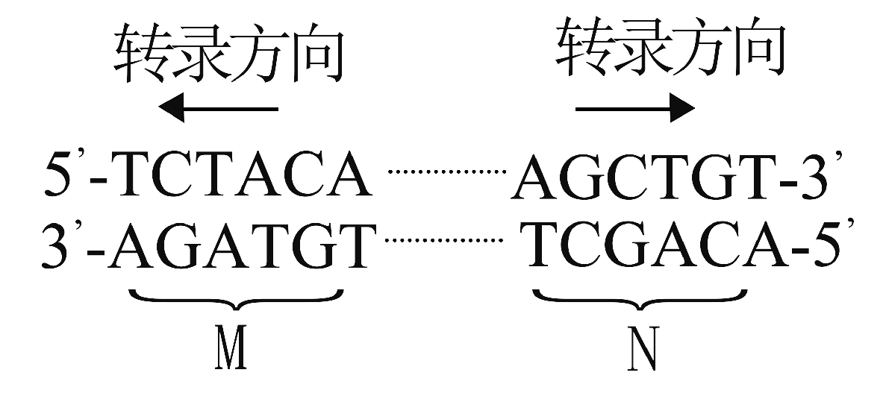
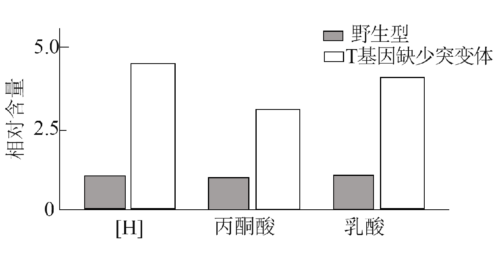
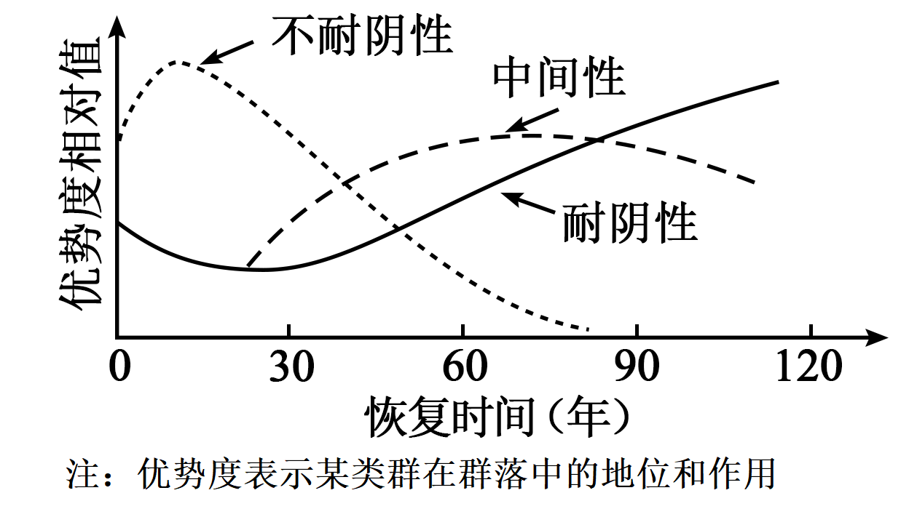
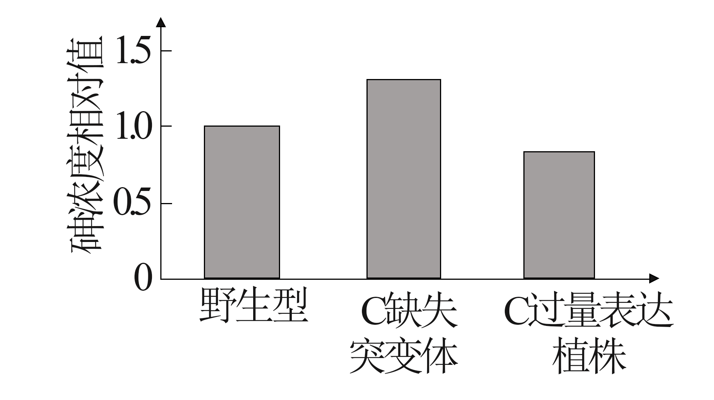
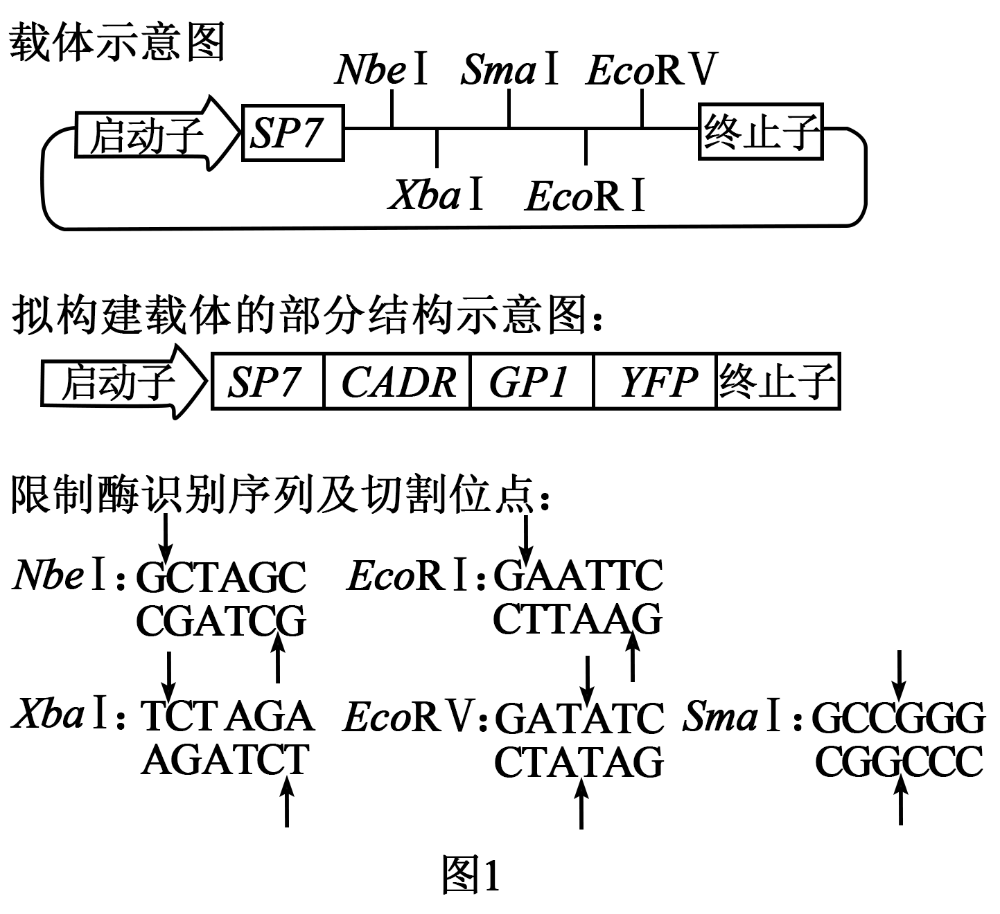

**2025年普通高中学业水平选择性考试（河北卷）**

**生物学**

**本试卷共100分，考试时间75分钟。**

**一、单项选择题：本题共13小题，每小题2分，共26分。在每小题给出的四个选项中，只有一项是符合题目要求的。**

1\. ATP是一种能为生命活动供能的化合物，下列过程不消耗ATP的是（ ）

A. 肌肉的收缩 B. 光合作用的暗反应

C. Ca2+载体蛋白的磷酸化 D. 水的光解

【答案】D

【解析】

【分析】ATP（腺苷三磷酸）是一种高能磷酸化合物，在细胞中，它与ADP的相互转化实现储能和放能，从而保证细胞各项生命活动的能量供应。生成ATP 的途径主要有两条：一条是植物体内含有叶绿体的细胞，在光合作用的光反应阶段生成ATP；另一条是活细胞能通过细胞呼吸生成ATP。

【详解】A、肌肉收缩通过肌球蛋白与肌动蛋白相互作用，需要ATP水解供能，A不符合题意；

B、光合作用暗反应中C3的还原需要消耗ATP（来自光反应产生的ATP），B不符合题意；

C、ATP为主动运输供能时载体蛋白空间结构发生变化，Ca²⁺载体蛋白磷酸化需ATP水解提供磷酸基团和能量，C不符合题意；

D、水的光解发生在光反应阶段，由光能驱动，不消耗ATP，反而生成ATP，D符合题意。

故选D。

2\. 下列过程涉及酶催化作用的是（ ）

A. Fe3+催化H2O2的分解 B. O2通过自由扩散进入细胞

C. PCR过程中DNA双链的解旋 D. 植物体细胞杂交前细胞壁的去除

【答案】D

【解析】

【详解】酶是活细胞产生的具有催化作用的有机物，其中绝大多数酶是蛋白质，少数是RNA，具有高效性、专一性和作用条件温和。

【分析】A、Fe3+催化H2O2的分解，Fe3+是无机催化剂，不是酶，A错误；

B、O2通过自由扩散进入细胞，这是一种简单的物质跨膜运输方式，不涉及酶的催化作用，B错误；

C、PCR过程中DNA双链的解旋是通过高温实现的，不需要酶来解旋（在生物体内DNA解旋需要解旋酶），C错误；

D、植物体细胞杂交前细胞壁的去除，需要用纤维素酶和果胶酶将细胞壁分解，涉及酶的催化作用，D正确。

故选D。

3\. 下列对生物体有机物的相关叙述，错误的是（ ）

A. 纤维素、淀粉酶和核酸的组成元素中都有C、H和O

B. 糖原、蛋白质和脂肪都是由单体连接成的多聚体

C. 多肽链和核酸单链可在链内形成氢键

D. 多糖、蛋白质和固醇可参与组成细胞结构

【答案】B

【解析】

【详解】糖类一般由C、H、O三种元素组成，分为单糖、二糖和多糖，是主要的能源物质。常见的单糖有葡萄糖、果糖、半乳糖、核糖和脱氧核糖等。植物细胞中常见的二糖是蔗糖和麦芽糖，动物细胞中常见的二糖是乳糖。植物细胞中常见的多糖是纤维素和淀粉，动物细胞中常见的多糖是糖原。淀粉是植物细胞中的储能物质，糖原是动物细胞中的储能物质。

【分析】A、纤维素属于糖类，元素组成是C、H、O，淀粉酶是蛋白质，元素组成主要是C、H、O、N，核酸的元素组成是C、H、O、N、P，它们都有C、H、O，A正确；

B、糖原是多糖，由葡萄糖单体连接成多聚体，蛋白质由氨基酸单体连接成多聚体，但脂肪不是多聚体，它是由甘油和脂肪酸组成的，B错误；

C、多肽链中的某些区域可以形成氢键，如α螺旋结构，核酸单链如tRNA，可在链内形成氢键，形成特定的空间结构，C正确；

D、多糖如纤维素是植物细胞壁的组成成分，蛋白质是细胞膜、细胞质等结构的重要组成成分，固醇中的胆固醇是动物细胞膜的组成成分，D正确。

故选B。

4\. 对绿色植物的光合作用和呼吸作用过程进行比较，下列叙述错误的是（ ）

A. 类囊体膜上消耗H2O、而线粒体基质中生成H2O

B. 叶绿体基质中消耗CO2，而线粒体基质中生成CO2

C. 类囊体膜上生成O2，而线粒体内膜上消耗O2

D. 叶绿体基质中合成有机物，而线粒体基质中分解有机物

【答案】A

【解析】

【分析】光合作用包括光反应阶段和暗反应阶段，光反应阶段发生在类囊体薄膜上，完成水的光解和ATP的合成，暗反应阶段发生在叶绿体基质，完成二氧化碳的固定和三碳化合物的还原。

【详解】A 、类囊体膜上进行水的光解消耗H2O，而线粒体内膜上进行有氧呼吸第三阶段生成H2O，线粒体基质中进行有氧呼吸第二阶段不生成H2O，A错误；

B、叶绿体基质中进行暗反应，消耗CO2进行二氧化碳的固定，线粒体基质中进行有氧呼吸第二阶段，涉及丙酮酸和水反应生成CO2，B正确；

C、类囊体膜上进行水的光解生成O2，线粒体内膜上进行有氧呼吸第三阶段，消耗O2和NADH生成水，C正确；

D、叶绿体基质中进行暗反应，合成葡萄糖等有机物，线粒体基质中进行有氧呼吸第二阶段，分解有机物（丙酮酸），生成CO2和NADH，D正确。

故选A。

5\. 某科创小组将叶绿素合成相关基因转入小麦愈伤组织，获得再生植株，并进行相关检测。下列实验操作错误的是（ ）

A. 将种子消毒后，取种胚接种到适当的固体培养基诱导愈伤组织

B. 在提取的DNA溶液中加入二苯胺试剂，沸水浴后观察颜色以鉴定DNA

C. 将小麦色素提取液滴加到滤纸条，然后将色素滴加部位浸入层析液进行层析

D. 对叶片抽气处理后，转到富含CO2的清水中，探究不同光照下的光合作用强度

【答案】C

【解析】

【分析】色素提取的原理：叶绿体中的色素溶解于有机溶剂，如无水乙醇；色素分离的原理：四种色素在层析液中的溶解度不同，因而随层析液在滤纸上扩散的速度不同，溶解度越高，扩散速度越快，溶解度越低，扩散速度越慢。

【详解】A、将种子消毒后，取种胚接种到适当的固体培养基可以诱导愈伤组织，这是植物组织培养中常用的获取愈伤组织的方法，A正确；

B、在提取的DNA溶液中加入二苯胺试剂，沸水浴后会出现蓝色反应，以此来鉴定DNA，B正确；

C、在进行色素层析时，色素滴加部位不能浸入层析液，否则色素会溶解在层析液中，无法在滤纸条上进行层析分离，C错误；

D、对叶片抽气处理后，转到富含CO2的清水中，通过观察不同光照下叶片上浮的情况等可以探究不同光照下的光合作用强度，D正确。

故选C。

6\. M和N是同一染色体上两个基因的部分序列，其转录方向如图所示。表中对M和N转录产物的碱基序列分析正确的是（ ）

|     |              |     |              |
|:--- |:------------ |:--- |:------------ |
| 编号  | M的转录产物       | 编号  | N的转录产物       |
| ①   | 5'-UCUACA-3' | ③   | 5'-AGCUGU-3' |
| ②   | 5'-UGUAGA-3' | ④   | 5'-ACAGCU-3' |

A. ①③ B. ①④ C. ②③ D. ②④

【答案】C

【解析】

【分析】基因表达是指将来自基因的遗传信息合成功能性基因产物的过程。基因表达产物通常是蛋白质，所有已知的生命，都利用基因表达来合成生命的大分子。转录过程由RNA聚合酶（进行，以DNA为模板，产物为RNA。RNA聚合酶沿着一段DNA移动，留下新合成的RNA链。翻译是以mRNA为模板合成蛋白质的过程，场所在核糖体。

【详解】基因转录是以DNA的一条链为模板，合成RNA的过程，其中模板链的方向为3'--5'，分析题图基因的转录方向可知，M基因以上面的链为模板，N基因以下面的链为模板，故M基因转录产物为5'-UGUAGA-3'，N基因转录产物为5'-AGCUGU-3'，②③正确，C正确。

故选C。

7\. 血液中CO2浓度升高刺激Ⅰ型细胞，由此引发的Ca2+内流促使神经递质释放，引起传入神经兴奋，最终使呼吸加深加快。通过Ⅰ型细胞对信息进行转换和传递的通路如图所示。下列叙述错误的是（ ）

A. Ⅰ型细胞受CO2浓度升高刺激时，胞内K+浓度降低，引发膜电位变化

B. 阻断Ⅰ型细胞的Ca2+内流，可阻断该通路对呼吸的调节作用

C. 该通路可将CO2浓度升高的刺激转换为传入神经的电信号

D. 机体通过Ⅰ型细胞维持CO2浓度相对稳定的过程存在负反馈调节

【答案】A

【解析】

【分析】激素等化学物质，通过体液传送的方式对生命活动进行调节，称为体液调节。激素调节是体液调节的主要内容。除激素外，其他一些化学物质，如组胺、某些气体分子（NO、CO等）以及一些代谢产物（如CO2），也能作为体液因子对细胞、组织和器官的功能起调节作用。

【详解】A、Ⅰ型细胞受CO2浓度升高刺激时，使K+通道关闭，K+外流减少，胞内K+浓度增加，A错误；

B、由题意可知，Ca2+内流促使神经递质释放，引起传入神经兴奋，最终使呼吸加深加快，故阻断Ⅰ型细胞的Ca2+内流，可阻断该通路对呼吸的调节作用，B正确；

C、血液中CO2浓度升高刺激Ⅰ型细胞，由此引发的Ca2+内流促使神经递质释放，引起传入神经兴奋，故该通路可将CO2浓度升高的刺激转换为传入神经的电信号，C正确；

D、机体通过Ⅰ型细胞维持CO2浓度相对稳定的过程，最终使呼吸加深加快，血液中CO2浓度降低，故存在负反馈调节，D正确。

故选A。

8\. 轮状病毒引起的小儿腹泻是主要经消化道感染的常见传染病，多表现出高热和腹泻等症状。病毒繁殖后，经消化道排出体外。下列叙述错误的是（ ）

A. 当体温维持在39℃时，患儿的产热量与散热量相等

B. 检查粪便可诊断腹泻患儿是否为轮状病毒感染

C. 抗病毒抗体可诱导机体产生针对该病毒的特异性免疫

D. 保持手的清洁和饮食卫生有助于预防该传染病

【答案】C

【解析】

分析】人体体温调节：

(1)体温调节中枢：下丘脑；

(2)机理：产热和散热保持动态平衡；

(3)寒冷环境下：①增加产热的 途 径：骨骼肌战栗、甲状腺激素和肾上腺素分泌增加；②减少散热的 途 径：立毛肌收缩、皮肤血管收缩等；

(4)炎热环境下：主要通过增加散热来维持体温相对稳定，增加散热的 途 径主要有汗液分泌增加、皮肤血管舒张。

【详解】A、体温维持在39℃时，说明产热量等于散热量，处于动态平衡，A正确；

B、轮状病毒经消化道排出，粪便中含有病毒，检测可诊断感染，B正确；

C、抗病毒抗体由浆细胞分泌，直接中和病毒，而特异性免疫由抗原（病毒）诱导产生，抗体不能诱导免疫反应，C错误；

D、保持手和饮食卫生可切断传播 途 径，预防消化道传染病，D正确；

故选C。

9\. 根据子代病毒释放时宿主细胞是否裂解，病毒可分为裂解型和非裂解型。下列叙述错误的是（ ）

A. 与裂解型相比，非裂解型病毒被清除过程中细胞免疫发挥更关键的作用

B. 裂解型病毒引起的体液免疫不需要抗原呈递细胞的参与

C. 病毒的感染可引起辅助性T细胞分泌细胞因子，促进B细胞的分裂和分化

D. 病毒感染后，浆细胞产生的抗体可特异性结合胞外游离的病毒

【答案】B

【解析】

【分析】细胞免疫过程：①被病原体（如病毒）感染的宿主细胞（靶细胞）膜表面的某些分子发生变化，细胞毒性T细胞识别变化的信号；②细胞毒性T细胞分裂并分化，形成新的细胞毒性T细胞和记忆T细胞。细胞因子能加速这一过程；③新形成的细胞毒性T细胞在体液中循环，它们可以识别并接触、裂解被同样病原体感染的靶细胞；④靶细胞裂解、死亡后，病原体暴露出来，抗体可以与之结合；或被其他细胞吞噬掉。

【详解】A、非裂解型病毒潜伏在宿主细胞内，需通过细胞免疫裂解被感染的细胞，释放病毒再由体液免疫清除，因此细胞免疫更关键，A正确；

B、体液免疫中，大多数病原体（包括裂解型病毒）需要抗原呈递细胞摄取、处理和呈递抗原给辅助性T细胞，辅助性T细胞分泌细胞因子促进B细胞的分裂和分化，所以裂解型病毒引起的体液免疫需要抗原呈递细胞的参与，B错误；

C、病毒感染机体后，会引起机体的免疫反应，辅助性T细胞会分泌细胞因子，细胞因子能促进B细胞的分裂和分化，形成浆细胞和记忆B细胞，C正确；

D、病毒感染后，浆细胞产生的抗体具有特异性，可特异性结合胞外游离的病毒，形成沉淀或细胞集团，进而被吞噬细胞吞噬消化，D正确。

故选B。

10\. 口袋公园是指在城市中利用零星空地建设的小型绿地，可满足群众就近休闲需求，为群众增添身边的绿、眼前的美。下列分析错误的是（ ）

A. 大量口袋公园的建设有效增加了绿地面积，有助于吸收和固定CO2

B. 适当提高口袋公园的植物多样性，可增强其抵抗力稳定性

C. 口袋公园生态系统不具备自我调节能力，需依赖人工维护

D. 从空地到公园，鸟类等动物类群逐渐丰富，加快了生态系统的物质循环

【答案】C

【解析】

【分析】人们把生态系统维持或恢复自身结构与功能处于相对平衡状态的能力，叫作生态系统的稳定性，负反馈调节在生态系统中普遍存在，它是生态系统具备自我调节能力的基础。

【详解】A、植物通过光合作用吸收CO2，大量口袋公园建设增加绿地面积，有助于吸收和固定CO2，A正确；

B、生态系统的抵抗力稳定性与物种多样性呈正相关，植物多样性提高，营养结构复杂，生态系统的抵抗力稳定性增强，B正确；

C、任何生态系统都具备一定的自我调节能力，口袋公园生态系统也不例外，只是相对较弱，可能需要一定的人工维护，C错误；

D、从空地到公园，环境改变，鸟类等动物类群逐渐丰富，鸟类等动物为消费者，消费者能加快生态系统的物质循环，D正确。

故选C。

11\. 被誉为“太行新愚公”的李保国在太行山区摸索出了一种成功的生态经济沟建设模式——山顶种植水土保持林、山腰种植干果林和山脚种植水果林，切实践行了“绿水青山就是金山银山”的理念。下列叙述错误的是（ ）

A. 山顶、山腰和山脚不同林种的布局体现了群落的垂直结构

B. 生态经济沟的建设提高了当地的生态效益和经济效益

C. 该模式体现了生物与环境的协调与适应

D. 生态经济沟的建设促进了人与自然的和谐发展

【答案】A

【解析】

【分析】在群落中，各个生物种群分别占据了不同的空间，使群落形成一定的空间结构。群落的空间结构包括垂直结构和水平结构等。 在垂直方向上，大多数群落都具有明显的垂直结构分层现象，水平结构呈镶嵌分布。

【详解】A 、山顶、山腰和山脚不同林种的布局是由于地形的不同导致的，体现的是群落的水平结构，而不是垂直结构，垂直结构强调的是同一地点在垂直方向上的分层，A错误；

B、生态经济沟通过合理的种植布局，既保持了水土，又能收获林果，提高了当地的生态效益和经济效益，B正确；

C、山顶种植水土保持林适合山顶易水土流失的环境，山腰种植干果林、山脚种植水果林，这种模式根据不同的地形和环境条件选择合适的树种，体现了生物与环境的协调与适应，C正确；

D、生态经济沟的建设既保护了生态环境，又能带来经济收益，促进了人与自然的和谐发展，D正确。

故选A。

12\. 僧帽蚤接触到天敌昆虫的气味分子（利它素）后，头盔会明显增大，从而降低被天敌昆虫捕食的风险。如图所示，僧帽蚤母本和子代接触利它素的情况不同，对子代头盔占身体比例的影响具有明显差异。下列分析错误的是（ ）

A. 母本接触利它素可增大幼年子代头盔占身体的比例

B. 受利它素刺激后，僧帽蚤发生基因突变，导致头盔占身体的比例增大

C. 僧帽蚤受利它素刺激后头盔增大的特性是自然选择的结果

D. 在没有利它素时，僧帽蚤发育过程中头盔占身体的比例会减小

【答案】B

【解析】

【分析】1、自然选择导致适应环境的个体被保留下来，不适应环境的个体被淘汰，因此现存基因都是长期自然选择和适应的结果。

2、生态系统中的信息传递作用有：生命活动正常进行离不开信息的作用；生物种群的繁衍离不开信息的传递；调节生物种间关系，维持生态系统的平衡与稳定。

【详解】A、通过对比柱状图中的第二组与第四组实验结果可知，当仅母本接触受利它素刺激后，幼年子代头盔占身体的比例增大，说明母本接触利它素可增大幼年子代头盔占身体的比例，A正确;

B、僧帽蚤接触到天敌昆虫的气味分子（利它素）后，头盔会明显增大，从而降低被天敌昆虫捕食的风险，这属于生态系统中不同生物间的信息交流，利用的是化学信息，不属于基因突变导致的，B错误；

C、自然选择的结果一般是生物更适应环境，僧帽蚤受利它素刺激后头盔增大的特性会降低其被天敌昆虫捕食的风险，这是长期自然选择的结果，C正确;

D、根据题意可知僧帽蚤接触到天敌昆虫的气味分子（利它素）后，头盔会明显增大，所以可推测在没有利它素时，僧帽蚤发育过程中头盔不会明显增大，所以头盔占身体的比例会减小，D正确。

故选B。

13\. 生物工程在社会生产中的应用日益广泛，下列相关技术和方法错误的是（ ）

A. 利用组织培养技术实现兰花的快速繁殖和优良性状的保持

B. 在没有CO2的有氧环境中进行胚胎干细胞培养

C. 利用灭活病毒诱导B淋巴细胞和骨髓瘤细胞融合

D. 对供体母牛注射促性腺激素使其超数排卵用于胚胎制备

【答案】B

【解析】

【分析】植物组织培养是指将离体的植物器官、组织或细胞等，培养在人工配制的培养基上，给予适宜的培养条件，诱导其形成完整植株的技术。

【详解】A、植物组织培养技术可以快速繁殖植物，并且由于是无性繁殖，能保持母本的优良性状，兰花可以利用组织培养技术实现快速繁殖和优良性状的保持，A正确；

B、胚胎干细胞培养时，需要一定浓度的CO2，CO2的作用是维持培养液的pH，所以不能在没有CO2的环境中进行胚胎干细胞培养，B错误；

C、诱导动物细胞融合的方法有物理法（如电激）、化学法（如聚乙二醇）和生物法（如灭活病毒），可以利用灭活病毒诱导B淋巴细胞和骨髓瘤细胞融合，C正确；

D、在胚胎工程中，对供体母牛注射促性腺激素，能使其超数排卵，从而获得更多的卵母细胞用于胚胎制备，D正确。

故选B。

**二、多项选择题：本题共5小题，每小题3分，共15分。在每小题给出的四个选项中，有两个或两个以上选项符合题目要求，全部选对得3分，选对但不全的得1分，有选错的得0分。**

14\. 玉米T蛋白可影响线粒体内与呼吸作用相关的多种酶、T蛋白缺失还会造成线粒体内膜受损。针对T基因缺失突变体和野生型玉米胚乳，研究者检测了其线粒体中有氧呼吸中间产物和细胞质基质中无氧呼吸产物乳酸的含量，结果如图。下列分析正确的是（ ）

A. 线粒体中的\[H\]可来自细胞质基质 B. 突变体中有氧呼吸的第二阶段增强

C. 突变体线粒体内膜上的呼吸作用阶段受阻 D. 突变体有氧呼吸强度的变化可导致无氧呼吸的增强

【答案】ACD

【解析】

【分析】有氧呼吸的全过程，可以分为三个阶段：第一个阶段，一个分子的葡萄糖分解成两个分子的丙酮酸，在分解的过程中产生少量的氢(用\[H\]表示)，同时释放出少量的能量。这个阶段是在细胞质基质中进行的；第二个阶段，丙酮酸经过一系列的反应，分解成二氧化碳和氢，同时释放出少量的能量。这个阶段是在线粒体中进行的；第三个阶段，前两个阶段产生的氢，经过一系列的反应，与氧结合而形成水，同时释放出大量的能量。

【详解】A、细胞质基质中可以进行糖酵解，产生\[H\]，进入线粒体参与有氧呼吸的第三阶段，A正确；

B、玉米T蛋白可影响线粒体内与呼吸作用相关的多种酶，T蛋白缺失还会造成线粒体内膜受损，有氧呼吸第二阶段能产生\[H\]，第三阶段\[H\]和氧气生成水，导致第一、二阶段积累的\[H\]被消耗，突变体线粒体内膜受损，第三阶段减弱，\[H\]积累，会抑制第二阶段的进行，因此突变体中有氧呼吸的第二阶段减弱，B错误；

C、T蛋白缺失会造成线粒体内膜受损，线粒体内膜是有氧呼吸第三阶段的场所，因此突变体线粒体内膜上的呼吸作用阶段受阻，C正确；

D、突变体有氧呼吸中间产物\[H\]更多且线粒体内膜受损，因此有氧呼吸强度变小，而突变体乳酸含量远大于野生型，因此无氧呼吸增强，D正确。

故选ACD。

15\. X染色体上的D基因异常可导致人体患病，在男性中发病率为1/3500，某患病男孩（其母亲没有患病）X染色体上的基因D和H内各有一处断裂，断裂点间的染色体片段发生颠倒重接。研究者对患儿和母亲的DNA进行了PCR检测，所用引物和扩增产物电泳结果如图。不考虑其他变异，下列分析错误的是（ ）

注：引物组合S1和S2，R1和R2可分别用于对正常基因D和H序列的扩增检测

A. 该病患者中男性显著多于女性，女性中携带者的占比为1/3500

B. 用R1和R2对母亲和患儿DNA进行PCR检测的结果相同

C. 与正常男性相比，患病男孩X染色体上的基因排列顺序发生改变

D. 利用S1和S2进行PCR检测，可诊断母亲再次孕育的胎儿是否患该病

【答案】AB

【解析】

【分析】分析题意可知，某患病男孩（其母亲没有患病）X染色体上的基因D和H内各有一处断裂，断裂点间的染色体片段发生颠倒重接，故出现染色体倒位。

【详解】A、某患病男孩其母亲没有患病，可知该病为伴X染色体隐性遗传病，该病患者中男性显著多于女性，在男性中发病率为1/3500，则该致病基因d频率为1/3500，正常基因D基因频率为3499/3500，女性中携带者的占比为2×1/3500×3499/3500，A错误；

B、该男孩的母亲为携带者，基因型为XDXd，该男孩基因型为XdY，该男孩的染色体倒位，故用R1和R2不能扩增出产物来，母亲有正常的H基因，有产物，故对母亲和患儿DNA进行PCR检测的结果不同，B错误；

C、该男孩的染色体倒位，故与正常男性相比，患病男孩X染色体上的基因排列顺序发生改变，C正确；

D、利用S1和S2进行PCR检测，有产物则含有正常D基因，若无产物，则含有致病基因，故可诊断母亲再次孕育的胎儿是否患该病，D正确。

故选AB。

16\. 研究者对不同受试者的检查发现：①丘脑（位于下丘脑旁侧的较高级中枢）受损患者对皮肤的触碰刺激无反应；②看到食物，引起唾液分泌；③受到惊吓时，咀嚼和吞咽食物变慢。下列叙述正确的是（ ）

A. ①说明触觉产生于丘脑

B. ②中引起唾液分泌的反射为条件反射

C. 控制咀嚼和吞咽的传出神经属于外周神经系统

D. 受到惊吓时，机体通过神经系统影响内分泌，肾上腺素分泌减少

【答案】BC

【解析】

【分析】①外周神经系统包含传入神经和传出神经，传出神经又可分为支配躯体运动的神经（躯体运动神经）和支配内脏器官的神经（内脏运动神经），其中，支配内脏、血管和腺体的传出神经，它们的活动不受意识支配，称为自主神经系统。

②神经调节的基本方式是反射，其结构基础是反射弧，反射弧包括感受器、传入神经、神经中枢、传出神经和效应器，出生后无需训练就具有的反射叫作非条件反射，出生后在生活过程中通过学习和训练形成的反射叫作条件反射。

【详解】A、根据题目信息只能判断丘脑受损会阻断皮肤接触产生的刺激，使患者对皮肤触碰的刺激无反应，无法得出触觉产生于丘脑的结论，A错误；

B、吃东西引起唾液分泌是非条件反射，但“看到食物，引起唾液分泌”是通过视觉刺激与食物建立联系后习得的反射，属于条件反射，B正确；

C、外周神经系统包含传入神经和传出神经，C正确；

D、受到惊吓时，属于应激反应，会使交感神经兴奋，导致肾上腺素分泌增加，D错误。

故选BC。

17\. 某林地去除所有植被后，耐阴性不同的树种类群在植被恢复过程中优势度的变化如图所示。下列叙述正确的是（ ）

A. 去除林中所有植被后，该地发生的演替为初生演替

B. 该地恢复的最初阶段，林冠层郁闭度低，不耐阴类群具有竞争优势

C. 不耐阴类群优势度的丧失，可能是由于该地环境逐渐不适于其繁殖

D. 恢复末期，中间性类群优势度下降，耐阴性类群可获得的资源增加

【答案】BCD

【解析】

【分析】1、初生演替：是指一个从来没有被植物覆盖的地面，或者是原来存在过植被，但是被彻底消灭了的地方发生的演替。次生演替：原来有的植被虽然已经不存在，但是原来有的土壤基本保留，甚至还保留有植物的种子和其他繁殖体的地方发生的演替。

2、群落演替的原因：生物群落的演替是群落内部因素（包括种内关系、种间关系等）与外界环境因素综合作用的结果。

3、种群：生活在一定区域的同种生物全部个体的集合叫作种群，如：一片树林中全部的猕猴是一个种群，一片草地上的所有蒲公英是一个种群。

【详解】A、种去除林中所有植被后，土壤中仍然存在繁殖体，故该地发生的演替为次生演替，A错误；

B、该地恢复的最初阶段，林冠层郁闭度低，阳光充足，不耐阴类群具有竞争优势，B正确；

C、题图可知，随着时间延长，不耐阴类群优势度相对值降低，可能是由于该地环境逐渐不适于其繁殖，C正确；

D、题图可知，恢复末期，中间性类群优势度下降，耐阴性类群可获得的资源增加，优势度相对值上升，D正确。

故选BCD。

18\. 隐甲藻是一种好氧的异养真核微藻。多在海水中腐烂的植物叶片上生长繁殖，是工业生产DHA（一种功能性脂肪酸）的藻类之一、从海洋中筛选获得的高产油脂隐甲藻，可用于DHA的发酵生产。下列叙述正确的是（ ）

A. 隐甲藻可从腐烂的叶片获得生长必需的碳源

B. 采集海水中腐烂的叶片，湿热灭菌后接种到固体培养基，以获得隐甲藻

C. 选择培养基中可加入抑制细菌生长的抗生素，以减少杂菌生长

D. 适当提高发酵时的通气量和搅拌速率均可增加溶氧量，以提高DHA产量

【答案】ACD

【解析】

【分析】消毒是指使用较为温和的物理、化学或生物等方法杀死物体表面或内部一部分微生物；灭菌则是指使用强烈的理化方法杀死物体内外所有的微生物，包括芽孢和孢子。

【详解】A、根据题目信息“隐甲藻是一种好氧的异养真核微藻，多在海水中腐烂的植物叶片上生长繁殖”可知，隐甲藻可从腐烂的叶片获得生长必需的碳源，A正确；

B、采集海水中腐烂的叶片进行湿热灭菌后，会杀死所有的微生物，此时接种到固体培养基上无法获得隐甲藻，B错误；

C、根据题目信息可知，隐甲藻为真核生物，抗生素可通过抑制细菌细胞壁合成或影响代谢过程来抑制细菌生长，不会影响真核生物的生命活动，因此在筛选或培养隐甲藻时，加入抗生素可有效抑制细菌杂菌，提高隐甲藻的纯度和生长效率，C正确；

D、根据题目信息可知，隐甲藻为好氧生物，因此利用隐甲藻进行DHA发酵生产时，适当提高发酵时的通气量和搅拌速率均可增加溶氧量，以提高DHA产量，D正确。

故选ACD。

**三、非选择题：本题共5题，共59分。**

19\. 砷可严重影响植物的生长发育。拟南芥对砷胁迫具有一定的耐受性，为探究其机制，研究者进行了相关实验。回答下列问题：

（1）砷通过转运蛋白F进入根细胞时需消耗能量，该运输方式属于\_\_\_\_\_。砷的累积可导致细胞内自由基含量升高。自由基造成细胞损伤甚至死亡的原因为\_\_\_\_\_（答出两点即可）。

（2）针对砷吸收相关基因C缺失和过量表达的拟南芥，研究者检测了其根细胞中砷的含量，结果如图。由此推测，蛋白C可\_\_\_\_\_（填“增强”或“减弱”）根对砷的吸收。进一步研究表明，砷激活的蛋白C可使F磷酸化、磷酸化的F诱导细胞膜内陷、形成含有蛋白F的囊泡。由此判断，激活的蛋白C可使细胞膜上转运蛋白F的数量\_\_\_\_\_，造成根对砷吸收量的改变。囊泡的形成过程体现了细胞膜在结构上具有\_\_\_\_\_的特点。

（3）砷和磷可竞争性通过转运蛋白F进入细胞。推测在砷胁迫下植物对磷的吸收量\_\_\_\_\_（填“增加”或“减少”），结合（2）和（3）的信息，分析其原因：\_\_\_\_\_（答出两点即可）。

【答案】（1） ①. 主动运输 ②. 自由基会攻击和破坏细胞内各种执行正常功能的生物分子，当自由基攻击生物膜的组成成分磷脂分子时，产物同样是自由基，这些新产生的自由基又会去攻击别的分子，由此引发雪崩式的反应，对生物膜损伤比较大，此外，自由基还会攻击DNA，可能引起基因突变，攻击蛋白质，使蛋白质活性下降。

（2） ①. 减弱 ②. 减少 ③. 一定的流动性

（3） ①. 减少 ②. 砷激活蛋白C，使细胞膜上转运蛋白F数量减少，而磷也是通过转运蛋白F进入细胞，所以磷的吸收量减少；砷和磷可竞争性通过转运蛋白F进入细胞，砷胁迫下，更多的转运蛋白F用于转运砷，导致磷的吸收量减少  

【解析】

【分析】1、自由扩散的特点是顺浓度梯度，与膜内外物质浓度梯度有关，不需要转运蛋白协助，不消耗能量。

2、协助扩散的特点是顺浓度梯度，与膜内外物质浓度梯度有关，还需要膜上的转运蛋白的协助，不消耗能量。

3、主动运输的特点是逆浓度梯度，需要载体蛋白协助，需要消耗能量。主动运输普遍存在于动植物和微生物细胞中，通过主动运输来选择吸收所需要的物质，排出代谢废物和对细胞有害的物质，从而保证细胞和个体生命活动的需要。

【小问1详解】

物质跨膜运输时，需要载体蛋白且消耗能量的运输方式为主动运输，砷通过转运蛋白F进入根细胞时需消耗能量，所以该运输方式属于主动运输。自由基会攻击和破坏细胞内各种执行正常功能的生物分子，当自由基攻击生物膜的组成成分磷脂分子时，产物同样是自由基，这些新产生的自由基又会去攻击别的分子，由此引发雪崩式的反应，对生物膜损伤比较大，此外，自由基还会攻击DNA，可能引起基因突变，攻击蛋白质，使蛋白质活性下降，导致细胞损伤甚至死亡 。  

【小问2详解】

从图中可以看出，与野生型相比，C缺失突变体根细胞中砷浓度相对值较高，C过量表达植株根细胞中砷浓度相对值较低，由此推测，蛋白C可减弱根对砷的吸收。砷激活的蛋白C可使F磷酸化、磷酸化的F诱导细胞膜内陷、形成含有蛋白F的囊泡，这会使细胞膜上转运蛋白F的数量减少，从而造成根对砷吸收量的改变。囊泡是由细胞膜内陷形成的，这体现了细胞膜在结构上具有一定的流动性的特点。  

【小问3详解】

由于砷和磷可竞争性通过转运蛋白F进入细胞，在砷胁迫下，砷会与磷竞争转运蛋白F，所以推测植物对磷的吸收量减少。  原因一，由（2）可知，砷激活蛋白C，使细胞膜上转运蛋白F数量减少，而磷也是通过转运蛋白F进入细胞，所以磷的吸收量减少；原因二，砷和磷可竞争性通过转运蛋白F进入细胞，砷胁迫下，更多的转运蛋白F用于转运砷，导致磷的吸收量减少。  

20\. 运动过程中，人体会通过神经调节和体液调节等方式使机体适时做出多种适应性反应，以维持内环境稳态。回答下列问题：

（1）运动时，自主神经系统中的\_\_\_\_\_神经兴奋，支气管舒张，心跳加快，胃肠蠕动\_\_\_\_\_，体现了不同系统之间的协调配合。

（2）运动过程中，机体大量出汗，抗利尿激素分泌增多，该激素的作用是\_\_\_\_\_。运动还可导致血糖消耗增加，机体中可直接促使血糖升高的激素有\_\_\_\_\_（答出两种即可）。

（3）运动时，机体血压会适度升高，血液中的肾上腺髓质素（ADM）含量升高数倍。已知血管收缩可使血压升高，ADM可舒张血管。据此分析，运动时自主神经和ADM升高对血压的影响分别是\_\_\_\_\_。

（4）研究发现高血压模型大鼠长期运动后，其安静状态下的ADM和ADM受体的量均明显升高。据此推测，血压偏高人群长期坚持锻炼的作用是\_\_\_\_\_。

【答案】（1） ①. 交感 ②. 减慢

（2） ①. 促进肾小管和集合管对水的重吸收 ②. 胰高血糖素、肾上腺素

（3）自主神经通过交感兴奋使血管收缩、血压升高；ADM通过舒张血管拮抗自主神经的作用，防止血压过度升高

（4）通过增加ADM及其受体的表达，长期锻炼可增强血管舒张能力，从而稳定或降低血压

【解析】

【分析】交感神经和副交感神经是调节人体内脏功能的神经装置，所以也叫内脏神经系统，因为其功能不完全受人类的意识支配，所以又叫自主神经系统，也可称为植物性神经系统。

【小问1详解】

交感神经和副交感神经是调节人体内脏功能的神经装置，运动时，人体处于兴奋状态，此时交感神经兴奋，交感神经兴奋时，胃肠蠕动减慢。

【小问2详解】

抗利尿激素是由下丘脑分泌、垂体释放的，可作用于肾小管和集合管，促进其对水分的重吸收，从而使尿量减少；机体中直接促使血糖升高的激素有胰高血糖素、肾上腺素、甲状腺激素等，属于协同关系。

【小问3详解】

分析题意可知，运动时，机体血压会适度升高，血液中的肾上腺髓质素（ADM）含量升高数倍，而ADM可舒张血管，据此推测，在运动时自主神经通过交感兴奋使血管收缩、血压升高，而ADM通过舒张血管拮抗自主神经的作用，防止血压过度升高，两者共同作用，使机体血压维持相对稳定。

【小问4详解】

由题可知，高血压模型大鼠长期运动后，其安静状态下的ADM和ADM受体的量均明显升高，血压偏高人群长期坚持锻炼可能会促进与ADM和ADM受体相关基因的表达，使其ADM和ADM受体的量升高，ADM和ADM受体结合调节血管舒张，从而降低血压。此项研究说明运动可以改善血管舒张功能，从而对于血压降低有一定作用，并可进一步预防血压升高。

21\. 我国东北虎豹国家公园的设立使东北虎和东北豹的生存环境明显改善。为更好保护东北虎和东北豹，研究者根据国家公园内人类活动强度，将调查区域分为人类低干扰点和高干扰点，以研究人类活动对相关动物活动节律的影响。回答下列问题：

（1）梅花鹿是东北虎的主要猎物，二者的种间关系是\_\_\_\_\_。对二者种间关系的研究属于\_\_\_\_\_（填“种群”或“群落”）水平的研究。人类活动产生的噪音会影响动物的活动节律，这些噪音属于生态系统中的\_\_\_\_\_信息。

（2）在人类低干扰点和高干扰点，大型食肉动物（东北虎、东北豹）和梅花鹿的日活动节律如下图所示。低干扰点的大型食肉动物和梅花鹿的活动时间都集中在晨昏，但也存在一定差异，二者分别占据着相对稳定的生态位，这是\_\_\_\_\_的结果。与低干扰点相比，高干扰点的大型食肉动物在\_\_\_\_\_（填“日间”或“夜间”）的活跃度明显较高。

注：相对活跃度：某时间点出现的次数与全天出现总次数的比值；重叠度：大型食肉动物和梅花鹿日活动节律的重叠程度

（3）如果大型食肉动物和梅花鹿每天的活动次数不变，据上图所示，从重叠度角度分析人类高干扰对大型食肉动物的影响是\_\_\_\_\_。

（4）根据上述研究结果，在东北虎豹国家公园内可以从哪些方面提高东北虎和东北豹的环境容纳量：\_\_\_\_\_（答出两点即可）。

【答案】（1） ①. 捕食 ②. 群落 ③. 物理

（2） ①. 协同进化 ②. 夜间

（3）人类高干扰使二者的重叠度降低，这意味着大型食肉动物与梅花鹿相遇捕食的机会减少，不利于大型食肉动物捕食梅花鹿获取食物

（4）减少人类活动对公园的干扰，这样可以使大型食肉动物和梅花鹿的活动节律重叠度增加，增加大型食肉动物捕食梅花鹿的机会，有利于其生存和繁衍，从而提高东北虎和东北豹的环境容纳量；保护梅花鹿等东北虎和东北豹的猎物资源，为东北虎和东北豹提供充足的食物来源，有助于提高其环境容纳量

【解析】

【分析】一个物种在群落中的地位或作用，包括所处的空间位置，占用资源的情况，以及与其他物种的关系等，称为这个物种的生态位。因此，研究某种动物的生态位，通常要研究它的栖息地、食物、天敌以及与其他物种的关系等。研究某种植物的生态位，通常要研究它在研究区域内的出现频率、种群密度、植株高度等特征，以及它与其他物种的关系等。

【小问1详解】

东北虎以梅花鹿为食，所以二者的种间关系是捕食。种间关系是群落水平上研究的问题，种群水平主要研究种群的数量特征等，所以对二者种间关系的研究属于群落水平的研究。噪音是通过物理过程传播的信息，属于生态系统中的物理信息。

【小问2详解】

低干扰点的大型食肉动物和梅花鹿的活动时间都集中在晨昏，但也存在一定差异，二者分别占据着相对稳定的生态位，这是长期协同进化的结果，使得它们在资源利用等方面形成了一定的分化，以减少竞争。从图中可以看出，与低干扰点相比，高干扰点的大型食肉动物在夜间的相对活跃度曲线峰值更高，所以高干扰点的大型食肉动物在夜间的活跃度明显较高。  

【小问3详解】

从图中可知，低干扰点大型食肉动物和梅花鹿日活动节律的重叠度为0.84，高干扰点重叠度为0.72，如果大型食肉动物和梅花鹿每天的活动次数不变，人类高干扰使二者的重叠度降低，这意味着大型食肉动物与梅花鹿相遇捕食的机会减少，不利于大型食肉动物捕食梅花鹿获取食物。 

【小问4详解】

从上述研究可知，人类活动强度会影响东北虎、东北豹及其猎物的活动节律，所以减少人类活动对公园的干扰，这样可以使大型食肉动物和梅花鹿的活动节律重叠度增加，增加大型食肉动物捕食梅花鹿的机会，有利于其生存和繁衍，从而提高东北虎和东北豹的环境容纳量；保护梅花鹿等东北虎和东北豹的猎物资源，为东北虎和东北豹提供充足的食物来源，有助于提高其环境容纳量。

22\. 为治理水体中对生物有毒害的镉污染，研究者构建了分泌信号肽SP7、镉离子结合蛋白CADR、定位于细胞壁的蛋白GP1和黄色荧光蛋白YFP编码序列融合表达的载体，转入单细胞衣藻，实现CADR大量合成、分泌并定位于细胞壁，以吸附水体中的镉离子。回答下列问题：

（1）在DNA聚合酶、引物、模板DNA和脱氧核苷酸中，随着PCR反应进行，分子数量逐渐减少的是\_\_\_\_\_和\_\_\_\_\_。模板与引物在PCR反应的\_\_\_\_\_阶段开始结合。PCR中使用的DNA聚合酶需耐高温，其原因为\_\_\_\_\_。

（2）载体中可用的酶切位点信息和拟构建载体的部分结构如图1所示。在将CADR、GP1和YFP基因逐个构建到载体时，为避免错误连接，需向以上三个基因的两端分别添加限制酶识别序列，其中GPl两端应添加\_\_\_\_\_（填两种限制酶）的识别序列。用DNA连接酶连接时，可催化载体和目的基因之间形成\_\_\_\_\_键。

（3）若在荧光显微镜下观察到转基因衣藻表现为\_\_\_\_\_，初步表明融合蛋白表达成功。将转基因衣藻和野生型衣藻置于含镉离子的培养液中培养一段时间后，若转基因衣藻细胞壁比野生型衣藻细胞壁的镉离子含量\_\_\_\_\_，则表明融合蛋白能结合镉离子。

（4）将转基因衣藻和野生型衣藻在不同镉离子浓度的培养液中培养6天后，检测细胞密度，结果见图2。转基因衣藻在含有不同浓度镉离子的培养液中生长均优于野生型衣藻的原因可能是\_\_\_\_\_。240μmol·L-1镉离子浓度下，转基因衣藻和野生型衣藻生长均被明显抑制的原因可能是\_\_\_\_\_。

（5）转基因衣藻可用于水体镉污染治理，与施加化学药物法相比，能体现出其环境治理优势的两个特性是\_\_\_\_\_和\_\_\_\_\_。（填标号）

①衣藻作为生物材料在水体中可自我繁殖②衣藻生长速率受镉离子浓度影响③衣藻可吸收水体中能引起富营养化的物质④衣藻吸附的镉可沿食物链传递

【答案】（1） ①. 脱氧核苷酸 ②. 引物 ③. 复性 ④. PCR 反应需要在高温条件下进行变性步骤（90 - 95℃使双链 DNA 解旋为单链） ，普通的 DNA 聚合酶在高温下会变性失活，而耐高温的 DNA 聚合酶能在高温环境中保持活性，保证 PCR 反应的正常进行。

（2） ①. SmaⅠ 和 EcoR Ⅰ ②. 磷酸二酯键

（3） ①. 细胞表面发出黄色荧光 ②. 高

（4） ①. 转基因衣藻表达的融合蛋白能结合镉离子，降低了镉离子对衣藻的毒害作用 ②. 镉离子浓度过高，超出了融合蛋白的吸附能力，对衣藻产生了严重的毒害作用

（5） ①. ① ②. ③

【解析】

【分析】基因工程技术的基本步骤：（1）目的基因的获取：方法有从基因文库中获取、利用PCR技术扩增和人工合成。（2）基因表达载体的构建：是基因工程的核心步骤，基因表达载体包括目的基因、启动子、终止子和标记基因等。（3）将目的基因导入受体细胞：根据受体细胞不同，导入的方法也不一样。（4）目的基因的检测与鉴定。

【小问1详解】

在 PCR 反应中，原料是脱氧核苷酸，随着反应进行不断被消耗，分子数量逐渐减少；引物在 PCR 过程中会结合到模板 DNA 上参与子链合成，也会逐渐减少，所以分子数量逐渐减少的是引物和脱氧核苷酸。 模板与引物在 PCR 的复性阶段开始结合。在复性过程中，温度降低，引物与模板 DNA 单链的互补序列配对结合。 PCR 中使用的 DNA 聚合酶需耐高温，是因为 PCR 反应需要在高温条件下进行变性步骤（90 - 95℃使双链 DNA 解旋为单链） ，普通的 DNA 聚合酶在高温下会变性失活，而耐高温的 DNA 聚合酶能在高温环境中保持活性，保证 PCR 反应的正常进行。

【小问2详解】

观察图 1，要避免错误连接，GPI 两端应添加SmaⅠ 和 EcoR Ⅰ的识别序列。因为将CADR、GP1和YFP基因逐个构建到载体时，使用这两种限制酶切割可以产生不同的黏性末端，能保证目的基因准确插入载体。又因为Nbe Ⅰ和XbaⅠ限制酶切割后产生的黏性末端相同，所以这两种限制酶只能选一个，按照连接的顺序在将GPl连接到载体时应该用SmaⅠ 和 EcoRⅠ 。DNA连接酶连接时，可催化载体和目的基因之间形成磷酸二酯键，从而将载体和目的基因连接起来。

【小问3详解】

若在荧光显微镜下观察到细胞表面发出黄色荧光，初步表明融合蛋白表达成功，因为融合蛋白中有黄色荧光蛋白YFP，其表达后会发出黄色荧光。 将转基因衣藻和野生型衣藻置于含镉离子的培养液中培养一段时间后，若转基因衣藻细胞壁比野生型衣藻细胞壁的镉离子含量高，则表明融合蛋白能结合镉离子。因为融合蛋白中的 CADR 可吸附水体中的镉离子，若融合蛋白发挥作用，会使细胞壁镉离子含量升高。

【小问4详解】

转基因衣藻在含有不同浓度镉离子的培养液中生长均优于野生型衣藻的原因可能是转基因衣藻表达的融合蛋白能结合镉离子，降低了镉离子对衣藻的毒害作用。 240μmol・L⁻¹ 镉离子浓度下，转基因衣藻和野生型衣藻生长均被明显抑制的原因可能是镉离子浓度过高，超出了融合蛋白的吸附能力，对衣藻产生了严重的毒害作用。

【小问5详解】

转基因衣藻可用于水体镉污染治理，与施加化学药物相比，能体现出其环境治理优势的两个特性是①和③。①衣藻作为生物材料在水体中可自我繁殖，能够持续发挥作用；③衣藻可吸收水体中能引起富营养化的物质，便于后续处理，而化学药物可能存在二次污染等问题。

23\. T-DNA插入失活是研究植物基因功能的常用方法，研究者将带有卡那霉素抗性基因的T-DNA插入拟南芥2号染色体的A基因内，使其突变为丧失功能的a基因，花粉中A基因功能的缺失会造成其不育。回答下列问题：

（1）基因内碱基的增添、缺失或\_\_\_\_\_都可导致基因突变。

（2）以Aa植株为\_\_\_\_\_（填“父本”或“母本”）与野生型拟南芥杂交，F1中卡那霉素抗性植株的占比为0，其反交的F1中卡那霉素抗性植株的占比为\_\_\_\_\_。

（3）为进一步验证基因A的功能，将另一个A基因插入Aa植株的3号染色体。仅考虑基因A和a，该植株会产生\_\_\_\_\_种基因型的可育花粉，其中具有a基因的花粉占比为\_\_\_\_\_。该植株自交得到F1。利用图1所示引物P1和P2、P1和P3分别对F1进行PCR检测，电泳结果如图2所示。根据电泳结果F1植株分为Ⅰ型和Ⅱ型，其中Ⅰ型植株占比为\_\_\_\_\_。F1中没有检测到仅扩增出600bp条带的植株，其原因为\_\_\_\_\_。

（4）实验中还获得了一个E基因被T-DNA插入突变为e基因的植株，e基因纯合的种子不能正常发育而退化。为分析基因E/e和A/a在染色体上的位置关系，进行下列实验：

①利用基因型为AaEE和AAEe的植株进行杂交，筛选出基因型为\_\_\_\_\_的F1植株。

②选出的F1植株自交获得F2．不考虑其他突变，若F2植株中花粉和自交所结种子均发育正常的植株占比为0，E/e和A/a在染色体上的位置关系及染色体交换情况为\_\_\_\_\_；若两对基因位于非同源染色体，该类植株的占比为\_\_\_\_\_。除了上述两种占比，分析该类植株还可能的其他占比和原因：\_\_\_\_\_。

【答案】（1）替换 （2） ①. 父本 ②. 1/2

（3） ①. 3 ②. 1/3 ③. 2/3 ④. a花粉不育，无法形成纯合aa植株

（4） ①. AaEe ②. E/e和A/a连锁且无交换，F₂中无同时含A和E的配子 ③. 1/6 ④. 若基因连锁但发生交换，正常植株占比介于0～1/6

【解析】

【分析】自由组合定律的实质：控制不同性状的遗传因子的分离和组合是互不干扰的；在形成配子时，决定同一性状的成对的遗传因子彼此分离，决定不同性状的遗传因子自由组合。

【小问1详解】

基因突变是指DNA分子上碱基对增添、缺失或替换引起基因结构的改变。基因内碱基的增添、缺失或替换都可导致基因突变。

【小问2详解】

据题分析可知，带有卡那霉素抗性基因的T-DNA插入拟南芥2号染色体的A基因内，使其突变为丧失功能的a基因，花粉中A基因功能缺失（a基因）会导致不育，因此Aa植株作为父本时，其含a基因花粉不育，无法参与受精，仅产生含A基因的花粉，故以Aa植株为父本与野生型（AA）拟南芥杂交，F1（AA）中卡那霉素抗性植株的占比为0；若Aa植株作为母本，其卵细胞可育（含a基因），而野生型父本花粉（含A基因）可育，F1基因型为Aa（抗性）和AA（非抗性），比例为1：1，因此卡那霉素抗性植株占比为1/2。

【小问3详解】

为进一步验证基因A的功能，将另一个A基因插入Aa植株的3号染色体。仅考虑基因A和a，插入A基因后，植株基因型为Aa（2号染色体为Aa，3号染色体为A0）。该植株会产生4种基因型的花粉，即AA、A0、Aa、a0，其中a不育，即产生3种可育基因型的花粉，而具有a基因的花粉占比为1/3。该植株雌配子即AA、A0、Aa、a0，均可育，其自交得到F1，利用棋盘法可知，F1的基因型为AAAA：AAA0：AA00：AAAa：AAa0：AAaa：Aa00：Aa00=1∶2∶1∶2∶3∶1∶1∶1。利用图1所示引物P1和P2、P1和P3分别对F1进行PCR检测，电泳结果如图2所示。根据电泳结果F1植株分为Ⅰ型和Ⅱ型，Ⅰ型（含A、a）：PCR扩增出900bp（A）和600bp（a）条带。Ⅱ型（仅含A）：仅扩增出900bp条带。其中Ⅰ型植株占比为（2+3+1+1+1）/（1+2+1+2+3+1+1+1）=2/3。F1中没有检测到仅扩增出600bp条带的植株，其原因为a花粉不育，无法形成纯合aa植株。

【小问4详解】

①利用基因型为AaEE和AAEe的植株进行杂交，筛选出F1中AaEe植株（双杂合）。若E/e和A/a连锁且无交换，F2中无同时含A和E的配子（花粉或种子致死），正常植株占比为0。若两基因独立遗传（非同源染色体），F1植株（AaEe）产生雌配子为AE：Ae：aE：ae=1：1：1：1，均可育，而雄配子AE：Ae=1；1，aE和ae不可育，利用棋盘法可知，F2为AAEE：AAEe：AaEE：AaEe=1：2：1：2，其中只有AAEE的花粉和自交所结种子均发育正常，即正常植株（AAEE）占比为1/6。其他可能：若基因连锁但发生交换，正常植株占比介于0～1/6。
