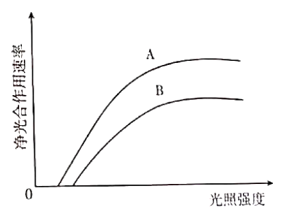
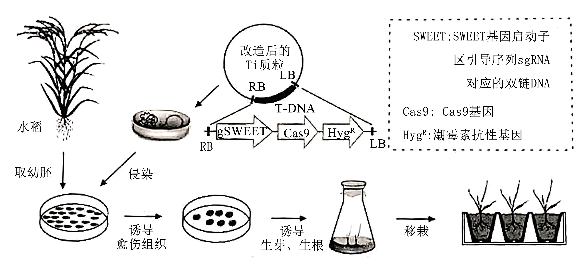

**2025年甘肃省普通高等学校招生统一考试生物学**

**注意事项：**

**1.答卷前，考生务必将自己的姓名、准考证号填写在答题卡上。**

**2.回答选择题时，选出每小题答案后，用2B铅笔把答题卡上对应题目的答案标号框涂黑。如需改动，用橡皮擦干净后，再选涂其他答案标号框。回答非选择题时，将答案写在答题卡上。写在本试卷上无效。**

**3.考试结束后，将本试卷和答题卡一并交回。**

**一、选择题：本题共16小题，每小题3分，共48分。在每小题给出的四个选项中，只有一项是符合题目要求的。**

1\. 地达菜又称地木耳，是由念珠蓝细菌形成的胶质群体。关于地达菜的细胞，下列叙述错误的是（　　）

A. 没有叶绿体，但是能够进行光合作用

B. 没有中心体，细胞不会进行有丝分裂

C. 含有核糖体，能合成细胞所需蛋白质

D. 有细胞骨架，有助于维持细胞的形态

2\. 马铃薯是世界第四大主粮作物。甘肃“定西马铃薯”是中国国家地理标志产品，富含淀粉等营养物质。下列叙述正确的是（　　）

A. 淀粉是含有C、H、O、N等元素的一类多糖

B. 淀粉水解液中加入斐林试剂立刻呈现砖红色

C. 淀粉水解为葡萄糖和果糖后可以被人体吸收

D. 食用过多淀粉类食物可使人体脂肪含量增加

3\. 线粒体在足量可氧化底物和ADP存在的情况下发生的呼吸称为状态3呼吸，可用于评估线粒体产生ATP的能力。若分别以葡萄糖、丙酮酸和NADH为可氧化底物测定离体线粒体状态3呼吸速率，下列叙述正确的是（　　）

A. 状态3呼吸不需要氧气参与

B. 状态3呼吸的反应场所是线粒体基质

C. 以葡萄糖为底物测定的状态3呼吸速率为0

D. 相比NADH，以丙酮酸为底物的状态3呼吸速率较大

4\. 绝大多数细胞在经历有限次数的分裂后不再具有增殖能力而进入衰老状态。癌细胞具有较高的端粒酶活性，能防止端粒缩短、体外培养时可无限增殖不衰老。关于细胞衰老，下列叙述错误的是（　　）

A. 衰老的细胞中细胞核形态异常，核质间的物质交换频率降低

B. 细胞产生的自由基可以通过攻击DNA和蛋白质引起细胞衰老

C. 体外培养癌细胞时，培养液中加入端粒酶抑制剂可诱导癌细胞衰老

D. 将衰老细胞与去细胞核的年轻细胞融合，获得的融合细胞可以增殖

5\. 某动物（2n=4）的基因型为AaBb，有一对长染色体和一对短染色体。A/a和B/b基因是独立遗传的，位于不同对的染色体上。关于该动物的细胞分裂（不考虑突变），下列叙述错误的是（　　）

A. 图①、②、③和④代表减数分裂Ⅱ后期细胞，最终形成Ab、aB、AB和ab四种配子

B. 同源染色体分离，形成图⑤减数分裂Ⅰ后期细胞，进而产生图①和②两种子细胞

C. 非姐妹染色单体互换，形成图⑥减数分裂Ⅰ后期细胞，进而产生图③和④两种子细胞

D. 图⑦代表有丝分裂后期细胞，产生的子代细胞在遗传信息上与亲代细胞保持一致

6\. 某种牛常染色体上的一对等位基因H（无角）对h（有角）完全显性。体表斑块颜色由另一对独立的常染色体基因（M褐色/m红色）控制，杂合态时公牛呈现褐斑，母牛呈现红斑。在下图的杂交实验中，亲本公牛的基因型是（　　）

A. HhMm B. HHMm C. HhMM D. HHMM

7\. 我国古生物化石种类繁多。其中，在甘肃和政县发现的以铲齿象、和政羊与三趾马为代表的古脊椎动物化石群具有极高的研究价值。下列叙述错误的是（　　）

A. 铲齿象、和政羊与三趾马化石可以为研究哺乳动物的进化提供直接证据

B. 根据铲齿象特有的下颌和牙齿形态特征，可以推断它的食性和生活环境

C. 通过自然作用保存在地层中的和政羊、三趾马等动物的粪便不属于化石

D. 不借助化石而通过现生生物的比较分析也可以推断生物进化的部分历史

8\. 内环境稳态对人体的健康至关重要。下列生理调节过程不属于人体内环境稳态调节的是（　　）

A. 血钾升高时，可通过醛固酮调节肾脏排出更多的钾离子，以维持血钾浓度相对稳定

B. 环境温度高于30℃时，汗腺分泌汗液，汗液汽化时带走热量，以维持体温相对稳定

C. 缺氧时，呼吸加深加快，机体从外界获取更多的氧，以维持血液中氧含量相对稳定

D. 胃酸分泌过多时，通过负反馈作用抑制胃酸分泌，以维持胃中的pH值相对稳定

9\. 现代生理学中将能发生动作电位的细胞称为可兴奋细胞，动作电位是在静息电位的基础上产生的膜电位变化。关于可兴奋细胞的静息电位和动作电位，下列叙述错误的是（　　）

A. 静息状态下细胞内的K+浓度高于细胞外，在动作电位发生时则相反

B. 胞外K+浓度降低时，静息电位的绝对值会变大，动作电位不易发生

C. 动作电位发生时，细胞膜对Na+的通透性迅速升高，随后快速回落

D. 由主动运输建立的跨膜离子浓度梯度是动作电位发生的必要条件

10\. 机体接触“非己”物质时，免疫系统能够产生免疫反应。下列叙述错误的是（　　）

A. 花粉等过敏原可刺激T细胞产生抗体引发过敏反应

B. 机体对“非己”物质产生免疫反应时可引起自身免疫病

C. 获得性免疫缺陷病可以通过切断传播途径进行预防

D. 使用免疫抑制剂可有效提高异体器官移植的成功率

11\. 生长素可促进植物细胞伸长生长，其作用机制之一是通过激活质膜H+-ATP酶，导致细胞壁酸化，活化细胞壁代谢相关的酶。拟南芥跨膜激酶TMK参与了这一过程，它与生长素受体、质膜H+-ATP酶的关系如下图所示。下列叙述正确的是（　　）

A. 生长素促进细胞伸长生长的·过程与呼吸作用无关

B. 碱性条件下生长素促进细胞伸长生长的作用增强

C. 生长素受体可以结合吲哚乙酸或苯乙酸

D. TMK功能缺失突变体的生长较野生型快

12\. 种群数量受出生率、死亡率、迁入率和迁出率的影响，任何能够引起这些特征变化的生物和非生物因素，如光照、水分、温度、食物、年龄结构和性别比例等，都会影响种群的数量。下列叙述正确的是（　　）

A. 自然种群中的个体可以迁入和迁出，种群数量的变化不受种群密度的制约

B. 光照、水分、温度和食物等因子的变化都能够引起种群环境容纳量的变化

C. 幼年、成年和老年个体数量大致相等的种群，其数量可以保持稳定性增长

D. 种群中不同年龄个体的数量和雌雄比例都能影响种群的出生率和死亡率

13\. 风眼蓝原产于美洲，最初作为观赏花卉引入我国。数十年后，风眼蓝逃逸到野外，在湖泊、河流蔓延，造成河道堵塞、水生生物死亡，变成外来入侵种。关于此现象，下列叙述错误的是（　　）

A. 外来物种可影响生态系统，但不一定都成为外来入侵种

B. 凤眼蓝生物量的快速增长，有利于水生生态系统的稳定

C. 凤眼蓝扩散到湖泊、河流，改变了水生生态系统结构

D. 凤眼蓝蔓延侵害土著生物，影响群落内物种的相互关系

14\. 正确认识与理解生态系统的能量流动规律、对合理保护与利用生态系统有重要意义。下列叙述正确的是（　　）

A. 提高传递效率就能增加营养级的数量

B. 呼吸作用越大，能量的传递效率就越大

C. 生物量金字塔也可以出现上宽下窄的情形

D. 能流的单向性决定了人类不能调整能流关系

15\. 我国葡萄酒酿造历史悠久、传统发酵技术延续至今。发酵工程通过选育菌种和控制发酵条件等措施可优化传统发酵工艺，改善葡萄酒品质。下列叙述错误的是（　　）

A. 传统发酵时，葡萄果皮上的多种微生物参与了葡萄酒的发酵过程

B. 工业化生产时，酵母菌需在无氧条件下进行扩大培养和酒精发酵

C. 通过诱变育种或基因工程育种能够改良葡萄酒发酵菌种的性状

D. 大规模发酵时，需要监测发酵温度、pH值、罐压及溶解氧等参数

16\. 肿瘤坏死因子α（TNF-α）是一种细胞因子，高浓度时可以引发疾病。研究者利用细胞工程技术制备了TNF-α的单克隆抗体，用于治疗由TNF-α引发的疾病，制备流程如下图。下列叙述正确的是（　　）

A. ①是从小鼠的血液中获得的骨髓瘤细胞

B. ②含未融合细胞、同种核及异种核融合细胞

C. ③需用特定培养基筛选得到大量的杂交瘤细胞

D. ④需在体外或小鼠腹腔进行克隆化培养和抗体检测

**二、非选择题：本题共5小题，共52分。**

17\. 波长为400~700nm的光属于光合有效辐射（PAR），其中400~500nm为蓝光（B），600~700nm为红光（R）。远红光（700~750nm，FR）通常不能用于植物光合作用，但可作为信号调节植物的生长发育。研究者测定了某高大作物冠层中A（高）和B（低）两个位置的PAR、红光/远红光比例（R/FR）和叶片指标（厚度、叶绿素含量、线粒体暗呼吸），并分析了施氮肥对以上指标的影响，结果如下表。回答下列问题。

<table style="width:84%;">
<colgroup>
<col style="width: 13%" />
<col style="width: 7%" />
<col style="width: 7%" />
<col style="width: 17%" />
<col style="width: 22%" />
<col style="width: 15%" />
</colgroup>
<tbody>
<tr>
<td style="text-align: left;">冠层位置</td>
<td style="text-align: left;">PAR</td>
<td style="text-align: left;">R/FR</td>
<td style="text-align: left;">叶片厚度（μm）</td>
<td style="text-align: left;">叶绿素含量（μg·g-1）</td>
<td style="text-align: left;">线粒体暗呼吸</td>
</tr>
<tr>
<td style="text-align: left;">
A

B

A（施氮肥）

B（施氮肥）
</td>
<td style="text-align: left;">
0.90

0.20

070

0.02
</td>
<td style="text-align: left;">
3.40

0.29

1.75

0.01
</td>
<td style="text-align: left;">
160

100

150

—
</td>
<td style="text-align: left;">
0.15

0.20

0.28

—
</td>
<td style="text-align: left;">
1.08

1.08

1.08

—
</td>
</tr>
</tbody>
</table>

（1）植物叶片中\_\_\_\_\_\_\_\_\_\_可吸收红光用于光合作用，\_\_\_\_\_\_\_\_\_\_可吸收少量的红光和远红光作为光信号，导致B位置PAR和R/FR较A位置低；\_\_\_\_\_\_\_\_\_\_虽不能吸收红光，但可吸收蓝光，也可使B位置PAR降低。

（2）由表中数据可知，施氮肥\_\_\_\_\_\_\_\_\_\_（填“提高”或“降低”）了冠层叶片对太阳光的吸收，其可能的原因是\_\_\_\_\_\_\_\_\_\_。

（3）光补偿点是指光合作用中吸收的CO2与呼吸作用中释放的CO2相等时的光照强度。研究者分析了冠层A、B处的叶片（未施氮肥）在不同光照强度下的净光合作用速率（下图），发现冠层\_\_\_\_\_\_\_\_\_\_位置的叶片具有较高的光补偿点，由表中数据可知其主要原因是\_\_\_\_\_\_\_\_\_\_。

18\. 糖尿病严重危害人类的健康。受环境和生活方式变化的影响，糖尿病的发病率近年来呈上升趋势。科学家研究发现，其发病机理与血糖调节直接相关，而胰岛素是调节血糖最重要的激素之一。回答下列问题。

（1）胰岛素能\_\_\_\_\_\_\_\_\_\_肌细胞和肝细胞的糖原合成，\_\_\_\_\_\_\_\_\_\_非糖物质转化成葡萄糖。

（2）血糖水平是调节胰岛B细胞分泌胰岛素的最主要因素，机制如下图所示，其中膜去极化的原因是ATP/ADP比例的升高使钾离子通道的开放概率\_\_\_\_\_\_\_\_\_\_。图中呈现的物质跨膜运输方式共有\_\_\_\_\_\_\_\_\_\_种。

（3）科学家在早期的研究中将胰脏研磨并制备提取物，注射到由胰腺受损诱发糖尿病的实验狗体内，血糖没有明显下降，最可能的原因是\_\_\_\_\_\_\_\_\_\_。

（4）胰岛素受体功能异常也可以影响血糖的调节。利用基因工程方法制备的MKR小鼠的胰岛素受体功能受损，导致胰岛素靶细胞对胰岛素敏感性下降。某研究小组拟通过实验探究胰岛素受体功能在血糖调节中的作用，部分实验步骤和结果如下。完善实验步骤并预测结果。

①实验分两组，A组：MKR小鼠5只，B组：正常小鼠5只；

②两组小鼠均禁食10小时，取少量血液，测定\_\_\_\_\_\_\_\_\_\_和\_\_\_\_\_\_\_\_\_\_，结果表明，两组间没有显著差异；

③分别给两组小鼠静脉注射葡萄糖溶液，30分钟后取少量血液，测定以上两项指标，预期实验结果为\_\_\_\_\_\_\_\_\_\_。

19\. 高寒草甸在维持生物多样性、稳定大气二氧化碳平衡、涵养水源等方面有重要的作用。放牧过度时，草甸上一些牲畜喜食的植物会被大量啃食，而一些杂草如黄帚橐吾（含毒汁）获得更多生长空间，滋生蔓延，造成草原退化。为了探寻草原退化的防治对策，某研究小组调查了不同生境下黄帚橐吾的生长和繁殖情况，结果如下表。回答下列问题。

<table style="width:98%;">
<colgroup>
<col style="width: 11%" />
<col style="width: 13%" />
<col style="width: 15%" />
<col style="width: 21%" />
<col style="width: 15%" />
<col style="width: 20%" />
</colgroup>
<tbody>
<tr>
<td rowspan="2" style="text-align: left;">生境类型</td>
<td colspan="2" style="text-align: left;">植物群落特征</td>
<td colspan="3" style="text-align: left;">黄帚橐吾</td>
</tr>
<tr>
<td style="text-align: left;">盖度（%）</td>
<td style="text-align: left;">物种数（种）</td>
<td style="text-align: left;">种群密度（株/m2）</td>
<td style="text-align: left;">结实率（%）</td>
<td style="text-align: left;">种子数量（粒/株）</td>
</tr>
<tr>
<td style="text-align: left;">
沙地

坡地

滩地
</td>
<td style="text-align: left;">
35

90

60
</td>
<td style="text-align: left;">
8

19

21
</td>
<td style="text-align: left;">
75

26

24
</td>
<td style="text-align: left;">
100

65

93
</td>
<td style="text-align: left;">
125

17

74
</td>
</tr>
</tbody>
</table>

（1）从表中可知，黄帚橐吾滋生主要影响了群落的\_\_\_\_\_\_\_\_\_\_\_，使群落演替向\_\_\_\_\_\_\_\_\_\_\_自然演替的方向进行。

（2）上表中，影响黄帚橐吾结实率的生物因素是\_\_\_\_\_\_\_\_\_\_\_。

（3）从上述结果分析，在\_\_\_\_\_\_\_\_\_\_\_生境中黄帚橐吾种群数量最有可能出现衰退，判断依据是\_\_\_\_\_\_\_\_\_\_\_。

（4）有研究表明，一种双翅目蝇类幼虫会导致黄帚橐吾结实率大幅度下降，甚至不能形成种子，这两者的种间关系可能是\_\_\_\_\_\_\_\_\_\_\_、\_\_\_\_\_\_\_\_\_\_\_。

（5）根据以上材料，防治黄帚橐吾滋生的生物措施有\_\_\_\_\_\_\_\_\_\_\_（写出两条）。

20\. 大部分家鼠的毛色是鼠灰色，经实验室繁殖的毛色突变家鼠可以是黄色、棕色、黑色或者由此产生的各种组合色。已知控制某品系家鼠毛色的基因涉及常染色体上三个独立的基因位点A、B和D。A基因位点存在4个不同的等位基因：Ay决定黄色，A决定鼠灰色，at决定腹部黄色，a决定黑色，它们的显隐性关系依次为Ay\>A\>at\>a，其中Ay基因为隐性致死基因（AyAy的纯合鼠胚胎致死）。B基因位点存在2个等位基因：B（黑色）对b（棕色）为完全显性。回答下列问题。

（1）只考虑A基因位点时，可以产生的基因型有\_\_\_\_\_\_\_\_\_\_\_种，表型有\_\_\_\_\_\_\_\_\_\_\_种。

（2）基因型为AyaBb的黄色鼠杂交，后代表型及其比例为黄色鼠：黑色鼠：巧克力色鼠=8：3：1，产生这种分离比的原因是\_\_\_\_\_\_\_\_\_\_\_。

（3）黄腹黑背雌鼠和黄腹棕背雄鼠杂交，F1代产生了3/8黄腹黑背鼠，3/8黄腹棕背鼠，1/8黑色鼠和1/8巧克力色鼠。则杂交亲本基因型分别为♀\_\_\_\_\_\_\_\_\_\_\_，♂\_\_\_\_\_\_\_\_\_\_\_。

（4）D基因位点的D基因控制色素的产生，dd突变体呈现白化性状。让白化纯种鼠和鼠灰色纯种鼠杂交，F1代呈现鼠灰色。F1代雌雄鼠交配产生F2代的表型及其比例为鼠灰色：黑色：白化=9：3：4，则亲本白化纯种鼠的基因型为\_\_\_\_\_\_\_\_\_\_，F2代黑色鼠的基因型为\_\_\_\_\_\_\_\_\_\_

21\. 水稻白叶枯病（植株的叶片上会出现逐渐扩大的黄白色至枯白色病斑）由白叶枯病菌引起，严重威胁水稻生产和粮食安全。科学家利用CRISPR-Cas9基因组编辑技术，对水稻白叶枯病的感病基因SWEET（该基因被白叶枯病菌利用以侵染水稻）的启动子区进行了定点“修改”，编辑后的水稻幼胚通过植物组织培养技术获得抗病植株（如下图）。回答下列问题。

（1）CRISPR-Cas9重组Ti质粒构建完成后，可通过\_\_\_\_\_\_\_\_\_\_（方法）将该质粒转入植物细胞，并将\_\_\_\_\_\_\_\_\_\_整合到该细胞的染色体上。为了能够筛选出转化成功的细胞，需要在植物组织培养基中添加\_\_\_\_\_\_\_\_\_\_。

（2）实验中用到的水稻幼胚在植物组织培养中被称为\_\_\_\_\_\_\_\_\_\_，对其消毒时需依次使用酒精和\_\_\_\_\_\_\_\_\_\_处理。诱导形成再生植株的过程中需使用生长素和细胞分裂素，原因是\_\_\_\_\_\_\_\_\_\_。

（3）为了检测基因编辑水稻是否成功，首先需采用\_\_\_\_\_\_\_\_\_\_技术检测目标基因的启动子区是否被成功编辑；然后，在个体水平需将基因编辑后的水稻与野生型水稻分别接种白叶枯病菌，通过比较\_\_\_\_\_\_\_\_\_\_来验证抗病性。

（4）在该研究中，基因编辑成功后的水稻可以抗白叶枯病的原因为\_\_\_\_\_\_\_\_\_\_。
