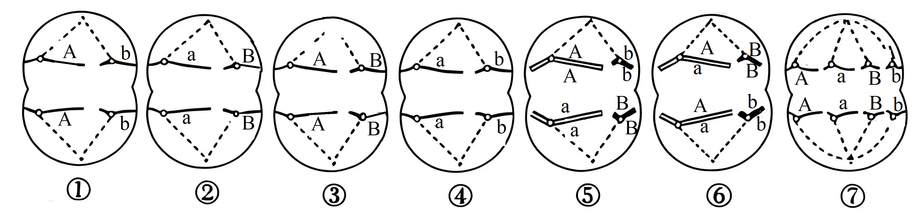
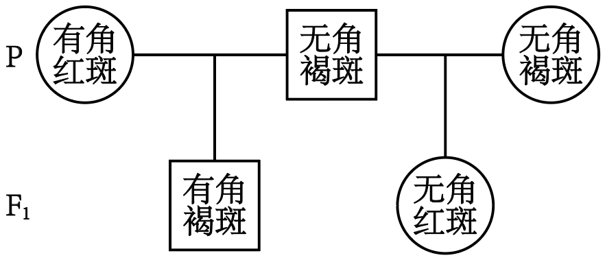
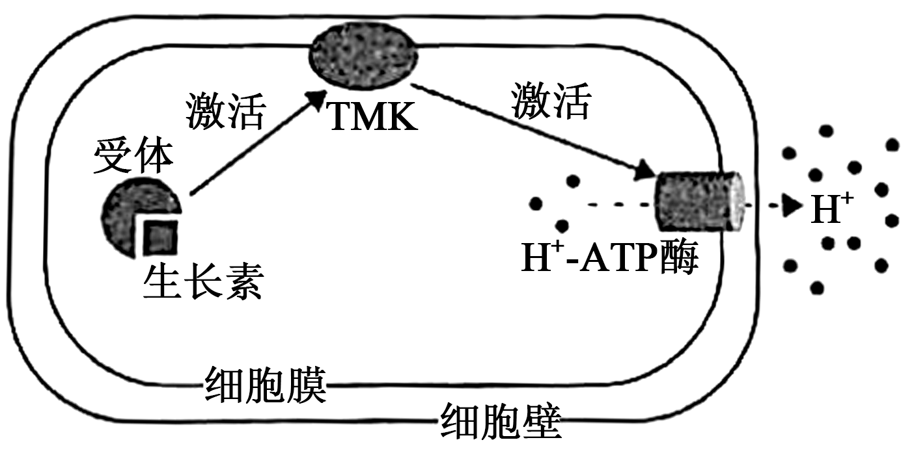
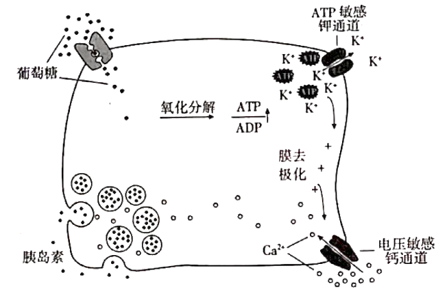

**2025年甘肃省普通高等学校招生统一考试生物学**

**注意事项：**

**1.答卷前，考生务必将自己的姓名、准考证号填写在答题卡上。**

**2.回答选择题时，选出每小题答案后，用2B铅笔把答题卡上对应题目的答案标号框涂黑。如需改动，用橡皮擦干净后，再选涂其他答案标号框。回答非选择题时，将答案写在答题卡上。写在本试卷上无效。**

**3.考试结束后，将本试卷和答题卡一并交回。**

**一、选择题：本题共16小题，每小题3分，共48分。在每小题给出的四个选项中，只有一项是符合题目要求的。**

1\. 地达菜又称地木耳，是由念珠蓝细菌形成的胶质群体。关于地达菜的细胞，下列叙述错误的是（　　）

A. 没有叶绿体，但是能够进行光合作用

B. 没有中心体，细胞不会进行有丝分裂

C. 含有核糖体，能合成细胞所需蛋白质

D. 有细胞骨架，有助于维持细胞的形态

【答案】D

【解析】

【分析】真核细胞和原核细胞的区别：

（1）原核细胞没有核膜包被的细胞核，真核细胞有细胞核；

（2）原核细胞没有染色体，真核细胞含有染色体；

（3）原核细胞只具有一种细胞器—核糖体，真核细胞含有多种类型的细胞器（核糖体、线粒体、叶绿体、内质网、高尔基体、溶酶体等）。

【详解】A、念珠蓝细菌没有叶绿体，但含有叶绿素和藻蓝素，能够进行光合作用，A正确；

B、中心体存在于动物细胞和低等植物细胞中，念珠蓝细菌是原核生物，没有中心体，原核细胞进行二分裂，而不是有丝分裂，有丝分裂是真核细胞的分裂方式，B正确；

C、原核细胞含有核糖体，核糖体是合成蛋白质的场所，所以能合成细胞所需蛋白质，C正确；

D、细胞骨架是真核细胞中由蛋白质纤维组成的网架结构，原核细胞没有细胞骨架，D错误。

故选D。

2\. 马铃薯是世界第四大主粮作物。甘肃“定西马铃薯”是中国国家地理标志产品，富含淀粉等营养物质。下列叙述正确的是（　　）

A. 淀粉是含有C、H、O、N等元素的一类多糖

B. 淀粉水解液中加入斐林试剂立刻呈现砖红色

C. 淀粉水解为葡萄糖和果糖后可以被人体吸收

D. 食用过多淀粉类食物可使人体脂肪含量增加

【答案】D

【解析】

【分析】某些化学试剂能够使生物组织中的相关化合物产生特定的颜色反应。糖类中的还原糖，如葡萄糖，与斐林试剂发生作用，生成砖红色沉淀。

【详解】A、淀粉作为多糖，其组成元素只有C、H、O，并不含N元素，A错误；

B、淀粉水解液中含有葡萄糖，葡萄糖是还原糖，但使用斐林试剂检测还原糖时，需要水浴加热才能出现砖红色沉淀，不是立刻呈现砖红色，B错误；

C、淀粉水解的最终产物是葡萄糖，而不是葡萄糖和果糖，葡萄糖可以被人体吸收，C错误；

D、淀粉在人体内可以转化为葡萄糖，当人体摄入过多的淀粉类食物，葡萄糖会在体内进一步转化为脂肪等物质储存起来，从而使人体脂肪含量增加，D正确。

故选D。

3\. 线粒体在足量可氧化底物和ADP存在的情况下发生的呼吸称为状态3呼吸，可用于评估线粒体产生ATP的能力。若分别以葡萄糖、丙酮酸和NADH为可氧化底物测定离体线粒体状态3呼吸速率，下列叙述正确的是（　　）

A. 状态3呼吸不需要氧气参与

B. 状态3呼吸的反应场所是线粒体基质

C. 以葡萄糖为底物测定的状态3呼吸速率为0

D. 相比NADH，以丙酮酸为底物的状态3呼吸速率较大

【答案】C

【解析】

【分析】有氧呼吸的第一、二、三阶段的场所依次是细胞质基质、线粒体基质和线粒体内膜，有氧呼吸第一阶段是葡萄糖分解成丙酮酸和NADH，合成少量ATP，第二阶段是丙酮酸和水反应生成二氧化碳和NADH，合成少量ATP，第三阶段是氧气和NADH反应生成水，合成大量ATP。

【详解】A、线粒体在足量可氧化底物和ADP存在的情况下发生的呼吸称为状态3呼吸，若以NADH为可氧化底物测定离体线粒体状态3呼吸速率，此时状态3呼吸的场所是线粒体内膜，所以需要氧气参与，A错误；

B、若以NADH为可氧化底物测定离体线粒体状态3呼吸速率，此时状态3呼吸的场所是线粒体内膜，B错误；

C、葡萄糖不能直接进入线粒体进行氧化分解，需要在细胞质基质中分解为丙酮酸后才能进入线粒体，所以以葡萄糖为底物测定的状态3呼吸速率为0，C正确；

D、NADH可直接参与有氧呼吸第三阶段，而丙酮酸需先经过有氧呼吸第二阶段产生NADH等物质后再参与第三阶段，所以相比丙酮酸，以NADH为底物的状态3呼吸速率较大，D错误。

故选C。

4\. 绝大多数细胞在经历有限次数的分裂后不再具有增殖能力而进入衰老状态。癌细胞具有较高的端粒酶活性，能防止端粒缩短、体外培养时可无限增殖不衰老。关于细胞衰老，下列叙述错误的是（　　）

A. 衰老的细胞中细胞核形态异常，核质间的物质交换频率降低

B. 细胞产生的自由基可以通过攻击DNA和蛋白质引起细胞衰老

C. 体外培养癌细胞时，培养液中加入端粒酶抑制剂可诱导癌细胞衰老

D. 将衰老细胞与去细胞核的年轻细胞融合，获得的融合细胞可以增殖

【答案】D

【解析】

【分析】端粒学说：每条染色体的两端都有一段特殊序列的DNA，称为端粒。端粒DNA序列在每次细胞分裂后会缩短一截。随着细胞分裂次数的增加，截短的部分会逐渐向内延伸。在端粒DNA序列被“截”短后，端粒内侧的正常基因的DNA序列就会受到损伤，结果使细胞活动渐趋异常。端粒酶是一种逆转录酶，以自身的RNA为模板，在其蛋白质组分的催化下合成端粒DNA序列，从而提高细胞分裂能力。

【详解】A、衰老细胞的细胞核体积增大，核膜内折，染色质固缩，导致核质间物质交换效率降低，A正确；

B、自由基学说指出，自由基攻击DNA、蛋白质等生物大分子，引起结构和功能损伤，导致细胞衰老，B正确；

C、癌细胞依赖端粒酶维持端粒长度以无限增殖，抑制端粒酶活性会导致端粒缩短，最终引发癌细胞衰老，C正确；

D、衰老与细胞核密切相关，融合细胞的核来自衰老细胞，即使细胞质年轻，仍无法恢复增殖能力，D错误。

故选D。

5\. 某动物（2n=4）的基因型为AaBb，有一对长染色体和一对短染色体。A/a和B/b基因是独立遗传的，位于不同对的染色体上。关于该动物的细胞分裂（不考虑突变），下列叙述错误的是（　　）

A. 图①、②、③和④代表减数分裂Ⅱ后期细胞，最终形成Ab、aB、AB和ab四种配子

B. 同源染色体分离，形成图⑤减数分裂Ⅰ后期细胞，进而产生图①和②两种子细胞

C. 非姐妹染色单体互换，形成图⑥减数分裂Ⅰ后期细胞，进而产生图③和④两种子细胞

D. 图⑦代表有丝分裂后期细胞，产生的子代细胞在遗传信息上与亲代细胞保持一致

【答案】C

【解析】

【分析】基因的自由组合定律的实质是：位于非同源染色体上的非等位基因的分离或组合是互不干扰的；在减数分裂过程中，同源染色体上的等位基因彼此分离的同时，非同源染色体上的非等位基因自由组合。

【详解】A、对于图①、②、③和④，观察染色体形态，无同源染色体且着丝粒分裂，属于减数分裂Ⅱ后期细胞，但该动物为雄性（从图⑤、⑥细胞质均等分裂可判断），经过减数分裂Ⅱ产生的是精细胞，经减数分裂最终形成Ab、aB、AB和ab四种精细胞（不考虑突变），A正确；

B、观察图⑤，同源染色体分离，非同源染色体自由组合，细胞质均等分裂，这是减数分裂Ⅰ后期细胞（雄性），其产生的子细胞为次级精母细胞，图①和②符合次级精母细胞减数分裂Ⅱ后期的情况，所以能产生图①和②两种子细胞，B正确；

C、观察图⑥，非姐妹染色单体互换发生在减数分裂Ⅰ前期，形成图⑥减数分裂Ⅰ后期细胞（同源染色体分离），其产生的子细胞为次级精母细胞，到达减数分裂Ⅱ后期时一个细胞的一条染色体上含有基因A和B，另一条染色体上含有基因a和B，另一个细胞的一条染色体上含有基因A和b，另一条染色体上含有基因a和b，不符合图③和④，C错误；

D、分析图⑦，有同源染色体且着丝粒分裂，这代表有丝分裂后期细胞，有丝分裂产生的子代细胞在遗传信息上与亲代细胞保持一致，D正确。

故选C。

6\. 某种牛常染色体上的一对等位基因H（无角）对h（有角）完全显性。体表斑块颜色由另一对独立的常染色体基因（M褐色/m红色）控制，杂合态时公牛呈现褐斑，母牛呈现红斑。在下图的杂交实验中，亲本公牛的基因型是（　　）

A. HhMm B. HHMm C. HhMM D. HHMM

【答案】A

【解析】

【分析】基因的自由组合定律的实质是：位于非同源染色体上的非等位基因的分离或组合是互不干扰的；在减数分裂过程中，同源染色体上的等位基因彼此分离的同时，非同源染色体上的非等位基因自由组合。

【详解】A、若亲本公牛基因型为HhMm（无角褐斑），有角红斑母牛基因型为hhMm，对于有角和无角这对性状，Hh×hh后代会出现有角（hh）和无角（Hh）个体，对于体表斑块颜色这对性状，Mm×Mm 后代会出现MM、Mm和mm个体，F1公牛和母牛均会出现有角褐斑，若无角褐斑公牛的基因型为HhMm，无角褐斑母牛的基因型为H-MM，二者杂交后代会出现无角红斑母牛（H-Mm），A正确；

B、若亲本无角褐斑公牛基因型为HHMm，有角红斑母牛基因型为hhMm，对于有角和无角这对性状，HH×hh后代全部为无角（Hh），不符合子代的表型，B错误；

C、若亲本无角褐斑公牛基因型为HhMM，有角红斑母牛基因型为hhMm，后代会出现有角褐斑公牛（hhM-）或者有角褐斑母牛（hhMM），若无角褐斑公牛基因型为HhMM，无角褐斑母牛基因型为H-MM，子代不会出现无角红斑（H-Mm或H-mm），不符合子代表型，C错误；

D、若亲本无角褐斑公牛基因型为HHMM，有角红斑母牛基因型为hhMm，对于有角和无角这对性状，HH×hh后代全部为无角（Hh），不符合子代表型，D错误。

故选A。

7\. 我国古生物化石种类繁多。其中，在甘肃和政县发现的以铲齿象、和政羊与三趾马为代表的古脊椎动物化石群具有极高的研究价值。下列叙述错误的是（　　）

A. 铲齿象、和政羊与三趾马化石可以为研究哺乳动物的进化提供直接证据

B. 根据铲齿象特有的下颌和牙齿形态特征，可以推断它的食性和生活环境

C. 通过自然作用保存在地层中的和政羊、三趾马等动物的粪便不属于化石

D. 不借助化石而通过现生生物的比较分析也可以推断生物进化的部分历史

【答案】C

【解析】

【分析】化石是指通过自然作用保存在地层中的古代生物的遗体、遗物、生活痕迹等。化石是研究生物进化最直接最重要的证据。比如从动物的牙齿化石推测他们的饮食情况；从动物的骨骼化石推测其体型大小和运动方式。

【详解】A、化石是研究生物进化的直接证据，铲齿象、和政羊与三趾马化石属于哺乳动物化石，能够为研究哺乳动物的进化提供直接证据，A正确；

B、生物的形态结构与其食性和生活环境相适应，根据铲齿象特有的下颌和牙齿形态特征，比如牙齿的尖锐程度、咀嚼面的形状等，可以推断它的食性（是植食性、肉食性还是杂食性等）和生活环境（如在陆地、水中等），B正确；

C、化石是指通过自然作用保存在地层中的古代生物的遗体、遗物或生活痕迹等，动物的粪便属于遗物，通过自然作用保存在地层中的和政羊、三趾马等动物的粪便属于化石，C错误；

D、不借助化石，通过对现生生物的比较分析，比如比较不同生物的基因序列、形态结构等，也可以推断生物进化的部分历史，D正确。

故选C。

8\. 内环境稳态对人体的健康至关重要。下列生理调节过程不属于人体内环境稳态调节的是（　　）

A. 血钾升高时，可通过醛固酮调节肾脏排出更多的钾离子，以维持血钾浓度相对稳定

B. 环境温度高于30℃时，汗腺分泌汗液，汗液汽化时带走热量，以维持体温相对稳定

C. 缺氧时，呼吸加深加快，机体从外界获取更多的氧，以维持血液中氧含量相对稳定

D. 胃酸分泌过多时，通过负反馈作用抑制胃酸分泌，以维持胃中的pH值相对稳定

【答案】D

【解析】

【分析】内环境稳态的调节：

（1）实质：体内渗透压、温度、pH等理化特性和化学成分呈现动态平衡的过程；

（2）定义：在神经系统和体液的调节下，通过各个器官、系统的协调活动，共同维持内环境相对稳定的状态；

（3）调节机制：神经—体液—免疫调节网络；

（4）意义：机体进行正常生命活动的必要条件。

【详解】A、血钾升高时，通过醛固酮调节肾脏排出更多钾离子，维持血钾浓度相对稳定，钾离子在血浆等内环境中，该调节属于内环境稳态调节，A正确；

B、环境温度高于30℃时，汗腺分泌汗液，汗液汽化带走热量，维持体温相对稳定，体温调节涉及内环境的温度平衡，属于内环境稳态调节，B正确；

C、缺氧时，呼吸加深加快，机体从外界获取更多氧，维持血液（包括血浆和血细胞）中氧含量相对稳定，血液中的氧含量在内环境中体现，属于内环境稳态调节，C正确；

D、胃中的环境不属于内环境，胃酸分泌过多时，通过负反馈作用抑制胃酸分泌，维持胃中的pH值相对稳定，这不属于内环境稳态调节，D错误。

故选D。

9\. 现代生理学中将能发生动作电位的细胞称为可兴奋细胞，动作电位是在静息电位的基础上产生的膜电位变化。关于可兴奋细胞的静息电位和动作电位，下列叙述错误的是（　　）

A. 静息状态下细胞内的K+浓度高于细胞外，在动作电位发生时则相反

B. 胞外K+浓度降低时，静息电位的绝对值会变大，动作电位不易发生

C. 动作电位发生时，细胞膜对Na+的通透性迅速升高，随后快速回落

D. 由主动运输建立的跨膜离子浓度梯度是动作电位发生的必要条件

【答案】A

【解析】

【分析】静息时，神经细胞膜对钾离子的通透性大，钾离子大量外流，形成内负外正的静息电位；受到刺激后，神经细胞膜的通透性发生改变，对钠离子的通透性增大，钠离子内流，形成内正外负的动作电位。兴奋部位和非兴奋部位形成电位差，产生局部电流，兴奋就以电信号的形式传递下去。

【详解】A、静息状态下细胞内的K+浓度高于细胞外，动作电位发生时，Na+内流，但细胞内K+浓度依然高于细胞外，A错误；

B、胞外K+浓度降低时，K+外流增多，静息电位的绝对值会变大，且此时细胞更不容易兴奋，动作电位不易发生，B正确；

C、动作电位发生时，细胞膜对Na+的通透性迅速升高，Na+内流形成动作电位，随后通透性快速回落，C正确；

D、由主动运输建立的跨膜离子浓度梯度（如细胞内K+浓度高，细胞外Na+浓度高）是动作电位发生的必要条件，D正确。

故选A。

10\. 机体接触“非己”物质时，免疫系统能够产生免疫反应。下列叙述错误的是（　　）

A 花粉等过敏原可刺激T细胞产生抗体引发过敏反应

B. 机体对“非己”物质产生免疫反应时可引起自身免疫病

C. 获得性免疫缺陷病可以通过切断传播途径进行预防

D. 使用免疫抑制剂可有效提高异体器官移植的成功率

【答案】A

【解析】

【分析】本题考察免疫系统的反应机制及相关疾病。需结合过敏反应、自身免疫病、免疫缺陷病及器官移植的知识点进行判断。

【详解】A、抗体由浆细胞（效应B细胞）分泌，T细胞不能产生抗体。过敏反应中，过敏原会刺激B细胞活化并在T细胞辅助下分化为浆细胞，由浆细胞产生抗体（如IgE），A错误；

B、当免疫系统对“非己”物质（如与自身结构相似的抗原）产生免疫反应时，可能因交叉反应攻击自身组织，导致自身免疫病，B正确；

C、获得性免疫缺陷病（如艾滋病）属于传染病，可通过切断传播途径（如血液、性接触传播）进行预防，C正确；

D、异体器官移植的排斥反应由细胞免疫介导，使用免疫抑制剂可降低免疫系统活性，从而提高移植成功率，D正确；

故选A。

11\. 生长素可促进植物细胞伸长生长，其作用机制之一是通过激活质膜H+-ATP酶，导致细胞壁酸化，活化细胞壁代谢相关的酶。拟南芥跨膜激酶TMK参与了这一过程，它与生长素受体、质膜H+-ATP酶的关系如下图所示。下列叙述正确的是（　　）

A. 生长素促进细胞伸长生长的过程与呼吸作用无关

B. 碱性条件下生长素促进细胞伸长生长的作用增强

C. 生长素受体可以结合吲哚乙酸或苯乙酸

D. TMK功能缺失突变体的生长较野生型快

【答案】C

【解析】

【分析】生长素的 主要合成部位：幼嫩的芽、叶和发育中的种子，这些部位的细胞具有较强的分裂和代谢能力。 主要由色氨酸经过一系列生化反应转变而来。在一定浓度范围内，生长素能促进细胞伸长，尤其是对植物茎段的生长促进作用明显。但浓度过高会抑制生长。还具有促进果实发育的作用。

【详解】A、从图中可知，生长素激活质膜H+-ATP酶需要消耗能量，而细胞中的能量主要由呼吸作用提供，所以生长素促进细胞伸长生长的过程与呼吸作用有关，A错误；

B、因为生长素通过激活质膜H+-ATP酶导致细胞壁酸化来促进细胞伸长，碱性条件会抑制这一酸化过程，所以碱性条件下生长素促进细胞伸长生长的作用减弱，B错误；

C、生长素的化学本质是吲哚乙酸，苯乙酸也是生长素类似物，生长素受体可以结合吲哚乙酸或苯乙酸来发挥作用，C正确；

D、由于TMK参与生长素促进细胞伸长的过程，TMK功能缺失突变体无法正常进行这一过程，其生长会比野生型慢，D错误。

故选C。

12\. 种群数量受出生率、死亡率、迁入率和迁出率的影响，任何能够引起这些特征变化的生物和非生物因素，如光照、水分、温度、食物、年龄结构和性别比例等，都会影响种群的数量。下列叙述正确的是（　　）

A. 自然种群中的个体可以迁入和迁出，种群数量的变化不受种群密度的制约

B. 光照、水分、温度和食物等因子的变化都能够引起种群环境容纳量的变化

C. 幼年、成年和老年个体数量大致相等的种群，其数量可以保持稳定性增长

D. 种群中不同年龄个体的数量和雌雄比例都能影响种群的出生率和死亡率

【答案】B

【解析】

【分析】种群的数量特征包括出生率和死亡率、迁入率和迁出率、年龄结构和性别比例等。生物因素和非生物因素都会影响种群数量的变化。

【详解】A、自然种群中的个体可以迁入和迁出，种群数量的变化会受种群密度的制约。当种群密度过大时，种内竞争加剧，会影响出生率、死亡率、迁入率和迁出率，从而影响种群数量，A错误；

B、环境容纳量（K值）由资源、空间、气候等非生物因素决定。光照、水分、温度和食物等因子的变化会直接改变资源供给或生存条件，从而引起K值变化，B正确；

C、幼年、成年和老年个体数量大致相等的种群，其年龄结构为稳定型，种群数量应该保持相对稳定，而不是稳定性增长，C错误；

D、种群中不同年龄个体的数量（年龄结构）能影响种群的出生率和死亡率，性别比例主要影响种群的出生率，一般不影响死亡率，D错误。

故选B。

13\. 风眼蓝原产于美洲，最初作为观赏花卉引入我国。数十年后，风眼蓝逃逸到野外，在湖泊、河流蔓延，造成河道堵塞、水生生物死亡，变成外来入侵种。关于此现象，下列叙述错误的是（　　）

A. 外来物种可影响生态系统，但不一定都成为外来入侵种

B. 凤眼蓝生物量的快速增长，有利于水生生态系统的稳定

C. 凤眼蓝扩散到湖泊、河流，改变了水生生态系统的结构

D. 凤眼蓝蔓延侵害土著生物，影响群落内物种的相互关系

【答案】B

【解析】

【分析】生态系统的结构包括组成成分和食物链、食物网，组成成分包括生产者、消费者、分解者和非生物的物质和能量，营养结构（食物链、食物网）越复杂，生态系统越稳定。

【详解】A、外来物种进入新的生态系统后，有的可能被生态系统中的生物和环境所制约，不会大量繁殖破坏生态平衡，所以不一定都成为外来入侵种，A正确；

B、凤眼蓝作为外来入侵种，其生物量快速增长会占据大量空间和资源，导致其他水生生物生存空间和资源减少，造成河道堵塞、水生生物死亡，不利于水生生态系统的稳定，B错误；

C、凤眼蓝扩散到湖泊、河流，大量繁殖改变了原有的生物种类和数量分布，进而改变了水生生态系统的结构，C正确；

D、凤眼蓝蔓延会与土著生物竞争资源等，侵害土著生物，从而影响群落内物种的相互关系，比如种间竞争、捕食等关系，D正确。

故选B。

14\. 正确认识与理解生态系统的能量流动规律、对合理保护与利用生态系统有重要意义。下列叙述正确的是（　　）

A. 提高传递效率就能增加营养级的数量

B. 呼吸作用越大，能量的传递效率就越大

C. 生物量金字塔也可以出现上宽下窄的情形

D. 能流的单向性决定了人类不能调整能流关系

【答案】C

【解析】

【分析】生态金字塔是指各个营养级之间的数量关系，这种数量关系可采用生物量单位、能量单位和个体数量单位，采用这些单位所构成的生态金字塔就分别称为生物量金字塔、能量金字塔和数量金字塔。一般而言，生态金字塔呈现正金字塔形。

【详解】A、能量传递效率一般是固定的，为10%-20%，不能提高，而且营养级的数量主要取决于生态系统中的能量总量等因素，而不是传递效率，A错误；

B、摄入量=同化量+粪便，同化量=呼吸作用散失+用于自身生长发育和繁殖的能量，而传递效率等于相邻两营养级同化量之比，与呼吸作用无直接关系，呼吸作用越大，则用于生长发育繁殖的能量就越少，B错误；

C、生物量金字塔是按照各营养级生物的总生物量绘制而成的金字塔，在一些特殊情况下，比如海洋生态系统中，由于浮游植物个体小、寿命短，且不断被浮游动物捕食，可能会出现生物量金字塔上宽下窄的情形，C正确；

D、人类可以通过合理调整生态系统中的能量流动关系，使能量持续高效地流向对人类最有益的部分，比如合理确定草场的载畜量、对农作物进行合理密植等，D错误。

故选C。

15\. 我国葡萄酒酿造历史悠久、传统发酵技术延续至今。发酵工程通过选育菌种和控制发酵条件等措施可优化传统发酵工艺，改善葡萄酒品质。下列叙述错误的是（　　）

A. 传统发酵时，葡萄果皮上的多种微生物参与了葡萄酒的发酵过程

B. 工业化生产时，酵母菌需在无氧条件下进行扩大培养和酒精发酵

C. 通过诱变育种或基因工程育种能够改良葡萄酒发酵菌种的性状

D. 大规模发酵时，需要监测发酵温度、pH值、罐压及溶解氧等参数

【答案】B

【解析】

【分析】发酵工程，是指采用现代工程技术手段，利用微生物的某些特定功能，为人类生产有用的产品，或直接把微生物应用于工业生产过程的一种新技术。发酵工程的内容包括菌种的选育、培养基的配制、灭菌、扩大培养和接种、发酵过程和产品的分离提纯等方面。

【详解】A、在传统发酵制作葡萄酒时，葡萄果皮上附着有多种微生物，如酵母菌等，这些微生物参与了葡萄酒的发酵过程，A正确；

B、工业化生产时，酵母菌在有氧条件下进行有氧呼吸，能大量繁殖，进行扩大培养，在无氧条件下进行酒精发酵产生酒精，B错误；

C、通过诱变育种（利用物理、化学等因素诱导基因突变）或基因工程育种（定向改造生物的基因）能够改良葡萄酒发酵菌种（如酵母菌）的性状，比如提高发酵效率等，C正确；

D、大规模发酵时，发酵温度、pH值、罐压及溶解氧等参数会影响微生物的生长和代谢，进而影响发酵过程和产品质量，所以需要监测这些参数，D正确。

故选B。

16\. 肿瘤坏死因子α（TNF-α）是一种细胞因子，高浓度时可以引发疾病。研究者利用细胞工程技术制备了TNF-α的单克隆抗体，用于治疗由TNF-α引发的疾病，制备流程如下图。下列叙述正确的是（　　）

A. ①是从小鼠的血液中获得的骨髓瘤细胞

B. ②含未融合细胞、同种核及异种核融合细胞

C. ③需用特定培养基筛选得到大量的杂交瘤细胞

D. ④需在体外或小鼠腹腔进行克隆化培养和抗体检测

【答案】B

【解析】

【分析】单克隆抗体制备流程：先给小鼠注射特定抗原使之发生免疫反应，之后从小鼠脾脏中获取已经免疫的B淋巴细胞；诱导B细胞和骨髓瘤细胞融合，利用选择培养基筛选出杂交瘤细胞；进行抗体检测，筛选出能产生特定抗体的杂交瘤细胞；进行克隆化培养，即用培养基培养和注入小鼠腹腔中培养；最后从培养液或小鼠腹水中获取单克隆抗体。

【详解】A、骨髓瘤细胞应该从骨髓中获取，A错误；

B、B细胞和骨髓瘤细胞的融合是随机的，可能有些细胞不发生融合，有些两两融合，有些多个融合，有同种核融合细胞，也有异种核融合细胞，B正确；

C、诱导B细胞和骨髓瘤细胞融合，利用选择培养基筛选出杂交瘤细胞，但不能得到大量的，C错误；

D、进行克隆化培养，即用培养基培养和注入小鼠腹腔中培养，抗体检测不是在小鼠腹腔内进行，D错误。

故选B。

**二、非选择题：本题共5小题，共52分。**

17\. 波长为400~700nm的光属于光合有效辐射（PAR），其中400~500nm为蓝光（B），600~700nm为红光（R）。远红光（700~750nm，FR）通常不能用于植物光合作用，但可作为信号调节植物的生长发育。研究者测定了某高大作物冠层中A（高）和B（低）两个位置的PAR、红光/远红光比例（R/FR）和叶片指标（厚度、叶绿素含量、线粒体暗呼吸），并分析了施氮肥对以上指标的影响，结果如下表。回答下列问题。

<table style="width:84%;">
<colgroup>
<col style="width: 13%" />
<col style="width: 7%" />
<col style="width: 7%" />
<col style="width: 17%" />
<col style="width: 22%" />
<col style="width: 15%" />
</colgroup>
<tbody>
<tr>
<td style="text-align: left;">冠层位置</td>
<td style="text-align: left;">PAR</td>
<td style="text-align: left;">R/FR</td>
<td style="text-align: left;">叶片厚度（μm）</td>
<td style="text-align: left;">叶绿素含量（μg·g-1）</td>
<td style="text-align: left;">线粒体暗呼吸</td>
</tr>
<tr>
<td style="text-align: left;">
A

B

A（施氮肥）

B（施氮肥）
</td>
<td style="text-align: left;">
0.90

0.20

0.70

0.02
</td>
<td style="text-align: left;">
3.40

0.29

1.75

0.01
</td>
<td style="text-align: left;">
160

100

150

—
</td>
<td style="text-align: left;">
0.15

0.20

0.28

—
</td>
<td style="text-align: left;">
1.08

1.08

1.08

—
</td>
</tr>
</tbody>
</table>

（1）植物叶片中\_\_\_\_\_\_\_\_\_\_可吸收红光用于光合作用，\_\_\_\_\_\_\_\_\_\_可吸收少量的红光和远红光作为光信号，导致B位置PAR和R/FR较A位置低；\_\_\_\_\_\_\_\_\_\_虽不能吸收红光，但可吸收蓝光，也可使B位置PAR降低。

（2）由表中数据可知，施氮肥\_\_\_\_\_\_\_\_\_\_（填“提高”或“降低”）了冠层叶片对太阳光的吸收，其可能的原因是\_\_\_\_\_\_\_\_\_\_。

（3）光补偿点是指光合作用中吸收的CO2与呼吸作用中释放的CO2相等时的光照强度。研究者分析了冠层A、B处的叶片（未施氮肥）在不同光照强度下的净光合作用速率（下图），发现冠层\_\_\_\_\_\_\_\_\_\_位置的叶片具有较高的光补偿点，由表中数据可知其主要原因是\_\_\_\_\_\_\_\_\_\_。

【答案】（1） ①. 叶绿素 ②. 光敏色素 ③. 类胡萝卜素

（2） ①. 提高 ②. 施氮肥促进了叶绿素合成和叶片生长，增加了叶片的光捕获能力，导致冠层整体吸光增强，透射到下层的PAR减少。

（3） ①. B ②. A处叶片线粒体呼吸与B处相同，但叶绿素含量低于B处，其吸收转化传递光能弱于B处，故需要增大光照强度，叶片具有较高的光补偿点。

【解析】

【分析】光合色素包括叶绿素（主要是叶绿素a和b）、类胡罗卜素，叶绿素主要吸收蓝紫光和红光，类胡萝卜素吸主要收蓝紫光。光敏色素是一种光受体蛋白，能够感受光刺激，调控植物的生长发育。

【小问1详解】

叶绿素（主要是叶绿素a和b）是光合作用中的主要色素，能吸收红光（600-700nm）用于光反应。光敏色素是一种光受体蛋白，能吸收红光（R, 600-700nm）和远红光（FR, 700-750nm），并通过构象变化传递光信号，调节植物生长发育。在冠层中，B位置（低处）的R/FR较低，这是因为上层叶片吸收了更多红光，导致下层红光减少、远红光相对增多，从而降低了R/FR比例。类胡萝卜素（如β-胡萝卜素、叶黄素）主要吸收蓝光（400-500nm），不吸收红光；在冠层中，上层叶片的类胡萝卜素吸收蓝光，减少了透射到下层的蓝光，导致B位置PAR降低。

【小问2详解】

由表中数据可知，施氮肥提高了冠层叶片对太阳光的吸收，其可能的原因是施氮肥促进了叶绿素合成和叶片生长，增加了叶片的光捕获能力，导致冠层整体吸光增强，透射到下层的PAR减少。

【小问3详解】

A处叶片线粒体呼吸与B处相同，但叶绿素含量低于B处，其吸收转化传递光能弱于B处，故需要增大光照强度，叶片具有较高的光补偿点。

18\. 糖尿病严重危害人类的健康。受环境和生活方式变化的影响，糖尿病的发病率近年来呈上升趋势。科学家研究发现，其发病机理与血糖调节直接相关，而胰岛素是调节血糖最重要的激素之一。回答下列问题。

（1）胰岛素能\_\_\_\_\_\_\_\_\_\_肌细胞和肝细胞的糖原合成，\_\_\_\_\_\_\_\_\_\_非糖物质转化成葡萄糖。

（2）血糖水平是调节胰岛B细胞分泌胰岛素的最主要因素，机制如下图所示，其中膜去极化的原因是ATP/ADP比例的升高使钾离子通道的开放概率\_\_\_\_\_\_\_\_\_\_。图中呈现的物质跨膜运输方式共有\_\_\_\_\_\_\_\_\_\_种。

（3）科学家在早期的研究中将胰脏研磨并制备提取物，注射到由胰腺受损诱发糖尿病的实验狗体内，血糖没有明显下降，最可能的原因是\_\_\_\_\_\_\_\_\_\_。

（4）胰岛素受体功能异常也可以影响血糖的调节。利用基因工程方法制备的MKR小鼠的胰岛素受体功能受损，导致胰岛素靶细胞对胰岛素敏感性下降。某研究小组拟通过实验探究胰岛素受体功能在血糖调节中的作用，部分实验步骤和结果如下。完善实验步骤并预测结果。

①实验分两组，A组：MKR小鼠5只，B组：正常小鼠5只；

②两组小鼠均禁食10小时，取少量血液，测定\_\_\_\_\_\_\_\_\_\_和\_\_\_\_\_\_\_\_\_\_，结果表明，两组间没有显著差异；

③分别给两组小鼠静脉注射葡萄糖溶液，30分钟后取少量血液，测定以上两项指标，预期实验结果为\_\_\_\_\_\_\_\_\_\_。

【答案】（1） ①. 促进 ②. 抑制

（2） ①. 降低 ②. 2##二

（3）胰岛素被胰蛋白酶分解

（4） ①. 血糖浓度 ②. 胰岛素浓度 ③. A组血糖浓度高于B组，胰岛素浓度也高于B组

【解析】

【分析】胰岛素是唯一能够降低血糖浓度的激素，体内胰岛素水平的上升，一方面促进血糖进入组织细胞进行氧化分解，进入肝、肌肉并合成糖原，进入脂肪细胞和肝细胞转变为甘油三酯等；另一方面又能抑制肝糖原的分解和非糖物质转变成葡萄糖。这样既增加了血糖的去向，又减少了血糖的来源，使血糖浓度恢复到正常水平。

【小问1详解】

胰岛素是唯一降血糖的激素，作用是促进肌细胞、肝细胞合成糖原，抑制非糖物质（如氨基酸、脂肪 ）转化为葡萄糖从而降低血糖浓度。

【小问2详解】

血糖升高→葡萄糖进入细胞→ 氧化分解使ATP/ADP比例上升→钾离子通道关闭（开放概率降低→ K+外流减少→细胞膜去极化。葡萄糖（协助扩散 ）、K+（协助扩散 ）、Ca2+（协助扩散 ）、胰岛素（胞吐）→ 跨膜方式为协助扩散和胞吐，共2种。

【小问3详解】

胰腺受损（如切除）的实验狗，注射胰腺研磨提取物（含胰岛素）但血糖未降→ 原因是研磨液中胰岛素被胰蛋白酶分解（胰腺含胰蛋白酶，会分解胰岛素 ）。

【小问4详解】

实验目的：探究胰岛素受体功能对血糖调节的影响（MKR 小鼠受体功能受损 ）。步骤②：禁食后测血糖浓度和胰岛素浓度→ 验证基础状态下两组小鼠无差异。步骤③：注射葡萄糖后，预期结果：A组（MKR小鼠，受体功能受损）→ 胰岛素不能有效发挥作用→ 血糖浓度较高，胰岛素浓度也较高（因血糖高刺激胰岛B细胞分泌，但受体不敏感，血糖难降）。B组（正常小鼠 ）→胰岛素正常作用→血糖浓度较低，胰岛素浓度正常→ 预期：A组血糖浓度高于B组，胰岛素浓度也高于B组。

19\. 高寒草甸在维持生物多样性、稳定大气二氧化碳平衡、涵养水源等方面有重要的作用。放牧过度时，草甸上一些牲畜喜食的植物会被大量啃食，而一些杂草如黄帚橐吾（含毒汁）获得更多生长空间，滋生蔓延，造成草原退化。为了探寻草原退化的防治对策，某研究小组调查了不同生境下黄帚橐吾的生长和繁殖情况，结果如下表。回答下列问题。

<table style="width:98%;">
<colgroup>
<col style="width: 11%" />
<col style="width: 13%" />
<col style="width: 15%" />
<col style="width: 21%" />
<col style="width: 15%" />
<col style="width: 20%" />
</colgroup>
<tbody>
<tr>
<td rowspan="2" style="text-align: left;">生境类型</td>
<td colspan="2" style="text-align: left;">植物群落特征</td>
<td colspan="3" style="text-align: left;">黄帚橐吾</td>
</tr>
<tr>
<td style="text-align: left;">盖度（%）</td>
<td style="text-align: left;">物种数（种）</td>
<td style="text-align: left;">种群密度（株/m2）</td>
<td style="text-align: left;">结实率（%）</td>
<td style="text-align: left;">种子数量（粒/株）</td>
</tr>
<tr>
<td style="text-align: left;">
沙地

坡地

滩地
</td>
<td style="text-align: left;">
35

90

60
</td>
<td style="text-align: left;">
8

19

21
</td>
<td style="text-align: left;">
75

26

24
</td>
<td style="text-align: left;">
100

65

93
</td>
<td style="text-align: left;">
125

17

74
</td>
</tr>
</tbody>
</table>

（1）从表中可知，黄帚橐吾滋生主要影响了群落的\_\_\_\_\_\_\_\_\_\_\_，使群落演替向\_\_\_\_\_\_\_\_\_\_\_自然演替的方向进行。

（2）上表中，影响黄帚橐吾结实率的生物因素是\_\_\_\_\_\_\_\_\_\_\_。

（3）从上述结果分析，在\_\_\_\_\_\_\_\_\_\_\_生境中黄帚橐吾种群数量最有可能出现衰退，判断依据是\_\_\_\_\_\_\_\_\_\_\_。

（4）有研究表明，一种双翅目蝇类幼虫会导致黄帚橐吾结实率大幅度下降，甚至不能形成种子，这两者的种间关系可能是\_\_\_\_\_\_\_\_\_\_\_、\_\_\_\_\_\_\_\_\_\_\_。

（5）根据以上材料，防治黄帚橐吾滋生的生物措施有\_\_\_\_\_\_\_\_\_\_\_（写出两条）。

【答案】（1） ①. 物种组成 ②. 逆行

（2）物种数（种间竞争 ）

（3） ①. 坡地 ②. 坡地生境中的黄帚橐吾种子数量最少，繁殖率最低

（4） ①. 寄生 ②. 捕食

（5）增加牲畜喜食植物的种植；引入黄帚橐吾的天敌（如双翅目蝇类幼虫 ）

【解析】

【分析】由表可知，黄帚橐吾滋生的沙地生境中，物种数仅为8种，显著低于坡地和滩地，这表明黄帚橐吾滋生减少了群落中的物种数量，即影响群落的物种组成。据题意，可通过引如黄帚橐吾的竞争者或天敌抑制其滋生繁殖。

【小问1详解】

表格中 “盖度、物种数” 是衡量群落物种组成的关键指标，不同生境物种数差异显著，体现群落物种组成变化 ，即黄帚橐吾滋生主要影响了群落的物种组成。黄帚橐吾滋生时，牲畜喜食植物被啃食，杂草抢占资源，导致群落物种数减少、结构简化， 符合逆行演替。

【小问2详解】

对比沙地、坡地、滩地的物种数和黄帚橐吾结实率，坡地物种数最多，种间竞争最激烈，黄帚橐吾与其他植物竞争阳光、水分、养分，竞争抑制了黄帚橐吾的繁殖，使其结实率降低。所以，影响结实率的生物因素是物种数（种间竞争 ） ，直接关联种间竞争对繁殖的抑制作用 。

【小问3详解】

种群数量衰退的核心依据是繁殖潜力低。坡地中，黄帚橐吾种子数量最少，种子是种群更新的基础，种子少意味着后续种群补充个体不足，种群数量最可能衰退。

【小问4详解】

双翅目蝇类幼虫导致黄帚橐吾结实率下降，可能与以下因素有关：寄生：幼虫寄生于黄帚橐吾，摄取营养，影响繁殖。捕食：幼虫取食花、果实等，导致无法结实。

【小问5详解】

依据生态原理设计措施：增加牲畜喜食植物：通过竞争关系，抢占黄帚橐吾的生存空间、资源（阳光、养分 ），抑制其生长，利用种间竞争原理 。引入天敌：如释放双翅目蝇类幼虫（若其专一性寄生 / 捕食黄帚橐吾 ），降低其结实率，控制种群数量，利用捕食 / 寄生关系 。

20\. 大部分家鼠的毛色是鼠灰色，经实验室繁殖的毛色突变家鼠可以是黄色、棕色、黑色或者由此产生的各种组合色。已知控制某品系家鼠毛色的基因涉及常染色体上三个独立的基因位点A、B和D。A基因位点存在4个不同的等位基因：Ay决定黄色，A决定鼠灰色，at决定腹部黄色，a决定黑色，它们的显隐性关系依次为Ay\>A\>at\>a，其中Ay基因为隐性致死基因（AyAy的纯合鼠胚胎致死）。B基因位点存在2个等位基因：B（黑色）对b（棕色）为完全显性。回答下列问题。

（1）只考虑A基因位点时，可以产生的基因型有\_\_\_\_\_\_\_\_\_\_\_种，表型有\_\_\_\_\_\_\_\_\_\_\_种。

（2）基因型为AyaBb的黄色鼠杂交，后代表型及其比例为黄色鼠：黑色鼠：巧克力色鼠=8：3：1，产生这种分离比的原因是\_\_\_\_\_\_\_\_\_\_\_。

（3）黄腹黑背雌鼠和黄腹棕背雄鼠杂交，F1代产生了3/8黄腹黑背鼠，3/8黄腹棕背鼠，1/8黑色鼠和1/8巧克力色鼠。则杂交亲本基因型分别为♀\_\_\_\_\_\_\_\_\_\_\_，♂\_\_\_\_\_\_\_\_\_\_\_。

（4）D基因位点的D基因控制色素的产生，dd突变体呈现白化性状。让白化纯种鼠和鼠灰色纯种鼠杂交，F1代呈现鼠灰色。F1代雌雄鼠交配产生F2代的表型及其比例为鼠灰色：黑色：白化=9：3：4，则亲本白化纯种鼠的基因型为\_\_\_\_\_\_\_\_\_\_，F2代黑色鼠的基因型为\_\_\_\_\_\_\_\_\_\_

【答案】（1） ①. 9 ②. 4

（2）控制毛色的两对等位基因位于两对同源染色体上，遵循基因的自由组合定律，且AyAy纯合致死

（3） ①. ataBb ②. atabb

（4） ① aadd ②. aaD-（aaDD、aaDd）

【解析】

【分析】基因的分离定律的实质是：在杂合子的细胞中，位于一对同源染色体上的等位基因，具有一定的独立性；在减数分裂形成配子的过程中，等位基因会随同源染色体的分开而分 离，分别进入两个配子中，独立地随配子遗传给后代。

【小问1详解】

只考虑A基因位点，A基因位点存在4个不同的等位基因Ay、A、at、a ，从4个等位基因中选2个组成基因型（包括纯合子和杂合子），纯合子有AyAy（致死）、AA、atat、aa4种，杂合子有AyA、Ayat、Aya、Aa、Aat、ata6种，所以基因型共有10种，但由于AyAy纯合致死，实际存活的基因型有9种，由显隐性关系Ay\>A\>at\>a可知，表型有黄色（Ay-）、鼠灰色（A-）、腹部黄色（at-）、黑色（aa ），共4种。 

【小问2详解】

基因型为AyaBb的黄色鼠杂交，正常情况下Aya×Aya后代中AyAy：Aya：aa=1：2：1，由于AyAy致死，所以Aya：aa=2：1，Bb×Bb后代中B-：bb=3：1，按照自由组合定律，（2Aya：1aa）×（3B-：1bb），后代中黄色鼠（AyaB-、Ayabb）：黑色鼠（aaB-）：巧克力色鼠（aabb）=（2/3×3/4+2/3×1/4）：（1/3×3/4）：（1/3×1/4）=8/12：3/12：1/12=8：3：1，所以后代表型及其比例为黄色鼠：黑色鼠：巧克力色鼠=8：3：1的原因是控制毛色的两对等位基因位于两对同源染色体上，遵循基因的自由组合定律，且AyAy纯合致死。

【小问3详解】

黄腹黑背雌鼠（at-B-）和黄腹棕背雄鼠（at-bb）杂交，因为F1代产生了黑色鼠（aaB-）和巧克力色鼠（aabb），所以亲本都含有a和b基因，那么黄腹黑背雌鼠基因型为ataBb，黄腹棕背雄鼠基因型为atabb，二者杂交，F1代产生了3/8=3/4×1/2黄腹黑背鼠（at-Bb），3/8=3/4×1/2黄腹棕背鼠（at-bb），1/8=1/4×1/2黑色鼠（aaBb）和1/8=1/4×1/2巧克力色鼠（aabb）。

【小问4详解】

已知D基因位点的D基因控制色素的产生，dd突变体呈现白化性状，A决定鼠灰色，a决定黑色，F2代的表型及其比例为鼠灰色：黑色：白化=9：3：4，是9：3：3：1的变形，说明F1的基因型为AaDd，由于亲本是白化纯种鼠和鼠灰色纯种鼠，要得到F1为AaDd，则亲本白化纯种鼠的基因型为aadd，鼠灰色纯种鼠的基因型为AADD，二者杂交，F1的基因型为AaDd，F1代雌雄鼠交配，F2的基因型及比例为A-D-：aaD-：A-dd：aadd=9：3：3：1，表型之比为鼠灰色：黑色：白化=9：3：4，所以F2代黑色鼠的基因型为aaD-（aaDD、aaDd）。

21\. 水稻白叶枯病（植株的叶片上会出现逐渐扩大的黄白色至枯白色病斑）由白叶枯病菌引起，严重威胁水稻生产和粮食安全。科学家利用CRISPR-Cas9基因组编辑技术，对水稻白叶枯病的感病基因SWEET（该基因被白叶枯病菌利用以侵染水稻）的启动子区进行了定点“修改”，编辑后的水稻幼胚通过植物组织培养技术获得抗病植株（如下图）。回答下列问题。

（1）CRISPR-Cas9重组Ti质粒构建完成后，可通过\_\_\_\_\_\_\_\_\_\_（方法）将该质粒转入植物细胞，并将\_\_\_\_\_\_\_\_\_\_整合到该细胞的染色体上。为了能够筛选出转化成功的细胞，需要在植物组织培养基中添加\_\_\_\_\_\_\_\_\_\_。

（2）实验中用到的水稻幼胚在植物组织培养中被称为\_\_\_\_\_\_\_\_\_\_，对其消毒时需依次使用酒精和\_\_\_\_\_\_\_\_\_\_处理。诱导形成再生植株的过程中需使用生长素和细胞分裂素，原因是\_\_\_\_\_\_\_\_\_\_。

（3）为了检测基因编辑水稻是否成功，首先需采用\_\_\_\_\_\_\_\_\_\_技术检测目标基因的启动子区是否被成功编辑；然后，在个体水平需将基因编辑后的水稻与野生型水稻分别接种白叶枯病菌，通过比较\_\_\_\_\_\_\_\_\_\_来验证抗病性。

（4）在该研究中，基因编辑成功后的水稻可以抗白叶枯病的原因为\_\_\_\_\_\_\_\_\_\_。

【答案】（1） ①. 农杆菌转化法 ②. Ti质粒上的T - DNA ③. 潮霉素

（2） ①. 外植体 ②. 次氯酸钠 ③. 生长素和细胞分裂素是启动细胞分裂、脱分化和再分化的关键激素

（3） ①. PCR - 测序 ②. 病斑的大小（或病斑面积、发病情况等合理答案）

（4）对感病基因SWEET的启动子区进行定点修改后，白叶枯病菌无法利用该基因侵染水稻。

【解析】

【分析】基因工程的基本操作程序包括：目的基因的获取、基因表达载体的构建、将目的基因导入受体细胞，目的基因的检测和鉴定。植物组织培养技术是指在无菌和人工控制的环境条件下，将离体的植物器官（如根、茎、叶、花、果实等）、组织、细胞以及原生质体，培养在人工配制的培养基上，给予适宜的培养条件，使其长成完整植株的技术。

【小问1详解】

将重组Ti质粒转入植物细胞常用农杆菌转化法。因为农杆菌中的Ti质粒上的T - DNA（可转移DNA）能够整合到植物细胞的染色体DNA上。利用农杆菌侵染植物细胞，从而将重组Ti质粒导入植物细胞。为了筛选出转化成功的细胞，由于重组Ti质粒上含有潮霉素抗性基因（HygR），所以需要在植物组织培养的培养基中添加潮霉素，只有成功导入重组Ti质粒的细胞才能在含有潮霉素的培养基上存活。

【小问2详解】

在植物组织培养中，离体的植物器官、组织或细胞被称为外植体，所以实验中用到的水稻幼胚被称为外植体。 对水稻幼胚消毒时需依次使用酒精、次氯酸钠处理。 在植物组织培养诱导形成再生植株的过程中，生长素和细胞分裂素是启动细胞分裂、脱分化和再分化的关键激素。不同浓度的生长素和细胞分裂素的配比可以调控细胞的分裂和分化方向，从而诱导形成根和芽等不同的器官，最终形成再生植株。

【小问3详解】

为了检测基因编辑水稻是否成功，首先需采用PCR - 测序技术检测目标基因的启动子区是否编辑成功。通过PCR扩增目标基因的启动子区片段，然后进行测序，与编辑前的序列进行对比，看是否发生了预期的改变。 在个体水平需将基因编辑后的水稻与野生型水稻分别接种白叶枯病菌，通过比较病斑的大小（或病斑面积、发病情况等）来验证抗病性。如果基因编辑后的水稻病斑明显小于野生型水稻，说明其抗病性增强。

【小问4详解】

在该研究中，基因编辑成功后的水稻可以抗白叶枯病的原因为：对感病基因SWEET的启动子区进行定点修改后，白叶枯病菌无法利用该基因侵染水稻，从而使水稻获得了抗病性。
