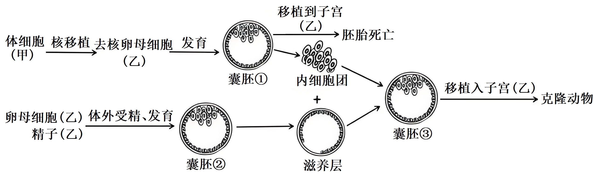
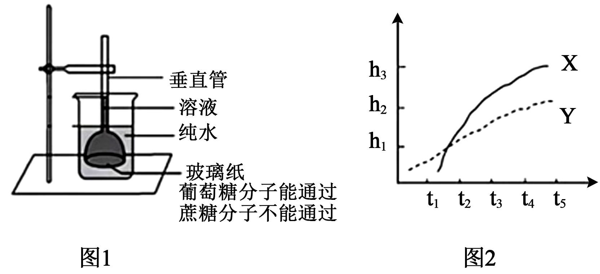
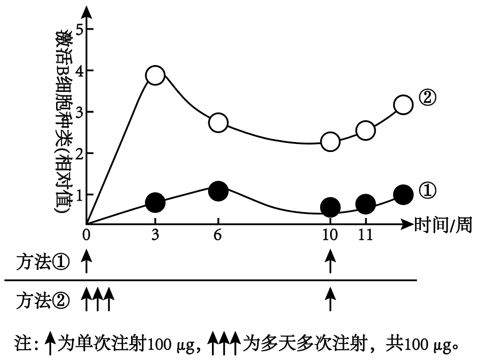
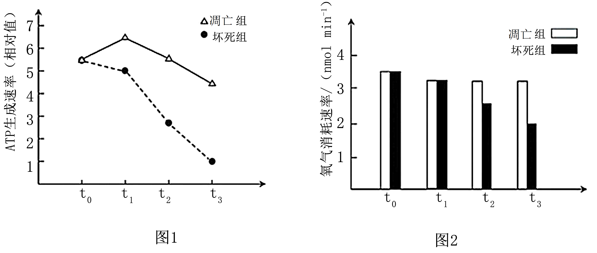
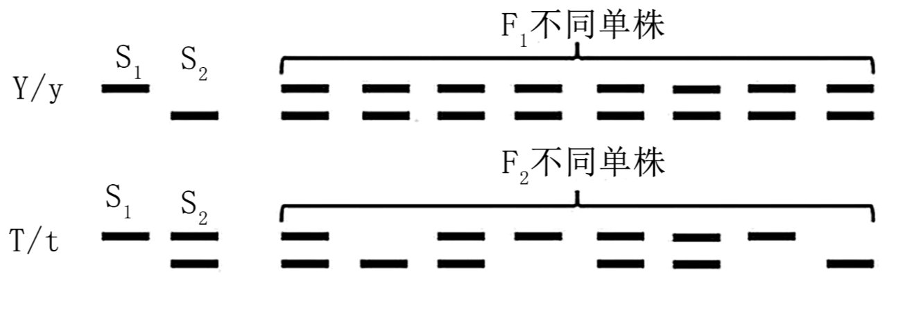
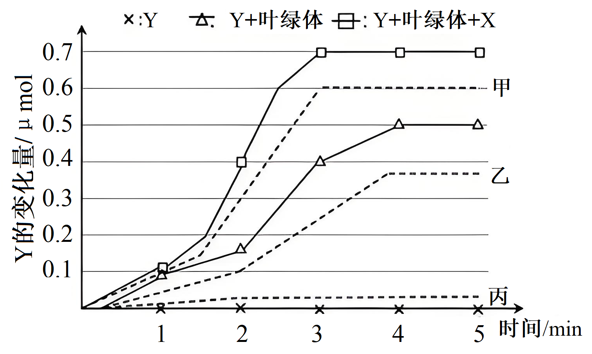
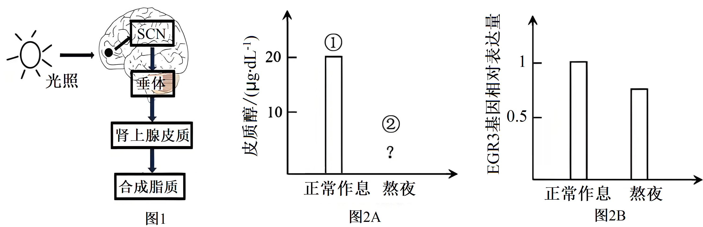
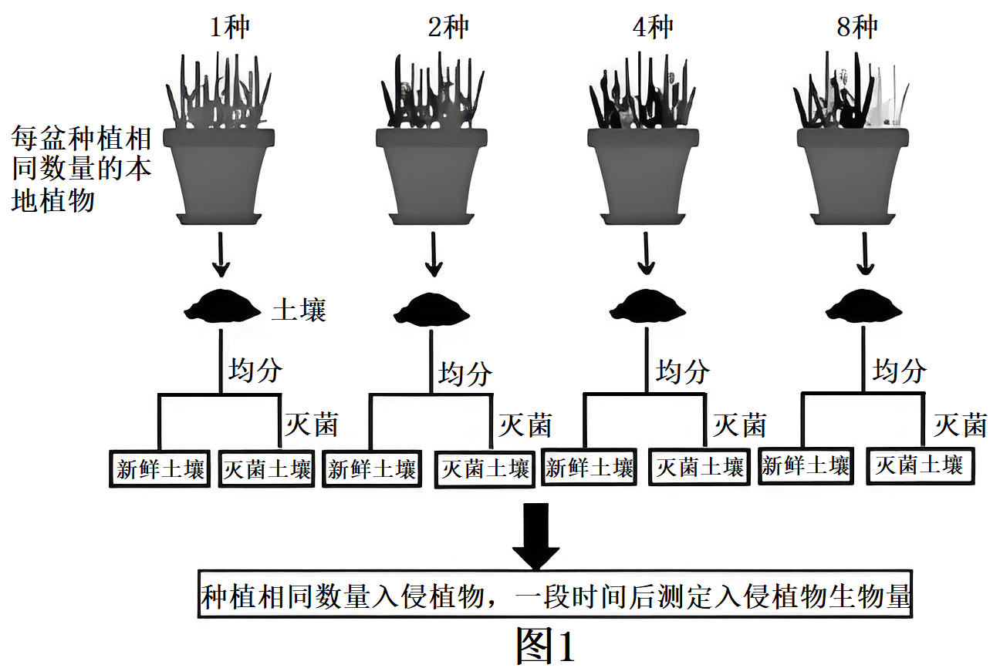
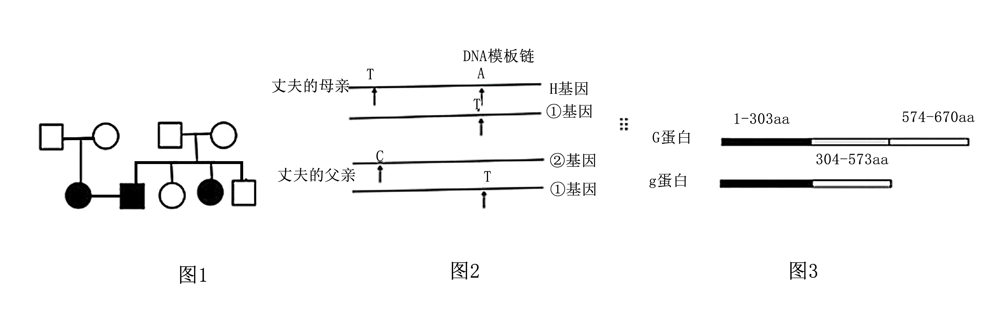

**重庆市2025年普通高等学校招生统一考试**

**生物试题**

**注意事项：**

**1．作答前，考生务必将自己的姓名、考场号、座位号填写在试卷的规定位置上。**

**2．作答时，务必将答案写在答题卡上，写在试卷及草稿纸上无效。**

**3．考试结束后，须将答题卡、试卷、草稿纸一并交回。**

**一、选择题：本题共15小题，每小题3分，共45分。在每小题给出的四个选项中，只有一项是符合题目要求的。**

1\. 用磷脂分子特异性染料处理上皮组织切片，不能被标记的细胞器是（ ）

A. 溶酶体 B. 核糖体 C. 内质网 D. 高尔基体

2\. 在中国文化中，“肝胆相照”用来比喻朋友之间真心相待。研究表明，当某实验动物的肝脏或者胆管受到严重损伤时，机体可通过图所示的相互转化机制进行修复。据图分析，下列叙述正确的是（ ）

A. 肝、胆严重损伤时，内环境稳态的破坏是细胞凋亡所致

B. 过程①、②为细胞增殖，在细胞分裂中期染色体数目会加倍

C. 过程③产生的细胞，其分化程度比胆管细胞高

D. 过程④、⑤中均存在基因的选择性表达

3\. 能量胶是马拉松运动员常用的胶状补给品，可快速供能。下表是某能量胶的营养成分表。据表分析，下列叙述正确的是（ ）

|       |       |
|:----- |:----- |
| 项目    | 每100g |
| 能量    | 850KJ |
| 蛋白质   | 0g    |
| 脂肪    | 0g    |
| 碳水化合物 | 50g   |
| 核糖    | 450mg |
| 钠钾氯等  | 235mg |

A. 核糖是ATP的组成成分，补充核糖有助于合成ATP

B. 推测表中的碳水化合物主要是淀粉

C. 比赛过程中大量出汗，少量补充能量胶即可维持水盐平衡

D. 能量胶不含脂肪和蛋白质是因为它们不能为机体提供能量

4\. 为保护濒危哺乳动物甲，科研工作者将甲的近亲物种乙（种群数量多）进行了如图所示的研究，下列叙述正确的是（ ）

A. 克隆动物的核基因组来源于甲、乙

B. 体外受精需用获能的精子与MI期的卵母细胞受精

C. 囊胚①的内细胞团可发育为胎盘、个体

D. 滋养层可影响内细胞团的发育

5\. 在国家政策和相关法规的保障下，大熊猫的保护工作取得了显著的成效。我国科研工作者对某山系的大熊猫种群数量先后进行了多次野外普查，其中，第三次普查和第四次普查的栖息地变化如图所示。下列叙述错误的是（ ）

A. 大熊猫的生活环境复杂，不适宜采用标记重捕法统计野生大熊猫的数量

B. 栖息地的改变会影响该区域大熊猫的环境容纳量

C. 栖息地的改变可提高大熊猫种群的遗传多样性

D. 大熊猫栖息地的改善，会导致当地大熊猫的种群数量呈“J”型增长

6\. 豆瓣酱是我国地方特色调味品，生产豆瓣酱时要将蚕豆瓣制作成豆瓣曲，再添加调料进一步发酵，下列说法错误的是（ ）

A. 沸水浸泡能杀死蚕豆细胞，减少有机物消耗

B. 面粉可为菌种的快速繁殖和生长提供营养

C. 菌种中含有产蛋白酶和淀粉酶的微生物

D. 豆瓣酱的制备主要是利用厌氧微生物发酵

7\. 图为机体感染HIV一段时间后血浆中HIV含量的变化，下列说法正确的是（ ）

A. 机体的第三道防线在t0-t1段已经开始发挥作用

B. 时期Ⅰ血浆中病毒的清除主要靠细胞免疫

C. 时期Ⅱ病毒含量的上升会促进辅助性T细胞数量增加

D. t1时刻进行治疗比t2时刻更有利于维持机体的免疫功能

8\. 骨关节炎是一种难以治愈的常见疾病，研究发现患者软骨细胞膜上的Na+通道蛋白明显多于正常人，从而影响NCX载体蛋白对Ca2+的运输，据图分析，下列叙述错误的是（ ）

A. Na+通道运输Na+不需要消耗ATP

B. 运输Na+时，Na+通道和NCX载体均需与Na+结合

C. 患者软骨细胞的Ca2+内流增多

D. 与NCX载体相比，Na+通道更适合作为研究药物的靶点

9\. 研究发现，长期高脂饮食可导致糖代谢异常，表现为血糖和胰岛素均高于正常水平。魔芋中的KGM被肠道菌利用产生Y物质，Y结合R受体能改变此类血糖异常。图为三组小鼠（正常饮食组、高脂饮食组、高脂饮食+KGM组）空腹注射等量胰岛素后的血糖变化情况，分析正确的是（ ）

A. ①是高脂饮食+KGM组

B. 高脂饮食组小鼠食用魔芋会促进糖原分解，使血糖变化曲线向③靠近

C. 增加胰岛B细胞的分泌不能治疗高脂饮食引起的血糖异常

D. 敲除高脂饮食组小鼠的R受体基因，口服KGM会促进血糖进组织细胞

10\. 某兴趣小组利用图1装置，分别使用等体积2.5mol/L葡萄糖溶液和1.2mol/L蔗糖溶液，室温下观察渗透现象。图2是两种溶液在垂直管中，一段时间内溶液高度变化，下列说法正确的是（ ）

A. X表示葡萄糖溶液在垂直管中的高度变化

B. t1—t3由X液面快速上升推测水分子不会从漏斗进入烧杯

C. t2—t5取Y对应烧杯中液体能检测到还原糖

D. t5后两种溶液在垂直管中液面高度将不变

11\. 细胞中F蛋白和M蛋白均可进入细胞核。X蛋白选择性地结合F蛋白或乙酰化修饰的M蛋白，从而阻止被结合的蛋白进入细胞核，具体机制如图。下列说法合理的是（ ）

A. M基因和F基因都属于原癌基因

B. M蛋白和F蛋白都是DNA聚合酶

C. 在癌细胞中过量表达X可能会减缓癌细胞增殖

D. 在正常细胞中去除F蛋白，可能会抑制正常细胞凋亡

12\. 每种疫苗分子上有多个抗原的结合位点，每个结合位点能够激活一种B淋巴细胞。为了应对流感病毒的快速突变，研究人员开发了接种方法②，并与接种方法①进行了比较，如图。下列选项说法错误的是（ ）

A. 抗原呈递细胞和辅助性T细胞均会参与激活B淋巴细胞

B. 用方法①接种疫苗，产生的特异性抗体的量，第11周与第3周接近

C. ②中，第3周激活的B细胞开始分化，是其种类减少的原因之一

D. 接种流感疫苗，方法②比方法①产生的抗体种类更多

13\. 在T细胞凋亡和坏死过程中，ATP生成速率和氧气消耗速率如图1、2所示，下列说法错误的是（ ）

A. 可根据氧气的消耗速率计算ATP生成的总量

B. 有氧呼吸中氧气的消耗发生在线粒体的内膜

C. 在t1时，凋亡组产生的乳酸比坏死组多

D. 在t2时，凋亡组产生的CO2比坏死组多

14\. KS征是一种性染色体病，患者性染色体为XXY。疾病机制可借助小鼠研究。研究人员用多了一条异常Y染色体的雄性小鼠（XYY\*）来繁育患KS征的小鼠。已知正常小鼠性染色体有三个标记基因可用来判定性染色体类型。其中甲基因位于Y染色体上，乙基因、丙基因位于X染色体上，同时有两条X染色体的丙基因才会表达。结合下表，不考虑新的突变和交换。下列分析正确的是（ ）

<table style="width:34%;">
<colgroup>
<col style="width: 15%" />
<col style="width: 0%" />
<col style="width: 8%" />
<col style="width: 0%" />
<col style="width: 7%" />
<col style="width: 1%" />
</colgroup>
<tbody>
<tr>
<td style="text-align: left;">亲代</td>
<td colspan="2" style="text-align: left;">母本</td>
<td colspan="3" style="text-align: left;">父本</td>
</tr>
<tr>
<td style="text-align: left;">性染色体</td>
<td colspan="2" style="text-align: left;">XX</td>
<td colspan="3" style="text-align: left;">XYY*</td>
</tr>
<tr>
<td style="text-align: left;">甲基因数量</td>
<td colspan="2" style="text-align: left;">0</td>
<td colspan="3" style="text-align: left;">1</td>
</tr>
<tr>
<td style="text-align: left;">乙基因数量</td>
<td colspan="2" style="text-align: left;">2</td>
<td colspan="3" style="text-align: left;">2</td>
</tr>
<tr>
<td style="text-align: left;">丙基因表达</td>
<td colspan="2" style="text-align: left;">+</td>
<td colspan="3" style="text-align: left;">-</td>
</tr>
<tr>
<td colspan="2" style="text-align: left;">F1</td>
<td colspan="2" style="text-align: left;">①</td>
<td style="text-align: left;">②</td>
<td style="text-align: left;">③</td>
</tr>
<tr>
<td colspan="2" style="text-align: left;">性染色体</td>
<td colspan="2" style="text-align: left;">XX</td>
<td style="text-align: left;">XY</td>
<td style="text-align: left;">?</td>
</tr>
<tr>
<td colspan="2" style="text-align: left;">甲基因数量</td>
<td colspan="2" style="text-align: left;">0</td>
<td style="text-align: left;">1</td>
<td style="text-align: left;">0</td>
</tr>
<tr>
<td colspan="2" style="text-align: left;">乙基因数量</td>
<td colspan="2" style="text-align: left;">2</td>
<td style="text-align: left;">1</td>
<td style="text-align: left;">2</td>
</tr>
<tr>
<td colspan="2" style="text-align: left;">丙基因表达</td>
<td colspan="2" style="text-align: left;">+</td>
<td style="text-align: left;">-</td>
<td style="text-align: left;">-</td>
</tr>
</tbody>
</table>

注：“+”表示基因表达，“-”表示基因不表达

A. Y\*染色体携带了甲、乙两个基因

B. F1中只有③④⑤有Y\*染色体

C. 父本为个体⑤提供了X染色体

D. ④比⑥更适用于研究KS征的表型

15\. 水稻雄性不育、可育由等位基因T、t控制，不育性状受温度的影响（见下表）；米质优、劣由等位基因Y、y控制。不育株S1米质劣但抗病，不育株S2米质优但易感病。为了选育综合性状好的不育系，用S1和S2杂交获得F1，F1均为不育且米质优。选F1两单株杂交获得的F2中出现稳定可育株，PCR检测部分世代中相关基因，电泳结果如图所示，下列说法正确的是（ ）

<table style="width:61%;">
<colgroup>
<col style="width: 20%" />
<col style="width: 14%" />
<col style="width: 25%" />
</colgroup>
<tbody>
<tr>
<td style="text-align: left;">植株种类</td>
<td style="text-align: left;">温度</td>
<td style="text-align: left;">花粉不育率（%）</td>
</tr>
<tr>
<td rowspan="2" style="text-align: left;">不育株S1</td>
<td style="text-align: left;">高温</td>
<td style="text-align: left;">100%</td>
</tr>
<tr>
<td style="text-align: left;">低温</td>
<td style="text-align: left;">0</td>
</tr>
<tr>
<td rowspan="2" style="text-align: left;">不育株S2</td>
<td style="text-align: left;">高温</td>
<td style="text-align: left;">100%</td>
</tr>
<tr>
<td style="text-align: left;">低温</td>
<td style="text-align: left;">0</td>
</tr>
<tr>
<td rowspan="2" style="text-align: left;">稳定可育株</td>
<td style="text-align: left;">高温</td>
<td style="text-align: left;">0</td>
</tr>
<tr>
<td style="text-align: left;">低温</td>
<td style="text-align: left;">0</td>
</tr>
</tbody>
</table>

A. S1是基因型为TTYY的纯合子

B. 选择F1任意两单株进行杂交均会出现如图F2的育性分离

C. F2在高温条件下表现不育且米质优的纯合植株占比1/16

D. 在S1和S2杂交得到F1时，亲本植株需在同一温度条件下种植

**二、非选择题（共55分）**

16\. 科研人员以水稻秸秆为原料合成的一种新型纳米材料X，发现其能通过叶面或根部吸收进入植物细胞。

（1）为分析X对植物光能利用的影响，科研人员用添加X的培养液培养水绵，再用通过三棱镜的光照射载有需氧细菌和水绵的临时装片，观察并统计不同光质下需氧细菌数量，结果见下表。

<table style="width:67%;">
<colgroup>
<col style="width: 20%" />
<col style="width: 9%" />
<col style="width: 9%" />
<col style="width: 9%" />
<col style="width: 9%" />
<col style="width: 9%" />
</colgroup>
<tbody>
<tr>
<td style="text-align: left;">
光质

处理
</td>
<td style="text-align: left;">蓝光</td>
<td style="text-align: left;">绿光</td>
<td style="text-align: left;">黄光</td>
<td style="text-align: left;">橙光</td>
<td style="text-align: left;">红光</td>
</tr>
<tr>
<td style="text-align: left;">培养液（对照）</td>
<td style="text-align: left;">150</td>
<td style="text-align: left;">12</td>
<td style="text-align: left;">10</td>
<td style="text-align: left;">14</td>
<td style="text-align: left;">89</td>
</tr>
<tr>
<td style="text-align: left;">培养液+X</td>
<td style="text-align: left;">139</td>
<td style="text-align: left;">28</td>
<td style="text-align: left;">7</td>
<td style="text-align: left;">13</td>
<td style="text-align: left;">88</td>
</tr>
</tbody>
</table>

结果表明，X能够促进水绵利用\_\_\_\_\_\_\_\_光。在水绵细胞中，X呈现出随机分布的特点，当X分布在叶绿体的\_\_\_\_\_\_\_\_时，水绵光能利用效率最佳。

（2）为进一步探究X对叶绿体功能的影响，开展了下列实验。

①用离体叶绿体X和Y（可与NADPH发生反应的化合物）进行实验，在相同光照条件下，实时测定并计算Y的变化量。由图可知，X能\_\_\_\_\_\_\_\_（填“促进”或“抑制”）叶绿体合成NADPH。为保证本实验的严谨性，需增设1个处理，即Y+经煮沸的叶绿体。该处理获得的结果最符合图中曲线的\_\_\_\_\_\_\_\_（填“甲”或“乙”或“丙”）。

②将清水和X溶液分别处理后的植物叶片用打孔器打出叶圆片，抽气后，再置于1%的碳酸氢钠溶液中，给予相同的光照，发现X溶液处理的叶圆片先浮出叶面，其原因是\_\_\_\_\_\_\_\_。

（3）研究还发现处理植物的X浓度过高，会出现植物叶片气孔开放度下降的现象，推测与之相关的植物激素及其含量变化是\_\_\_\_\_\_\_\_\_。

17\. 人体的脂质合成存在昼夜节律，长期熬夜会破坏脂质合成的节律，从而增加患肥胖等代谢性疾病的风险。

（1）光信号影响脂质合成的过程如图1所示，昼夜节律的调节中枢SCN位于\_\_\_\_\_\_\_\_\_。光信号通过神经影响激素的分泌，从而调节脂质合成。这种调节方式属于\_\_\_\_\_\_\_\_\_调节。

（2）熬夜会增加促肾上腺皮质激素的分泌。研究者测定了两组志愿者体内的皮质醇含量（图2A）推测②比①\_\_\_\_\_\_\_\_\_。皮质醇变化引起脂肪组织EGR3基因的表达变化，是熬夜导致肥胖的重要原因。由图2B推测，EGR3对脂质合成的作用是\_\_\_\_\_\_\_。

（3）保持良好的作息习惯有利于控制体重。与熬夜相比，正常作息时，夜间体内会发生的过程有\_\_\_\_\_\_\_\_。

A. 感光细胞向SCN传递的兴奋信号减少

B. 皮质醇促进EGR3基因的表达

C. 肾上腺皮质的活动增强

D. 脂肪组织EGR3基因的表达量上升

18\. 草地生态系统是全球分布最广阔的生态系统之一，随着生物入侵的日益增加，草地生态系统的保护和恢复迫在眉睫。

（1）加拿大一枝黄花是草地生态系统的一级危害入侵植物。入侵后会造成\_\_\_\_\_\_\_\_。

①草地物种多样性下降

②草地原来的食物链、食物网结构发生改变

③草地生态系统中本地植物生态位变窄

④草地生态系统抵抗力稳定性增强

A. ①②④ B. ①③④ C. ②③④ D. ①②③

（2）为探究草地生态系统对抗生物入侵的机制，我国科研人员开展如图1所示试验，结果见图2。

①该实验的自变量是\_\_\_\_\_\_\_\_和\_\_\_\_\_\_\_\_。

②根据无菌土壤中入侵植物生物量的变化可推出本地植物品种。数量的变化会导致\_\_\_\_\_\_\_\_发生改变，从而促进入侵植物的生长。新鲜土壤中，入侵植物生物量随本地植物品种数量的增加而下降。导致该结果的主要因素是\_\_\_\_\_\_\_\_。

③结果表明，草地生态系统可通过土壤的\_\_\_\_\_\_\_\_调节机制抑制入侵植物生长，维持草地生态系统的稳定性。为对抗入侵植物对生态系统的干扰，可采取的措施是\_\_\_\_\_\_\_\_。

19\. 绝大多数哺乳动物生来怕辣，而小型哺乳动物树鼩先天不怕辣，喜食含辣椒素类物质的植物。为探究其原因，我国研究人员进行了系列研究。

（1）研究发现，树鼩的受体蛋白TR1对辣椒素的敏感性低于其他哺乳动物。为研究树鼩和其他哺乳动物TR1蛋白的差异，可设计开展如下实验：

①\_\_\_\_\_\_\_\_；

②将\_\_\_\_\_\_\_分别进行酶切并连接；

③将重组DNA分子导入大肠杆菌；

④分离表达的TR1蛋白质测定\_\_\_\_\_\_\_，明确蛋白之间的差异。

（2）树鼩及一些哺乳动物的TR1蛋白存在差异，如图所示。据分析，树鼩对辣椒素的敏感性降低，很可能是由于TR1第579位氨基酸差异造成的，可证实该推测的实验思路是\_\_\_\_\_\_\_\_。

（3）树鼩与其喜食植物的地理分布基本一致，据此可推测树鼩对含辣椒素类物质植物的适应形成的必要条件是\_\_\_\_\_\_\_\_。

20\. 全色盲是由隐性基因控制的视网膜疾病。某夫妻都是全色盲患者，二人因生育去医院做遗传咨询，医生询问了两人家族病史并做了相应检查，发现丈夫和其妹妹患病是H基因突变所致。妻子患病是G基因突变所致

（1）根据系谱图（图1）可推测全色盲的遗传方式是\_\_\_\_\_\_\_\_。

（2）经检查发现丈夫的父母携带了由H基因突变形成的①②基因，其DNA序列如图2所示。

据此分析，导致丈夫患病的H基因是\_\_\_\_\_\_\_\_\_（填编号）。丈夫的父亲有两个突变基因但没有患病，表明基因的某些突变对生物的影响是\_\_\_\_\_\_\_\_\_。

（3）妻子表达G蛋白而导致患病，相关蛋白结构如图3所示。据图分析，G基因突变为g基因发生的变化是\_\_\_\_\_\_\_\_\_。

（4）临床研究发现，G基因和H基因任意突变都可导致全色盲，且突变的G基因可抑制H基因的表达。可支撑该结论的检查结果是\_\_\_\_\_\_\_（选填两个编号）。

①妻子的H蛋白表达下降②丈夫的G蛋白表达上升

③妻子的H蛋白表达正常④丈夫的G蛋白表达下降

⑤妻子的H蛋白表达上升⑥丈夫的G蛋白表达正常

（5）不考虑基因的新突变，医生发现该夫妻有1/4的概率生育健康的孩子，则该夫妻的基因型分别是\_\_\_\_\_\_\_\_（H、G表示显性基因，h、g表示隐性基因）。
