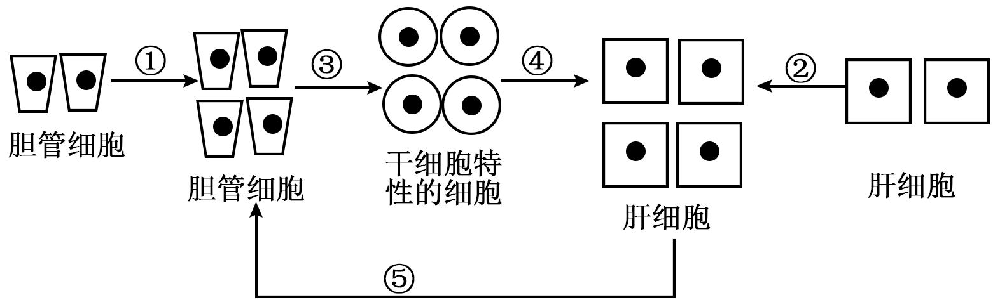
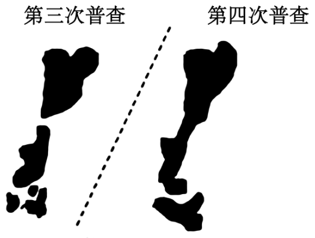
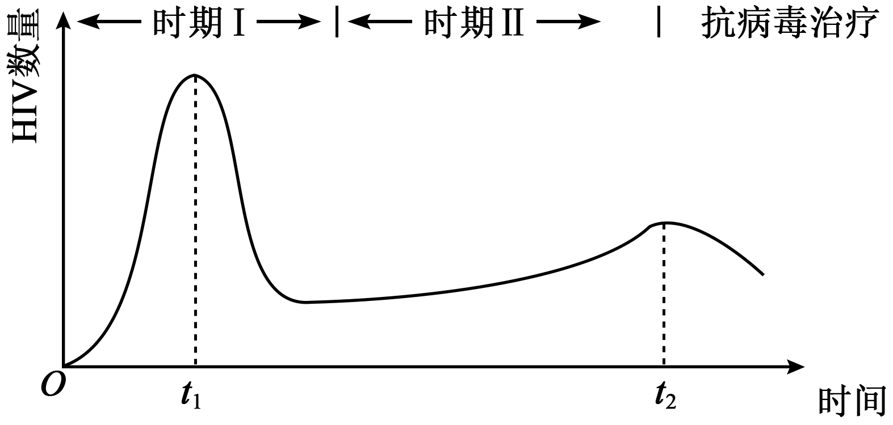
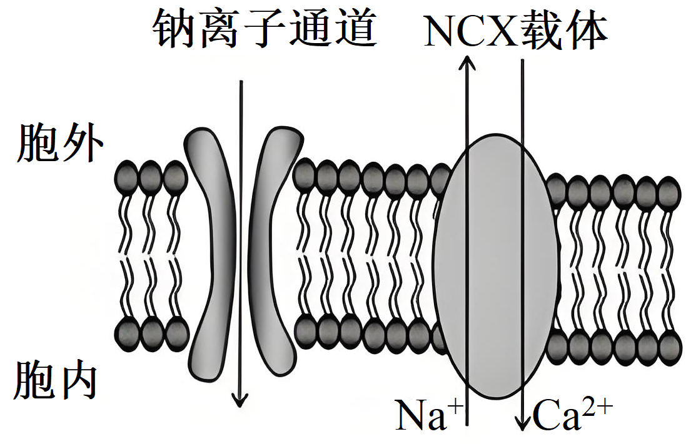
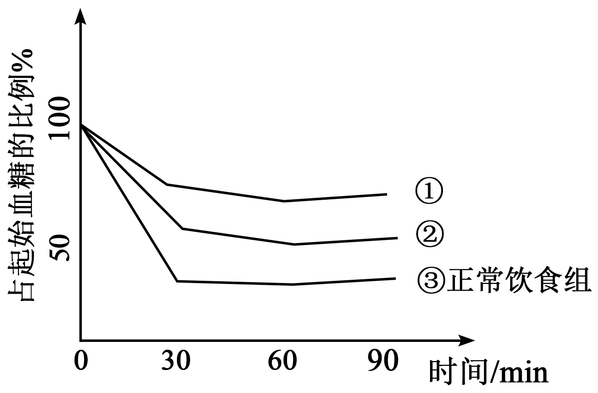
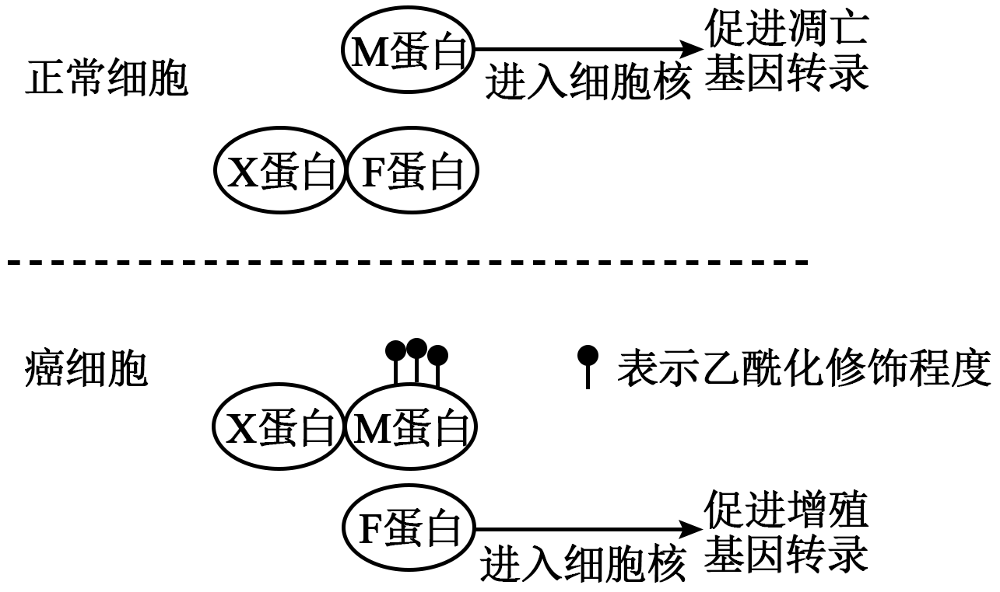
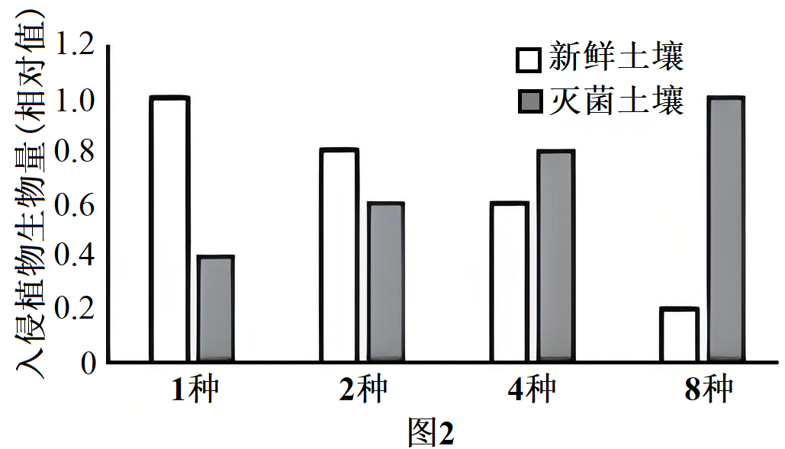

**重庆市2025年普通高等学校招生统一考试**

**生物试题**

**注意事项：**

**1．作答前，考生务必将自己的姓名、考场号、座位号填写在试卷的规定位置上。**

**2．作答时，务必将答案写在答题卡上，写在试卷及草稿纸上无效。**

**3．考试结束后，须将答题卡、试卷、草稿纸一并交回。**

**一、选择题：本题共15小题，每小题3分，共45分。在每小题给出的四个选项中，只有一项是符合题目要求的。**

1\. 用磷脂分子特异性染料处理上皮组织切片，不能被标记的细胞器是（ ）

A. 溶酶体 B. 核糖体 C. 内质网 D. 高尔基体

【答案】B

【解析】

【详解】溶酶体、内质网、高尔基体是具有单层膜结构的细胞器，含有磷脂分子，能被磷脂分子特异性染料标记，核糖体是无膜结构的细胞器，不含磷脂分子，不能被磷脂分子特异性染料标记，B正确，ACD错误。

故选B。

2\. 在中国文化中，“肝胆相照”用来比喻朋友之间真心相待。研究表明，当某实验动物的肝脏或者胆管受到严重损伤时，机体可通过图所示的相互转化机制进行修复。据图分析，下列叙述正确的是（ ）

A. 肝、胆严重损伤时，内环境稳态的破坏是细胞凋亡所致

B. 过程①、②为细胞增殖，在细胞分裂中期染色体数目会加倍

C. 过程③产生的细胞，其分化程度比胆管细胞高

D. 过程④、⑤中均存在基因的选择性表达

【答案】D

【解析】

【详解】A、肝、胆严重损伤是由外界因素导致的细胞坏死，而不是细胞凋亡（细胞凋亡是由基因决定的细胞自动结束生命的过程），所以内环境稳态的破坏不是细胞凋亡所致，A错误；

B、过程①、②为细胞增殖，在细胞分裂后期，着丝粒分裂，染色体数目加倍，而不是中期，中期染色体形态稳定、数目清晰，B错误；

C、过程③产生的细胞是干细胞特性的细胞，其分化程度比胆管细胞低，干细胞具有更高的全能性，C错误；

D、过程④、⑤是细胞分化过程，细胞分化的实质是基因的选择性表达，所以过程④、⑤中均存在基因的选择性表达，D正确。

故选D。

3\. 能量胶是马拉松运动员常用的胶状补给品，可快速供能。下表是某能量胶的营养成分表。据表分析，下列叙述正确的是（ ）

|       |       |
|:----- |:----- |
| 项目    | 每100g |
| 能量    | 850KJ |
| 蛋白质   | 0g    |
| 脂肪    | 0g    |
| 碳水化合物 | 50g   |
| 核糖    | 450mg |
| 钠钾氯等  | 235mg |

A. 核糖是ATP的组成成分，补充核糖有助于合成ATP

B. 推测表中的碳水化合物主要是淀粉

C. 比赛过程中大量出汗，少量补充能量胶即可维持水盐平衡

D. 能量胶不含脂肪和蛋白质是因为它们不能为机体提供能量

【答案】A

【解析】

【详解】A、ATP由腺苷（腺嘌呤+核糖）和三个磷酸基团组成，核糖是ATP的组成成分，“补充核糖”可为腺苷的合成提供原料，间接支持ATP生成，故补充核糖有助于合成ATP，A正确；

B、碳水化合物若为淀粉（多糖），需分解为葡萄糖才能快速供能，但能量胶需“快速供能”，推测其碳水化合物应为单糖（如葡萄糖）或二糖（如麦芽糖），而非淀粉，B错误；

C、大量出汗会导致水和电解质大量流失，能量胶中钠钾氯仅235mg/100g，少量补充不足以完全维持水盐平衡，需额外补充水和电解质，C错误；

D、脂肪和蛋白质均可供能，但脂肪供能慢，蛋白质主要参与结构构建，能量胶不含二者是因快速供能需优先利用碳水化合物，D错误。

故选A。

4\. 为保护濒危哺乳动物甲，科研工作者将甲的近亲物种乙（种群数量多）进行了如图所示的研究，下列叙述正确的是（ ）

A. 克隆动物的核基因组来源于甲、乙

B. 体外受精需用获能的精子与MI期的卵母细胞受精

C. 囊胚①的内细胞团可发育为胎盘、个体

D. 滋养层可影响内细胞团的发育

【答案】D

【解析】

【详解】A、克隆动物的核基因组来源于甲，细胞质中的基因来源于乙，A错误；

B、体外受精需用获能的精子与MⅡ期的卵母细胞受精，而不是MI期，B错误；

C、囊胚①的内细胞团可发育为个体，滋养层细胞发育为胎膜和胎盘，C错误；

D、滋养层可影响内细胞团的发育，如滋养层细胞分泌的某些物质可能会影响内细胞团细胞的分化等，D正确。

故选D。

5\. 在国家政策和相关法规的保障下，大熊猫的保护工作取得了显著的成效。我国科研工作者对某山系的大熊猫种群数量先后进行了多次野外普查，其中，第三次普查和第四次普查的栖息地变化如图所示。下列叙述错误的是（ ）

A. 大熊猫的生活环境复杂，不适宜采用标记重捕法统计野生大熊猫的数量

B. 栖息地的改变会影响该区域大熊猫的环境容纳量

C. 栖息地的改变可提高大熊猫种群的遗传多样性

D. 大熊猫栖息地的改善，会导致当地大熊猫的种群数量呈“J”型增长

【答案】D

【解析】

【详解】A 、大熊猫活动范围广、生活环境复杂，且个体数量相对较少，标记重捕法可能会对其造成较大干扰，也难以准确统计，所以不适宜采用标记重捕法统计野生大熊猫的数量，A正确；

B、栖息地是大熊猫生存的基础，栖息地的改变，如面积减少、质量下降等，会影响该区域大熊猫的食物资源、生存空间等，进而影响环境容纳量，B正确；

C、栖息地的改变可能会导致大熊猫种群被分割成不同的小种群，在不同的环境选择压力下，可能会促进种群的遗传分化，提高遗传多样性，C正确；

D、大熊猫栖息地的改善，只是为其种群数量增长提供了更好的条件，但由于存在食物、空间等多种限制因素，当地大熊猫的种群数量不会呈“J”型增长，而是呈“S”型增长，D错误。

故选D。

6\. 豆瓣酱是我国地方特色调味品，生产豆瓣酱时要将蚕豆瓣制作成豆瓣曲，再添加调料进一步发酵，下列说法错误的是（ ）

A. 沸水浸泡能杀死蚕豆细胞，减少有机物消耗

B. 面粉可为菌种的快速繁殖和生长提供营养

C. 菌种中含有产蛋白酶和淀粉酶的微生物

D. 豆瓣酱的制备主要是利用厌氧微生物发酵

【答案】D

【解析】

【详解】A、沸水浸泡能使蚕豆细胞死亡，从而减少细胞呼吸等对有机物的消耗，A正确；

B、面粉中含有淀粉等营养物质，可为菌种的快速繁殖和生长提供营养，B正确；

C、在发酵过程中需要将蛋白质和淀粉等分解，所以菌种中含有产蛋白酶和淀粉酶的微生物，C正确；

D、从图中可以看出，在制作豆瓣曲过程中有翻拌操作，且整个过程不是完全密封的，说明主要利用的是好氧微生物发酵，而不是厌氧微生物发酵，D错误。

故选D。

7\. 图为机体感染HIV一段时间后血浆中HIV含量的变化，下列说法正确的是（ ）

A. 机体的第三道防线在t0-t1段已经开始发挥作用

B. 时期Ⅰ血浆中病毒的清除主要靠细胞免疫

C. 时期Ⅱ病毒含量的上升会促进辅助性T细胞数量增加

D. t1时刻进行治疗比t2时刻更有利于维持机体的免疫功能

【答案】A

【解析】

【详解】A、机体的第三道防线（特异性免疫）在感染HIV后就会逐渐发挥作用，在t0-t1段病毒数量上升后又下降，说明特异性免疫已经开始发挥作用来对抗病毒，A正确；

B、时期Ⅰ血浆中病毒的清除主要靠体液免疫，体液免疫可以产生抗体与病毒结合，进而清除病毒，而不是细胞免疫，细胞免疫主要针对被病毒感染的靶细胞，B错误；

C、HIV主要攻击辅助性T细胞，时期Ⅱ病毒含量的上升会导致辅助性T细胞数量减少，而不是增加，C错误；

D、从图中可以看出，t1时刻病毒数量处于上升阶段，t2时刻病毒数量相对稳定且较低，t2时刻进行治疗更有利于维持机体的免疫功能，因为t1时刻治疗可能免疫系统还未充分启动对病毒的免疫应答，而t2时刻免疫系统已经有一定的反应，此时治疗能更好地辅助机体对抗病毒，D错误。

故选A。

8\. 骨关节炎是一种难以治愈的常见疾病，研究发现患者软骨细胞膜上的Na+通道蛋白明显多于正常人，从而影响NCX载体蛋白对Ca2+的运输，据图分析，下列叙述错误的是（ ）

A. Na+通道运输Na+不需要消耗ATP

B. 运输Na+时，Na+通道和NCX载体均需与Na+结合

C. 患者软骨细胞的Ca2+内流增多

D. 与NCX载体相比，Na+通道更适合作为研究药物的靶点

【答案】B

【解析】

【分析】被动运输：物质以扩散方式进出细胞，不需要消耗细胞内化学反应所释放的能量。被动运输分为自由扩散和协助扩散。自由扩散：物质通过简单的扩散作用进出细胞的物质扩散方式。协助扩散：借助膜上的转运蛋白进出细胞的物质扩散方式，也叫易化扩散。转运蛋白可以分为载体蛋白和通道蛋白。载体蛋白只容许与自身结合部位相适应的分子或离子通过，而且每次转运时都会发生自身构象的改变。通道蛋白只容许与自身通道的直径和形状相适配、大小和电荷相适宜的分子或离子通过。分子或离子通过通道蛋白时，不需要和通道蛋白结合。

【详解】A、Na+通道运输Na+属于协助扩散，协助扩散不需要消耗能量，A正确；

B、Na+通过通道蛋白时，不需要与通道蛋白结合，B错误；

C、因为患者软骨细胞膜上Na+通道蛋白增多，会使Na+内流增多，胞内Na+会积累，NCX载体会将胞内过多的Na+逆浓度排出胞外，需要利用Ca2+产生的电化学势能提供能量，所以使得Ca2+内流增多，C正确；

D、因为患者是Na+通道蛋白明显多于正常人从而引发疾病，所以与NCX载体相比，Na+通道更适合作为研究药物的靶点，D正确。

故选B。

9\. 研究发现，长期高脂饮食可导致糖代谢异常，表现为血糖和胰岛素均高于正常水平。魔芋中的KGM被肠道菌利用产生Y物质，Y结合R受体能改变此类血糖异常。图为三组小鼠（正常饮食组、高脂饮食组、高脂饮食+KGM组）空腹注射等量胰岛素后的血糖变化情况，分析正确的是（ ）

A. ①是高脂饮食+KGM组

B. 高脂饮食组小鼠食用魔芋会促进糖原分解，使血糖变化曲线向③靠近

C. 增加胰岛B细胞的分泌不能治疗高脂饮食引起的血糖异常

D. 敲除高脂饮食组小鼠的R受体基因，口服KGM会促进血糖进组织细胞

【答案】C

【解析】

【详解】A 、正常小鼠对胰岛素敏感，注射胰岛素后血糖下降明显；高脂饮食组小鼠糖代谢异常，对胰岛素不敏感，血糖下降不明显；高脂饮食+KGM组由于KGM的作用，对胰岛素的敏感性有所恢复。曲线③血糖下降明显，是正常饮食组；曲线①血糖下降不明显，是高脂饮食组；曲线②血糖下降程度介于①和③之间，是高脂饮食+KGM组，A错误；

B、魔芋中的KGM被肠道菌利用产生Y物质，Y结合R受体能改变血糖异常，是促进血糖进组织细胞等途径降低血糖，而不是促进糖原分解，B错误；

C、长期高脂饮食导致糖代谢异常，表现为血糖和胰岛素均高于正常水平，说明不是胰岛素分泌不足导致的，增加胰岛B细胞的分泌不能治疗高脂饮食引起的血糖异常，C正确；

D、敲除高脂饮食组小鼠的R受体基因，Y物质无法结合R受体发挥作用，口服KGM不能促进血糖进组织细胞，D错误。

故选C。

10\. 某兴趣小组利用图1装置，分别使用等体积2.5mol/L葡萄糖溶液和1.2mol/L蔗糖溶液，室温下观察渗透现象。图2是两种溶液在垂直管中，一段时间内溶液高度变化，下列说法正确的是（ ）

A. X表示葡萄糖溶液在垂直管中的高度变化

B. t1—t3由X液面快速上升推测水分子不会从漏斗进入烧杯

C. t2—t5取Y对应烧杯中液体能检测到还原糖

D. t5后两种溶液在垂直管中液面高度将不变

【答案】C

【解析】

【详解】A、葡萄糖分子能通过玻璃纸，蔗糖分子不能通过。开始时葡萄糖溶液和蔗糖溶液的浓度分别为2.5mol/L和1.2mol/L，由于葡萄糖能透过玻璃纸，最终会使两侧葡萄糖浓度相等，而蔗糖不能透过，所以开始时葡萄糖溶液一侧浓度高，水分子进入多，但随着葡萄糖透过玻璃纸，其液面会下降。蔗糖溶液一侧由于蔗糖不能透过，水分子持续进入，液面持续上升。所以X表示蔗糖溶液在垂直管中的高度变化，A错误；

B、t1—t3时X液面快速上升，这只能说明单位时间内从烧杯进入漏斗的水分子数量多于从漏斗进入烧杯的水分子数量，并不是水分子不会从漏斗进入烧杯，B错误；

C、因为葡萄糖能通过玻璃纸进入烧杯，葡萄糖是还原糖，所以在t2—t5取Y对应烧杯中液体能检测到还原糖，C正确；

D、由于葡萄糖能通过玻璃纸，最终两侧葡萄糖浓度会相等，但蔗糖不能通过玻璃纸，所以垂直管中液面高度不会不变，D错误。

故选C。

11\. 细胞中F蛋白和M蛋白均可进入细胞核。X蛋白选择性地结合F蛋白或乙酰化修饰的M蛋白，从而阻止被结合的蛋白进入细胞核，具体机制如图。下列说法合理的是（ ）

A. M基因和F基因都属于原癌基因

B. M蛋白和F蛋白都是DNA聚合酶

C. 在癌细胞中过量表达X可能会减缓癌细胞增殖

D. 在正常细胞中去除F蛋白，可能会抑制正常细胞凋亡

【答案】C

【解析】

【详解】A、一般来说，原癌基因表达的蛋白质是细胞正常的生长和增殖所必需的，抑癌基因表达的蛋白质能促进细胞凋亡，由图可知，正常细胞中的M蛋白进入细胞核促进凋亡基因转录，癌细胞中的F蛋白进入细胞核促进增殖基因转录，说明M基因属于抑癌基因，F基因属于原癌基因，A错误；

B、DNA聚合酶参与DNA复制，M蛋白和F蛋白在转录过程中发挥作用，所以M蛋白和F蛋白都不是DNA聚合酶，B错误；

C、X蛋白选择性地结合F蛋白或乙酰化修饰的M蛋白，从而阻止被结合的蛋白进入细胞核，在癌细胞中，X蛋白结合乙酰化修饰的M蛋白，促进F蛋白进入细胞核，若过量表达X蛋白，可能会导致部分X蛋白与F蛋白结合，使进入细胞核内的F蛋白减少，从而减缓癌细胞增殖，C正确；

D、由图可知，在正常细胞中去除M蛋白，可能会抑制正常细胞凋亡，D错误。

故选C。

12\. 每种疫苗分子上有多个抗原的结合位点，每个结合位点能够激活一种B淋巴细胞。为了应对流感病毒的快速突变，研究人员开发了接种方法②，并与接种方法①进行了比较，如图。下列选项说法错误的是（ ）

A. 抗原呈递细胞和辅助性T细胞均会参与激活B淋巴细胞

B. 用方法①接种疫苗，产生的特异性抗体的量，第11周与第3周接近

C. ②中，第3周激活的B细胞开始分化，是其种类减少的原因之一

D. 接种流感疫苗，方法②比方法①产生的抗体种类更多

【答案】B

【解析】

【分析】体液免疫：病原体可以直接和B细胞接触，树突状细胞作为抗原呈递细胞，可对抗原进行加工、处理后呈递至辅助性T淋巴细胞，随后在抗原、激活的辅助性T细胞表面的特定分子双信号刺激下，B淋巴细胞活化，再接受细胞因子刺激后增殖分化成记忆细胞和浆细胞，浆细胞产生抗体和病原体结合。

【详解】A、抗原呈递细胞将抗原处理后呈递给辅助性T细胞，辅助性T细胞通过表面分子和细胞因子激活B细胞，A正确；

B、方法①若为初次接种，第3周抗体达峰值后逐渐下降，第11周抗体量应显著低于第3周，而非“接近”，B错误；

C、方法②中，第3周激活的B细胞分化为浆细胞和记忆细胞，未被激活的B细胞种类减少，C正确；

D、疫苗分子含多个抗原位点，方法②可能通过多次接种覆盖更多突变株，激活更多B细胞，产生更多抗体种类，D正确。

故选B。

13\. 在T细胞凋亡和坏死过程中，ATP生成速率和氧气消耗速率如图1、2所示，下列说法错误的是（ ）

A. 可根据氧气的消耗速率计算ATP生成的总量

B. 有氧呼吸中氧气的消耗发生在线粒体的内膜

C. 在t1时，凋亡组产生的乳酸比坏死组多

D. 在t2时，凋亡组产生的CO2比坏死组多

【答案】A

【解析】

【详解】A、图乙中凋亡组的氧气消耗速率在t2、t3时显著高于坏死组，且图甲中凋亡组ATP生成速率也更高，说明两者存在关联性。但T细胞是动物细胞，有氧呼吸产生水、二氧化碳、大量ATP，无氧呼吸产生乳酸和少量ATP，在无氧条件下，细胞无氧呼吸也可以产生ATP，因此只根据氧气的消耗速率无法计算ATP 生成的总量，A错误；

B、有氧呼吸第三阶段消耗氧气，场所在线粒体内膜，B正确；

C、在t1时，凋亡组和坏死组氧气消耗速率相等，凋亡组ATP生成速率大于坏死组， 因此凋亡组无氧呼吸产生的乳酸多，C正确；

D、在t2时，凋亡组氧气消耗速率大于坏死组，因此凋亡组产生的CO2比坏死组多，D正确。

故选A。

14\. KS征是一种性染色体病，患者性染色体为XXY。疾病机制可借助小鼠研究。研究人员用多了一条异常Y染色体的雄性小鼠（XYY\*）来繁育患KS征的小鼠。已知正常小鼠性染色体有三个标记基因可用来判定性染色体类型。其中甲基因位于Y染色体上，乙基因、丙基因位于X染色体上，同时有两条X染色体的丙基因才会表达。结合下表，不考虑新的突变和交换。下列分析正确的是（ ）

<table style="width:34%;">
<colgroup>
<col style="width: 15%" />
<col style="width: 0%" />
<col style="width: 8%" />
<col style="width: 0%" />
<col style="width: 7%" />
<col style="width: 1%" />
</colgroup>
<tbody>
<tr>
<td style="text-align: left;">亲代</td>
<td colspan="2" style="text-align: left;">母本</td>
<td colspan="3" style="text-align: left;">父本</td>
</tr>
<tr>
<td style="text-align: left;">性染色体</td>
<td colspan="2" style="text-align: left;">XX</td>
<td colspan="3" style="text-align: left;">XYY*</td>
</tr>
<tr>
<td style="text-align: left;">甲基因数量</td>
<td colspan="2" style="text-align: left;">0</td>
<td colspan="3" style="text-align: left;">1</td>
</tr>
<tr>
<td style="text-align: left;">乙基因数量</td>
<td colspan="2" style="text-align: left;">2</td>
<td colspan="3" style="text-align: left;">2</td>
</tr>
<tr>
<td style="text-align: left;">丙基因表达</td>
<td colspan="2" style="text-align: left;">+</td>
<td colspan="3" style="text-align: left;">-</td>
</tr>
<tr>
<td colspan="2" style="text-align: left;">F1</td>
<td colspan="2" style="text-align: left;">①</td>
<td style="text-align: left;">②</td>
<td style="text-align: left;">③</td>
</tr>
<tr>
<td colspan="2" style="text-align: left;">性染色体</td>
<td colspan="2" style="text-align: left;">XX</td>
<td style="text-align: left;">XY</td>
<td style="text-align: left;">?</td>
</tr>
<tr>
<td colspan="2" style="text-align: left;">甲基因数量</td>
<td colspan="2" style="text-align: left;">0</td>
<td style="text-align: left;">1</td>
<td style="text-align: left;">0</td>
</tr>
<tr>
<td colspan="2" style="text-align: left;">乙基因数量</td>
<td colspan="2" style="text-align: left;">2</td>
<td style="text-align: left;">1</td>
<td style="text-align: left;">2</td>
</tr>
<tr>
<td colspan="2" style="text-align: left;">丙基因表达</td>
<td colspan="2" style="text-align: left;">+</td>
<td style="text-align: left;">-</td>
<td style="text-align: left;">-</td>
</tr>
</tbody>
</table>

注：“+”表示基因表达，“-”表示基因不表达

A. Y\*染色体携带了甲、乙两个基因

B. F1中只有③④⑤有Y\*染色体

C. 父本为个体⑤提供了X染色体

D. ④比⑥更适用于研究KS征的表型

【答案】B

【解析】

【详解】A、已知甲基因位于Y染色体上，乙基因、丙基因位于X染色体上，同时有两条X染色体的丙基因才会表达，根据表格信息可知④为XXY\*，④有Y染色体，但没有甲基因，即Y\*染色体没有甲基因，A错误；

B、根据表格甲乙基因数量和丙基因表达情况可推测③、⑤、⑥的性染色体为XY\*，XYY\*，XXY，F1中只有③④⑤有Y\*染色体，B正确；

C、⑤性染色体为XYY\*，母本只能提供X，父本需提供 YY\*，C错误；

D、KS征患病基因组成为XXY，④为XXY\*，⑥为XXY，⑥更符合KS征的性染色体组成，更适用于研究KS征的表型，D错误。

故选B。

15\. 水稻雄性不育、可育由等位基因T、t控制，不育性状受温度的影响（见下表）；米质优、劣由等位基因Y、y控制。不育株S1米质劣但抗病，不育株S2米质优但易感病。为了选育综合性状好的不育系，用S1和S2杂交获得F1，F1均为不育且米质优。选F1两单株杂交获得的F2中出现稳定可育株，PCR检测部分世代中相关基因，电泳结果如图所示，下列说法正确的是（ ）

<table style="width:61%;">
<colgroup>
<col style="width: 20%" />
<col style="width: 14%" />
<col style="width: 25%" />
</colgroup>
<tbody>
<tr>
<td style="text-align: left;">植株种类</td>
<td style="text-align: left;">温度</td>
<td style="text-align: left;">花粉不育率（%）</td>
</tr>
<tr>
<td rowspan="2" style="text-align: left;">不育株S1</td>
<td style="text-align: left;">高温</td>
<td style="text-align: left;">100%</td>
</tr>
<tr>
<td style="text-align: left;">低温</td>
<td style="text-align: left;">0</td>
</tr>
<tr>
<td rowspan="2" style="text-align: left;">不育株S2</td>
<td style="text-align: left;">高温</td>
<td style="text-align: left;">100%</td>
</tr>
<tr>
<td style="text-align: left;">低温</td>
<td style="text-align: left;">0</td>
</tr>
<tr>
<td rowspan="2" style="text-align: left;">稳定可育株</td>
<td style="text-align: left;">高温</td>
<td style="text-align: left;">0</td>
</tr>
<tr>
<td style="text-align: left;">低温</td>
<td style="text-align: left;">0</td>
</tr>
</tbody>
</table>

A. S1是基因型为TTYY的纯合子

B. 选择F1任意两单株进行杂交均会出现如图F2的育性分离

C. F2在高温条件下表现不育且米质优的纯合植株占比1/16

D. 在S1和S2杂交得到F1时，亲本植株需在同一温度条件下种植

【答案】C

【解析】

【详解】A、S1米质劣，基因型为yy，但F1均为米质优(Yy)，说明S2为YY。F1高温不育，低温可育，F1两单株杂交获得的F2中出现稳定可育株，故两单株为Tt(杂合)，则S1和S2应为TT、Tt，若S1为TTyy (高温不育) ，S2为TtYY (高温可育)，杂交F1出现TtYy，符合条件，A错误；

B、F1出现TTYy、TtYy，杂交后F2的育性由T/t决定，高温下T_不育，tt可育，任意两单株进行杂交均会出现如图F2的育性分离，B错误；

C、高温不育纯合植株为TT，米质优纯合植株为YY，两者独立遗传。F1中TtYy杂交，F2中TTYY的概率为1/4(TT)×1/4(YY)= 1/16，C正确；

D、S1和S2在高温下均不育(花粉不育率100%)，无法杂交，需在低温下种植才能完成传粉，D错误。

故选C。

**二、非选择题（共55分）**

16\. 科研人员以水稻秸秆为原料合成的一种新型纳米材料X，发现其能通过叶面或根部吸收进入植物细胞。

（1）为分析X对植物光能利用的影响，科研人员用添加X的培养液培养水绵，再用通过三棱镜的光照射载有需氧细菌和水绵的临时装片，观察并统计不同光质下需氧细菌数量，结果见下表。

<table style="width:67%;">
<colgroup>
<col style="width: 20%" />
<col style="width: 9%" />
<col style="width: 9%" />
<col style="width: 9%" />
<col style="width: 9%" />
<col style="width: 9%" />
</colgroup>
<tbody>
<tr>
<td style="text-align: left;">
光质

处理
</td>
<td style="text-align: left;">蓝光</td>
<td style="text-align: left;">绿光</td>
<td style="text-align: left;">黄光</td>
<td style="text-align: left;">橙光</td>
<td style="text-align: left;">红光</td>
</tr>
<tr>
<td style="text-align: left;">培养液（对照）</td>
<td style="text-align: left;">150</td>
<td style="text-align: left;">12</td>
<td style="text-align: left;">10</td>
<td style="text-align: left;">14</td>
<td style="text-align: left;">89</td>
</tr>
<tr>
<td style="text-align: left;">培养液+X</td>
<td style="text-align: left;">139</td>
<td style="text-align: left;">28</td>
<td style="text-align: left;">7</td>
<td style="text-align: left;">13</td>
<td style="text-align: left;">88</td>
</tr>
</tbody>
</table>

结果表明，X能够促进水绵利用\_\_\_\_\_\_\_\_光。在水绵细胞中，X呈现出随机分布的特点，当X分布在叶绿体的\_\_\_\_\_\_\_\_时，水绵光能利用效率最佳。

（2）为进一步探究X对叶绿体功能的影响，开展了下列实验。

①用离体叶绿体X和Y（可与NADPH发生反应的化合物）进行实验，在相同光照条件下，实时测定并计算Y的变化量。由图可知，X能\_\_\_\_\_\_\_\_（填“促进”或“抑制”）叶绿体合成NADPH。为保证本实验的严谨性，需增设1个处理，即Y+经煮沸的叶绿体。该处理获得的结果最符合图中曲线的\_\_\_\_\_\_\_\_（填“甲”或“乙”或“丙”）。

②将清水和X溶液分别处理后的植物叶片用打孔器打出叶圆片，抽气后，再置于1%的碳酸氢钠溶液中，给予相同的光照，发现X溶液处理的叶圆片先浮出叶面，其原因是\_\_\_\_\_\_\_\_。

（3）研究还发现处理植物的X浓度过高，会出现植物叶片气孔开放度下降的现象，推测与之相关的植物激素及其含量变化是\_\_\_\_\_\_\_\_\_。

【答案】（1） ①. 绿 ②. 类囊体/基粒

（2） ①. 促进 ②. 丙 ③. x溶液处理叶圆片能提高光能利用率，促进光反应速率，产生氧气速率加快

（3）脱落酸含量增加

【解析】

【分析】1、光反应的场所是类囊体薄膜，包括水的光解和ATP的合成。暗反应的场所是叶绿体基质，包括CO2的固定和C3的还原。

2、脱落酸的作用：抑制细胞分裂；促进气孔关闭；促进叶和果实的衰老和脱落；维持种子休眠。

【小问1详解】

分析表格数据可知，与对照组相比，添加X的培养液中，绿光下需氧细菌数量增加最为明显。由于需氧细菌会聚集在氧气释放多的部位，而氧气是光合作用光反应的产物，所以X能够促进水绵利用绿光。叶绿体中类囊体薄膜是光反应的场所，能吸收、传递和转化光能，当X分布在叶绿体的类囊体（基粒）时，能更好地促进光能的吸收和利用，使水绵光能利用效率最佳。

【小问2详解】

由图可知，与没有添加X的组相比，添加X的组中Y的变化量更大，说明X能促进叶绿体合成NADPH。经煮沸的叶绿体已经失去活性，不能进行光合作用，也就不能合成NADPH，Y的量基本不变，所以该处理获得的结果最符合图中曲线的丙。

将清水和X溶液分别处理后的植物叶片用打孔器打出叶圆片，抽气后，再置于1%的碳酸氢钠溶液中，给予相同的光照，发现X溶液处理的叶圆片先浮出叶面，其原因是x溶液处理叶圆片能提高光能利用率，促进光反应速率，产生氧气速率加快。

【小问3详解】

脱落酸能促进气孔关闭，当处理植物的X浓度过高时，植物叶片气孔开放度下降，推测与之相关的植物激素是脱落酸，且其含量增加。

17\. 人体的脂质合成存在昼夜节律，长期熬夜会破坏脂质合成的节律，从而增加患肥胖等代谢性疾病的风险。

（1）光信号影响脂质合成的过程如图1所示，昼夜节律的调节中枢SCN位于\_\_\_\_\_\_\_\_\_。光信号通过神经影响激素的分泌，从而调节脂质合成。这种调节方式属于\_\_\_\_\_\_\_\_\_调节。

（2）熬夜会增加促肾上腺皮质激素的分泌。研究者测定了两组志愿者体内的皮质醇含量（图2A）推测②比①\_\_\_\_\_\_\_\_\_。皮质醇变化引起脂肪组织EGR3基因的表达变化，是熬夜导致肥胖的重要原因。由图2B推测，EGR3对脂质合成的作用是\_\_\_\_\_\_\_。

（3）保持良好的作息习惯有利于控制体重。与熬夜相比，正常作息时，夜间体内会发生的过程有\_\_\_\_\_\_\_\_。

A. 感光细胞向SCN传递的兴奋信号减少

B. 皮质醇促进EGR3基因的表达

C. 肾上腺皮质的活动增强

D. 脂肪组织EGR3基因的表达量上升

【答案】（1） ①. 下丘脑 ②. 神经一体液

（2） ①. 高 ②. 抑制 （3）AD

【解析】

【分析】本题围绕人体脂质合成昼夜节律展开，图 1 呈现光信号→SCN（下丘脑 ）→神经→肾上腺→激素→调节脂质合成的神经 - 体液调节路径；图 2A 对比正常作息与熬夜的皮质醇含量（熬夜组更高 ），图 2B 对比两者EGR3 基因表达量（正常作息组更高 ），通过数据差异推导生理功能（如 EGR3 抑制脂质合成 ）。

【小问1详解】

在人体的调节系统中，昼夜节律的调节中枢 SCN（视交叉上核）是位于下丘脑的。光信号首先通过神经传导，然后影响激素的分泌，最后调节脂质合成，这种调节方式既有神经调节（光信号通过神经传递）又有体液调节（激素参与调节），所以是神经-体液调节。

【小问2详解】

因为题干提到长期熬夜会破坏脂质合成节律，增加患肥胖风险，而熬夜会增加促肾上腺皮质激素分泌，促肾上腺皮质激素会促进皮质醇分泌，所以熬夜组（②）的皮质醇含量比正常作息组高。从图 2B 看，正常作息时 EGR3 基因相对表达量高，此时脂质合成受抑制（因为正常作息不易肥胖），熬夜时 EGR3 基因相对表达量低，脂质合成增加（易肥胖），所以可以推测 EGR3 对脂质合成的作用是抑制。

【小问3详解】

A、正常作息时是夜间，没有光照，感光细胞接受的光刺激少，向 SCN 传递的兴奋信号就会减少，A正确；

B、正常作息时皮质醇分泌少，从图 2B 可知正常作息时 EGR3 基因表达量高，不是皮质醇促进 EGR3 基因表达，B错误；

C、正常作息时，促肾上腺皮质激素分泌少，肾上腺皮质的活动会减弱，而不是增强，C错误；

D、从图 2B 能看出，正常作息时脂肪组织 EGR3 基因的表达量比熬夜时高，所以正常作息时该基因表达量上升，D正确。

故选AD。

18\. 草地生态系统是全球分布最广阔的生态系统之一，随着生物入侵的日益增加，草地生态系统的保护和恢复迫在眉睫。

（1）加拿大一枝黄花是草地生态系统的一级危害入侵植物。入侵后会造成\_\_\_\_\_\_\_\_。

①草地物种多样性下降

②草地原来的食物链、食物网结构发生改变

③草地生态系统中本地植物生态位变窄

④草地生态系统抵抗力稳定性增强

A. ①②④ B. ①③④ C. ②③④ D. ①②③

（2）为探究草地生态系统对抗生物入侵的机制，我国科研人员开展如图1所示试验，结果见图2。

①该实验的自变量是\_\_\_\_\_\_\_\_和\_\_\_\_\_\_\_\_。

②根据无菌土壤中入侵植物生物量的变化可推出本地植物品种。数量的变化会导致\_\_\_\_\_\_\_\_发生改变，从而促进入侵植物的生长。新鲜土壤中，入侵植物生物量随本地植物品种数量的增加而下降。导致该结果的主要因素是\_\_\_\_\_\_\_\_。

③结果表明，草地生态系统可通过土壤的\_\_\_\_\_\_\_\_调节机制抑制入侵植物生长，维持草地生态系统的稳定性。为对抗入侵植物对生态系统的干扰，可采取的措施是\_\_\_\_\_\_\_\_。

【答案】（1）D （2） ①. 本地植物的品种数量 ②. 土壤是否灭菌（土壤处理） ③. 土壤的理化性质 ④. 土壤微生物/土壤生物 ⑤. 负反馈 ⑥. 增加本地植物品种多样性（改变本地土壤微生物或土壤生物）

【解析】

【分析】引入外来物种可能因为缺乏天敌，环境适宜而引起其数量疯长，破坏当地生态系统的稳定性；也可能增加当地生物多样性，提高当地生态系统的稳定性，具有两面性。

【小问1详解】

加拿大一枝黄花作为入侵植物，其竞争能力强，会挤占本地植物的生存空间，导致以下后果：

①入侵植物占据优势，本地物种减少，①正确；

②草入侵植物可能不被本地消费者利用，或成为新的食物来源，②正确；

③本地植物被迫适应更狭窄的生态位以生存，③正确；

④入侵通常降低稳定性，因生物多样性下降和结构简化，④错误。

综上所述，①②③正确，④错误。

故选D。

【小问2详解】

根据实验目的（探究草地生态系统对抗入侵的机制），自变量应为本地植物的品种数量和土壤是否灭菌（土壤处理）。

根据无菌土壤中入侵植物生物量的变化可推出本地植物品种。数量的变化会导致土壤的理化性质发生改变，从而促进入侵植物的生长。新鲜土壤中，入侵植物生物量随本地植物品种数量的增加而下降。导致该结果的主要因素是土壤微生物/土壤生物。

草地生态系统通过土壤的负反馈（如微生物介导的抑制作用）调节机制抑制入侵植物生长，维持草地生态系统的稳定性。为对抗入侵植物对生态系统的干扰，可采取的措施是增加本地植物品种多样性（改变本地土壤微生物或土壤生物）。

19\. 绝大多数哺乳动物生来怕辣，而小型哺乳动物树鼩先天不怕辣，喜食含辣椒素类物质的植物。为探究其原因，我国研究人员进行了系列研究。

（1）研究发现，树鼩的受体蛋白TR1对辣椒素的敏感性低于其他哺乳动物。为研究树鼩和其他哺乳动物TR1蛋白的差异，可设计开展如下实验：

①\_\_\_\_\_\_\_\_；

②将\_\_\_\_\_\_\_分别进行酶切并连接；

③将重组DNA分子导入大肠杆菌；

④分离表达的TR1蛋白质测定\_\_\_\_\_\_\_，明确蛋白之间的差异。

（2）树鼩及一些哺乳动物的TR1蛋白存在差异，如图所示。据分析，树鼩对辣椒素的敏感性降低，很可能是由于TR1第579位氨基酸差异造成的，可证实该推测的实验思路是\_\_\_\_\_\_\_\_。

（3）树鼩与其喜食植物的地理分布基本一致，据此可推测树鼩对含辣椒素类物质植物的适应形成的必要条件是\_\_\_\_\_\_\_\_。

【答案】（1） ①. 克隆树鼩和其他哺乳动物的TR1基因 ②. 目的基因与载体 ③. 氨基酸序列

（2）利用基因编辑技术改变树鼩的TR1基因，使编码的TR1蛋白的第579位氨基酸由M变为T，检测树鼩对辣椒素的敏感性是否提高。

（3）树鼩群体出现可遗传的变异和含辣椒素类植物对树鼩的定向选择

【解析】

【分析】基因工程的基本操作程序是目的基因的筛选与获取、基因表达载体的构建、将目的基因导入受体细胞、目的基因的检测与鉴定。

【小问1详解】

基因工程的基本操作程序是目的基因的筛选与获取、基因表达载体的构建、将目的基因导入受体细胞、目的基因的检测与鉴定。据此分析①为克隆树鼩和其他哺乳动物TR1蛋白基因。②为将树鼩、其他哺乳动物TR1蛋白基因和载体分别进行酶切并连接构建基因表达载体。由(2)中展示的蛋白质之间的差异推测④为检测树鼩和其他哺乳动物TRI蛋白质的氨基酸序列。

【小问2详解】

树鼩TRI蛋白第579位氨基酸为M，人和小鼠TR1蛋白第579位氨基酸为T，利用基因编辑技术改变树鼩的TR1基因，使编码的TR1蛋白的第579位氨基酸由M变为T，若替换后树鼩对辣椒素的敏感性升高，则可以证实树鼩对辣椒素的敏感性降低是由TRI蛋白第579位氨基酸序列差异造成的。

【小问3详解】

适应形成的必要条件是树鼩群体出现可遗传的变异，含辣椒素类物质的植物可以拓宽树嗣的食物来源，环境对树鼩进行定向选择，使得树鼩种群中对辣椒素敏感度低的基因频率升高，让树鼩适应含辣椒素类物质的植物。

20\. 全色盲是由隐性基因控制的视网膜疾病。某夫妻都是全色盲患者，二人因生育去医院做遗传咨询，医生询问了两人家族病史并做了相应检查，发现丈夫和其妹妹患病是H基因突变所致。妻子患病是G基因突变所致

（1）根据系谱图（图1）可推测全色盲的遗传方式是\_\_\_\_\_\_\_\_。

（2）经检查发现丈夫的父母携带了由H基因突变形成的①②基因，其DNA序列如图2所示。

据此分析，导致丈夫患病的H基因是\_\_\_\_\_\_\_\_\_（填编号）。丈夫的父亲有两个突变基因但没有患病，表明基因的某些突变对生物的影响是\_\_\_\_\_\_\_\_\_。

（3）妻子表达G蛋白而导致患病，相关蛋白结构如图3所示。据图分析，G基因突变为g基因发生的变化是\_\_\_\_\_\_\_\_\_。

（4）临床研究发现，G基因和H基因任意突变都可导致全色盲，且突变的G基因可抑制H基因的表达。可支撑该结论的检查结果是\_\_\_\_\_\_\_（选填两个编号）。

①妻子的H蛋白表达下降②丈夫的G蛋白表达上升

③妻子的H蛋白表达正常④丈夫的G蛋白表达下降

⑤妻子的H蛋白表达上升⑥丈夫的G蛋白表达正常

（5）不考虑基因的新突变，医生发现该夫妻有1/4的概率生育健康的孩子，则该夫妻的基因型分别是\_\_\_\_\_\_\_\_（H、G表示显性基因，h、g表示隐性基因）。

【答案】（1）常染色体隐性

（2） ①. ① ②. 无益也无害##中性 （3）碱基缺失 （4）①⑥

（5）Gghh、ggHh

【解析】

【分析】分析题图1，正常的父母生出了患病的女儿，“无中生有”为隐性，且女儿患病而父亲表现为正常，说明该病为常染色体隐性遗传病。

【小问1详解】

分析题图1，正常的父母生出了患病的女儿，“无中生有”为隐性，且女儿患病而父亲表现为正常，说明该病为常染色体隐性遗传病。

【小问2详解】

结合图2DNA序列分析，丈夫的父亲有两个①②突变基因表现为正常，丈夫的母亲含有一个①突变基因也表现为正常，丈夫只能从母亲获得突变后的①基因，若从父亲处获得②基因，则患病丈夫与父亲的基因型一致，应该表现为正常，所以患病丈夫从父母处获得的均为①基因，即导致丈夫患病的H基因是①。丈夫的父亲有两个突变基因但没有患病，表明基因的某些突变对生物的影响是中性的。

【小问3详解】

妻子表达G蛋白而导致患病，相关蛋白结构如图3所示。据图分析G基因表达的G蛋白比g基因表达的g蛋白氨基酸序列更短，由此推测G基因突变为g基因发生的变化是G基因发生了碱基缺失。

【小问4详解】

妻子是G基因突变导致的患病，妻子体内突变的G 基因会抑制H基因的表达，导致H 基因的表达量下降， ①正确；丈夫是H基因突变导致的患病，体内没有突变的G基因，所以丈夫体内的G 蛋白表达正常，⑥正确。

【小问5详解】

由于G基因和H基因任意突变都会导致患病，只有GH_基因型的个体表现为正常，且妻子G基因突变、丈夫H基因突变，推测夫妻基因型分别为Gghh 和 ggHh 时生育健康孩子的概率为1/4。
