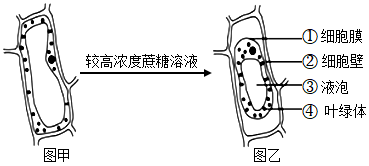
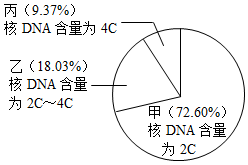
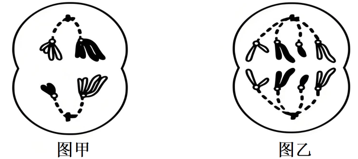
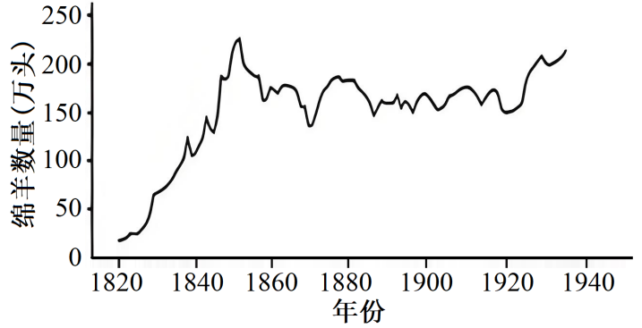
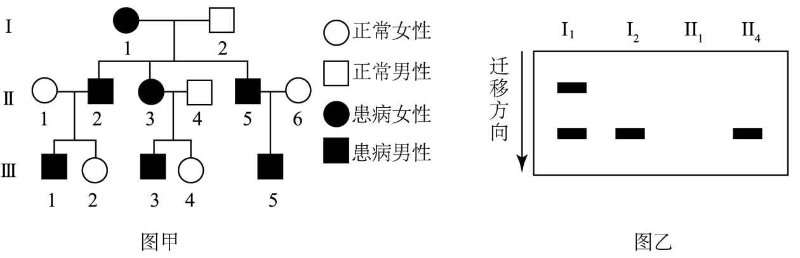
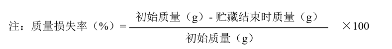

**2025年1月浙江省普通高校招生选考科目考试**

**生物学**

**考生须知：**

**1．考生答题前，务必将自己的姓名、准考证号用黑色字迹的签字笔或钢笔填写在答题纸上。**

**2．选择题的答案须用2B铅笔将答题纸上对应题目的答案标号涂黑，如要改动，须将原填涂处用橡皮擦净。**

**3．非选择题的答案须用黑色字迹的签字笔或钢笔写在答题纸上相应区域内，作图时可先使用2B铅笔，确定后须用黑色字迹的签字笔或钢笔描黑，答案写在本试题卷上无效。**

**选择题部分**

1\. 我国积极稳妥推进“碳中和”战略，努力实现CO2，相对“零排放”。下列措施不能减少CO2排放的是（ ）

A. 鼓励使用新能源汽车 B. 减少煤炭等火力发电

C. 推广使用一次性木筷 D. 乘坐公交等绿色出行

2\. 无机盐对生物体维持生命活动有重要的作用。人体缺铁会直接引起（ ）

A. 血红蛋白含量降低 B. 肌肉抽搐

C. 神经细胞兴奋性降低 D. 甲状腺肿大

3\. 人体内环境保持相对稳定以维持正常生命活动。下列物质不存在于内环境中的是（ ）

A. Ca2+ B. 淀粉 C. 葡萄糖 D. 氨基酸

4\. ATP是细胞生命活动的直接能源物质。下列物质运输过程需要消耗ATP的是（ ）

A. O2进入红细胞

B. 组织细胞排出CO2

C 浆细胞分泌抗体

D. 神经细胞内K+顺浓度梯度外流

5\. 调查发现，中国男性群体的红绿色盲率接近7%，女性群体约为0.5%。男性的红绿色盲基因只传给女儿，不传给儿子。控制人类红绿色盲的基因是（ ）

A. 常染色体上的隐性基因 B. X染色体上的隐性基因

C. 常染色体上的显性基因 D. X染色体上的显性基因

6\. 群落演替指一个群落替代另一个群落的过程，包括初生演替和次生演替。下列实例属于初生演替的是（ ）

A. 裸岩的表面长出地衣

B. 草原过度放牧后出现大片裸地

C. 荒草地改造成荷花塘

D. 云杉林被大量砍伐后杂草丛生

7\. 由于DDT严重危害生物的健康且不易降解，许多国家禁用DDT。但DDT能杀灭按蚊，有效控制疟疾的传播，因此2006年世界卫生组织宣布允许非洲国家重新使用DDT，使得非洲疟疾的新增病例大幅下降。下列叙述不合理的是（ ）

A. 喷施低浓度的DDT，也会在生物体内积累

B. DDT不易降解，不会在生物圈中大面积扩散

C. 在严格管控的情况下，DDT可以局部用于预防疟疾

D. 与第二营养级相比，第三营养级生物体内的DDT含量更高

8\. 传统发酵技术为我们提供了多种食品、饮料及调味品。下列叙述错误的是（ ）

A. 泡菜的风味由乳酸菌的种类决定

B. 用果酒发酵制作果醋的主要菌种是醋酸菌

C. 家庭酿制米酒的过程既有需氧呼吸又有厌氧呼吸

D. 传统发酵通常是利用多种微生物进行的混合发酵

9\. 某同学利用幼嫩的黑藻叶片完成“观察叶绿体和细胞质流动”实验后，继续进行“质壁分离”实验，示意图如下。

下列叙述正确的是（ ）

A. 实验过程中叶肉细胞处于失活状态

B. ①与②的分离，与①的选择透过性无关

C. 与图甲相比，图乙细胞吸水能力更强

D. 与图甲相比，图乙细胞体积明显变小

10\. 取鸡蛋清，加入蒸馏水，混匀并加热一段时间后，过滤得到浑浊的滤液。以该滤液为反应物，探究不同温度对某种蛋白酶活性的影响，实验结果如表所示。

|              |     |     |     |     |          |
|:------------:|:---:|:---:|:---:|:---:|:--------:|
| 组别           | 1   | 2   | 3   | 4   | 5        |
| 温度（℃）        | 27  | 37  | 47  | 57  | 67       |
| 滤液变澄清时间（min） | 16  | 9   | 4   | 6   | 50min未澄清 |

据表分析，下列叙述正确的是（ ）

A. 滤液变澄清的时间与该蛋白酶活性呈正相关

B. 组3滤液变澄清时间最短，酶促反应速率最快

C. 若实验温度为52℃，则滤液变澄清时间为4~6min

D. 若实验后再将组5放置在57℃，则滤液变澄清时间为6min

11\. 近年报道了多起猴痘病毒感染病例，人体感染猴痘病毒后会产生一系列的免疫应答。下列叙述正确的是（ ）

A. 猴痘病毒的增殖发生在血浆内

B. 注射猴痘病毒疫苗属于人工被动免疫

C. 体内的各种B淋巴细胞都能识别猴痘病毒

D. 在抵抗猴痘病毒过程中，辅助性T细胞既参与体液免疫也参与细胞免疫

12\. 某哺乳动物的体细胞核DNA含量为2C，对其体外培养细胞的核DNA含量进行检测，结果如图所示，其中甲、乙、丙表示不同核DNA含量的细胞及其占细胞总数的百分比。

下列叙述错误的是（ ）

A. 甲中细胞具有核膜和核仁

B. 乙中细胞进行核DNA复制

C. 丙中部分细胞的染色体着丝粒排列在细胞中央的平面上

D. 若培养液中加入秋水仙素，丙占细胞总数的百分比会减小

13\. 多种多样的生物通过遗传信息控制性状，并通过繁殖将遗传物质传递给子代。下列关于遗传物质的叙述正确的是（ ）

A. S型肺炎链球菌的遗传物质主要通过质粒传递给子代

B. 水稻、小麦和玉米三大粮食作物的遗传物质主要是DNA

C. 控制伞藻伞帽的遗传物质通过半保留复制表达遗传信息

D. 烟草叶肉细胞的遗传物质水解后可产生4种脱氧核苷酸

14\. 科学家将拟南芥的细胞分裂素氧化酶基因AtCKX1和AtCKX2分别导入到野生型烟草（WT）中，获得两种转基因烟草Y1和Y2，培养并测定相关指标，结果如表所示。

|     |          |        |         |                                                                            |           |
|:---:|:--------:|:------:|:-------:|:--------------------------------------------------------------------------:|:---------:|
| 植株  | 主根长度（mm） | 侧根数（条） | 不定根数（条） | 叶片数（片）                                                                     | 相对叶表面积（%） |
| WT  | 32.0     | 2.0    | 2.1     | 19.0                                                                       | 100       |
| Y1  | 50.0     | 6.6    | 3.5     | 8.2                                                                        | 13.5      |
| Y2  | 52.0     | 5.6    | 3.5     | 120 | 23.3      |

注：表内数据为平均值

下列叙述正确的是（ ）

A. 与WT相比，Y2光合总面积增加

B. Y1和Y2的细胞分裂素含量相同且低于WT

C. 若对Y1施加细胞分裂素类似物，叶片数会增加

D. 若对Y2施加细胞分裂素类似物，侧根和不定根数会增加

15\. 为研究甲状腺激素分泌的调控，某同学给大鼠注射抗促甲状腺激素血清后，测定其血液中相关激素的含量并进行分析。下列叙述正确的是（ ）

A. 甲状腺激素对下丘脑的负反馈作用减弱

B. 垂体分泌促甲状腺激素的功能减弱

C. 促甲状腺激素释放激素含量降低

D. 甲状腺激素含量升高

16\. 若某动物（2n=4）的基因型为BbXDY，其精巢中有甲、乙两个处于不同分裂时期的细胞。如图所示。据图分析，下列叙述正确的是（ ）

A. 甲细胞中，同源染色体分离，染色体数目减半

B. 乙细胞中，有4对同源染色体，2个染色体组

C. XD与b的分离可在甲细胞中发生，B与B的分离可在乙细胞中发生

D. 甲细胞产生的精细胞中基因型为BY的占1/4，乙细胞产生的子细胞基因型相同

17\. 制备蛙的坐骨神经腓肠肌标本，将其置于生理溶液中进行实验。下列叙述正确的是（ ）

A. 刺激腓肠肌，在肌肉和坐骨神经上都能检测到电位变化

B. 降低生理溶液中Na+浓度，刺激神经纤维，其动作电位幅度增大

C. 随着对坐骨神经的刺激强度不断增大，腓肠肌的收缩强度随之增大

D. 抑制乙酰胆碱的分解，刺激坐骨神经，一定时间内腓肠肌持续收缩

18\. 某研究小组进行微型月季的快速繁殖研究，结果如表所示。

|          |                                                          |
|:--------:|:--------------------------------------------------------:|
| 流程       | 最佳措施或最适培养基                                               |
| ①外植体腋芽消毒 | 75%乙醇浸泡30s+5%NaClO浸泡6min                                 |
| ②诱导出丛生苗  | MS+3.0mg·L-16-BA+0.05mg·L-1NAA     |
| ③丛生苗的扩增  | MS+2.0mg·L-16-BA+0.1mg·L-1NAA      |
| ④丛生苗的生根  | 1/2MS+0.25mg·L-16-BA+0.25mg·L-1NAA |

注：从生苗为丛状生长的幼苗，IBA（吲哚丁酸）为生长素类物质

下列叙述正确的是（ ）

A. 流程①的效果取决于消毒剂浓度

B. 流程②不需要经过脱分化形成愈伤组织的阶段

C. 与流程②相比，流程③培养基中细胞分裂素类与生长素类物质的比值更大

D. 与流程③相比，提高流程④培养基的盐浓度有利于从生苗的生根

19\. 某岛1820~1935年间绵羊种群数量变化结果如图所示。1850年后，由于放牧活动和对羊产品的市场需求，种群中大量中老年个体被捕杀，使其种群数量在132万~225万头之间波动，以持续获得最大经济效益。下列叙述正确的是（ ）

A. 1850年前，种群的增长速率持续增加

B. 1850年前，种群的增长方式为“J”形增长

C. 1850年后，种群的年龄结构呈增长型

D. 1850年后，种群数量波动的主要原因是种内竞争

20\. 某遗传病家系的系谱图如图甲所示，已知该遗传病由正常基因A突变成A1或A2引起，且A1对A和A2为显性，A对A2为显性。为确定家系中某些个体的基因型，分别根据A1和A2两种基因的序列，设计鉴定该遗传病基因的引物进行PCR扩增，电泳结果如图乙所示。

下列叙述正确的是（ ）

A. 电泳结果相同的个体表型相同，表型相同的个体电泳结果不一定相同

B. 若Ⅱ3的电泳结果有2条条带，则Ⅱ2和Ⅲ3基因型相同的概率为1/3

C. 若Ⅲ1与正常女子结婚，生了1个患病的后代，则可能是A2导致的

D. 若Ⅲ5的电泳结果仅有1条条带，则Ⅱ6的基因型只有1种可能

**非选择题部分**

**二、非选择题（本大题共5小题，共60分）**

21\. 浙江某地古杨梅复合种养系统以杨梅栽培为核心，在杨梅林中适度混载茶树，放养鸡、蜜蜂等生物，这种可持续发展的复合种养模式，是重要的农业文化遗产。回答下列问题：

（1）杨梅林中搭配种植茶树，使群落水平方向上出现\_\_\_\_\_\_\_\_\_\_\_\_\_\_\_\_\_现象，让这两种经济树种在同群落中实现\_\_\_\_\_\_\_\_\_\_\_\_\_\_\_\_\_，达到共存。

（2）林中养蜂能促进植物的授粉与结实。蜜蜂之间借助“舞蹈”相互交流，这种方式传递的信息属于\_\_\_\_\_\_\_\_\_\_\_\_\_\_\_\_\_。林下养鸡有助于除草、除虫，鸡粪可为系统提供肥料，但鸡的最大放养量不宜超过\_\_\_\_\_\_\_\_\_\_\_\_\_\_\_\_\_。从能量流动角度分析，鸡吃昆虫与吃相同质量的杂草相比，消耗该生态系统生产者的\_\_\_\_\_\_\_\_\_\_\_\_更多，原因是\_\_\_\_\_\_\_\_\_\_\_\_\_\_\_\_\_\_\_\_\_\_\_\_\_\_。

（3）杨梅复合种养系统与单一杨梅林相比，可获得杨梅、茶叶、鸡和蜂蜜等更多农产品。从物质循环角度分析，复合种养系统实现了\_\_\_\_\_\_\_\_\_\_\_\_\_。从能量流动角度分析，复合种养系统的意义有\_\_\_\_\_\_\_\_\_\_（答出2点即可）。

22\. 西兰花可食用部分为绿色花蕾、花茎组成花球，采摘后容易出现褪色、黄化、老化等现象。某兴趣小组进行如下实验，以探究西兰花花球的保鲜方法。

实验分黑暗组、日光组和红光组三组。日光组和红光组的光照强度均为50μmol·m-2·s-1。各处理的西兰花球均贮藏于20℃条件下，测定指标和结果如图所示。

回答下列问题：

（1）西兰花球采摘后水和\_\_\_\_\_\_\_\_\_\_\_\_\_\_\_\_\_\_\_供应中断。水是光合作用的原料在光反应中，水裂解产生O2和\_\_\_\_\_\_\_\_\_\_\_\_\_\_\_\_\_\_\_。

（2）三组实验中花球的质量损失率均随着时间延长而\_\_\_\_\_\_\_\_\_\_\_\_\_。前3天日光组和红光组的质量损失率低于黑暗组，原因有\_\_\_\_\_\_\_\_\_\_\_\_\_\_\_\_\_\_\_\_\_。第4天日光组的质量损失率高于黑暗组，原因可能是日光诱导气孔开放，引起\_\_\_\_\_\_\_\_\_\_\_\_\_\_\_\_\_\_\_增强从而散失较多水分。

（3）第4天日光组和红光组的\_\_\_\_\_\_\_\_\_\_\_\_\_\_\_\_\_\_\_下降比黑暗组更明显，但过氧化氢酶活性仍高于黑暗组，因此推测日光或红光照射能减轻\_\_\_\_\_\_\_\_\_\_\_\_\_\_\_\_\_\_\_过程产生的过氧化氢对细胞的损伤，从而延缓衰老。

（4）第4天黑暗组西兰花花球出现褪色、黄化现象，原因是\_\_\_\_\_\_\_\_\_\_\_\_\_\_。综合分析图中结果，\_\_\_\_\_\_\_\_\_\_\_\_\_\_处理对西兰花花球保鲜效果最明显。

23\. 谷子（2n=18）俗称小米，是起源于我国的重要粮食作物，自花授粉。已知米粒颜色有黄色、浅黄色和白色，由等位基因E和e控制，其中白色（ee）是米粒中色素合成相关酶的功能丧失所致。锈病是谷子的主要病害之一。抗锈病和感锈病由等位基因R和r控制。现有黄色感锈病的栽培种和白色抗锈病的农家种，欲选育黄色抗锈病的品种。

回答下列问题：

（1）授粉前，将处于盛花期的栽培种谷穗浸泡在45~46℃温水中10min，目的是\_\_\_\_\_\_\_\_\_\_\_\_，再授以农家种的花粉。为防止其他花粉的干扰，对授粉后的谷穗进行\_\_\_\_\_\_\_\_\_处理。同时，以栽培种为父本进行反交。

（2）正反交得到的F1全为浅黄色抗锈病，F2的表型及其株数如下表所示。

|                  |       |        |       |       |        |       |
|:----------------:|:-----:|:------:|:-----:|:-----:|:------:|:-----:|
| 表型               | 黄色抗锈病 | 浅黄色抗锈病 | 白色抗锈病 | 黄色感锈病 | 浅黄色感锈病 | 白色感锈病 |
| F2（株） | 120   | 242    | 118   | 40    | 82     | 39    |

从F2中选出黄色抗锈病的甲和乙，浅黄色抗锈病的丙。甲自交子一代全为黄色抗锈病，乙自交子一代为黄色抗锈病和黄色感锈病，丙自交子一代为黄色抗锈病、浅黄色抗锈病和白色抗锈病。

①栽培种与农家种杂交获得的F1产生\_\_\_\_\_\_\_\_\_\_\_种基因型的配子，甲的基因型是\_\_\_\_\_\_\_\_\_\_\_，乙连续自交得到的子二代中，纯合黄色抗锈病的比例是\_\_\_\_\_\_\_\_\_\_\_\_\_。杂交选育黄色抗锈病品种，利用的原理是\_\_\_\_\_\_\_\_\_\_\_\_\_\_\_\_\_\_\_\_\_\_\_\_\_\_\_\_。

②写出乙×丙杂交获得子一代的遗传图解\_\_\_\_\_\_。

（3）谷子的祖先是野生青狗尾草（2n=18）。20世纪80年代开始，作物栽培中长期大范围施用除草剂，由于除草剂的\_\_作用，抗除草剂的青狗尾草个体比例逐渐增加。若利用抗除草剂的青狗尾草培育抗除草剂的谷子，可采用的方法有\_\_\_\_\_\_\_\_\_\_\_\_\_\_\_\_\_\_\_\_\_\_\_（答出2点即可）。

24\. 3-磷酸甘油脱氢酶（GPD）是酵母细胞中甘油合成的关键酶。利用某假丝酵母菌株为材料，克隆具有高效催化效率的3-磷酸甘油脱氢酶的基因（Gpd）。采用的方案是：先通过第1次PCR扩增出该基因的中间部分，再通过第2次PCR分别扩增出该基因的两侧，经拼接获得完整基因的序列，如图所示，回答下列问题：

（1）分析不同物种的GPD蛋白序列，确定蛋白质上相同的氨基酸区段，依据这些氨基酸所对应的\_\_\_\_\_\_\_\_\_\_\_，确定DNA序列，进而设计1对引物。以该菌株基因组DNA为模板进行第1次PCR，利用\_\_\_\_\_\_\_\_凝胶电泳分离并纯化DNA片段，进一步测定PCR产物的序列。在制备PCR反应体系时，每次用微量移液器吸取不同试剂前，需要确认或调整刻度和量程，还需要\_\_\_\_\_\_\_\_\_\_\_\_\_\_\_\_\_\_。

（2）若在上述PCR扩增结果中，除获得一条阳性条带外，还出现了另外一条条带，不可能的原因是\_\_\_\_\_\_\_\_\_\_。

A. DNA模板被其他酵母细胞的基因组DNA污染

B. 每个引物与DNA模板存在2个配对结合位点

C. 在基因组中Gpd基因有2个拷贝

D. 在基因组中存在1个与Gpd基因序列高度相似的其他基因

（3）为获得完整的Gpd基因，分别用限制性核酸内切酶PstⅠ和SalⅠ单酶切基因组DNA后，各自用DNA连接酶连接形成环形DNA，再用苯酚-氯仿抽提除去杂质，最后加入\_\_\_\_\_\_\_\_沉淀环形DNA。根据第一次PCR产物测定获得的序列，重新设计一对引物，以环形DNA为模板进行第二次PCR，最后进行测序。用于第二次PCR的一对引物，其序列应是DNA链上的\_\_\_\_\_\_\_\_（A．P1和P2 B．P3和P4 C．P1和P4 D．P2和P3）。根据测序结果拼接获得完整的Gpd基因序列，其中的启动子和终止子具有\_\_\_\_\_\_\_\_功能。

（4）为确定克隆获得的Gpd基因的准确性，可将获得的基因序列与已建立的\_\_\_\_\_\_\_\_\_\_进行比对。将Gpd基因的编码区与\_\_\_\_\_\_\_\_\_\_\_\_\_\_\_\_\_\_\_\_连接，构建重组质粒，再将重组质粒导入酿酒酵母细胞中，实现利用酿酒酵母高效合成甘油的目的。

25\. 为研究药物D对机体生理功能的影响和药物Z对细胞增殖的影响，某同学进行以下实验并提出一个实验方案。回答下列问题：

给一组大鼠隔日注射药物D，每隔一定时间，测定该组大鼠的血糖浓度和尿糖浓度。

实验结果：血糖浓度增加，出现尿糖且其浓度增加。

（1）①由上述实验结果推测，药物D损伤了大鼠的\_\_\_\_\_\_\_\_\_\_细胞，大鼠肾小管中葡萄糖含量增加，会使其尿量\_\_\_\_\_\_\_\_\_\_。同时大鼠的进食量增加，体重下降，原因是\_\_\_\_\_\_\_\_\_\_。

②检测尿中是否有葡萄糖，可选用的试剂是\_\_\_\_\_\_\_\_\_\_。

（2）为验证药物Z对肝癌细胞增殖有抑制作用，但对肝细胞增殖无抑制作用，根据以下材料和用具，完善实验思路，预测实验结果。

材料和用具：若干份细胞数为N的大鼠肝癌细胞悬液和肝细胞悬液、细胞培养液、药物Z、细胞培养瓶、CO2培养箱、显微镜等。

（说明与要求：细胞的具体计数方法不作要求，不考虑加入药物Z对培养液体积的影响，实验条件适宜。）

①完善实验思路。

i．取细胞培养瓶，分为A、B、C、D四组，分别加入细胞培养液。

i i．\_\_\_\_\_\_\_。

i i i．\_\_\_\_\_\_\_

i i i i．\_\_\_\_\_\_\_。

②预测实验结果\_\_\_\_\_\_\_（设计一个坐标，用柱形图表示最后一次检测结果）
