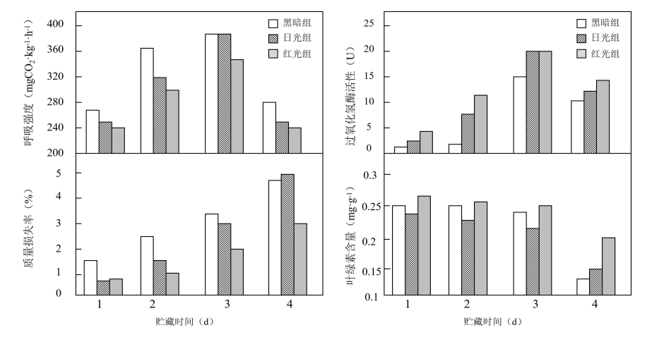
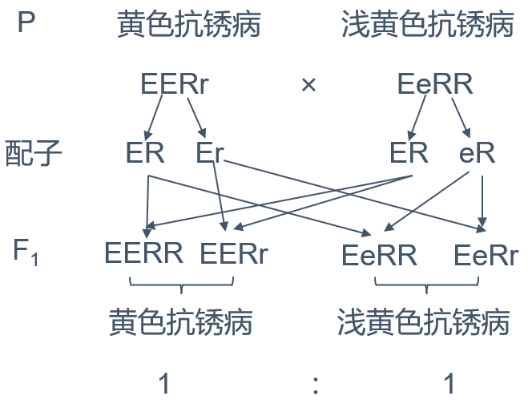
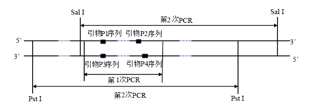
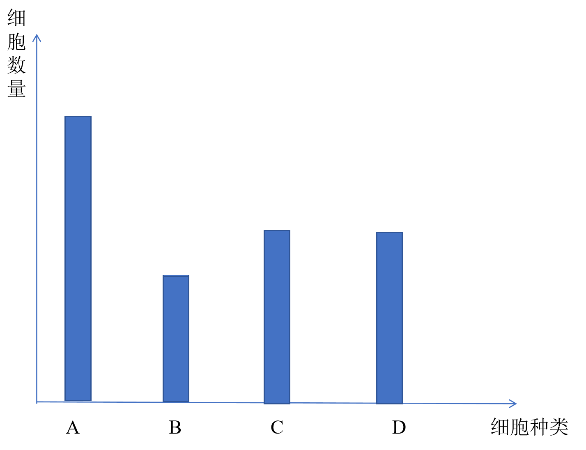

**2025年1月浙江省普通高校招生选考科目考试**

**生物学**

**考生须知：**

**1．考生答题前，务必将自己的姓名、准考证号用黑色字迹的签字笔或钢笔填写在答题纸上。**

**2．选择题的答案须用2B铅笔将答题纸上对应题目的答案标号涂黑，如要改动，须将原填涂处用橡皮擦净。**

**3．非选择题的答案须用黑色字迹的签字笔或钢笔写在答题纸上相应区域内，作图时可先使用2B铅笔，确定后须用黑色字迹的签字笔或钢笔描黑，答案写在本试题卷上无效。**

**选择题部分**

1\. 我国积极稳妥推进“碳中和”战略，努力实现CO2，相对“零排放”。下列措施不能减少CO2排放的是（ ）

A. 鼓励使用新能源汽车 B. 减少煤炭等火力发电

C. 推广使用一次性木筷 D. 乘坐公交等绿色出行

【答案】C

【解析】

【分析】为实现碳中和，鼓励使用新能源汽车、 减少煤炭等火力发电、 乘坐公交等绿色出行等方式减少CO2的排放，同时退耕还林、植树种草等措施增加CO2的吸收。

【详解】AB、鼓励使用新能源汽车，减少煤炭等火力发电，可减少化石燃料的燃烧，从而减少CO2的排放，AB错误；

C、推广使用一次性木筷，会因大量砍伐木材，导致CO2的吸收量减少，排放量增加，C正确；

D、乘坐公交等绿色出行，可节约资源，减少CO2的排放，D错误。

故选C。

2\. 无机盐对生物体维持生命活动有重要的作用。人体缺铁会直接引起（ ）

A. 血红蛋白含量降低 B. 肌肉抽搐

C. 神经细胞兴奋性降低 D. 甲状腺肿大

【答案】A

【解析】

【分析】部分无机盐离子的具体功能：（1）I-是甲状腺激素的组成成分，缺乏时甲状腺激素合成减少，成年人患地方性甲状腺肿；（2）Fe2+是血红蛋白中血红素的组成成分，缺乏时患贫血；（3）Ca2+：血钙过低时，会出现抽搐现象；血钙过高时，会患肌无力；（4）Mg2+是组成叶绿素的元素之一，缺乏时叶片变黄，无法进行光合作用；

【详解】A、Fe2+是血红蛋白中血红素的组成成分，缺铁会直接血红蛋白含量降低，A正确；

B、血钙过低时，会出现抽搐现象，B错误；

C、神经细胞兴奋性降低与Na细胞外浓度低有关，C错误；

D、I-是甲状腺激素的组成成分，缺乏时甲状腺激素合成减少，成年人患地方性甲状腺肿，D错误。

故选A。

3\. 人体内环境保持相对稳定以维持正常生命活动。下列物质不存在于内环境中的是（ ）

A. Ca2+ B. 淀粉 C. 葡萄糖 D. 氨基酸

【答案】B

【解析】

【分析】1、内环境的概念：由细胞外液构成的液体环境叫做内环境，包括血浆、组织液和淋巴。

2、内环境中可以存在的物质：①小肠吸收的物质在血浆、淋巴中运输：水、盐、糖、氨基酸、维生素、血浆蛋白、甘油、脂肪酸等；②细胞分泌物：抗体、淋巴因子、神经递质、激素等；③细胞代谢产物：CO2、水分、尿素等。

3、内环境中不存在的物质：血红蛋白、载体蛋白、H2O2酶、细胞呼吸酶有关的酶、复制转录翻译酶等各种胞内酶、消化酶等。

【详解】A、Ca2+是小肠吸收的无机盐离子，可以存在于内环境，A错误；

BC、人体不能直接吸收淀粉，需水解为葡萄糖后吸收，所以淀粉不存在于内环境中，葡萄糖可存在于内环境中，B正确，C错误；

D、氨基酸是小肠吸收的营养物质，可以存在于内环境中，D错误。

故选B。

4\. ATP是细胞生命活动的直接能源物质。下列物质运输过程需要消耗ATP的是（ ）

A. O2进入红细胞

B. 组织细胞排出CO2

C. 浆细胞分泌抗体

D. 神经细胞内K+顺浓度梯度外流

【答案】C

【解析】

【分析】1、胞吞、胞吐是普遍存在的现象，它们也需要消耗细胞呼吸所释放的能量。

2、主动运输：物质逆浓度梯度进行跨膜运输，需要载体蛋白的协助，同时还需要消耗细胞内化学反应所释放的能量。

【详解】A、O2进入红细胞属于自由扩散，不消耗能量，A错误；

B、组织细胞排出CO2 属于自由扩散，不消耗能量，B错误；

C、浆细胞分泌抗体属于胞吐，需要消耗能量，C正确；

D、神经细胞内K+顺浓度梯度外流属于协助扩散，不消耗能量，D错误。

故选C。

5\. 调查发现，中国男性群体的红绿色盲率接近7%，女性群体约为0.5%。男性的红绿色盲基因只传给女儿，不传给儿子。控制人类红绿色盲的基因是（ ）

A. 常染色体上的隐性基因 B. X染色体上的隐性基因

C. 常染色体上的显性基因 D. X染色体上的显性基因

【答案】B

【解析】

【分析】伴X隐性遗传病的发病特点：男患者多于女患者；隔代交叉遗传，即男患者将致病基因通过女儿传给他的外孙。

【详解】题干中男性红绿色盲基因只传给女儿，不传给儿子以及男女患病比例差异较大，男性患病多于女性患者，符合伴X染色体隐性遗传病的特点，所以控制人类红绿色盲的基因是X染色体上的隐性基因控制，B正确；

故选B。

6\. 群落演替指一个群落替代另一个群落的过程，包括初生演替和次生演替。下列实例属于初生演替的是（ ）

A. 裸岩的表面长出地衣

B. 草原过度放牧后出现大片裸地

C. 荒草地改造成荷花塘

D. 云杉林被大量砍伐后杂草丛生

【答案】A

【解析】

【分析】群落的演替包括初生演替和次生演替。在一个从来没有过植被或者原来存在过植被，但被彻底消灭了的地方开始初生演替，如火山岩（裸岩）、冰川泥上的演替；在原有植被虽已不存在，但是保留原有土壤条件，甚至种子或其他繁殖体的地方开始次生演替，如从过量砍伐的森林开始的演替、从弃耕荒废的农田开始的演替、火灾过后的草原开始的演替。

【详解】A、在一个从来没有过植被或者原来存在过植被，但被彻底消灭了的地方开始初生演替，裸岩的表面长出地衣属于初生演替，A正确；

BCD、在原有植被虽已不存在，但是保留原有土壤条件，甚至种子或其他繁殖体的地方开始次生演替，草原过度放牧后出现大片裸地、荒草地改造成荷花塘、云杉林被大量砍伐后杂草丛生都属于次生演替，BCD错误。

故选A。

7\. 由于DDT严重危害生物的健康且不易降解，许多国家禁用DDT。但DDT能杀灭按蚊，有效控制疟疾的传播，因此2006年世界卫生组织宣布允许非洲国家重新使用DDT，使得非洲疟疾的新增病例大幅下降。下列叙述不合理的是（ ）

A. 喷施低浓度的DDT，也会在生物体内积累

B. DDT不易降解，不会在生物圈中大面积扩散

C. 在严格管控的情况下，DDT可以局部用于预防疟疾

D. 与第二营养级相比，第三营养级生物体内的DDT含量更高

【答案】B

【解析】

【分析】生物体从周围环境吸收、积蓄“某种元素或难以降解的化合物”，使其在机体内浓度超过环境浓度的现象，称作生物富集。一旦含有“某种元素或难以降解的化合物”的生物被更高营养级的动物食用，就会沿着食物链逐渐在生物体内聚集，最终积累在食物链的顶端。

【详解】AD、DDT严重危害生物的健康且不易降解，能够沿着食物链逐渐在生物体内聚集，且营养级越高的生物体，其体内富集的DDT含量就越高，因此在喷施低浓度的DDT，也会在生物体内积累，与第二营养级相比，第三营养级生物体内的DDT含量更高，AD正确；

B、物质循环具有全球性，DDT不易降解，可以通过大气、水和生物迁移等途径扩散到世界各地，若使用不当，可能会导致DDT在生物圈中大面积扩散，B错误；

C、由题意“DDT能杀灭按蚊，有效控制疟疾的传播”可知：在严格管控的情况下，DDT可以局部用于预防疟疾，C正确。

故选B。

8\. 传统发酵技术为我们提供了多种食品、饮料及调味品。下列叙述错误的是（ ）

A. 泡菜的风味由乳酸菌的种类决定

B. 用果酒发酵制作果醋的主要菌种是醋酸菌

C. 家庭酿制米酒的过程既有需氧呼吸又有厌氧呼吸

D. 传统发酵通常是利用多种微生物进行的混合发酵

【答案】A

【解析】

【分析】参与果酒制作的微生物是酵母菌，其新陈代谢类型为异养兼性厌氧型。参与果醋制作的微生物是醋酸菌，其新陈代谢类型是异养需氧型。果醋制作的原理：当氧气、糖源都充足时，醋酸菌将葡萄汁中的葡萄糖分解成醋酸；当缺少糖源时，醋酸菌将乙醇变为乙醛，再将乙醛变为醋酸。

【详解】A、泡菜的风味由原料、发酵菌种类、发酵环境等因素共同决定的，A错误；

B、用果酒发酵制作果醋的主要菌种是醋酸菌，醋酸菌是好氧型微生物，B正确；

C、家庭酿制米酒主要用的是酵母菌，在酿制米酒的过程中，首先让酵母菌在有氧的环境进行增殖，然后在无氧的环境中进行发酵，C正确；

D、传统发酵食品所用的是自然菌种，没有进行严格的灭菌，以混合菌种的固体发酵及半固体发酵为主，D正确。

故选A。

9\. 某同学利用幼嫩的黑藻叶片完成“观察叶绿体和细胞质流动”实验后，继续进行“质壁分离”实验，示意图如下。

下列叙述正确的是（ ）

A. 实验过程中叶肉细胞处于失活状态

B. ①与②的分离，与①的选择透过性无关

C 与图甲相比，图乙细胞吸水能力更强

D. 与图甲相比，图乙细胞体积明显变小

【答案】C

【解析】

【分析】在逐渐发生质壁分离的过程中，细胞液的浓度增加，细胞液的渗透压升高，细胞的吸水能力逐渐增强。

【详解】A、由题意可知，该细胞可观察叶绿体和细胞质流动，说明细胞没有失活，A错误；

B、①与②的分离，与①的选择透过性有关，其原因就是因为蔗糖可通过全透性的细胞壁，但不能通过具有选择透过性的细胞膜，B错误；

C、与图甲相比，图乙细胞处于失水状态，细胞液渗透压升高，吸水能力更强，C正确；

D、与图甲相比，图乙细胞体积几乎不变（植物细胞体积是看细胞壁），D错误。

故选C。

10\. 取鸡蛋清，加入蒸馏水，混匀并加热一段时间后，过滤得到浑浊的滤液。以该滤液为反应物，探究不同温度对某种蛋白酶活性的影响，实验结果如表所示。

|              |     |     |     |     |          |
|:------------:|:---:|:---:|:---:|:---:|:--------:|
| 组别           | 1   | 2   | 3   | 4   | 5        |
| 温度（℃）        | 27  | 37  | 47  | 57  | 67       |
| 滤液变澄清时间（min） | 16  | 9   | 4   | 6   | 50min未澄清 |

据表分析，下列叙述正确的是（ ）

A. 滤液变澄清的时间与该蛋白酶活性呈正相关

B. 组3滤液变澄清时间最短，酶促反应速率最快

C. 若实验温度为52℃，则滤液变澄清时间为4~6min

D. 若实验后再将组5放置在57℃，则滤液变澄清时间为6min

【答案】B

【解析】

【分析】由题意可知，浑浊的滤液为变性的蛋白质液体，该实验是通过蛋白酶水解变性后蛋白质是液体变澄清，变澄清时间越短，说明酶活性越强。

【详解】A、浑浊的滤液为变性的蛋白质液体，滤液变澄清的时间与该蛋白酶活性呈负相关，即蛋白酶活性越强，蛋白质水解越快，澄清时间越短，A错误；

B、组3滤液变澄清时间最短，说明酶活性最高，酶促反应速率最快，B正确；

C、若实验温度为52℃，可能酶活性大于第3、4组，时间可能小于4min，C错误；

D、组5蛋白酶已经失活，实验后再将组5放置在57℃，滤液也不会澄清，D错误。

故选B。

11\. 近年报道了多起猴痘病毒感染病例，人体感染猴痘病毒后会产生一系列的免疫应答。下列叙述正确的是（ ）

A. 猴痘病毒的增殖发生在血浆内

B. 注射猴痘病毒疫苗属于人工被动免疫

C. 体内的各种B淋巴细胞都能识别猴痘病毒

D. 在抵抗猴痘病毒过程中，辅助性T细胞既参与体液免疫也参与细胞免疫

【答案】D

【解析】

【分析】1、病毒只能寄生在活细胞内，没有细胞结构。

2、树突状细胞、B细胞等抗原呈递细胞摄取病原体，而后对抗原进行处理，呈递在细胞表面，然后传递给辅助性T细胞，辅助性T细胞表面特定分子发生变化并与B细胞结合，这是激活B细胞的第二个信号。

【详解】A、病毒只能寄生在活细胞内，因此猴痘病毒的增殖发生在细胞内，A错误；

B、注射猴痘病毒疫苗会引起人体免疫反应产生相关的抗体等，属于人工主动免疫，B错误；

C、B淋巴细胞的识别具有特异性，C错误；

D、在抵抗猴痘病毒过程中，辅助性T细胞体液免疫过程中作为第二信号，且分泌细胞因子促进B细胞的增殖分化，在细胞免疫过程中，辅助性T细胞分泌细胞因子促进细胞毒性T细胞的增殖分化，D正确。

故选D。

12\. 某哺乳动物的体细胞核DNA含量为2C，对其体外培养细胞的核DNA含量进行检测，结果如图所示，其中甲、乙、丙表示不同核DNA含量的细胞及其占细胞总数的百分比。

下列叙述错误的是（ ）

A. 甲中细胞具有核膜和核仁

B. 乙中细胞进行核DNA复制

C. 丙中部分细胞的染色体着丝粒排列在细胞中央的平面上

D. 若培养液中加入秋水仙素，丙占细胞总数的百分比会减小

【答案】D

【解析】

【分析】1、分裂间期是有丝分裂的准备阶段。细胞内发生着活跃的代谢变化，最重要的变化是发生在S期的DNA复制。S期之前的G1期，主要是合成DNA复制所需的蛋白质，以及核糖体的增生，S期之后的G2期，合成M期所必需的一些蛋白质。当分裂间期结束，细胞进入分裂期时，组成染色质的DNA已经完成复制，有关蛋白质已经合成。这些复杂的变化需要较长的时间，因此在细胞周期中，分裂间期的时间总是长于M期。

2、题图分析：据图中核DNA含量及占比分析，甲为G1期和有丝分裂末期细胞，乙为S期细胞，丙为G2期和有丝分裂分裂期的细胞。

【详解】A、据图可知，甲中细胞核DNA含量为2C的细胞，在甲乙丙三组细胞占比最大，说明此时细胞处于分裂间期的G1期，DNA还未进行复制，此时细胞具有核膜和核仁，A正确；

B、据图可知，乙中细胞核DNA含量为2C-4C，说明细胞处于S期，细胞进行DNA复制，B正确；

C、据图可知，丙中细胞核DNA含量为4C，说明细胞处于G2期和分裂期。当细胞处于有丝分裂中期时，细胞中染色体着丝粒排列在细胞中央的平面上，C正确；

D、秋水仙素抑制纺锤体形成，若培养液中加入秋水仙素，细胞无法完成细胞分裂，丙占细胞总数的百分比会增加，D错误。

故选D。

13\. 多种多样的生物通过遗传信息控制性状，并通过繁殖将遗传物质传递给子代。下列关于遗传物质的叙述正确的是（ ）

A. S型肺炎链球菌的遗传物质主要通过质粒传递给子代

B. 水稻、小麦和玉米三大粮食作物的遗传物质主要是DNA

C. 控制伞藻伞帽的遗传物质通过半保留复制表达遗传信息

D. 烟草叶肉细胞的遗传物质水解后可产生4种脱氧核苷酸

【答案】D

【解析】

【分析】细胞生物中，既含有DNA，又含有RNA，DNA为遗传物质；病毒含有DNA或RNA，遗传物质为DNA或RNA。绝大多数生物的遗传物质是DNA，只有少数RNA病毒的遗传物质是RNA，故一切生物的遗传物质为核酸。

【详解】A、S型肺炎链球菌是原核生物，其遗传物质主要分布于拟核。因此，S型肺炎链球菌的遗传物质主要通过拟核传递给子代，A错误；

B、水稻、小麦和玉米三大粮食作物都是植物，都属于真核生物，真核生物的遗传物质是DNA，B错误；

C、基因指导蛋白质的合成过程是遗传信息的表达过程，伞藻通过复制传递遗传信息，而不是表达遗传信息，C错误；

D、烟草叶肉细胞的遗传物质是DNA，其单体是脱氧核苷酸，DNA水解后可产生4种脱氧核苷酸，D正确。

故选D。

14\. 科学家将拟南芥的细胞分裂素氧化酶基因AtCKX1和AtCKX2分别导入到野生型烟草（WT）中，获得两种转基因烟草Y1和Y2，培养并测定相关指标，结果如表所示。

|     |          |        |         |        |           |
|:---:|:--------:|:------:|:-------:|:------:|:---------:|
| 植株  | 主根长度（mm） | 侧根数（条） | 不定根数（条） | 叶片数（片） | 相对叶表面积（%） |
| WT  | 32.0     | 2.0    | 2.1     | 19.0   | 100       |
| Y1  | 50.0     | 6.6    | 3.5     | 8.2    | 13.5      |
| Y2  | 52.0     | 5.6    | 3.5     | 12.0   | 23.3      |

注：表内数据为平均值

下列叙述正确的是（ ）

A. 与WT相比，Y2光合总面积增加

B. Y1和Y2的细胞分裂素含量相同且低于WT

C. 若对Y1施加细胞分裂素类似物，叶片数会增加

D. 若对Y2施加细胞分裂素类似物，侧根和不定根数会增加

【答案】C

【解析】

【分析】细胞分裂素的合成部位主要是根尖，其主要作用是促进细胞分裂，促进芽的分化、倒枝发育、叶绿素合成。

【详解】A、由表可知，Y2的叶片数比WT少，相对叶表面积也小，因此光合总面积减少，A错误；

B、将拟南芥的细胞分裂素氧化酶基因导入到野生型烟草中，会使细胞分裂素氧化酶增多，从而使细胞分裂素含量降低，Y1和Y2是导入了不同的细胞分裂素氧化酶基因得到的转基因烟草，无法确定它们的细胞分裂素氧化酶的活性等情况，所以Y1和Y2的细胞分裂素含量无法比较，B错误；

C、细胞分裂素主要促进细胞分裂，若对Y1施加细胞分裂素类似物，不会被细胞分裂素氧化酶分解，可以使叶片数增加，C正确；

D、由题表信息可知，将拟南芥的细胞分裂素氧化酶基因导入到野生型烟草（WT）中后，Y2的侧根数和不定根数都多于野生型，而细胞分裂素氧化酶会使细胞分裂素含量降低，所以若对Y2施加细胞分裂素类似物，侧根和不定根数会减少，D错误。

故选C。

15\. 为研究甲状腺激素分泌的调控，某同学给大鼠注射抗促甲状腺激素血清后，测定其血液中相关激素的含量并进行分析。下列叙述正确的是（ ）

A. 甲状腺激素对下丘脑的负反馈作用减弱

B. 垂体分泌促甲状腺激素的功能减弱

C. 促甲状腺激素释放激素含量降低

D. 甲状腺激素含量升高

【答案】A

【解析】

【分析】下丘脑分泌的促甲状腺激素释放激素作用于垂体，促进垂体分泌促甲状腺激素作用于甲状腺，促进甲状腺分泌甲状腺激素，甲状腺激素通过负反馈抑制下丘脑和垂体分泌相应的激素，甲状腺激素含量高时，抑制作用强，含量低时，抑制作用弱。

【详解】给大鼠注射抗促甲状腺激素血清后，促甲状腺激素不能发挥作用，导致甲状腺分泌的甲状腺激素减少，甲状腺激素对下丘脑的负反馈作用减弱，垂体分泌促甲状腺激素的功能增强，下丘脑分泌的促甲状腺激素释放激素增多，A正确，BCD错误。

故选A。

16\. 若某动物（2n=4）的基因型为BbXDY，其精巢中有甲、乙两个处于不同分裂时期的细胞。如图所示。据图分析，下列叙述正确的是（ ）

A. 甲细胞中，同源染色体分离，染色体数目减半

B. 乙细胞中，有4对同源染色体，2个染色体组

C. XD与b的分离可在甲细胞中发生，B与B的分离可在乙细胞中发生

D. 甲细胞产生的精细胞中基因型为BY的占1/4，乙细胞产生的子细胞基因型相同

【答案】C

【解析】

【分析】图甲细胞同源染色体分离，非同源染色体自由组合，处于减数第一次分裂后期；图乙细胞着丝粒分裂，染色体均分到细胞两极，处于有丝分裂后期。

【详解】A、甲细胞处于减数第一次分裂后期，同源染色体分离，染色体数目不变，A错误；

B、乙细胞处于有丝分裂后期，有4对同源染色体，4个染色体组，B错误；

C、XD与b属于非同源染色体上的非等位基因，二者的分离可在甲细胞中（非同源染色体上的非等位基因自由组合）发生，B与B为姐妹染色单体上的相同，二者的分离可在乙细胞中发生，随着丝粒的分裂而分离，C正确；

D、由图可知，甲细胞只能产生两种次级精母细胞，所以只能产生4个两种精细胞，若产生BY，则另一种为bXD，即甲细胞若产生BY，则产生的精细胞中基因型为BY的占1/2，也有可能不产生BY，乙细胞有丝分裂产生的子细胞基因型相同，D错误。

故选C。

17\. 制备蛙的坐骨神经腓肠肌标本，将其置于生理溶液中进行实验。下列叙述正确的是（ ）

A. 刺激腓肠肌，在肌肉和坐骨神经上都能检测到电位变化

B. 降低生理溶液中Na+浓度，刺激神经纤维，其动作电位幅度增大

C. 随着对坐骨神经的刺激强度不断增大，腓肠肌的收缩强度随之增大

D. 抑制乙酰胆碱的分解，刺激坐骨神经，一定时间内腓肠肌持续收缩

【答案】D

【解析】

【分析】静息状态时，神经细胞膜对钾离子的通透性大，钾离子大量外流，形成内负外正的静息电位；受到刺激后，神经细胞膜的通透性发生改变，对钠离子的通透性增大，钠离子内流，形成内正外负的动作电位。兴奋部位和非兴奋部位形成电位差，产生局部电流，兴奋就以电信号的形式传递下去。

【详解】A、刺激腓肠肌，不能在坐骨神经上检测到电位变化，因为兴奋在突触处的传递是单向的，A错误；

B、降低生理溶液中Na+浓度，神经细胞膜两侧Na+浓度差减小，刺激神经纤维，其动作电位幅度减少，B错误；

C、在一定范围内随着刺激强度的增大，肌肉收缩的力度也相应增大，其原因是不同神经纤维兴奋所需的刺激强度阈值不同，随着刺激强度的增大，受刺激发生兴奋的神经纤维数量逐渐增加，引起效应器的反应强度也因此逐渐增加，C错误；

D、乙酰胆碱是兴奋性神经递质，抑制乙酰胆碱的分解，刺激坐骨神经，乙酰胆碱持续起作用，一定时间内腓肠肌持续收缩，D正确。

故选D。

18\. 某研究小组进行微型月季的快速繁殖研究，结果如表所示。

|          |                                                          |
|:--------:|:--------------------------------------------------------:|
| 流程       | 最佳措施或最适培养基                                               |
| ①外植体腋芽消毒 | 75%乙醇浸泡30s+5%NaClO浸泡6min                                 |
| ②诱导出丛生苗  | MS+3.0mg·L-16-BA+0.05mg·L-1NAA     |
| ③丛生苗的扩增  | MS+2.0mg·L-16-BA+0.1mg·L-1NAA      |
| ④丛生苗的生根  | 1/2MS+0.25mg·L-16-BA+0.25mg·L-1NAA |

注：从生苗为丛状生长的幼苗，IBA（吲哚丁酸）为生长素类物质

下列叙述正确的是（ ）

A. 流程①的效果取决于消毒剂浓度

B. 流程②不需要经过脱分化形成愈伤组织的阶段

C. 与流程②相比，流程③培养基中细胞分裂素类与生长素类物质的比值更大

D. 与流程③相比，提高流程④培养基的盐浓度有利于从生苗的生根

【答案】B

【解析】

【分析】植物组织培养过程中，激素的比例影响其分化的方向，当细胞分裂素与生长素比例相当时，产生愈伤组织，生长素浓度较高时，诱导根的形成，细胞分裂素浓度较高时，诱导芽的形成。

【详解】A、流程①中，消毒效果不仅取决于消毒剂浓度，还取决于消毒时间和消毒剂种类，A错误；

B、流程②不需要经过脱分化形成愈伤组织的阶段，直接经腋芽直接分化为丛生苗，B正确；

C、与流程②相比，流程③培养基中细胞分裂素类与生长素类物质的比值小，C错误；

D、与流程③相比，提高流程④培养基的IBA浓度有利于从生苗的生根，D错误。

故选B。

19\. 某岛1820~1935年间绵羊种群数量变化结果如图所示。1850年后，由于放牧活动和对羊产品的市场需求，种群中大量中老年个体被捕杀，使其种群数量在132万~225万头之间波动，以持续获得最大经济效益。下列叙述正确的是（ ）

A. 1850年前，种群的增长速率持续增加

B. 1850年前，种群增长方式为“J”形增长

C. 1850年后，种群的年龄结构呈增长型

D. 1850年后，种群数量波动的主要原因是种内竞争

【答案】C

【解析】

【分析】S型增长曲线：当种群在一个有限的环境中增长时，随着种群密度的上升，个体间由于有限的空间、食物和其他生活条件而引起的种内竞争必将加剧，以该种群生物为食的捕食者的数量也会增加，这就会使这个种群的出生率降低，死亡率增高，从而使种群数量的增长率下降。当种群数量达到环境条件所允许的最大值时，种群数量将停止增长，有时会在K值保持相对稳定。

【详解】AB、1850年前，种群的增长方式为“S”形增长，其种群增长速率为先增加，后下降，AB错误；

C、1850年后，由于放牧活动和对羊产品的市场需求，种群中大量中老年个体被捕杀，使其种群数量在132万~225万头之间波动，说明该种群中幼年个体大于高年个体，所以该种群的年龄结构为增长型，C正确；

D、依据题干信息，1850年后，由于放牧活动和对羊产品的市场需求，种群中大量中老年个体被捕杀，使其种群数量在132万~225万头之间波动，所以1850年后，种群数量波动的主要原因是捕杀，而不是种内竞争，D错误。

故选C。

20\. 某遗传病家系的系谱图如图甲所示，已知该遗传病由正常基因A突变成A1或A2引起，且A1对A和A2为显性，A对A2为显性。为确定家系中某些个体的基因型，分别根据A1和A2两种基因的序列，设计鉴定该遗传病基因的引物进行PCR扩增，电泳结果如图乙所示。

下列叙述正确的是（ ）

A. 电泳结果相同的个体表型相同，表型相同的个体电泳结果不一定相同

B. 若Ⅱ3的电泳结果有2条条带，则Ⅱ2和Ⅲ3基因型相同的概率为1/3

C. 若Ⅲ1与正常女子结婚，生了1个患病的后代，则可能是A2导致的

D. 若Ⅲ5的电泳结果仅有1条条带，则Ⅱ6的基因型只有1种可能

【答案】B

【解析】

【分析】基因的分离定律的实质是：在杂合子的细胞中，位于一对同源染色体上的等位基因，具有一定的独立性；在减数分裂形成配子的过程中，等位基因会随同源染色体的分开而分离，分别进入两个配子中，独立地随配子遗传给后代。

【详解】A、因为PCR是根据A1和A2设计的引物，如果只有1个较短条带，基因型可能是AA2或A2A2，因此电泳结果相同的个体表型不一定相同，A错误；

B、I1和Ⅱ3都是2个条带，基因型均为A1A2，I2和Ⅱ4都是1个条带，且表型正常，因此基因型均为AA2，Ⅱ2的基因型可能为A1A2或A2A2或A1A，Ⅱ1没有条带，表现正常，因此Ⅱ1基因型为AA，而Ⅲ1是患病的，基因型为A1A，因此Ⅱ2的基因型不能为A2A2，可能为A1A2或A1A，且各占1/2，Ⅲ3的基因型可能是A1A2或A2A2或A1A，且各占1/3，因此Ⅱ2和Ⅲ3的基因型相同的概率为1/2×1/3+1/2×1/3=1/3，B正确；

C、Ⅱ1无电泳条带且表型正常，Ⅱ1基因型为AA，Ⅱ2基因型为A1A2或A2A2或A1A，但Ⅲ1患病，因此Ⅲ1基因型只能为A1A，因此Ⅲ1与正常女子结婚，生了一个患病后代，只能是A1导致的，C错误；

D、Ⅱ5基因型为A1A2或A2A2或A1A，Ⅲ5只有1个条带且患病，Ⅲ5基因型为A1A或A1A1或A2A2，而Ⅱ6没患病，Ⅲ5不可能是A1A1，因此Ⅱ6基因型AA2或AA，D错误。

故选B。

**非选择题部分**

**二、非选择题（本大题共5小题，共60分）**

21\. 浙江某地古杨梅复合种养系统以杨梅栽培为核心，在杨梅林中适度混载茶树，放养鸡、蜜蜂等生物，这种可持续发展的复合种养模式，是重要的农业文化遗产。回答下列问题：

（1）杨梅林中搭配种植茶树，使群落水平方向上出现\_\_\_\_\_\_\_\_\_\_\_\_\_\_\_\_\_现象，让这两种经济树种在同群落中实现\_\_\_\_\_\_\_\_\_\_\_\_\_\_\_\_\_，达到共存。

（2）林中养蜂能促进植物的授粉与结实。蜜蜂之间借助“舞蹈”相互交流，这种方式传递的信息属于\_\_\_\_\_\_\_\_\_\_\_\_\_\_\_\_\_。林下养鸡有助于除草、除虫，鸡粪可为系统提供肥料，但鸡的最大放养量不宜超过\_\_\_\_\_\_\_\_\_\_\_\_\_\_\_\_\_。从能量流动角度分析，鸡吃昆虫与吃相同质量的杂草相比，消耗该生态系统生产者的\_\_\_\_\_\_\_\_\_\_\_\_更多，原因是\_\_\_\_\_\_\_\_\_\_\_\_\_\_\_\_\_\_\_\_\_\_\_\_\_\_。

（3）杨梅复合种养系统与单一杨梅林相比，可获得杨梅、茶叶、鸡和蜂蜜等更多农产品。从物质循环角度分析，复合种养系统实现了\_\_\_\_\_\_\_\_\_\_\_\_\_。从能量流动角度分析，复合种养系统的意义有\_\_\_\_\_\_\_\_\_\_（答出2点即可）。

【答案】（1） ①. 镶嵌分布 ②. 生态位分化

（2） ①. 行为信息 ②. 环境容纳量##K值 ③. 用于生长发育、繁殖的能量（净初级生产量） ④. 能量逐级递减，食物链环节越多消耗的能量越多

（3） ①. 资源多层次和循环利用 ②. 提高系统对光能的利用率，使能量更多流向对人类有益的部分

【解析】

【分析】群落的垂直结构指群落在垂直方面的配置状态，其最显著的特征是分层现象，即在垂直方向分成许多层次的现象。群落的水平结构指群落的水平配置状况或水平格局，其主要表现特征是镶嵌性。

小问1详解】

杨梅林中搭配种植茶树，使群落水平方向上出现镶嵌分布现象，让这两种经济树种在同群落中实现生态位位的分化，减弱竞争，达到共存。

【小问2详解】

林中养蜂能促进植物的授粉与结实。蜜蜂之间借助“舞蹈”相互交流，这种方式传递的信息属于行为信息。林下养鸡有助于除草、除虫，鸡粪可为系统提供肥料，但鸡的最大放养量不宜超过环境容纳量。生产者同化量中的能量一部分呼吸作用消耗了，一部分流向下一营养级，而鸡吃昆虫与吃相同质量的杂草相比，消耗该生态系统生产者的用于生长发育、繁殖的能量更多，原因是能量逐级递减，食物链环节越多消耗的能量越多。

【小问3详解】

杨梅复合种养系统与单一杨梅林相比，可获得杨梅、茶叶、鸡和蜂蜜等更多农产品。从物质循环角度分析，复合种养系统实现了资源多层次和循环利用。从能量流动角度分析，复合种养系统提高系统对光能的利用率，使能量更多流向对人类有益的部分。

22\. 西兰花可食用部分为绿色花蕾、花茎组成花球，采摘后容易出现褪色、黄化、老化等现象。某兴趣小组进行如下实验，以探究西兰花花球的保鲜方法。

实验分黑暗组、日光组和红光组三组。日光组和红光组的光照强度均为50μmol·m-2·s-1。各处理的西兰花球均贮藏于20℃条件下，测定指标和结果如图所示。

回答下列问题：

（1）西兰花球采摘后水和\_\_\_\_\_\_\_\_\_\_\_\_\_\_\_\_\_\_\_供应中断。水是光合作用的原料在光反应中，水裂解产生O2和\_\_\_\_\_\_\_\_\_\_\_\_\_\_\_\_\_\_\_。

（2）三组实验中花球的质量损失率均随着时间延长而\_\_\_\_\_\_\_\_\_\_\_\_\_。前3天日光组和红光组的质量损失率低于黑暗组，原因有\_\_\_\_\_\_\_\_\_\_\_\_\_\_\_\_\_\_\_\_\_。第4天日光组的质量损失率高于黑暗组，原因可能是日光诱导气孔开放，引起\_\_\_\_\_\_\_\_\_\_\_\_\_\_\_\_\_\_\_增强从而散失较多水分。

（3）第4天日光组和红光组的\_\_\_\_\_\_\_\_\_\_\_\_\_\_\_\_\_\_\_下降比黑暗组更明显，但过氧化氢酶活性仍高于黑暗组，因此推测日光或红光照射能减轻\_\_\_\_\_\_\_\_\_\_\_\_\_\_\_\_\_\_\_过程产生的过氧化氢对细胞的损伤，从而延缓衰老。

（4）第4天黑暗组西兰花花球出现褪色、黄化现象，原因是\_\_\_\_\_\_\_\_\_\_\_\_\_\_。综合分析图中结果，\_\_\_\_\_\_\_\_\_\_\_\_\_\_处理对西兰花花球保鲜效果最明显。

【答案】（1） ①. 矿质营养 ②. H+、e-

（2） ①. 提高 ②. 这两组通过光合作用合成有机物，抑制细胞呼吸消耗有机物 ③. 蒸腾作用

（3） ①. 呼吸强度 ②. 细胞代谢

（4） ①. 叶绿素分解加快，胡萝卜素和叶黄素的颜色显现 ②. 红光

【解析】

【分析】光合作用是指绿色植物通过叶绿体，利用光能把二氧化碳和水转变成储存着能量的有机物，并释放出氧气的过程。光合作用的光反应阶段（场所是叶绿体的类囊体膜上）：水的光解产生NADPH与氧气，同时合成ATP。光合作用的暗反应阶段（场所是叶绿体的基质中）：CO2被C5固定形成C3，C3在光反应提供的ATP和NADPH的作用下还原生成糖类等有机物。

【小问1详解】

西兰花球采摘后则不能吸收空气中的CO2，所以导致水和矿质营养供应中断。水是光合作用的原料在光反应中，水在光照条件下裂解产生H+、e-和O2。

【小问2详解】

据图可知，三组实验中花球的质量损失率均随着时间延长而提高。由于这两组通过光合作用合成有机物，抑制细胞呼吸消耗有机物，所以前3天日光组和红光组的质量损失率低于黑暗组。日光诱导气孔开放，导致蒸腾作用增强从而散失较多水分，所以第4天日光组的质量损失率高于黑暗组。

【小问3详解】

图中，第4天日光组和红光组的呼吸强度下降比黑暗组更明显，但过氧化氢酶活性仍高于黑暗组，氧化氢酶能将氧化氢分解为水和氧气，从而降低过氧化氢对细胞的损伤，因此推测日光或红光照射能减轻细胞代谢过程产生的过氧化氢对细胞的损伤，从而延缓衰老。

【小问4详解】

由于叶绿素分解加快，胡萝卜素和叶黄素的颜色显现，所以第4天黑暗组西兰花花球出现褪色、黄化现象。综合分析图中结果，第4天时，红光组条件下比日光组和黑暗组，叶绿素降低的幅度低，氧化氢酶活性最高，能延缓褪色、黄化、老化等现象，所以红光处理对西兰花花球保鲜效果最明显。

23\. 谷子（2n=18）俗称小米，是起源于我国的重要粮食作物，自花授粉。已知米粒颜色有黄色、浅黄色和白色，由等位基因E和e控制，其中白色（ee）是米粒中色素合成相关酶的功能丧失所致。锈病是谷子的主要病害之一。抗锈病和感锈病由等位基因R和r控制。现有黄色感锈病的栽培种和白色抗锈病的农家种，欲选育黄色抗锈病的品种。

回答下列问题：

（1）授粉前，将处于盛花期的栽培种谷穗浸泡在45~46℃温水中10min，目的是\_\_\_\_\_\_\_\_\_\_\_\_，再授以农家种的花粉。为防止其他花粉的干扰，对授粉后的谷穗进行\_\_\_\_\_\_\_\_\_处理。同时，以栽培种为父本进行反交。

（2）正反交得到的F1全为浅黄色抗锈病，F2的表型及其株数如下表所示。

|                  |       |        |       |       |        |       |
|:----------------:|:-----:|:------:|:-----:|:-----:|:------:|:-----:|
| 表型               | 黄色抗锈病 | 浅黄色抗锈病 | 白色抗锈病 | 黄色感锈病 | 浅黄色感锈病 | 白色感锈病 |
| F2（株） | 120   | 242    | 118   | 40    | 82     | 39    |

从F2中选出黄色抗锈病的甲和乙，浅黄色抗锈病的丙。甲自交子一代全为黄色抗锈病，乙自交子一代为黄色抗锈病和黄色感锈病，丙自交子一代为黄色抗锈病、浅黄色抗锈病和白色抗锈病。

①栽培种与农家种杂交获得的F1产生\_\_\_\_\_\_\_\_\_\_\_种基因型的配子，甲的基因型是\_\_\_\_\_\_\_\_\_\_\_，乙连续自交得到的子二代中，纯合黄色抗锈病的比例是\_\_\_\_\_\_\_\_\_\_\_\_\_。杂交选育黄色抗锈病品种，利用的原理是\_\_\_\_\_\_\_\_\_\_\_\_\_\_\_\_\_\_\_\_\_\_\_\_\_\_\_\_。

②写出乙×丙杂交获得子一代的遗传图解\_\_\_\_\_\_。

（3）谷子的祖先是野生青狗尾草（2n=18）。20世纪80年代开始，作物栽培中长期大范围施用除草剂，由于除草剂的\_\_作用，抗除草剂的青狗尾草个体比例逐渐增加。若利用抗除草剂的青狗尾草培育抗除草剂的谷子，可采用的方法有\_\_\_\_\_\_\_\_\_\_\_\_\_\_\_\_\_\_\_\_\_\_\_（答出2点即可）。

【答案】（1） ①. 人工去雄 ②. 套袋

（2） ①. 4 ②. EERR ③. 3/8 ④. 基因重组 ⑤. 

（3） ①. 选择 ②. 远缘杂交、体细胞杂交

【解析】

【分析】基因的自由组合定律的实质是：位于非同源染色体上的非等位基因的分离或组合是互不干扰的；在减数分裂过程中，同源染色体上的等位基因彼此分离的同时，非同源染色体上的非等位基因自由组合。

【小问1详解】

授粉前将处于盛花期的栽培种谷穗浸泡在45-46℃温水中10min，目的是人工去雄，防止自花授粉，因为谷子是自花授粉作物，这样做可以保证后续能接受农家种的花粉进行杂交。再授以农家种的花粉后，为防止其他花粉的干扰，对授粉后的谷穗进行套袋处理，以确保杂交的准确性。

【小问2详解】

①正反交得到的F1全为浅黄色抗锈病，说明浅黄色是不完全显性性状且抗锈病为显性性状。F2中出现了多种表型，且比例接近9：3：3：1的变形，由此可推测控制米粒颜色和锈病抗性的基因位于两对同源染色体上，遵循基因的自由组合定律。F1的基因型为EeRr，能产生4种基因型的配子，分别为ER、Er、eR、er。甲自交子一代全为黄色抗锈病，说明甲为纯合子，基因型为EERR，乙自交子一代为黄色抗锈病和黄色感锈病，说明乙的基因型为EERr，乙连续自交，F1中EERr占1/2，EERR占1/4，F1自交，F2中纯合黄色抗锈病（EERR）的比例为1/4+1/2×1/4=3/8。杂交选育黄色抗锈病品种，利用的原理是基因重组，通过杂交使不同亲本的优良基因组合在一起。

②浅黄色抗锈病的丙自交子一代为黄色抗锈病、浅黄色抗锈病和白色抗锈病，其基因型为EeRR。乙（EERr）×丙（EeRR）杂交获得子一代的遗传图解如下。

【小问3详解】

由于除草剂的选择作用，抗除草剂的青狗尾草个体在生存竞争中更有优势，从而使抗除草剂的青狗尾草个体比例逐渐增加。若利用抗除草剂的青狗尾草培育抗除草剂的谷子，可采用的方法有：远缘杂交，将抗除草剂的青狗尾草与谷子杂交，然后筛选出具有抗除草剂性状的子代进行培育；体细胞杂交，用纤维素酶和果胶酶去除两种植物的细胞壁，在进行原生质体融合，得到杂种细胞，使谷子获得抗除草剂的性状。

24\. 3-磷酸甘油脱氢酶（GPD）是酵母细胞中甘油合成的关键酶。利用某假丝酵母菌株为材料，克隆具有高效催化效率的3-磷酸甘油脱氢酶的基因（Gpd）。采用的方案是：先通过第1次PCR扩增出该基因的中间部分，再通过第2次PCR分别扩增出该基因的两侧，经拼接获得完整基因的序列，如图所示，回答下列问题：

（1）分析不同物种的GPD蛋白序列，确定蛋白质上相同的氨基酸区段，依据这些氨基酸所对应的\_\_\_\_\_\_\_\_\_\_\_，确定DNA序列，进而设计1对引物。以该菌株基因组DNA为模板进行第1次PCR，利用\_\_\_\_\_\_\_\_凝胶电泳分离并纯化DNA片段，进一步测定PCR产物的序列。在制备PCR反应体系时，每次用微量移液器吸取不同试剂前，需要确认或调整刻度和量程，还需要\_\_\_\_\_\_\_\_\_\_\_\_\_\_\_\_\_\_。

（2）若在上述PCR扩增结果中，除获得一条阳性条带外，还出现了另外一条条带，不可能的原因是\_\_\_\_\_\_\_\_\_\_。

A. DNA模板被其他酵母细胞的基因组DNA污染

B. 每个引物与DNA模板存在2个配对结合位点

C. 在基因组中Gpd基因有2个拷贝

D. 在基因组中存在1个与Gpd基因序列高度相似的其他基因

（3）为获得完整的Gpd基因，分别用限制性核酸内切酶PstⅠ和SalⅠ单酶切基因组DNA后，各自用DNA连接酶连接形成环形DNA，再用苯酚-氯仿抽提除去杂质，最后加入\_\_\_\_\_\_\_\_沉淀环形DNA。根据第一次PCR产物测定获得的序列，重新设计一对引物，以环形DNA为模板进行第二次PCR，最后进行测序。用于第二次PCR的一对引物，其序列应是DNA链上的\_\_\_\_\_\_\_\_（A．P1和P2 B．P3和P4 C．P1和P4 D．P2和P3）。根据测序结果拼接获得完整的Gpd基因序列，其中的启动子和终止子具有\_\_\_\_\_\_\_\_功能。

（4）为确定克隆获得的Gpd基因的准确性，可将获得的基因序列与已建立的\_\_\_\_\_\_\_\_\_\_进行比对。将Gpd基因的编码区与\_\_\_\_\_\_\_\_\_\_\_\_\_\_\_\_\_\_\_\_连接，构建重组质粒，再将重组质粒导入酿酒酵母细胞中，实现利用酿酒酵母高效合成甘油的目的。

【答案】（1） ①. 密码子##遗传密码 ②. 琼脂糖 ③. 更换微量移液器的枪头 （2）C

（3） ①. 冷的95%乙醇 ②. D ③. 调控

（4） ①. 基因数据库##序列数据库 ②. 表达载体

【解析】

【分析】基因工程技术的基本步骤：(1) 目的基因的获取：方法有从基因文库中获取、利用PCR技术扩增和人工合成。(2) 基因表达载体的构建：是基因工程的核心步骤，基因表达载体包括目的基因、启动子、终止子、复制原点和标记基因等。(3) 将目的基因导入受体细胞：根据受体细胞不同，导入的方法也不一样。 将目的基因导入植物细胞的方法有农杆菌转化法、基因枪法和花粉管通道法；将目的基因导入动物细胞最有效的方法是显微注射法；将目的基因导入微生物细胞的方法是感受态细胞法。(4) 目的基因的检测与鉴定：分子水平上的检测：①检测转基因生物染色体的DNA是否插入目的基因--DNA分子杂交技术；②检测目 的基因是否转录出了mRNA-分子杂交技术；③检测目的基因是否翻译成蛋白质一抗原-抗体杂交技术。 个体水平上的鉴定：抗虫鉴定、抗病鉴定、活性鉴定等。

【小问1详解】

分析不同物种的GPD蛋白序列，确定蛋白质上相同的氨基酸区段，依据这些氨基酸所对应的密码子，根据碱基互补配对，确定DNA序列，进而设计1对引物。可通过琼脂糖凝胶电泳分离并纯化目标DNA片段。在制备PCR反应体系时，每次用微量移液器吸取不同试剂前，需要更换微量移液器的枪头，以避免交叉污染。

【小问2详解】

A、DNA模板被其他酵母细胞的基因组DNA污染，可能扩增出其他DNA，从而出现另外一条条带，A错误；

B、每个引物与DNA模板存在2个配对结合位点，从而扩增出不同的DNA片段，从而出现另外一条条带，B错误；

C、在基因组中Gpd基因有2个拷贝，扩增出的DNA是相同DNA，电泳时只会出现一个条带，C正确；

D、在基因组中存在1个与Gpd基因序列高度相似的其他基因，可能将相似的基因扩增出来，从而出现另外一条条带，D错误。

故选C。

【小问3详解】

DNA在冷的95%乙醇中溶解度较低，可通过将酶切后的DNA经苯酚-氯仿抽提除去杂质，在加入冷的95%乙醇中沉淀，得到环形DNA。PCR过程中，子链的延伸方向为5'→3'，结合图示可知，应选择P2和P3引物进行第二次扩增。启动子可启动转录，终止子可终止转录，即启动子和终止子具有调控功能。

【小问4详解】

为确定克隆获得的Gpd基因的准确性，可将获得的基因序列与已建立的基因数据库进行对比，若二者相同，则说明克隆获得的Gpd基因准确。将Gpd基因的编码区与表达载体连接，构建重组质粒，再将重组质粒导入酿酒酵母细胞中，使之进行表达，实现利用酿酒酵母高效合成甘油的目的。

25\. 为研究药物D对机体生理功能的影响和药物Z对细胞增殖的影响，某同学进行以下实验并提出一个实验方案。回答下列问题：

给一组大鼠隔日注射药物D，每隔一定时间，测定该组大鼠的血糖浓度和尿糖浓度。

实验结果：血糖浓度增加，出现尿糖且其浓度增加。

（1）①由上述实验结果推测，药物D损伤了大鼠的\_\_\_\_\_\_\_\_\_\_细胞，大鼠肾小管中葡萄糖含量增加，会使其尿量\_\_\_\_\_\_\_\_\_\_。同时大鼠的进食量增加，体重下降，原因是\_\_\_\_\_\_\_\_\_\_。

②检测尿中是否有葡萄糖，可选用的试剂是\_\_\_\_\_\_\_\_\_\_。

（2）为验证药物Z对肝癌细胞增殖有抑制作用，但对肝细胞增殖无抑制作用，根据以下材料和用具，完善实验思路，预测实验结果。

材料和用具：若干份细胞数为N的大鼠肝癌细胞悬液和肝细胞悬液、细胞培养液、药物Z、细胞培养瓶、CO2培养箱、显微镜等。

（说明与要求：细胞的具体计数方法不作要求，不考虑加入药物Z对培养液体积的影响，实验条件适宜。）

①完善实验思路。

i．取细胞培养瓶，分为A、B、C、D四组，分别加入细胞培养液。

i i．\_\_\_\_\_\_\_。

i i i．\_\_\_\_\_\_\_。

i i i i．\_\_\_\_\_\_\_。

②预测实验结果\_\_\_\_\_\_\_（设计一个坐标，用柱形图表示最后一次检测结果）。

【答案】（1） ①. 胰岛B ②. 增加 ③. 由于大量的葡萄糖随尿排出，为补充能量，需增加食物的摄取，同时加速脂肪等非糖物质的转化与分解 ④. 斐林试剂

（2） ①. A 、B组加入肝癌细胞悬液，C 、D组加入肝细胞悬液 ②. A、C组不加药物Z，B 、D 组加药物Z ③. 将上述细胞培养瓶置于CO2培养箱，培养一段时间后，在显微镜下观察并计数细胞数，记录并处理所得数据 ④. 

【解析】

【分析】1、一般在探究实验中，要遵循单一变量原则和对照原则。

2、胰岛B细胞分泌的胰岛素具有降血糖的作用，胰岛A细胞分泌的胰高血糖素具有升血糖的作用。

3、该实验中自变量是药物Z处理的细胞类型和是否使用药物Z，因变量是细胞的增殖情况。

【小问1详解】

①注射药物D后，血糖浓度增加，说明药物D损伤了胰岛B细胞，导致胰岛素分泌减少。大鼠肾小管中葡萄糖含量增加，外环境渗透压升高，相当于内环境渗透压降低，会使下丘脑合成、垂体释放的抗利尿激素减少，肾小管和集合管对水的重吸收减弱，尿量增加。由于大量的葡萄糖随尿排出，为补充能量，需增加食物的摄取，同时加速脂肪等非糖物质的转化与分解，从而导致大鼠的进食量增加，体重下降。

②葡萄糖为还原糖，可用斐林试剂检测。

【小问2详解】

①该实验中自变量是药物Z处理的细胞类型和是否使用药物Z，因变量是细胞的增殖情况。所以可细胞培养瓶，分为A、B、C、D四组，分别加入细胞培养液；A 、B组加入肝癌细胞悬液，C 、D组加入肝细胞悬液；A、C组不加药物Z，B 、D 组加药物Z；将上述细胞培养瓶置于CO2培养箱，培养一段时间后，在显微镜下观察并计数细胞数，记录并处理所得数据。

②据题意可知，药物Z对肝癌细胞增殖有抑制作用，但对肝细胞增殖无抑制作用，所以CD组细胞正常增殖，而B组细胞受到抑制，A组（肝癌细胞+无药培养液）细胞数量较多，B组（肝癌细胞+含药培养液）细胞数量明显少于A组，C组（肝细胞+无药培养液）和D组（肝细胞+含药培养液）细胞数量相近且较多，大致呈现出B组柱形图高度最低，A组较高，C、D组高度相当且高于B组低于A组的情况：

