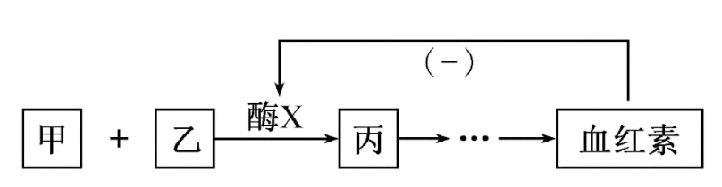
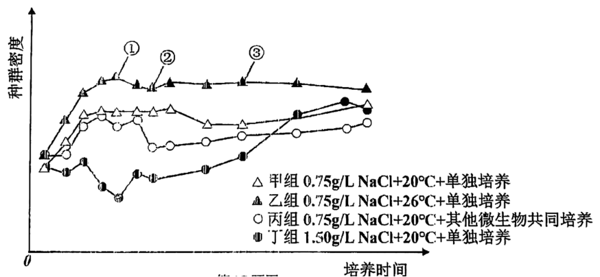
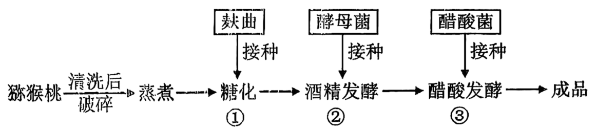
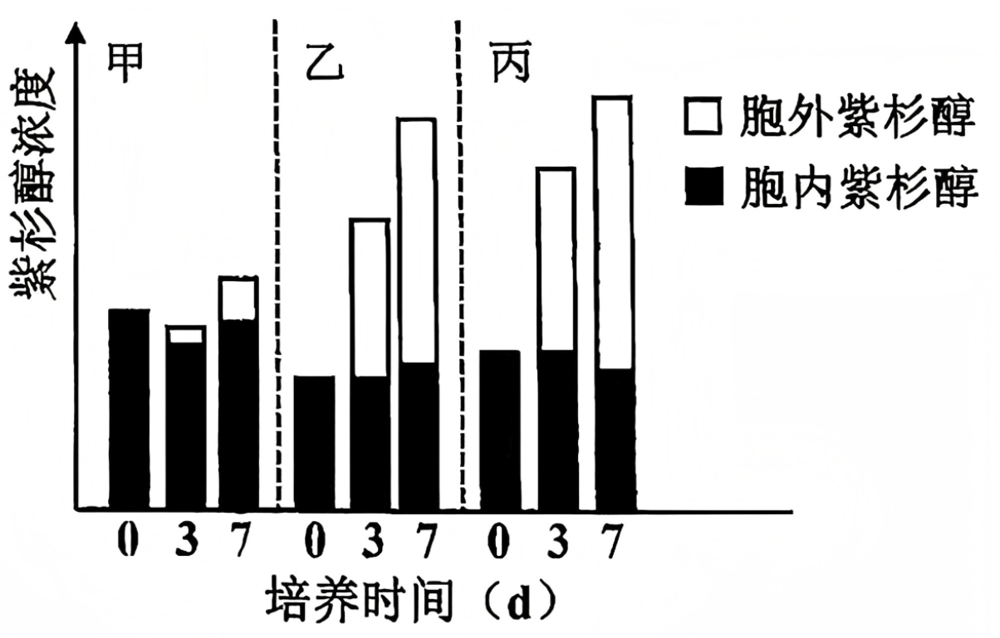

**2025年 6月浙江省普通高校招生选考科目考试**

**生物学**

**姓名\_\_\_\_\_\_\_\_\_\_\_ 准考证号\_\_\_\_\_\_\_\_\_\_\_**

**考生须知：**

**1.考生答题前，务必将自己的姓名、准考证号用黑色字迹的签字笔或钢笔填写在答题纸上。**

**2.选择题的答案须用2B铅笔将答题纸上对应题目的答案标号涂黑，如要改动，须将原填涂处用橡皮擦净。**

**3.非选择题的答案须用黑色字迹的签字笔或钢笔写在答题纸上相应区域内，作图时可先使用2B铅笔，确定后须用黑色 字迹的签字笔或钢笔描黑，答案写在本试题卷上无效。**

**选择题部分**

**一、选择题(本大题共20小题，每小题2分，共40分。每小题列出的四个备选项中只有一个是 符合题目要求的，不选、多选、错选均不得分)**

1\. 湿地被誉为“地球之肾”，下列关于湿地生态保护的叙述，错误的是（　　）

A. 完全依赖自然演替 B. 严格管控污水排放

C. 设立生态保护区域 D. 科学地引入物种

2\. 下列参与细胞生命活动的物质中，由氨基酸组成的是（　　）

A. 胶原蛋白 B. 纤维素 C. RNA D. DNA

3\. 下列关于生物技术安全和伦理问题的叙述，错误的是（　　）

A. 反对设计完美婴儿 B. 反对人的生殖性克隆

C. 禁止生物武器的使用 D. 禁止转基因技术的应用

4\. 人体可消除会引发自身免疫病的T淋巴细胞。这些T淋巴细胞消失的过程属于（　　）

A. 细胞增殖 B. 细胞生长 C. 细胞凋亡 D. 细胞分化

5\. 大量的证据表明，生物是由共同祖先进化而来的。下列叙述错误的是（　　）

A. DNA核苷酸序列差异可为物种进化提供证据

B. 牙齿化石是研究动物取食方式进化的证据之一

C. 比较解剖学研究表明人上肢和蝙蝠翼手的功能相同

D. 多种脊椎动物的胚胎发育早期都有尾说明它们有共同祖先

6\. 血红素是血红蛋白的组成成分，其合成的简要过程如图所示，其中甲、乙和丙代表不同的物质，酶X能催化甲和乙转变为丙，“(-)”表示抑制作用。

下列叙述正确的是（　　）

A. 酶X为甲和乙的活化提供了能量

B. 与甲、乙结合后，酶X会发生不可逆的结构变化

C. 血红素浓度过高会通过反馈调节抑制酶X 的活性

D. 随着甲和乙的浓度提高，酶X 催化反应的速率不断提高

7\. 内质网将抗体分子正确装配后，出芽形成囊泡。囊泡通过识别、停靠和融合将抗体分子运入高尔基体。下列叙述正确的是（　　）

A. 内质网形成囊泡与膜的流动性无关

B. 内质网中正确装配的抗体分子无免疫活性

C. 内质网膜和高尔基体膜的基本骨架是蛋白质

D. 囊泡可与高尔基体的任意部位发生膜融合

8\. 人体剧烈运动会使血浆中乳酸浓度升高。下列叙述正确的是（　　）

A. 组织液和淋巴液中都不存在乳酸

B. 人体骨骼肌细胞无氧呼吸产生乳酸和CO2

C. 剧烈运动后人体血浆pH显著高于正常值

D. 血浆pH的相对稳定主要依赖于缓冲物质的作用

9\. 某同学欲研究酵母菌的细胞呼吸方式，设置有氧组和无氧组，装置如图所示。已知有氧组装置内氧气量仅满足部分葡萄糖氧化分解。下列叙述正确的是（　　）

A. 装置内有氧气或无氧气可作为实验的无关变量

B. 有氧组和无氧组酵母菌细胞产生CO2的场所均为细胞质基质

C. 若葡萄糖充分反应，有氧组和无氧组均可检测到酒精

D. 若葡萄糖充分反应，有氧组和无氧组产生的CO2比值大于3：1

10\. 作物甲与乙都是六倍体，它们杂交产生的F1体细胞中有42条染色体，其中3个染色体组来自甲，3个染色体组来自乙。F1减数分裂过程中部分染色体不能正常联会。下列叙述错误的是（　　）

A. 用亲本甲的花药离体培养成的植株为三倍体

B. 亲本乙的体细胞中含有6个染色体组

C. 杂交产生的 F1个体具有高度不育的特性

D. 杂交产生的 F1体细胞中可能存在成对的同源染色体

11\. 人体细胞通过消耗 ATP 维持膜两侧Na+浓度梯度，细胞膜上的Na+-氨基酸共转运体能利用Na+浓度梯度驱动氨基酸逆浓度进入细胞，如图所示，下列叙述正确的是（　　）

A. Na+-氨基酸共转运体运输物质不具有特异性

B. 氨基酸依赖转运体进入细胞的过程属于被动运输

C. 使用细胞呼吸抑制剂不会影响氨基酸的运输速率

D. 适当增加膜两侧Na+的浓度差能加快氨基酸的运输

12\. 为探究种群数量的影响因素，某同学在不同条件下培养某种草履虫，部分结果如图所示

下列叙述正确的是（　　）

A. 该草履虫种群的年龄结构在①处为增长型，在②和③处为稳定型

B. 与②—③时段不同，该草履虫种群在①—②时段出生率始终小于死亡率

C. 根据甲、丁两组结果，可知该草履虫无法适应1.5g/L NaCl的培养环境

D. 仅根据乙、丙两组结果，不能得出26℃比20℃更利于该草履虫繁殖的结论

13\. 猕猴桃醋生产的基本工艺流程如下，其中①②③表示发酵的三个环节，糖化是将淀粉转化为葡萄糖的过程。

下列叙述错误的是（　　）

A. 通过蒸煮可以杀灭猕猴桃自带的绝大多数微生物

B. 麸曲中曲霉的主要作用是对糖类进行氧化分解

C. 环节③需要通入无菌空气

D. ①②③都需要控制温度、pH 等条件

14\. 人体温的相对稳定是机体产热和散热平衡的结果。下列关于寒冷环境中体温调节的叙述、错误的是（　　）

A. 大脑皮层产生冷觉，人体可通过增添衣物，减少散热

B. 下丘脑感受外界寒冷刺激，会使皮肤血管收缩，减少散热

C. 下丘脑体温调节中枢兴奋，会引起人体不由自主地颤抖，产热增加

D. 在下丘脑-垂体-甲状腺轴的调控下，甲状腺激素分泌增强，产热增加

15\. 科研人员研究某种红豆杉的细胞悬浮培养和原生质体培养方式对合成紫杉醇的影响，甲组为细胞悬浮培养，乙组为原生质体的液体静置培养，丙组为琼脂糖包埋后的原生质体悬浮培养。三组的培养基相同，其中乙、丙两组另加细胞壁合成抑制剂等。结果如图所示。

下列叙述正确的是（　　）

A. 比较甲和丙，丙组的培养方式有利于原生质体的增殖，从而提高紫杉醇总产量

B. 比较乙和丙，丙组的培养方式有利于应用到发酵罐进行紫杉醇的生产

C. 丙组中琼脂糖凝胶的作用是持续为原生质体供应碳源

D. 上述实验表明细胞壁完整有助于紫杉醇在细胞内的合成与积累

16\. ACC氧化酶催化ACC氧化产生乙烯，每种植物都有若干编码该酶的ACO基因。有研究人员检测了番茄中3种ACO 基因的相对表达量，结果如表所示。

<table>
<colgroup>
<col style="width: 8%" />
<col style="width: 9%" />
<col style="width: 11%" />
<col style="width: 11%" />
<col style="width: 9%" />
<col style="width: 9%" />
<col style="width: 11%" />
<col style="width: 13%" />
<col style="width: 15%" />
</colgroup>
<tbody>
<tr>
<td rowspan="2" style="text-align: left;">基因</td>
<td colspan="3" style="text-align: left;">叶片</td>
<td colspan="2" style="text-align: left;">花</td>
<td colspan="3" style="text-align: left;">果实</td>
</tr>
<tr>
<td style="text-align: left;">未受损</td>
<td style="text-align: left;">损伤后2h</td>
<td style="text-align: left;">衰老初期</td>
<td style="text-align: left;">开花前</td>
<td style="text-align: left;">开花期</td>
<td style="text-align: left;">成熟绿果</td>
<td style="text-align: left;">颜色转变时</td>
<td style="text-align: left;">颜色变化后3d</td>
</tr>
<tr>
<td style="text-align: left;">ACO1</td>
<td style="text-align: left;">1</td>
<td style="text-align: left;">11</td>
<td style="text-align: left;">27</td>
<td style="text-align: left;">10</td>
<td style="text-align: left;">16</td>
<td style="text-align: left;">3</td>
<td style="text-align: left;">38</td>
<td style="text-align: left;">108</td>
</tr>
<tr>
<td style="text-align: left;">ACO2</td>
<td style="text-align: left;">-</td>
<td style="text-align: left;">-</td>
<td style="text-align: left;">-</td>
<td style="text-align: left;">10</td>
<td style="text-align: left;">23</td>
<td style="text-align: left;">-</td>
<td style="text-align: left;">-</td>
<td style="text-align: left;">-</td>
</tr>
<tr>
<td style="text-align: left;">ACO3</td>
<td style="text-align: left;">-</td>
<td style="text-align: left;">-</td>
<td style="text-align: left;">13</td>
<td style="text-align: left;">23</td>
<td style="text-align: left;">58</td>
<td style="text-align: left;">-</td>
<td style="text-align: left;">3</td>
<td style="text-align: left;">1</td>
</tr>
</tbody>
</table>

注：“-”表示未检测到转录产物

下列叙述错误的是（　　）

A. 不是所有的ACO基因都在叶片中表达

B. 3种ACO基因表达的最终产物催化产生乙烯的反应相同

C. 绿果颜色转变过程中，ACO1基因的表达量提高，有利于乙烯的合成

D. 3种ACO基因在开花及绿果颜色转变后表达量均上升，表明乙烯能促进衰老

17\. 某二倍体雄性动物的基因型为AaBb，在其精原细胞有丝分裂增殖或减数分裂产生精子过程中，同源染色体的非姐妹染色单体之间可在如图所示的位点发生交叉互换。

下列叙述错误的是（　　）

A. 若有丝分裂中发生交换，该细胞产生的子细胞基因型为 Aabb和AaBB

B. 若有丝分裂中未发生交换，该细胞产生的子细胞基因型为AaBb

C. 若减数分裂中发生交换，该细胞产生的精细胞基因型为AB、aB、Ab和ab

D. 若减数分裂中未发生交换，该细胞产生的精细胞基因型为aB和 Ab

18\. 人体的传出神经有躯体运动神经和内脏运动神经(植物性神经)，后者包括交感神经和副交感神经。下列叙述正确的是（　　）

A. 交感神经和副交感神经的作用完全相反

B. 躯体运动神经受大脑皮层的控制，内脏运动神经不受控制

C. 所有的内脏器官同时受交感神经和副交感神经的双重支配

D. 内脏运动神经既可支配心脏等，也可调节某些内分泌腺的活动

19\. 某种植物生长在灰色背景的自然环境中，有灰色叶片植株和绿色叶片植株，是某蝴蝶幼虫的主要食物。在两种颜色叶片中间，放置幼虫并统计叶片被取食的比例。另放置两种颜色的假叶片，一段时间后统计附近有蝴蝶卵的假叶片比例。结果如图所示。下列叙述正确的是（　　）

A. 幼虫能区分两种颜色的叶片并有选择地取食

B. 叶片颜色可影响自然环境中该植物被取食的概率

C. 蝴蝶在寻找叶片并产卵的过程中利用了化学信息

D. 即使环境背景颜色发生变化，两个实验结果也不变

20\. 遗传病甲由一对等位基因控制，相同的基因型在两性中表型会有差异。男性在甲病基因纯合或杂合时患病，女性只有甲病基因纯合才患病。现有一对夫妻，男的患有甲病且是红绿色盲，女的表型正常，系谱图如下，其中Ⅱ1是甲病的纯合子。

下列叙述错误的是（　　）

A. I2是红绿色盲基因的携带者

B. 若只考虑甲病基因、II2和II4同时是杂合子的概率为4/9

C. 若Ⅱ2与正常男性婚配，他们生一个儿子，患甲病且红绿色盲的概率为1/4

D. 若Ⅱ4和Ⅲ1均不携带甲病基因，则Ⅱ4和Ⅱ5再生一个儿子，患甲病的概率为1/2

**非选择题部分**

**二、非选择题(本大题共5小题，共60分)**

21\. 稻蛙综合种养技术通过构建稻蛙共养系统，促进水稻种植与蛙类养殖的协同发展，提升了生态和经济效益。黑斑蛙主要摄取动物性食物，也摄取少量植物性食物，排泄的含氮废物主要是尿素。经营者在移栽水稻一段时间后，投放黑斑蛙幼蛙且定期投喂。回答下列问题：

（1）稻田引入黑斑蛙进行养殖，提高食物网的复杂性，使稻田生态系统抵抗外界干扰的能力变\_\_\_\_\_\_\_\_\_\_\_。蛙能捕食稻飞虱等水稻害虫，因此可利用这种关系进行\_\_\_\_\_\_\_\_\_\_\_，实现水稻的绿色生产。

（2）稻蛙共养系统的能量来源为\_\_\_\_\_\_\_\_\_\_\_。能量可以沿着“水稻→稻飞虱→黑斑蛙→蛇”流动，体现了能量流动的\_\_\_\_\_\_\_\_\_\_\_特点。去除该食物链中的\_\_\_\_\_\_\_\_\_\_\_，可在一定程度上增加蛙的产量。

（3）生态系统中 的缺失都会导致物质循环停滞，造成系统崩溃。合理投喂饲料可促进蛙的生长，从物质循环角度考虑，这种系统外的物质输入促进水稻生长，原因是\_\_\_\_\_\_\_\_\_\_\_\_\_\_\_\_\_\_\_\_\_\_。

（4）经营者发现，幼蛙投放量过多，反而导致水稻亩产量减少，可能的原因有哪几项\_\_\_\_\_\_\_\_\_\_\_。

A. 蛙会争夺水稻所需的矿质营养

B. 食物资源不足，蛙会取食幼嫩稻苗

C. 空间资源不足，蛙的频繁活动会影响水稻生长

D. 蛙排泄物过多会改变土壤pH，不利于水稻生长

22\. 叶用桑树是重要的经济树种，苜蓿是重要的豆科牧草。间作是在同一土地上按一定比例分行或分带种植两种或多种作物的种植模式。有学者研究桑树和苜蓿间作对生长和产量的影响，部分指标如表所示。

<table style="width:90%;">
<colgroup>
<col style="width: 11%" />
<col style="width: 17%" />
<col style="width: 11%" />
<col style="width: 11%" />
<col style="width: 9%" />
<col style="width: 9%" />
<col style="width: 9%" />
<col style="width: 9%" />
</colgroup>
<tbody>
<tr>
<td style="text-align: left;">处理</td>
<td style="text-align: left;">最大净光合速率</td>
<td style="text-align: left;">光补偿点</td>
<td style="text-align: left;">光饱和点</td>
<td style="text-align: left;">叶绿素a/b</td>
<td style="text-align: left;">
土壤脲

酶活性
</td>
<td style="text-align: left;">
粗蛋白

含量
</td>
<td style="text-align: left;">总产量</td>
</tr>
<tr>
<td style="text-align: left;">单作苜蓿</td>
<td style="text-align: left;">19.0</td>
<td style="text-align: left;">36.5</td>
<td style="text-align: left;">1493</td>
<td style="text-align: left;">1.8/0.7</td>
<td style="text-align: left;">10.0</td>
<td style="text-align: left;">17.7</td>
<td style="text-align: left;">8031</td>
</tr>
<tr>
<td style="text-align: left;">间作苜蓿</td>
<td style="text-align: left;">15.6</td>
<td style="text-align: left;">24.1</td>
<td style="text-align: left;">1260</td>
<td style="text-align: left;">2.1/0.9</td>
<td style="text-align: left;">13.2</td>
<td style="text-align: left;">21.5</td>
<td style="text-align: left;">9914</td>
</tr>
<tr>
<td style="text-align: left;">单作桑树</td>
<td style="text-align: left;">24.9</td>
<td style="text-align: left;">78.7</td>
<td style="text-align: left;">1529</td>
<td style="text-align: left;">2.4/1.3</td>
<td style="text-align: left;">10.8</td>
<td style="text-align: left;">23.3</td>
<td style="text-align: left;">676</td>
</tr>
<tr>
<td style="text-align: left;">间作桑树</td>
<td style="text-align: left;">300</td>
<td style="text-align: left;">109.6</td>
<td style="text-align: left;">1758</td>
<td style="text-align: left;">3.2/1.3</td>
<td style="text-align: left;">14.4</td>
<td style="text-align: left;">26.3</td>
<td style="text-align: left;">923</td>
</tr>
</tbody>
</table>

注：光补偿点指当光合速率等于呼吸速率时的光强度。光饱和点指光合速率达到最大值时的光强度。表中测定指标的单位省略。

回答下列问题：

（1）与单作相比，间作苜蓿的\_\_\_\_\_\_\_\_\_\_\_更低，表明间作苜蓿在较低的光照强度下就开始积累光合产物，同时叶绿素a和叶绿素b含量的提高有利于\_\_\_\_\_\_\_\_\_\_\_，但叶绿素a/b下降，说明间作苜蓿吸收的可见光中，不同 \_\_\_\_\_\_\_\_\_\_\_发生改变。该研究中，若用定性滤纸通过纸层析\_\_\_\_\_\_\_\_\_\_\_ (填“能”或“不能”)测定叶绿素a和叶绿素b的含量。间作桑树的光饱和点高于单作，表明间作环境下的桑树在\_\_\_\_\_\_\_\_\_\_\_条件下光合速率更高。桑树和苜蓿的高矮搭配，可促进单位土地面积的\_\_\_\_\_\_\_\_\_\_\_效率增加，提高产量和土地资源的利用。

（2）间作模式下，苜蓿根瘤菌的\_\_\_\_\_\_\_\_\_\_\_作用可为桑树提供氮素营养。同时，间作系统中桑树和苜蓿根际土壤中\_\_\_\_\_\_\_\_\_\_\_产生的脲酶活性提高，从而为植物提供了更多的\_\_\_\_\_\_\_\_\_\_\_。因此，除了总产量提高外，\_\_\_\_\_\_\_\_\_\_\_含量也有所增加，从而进一步提升了牧草和桑叶的品质。

23\. 玉米(2n=20)雌雄同株异花。从玉米某自交系(甲)中选育出2个雄性不育突变体(乙和丙)。已知雄性不育基因E1、E2由雄性可育基因E突变所致；如图1所示。甲×乙的F2中雄性可育285株、雄性不育94株，甲×丙的F2中雄性可育139株、雄性不育45株。利用引物P1和P2，对甲、乙、丙以及它们之间杂交的后代(丁和戊)基因组DNA进行PCR扩增，扩增产物经SnaBⅠ完全酶切后电泳，结果如图2所示。

回答下列问题：

（1）E1基因与E基因相比，由于\_\_\_\_\_\_\_\_\_\_\_，导致编码的蛋白质中1个氨基酸发生改变。E2基因与E基因相比，由于编码区增加了插入序列，导致\_\_\_\_\_\_\_\_\_\_\_，使编码的蛋白质中氨基酸数目减少。

（2）雄性不育对雄性可育是\_\_\_\_\_\_\_\_\_\_\_性状，乙的基因型是\_\_\_\_\_\_\_\_\_\_\_。甲×丙产生的F1其雌配子有\_\_\_\_\_\_\_\_\_\_\_种，F2可育植株中纯合子占\_\_\_\_\_\_\_\_\_\_\_。若甲×戊的F1随机交配，则F2中E1的基因频率是\_\_\_\_\_\_\_\_\_\_\_。

（3）写出丁×戊获得F1的遗传图解。

（4）雄性不育突变体不能自交繁殖。为了保存雄性不育突变体，需长期保留含不育基因的杂合子。该杂合子可采用上述“PCR结合限制性内切核酸酶酶切后分析条带”进行鉴定，还可采用的方法有\_\_\_\_\_\_\_\_\_\_\_(答出2点即可)。

（5）利用引物P1、P2对甲的基因组DNA进行PCR扩增和电泳，下列叙述错误的是\_\_\_\_\_\_\_\_\_\_\_。

A. PCR反应中TaqDNA聚合酶是沿着模板链的3'端向5'端聚合核苷酸

B. 图2中胶板的上端是电泳时的负极，且电泳时DNA片段由负极向正极泳动

C. 若用32P标记引物P1，每个DNA分子经4轮PCR循环后，可获得16条含32P标记的DNA单链

D. 若用32P标记引物P1，每个DNA分子经4轮PCR循环后，可获得8个含32P标记且长度为b的DNA分子

24\. 某同学欲开展小鼠的排卵、受精以及观察受精卵发育的实验，其基本过程如下。

（1）制备垂体细胞提取液：取小鼠的垂体，加入少量的培养液，剪碎，\_\_\_\_\_\_\_\_\_\_\_，经处理制成垂体细胞悬液。取垂体细胞悬液，\_\_\_\_\_\_\_\_\_\_\_，制成某一浓度的垂体细胞悬液。将垂体细胞培养一段时间后，破碎，\_\_\_\_\_\_\_\_\_\_\_，取上清液，经处理获得提取液。

（2）采集精子：将人工采集的精子置于培养液中，培养一段时间。此过程可使精子获得\_\_\_\_\_\_\_\_\_\_\_。

（3）采集卵细胞：给成年雌鼠注射垂体细胞提取液，一段时间后，采集卵子。注射垂体细胞提取液可促进雌鼠排卵的原因是 \_\_\_\_\_\_\_\_\_\_\_。

（4）受精：将精子和卵细胞混合培养。精子入卵后，会使卵子完成减数第二次分裂，排出\_\_\_\_\_\_\_\_，形成雌原核。

（5）观察受精卵的发育：受精卵开始卵裂，其中的细胞体积\_\_\_\_\_\_\_\_\_\_\_，细胞数量增加，但胚胎的总体积变化 \_\_\_\_\_\_\_\_\_\_\_。结果表明这一阶段胚胎细胞的细胞周期中，显著缩短的时期是\_\_\_\_\_\_\_\_\_\_\_。

25\. 某同学欲开展验证药物W有促进巨噬细胞吞噬作用的实验。已知一个巨噬细胞可吞噬多个鸡红细胞(有细胞核)。根据提供的材料与用具，以巨噬细胞吞噬率和吞噬指数为指标，完善实验思路，预测实验结果，并进行分析与讨论。

材料与用具：药物W、鸡红细胞、显色液、显微镜等。

(说明与要求：实验条件适宜，不考虑实验分组和离体培养条件对巨噬细胞的影响。细胞培养过程中，每天取样1次，共3次)

吞噬率=，吞噬指数=。

（1）完善实验思路

①给豚鼠注射抗原溶液后，经处理，取豚鼠巨噬细胞悬液，少量置于含生理盐水的试管中，加入鸡红细胞，一段时间后取混合液涂于玻片上并染色，镜检并记录。

②其余巨噬细胞悬液置于若干个含培养液的培养瓶中，\_\_\_\_\_\_\_\_\_\_\_，进行离体培养。

③一天后取培养液中的巨噬细胞悬液，置于含有生理盐水的试管中，加入鸡红细胞，一段时间后取混合液涂于玻片上并染色，镜检并记录。

④\_\_\_\_\_\_\_\_\_\_\_。

⑤将所得数据进行统计与分析。

（2）用表格的形式预测实验结果。(表格预测结果用+的多少表示)

（3）分析与讨论

①为了显示巨噬细胞中的细胞核，可选用\_\_\_\_\_\_\_\_\_\_\_显色液染色。

②与不具有吞噬功能的细胞相比，巨噬细胞内通常含有较多的细胞器是\_\_\_\_\_\_\_\_\_\_\_。

③巨噬细胞在免疫中的作用有\_\_\_\_\_\_\_\_\_\_\_(答出两点即可)。

④若相继多次注射同种抗原，豚鼠体内的记忆B淋巴细胞种类\_\_\_\_\_\_\_\_\_\_\_，抗体数量\_\_\_\_\_\_\_\_\_\_\_。
