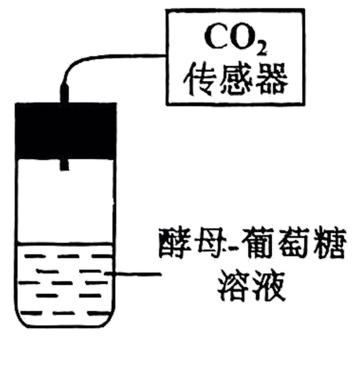
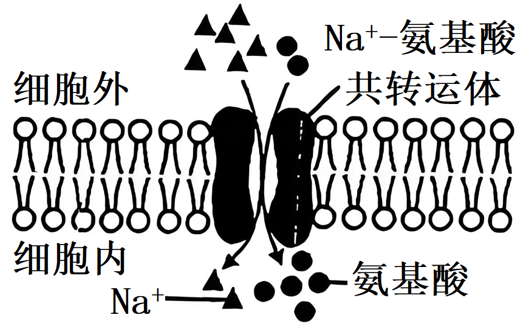
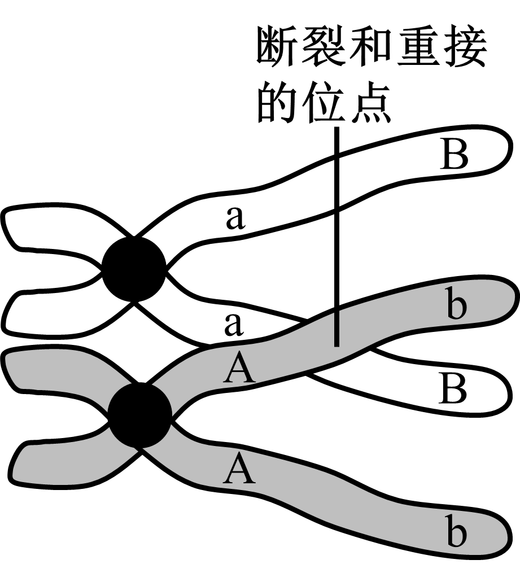
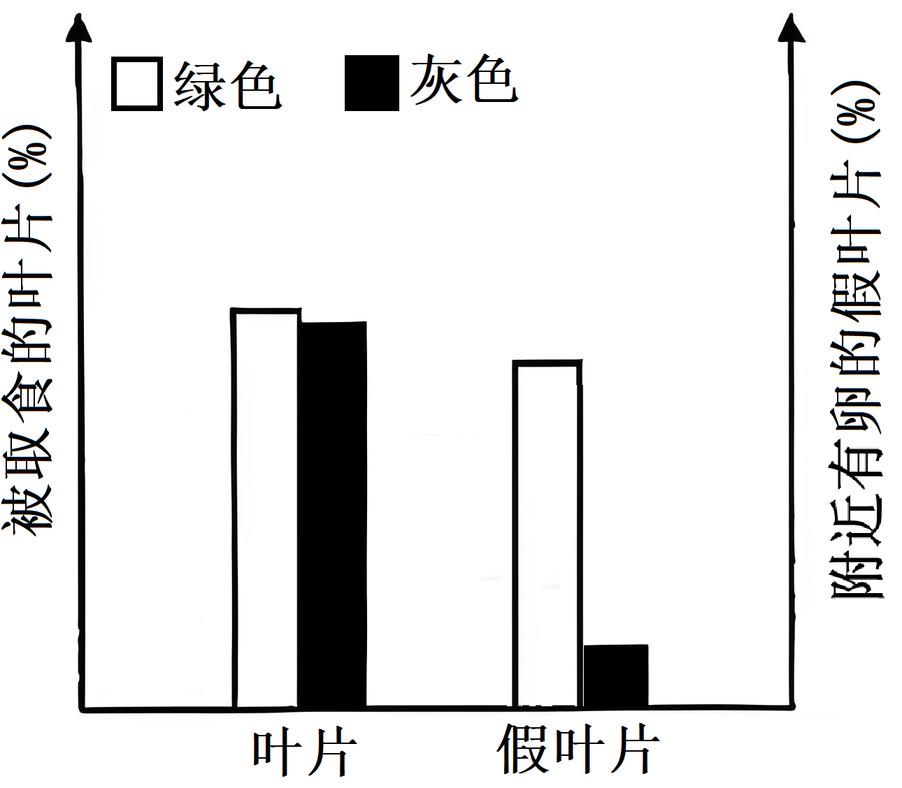
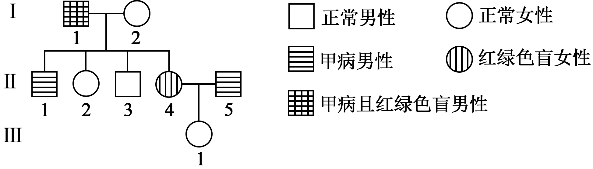
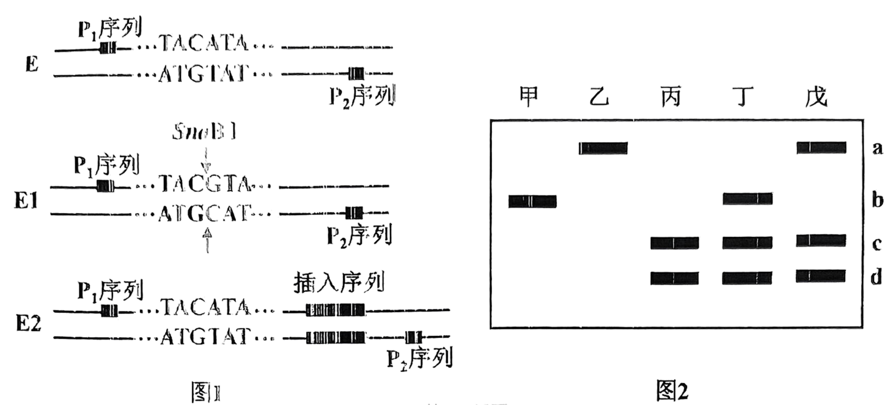
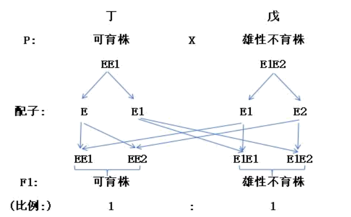

**2025年 6月浙江省普通高校招生选考科目考试**

**生物学**

**姓名\_\_\_\_\_\_\_\_\_\_\_ 准考证号\_\_\_\_\_\_\_\_\_\_\_**

**考生须知：**

**1.考生答题前，务必将自己的姓名、准考证号用黑色字迹的签字笔或钢笔填写在答题纸上。**

**2.选择题的答案须用2B铅笔将答题纸上对应题目的答案标号涂黑，如要改动，须将原填涂处用橡皮擦净。**

**3.非选择题的答案须用黑色字迹的签字笔或钢笔写在答题纸上相应区域内，作图时可先使用2B铅笔，确定后须用黑色 字迹的签字笔或钢笔描黑，答案写在本试题卷上无效。**

**选择题部分**

**一、选择题(本大题共20小题，每小题2分，共40分。每小题列出的四个备选项中只有一个是 符合题目要求的，不选、多选、错选均不得分)**

1\. 湿地被誉为“地球之肾”，下列关于湿地生态保护的叙述，错误的是（　　）

A. 完全依赖自然演替 B. 严格管控污水排放

C. 设立生态保护区域 D. 科学地引入物种

【答案】A

【解析】

【详解】A、完全依赖自然演替会忽视人类活动对湿地的破坏，无法有效恢复已退化的生态系统，需结合人工干预，A错误；

B、严格管控污水排放可减少污染，保护湿地水质，B正确；

C、设立生态保护区域能限制开发，维护生物多样性，C正确；

D、科学地引入物种（如本地物种）可促进生态恢复，但需避免引入入侵物种，D正确。

故选A。

2\. 下列参与细胞生命活动的物质中，由氨基酸组成的是（　　）

A. 胶原蛋白 B. 纤维素 C. RNA D. DNA

【答案】A

【解析】

【分析】蛋白质的组成单位是氨基酸，纤维素的基本单位是葡萄糖，核酸的基本单位是核苷酸。

【详解】A、胶原蛋白属于蛋白质，其基本组成单位是氨基酸，A正确；

B、纤维素属于多糖，由葡萄糖连接而成，B错误；

C、RNA属于核酸，由核糖核苷酸组成，C错误；

D、DNA属于核酸，由脱氧核糖核苷酸组成，D错误；

故选A。

3\. 下列关于生物技术安全和伦理问题的叙述，错误的是（　　）

A. 反对设计完美婴儿 B. 反对人的生殖性克隆

C. 禁止生物武器的使用 D. 禁止转基因技术的应用

【答案】D

【解析】

【详解】A、设计完美婴儿涉及基因编辑技术，可能引发基因歧视、破坏基因多样性等伦理问题，因此反对是合理的，A正确；

B、生殖性克隆会冲击现有伦理体系，且克隆人存在技术风险，国际社会普遍反对，B正确；

C、生物武器具有大规模杀伤性，国际公约明确禁止其研发和使用，C正确；

D、转基因技术需在严格监管下合理应用（如转基因作物），并非完全禁止，D错误。

故选D的

4\. 人体可消除会引发自身免疫病的T淋巴细胞。这些T淋巴细胞消失的过程属于（　　）

A. 细胞增殖 B. 细胞生长 C. 细胞凋亡 D. 细胞分化

【答案】C

【解析】

【分析】由基因所决定的细胞自动结束生命的过程，就叫细胞凋亡。由于细胞凋亡受到严格的由遗传机制决定的程序性调控，所以它是一种程序性死亡。

【详解】A、细胞增殖指细胞通过分裂增加细胞数量，不会导致细胞消失，A错误；

B、细胞生长是细胞体积增大的阶段，不会直接导致细胞被清除，B错误；

C、细胞凋亡是由基因控制的细胞主动死亡过程，用于清除异常或有害的细胞。人体消除可能攻击自身组织的T淋巴细胞，属于细胞凋亡，C正确；

D、细胞分化是细胞在形态、结构和功能上发生稳定性差异的过程，不会导致细胞消失，D错误。

故选C。

5\. 大量的证据表明，生物是由共同祖先进化而来的。下列叙述错误的是（　　）

A. DNA核苷酸序列差异可为物种进化提供证据

B. 牙齿化石是研究动物取食方式进化的证据之一

C. 比较解剖学研究表明人上肢和蝙蝠翼手的功能相同

D. 多种脊椎动物的胚胎发育早期都有尾说明它们有共同祖先

【答案】C

【解析】

【详解】A、DNA核苷酸序列差异属于分子生物学证据，能反映物种间的亲缘关系和进化历程，A正确；

B、牙齿化石属于化石证据，可推测动物的食性及取食方式的演化，B正确；

C、人上肢与蝙蝠翼手属于同源器官，结构相似但功能不同（如抓握与飞行），而功能相同的器官（如鸟翼与昆虫翅）属于同功器官，C错误；

D、胚胎发育早期的尾结构属于胚胎学证据，表明脊椎动物有共同祖先，D正确。

故选C。

6\. 血红素是血红蛋白的组成成分，其合成的简要过程如图所示，其中甲、乙和丙代表不同的物质，酶X能催化甲和乙转变为丙，“(-)”表示抑制作用。

下列叙述正确的是（　　）

A. 酶X为甲和乙的活化提供了能量

B. 与甲、乙结合后，酶X会发生不可逆的结构变化

C. 血红素浓度过高会通过反馈调节抑制酶X 的活性

D. 随着甲和乙的浓度提高，酶X 催化反应的速率不断提高

【答案】C

【解析】

【详解】A、酶的作用机理是降低化学反应的活化能而非提供能量，A错误；

B、酶与底物结合是可逆的，反应完成后酶会恢复原状，B错误；

C、据图可知，图示中“（-）”表示血红素（丙）对酶X的反馈抑制，血红素浓度过高会通过反馈调节抑制酶X 的活性，从而使血红素浓度维持在相对稳定的状态，C正确；

D、一定范围内，反应速率会随底物浓度增加而提高，但达到酶饱和后速率不再变化，此外血红素的反馈抑制会限制速率持续提高，D错误。

故选C。

7\. 内质网将抗体分子正确装配后，出芽形成囊泡。囊泡通过识别、停靠和融合将抗体分子运入高尔基体。下列叙述正确的是（　　）

A. 内质网形成囊泡与膜的流动性无关

B. 内质网中正确装配的抗体分子无免疫活性

C. 内质网膜和高尔基体膜的基本骨架是蛋白质

D. 囊泡可与高尔基体的任意部位发生膜融合

【答案】B

【解析】

【详解】A、内质网形成囊泡的过程涉及膜的出芽，这依赖于生物膜的流动性，因此与膜的流动性有关，A错误；

B、抗体在内质网中正确装配后，需经高尔基体进一步加工（如糖基化修饰）才能形成具有免疫活性的成熟抗体，因此此时无免疫活性，B正确；

C、生物膜的基本骨架是磷脂双分子层，而非蛋白质，C错误；

D、囊泡与高尔基体的融合具有特异性，通常只能与高尔基体特定区域（如形成面）的膜融合，而非任意部位，D错误。

故选B。

8\. 人体剧烈运动会使血浆中乳酸浓度升高。下列叙述正确的是（　　）

A. 组织液和淋巴液中都不存在乳酸

B. 人体骨骼肌细胞无氧呼吸产生乳酸和CO2

C. 剧烈运动后人体血浆pH显著高于正常值

D. 血浆pH的相对稳定主要依赖于缓冲物质的作用

【答案】D

【解析】

【分析】1、内环境主要由淋巴液、组织液和血浆组成。

2、内环境的理化性质主要包括温度、pH和渗透压：（1）人体细胞外液的温度一般维持在37℃左右；（2）正常人的血浆接近中性，pH为7.35～7.45。血浆的pH之所以能够保持稳定，与它含有的缓冲物质有关；（3）血浆渗透压的大小主要与无机盐、蛋白质的含量有关。在组成细胞外液的各种无机盐离子中，含量上占有明显优势的是Na+和Cl-，细胞外液渗透压的90%来源于Na+和Cl-。

3、内环境稳态是在神经系统和体液的调节下，通过各个器官、系统的协调活动，共同维持内环境相对稳定的状态。

【详解】A、组织液和淋巴液中可能存在乳酸。剧烈运动时，骨骼肌细胞无氧呼吸产生的乳酸会进入组织液，并通过组织液与血浆、淋巴液的交换进行运输，因此组织液和淋巴液中可能存在乳酸，A错误；

B、人体骨骼肌细胞无氧呼吸的产物仅为乳酸，CO₂是有氧呼吸的产物，B错误；

C、剧烈运动后，虽然乳酸积累会导致血浆pH略有下降，但缓冲系统会迅速调节，使pH维持相对稳定，不会显著高于正常值，C错误；

D、血浆pH的稳定主要依赖缓冲物质（如HCO₃⁻/H₂CO₃）中和多余的酸性或碱性物质，同时肺和肾脏的调节也辅助维持酸碱平衡，但题干强调“主要依赖”，D正确。

故选D。

9\. 某同学欲研究酵母菌的细胞呼吸方式，设置有氧组和无氧组，装置如图所示。已知有氧组装置内氧气量仅满足部分葡萄糖氧化分解。下列叙述正确的是（　　）

A. 装置内有氧气或无氧气可作为实验的无关变量

B. 有氧组和无氧组酵母菌细胞产生CO2的场所均为细胞质基质

C. 若葡萄糖充分反应，有氧组和无氧组均可检测到酒精

D. 若葡萄糖充分反应，有氧组和无氧组产生的CO2比值大于3：1

【答案】C

【解析】

【详解】A、本实验研究酵母菌的细胞呼吸方式，有氧气或无氧气是实验的自变量，而不是无关变量，A错误；

B、有氧组因为氧气仅满足部分葡萄糖氧化分解，所以既进行有氧呼吸（CO2的场所是线粒体基质），又进行无氧呼吸（产生CO2的场所是细胞质基质）；无氧组只进行无氧呼吸，产生CO2的场所是细胞质基质。所以有氧组产生CO2的场所是线粒体基质和细胞质基质，无氧组是细胞质基质，B错误；

C、有氧组虽然进行有氧呼吸，但也进行无氧呼吸（因为氧气不足），无氧呼吸会产生酒精；无氧组进行无氧呼吸，也产生酒精。所以有氧组和无氧组均能检测到酒精，C正确；

D、有氧呼吸时，1分子葡萄糖产生6分子CO2；无氧呼吸时，1分子葡萄糖产生2分子CO2。由于有氧组同时进行有氧和无氧呼吸，所以有氧组产生的CO2量比仅进行有氧呼吸时少，那么有氧组和无氧组产生CO2的比值会小于6:2=3:1，D错误。

故选C。

10\. 作物甲与乙都是六倍体，它们杂交产生的F1体细胞中有42条染色体，其中3个染色体组来自甲，3个染色体组来自乙。F1减数分裂过程中部分染色体不能正常联会。下列叙述错误的是（　　）

A. 用亲本甲的花药离体培养成的植株为三倍体

B. 亲本乙的体细胞中含有6个染色体组

C. 杂交产生的 F1个体具有高度不育的特性

D. 杂交产生的 F1体细胞中可能存在成对的同源染色体

【答案】A

【解析】

【详解】A、甲为六倍体，其花药（配子）含三个染色体组，离体培养得到的植株由配子发育而来，应称为单倍体，A错误；

B、六倍体的体细胞含六个染色体组，乙为六倍体，故其体细胞含六个染色体组，B正确；

C、F1为异源六倍体，减数分裂时染色体联会紊乱，无法形成正常配子，具有高度不育性，C正确；

D、若甲、乙染色体组存在部分同源（如甲含A、B、C组，乙含A、D、E组），F1体细胞中A组染色体可成对，存在同源染色体，D正确。

故选A。

11\. 人体细胞通过消耗 ATP 维持膜两侧Na+浓度梯度，细胞膜上的Na+-氨基酸共转运体能利用Na+浓度梯度驱动氨基酸逆浓度进入细胞，如图所示，下列叙述正确的是（　　）

A. Na+-氨基酸共转运体运输物质不具有特异性

B. 氨基酸依赖转运体进入细胞的过程属于被动运输

C. 使用细胞呼吸抑制剂不会影响氨基酸的运输速率

D. 适当增加膜两侧Na+的浓度差能加快氨基酸的运输

【答案】D

【解析】

【详解】A、Na+-氨基酸共转运体运输物质具有特异性，A错误；

B、氨基酸依赖转运体进入细胞是逆浓度梯度的过程，属于主动运输，B错误；

C、人体细胞通过消耗呼吸作用产生的ATP维持膜两侧Na+浓度梯度，利用Na+浓度梯度驱动氨基酸逆浓度进入细胞，因此使用细胞呼吸抑制剂会影响氨基酸的运输速率，C错误；

D、适当增加膜两侧Na+的浓度差会提高Na+的运输速率，同时也能加快氨基酸的运输，D正确。

故选D的

12\. 为探究种群数量的影响因素，某同学在不同条件下培养某种草履虫，部分结果如图所示

下列叙述正确的是（　　）

A. 该草履虫种群的年龄结构在①处为增长型，在②和③处为稳定型

B. 与②—③时段不同，该草履虫种群在①—②时段出生率始终小于死亡率

C. 根据甲、丁两组结果，可知该草履虫无法适应1.5g/L NaCl的培养环境

D. 仅根据乙、丙两组结果，不能得出26℃比20℃更利于该草履虫繁殖的结论

【答案】D

【解析】

【详解】A、该草履虫种群保持稳定因此年龄结构在①处为衰退型，②处为增长型，③处为稳定型，A错误；

B、种群在①—②种群数量减小，但影响种群数量变化的因素较多，由题图信息不能得出出生率始终小于死亡率的结论，B错误；

C、根据丁组结果，该草履虫种群数量最终较多，说明适应1.5g/L NaCl的培养环境，C错误；

D、乙、丙两组变量为温度和是否单独培养，因此仅根据乙、丙两组结果，不能得出26℃比20℃更利于该草履虫繁殖的结论，D正确。

故选D。

13\. 猕猴桃醋生产的基本工艺流程如下，其中①②③表示发酵的三个环节，糖化是将淀粉转化为葡萄糖的过程。

下列叙述错误的是（　　）

A. 通过蒸煮可以杀灭猕猴桃自带的绝大多数微生物

B. 麸曲中曲霉的主要作用是对糖类进行氧化分解

C. 环节③需要通入无菌空气

D. ①②③都需要控制温度、pH 等条件

【答案】B

【解析】

【详解】A、蒸煮过程中高温可以破坏微生物的细胞结构等，从而杀灭猕猴桃自带的绝大多数微生物，A正确；

B、麸曲中的曲霉主要作用是将淀粉等多糖分解为葡萄糖等单糖，而不是对糖类进行氧化分解，B错误；

C、环节③是醋酸发酵，醋酸菌是好氧菌，所以需要通入无菌空气，C正确；

D、①酒精发酵和②醋酸发酵以及整个过程都需要适宜的温度和pH等条件来保证微生物的正常生长和代谢，D正确。

故选B。

14\. 人体温的相对稳定是机体产热和散热平衡的结果。下列关于寒冷环境中体温调节的叙述、错误的是（　　）

A. 大脑皮层产生冷觉，人体可通过增添衣物，减少散热

B. 下丘脑感受外界寒冷刺激，会使皮肤血管收缩，减少散热

C. 下丘脑体温调节中枢兴奋，会引起人体不由自主地颤抖，产热增加

D. 在下丘脑-垂体-甲状腺轴的调控下，甲状腺激素分泌增强，产热增加

【答案】B

【解析】

【详解】A、所有感觉的形成部位都是大脑皮层，故大脑皮层产生冷觉，增添衣物属于行为调节，以减少散热，A正确；

B、下丘脑是体温调节中枢，但寒冷刺激由皮肤冷觉感受器传递至下丘脑，而非下丘脑直接感受，B错误；

C、下丘脑通过神经信号引发骨骼肌战栗（颤抖），增加产热，属于自主神经调节，C正确；

D、下丘脑-垂体-甲状腺轴调控甲状腺激素分泌，甲状腺激素能够促进细胞代谢，增加产热，D正确。

故选B。

15\. 科研人员研究某种红豆杉的细胞悬浮培养和原生质体培养方式对合成紫杉醇的影响，甲组为细胞悬浮培养，乙组为原生质体的液体静置培养，丙组为琼脂糖包埋后的原生质体悬浮培养。三组的培养基相同，其中乙、丙两组另加细胞壁合成抑制剂等。结果如图所示。

下列叙述正确的是（　　）

A. 比较甲和丙，丙组的培养方式有利于原生质体的增殖，从而提高紫杉醇总产量

B. 比较乙和丙，丙组的培养方式有利于应用到发酵罐进行紫杉醇的生产

C. 丙组中琼脂糖凝胶的作用是持续为原生质体供应碳源

D. 上述实验表明细胞壁完整有助于紫杉醇在细胞内的合成与积累

【答案】B

【解析】

【详解】A、丙组细胞是原生质体，没有细胞壁，但原生质体在适宜条件下是可以增殖的，A错误；

B、丙组的胞外紫杉醇浓度比乙组高，这意味着丙组的培养方式能更多地产生可提取的紫杉醇，有利于用发酵罐进行紫杉醇的生产，B正确；

C、琼脂糖的作用是为细胞提供支撑和固定，它不能为细胞提供碳源，C错误；

D、甲组细胞有细胞壁，不过从紫杉醇合成量来看，甲组低于乙组和丙组，D错误。

故选B。

16\. ACC氧化酶催化ACC氧化产生乙烯，每种植物都有若干编码该酶的ACO基因。有研究人员检测了番茄中3种ACO 基因的相对表达量，结果如表所示。

<table>
<colgroup>
<col style="width: 8%" />
<col style="width: 9%" />
<col style="width: 11%" />
<col style="width: 11%" />
<col style="width: 9%" />
<col style="width: 9%" />
<col style="width: 11%" />
<col style="width: 13%" />
<col style="width: 15%" />
</colgroup>
<tbody>
<tr>
<td rowspan="2" style="text-align: left;">基因</td>
<td colspan="3" style="text-align: left;">叶片</td>
<td colspan="2" style="text-align: left;">花</td>
<td colspan="3" style="text-align: left;">果实</td>
</tr>
<tr>
<td style="text-align: left;">未受损</td>
<td style="text-align: left;">损伤后2h</td>
<td style="text-align: left;">衰老初期</td>
<td style="text-align: left;">开花前</td>
<td style="text-align: left;">开花期</td>
<td style="text-align: left;">成熟绿果</td>
<td style="text-align: left;">颜色转变时</td>
<td style="text-align: left;">颜色变化后3d</td>
</tr>
<tr>
<td style="text-align: left;">ACO1</td>
<td style="text-align: left;">1</td>
<td style="text-align: left;">11</td>
<td style="text-align: left;">27</td>
<td style="text-align: left;">10</td>
<td style="text-align: left;">16</td>
<td style="text-align: left;">3</td>
<td style="text-align: left;">38</td>
<td style="text-align: left;">108</td>
</tr>
<tr>
<td style="text-align: left;">ACO2</td>
<td style="text-align: left;">-</td>
<td style="text-align: left;">-</td>
<td style="text-align: left;">-</td>
<td style="text-align: left;">10</td>
<td style="text-align: left;">23</td>
<td style="text-align: left;">-</td>
<td style="text-align: left;">-</td>
<td style="text-align: left;">-</td>
</tr>
<tr>
<td style="text-align: left;">ACO3</td>
<td style="text-align: left;">-</td>
<td style="text-align: left;">-</td>
<td style="text-align: left;">13</td>
<td style="text-align: left;">23</td>
<td style="text-align: left;">58</td>
<td style="text-align: left;">-</td>
<td style="text-align: left;">3</td>
<td style="text-align: left;">1</td>
</tr>
</tbody>
</table>

注：“-”表示未检测到转录产物

下列叙述错误的是（　　）

A. 不是所有的ACO基因都在叶片中表达

B. 3种ACO基因表达的最终产物催化产生乙烯的反应相同

C. 绿果颜色转变过程中，ACO1基因的表达量提高，有利于乙烯的合成

D. 3种ACO基因在开花及绿果颜色转变后表达量均上升，表明乙烯能促进衰老

【答案】D

【解析】

【详解】A、在叶片的各个阶段都没有检测到ACO2的表达产物，说明并非所有ACO基因都在叶片中表达，A正确；

B、三种ACO基因均编码ACC氧化酶，ACC氧化酶催化ACC氧化产生乙烯，B正确；

C、绿果颜色转变时，ACO1表达量从3升至38，有利于ACC氧化酶的合成，进而促进乙烯合成，C正确；

D、ACO2在果实各阶段均未表达（表中为“-”），因此“三种ACO基因在绿果颜色转变后表达量均上升”错误，D错误。

故选D。

17\. 某二倍体雄性动物的基因型为AaBb，在其精原细胞有丝分裂增殖或减数分裂产生精子过程中，同源染色体的非姐妹染色单体之间可在如图所示的位点发生交叉互换。

下列叙述错误的是（　　）

A. 若有丝分裂中发生交换，该细胞产生的子细胞基因型为 Aabb和AaBB

B. 若有丝分裂中未发生交换，该细胞产生的子细胞基因型为AaBb

C. 若减数分裂中发生交换，该细胞产生的精细胞基因型为AB、aB、Ab和ab

D. 若减数分裂中未发生交换，该细胞产生的精细胞基因型为aB和 Ab

【答案】A

【解析】

【详解】A、有丝分裂过程中，若发生如图所示的交叉互换，两条染色体的基因情况为aB/ab和AB/Ab，后期着丝粒分裂可能产生AaBB（aB+AB）、Aabb(ab+Ab)的子细胞或者2个AaBb子细胞（aB+Ab和ab+AB），A错误；

B、有丝分裂中未发生交换，精原细胞进行有丝分裂，遗传物质精确复制后平均分配到两个子细胞中，该细胞产生的子细胞基因型与亲代细胞相同，为AaBb，B正确；

C、若减数分裂中发生交换，两条染色体的基因情况为aB/ab和AB/Ab，经过减数第一次分裂同源染色体分离，减数第二次分裂姐妹染色单体分离，该细胞会产生四种精细胞，基因型为AB、aB、Ab和ab，C正确；

D、若减数分裂中未发生交换，两对等位基因连锁，位于一对同源染色体上，AaBb的精原细胞产生的精细胞基因型为aB、Ab，D正确。

故选A。

18\. 人体的传出神经有躯体运动神经和内脏运动神经(植物性神经)，后者包括交感神经和副交感神经。下列叙述正确的是（　　）

A. 交感神经和副交感神经的作用完全相反

B. 躯体运动神经受大脑皮层的控制，内脏运动神经不受控制

C. 所有的内脏器官同时受交感神经和副交感神经的双重支配

D. 内脏运动神经既可支配心脏等，也可调节某些内分泌腺的活动

【答案】D

【解析】

【详解】A、交感神经和副交感神经的作用通常是相互拮抗的，但并非完全相反，在某些情况下可能协同调节器官活动，A错误；

B、躯体运动神经受大脑皮层意识支配，而内脏运动神经虽不受意识直接控制，但仍受中枢神经系统（如下丘脑、脑干等）的调控，B错误；

C、并非所有内脏器官均受双重支配。例如肾上腺髓质仅受交感神经支配，C错误；

D、内脏运动神经可支配心脏、血管等器官，同时调节内分泌腺（如交感神经直接刺激肾上腺髓质分泌肾上腺素），D正确。

故选D。

19\. 某种植物生长在灰色背景的自然环境中，有灰色叶片植株和绿色叶片植株，是某蝴蝶幼虫的主要食物。在两种颜色叶片中间，放置幼虫并统计叶片被取食的比例。另放置两种颜色的假叶片，一段时间后统计附近有蝴蝶卵的假叶片比例。结果如图所示。下列叙述正确的是（　　）

A. 幼虫能区分两种颜色的叶片并有选择地取食

B. 叶片颜色可影响自然环境中该植物被取食的概率

C. 蝴蝶在寻找叶片并产卵的过程中利用了化学信息

D. 即使环境背景颜色发生变化，两个实验结果也不变

【答案】B

【解析】

【详解】A、幼虫取食两种颜色叶片的百分比接近，不能判断其是否能区分两种颜色叶片，A错误；

B、 绿色假叶片上蝴蝶卵多，自然情况下卵孵化后的幼虫会先食用绿色叶片，这说明叶片颜色会影响自然环境中该植物被取食的概率，B正确；

C、蝴蝶在寻找叶片并产卵过程中利用的是物理信息（叶片颜色属于物理信息）， C错误；

D、环境背景颜色变化可能影响实验结果，需要进一步实验，D错误。

故选B。

20\. 遗传病甲由一对等位基因控制，相同的基因型在两性中表型会有差异。男性在甲病基因纯合或杂合时患病，女性只有甲病基因纯合才患病。现有一对夫妻，男的患有甲病且是红绿色盲，女的表型正常，系谱图如下，其中Ⅱ1是甲病的纯合子。

下列叙述错误的是（　　）

A. I2是红绿色盲基因的携带者

B. 若只考虑甲病基因、II2和II4同时是杂合子的概率为4/9

C. 若Ⅱ2与正常男性婚配，他们生一个儿子，患甲病且红绿色盲的概率为1/4

D. 若Ⅱ4和Ⅲ1均不携带甲病基因，则Ⅱ4和Ⅱ5再生一个儿子，患甲病的概率为1/2

【答案】C

【解析】

【详解】A、由于II4患红绿色盲，基因型为XbXb，因此I2是红绿色盲基因的携带者，A正确；

B、甲病：由一对等位基因控制，男性中基因纯合AA或杂合(Aa)时患病，女性只有基因纯合AA时患病（属于常染色体遗传从性遗传，设A为致病基因）。由于II3是aa，II1是AA，可推出I1和I2均为Aa，若只考虑甲病基因，II2（Aa：aa=2：1）和II4（Aa：aa=2：1）同时是Aa的概率为2/3×2/3=4/9，B正确；

C、若II2（2/3AaXBXb、1/3aaXBXb）与正常男性（aaXBY）婚配，他们生一个儿子，患甲病且红绿色盲的概率：AaXbY=2/3×1/2×1/2=1/6，C错误；

D、若II4和III1均不携带甲病基因，则II4（aa）和II5（Aa）再生一个儿子，患甲病（Aa）的概率为1/2，D正确。

故选C。

**非选择题部分**

**二、非选择题(本大题共5小题，共60分)**

21\. 稻蛙综合种养技术通过构建稻蛙共养系统，促进水稻种植与蛙类养殖的协同发展，提升了生态和经济效益。黑斑蛙主要摄取动物性食物，也摄取少量植物性食物，排泄的含氮废物主要是尿素。经营者在移栽水稻一段时间后，投放黑斑蛙幼蛙且定期投喂。回答下列问题：

（1）稻田引入黑斑蛙进行养殖，提高食物网的复杂性，使稻田生态系统抵抗外界干扰的能力变\_\_\_\_\_\_\_\_\_\_\_。蛙能捕食稻飞虱等水稻害虫，因此可利用这种关系进行\_\_\_\_\_\_\_\_\_\_\_，实现水稻的绿色生产。

（2）稻蛙共养系统的能量来源为\_\_\_\_\_\_\_\_\_\_\_。能量可以沿着“水稻→稻飞虱→黑斑蛙→蛇”流动，体现了能量流动的\_\_\_\_\_\_\_\_\_\_\_特点。去除该食物链中的\_\_\_\_\_\_\_\_\_\_\_，可在一定程度上增加蛙的产量。

（3）生态系统中 的缺失都会导致物质循环停滞，造成系统崩溃。合理投喂饲料可促进蛙的生长，从物质循环角度考虑，这种系统外的物质输入促进水稻生长，原因是\_\_\_\_\_\_\_\_\_\_\_\_\_\_\_\_\_\_\_\_\_\_。

（4）经营者发现，幼蛙投放量过多，反而导致水稻亩产量减少，可能的原因有哪几项\_\_\_\_\_\_\_\_\_\_\_。

A. 蛙会争夺水稻所需的矿质营养

B. 食物资源不足，蛙会取食幼嫩稻苗

C. 空间资源不足，蛙的频繁活动会影响水稻生长

D. 蛙排泄物过多会改变土壤pH，不利于水稻生长

【答案】（1） ①. 强 ②. 生物防治

（2） ①. 太阳光和饲料 ②. 单向流动 ③. 蛇

（3） ①. 生产者或分解者 ②. ①增加了排泄物 ②增加了水稻中的氮③增加土壤肥力 （4）BCD

【解析】

【分析】研究能量流动的意义：①可以帮助人们科学规划，设计人工生态系统，使能量得到最有效的利用。②可以帮助人们合理地调整生态系统中的能量流动关系，使能量持续高效地流向对人类最有益的部分。

【小问1详解】

生态系统的营养结构越复杂，其自我调节能力越强，抵抗外界干扰的能力就越强。稻田引入黑斑蛙提高了食物网的复杂性，所以使稻田生态系统抵抗外界干扰的能力变强。蛙能捕食稻飞虱等害虫，利用生物之间的捕食关系来控制害虫数量，这种方法属于生物防治，可实现水稻的绿色生产。

【小问2详解】

稻蛙共养系统中，能量来源主要是生产者（水稻）固定的太阳能，同时定期投喂的饲料也为系统提供了能量，所以能量来源为太阳能和饲料中的化学能。 能量沿着食物链 “水稻→稻飞虱→黑斑蛙→蛇” 流动，只能从第一营养级流向第二营养级，再依次向后，不能逆向流动，也不能循环流动，体现了能量流动的单向流动特点。在食物链 “水稻→稻飞虱→黑斑蛙→蛇” 中，蛇是黑斑蛙的天敌，去除蛇，黑斑蛙被捕食的压力减小，可在一定程度上增加蛙的产量。

【小问3详解】

生态系统中生产者或分解者的缺失都会导致物质循环停滞，造成系统崩溃。 合理投喂饲料促进蛙的生长，蛙的排泄物等有机物被分解者分解后形成无机盐等物质，这些物质可以被水稻吸收利用，从而促进水稻生长，从物质循环角度看，①增加了排泄物 ②增加了水稻中的氮③增加土壤肥力。

【小问4详解】

A、蛙是异养生物，不会争夺水稻所需的矿质营养，A错误；

B、食物资源不足时，蛙为了生存会取食幼嫩稻苗，从而导致水稻亩产量减少，B正确；

C、空间资源不足，蛙的频繁活动会影响水稻生长，可能导致水稻亩产量减少，C正确；

D、蛙排泄物过多会改变土壤 pH，不利于水稻生长，可能导致水稻亩产量减少，D正确。

故选BCD。

22\. 叶用桑树是重要的经济树种，苜蓿是重要的豆科牧草。间作是在同一土地上按一定比例分行或分带种植两种或多种作物的种植模式。有学者研究桑树和苜蓿间作对生长和产量的影响，部分指标如表所示。

<table style="width:90%;">
<colgroup>
<col style="width: 11%" />
<col style="width: 17%" />
<col style="width: 11%" />
<col style="width: 11%" />
<col style="width: 9%" />
<col style="width: 9%" />
<col style="width: 9%" />
<col style="width: 9%" />
</colgroup>
<tbody>
<tr>
<td style="text-align: left;">处理</td>
<td style="text-align: left;">最大净光合速率</td>
<td style="text-align: left;">光补偿点</td>
<td style="text-align: left;">光饱和点</td>
<td style="text-align: left;">叶绿素a/b</td>
<td style="text-align: left;">
土壤脲

酶活性
</td>
<td style="text-align: left;">
粗蛋白

含量
</td>
<td style="text-align: left;">总产量</td>
</tr>
<tr>
<td style="text-align: left;">单作苜蓿</td>
<td style="text-align: left;">19.0</td>
<td style="text-align: left;">36.5</td>
<td style="text-align: left;">1493</td>
<td style="text-align: left;">1.8/0.7</td>
<td style="text-align: left;">10.0</td>
<td style="text-align: left;">17.7</td>
<td style="text-align: left;">8031</td>
</tr>
<tr>
<td style="text-align: left;">间作苜蓿</td>
<td style="text-align: left;">15.6</td>
<td style="text-align: left;">24.1</td>
<td style="text-align: left;">1260</td>
<td style="text-align: left;">2.1/0.9</td>
<td style="text-align: left;">13.2</td>
<td style="text-align: left;">21.5</td>
<td style="text-align: left;">9914</td>
</tr>
<tr>
<td style="text-align: left;">单作桑树</td>
<td style="text-align: left;">24.9</td>
<td style="text-align: left;">78.7</td>
<td style="text-align: left;">1529</td>
<td style="text-align: left;">2.4/1.3</td>
<td style="text-align: left;">10.8</td>
<td style="text-align: left;">23.3</td>
<td style="text-align: left;">676</td>
</tr>
<tr>
<td style="text-align: left;">间作桑树</td>
<td style="text-align: left;">30.0</td>
<td style="text-align: left;">109.6</td>
<td style="text-align: left;">1758</td>
<td style="text-align: left;">3.2/1.3</td>
<td style="text-align: left;">14.4</td>
<td style="text-align: left;">26.3</td>
<td style="text-align: left;">923</td>
</tr>
</tbody>
</table>

注：光补偿点指当光合速率等于呼吸速率时的光强度。光饱和点指光合速率达到最大值时的光强度。表中测定指标的单位省略。

回答下列问题：

（1）与单作相比，间作苜蓿的\_\_\_\_\_\_\_\_\_\_\_更低，表明间作苜蓿在较低的光照强度下就开始积累光合产物，同时叶绿素a和叶绿素b含量的提高有利于\_\_\_\_\_\_\_\_\_\_\_，但叶绿素a/b下降，说明间作苜蓿吸收的可见光中，不同 \_\_\_\_\_\_\_\_\_\_\_发生改变。该研究中，若用定性滤纸通过纸层析\_\_\_\_\_\_\_\_\_\_\_ (填“能”或“不能”)测定叶绿素a和叶绿素b的含量。间作桑树的光饱和点高于单作，表明间作环境下的桑树在\_\_\_\_\_\_\_\_\_\_\_条件下光合速率更高。桑树和苜蓿的高矮搭配，可促进单位土地面积的\_\_\_\_\_\_\_\_\_\_\_效率增加，提高产量和土地资源的利用。

（2）间作模式下，苜蓿根瘤菌的\_\_\_\_\_\_\_\_\_\_\_作用可为桑树提供氮素营养。同时，间作系统中桑树和苜蓿根际土壤中\_\_\_\_\_\_\_\_\_\_\_产生的脲酶活性提高，从而为植物提供了更多的\_\_\_\_\_\_\_\_\_\_\_。因此，除了总产量提高外，\_\_\_\_\_\_\_\_\_\_\_含量也有所增加，从而进一步提升了牧草和桑叶的品质。

【答案】（1） ①. 光补偿点 ②. 光的吸收 ③. 波长比例 ④. 不能 ⑤. 强光 ⑥. 光的利用

（2） ①. 固氮 ②. 微生物 ③. 氨 ④. 粗蛋白

【解析】

【分析】光补偿点：光补偿点是光合速率等于呼吸速率时的光强度。间作苜蓿光补偿点更低，说明其在较低光照下就能让光合速率大于呼吸速率，开始积累有机物。 叶绿素的作用：叶绿素 a 和叶绿素 b 能吸收、传递和转化光能，它们含量提高，有助于吸收、传递和转化更多光能，为光合作用提供更多能量。

【小问1详解】

光补偿点指光合速率等于呼吸速率时的光强度，间作苜蓿的光补偿点更低，意味着在较低光照强度下光合速率就能大于呼吸速率，开始积累光合产物。叶绿素a和叶绿素b的作用是吸收、传递和转化光能，其含量提高有利于光的吸收。 叶绿素a和叶绿素b对不同波长的光吸收有差异，叶绿素a/b下降说明间作苜蓿吸收的可见光中，不同波长光的比例发生改变。纸层析法只能将叶绿体中的色素进行分离，不能测定叶绿素a和叶绿素b的含量，所以不能。 光饱和点指光合速率达到最大值时的光强度，间作桑树的光饱和点高于单作，表明间作环境下的桑树在较强光照条件下光合速率更高。桑树和苜蓿高矮搭配，能充分利用不同层次的光照，可促进单位土地面积的光的利用效率。

【小问2详解】

苜蓿根瘤菌具有固氮作用，能将空气中的氮气转化为含氮化合物，可为桑树提供氮素营养。 土壤中的微生物可以产生脲酶，间作系统中桑树和苜蓿根际土壤中微生物产生的脲酶活性提高。 脲酶能催化尿素分解产生氨，从而为植物提供了更多氨。 由于氮素营养增加，除了总产量提高外，粗蛋白含量也有所增加，提升了牧草和桑叶的品质。

23\. 玉米(2n=20)雌雄同株异花。从玉米某自交系(甲)中选育出2个雄性不育突变体(乙和丙)。已知雄性不育基因E1、E2由雄性可育基因E突变所致；如图1所示。甲×乙的F2中雄性可育285株、雄性不育94株，甲×丙的F2中雄性可育139株、雄性不育45株。利用引物P1和P2，对甲、乙、丙以及它们之间杂交的后代(丁和戊)基因组DNA进行PCR扩增，扩增产物经SnaBⅠ完全酶切后电泳，结果如图2所示。

回答下列问题：

（1）E1基因与E基因相比，由于\_\_\_\_\_\_\_\_\_\_\_，导致编码的蛋白质中1个氨基酸发生改变。E2基因与E基因相比，由于编码区增加了插入序列，导致\_\_\_\_\_\_\_\_\_\_\_，使编码的蛋白质中氨基酸数目减少。

（2）雄性不育对雄性可育是\_\_\_\_\_\_\_\_\_\_\_性状，乙的基因型是\_\_\_\_\_\_\_\_\_\_\_。甲×丙产生的F1其雌配子有\_\_\_\_\_\_\_\_\_\_\_种，F2可育植株中纯合子占\_\_\_\_\_\_\_\_\_\_\_。若甲×戊的F1随机交配，则F2中E1的基因频率是\_\_\_\_\_\_\_\_\_\_\_。

（3）写出丁×戊获得F1的遗传图解。

（4）雄性不育突变体不能自交繁殖。为了保存雄性不育突变体，需长期保留含不育基因的杂合子。该杂合子可采用上述“PCR结合限制性内切核酸酶酶切后分析条带”进行鉴定，还可采用的方法有\_\_\_\_\_\_\_\_\_\_\_(答出2点即可)。

（5）利用引物P1、P2对甲的基因组DNA进行PCR扩增和电泳，下列叙述错误的是\_\_\_\_\_\_\_\_\_\_\_。

A. PCR反应中TaqDNA聚合酶是沿着模板链的3'端向5'端聚合核苷酸

B. 图2中胶板的上端是电泳时的负极，且电泳时DNA片段由负极向正极泳动

C. 若用32P标记引物P1，每个DNA分子经4轮PCR循环后，可获得16条含32P标记的DNA单链

D. 若用32P标记引物P1，每个DNA分子经4轮PCR循环后，可获得8个含32P标记且长度为b的DNA分子

【答案】（1） ①. 碱基对替换 ②. 终止密码子提前

（2） ①. 隐性 ②. E2E2 ③. 2##两##二 ④. 1/3 ⑤. 1/4

（3） （4）测交，自交，核酸分子杂交，基因测序 （5）C

【解析】

【分析】PCR全称为聚合酶链式反应，过程包括：①高温变性：DNA解旋过程（PCR扩增中双链DNA解开不需要解旋酶，高温条件下氢键可自动解开）；②低温复性：引物结合到互补链DNA上；③中温延伸：合成子链。

【小问1详解】

由图1可知，E1基因与E基因相比，由于碱基对替换，导致编码的蛋白质中1个氨基酸发生改变。由图1可知，E2基因与E基因相比，编码区增加了插入序列，结果编码的蛋白质中氨基酸数目减少，说明翻译提前终止，故反推出编码区增加了插入序列，导致mRNA上终止密码子提前。

【小问2详解】

由题意可知，甲×乙的F2中雄性可育285株、雄性不育94株，即F2中雄性可育：雄性不育=285：94≈3：1，可知雄性不育为隐性性状，雄性可育为显性性状。甲基因型为EE，故图2中b片段对应E基因，E2基因长度大于E1，故a片段为E2，E1内部存在限制酶SnaBⅠ的识别序列，可被切割为c和d，据此可知乙的基因型为E2E2，丙的基因型为E1E1。甲×丙产生的F1的基因型为EE1，故其可产生2种类型的雌配子，分别是E、E1，F1自交，F2中的基因型及比例为EE：EE1：E1E1=1：2：1，其中EE、EE1雄性可育，因此F2可育植株中纯合子占1/3。由图2可知戊的基因型为E1E2，甲×戊的F1的基因型及比例为EE1：EE2=1：1，F1均可育，随机交配，基因频率不变，因此F2中E1的基因频率与F1中的相同，为1/2×1/2=1/4。

【小问3详解】

由图2可知戊的基因型为E1E2，雄性不育，可作母本，产生两种类型的雌配子，分别是E1：E2=1：1；丁基因型为EE1，雄性可育，可作父本，产生两种类型雄配子，分别是E：E1=1：1，雌雄配子随机结合，F1的基因型为EE1：EE2：E1E1：E1E2=1：1：1：1，其中EE1和EE2为雄性可育，E1E1和E2E2为雄性不可育，因此丁×戊获得F1的遗传图解为：

【小问4详解】

鉴定基因有无常用的方法有PCR技术、核酸分子杂交、基因测序等，同时也可采用自交和杂交的方法进行鉴定，如含不育基因的杂合子EE1或EE2，测交后代雄性可育：雄性不育=1：1；自交后代雄性可育：雄性不育=3：1。

【小问5详解】

A、PCR反应中的引物能使DNA聚合酶能够从引物的3'端开始连接脱氧核苷酸，故TaqDNA聚合酶是沿着模板链的3'端向5'端聚合核苷酸，A正确；

B、DNA分子具有可解离的基团，在一定的pH下，这些基团可以带上正电荷或负电荷。在电场的作用下，这些带电分子会向着与它所带电荷相反的电极移动，因此若图2中胶板的上端是电泳时的负极，电泳时DNA片段由负极向正极泳动，B正确；

C、若用32P标记引物P1，每个DNA分子经4轮PCR循环后，可得到24=16个DNA分子，共16×2=32个DNA单链，其中两个模板链不带32P，其余30条DNA单链含32P标记，C错误；

D、若用32P标记引物P1，每个DNA分子经3轮PCR循环后，可获得2个含32P标记且长度为b的DNA分子和另外4个长度为b的DNA单链，故经4轮PCR循环后，可获得8个含32P标记且长度为b的DNA分子，D正确。

故选C。

24\. 某同学欲开展小鼠的排卵、受精以及观察受精卵发育的实验，其基本过程如下。

（1）制备垂体细胞提取液：取小鼠的垂体，加入少量的培养液，剪碎，\_\_\_\_\_\_\_\_\_\_\_，经处理制成垂体细胞悬液。取垂体细胞悬液，\_\_\_\_\_\_\_\_\_\_\_，制成某一浓度的垂体细胞悬液。将垂体细胞培养一段时间后，破碎，\_\_\_\_\_\_\_\_\_\_\_，取上清液，经处理获得提取液。

（2）采集精子：将人工采集的精子置于培养液中，培养一段时间。此过程可使精子获得\_\_\_\_\_\_\_\_\_\_\_。

（3）采集卵细胞：给成年雌鼠注射垂体细胞提取液，一段时间后，采集卵子。注射垂体细胞提取液可促进雌鼠排卵的原因是 \_\_\_\_\_\_\_\_\_\_\_。

（4）受精：将精子和卵细胞混合培养。精子入卵后，会使卵子完成减数第二次分裂，排出\_\_\_\_\_\_\_\_，形成雌原核。

（5）观察受精卵的发育：受精卵开始卵裂，其中的细胞体积\_\_\_\_\_\_\_\_\_\_\_，细胞数量增加，但胚胎的总体积变化 \_\_\_\_\_\_\_\_\_\_\_。结果表明这一阶段胚胎细胞的细胞周期中，显著缩短的时期是\_\_\_\_\_\_\_\_\_\_\_。

【答案】（1） ①. 用胰蛋白酶消化 ②. 用血细胞计数板在显微镜下计数，稀释 ③. 离心

（2）受精能力 （3）垂体会产生或分泌促性腺激素

（4）第二极体 （5） ①. 变小 ②. 不明显 ③. 间期

【解析】

【分析】动物体外受精是指精子和卵子在体外人工控制的环境中完成受精过程的技术，是胚胎工程的核心技术之一，主要应用于家畜繁育、辅助生殖（如人类试管婴儿）及濒危动物保护等领域。

【小问1详解】

在制备细胞悬液时，剪碎组织后通常需要用胰蛋白酶消化，以分散细胞。因为胰蛋白酶可以分解细胞间的蛋白质成分，使细胞相互分离。 要制成某一浓度的垂体细胞悬液，在取垂体细胞悬液后，用血细胞计数板在显微镜下计数，稀释。将垂体细胞培养一段时间后破碎，为了获得细胞内的物质（提取液的有效成分），需要进行离心操作，离心后细胞碎片等杂质会沉淀在底部，而上清液中含有我们需要的物质。

【小问2详解】

在体外受精过程中，将人工采集的精子置于培养液中培养一段时间，此过程可使精子获得获能。精子获能后才具备与卵子受精的能力。

【小问3详解】

垂体会产生或分泌促性腺激素，能作用于雌鼠的卵巢，促进卵泡发育和成熟，从而促使雌鼠排卵。

【小问4详解】

卵子在体外培养至减数第二次分裂中期（MⅡ 期）时具备受精能力，此时细胞内存在一个第二极体（减数第一次分裂产生第一极体后，次级卵母细胞停滞在 MⅡ 期）。当精子成功入卵后，会激活卵子完成减数第二次分裂，最终排出第二极体，剩余的细胞核则形成雌原核。

【小问5详解】

受精卵进行的早期分裂称为卵裂，其特点是：细胞持续进行有丝分裂，但分裂过程中不伴随细胞生长（或生长极短）。因此： 每次分裂后，子细胞的体积会逐渐变小（因细胞质被平均分配，且无明显物质积累）； 尽管细胞数量不断增加，但胚胎的总体积基本不变或略有缩小（不会随细胞数增多而明显增大）。 细胞周期包括分裂间期（G₁期、S期、G₂期，占时较长）和分裂期（M期，占时较短）。卵裂阶段胚胎细胞需快速增殖以增加细胞数量，核心是缩短细胞周期时长。由于S期（DNA复制期）和M期（染色体分离期）的生理过程相对固定，难以大幅缩短，因此主要通过缩短分裂间期的（尤其是 G₁期，为DNA复制作准备的时期）来实现快速分裂。

25\. 某同学欲开展验证药物W有促进巨噬细胞吞噬作用的实验。已知一个巨噬细胞可吞噬多个鸡红细胞(有细胞核)。根据提供的材料与用具，以巨噬细胞吞噬率和吞噬指数为指标，完善实验思路，预测实验结果，并进行分析与讨论。

材料与用具：药物W、鸡红细胞、显色液、显微镜等。

(说明与要求：实验条件适宜，不考虑实验分组和离体培养条件对巨噬细胞的影响。细胞培养过程中，每天取样1次，共3次)

吞噬率=，吞噬指数=。

（1）完善实验思路

①给豚鼠注射抗原溶液后，经处理，取豚鼠巨噬细胞悬液，少量置于含生理盐水的试管中，加入鸡红细胞，一段时间后取混合液涂于玻片上并染色，镜检并记录。

②其余巨噬细胞悬液置于若干个含培养液的培养瓶中，\_\_\_\_\_\_\_\_\_\_\_，进行离体培养。

③一天后取培养液中的巨噬细胞悬液，置于含有生理盐水的试管中，加入鸡红细胞，一段时间后取混合液涂于玻片上并染色，镜检并记录。

④\_\_\_\_\_\_\_\_\_\_\_。

⑤将所得数据进行统计与分析。

（2）用表格的形式预测实验结果。(表格预测结果用+的多少表示)

（3）分析与讨论

①为了显示巨噬细胞中的细胞核，可选用\_\_\_\_\_\_\_\_\_\_\_显色液染色。

②与不具有吞噬功能的细胞相比，巨噬细胞内通常含有较多的细胞器是\_\_\_\_\_\_\_\_\_\_\_。

③巨噬细胞在免疫中的作用有\_\_\_\_\_\_\_\_\_\_\_(答出两点即可)。

④若相继多次注射同种抗原，豚鼠体内的记忆B淋巴细胞种类\_\_\_\_\_\_\_\_\_\_\_，抗体数量\_\_\_\_\_\_\_\_\_\_\_。

【答案】（1） ①. 每个培养瓶中加入药物W ②. 每天重复③，共2次

（2）验证药物W有促进巨噬细胞吞噬作用实验结果记录表

|          |       |      |      |
|:-------- |:----- |:---- |:---- |
| 实验组别     | 时间(天) | 吞噬率  | 吞噬指数 |
| 生理盐水组    | 第0天   | \+   | \+   |
| 实验组(药物W) | 第1天   | ++   | ++   |
| 实验组(药物W) | 第2天   | +++  | +++  |
| 实验组(药物W) | 第3天   | ++++ | ++++ |

（3） ①. 甲紫/醋酸洋红 ②. 溶酶体 ③. 吞噬抗原，处理及呈递抗原-MHC复合物 ④. 不变 ⑤. 增多

【解析】

【分析】实验目的：验证药物W有促进巨噬细胞吞噬的作用。 实验材料：药物W、鸡红细胞、显色液、显微镜等，还有经抗原刺激后获取的豚鼠巨噬细胞悬液。 实验指标：吞噬率（反映吞噬巨噬细胞的比例）和吞噬指数（反映单个巨噬细胞吞噬鸡红细胞的数量）。 实验要求：细胞培养过程中每天取样1次，共3次。

【小问1详解】

①给豚鼠注射抗原溶液是为了刺激机体产生巨噬细胞。取巨噬细胞悬液进行初步处理和观察作为对照。

②其余巨噬细胞悬液置于含培养液的培养瓶中，每个培养瓶中加入药物W，进行离体培养。

③一天后对培养液中的巨噬细胞进行处理和观察。

④按照上述③的操作，在接下来的两天，每天重复③，共2次，因为题目要求细胞培养过程中每天取样 1 次，共 3 次 。

⑤将所得数据进行统计与分析。

【小问2详解】

因为要验证药物W有促进巨噬细胞吞噬作用，所以随着时间推移，实验组的吞噬率和吞噬指数应比对照组高，且逐渐升高。

|          |       |      |      |
|:-------- |:----- |:---- |:---- |
| 实验组别     | 时间(天) | 吞噬率  | 吞噬指数 |
| 生理盐水组    | 第0天   | \+   | \+   |
| 实验组(药物W) | 第1天   | ++   | ++   |
| 实验组(药物W) | 第2天   | +++  | +++  |
| 实验组(药物W) | 第3天   | ++++ | ++++ |

【小问3详解】

①为了显示巨噬细胞中的细胞核，甲紫/醋酸洋红显色液染色，碱性染料能使染色体（存在于细胞核中）着色。

②与不具有吞噬功能的细胞相比，巨噬细胞内通常含有较多的溶酶体，因为溶酶体中含有多种水解酶，可分解吞噬进来的物质。

③巨噬细胞在免疫中的作用有：吞噬抗原，处理及呈递抗原-MHC复合物。

④若相继多次注射同种抗原，豚鼠体内的记忆B淋巴细胞种类不变（因为是同种抗原刺激），抗体数量增加（因为二次免疫反应更快、更强，能产生更多抗体）。
