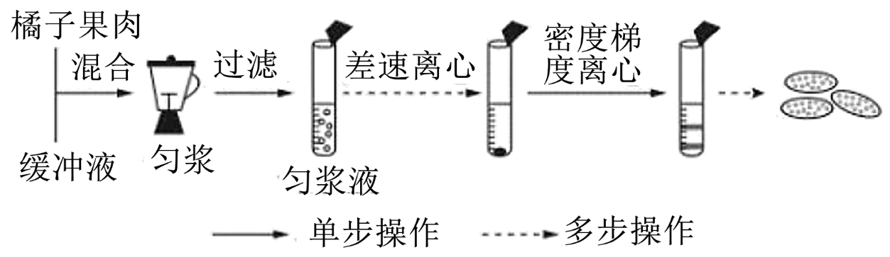
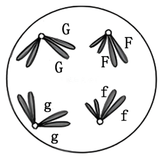
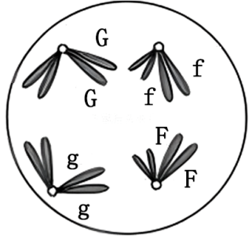
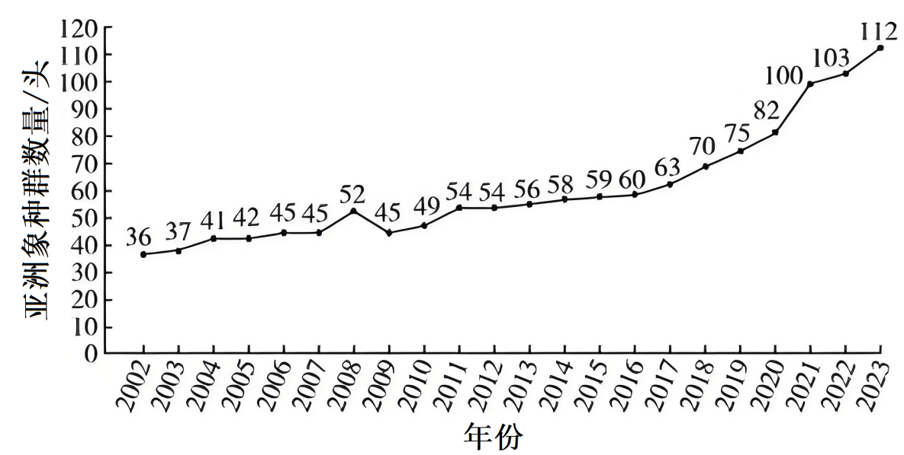
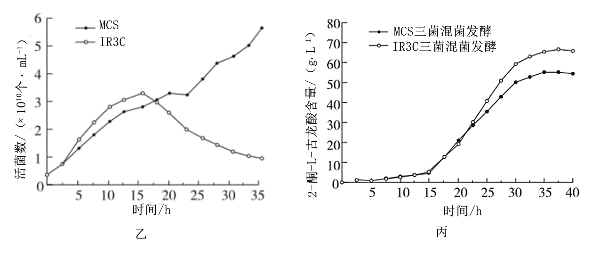

**生物试题**

**一、选择题：本题共16小题，每小题3分，共48分。在每小题给出的四个选项中，只有一项是符合题目要求的。**

1\. 化学元素含量对生命活动十分重要。下列说法错误的是（　　）

A 植物缺镁导致叶绿素合成减少 B. 哺乳动物缺钙会出现抽搐症状

C. 人体缺铁导致镰状细胞贫血症 D. 人体缺碘甲状腺激素合成减少

2\. 生物兴趣小组从橘子果肉中分离得到完整的线粒体，操作流程如图。

下列说法错误的是（　　）

A. 缓冲液可以用蒸馏水代替 B. 匀浆的目的是释放线粒体

C. 差速离心可以将不同大小的颗粒分开 D. 该线粒体可用于研究丙酮酸氧化分解

3\. 细胞作为生命活动的基本单位，需要与环境进行物质交换。下列说法正确的是（　　）

A. 协助扩散转运物质需消耗ATP B. 被动运输是逆浓度梯度进行的

C. 载体蛋白转运物质时自身构象发生改变 D. 主动运输转运物质时需要通道蛋白协助

4\. 研究发现，细胞蛇是一种无膜细胞器，其在果蝇三龄幼虫大脑干细胞中数量较多而神经细胞中几乎没有；在人类肝癌细胞中数量比正常组织中多。据此推测细胞蛇可能参与的生命活动是（　　）

A 细胞增殖 B. 细胞分化 C. 细胞凋亡 D. 细胞衰老

5\. 某二倍体动物（2n=4）的基因型为GgFf，等位基因G/g和F/f分别位于两对同源染色体上，在不考虑基因突变的情况下，下列细胞分裂示意图中不可能出现的是（　　）

A.  B.  C.  D. 

6\. 云南省是著名的鲜花产地，所产鲜花花色鲜艳与其独特的自然环境息息相关。花青素苷是决定被子植物色彩呈现的主要色素物质，花冠中糖类或被紫外光激活的紫外光受体均可促进相关基因表达，从而增加花青素苷的合成。下列说法错误的是（　　）

A. 云南平均海拔高，紫外光强，能够促进花青素苷的合成

B. 鲜切花中花青素苷会缓慢降解，在浸泡液中添加适量糖可延缓鲜花褪色

C. 云南平均海拔高，昼夜温差大，有利于呈色

D. 鲜花中花青素苷的含量，与紫外光受体基因表达水平呈负相关

7\. 研究人员观察到川金丝猴为黄色毛发、滇/缅甸金丝猴为黑色毛发、黔金丝猴为黑灰色—黄色的镶嵌毛发，因此对金丝猴属5种金丝猴进行研究，证实黔金丝猴起源于187万年前川金丝猴祖先群与滇/缅甸金丝猴祖先群的杂交后代，其遗传信息约70%来自川金丝猴祖先群，30%来自滇/缅甸金丝猴祖先群。下列结论无法得出的是（　　）

A. 杂交促进了金丝猴间的基因交流，是黔金丝猴形成的重要因素

B. 黔金丝猴毛色是有别于祖先群的新性状，该性状可遗传给后代

C. 黔金丝猴毛色的形成是遗传和所处自然环境共同作用的结果

D. 黔金丝猴群体中黄色毛发的基因频率大于黑色毛发的基因频率

8\. 长跑运动员在比赛过程中，出现呼吸加快、大量流汗等生理现象，但血浆pH仍保持相对稳定。分析血浆pH稳定的原因，下列说法正确的是（　　）

A. 大量流汗排出了无机盐 B. 喝碱性饮料以中和乳酸

C. 内环境中存在HCO3-/H2CO3缓冲对 D. 呼吸过快时O2摄入和CO2排出均减少

9\. 抗蛇毒毒素血清用于治疗被毒蛇咬伤的患者。关于抗蛇毒毒素血清的制备和运用，下列说法错误的是（　　）

A. 制备抗蛇毒毒素血清可用减毒的蛇毒毒素对动物多次免疫

B. 从已免疫动物血液中分离抗蛇毒毒素血清时需去除血细胞

C. 医务人员需根据毒蛇种类为患者注射对应抗蛇毒毒素血清

D. 患者体内蛇毒记忆细胞是因注射抗蛇毒毒素血清而产生的

10\. 我国劳动人民在长期农业生产实践中总结了大量经验，体现出劳动人民的勤劳与智慧。下列分析错误的是（　　）

A. “打顶去心，果枝满头”：去掉顶芽，可以消除顶端优势，促进侧枝发育

B “要得果子好，蜂子把花咬”：蜜蜂可帮助传粉提高受精率，增加果实数量

C. “庄稼一枝花，全靠肥当家”：作物可吸收有机肥中残留蛋白质，加速生长

D. “瓜熟蒂落”：乙烯含量升高可促进瓜果成熟，脱落酸含量升高可促进其脱落

11\. 在国家和地方政府的大力保护下，中国境内亚洲象数量明显增加。2002-2023年西双版纳野象谷亚洲象种群数量调查结果如图。

下列说法错误的是（　　）

A. 可使用红外触发相机调查亚洲象种群数量

B. 2016-2017年，该种群新出生3头亚洲象

C. 2021-2022年，亚洲象种群增长率为3%

D. 亚洲象种群数量增长至K值后仍然会波动

12\. 群落演替理论为实施自然保护和生态修复提供了科学依据，关于演替，下列说法错误的是（　　）

A. 森林火灾后发生的演替属于初生演替

B. 科学合理的人工造林可加快演替的速度

C. 优势种改变是判断群落演替的标志之一

D. 环境变化是诱发演替的主要因素之一

13\. 增加碳汇的目的是减少大气中CO2含量。下列措施中无法实现减少碳排或增加碳汇的是（　　）

A. 保护湿地 B. 植树造林 C. 秸秆还田 D. 动物饲养

14\. 孕酮具有促进子宫内膜增生，为受精卵着床做准备的作用。某奶牛场发现一头高产奶量母牛生产两胎后重复配种均未成功妊娠，该牛可正常排卵但孕酮量低于正常母牛。为获得该母牛的后代，下列说法正确的是（　　）

A. 运用体外受精或人工授精技术可提高该牛的妊娠率

B. 使用外源促性腺激素处理该牛获得更多卵子进而可获得多枚胚胎

C. 体外受精或人工授精后形成受精卵移植到健康受体可提高存活率

D. 使用该牛MⅡ期卵母细胞的细胞核进行核移植可获得可育后代

15\. 黄酒是我国古老的发酵酒之一，传统酿制中，先用蒸煮过的小麦或麸皮为原料，对之前发酵留存的少量酒曲（曲种）进行扩大制曲；再将酒曲和蒸煮后的糯米、大米混合处理一段时间后，添加足量酒母（含酵母菌）完成发酵，压榨成品。下列说法错误的是（　　）

A. 小麦、麸皮等原料为酒曲中微生物的生长繁殖提供了碳源和氮源等营养物质

B. 为避免制曲过程被杂菌污染影响黄酒品质，扩大制曲前需对留存的酒曲灭菌

C. 糯米、大米蒸煮后立即与酒曲混合会导致酶空间结构改变而降低其催化效率

D. 将酒曲混合糯米、大米处理一段时间，是为了获得酒母发酵时的底物葡萄糖

16\. RNA干扰原理是指mRNA形成局部互补结构后阻断mRNA翻译。X菌是兼性厌氧菌，能杀伤正常细胞和处于缺氧微环境的肿瘤细胞。我国科学家基于RNA干扰原理改造X菌获得Y菌时，将厌氧启动子PT置于X菌生存必需基因asd上游，启动基因asd转录，PT启动转录效率与氧浓度成反比；同时将好氧启动子PA置于基因asd下游，启动互补链转录，PA启动转录效率与氧浓度成正比。下列说法正确的是（　　）

A. Y菌存在asd基因DNA双链同时启动转录的状态

B. PT和PA分别启动转录得到的mRNA相同

C. PA的作用是防止有氧环境下Y菌死亡

D. 改造X菌目的是增强无氧环境下杀伤肿瘤细胞的能力

**二、非选择题：本题共5小题，共52分。**

17\. 不当施肥、人为踩踏、大型农业机械碾压等因素均会导致土壤结构破坏，如土壤紧实等。为研究土壤紧实对植物生长发育的影响，研究人员分别用压实的土壤（压实组）和未压实的土壤（疏松组）种植黄瓜，得到黄瓜根系中苹果酸和酒精含量数据如表。

|     |                           |                          |
|:--- |:------------------------- |:------------------------ |
| 组别  | 苹果酸/（μmol·g-1） | 酒精/（μmol·g-1） |
| 压实组 | 0.271±0.005               | 6.114±0.013              |
| 疏松组 | 0.467±0.004               | 2.233±0.040              |

回答下列问题：

（1）本实验中苹果酸主要在根系细胞的线粒体基质中生成，由此可推测，其为\_\_\_\_\_\_\_\_\_（填“有氧”或“无氧”）呼吸的中间产物。

（2）相较于疏松组，压实组黄瓜根系的无氧呼吸更强，依据是\_\_\_\_\_\_\_\_\_\_\_\_\_\_\_\_\_\_\_\_\_\_\_\_\_\_\_，为维持根系细胞正常生命活动，压实组消耗的有机物总量更\_\_\_\_\_\_（填“多”或“少”），原因是\_\_\_\_\_\_\_\_\_\_\_\_\_\_\_\_\_\_\_\_\_\_\_\_\_\_\_；根吸收水分的能力减弱，叶片气孔\_\_\_\_\_\_\_\_\_，光合作用\_\_\_\_\_\_\_\_\_\_\_\_\_\_\_\_\_\_阶段首先受抑制，有机物合成减少。最终导致有机物积累减少，黄瓜生长缓慢。

（3）为解决土壤紧实的问题，可以采取的措施有\_\_\_\_\_\_\_\_\_\_\_\_\_\_\_\_\_\_\_\_\_\_\_\_\_\_\_（答出2点即可）。

18\. 冬瓜果面有蜡粉可提高果实抗病、耐日灼和耐储性。为探究冬瓜果面蜡粉的遗传方式并对蜡粉基因（用“A”“a”表示）进行定位，科研人员进行了一系列杂交实验，结果如表。

|               |        |           |           |
|:------------- |:------ |:--------- |:--------- |
| 群体            | 植株总数/株 | 果面有蜡粉株数/株 | 果面无蜡粉株数/株 |
| P1 | 30     | 30        | 0         |
| P2 | 30     | 0         | 30        |
| F1 | 523    | 523       | 0         |
| F2 | 574    | 430       | 144       |

注：F1为P1和P2杂交后代，F2为F1自交后代。

回答下列问题：

（1）根据杂交结果可知，果面蜡粉的遗传遵循基因的\_\_\_\_\_\_\_\_\_\_\_\_\_\_\_\_\_\_定律，依据是\_\_\_\_\_\_\_\_\_\_\_\_\_\_\_\_\_\_\_\_\_\_\_\_\_\_\_。

（2）实验证明蜡粉性状的改变是由基因突变引起的，突变基因上出现了一个限制酶H的切割位点，可用于在苗期筛选出果实表面有蜡粉的植株，据此设计引物后进行植株基因型鉴定的步骤为：提取基因组DNA→\_\_\_\_\_\_\_\_\_\_\_\_\_\_\_\_\_\_目的DNA片段→限制酶H切割扩增产物→电泳。结果显示P1植株为1条条带，P2植株为2条条带，则F2中有蜡粉的植株为\_\_\_\_\_\_\_\_\_条条带，限制酶H的切割位点位于\_\_\_\_\_\_\_\_\_（填“A”“a”或“A和a”）上。

（3）用表中材料设计实验，验证（1）中得到的结论，写出所选材料及遗传图解。

19\. 经皮电刺激（TENS）是一种安全的电刺激镇痛技术（神经传递过程如图），其依据是“闸门控制学说”，“闸门”位于脊髓背角，传导兴奋的神经纤维包括并行的粗纤维（传导触觉信号）和细纤维（传导痛觉信号），这两类纤维分别以120m·s-1和2.3m·-1s的速度传导电信号，粗纤维传导的信号能短暂关闭“闸门”，阻断细纤维向大脑传递信号。

回答下列问题：

（1）TENS作用于皮肤，产生的兴奋沿着神经纤维向大脑皮层传递，兴奋时细胞膜的膜电位表现为\_\_\_\_\_\_\_\_\_\_\_\_\_\_\_\_\_\_，膜电位发生变化的机理是\_\_\_\_\_\_\_\_\_\_\_\_\_\_\_\_\_\_\_\_\_\_\_\_\_\_\_。

（2）兴奋由大脑向肌肉传递的过程中，需通过突触传递信号，电信号传导到轴突末梢，突触小体内的\_\_\_\_\_\_\_\_\_\_\_\_\_\_\_\_\_\_与突触前膜融合后释放\_\_\_\_\_\_\_\_\_\_\_\_\_\_\_\_\_\_进入突触间隙，经扩散与突触后膜上的\_\_\_\_\_\_\_\_\_\_\_\_\_\_\_\_\_\_结合后引起下一个神经元兴奋。

（3）能产生动作电位的细胞称为可兴奋细胞，包括神经细胞、肌肉细胞和\_\_\_\_\_\_\_\_\_\_\_\_\_\_\_\_\_\_等类型。

（4）TENS镇痛的原理是\_\_\_\_\_\_\_\_\_\_\_\_\_\_\_\_\_\_\_\_\_\_\_\_\_\_\_。若动物手术中运用TENS镇痛，具体措施是\_\_\_\_\_\_\_\_\_\_\_\_\_\_\_\_\_\_\_\_\_\_\_\_\_\_\_。

20\. 云南某地苹果糖度高、香味浓，果农为打造高原生态苹果，可在生态苹果林中种植大豆，并在果树侧枝悬挂黄色粘虫板引诱捕杀害虫。回答下列问题：

（1）种植大豆后，可以降低含\_\_\_\_\_\_\_\_\_（填“氮”“磷”或“钾”）化肥的使用，原因是\_\_\_\_\_\_\_\_\_\_\_\_\_\_\_\_\_\_\_\_\_\_\_\_\_\_\_。

（2）悬挂黄色粘虫板是利用\_\_\_\_\_\_\_\_\_信息引诱捕杀害虫，从而减少害虫数量；与化学防治相比，其优点是\_\_\_\_\_\_\_\_\_\_\_\_\_\_\_\_\_\_\_\_\_\_\_\_\_\_\_（答出2点即可）；从能量流动的角度分析，防治害虫的意义是\_\_\_\_\_\_\_\_\_\_\_\_\_\_\_\_\_\_\_\_\_\_\_\_\_\_\_。

（3）生物多样性的间接价值在该生态果林中的体现有\_\_\_\_\_\_\_\_\_\_\_\_\_\_\_\_\_\_\_\_\_\_\_\_\_\_\_（答出2点即可）。

21\. 我国研究人员发明了生产维生素C的两步发酵法，流程如图甲。为了减少氧化葡糖杆菌竞争性消耗山梨糖，需要进行灭菌以结束第一步发酵。

在两步发酵法的基础上，我国研究人员进一步尝试用三菌混菌体系建立一步发酵法。在氧化葡糖杆菌（原始菌MCS）中利用基因工程技术导入大肠杆菌基因ccdB，得到工程菌IR3C。MCS和IR3C单菌培养时，活菌数变化曲线如图乙，MCS、IR3C分别与普通生酮基古龙酸菌和巨大芽孢杆菌进行三菌混菌发酵时，产物含量变化曲线如图丙。

回答下列问题：

（1）要使基因ccdB在IR3C中稳定遗传、表达并发挥作用，构建的基因表达载体除启动子外，还必须有\_\_\_\_\_\_\_\_\_\_\_\_\_\_\_\_\_\_\_\_\_\_\_\_\_\_\_。

（2）绘制图乙需统计活菌数，常用方法是\_\_\_\_\_\_\_\_\_\_\_\_\_\_\_\_\_\_\_\_\_\_\_\_\_\_\_。当活菌达到一定数量时，基因ccdB编码的蛋白质开始发挥作用，推测该蛋白质的作用是\_\_\_\_\_\_\_\_\_\_\_\_\_\_\_\_\_\_，开始发挥作用的时间是\_\_\_\_\_\_\_\_\_\_\_\_\_\_\_\_\_\_，判断理由是\_\_\_\_\_\_\_\_\_\_\_\_\_\_\_\_\_\_\_\_\_\_\_\_\_\_\_。

（3）基于图丙，利用IR3C三菌混菌发酵的产量\_\_\_\_\_\_\_\_\_（填“高于”或“低于”）MCS三菌混菌发酵的产量，其原因是\_\_\_\_\_\_\_\_\_\_\_\_\_\_\_\_\_\_\_\_\_\_\_\_\_\_\_。
