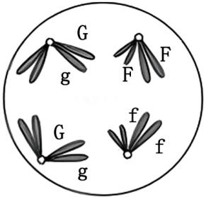
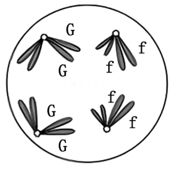
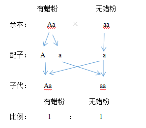
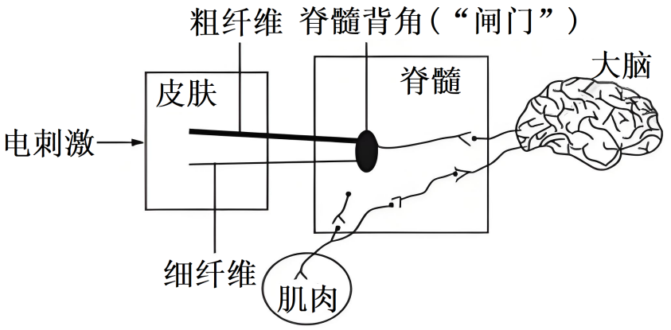
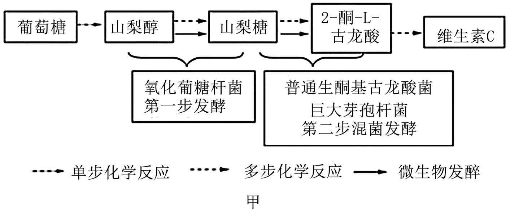

**生物试题**

**一、选择题：本题共16小题，每小题3分，共48分。在每小题给出的四个选项中，只有一项是符合题目要求的。**

1\. 化学元素含量对生命活动十分重要。下列说法错误的是（　　）

A. 植物缺镁导致叶绿素合成减少 B. 哺乳动物缺钙会出现抽搐症状

C. 人体缺铁导致镰状细胞贫血症 D. 人体缺碘甲状腺激素合成减少

【答案】C

【解析】

【分析】化学元素在生命活动中起着至关重要的作用。例如，镁是叶绿素的重要组成成分，钙对于维持肌肉的正常功能很关键，铁是血红蛋白的组成部分，碘是合成甲状腺激素的原料。

【详解】 A 、 镁是叶绿素的组成元素，植物缺镁会导致叶绿素合成减少，A 正确；

B 、 哺乳动物血液中钙离子含量过低会出现抽搐症状，这体现了钙对维持肌肉正常功能的重要性，B 正确；

C 、 人体缺铁会导致缺铁性贫血，而镰状细胞贫血症是由于基因突变导致血红蛋白结构异常引起的，并非缺铁所致，C 错误；

D 、 碘是合成甲状腺激素的原料，人体缺碘会使甲状腺激素合成减少，D 正确。

故选C。

2\. 生物兴趣小组从橘子果肉中分离得到完整的线粒体，操作流程如图。

下列说法错误的是（　　）

A. 缓冲液可以用蒸馏水代替 B. 匀浆的目的是释放线粒体

C. 差速离心可以将不同大小的颗粒分开 D. 该线粒体可用于研究丙酮酸氧化分解

【答案】A

【解析】

【分析】差速离心主要是采取逐渐提高离心速率分离不同大小颗粒的方法。如在分离细胞中的细胞器时，将细胞膜破坏后，形成由各种细胞器和细胞中其他物质组成的匀浆，将匀浆放入离心管中，采取逐渐提高离心速率的方法分离不同大小的细胞器。起始的离心速率较低，让较大的颗粒沉降到管底，小的颗粒仍然悬浮在上清液中。收集沉淀，改用较高的离心速率离心上清液，将较小的颗粒沉降，以此类推，达到分离不同大小颗粒的目的。

【详解】A、缓冲液的作用是维持溶液的pH稳定，保持线粒体的正常结构和功能，蒸馏水会破坏线粒体的渗透压平衡，导致线粒体吸水涨破，所以缓冲液不可以用蒸馏水代替，A错误；

B、匀浆是通过机械等手段破坏橘子果肉细胞的结构，使细胞破裂，从而将细胞内的线粒体等细胞器释放出来，所以匀浆的目的是释放线粒体，B正确；

C、差速离心法是根据不同颗粒的质量、大小等差异，在不同转速下进行离心，从而将不同大小的颗粒分开，C正确；

D、线粒体是有氧呼吸第二、三阶段的场所，丙酮酸的氧化分解发生在线粒体中，所以该线粒体可用于研究丙酮酸氧化分解，D正确。

故选A。

3\. 细胞作为生命活动的基本单位，需要与环境进行物质交换。下列说法正确的是（　　）

A. 协助扩散转运物质需消耗ATP B. 被动运输是逆浓度梯度进行

C. 载体蛋白转运物质时自身构象发生改变 D. 主动运输转运物质时需要通道蛋白协助

【答案】C

【解析】

【分析】1、自由扩散：运输方向是高浓度到低浓度；不需要转运蛋白；不消耗能量。

2、协助扩散：运输方向是高浓度到低浓度；需要转运蛋白；不消耗能量。

3、主动运输：运输方向是低浓度到高浓度；需要转运蛋白质；需要消耗能量。

【详解】A、协助扩散是顺浓度梯度运输，不需要消耗ATP，A错误；

B、被动运输包括自由扩散和协助扩散，都是顺浓度梯度进行的，B错误；

C、载体蛋白在转运物质时，会与被转运物质结合，自身构象发生改变，从而实现物质的跨膜运输，C正确；

D、主动运输转运物质时需要载体蛋白协助，而不是通道蛋白，通道蛋白一般用于协助扩散，D错误。

故选C。

4\. 研究发现，细胞蛇是一种无膜细胞器，其在果蝇三龄幼虫大脑干细胞中数量较多而神经细胞中几乎没有；在人类肝癌细胞中数量比正常组织中多。据此推测细胞蛇可能参与的生命活动是（　　）

A. 细胞增殖 B. 细胞分化 C. 细胞凋亡 D. 细胞衰老

【答案】A

【解析】

【分析】细胞通过细胞分裂增加细胞数量的过程，叫作细胞增殖。单细胞生物通过细胞增殖而繁衍，多细胞生物从受精卵开始，要经过细胞增殖和分化逐渐发育为成体。生物体内也不断地有细胞衰老、死亡，需要通过细胞增殖加以补充，因此，细胞增殖是重要的细胞生命活动，是生物体生长、发育、繁殖、遗传的基础。

【详解】因为细胞蛇在具有较强增殖能力的果蝇大脑干细胞和异常增殖的人类肝癌细胞中数量较多，所以推测细胞蛇可能参与细胞增殖，A正确，BCD错误。

故选A。

5\. 某二倍体动物（2n=4）的基因型为GgFf，等位基因G/g和F/f分别位于两对同源染色体上，在不考虑基因突变的情况下，下列细胞分裂示意图中不可能出现的是（　　）

A.  B.  C.  D. 

【答案】B

【解析】

【分析】根据减数分裂的特点，精（卵）原细胞经减数第一次分裂，同源染色体分离，非同源染色体上的非等位基因自由组合，产生基因型不同的2个次级精（卵）母细胞；1个次级精（卵）母细胞经减数第二次分裂，着丝粒分裂，姐妹染色单体分开，最终产生1种2个精子（卵细胞），因此，1个精原细胞经减数分裂共产生了2种4个精子，1个卵原细胞经减数分裂共产生了1种1个卵细胞。

【详解】A、该细胞中含有同源染色体，且正在进行同源染色体分离，可判断为减数第一次分裂后期，存在姐妹染色单体，其上的基因相同，但由于该动物基因型为GgFf，在减数第一次分裂前期，同源染色体上的非姐妹染色单体发生互换，可出现图中的情况，A不符合题意；

B、该细胞中每条染色体含有两条姐妹染色单体，且同源染色体正在分离，处于减数第一次分裂后期，移向细胞同一极的染色体为一组非同源染色体，由于该动物基因型为GgFf，同源染色体上应该含有G和g、F和f这两对等位基因，而不是G和G、f和f，所以不可能出现图中的情况，B符合题意；

CD、该细胞中每条染色体含有两条姐妹染色单体，且同源染色体正在分离，由于非同源染色体自由组合，所以处于减数第一次分裂后期，移向细胞同一极的染色体为一组非同源染色体，即G与g、F与f分离，G与F或f组合，CD不符合题意。

故选B。

6\. 云南省是著名的鲜花产地，所产鲜花花色鲜艳与其独特的自然环境息息相关。花青素苷是决定被子植物色彩呈现的主要色素物质，花冠中糖类或被紫外光激活的紫外光受体均可促进相关基因表达，从而增加花青素苷的合成。下列说法错误的是（　　）

A. 云南平均海拔高，紫外光强，能够促进花青素苷合成

B. 鲜切花中花青素苷会缓慢降解，在浸泡液中添加适量糖可延缓鲜花褪色

C. 云南平均海拔高，昼夜温差大，有利于呈色

D. 鲜花中花青素苷的含量，与紫外光受体基因表达水平呈负相关

【答案】D

【解析】

【分析】根据题意：花青素苷是决定花色（色彩呈现）的主要色素物质，花冠中糖类或被紫外光激活的紫外光受体均可促进相关基因表达，从而增加花青素苷的合成。

【详解】A、云南海拔高紫外光强，紫外光激活的紫外光受体可促进相关基因表达，增加花青素苷合成，A正确；

B、鲜切花褪色与花青素苷降解相关，糖类可促进相关基因表达，增加花青素苷合成，从而延缓褪色，B正确；

C、昼夜温差大时，白天高温促进光合作用积累糖类，夜间低温减少呼吸消耗，积累更多糖类，糖类可促进相关基因表达，从而增加花青素苷的合成，花青素苷是决定被子植物色彩呈现的主要色素物质，所以昼夜温差大，有利于呈色，C正确；

D，紫外光受体被激活后，可促进相关基因表达，增加花青素苷合成，所以紫外光受体基因表达水平越高，花青素苷合成量应越多，两者应为正相关，D错误。

故选D。

7\. 研究人员观察到川金丝猴为黄色毛发、滇/缅甸金丝猴为黑色毛发、黔金丝猴为黑灰色—黄色的镶嵌毛发，因此对金丝猴属5种金丝猴进行研究，证实黔金丝猴起源于187万年前川金丝猴祖先群与滇/缅甸金丝猴祖先群的杂交后代，其遗传信息约70%来自川金丝猴祖先群，30%来自滇/缅甸金丝猴祖先群。下列结论无法得出的是（　　）

A. 杂交促进了金丝猴间的基因交流，是黔金丝猴形成的重要因素

B. 黔金丝猴毛色是有别于祖先群的新性状，该性状可遗传给后代

C. 黔金丝猴毛色的形成是遗传和所处自然环境共同作用的结果

D. 黔金丝猴群体中黄色毛发的基因频率大于黑色毛发的基因频率

【答案】D

【解析】

【分析】生物的性状通常是由基因和环境共同作用的结果。

【详解】A 、因为黔金丝猴是川金丝猴祖先群与滇/缅甸金丝猴祖先群杂交产生的后代，所以杂交促进了金丝猴间的基因交流，这是黔金丝猴形成的重要因素，A 正确；

B 、 黔金丝猴毛色与祖先群不同，是新性状，由于它是杂交产生，遗传物质发生改变，所以该性状可遗传给后代，B 正确；

C 、生物的性状通常是遗传和所处自然环境共同作用的结果，黔金丝猴的毛色也不例外，C 正确；

D 、虽然黔金丝猴遗传信息约 70%来自川金丝猴祖先群（川金丝猴为黄色毛发），30%来自滇/缅甸金丝猴祖先群（滇/缅甸金丝猴为黑色毛发），但仅根据遗传信息的来源比例不能直接得出黔金丝猴群体中黄色毛发的基因频率大于黑色毛发的基因频率，D 错误。

故选D。

8\. 长跑运动员在比赛过程中，出现呼吸加快、大量流汗等生理现象，但血浆pH仍保持相对稳定。分析血浆pH稳定的原因，下列说法正确的是（　　）

A 大量流汗排出了无机盐 B. 喝碱性饮料以中和乳酸

C. 内环境中存在HCO3-/H2CO3缓冲对 D. 呼吸过快时O2摄入和CO2排出均减少

【答案】C

【解析】

【分析】内环境稳态是指在正常生理情况下机体内环境的各种成分和理化性质只在很小的范围内发生变动，不是处于固定不变的静止状态，而是处于动态平衡状态。正常机体通过调节作用，使各个器官、系统协调活动，共同维持内环境的相对稳定状态。

【详解】A、大量流汗排出无机盐主要影响的是体内的水盐平衡，从而影响渗透压，对血浆pH稳定的维持没有直接作用，A错误；

B、喝碱性饮料会被胃酸中和，不能中和血浆中的乳酸，对血浆pH稳定的作用不是主要的，B错误；

C、内环境中存在HCO3-/H2CO3缓冲对，当机体产生乳酸等酸性物质时，HCO3-会与之反应，维持血浆pH的稳定，当碱性物质增多时，H2CO3会与之反应，从而使血浆pH保持相对稳定，这是血浆pH稳定的重要原因，C正确；

D、呼吸过快时，O2摄入增加，CO2排出也增加，这样可以调节血浆中CO2的浓度，维持酸碱平衡，D错误。

故选C。

9\. 抗蛇毒毒素血清用于治疗被毒蛇咬伤的患者。关于抗蛇毒毒素血清的制备和运用，下列说法错误的是（　　）

A. 制备抗蛇毒毒素血清可用减毒的蛇毒毒素对动物多次免疫

B. 从已免疫动物血液中分离抗蛇毒毒素血清时需去除血细胞

C. 医务人员需根据毒蛇种类为患者注射对应抗蛇毒毒素血清

D. 患者体内蛇毒记忆细胞是因注射抗蛇毒毒素血清而产生的

【答案】D

【解析】

【分析】抗蛇毒毒素血清”的生产原理是注射抗原后机体产生抗体释放到血清的过程，因此“抗蛇毒毒素血清”中含有抗体，可和蛇毒抗原结合。

【详解】A、蛇毒毒素减毒处理可避免动物中毒死亡，同时保留抗原性，故制备抗蛇毒毒素血清可用减毒的蛇毒毒素对动物多次免疫，A正确；

B、抗蛇毒毒素血清中的有效成分是抗体，存在于血浆中，分离血清需去除血细胞和纤维蛋白原，B正确；

C、不同蛇毒毒素的抗原结构不同，抗体具有特异性，需针对性使用对应血清才能中和毒素，C正确；

D、记忆细胞由抗原直接刺激B细胞或T细胞后增殖分化形成，而抗蛇毒血清中的抗体属于被动免疫，不会诱导患者体内产生记忆细胞，D错误。

故选D。

10\. 我国劳动人民在长期农业生产实践中总结了大量经验，体现出劳动人民的勤劳与智慧。下列分析错误的是（　　）

A. “打顶去心，果枝满头”：去掉顶芽，可以消除顶端优势，促进侧枝发育

B. “要得果子好，蜂子把花咬”：蜜蜂可帮助传粉提高受精率，增加果实数量

C. “庄稼一枝花，全靠肥当家”：作物可吸收有机肥中残留蛋白质，加速生长

D. “瓜熟蒂落”：乙烯含量升高可促进瓜果成熟，脱落酸含量升高可促进其脱落

【答案】C

【解析】

【分析】由植物体内产 生，能从产生部位运送到作用部位，对植物的生长发育有显著影响的微量有机物，叫作植物激素。 植物激素作为信息分子，几乎参与调节植物生长、发育过 程中的所有生命活动，包括赤霉素、细胞分裂素、脱落酸和乙烯等物质

【详解】A、“打顶去心，果枝满头”，顶芽会产生生长素，向下运输积累在侧芽部位，抑制侧芽生长，这就是顶端优势，去掉顶芽后，侧芽部位生长素浓度降低，抑制作用解除，从而可以促进侧枝发育，A正确；

B、“要得果子好，蜂子把花咬”，许多植物需要经过传粉受精才能形成果实和种子，蜜蜂在采集花蜜的过程中可以帮助植物传粉，使花粉落到雌蕊柱头上，完成受精过程，提高受精率，进而增加果实数量，B正确；

C、“庄稼一枝花，全靠肥当家”，作物不能直接吸收有机肥中残留的蛋白质，有机肥中的有机物需要经过土壤中微生物的分解，转化为无机物（如二氧化碳、水、无机盐等）后，才能被植物吸收利用，加速生长，C错误；

D、“瓜熟蒂落”，在果实成熟过程中乙烯含量升高，乙烯具有促进果实成熟的作用；在果实脱落时脱落酸含量升高，脱落酸能促进叶和果实的衰老和脱落，D正确。

故选C。

11\. 在国家和地方政府的大力保护下，中国境内亚洲象数量明显增加。2002-2023年西双版纳野象谷亚洲象种群数量调查结果如图。

下列说法错误的是（　　）

A. 可使用红外触发相机调查亚洲象种群数量

B. 2016-2017年，该种群新出生3头亚洲象

C. 2021-2022年，亚洲象种群增长率为3%

D. 亚洲象种群数量增长至K值后仍然会波动

【答案】B

【解析】

【分析】调查种群密度的方法：

（1）样方法：适用于活动范围小，活动能力弱的动物和植物。

（2）标记重捕法：适用于活动范围大，活动能力强的动物。

（3）红外触发相机：适用于体积大，数量少的恒温动物。

【详解】A、红外触发相机可以在不干扰亚洲象的情况下对其进行监测和记录，能够较为准确地统计亚洲象的种群数量等信息，所以可使用红外触发相机调查亚洲象种群数量，A正确；

B、种群数量的变化不仅取决于出生，还与死亡、迁入和迁出等因素有关，仅从所给的种群数量数据，不知道这期间亚洲象的死亡数量等其他信息，不能仅仅根据两年的种群数量差值就确定新出生的亚洲象数量，2016-2017年种群数量从60增加到63，但这3的差值不一定都是新出生个体数量，B错误；

C、种群增长率=增长数量/初始数量×100%，2021年亚洲象种群数量为100，2022年为103，增长数量为103-100=3，初始数量为100，则种群增长率为3/100×100%=3% ，C正确；

D、在自然生态系统中，种群数量增长至K值后，由于受到环境因素（如食物、天敌、气候等）的影响，种群数量仍然会在K值上下波动，D正确。 

故选B。

12\. 群落演替理论为实施自然保护和生态修复提供了科学依据，关于演替，下列说法错误的是（　　）

A. 森林火灾后发生的演替属于初生演替

B. 科学合理的人工造林可加快演替的速度

C. 优势种改变是判断群落演替的标志之一

D. 环境变化是诱发演替的主要因素之一

【答案】A

【解析】

【分析】初生演替是指在一个从来没有被植物覆盖的地面，或者是原来存在过植被、但被彻底消灭了的地方发生的演替。次生演替是指在原有植被虽已不存在，但原有土壤条件基本保留，甚至还保留了植物的种子或其他繁殖体（如能发芽的地下茎）的地方发生的演替。人类活动可以影响演替的方向和速度。

【详解】A、森林火灾后，原有植被虽被破坏，但原有土壤条件基本保留，还保留了植物的种子或其他繁殖体，所以发生的演替属于次生演替，A错误；

B、人类活动可以影响演替的方向和速度，科学合理的人工造林等人类活动能加快群落演替的速度，B正确；

C、在群落演替过程中，优势种会发生改变，优势种的改变是判断群落演替的标志之一，C正确；

D、环境变化，如气候变化、火灾、洪水等，是诱发群落演替的主要因素之一，D正确。

故选A。

13\. 增加碳汇的目的是减少大气中CO2含量。下列措施中无法实现减少碳排或增加碳汇的是（　　）

A. 保护湿地 B. 植树造林 C. 秸秆还田 D. 动物饲养

【答案】D

【解析】

【分析】碳汇是指通过植树造林、植被恢复等措施，吸收大气中的二氧化碳，从而减少温室气体在大气中浓度的过程、活动或机制。减少碳排放也是降低大气中二氧化碳含量的重要途径。

【详解】A 、 湿地生态系统具有强大的碳汇功能，保护湿地可以维持和增强其吸收二氧化碳的能力，减少碳排放或增加碳汇，A 错误；

B 、植物通过光合作用吸收二氧化碳，植树造林能够增加植物的数量，从而吸收更多的二氧化碳，增加碳汇，B 错误；

C 、秸秆还田可以增加土壤有机质，改善土壤结构，同时秸秆在分解过程中会固定一部分碳，有助于增加碳汇，C 错误；

D 、 动物饲养过程中，动物呼吸会释放二氧化碳，而且动物的粪便等在分解过程中也会产生温室气体，无法实现减少碳排放或增加碳汇，D正确。

故选D。

14\. 孕酮具有促进子宫内膜增生，为受精卵着床做准备作用。某奶牛场发现一头高产奶量母牛生产两胎后重复配种均未成功妊娠，该牛可正常排卵但孕酮量低于正常母牛。为获得该母牛的后代，下列说法正确的是（　　）

A. 运用体外受精或人工授精技术可提高该牛的妊娠率

B. 使用外源促性腺激素处理该牛获得更多卵子进而可获得多枚胚胎

C. 体外受精或人工授精后形成受精卵移植到健康受体可提高存活率

D. 使用该牛MⅡ期卵母细胞的细胞核进行核移植可获得可育后代

【答案】C

【解析】

【分析】体外受精是指将卵子和精子在体外人工控制的环境中完成受精过程的技术。

【详解】A、该母牛孕酮量低于正常母牛，子宫内膜增生可能不足，不利于受精卵着床，即使运用体外受精或人工授精技术，也难以提高妊娠率，A 错误；

B、使用外源促性腺激素处理该牛，可促使其超数排卵，获得更多卵子，但孕酮量低于正常母牛，受精卵不能成功着床，不能获得成活胚胎，B 错误；

C 、该牛可正常排卵但孕酮量低于正常母牛，故可通过体外受精或人工授精后形成受精卵移植到健康的受体内可提高存活率，C 正确；

D 、使用该牛 MⅡ期卵母细胞的细胞核进行核移植，由于该牛本身孕酮分泌异常等问题，获得的后代也可能存在发育等方面的问题，不一定可育，D 错误。

故选C。

15\. 黄酒是我国古老的发酵酒之一，传统酿制中，先用蒸煮过的小麦或麸皮为原料，对之前发酵留存的少量酒曲（曲种）进行扩大制曲；再将酒曲和蒸煮后的糯米、大米混合处理一段时间后，添加足量酒母（含酵母菌）完成发酵，压榨成品。下列说法错误的是（　　）

A. 小麦、麸皮等原料为酒曲中微生物的生长繁殖提供了碳源和氮源等营养物质

B. 为避免制曲过程被杂菌污染影响黄酒品质，扩大制曲前需对留存的酒曲灭菌

C. 糯米、大米蒸煮后立即与酒曲混合会导致酶空间结构改变而降低其催化效率

D. 将酒曲混合糯米、大米处理一段时间，是为了获得酒母发酵时的底物葡萄糖

【答案】B

【解析】

【分析】酵母菌是兼性厌氧菌，有氧呼吸产生二氧化碳和水，无氧呼吸产生酒精和二氧化碳；酿酒利用的是酵母菌进行无氧呼吸，从而产生酒精。

【详解】A、小麦、麸皮等原料含有蛋白质、糖类等多种营养成分，蛋白质可以为微生物提供氮源，糖类等可以为微生物提供碳源，所以能为酒曲中微生物的生长繁殖提供碳源和氮源等营养物质，A正确；

B、扩大制曲前对留存的酒曲不能灭菌，因为酒曲本身含有发酵所需的菌种，若灭菌会杀死这些菌种，导致无法进行正常的发酵过程，B错误；

C、糯米、大米蒸煮后温度较高，立即与酒曲混合，高温会使酶的空间结构改变，导致酶活性降低，从而降低其催化效率，C正确；

D、酒曲中含有淀粉酶等酶类，将酒曲混合糯米、大米处理一段时间，淀粉酶可将糯米、大米中的淀粉分解为葡萄糖，从而为后续酒母（含酵母菌）发酵提供底物葡萄糖，D正确。

故选B。

16\. RNA干扰原理是指mRNA形成局部互补结构后阻断mRNA翻译。X菌是兼性厌氧菌，能杀伤正常细胞和处于缺氧微环境的肿瘤细胞。我国科学家基于RNA干扰原理改造X菌获得Y菌时，将厌氧启动子PT置于X菌生存必需基因asd上游，启动基因asd转录，PT启动转录效率与氧浓度成反比；同时将好氧启动子PA置于基因asd下游，启动互补链转录，PA启动转录效率与氧浓度成正比。下列说法正确的是（　　）

A. Y菌存在asd基因DNA双链同时启动转录的状态

B. PT和PA分别启动转录得到的mRNA相同

C. PA的作用是防止有氧环境下Y菌死亡

D. 改造X菌目的是增强无氧环境下杀伤肿瘤细胞的能力

【答案】A

【解析】

【分析】启动子是一段位于基因上游的DNA序列，是RNA聚合酶识别和结合的部位，能启动基因的转录过程，其作用类似于“开关”，决定基因表达的起始时间和表达程度。

【详解】A、因为将厌氧启动子PT置于X菌生存必需基因asd上游启动基因asd转录，将好氧启动子PA置于基因asd下游启动互补链转录，在一定的氧浓度条件下，有可能同时满足PT和PA的启动条件，从而存在asd基因DNA双链同时启动转录的状态，A正确；

B、PT启动的是基因asd转录，PA启动的是基因asd互补链转录，所以PT和PA分别启动转录得到的mRNA是互补的，不相同，B错误；

C、由于好氧启动子PA置于基因asd下游，启动互补链转录，PA启动转录效率与氧浓度成正比，目的是让Y菌在有氧环境下能生存，C错误；

D、改造X菌的目的是让Y菌在有氧环境下能生存（通过PA启动子的作用 ），同时保留在缺氧环境下杀伤肿瘤细胞的能力，而不是单纯增强无氧环境下杀伤肿瘤细胞的能力，D错误。

故选A。

**二、非选择题：本题共5小题，共52分。**

17\. 不当施肥、人为踩踏、大型农业机械碾压等因素均会导致土壤结构破坏，如土壤紧实等。为研究土壤紧实对植物生长发育的影响，研究人员分别用压实的土壤（压实组）和未压实的土壤（疏松组）种植黄瓜，得到黄瓜根系中苹果酸和酒精含量数据如表。

|     |                           |                          |
|:--- |:------------------------- |:------------------------ |
| 组别  | 苹果酸/（μmol·g-1） | 酒精/（μmol·g-1） |
| 压实组 | 0.271±0.005               | 6.114±0.013              |
| 疏松组 | 0.467±0.004               | 2.233±0.040              |

回答下列问题：

（1）本实验中苹果酸主要在根系细胞的线粒体基质中生成，由此可推测，其为\_\_\_\_\_\_\_\_\_（填“有氧”或“无氧”）呼吸的中间产物。

（2）相较于疏松组，压实组黄瓜根系的无氧呼吸更强，依据是\_\_\_\_\_\_\_\_\_\_\_\_\_\_\_\_\_\_\_\_\_\_\_\_\_\_\_，为维持根系细胞正常生命活动，压实组消耗的有机物总量更\_\_\_\_\_\_（填“多”或“少”），原因是\_\_\_\_\_\_\_\_\_\_\_\_\_\_\_\_\_\_\_\_\_\_\_\_\_\_\_；根吸收水分的能力减弱，叶片气孔\_\_\_\_\_\_\_\_\_，光合作用\_\_\_\_\_\_\_\_\_\_\_\_\_\_\_\_\_\_阶段首先受抑制，有机物合成减少。最终导致有机物积累减少，黄瓜生长缓慢。

（3）为解决土壤紧实的问题，可以采取的措施有\_\_\_\_\_\_\_\_\_\_\_\_\_\_\_\_\_\_\_\_\_\_\_\_\_\_\_（答出2点即可）。

【答案】（1）有氧 （2） ①. 压实组黄瓜根系中酒精含量更高 ②. 多 ③. 压实组无氧呼吸强，无氧呼吸释放能量少 ④. 关闭 ⑤. 暗反应

（3）合理施肥、适度翻耕、减少大型农业机械的不必要碾压等

【解析】

【分析】有氧呼吸是有机物彻底的氧化分解，并释放能量的过程。有氧呼吸第一阶段在细胞质基质，第二阶段在线粒体基质，第三阶段在线粒体内膜。无氧呼吸整个过程在细胞质基质进行。

【小问1详解】

有氧呼吸的第二阶段发生在线粒体基质中，本实验中苹果酸主要在根系细胞的线粒体基质中生成，由此可推测，其为有氧呼吸的中间产物。

【小问2详解】

相较于疏松组，压实组黄瓜根系中酒精含量更高，而酒精是植物细胞无氧呼吸的产物，所以压实组黄瓜根系的无氧呼吸更强。为维持根系细胞正常生命活动，由于压实组无氧呼吸强，无氧呼吸释放的能量较少，为获得足够能量维持生命活动，压实组消耗的有机物总量更多。根吸收水分的能力减弱，叶片气孔关闭，二氧化碳进入减少，光合作用暗反应阶段首先受抑制，有机物合成减少。最终导致有机物积累减少，黄瓜生长缓慢。

【小问3详解】

为解决土壤紧实的问题，可以采取的措施有合理施肥，避免不当施肥导致土壤结构破坏；适度翻耕，疏松土壤；减少大型农业机械的不必要碾压等。

18\. 冬瓜果面有蜡粉可提高果实抗病、耐日灼和耐储性。为探究冬瓜果面蜡粉的遗传方式并对蜡粉基因（用“A”“a”表示）进行定位，科研人员进行了一系列杂交实验，结果如表。

|               |        |           |           |
|:------------- |:------ |:--------- |:--------- |
| 群体            | 植株总数/株 | 果面有蜡粉株数/株 | 果面无蜡粉株数/株 |
| P1 | 30     | 30        | 0         |
| P2 | 30     | 0         | 30        |
| F1 | 523    | 523       | 0         |
| F2 | 574    | 430       | 144       |

注：F1为P1和P2杂交后代，F2为F1自交后代。

回答下列问题：

（1）根据杂交结果可知，果面蜡粉的遗传遵循基因的\_\_\_\_\_\_\_\_\_\_\_\_\_\_\_\_\_\_定律，依据是\_\_\_\_\_\_\_\_\_\_\_\_\_\_\_\_\_\_\_\_\_\_\_\_\_\_\_。

（2）实验证明蜡粉性状的改变是由基因突变引起的，突变基因上出现了一个限制酶H的切割位点，可用于在苗期筛选出果实表面有蜡粉的植株，据此设计引物后进行植株基因型鉴定的步骤为：提取基因组DNA→\_\_\_\_\_\_\_\_\_\_\_\_\_\_\_\_\_\_目的DNA片段→限制酶H切割扩增产物→电泳。结果显示P1植株为1条条带，P2植株为2条条带，则F2中有蜡粉的植株为\_\_\_\_\_\_\_\_\_条条带，限制酶H的切割位点位于\_\_\_\_\_\_\_\_\_（填“A”“a”或“A和a”）上。

（3）用表中材料设计实验，验证（1）中得到的结论，写出所选材料及遗传图解。

【答案】（1） ①. 分离 ②. F2中出现3:1的性状分离比，符合一对等位基因的遗传规律

（2） ①. PCR扩增 ②. 1或3 ③. a

（3）选用材料：F1植株和P2植株

遗传图解

【解析】

【分析】基因分离定律：在生物的体细胞中，控制同一性状的遗传因子成对存在，不相融合；在形成配子时，成对的遗传因子发生分离，分离后的遗传因子分别进入不同的配子中，随配子遗传给后代。

【小问1详解】

根据杂交结果可知，果面蜡粉的遗传遵循基因的分离定律，因为F1自交得到的F2中，果面有蜡粉株数与果面无蜡粉株数之比约为3：1（430：144≈3：1），符合基因分离定律中杂合子自交后代性状分离比3：1的比值。

【小问2详解】

要进行植株基因型鉴定，在提取基因组DNA后，需要通过PCR扩增目的DNA片段。P1植株为1条条带，P2植株为2条条带，说明P1为纯合子且其基因不能被限制酶H切割（假设P1基因型为AA），P2为纯合子且其基因能被限制酶H切割（假设P2基因型为aa），限制酶H的切割位点位于a上。F1基因型为Aa，F2中有蜡粉的植株基因型为AA或Aa。AA只有1条条带（不能被切割），Aa会有3条条带（A不能被切割为1条，a被切割为2条），所以F2中有蜡粉的植株为1条或3条条带。 

【小问3详解】

验证分离定律，采用测交的方法，所选材料：F1Aa与P2aa（测交实验可以验证基因的分离定律）。

19\. 经皮电刺激（TENS）是一种安全的电刺激镇痛技术（神经传递过程如图），其依据是“闸门控制学说”，“闸门”位于脊髓背角，传导兴奋的神经纤维包括并行的粗纤维（传导触觉信号）和细纤维（传导痛觉信号），这两类纤维分别以120m·s-1和2.3m·-1s的速度传导电信号，粗纤维传导的信号能短暂关闭“闸门”，阻断细纤维向大脑传递信号。

回答下列问题：

（1）TENS作用于皮肤，产生的兴奋沿着神经纤维向大脑皮层传递，兴奋时细胞膜的膜电位表现为\_\_\_\_\_\_\_\_\_\_\_\_\_\_\_\_\_\_，膜电位发生变化的机理是\_\_\_\_\_\_\_\_\_\_\_\_\_\_\_\_\_\_\_\_\_\_\_\_\_\_\_。

（2）兴奋由大脑向肌肉传递的过程中，需通过突触传递信号，电信号传导到轴突末梢，突触小体内的\_\_\_\_\_\_\_\_\_\_\_\_\_\_\_\_\_\_与突触前膜融合后释放\_\_\_\_\_\_\_\_\_\_\_\_\_\_\_\_\_\_进入突触间隙，经扩散与突触后膜上的\_\_\_\_\_\_\_\_\_\_\_\_\_\_\_\_\_\_结合后引起下一个神经元兴奋。

（3）能产生动作电位的细胞称为可兴奋细胞，包括神经细胞、肌肉细胞和\_\_\_\_\_\_\_\_\_\_\_\_\_\_\_\_\_\_等类型。

（4）TENS镇痛的原理是\_\_\_\_\_\_\_\_\_\_\_\_\_\_\_\_\_\_\_\_\_\_\_\_\_\_\_。若动物手术中运用TENS镇痛，具体措施是\_\_\_\_\_\_\_\_\_\_\_\_\_\_\_\_\_\_\_\_\_\_\_\_\_\_\_。

【答案】（1） ①. 外负内正 ②. 细胞膜对Na+的通透性增加，Na+内流

（2） ①. 突触小泡 ②. 神经递质 ③. 特异性受体 （3）某些腺细胞

（4） ①. 电刺激皮肤，使粗纤维兴奋，粗纤维传导的信号关闭“闸门”，阻断细纤维向大脑传递痛觉信号 ②. 在动物皮肤相关部位施加适宜强度的电刺激

【解析】

【分析】兴奋在神经纤维上以电信号的形式传导，在神经元之间通过突触结构传递。

【小问1详解】

在静息状态下，细胞膜的膜电位是外正内负；当兴奋时，细胞膜对Na+的通透性增加，Na+内流，使膜电位变为外负内正。

【小问2详解】

当电信号传导到轴突末梢时，突触小体内的突触小泡与突触前膜融合，释放神经递质进入突触间隙，神经递质经扩散与突触后膜上的特异性受体结合，从而引起下一个神经元兴奋。

【小问3详解】

能产生动作电位的可兴奋细胞除了神经细胞、肌肉细胞外，还有某些腺细胞等。

【小问4详解】

TENS 镇痛的原理是电刺激皮肤，使粗纤维兴奋，粗纤维传导的信号关闭“闸门”，阻断细纤维向大脑传递痛觉信号。若动物手术中运用 TENS 镇痛，具体措施是在动物皮肤相关部位施加适宜强度的电刺激。

20\. 云南某地苹果糖度高、香味浓，果农为打造高原生态苹果，可在生态苹果林中种植大豆，并在果树侧枝悬挂黄色粘虫板引诱捕杀害虫。回答下列问题：

（1）种植大豆后，可以降低含\_\_\_\_\_\_\_\_\_（填“氮”“磷”或“钾”）化肥的使用，原因是\_\_\_\_\_\_\_\_\_\_\_\_\_\_\_\_\_\_\_\_\_\_\_\_\_\_\_。

（2）悬挂黄色粘虫板是利用\_\_\_\_\_\_\_\_\_信息引诱捕杀害虫，从而减少害虫数量；与化学防治相比，其优点是\_\_\_\_\_\_\_\_\_\_\_\_\_\_\_\_\_\_\_\_\_\_\_\_\_\_\_（答出2点即可）；从能量流动的角度分析，防治害虫的意义是\_\_\_\_\_\_\_\_\_\_\_\_\_\_\_\_\_\_\_\_\_\_\_\_\_\_\_。

（3）生物多样性的间接价值在该生态果林中的体现有\_\_\_\_\_\_\_\_\_\_\_\_\_\_\_\_\_\_\_\_\_\_\_\_\_\_\_（答出2点即可）。

【答案】（1） ①. 氮 ②. 大豆根部有根瘤菌，根瘤菌能将空气中的氮气转化为含氮的养料供大豆利用

（2） ①. 物理 ②. 减少环境污染、减少对有益生物的伤害 ③. 合理调整能量流动的关系，使能量持续高效地流向对人类最有益的部分

（3）保持水土、调节气候

【解析】

【分析】生态系统中的信息传递指生物与环境、生物与生物之间传递并相互作用的信号，对个体生存、种群繁衍和生态系统稳定有重要作用。包括物理、化学和行为信息。生物多样性的价值包括直接价值、间接价值和潜在价值。

【小问1详解】

大豆根部有根瘤菌，根瘤菌能与大豆互利共生，根瘤菌可将空气中的氮气转化为含氮的养料供大豆利用，所以种植大豆后，可以降低含氮化肥的使用。

【小问2详解】

因为黄色粘虫板是利用害虫对颜色（黄色）这种物理信息的趋性来引诱害虫的。 与化学防治相比，优点有减少环境污染、减少对有益生物的伤害。化学防治使用的农药可能会残留在环境中，对土壤、水源等造成污染，同时也可能误杀一些有益生物；而悬挂黄色粘虫板这种物理防治方法相对环保且对有益生物影响较小。 从能量流动的角度分析，防治害虫的意义是合理调整能量流动的关系，使能量持续高效地流向对人类最有益的部分。害虫会取食果树等植物，消耗能量，防治害虫可以减少能量流向害虫，让更多能量流向苹果等对人类有益的部分。

【小问3详解】

生物多样性的间接价值在该生态果林中的体现有保持水土、调节气候。生态果林中的植物等生物可以通过根系等保持土壤，减少水土流失；同时植物的蒸腾作用等可以参与调节局部气候 。

21\. 我国研究人员发明了生产维生素C的两步发酵法，流程如图甲。为了减少氧化葡糖杆菌竞争性消耗山梨糖，需要进行灭菌以结束第一步发酵。

在两步发酵法的基础上，我国研究人员进一步尝试用三菌混菌体系建立一步发酵法。在氧化葡糖杆菌（原始菌MCS）中利用基因工程技术导入大肠杆菌基因ccdB，得到工程菌IR3C。MCS和IR3C单菌培养时，活菌数变化曲线如图乙，MCS、IR3C分别与普通生酮基古龙酸菌和巨大芽孢杆菌进行三菌混菌发酵时，产物含量变化曲线如图丙。

回答下列问题：

（1）要使基因ccdB在IR3C中稳定遗传、表达并发挥作用，构建的基因表达载体除启动子外，还必须有\_\_\_\_\_\_\_\_\_\_\_\_\_\_\_\_\_\_\_\_\_\_\_\_\_\_\_。

（2）绘制图乙需统计活菌数，常用方法是\_\_\_\_\_\_\_\_\_\_\_\_\_\_\_\_\_\_\_\_\_\_\_\_\_\_\_。当活菌达到一定数量时，基因ccdB编码的蛋白质开始发挥作用，推测该蛋白质的作用是\_\_\_\_\_\_\_\_\_\_\_\_\_\_\_\_\_\_，开始发挥作用的时间是\_\_\_\_\_\_\_\_\_\_\_\_\_\_\_\_\_\_，判断理由是\_\_\_\_\_\_\_\_\_\_\_\_\_\_\_\_\_\_\_\_\_\_\_\_\_\_\_。

（3）基于图丙，利用IR3C三菌混菌发酵的产量\_\_\_\_\_\_\_\_\_（填“高于”或“低于”）MCS三菌混菌发酵的产量，其原因是\_\_\_\_\_\_\_\_\_\_\_\_\_\_\_\_\_\_\_\_\_\_\_\_\_\_\_。

【答案】（1）标记基因、目的基因、终止子、复制原点

（2） ①. 稀释涂布平板法 ②. 能抑制细菌增殖 ③. 15h ④. 在15h时，IR3C数量下降，而MSC数量上升

（3） ①. 高于 ②. IR3C转入了ccdB基因，阻止细胞增殖，减少氧化葡糖杆菌竞争性消耗山梨糖，从而更多山梨糖被用于合成维生素C。

【解析】

【分析】基因工程是指按照人类的愿望，将不同生物的遗传物质在体外人工剪切并和载体重组后转入细胞内进行扩增，并表达产生所需蛋白质的技术，基因工程能够打破种属的界限，在基因水平上改变生物遗传性，并通过工程化为人类提供有用产品及服务。

【小问1详解】

基因工程中构建的基因表达载体，除启动子外、还要有标记基因、目的基因、终止子、复制原点等。

小问2详解】

统计活菌数目常用稀释涂布平板法，从图2看出，随着时间推移，种群数量不断增加，在15h时，IR3C数量下降，而MSC数量上升，所以推测转入的基因ccdB编码的蛋白质诱导能抑制细菌增殖或诱导细菌凋亡，发挥作用的时间大约在15h。

【小问3详解】

从图丙看出，IR3C三菌混菌发酵产生的2-酮-L-古龙酸含量比MSC三菌混菌发酵产量高，因此可以推测，IR3C三菌混菌发酵维生素C产量更高，可能的原因是IR3C转入了ccdB基因，诱导细菌死亡，减少氧化葡糖杆菌竞争性消耗山梨糖，从而更多山梨糖被用于合成维生素C。
