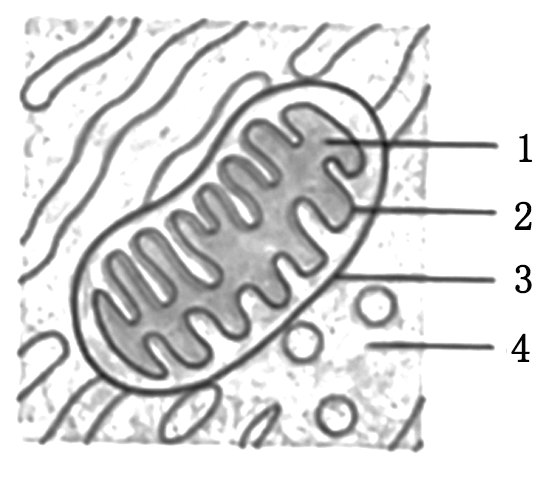
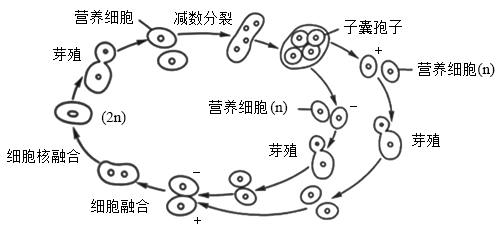
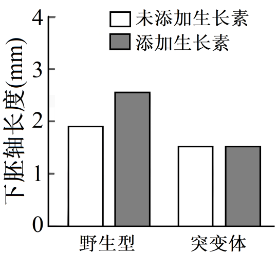
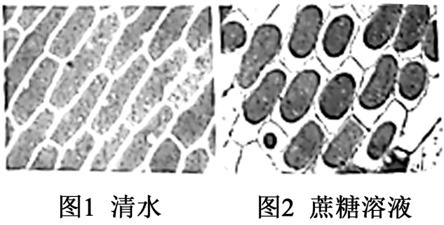
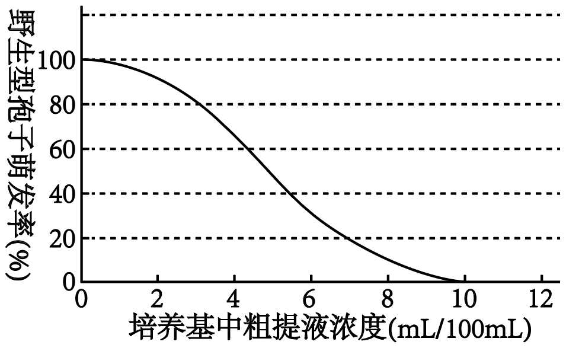
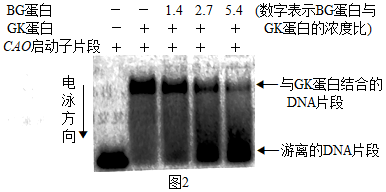
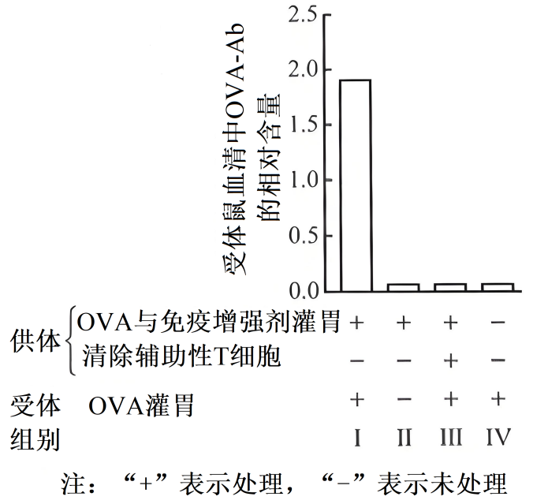
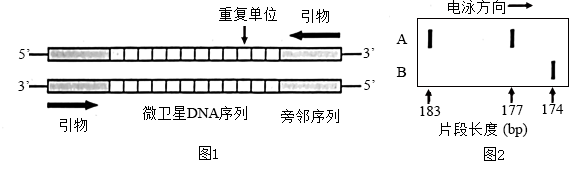

**机密★本科目考试启用前**

**北京市2025年普通高中学业水平等级性考试**

**生物**

**本试卷共10页，100分。考试时长90分钟。考生务必将答案答在答题卡上，在试卷上作答无效。考试结束后，将本试卷和答题卡一并交回。**

**第一部分**

**本部分共15题，每题2分，共30分。在每题列出的四个选项中，选出最符合题目要求的一项。**

1\. 2025年，国家持续推进“体重管理年”行动。为践行“健康饮食、科学运动”，应持有的正确认识是（ ）

A. 饮食中元素种类越多所含能量越高

B. 饮食中用糖代替脂肪即可控制体重

C. 无氧运动比有氧运动更有利于控制体重

D. 在生活中既要均衡饮食又要适量运动

2\. 下图是植物细胞局部亚显微结构示意图。在有氧呼吸过程中，细胞不同部位产生ATP的量不同。以下选项正确的是（ ）

|     |     |     |     |     |
|:--- |:--- |:--- |:--- |:--- |
| 选项  | 部位1 | 部位2 | 部位3 | 部位4 |
| A   | 大量  | 少量  | 少量  | 无   |
| B   | 大量  | 大量  | 少量  | 无   |
| C   | 少量  | 大量  | 无   | 少量  |
| D   | 少量  | 无   | 大量  | 大量  |

A. A B. B C. C D. D

3\. 某种加酶洗衣粉包装袋上注有下列信息：本品含有蛋白酶、脂肪酶和淀粉酶；洗涤前先浸泡15～20min，特别脏的衣物可减少浸泡用水量；请勿使用60℃以上热水。下列叙述错误的是（ ）

A. 该洗衣粉含多种酶，不适合洗涤纯棉衣物

B. 洗涤前浸泡有利于酶与污渍结合催化其分解

C. 减少浸泡衣物的用水量可提高酶的浓度

D. 水温过高导致酶活性下降

4\. 科学家对线虫进行诱变，发现C3基因功能缺失突变体中本应凋亡的细胞存活，C9基因功能缺失突变体中本不应凋亡的细胞发生凋亡。下列叙述错误的是（ ）

A. C3基因促进细胞凋亡 B. C9基因抑制细胞凋亡

C. 细胞凋亡不利于线虫发育 D. 细胞凋亡受基因的调控

5\. 1958年，Meselson和Stahl通过15N标记DNA的实验，证明了DNA的半保留复制。关于这一经典实验的叙述正确的是（ ）

A. 因为15N有放射性，所以能够区分DNA的母链和子链

B. 得到的DNA带的位置有三个，证明了DNA的半保留复制

C. 将DNA变成单链后再进行离心也能得到相同的实验结果

D. 选择大肠杆菌作为实验材料是因为它有环状质粒DNA

6\. 用于啤酒生产的酿酒酵母是真核生物，其生活史如图。

下列叙述错误的是（ ）

A. 子囊孢子都是单倍体

B. 营养细胞均无同源染色体

C. 芽殖过程中不发生染色体数目减半

D. 酿酒酵母可进行有丝分裂，也可进行减数分裂

7\. 抗维生素D佝偻病是一种伴X染色体显性遗传病。正常女子与男患者所生子女患该病的概率是（ ）

A. 男孩100% B. 女孩100% C. 男孩50% D. 女孩50%

8\. 蝴蝶幼虫取食植物叶片，萝藦类植物进化出产生CA的能力，CA抑制动物细胞膜上N酶的活性，对动物产生毒性，从而阻止大部分蝴蝶幼虫取食。斑蝶类蝴蝶因N酶发生了一个氨基酸替换而对CA不敏感，其幼虫可以取食萝藦。下列叙述错误的是（ ）

A. 斑蝶类蝴蝶对CA的适应主要源自基因突变和选择

B. 斑蝶类蝴蝶取食萝藦可减少与其他蝴蝶竞争食物

C. N酶基因突变导致斑蝶类蝴蝶与其他蝴蝶发生生殖隔离

D. 萝藦类植物和斑蝶类蝴蝶的进化是一个协同进化的实例

9\. 油菜素内酯可促进Z蛋白进入细胞核调节基因表达，进而促进下胚轴生长。用生长素分别处理野生型和Z基因功能缺失突变体的拟南芥幼苗，结果如图。综合以上信息，不能得出的是（ ）

A. Z蛋白是油菜素内酯信号途径的组成成分

B. 生长素和油菜素内酯都能调控下胚轴生长

C. 生长素促进下胚轴生长依赖于Z蛋白

D. 油菜素内酯促进下胚轴生长依赖于生长素

10\. 外科医生给足外伤患者缝合伤口时，先在伤口附近注射局部麻醉约，以减轻患者疼痛。局部麻醉药的作用原理是（ ）

A. 降低伤口处效应器的功能

B. 降低脊髓中枢的反射能力

C. 阻断相关传出神经纤维的传导

D. 阻断相关传入神经纤维的传导

11\. 为了解甲基苯丙胺（MA，俗称冰毒）对心脏功能的影响，研究者比较了吸食与不吸食MA人群左心室的泵血能力，结果如图。下列叙述正确的是（ ）

A. 滥用MA会导致左心室收缩能力下降

B. 左心室功能的显著下降导致吸食MA成瘾

C. MA可以阻断神经对心脏活动的调节

D. MA通过破坏血管影响左心室泵血功能

12\. 塞罕坝曾森林茂密，后来由于人类活动破坏而逐渐变成荒原。上世纪60年代以来，林业工人不断努力，种植了华北落叶松等多种树木，如今已将森林覆盖率提高到75%以上，成为人类改善自然环境的典范。下列叙述错误的是（ ）

A. 塞罕坝造林经验可推广到各类荒原的治理，以提高森林覆盖率

B. 植树造林时要尽量种植多种树木，以利于提高生态系统稳定性

C. 塞罕坝的变化说明，人类活动可以影响群落演替的进程和方向

D. 与上世纪60年代相比，现在塞罕坝生态系统的固碳量大幅增加

13\. 近年来，北京建设了许多大型湿地公园，对于生态环境的改善产生了积极作用。以下关于湿地公园生态功能的叙述错误的是（ ）

A. 调蓄洪水，减缓水旱灾害 B. 改变温带季风气候

C. 自然净化污水 D. 为野生动物提供栖息地

14\. 动物细胞培养基一般呈淡红色。某次实验时，调控pH的CO2耗尽，培养基转为黄色。由此推断使培养基呈淡红色的是（ ）

A. 必需氨基酸 B. 抗生素

C. 酸碱指示剂 D. 血清

15\. “探究植物细胞的吸水和失水”实验中，在清水和0.3g/mL蔗糖溶液中处于稳定状态的细胞如图。以下叙述错误的是（ ）

A. 图1，水分子通过渗透作用进出细胞

B. 图1，细胞壁限制过多的水进入细胞

C. 图2，细胞失去的水分子是自由水

D. 与图1相比，图2中细胞液浓度小

**第二部分**

**本部分共6题，共70分。**

16\. 某同学因颈前部疼痛，伴有发热、心慌、多汗而就医。医生发现其甲状腺有触痛，血液中甲状腺激素T4水平升高，诊断为亚急性甲状腺炎。该同学查阅有关资料，了解到甲状腺由许多滤泡构成，每个滤泡由一层滤泡上皮细胞围成（图1），T4在滤泡腔中合成并储存；发病之初，甲状腺滤泡上皮细胞受损；多数患者发病后，甲状腺摄碘率和血液中相关激素水平的变化如图2。

（1）在人体各系统中，甲状腺属于\_\_\_\_\_\_\_系统。

（2）在滤泡上皮细胞内的碘浓度远高于组织液的情况下，细胞依然能摄取碘，这种吸收方式是\_\_\_\_\_\_\_。

（3）发病后的2个月内，血液中T4水平高于正常的原因是：甲状腺滤泡上皮细胞受损导致\_\_\_\_\_\_\_。

（4）发病7个月时，该同学复查结果显示：T4水平恢复正常，但摄碘率高于正常。家长担心摄碘率会居高不下。请根据T4分泌的调节过程向家长做出解释以打消其顾虑\_\_\_\_\_\_\_。

（5）发病8个月后，T4会在正常范围内上下波动，表明甲状腺功能恢复正常。由此推测，甲状腺中的\_\_\_\_\_\_\_结构已恢复完整。

17\. 链霉菌A能产生一种抗生素M，可用于防治植物病害，但产量很低。为提高M的产量，科研人员用紫外线和亚硝酸对野生型链霉菌A的孢子悬液进行诱变处理，筛选M产量提高的突变体（M+株），以应用于农业生产。

（1）紫外线和亚硝酸均通过改变DNA的\_\_\_\_\_\_\_，诱发基因突变。

（2）因基因突变频率低，孢子悬液中突变体占比很低；又因基因突变的\_\_\_\_\_\_\_性，M+株在全部突变体中的占比低。要获得M+株，需进行筛选。

（3）链霉菌A主要进行孢子繁殖。研究者对链霉菌A发酵液进行了粗提浓缩，得到粗提液，测定粗提液对野生型链霉菌A孢子萌发的影响，结果如图。

由图可知，粗提液对野生型孢子萌发有\_\_\_\_\_\_\_作用。

（4）随后研究者进行筛选实验。诱变处理后，将适量孢子悬液涂布在含有不同浓度粗提液的筛选平板上，每个浓度的筛选平板设若干个重复，28℃培养7天。从每个浓度的筛选平板上挑取100个单菌落，再次分别培养后逐一测定M产量，统计结果如下表。

|                          |     |     |     |     |     |     |
|:------------------------ |:--- |:--- |:--- |:--- |:--- |:--- |
| 组别                       | I   | II  | III | IV  | V   | VI  |
| 筛选平板中粗提液浓度（mL/100mL）     | 2   | 5   | 8   | 10  | 12  | 15  |
| 所取菌落中M+株占比（%） | 0   | 13  | 25  | 65  | 20  | 3   |

①用图中信息，解释表中IV组M+株占比明显高于Ⅲ组的原因\_\_\_\_\_\_\_。

②表中Ⅲ组和V组中M+株占比接近，但在筛选平板上形成的菌落有差异。下列叙述正确的有\_\_\_\_\_\_\_（多选）。

A．Ⅲ组中有野生型菌落，而V组中没有野生型菌落

B．V组中有M产量未提高的突变体菌落，而III组中没有

C．与Ⅲ组相比，诱变处理后的孢子悬液中更多的突变体在V组中被抑制

D．与Ⅲ组相比，诱变处理后的孢子悬液中更多的M+株在V组中被抑制

综上所述，用粗提液筛选是获得M+株的有效方法。

18\. 植物的光合作用效率与叶绿体的发育（形态结构建成）密切相关。叶绿体发育受基因的精细调控，以适应环境。科学家对光响应基因BG在此过程中的作用进行了研究。

（1）实验中发现一株叶绿素含量升高的拟南芥突变体。经鉴定，其BG基因功能缺失，命名为bg。图1是使用\_\_\_\_\_\_\_\_\_观察到的叶绿体亚显微结构。与野生型相比，可见突变体基粒（“\[”所示）中的\_\_\_\_\_\_\_\_\_增多。

（2）已知GK蛋白促进叶绿体发育相关基因的转录，BG蛋白可以与GK蛋白结合。研究者构建了GK功能缺失突变体gk（叶绿素含量降低）及双突变体bggk。对三种突变体进行观察，发现双突变体的表型与突变体\_\_\_\_\_\_\_\_\_\_相同，由此推测BG通过抑制GK的功能影响叶绿体发育。

（3）为进一步证明BG对GK的抑制作用并探索其作用机制，将一定浓度的GK蛋白与系列浓度BG蛋白混合后，再加入GK蛋白靶基因CAO的启动子DNA片段，反应一段时间后，经电泳检测DNA所在位置，结果如图2。分析实验结果可得出BG抑制GK功能的机制是\_\_\_\_\_\_\_\_\_\_\_。

（4）基于突变体bg的表型，从进化与适应的角度推测光响应基因BG存在的意义\_\_\_\_\_\_\_。

19\. 食物过敏在人群中常见、多发，会反复发生，且可能逐渐加重。卵清蛋白（OVA）作为过敏原可激发机体产生特异性抗体（OVA-Ab），引发过敏反应。研究者将野生型小鼠（供体）的脾细胞转移给缺失T、B淋巴细胞的免疫缺陷小鼠（受体），通过系列实验，探究OVA引起过敏反应的机制。

（1）脾脏是\_\_\_\_\_\_\_细胞集中分布和特异性免疫发生的场所。

（2）用混有免疫增强剂的OVA给供体鼠灌胃，B细胞受刺激后活化、分裂并\_\_\_\_\_\_\_。3个月后，通过静脉注射将供体鼠的脾细胞转移给受体鼠，然后仅用OVA对受体鼠进行灌胃，数天后，检测受体鼠血清中的OVA-Ab水平（图中Ⅰ组）。IV组供体鼠不经灌胃处理，其他处理同Ⅰ组。比较Ⅰ、Ⅳ组结果可知，只用OVA不能引起初次免疫，Ⅰ组受体鼠产生的OVA-Ab是\_\_\_\_\_\_\_免疫的结果。

（3）如图所示，脾细胞转移后，II组受体鼠未进行OVA灌胃，III组供体鼠在脾细胞转移前已清除了辅助性T细胞，其他处理同1组。在脾细胞转移前，各组供体鼠均检测不到OVA特异的浆细胞和OVA-Ab。分析各组结果，在Ⅰ组受体鼠快速产生大量OVA-Ab的过程中，三种免疫细胞的关系是\_\_\_\_\_\_\_。

（4）某些个体发生食物过敏后，即使很多年没有接触过敏原，再次接触时仍会很快发生过敏。结合文中信息可知，导致长时间后过敏反应复发的关键细胞及其特点是\_\_\_\_\_\_\_。

20\. Usher综合征（USH）是一种听力和视力受损的常染色体隐性遗传病，分为α型、β型和γ型。已经发现至少有10个不同基因的突变都可分别导致USH。在小鼠中也存在相同情况。

（1）两个由单基因突变引起的α型USH的家系如图。

①家系1的II-2是携带者的概率为\_\_\_\_\_\_\_。

②家系1的II-1与家系2的II-2之间婚配，所生子女均正常，原因是\_\_\_\_\_\_。

（2）基因间的相互作用会使表型复杂化。例如，小鼠在单基因G或R突变的情况下，gg表现为α型，rr表现为γ型，而双突变体小鼠ggrr表现为α型。表型正常的GgRr小鼠间杂交，F1表型及占比为：正常9/16、α型3/8、γ型1/16。F1的α型个体中杂合子的基因型有\_\_\_\_\_\_。

（3）r基因编码的RN蛋白比野生型R蛋白易于降解，导致USH。因此，抑制RN降解是治疗USH的一种思路。已知RN通过蛋白酶体降解，但抑制蛋白酶体的功能会导致细胞凋亡，因而用于治疗的药物需在增强RN稳定性的同时，不抑制蛋白酶体功能。红色荧光蛋白与某蛋白的融合蛋白以及绿色荧光蛋白与RN的融合蛋白都通过蛋白酶体降解，研究者制备了同时表达这两种融合蛋白的细胞，在不加入和加入某种药物时均分别测定两种荧光强度。如果该药物符合要求，则加药后的检测结果是\_\_\_\_\_\_\_。

（4）将野生型R基因连接到病毒载体上，再导入患者内耳或视网膜细胞，是治疗USH的另一种思路。为避免对患者的潜在伤害，保证治疗的安全性，用作载体的病毒必须满足一些条件。请写出其中两个条件并分别加以解释\_\_\_\_\_\_\_。

21\. 学习以下材料，回答（1）~（4）题。

野生动物个体识别的新方法

识别野生动物个体有助于野外生态学的研究。近年，人们发现可以从动物粪便中提取该动物的DNA，PCR扩增特定的DNA片段，测定产物的长度或序列，据此可识别个体，在此基础上可以获得野生动物的多种生态学信息。

微卫星DNA是一种常用于个体识别的DNA片段，广泛分布于核基因组中。每个微卫星DNA是一段串联重复序列，每个重复单位长度为2~6bp（碱基对），重复数可以达到几十个（图1）．基因组中有很多个微卫星DNA，分布在不同位置。每个位置的微卫星DNA可视为一个“基因”，由于重复单位的数目不同，同一位置的微卫星“基因”可以有多个“等位基因”，能组成多种“基因型”．分析多个微卫星“基因”，可得到个体特异的“基因型”组合，由此区分开不同的个体。

依据微卫星“基因”两侧的旁邻序列（图1），设计并合成特异性引物，PCR扩增后，检测扩增片段长度，即可得知所测个体的“等位基因”（以片段长度命名），进而获得该个体的“基因型”。例如，图2是对某种哺乳动物个体A和B的一个微卫星“基因”进行扩增后电泳分析的结果示意图，个体A的“基因型”为177/183。

有一个远离大陆的孤岛，陆生哺乳动物几乎无法到达，人类活动将食肉动物貉带到该岛上。科学家在岛上采集貉的新鲜粪便，提取DNA，扩增并分析了10个微卫星“基因”，结果在30份样品中成功鉴定出个体（如表）。几个月后再次采集貉的新鲜粪便，进行同样的分析，在40份样品中成功鉴定出个体（如表）。据此，科学家估算出该岛上貉的种群数量。

两次采样所鉴定出的貉的个体编号

<table style="width:94%;">
<colgroup>
<col style="width: 6%" />
<col style="width: 6%" />
<col style="width: 6%" />
<col style="width: 6%" />
<col style="width: 6%" />
<col style="width: 6%" />
<col style="width: 6%" />
<col style="width: 6%" />
<col style="width: 6%" />
<col style="width: 6%" />
<col style="width: 6%" />
<col style="width: 6%" />
<col style="width: 6%" />
<col style="width: 6%" />
<col style="width: 6%" />
</colgroup>
<tbody>
<tr>
<td colspan="15" style="text-align: left;">第一次采集的30份粪便样品所对应的个体编号</td>
</tr>
<tr>
<td style="text-align: left;">N01</td>
<td style="text-align: left;">N02</td>
<td style="text-align: left;">N03</td>
<td style="text-align: left;">N04</td>
<td style="text-align: left;">N05</td>
<td style="text-align: left;">N06</td>
<td style="text-align: left;">N07</td>
<td style="text-align: left;">N08</td>
<td style="text-align: left;">N08</td>
<td style="text-align: left;">N09</td>
<td style="text-align: left;">N10</td>
<td style="text-align: left;">N11</td>
<td style="text-align: left;">N12</td>
<td style="text-align: left;">N12</td>
<td style="text-align: left;">N13</td>
</tr>
<tr>
<td style="text-align: left;">N14</td>
<td style="text-align: left;">N14</td>
<td style="text-align: left;">N15</td>
<td style="text-align: left;">N16</td>
<td style="text-align: left;">N17</td>
<td style="text-align: left;">N18</td>
<td style="text-align: left;">N18</td>
<td style="text-align: left;">N19</td>
<td style="text-align: left;">N20</td>
<td style="text-align: left;">N21</td>
<td style="text-align: left;">N22</td>
<td style="text-align: left;">N22</td>
<td style="text-align: left;">N23</td>
<td style="text-align: left;">N24</td>
<td style="text-align: left;">N24</td>
</tr>
<tr>
<td colspan="15" style="text-align: left;">第二次采集的40份粪便样品所对应的个体编号</td>
</tr>
<tr>
<td style="text-align: left;">N03</td>
<td style="text-align: left;">N04</td>
<td style="text-align: left;">N05</td>
<td style="text-align: left;">N08</td>
<td style="text-align: left;">N09</td>
<td style="text-align: left;">N09</td>
<td style="text-align: left;">N12</td>
<td style="text-align: left;">N14</td>
<td style="text-align: left;">N18</td>
<td style="text-align: left;">N23</td>
<td style="text-align: left;">N24</td>
<td style="text-align: left;">N25</td>
<td style="text-align: left;">N26</td>
<td style="text-align: left;">N26</td>
<td style="text-align: left;">N26</td>
</tr>
<tr>
<td style="text-align: left;">N27</td>
<td style="text-align: left;">N28</td>
<td style="text-align: left;">N29</td>
<td style="text-align: left;">N30</td>
<td style="text-align: left;">N30</td>
<td style="text-align: left;">N31</td>
<td style="text-align: left;">N32</td>
<td style="text-align: left;">N32</td>
<td style="text-align: left;">N33</td>
<td style="text-align: left;">N33</td>
<td style="text-align: left;">N33</td>
<td style="text-align: left;">N34</td>
<td style="text-align: left;">N35</td>
<td style="text-align: left;">N36</td>
<td style="text-align: left;">N37</td>
</tr>
<tr>
<td style="text-align: left;">N38</td>
<td style="text-align: left;">N39</td>
<td style="text-align: left;">N40</td>
<td style="text-align: left;">N41</td>
<td style="text-align: left;">N42</td>
<td style="text-align: left;">N43</td>
<td style="text-align: left;">N44</td>
<td style="text-align: left;">N44</td>
<td style="text-align: left;">N45</td>
<td style="text-align: left;">N46</td>
<td style="text-align: left;"></td>
<td style="text-align: left;"></td>
<td style="text-align: left;"></td>
<td style="text-align: left;"></td>
<td style="text-align: left;"></td>
</tr>
</tbody>
</table>

（1）图2中个体B的“基因型”为\_\_\_\_\_\_。

（2）使用微卫星DNA鉴定个体时，能区分的个体数是由微卫星“基因”的数目和\_\_\_\_\_\_的数目决定的。

（3）科学家根据表1信息，使用了\_\_\_\_\_\_法的原理来估算这个岛上貉的种群数量，计算过程及结果为\_\_\_\_\_\_。

（4）在上述研究基础上，利用现有DNA样品，设计一个实验方案，了解该岛貉种群的性别比例\_\_\_\_\_\_。
