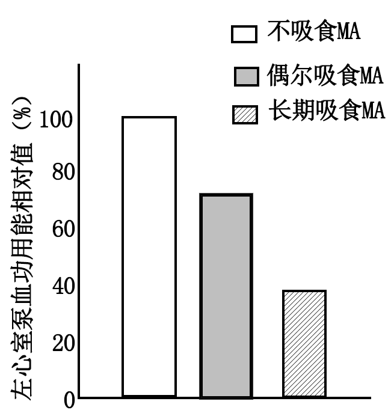
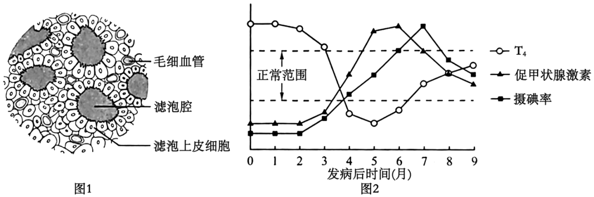
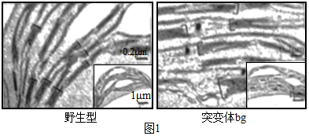
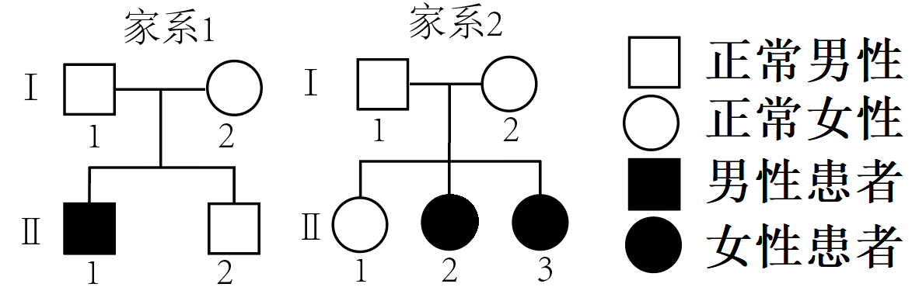

**机密★本科目考试启用前**

**北京市2025年普通高中学业水平等级性考试**

**生物**

**本试卷共10页，100分。考试时长90分钟。考生务必将答案答在答题卡上，在试卷上作答无效。考试结束后，将本试卷和答题卡一并交回。**

**第一部分**

**本部分共15题，每题2分，共30分。在每题列出的四个选项中，选出最符合题目要求的一项。**

1\. 2025年，国家持续推进“体重管理年”行动。为践行“健康饮食、科学运动”，应持有的正确认识是（ ）

A. 饮食中元素种类越多所含能量越高

B. 饮食中用糖代替脂肪即可控制体重

C. 无氧运动比有氧运动更有利于控制体重

D. 在生活中既要均衡饮食又要适量运动

【答案】D

【解析】

【分析】“健康饮食、科学运动” 是保持身体健康和合理体重的重要方式。健康饮食强调营养均衡，包含各种营养素；科学运动则要根据个人情况选择合适的运动类型和强度。

【详解】A、饮食中的能量主要取决于有机物（糖类、脂肪、蛋白质）的含量，而非元素种类。例如，脂肪仅含C、H、O三种元素，但单位质量供能最高。元素种类多与能量无关，A错误；

B、糖类和脂肪均可供能，但脂肪储能更高。若用糖代替脂肪但总热量未减少，反而可能因糖分解快导致饥饿感增强，且过量糖会转化为脂肪储存，B错误；

C、无氧运动（如短跑）主要消耗糖原，而有氧运动（如慢跑）能持续分解脂肪供能，更利于减脂和控制体重，C错误；

D、均衡饮食保证营养全面，适量运动促进能量消耗，二者结合是科学控制体重的关键，D正确；

故选D。

2\. 下图是植物细胞局部亚显微结构示意图。在有氧呼吸过程中，细胞不同部位产生ATP的量不同。以下选项正确的是（ ）

|     |     |     |     |     |
|:--- |:--- |:--- |:--- |:--- |
| 选项  | 部位1 | 部位2 | 部位3 | 部位4 |
| A   | 大量  | 少量  | 少量  | 无   |
| B   | 大量  | 大量  | 少量  | 无   |
| C   | 少量  | 大量  | 无   | 少量  |
| D   | 少量  | 无   | 大量  | 大量  |

A. A B. B C. C D. D

【答案】C

【解析】

【分析】有氧呼吸过程分为3个阶段：

第一阶段：葡萄糖分解为丙酮酸和\[H\]，释放少量能量，场所：细胞质基质，

第二阶段：丙酮酸和H2O彻底分解为CO2和\[H\]，释放少量能量，场所：线粒体基质，

第三阶段：\[H\]和O2结合产生H2O，释放大量能量，场所：线粒体内膜。

【详解】部位1是线粒体基质，进行有氧呼吸第二阶段的反应，产生少量ATP，部位2是线粒体内膜，进行有氧呼吸第三阶段的反应，可以产生大量ATP，部位3是线粒体外膜，没有ATP生成，部位4是细胞质基质，可以进行有氧呼吸第一阶段的反应，产生少量ATP，C正确。

故选C。

3\. 某种加酶洗衣粉包装袋上注有下列信息：本品含有蛋白酶、脂肪酶和淀粉酶；洗涤前先浸泡15～20min，特别脏的衣物可减少浸泡用水量；请勿使用60℃以上热水。下列叙述错误的是（ ）

A. 该洗衣粉含多种酶，不适合洗涤纯棉衣物

B. 洗涤前浸泡有利于酶与污渍结合催化其分解

C. 减少浸泡衣物的用水量可提高酶的浓度

D. 水温过高导致酶活性下降

【答案】A

【解析】

【分析】酶是由活细胞产生的具有催化作用的有机物，大多数酶是蛋白质，少数酶是RNA；酶的特性：专一性、高效性、作用条件温和；酶促反应的原理：酶能降低化学反应所需的活化能。

【详解】A、酶具有专一性，纯棉衣物的主要成分是纤维素，而该洗衣粉含有的酶为蛋白酶、脂肪酶和淀粉酶，均无法分解纤维素，故不会损坏纯棉衣物，A错误；

B、洗涤前浸泡可延长酶与污渍的接触时间，提高催化效率，B正确；

C、一定范围内，减少用水量会提高酶的浓度，从而加快反应速率，C正确；

D、酶活性的发挥需要适宜温度，高温会破坏其空间结构导致酶活性下降，故勿使用60℃以上热水，D正确。

故选A。

4\. 科学家对线虫进行诱变，发现C3基因功能缺失突变体中本应凋亡的细胞存活，C9基因功能缺失突变体中本不应凋亡的细胞发生凋亡。下列叙述错误的是（ ）

A. C3基因促进细胞凋亡 B. C9基因抑制细胞凋亡

C. 细胞凋亡不利于线虫发育 D. 细胞凋亡受基因的调控

【答案】C

【解析】

【分析】细胞凋亡是由基因所决定的细胞自动结束生命的过程；在成熟的生物体中，细胞的自然更新、被病原体感染的细胞的清除，也是通过细胞凋亡完成的；细胞凋亡对于多细胞生物体完成正常发育，维持内部环境的稳定，以及抵御外界各种因素的干扰都起着非常关键的作用。

【详解】A、C3基因功能缺失导致本应凋亡的细胞存活，说明正常C3基因促进细胞凋亡，A正确；

B、C9基因功能缺失导致本不应凋亡的细胞凋亡，说明正常C9基因抑制细胞凋亡，B正确；

C、细胞凋亡是生物体正常发育的基础，例如清除多余或受损细胞，若凋亡被抑制会导致发育异常，因此细胞凋亡对线虫发育有利，C错误；

D、细胞凋亡是由基因控制的程序性死亡，受基因调控，D正确；

故选C。

5\. 1958年，Meselson和Stahl通过15N标记DNA的实验，证明了DNA的半保留复制。关于这一经典实验的叙述正确的是（ ）

A. 因为15N有放射性，所以能够区分DNA的母链和子链

B. 得到的DNA带的位置有三个，证明了DNA的半保留复制

C. 将DNA变成单链后再进行离心也能得到相同的实验结果

D. 选择大肠杆菌作为实验材料是因为它有环状质粒DNA

【答案】B

【解析】

【分析】DNA复制是以亲代DNA分子为模板合成子代DNA分子的过程。DNA复制条件：模板（DNA的双链）、能量（ATP水解提供）、酶（解旋酶和聚合酶等）、原料（游离的脱氧核苷酸）；DNA复制过程：边解旋边复制；DNA复制特点：半保留复制。

【详解】A 、15N没有放射性，它与14N只是氮元素的不同同位素，质量不同，可通过密度梯度离心技术区分含不同氮元素的DNA，进而区分DNA的母链和子链，A错误；

B、在15N标记 DNA 的实验中，得到的 DNA 带的位置有轻带（两条链都含14N）、中带（一条链含14N，一条链含15N）、重带（两条链都含15N）三个。根据不同代 DNA 在离心后出现的这些带的位置和比例，证明了 DNA 的半保留复制，B正确；

C、若将DNA解链为单链后离心，无论是全保留还是半保留复制，都是只有两条条带，不能证明DNA的半保留复制，C错误；

D、选择大肠杆菌作为实验材料是因为大肠杆菌繁殖快，容易培养，能在短时间内获得大量的子代，便于观察实验结果，而不是因为它有环状质粒DNA，D错误。

故选B。

6\. 用于啤酒生产的酿酒酵母是真核生物，其生活史如图。

下列叙述错误的是（ ）

A. 子囊孢子都是单倍体

B. 营养细胞均无同源染色体

C. 芽殖过程中不发生染色体数目减半

D. 酿酒酵母可进行有丝分裂，也可进行减数分裂

【答案】B

【解析】

【分析】1、减数分裂中染色体数目变化：减数分裂是进行有性生殖的生物，在产生成熟生殖细胞时进行的染色体数目减半的细胞分裂。减数分裂中染色体数目的变化规律是：2n（减数第一次分裂）→n（减数第二次分裂前期、中期）→2n（减数第二次分裂后期）→n（减数第二次分裂结束）。

2、有丝分裂中染色体数目变化规律：2n（分裂间期）→2n（前期、中期）→（2n→4n）（后期）→2n（末期有丝分裂结束）。

【详解】A、子囊孢子是酿酒酵母在减数分裂后形成的孢子，减数分裂的结果是产生单倍体的细胞，因此子囊孢子是单倍体，A正确；

B、酿酒酵母的生活史包括单倍体(n)和二倍体(2n)阶段，单倍体营养细胞无同源染色体，二倍体营养细胞（由细胞核融合形成）有同源染色体，B错误；

C、芽殖是酿酒酵母的无性繁殖方式，属于有丝分裂，有丝分裂过程中染色体数目不变，C正确；

D、酿酒酵母的生活史包括无性繁殖（芽殖，属于有丝分裂）和有性繁殖（减数分裂形成子囊孢子），D正确。

故选B。

7\. 抗维生素D佝偻病是一种伴X染色体显性遗传病。正常女子与男患者所生子女患该病的概率是（ ）

A. 男孩100% B. 女孩100% C. 男孩50% D. 女孩50%

【答案】B

【解析】

【分析】抗维生素D佝偻病为伴X染色体显性遗传病，正常女子（XdXd）与男患者（XDY）婚配时，需分析子代的基因型及表型。

【详解】AC、男孩的X染色体只能来自母亲（Xd），Y染色体来自父亲，基因型为XdY，因不携带显性致病基因D，故男孩均正常，AC错误；

BD、女儿的X染色体分别来自父母，基因型为XDXd，因显性致病基因D存在，所有女儿均患病，B正确，D错误。

故选B。

8\. 蝴蝶幼虫取食植物叶片，萝藦类植物进化出产生CA的能力，CA抑制动物细胞膜上N酶的活性，对动物产生毒性，从而阻止大部分蝴蝶幼虫取食。斑蝶类蝴蝶因N酶发生了一个氨基酸替换而对CA不敏感，其幼虫可以取食萝藦。下列叙述错误的是（ ）

A. 斑蝶类蝴蝶对CA的适应主要源自基因突变和选择

B. 斑蝶类蝴蝶取食萝藦可减少与其他蝴蝶竞争食物

C. N酶基因突变导致斑蝶类蝴蝶与其他蝴蝶发生生殖隔离

D. 萝藦类植物和斑蝶类蝴蝶的进化是一个协同进化的实例

【答案】C

【解析】

【详解】不同物种之间、生物与无机环境之间在相互影响中不断进化和发展，这就是协同进化。通过漫长的协同进化过程，地球上不仅出现了千姿百态的物种，丰富多彩的基因库，而且形成了多种多样的生态系统。

【分析】A、斑蝶类蝴蝶的N酶发生氨基酸替换属于基因突变，自然选择保留有利变异，使其适应CA环境，A正确；

B、斑蝶取食萝藦后占据不同生态位，减少与其他蝴蝶的食物资源竞争，符合生态位分化原理，B正确；

C、生殖隔离需物种间无法交配或后代不育，仅N酶基因突变未直接导致生殖隔离，C错误；

D、萝藦与斑蝶相互影响、共同进化，体现协同进化，D正确。

故选**C**。

9\. 油菜素内酯可促进Z蛋白进入细胞核调节基因表达，进而促进下胚轴生长。用生长素分别处理野生型和Z基因功能缺失突变体的拟南芥幼苗，结果如图。综合以上信息，不能得出的是（ ）

A. Z蛋白是油菜素内酯信号途径的组成成分

B. 生长素和油菜素内酯都能调控下胚轴生长

C. 生长素促进下胚轴生长依赖于Z蛋白

D. 油菜素内酯促进下胚轴生长依赖于生长素

【答案】D

【解析】

【分析】在植物个体生长发育和适应环境的过程中，各种植物激素不是孤立地起作用，而是相互协调、共同调节，植物激素的合成受基因的控制，也对基因的程序性表达具有调节作用。植物的生命活动由基因表达调控、激素调节和环境因素调节共同完成。

【详解】A、根据题干信息：“油菜素内酯可促进Z蛋白进入细胞核调节基因表达”，说明Z蛋白参与了油菜素内酯的信号传导，A正确；

B、图示显示生长素处理能促进野生型下胚轴生长（说明生长素调控生长），题干也提到油菜素内酯促进下胚轴生长，因此两者都能调控生长，B正确；

C、图示显示生长素处理野生型（有Z蛋白）能促进生长，但在Z基因功能缺失突变体中生长素不能促进生长，说明生长素的作用需要Z蛋白，C正确；

D、题目和图示并未提供任何信息表明油菜素内酯的作用需要生长素参与（例如没有实验证明阻断生长素后油菜素内酯是否失效），D错误。

故选D。

10\. 外科医生给足外伤患者缝合伤口时，先在伤口附近注射局部麻醉约，以减轻患者疼痛。局部麻醉药的作用原理是（ ）

A. 降低伤口处效应器的功能

B. 降低脊髓中枢的反射能力

C. 阻断相关传出神经纤维的传导

D. 阻断相关传入神经纤维的传导

【答案】D

【解析】

【分析】局部麻醉药通过阻断神经冲动的传导来抑制痛觉的产生。

【详解】A、效应器由传出神经末梢及其支配的肌肉或腺体构成，麻醉药作用于伤口附近，并非直接降低效应器功能，A错误；

B、脊髓中枢的反射能力涉及完整的反射弧，而局部麻醉药并未作用于脊髓中枢，B错误；

C、传出神经负责将中枢信号传递至效应器，但疼痛信号的传递依赖传入神经，阻断传出神经不会影响痛觉的产生，C错误；

D、传入神经负责将痛觉信号从感受器传递至中枢神经系统，局部麻醉药通过阻断传入神经纤维的传导，使痛觉信号无法传递到大脑，从而减轻疼痛，D正确。

故选D。

11\. 为了解甲基苯丙胺（MA，俗称冰毒）对心脏功能的影响，研究者比较了吸食与不吸食MA人群左心室的泵血能力，结果如图。下列叙述正确的是（ ）

A. 滥用MA会导致左心室收缩能力下降

B. 左心室功能的显著下降导致吸食MA成瘾

C. MA可以阻断神经对心脏活动的调节

D. MA通过破坏血管影响左心室泵血功能

【答案】A

【解析】

【分析】兴奋在神经元之间需要通过突触结构进行传递，突触包括突触前膜、突触间隙、突触后膜，其具体的传递过程为：兴奋以电信号的形式传导到轴突末梢时，突触小泡释放神经递质（化学信号），神经递质作用于突触后膜，引起突触后膜产生膜电位（电信号），从而将兴奋传递到下一个神经元。

【详解】A、题目提到研究者比较了左心室泵血能力，并给出了结果图，实验结果表明滥用MA会导致左心室收缩能力下降，A正确；

B、心脏功能下降是MA滥用的后果，而非成瘾的原因，B错误；

C、MA并没有阻断神经对心脏的调节，心脏依旧在行使功能，C错误；

D、本题的实验结果无法推测MA通过破坏血管影响左心室泵血功能，D错误。

故选A。

12\. 塞罕坝曾森林茂密，后来由于人类活动破坏而逐渐变成荒原。上世纪60年代以来，林业工人不断努力，种植了华北落叶松等多种树木，如今已将森林覆盖率提高到75%以上，成为人类改善自然环境的典范。下列叙述错误的是（ ）

A. 塞罕坝造林经验可推广到各类荒原的治理，以提高森林覆盖率

B. 植树造林时要尽量种植多种树木，以利于提高生态系统稳定性

C. 塞罕坝的变化说明，人类活动可以影响群落演替的进程和方向

D. 与上世纪60年代相比，现在塞罕坝生态系统的固碳量大幅增加

【答案】A

【解析】

【分析】生态系统的稳定性是生态系统所具有的保持或恢复自身结构和功能相对稳定的能力，原因：生态系统具有一定的自我调节能力；调节基础：负反馈调节。群落是一个动态系统，是不断发展变化的；随着时间的推移一个群落被另一个群落代替的过程称为群落演替；人类活动往往会使群落演替按照不同于自然演替的速度和方向进行。

【详解】A、不同荒原的环境条件（如气候、土壤等）差异较大，塞罕坝的造林经验基于当地特定条件，不能直接推广到所有类型的荒原治理，A错误；

B、增加物种多样性可提高生态系统的抵抗力稳定性，种植多种树木符合这一原理，B正确；

C、人类活动（如植树造林）能改变群落演替的速度和方向，塞罕坝的恢复是典型实例，C正确；

D、森林覆盖率的提高意味着生产者（如华北落叶松）数量增加，光合作用固定CO₂的能力增强，生态系统的总固碳量必然增加，D正确；

故选A。

13\. 近年来，北京建设了许多大型湿地公园，对于生态环境的改善产生了积极作用。以下关于湿地公园生态功能的叙述错误的是（ ）

A. 调蓄洪水，减缓水旱灾害 B. 改变温带季风气候

C. 自然净化污水 D. 为野生动物提供栖息地

【答案】B

【解析】

【详解】湿地是地球上具有多种独特功能的生态系统，它不仅为人类提供大量食物、原料和水资源，而且在维持生态平衡、保持生物多样性和珍稀物种资源以及涵养水源、蓄洪防旱、降解污染、调节气候、补充地下水、控制土壤侵蚀等方面均起到重要作用。。

【分析】A、湿地能蓄存大量水分，调节区域水量，有效减缓洪水和干旱，A正确；

B、湿地公园的面积相对整个地区的气候影响范围较小，不能改变温带季风气候这种大尺度的气候类型，只能在局部小范围对气候起到一定的调节作用，如增加空气湿度等，B错误；

C、湿地通过物理沉降、微生物分解等作用净化污染物，C正确；

D、湿地为鸟类、鱼类等提供生存和繁殖场所，D正确；

故选B。

14\. 动物细胞培养基一般呈淡红色。某次实验时，调控pH的CO2耗尽，培养基转为黄色。由此推断使培养基呈淡红色的是（ ）

A. 必需氨基酸 B. 抗生素

C. 酸碱指示剂 D. 血清

【答案】C

【解析】

【分析】培养基颜色变化与pH相关，CO₂耗尽导致pH下降，指示剂显黄色。

【详解】A、必需氨基酸是细胞生长的营养成分，不参与指示pH变化，A错误；

B、抗生素用于抑制微生物污染，与培养基颜色无关，B错误；

C、酸碱指示剂（如酚红）在培养基中用于显示pH变化，中性/弱碱性时呈淡红色，酸性时变黄，C正确；

D、血清提供生长因子，不直接导致颜色变化，D错误。

故选C。

15\. “探究植物细胞的吸水和失水”实验中，在清水和0.3g/mL蔗糖溶液中处于稳定状态的细胞如图。以下叙述错误的是（ ）

A. 图1，水分子通过渗透作用进出细胞

B. 图1，细胞壁限制过多的水进入细胞

C. 图2，细胞失去的水分子是自由水

D. 与图1相比，图2中细胞液浓度小

【答案】D

【解析】

【分析】质壁分离的原理：当细胞液的浓度小于外界溶液的浓度时，细胞就会通过渗透作用而失水，细胞液中的水分就透过原生质层进入到溶液中，使细胞壁和原生质层都出现一定程度的收缩。由于原生质层比细胞壁的收缩性大，当细胞不断失水时，原生质层就会与细胞壁分离。

【详解】A、图1中，水分子通过渗透作用进出细胞，A正确；

B、细胞壁有保护和支撑的作用，所以限制过多的水进入细胞，维持细胞形态，B正确；

C、图2，细胞发生质壁分离，此时失去的水分子是自由水，C正确；

D、与图1相比，图2中细胞发生质壁分离，此时细胞失去了水，所以图2细胞液浓度更大，D错误。

故选D。

**第二部分**

**本部分共6题，共70分。**

16\. 某同学因颈前部疼痛，伴有发热、心慌、多汗而就医。医生发现其甲状腺有触痛，血液中甲状腺激素T4水平升高，诊断为亚急性甲状腺炎。该同学查阅有关资料，了解到甲状腺由许多滤泡构成，每个滤泡由一层滤泡上皮细胞围成（图1），T4在滤泡腔中合成并储存；发病之初，甲状腺滤泡上皮细胞受损；多数患者发病后，甲状腺摄碘率和血液中相关激素水平的变化如图2。

（1）在人体各系统中，甲状腺属于\_\_\_\_\_\_\_系统。

（2）在滤泡上皮细胞内的碘浓度远高于组织液的情况下，细胞依然能摄取碘，这种吸收方式是\_\_\_\_\_\_\_。

（3）发病后的2个月内，血液中T4水平高于正常的原因是：甲状腺滤泡上皮细胞受损导致\_\_\_\_\_\_\_。

（4）发病7个月时，该同学复查结果显示：T4水平恢复正常，但摄碘率高于正常。家长担心摄碘率会居高不下。请根据T4分泌的调节过程向家长做出解释以打消其顾虑\_\_\_\_\_\_\_。

（5）发病8个月后，T4会在正常范围内上下波动，表明甲状腺功能恢复正常。由此推测，甲状腺中的\_\_\_\_\_\_\_结构已恢复完整。

【答案】（1）内分泌 （2）主动运输

（3）滤泡腔内储存的T4释放进入血液

（4）当血液中T4水平恢复正常后，会通过负反馈调节抑制下丘脑和垂体分泌相关激素，使甲状腺的摄碘率逐渐下降，不会居高不下 （5）滤泡上皮细胞

【解析】

【分析】1、甲状腺激素的作用：促进新陈代谢，促进物质的氧化分解，促进生长发育，提高神经系统的兴奋性；促进神经系统的发育。

2、激素的作用具有特异性，它有选择性地作用于靶器官、靶腺体或靶细胞。

【小问1详解】

人体的内分泌系统由内分泌腺和内分泌细胞组成，甲状腺作为人体重要的内分泌腺，能够分泌甲状腺激素等，参与调节人体的新陈代谢、生长发育等生理过程，所以在人体各系统中，甲状腺属于内分泌系统。 

【小问2详解】

物质从低浓度一侧运输到高浓度一侧，需要载体蛋白的协助，同时还需要消耗能量，这种方式叫做主动运输。在滤泡上皮细胞内的碘浓度远高于组织液的情况下，细胞依然能摄取碘，说明是逆浓度梯度运输，这种吸收方式是主动运输。 

【小问3详解】

已知T4在滤泡腔中合成并储存，发病之初，甲状腺滤泡上皮细胞受损。当甲状腺滤泡上皮细胞受损时，滤泡腔中储存的T4会释放到血液中，从而导致发病后的2个月内，血液中T4水平高于正常。 

【小问4详解】

T4分泌的调节过程是一个负反馈调节，当血液中T4水平恢复正常后，会通过负反馈调节抑制下丘脑分泌促甲状腺激素释放激素（TRH）和垂体分泌促甲状腺激素（TSH），TSH能促进甲状腺摄取碘等功能，当TSH分泌受到抑制，其含量下降，会使甲状腺的摄碘率逐渐下降，不会居高不下，所以家长不必担心摄碘率会居高不下。 

【小问5详解】

因为T4在滤泡腔中合成并储存，发病8个月后，T4会在正常范围内上下波动，表明甲状腺能正常合成和储存T4，由此推测，甲状腺中的滤泡上皮细胞结构已恢复完整。 

17\. 链霉菌A能产生一种抗生素M，可用于防治植物病害，但产量很低。为提高M的产量，科研人员用紫外线和亚硝酸对野生型链霉菌A的孢子悬液进行诱变处理，筛选M产量提高的突变体（M+株），以应用于农业生产。

（1）紫外线和亚硝酸均通过改变DNA的\_\_\_\_\_\_\_，诱发基因突变。

（2）因基因突变频率低，孢子悬液中突变体占比很低；又因基因突变的\_\_\_\_\_\_\_性，M+株在全部突变体中的占比低。要获得M+株，需进行筛选。

（3）链霉菌A主要进行孢子繁殖。研究者对链霉菌A发酵液进行了粗提浓缩，得到粗提液，测定粗提液对野生型链霉菌A孢子萌发的影响，结果如图。

由图可知，粗提液对野生型孢子萌发有\_\_\_\_\_\_\_作用。

（4）随后研究者进行筛选实验。诱变处理后，将适量孢子悬液涂布在含有不同浓度粗提液的筛选平板上，每个浓度的筛选平板设若干个重复，28℃培养7天。从每个浓度的筛选平板上挑取100个单菌落，再次分别培养后逐一测定M产量，统计结果如下表。

|                          |     |     |     |     |     |     |
|:------------------------ |:--- |:--- |:--- |:--- |:--- |:--- |
| 组别                       | I   | II  | III | IV  | V   | VI  |
| 筛选平板中粗提液浓度（mL/100mL）     | 2   | 5   | 8   | 10  | 12  | 15  |
| 所取菌落中M+株占比（%） | 0   | 13  | 25  | 65  | 20  | 3   |

①用图中信息，解释表中IV组M+株占比明显高于Ⅲ组的原因\_\_\_\_\_\_\_。

②表中Ⅲ组和V组中M+株占比接近，但在筛选平板上形成的菌落有差异。下列叙述正确的有\_\_\_\_\_\_\_（多选）。

A．Ⅲ组中有野生型菌落，而V组中没有野生型菌落

B．V组中有M产量未提高的突变体菌落，而III组中没有

C．与Ⅲ组相比，诱变处理后的孢子悬液中更多的突变体在V组中被抑制

D．与Ⅲ组相比，诱变处理后的孢子悬液中更多的M+株在V组中被抑制

综上所述，用粗提液筛选是获得M+株的有效方法。

【答案】（1）碱基序列（或脱氧核苷酸序列）

（2）不定向 （3）抑制

（4） ①. IV 组粗提液浓度高于 Ⅲ 组，更多的野生型孢子萌发受抑制，M+株相对更容易存活； ②. CD

【解析】

【分析】基因突变的原因主要有以下两类： 外因： 物理因素：如紫外线、X 射线及其他辐射，这些射线能损伤细胞内的 DNA，改变其碱基序列引发突变。 化学因素：像亚硝酸、碱基类似物等，可改变核酸的碱基，从而导致基因突变。 生物因素：某些病毒的遗传物质能影响宿主细胞的 DNA，引发突变。 内因：DNA 复制过程中，偶尔会发生碱基对的增添、缺失或替换，导致基因结构改变，引发基因突变 。

【小问1详解】

紫外线和亚硝酸均通过改变 DNA 的碱基序列（或脱氧核苷酸序列），诱发基因突变。因为基因突变是指 DNA 分子中发生碱基对的替换、增添和缺失，而这些处理会影响 DNA 的碱基组成和排列顺序。

【小问2详解】

因基因突变频率低，孢子悬液中突变体占比很低；又因基因突变的不定向性，M＋株在全部突变体中的占比低。要获得 M＋株，需进行筛选。基因突变具有不定向性，即一个基因可以向不同的方向发生突变，产生一个以上的等位基因，所以即使发生了基因突变，也不一定是我们想要的 M＋株。

【小问3详解】

由图可知，随着培养基中粗提液浓度的升高，野生型孢子萌发率下降，所以粗提液对野生型孢子萌发有抑制作用。

【小问4详解】

①IV 组粗提液浓度高于 Ⅲ 组，结合前面得出的粗提液对孢子萌发有抑制作用，且M＋株可能对粗提液有更强的耐受性，所以在较高浓度的粗提液下，更多的野生型孢子萌发受抑制，而 M＋株相对更容易存活，导致 IV 组 M＋株占比明显高于 Ⅲ 组。

②A、V 组中也可能有野生型菌落，只是可能由于粗提液浓度更高，其生长受到了更强的抑制，A 错误；

B、Ⅲ 组和 V 组中都可能有 M 产量未提高的突变体菌落，B 错误；

C、V 组粗提液浓度高于 Ⅲ 组，与 Ⅲ 组相比，所取菌落中M+株占比也降低，诱变处理后的孢子悬液中更多的突变体（包括非M＋株的突变体）在 V 组中被抑制，C 正确；

D、从结果看，V 组M＋ 株占比低，是因为更多的 M＋ 株在 V 组中被抑制，D 正确。

故选CD。

18\. 植物的光合作用效率与叶绿体的发育（形态结构建成）密切相关。叶绿体发育受基因的精细调控，以适应环境。科学家对光响应基因BG在此过程中的作用进行了研究。

（1）实验中发现一株叶绿素含量升高的拟南芥突变体。经鉴定，其BG基因功能缺失，命名为bg。图1是使用\_\_\_\_\_\_\_\_\_观察到的叶绿体亚显微结构。与野生型相比，可见突变体基粒（“\[”所示）中的\_\_\_\_\_\_\_\_\_增多。

（2）已知GK蛋白促进叶绿体发育相关基因的转录，BG蛋白可以与GK蛋白结合。研究者构建了GK功能缺失突变体gk（叶绿素含量降低）及双突变体bggk。对三种突变体进行观察，发现双突变体的表型与突变体\_\_\_\_\_\_\_\_\_\_相同，由此推测BG通过抑制GK的功能影响叶绿体发育。

（3）为进一步证明BG对GK的抑制作用并探索其作用机制，将一定浓度的GK蛋白与系列浓度BG蛋白混合后，再加入GK蛋白靶基因CAO的启动子DNA片段，反应一段时间后，经电泳检测DNA所在位置，结果如图2。分析实验结果可得出BG抑制GK功能的机制是\_\_\_\_\_\_\_\_\_\_\_。

（4）基于突变体bg的表型，从进化与适应的角度推测光响应基因BG存在的意义\_\_\_\_\_\_\_。

【答案】（1） ①. 电子显微镜 ②. 类囊体

（2）gk （3）BG 通过与 CAO 启动子 DNA 片段竞争结合 GK 蛋白，从而抑制 GK 与 CAO 启动子 DNA 片段的结合

（4）使植物能够更好地响应光信号，调节自身生理过程，以适应不同光照环境，提高生存和繁殖能力

【解析】

【分析】叶绿体是进行光合作用的场所，叶绿体是双层膜结构，其内部含有基粒，基粒是类囊体堆叠而成，类囊体膜上含有光合作用有关的色素和酶。

【小问1详解】

观察叶绿体亚显微结构需要使用电子显微镜。因为光学显微镜的分辨率有限，无法观察到叶绿体内部的精细结构，而电子显微镜能够提供更高的分辨率，从而清晰地看到叶绿体的亚显微结构。基粒是由类囊体堆叠而成的结构。与野生型相比，突变体叶绿素含量升高，且 BG 基因功能缺失，观察可知突变体基粒中的类囊体（片层）增多。因为叶绿素主要分布在类囊体薄膜上，类囊体增多可能是导致叶绿素含量升高的原因之一。

【小问2详解】

已知 GK 蛋白促进叶绿体发育相关基因的转录，BG 蛋白可以与 GK 蛋白结合。GK 功能缺失突变体 gk 叶绿素含量降低，若 BG 通过抑制 GK 的功能影响叶绿体发育，那么双突变体 bggk 中，由于 GK 本身功能缺失，BG 也无法发挥抑制 GK 的作用，此时双突变体的表型应该与 gk 突变体相同。

【小问3详解】

观察图 2 可知，随着 BG 蛋白与 GK 蛋白浓度比的增大，与 GK 蛋白结合的 DNA 片段逐渐减少，游离 DNA 片段逐渐增多。 这表明 BG 蛋白的存在阻碍了 GK 蛋白与 CAO 启动子 DNA 片段的结合 。因为 GK 蛋白要发挥功能，需要与靶基因 CAO 的启动子 DNA 片段结合来调控基因表达，而 BG 蛋白浓度越高，这种结合就越少。所以，BG 抑制 GK 功能的机制是 BG 通过与 CAO 启动子 DNA 片段竞争结合 GK 蛋白，从而抑制 GK 与 CAO 启动子 DNA 片段的结合。

【小问4详解】

从进化与适应的角度来看，生物体内的基因存在必然是对生物的生存和繁衍有积极意义的。突变体 bg 由于缺乏光响应基因 BG，其表型可能在某些环境条件下不利于生存。而正常存在光响应基因 BG 时，植物可以通过 BG 对光信号做出响应，从而更好地调节自身的生理过程，例如，在光照过强时，BG 基因表达产物可能通过抑制 GK 功能，调节相关基因表达，避免植物因光照过强而受到伤害；在光照较弱时，可能通过调节使植物更好地利用有限的光能进行光合作用等。这使得植物在不同的光照环境中能够更有效地进行光合作用，获取能量，提高自身的生存和繁殖能力，以适应复杂多变的环境。

19\. 食物过敏在人群中常见、多发，会反复发生，且可能逐渐加重。卵清蛋白（OVA）作为过敏原可激发机体产生特异性抗体（OVA-Ab），引发过敏反应。研究者将野生型小鼠（供体）的脾细胞转移给缺失T、B淋巴细胞的免疫缺陷小鼠（受体），通过系列实验，探究OVA引起过敏反应的机制。

（1）脾脏是\_\_\_\_\_\_\_细胞集中分布和特异性免疫发生的场所。

（2）用混有免疫增强剂的OVA给供体鼠灌胃，B细胞受刺激后活化、分裂并\_\_\_\_\_\_\_。3个月后，通过静脉注射将供体鼠的脾细胞转移给受体鼠，然后仅用OVA对受体鼠进行灌胃，数天后，检测受体鼠血清中的OVA-Ab水平（图中Ⅰ组）。IV组供体鼠不经灌胃处理，其他处理同Ⅰ组。比较Ⅰ、Ⅳ组结果可知，只用OVA不能引起初次免疫，Ⅰ组受体鼠产生的OVA-Ab是\_\_\_\_\_\_\_免疫的结果。

（3）如图所示，脾细胞转移后，II组受体鼠未进行OVA灌胃，III组供体鼠在脾细胞转移前已清除了辅助性T细胞，其他处理同1组。在脾细胞转移前，各组供体鼠均检测不到OVA特异的浆细胞和OVA-Ab。分析各组结果，在Ⅰ组受体鼠快速产生大量OVA-Ab的过程中，三种免疫细胞的关系是\_\_\_\_\_\_\_。

（4）某些个体发生食物过敏后，即使很多年没有接触过敏原，再次接触时仍会很快发生过敏。结合文中信息可知，导致长时间后过敏反应复发的关键细胞及其特点是\_\_\_\_\_\_\_。

【答案】（1）淋巴 （2） ①. 分化为浆细胞和记忆B细胞 ②. 二次

（3）辅助性T细胞识别抗原并分泌细胞因子，B细胞增殖分化为浆细胞，浆细胞分泌OVA-Ab

（4）记忆B细胞；记忆B细胞可以在抗原消失后 存活几年甚至几十年，当再接触这种抗原时，能迅速增殖 分化分新的记忆B细胞和浆细胞，浆细胞会快速产生大量抗体

【解析】

【分析】过敏反应：指已免疫的机体在再次接受相同物质的刺激时所发生的反应。引起过敏反应的物质叫做过敏原。如花粉、油漆、鱼虾等海鲜、青霉素、磺胺类药物等（因人而异）。

【小问1详解】

脾脏属于免疫器官，呈椭圆形，在胃的左侧，内含大量淋巴细胞，即脾脏是淋巴细胞集中分布和特异性免疫发生的场所。

【小问2详解】

体液免疫过程，B细胞受刺激后活化、分裂并分化为浆细胞和记忆B细胞，其中浆细胞可产生抗体；分析题图可知，Ⅰ组受体鼠的OVA-Ab水平高，且比较Ⅰ、Ⅳ组结果可知，只用OVA不能引起初次免疫，故Ⅰ组受体鼠产生的OVA-Ab是由于体内已存在针对OVA的记忆B细胞（由供体鼠转移而来），再次接触OVA时发生快速二次免疫应答。

【小问3详解】

分析题意，脾细胞转移后，II组受体鼠未进行OVA灌胃，III组供体鼠在脾细胞转移前已清除了辅助性T细胞，其他处理同1组，据图可知，清除辅助性T细胞的Ⅲ组OVA-Ab水平极低（对比Ⅰ组），说明辅助性T细胞对B细胞活化不可或缺，而抗体是由浆细胞分泌的，故据此推测，三种免疫细胞的关系 是：辅助性T细胞识别抗原并分泌细胞因子，B细胞增殖分化为浆细胞，浆细胞分泌OVA-Ab。

【小问4详解】

过敏反应是指已免疫的机体在再次接受相同物质的刺激时所发生的反应，某些个体发生食物过敏后，即使很多年没有接触过敏原，再次接触时仍会很快发生过敏，导致长时间后过敏反应复发的关键细胞是记忆B细胞，其特点是记忆细胞可以在抗原消失后 存活几年甚至几十年，当再接触这种抗原时，能迅速增殖分化分新的记忆B细胞和浆细胞，浆细胞能快速产生大量抗体，这些抗体吸附在皮肤等位置，当相同过敏原再次进入机体后，就会与吸附在细胞表面的抗体结合，使这些细胞释放出组胺等物质，引发过敏反应。

20\. Usher综合征（USH）是一种听力和视力受损的常染色体隐性遗传病，分为α型、β型和γ型。已经发现至少有10个不同基因的突变都可分别导致USH。在小鼠中也存在相同情况。

（1）两个由单基因突变引起的α型USH的家系如图。

①家系1的II-2是携带者的概率为\_\_\_\_\_\_\_。

②家系1的II-1与家系2的II-2之间婚配，所生子女均正常，原因是\_\_\_\_\_\_。

（2）基因间的相互作用会使表型复杂化。例如，小鼠在单基因G或R突变的情况下，gg表现为α型，rr表现为γ型，而双突变体小鼠ggrr表现为α型。表型正常的GgRr小鼠间杂交，F1表型及占比为：正常9/16、α型3/8、γ型1/16。F1的α型个体中杂合子的基因型有\_\_\_\_\_\_。

（3）r基因编码的RN蛋白比野生型R蛋白易于降解，导致USH。因此，抑制RN降解是治疗USH的一种思路。已知RN通过蛋白酶体降解，但抑制蛋白酶体的功能会导致细胞凋亡，因而用于治疗的药物需在增强RN稳定性的同时，不抑制蛋白酶体功能。红色荧光蛋白与某蛋白的融合蛋白以及绿色荧光蛋白与RN的融合蛋白都通过蛋白酶体降解，研究者制备了同时表达这两种融合蛋白的细胞，在不加入和加入某种药物时均分别测定两种荧光强度。如果该药物符合要求，则加药后的检测结果是\_\_\_\_\_\_\_。

（4）将野生型R基因连接到病毒载体上，再导入患者内耳或视网膜细胞，是治疗USH的另一种思路。为避免对患者的潜在伤害，保证治疗的安全性，用作载体的病毒必须满足一些条件。请写出其中两个条件并分别加以解释\_\_\_\_\_\_\_。

【答案】（1） ①. 2/3 ②. 家系 1 和家系 2 的 USH 是由不同基因突变引起的

（2）ggRr、Ggrr

（3）绿色荧光强度增强，红色荧光强度不变

（4）条件 1：病毒不能具有致病性。解释：如果病毒具有致病性，会对患者的健康造成额外的伤害，无法保证治疗的安全性。条件 2：病毒不能在宿主细胞内自主复制。解释：若病毒能自主复制，可能会在患者体内大量增殖，引发不可控的反应，对患者造成潜在伤害

【解析】

【分析】人类遗传病分为单基因遗传病、多基因遗传病和染色体异常遗传病：（1）单基因遗传病包括常染色体显性遗传病（如并指）、常染色体隐性遗传病（如白化病）、伴X染色体隐性遗传病（如血友病、色盲）、伴X染色体显性遗传病（如抗维生素D佝偻病）。

【小问1详解】

①已知 USH 是常染色体隐性遗传病，设控制该病的基因为a。家系 1 中 I - 1 和 I - 2 表现正常，生了一个患病的儿子 II - 1（基因型为aa），根据基因的分离定律，可知 I - 1 和 I - 2 的基因型均为Aa。II - 2 表现正常，其基因型可能为AA或Aa，AA的概率为1/3，Aa的概率为2/3，即家系 1 的 II - 2 是携带者（Aa）的概率为2/3。

②因为已经发现至少有 10 个不同基因的突变都可分别导致 USH，家系 1 和家系 2 的 USH 是由不同基因突变引起的。假设家系 1 是A基因发生突变导致的，家系 2 是B基因发生突变导致的（A、B为不同基因位点），家系 1 的 II - 1 基因型可能为aaBB，家系 2 的 II - 2 基因型可能为AAbb，他们之间婚配，后代基因型为AaBb，均表现正常。

【小问2详解】

已知小鼠单基因G或R突变的情况下，gg表现为α型，rr表现为γ型，双突变体小鼠ggrr表现为α型，表型正常的GgRr小鼠间杂交，F1表型及占比为：正常9/16、α型3/8、γ型1/16，说明F1中α型个体的基因型有ggRR、ggRr、ggrr、Ggrr。其中杂合子的基因型有ggRr、Ggrr。

【小问3详解】

因为红色荧光蛋白与某蛋白的融合蛋白以及绿色荧光蛋白与RN的融合蛋白都通过蛋白酶体降解，药物要求在增强RN稳定性的同时，不抑制蛋白酶体功能。那么加入药物后，绿色荧光蛋白与RN的融合蛋白降解减少，绿色荧光强度增强；而红色荧光蛋白与某蛋白的融合蛋白仍正常通过蛋白酶体降解，红色荧光强度不变。

【小问4详解】

用作载体的病毒满足的条件有：①病毒不能具有致病性，如果病毒具有致病性，会对患者的健康造成额外的伤害，无法保证治疗的安全性。 ②病毒不能在宿主细胞内自主复制，若病毒能自主复制，可能会在患者体内大量增殖，引发不可控的反应，对患者造成潜在伤害 。

21\. 学习以下材料，回答（1）~（4）题。

野生动物个体识别的新方法

识别野生动物个体有助于野外生态学的研究。近年，人们发现可以从动物粪便中提取该动物的DNA，PCR扩增特定的DNA片段，测定产物的长度或序列，据此可识别个体，在此基础上可以获得野生动物的多种生态学信息。

微卫星DNA是一种常用于个体识别的DNA片段，广泛分布于核基因组中。每个微卫星DNA是一段串联重复序列，每个重复单位长度为2~6bp（碱基对），重复数可以达到几十个（图1）．基因组中有很多个微卫星DNA，分布在不同位置。每个位置的微卫星DNA可视为一个“基因”，由于重复单位的数目不同，同一位置的微卫星“基因”可以有多个“等位基因”，能组成多种“基因型”．分析多个微卫星“基因”，可得到个体特异的“基因型”组合，由此区分开不同的个体。

依据微卫星“基因”两侧的旁邻序列（图1），设计并合成特异性引物，PCR扩增后，检测扩增片段长度，即可得知所测个体的“等位基因”（以片段长度命名），进而获得该个体的“基因型”。例如，图2是对某种哺乳动物个体A和B的一个微卫星“基因”进行扩增后电泳分析的结果示意图，个体A的“基因型”为177/183。

有一个远离大陆的孤岛，陆生哺乳动物几乎无法到达，人类活动将食肉动物貉带到该岛上。科学家在岛上采集貉的新鲜粪便，提取DNA，扩增并分析了10个微卫星“基因”，结果在30份样品中成功鉴定出个体（如表）。几个月后再次采集貉的新鲜粪便，进行同样的分析，在40份样品中成功鉴定出个体（如表）。据此，科学家估算出该岛上貉的种群数量。

两次采样所鉴定出的貉的个体编号

<table style="width:94%;">
<colgroup>
<col style="width: 6%" />
<col style="width: 6%" />
<col style="width: 6%" />
<col style="width: 6%" />
<col style="width: 6%" />
<col style="width: 6%" />
<col style="width: 6%" />
<col style="width: 6%" />
<col style="width: 6%" />
<col style="width: 6%" />
<col style="width: 6%" />
<col style="width: 6%" />
<col style="width: 6%" />
<col style="width: 6%" />
<col style="width: 6%" />
</colgroup>
<tbody>
<tr>
<td colspan="15" style="text-align: left;">第一次采集的30份粪便样品所对应的个体编号</td>
</tr>
<tr>
<td style="text-align: left;">N01</td>
<td style="text-align: left;">N02</td>
<td style="text-align: left;">N03</td>
<td style="text-align: left;">N04</td>
<td style="text-align: left;">N05</td>
<td style="text-align: left;">N06</td>
<td style="text-align: left;">N07</td>
<td style="text-align: left;">N08</td>
<td style="text-align: left;">N08</td>
<td style="text-align: left;">N09</td>
<td style="text-align: left;">N10</td>
<td style="text-align: left;">N11</td>
<td style="text-align: left;">N12</td>
<td style="text-align: left;">N12</td>
<td style="text-align: left;">N13</td>
</tr>
<tr>
<td style="text-align: left;">N14</td>
<td style="text-align: left;">N14</td>
<td style="text-align: left;">N15</td>
<td style="text-align: left;">N16</td>
<td style="text-align: left;">N17</td>
<td style="text-align: left;">N18</td>
<td style="text-align: left;">N18</td>
<td style="text-align: left;">N19</td>
<td style="text-align: left;">N20</td>
<td style="text-align: left;">N21</td>
<td style="text-align: left;">N22</td>
<td style="text-align: left;">N22</td>
<td style="text-align: left;">N23</td>
<td style="text-align: left;">N24</td>
<td style="text-align: left;">N24</td>
</tr>
<tr>
<td colspan="15" style="text-align: left;">第二次采集的40份粪便样品所对应的个体编号</td>
</tr>
<tr>
<td style="text-align: left;">N03</td>
<td style="text-align: left;">N04</td>
<td style="text-align: left;">N05</td>
<td style="text-align: left;">N08</td>
<td style="text-align: left;">N09</td>
<td style="text-align: left;">N09</td>
<td style="text-align: left;">N12</td>
<td style="text-align: left;">N14</td>
<td style="text-align: left;">N18</td>
<td style="text-align: left;">N23</td>
<td style="text-align: left;">N24</td>
<td style="text-align: left;">N25</td>
<td style="text-align: left;">N26</td>
<td style="text-align: left;">N26</td>
<td style="text-align: left;">N26</td>
</tr>
<tr>
<td style="text-align: left;">N27</td>
<td style="text-align: left;">N28</td>
<td style="text-align: left;">N29</td>
<td style="text-align: left;">N30</td>
<td style="text-align: left;">N30</td>
<td style="text-align: left;">N31</td>
<td style="text-align: left;">N32</td>
<td style="text-align: left;">N32</td>
<td style="text-align: left;">N33</td>
<td style="text-align: left;">N33</td>
<td style="text-align: left;">N33</td>
<td style="text-align: left;">N34</td>
<td style="text-align: left;">N35</td>
<td style="text-align: left;">N36</td>
<td style="text-align: left;">N37</td>
</tr>
<tr>
<td style="text-align: left;">N38</td>
<td style="text-align: left;">N39</td>
<td style="text-align: left;">N40</td>
<td style="text-align: left;">N41</td>
<td style="text-align: left;">N42</td>
<td style="text-align: left;">N43</td>
<td style="text-align: left;">N44</td>
<td style="text-align: left;">N44</td>
<td style="text-align: left;">N45</td>
<td style="text-align: left;">N46</td>
<td style="text-align: left;"></td>
<td style="text-align: left;"></td>
<td style="text-align: left;"></td>
<td style="text-align: left;"></td>
<td style="text-align: left;"></td>
</tr>
</tbody>
</table>

（1）图2中个体B的“基因型”为\_\_\_\_\_\_。

（2）使用微卫星DNA鉴定个体时，能区分的个体数是由微卫星“基因”的数目和\_\_\_\_\_\_的数目决定的。

（3）科学家根据表1信息，使用了\_\_\_\_\_\_法的原理来估算这个岛上貉的种群数量，计算过程及结果为\_\_\_\_\_\_。

（4）在上述研究基础上，利用现有DNA样品，设计一个实验方案，了解该岛貉种群的性别比例\_\_\_\_\_\_。

【答案】（1）174/174

（2）等位基因 （3） ①. 标记重捕 ②. 根据标记重捕法的计算公式N=（M×n）/m，则该岛上豹的种群数量N=(24×32)/10≈77（只）。

（4）从现有 DNA 样品中，选择 Y 染色体上特有的微卫星 DNA 序列，设计特异性引物；对所有 DNA 样品进行 PCR 扩增；对扩增产物进行电泳分析，若能扩增出相应条带，则该个体为雄性，若不能扩增出相应条带，则该个体为雌性；统计雄性和雌性个体的数量，从而计算出该岛豹种群的性别比例。

【解析】

【分析】标志重捕法是一种用于估算动物种群数量的常用方法。其原理是在被调查种群的活动范围内，捕获一部分个体，做上标记后再放回原来的环境，经过一段时间后进行重捕，根据重捕到的动物中标记个体数占总个体数的比例，来估计种群密度。标志重捕法适用于活动能力强、活动范围大的动物，使用时需要满足一定条件，比如标记个体与未标记个体在重捕时被捕获的概率相等，在调查期间没有个体迁入、迁出、出生、死亡等。

【小问1详解】

从图 2 中可知，个体 B 扩增后的电泳条带对应的片段只有长度为 174 ，根据 “以片段长度命名” 等位基因进而确定基因型的规则，个体 B 的 “基因型” 为 174/174。

【小问2详解】

根据题干信息 “每个位置的微卫星 DNA 可视为一个‘基因’，由于重复单位的数目不同，同一位置的微卫星‘基因’可以有多个‘等位基因’，能组成多种‘基因型’，分析多个微卫星‘基因’，可得到个体特异的‘基因型’组合，由此区分开不同的个体” 可知，使用微卫星 DNA 鉴定个体时，能区分的个体数是由微卫星 “基因” 的数目和等位基因的数目决定的。因为微卫星 “基因” 数目越多，等位基因组合的可能性就越多，能区分的个体数也就越多。

【小问3详解】

科学家采用了标记重捕法的原理来估算种群数量。第一次采集 30 份粪便样品鉴定出 24 个不同个体（相当于标记数M=24），第二次采集 40 份粪便样品鉴定出 32 个不同个体（相当于重捕数n=32），其中两次都有的个体数为 10 个（相当于重捕中被标记的个体数m=10）。根据标记重捕法的计算公式N=（M×n）/m，则该岛上豹的种群数量N=(24×32)/10≈77（只）。

【小问4详解】

从现有 DNA 样品中，选择 Y 染色体上特有的微卫星 DNA 序列，设计特异性引物。 对所有 DNA 样品进行 PCR 扩增。 对扩增产物进行电泳分析，若能扩增出相应条带，则该个体为雄性；若不能扩增出相应条带，则该个体为雌性。 统计雄性和雌性个体的数量，从而计算出该岛豹种群的性别比例。
