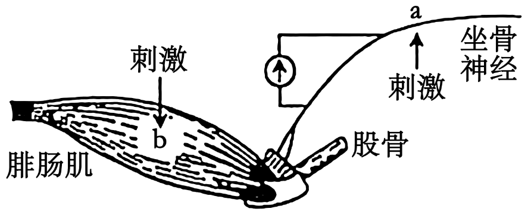
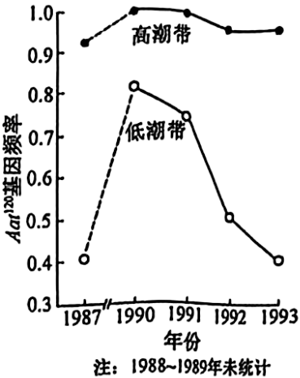
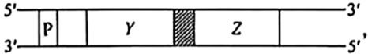
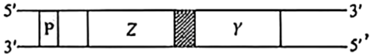
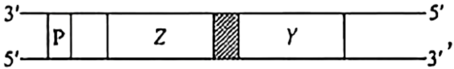
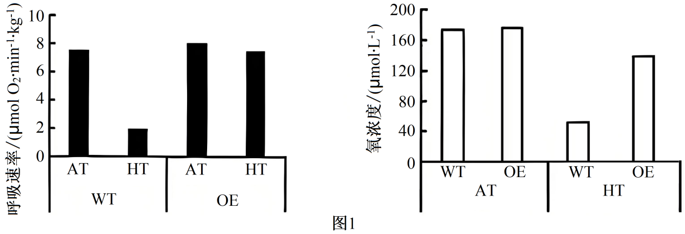
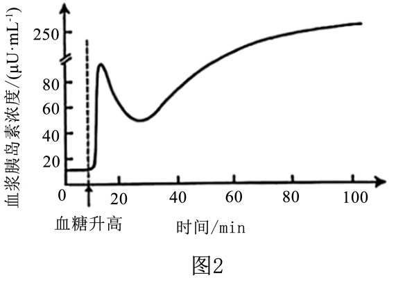
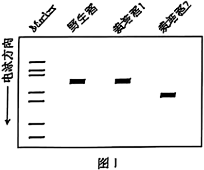
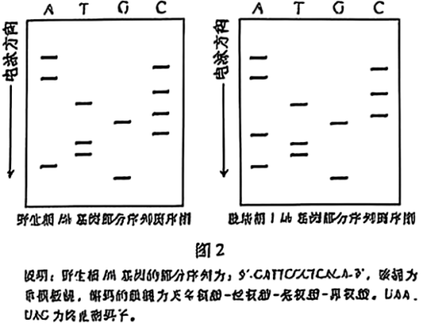

**2025年安徽省普通高中学业水平选择性考试**

**生物学**

**注意事项：**

**1．答题前，考生务必将自己的姓名和座位号填写在答题卡和试卷上。**

**2．作答选择题时，选出每小题答案后，用铅笔将答题卡上对应题目的答案选项涂黑。如需改动，用橡皮擦干净后，再选涂其它答案选项。作答非选择题时，将答案写在答题卡上对应区域。写在本试卷上无效。**

**3．考试结束后，将本试卷和答题卡一并交回。**

**一、选择题：本题共15小题，每小题3分，共45分。在每小题给出的四个选项中，只有一项是符合题目要求的。**

1\. 下列关于真核细胞内细胞器中的酶和化学反应的叙述，正确的是（ ）

A. 高尔基体膜上分布有相应的酶，可对分泌蛋白进行修饰加工

B. 核糖体中有相应的酶，可将氨基酸结合到特定tRNA的3'端

C. 溶酶体内含有多种水解酶，仅能消化衰老、损伤的细胞组分

D. 叶绿体中的ATP合成酶，可将光能直接转化为ATP中的化学能

2\. 关于“探究光照强度对光合作用强度的影响”实验，下列叙述错误的是（ ）

A. 用打孔器打出叶圆片时，为保证叶圆片相对一致应避开大的叶脉

B. 调节LED灯光源与盛有叶圆片烧杯之间的距离，以进行对比实验

C. 用化学传感器监测光照时O2浓度变化，可计算出实际光合作用强度

D. 同一烧杯中叶圆片浮起的快慢不同，可能与其接受的光照强度不同有关

3\. 胰岛类器官是由干细胞在体外诱导分化形成的具有器官特性的细胞集合体，可模拟胰岛的结构和功能，具有广泛的应用价值。下列叙述错误的是（ ）

A. 胰岛类器官中不同细胞在结构和功能上存在差异，这是基因选择性表达的结果

B. 胰岛类器官中胰岛A细胞是由干细胞诱导分化而来的，其细胞核不具有全能性

C. 对胰岛类器官中细胞的mRNA序列进行分析，可判断其细胞类型

D. 胰岛类器官模型可应用于胰岛发育和糖尿病发病机制等研究

4\. 运用某些化学试剂可以检测生物组织中的物质或相关代谢物。下列叙述正确的是（ ）

A. 蔗糖溶液与淀粉酶混合后温水浴，加入斐林试剂可反应生成砖红色沉淀

B. 淡蓝色的双缩脲试剂可与豆浆中的蛋白质结合，通过吸附作用显示紫色

C. 苏丹Ⅲ染液可与花生子叶中的脂肪结合，通过化学反应形成橘黄色

D. 橙色的酸性重铬酸钾溶液可与酒精或葡萄糖发生反应，变成灰绿色

5\. 种群数量调查的具体方法因生物种类而异。下列叙述错误的是（ ）

A. 采用标记重捕法时，重捕前要间隔适宜时长以确保标记个体在调查区域中均匀分布

B. 利用红外触发相机的自动拍摄技术，主要是对恒温动物进行野外种群数量调查研究

C. 对鲸进行种群数量监测时，可利用声音的稳定、非损伤、低干扰特征进行个体识别

D. 调查某土壤小动物种群数量时，打开诱虫器顶部的电灯以驱使土壤小动物向下移动

6\. 过渡带是两个或多个群落之间的过渡区域。大兴安岭森林与呼伦贝尔草原的过渡带中，森林和草原镶嵌分布，该区域环境较两个群落的内部核心区域更为异质多样。下列叙述错误的是（ ）

A. 过渡带环境复杂，通过协同进化形成了适应该环境特征的物种组合

B. 过渡带属于群落间的交错区域，其物种丰富度介于草原和森林之间

C. 相较于森林和草原核心区域，过渡带存在明显不同的群落水平结构特征

D. 过渡带可能有更多可抵抗不良环境波动的物种，影响群落结构的稳定性

7\. 正常情况下，神经产生的动作电位个数与所支配的骨骼肌收缩次数一致，乙酰胆碱递质的释放依赖于细胞外液中的钙离子。下图是蛙坐骨神经—腓肠肌标本示意图。刺激a处，电表偏转，腓肠肌收缩。对细胞外液分别进行4种预处理后，再进行以下实验，其中符合细胞外液中去除钙离子预处理的实验现象是（ ）

<table style="width:56%;">
<colgroup>
<col style="width: 6%" />
<col style="width: 10%" />
<col style="width: 12%" />
<col style="width: 14%" />
<col style="width: 12%" />
</colgroup>
<tbody>
<tr>
<td rowspan="2" style="text-align: center;">选项</td>
<td colspan="2" style="text-align: center;">刺激a处</td>
<td style="text-align: center;">滴加乙酰胆碱</td>
<td style="text-align: center;">刺激b处</td>
</tr>
<tr>
<td style="text-align: center;">电表偏转</td>
<td style="text-align: center;">腓肠肌收缩</td>
<td style="text-align: center;">腓肠肌收缩</td>
<td style="text-align: center;">腓肠肌收缩</td>
</tr>
<tr>
<td style="text-align: center;">A</td>
<td style="text-align: center;">是</td>
<td style="text-align: center;">-</td>
<td style="text-align: center;">+</td>
<td style="text-align: center;">+</td>
</tr>
<tr>
<td style="text-align: center;">B</td>
<td style="text-align: center;">是</td>
<td style="text-align: center;">-</td>
<td style="text-align: center;">-</td>
<td style="text-align: center;">+</td>
</tr>
<tr>
<td style="text-align: center;">C</td>
<td style="text-align: center;">否</td>
<td style="text-align: center;">-</td>
<td style="text-align: center;">-</td>
<td style="text-align: center;">-</td>
</tr>
<tr>
<td style="text-align: center;">D</td>
<td style="text-align: center;">是</td>
<td style="text-align: center;">+++</td>
<td style="text-align: center;">+++</td>
<td style="text-align: center;">+</td>
</tr>
</tbody>
</table>

说明：“+”表示收缩；“-”表示无收缩；“+++”表示持续性收缩。

A. A B. B C. C D. D

8\. 病原体突破机体的第一、二道防线，会激活机体的第三道防线，产生特异性免疫。下列叙述正确的是（ ）

A. 一种病原体侵入人体，机体通常只产生一种特异性的抗体

B. 活化后的辅助性T细胞表面的特定分子与B细胞结合，参与激活B细胞

C. 辅助性T细胞受体和B细胞受体识别同一抗原分子的相同部位

D. HIV主要侵染辅助性T细胞，侵入人体后辅助性T细胞数量即开始下降

9\. 种子萌发受多种内外因素的调节。下列叙述错误的是（ ）

A. 玉米种子萌发后，根冠中的细胞能够感受重力信号，从而引起根的向地生长

B. 与休眠种子相比，萌发的种子细胞内自由水所占比例高，呼吸作用旺盛

C. 红外光可促进莴苣种子萌发，而红光可逆转红外光的效应，抑制萌发

D. 赤霉素可打破种子休眠，促进萌发；脱落酸可维持休眠，抑制萌发

10\. 粗糙玉蜀螺是一种分布于海岸边的小海螺，其天冬氨酸转氨酶活性受一对等位基因Aat100和Aat120控制。至1987年，这对等位基因的频率在该种群世代间保持相对稳定（低潮带Aat120基因频率为0．4）。1988年，该螺分布区发生了一次有毒藻类爆发增殖，藻类分泌的藻毒素使低潮带个体大量死亡，而高潮带个体受影响较小，此后高潮带个体向低潮带扩散。1993年，种群又恢复到1987年的相对稳定状态。Aat120基因频率变化如图所示。下列叙述正确的是（ ）

A. 1987年，含Aat120基因的个体在低潮带比高潮带具有更强的适应能力

B. 在自然选择作用下，1993年后低潮带Aat100基因频率将持续上升

C. 1988~1993年，影响低潮带种群基因频率变化的主要因素是个体迁移

D. 1993年，含Aat100基因的个体在低潮带种群中所占比例为84%

11\. 某动物初级精母细胞中，一部分细胞的一对同源染色体的两条非姐妹染色单体间发生了片段互换，产生了4种精细胞，如图所示。若该动物产生的精细胞中，精细胞2、3所占的比例均为4%，则减数分裂过程中初级精母细胞发生交换的比例是（ ）

A 2% B. 4% C. 8% D. 16%

12\. 一对体色均为灰色的昆虫亲本杂交，子代存活的个体中，灰色雄性:灰色雌性:黑色雄性:黑色雌性=6:3:2:1。假定此杂交结果涉及两对等位基因的遗传，在不考虑相关基因位于性染色体同源区段的情况下，同学们提出了4种解释，其中合理的是（ ）

①体色受常染色体上一对等位基因控制，位于X染色体上的基因有隐性纯合致死效应②体色受常染色体上一对等位基因控制，位于Z染色体上的基因有隐性纯合致死效应③体色受两对等位基因共同控制，其中位于X染色体上的基因还有隐性纯合致死效应④体色受两对等位基因共同控制，其中位于Z染色体上的基因还有隐性纯合致死效应

A. ①③ B. ①④ C. ②③ D. ②④

13\. 大肠杆菌的两个基因Y和Z彼此相邻，转录时共用一个启动子（P）。科研小组分离到一株不能合成Y和Z蛋白的缺失突变体，但该突变体能合成另一种蛋白质，此蛋白质氨基端的30个氨基酸序列与Z蛋白氨基端的序列一致，而羧基端的25个氨基酸序列与Y蛋白羧基端的序列一致。据此，科研小组绘制了野生型菌株中Y和Z基因的排列顺序图，并推测突变体缺失的DNA碱基数目。下列图示和推测正确的是（ ）

A. 缺失碱基数目是3的整倍数

B. 缺失碱基数目是3的整倍数

C. 缺失碱基数目是3的整倍数+1

D. 缺失碱基数目是3的整倍数+2

14\. 细胞工程技术已在生物制药和物种繁育等领域得到了广泛应用。下列关于动物细胞工程的叙述，正确的是（ ）

A. 从动物体内取出组织，用胰蛋白酶处理后直接培养的细胞称为传代细胞

B. 将特定基因或特定蛋白导入已分化的T细胞，可将其诱导形成iPS细胞

C. 将B淋巴细胞与骨髓瘤细胞混合，经诱导融合的细胞即为能分泌所需抗体的细胞

D. 采用胚胎分割技术克隆动物常选用桑葚胚或囊胚，因这两个时期的细胞未发生分化

15\. 质粒K中含有β-半乳糖苷酶基因，将该质粒导入大肠杆菌细胞后，其编码的酶可分解X-gal，产生蓝色物质，进而形成蓝色菌落，如图所示。科研小组以该质粒作为载体，采用基因工程技术实现人源干扰素基因在大肠杆菌中的高效表达。下列叙述错误的是（ ）

A. 使用氯化钙处理大肠杆菌以提高转化效率，可增加筛选平板上白色和蓝色菌落数

B. 如果筛选平板中仅含卡那霉素，生长出的白色菌落不可判定为含目的基因的菌株

C. 因质粒K中含两个标记基因，筛选平板中长出的白色菌落即为表达目标蛋白的菌株

D. 若筛选平板中蓝色菌落偏多，原因可能是质粒K经酶切后自身环化并导入了大肠杆菌

**二、非选择题：本题共5小题，共55分。**

16\. 为探究水通道蛋白NtPIP对作物耐涝性的影响，科研小组测定了油菜的野生型（WT）及NtPIP基因过量表达株（OE）在正常供氧（AT）和低氧（HT，模拟涝渍）条件下的根细胞呼吸速率和氧浓度，结果见图1。

回答下列问题。

（1）据图1分析，低氧胁迫下，NtPIP基因过量表达会使根细胞有氧呼吸\_\_\_\_\_\_\_\_，原因是\_\_\_\_\_\_\_\_。有氧呼吸第二阶段丙酮酸中的化学能大部分被转化为\_\_\_\_\_\_\_\_中储存的能量。

（2）科学家早期在探索有氧呼吸第二阶段代谢路径时发现，在添加丙二酸的组织悬浮液中加入分子A、B或C时，E增多并累积（图2a）；当加入F、G或H时，E也同样累积（图2b）。根据此结果，针对有氧呼吸第二阶段代谢路径提出假设：\_\_\_\_\_\_\_\_。

（3）科研小组还发现，低氧条件下，NtPIP基因过量表达株的叶片净光合速率高于野生型。结合根细胞呼吸速率的变化分析，其原因是\_\_\_\_\_\_\_\_。

（4）光合作用光反应实质是光能引起的氧化还原反应，最终接受电子的物质（最终电子受体）是\_\_\_\_\_\_\_\_，而最终提供电子的物质（最终电子供体）是\_\_\_\_\_\_\_\_。

17\. 人为干扰导致的栖息地碎片化对生物多样性和群落结构具有重要影响。为探究某群落的物种多样性及优势种生态位宽度与人为干扰的耦合关系，科研小组调查了不同人为干扰强度下的群落结构特征。

表1 主要优势种的生态位宽度

<table style="width:51%;">
<colgroup>
<col style="width: 8%" />
<col style="width: 8%" />
<col style="width: 11%" />
<col style="width: 11%" />
<col style="width: 11%" />
</colgroup>
<tbody>
<tr>
<td rowspan="2" style="text-align: center;">结构层</td>
<td rowspan="2" style="text-align: center;">优势种</td>
<td colspan="3" style="text-align: center;">生态位宽度</td>
</tr>
<tr>
<td style="text-align: center;">轻度干扰</td>
<td style="text-align: center;">中度干扰</td>
<td style="text-align: center;">重度干扰</td>
</tr>
<tr>
<td rowspan="4" style="text-align: center;">乔木层</td>
<td style="text-align: center;">马尾松</td>
<td style="text-align: center;">20.78</td>
<td style="text-align: center;">25.14</td>
<td style="text-align: center;">17.25</td>
</tr>
<tr>
<td style="text-align: center;">栗</td>
<td style="text-align: center;">8.65</td>
<td style="text-align: center;">14.52</td>
<td style="text-align: center;">12.16</td>
</tr>
<tr>
<td style="text-align: center;">亮叶桦</td>
<td style="text-align: center;">4.94</td>
<td style="text-align: center;">1.71</td>
<td style="text-align: center;">1.70</td>
</tr>
<tr>
<td style="text-align: center;">槲栎</td>
<td style="text-align: center;">2.00</td>
<td style="text-align: center;">2.57</td>
<td style="text-align: center;">1.98</td>
</tr>
<tr>
<td rowspan="2" style="text-align: center;">灌木层</td>
<td style="text-align: center;">山莓</td>
<td style="text-align: center;">9.44</td>
<td style="text-align: center;">12.61</td>
<td style="text-align: center;">10.64</td>
</tr>
<tr>
<td style="text-align: center;">蛇葡萄</td>
<td style="text-align: center;">6.40</td>
<td style="text-align: center;">4.38</td>
<td style="text-align: center;">2.72</td>
</tr>
<tr>
<td rowspan="2" style="text-align: center;">草本层</td>
<td style="text-align: center;">芒萁</td>
<td style="text-align: center;">15.17</td>
<td style="text-align: center;">15.32</td>
<td style="text-align: center;">15.10</td>
</tr>
<tr>
<td style="text-align: center;">牛膝</td>
<td style="text-align: center;">5.71</td>
<td style="text-align: center;">5.76</td>
<td style="text-align: center;">8.14</td>
</tr>
</tbody>
</table>

说明：生态位宽度表示物种对资源的利用程度，数值越大，物种生存范围越宽。

回答下列问题。

（1）据表1可知，不同物种对人为干扰强度的响应不同，该群落中受人为干扰影响最小的优势种是\_\_\_\_\_\_\_\_。在人为干扰影响下，有些物种的生态位变宽，原因可能是\_\_\_\_\_\_\_\_（答出2点即可）。

（2）据图可知，在中度干扰下群落各结构层物种丰富度均有所上升，但随着干扰的进一步增强，群落中只有草本层的丰富度持续增大。从群落垂直分层及资源利用特征的角度分析，其原因是\_\_\_\_\_\_\_\_。

（3）人为干扰过程中，各物种在群落中的优势和种间关系会逐渐变化。由此，科研小组进一步对轻度干扰下乔木层优势种的种间关联性进行了分析（表2），结果表明亮叶桦与两个物种（栗和槲栎）对生存环境与资源利用具有\_\_\_\_\_\_\_\_，此时群落结构不稳定。

表2 轻度干扰下乔木层优势种的种间关联性

|     |     |     |     |
|:---:|:---:|:---:|:---:|
| 马尾松 |     |     |     |
| \+  | 栗   |     |     |
| \+  | \-  | 亮叶桦 |     |
| \+  | ○   | \-  | 槲栎  |

说明：“+”表示正关联，即两个物种常分布于一起：“-”表示负关联，即两者无法或很少共存于同一环境；“○”表示无关联。

（4）我国在生态工程的理论和实践领域已取得了长足进展。针对人为干扰造成的栖息地碎片化，可通过建设生态走廊以促进同种生物种群间的\_\_\_\_\_\_\_\_，实现物种间互利共存和种群的再生更新。该措施主要是遵循生态工程的\_\_\_\_\_\_\_\_原理。

18\. 当气温骤降时，机体会发生一系列的生理反应，参与该反应的部分器官和调节路径如图1所示。

回答下列问题。

（1）外界寒冷刺激\_\_\_\_\_\_\_\_产生兴奋，兴奋通过传入神经传到下丘脑体温调节中枢。

（2）气温骤降时，机体常通过神经调节引起骨骼肌战栗性收缩；同时，机体通过\_\_\_\_\_\_\_\_调节、\_\_\_\_\_\_\_\_调节 均使皮肤血管收缩和骨骼肌血管舒张。这些效应的生理意义是\_\_\_\_\_\_\_\_。

（3）气温骤降时，机体内糖皮质激素等分泌明显增加，同时机体通过\_\_\_\_\_\_\_\_抑制胰岛B细胞的分泌，以维持较高的血糖浓度，满足机体的能量需求。

（4）正常情况下，胰岛B细胞的分泌主要受血糖浓度的反馈调节。当血糖持续升高时，血浆中胰岛素的浓度变化如图2所示。此变化的原因是\_\_\_\_\_\_\_\_。

19\. 水稻籽粒外壳（颖壳）表型有黄色、黑色、紫色和棕红色等，种植颖壳表型不同的彩色稻，既可满足国家粮食安全需要，又可形成优美画卷，用于旅游开发。回答下列问题。

（1）研究发现，水稻颖壳的紫色、棕红色、黄绿色和浅绿色的形成与类黄酮化合物的代谢有关。假设显性基因C、R、A控制颖壳色素的形成，且独立遗传，相应的隐性等位基因不具有该效应。色素合成代谢途径如图。

现有基因型为CcRrAa与CcRraa的两品种水稻杂交，F1中颖壳表型为紫色、棕红色、黄绿色和浅绿色的比例为\_\_\_\_\_\_\_\_。F1中，颖壳颜色在后代持续保持不变的个体所占比例为\_\_\_\_\_\_\_\_。

（2）野生稻的颖壳为黑色，经过突变和驯化，目前栽培稻的颖壳多为黄色。黑色和黄色颖壳由一对等位基因控制，且黑色（Bh）对黄色（bh）为显性。科研小组对多个品种进行分析，发现有两个黄色颖壳突变类型（栽培稻1、2），推测两者的突变可能是来自同一个基因。设计一个杂交实验，以验证该推测，并说明判断理由\_\_\_\_\_\_\_\_。

（3）科研小组采用PCR技术，扩增出野生稻和栽培稻Bh/bh基因的片段，电泳结果见图1。

 

与野生稻相比，栽培稻2是由于Bh基因发生了\_\_\_\_\_\_\_\_，颖壳表现为黄色。栽培稻1和野生稻的PCR扩增产物大小一致，科研小组进行了DNA测序，结果见图2（图中仅显示两者含有差异的部分序列，其余序列一致；A、T、C、C表示4种碱基）。比较两者DNA碱基序列，发现栽培稻1是由于Bh基因中的DNA序列发生\_\_\_\_\_\_\_\_，导致\_\_\_\_\_\_\_\_，颖壳表现为黄色。

20\. 稻瘟病是一种真菌病害，水稻叶片某些内生放线菌对该致病菌有抑制作用。科研小组分离筛选出内生放线菌，并开展了相关研究。回答下列问题。

（1）采集有病斑的水稻叶片，经表面消毒、研磨处理，制备研磨液。此后，采用\_\_\_\_\_\_\_\_（填方法）将研磨液接种于不同的选择培养基，分别置于不同温度下培养，目的是\_\_\_\_\_\_\_\_。

（2）经筛选获得一株内生放线菌，该菌株高效合成铁载体小分子，能辅助内生放线菌吸收铁离子。R基因是合成铁载体的关键基因之一。科研小组构建R基因敲除株，探究铁载体的功能。主要步骤如下：首先克隆R基因的上游片段R-U和下游片段R-D；然后构建重组质粒；最后利用重组质粒和内生放线菌DNA片段中同源区段可发生交换的原理，对目标基因进行敲除。如图1所示。

采用PCR技术鉴定R基因的敲除结果。PCR通过变性、复性和延伸三步，反复循环，可实现基因片段的\_\_\_\_\_\_\_\_。R基因敲除过程中，可发生多种形式的同源区段交换，PCR检测结果如图2所示，其中R基因敲除株为菌落\_\_\_\_\_\_\_\_（填序号），出现菌落④的可能原因是\_\_\_\_\_\_\_\_。

（3）内生放线菌和稻瘟病致病菌的生长均需要铁元素。科研小组推测该内生放线菌通过对铁离子的竞争性利用，从而抑制稻瘟病致病菌生长。设计实验验证该推测，简要写出实验思路\_\_\_\_\_\_\_\_。
