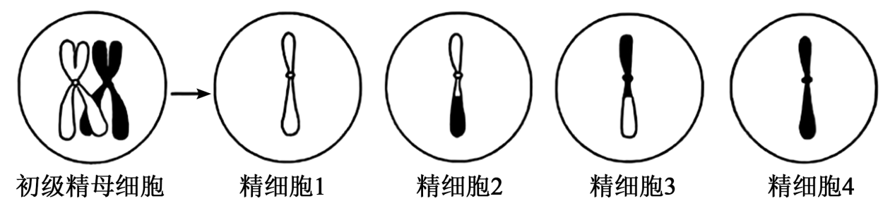
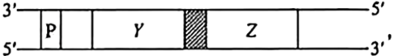
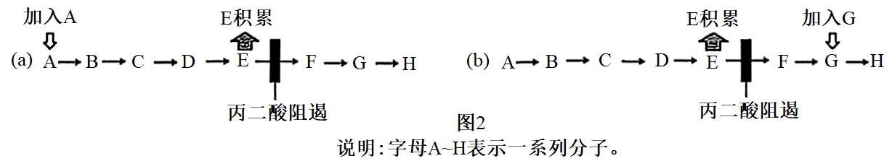
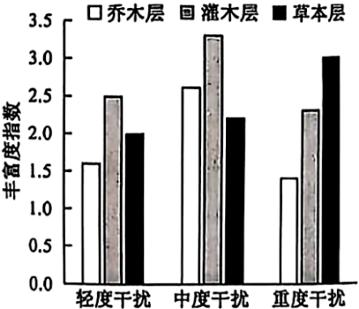
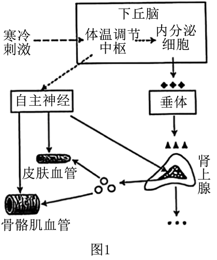
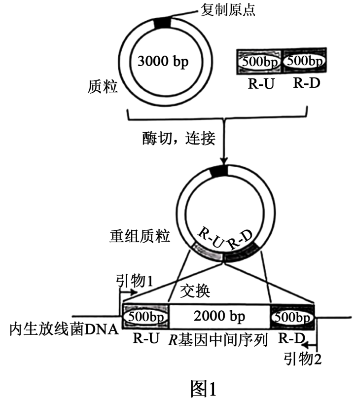
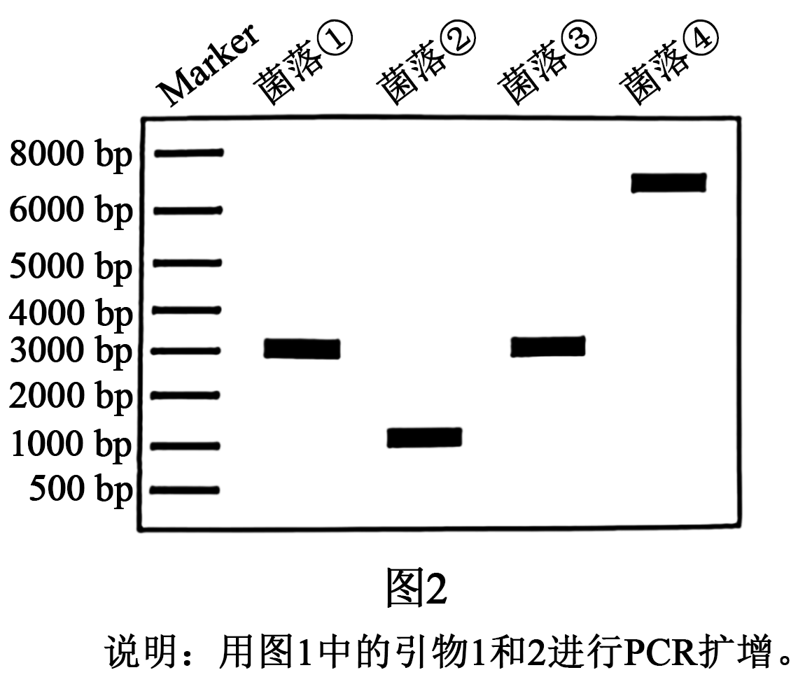

**2025年安徽省普通高中学业水平选择性考试**

**生物学**

**注意事项：**

**1．答题前，考生务必将自己的姓名和座位号填写在答题卡和试卷上。**

**2．作答选择题时，选出每小题答案后，用铅笔将答题卡上对应题目的答案选项涂黑。如需改动，用橡皮擦干净后，再选涂其它答案选项。作答非选择题时，将答案写在答题卡上对应区域。写在本试卷上无效。**

**3．考试结束后，将本试卷和答题卡一并交回。**

**一、选择题：本题共15小题，每小题3分，共45分。在每小题给出的四个选项中，只有一项是符合题目要求的。**

1\. 下列关于真核细胞内细胞器中的酶和化学反应的叙述，正确的是（ ）

A. 高尔基体膜上分布有相应的酶，可对分泌蛋白进行修饰加工

B. 核糖体中有相应的酶，可将氨基酸结合到特定tRNA的3'端

C. 溶酶体内含有多种水解酶，仅能消化衰老、损伤的细胞组分

D. 叶绿体中的ATP合成酶，可将光能直接转化为ATP中的化学能

【答案】A

【解析】

【分析】一般来说，酶是活细胞产生的具有催化作用的有机物，其中绝大多数酶是蛋白质。细胞中每时每刻都进行着许多化学反应，统称为细胞代谢。细胞代谢离不开酶。

【详解】A、高尔基体是真核细胞内对蛋白质进行加工、分类和包装的“车间”。从内质网运来的蛋白质（如分泌蛋白）进入高尔基体后，会经过一系列的修饰和加工，故推测高尔基体膜上分布有相应的酶，可对分泌蛋白进行修饰加工，A正确；

B、将氨基酸活化并连接到特定tRNA上的过程，是由氨酰-tRNA合成酶催化的。这种酶存在于细胞质中，而不是在核糖体上，B错误；

C、溶酶体主要分布在动物细胞中，是细胞的“消化车间”，内部含有多种水解酶，能分解衰老、损伤的细胞器，吞噬并杀死侵入细胞的病毒或细菌，C错误；

D、在光合作用的光反应阶段，能量转换过程是：光能被叶绿体中的色素分子吸收后，首先转化为电能（高能电子），然后通过电子传递链转化为活跃的化学能储存在ATP和NADPH中。具体到ATP的合成，ATP合成酶是利用类囊体膜两侧的质子（H+）浓度梯度所形成的势能来合成ATP的，而不是直接利用光能。因此，光能向ATP中化学能的转化是间接的，不是直接的，D错误。

故选A。

2\. 关于“探究光照强度对光合作用强度的影响”实验，下列叙述错误的是（ ）

A. 用打孔器打出叶圆片时，为保证叶圆片相对一致应避开大的叶脉

B. 调节LED灯光源与盛有叶圆片烧杯之间的距离，以进行对比实验

C. 用化学传感器监测光照时O2浓度变化，可计算出实际光合作用强度

D. 同一烧杯中叶圆片浮起的快慢不同，可能与其接受的光照强度不同有关

【答案】C

【解析】

【分析】该实验的原理是：当叶圆片抽取空气沉入水底后，光合作用大于呼吸作用时产生的氧气在细胞间隙积累，圆叶片的浮力增加，叶片上浮，根据上浮的时间判断出光合作用的强弱。

【详解】A、用打孔器打出叶圆片的目的是使其进行光合作用产生氧气，依据单一变量原则，为保证叶圆片相对一致应避开大的叶脉，A正确；

B、调节LED灯光源与盛有叶圆片烧杯之间的距离，以模拟不同的光照强度，该实验都是实验组，为对比实验，B正确；

C、实际光合作用强度=净光合作用强度+呼吸作用强度，用化学传感器监测光照时O2浓度变化，只可计算出净光合作用强度，无法得知呼吸强度，无法计算出实际光合作用强度，C错误；

D、同一烧杯中叶圆片浮起的快慢不同，说明光合作用强度不同，可能与其接受的光照强度不同有关，D正确。

故选C。

3\. 胰岛类器官是由干细胞在体外诱导分化形成的具有器官特性的细胞集合体，可模拟胰岛的结构和功能，具有广泛的应用价值。下列叙述错误的是（ ）

A. 胰岛类器官中不同细胞在结构和功能上存在差异，这是基因选择性表达的结果

B. 胰岛类器官中胰岛A细胞是由干细胞诱导分化而来的，其细胞核不具有全能性

C. 对胰岛类器官中细胞的mRNA序列进行分析，可判断其细胞类型

D. 胰岛类器官模型可应用于胰岛发育和糖尿病发病机制等研究

【答案】B

【解析】

【分析】细胞分化过程中遗传物质不变，只是基因的选择性表达。细胞的全能性是指已分化的细胞具有发育为完整有机体或分化成其他各种细胞的潜能和特性。

【详解】A、胰岛类器官中不同细胞在结构和功能上存在差异，这是细胞分化的结果，其实质是基因选择性表达，A正确；

B、干细胞诱导分化的胰岛A细胞，细胞核仍含全套遗传信息，其细胞核具有全能性，B错误；

C、不同细胞的mRNA差异反映基因表达情况，可判断细胞类型，C正确；

D、胰岛类器官可模拟胰岛功能，可应用于胰岛发育和糖尿病发病机制等研究，D正确。

故选B。

4\. 运用某些化学试剂可以检测生物组织中的物质或相关代谢物。下列叙述正确的是（ ）

A. 蔗糖溶液与淀粉酶混合后温水浴，加入斐林试剂可反应生成砖红色沉淀

B. 淡蓝色的双缩脲试剂可与豆浆中的蛋白质结合，通过吸附作用显示紫色

C. 苏丹Ⅲ染液可与花生子叶中的脂肪结合，通过化学反应形成橘黄色

D. 橙色的酸性重铬酸钾溶液可与酒精或葡萄糖发生反应，变成灰绿色

【答案】D

【解析】

【分析】斐林试剂可用于鉴定还原糖，在水浴加热的条件下，溶液的颜色变化为砖红色（沉淀）；淀粉的鉴定利用碘液，观察是否产生蓝色；蛋白质可与双缩脲试剂产生紫色反应；脂肪可用苏丹Ⅲ染液鉴定，呈橘黄色。

【详解】A、蔗糖为非还原糖，蔗糖溶液与淀粉酶混合后不能生成还原糖，温水浴加入斐林试剂不能生成砖红色沉淀，A错误；

B、双缩脲试剂的两种溶液不能混合使用，其中NaOH为无色，CuSO4是淡蓝色，故不能简单的描述双缩脲试剂为淡蓝色，B错误；

C、脂肪与苏丹III反应的原理是苏丹III作为脂溶性染色剂，通过亲脂性结合溶解于脂肪并显色，使脂肪呈现橘黄色颗粒。‌该过程属于物理溶解而非化学反应，C错误；

D、酒精和葡萄糖均能与橙色的酸性重铬酸钾溶液发生反应，变成灰绿色，D正确。

故选D。

5\. 种群数量调查的具体方法因生物种类而异。下列叙述错误的是（ ）

A. 采用标记重捕法时，重捕前要间隔适宜时长以确保标记个体在调查区域中均匀分布

B. 利用红外触发相机的自动拍摄技术，主要是对恒温动物进行野外种群数量调查研究

C. 对鲸进行种群数量监测时，可利用声音的稳定、非损伤、低干扰特征进行个体识别

D. 调查某土壤小动物种群数量时，打开诱虫器顶部的电灯以驱使土壤小动物向下移动

【答案】A

【解析】

【分析】调查动物种群密度的常用方法，如样方法，标记重捕法，往往需要直接观察或捕捉个体。在调查生活在荫蔽、复杂环境中的动物，特别是猛禽和猛兽时，这些方法就不适用了，可通过红外触发相机、粪便等进行调查。

【详解】A、采用标记重捕法时，重捕前间隔适宜时长是为了让标记个体与未标记个体混合均匀，这样能保证重捕时的随机性，使结果更准确，A错误；

B、恒温动物的体温相对恒定，红外触发相机可利用其体温与环境的温度差异进行自动拍摄，主要用于对恒温动物进行野外种群数量调查研究，B正确；

C、鲸在水中活动，可利用声音（如鲸的叫声等）的稳定、非损伤、低干扰特征进行个体识别，从而对鲸进行种群数量监测，C正确；

D、根据土壤小动物具有避光，避高温的特性，在调查土壤小动物种群数量时，打开诱虫器顶部的电灯，以驱使小动物向下移动，D正确。

故选A。

6\. 过渡带是两个或多个群落之间的过渡区域。大兴安岭森林与呼伦贝尔草原的过渡带中，森林和草原镶嵌分布，该区域环境较两个群落的内部核心区域更为异质多样。下列叙述错误的是（ ）

A. 过渡带环境复杂，通过协同进化形成了适应该环境特征的物种组合

B. 过渡带属于群落间的交错区域，其物种丰富度介于草原和森林之间

C. 相较于森林和草原核心区域，过渡带存在明显不同的群落水平结构特征

D. 过渡带可能有更多可抵抗不良环境波动的物种，影响群落结构的稳定性

【答案】B

【解析】

【分析】生态过渡带是指两个或者多个群落之间或生态系统之间的过渡区域，在过渡带区域，植物的种类多，给动物提供的食物条件和栖息空间也多，因此群落交错区的动物丰富度较高。

【详解】A、过渡带环境复杂，适合更多不同生态类型植物生长，通过生物与生物之间、生物与环境之间的协同进化形成了适应该环境特征的物种组合，A正确；

B、过渡带属于群落间的交错区域，在过渡带区域，生物的种类和种群密度都明显高于两侧的生物群落，B错误；

C、相较于森林和草原核心区域，过渡带环境复杂，存在明显不同的群落水平结构特征，C正确；

D、过渡带物种丰富度较高，可能有更多可抵抗不良环境波动的物种，影响群落结构的稳定性，D正确。

故选B。

7\. 正常情况下，神经产生的动作电位个数与所支配的骨骼肌收缩次数一致，乙酰胆碱递质的释放依赖于细胞外液中的钙离子。下图是蛙坐骨神经—腓肠肌标本示意图。刺激a处，电表偏转，腓肠肌收缩。对细胞外液分别进行4种预处理后，再进行以下实验，其中符合细胞外液中去除钙离子预处理的实验现象是（ ）

<table style="width:56%;">
<colgroup>
<col style="width: 6%" />
<col style="width: 10%" />
<col style="width: 12%" />
<col style="width: 14%" />
<col style="width: 12%" />
</colgroup>
<tbody>
<tr>
<td rowspan="2" style="text-align: center;">选项</td>
<td colspan="2" style="text-align: center;">刺激a处</td>
<td style="text-align: center;">滴加乙酰胆碱</td>
<td style="text-align: center;">刺激b处</td>
</tr>
<tr>
<td style="text-align: center;">电表偏转</td>
<td style="text-align: center;">腓肠肌收缩</td>
<td style="text-align: center;">腓肠肌收缩</td>
<td style="text-align: center;">腓肠肌收缩</td>
</tr>
<tr>
<td style="text-align: center;">A</td>
<td style="text-align: center;">是</td>
<td style="text-align: center;">-</td>
<td style="text-align: center;">+</td>
<td style="text-align: center;">+</td>
</tr>
<tr>
<td style="text-align: center;">B</td>
<td style="text-align: center;">是</td>
<td style="text-align: center;">-</td>
<td style="text-align: center;">-</td>
<td style="text-align: center;">+</td>
</tr>
<tr>
<td style="text-align: center;">C</td>
<td style="text-align: center;">否</td>
<td style="text-align: center;">-</td>
<td style="text-align: center;">-</td>
<td style="text-align: center;">-</td>
</tr>
<tr>
<td style="text-align: center;">D</td>
<td style="text-align: center;">是</td>
<td style="text-align: center;">+++</td>
<td style="text-align: center;">+++</td>
<td style="text-align: center;">+</td>
</tr>
</tbody>
</table>

说明：“+”表示收缩；“-”表示无收缩；“+++”表示持续性收缩。

A. A B. B C. C D. D

【答案】A

【解析】

【分析】突触是由突前膜，突间隙和突后膜构成的，突触小体含有突小泡，内含神经递质，神经递质有兴奋性和抑制性两种，受到刺激以后神经递质由突触小泡运输到突触前膜与其融合，递质以胞吐的方式排放到突触间隙，作用于突触后膜，引起突触后膜的兴奋或抑制。

【详解】根据题干信息“神经产生的动作电位个数与所支配的骨骼肌收缩次数一致，乙酰胆碱递质的释放依赖于细胞外液中的钙离子”，所以除去钙离子后，神经元将不会释放神经胆碱递质，所以刺激a处，兴奋沿着神经纤维的传导不依赖于钙离子，兴奋可以在神经纤维上传导，电表会发生偏转，由细胞外液缺乏钙离子，所以神经元不会释放乙酰胆碱递质，所以腓肠肌不收缩，如果滴加乙酰胆碱，即补充了神经递质，肌肉细胞接受神经递质，会收缩，刺激b处，是直接刺激肌肉细胞，肌肉会收缩，BCD错误。

故选A。

8\. 病原体突破机体的第一、二道防线，会激活机体的第三道防线，产生特异性免疫。下列叙述正确的是（ ）

A. 一种病原体侵入人体，机体通常只产生一种特异性的抗体

B. 活化后的辅助性T细胞表面的特定分子与B细胞结合，参与激活B细胞

C. 辅助性T细胞受体和B细胞受体识别同一抗原分子的相同部位

D. HIV主要侵染辅助性T细胞，侵入人体后辅助性T细胞数量即开始下降

【答案】B

【解析】

【分析】1、辅助性T细胞能合成并分泌细胞因子，增强免疫功能。

2、B细胞接受抗原刺激后，开始进行一系列的增殖、分化，形成记忆细胞和浆细胞。

3、相同抗原再次入侵时，记忆细胞比普通的B细胞更快地作出反应，即很快分裂产生新的浆细胞和记忆细胞，浆细胞再产生抗体消灭抗原，此为二次免疫反应。

【详解】A、一种病原体含有多种抗原，侵入人体，机体通常产生多种特异性的抗体，A错误；

B、活化后的辅助性T细胞表面的特定分子发生变化，并与B细胞结合，为激活B细胞提供第二个信号，B正确；

C、辅助性T细胞受体和B细胞受体具有特异性，识别同一抗原分子的不同部位，C错误；

D、HIV主要侵染辅助性T细胞，侵入人体后辅助性T细胞数量先上升后下降，D错误。

故选B。

9\. 种子萌发受多种内外因素的调节。下列叙述错误的是（ ）

A. 玉米种子萌发后，根冠中的细胞能够感受重力信号，从而引起根的向地生长

B. 与休眠种子相比，萌发的种子细胞内自由水所占比例高，呼吸作用旺盛

C. 红外光可促进莴苣种子萌发，而红光可逆转红外光的效应，抑制萌发

D. 赤霉素可打破种子休眠，促进萌发；脱落酸可维持休眠，抑制萌发

【答案】C

【解析】

【分析】1、光对植物生长发育的调节:①光是植物进行光合作用的能量来源。②光作为一种信号，影响、调控植物生长、发育的过程。在受到光照时，光敏色素的结构会发生变化，这一变化的信息会经过信息传递系统传导到细胞核内，影响特定基因的表达，从而表现出生物学效应。

2、光敏色素引起的生理变化为：光信号→细胞感受光信号→光敏色素被激活，结构发生变化→信号转导→细胞核接受信号→调控特定基因表达→产生特定物质→产生生物学效应。

【详解】A 、根冠中的细胞能够感受重力信号 ，玉米种子萌发后，根冠细胞感受重力刺激，引起生长素的横向运输，使近地侧生长素浓度高抑制生长，从而使根向地生长，A正确；

B、自由水与结合水的比值影响细胞代谢，自由水所占比例越高，细胞代谢越旺盛。与休眠种子相比，萌发的种子细胞内自由水所占比例高，呼吸作用旺盛，B正确；

C、莴苣种子萌发受光的影响，红光可促进莴苣种子萌发，红外光可抑制莴苣种子萌发，且红光可逆转红外光的效应，C错误；

D、植物激素对种子萌发有调节作用，赤霉素可打破种子休眠，促进萌发；脱落酸可维持种子休眠，抑制萌发，D正确。

故选C。

10\. 粗糙玉蜀螺是一种分布于海岸边的小海螺，其天冬氨酸转氨酶活性受一对等位基因Aat100和Aat120控制。至1987年，这对等位基因的频率在该种群世代间保持相对稳定（低潮带Aat120基因频率为0．4）。1988年，该螺分布区发生了一次有毒藻类爆发增殖，藻类分泌的藻毒素使低潮带个体大量死亡，而高潮带个体受影响较小，此后高潮带个体向低潮带扩散。1993年，种群又恢复到1987年的相对稳定状态。Aat120基因频率变化如图所示。下列叙述正确的是（ ）

A. 1987年，含Aat120基因的个体在低潮带比高潮带具有更强的适应能力

B. 在自然选择作用下，1993年后低潮带Aat100基因频率将持续上升

C. 1988~1993年，影响低潮带种群基因频率变化的主要因素是个体迁移

D. 1993年，含Aat100基因的个体在低潮带种群中所占比例为84%

【答案】D

【解析】

【分析】分析题图可知，1987-1993年间，低潮带和高潮带的Aat120基因频率由先增加后减少，但低潮带变化趋势更明显。

【详解】A、1987年，低潮带的Aat120基因频率低于高潮带，说明含Aat120基因的个体在高潮带比低潮带具有更强的适应能力，A错误；

B、由题干信息可知：1993年，种群又恢复到1987年的相对稳定状态，故在自然选择作用下，1993年后低潮带Aat100基因频率不会持续上升，B错误；

C、由题干信息“1988年，该螺分布区发生了一次有毒藻类爆发增殖，藻类分泌的藻毒素使低潮带个体大量死亡，而高潮带个体受影响较小，此后高潮带个体向低潮带扩散”，可知1988~1993年，影响低潮带种群基因频率变化的主要因素是个体死亡，C错误；

D、1993年，低潮带中Aat120基因频率为0.4，则Aat100基因频率为0.6，即60%，含Aat100基因的个体有纯合子和杂合子，可计算含Aat100基因的个体在低潮带种群中所占比例为60%×60%+2×60%×40%=84%，D正确。

故选D。

11\. 某动物初级精母细胞中，一部分细胞的一对同源染色体的两条非姐妹染色单体间发生了片段互换，产生了4种精细胞，如图所示。若该动物产生的精细胞中，精细胞2、3所占的比例均为4%，则减数分裂过程中初级精母细胞发生交换的比例是（ ）

A. 2% B. 4% C. 8% D. 16%

【答案】D

【解析】

【分析】减数分裂Ⅰ开始不久，初级精母细胞中原来分散的染色体缩短变粗并两两配对。联会后的每对同源染色体含有四条染色单体，叫作四分体。四分体中的非姐妹染色单体之间经常发生缠绕，并交换相应的片段。

【详解】从图示可以看出，一个初级精母细胞含有4条染色单体。对于单个细胞来说，当其中两条非姐妹染色单体发生一次交换后，这4条染色单体最终会分离到4个精细胞中。对于任何一个发生了互换的初级精母细胞而言，它产生的后代精细胞中，重组型的比例是 2/4 = 50%。不发生交换的细胞，其后代中重组型配子的比例是 0%。题中给出的“精细胞2占4%，精细胞3占4%”是在所有产生的精细胞（包括由发生交换的细胞产生的和由未发生交换的细胞产生的）中的总比例。因此，重组型配子（精细胞2 + 精细胞3）在总配子中所占的总比例为： 总重组比例 = 4% + 4% = 8%。设发生互换的初级精母细胞的比例为X。于是我们可以建立等式： (发生交换的细胞比例) × (这些细胞产生重组配子的比例) = (总的重组配子比例) ，即：X \* 50% = 8%。解得X=16%。所以在减数分裂过程中，初级精母细胞发生交换的比例是16%，D正确。

故选D。

12\. 一对体色均为灰色的昆虫亲本杂交，子代存活的个体中，灰色雄性:灰色雌性:黑色雄性:黑色雌性=6:3:2:1。假定此杂交结果涉及两对等位基因的遗传，在不考虑相关基因位于性染色体同源区段的情况下，同学们提出了4种解释，其中合理的是（ ）

①体色受常染色体上一对等位基因控制，位于X染色体上的基因有隐性纯合致死效应②体色受常染色体上一对等位基因控制，位于Z染色体上的基因有隐性纯合致死效应③体色受两对等位基因共同控制，其中位于X染色体上的基因还有隐性纯合致死效应④体色受两对等位基因共同控制，其中位于Z染色体上的基因还有隐性纯合致死效应

A. ①③ B. ①④ C. ②③ D. ②④

【答案】D

【解析】

【分析】分析题意可知，灰色亲本杂交，子代出现黑色，说明灰色为显性性状。XY型性别决定的生物，XX为雌性，XY为雄性；ZW型性别决定的生物，ZW为雌性，ZZ为雄性。

【详解】①③依题意，后代雄性:雌性=8:4=2:1，说明雌性一半致死。若位于X染色体上的基因（假设为B/b基因）有隐性纯合致死效应，则子代雌性出现XbXb个体且致死，父本基因型就要为XbY（致死），与假设矛盾，不合理，①③不符合题意；

②依题意，后代雄性:雌性=8:4=2:1，说明雌性一半致死。若体色受常染色体上一对等位基因控制，位于Z染色体上的基因有隐性纯合致死效应，假设常染色体上的基因为A/a，Z染色体上的基因为B/b。结合题中信息，亲本基因型为AaZBZb、AaZBW，则子代为：6A-ZBZ-（灰色雄性）：3A-ZBW（灰色雌性）：3A-ZbW（致死）：2aaZBZ-（黑色雄性）：1aaZBW（黑色雌性）：1aaZbW（致死）=6:3:2:1，符合题意，合理，②符合题意；

④若体色受两对等位基因共同控制，其中位于Z染色体上的基因还有隐性纯合致死效应，则亲本基因型为AaZBZb、AaZBW，子代基因型及比例为6A-ZBZ-：3A-ZBW：3A-ZbW（致死）：2aaZBZ-：1aaZBW：1aaZbW（致死），只有A、B同时存在时，表现灰色，则子代表型及比例为：灰色雄性:灰色雌性:黑色雄性:黑色雌性=6:3:2:1，符合题意，合理，④符合题意；

综上可知，②④正确。

故选D。

13\. 大肠杆菌的两个基因Y和Z彼此相邻，转录时共用一个启动子（P）。科研小组分离到一株不能合成Y和Z蛋白的缺失突变体，但该突变体能合成另一种蛋白质，此蛋白质氨基端的30个氨基酸序列与Z蛋白氨基端的序列一致，而羧基端的25个氨基酸序列与Y蛋白羧基端的序列一致。据此，科研小组绘制了野生型菌株中Y和Z基因的排列顺序图，并推测突变体缺失的DNA碱基数目。下列图示和推测正确的是（ ）

A. 缺失碱基数目是3的整倍数

B. 缺失碱基数目是3的整倍数

C. 缺失碱基数目是3的整倍数+1

D. 缺失碱基数目是3的整倍数+2

【答案】B

【解析】

【分析】碱基替换发生的位置不同引起的效应不一样。如果碱基的替换发生在基因的编码区，可引起密码子改变，对应的氨基酸改变，蛋白质功能改变；但由于密码子的简并性，基因发生碱基替换后，其编码的蛋白质的氨基酸序列也可能不变；碱基替换还可能会导致起始密码子和终止密码子的位置改变，使得氨基酸序列改变，数目改变，相应蛋白质功能也改变。如果碱基的替换发生在基因的非编码区，则对蛋白质无影响。

【详解】已知突变体合成的蛋白质氨基端的30个氨基酸序列与Z蛋白氨基端的序列一致，羧基端的25个氨基酸序列与Y蛋白羧基端的序列一致。这说明转录是以Z基因起始 ，然后连接到Y基因进行转录的，所以野生型菌株中基因的排列顺序应该是Z基因在前，Y基因在后，且共用一个启动子P ，转录时，模板链的方向是 3'→5' ，因此图示的方向应为3'- P - Z - Y-5'，符合该特征的是BC选项的图示，由于该蛋白质氨基端有Z蛋白的部分序列，羧基端有Y蛋白的部分序列，说明缺失突变后，转录形成的mRNA依然可以编码氨基酸，没有造成移码突变（移码突变会导致突变位点后的氨基酸序列全部改变 ）。因为一个氨基酸由mRNA上的一个密码子（3个相邻碱基 ）决定，所以缺失的碱基数目应该是3的整倍数，这样才不会改变后续的阅读框，保证氨基端和羧基端的氨基酸序列分别与Z、Y蛋白部分序列一致，综上，B正确，ACD错误。

故选B。

14\. 细胞工程技术已在生物制药和物种繁育等领域得到了广泛应用。下列关于动物细胞工程的叙述，正确的是（ ）

A. 从动物体内取出组织，用胰蛋白酶处理后直接培养的细胞称为传代细胞

B. 将特定基因或特定蛋白导入已分化的T细胞，可将其诱导形成iPS细胞

C. 将B淋巴细胞与骨髓瘤细胞混合，经诱导融合的细胞即为能分泌所需抗体的细胞

D. 采用胚胎分割技术克隆动物常选用桑葚胚或囊胚，因这两个时期的细胞未发生分化

【答案】B

【解析】

【分析】动物细胞工程常用的技术手段有动物细胞培养、动物细胞核移植、动物细胞融合、生产单克隆抗体等，其中动物细胞培养技术是其他动物工程技术的基础。

【详解】A、胰蛋白酶处理后直接培养的细胞为原代细胞，A错误；

B、将特定基因或特定蛋白（特定的转录因子如Oct4、Sox2、Klf4和c-Myc）导入已分化的T细胞，可将其诱导形成iPS细胞，B正确；

C、融合细胞有具有同种核的融合细胞和杂交瘤细胞，需筛选才能获得分泌特定抗体的杂交瘤细胞，C错误；

D、囊胚细胞已开始分化，D错误。

故选B。

15\. 质粒K中含有β-半乳糖苷酶基因，将该质粒导入大肠杆菌细胞后，其编码的酶可分解X-gal，产生蓝色物质，进而形成蓝色菌落，如图所示。科研小组以该质粒作为载体，采用基因工程技术实现人源干扰素基因在大肠杆菌中的高效表达。下列叙述错误的是（ ）

A. 使用氯化钙处理大肠杆菌以提高转化效率，可增加筛选平板上白色和蓝色菌落数

B. 如果筛选平板中仅含卡那霉素，生长出的白色菌落不可判定为含目的基因的菌株

C. 因质粒K中含两个标记基因，筛选平板中长出的白色菌落即为表达目标蛋白的菌株

D. 若筛选平板中蓝色菌落偏多，原因可能是质粒K经酶切后自身环化并导入了大肠杆菌

【答案】C

【解析】

【分析】基因工程技术的基本步骤：（1）目的基因的获取：方法有从基因文库中获取、利用PCR技术扩增和人工合成；（2）基因表达载体的构建：是基因工程的核心步骤，基因表达载体包括目的基因、启动子、终止子和标记基因等；（3）将目的基因导入受体细胞：根据受体细胞不同，导入的方法也不一样；（4）目的基因的检测与鉴定。

【详解】A、使用氯化钙处理大肠杆菌，可使其处于感受态，提高转化效率，即更多的大肠杆菌能吸收质粒，无论吸收的是含目的基因的重组质粒（可能形成白色菌落）还是未重组的质粒K（形成蓝色菌落），都可增加筛选平板上白色和蓝色菌落数，A正确；

B、如果筛选平板中仅含卡那霉素，能生长出的菌落都具有卡那霉素抗性，白色菌落可能是导入了重组质粒（含目的基因），也可能是其他情况导致β - 半乳糖苷酶基因不能正常表达而呈现白色，所以不可判定为含目的基因的菌株，B正确；

C、筛选平板中长出的白色菌落，可能是导入了重组质粒（含目的基因），但也可能是虽然导入了质粒但目的基因没有成功表达目标蛋白，不能仅仅因为是白色菌落就判定为表达目标蛋白的菌株，C错误；

D、若筛选平板中蓝色菌落偏多，原因可能是质粒K经酶切后自身环化并导入了大肠杆菌，因为自身环化的质粒K中β - 半乳糖苷酶基因完整，能表达活性β - 半乳糖苷酶，分解X - gal形成蓝色菌落，D正确。 

故选C。

**二、非选择题：本题共5小题，共55分。**

16\. 为探究水通道蛋白NtPIP对作物耐涝性的影响，科研小组测定了油菜的野生型（WT）及NtPIP基因过量表达株（OE）在正常供氧（AT）和低氧（HT，模拟涝渍）条件下的根细胞呼吸速率和氧浓度，结果见图1。

回答下列问题。

（1）据图1分析，低氧胁迫下，NtPIP基因过量表达会使根细胞有氧呼吸\_\_\_\_\_\_\_\_，原因是\_\_\_\_\_\_\_\_。有氧呼吸第二阶段丙酮酸中的化学能大部分被转化为\_\_\_\_\_\_\_\_中储存的能量。

（2）科学家早期在探索有氧呼吸第二阶段代谢路径时发现，在添加丙二酸的组织悬浮液中加入分子A、B或C时，E增多并累积（图2a）；当加入F、G或H时，E也同样累积（图2b）。根据此结果，针对有氧呼吸第二阶段代谢路径提出假设：\_\_\_\_\_\_\_\_。

（3）科研小组还发现，低氧条件下，NtPIP基因过量表达株的叶片净光合速率高于野生型。结合根细胞呼吸速率的变化分析，其原因是\_\_\_\_\_\_\_\_。

（4）光合作用光反应实质是光能引起的氧化还原反应，最终接受电子的物质（最终电子受体）是\_\_\_\_\_\_\_\_，而最终提供电子的物质（最终电子供体）是\_\_\_\_\_\_\_\_。

【答案】（1） ①. 增强 ②. 在低氧胁迫下，NtPIP基因的过量表达株（OE）的根细胞呼吸速率和氧气浓度均明显高于WT组 ③. NADH

（2）

假设物质H能转化为A （3）

低氧条件下，NtPIP基因过量表达株，根有氧呼吸增强，消耗了更多的有机物，需要更多的光合产物输出，且对于植株来说，进行光合作用的细胞主要是叶肉细胞，而进行呼吸作用的细胞是整个植株所有的细胞

（4） ①.

NADP+ ②.

H2O

【解析】

【分析】1、有氧呼吸第一阶段是葡萄糖分解成丙酮酸和\[H\]，释放少量能量；第二阶段是丙酮酸和H2O反应生成CO2和NADH，释放少量能量；第三阶段是O2和\[H\]反应生成水，释放大量能量。

2、光反应场所在光合膜；光反应产物有氧气、ATP和NADPH。

【小问1详解】

据图1分析，低氧条件下，与野生型组相比，NtPIP基因过量表达株（OE）组氧气浓度升高且呼吸速率增加，故低氧胁迫下，NtPIP基因过量表达会使根细胞有氧呼吸增强。第二阶段是丙酮酸和水反应生成二氧化碳（无机物）、NADH（储存大量能量）并释放出少量的能量（绝大部分以热能形式散失，少量用于合成ATP），其中的化学能大部分被转化为NADH储存的能量。

【小问2详解】

在添加丙二酸的组织悬浮液中加入分子A、B或C时，E增多并累积；当加入F、G或H时，E也同样累积，再结合根据图2中显示的代谢路径，可知丙二酸的加入会导致E积累；分子A、B、C和F、G、H均为E的前体或可通过代谢转化为E，表明有氧呼吸第二阶段代谢路径存在循环特性，即H→A，故提出：假设物质H能转化为A。

【小问3详解】

小问1可知，低氧条件下，与野生型相比，NtPIP基因过量表达株的根有氧呼吸增强，消耗了更多的有机物，则NtPIP基因过量表达株需要更多的光合产物输出；对于植株来说，进行光合作用的细胞主要是叶肉细胞，而进行呼吸作用的细胞是整个植株所有的细胞，因此低氧条件下，NtPIP基因过量表达株的叶片净光合速率高于野生型，由此才能满足低氧条件下，NtPIP基因过量表达株的根有氧呼吸增强。

【小问4详解】

光反应中水在光下分解为H+、O2和e-，e-经传递最终与H+和NADP+结合生成NADPH，因此，光反应中最终的电子供体是H2O，最终的电子受体是NADP+。

17\. 人为干扰导致的栖息地碎片化对生物多样性和群落结构具有重要影响。为探究某群落的物种多样性及优势种生态位宽度与人为干扰的耦合关系，科研小组调查了不同人为干扰强度下的群落结构特征。

表1 主要优势种的生态位宽度

<table style="width:51%;">
<colgroup>
<col style="width: 8%" />
<col style="width: 8%" />
<col style="width: 11%" />
<col style="width: 11%" />
<col style="width: 11%" />
</colgroup>
<tbody>
<tr>
<td rowspan="2" style="text-align: center;">结构层</td>
<td rowspan="2" style="text-align: center;">优势种</td>
<td colspan="3" style="text-align: center;">生态位宽度</td>
</tr>
<tr>
<td style="text-align: center;">轻度干扰</td>
<td style="text-align: center;">中度干扰</td>
<td style="text-align: center;">重度干扰</td>
</tr>
<tr>
<td rowspan="4" style="text-align: center;">乔木层</td>
<td style="text-align: center;">马尾松</td>
<td style="text-align: center;">20.78</td>
<td style="text-align: center;">2514</td>
<td style="text-align: center;">17.25</td>
</tr>
<tr>
<td style="text-align: center;">栗</td>
<td style="text-align: center;">8.65</td>
<td style="text-align: center;">14.52</td>
<td style="text-align: center;">12.16</td>
</tr>
<tr>
<td style="text-align: center;">亮叶桦</td>
<td style="text-align: center;">4.94</td>
<td style="text-align: center;">1.71</td>
<td style="text-align: center;">1.70</td>
</tr>
<tr>
<td style="text-align: center;">槲栎</td>
<td style="text-align: center;">2.00</td>
<td style="text-align: center;">2.57</td>
<td style="text-align: center;">1.98</td>
</tr>
<tr>
<td rowspan="2" style="text-align: center;">灌木层</td>
<td style="text-align: center;">山莓</td>
<td style="text-align: center;">9.44</td>
<td style="text-align: center;">12.61</td>
<td style="text-align: center;">10.64</td>
</tr>
<tr>
<td style="text-align: center;">蛇葡萄</td>
<td style="text-align: center;">6.40</td>
<td style="text-align: center;">4.38</td>
<td style="text-align: center;">2.72</td>
</tr>
<tr>
<td rowspan="2" style="text-align: center;">草本层</td>
<td style="text-align: center;">芒萁</td>
<td style="text-align: center;">15.17</td>
<td style="text-align: center;">15.32</td>
<td style="text-align: center;">15.10</td>
</tr>
<tr>
<td style="text-align: center;">牛膝</td>
<td style="text-align: center;">5.71</td>
<td style="text-align: center;">5.76</td>
<td style="text-align: center;">8.14</td>
</tr>
</tbody>
</table>

说明：生态位宽度表示物种对资源的利用程度，数值越大，物种生存范围越宽。

回答下列问题。

（1）据表1可知，不同物种对人为干扰强度的响应不同，该群落中受人为干扰影响最小的优势种是\_\_\_\_\_\_\_\_。在人为干扰影响下，有些物种的生态位变宽，原因可能是\_\_\_\_\_\_\_\_（答出2点即可）。

（2）据图可知，在中度干扰下群落各结构层物种丰富度均有所上升，但随着干扰的进一步增强，群落中只有草本层的丰富度持续增大。从群落垂直分层及资源利用特征的角度分析，其原因是\_\_\_\_\_\_\_\_。

（3）人为干扰过程中，各物种在群落中的优势和种间关系会逐渐变化。由此，科研小组进一步对轻度干扰下乔木层优势种的种间关联性进行了分析（表2），结果表明亮叶桦与两个物种（栗和槲栎）对生存环境与资源利用具有\_\_\_\_\_\_\_\_，此时群落结构不稳定。

表2 轻度干扰下乔木层优势种的种间关联性

|     |     |     |     |
|:---:|:---:|:---:|:---:|
| 马尾松 |     |     |     |
| \+  | 栗   |     |     |
| \+  | \-  | 亮叶桦 |     |
| \+  | ○   | \-  | 槲栎  |

说明：“+”表示正关联，即两个物种常分布于一起：“-”表示负关联，即两者无法或很少共存于同一环境；“○”表示无关联

（4）我国在生态工程的理论和实践领域已取得了长足进展。针对人为干扰造成的栖息地碎片化，可通过建设生态走廊以促进同种生物种群间的\_\_\_\_\_\_\_\_，实现物种间互利共存和种群的再生更新。该措施主要是遵循生态工程的\_\_\_\_\_\_\_\_原理。

【答案】（1） ①. 芒萁 ②. 资源利用机会增加、竞争压力减小

（2）在中度干扰情况下导致该地的优势物种生态位宽度降低，例如亮叶桦生态位宽度由4.94降至1.71，为其他物种腾出了空间，而重度干扰情况下，乔木层和灌木层物种因干扰过强而衰退（生长周期长、恢复慢），草本层植物生长快、资源利用灵活（如抢占阳光、土壤资源），且干扰创造了更多小生境（如空地），适合草本物种扩散。

（3）相似性 （4） ①. 基因交流 ②. 自生

【解析】

【分析】生态位：一个物种在群落中的地位或作用，包括所处的空间位置，占用资源的情况，以及与其他物种的关系等，称为这个物种的生态位。群落中的每种生物都占据着相对稳定的生态位，有利于不同生物充分利用环境资源，是群落中物种之间及生物与环境之间协同进化的结果。

【小问1详解】

从表1看出，在不同程度的干扰强度下，草本层芒萁的生态位宽度基本不变，说明其受到干扰程度最小。生态位宽度表示物种对资源的利用程度，在人为干扰影响下，有些物种的生态位变宽的原因可能包括：资源利用机会增加，例如表格中的栗（中度干扰时生态位宽度从8.65升至14.52），可能因其他乔木被削弱而占据更多资源。竞争压力减小：干扰可能淘汰了部分竞争者，使该物种能利用更多资源。

【小问2详解】

在中度干扰情况下，群落中灌木层、乔木层、草本层都物种丰富度均有所上升，可能得原因是干扰导致该地的优势物种生态位宽度降低，例如亮叶桦生态位宽度由4.94降至1.71，为其他物种腾出了空间，而重度干扰情况下，乔木层和灌木层物种因干扰过强而衰退（生长周期长、恢复慢），草本层植物生长快、资源利用灵活（如抢占阳光、土壤资源），且干扰创造了更多小生境（如空地），适合草本物种扩散。

【小问3详解】

从表2看出，亮叶桦与两个物种（栗和槲栎）存在负关联关系，即无法或很少共存于同一环境，可能对生存环境与资源利用具有相似性，导致竞争激烈。

【小问4详解】

针对人为干扰造成的栖息地碎片化，可通过建设生态走廊以促进同种生物种群间的基因交流，实现物种间互利共存和种群的再生更新，该措施遵循生态工程的自生原理。

18\. 当气温骤降时，机体会发生一系列的生理反应，参与该反应的部分器官和调节路径如图1所示。

回答下列问题。

（1）外界寒冷刺激\_\_\_\_\_\_\_\_产生兴奋，兴奋通过传入神经传到下丘脑体温调节中枢。

（2）气温骤降时，机体常通过神经调节引起骨骼肌战栗性收缩；同时，机体通过\_\_\_\_\_\_\_\_调节、\_\_\_\_\_\_\_\_调节 均使皮肤血管收缩和骨骼肌血管舒张。这些效应的生理意义是\_\_\_\_\_\_\_\_。

（3）气温骤降时，机体内糖皮质激素等分泌明显增加，同时机体通过\_\_\_\_\_\_\_\_抑制胰岛B细胞的分泌，以维持较高的血糖浓度，满足机体的能量需求。

（4）正常情况下，胰岛B细胞的分泌主要受血糖浓度的反馈调节。当血糖持续升高时，血浆中胰岛素的浓度变化如图2所示。此变化的原因是\_\_\_\_\_\_\_\_。

【答案】（1）皮肤冷觉感受器

（2） ①. 神经 ②. 体液 ③. 减少散热(皮肤血管收缩)、增加产热(骨骼肌血管舒张促进收缩)，维持机体的体温平衡

（3）交感神经 （4）血糖升高直接刺激胰岛B 细胞分泌胰岛素，初期快速释放储存的胰岛素，随后基因表达增强合 成新胰岛素，使浓度持续升高

【解析】

【分析】1、肾上腺素是由肾上腺分泌的一种激素，它可以促进血管收缩，从而减少散热，有助于体温的维持。

2、胰高血糖素由胰岛的α细胞分泌，它的主要作用是促进肝糖原的分解和非糖物质转化为葡萄糖。

3、体温调节和血糖调节的神经中枢位于下丘脑，这是机体调节体温和平衡血糖的重要中枢

【小问1详解】

寒冷刺激人体皮肤里的冷觉感受器产生兴奋，经过传入神经传到下丘脑中的体温调节中枢，引起人体产热增加，散热减少，维持体温稳定，兴奋传至大脑皮层的躯体感觉中枢产生冷觉。

【小问2详解】

气温骤降时，皮肤里的冷觉感受器接受刺激，产生兴奋并将兴奋传至下丘脑体温调节中枢，通过中枢的调节，皮肤血管收缩血流量减少，进而减少散热量，同时寒冷引起交感神经兴奋，随后肾上腺分泌的肾上腺素增多，表现出心率加快、反应灵敏、皮肤血管收缩、骨骼肌和肝脏等器官的血管舒张、物质代谢加快等应激反应，该过程存在反射弧和激素发挥作用，属于神经—体液调节。这些效应的生理意义是减少散热量，增加产热量以维持机体的体温平衡。

【小问3详解】

寒冷刺激会激活下丘脑-垂体-肾上腺皮质轴（HPA轴），促使糖皮质激素（如皮质醇）分泌增加。糖皮质激素通过促进糖异生、抑制外周组织对葡萄糖的利用，升高血糖水平，同时机体也会通过交感神经兴奋来减少胰岛素分泌，降低葡萄糖向细胞内转运，同时配合糖皮质激素和胰高血糖素的作用，确保血糖浓度维持在较高水平，为体温调节（如寒战产热）和重要器官功能提供充足能量。

【小问4详解】

当血糖升高时会直接刺激胰岛B细胞分泌胰岛素，初期快速释放储存的胰岛素，随后会有所减少，但是由于基因表达的增强会合成大量新胰岛素并分泌到内环境中，导致胰岛素浓度持续升高，所以当血糖发生持续升高的情况下，血浆中胰岛素的浓度变化会出现图2中的变化曲线。

19\. 水稻籽粒外壳（颖壳）表型有黄色、黑色、紫色和棕红色等，种植颖壳表型不同的彩色稻，既可满足国家粮食安全需要，又可形成优美画卷，用于旅游开发。回答下列问题。

（1）研究发现，水稻颖壳的紫色、棕红色、黄绿色和浅绿色的形成与类黄酮化合物的代谢有关。假设显性基因C、R、A控制颖壳色素的形成，且独立遗传，相应的隐性等位基因不具有该效应。色素合成代谢途径如图。

现有基因型为CcRrAa与CcRraa的两品种水稻杂交，F1中颖壳表型为紫色、棕红色、黄绿色和浅绿色的比例为\_\_\_\_\_\_\_\_。F1中，颖壳颜色在后代持续保持不变的个体所占比例为\_\_\_\_\_\_\_\_。

（2）野生稻的颖壳为黑色，经过突变和驯化，目前栽培稻的颖壳多为黄色。黑色和黄色颖壳由一对等位基因控制，且黑色（Bh）对黄色（bh）为显性。科研小组对多个品种进行分析，发现有两个黄色颖壳突变类型（栽培稻1、2），推测两者的突变可能是来自同一个基因。设计一个杂交实验，以验证该推测，并说明判断理由\_\_\_\_\_\_\_\_。

（3）科研小组采用PCR技术，扩增出野生稻和栽培稻Bh/bh基因的片段，电泳结果见图1。

 

与野生稻相比，栽培稻2是由于Bh基因发生了\_\_\_\_\_\_\_\_，颖壳表现为黄色。栽培稻1和野生稻的PCR扩增产物大小一致，科研小组进行了DNA测序，结果见图2（图中仅显示两者含有差异的部分序列，其余序列一致；A、T、C、C表示4种碱基）。比较两者DNA碱基序列，发现栽培稻1是由于Bh基因中的DNA序列发生\_\_\_\_\_\_\_\_，导致\_\_\_\_\_\_\_\_，颖壳表现为黄色。

【答案】（1） ①. 9：9：6：8 ②. 15/32

（2）栽培稻1和栽培稻2杂交，统计子代表型。若子代颖壳全为黑色，则两者的突变不是来自同一个基因；若子代颖壳全为黄色，两者的突变可能是来自同一个基因

（3） ①. 碱基对的缺失 ②. 碱基对替换（A-T被C-G替换） ③. 相应的mRNA上的密码子发生改变，其指导合成的蛋白质中氨基酸序列发生改变

【解析】

【分析】1、基因通过控制酶的合成来控制代谢过程，进而控制生物体的性状。

2、DNA分子中发生碱基的替换、增添或缺失，而引起的基因碱基序列的改变，叫作基因突变。

【小问1详解】

据色素合成代谢途径图可知，颖壳颜色紫色、棕红色、黄绿色和浅绿色对应的基因型分别是C_R_A\_、C_R_aa、C_rr\_ \_、cc\_ \_ \_ \_ ，三对基因独立遗传，可以单独考虑各对基因的遗传。CcRrAa与CcRraa杂交，单独考虑C/c，子代基因型及比例为3C\_：1cc；单独考虑R/r，子代基因型及比例为3R\_：1rr；单独考虑A/a，子代基因型及比例为1Aa：1aa。三对基因自由组合，故F1中颖壳表型为紫色（C_R_A\_）、棕红色（C_R_aa）、黄绿色（C_rr\_ \_）和浅绿色（cc\_ \_ \_ \_ ）的比例为9：9：6：8。F1中颖壳颜色在后代持续保持不变的个体基因型及比例为8cc\_ \_ \_ \_ ：4Ccrr\_ \_ ：2CCrr\_ \_ ：1CCRRaa，故这些个体所占比例为：15/（9+9+6+8）=15/32。

【小问2详解】

依题意，黑色对黄色为显性，若栽培稻1、2都是由Bh基因突变而来，则栽培稻1的基因型可假设为bh1bh1、栽培稻2的基因型可假设为bh2bh2。栽培稻1、2杂交，子代基因型为bh1bh2，全表现黄色；若栽培稻1、2不是由同一个基因突变而来，则可假设栽培稻1的基因型为AhAhbhbh，栽培稻2的基因型为ahahBhBh，栽培稻1、2杂交，子代基因型为AhahBhbh，全表现黑色。

【小问3详解】

据图1可知，野生稻的电泳条带比栽培稻2电泳条带距离进样口近，故野生稻的相关基因比栽培稻的相关基因长，故可知，与野生稻相比，栽培稻2是由于Bh基因发生了碱基对的缺失。据图2可知，野生稻的碱基序列是ACACTCGCTTAG，栽培稻1相应的碱基序列是ACACTCGATTAG，故可知，发现栽培稻1是由于Bh基因中的DNA序列中A-T碱基对被替换成了C-G碱基对，导致相应的mRNA上的密码子发生改变，其指导合成的蛋白质中氨基酸序列发生改变，颖壳表现为黄色。

20\. 稻瘟病是一种真菌病害，水稻叶片某些内生放线菌对该致病菌有抑制作用。科研小组分离筛选出内生放线菌，并开展了相关研究。回答下列问题。

（1）采集有病斑的水稻叶片，经表面消毒、研磨处理，制备研磨液。此后，采用\_\_\_\_\_\_\_\_（填方法）将研磨液接种于不同的选择培养基，分别置于不同温度下培养，目的是\_\_\_\_\_\_\_\_。

（2）经筛选获得一株内生放线菌，该菌株高效合成铁载体小分子，能辅助内生放线菌吸收铁离子。R基因是合成铁载体的关键基因之一。科研小组构建R基因敲除株，探究铁载体的功能。主要步骤如下：首先克隆R基因的上游片段R-U和下游片段R-D；然后构建重组质粒；最后利用重组质粒和内生放线菌DNA片段中同源区段可发生交换的原理，对目标基因进行敲除。如图1所示。

采用PCR技术鉴定R基因的敲除结果。PCR通过变性、复性和延伸三步，反复循环，可实现基因片段的\_\_\_\_\_\_\_\_。R基因敲除过程中，可发生多种形式的同源区段交换，PCR检测结果如图2所示，其中R基因敲除株为菌落\_\_\_\_\_\_\_\_（填序号），出现菌落④的可能原因是\_\_\_\_\_\_\_\_。

（3）内生放线菌和稻瘟病致病菌的生长均需要铁元素。科研小组推测该内生放线菌通过对铁离子的竞争性利用，从而抑制稻瘟病致病菌生长。设计实验验证该推测，简要写出实验思路\_\_\_\_\_\_\_\_。

【答案】（1） ①. 稀释涂布平板法 ②. 分离不同条件下生长的内生放线菌

（2） ①. 指数级扩增 ②. **②** ③. 重组质粒通过（单交换）同源重组整合到了内生放线菌的基因组中

（3）

设置两组培养实验：对照组在低（或常规）铁浓度的培养基上进行，实验组在高铁浓度的培养基上进行。在两组培养基的相同位置分别接种内生放线菌和稻瘟病致病菌。在相同且适宜的条件下培养一段时间后，观察并比较两组中稻瘟病致病菌菌落的生长情况（如菌落大小或抑制圈大小）。若高铁组的抑制效果明显弱于低铁组，则支持该推测。

【解析】

【分析】基因敲除主要是应用DNA同源重组原理，用同源DNA片段替代靶基因片段，从而达到基因敲除的目的，由此可见，基因敲除可定向改变生物体的某一基因。基因敲除既可以是用突变基因或其它基因敲除相应的正常基因，也可以用正常基因敲除相应的突变基因。

【小问1详解】

从含有多种微生物的研磨液中分离出单一菌落，并接种到选择培养基中常用的接种方法是稀释涂布平板法。使用选择培养基和不同的温度条件，目的是为了抑制其他杂菌的生长，分离不同条件下生长的内生放线菌。

【小问2详解】

PCR技术的核心原理是通过多次循环（变性、复性、延伸），使目标DNA片段的数量以指数形式快速增加，实现体外扩增。PCR鉴定是利用引物1和引物2进行的。 在野生型菌株中，引物1和引物2之间的DNA片段长度为 R-U (500bp) + R基因 (2000bp) + R-D (500bp) = 3000 bp。对应图2中的菌落①和③。 在成功发生双交换的R基因敲除株中，R基因(2000bp)被替换，引物1和引物2之间的DNA片段长度为 R-U (500bp) + R-D (500bp) = 1000 bp。对应图2中的菌落②。 菌落④的PCR产物大小约为7000 bp。这个大小可以通过以下方式解释：发生了单交换同源重组事件。整个重组质粒（大小为3000bp质粒骨架 + 500bp R-U + 500bp R-D = 4000bp）整合到了基因组中。整合后，引物1和引物2之间的区域长度变为原来的长度(3000bp)加上整个质粒的长度(4000bp)，即 3000 + 4000 = 7000 bp。因此，这是单交换同源重组整合的结果。

【小问3详解】

设置两组培养实验：一组为对照组，在常规（或低铁）浓度的培养基上进行；另一组为实验组，在添加了足量铁离子的培养基上进行。在两组培养基的相同位置分别接种内生放线菌和稻瘟病致病菌。在相同且适宜的条件下培养一段时间后，观察并比较两组中稻瘟病致病菌菌落的生长情况（如菌落大小或抑制圈大小）。预期结果与结论： 如果实验组（高铁培养基）中内生放线菌对稻瘟病致病菌的抑制作用明显减弱或消失，而对照组（低铁培养基）中抑制作用明显，则说明该内生放线菌是通过竞争铁离子来抑制稻瘟病致病菌生长的。
