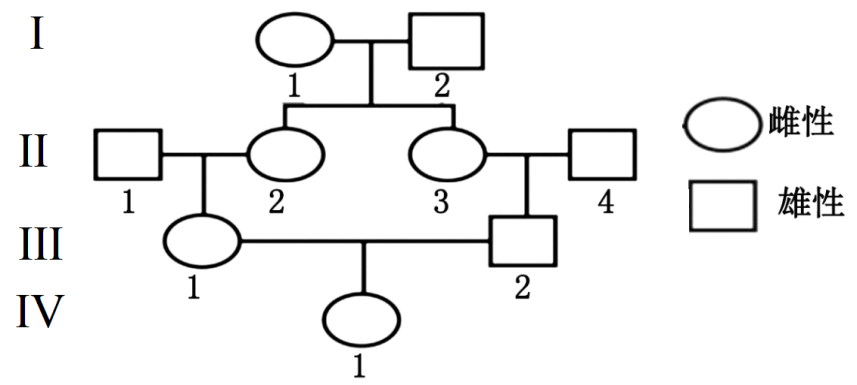
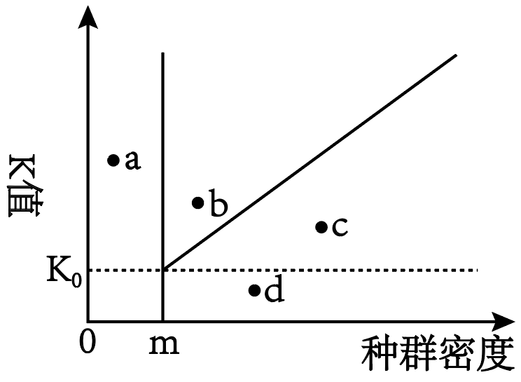
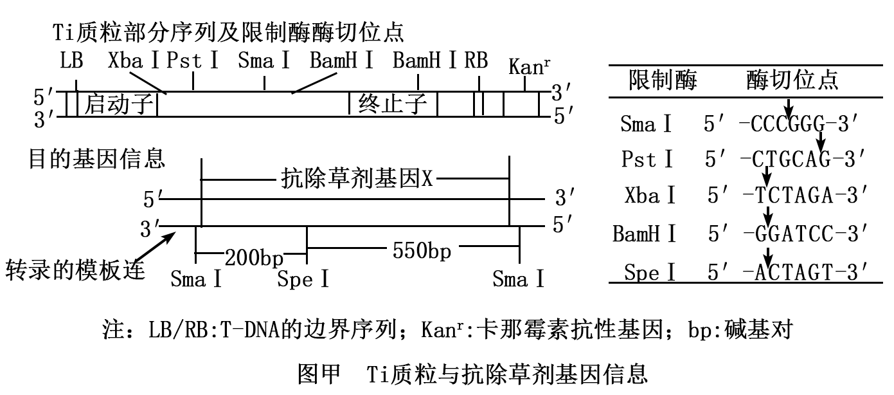
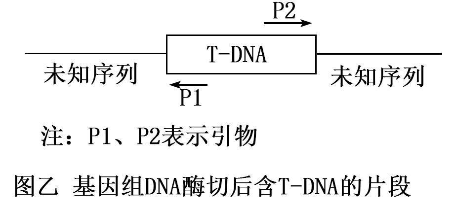

**2025年山东省普通高中学业水平等级考试**

**生物**

**注意事项：**

**1．答卷前，考生务必将自己的姓名、考生号等填写在答题卡和试卷指定位置。**

**2．回答选择题时，选出每小题答案后、用铅笔把答题卡上对应题目的答案标号涂黑。如需改动，用橡皮擦干净后，再选涂其他答案标号。回答非选择题时，将答案写在答题卡上写在本试卷上无效。**

**3．考试结束后，将本试卷和答题卡一并交回。**

**一、选择题：本题共15小题，每小题2分，共30分。每小题只有一个选项符合题目要求。**

1\. 在细胞的生命活动中，下列细胞器或结构不会出现核酸分子的是（ ）

A. 高尔基体 B. 溶酶体 C. 核糖体 D. 端粒

2\. 生长于NaCl浓度稳定在100 mmol/L的液体培养基中的酵母菌，可通过离子通道吸收Na+，但细胞质基质中Na+浓度超过30 mmol/L时会导致酵母菌死亡。为避免细胞质基质Na+浓度过高，液泡膜上的蛋白N可将Na+以主动运输的方式转运到液泡中，细胞膜上的蛋白W也可将Na+排出细胞。下列说法错误的是（ ）

A. Na+在液泡中的积累有利于酵母细胞吸水

B. 蛋白N转运Na+过程中自身构象会发生改变

C. 通过蛋白W外排Na+的过程不需要细胞提供能量

D. Na+通过离子通道进入细胞时不需要与通道蛋白结合

3\. 利用病毒样颗粒递送调控细胞死亡的执行蛋白可控制细胞的死亡方式。细胞接收执行蛋白后，若激活蛋白P，则诱导细胞发生凋亡，细胞膜突起形成小泡，染色质固缩；若激活蛋白Q，则诱导细胞发生焦亡，细胞肿涨破裂，释放大量细胞因子。下列说法错误的是（ ）

A. 细胞焦亡可能引发机体的免疫反应

B. 细胞凋亡是由基因所决定的程序性细胞死亡

C. 细胞凋亡和细胞焦亡受不同蛋白活性变化的影响

D. 通过细胞自噬清除衰老线粒体的过程属于细胞凋亡

4\. 关于细胞以葡萄糖为原料进行有氧呼吸和无氧呼吸的过程，下列说法正确的是（ ）

A. 有氧呼吸的前两个阶段均需要O2作为原料

B. 有氧呼吸的第二阶段需要H2O作为原料

C. 无氧呼吸的两个阶段均不产生NADH

D. 经过无氧呼吸，葡萄糖分子中的大部分能量以热能的形式散失

5\. 关于豌豆胞核中淀粉酶基因遗传信息传递的复制、转录和翻译三个过程，下列说法错误的是（ ）

A. 三个过程均存在碱基互补配对现象

B. 三个过程中只有复制和转录发生在细胞核内

C. 根据三个过程的产物序列均可确定其模板序列

D. RNA聚合酶与核糖体沿模板链的移动方向不同

6\. 镰状细胞贫血是由等位基因H、h控制的遗传病。患者（hh）的红细胞只含异常血红蛋白，仅少数患者可存活到成年；正常人（HH）的红细胞只含正常血红蛋白；携带者（Hh）的红细胞含有正常和异常血红蛋白，并对疟疾有较强的抵抗力。下列说法错误的是（ ）

A. 引起镰状细胞贫血的基因突变为中性突变

B. 疟疾流行区，基因h不会在进化历程中消失

C. 基因h通过控制血红蛋白的结构影响红细胞的形态

D. 基因h可影响多个性状，不能体现基因突变的不定向性

7\. 某动物家系的系谱图如图所示。a1、a2、a3、a4是位于X染色体上的等位基因，Ⅰ-1基因型为XalXa2，Ⅰ-2基因型为Xa3Y，Ⅱ-1和Ⅱ-4基因型均为Xa4Y，Ⅳ-1为纯合子的概率为（ ）

A. 3/64 B. 3/32 C. 1/8 D. 3/16

8\. 神经细胞动作电位产生后，K+外流使膜电位恢复为静息状态的过程中，膜上的钠钾泵转运K+、Na+的活动增强，促使膜内外的K+、Na+分布也恢复到静息状态。已知胞内K+浓度总是高于胞外，胞外Na+浓度总是高于胞内。下列说法错误的是（ ）

A. 若增加神经细胞外的Na+浓度，动作电位的幅度增大

B. 若静息状态下Na+通道的通透性增加，静息电位的幅度不变

C. 若抑制钠钾泵活动，静息电位和动作电位的幅度都减小

D. 神经细胞的K+、Na+跨膜运输方式均包含主动运输和被动运输

9\. 机体长期感染某病毒可导致细胞癌变。交感神经释放的神经递质作用于癌细胞表面β受体，上调癌细胞某蛋白的表达，破坏癌细胞的连接，从而促进癌细胞转移。下列说法错误的是（ ）

A. 机体清除癌细胞的过程属于免疫自稳

B. 使用β受体阻断剂可降低癌细胞转移率

C. 可通过接种该病毒疫苗降低患相关癌症的风险

D. 辅助性T细胞可能参与机体清除癌细胞的过程

10\. 果头脱落受多种激素调控。某植物果实脱落的调控过程如图所示。下列说法错误的是（ ）

A. 脱落酸通过促进乙烯的合成促进该植物果实脱落

B. 脱落酸与生长素含量的比值影响该植物果实脱落

C. 喷施适宜浓度的生长素类调节剂有利于防止该植物果实脱落

D. 该植物果实脱落过程中产生的乙烯对自身合成的调节属于负反馈

11\. 某湿地公园出现大量由北方前来越冬的候鸟，下列说法正确的是（ ）

A. 候鸟前来该湿地公园越冬的信息传递只发生在鸟类与鸟类之间

B. 鸟类的到来改变了该湿地群落冬季的物种数目，属于群落演替

C. 来自不同地区鸟类的交配机会增加，体现了生物多样性的间接价值

D. 湿地水位深浅不同的区域分布着不同的鸟类种群，体现了群落的垂直结构

12\. 某时刻某动物种群所有个体的有机物中的总能量为①，一段时后．此种群所有存活个体的有机物中的总能量为②，此种群在这段时间内通过呼吸作用散失的总能量为③，这段时间内死亡个体的有机物中的总能量为④。此种群在此期间无迁入迁出，无个体被捕食，估算这段时间内用于此种群生长、发育和繁殖的总能量时，应使用的表达式为（ ）

A. ②-①+④ B. ②-①+③ C. ②-①-③+④ D. ②-①+③+①

13\. “绿叶中色素的提取和分离”实验操作中要注意“干燥”，下列说法错误的是（ ）

A. 应使用干燥的定性滤纸

B. 绿叶需烘干后再提取色素

C 重复画线前需等待滤液细线干燥

D. 无水乙醇可用加入适量无水碳酸钠的95%乙醇替代

14\. 利用动物体细胞核移植技术培育转基因牛的过程如图所示，下列说法错误的是（ ）

A. 对牛乙注射促性腺激素是为了收集更多的卵母细胞

B. 卵母细胞去核应在其减数分裂Ⅰ中期进行

C. 培养牛甲的体细胞时应定期更换培养液

D. 可用PCR技术鉴定犊牛丁是否为转基因牛

15\. 深海淤泥中含有某种能降解纤维素的细菌。探究不同压强下，该细菌在以纤维素或淀粉为唯一碳源的培养基上的生长情况。其他条件相同且适宜，实验处理及结果如表所示。下列说法正确的是（ ）

|     |     |     |     |     |
|:---:|:---:|:---:|:---:|:---:|
| 组别  | 压强  | 纤维素 | 淀粉  | 菌落  |
| ①   | 常压  | \-  | \+  | \-  |
| ②   | 常压  | \+  | \-  | \-  |
| ③   | 高压  | \-  | \+  | \-  |
| ④   | 高压  | \+  | \-  | \+  |

注： “+”表示有；“一”表示无

A. 可用平板划线法对该菌计数

B. 制备培养基的过程中，应先倒平板再进行高压蒸汽灭菌

C. 由②④组可知，在以纤维素为唯一碳源的培养基上，该菌可在常压下生长

D. 由③④组可知，高压下该菌不能在以淀粉为唯一碳源的培养基上生长

**二、选择题：本题共5小题，每小题3分，共15分。每小题有一个或多个选项符合题目要求，全部选对得3分，选对但不全的得1分，有选错的得0分。**

16\. 在低氧条件下，某单细胞藻叶绿体基质中的蛋白F可利用H+和光合作用产生的NADPH生成H2。为研究藻释放H2的培养条件，将大肠杆菌和藻按一定比例混合均匀后分成2等份，1份形成松散菌-藻体，另1份形成致密菌-藻体，在CO2充足的封闭体系中分别培养并测定体系中的气体含量，2种菌-藻体培养体系中的O2含量变化相同，结果如图所示。培养过程中，任意时刻2体系之间的光反应速率无差异。下列说法错误的是（ ）

A. 菌-藻体不能同时产生O2和H2

B. 菌-藻体的致密程度可影响H2生成量

C. H2的产生场所是该藻叶绿体的类囊体薄膜

D. 培养至72h，致密菌-藻体暗反应产生的有机物多于松散菌-藻体

17\. 果蝇体节发育与分别位于2对常染色体上的等位基因M、m和N、n有关，M对m、N对n均为显性。其中1对为母体效应基因，只要母本该基因为隐性纯合，子代就体节缺失，与自身该对基因的基因型无关；另1对基因无母体效应，该基因的隐性纯合子体节缺失。下列基因型的个体均体节缺失，能判断哪对等位基因为母体效应基因的是（ ）

A. MmNn B. MmNN C. mmNN D. Mmnn

18\. 低钠血症患者的血钠浓度和细胞外液渗透压均低于正常值。依据患者细胞外液量减少、不变和增加，依次称为低容量性、等容量性和高容量性低钠血症。下列说法正确的是（ ）

A. 醛固酮分泌过多可能引起低容量性低钠血症

B. 抗利尿激素分泌过多可能引起高容量性低钠血症

C. 与患病前相比，等容量性低钠血症患者更易产生渴感

D. 与患病前相比，低钠血症患者的细胞外液中总钠量可能增加

19\. 种群延续所需要的最小种群密度为临界密度，只有大于临界密度，种群数量才能增加，最后会达到并维持在一个相对稳定的数量，即环境容纳量（K值）。不同环境条件下，同种动物种群的K值不同。图中曲线上的点表示在不同环境条件下某动物种群的K值和达到K值时的种群密度，其中m为该动物种群的临界密度，K0以下的环境表示该动物的灭绝环境。a、b、c、d四个点表示不同环境条件下该动物的4个种群的K值及当前的种群密度，且4个种群所在区域面积相等，各种群所处环境稳定。不考虑迁入迁出，下列说法错误的是（ ）

A. 可通过提高K值对a点种群进行有效保护

B. b点种群发展到稳定期间，出生率大于死亡率

C. c点种群发展到稳定期间，种内竞争逐渐加剧

D. 通过一次投放适量该动物可使d点种群得以延续

20\. 酿造某大曲白酒的过程中，微生物的主要来源有大曲和窖泥。大曲主要提供白酒酿造过程中糖化所需的微生物，制曲过程需经堆积培养，培养时温度可达60℃左右；将大曲和酿酒原料混合，初步发酵后放入窖池；窖池发酵是白酒酿造过程中微生物发酵的最后阶段。下列说法正确的是（ ）

A. 堆积培养过程中的高温有利于筛选酿酒酵母

B. 大曲中存在能分泌淀粉酶的微生物

C. 窖池发酵过程中，酵母菌以无氧呼吸为主

D. 窖池密封不严使酒变酸是因为乳酸含量增加

**三、非选择题：本题共5小题．共55分。**

21\. 高光强环境下，植物光合系统吸收的过剩光能会对光合系统造成损伤，引起光合作用强度下降。植物进化出的多种机制可在一定程度上减轻该损伤。某绿藻可在高光强下正常生长，其部分光合过程如图所示。

（1）叶绿体膜的基本支架是\_\_\_\_\_；叶绿体中含有许多由类囊体组成的\_\_\_\_\_，扩展了受光面积。

（2）据图分析，生成NADPH所需的电子源自于\_\_\_\_\_。采用同位素示踪法可追踪物质的去向，用含3H2O的溶液培养该绿藻一段时间后，以其光合产物葡萄糖为原料进行有氧呼吸时，能进入线粒体基质被3H标记的物质有H2O、\_\_\_\_\_，离心收集绿藻并重新放入含H218O的培养液中，在适宜光照条件下继续培养，绿藻产生的带18O标记的气体有\_\_\_\_\_。

（3）据图分析，通过途径①和途径②消耗过剩的光能减轻光合系统损伤的机制分别为\_\_\_\_\_。

22\. 某二倍体两性花植物的花色由2对等位基因A、a和B、b控制，该植物有2条蓝色素合成途径。基因A和基因B分别编码途径①中由无色前体物质M合成蓝色素所必需的酶A和酶B；另外，只要有酶A或酶B存在，就能完全抑制途径②的无色前体物质N合成蓝色素。已知基因a和基因b不编码蛋白质，无蓝色素时植物的花为白花。相关杂交实验及结果如表所示，不考虑其他突变和染色体互换；各配子和个体活力相同。

|     |                     |                               |                |
|:---:|:-------------------:|:-----------------------------:|:--------------:|
| 组别  | 亲本杂交组合              | F1                 | F2  |
| 实验一 | 甲（白花植株）×乙（白花植株）     | 全为蓝花植株                        | 蓝花植株：白花植株=10:6 |
| 实验二 | AaBb（诱变）（♂）×aabb（♀） | 发现1株三体蓝花植株，该三体仅基因A或a所在染色体多了1条 |                |

（1）据实验一分析，等位基因A、a和B、b的遗传\_\_\_\_\_（填“符合”或“不符合”）自由组合定律。实验一的F2中，蓝花植株纯合体的占比为\_\_\_\_\_。

（2）已知实验二中被诱变亲本在减数分裂时只发生了1次染色体不分离。实验二中的F1三体蓝花植株的3种可能的基因型为AAaBb、\_\_\_\_\_。请通过1次杂交实验，探究被诱变亲本染色体不分离发生的时期。已知三体细胞减数分裂时，任意2条同源染色体可正常联会并分离，另1条同源染色体随机移向细胞任一极。

实验方案：\_\_\_\_\_（填标号），统计子代表型及比例。

①三体蓝花植株自交 ②三体蓝花植株与基因型为aabb的植株测交

预期结果：若\_\_\_\_\_，则染色体不分离发生在减数分裂Ⅰ；否则，发生在减数分裂Ⅱ。

（3）已知基因B→b只由1种染色体结构变异导致，且该结构变异发生时染色体只有2个断裂的位点。为探究该结构变异的类型，依据基因B所在染色体的DNA序列，设计了如图所示的引物，并以实验一中的甲、乙及F2中白花植株（丙）的叶片DNA为模板进行了PCR，同1对引物的扩增产物长度相同，结果如图所示，据图分析，该结构变异的类型是\_\_\_\_\_。丙的基因型可能为\_\_\_\_\_；若要通过PCR确定丙的基因型，还需选用的1对引物是\_\_\_\_\_。

23\. 机体内环境发生变化时，心血管活动的部分反射调节如图所示。

（1）调节心血管活动的基本神经中枢位于\_\_\_\_\_（填“大脑”“脑干”或“下丘脑”）。当血压突然升高时，机体可通过图示调节引起心率减慢、血管舒张，从而使血压下降并恢复正常，该调节过程中，\_\_\_\_\_（填“交感神经”或“副交感神经”）的活动减弱。

（2）血压调节过程中，压力感受器和化学感受器产生的兴奋在传入神经上都以\_\_\_\_\_信号的形式向前传导；兴奋只能由传出神经末梢向心肌细胞单向传递的原因是\_\_\_\_\_。

（3）已知血CO2浓度升高时，通过图示调节影响心率变化。化学感受器分为中枢和外周化学感受器2种类型，其中外周化学感受器位于头部以下，中枢化学感受器分布在脑内。注射药物X仅增加血CO2浓度，不影响其他生理功能。

实验目的：探究外周和中枢化学感受器是否均参与血CO2浓度对心率的调节。

实验步骤：①麻醉大鼠A和B；

②将大鼠A的头部血管与大鼠B的相应血管连接，使大鼠A头部的血液只与大鼠B循环，大鼠A头部以下血液循环以及大鼠B血液循环不变，大鼠A、B的其他部位保持不变，术后生理状态均正常；

③测量注射药物X前后的心率。

结果及结论：向大鼠B尾部静脉注射药物X，大鼠A心率升高，可得出的结论是\_\_\_\_\_（填“中枢”或“外周”）化学感受器参与了血CO2浓度对心率的调节。依据实验目的，还需要探究另1类化学感受器是否参与调节，在实验步骤①、②的基础上，需要继续进行的操作是\_\_\_\_\_。

24\. 某地区内，适宜生存于某群落生态环境的所有物种构成该群落的物种库，物种库大小指物种的总数目。存在于该群落物种库中，但未在该群落出现的物种称为缺失物种。群落完整性可用群落物种丰富度与物种库大小的比值表示。

（1）区别同一地区不同群落的重要特征是\_\_\_\_\_，该特征也是决定群落性质最重要的因素。调查群落中植物的物种丰富度常用样方法，此法还可用于估算植物种群的\_\_\_\_\_。

（2）两个群落的物种丰富度相同，缺失物种数也相同，这两个群落的物种库\_\_\_\_\_（填“一定”或“不一定”）相同，原因是\_\_\_\_\_。

（3）调查时发现某物种为某群落的缺失物种，在该群落所在地区建立保护区后此物种自然扩散到该群落，针对此物种的保护类型为\_\_\_\_\_。缺失物种自然扩散到该群落，以该群落为唯一群落的生态系统的抵抗力稳定性\_\_\_\_\_（填“提高”或“降低”）。

（4）分析受到破坏的荒漠和草原两个群落的生态恢复成功程度的差异时，最合适的指标为\_\_\_\_\_（填标号）。

A. 群落的物种丰富度 B. 群落缺失的物种数目 C. 群落完整性 D. 群落物种库大小

25\. 种子休眠是抵御穗发芽的一种机制。通过对Ti质粒的改造，利用农杆菌转化法将Ti质粒上的T-DNA随机整合到小麦基因组中，筛选到2个种子休眠相关基因的插入失活纯合突变体。与野生型相比，突变体种子的萌发率降低。小麦基因组序列信息已知。

（1）Ti质粒上与其在农杆菌中的复制能力相关的结构为\_\_\_\_\_。选用图甲中的SmaI对抗除草剂基因X进行完全酶切，再选择SmaI和\_\_\_\_\_对Ti质粒进行完全酶切，将产生的黏性末端补平，补平时使用的酶是\_\_\_\_\_。利用DNA连接酶将酶切后的包含抗除草剂基因X的片段与酶切并补平的Ti质粒进行连接，构建重组载体，转化大肠杆菌；经卡那霉素筛选并提取质粒后再选用限制酶\_\_\_\_\_进行完全酶切并电泳检测，若电泳结果呈现一长一短2条带，较短的条带长度近似为\_\_\_\_\_bp，则一定为正向重组质粒。

（2）为证明这两个突变体是由于T-DNA插入到小麦基因组中同一基因导致的，提取基因组DNA，经酶切后产生含有T-DNA的基因组片段（图乙）。在此酶切过程中，限于后续PCR难以扩增大片段DNA，最好使用识别序列为\_\_\_\_\_（填“4”“6”或“8”）个碱基对的限制酶，且T-DNA中应不含该酶的酶切位点。需首先将图乙的片段\_\_\_\_\_，才能利用引物P1和P2成功扩增未知序列。PCR扩增出未知序列后，进行了一系列操作，其中可以判断出2条片段的未知序列是否属于同一个基因的操作为\_\_\_\_\_（填“琼脂糖凝胶电泳”或“测序和序列比对”）。

（3）通过农杆菌转化法将构建的含有野生型基因的表达载体转入突变植株，如果检测到野生型基因，\_\_\_\_\_（填“能”或“不能”）确定该植株的表型为野生型。
