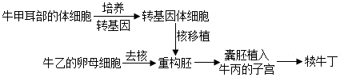
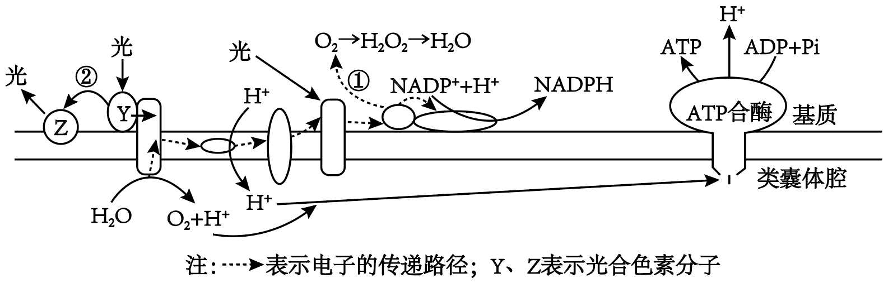
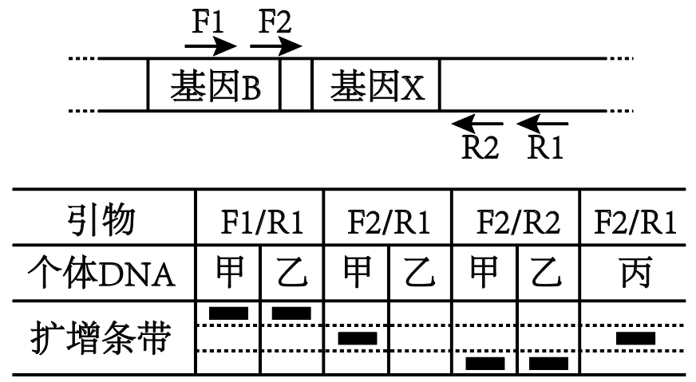

**2025年山东省普通高中学业水平等级考试**

**生物**

**注意事项：**

**1．答卷前，考生务必将自己的姓名、考生号等填写在答题卡和试卷指定位置。**

**2．回答选择题时，选出每小题答案后、用铅笔把答题卡上对应题目的答案标号涂黑。如需改动，用橡皮擦干净后，再选涂其他答案标号。回答非选择题时，将答案写在答题卡上写在本试卷上无效。**

**3．考试结束后，将本试卷和答题卡一并交回。**

**一、选择题：本题共15小题，每小题2分，共30分。每小题只有一个选项符合题目要求。**

1\. 在细胞的生命活动中，下列细胞器或结构不会出现核酸分子的是（ ）

A. 高尔基体 B. 溶酶体 C. 核糖体 D. 端粒

【答案】A

【解析】

【分析】细胞器的分类：①具有双层膜结构的细胞器有：叶绿体、线粒体。具有双层膜结构的细胞结构有叶绿体、线粒体和核膜。②具有单层膜结构的细胞器有内质网、高尔基体、溶酶体、液泡。具有单层膜结构的细胞结构有内质网、高尔基体、溶酶体、液泡和细胞膜。③不具备膜结构的细胞器有核糖体和中心体。膜结构是由磷脂双分子层构成。

【详解】A、高尔基体自身的结构和主要功能不涉及核酸。它既不像线粒体、叶绿体那样含有自己的DNA和RNA，也不像核糖体那样由RNA构成。因此，高尔基体中一般不会出现核酸分子，A符合题意；

B、当溶酶体分解衰老的线粒体、叶绿体或核糖体时，会分解其中的DNA和RNA。当它消化病毒或细菌时，也会分解其核酸。因此，在溶酶体的“工作”过程中，其内部是会出现核酸分子的（作为被水解的底物），B不符合题意；

C、核糖体本身就是由核糖体RNA（rRNA）和蛋白质构成的。rRNA是核酸的一种。此外，在翻译过程中，信使RNA（mRNA）作为模板，转运RNA（tRNA）负责运载氨基酸，它们也都会与核糖体结合。所以核糖体必然含有核酸，C不符合题意；

D、端粒的化学本质是DNA—蛋白质复合体。DNA本身就是脱氧核糖核酸，是核酸的一种。所以端粒中会出现核酸，D不符合题意。

故选A。

2\. 生长于NaCl浓度稳定在100 mmol/L的液体培养基中的酵母菌，可通过离子通道吸收Na+，但细胞质基质中Na+浓度超过30 mmol/L时会导致酵母菌死亡。为避免细胞质基质Na+浓度过高，液泡膜上的蛋白N可将Na+以主动运输的方式转运到液泡中，细胞膜上的蛋白W也可将Na+排出细胞。下列说法错误的是（ ）

A. Na+在液泡中的积累有利于酵母细胞吸水

B. 蛋白N转运Na+过程中自身构象会发生改变

C. 通过蛋白W外排Na+的过程不需要细胞提供能量

D. Na+通过离子通道进入细胞时不需要与通道蛋白结合

【答案】C

【解析】

【分析】主动运输的特点：逆浓度梯度、需要载体蛋白、消耗能量。主动运输普遍存在于动植物和微生物细胞中，通过主动运输来选择吸收所需要的物质，排出代谢废物和对细胞有害的物质，从而保证细胞和个体生命活动的需要。

【详解】A、Na+在液泡中的积累，细胞液浓度增加，从而有利于酵母细胞吸水，A正确；

B、液泡膜上的蛋白N可将Na+以主动运输的方式转运到液泡中，作为载体蛋白，蛋白N转运Na+过程中自身构象会发生改变，B正确；

C、为避免细胞质基质Na+浓度过高，液泡膜上的蛋白N可将Na+以主动运输的方式转运到液泡中，细胞膜上的蛋白W也可将Na+排出细胞，外排Na+也是主动运输，需要细胞提供能量，C错误；

D、Na+通过离子通道进入细胞时，Na+不需要与通道蛋白结合，D正确。

故选C。

3\. 利用病毒样颗粒递送调控细胞死亡的执行蛋白可控制细胞的死亡方式。细胞接收执行蛋白后，若激活蛋白P，则诱导细胞发生凋亡，细胞膜突起形成小泡，染色质固缩；若激活蛋白Q，则诱导细胞发生焦亡，细胞肿涨破裂，释放大量细胞因子。下列说法错误的是（ ）

A. 细胞焦亡可能引发机体的免疫反应

B. 细胞凋亡是由基因所决定的程序性细胞死亡

C. 细胞凋亡和细胞焦亡受不同蛋白活性变化的影响

D. 通过细胞自噬清除衰老线粒体的过程属于细胞凋亡

【答案】D

【解析】

【分析】细胞凋亡是由基因决定的细胞编程序死亡的过程，细胞凋亡是生物体正常的生命历程，对生物体是有利的，而且细胞凋亡贯穿于整个生命历程，细胞凋亡是生物体正常发育的基础、能维持组织细胞数目的相对稳定、是机体的一种自我保护机制。在成熟的生物体内，细胞的自然更新、被病原体感染的细胞的清除，是通过细胞凋亡完成的。

【详解】A、细胞焦亡时细胞破裂，释放大量细胞因子以及细胞中的内溶物，从而引发机体的免疫反应（炎症反应），A正确；

B、细胞凋亡是由基因控制的程序性细胞死亡，对机体是有利的，B正确；

C、激活蛋白P，则诱导细胞发生凋亡，激活蛋白Q，则诱导细胞发生焦亡，说明细胞凋亡和细胞焦亡受不同蛋白活性变化的影响，C正确；

D、细胞自噬是指细胞利用溶酶体降解自身受损的细胞器或大分子物质的过程，通过细胞自噬清除衰老线粒体的过程不属于细胞凋亡，D错误。

故选D。

4\. 关于细胞以葡萄糖为原料进行有氧呼吸和无氧呼吸的过程，下列说法正确的是（ ）

A. 有氧呼吸的前两个阶段均需要O2作为原料

B. 有氧呼吸的第二阶段需要H2O作为原料

C. 无氧呼吸的两个阶段均不产生NADH

D. 经过无氧呼吸，葡萄糖分子中的大部分能量以热能的形式散失

【答案】B

【解析】

【分析】有氧呼吸的第一、二、三阶段的场所依次是细胞质基质、线粒体基质和线粒体内膜，有氧呼吸第一阶段是葡萄糖分解成丙酮酸和\[H\]，合成少量ATP；第二阶段是丙酮酸和水反应生成二氧化碳和\[H\]，合成少量ATP；第三阶段是氧气和\[H\]反应生成水，合成大量ATP。无氧呼吸的场所是细胞质基质，无氧呼吸的第一阶段和有氧呼吸的第一阶段相同，无氧呼吸由于不同生物体中相关的酶不同，在植物细胞和酵母菌中产生酒精和二氧化碳，在动物细胞和乳酸菌中产生乳酸。

【详解】A、有氧呼吸的前两个阶段不需要氧气的参与，第三阶段需要氧气作为原料，A错误；

B、有氧呼吸的第二阶段是丙酮酸和H2O反应，产生二氧化碳、\[H\]，释放少量能量，B正确；

C、无氧呼吸第一阶段产生NADH，第二阶段消耗NADH，C错误；

D、经过无氧呼吸，葡萄糖分子中的大部分能量储存在乳酸或乙醇中，只释放出少量能量，D错误。

故选B。

5\. 关于豌豆胞核中淀粉酶基因遗传信息传递的复制、转录和翻译三个过程，下列说法错误的是（ ）

A. 三个过程均存在碱基互补配对现象

B. 三个过程中只有复制和转录发生在细胞核内

C. 根据三个过程的产物序列均可确定其模板序列

D. RNA聚合酶与核糖体沿模板链的移动方向不同

【答案】C

【解析】

【分析】DNA复制模板是DNA的两条链，原料是四种游离的脱氧核苷酸，产物是DNA；转录的模板是DNA的一条链，原料是四种游离的核糖核苷酸，产物是RNA；翻译的模板是mRNA，原料是氨基酸，产物是多肽。

【详解】A、DNA复制、转录和翻译过程中均遵循碱基互补配对原则，因此都存在碱基互补配对现象，A正确；

B、翻译发生在细胞质基质中的核糖体上，豌豆胞核中淀粉酶基因复制和转录的场所都是细胞核，B正确；

C、DNA复制和转录可以通过产物序列确定其模板序列，但翻译的产物是蛋白质，蛋白质的基本单位是氨基酸，由于密码子具有简并性，因此知道氨基酸序列不一定能准确知道mRNA上的碱基序列，C错误；

D、转录时需要RNA聚合酶的参与，RNA聚合酶从模板链的3'→5'，翻译时，核糖体从mRNA的5'→3'，移动方向不同，D正确。

故选C。

6\. 镰状细胞贫血是由等位基因H、h控制的遗传病。患者（hh）的红细胞只含异常血红蛋白，仅少数患者可存活到成年；正常人（HH）的红细胞只含正常血红蛋白；携带者（Hh）的红细胞含有正常和异常血红蛋白，并对疟疾有较强的抵抗力。下列说法错误的是（ ）

A. 引起镰状细胞贫血的基因突变为中性突变

B. 疟疾流行区，基因h不会在进化历程中消失

C. 基因h通过控制血红蛋白的结构影响红细胞的形态

D. 基因h可影响多个性状，不能体现基因突变的不定向性

【答案】A

【解析】

【分析】基因突变指的是基因内部因碱基对的增加、缺失或替换而引起基因内部碱基对的排列顺序发生改变的现象。

【详解】A、患者（hh）的红细胞只含异常血红蛋白，仅少数患者可存活到成年，说明引起镰状细胞贫血的基因突变为有害突变，A错误；

B、携带者（Hh）的红细胞含有正常和异常血红蛋白，并对疟疾有较强的抵抗力，说明基因h在抗疟疾过程中发挥一定的作用，是能适应某些特定环境的，因此疟疾流行区，基因h不会在进化历程中消失，B正确；

C、正常红细胞和异常红细胞含有的血红蛋白不相同，血红蛋白的结构不同影响了红细胞的形态，因此说基因h通过控制血红蛋白的结构影响红细胞的形态，C正确；

D、基因突变的不定向性指的是某一基因可以向多个方向突变，突变后控制的是同一性状的不同表现形式，基因h可影响多个性状，不能体现基因突变的不定向性，D正确。

故选A。

7\. 某动物家系的系谱图如图所示。a1、a2、a3、a4是位于X染色体上的等位基因，Ⅰ-1基因型为XalXa2，Ⅰ-2基因型为Xa3Y，Ⅱ-1和Ⅱ-4基因型均为Xa4Y，Ⅳ-1为纯合子的概率为（ ）

A. 3/64 B. 3/32 C. 1/8 D. 3/16

【答案】D

【解析】

【分析】决定它们的基因位于性染色体上，在遗传上总是和性别相关联，这种现象叫作伴性遗传。

【详解】根据题干信息和图可知：Ⅰ-1基因型为XalXa2，Ⅰ-2基因型为Xa3Y，所以Ⅱ-2和Ⅱ-3的基因型及其概率为1/2Xa1Xa3和1/2Xa2 Xa3。又因为Ⅱ-1和Ⅱ-4基因型均为Xa4Y，可以算出Ⅲ-1的基因型及其概率为1/4Xa1Xa4、1/4Xa2Xa4和2/4Xa3Xa4，而Ⅲ-2的基因型及其概率为1/4Xa1Y、1/4Xa2Y和2/4Xa3Y。所以可以得出Ⅳ-1为纯合子的概率为3/16，即ABC错误，D正确。

故选D。

8\. 神经细胞动作电位产生后，K+外流使膜电位恢复为静息状态的过程中，膜上的钠钾泵转运K+、Na+的活动增强，促使膜内外的K+、Na+分布也恢复到静息状态。已知胞内K+浓度总是高于胞外，胞外Na+浓度总是高于胞内。下列说法错误的是（ ）

A. 若增加神经细胞外的Na+浓度，动作电位的幅度增大

B. 若静息状态下Na+通道的通透性增加，静息电位的幅度不变

C. 若抑制钠钾泵活动，静息电位和动作电位的幅度都减小

D. 神经细胞的K+、Na+跨膜运输方式均包含主动运输和被动运输

【答案】B

【解析】

【分析】静息时，神经细胞膜对钾离子的通透性大，钾离子大量外流，形成内负外正的静息电位；受到刺激后，神经细胞膜的通透性发生改变，对钠离子的通透性增大，钠离子内流，形成内正外负的动作电位。

【详解】A、动作电位的形成与Na+内流有关，若增加神经细胞外的Na+浓度，Na+内流增加，动作电位的幅度增大，A正确；

B、若静息状态下Na+通道的通透性增加，使Na+内流增多，会打破原有K+外流主导的离子平衡，静息电位的幅度减小，B错误；

C、若抑制钠钾泵活动，导致膜外Na+和膜内K+减少，静息电位和动作电位的幅度都减小，C正确；

D、神经细胞通过钠钾泵实现钠钾离子的主动运输，通过离子通道实现钠钾离子的被动运输，D正确。

故选B。

9\. 机体长期感染某病毒可导致细胞癌变。交感神经释放的神经递质作用于癌细胞表面β受体，上调癌细胞某蛋白的表达，破坏癌细胞的连接，从而促进癌细胞转移。下列说法错误的是（ ）

A. 机体清除癌细胞的过程属于免疫自稳

B. 使用β受体阻断剂可降低癌细胞转移率

C. 可通过接种该病毒疫苗降低患相关癌症的风险

D. 辅助性T细胞可能参与机体清除癌细胞的过程

【答案】A

【解析】

【分析】免疫系统的基本功能：①免疫防御：机体排除外来抗原性异物的一种免疫防护作用。这是免疫系统最基本的功能。该功能正常时，机体能抵抗病原体的入侵；异常时，免疫反应过强、过弱或缺失，可能会导致组织损伤或易被病原体感染等问题；②免疫自稳：指机体清除衰老或损伤的细胞，进行自身调节，维持内环境稳态的功能。正常情况下，免疫系统对自身的抗原物质不产生免疫反应；若该功能异常，则容易发生自身免疫病；③免疫监视：指机体识别和清除突变的细胞，防止肿瘤的发生。机体内的细胞因物理、化学或病毒等致癌因素的作用而发生癌变，这是体内最危险的“敌人”。机体免疫功能正常时，可识别这些突变的肿瘤细胞，然后调动一切免疫因素将其消除；若此功能低下或失调，机体会有肿瘤发生或持续的病毒感染。

【详解】A、机体清除癌细胞的过程属于免疫监视，A错误；

B、交感神经释放的神经递质作用于癌细胞表面β受体，上调癌细胞某蛋白的表达，破坏癌细胞的连接，从而促进癌细胞转移，使用β受体阻断剂可以降低癌细胞某蛋白的表达，从而降低癌细胞转移率，B正确；

C、机体长期感染某病毒可导致细胞癌变，通过接种该病毒疫苗产生相应的效应细胞、抗体，从而清除该病毒，进而降低患相关癌症的风险，C正确；

D、机体通过细胞免疫清除癌细胞，细胞免疫需要辅助性T细胞的参与，D正确。

故选A。

10\. 果头脱落受多种激素调控。某植物果实脱落的调控过程如图所示。下列说法错误的是（ ）

A. 脱落酸通过促进乙烯的合成促进该植物果实脱落

B. 脱落酸与生长素含量的比值影响该植物果实脱落

C. 喷施适宜浓度的生长素类调节剂有利于防止该植物果实脱落

D. 该植物果实脱落过程中产生的乙烯对自身合成的调节属于负反馈

【答案】D

【解析】

【分析】赤霉素的作用是促进生长，解除休眠。生长素的作用是促进细胞生长，促进枝条生根，促进果实发育等。脱落酸的作用是抑制细胞分裂，促进叶和果实的衰老和脱落。细胞分裂素的作用是促进细胞分裂和组织分化。

【详解】A、据图示，脱落酸促进乙烯合成酶的合成，而乙烯合成酶能催化乙烯的合成。因此，脱落酸可以间接地促进乙烯的合成。而乙烯又能促进果实脱落，A正确；

B、从图中可以看出，生长素抑制脱落，而脱落酸促进脱落。这两种激素的作用是相互拮抗的。因此，它们的比值，将决定最终是脱落还是不脱落。当生长素含量高，脱落酸/生长素比值低时，倾向于抑制脱落；反之，当脱落酸含量高，该比值高时，倾向于促进脱落，B正确；

C、图示明确指出生长素抑制脱落酸的合成。抑制了脱落酸，就等于抑制了整个促进脱落的信号通路。因此，人为地喷施生长素类调节剂（如萘乙酸），可以提高植物体内的生长素水平，从而抑制脱落酸的产生，达到防止果实过早脱落（保果）的目的。这是生长素在农业生产上的一个重要应用，C正确；

D、图中关于乙烯的调节环路可以得出乙烯的产生会抑制生长素的形成，而生长素会抑制脱落酸的合成，最后脱落酸会促进乙烯合成酶合成乙烯。这意味着乙烯的产生会促进其合成酶的产生，从而导致更多的乙烯被合成。这种“产物促进自身生成”的调节机制，是一种自我放大的效应，被称为正反馈，D错误。

故选D。

11\. 某湿地公园出现大量由北方前来越冬的候鸟，下列说法正确的是（ ）

A. 候鸟前来该湿地公园越冬的信息传递只发生在鸟类与鸟类之间

B. 鸟类的到来改变了该湿地群落冬季的物种数目，属于群落演替

C. 来自不同地区鸟类的交配机会增加，体现了生物多样性的间接价值

D. 湿地水位深浅不同的区域分布着不同的鸟类种群，体现了群落的垂直结构

【答案】C

【解析】

【分析】群落的结构包括水平结构、垂直结构和时间结构。

【详解】A、候鸟前来该湿地公园越冬的信息传递不仅发生在鸟类与鸟类之间，还发生在鸟类与其他生物之间，鸟类与环境之间，A错误；

B、鸟类在特定的时间到来体现的是群落的时间结构，不属于群落演替，B错误；

C、湿地公园出现大量由北方前来越冬的候鸟，使得来自不同地区鸟类的交配机会增加，从而增加了遗传多样性，体现了生物多样性的间接价值，C正确；

D、湿地水位深浅不同的区域，由于不同区域环境不同，因此分布着不同的鸟类种群，体现了群落的水平结构，D错误。

故选C。

12\. 某时刻某动物种群所有个体的有机物中的总能量为①，一段时后．此种群所有存活个体的有机物中的总能量为②，此种群在这段时间内通过呼吸作用散失的总能量为③，这段时间内死亡个体的有机物中的总能量为④。此种群在此期间无迁入迁出，无个体被捕食，估算这段时间内用于此种群生长、发育和繁殖的总能量时，应使用的表达式为（ ）

A. ②-①+④ B. ②-①+③ C. ②-①-③+④ D. ②-①+③+①

【答案】A

【解析】

【分析】能量的去路：①自身呼吸消耗、转化为其他形式的能量和热能；②流向下一营养级；③残体、粪便等被分解者分解；④未被利用。即一个营养级所同化的能量=呼吸消耗的能量+被下一营养级同化的能量+分解者利用的能量+未被利用的能量。

【详解】据题意可知，种群所有存活个体的有机物中的总能量②为最终存活个体能量包括初始存活个体的最终能量和新出生并存活个体的能量，某时刻某动物种群所有个体的有机物中的总能量①初始总能量包括期初所有个体的总能量。 ④这段时间内死亡个体在死亡时的有机物能量包括初始个体死亡和新出生但死亡个体的能量。 ③是代谢过程中呼吸散失的能量，用于维持生命活动，不直接用于生长、发育和繁殖，因此不包括在净生产量中。 在无迁入迁出、无个体被捕食的条件下，种群用于生长、发育和繁殖的总能量（即净生产量）可通过生物量的净变化和死亡个体的损失能量来表示，即 ②-① 反映了种群生物量的净生产量，表示存活种群的能量变化，④死亡个体的有机物中的总能量代表死亡个体的损失能量，故用于该种群生长、发育和繁殖的总能量的表达式为②-①+④，A正确，BCD错误。

故选A。

13\. “绿叶中色素的提取和分离”实验操作中要注意“干燥”，下列说法错误的是（ ）

A. 应使用干燥的定性滤纸

B. 绿叶需烘干后再提取色素

C. 重复画线前需等待滤液细线干燥

D. 无水乙醇可用加入适量无水碳酸钠的95%乙醇替代

【答案】B

【解析】

【分析】绿叶中色素的提取和分离实验，提取色素时需要加入无水乙醇或丙酮，目的是溶解色素；研磨后进行过滤（用单层尼龙布过滤研磨液）；分离色素时采用纸层析法（用干燥处理过的定性滤纸条），原理是色素在层析液中的溶解度不同，随着层析液扩散的速度不同。

【详解】A、光合色素分离实验需要使用干燥的定性滤纸，水分会影响层析液在滤纸条上扩散从而影响色素的分离，A正确；

B、提取光合色素可以使用新鲜的绿叶，也可以将绿叶烘干后再提取，B错误；

C、重复画线前需等待滤液细线干燥，否者会导致滤液细线变粗，最终导致分离的色素条带不清晰，C正确；

D、提取光合色素一般用无水乙醇，若没有无水乙醇，可以用加入适量无水碳酸钠的95%乙醇替代，D正确。

故选B。

14\. 利用动物体细胞核移植技术培育转基因牛的过程如图所示，下列说法错误的是（ ）

A. 对牛乙注射促性腺激素是为了收集更多的卵母细胞

B. 卵母细胞去核应在其减数分裂Ⅰ中期进行

C. 培养牛甲的体细胞时应定期更换培养液

D. 可用PCR技术鉴定犊牛丁是否为转基因牛

【答案】B

【解析】

【分析】动物细胞培养的条件（1）营养条件。（2）无菌、无毒的环境：培养液和培养用具灭菌处理、无菌环境下操作、定期更换培养液。（3）适宜的温度、pH和渗透压。（4）气体环境：95%空气和5%CO2。

【详解】A、对牛乙注射促性腺激素进行超数排卵，目的是收集更多数量的卵母细胞，以便后续进行核移植操作，A正确；

B、卵母细胞去核应在其减数分裂Ⅱ中期进行，B错误；

C、在培养动物体细胞时，需要定期更换培养液，防止细胞代谢产物的积累对细胞自身造成危害，C正确；

D、PCR技术可以扩增特定的DNA片段，通过检测犊牛丁细胞中是否含有转基因的DNA片段，就可以鉴定犊牛丁是否为转基因牛，D正确。

故选B。

15\. 深海淤泥中含有某种能降解纤维素的细菌。探究不同压强下，该细菌在以纤维素或淀粉为唯一碳源的培养基上的生长情况。其他条件相同且适宜，实验处理及结果如表所示。下列说法正确的是（ ）

|     |     |     |     |     |
|:---:|:---:|:---:|:---:|:---:|
| 组别  | 压强  | 纤维素 | 淀粉  | 菌落  |
| ①   | 常压  | \-  | \+  | \-  |
| ②   | 常压  | \+  | \-  | \-  |
| ③   | 高压  | \-  | \+  | \-  |
| ④   | 高压  | \+  | \-  | \+  |

注： “+”表示有；“一”表示无

A. 可用平板划线法对该菌计数

B. 制备培养基的过程中，应先倒平板再进行高压蒸汽灭菌

C. 由②④组可知，在以纤维素为唯一碳源的培养基上，该菌可在常压下生长

D. 由③④组可知，高压下该菌不能在以淀粉为唯一碳源的培养基上生长

【答案】D

【解析】

【详解】选择培养基是将允许特定种类的微生物生长、同时抑制或阻止其他微生物生长的培养基；鉴别培养基是在培养基中加入某种试剂或化学药品，使培养后会发生某种变化，从而区别不同类型的微生物的培养基。

【点睛】A、平板划线法是用来分离和纯化微生物，获得单个菌落的技术，其主要目的是分离而不是计数。用于活菌计数的方法通常是稀释涂布平板法，A错误；

B、制备固体培养基（琼脂平板）的正确流程是：先将培养基成分溶解、调整pH值后，分装到三角瓶中，然后进行高压蒸汽灭菌。待培养基冷却至50℃左右时，再在无菌条件下（如超净工作台）倒入无菌的培养皿中（即“倒平板”），B错误；

C、组②为常压 + 纤维素，结果无菌落，而组④为高压 + 纤维素，结果是有菌落。 这个对比恰好说明，在以纤维素为碳源的条件下，该菌不能在常压下生长，而能在高压下生长，C错误；

D、③④组形成了一个对照实验，变量是碳源。实验结果表明，在高压条件下，该细菌可以利用纤维素生长（组④），但不能利用淀粉生长（组③），D正确。

故选D。

**二、选择题：本题共5小题，每小题3分，共15分。每小题有一个或多个选项符合题目要求，全部选对得3分，选对但不全的得1分，有选错的得0分。**

16\. 在低氧条件下，某单细胞藻叶绿体基质中的蛋白F可利用H+和光合作用产生的NADPH生成H2。为研究藻释放H2的培养条件，将大肠杆菌和藻按一定比例混合均匀后分成2等份，1份形成松散菌-藻体，另1份形成致密菌-藻体，在CO2充足的封闭体系中分别培养并测定体系中的气体含量，2种菌-藻体培养体系中的O2含量变化相同，结果如图所示。培养过程中，任意时刻2体系之间的光反应速率无差异。下列说法错误的是（ ）

A. 菌-藻体不能同时产生O2和H2

B. 菌-藻体的致密程度可影响H2生成量

C. H2的产生场所是该藻叶绿体的类囊体薄膜

D. 培养至72h，致密菌-藻体暗反应产生的有机物多于松散菌-藻体

【答案】ACD

【解析】

【分析】光反应可以NADPH、氧气和ATP，NADPH和ATP可以用于暗反应中三碳酸的还原，光反应和暗反应相互联系，互相影响。

【详解】A、单细胞藻光反应可以产生NADPH、氧气和ATP，蛋白F可利用H+和光合作用产生的NADPH生成H2，因此菌-藻体能同时产生O2和H2，A错误；

B、对比松散菌-藻体和致密菌-藻体，相同时间产生的H2含量相对值不同，说明菌-藻体的致密程度可影响H2生成量，B正确；

C、某单细胞藻叶绿体基质中的蛋白F可利用H+和光合作用产生的NADPH生成H2，说明H2的产生场所是该藻叶绿体的基质中，C错误；

D、任意时刻2体系之间的光反应速率无差异，说明光反应产生的NADPH相同，致密菌-藻体产生的H2多，说明消耗的NADPH多，则用于暗反应的NADPH少，因此培养至72h，致密菌-藻体暗反应产生的有机物少于松散菌-藻体，D错误。

故选ACD。

17\. 果蝇体节发育与分别位于2对常染色体上的等位基因M、m和N、n有关，M对m、N对n均为显性。其中1对为母体效应基因，只要母本该基因为隐性纯合，子代就体节缺失，与自身该对基因的基因型无关；另1对基因无母体效应，该基因的隐性纯合子体节缺失。下列基因型的个体均体节缺失，能判断哪对等位基因为母体效应基因的是（ ）

A. MmNn B. MmNN C. mmNN D. Mmnn

【答案】B

【解析】

【分析】1、基因的概念：基因是具有遗传效应的DNA片段，是决定生物性状的基本单位。

2、基因和染色体的关系：基因在染色体上，并且在染色体上呈线性排列，染色体是基因的主要载体。

【详解】A、根据题意，2对常染色体上的等位基因M、m和N、n，其中1对为母体效应基因，只要母本该基因为隐性纯合，子代就体节缺失，与自身该对基因的基因型无关；另1对基因无母体效应，该基因的隐性纯合子体节缺失，MmNn均为杂合子，无法判断导致表型为体节缺失的母本的哪一对等位基因隐性纯合，A错误；

B、MmNN中Mm、NN都不是隐性纯合子，不符合题意中，1对基因无母体效应，该基因的隐性纯合子体节缺失，因此只能符合第一种情况，因此推测Mm是母体效应基因，正是由于母本含有mm隐性纯合子，MmNN才表现为体节缺失，B正确；

C、mmNN中mm为隐性纯合子，可能是其本身隐性纯合子，表现为体节缺失，也可能是亲本是含有隐性纯合子mm，因此表现型为体节缺失，无法判定mm是具有母体效应基因还是本身隐性纯合出现得体节缺失，同理，Mmnn中，nn可能是其本身隐性纯合子，表现为体节缺失，也可能是亲本是含有隐性纯合子，因此表现型为体节缺失，因此也无法判定，C、D错误。

故选B。

18\. 低钠血症患者的血钠浓度和细胞外液渗透压均低于正常值。依据患者细胞外液量减少、不变和增加，依次称为低容量性、等容量性和高容量性低钠血症。下列说法正确的是（ ）

A. 醛固酮分泌过多可能引起低容量性低钠血症

B. 抗利尿激素分泌过多可能引起高容量性低钠血症

C. 与患病前相比，等容量性低钠血症患者更易产生渴感

D. 与患病前相比，低钠血症患者的细胞外液中总钠量可能增加

【答案】BD

【解析】

【分析】水盐平衡调节：①当人饮水不足、体内失水过多或吃的食物过咸，细胞外液渗透压就会升高，这一情况刺激下丘脑渗透压感受器，使得下丘脑一方面把信息传到大脑皮层感觉中枢，使人产生渴觉而主动饮水，另一方面，下丘脑还分泌抗利尿激素，并由垂体释放到血液中，血液中的抗利尿激素含量增加，就加强了肾小管、集合管对水分的重吸收，使尿量减少。②当人饮水过多时，细胞外液渗透压就会降低，这一情况刺激下丘脑渗透压感受器，使得下丘脑一方面把信息传到大脑皮层感觉中枢，使人不产生渴觉，另一方面，下丘脑还减少分泌抗利尿激素，垂体释放到血液中的抗利尿激素减少，就减弱了肾小管、集合管对水分的重吸收，使尿量增加。

【详解】A、醛固酮的作用是保钠排钾，醛固酮分泌过多会导致血钠升高，而低钠血症患者的血钠浓度和细胞外液渗透压均低于正常值，因此醛固酮分泌过多不可能引起低容量性低钠血症，A错误；

B、抗利尿激素分泌过多，水的重吸收增多，细胞外液量增加，可能引起高容量性低钠血症，B正确；

C、与患病前相比，等容量性低钠血症患者细胞外液渗透压小，渗透压感受器受到的刺激减弱，不易产生渴感，C错误；

D、低钠血症患者的血钠浓度低于正常值，但患者细胞外液量减少、不变和增加，因此与患病前相比，低钠血症患者的细胞外液中总钠量可能增加，D正确。

故选BD。

19\. 种群延续所需要的最小种群密度为临界密度，只有大于临界密度，种群数量才能增加，最后会达到并维持在一个相对稳定的数量，即环境容纳量（K值）。不同环境条件下，同种动物种群的K值不同。图中曲线上的点表示在不同环境条件下某动物种群的K值和达到K值时的种群密度，其中m为该动物种群的临界密度，K0以下的环境表示该动物的灭绝环境。a、b、c、d四个点表示不同环境条件下该动物的4个种群的K值及当前的种群密度，且4个种群所在区域面积相等，各种群所处环境稳定。不考虑迁入迁出，下列说法错误的是（ ）

A. 可通过提高K值对a点种群进行有效保护

B. b点种群发展到稳定期间，出生率大于死亡率

C. c点种群发展到稳定期间，种内竞争逐渐加剧

D. 通过一次投放适量该动物可使d点种群得以延续

【答案】ACD

【解析】

【分析】“S”型曲线：是受限制的指数增长函数，描述食物、空间都有限，有天敌捕食的真实生物数量增长情况，存在环境容纳的最大值K，种群增长速率先增加后减少，在K/2处种群增长速率最大。

【详解】A、a点时种群密度低于该动物种群的临界密度m，K值大于K0，故可通过通过一次投放适量该动物对a点种群进行有效保护，A错误；

B、b点时种群密度小于其达到K值时对应的种群密度，种群发展到稳定期间，种群数量增加，出生率大于死亡率，B正确；

C、c点时种群密度大于其达到K值时对应的种群密度，种群发展到稳定期间，种群数量减少，种内竞争减弱，C错误；

D、d点时种群密度大于m，K值小于K0，可通过提高K值使d点种群得以延续，D错误。

故选ACD。

20\. 酿造某大曲白酒的过程中，微生物的主要来源有大曲和窖泥。大曲主要提供白酒酿造过程中糖化所需的微生物，制曲过程需经堆积培养，培养时温度可达60℃左右；将大曲和酿酒原料混合，初步发酵后放入窖池；窖池发酵是白酒酿造过程中微生物发酵的最后阶段。下列说法正确的是（ ）

A. 堆积培养过程中的高温有利于筛选酿酒酵母

B. 大曲中存在能分泌淀粉酶的微生物

C. 窖池发酵过程中，酵母菌以无氧呼吸为主

D. 窖池密封不严使酒变酸是因为乳酸含量增加

【答案】B

【解析】

【分析】果酒的制作离不开酵母菌，酵母菌是兼性厌氧微生物，在有氧条件下，酵母菌进行有氧呼吸，大量繁殖，把糖分解成二氧化碳和水；在无氧条件下，酵母菌能进行酒精发酵。故果酒的制作原理是酵母菌无氧呼吸产生酒精，酵母菌最适宜生长繁殖的温度范围是18～30℃。

【详解】A、酵母菌最适宜生长繁殖的温度范围是18～30℃，堆积培养过程中温度可以达到60℃左右，高温不利于筛选酿酒酵母，A错误；

B、大曲主要提供白酒酿造过程中糖化所需的微生物，糖化是将淀粉水解形成糖浆的过程，故大曲中应存在能分泌淀粉酶的微生物，B正确；

C、窖池发酵是白酒酿造过程中微生物发酵的最后阶段，此时酵母菌只进行无氧呼吸，C错误；

D、窖池密封不严使酒变酸是因为乙醇被氧化为醋酸，D错误。

故选B。

**三、非选择题：本题共5小题．共55分。**

21\. 高光强环境下，植物光合系统吸收的过剩光能会对光合系统造成损伤，引起光合作用强度下降。植物进化出的多种机制可在一定程度上减轻该损伤。某绿藻可在高光强下正常生长，其部分光合过程如图所示。

（1）叶绿体膜的基本支架是\_\_\_\_\_；叶绿体中含有许多由类囊体组成的\_\_\_\_\_，扩展了受光面积。

（2）据图分析，生成NADPH所需的电子源自于\_\_\_\_\_。采用同位素示踪法可追踪物质的去向，用含3H2O的溶液培养该绿藻一段时间后，以其光合产物葡萄糖为原料进行有氧呼吸时，能进入线粒体基质被3H标记的物质有H2O、\_\_\_\_\_，离心收集绿藻并重新放入含H218O的培养液中，在适宜光照条件下继续培养，绿藻产生的带18O标记的气体有\_\_\_\_\_。

（3）据图分析，通过途径①和途径②消耗过剩的光能减轻光合系统损伤的机制分别为\_\_\_\_\_。

【答案】（1） ①. 磷脂双分子层 ②. 基粒

（2） ①. 水的光解 ②. 丙酮酸、\[H\] ③. 氧气（或O2）和二氧化碳（CO2）

（3）途径①通过将过剩的电子传递给氧气，生成超氧化物（如H2O2），进而这些超氧化物被活性氧清除系统（如过氧化氢酶等）清除，从而防止活性氧对光合系统的损伤；途径②将叶绿体吸收的过剩光能转化为热能散失，减少电子的释放，产生的活性氧减少，从而防止对光合系统的损伤

【解析】

【分析】光合作用的光反应阶段（场所是叶绿体的类囊体膜上）：水的光解产生NADPH与氧气，以及ATP的形成。光合作用的暗反应阶段（场所是叶绿体的基质中）：CO2被C5固定形成C3，C3在光反应提供的ATP和NADPH的作用下还原生成糖类等有机物。

【小问1详解】

叶绿体膜属于生物膜的范畴，生物膜的基本支架是磷脂双分子层；叶绿体中含有许多由类囊体组成的基粒，扩展了受光面积。

【小问2详解】

据图分析，水在光下分解为O2和H+，同时产生的电子经传递，可用于NADP+与H+结合形成NADPH，即生成NADPH所需的电子源自于水的光解。3H2O被植物细胞吸收后参与光合作用，生成C63H12O6。在有氧呼吸的第一阶段，C63H12O6在细胞质基质中被分解成含有3H的丙酮酸，产生少量的\[3H\]，并释放少量的能量；在有氧呼吸的第二阶段，丙酮酸与3H2O在线粒体基质中被彻底分解生成CO2和\[3H\]，释放少量的能量；在线粒体内膜上完成的有氧呼吸的第三阶段，\[3H\]与O2结合生成H2O，并释放大量的能量。可见，用含3H2O的溶液培养该绿藻，一段时间后，能进入线粒体基质被3H标记的物质有H2O、丙酮酸。培养液中H218O被绿藻吸收后，在光合作用的光反应阶段被分解产生18O2；在有氧呼吸的第二阶段，H218O与丙酮酸被彻底分解为C18O2和\[H\]，即产生的带18O标记的气体有O2和CO2。

【小问3详解】

据图分析，途径①通过将过剩的电子传递给氧气，生成超氧化物（如H2O2），进而这些超氧化物被活性氧清除系统（如过氧化氢酶等）清除，从而防止活性氧对光合系统的损伤；途径②将叶绿体吸收的过剩光能转化为热能散失，减少电子的释放，产生的活性氧减少，从而防止对光合系统的损伤。

22\. 某二倍体两性花植物的花色由2对等位基因A、a和B、b控制，该植物有2条蓝色素合成途径。基因A和基因B分别编码途径①中由无色前体物质M合成蓝色素所必需的酶A和酶B；另外，只要有酶A或酶B存在，就能完全抑制途径②的无色前体物质N合成蓝色素。已知基因a和基因b不编码蛋白质，无蓝色素时植物的花为白花。相关杂交实验及结果如表所示，不考虑其他突变和染色体互换；各配子和个体活力相同。

|     |                     |                               |                |
|:---:|:-------------------:|:-----------------------------:|:--------------:|
| 组别  | 亲本杂交组合              | F1                 | F2  |
| 实验一 | 甲（白花植株）×乙（白花植株）     | 全为蓝花植株                        | 蓝花植株：白花植株=10:6 |
| 实验二 | AaBb（诱变）（♂）×aabb（♀） | 发现1株三体蓝花植株，该三体仅基因A或a所在染色体多了1条 |                |

（1）据实验一分析，等位基因A、a和B、b的遗传\_\_\_\_\_（填“符合”或“不符合”）自由组合定律。实验一的F2中，蓝花植株纯合体的占比为\_\_\_\_\_。

（2）已知实验二中被诱变亲本在减数分裂时只发生了1次染色体不分离。实验二中的F1三体蓝花植株的3种可能的基因型为AAaBb、\_\_\_\_\_。请通过1次杂交实验，探究被诱变亲本染色体不分离发生的时期。已知三体细胞减数分裂时，任意2条同源染色体可正常联会并分离，另1条同源染色体随机移向细胞任一极。

实验方案：\_\_\_\_\_（填标号），统计子代表型及比例。

①三体蓝花植株自交 ②三体蓝花植株与基因型为aabb的植株测交

预期结果：若\_\_\_\_\_，则染色体不分离发生在减数分裂Ⅰ；否则，发生在减数分裂Ⅱ。

（3）已知基因B→b只由1种染色体结构变异导致，且该结构变异发生时染色体只有2个断裂的位点。为探究该结构变异的类型，依据基因B所在染色体的DNA序列，设计了如图所示的引物，并以实验一中的甲、乙及F2中白花植株（丙）的叶片DNA为模板进行了PCR，同1对引物的扩增产物长度相同，结果如图所示，据图分析，该结构变异的类型是\_\_\_\_\_。丙的基因型可能为\_\_\_\_\_；若要通过PCR确定丙的基因型，还需选用的1对引物是\_\_\_\_\_。

【答案】（1） ① 符合 ②. 1/8

（2） ①. AaaBb、aaabb ②. ① ③. 子代蓝花：白花=5:3

（3） ①. 倒位 ②. aaBB或aaBb ③. F1F2或R1R2

【解析】

【分析】题干信息分析，基因A和基因B分别编码途径①中由无色前体物质M合成蓝色素所必需的酶A和酶B；另外，贝要有酶A或酶B存在，就能完全抑制途径②的无色前体物质N合成蓝色素，说明A-B-和aabb表现为蓝花，A-bb和aaB-表现为白花。

【小问1详解】

实验一，亲本甲白花植株和乙白花植株杂交，子一代均为蓝花植株，蓝花植株自交子二代蓝花植株：白花植株=10:6，为9:3:3:1的变式，满足自由组合定律，且已知某二倍体两性花植物的花色由2对等位基因A、a和B、b控制，因此等位基因A、a和B、b的遗传符合自由组合定律。基因A和基因B分别编码途径①中由无色前体物质M合成蓝色素所必需的酶A和酶B；另外，只要有酶A或酶B存在，就能完全抑制途径②的无色前体物质N合成蓝色素，说明A-B-和aabb表现为蓝花，A-bb和aaB-表现为白花，蓝花纯合子为AABB和aabb，分别占1/16，因此蓝花植株纯合体的占比为2/16=1/8。

【小问2详解】

已知该三体蓝花植株仅基因A或a所在染色体多了1条，且被诱变亲本在减数分裂时只发生了1次染色体不分离，同时含A、B个体或同时不含A、B个体表现为蓝花，可能的原因是减数第一次分裂含A和a的同源染色体未分离，产生AaB的配子，与母本产生的ab配子结合形成AaaBb蓝花个体；也可能是减数第一次分裂正常，减数第二次分裂含A的姐妹染色单体分离后移向同一极，从而产生AAB的配子，与母本产生的ab配子结合形成AAaBb的蓝花个体；也可能是减数第二次分裂后期，含a的姐妹染色单体分离后移向同一极，产生aab的配子，与母本产生的ab配子结合形成aaabb的蓝花个体。

减数第一次分裂异常产生的三体蓝花植株基因型为AaaBb，减数第二次分裂异常产生的三体蓝花植株基因型为AAaBb或aaabb，无论自交还是测交，若子代都只有蓝花，则该蓝花植株基因型为aaabb，因此需要区分蓝花植株基因型为AaaBb还是AAaBb。若进行测交，AaaBb个体进行测交，利用分离定律思维求解，先考虑A、a基因，Aaa可以产生的配子种类及比例为A：a：Aa：aa=1:2:2:1，测交后代含A的个体和不含A的个体比值为1:1，再考虑B、b基因，测交的结果是Bb：bb=1:1，因此子代蓝花：白花=1:1；AAaBb个体进行测交，利用分离定律思维求解，先考虑A、a基因，AAa可以产生的配子种类及比例为A：a：AA：Aa=2:1:1:2，测交后代含A的个体和不含A的个体比值为5:1，再考虑B、b基因，测交的结果是Bb：bb=1:1，因此子代蓝花：白花=1:1，两种基因型的个体测交结果相同，无法进行判断。若进行自交，AaaBb个体进行测交，利用分离定律思维求解，先考虑A、a基因，Aaa可以产生的配子种类及比例为A：a：Aa：aa=1:2:2:1，含A的配子：不含A配子=1:1，自交后代含A的个体和不含A的个体比值为3:1，再考虑B、b基因，自交的结果是BB：Bb：bb=1:2：1，因此子代蓝花：白花=5:3；AAaBb个体进行自交，利用分离定律思维求解，先考虑A、a基因，AAa可以产生的配子种类及比例为A：a：AA：Aa=2:1:1:2，含A的配子：不含A配子=5:1，自交后代含A的个体和不含A的个体比值为35:1，再考虑B、b基因，自交的结果是BB：Bb：bb=1:2：1，因此子代蓝花：白花=1:1，蓝花：白花=（35×3+1）：（35+3）=53:19，两种三体蓝花植株自交子代表型及比例不同，可以判断染色体分离异常发生的时期。

【小问3详解】

染色体结构变异包括了染色体片段的缺失、重复、倒位和易位，已知同一对引物的扩增产物长度相同，若为易位、缺失和重复则导致b基因和B基因碱基长度不同，因此用同一对引物扩增产生的片段长度不同，因此判断该结构变异为倒位。甲、乙基因型为aaBB、AAbb，结合电泳结果可知，甲无论用哪一对引物扩增均能扩增出产物，引物是根据B基因的碱基序列设计的，因此判断甲的基因型为aaBB，乙的基因型为AAbb，F2白花的基因型有AAbb、Aabb、aaBB、aaBb，丙用F2R1扩增结果与甲相同，与乙不同，说明丙含有B基因，因此丙的基因型为aaBB或aaBb。根据电泳结果判断是F2和R2对应的DNA片段发生了倒位，使得基因B突变为b，倒位后获得的b基因，F1R2引物对应的是同一条单链，F2R1引物对应的是同一条单链，因此用F2R1扩增，乙植物无法扩增出产物。为了确定丙的基因型，即确定是否含有b基因，可以选择引物F1F2或R1R2,由于B基因F1F2引物对应的是同一条单链，R1R2对应的另一条单链，因此无法扩增，而由于倒位，b基因可以正常扩增。

23\. 机体内环境发生变化时，心血管活动的部分反射调节如图所示。

（1）调节心血管活动的基本神经中枢位于\_\_\_\_\_（填“大脑”“脑干”或“下丘脑”）。当血压突然升高时，机体可通过图示调节引起心率减慢、血管舒张，从而使血压下降并恢复正常，该调节过程中，\_\_\_\_\_（填“交感神经”或“副交感神经”）的活动减弱。

（2）血压调节过程中，压力感受器和化学感受器产生的兴奋在传入神经上都以\_\_\_\_\_信号的形式向前传导；兴奋只能由传出神经末梢向心肌细胞单向传递的原因是\_\_\_\_\_。

（3）已知血CO2浓度升高时，通过图示调节影响心率变化。化学感受器分为中枢和外周化学感受器2种类型，其中外周化学感受器位于头部以下，中枢化学感受器分布在脑内。注射药物X仅增加血CO2浓度，不影响其他生理功能。

实验目的：探究外周和中枢化学感受器是否均参与血CO2浓度对心率的调节。

实验步骤：①麻醉大鼠A和B；

②将大鼠A的头部血管与大鼠B的相应血管连接，使大鼠A头部的血液只与大鼠B循环，大鼠A头部以下血液循环以及大鼠B血液循环不变，大鼠A、B的其他部位保持不变，术后生理状态均正常；

③测量注射药物X前后的心率。

结果及结论：向大鼠B尾部静脉注射药物X，大鼠A心率升高，可得出的结论是\_\_\_\_\_（填“中枢”或“外周”）化学感受器参与了血CO2浓度对心率的调节。依据实验目的，还需要探究另1类化学感受器是否参与调节，在实验步骤①、②的基础上，需要继续进行的操作是\_\_\_\_\_。

【答案】（1） ①. 脑干 ②. 交感神经

（2） ①. 电 ②. 神经和肌肉之间通过突触联系，且神经递质只能由突触前膜释放并作用于突触后膜

（3） ①. 中枢 ②. 向大鼠A尾部静脉注射药物X，检测A鼠的心率是否升高

【解析】

【分析】交感神经和副交感神经对同一个内脏器官的作用往往是相反的，交感神经可以使心跳加快、加强，副交感神经使心跳减慢、减弱。交感神经对胃肠运动主要具有抑制作用，即降低胃肠平滑肌的紧张性及胃肠蠕动的频率。

【小问1详解】

脑干中有许多重要的调节内脏活动的基本中枢，如调节呼吸运动的中枢，调节心血管活动的中枢等，因此调节心血管活动的基本神经中枢位于脑干。交感神经兴奋时，血管收缩、心跳加快，而副交感神经兴奋时，心跳减慢，当血压突然升高时，机体可通过图示调节引起心率减慢、血管舒张，从而使血压下降并恢复正常，说明该过程中交感神经的活动减弱，副交感神经的活动增强。

【小问2详解】

兴奋在神经纤维上以电信号的形式传导，因此血压调节过程中，压力感受器和化学感受器产生的兴奋在传入神经上都以电信号的形式向前传导；传出神经末梢和心肌细胞之间通过突触进行联系，由于神经递质储存在突触前膜内的突触小泡中，只能由突触前膜释放并作用于突触后膜上的受体，因此兴奋只能由传出神经末梢向心肌细胞单向传递。

【小问3详解】

注射药物X仅增加血CO2浓度，不影响其他生理功能。向大鼠B尾部静脉注射药物X后，大鼠B的血CO2升高，此血液流入大鼠A头部，由于中枢化学感受器位于脑内，因此A鼠可感受到头部CO2的变化，所以若检测到大鼠A心率升高，可说明中枢化学感受器参与了血CO2浓度对心率的调节。若要探究外周化学感受器参与血CO2浓度对心率的调节，则需要在实验步骤①、②的基础上，向大鼠A的尾部静脉注射药物X，使大鼠A的血CO2升高，由于大鼠A的头部血液只与大鼠B循环，而大鼠B的血CO2浓度不变，即A鼠的中枢化学感受器不受影响，若检测到大鼠A的心率升高，则说明外周化学感受器参与了调节，若A鼠心率不变，则说明外周化学感受器不参与心率变化的调节。即依据实验目的，还需要探究外周化学感受器是否参与调节，在实验步骤①、②的基础上，需要继续进行的操作是：向大鼠A尾部静脉注射药物X，检测A鼠的心率是否升高。

24\. 某地区内，适宜生存于某群落生态环境的所有物种构成该群落的物种库，物种库大小指物种的总数目。存在于该群落物种库中，但未在该群落出现的物种称为缺失物种。群落完整性可用群落物种丰富度与物种库大小的比值表示。

（1）区别同一地区不同群落的重要特征是\_\_\_\_\_，该特征也是决定群落性质最重要的因素。调查群落中植物的物种丰富度常用样方法，此法还可用于估算植物种群的\_\_\_\_\_。

（2）两个群落的物种丰富度相同，缺失物种数也相同，这两个群落的物种库\_\_\_\_\_（填“一定”或“不一定”）相同，原因是\_\_\_\_\_。

（3）调查时发现某物种为某群落的缺失物种，在该群落所在地区建立保护区后此物种自然扩散到该群落，针对此物种的保护类型为\_\_\_\_\_。缺失物种自然扩散到该群落，以该群落为唯一群落的生态系统的抵抗力稳定性\_\_\_\_\_（填“提高”或“降低”）。

（4）分析受到破坏的荒漠和草原两个群落的生态恢复成功程度的差异时，最合适的指标为\_\_\_\_\_（填标号）。

A. 群落的物种丰富度 B. 群落缺失的物种数目 C. 群落完整性 D. 群落物种库大小

【答案】（1） ①. 群落的物种组成 ②. 种群密度

（2） ①. 不一定 ②. 两个群落所处的生态环境未知，无法确定两个群落的物种库是否相同

（3） ①. 就地保护 ②. 提高 （4）C

【解析】

【分析】1.物种组成是区别不同群落的重要特征，也是决定群落性质的最重要因素。

2.一个群落中的物种数目，称为物种丰富度。

【小问1详解】

区别同一地区不同群落的重要特征是群落的物种组成，群落的物种组成是决定群落性质最重要的因素。样方法除了可以用于调查群落中植物的物种丰富度外，还可以用于估算植物种群的种群密度。

【小问2详解】

一个群落中的物种数目，称为物种丰富度，两个群落的物种丰富度相同，是指两个群落中的物种数目相同，物种库是指适宜生存于某群落生态环境的所有物种，依据题干信息，无法得出两个群落所处生态环境相同的结论，即两个群落所处的生态环境未知，所以这两个群落的物种库不一定相同。

小问3详解】

建立保护区属于就地保护。缺失物种自然扩散到该群落，以该群落为唯一群落的生态系统中物种数目增多，营养结构会变得复杂，所以该生态系统的抵抗力稳定性提高。

【小问4详解】

群落完整性可用群落物种丰富度与物种库大小的比值来进行表示，所以分析受到破坏的荒漠和草原两个群落的生态恢复成功程度的差异时，最合适的指标应为群落完整性，C正确，ABD错误。

故选C。

25\. 种子休眠是抵御穗发芽的一种机制。通过对Ti质粒的改造，利用农杆菌转化法将Ti质粒上的T-DNA随机整合到小麦基因组中，筛选到2个种子休眠相关基因的插入失活纯合突变体。与野生型相比，突变体种子的萌发率降低。小麦基因组序列信息已知。

（1）Ti质粒上与其在农杆菌中的复制能力相关的结构为\_\_\_\_\_。选用图甲中的SmaI对抗除草剂基因X进行完全酶切，再选择SmaI和\_\_\_\_\_对Ti质粒进行完全酶切，将产生的黏性末端补平，补平时使用的酶是\_\_\_\_\_。利用DNA连接酶将酶切后的包含抗除草剂基因X的片段与酶切并补平的Ti质粒进行连接，构建重组载体，转化大肠杆菌；经卡那霉素筛选并提取质粒后再选用限制酶\_\_\_\_\_进行完全酶切并电泳检测，若电泳结果呈现一长一短2条带，较短的条带长度近似为\_\_\_\_\_bp，则一定为正向重组质粒。

（2）为证明这两个突变体是由于T-DNA插入到小麦基因组中同一基因导致的，提取基因组DNA，经酶切后产生含有T-DNA的基因组片段（图乙）。在此酶切过程中，限于后续PCR难以扩增大片段DNA，最好使用识别序列为\_\_\_\_\_（填“4”“6”或“8”）个碱基对的限制酶，且T-DNA中应不含该酶的酶切位点。需首先将图乙的片段\_\_\_\_\_，才能利用引物P1和P2成功扩增未知序列。PCR扩增出未知序列后，进行了一系列操作，其中可以判断出2条片段的未知序列是否属于同一个基因的操作为\_\_\_\_\_（填“琼脂糖凝胶电泳”或“测序和序列比对”）。

（3）通过农杆菌转化法将构建的含有野生型基因的表达载体转入突变植株，如果检测到野生型基因，\_\_\_\_\_（填“能”或“不能”）确定该植株的表型为野生型。

【答案】（1） ①. 复制原点 ②. XbaI ③. DNA聚合酶 ④. SmaI和SpeI ⑤. 550bp

（2） ①. 4 ②. 环化 ③. 测序和序列比对

（3）不能

【解析】

【分析】基因工程技术的基本步骤：

（1）目的基因的获取：方法有从基因文库中获取、利用PCR技术扩增和人工合成；

（2）基因表达载体的构建：是基因工程的核心步骤，基因表达载体包括目的基因、启动子、终止子和标记基因等；

（3）将目的基因导入受体细胞；

（4）目的基因的检测与鉴定：分子水平上的检测：①检测转基因生物染色体的DNA是否插入目的基因--DNA分子杂交技术；②检测目的基因是否转录出了mRNA--分子杂交技术；③检测目的基因是否翻译成蛋白质--抗原-抗体杂交技术；个体水平上的鉴定：抗虫鉴定、抗病鉴定、活性鉴定等。

【小问1详解】

DNA复制的起点是复制原点，因此Ti质粒上与其在农杆菌中的复制能力相关的结构为复制原点。根据SmaI限制酶识别序列可知，酶切形成的是平末端，若质粒仅用SmaI酶切，抗除草剂基因和质粒可以正向接入也可以反向接入，且无法区分，为了确定是否是正向重组质粒，因此在构建重组质粒时需要用到另一种限制酶，抗除草剂因需要插入到启动子和终止子之间，因此不能选择BamHI，因为该限制酶会破坏终止子，因此可选择XbaI和SmaI进行酶切（可使重组质粒最小），XbaI酶切会形成黏性末端，需要用DNA聚合酶聚合脱氧核糖核苷酸单体将产生的黏性末端补平。利用DNA连接酶将酶切后的包含抗除草剂基因X的片段与酶切并补平的Ti质粒进行连接，构建重组载体，转化大肠杆菌。重组的T-DNA片段上含有一个SmaI酶切位点和一个SpeI酶切位点，可以选择用SmaI和SpeI进行酶切，转录的方向是从模板的3'→5'，和质粒对应的方向相同，经过两种酶的酶切后并电泳呈现一长一短2条带，较短的条带长度近似为550bp，若反向接，较短的条带长度近似为200bp。

【小问2详解】

由于后续PCR难以扩增大片段DNA，所以最好选择识别序列为4个碱基的限制酶，原因是识别序列越短，酶切位点越多，切割产生的片段可能越小，更有利于后续的PCR扩增。由于引物是根据已知序列设计的，但此时需要扩增未知序列，因此可以将图乙的片段环化，这样就可以利用现有引物扩增出未知序列。为了确定未知序列是否是同一基因，需要准确比对其上的碱基序列，因此对同一个基因的操作为测序和序列比对。

小问3详解】

突变植株成功导入野生型基因，但野生型基因未必可以正常表达，因此不能确定该植株的表型为野生型。
