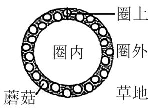
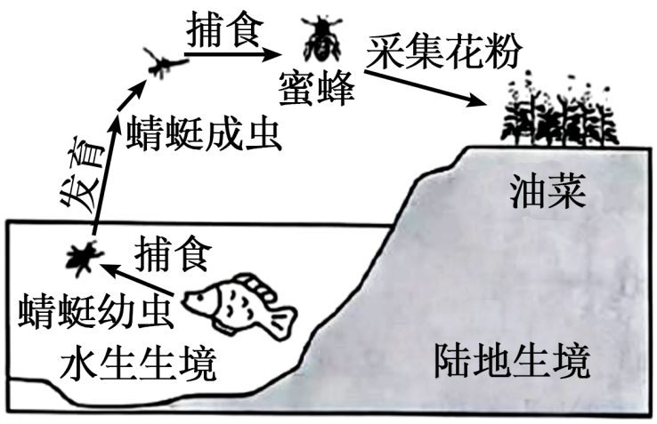
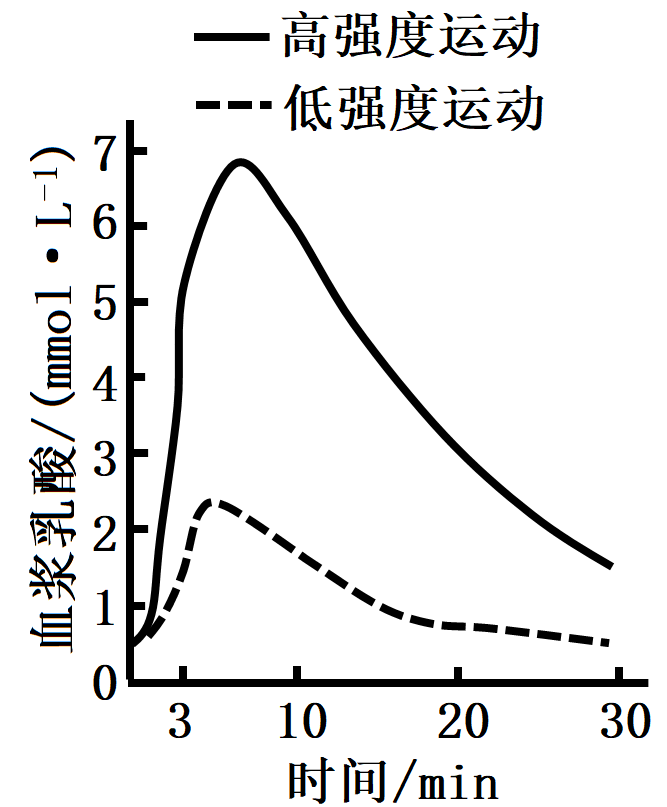
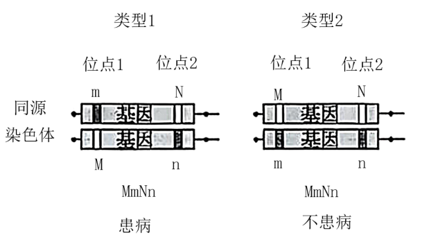
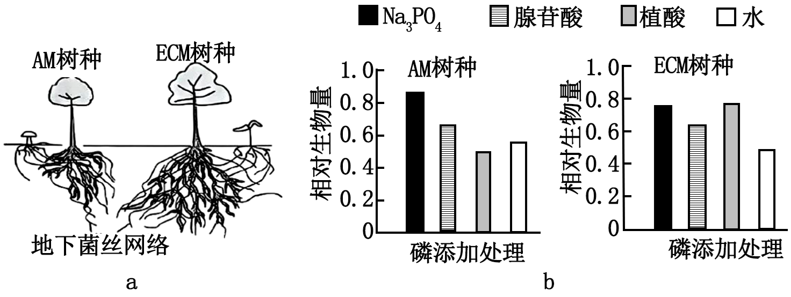
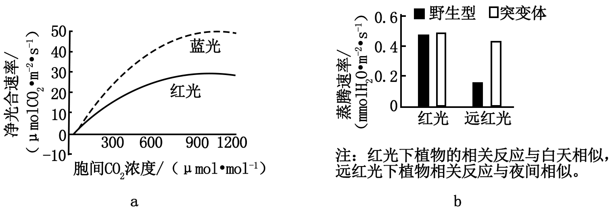
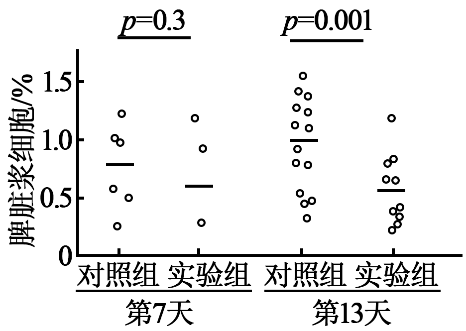
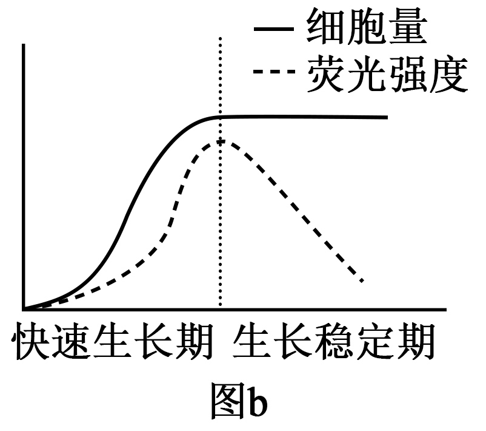

**2025年普通高中学业水平选择性考试（广东卷）**

**生物学**

**本试卷满分100分，考试用时75分钟。**

**一、选择题：本大题共16小题，共40分。第1~12小题，每小题2分；第13~16小题，每小题4分。在每小题列出的四个选项中，只有一项符合题目要求。**

1\. 山水林田湖草沙冰是生命共同体。这一生态文明理念最能体现生态系统的（ ）

A. 整体性 B. 独立性 C. 稳定性 D. 层次性

2\. 某同学使用双缩脲试剂检测豆浆中的蛋白质。下列做法错误的是（ ）

A. 用蒸馏水稀释豆浆作样液 B. 在常温下检测

C. 用未加试剂的样液作对照 D. 剩余豆浆不饮用

3\. 罗伯特森（J．D．Robertson）提出了“蛋白质—脂质—蛋白质”的细胞膜结构模型。下列不属于该模型提出的基础的是（ ）

A. 化学分析表明细胞膜中含有磷脂和胆固醇

B. 据表面张力研究推测细胞膜中含有蛋白质

C. 电镜下观察到细胞膜暗—亮—暗三层结构

D. 细胞融合实验结果表明细胞膜具有流动性

4\. 某同学用光学显微镜观察网球花胚乳细胞分裂，视野中（如图）可见（ ）

A 细胞质分离 B. 等位基因分离

C. 同源染色体分离 D. 姐妹染色单体分离

5\. 将人眼睑成纤维细胞传代培养后，再培养形成支架，在该支架上接种人口腔黏膜上皮细胞，培养一段时间后分离获得上皮细胞片层，可用于人工角膜的研究。上述过程不涉及（ ）

A. 制备细胞悬液

B. 置于等适宜条件下培养

C. 离心收集细胞

D. 用胰蛋白酶消化支架后分离片层

6\. 临床上常采用体表电刺激诱发神经兴奋并检测相关指标，以用于神经病变的早期诊断和疗效评价，下列分析正确的是（ ）

A. 刺激后神经纤维的钠钾泵活性不变

B. 兴奋传导过程中刺激部位保持兴奋状态

C. 神经纤维上通道相继开放传导兴奋

D. 兴奋传导过程中细胞膜通透性不变

7\. Solexa测序是一种将PCR与荧光检测相结合的高通量测序技术。为了确保该PCR过程中，DNA聚合酶催化一个脱氧核苷酸单位完成聚合反应后，DNA链不继续延伸，应保护底物中脱氧核糖结构上的（ ）

A. 1'-碱基 B. 2'-氢 C. 3'-羟基 D. 5'-磷酸基团

8\. 物质跨膜运输是维持细胞正常生命活动的基础，下列叙述正确的是（ ）

A. 呼吸时从肺泡向肺毛细血管扩散d的速率受浓度的影响

B. 心肌细胞主动运输时参与转运的载体蛋白仅与结合

C. 血液中葡萄糖经协助扩散进入红细胞的速率与细胞代谢无关

D. 集合管中与通道蛋白结合后使其通道开放进而被重吸收

9\. VHL基因的一个碱基发生突变，使其编码区中某CCA（编码脯氨酸）变成CCG（编码脯氨酸），导致合成的mRNA变短，引发VHL综合征。该突变（ ）

A. 改变了DNA序列中嘧啶的数目

B. 没有体现密码子的简并性

C. 影响了VHL基因的转录起始

D. 改变了VHL基因表达的蛋白序列

10\. 临床发现一例特殊的特纳综合征患者，其体内存在3种核型：“45，X”“46，XX”“47，XXX”（细胞中染色体总数，性染色体组成）。导致该患者染色体异常最可能的原因是（ ）

A. 其母亲卵母细胞减数分裂Ⅰ中X染色体不分离

B. 其母亲卵母细胞减数分裂Ⅱ中X染色体不分离

C. 胚胎发育早期有丝分裂中1条X染色体不分离

D. 胚胎发育早期有丝分裂中2条X染色体不分离

11\. 草地蘑菇圈是大量蘑菇呈圈带状分布的一种生态现象（如图）。通过对圈上、圈内和圈外的植物和土壤进行调查分析，可揭示蘑菇圈形成对草地群落和土壤的影响。下列叙述错误的是（ ）

A. 调查草地上植物和土壤分别采用样方法和取样器取样法

B. 圈上植物长得高呈现明显的圈带形成草地群落垂直结构

C. 蘑菇菌丝促进土壤有机质分解使圈上土壤速效养分增加

D. 圈上植物种群的优势度增加可影响草地群落的物种组成

12\. 果蝇外骨骼角质中表皮烃的含量不仅影响果蝇的环境适应能力，也影响果蝇的交配对象选择（如图）。表皮烃的合成受mFAS基因控制。下列叙述错误的是（ ）

A. 突变和自然选择驱动果蝇物种A和物种B的形成

B. 自然选择使具有低表皮烃性状的果蝇适应潮湿环境

C. 果蝇种群A和种群B交配减少加速了新物种的形成

D. mFAS基因突变带来的双重效应足以导致生殖隔离

13\. 食物链可以跨越不同生境（如图）。下列分析正确的是（ ）

A. 蜜蜂和油菜之间是互利共生关系

B. 鱼在该食物链中属于四级消费者

C. 增加鱼的数量可使池塘周边的油菜籽增产

D. 将水陆生境联系成一个整体的关键种是鱼

14\. 为研究运动强度对人体生理活动的影响。某研究团队招募一批健康受试者分别进行3min低强度运动和高强度运动，运动开始后血浆乳酸水平见图。下列叙述错误的是（ ）

A. 高强度运动时，肾上腺素和胰高血糖素协同作用升高血糖

B. 高强度运动血浆乳酸水平达到峰值时，骨骼肌细胞无氧呼吸强度最高

C. 两种强度运动后，血浆乳酸水平的变化均不影响血浆pH的相对稳定

D. 两种强度运动后，交感神经与副交感神经活动的强弱均会发生转换

15\. 某高校科技特派员为协助种养专业合作社繁殖优良欧李种质，以欧李根状茎为插条，用赤霉素合成抑制剂处理，使插条生根率由22%提高到78%。扦插后，插条的几种内源激素的含量变化见图。下列叙述错误的是（ ）

A. 细胞分裂素加快细胞分裂并促进生根

B. 提高生长素含量而促进生根

C. 推测赤霉素缺失突变体根系相对发达

D. 推测促进生根效果更好

16\. 若某常染色体隐性单基因遗传病的致病基因存在两个独立的致病变异位点1和2（M和N表示正常，m和n表示异常），理论上会形成两种变异类型且效应不同（如图），但仅凭个体的基因检测不足以区分这两种变异类型。通过对人群中变异位点的大规模基因检测，有助于该遗传病的风险评估。表为某人群中这两个变异位点的检测数据。下列对该人群的推测，合理的是（ ）

<table style="width:42%;">
<colgroup>
<col style="width: 12%" />
<col style="width: 9%" />
<col style="width: 8%" />
<col style="width: 6%" />
<col style="width: 4%" />
</colgroup>
<tbody>
<tr>
<td colspan="2" rowspan="2" style="text-align: left;">变异位点组合个体数</td>
<td colspan="3" style="text-align: left;">位点2</td>
</tr>
<tr>
<td style="text-align: left;">NN</td>
<td style="text-align: left;">Nn</td>
<td style="text-align: left;">nn</td>
</tr>
<tr>
<td rowspan="3" style="text-align: left;">位点1</td>
<td style="text-align: left;">MM</td>
<td style="text-align: left;">94121</td>
<td style="text-align: left;">1180</td>
<td style="text-align: left;">44</td>
</tr>
<tr>
<td style="text-align: left;">Mm</td>
<td style="text-align: left;">2273</td>
<td style="text-align: left;">4</td>
<td style="text-align: left;">0</td>
</tr>
<tr>
<td style="text-align: left;">mm</td>
<td style="text-align: left;">29</td>
<td style="text-align: left;">0</td>
<td style="text-align: left;">0</td>
</tr>
</tbody>
</table>

A. m和n位于同一条染色体上

B. 携带m的基因频率约是携带n的基因频率的3倍

C. 有3种携带致病变异的基因

D. MmNn组合个体均患病

**二、非选择题：本大题共5小题，共60分。考生根据要求作答。**

17\. 热带雨林土壤中磷元素大部分以植物不能直接吸收利用的复杂有机磷形式存在，是植物生长和幼苗更新的主要限制因素。热带雨林中绝大多数植物都与菌根真菌形成互利共生关系，菌根真菌为植物提供矿质元素和水分，并从宿主植物获得生长必需的碳水化合物，其中，乔木主要与丛枝菌根（AM）或外生菌根（ECM）真菌共生（图a）。为探究AM和ECM真菌对宿主植物磷元素吸收的作用，科学家选取AM和ECM树种开展盆栽实验，向接种菌根真菌后的幼苗分别提供（无机磷）、腺苷酸（简单有机磷）、植酸（复杂有机磷）和水（空白对照），种植一段时间后测定幼苗生长情况（图b）。

回答下列问题：

（1）不同类型的菌根植物可以利用土壤中不同形式的磷元素，形成树种间\_\_\_\_\_\_进而实现稳定共存。

（2）热带雨林中冠层优势度较高的树种主要来自龙脑香科，以约3%的物种数占据30%以上的个体数。推测这些树种主要与 <u>①</u> 共生，原因是 <u>②</u> 。同时，母树还可以通过地下菌丝网络实现“亲代抚育”，帮助幼苗突破林下光照不足的限制，可能的机制是 <u>③</u> 。植物和菌根真菌间的互利共生越来越高效、相互依赖程度越来越高，这种生态学现象属于 <u>④</u> 。

（3）随着群落内宿主植物个体数增加，其对应的地下菌丝网络功能越强，越有利于同种个体生长和幼苗更新，这一过程属于\_\_\_\_\_\_调节；但个体数增加到一定程度后，种内竞争加剧进而抑制种群进一步增长。上述调控机制共同维持了\_\_\_\_\_\_的相对稳定。

（4）针对退化热带雨林开展生态修复工程，结合植物根际生态过程，提出合理建议以恢复生物多样性：\_\_\_\_\_\_\_\_。

18\. 我国科学家以不同植物为材料，在不同光质条件下探究光对植物的影响。测定了番茄的光合作用相关指标并拟合响应曲线（图a）；比较了突变体与野生型水稻水分消耗的差异（图b），鉴定到突变体发生了PILI5基因的功能缺失，并确定该基因参与脱落酸信号通路的调控。

回答下列问题：

（1）图a中，当胞间浓度在范围时，红光下光合速率的限制因子是\_\_\_\_\_\_，推测此时蓝光下净光合速率更高的原因是\_\_\_\_\_\_\_。

（2）图b中，突变体水稻在远红光与红光条件下蒸腾速率接近，推测其原因是\_\_\_\_\_\_\_。

（3）归纳上述两个研究内容，总结出光影响植物的两条通路（图c）。通路1中，①吸收的光在叶绿体中最终被转化为\_\_\_\_\_\_。通路2中吸收光的物质②为\_\_\_\_\_\_。用箭头完成图c中②所介导的通路，并在箭头旁用“（+）”或“（-）”标注前后两者间的作用，（+）表示正相关，（-）表示负相关\_\_\_\_\_\_。

（4）根据图c中相关信息，概括出植物利用光的方式：\_\_\_\_\_\_\_\_。

19\. 在繁育陶赛特绵羊的过程中，发现一只臀部骨骼肌尤为发达、产肉量高（美臀）的个体。研究发现，美臀性状由单基因（G/g）突变所导致，以常染色体显性方式遗传。此外，美臀性状仅在杂合子中，且G基因来源于父本时才会表现；母本来源的G基因可通过其雄性子代使下一代杂合子再次表现美臀性状。回答下列问题：

（1）育种人员将美臀公羊和野生型正常母羊杂交，子一代中美臀羊的理论比例为\_\_\_\_\_\_；选择子一代中的美臀羊杂交，子二代中美臀羊的理论比例为\_\_\_\_\_\_。

（2）由于羊角具有一定的伤害性，育种人员尝试培育美臀无角羊。陶赛特绵羊另一条常染色体上R基因的隐性突变导致无角性状产生，如图a进行杂交，P美臀有角羊应作为\_\_\_\_\_\_（填“父本”或“母本”），便于从中选择亲本；若要实现F3中美臀无角个体比例最高，应在中选择亲本基因型为\_\_\_\_\_\_。

（3）研究发现，美臀性状由G基因及其附近基因（图b）共同参与调控，其中D基因调控骨骼肌发育，其高表达使羊产生美臀性状；M基因的表达则抑制D基因的表达。来自父本的G基因使D基因高表达，而来自母本、具有相同序列的G基因只促进M基因的表达，这种遗传现象属于\_\_\_\_\_\_。GG基因型个体的体型正常，推测其原\_\_\_\_\_\_\_。

（4）在育种过程中，较难实现美臀无角性状稳定遗传，考虑到胚胎操作过程较繁琐，可采集并保存\_\_\_\_\_\_\_\_，用于美臀无角羊的人工繁育。

20\. 为探索神经活动调节体液免疫反应机理，我国科学家以实验小鼠为对象，对实验组小鼠进行手术并用药物处理以去除脾神经（交感神经纤维进入脾脏的分支），对照组小鼠进行同样手术但不去除脾神经。术后恢复6周，腹腔注射抗原NP-KLH免疫小鼠。回答下列问题：

（1）对小鼠注射NP-KLH后，通过抗原呈递，激活\_\_\_\_\_\_细胞为B细胞增殖分化提供第二个信号。

（2）免疫后第7、13天，采用荧光标记的特定抗体与细胞膜上相应\_\_\_\_\_\_结合进行识别的方法，对B细胞和浆细胞分类计数，计算浆细胞占总B细胞的百分比（如图）。由第13天的数据可得出的结论是\_\_\_\_\_\_\_。在免疫后第7天，实验组脾脏浆细胞数量平均值低于对照组平均值，但研究者并不能依据该数据得出上述结论，原因是\_\_\_\_\_\_\_。

注：图中圆圈表示小鼠不同个体的数据：黑色短横线表示平均值：上方值为统计分析所得概率值，p\<0.05时表示两组数据有显著差异。

（3）研究发现，脾神经末梢与脾脏T细胞形成突触样结构，释放去甲肾上腺素促进T细胞合成并释放乙酰胆碱（ACh），基于ACh可与ACh受体（AChR）结合的事实，结合上述研究，研究者推测：ACh通过直接\_\_\_\_\_\_以实现脾神经兴奋对体液免疫反应的调节作用。

为证实该推测，首先需要确认脾脏B细胞是否存在AChR。由于小鼠体内存在多种类型的AChR，研究者采用PCR检测各类型AChR的mRNA，结果见表。根据该结果，首选AChR-α9进行研究，理由是\_\_\_\_\_\_\_。

<table style="width:57%;">
<colgroup>
<col style="width: 20%" />
<col style="width: 12%" />
<col style="width: 12%" />
<col style="width: 12%" />
</colgroup>
<tbody>
<tr>
<td rowspan="2" style="text-align: left;">细胞样本</td>
<td colspan="3" style="text-align: left;">AChR类型</td>
</tr>
<tr>
<td style="text-align: left;">AChR-β1</td>
<td style="text-align: left;">AChR-β4</td>
<td style="text-align: left;">AChR-α9</td>
</tr>
<tr>
<td style="text-align: left;">总B细胞</td>
<td style="text-align: left;">+++</td>
<td style="text-align: left;">-</td>
<td style="text-align: left;">+</td>
</tr>
<tr>
<td style="text-align: left;">生发中心B细胞</td>
<td style="text-align: left;">++</td>
<td style="text-align: left;">-</td>
<td style="text-align: left;">+++</td>
</tr>
<tr>
<td style="text-align: left;">浆细胞</td>
<td style="text-align: left;">+++</td>
<td style="text-align: left;">++</td>
<td style="text-align: left;">++</td>
</tr>
</tbody>
</table>

注：生发中心是B细胞活化后增殖分化为浆细胞的场所，+表示有检出，+越多表示检出量越多；-表示未检出。

研究者将小鼠AChR-α9基因敲除，然后对\_\_\_\_\_\_进行处理并免疫小鼠，再检测各实验组与对照组小鼠脾脏浆细胞和抗体生成量，从而验证以上推测是否合理。

21\. 大肠杆菌是重要工业菌株之一，其培养过程可分为快速生长期和生长稳定期两个阶段。为了通过调节蛋白质合成与降解速率来动态调控代谢途径关键酶的蛋白量，使细胞适配不同阶段的生产需求，研究者设计了两种质粒，并以稳定性好的红色荧光蛋白mKate2为模式蛋白。测试质粒功能。回答下列问题：

（1）研究者首先构建质粒①（图a）用于在细胞内表达C-末端带SsrA短肽的mKate2，将质粒导入感受态细胞后，在添加抗生素的选择培养基上培养。根据培养基上菌落的生长状况，结合PCR及\_\_\_\_\_\_检测，筛选获得重组菌株W1。

（2）将W1在适宜条件下进行摇瓶培养，定时取样检测培养液中细胞密度，方法有\_\_\_\_\_\_（答一种）。接种前需检测液体培养基的荧光强度，其作用是\_\_\_\_\_\_\_\_。培养结果（图b）表明，进入生长稳定期后荧光强度快速下降，原因是\_\_\_\_\_\_\_\_。

（3）研究者选用启动子PX、X基因（编码阻遏蛋白X，阻遏PX开启转录），重新构建质粒②（图a），导入野生型大肠杆菌中获得重组菌株W2。在适宜条件下摇瓶培养，W2的生长趋势不变，培养期间荧光强度的变化趋势为\_\_\_\_\_\_\_\_。

（4）莽草酸是一种重要工业化学品，其胞内合成代谢途径见图c。由于野生型大肠杆菌胞内酶A活性弱，且莽草酸会被快速转化为细胞生长必需物，因此细胞中无法大量积累莽草酸。为了保证细胞正常生长，并在生长稳定期实现莽草酸的大量积累，利用上述两种质粒的调控功能，结合野生型菌株遗传物质的改造，提出重组生产菌株构建思路：\_\_\_\_\_\_。

