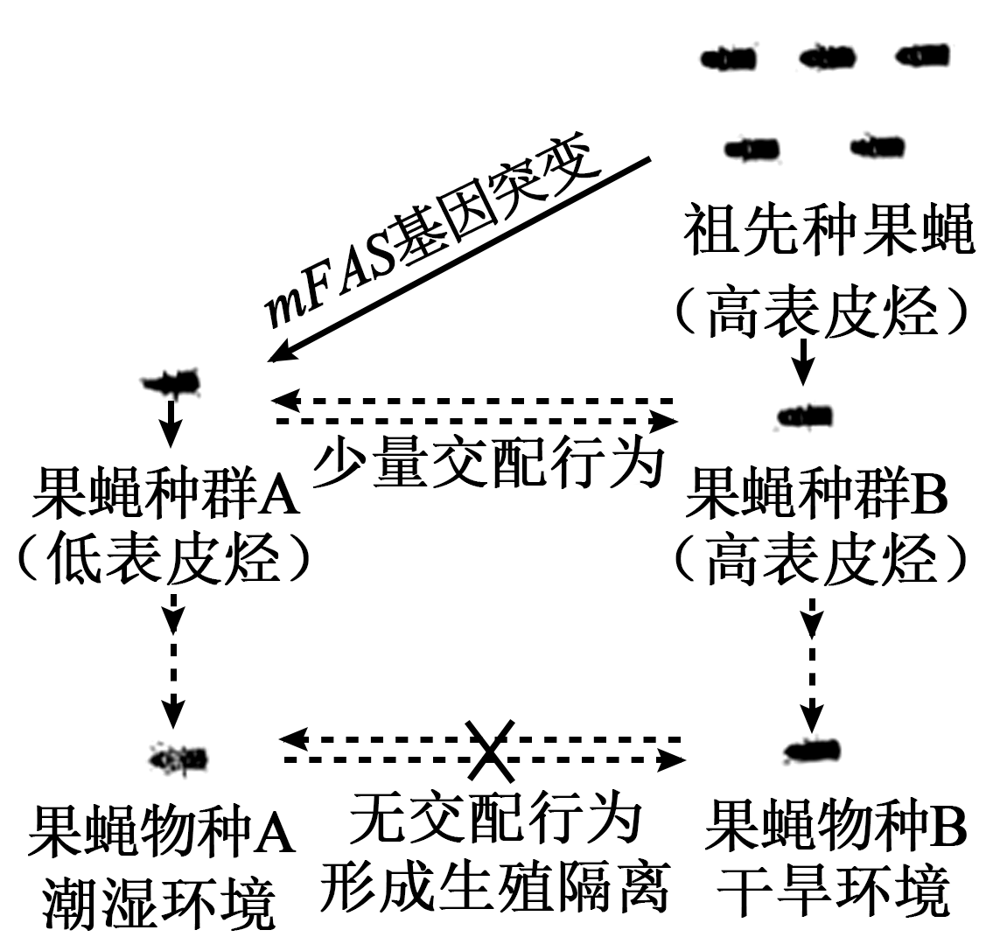
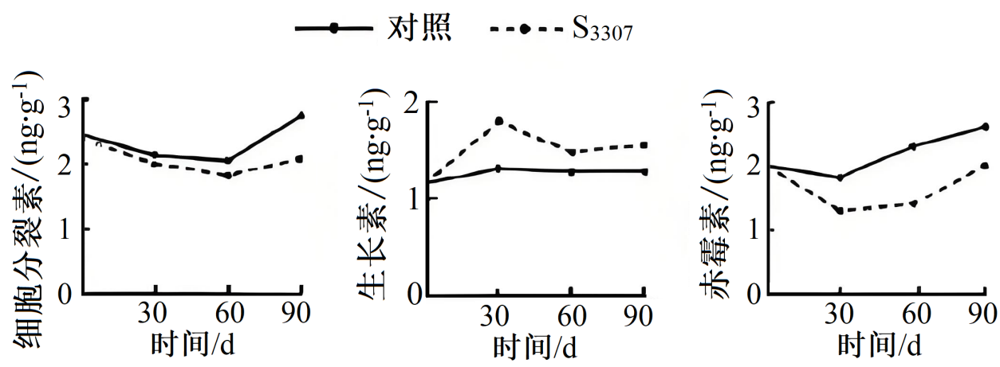
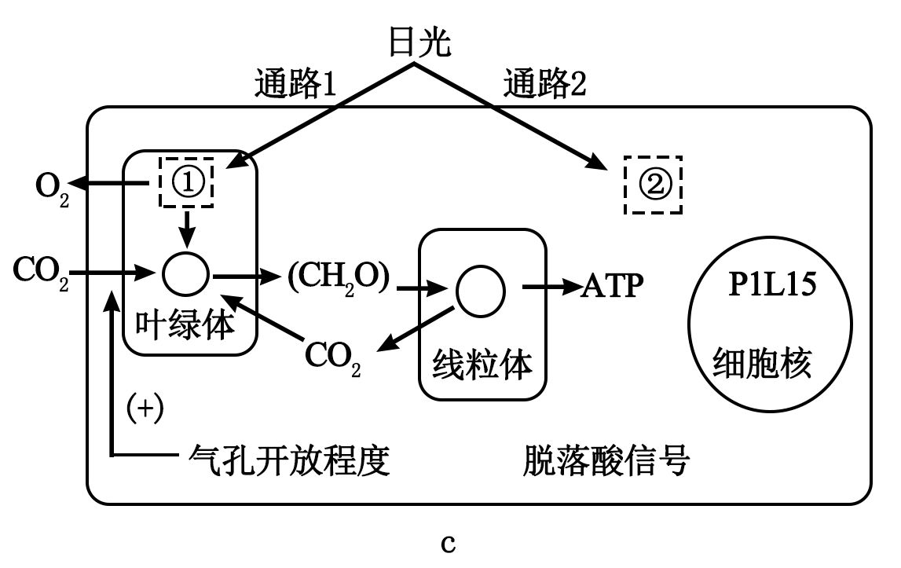
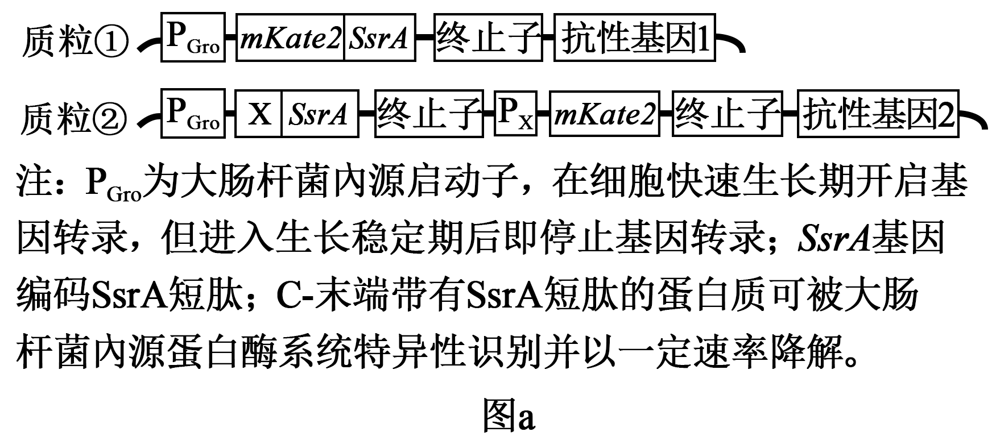

**2025年普通高中学业水平选择性考试（广东卷）**

**生物学**

**本试卷满分100分，考试用时75分钟。**

**一、选择题：本大题共16小题，共40分。第1~12小题，每小题2分；第13~16小题，每小题4分。在每小题列出的四个选项中，只有一项符合题目要求。**

1\. 山水林田湖草沙冰是生命共同体。这一生态文明理念最能体现生态系统的（ ）

A. 整体性 B. 独立性 C. 稳定性 D. 层次性

【答案】A

【解析】

【分析】生物圈是指地球上全部生物及其无机环境的总和，是一个统一的整体，包括大气圈的底部、水圈大部和岩石圈的上部，是地球上最大的生态系统，是所有生物的家。生物圈中有着多种多样的生态系统，如草原生态系统、湿地生态系统、海洋生态系统、森林生态系统、淡水生态系统、农田生态系统、城市生态系统等等。

【详解】生物圈中的山水林田湖草沙是不同的生态系统类型，属于一个生命共同体，生命共同体是一个统一的整体，A正确，BCD错误。

故选A。

2\. 某同学使用双缩脲试剂检测豆浆中的蛋白质。下列做法错误的是（ ）

A. 用蒸馏水稀释豆浆作样液 B. 在常温下检测

C. 用未加试剂的样液作对照 D. 剩余豆浆不饮用

【答案】C

【解析】

【分析】生物组织中化合物的鉴定：（1）斐林试剂可用于鉴定还原糖，在水浴加热的条件下，溶液的颜色变化为砖红色（沉淀）。斐林试剂只能检验生物组织中还原糖（如葡萄糖、麦芽糖、果糖）存在与否，而不能鉴定非还原性糖（如淀粉）。（2）蛋白质可与双缩脲试剂产生紫色反应。（3）脂肪可用苏丹Ⅲ染液鉴定，呈橘黄色。（4）淀粉遇碘液变蓝。

【详解】A、未经稀释的豆浆样液过于粘稠，易附着试管壁导致反应不均匀或清洗困难，影响显色观察和结果判定，故反应前需用蒸馏水稀释豆浆作样液，A正确；

B、蛋白质可与双缩脲试剂产生紫色反应在常温下进行，B正确；

C、本实验能够前后自身对照，无需用未加试剂的样液作对照，C错误；

D、实验所用豆浆一般未经煮沸，故剩余豆浆不建议饮用，D正确。

故选C。

3\. 罗伯特森（J．D．Robertson）提出了“蛋白质—脂质—蛋白质”的细胞膜结构模型。下列不属于该模型提出的基础的是（ ）

A 化学分析表明细胞膜中含有磷脂和胆固醇

B. 据表面张力研究推测细胞膜中含有蛋白质

C. 电镜下观察到细胞膜暗—亮—暗三层结构

D. 细胞融合实验结果表明细胞膜具有流动性

【答案】D

【解析】

【分析】有关生物膜的探索历程：①19世纪末，欧文顿发现凡是可以溶于脂质的物质，比不能溶于脂质的物质更容易通过细胞膜进入细胞，于是他提出：膜是由脂质组成的。②1925年，两位荷兰科学家通过对脂 质进行提取和测定得出结论：细胞膜中的脂质分子必然排列为连续的两层。③1935年，英国学者丹尼利和戴维森研究了细胞膜的张力。分析细胞膜的表面张力明显低于油-水界面的表面张力，因此丹尼利和戴维森推测细胞膜除含脂质外，可能还附有蛋白质。④1959年，罗伯特森根据电镜下看到的细胞膜清晰的暗—亮—暗三层结构，结合其他科学家的工作提出蛋白质—脂质—蛋白质三层结构模型。流动镶嵌模型指出，蛋白质分子有的镶在磷脂双分子层表面，有的部分或全部嵌入磷脂双分子层中，有的横跨整个磷脂双分子层。⑤1970年，科学家通过荧光标记的小鼠细胞和人细胞的融合实验，证明细胞膜具有流动性。⑥1972年，桑格和尼克森提出的流动镶嵌模型为大多数人所接受。

【详解】A、化学分析表明细胞膜中含有磷脂和胆固醇，该结论在罗伯特森用电镜观察之前，属于该模型提出的基础，A不符合题意；

B、1935年，英国学者丹尼利和戴维森研究了细胞膜的张力，据表面张力研究推测细胞膜中含有蛋白质，该结论在罗伯特森用电镜观察之前，属于该模型提出的基础，B不符合题意；

C、1959年，罗伯特森根据电镜下看到的细胞膜清晰的暗—亮—暗三层结构，结合其他科学家的工作提出蛋白质—脂质—蛋白质三层结构模型，C不符合题意；

D、1970年，科学家通过荧光标记的小鼠细胞和人细胞的融合实验，证明细胞膜具有流动性，该结论在罗伯特森用电镜观察之后，不属于该模型提出的基础，D符合题意。

故选D。

4\. 某同学用光学显微镜观察网球花胚乳细胞分裂，视野中（如图）可见（ ）

A. 细胞质分离 B. 等位基因分离

C. 同源染色体分离 D. 姐妹染色单体分离

【答案】D

【解析】

【分析】有丝分裂过程：（1）间期：进行DNA的复制和有关蛋白质的合成；（2）前期：核膜、核仁逐渐解体消失，出现纺锤体和染色体；（3）中期：染色体形态固定、数目清晰；（4）后期：着丝粒分裂，姐妹染色单体分开成为染色体，并均匀地移向两极；（5）末期：核膜、核仁重建、纺锤体和染色体消失。

【详解】A、细胞质分离可以在光学显微镜下观察到，如植物细胞中出现细胞板，题图中没有出现细胞板，不处于末期，故没发生细胞质分离，A错误；

B、等位基因分离发生在减数分裂过程中，胚乳细胞不能进行减数分裂，且等位基因显微镜下不可见，B错误；

C、同源染色体分离发生在减数分裂过程中，胚乳细胞不能进行减数分裂，C错误；

D、图中染色体均匀分布在细胞两极，可知着丝粒已经分裂，姐妹染色单体形成的染色体在分离，D正确。

故选D。

5\. 将人眼睑成纤维细胞传代培养后，再培养形成支架，在该支架上接种人口腔黏膜上皮细胞，培养一段时间后分离获得上皮细胞片层，可用于人工角膜的研究。上述过程不涉及（ ）

A 制备细胞悬液

B. 置于等适宜条件下培养

C. 离心收集细胞

D. 用胰蛋白酶消化支架后分离片层

【答案】D

【解析】

【分析】动物细胞培养条件：（1）无菌、无毒的环境：①消毒、灭菌②添加一定量的抗生素③定期更换培养液，以清除代谢废物。（2）营养物质：糖、氨基酸、促生长因子、无机盐、微量元素等，还需加入血清、血浆等天然物质。（3）温度和pH：哺乳动物多以36.5℃为宜，最适pH为7.2-7.4。（4）气体环境：95%空气（细胞代谢必需的）和5%的CO2（维持培养液的pH。）

【详解】A、动物细胞培养时，为增大细胞与培养液的接触面积，需要制备细胞悬液，A正确；

B、置于等适宜条件下培养，其中5%的CO2可维持培养液的pH，B正确；

C、在成纤维细胞传代培养过程中需要通过离心收集细胞，C正确；

D、不用胰蛋白酶消化支架，避免将上皮细胞片层分离成单独细胞，D错误。

故选D。

6\. 临床上常采用体表电刺激诱发神经兴奋并检测相关指标，以用于神经病变的早期诊断和疗效评价，下列分析正确的是（ ）

A. 刺激后神经纤维的钠钾泵活性不变

B. 兴奋传导过程中刺激部位保持兴奋状态

C. 神经纤维上通道相继开放传导兴奋

D. 兴奋传导过程中细胞膜通透性不变

【答案】C

【解析】

【分析】神经纤维在静息时膜电位是由钾离子外流造成的，钾离子的外流是通过离子通道的被动运输。动作电位的形成是由钠离子内流造成的，也通过离子通道的被动运输过程。钠离子从神经细胞膜内运输到膜外，钾离子从膜外运输到膜内都是通过钠钾泵主动运输的过程。

【详解】A、钠钾泵（Na⁺-K⁺-ATP酶）在动作电位后的复极化末期及静息电位维持阶段被激活，而非活性不变，A错误；

B、兴奋传导过程中刺激部位先兴奋后恢复静息状态，B错误；

C、兴奋传导过程中神经纤维上通道相继开放，传导兴奋，C正确；

D、产生动作电位时，钾离子通道关闭，恢复静息电位时钾离子通道开放，故兴奋传导过程中细胞膜通透性改变，D错误。

故选C。

7\. Solexa测序是一种将PCR与荧光检测相结合的高通量测序技术。为了确保该PCR过程中，DNA聚合酶催化一个脱氧核苷酸单位完成聚合反应后，DNA链不继续延伸，应保护底物中脱氧核糖结构上的（ ）

A. 1'-碱基 B. 2'-氢 C. 3'-羟基 D. 5'-磷酸基团

【答案】C

【解析】

【分析】在DNA复制过程中，在DNA聚合酶的催化作用下，将一个个的脱氧核苷酸连接形成磷酸二酯键，使子链延伸，但是DNA聚合酶催化延伸子链方向只能从5′→3′。

【详解】已知DNA聚合酶催化延伸子链方向只能从5′→3′，原因是脱氧核苷酸的3'碳有羟基，可以结合下一个脱氧核苷酸的5′碳的磷酸基团，故为了DNA聚合酶催化一个脱氧核苷酸单位完成聚合反应后，DNA链不继续延伸，应保护底物中脱氧核糖结构上的3'-羟基，使其不能结合下一个脱氧核苷酸的5′碳的磷酸基团，C正确。

故选C。

8\. 物质跨膜运输是维持细胞正常生命活动的基础，下列叙述正确的是（ ）

A. 呼吸时从肺泡向肺毛细血管扩散的速率受浓度的影响

B. 心肌细胞主动运输时参与转运的载体蛋白仅与结合

C. 血液中葡萄糖经协助扩散进入红细胞的速率与细胞代谢无关

D. 集合管中与通道蛋白结合后使其通道开放进而被重吸收

【答案】A

【解析】

【分析】自由扩散的特点是高浓度运输到低浓度，不需要转运蛋白和能量，如水进出细胞；协助扩散的特点是高浓度运输到低浓度，需要转运蛋白，不需要能量，如红细胞吸收葡萄糖；主动运输的特点是需要转运蛋白和能量，如小肠绒毛上皮细胞吸收葡萄糖。

【详解】A、O₂从肺泡向肺毛细血管扩散属于自由扩散，速率由O₂浓度差决定。因此呼吸时从肺泡向肺毛细血管扩散的速率受浓度的影响，A正确；

B、心肌细胞主动运输Ca²⁺时，载体蛋白需结合Ca²⁺并催化ATP水解，还需结合磷酸基团从而磷酸化，并非仅与Ca²⁺结合，B错误；

C、葡萄糖进入红细胞为协助扩散，速率受浓度差和载体数量影响。红细胞代谢虽不直接供能，但代谢活动维持细胞内低葡萄糖浓度，从而保持浓度差，因此速率与代谢有关，C错误；

D、集合管中Na⁺重吸收主要通过主动运输（如钠钾泵），需载体蛋白且消耗能量，而非通过通道蛋白结合Na⁺被动运输，D错误。

故选A。

9\. VHL基因的一个碱基发生突变，使其编码区中某CCA（编码脯氨酸）变成CCG（编码脯氨酸），导致合成的mRNA变短，引发VHL综合征。该突变（ ）

A. 改变了DNA序列中嘧啶的数目

B. 没有体现密码子的简并性

C. 影响了VHL基因的转录起始

D. 改变了VHL基因表达的蛋白序列

【答案】D

【解析】

【分析】基因表达指基因指导蛋白质合成的过程，包括转录和翻译两个阶段。 转录：以 DNA 的一条链为模板合成 RNA。在细胞核中，RNA 聚合酶与 DNA 结合，解开双链，以其中一条链为模板，按碱基互补配对原则（A - U、T - A、C - G、G - C），利用游离的核糖核苷酸合成 mRNA。mRNA 合成后从核孔进入细胞质。 翻译：以 mRNA 为模板合成蛋白质。在细胞质的核糖体上，mRNA 与核糖体结合，tRNA 携带氨基酸按 mRNA 上密码子顺序依次连接。tRNA 一端的反密码子与 mRNA 上密码子互补配对，另一端携带对应氨基酸。多个氨基酸脱水缩合形成肽链，肽链盘曲折叠形成有特定空间结构和功能的蛋白质。

【详解】A、该突变将DNA中的CCA变为CCG，原互补链GGT变为GGC，嘧啶数目（T→C）未改变，仅种类变化，A错误；

B、突变后CCA（脯氨酸）变为CCG（脯氨酸），不同密码子编码同一氨基酸，体现密码子简并性，B错误；

C、转录起始由启动子调控，突变发生在编码区（外显子），不影响转录起始，C错误；

D、突变虽未改变脯氨酸，但导致mRNA变短（如提前出现终止密码子），使翻译提前终止，蛋白序列缩短，D正确。

故选D。

10\. 临床发现一例特殊的特纳综合征患者，其体内存在3种核型：“45，X”“46，XX”“47，XXX”（细胞中染色体总数，性染色体组成）。导致该患者染色体异常最可能的原因是（ ）

A. 其母亲卵母细胞减数分裂Ⅰ中X染色体不分离

B. 其母亲卵母细胞减数分裂Ⅱ中X染色体不分离

C. 胚胎发育早期有丝分裂中1条X染色体不分离

D. 胚胎发育早期有丝分裂中2条X染色体不分离

【答案】C

【解析】

【分析】特纳综合征患者通常核型为45，X，但本题患者存在三种核型（“45，X”“46，XX”“47，XXX”），表明其为嵌合体，由胚胎早期有丝分裂错误导致。

【详解】A、若母亲卵母细胞减数分裂Ⅰ中X染色体不分离，会形成XX或O的卵细胞，受精后可能产生47，XXX或45，X的个体，但无法同时出现46，XX的正常核型，A错误；

B、若母亲卵母细胞减数分裂Ⅱ中X染色体不分离，可能形成XXX或XO的受精卵，但同样无法保留46，XX的正常核型，B错误；

C、胚胎发育早期有丝分裂中，若1条X染色体（姐妹染色单体）未分离，会导致部分细胞为45，X（少一条X）和47，XXX（多一条X），而正常分裂的细胞仍为46，XX，形成三种核型，C正确；

D、若2条X染色体均未分离，会导致细胞中X染色体数目大幅异常（如4条或0条），与题干中的核型不符，D错误。

故选C。

11\. 草地蘑菇圈是大量蘑菇呈圈带状分布的一种生态现象（如图）。通过对圈上、圈内和圈外的植物和土壤进行调查分析，可揭示蘑菇圈形成对草地群落和土壤的影响。下列叙述错误的是（ ）

A. 调查草地上植物和土壤分别采用样方法和取样器取样法

B. 圈上植物长得高呈现明显的圈带形成草地群落垂直结构

C. 蘑菇菌丝促进土壤有机质分解使圈上土壤速效养分增加

D. 圈上植物种群的优势度增加可影响草地群落的物种组成

【答案】B

【解析】

【分析】群落的空间结构分为垂直结构和水平结构：（1）群落的垂直结构：指群落在垂直方面的配置状态，其最显著的特征是分层现象，即在垂直方向上分成许多层次的现象。影响植物群落垂直分层的主要因素是光照，影响动物群落垂直分层的主要因素为食物和栖息空间。（2）群落水平结构：在水平方向上，由于地形的起伏、光照的阴暗、湿度的大小等因素的影响，不同地段往往分布着不同的种群，种群密度也有差别。群落水平结构的特征是镶嵌性。镶嵌性即植物种类在水平方向不均匀配置，使群落在外形上表现为斑块相间的现象。

【详解】A、植物无活动能力，调查通常采用样方法；土壤调查则常用取样器取样法（如采集土壤小动物或分析土壤成分），A正确；

B、垂直结构是指群落分层现象（如乔木层、灌木层、草本层等），而蘑菇圈呈圈带状分布，是空间分布差异，属于群落的水平结构，B错误；

C、蘑菇属于分解者，其菌丝可通过分解作用加速有机质降解，释放速效养分（如氮、磷等），C正确；

D、优势度高的植物可能竞争资源（如光照、水分），从而改变其他物种的分布或数量，D正确。

故选B。

12\. 果蝇外骨骼角质中表皮烃的含量不仅影响果蝇的环境适应能力，也影响果蝇的交配对象选择（如图）。表皮烃的合成受mFAS基因控制。下列叙述错误的是（ ）

A. 突变和自然选择驱动果蝇物种A和物种B的形成

B. 自然选择使具有低表皮烃性状的果蝇适应潮湿环境

C. 果蝇种群A和种群B交配减少加速了新物种的形成

D. mFAS基因突变带来的双重效应足以导致生殖隔离

【答案】D

【解析】

【分析】现代生物进化理论的基本观点：种群是生物进化的基本单位，生物进化的实质在于种群基因频率的改变；突变和基因重组产生生物进化的原材料；自然选择使种群的基因频率发生定向的改变并决定生物进化的方向；隔离是新物种形成的必要条件。

【详解】A、突变产生生物进化的原材料；自然选择使种群的基因频率发生定向的改变并决定生物进化的方向，故突变和自然选择驱动果蝇物种A和物种B的形成，A正确；

B、在潮湿环境中，低表皮烃个体因更高的存活率和繁殖力，其基因频率在种群中逐渐上升，即自然选择使具有低表皮烃性状的果蝇适应潮湿环境，B正确；

C、果蝇种群A和种群B交配减少，导致种群间的基因交流减少，基因频率发生改变，最终形成生殖隔离，加速了新物种的形成，C正确；

D、mFAS基因突变带来的双重效应不足以导致生殖隔离，生殖隔离需多因素协同作用，如基因库的长期积累、地理隔离、自然选择等，D错误。

故选D。

13\. 食物链可以跨越不同生境（如图）。下列分析正确的是（ ）

A. 蜜蜂和油菜之间是互利共生关系

B. 鱼在该食物链中属于四级消费者

C. 增加鱼的数量可使池塘周边的油菜籽增产

D. 将水陆生境联系成一个整体的关键种是鱼

【答案】C

【解析】

【分析】群落的种间关系中有捕食、种间竞争、寄生和互利共生等，其中种间竞争是两种或两种以上生物相互争夺资源和空间等；捕食是一种生物以另一种生物为食；寄生是一种生物寄居于另种生物的体内或体表，摄取寄主的养分以维持生活；互利共生是两种生物共同生活在一起， 相互依赖，彼此有利。

【详解】A、分析题意可知，蜜蜂通过采蜜为油菜传粉，帮助油菜完成繁殖，油菜则为蜜蜂提供食物等条件，两者之间存在捕食和原始合作关系（蜜蜂和油菜共同生活在一起时，双方都受益，但分开后，各自也能独立生活），A错误；

B、该食物链是油菜→蜜蜂→蜻蜓→鱼，鱼在该食物链中属于第四营养级，三级消费者，B错误；

C、一定范围内，增加鱼的数量能够减少蜻蜓数目，蜻蜓数量减少会对蜜蜂的捕食减少，则蜜蜂数量增加，利于为油菜传粉，帮助油菜完成繁殖，使池塘周边的油菜籽增产，C正确；

D、分析题意，食物链可以跨越不同生境，结合图示可知，蜻蜓的幼虫生活在水中，而成虫可生活在陆地，是将水陆生境联系成一个整体的关键种，D错误。

故选C。

14\. 为研究运动强度对人体生理活动的影响。某研究团队招募一批健康受试者分别进行3min低强度运动和高强度运动，运动开始后血浆乳酸水平见图。下列叙述错误的是（ ）

A. 高强度运动时，肾上腺素和胰高血糖素协同作用升高血糖

B. 高强度运动血浆乳酸水平达到峰值时，骨骼肌细胞无氧呼吸强度最高

C. 两种强度运动后，血浆乳酸水平的变化均不影响血浆pH的相对稳定

D. 两种强度运动后，交感神经与副交感神经活动的强弱均会发生转换

【答案】B

【解析】

【分析】人无氧呼吸的产物是乳酸，不产生二氧化碳。在运动过程中，肌肉会产生大量的乳酸，但血浆的pH不会发生明显变化，其原因是血液中含缓冲物质，使pH维持相对稳定。

【详解】A、高强度运动时，肾上腺素和胰高血糖素都可以促进肝糖原分解和非糖物质转化为糖来协同作用升高血糖，A正确；

B、根据“高强度运动血乳酸峰值出现在运动后3～10min”，说明高强度运动血浆乳酸水平达到峰值时，人体还在进行无氧呼吸产生乳酸释放到血浆，并非此时骨骼肌细胞无氧呼吸强度最高，B错误；

C、两种强度运动后，血浆乳酸水平的下降并逐渐恢复到正常范围，均不影响血浆pH的相对稳定，C正确；

D、两种强度运动时，交感神经的活动占主导作用，运动后副交感神经的活动占主导作用，故交感神经与副交感神经活动的强弱均会发生转换，D正确。

故选B。

15\. 某高校科技特派员为协助种养专业合作社繁殖优良欧李种质，以欧李根状茎为插条，用赤霉素合成抑制剂处理，使插条生根率由22%提高到78%。扦插后，插条的几种内源激素的含量变化见图。下列叙述错误的是（ ）

A. 细胞分裂素加快细胞分裂并促进生根

B. 提高生长素含量而促进生根

C. 推测赤霉素缺失突变体根系相对发达

D. 推测促进生根效果更好

【答案】A

【解析】

【分析】①生长素的合成部位是幼叶、幼芽及发育的种子。其作用是促进生长、促进枝条生根等。

②赤霉素的合成部位是幼芽、幼根、未成熟的种子等。其作用是促进细胞伸长，促进茎杆增长；促进果实发育；促进种子萌发。

③细胞分裂素的合成部位是根尖，其作用是促进细胞分裂。

④脱落酸的合成部位是根冠、萎蔫的叶片等，将要脱落的器官和组织中含量多。其作用是抑制细胞分裂，促进叶和果实的衰老和脱落。

⑤乙烯的合成部位是植物体各个部位，其作用是促进果实成熟。

【详解】A、分析题图可知，处理组细胞分裂素含量略有下降，细胞分裂素加快细胞分裂并促进芽的分化和侧枝发育，并非促进生根，A错误；

B、分析题图，处理组生长素含量明显增加，可推测提高生长素含量而促进生根，B正确；

C、用赤霉素合成抑制剂处理，使插条生根率由22%提高到78%，推测赤霉素缺失突变体根系相对发达，C正确；

D、NAA是生长素类似物，分析题图，可推测促进生根效果更好，D正确。

故选A。

16\. 若某常染色体隐性单基因遗传病的致病基因存在两个独立的致病变异位点1和2（M和N表示正常，m和n表示异常），理论上会形成两种变异类型且效应不同（如图），但仅凭个体的基因检测不足以区分这两种变异类型。通过对人群中变异位点的大规模基因检测，有助于该遗传病的风险评估。表为某人群中这两个变异位点的检测数据。下列对该人群的推测，合理的是（ ）

<table style="width:42%;">
<colgroup>
<col style="width: 12%" />
<col style="width: 9%" />
<col style="width: 8%" />
<col style="width: 6%" />
<col style="width: 4%" />
</colgroup>
<tbody>
<tr>
<td colspan="2" rowspan="2" style="text-align: left;">变异位点组合个体数</td>
<td colspan="3" style="text-align: left;">位点2</td>
</tr>
<tr>
<td style="text-align: left;">NN</td>
<td style="text-align: left;">Nn</td>
<td style="text-align: left;">nn</td>
</tr>
<tr>
<td rowspan="3" style="text-align: left;">位点1</td>
<td style="text-align: left;">MM</td>
<td style="text-align: left;">94121</td>
<td style="text-align: left;">1180</td>
<td style="text-align: left;">44</td>
</tr>
<tr>
<td style="text-align: left;">Mm</td>
<td style="text-align: left;">2273</td>
<td style="text-align: left;">4</td>
<td style="text-align: left;">0</td>
</tr>
<tr>
<td style="text-align: left;">mm</td>
<td style="text-align: left;">29</td>
<td style="text-align: left;">0</td>
<td style="text-align: left;">0</td>
</tr>
</tbody>
</table>

A. m和n位于同一条染色体上

B. 携带m的基因频率约是携带n的基因频率的3倍

C. 有3种携带致病变异的基因

D. MmNn组合个体均患病

【答案】C

【解析】

【分析】DNA分子中发生碱基的替换、增添或缺失，而引起的基因碱基序列的改变，叫作基因突变。

【详解】A、m和n是同一个致病基因存在的两个独立的致病变异位点，m和n不是基因，也不一定同时突变，故不能描述为在同一条染色体上，A错误；

B、分析表格数据可知，该人群总人数为94121+1180+44+2273+4+29=97651，携带m的基因频率=（2273+4+29×2）/97651×2×100%=1.2%，携带n的基因频率的=（1180+4+44×2）/97651×2×100%=0.65%，携带m的基因频率约是携带n的基因频率的2倍，B错误；

C、分析题干信息可知有3种携带致病变异的基因mN、Mn，mn，C正确；

D、类型1MmNn患病，类型2MmNn不患病，故MmNn组合个体不一定患病，D错误。

故选C。

**二、非选择题：本大题共5小题，共60分。考生根据要求作答。**

17\. 热带雨林土壤中磷元素大部分以植物不能直接吸收利用的复杂有机磷形式存在，是植物生长和幼苗更新的主要限制因素。热带雨林中绝大多数植物都与菌根真菌形成互利共生关系，菌根真菌为植物提供矿质元素和水分，并从宿主植物获得生长必需的碳水化合物，其中，乔木主要与丛枝菌根（AM）或外生菌根（ECM）真菌共生（图a）。为探究AM和ECM真菌对宿主植物磷元素吸收的作用，科学家选取AM和ECM树种开展盆栽实验，向接种菌根真菌后的幼苗分别提供（无机磷）、腺苷酸（简单有机磷）、植酸（复杂有机磷）和水（空白对照），种植一段时间后测定幼苗生长情况（图b）。

回答下列问题：

（1）不同类型的菌根植物可以利用土壤中不同形式的磷元素，形成树种间\_\_\_\_\_\_进而实现稳定共存。

（2）热带雨林中冠层优势度较高的树种主要来自龙脑香科，以约3%的物种数占据30%以上的个体数。推测这些树种主要与 <u>①</u> 共生，原因是 <u>②</u> 。同时，母树还可以通过地下菌丝网络实现“亲代抚育”，帮助幼苗突破林下光照不足的限制，可能的机制是 <u>③</u> 。植物和菌根真菌间的互利共生越来越高效、相互依赖程度越来越高，这种生态学现象属于 <u>④</u> 。

（3）随着群落内宿主植物个体数增加，其对应的地下菌丝网络功能越强，越有利于同种个体生长和幼苗更新，这一过程属于\_\_\_\_\_\_调节；但个体数增加到一定程度后，种内竞争加剧进而抑制种群进一步增长。上述调控机制共同维持了\_\_\_\_\_\_的相对稳定。

（4）针对退化热带雨林开展生态修复工程，结合植物根际生态过程，提出合理建议以恢复生物多样性：\_\_\_\_\_\_\_\_。

【答案】（1）生态位分化

（2） ①. ECM真菌 ②. 与其它组别相比，ECM树种在植酸（复杂有机磷）处理下生物相对量最高，说明其能将复杂有机酸分解利用 ③. 母树通过菌丝网络向幼苗传输碳源和养分 ④. 协同进化

（3） ①. 正反馈 ②. 种群数量

（4）接种多种菌根真菌；搭配AM和ECM树种种植；重建地下菌丝网络

【解析】

【分析】生态位：一个物种在群落中的地位或作用，包括所处的空间位置，占用资源的情况，以及与其他物种的关系等，称为这个物种的生态位。群落中的每种生物都占据着相对稳定的生态位，有利于不同生物充分利用环境资源，是群落中物种之间及生物与环境之间协同进化的结果。

【小问1详解】

一个物种在群落中的地位或作用，包括所处的空间位置，占用资源的情况，以及与其他物种的关系等，称为这个物种的生态位，分析题意可知，不同类型的菌根植物（AM和ECM）能够利用不同形式的磷元素（无机磷、简单有机磷、复杂有机磷），说明它们通过利用不同的资源避免了直接竞争，这种资源利用的差异称为生态位分化，是物种间稳定共存的重要机制。

【小问2详解】

由题可知，乔木主要与丛枝菌根（AM）或外生菌根（ECM）真菌共生，分析图b可知，ECM树种在植酸（复杂有机磷）条件下生长更好，而热带雨林土壤中磷元素大部分以植物不能直接吸收利用的复杂有机磷形式存在，说明ECM真菌能高效分解复杂有机磷（如植酸），适应热带雨林贫磷土壤，故推测这些树种主要与ECM真菌共生；据图a可知，ECM树种存在较为复杂的地下菌丝网络，据此推测“亲代抚育”机制是通过菌丝网络传输资源（如碳水化合物或磷），支持幼苗在光照不足的林下生长；植物和菌根真菌间的互利共生越来越高效、相互依赖程度越来越高，是不同生物之间、生物与无机环境之间协同进化的结果。

【小问3详解】

随着群落内宿主植物个体数增加，其对应的地下菌丝网络功能越强，越有利于同种个体生长和幼苗更新，该过程中新结果跟老结果呈正相关，属于正反馈调节；个体数增加到一定程度后，种内竞争加剧进而抑制种群进一步增长，正反馈与种内竞争（负反馈）共同调控种群数量，从而维持了种群数量的相对稳定。

【小问4详解】

恢复生态需兼顾磷元素利用多样性，可以引入多样化菌根真菌（如AM和ECM），提升不同磷源的利用效率；种植共生树种组合（如龙脑香科ECM树种与其他AM树种），促进生态位互补；重建地下菌丝网络，加速养分循环和幼苗更新。

18\. 我国科学家以不同植物为材料，在不同光质条件下探究光对植物的影响。测定了番茄的光合作用相关指标并拟合响应曲线（图a）；比较了突变体与野生型水稻水分消耗的差异（图b），鉴定到突变体发生了PILI5基因的功能缺失，并确定该基因参与脱落酸信号通路的调控。

回答下列问题：

（1）图a中，当胞间浓度在范围时，红光下光合速率的限制因子是\_\_\_\_\_\_，推测此时蓝光下净光合速率更高的原因是\_\_\_\_\_\_\_。

（2）图b中，突变体水稻在远红光与红光条件下蒸腾速率接近，推测其原因是\_\_\_\_\_\_\_。

（3）归纳上述两个研究内容，总结出光影响植物的两条通路（图c）。通路1中，①吸收的光在叶绿体中最终被转化为\_\_\_\_\_\_。通路2中吸收光的物质②为\_\_\_\_\_\_。用箭头完成图c中②所介导的通路，并在箭头旁用“（+）”或“（-）”标注前后两者间的作用，（+）表示正相关，（-）表示负相关\_\_\_\_\_\_。

（4）根据图c中相关信息，概括出植物利用光的方式：\_\_\_\_\_\_\_\_。

【答案】（1） ①. 光照强度、光质 ②. 蓝光能促进光合作用相关酶的活性（或蓝光被光合色素吸收的效率更高等合理答案）

（2）突变体中 PILI5 基因功能缺失，阻断了脱落酸信号通路对气孔开放程度的调控，使得气孔开放程度在远红光和红光条件下无明显差异。

（3） ①. 有机物中的化学能 ②. 光敏色素 ③. 光敏色素→（+）PILI5 基因→（+）脱落酸信号通路→（ - ）气孔开放程度。

（4）通过叶绿体中的光合色素吸收光能用于光合作用合成有机物；通过光敏色素吸收光信号调控基因表达，影响植物生理过程。

【解析】

【分析】植物叶绿体中色素的光吸收特点为：叶绿素a和叶绿素b主要吸收蓝紫光和红光，胡萝卜素和叶黄素主要吸收蓝紫光；光敏色素主要吸收红光和远红光，在受到光照射时，光敏色素的结构会发生变化，这一变化的信息会经过信息传递系统传导到细胞核内，影响特定基因的表达，从而表现出生物学效应。

【小问1详解】

当胞间CO2浓度在900−1200μmol⋅mol−1范围时，从图a中红光曲线来看，随着CO2浓度增加，光合速率不再上升，说明此时CO2浓度不是限制因子，而可能是光照强度、光质等其他因素限制了光合速率。对于蓝光下净光合速率更高的原因，可能是蓝光能够促进光合作用中某些关键酶的活性，或者蓝光被光合色素吸收后转化为化学能的效率更高等。

【小问2详解】

已知红光下植物的相关反应与白天相似，远红光下植物的相关反应与夜间相似，突变体发生了 PILI5 基因的功能缺失，且该基因参与脱落酸信号通路的调控。在远红光与红光条件下蒸腾速率接近，推测原因可能是突变体中 PILI5 基因功能缺失，使得脱落酸信号通路对气孔的调控作用减弱，导致在不同光质（远红光和红光）下气孔开放程度变化不大，从而蒸腾速率接近。

【小问3详解】

通路1中，①为光合色素，吸收的光在叶绿体中最终被转化为化学能（储存在 ATP 和 NADPH 中，最终储存在有机物中）。 通路 2 中吸收光的物质②为光敏色素。 由于突变体发生 PILI5 基因功能缺失后，在远红光与红光条件下蒸腾速率接近，可推测光敏色素吸收光信号后，通过影响 PILI5 基因的表达，进而影响脱落酸信号通路，对气孔开放程度进行调控。且从图 b 中突变体在远红光和红光下蒸腾速率变化不大，可推断光敏色素对 PILI5 基因表达的影响是正相关，PILI5 基因对脱落酸信号通路是正相关，脱落酸信号通路对气孔开放程度是负相关，即光敏色素→（+）PILI5 基因→（+）脱落酸信号通路→（ - ）气孔开放程度。

【小问4详解】

根据图 c 中相关信息，植物利用光的方式有：一方面，通过叶绿体中的光合色素吸收光能，将其转化为化学能用于光合作用合成有机物；另一方面，通过光敏色素吸收光信号，调控基因（如PILI5基因）表达，进而影响植物的生理过程（如通过脱落酸信号通路调控气孔开放程度）。

19\. 在繁育陶赛特绵羊的过程中，发现一只臀部骨骼肌尤为发达、产肉量高（美臀）的个体。研究发现，美臀性状由单基因（G/g）突变所导致，以常染色体显性方式遗传。此外，美臀性状仅在杂合子中，且G基因来源于父本时才会表现；母本来源的G基因可通过其雄性子代使下一代杂合子再次表现美臀性状。回答下列问题：

（1）育种人员将美臀公羊和野生型正常母羊杂交，子一代中美臀羊的理论比例为\_\_\_\_\_\_；选择子一代中的美臀羊杂交，子二代中美臀羊的理论比例为\_\_\_\_\_\_。

（2）由于羊角具有一定的伤害性，育种人员尝试培育美臀无角羊。陶赛特绵羊另一条常染色体上R基因的隐性突变导致无角性状产生，如图a进行杂交，P美臀有角羊应作为\_\_\_\_\_\_（填“父本”或“母本”），便于从中选择亲本；若要实现F3中美臀无角个体比例最高，应在中选择亲本基因型为\_\_\_\_\_\_。

（3）研究发现，美臀性状由G基因及其附近基因（图b）共同参与调控，其中D基因调控骨骼肌发育，其高表达使羊产生美臀性状；M基因的表达则抑制D基因的表达。来自父本的G基因使D基因高表达，而来自母本、具有相同序列的G基因只促进M基因的表达，这种遗传现象属于\_\_\_\_\_\_。GG基因型个体的体型正常，推测其原\_\_\_\_\_\_\_。

（4）在育种过程中，较难实现美臀无角性状稳定遗传，考虑到胚胎操作过程较繁琐，可采集并保存\_\_\_\_\_\_\_\_，用于美臀无角羊的人工繁育。

【答案】（1） ①. 1/2 ②. 1/2

（2） ①. 父本 ②. GGrr(父本)和ggrr（母本）

（3） ①. 表观遗传 ②. 来自母本的 G 基因促进 M 基因表达，抑制 D 基因的高表达。 （4）精液##或精子

【解析】

【分析】自由组合定律

定义：控制不同性状的遗传因子的分离和组合是互不干扰的；在形成配子时，决定同一性状的成对的遗传因子彼此分离，决定不同性状的遗传因子自由组合 。

实质：位于非同源染色体上的非等位基因的分离或组合是互不干扰的；在减数分裂过程中，同源染色体上的等位基因彼此分离的同时，非同源染色体上的非等位基因自由组合 。例如，具有两对相对性状（如黄色圆粒豌豆 YYRR 和绿色皱粒豌豆 yyrr）杂交，子一代（YyRr）产生配子时，Y 与 y 分离，R 与 r 分离，同时 Y（y）与 R（r）自由组合 。

【小问1详解】

①美臀公羊（基因型为 Gg，且 G 来自父本）和野生型正常母羊（基因型为 gg）杂交，父本产生 G 和 g 两种配子，母本产生 g 一种配子，根据基因的分离定律，子一代的基因型及比例为 Gg∶gg = 1∶1。由于美臀性状仅在杂合子中且 G 基因来源于父本时才会表现，所以子一代中美臀羊（Gg 且 G 来自父本）的理论比例为 1/2。

②子一代中的美臀羊（Gg，G 来自父本）杂交，父本产生 G 和 g 两种配子，母本也产生 G 和 g 两种配子。G基因来源于父本时才会表现；母本来源的G基因可通过其雄性子代使下一代杂合子再次表现美臀性状，子二代中美臀羊的理论比例为 1/2。

【小问2详解】

①因为母本来源的 G 基因可通过其雄性子代使下一代杂合子再次表现美臀性状，若 P 美臀有角羊作为父本，其产生的含 G 基因的配子与母本（正常无角羊）产生的配子结合，在 F₁中更容易根据美臀性状选择出含有 G 基因的个体作为亲本。所以 P 美臀有角羊应作为父本。

②欲在F3中获得尽可能多的美臀无角个体（Ggrr 且 G 来自父本）。F2中选择GGrr(父本)和ggrr（母本）杂交，这种组合子代均为美臀无角个体。

【小问3详解】

①：这种来自父本和母本的相同基因（G 基因）由于来源不同而表现出不同的遗传效应的现象属于表观遗传。 ②：GG 基因型个体中，两个 G 基因分别来自父本和母本，来自父本的 G 基因使 D 基因高表达，但来自母本的 G 基因促进 M 基因表达，M 基因的表达抑制 D 基因的表达，所以 D 基因不能持续高表达，导致 GG 基因型个体的体型正常。

【小问4详解】

在育种过程中，较难实现美臀无角性状稳定遗传，考虑到胚胎操作过程较繁琐，可采集并保存美臀无角羊的精液（或精子），用于美臀无角羊的人工繁育，通过人工授精的方式繁殖后代。

20\. 为探索神经活动调节体液免疫反应机理，我国科学家以实验小鼠为对象，对实验组小鼠进行手术并用药物处理以去除脾神经（交感神经纤维进入脾脏的分支），对照组小鼠进行同样手术但不去除脾神经。术后恢复6周，腹腔注射抗原NP-KLH免疫小鼠。回答下列问题：

（1）对小鼠注射NP-KLH后，通过抗原呈递，激活\_\_\_\_\_\_细胞为B细胞增殖分化提供第二个信号。

（2）免疫后第7、13天，采用荧光标记的特定抗体与细胞膜上相应\_\_\_\_\_\_结合进行识别的方法，对B细胞和浆细胞分类计数，计算浆细胞占总B细胞的百分比（如图）。由第13天的数据可得出的结论是\_\_\_\_\_\_\_。在免疫后第7天，实验组脾脏浆细胞数量平均值低于对照组平均值，但研究者并不能依据该数据得出上述结论，原因是\_\_\_\_\_\_\_。

注：图中圆圈表示小鼠不同个体的数据：黑色短横线表示平均值：上方值为统计分析所得概率值，p\<0.05时表示两组数据有显著差异。

（3）研究发现，脾神经末梢与脾脏T细胞形成突触样结构，释放去甲肾上腺素促进T细胞合成并释放乙酰胆碱（ACh），基于ACh可与ACh受体（AChR）结合的事实，结合上述研究，研究者推测：ACh通过直接\_\_\_\_\_\_以实现脾神经兴奋对体液免疫反应的调节作用。

为证实该推测，首先需要确认脾脏B细胞是否存在AChR。由于小鼠体内存在多种类型的AChR，研究者采用PCR检测各类型AChR的mRNA，结果见表。根据该结果，首选AChR-α9进行研究，理由是\_\_\_\_\_\_\_。

<table style="width:57%;">
<colgroup>
<col style="width: 19%" />
<col style="width: 12%" />
<col style="width: 12%" />
<col style="width: 12%" />
</colgroup>
<tbody>
<tr>
<td rowspan="2" style="text-align: left;">细胞样本</td>
<td colspan="3" style="text-align: left;">AChR类型</td>
</tr>
<tr>
<td style="text-align: left;">AChR-β1</td>
<td style="text-align: left;">AChR-β4</td>
<td style="text-align: left;">AChR-α9</td>
</tr>
<tr>
<td style="text-align: left;">总B细胞</td>
<td style="text-align: left;">+++</td>
<td style="text-align: left;">-</td>
<td style="text-align: left;">+</td>
</tr>
<tr>
<td style="text-align: left;">生发中心B细胞</td>
<td style="text-align: left;">++</td>
<td style="text-align: left;">-</td>
<td style="text-align: left;">+++</td>
</tr>
<tr>
<td style="text-align: left;">浆细胞</td>
<td style="text-align: left;">+++</td>
<td style="text-align: left;">++</td>
<td style="text-align: left;">++</td>
</tr>
</tbody>
</table>

注：生发中心是B细胞活化后增殖分化为浆细胞的场所，+表示有检出，+越多表示检出量越多；-表示未检出。

研究者将小鼠AChR-α9基因敲除，然后对\_\_\_\_\_\_进行处理并免疫小鼠，再检测各实验组与对照组小鼠脾脏浆细胞和抗体生成量，从而验证以上推测是否合理。

【答案】（1）辅助性T细胞

（2） ①. 抗原（NP-KLH抗原） ②. 实验组（去除脾神经）的浆细胞比例显著低于对照组（保留脾神经） ③. 第7天时两组数据差异不显著（p\>0.05），无法排除随机误差的影响

（3） ①. 与B细胞的AChR结合 ②. AChR-α9在生发中心B细胞中表达量最高（+++），且与体液免疫直接相关 ③. 实验组和对照组小鼠

【解析】

【分析】体液免疫：病原体可以直接和B细胞接触，树突状细胞作为抗原呈递细胞，可对抗原进行加工、处理后呈递至辅助性T淋巴细胞，随后在抗原、激活的辅助性T细胞表面的特定分子双信号刺激下，B淋巴细胞活化，再接受细胞因子刺激后增殖分化成记忆细胞和浆细胞，浆细胞产生抗体，和病原体结合。

【小问1详解】

B细胞的增殖分化需要两个信号，其中第一信号是抗原直接刺激B细胞，第二个信号是激活的辅助性T细胞与B细胞结合。

【小问2详解】

抗原与抗体的结合具有特异性，分析题意可知，荧光标记的抗体需与B细胞/浆细胞表面的抗原特异性受体（或膜抗体）结合才能识别；据图可知，第13天实验组肝脏浆细胞比例显著低于对照组（p\<0.05），说明脾神经缺失会降低体液免疫反应；实验数据的得出需要建立在大量数据之上，第7天时两组数据差异不显著（p\>0.05），可能是由于个体差异或时间不足导致，不能作为结论依据。

【小问3详解】

ACh乙酰胆碱是神经递质，是信息分子，信息分子需要与受体结合后发挥作用，故ACh需与B细胞的AChR结合才能调节体液免疫；分析表格数据，AChR-α9在生发中心B细胞（浆细胞前体）中表达量最高（+++），与免疫反应直接相关，故首选AChR-α9进行研究；分析题意，本实验目的是验证ACh通过直接与B细胞的AChR结合以实现脾神经兴奋对体液免疫反应的调节作用，则实验的自变量是AChR的有无，实验设计应遵循对照与单一变量原则，故验证推测需对实验组（AChR-α9敲除）和对照组（正常小鼠）进行相同处理，比较浆细胞和抗体量。

21\. 大肠杆菌是重要工业菌株之一，其培养过程可分为快速生长期和生长稳定期两个阶段。为了通过调节蛋白质合成与降解速率来动态调控代谢途径关键酶的蛋白量，使细胞适配不同阶段的生产需求，研究者设计了两种质粒，并以稳定性好的红色荧光蛋白mKate2为模式蛋白。测试质粒功能。回答下列问题：

（1）研究者首先构建质粒①（图a）用于在细胞内表达C-末端带SsrA短肽的mKate2，将质粒导入感受态细胞后，在添加抗生素的选择培养基上培养。根据培养基上菌落的生长状况，结合PCR及\_\_\_\_\_\_检测，筛选获得重组菌株W1。

（2）将W1在适宜条件下进行摇瓶培养，定时取样检测培养液中细胞密度，方法有\_\_\_\_\_\_（答一种）。接种前需检测液体培养基的荧光强度，其作用是\_\_\_\_\_\_\_\_。培养结果（图b）表明，进入生长稳定期后荧光强度快速下降，原因是\_\_\_\_\_\_\_\_。

（3）研究者选用启动子PX、X基因（编码阻遏蛋白X，阻遏PX开启转录），重新构建质粒②（图a），导入野生型大肠杆菌中获得重组菌株W2。在适宜条件下摇瓶培养，W2的生长趋势不变，培养期间荧光强度的变化趋势为\_\_\_\_\_\_\_\_。

（4）莽草酸是一种重要工业化学品，其胞内合成代谢途径见图c。由于野生型大肠杆菌胞内酶A活性弱，且莽草酸会被快速转化为细胞生长必需物，因此细胞中无法大量积累莽草酸。为了保证细胞正常生长，并在生长稳定期实现莽草酸的大量积累，利用上述两种质粒的调控功能，结合野生型菌株遗传物质的改造，提出重组生产菌株构建思路：\_\_\_\_\_\_。

【答案】（1）琼脂糖凝胶电泳

（2） ①. 稀释涂布平板法、显微镜直接计数法 ②. 排除培养基本身荧光对实验结果的干扰 ③. PGro在生长稳定期停止基因转录，且带有SsrA短肽的mKate2被降解 （3）先上升后保持稳定

（4）将质粒①中的mkate2基因换成A酶基因，质粒②中X基因换成B酶基因。将质粒①和质粒②导入野生型菌（最好是将其原有的A酶和B酶基因敲除）

【解析】

【分析】1、基因工程技术的基本步骤：（1）目的基因的获取：方法有从基因文库中获取、利用PCR技术扩增和人工合成。（2）基因表达载体的构建：是基因工程的核心步骤，基因表达载体包括目的基因、启动子、终止子和标记基因等。（3）将目的基因导入受体细胞：根据受体细胞不同，导入的方法也不一样。（4）目的基因的检测与鉴定。

2、引物是一小段能与DNA母链的一段碱基序列互补配对的短单链核酸。引物能使DNA聚合酶能够从引物的3'端开始连接脱氧核苷酸。用于PCR的引物长度通常为20—30个核苷酸。

3、启动子是一段有特殊序列结构的DNA片段，位于基因的上游，紧挨转录的起始位点，它是RNA聚合酶识别和结合的部位，有了它才能驱动基因转录出mRNA，最终表达出人类需要的蛋白质。

小问1详解】

在基因工程中，筛选重组菌株时，常用的检测方法除了PCR，还有核酸分子杂交（或DNA - DNA分子杂交、DNA - RNA分子杂交、抗原-抗体杂交 ）。核酸分子杂交可以检测目的基因是否导入受体细胞以及是否转录，抗原-抗体杂交可以检测目的基因是否表达出相应的蛋白质。

【小问2详解】

检测培养液中细胞密度常用的方法有稀释涂布平板法（通过统计平板上的菌落数来估算细胞数量，进而得到细胞密度）、显微镜直接计数法（利用血细胞计数板在显微镜下直接对细胞进行计数）。接种前检测液体培养基的荧光强度，是为了排除培养基本身荧光对实验结果的干扰，作为空白对照。进入生长稳定期后，由于PGro在生长稳定期停止基因转录，所以不再合成带有SsrA短肽的mKate2，同时C-末端带有SsrA短肽的蛋白质可被大肠杆菌内源蛋白酶系统特异性识别并以一定速率降解，导致荧光强度快速下降。

【小问3详解】

在重组菌株W2中，启动子PX被阻遏蛋白X阻遏转录。在培养初期，细胞处于快速生长阶段，随着细胞数量的增加，阻遏蛋白X的量相对不足，PX启动子可能会有一定程度的启动，从而合成mKate2，使荧光强度上升；随着培养的进行，阻遏蛋白X的量逐渐增多，对PX启动子的阻遏作用增强，转录受到抑制，荧光强度保持稳定，所以培养期间荧光强度的变化趋势为先上升后保持稳定。

【小问4详解】

为了保证细胞正常生长，并在生长稳定期实现莽草酸的大量积累，利用上述两种质粒的调控功能，结合野生型菌株遗传物质的改造，提出重组生产菌株构建思路是：将质粒①中的mkate2基因换成A酶基因，质粒②中X基因换成B酶基因。将质粒①和质粒②导入野生型菌（最好是将其原有的A酶和B酶基因敲除）。这样才能使菌在生长期有足够生长必须物而快速生长，并且在稳定期累积莽草酸。
