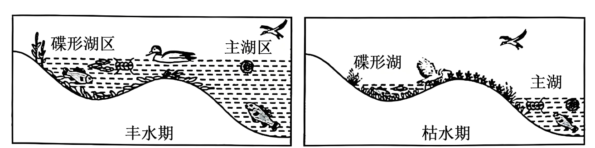
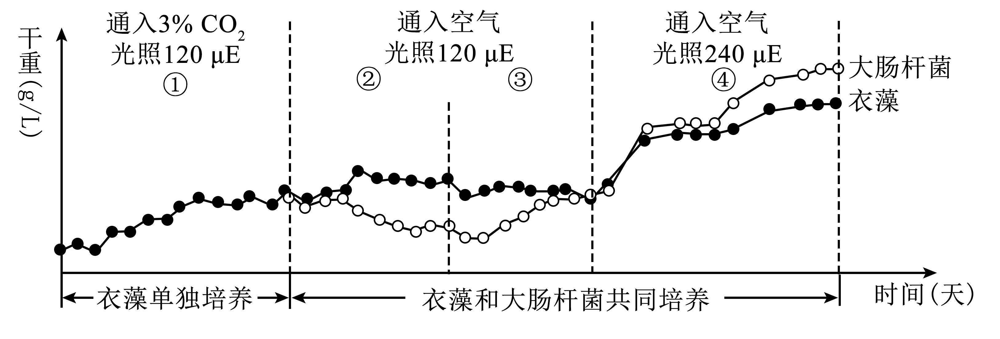

**生物学**

**注意事项：**

**1.答卷前，考生务必将自己的姓名、准考证号填写在试卷、答题卡上。**

**2.回答选择题时，选出每小题答案后，用铅笔把答题卡上对应题目的答案标号涂黑。如需改动，用橡皮擦干净后，再选涂其他答案标号。回答非选择题时，将答案写在答题卡上，写在本试卷上无效。**

**3.考试结束后，将本试卷和答题卡一并交回。**

**一、选择题：本大题共16小题，共40分。第1~12小题，每小题2分；第13~16小题，每小题4分。在每小题给出的四个选项中，只有一项是符合题目要求的。**

1\. 在合成、加工及运输促性腺激素的过程中，需要垂体细胞内各种结构的协调配合。下列有关该过程的说法错误的是（　　）

A. 合成场所位于核糖体

B. 加工需要高尔基体

C. 运输依赖于细胞骨架

D. 不需要线粒体参与

2\. 利用微生物分解厨余垃圾可实现资源的再利用。下列说法错误的是（　　）

A. 厨余垃圾分解过程产生的热量，会影响分解效率

B. 对组成复杂的厨余垃圾再分类，可提高利用效率

C. 厨余垃圾中的淀粉，可作为微生物的碳源和氮源

D. 含盐量高的厨余垃圾，可选用耐高盐的微生物分解

3\. 甘薯是重要的农作物，为了改良甘薯品质，科学家利用甘薯（2N=90）与其近缘野生种（2N=30）进行体细胞杂交，选育得到杂种植株M1。下列说法正确的是（　　）

A. 需用几丁质酶和果胶酶来降解甘薯细胞壁

B. 为防止原生质体失水，需使用低渗缓冲液

C. M1具有两个物种的所有性状，且染色体数目为2N=120

D. 在培育M1时，配制的各种培养基常以MS培养基为基础

4\. 线柱兰是华南地区草坪中常见的兰科植物，花朵小巧精美。兴趣小组分别采用逐个计数法和样方法，对校园草坪中的线柱兰种群数量进行调查。下列说法正确的是（　　）

A. 样方数量会影响样方法的调查结果

B. 这两种调查方法得到的结果通常相等

C. 运用样方法调查时，样方内均需有线柱兰

D. 若线柱兰个体数量较少，可缩小样方面积

5\. 切取虎尾兰的叶插入土壤，置于适宜条件下培养。一段时间后，切口处会长出新植株。下列有关该过程的说法错误的是（　　）

A. 体现了细胞的全能性

B. 受到植物激素的调节

C. 属于有性生殖的范畴

D. 包含脱分化及再分化

6\. 科学家利用携带猪源细胞表面蛋白基因（GT）的NDV病毒靶向感染人体内癌细胞，从而强烈激活免疫系统，起到了较好的肿瘤治疗效果。下列有关说法正确的是（　　）

A. 培养体外实验使用的癌细胞时，通常需添加血清

B. 感染NDV-GT的癌细胞会被巨噬细胞特异性吞噬

C. 经NDV-GT方法治愈的患者，体内不存在能识别GT蛋白的免疫细胞

D. 人体正常细胞若被感染并表达了GT，不会被免疫系统识别为“非己”成分

7\. 血钙水平受甲状旁腺激素（PTH）和降钙素（CT）共同调节，其机制见图。下列说法错误的是（　　）

A. 高钙饮食可以适度缓解老年骨质疏松

B. 甲状旁腺损伤严重会表现出肌无力病征

C. 对血钙水平的调节，PTH和CT相互拮抗

D. 抗维生素D佝偻病患者体内的PTH水平较高

8\. 研究发现，小鼠达到生殖年龄后，初级卵母细胞的细胞质基质内Ca2+浓度快速升高，激活PDE3A酶催化cAMP水解，最终促使停滞的初级卵母细胞恢复减数分裂。利用不同PDE3A基因型小鼠进行杂交，杂交情况及结果见表。下列分析正确的是（　　）

|           |     |     |     |     |     |     |
|:--------- |:--- |:--- |:--- |:--- |:--- |:--- |
| 组别        | 1   | 2   | 3   | 4   | 5   | 6   |
| ♂         | +/+ | +/+ | +/+ | -/- | -/- | -/- |
| ♀         | +/+ | +/- | -/- | +/+ | +/- | -/- |
| 平均窝产仔数（只） | 7.5 | 7.4 | 0   | 7.6 | 7.4 | 0   |

注：“+/+”表示野生型；“+/-”表示杂合突变：“-/-”表示纯合突变。

A. 提高cAMP水平后，初级卵母细胞成熟速度加快

B. 初级卵母细胞恢复减数分裂时，染色体开始复制

C. 杂合突变个体相互杂交后，平均窝产仔数约为7.4只

D. 给第3组的母鼠注射PDE3A酶激活剂，可提高其窝产仔数

9\. 某植物根细胞吸收存在两种跨膜运输方式，见图。下列有关分析正确的是（　　）

A. 低钾环境时，K+运输速率受H+运输速率限制

B. 运输H+时，载体蛋白空间结构不会改变

C. 呼吸抑制剂会抑制K+的这两种运输方式

D. K+是一种信号分子，能诱发根细胞产生兴奋

10\. 某大型淡水湖入湖河口形成了碟形湖。丰水期碟形湖区与主湖区湖水相连，枯水期碟形湖与主湖水流隔断，见图。下列说法错误的是（　　）

A. 枯水期时碟形湖与主湖之间存在物质交换

B. 丰水期时碟形湖区和主湖区藻类密度通常相等

C. 枯水期时碟形湖和主湖的能量金字塔均为正金字塔形

D. 丰水期时相邻两个营养级之间的能量传递效率为10%~20%

11\. 科研人员对肥胖组与正常组小鼠的精子进行相关检测，结果见表。下列说法错误的是（　　）

表

|             |            |                                                                        |
|:----------- |:---------- |:---------------------------------------------------------------------- |
| 检测指标        | 正常组        | 肥胖组                                                                    |
| 精子活动率（%）    | 45.67+5.49 | 21.37+3.70\*                                                           |
| 形态正常的精子（%）  | 83.38+2.87 | 6132+2.46\* |
| 精子中组蛋白乙酰化水平 | 1.03±0.51  | 0.46±0.18\*                                                            |

A. 肥胖导致精子活动率下降，进而使生育潜能降低

B. 肥胖可能影响性激素的产生，进而影响精子的正常发育

C. 精子中组蛋白乙酰化水平的高低，不会影响基因的表达水平

D. 低水平的组蛋白乙酰化表观修饰可传递给子代，并使其容易肥胖

12\. 某种鱼的尾巴性状受常染色体上等位基因E/e控制，见表。已知雌鱼通常只与大尾巴雄鱼交配。现有一个EE60条、Ee120条和ee60条（每种基因型的雌、雄鱼数量相等）的种群，下列有关该种群自然繁殖后的分析，正确的是（　　）

表

<table style="width:49%;">
<colgroup>
<col style="width: 15%" />
<col style="width: 16%" />
<col style="width: 16%" />
</colgroup>
<tbody>
<tr>
<td style="text-align: left;">基因组成</td>
<td style="text-align: left;">E_</td>
<td style="text-align: left;">ee</td>
</tr>
<tr>
<td style="text-align: left;">雄鱼尾巴性状</td>
<td style="text-align: left;">大尾巴</td>
<td style="text-align: left;">小尾巴</td>
</tr>
<tr>
<td style="text-align: left;">雌鱼尾巴性状</td>
<td colspan="2" style="text-align: left;">所有基因型个体的尾巴大小一致</td>
</tr>
</tbody>
</table>

A. 多代后，小尾巴雄鱼将消失

B. 子一代雌鱼中E基因频率降低

C. 多代后，小尾巴雄鱼的尾巴更小

D. 子一代雌、雄鱼中e基因频率相等

13\. 研究人员探究了不同浓度的油菜蜂花粉多酚（以下简称“多酚”）和药物Q对胰脂肪酶活性的影响（图a）；以及不同pH处理多酚后，多酚对该酶的酶促水解速率的影响（图b）。下列说法正确的是（　　）

A. 单位时间内甘油的生成量，可作为以上实验的检测指标

B. 在催化脂肪水解过程中，胰脂肪酶提供了大量的活化能

C. 相同浓度下，药物Q对胰脂肪酶活性的抑制效果强于多酚

D. 比较不同pH处理后的多酚，乙组对胰脂肪酶活性的抑制效果最弱

14\. 植物光敏色素phyB通常有Pr和Pfr两种构型，Pr吸收红光后转化为Pfr，但Pfr吸收远红光后又可逆转为Pr。遮阴会使环境中红光与远红光比值下降。下列分析错误的是（　　）

A. Pr吸收红光转化为Pfr不属于蛋白质变性

B. 茎尖分生区细胞phyB含量比叶表皮细胞多

C. 茎尖向光侧细胞的Pr与Pfr比值比背光侧大

D. 茎尖向光侧细胞的Pr会与IAA结合抑制生长

15\. 褐飞虱是一种迁飞性害虫，每年春季自南向北逐步迁入水稻种植区，期间繁殖数代。某地采用灯诱监测褐飞虱成虫数量的动态变化，同时通过田间调查测定水稻单丛虫量（含所有龄级个体），结果见图。下列说法错误的是（　　）

A 分蘖期后，褐飞虱开始迁入

B. 抽穗期有大量褐飞虱迁入

C. 抽穗期末期灯诱虫量下降是因为大量个体死亡

D. 黄熟期灯诱虫量上升是因为有大量褐飞虱迁出

16\. 某种二倍体鱼（XY型）会发生性逆转现象，研究人员运用基因编辑技术对雌鱼的雌激素合成主要基因进行敲除实验，并得到雌鱼性逆转的有关结果，见表。下列有关分析正确的是（　　）

表

|     |     |     |     |            |      |
|:--- |:--- |:--- |:--- |:---------- |:---- |
| 组别  | f基因 | c基因 | s基因 | 雌激素水平      | 鱼的性别 |
| 野生型 | \+  | \+  | \+  | \*\*\*\*\* | ♀    |
| 甲   | \+  | \-  | \+  | \*         | ♂    |
| 乙   | \-  | \+  | \-  | \*\*       | ♂    |
| 丙   | \-  | \-  | \+  | \*         | ♂    |
| 丁   | \+  | \-  | \-  | \*         | ♂    |
| 戊   | \-  | \+  | \+  | \*\*       | ♂    |
| 己   | \+  | \+  | \-  | \*\*\*\*   | ♀    |

注：“+”表示不敲除基因；“-”表示敲除基因；“\*\*\*\*\*”表示野生型雌鱼正常的雌激素水平。

A. c、f基因都能直接控制合成少量且相等的雌激素

B. s、f基因的表达产物，共同促进c基因控制雌激素合成

C. 饲喂外源雌激素，不能阻止甲、丙、丁三组雌鱼性逆转

D. 乙、戊组鱼分别与己组鱼交配，后代性染色体组成不全是XX

**二、非选择题：本题共5小题，共60分。**

17\. 为研究声波频率对大鼠情绪的影响，科学家进行了相关实验，结果见图。回答下列问题：

注：大鼠甜水偏好程度与其情绪愉悦程度正相关。

（1）大鼠耳内\_\_\_\_\_\_受到声音刺激会产生兴奋。兴奋后恢复为静息电位的过程中，细胞膜外的电位变化是\_\_\_\_\_\_，这主要是由\_\_\_\_\_\_导致的。兴奋在听觉反射弧中的传递方向是\_\_\_\_\_\_（选填“单向”或“双向”）的。

（2）实验结果表明，对大鼠情绪有正面影响的处理是\_\_\_\_\_\_，理由是\_\_\_\_\_\_。

（3）推测声波频率对大鼠情绪的影响主要是通过\_\_\_\_\_\_侧大脑海马区进行的。如对实验中有负面情绪的大鼠补充外源多巴胺至正常水平，短期内其甜水偏好不能恢复，原因是\_\_\_\_\_\_。

18\. 科学家利用衣藻和大肠杆菌设计了一种共培养系统。该系统中，工程化衣藻在光合作用时，会通过光呼吸竞争性消耗C5产生甘醇酸（光呼吸强度受CO2/O2比值影响）；工程化大肠杆菌利用甘醇酸合成高价值生物产品。实验过程及结果见图。回答下列问题：

注：μE为光照强度单位μmol.m-2.s-1

（1）第①阶段向培养液中通入3%CO2，目的是\_\_\_\_\_\_。

（2）第②阶段大肠杆菌干重下降的主要原因是\_\_\_\_\_\_。

（3）据图分析，限制第③阶段衣藻干重增加的主要因素是\_\_\_\_\_\_；第④阶段衣藻和大肠杆菌的干重均增加，原因是\_\_\_\_\_\_。

（4）该系统对助力实现碳中和目标的优势是\_\_\_\_\_\_。

19\. 岩溶石漠化指脆弱的喀斯特生态系统在不合理的人为干扰下，植被退化导致土壤流失，岩石大面积裸露，呈现类似于荒漠化景观的现象。近年来，我国通过人工造林等生态工程，在石漠化治理方面取得了显著成效。回答下列问题：

（1）石漠化治理是通过人为干预改变演替的\_\_\_\_\_\_，提高生态系统的\_\_\_\_\_\_稳定性。

（2）石漠化治理初期，部分地区会通过种植豆科小灌木紫花苜蓿来改善土壤肥力，其原理是\_\_\_\_\_\_。

（3）在石漠化治理时，还会基于“因地制宜，本土优先”的原则选择一些乔木，遵循的生态学原理是\_\_\_\_\_\_。选择的这些乔木，生态位重叠较小，既避免竞争排斥，实现共存，又利于\_\_\_\_\_\_（至少写出2方面）。

（4）治理过程中，群落常常会进入相对稳定的“藤灌阶段”，此时需要适当采伐群落中的藤本植物和灌木，目的是\_\_\_\_\_\_。

20\. 某植物（XY型）的花色受2对等位基因（E/e和R/r）控制，遵循自由组合定律。已知E/e基因位于常染色体上，该植物花色产生机制见图（不考虑XY同源区段、染色体交换情况）。回答下列问题：

（1）将红花雌、雄株杂交，子一代表型及比例为红花：黄花：白花=9：3：4，据此不能确定R/r基因位于常染色体上，理由是\_\_\_\_\_\_。对子一代的雌株作进一步分析：若\_\_\_\_\_\_，则说明R/r基因位于X染色体上；若\_\_\_\_\_\_，则说明R/r基因位于常染色体上。

（2）实验分析确定E/e与R/r基因都位于常染色体上。在某红花雌、雄株繁殖的子代群体中，红花占比显著降低。经初步研究确定是常染色体上的g基因发生显性突变，产生了抑制作用，被抑制的基因不能表达，但未知被抑制的是E还是R基因。

①生物兴趣小组选取基因型EERRgg与eerrGg为亲本，探究G基因的抑制对象。写出实验思路、预期结果和结论\_\_\_\_\_。

②再选用基因型EeRrGg的雌、雄株为亲本进行杂交，子一代的表型及比例为红花：黄花：白花=3：9：4.请在答题卡作图区画出EeRrGg个体的基因在染色体上可能的位置关系图（用“○”表示细胞，用“‖”表示1对同源染色体），并用文字说明基因间的抑制关系及位置情况\_\_\_\_。

21\. CAR-T是指通过基因工程技术表达CAR基因的T细胞。CAR-T能更好地识别肿瘤细胞表面特定抗原，在肿瘤治疗中疗效显著。构建CAR-T过程见图，回答下列问题：

（1）构建含CAR基因的重组质粒，选用的限制酶组合是\_\_\_\_\_\_。

（2）将连接产物导入Ca2+处理后的大肠杆菌，使用添加氨苄青霉素的固体培养基培养。使用固体培养基的原因是\_\_\_\_\_\_。

（3）将获得的重组质粒导入T细胞并成功表达后，为了研究CAR-T识别肿瘤细胞的特异性及抗肿瘤效果，除了有CAR-T与肿瘤细胞共同培养的实验组，还需设置的对照组有\_\_\_\_\_\_，肿瘤细胞凋亡率的检测指标有\_\_\_\_\_\_（至少写出2点）。

（4）研究发现，肿瘤细胞高表达的PD-L1与CAR-T表达的PD-1结合会启动免疫抑制。为了阻断免疫抑制，可采取的策略有抑制PD-1与PD-L1的结合以及\_\_\_\_\_\_。同时，肿瘤周围组织过于致密会使CAR-T难以接触肿瘤细胞，也会影响疗效。可通过设计减弱原有PD-1启动的抑制通路和降解肿瘤胞外基质的途径解决上述两个问题。已知溶解酶可以降解细胞外基质，多种酶同时作用可提高降解效率；与PD-1连接的生物开关，在该PD-1与PD-L1结合后会被打开，释放P因子激活P启动子。依据上述特性构建新的重组质粒并使其在T细胞中表达。该新的重组质粒部分结构见图，其中①是\_\_\_\_\_\_，②是\_\_\_\_\_\_，③是\_\_\_\_\_\_，④是\_\_\_\_\_\_。

