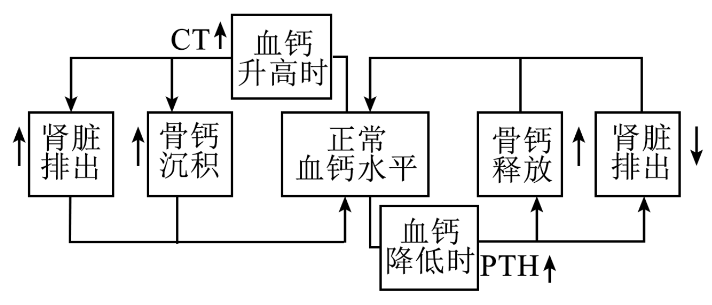
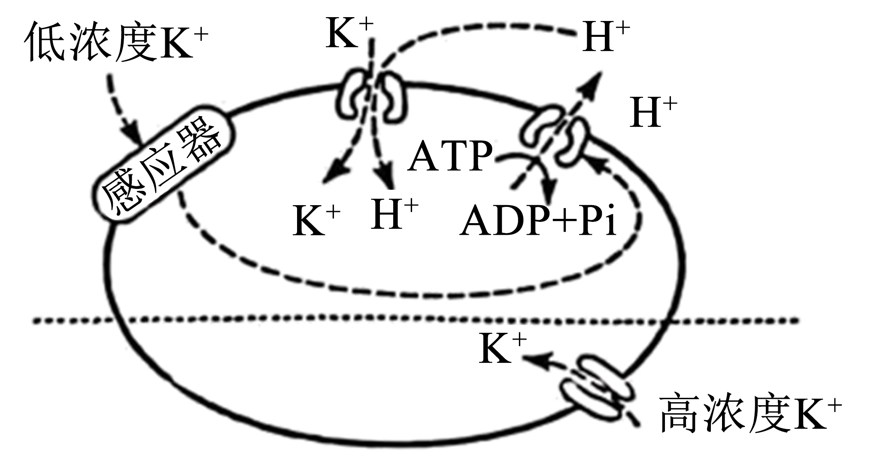
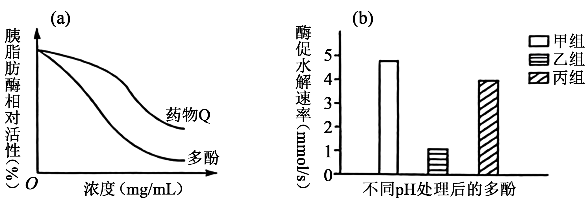
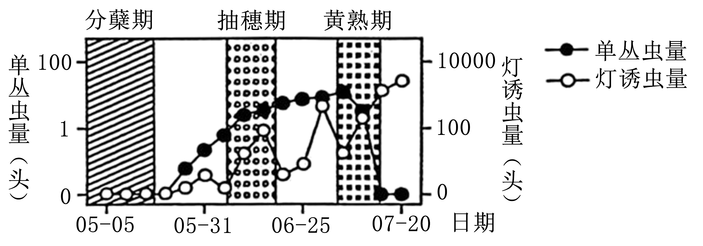
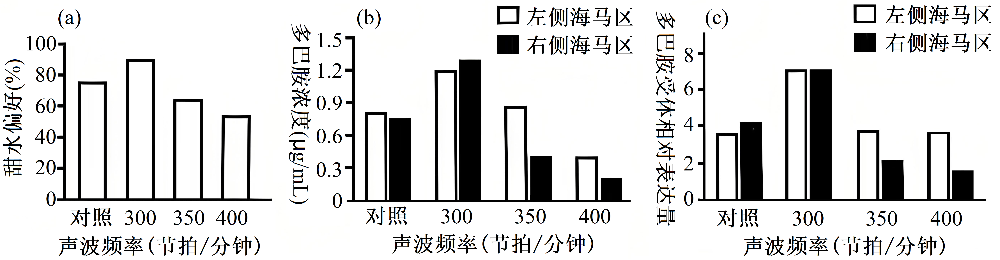
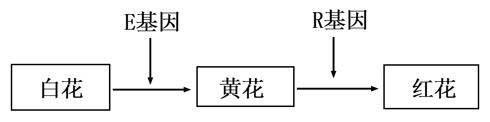
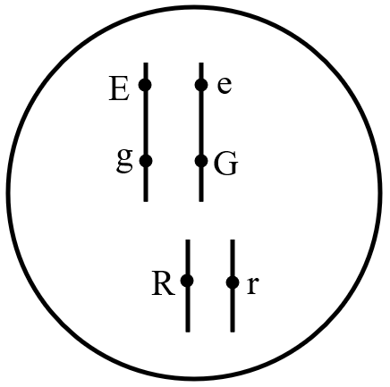
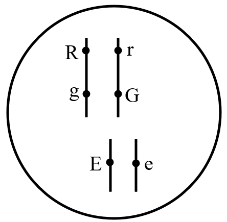
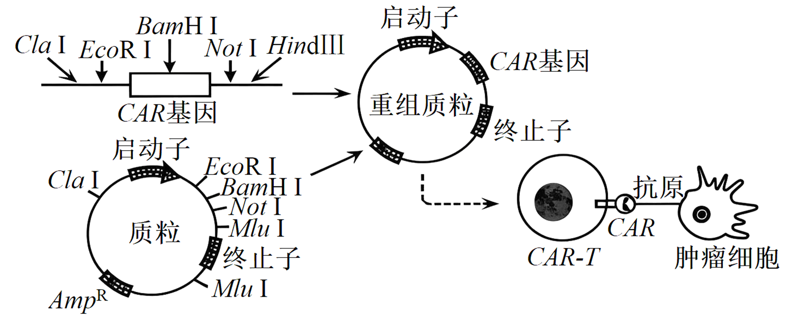

**生物学**

**注意事项：**

**1.答卷前，考生务必将自己的姓名、准考证号填写在试卷、答题卡上。**

**2.回答选择题时，选出每小题答案后，用铅笔把答题卡上对应题目的答案标号涂黑。如需改动，用橡皮擦干净后，再选涂其他答案标号。回答非选择题时，将答案写在答题卡上，写在本试卷上无效。**

**3.考试结束后，将本试卷和答题卡一并交回。**

**一、选择题：本大题共16小题，共40分。第1~12小题，每小题2分；第13~16小题，每小题4分。在每小题给出的四个选项中，只有一项是符合题目要求的。**

1\. 在合成、加工及运输促性腺激素的过程中，需要垂体细胞内各种结构的协调配合。下列有关该过程的说法错误的是（　　）

A. 合成场所位于核糖体

B. 加工需要高尔基体

C. 运输依赖于细胞骨架

D. 不需要线粒体参与

【答案】D

【解析】

【详解】A、促性腺激素为蛋白质类激素，其合成场所是核糖体，A正确；

B、加工过程需内质网进行初步加工，再经高尔基体进一步修饰，B正确；

C、运输过程中囊泡的移动依赖细胞骨架的协助，C正确；

D、蛋白质合成、加工及运输均需消耗能量，能量主要由线粒体提供，因此需要线粒体参与，D错误；

故选D。

2\. 利用微生物分解厨余垃圾可实现资源的再利用。下列说法错误的是（　　）

A. 厨余垃圾分解过程产生的热量，会影响分解效率

B. 对组成复杂的厨余垃圾再分类，可提高利用效率

C. 厨余垃圾中的淀粉，可作为微生物的碳源和氮源

D. 含盐量高的厨余垃圾，可选用耐高盐的微生物分解

【答案】C

【解析】

【详解】A、微生物分解有机物时通过呼吸作用释放热量，若温度过高可能导致酶活性下降，从而影响分解效率，A正确；

B、厨余垃圾成分复杂，分类后可根据不同成分选择适宜微生物或处理条件，提高分解效率，B正确；

C、淀粉由C、H、O组成，仅含碳元素，可为微生物提供碳源，但无法提供氮源（氮源需含N元素），C错误；

D、高盐环境会抑制普通微生物生长，但耐高盐微生物（如嗜盐菌）可适应此环境并分解有机物，D正确。

故选C。

3\. 甘薯是重要的农作物，为了改良甘薯品质，科学家利用甘薯（2N=90）与其近缘野生种（2N=30）进行体细胞杂交，选育得到杂种植株M1。下列说法正确的是（　　）

A. 需用几丁质酶和果胶酶来降解甘薯细胞壁

B. 为防止原生质体失水，需使用低渗缓冲液

C. M1具有两个物种的所有性状，且染色体数目为2N=120

D. 在培育M1时，配制的各种培养基常以MS培养基为基础

【答案】D

【解析】

【详解】A、植物细胞壁的主要成分是纤维素和果胶，因此需用纤维素酶和果胶酶降解细胞壁，而非几丁质酶，A错误；

B、原生质体在低渗溶液中会因渗透吸水而涨破，需使用等渗缓冲液维持渗透压平衡，B错误；

C、体细胞杂交后，杂种细胞的染色体数为两亲本之和（90+30=120），但由于基因选择性表达或存在不亲和性，杂种植株的性状可能不完全包含两个物种的所有性状，C错误；

D、MS培养基是植物组织培养的常用基础培养基，体细胞杂交后的杂种细胞需在MS培养基中诱导脱分化和再分化，D正确。

故选D。

4\. 线柱兰是华南地区草坪中常见的兰科植物，花朵小巧精美。兴趣小组分别采用逐个计数法和样方法，对校园草坪中的线柱兰种群数量进行调查。下列说法正确的是（　　）

A. 样方数量会影响样方法的调查结果

B. 这两种调查方法得到的结果通常相等

C. 运用样方法调查时，样方内均需有线柱兰

D. 若线柱兰个体数量较少，可缩小样方面积

【答案】A

【解析】

【详解】A、样方法的准确性依赖于样方的数量，样方数量过少会导致误差增大，因此样方数量会影响调查结果，A正确；

B、逐个计数法为精确统计，样方法为估算值，两者结果通常不相等，尤其在种群数量较大时差异更明显，B错误；

C、样方法中即使某些样方内无线柱兰，仍需如实记录（记为0），否则会高估种群密度，C错误；

D、若线柱兰个体数量较少，应适当扩大样方面积或增加样方数量以提高准确性，缩小样方面积可能导致遗漏个体，D错误。

故选A。

5\. 切取虎尾兰的叶插入土壤，置于适宜条件下培养。一段时间后，切口处会长出新植株。下列有关该过程的说法错误的是（　　）

A. 体现了细胞的全能性

B. 受到植物激素的调节

C. 属于有性生殖的范畴

D. 包含脱分化及再分化

【答案】C

【解析】

【详解】A、细胞全能性是指细胞经分裂和分化后，仍具有产生完整有机体或分化成其他各种细胞的潜能和特性。虎尾兰叶插后，切口处细胞能发育成新植株，体现了细胞的全能性，A正确；

B、植物生长受激素（如生长素、细胞分裂素）调节，B正确；

C、叶插未经过两性生殖细胞结合，属于无性生殖，C错误；

D、叶插需切口处细胞脱分化形成愈伤组织，再分化出根和芽，D正确。

故选C。

6\. 科学家利用携带猪源细胞表面蛋白基因（GT）的NDV病毒靶向感染人体内癌细胞，从而强烈激活免疫系统，起到了较好的肿瘤治疗效果。下列有关说法正确的是（　　）

A. 培养体外实验使用的癌细胞时，通常需添加血清

B. 感染NDV-GT的癌细胞会被巨噬细胞特异性吞噬

C. 经NDV-GT方法治愈的患者，体内不存在能识别GT蛋白的免疫细胞

D. 人体正常细胞若被感染并表达了GT，不会被免疫系统识别为“非己”成分

【答案】A

【解析】

【详解】A、动物细胞培养时，培养基中需添加血清等天然成分以提供细胞生长所需的营养物质和生长因子，因此培养体外实验使用的癌细胞通常需要添加血清，A正确；

B、巨噬细胞的吞噬作用属于非特异性免疫，不具有特异性，即使癌细胞被NDV-GT感染，其吞噬过程仍为非特异性，B错误；

C、NDV-GT治疗会激活免疫系统产生记忆细胞，这些细胞能够长期识别GT蛋白，因此治愈后患者体内仍存在识别GT蛋白的免疫细胞，C错误；

D、若正常细胞被感染并表达GT蛋白（异源蛋白），会被免疫系统识别为抗原，从而引发免疫反应，D错误。

故选A。

7\. 血钙水平受甲状旁腺激素（PTH）和降钙素（CT）共同调节，其机制见图。下列说法错误的是（　　）

A. 高钙饮食可以适度缓解老年骨质疏松

B. 甲状旁腺损伤严重会表现出肌无力病征

C. 对血钙水平的调节，PTH和CT相互拮抗

D. 抗维生素D佝偻病患者体内的PTH水平较高

【答案】B

【解析】

【详解】A、高钙饮食可以增加钙的摄入，能够适度缓解老年骨质疏松，A正确；

B、甲状旁腺激素的作用是升高血钙，甲状旁腺损伤导致甲状旁腺激素分泌减少，进而导致血钙偏低，表现出肌肉抽搐，B错误；

C、PTH的作用是升高血钙，CT的作用是降低血钙，两者相互拮抗，C正确；

D、抗维生素D佝偻病患者体内血钙偏低，会导致其体内PTH分泌增加，D正确。

故选B。

8\. 研究发现，小鼠达到生殖年龄后，初级卵母细胞的细胞质基质内Ca2+浓度快速升高，激活PDE3A酶催化cAMP水解，最终促使停滞的初级卵母细胞恢复减数分裂。利用不同PDE3A基因型小鼠进行杂交，杂交情况及结果见表。下列分析正确的是（　　）

|           |     |     |     |     |     |     |
|:--------- |:--- |:--- |:--- |:--- |:--- |:--- |
| 组别        | 1   | 2   | 3   | 4   | 5   | 6   |
| ♂         | +/+ | +/+ | +/+ | -/- | -/- | -/- |
| ♀         | +/+ | +/- | -/- | +/+ | +/- | -/- |
| 平均窝产仔数（只） | 7.5 | 7.4 | 0   | 7.6 | 7.4 | 0   |

注：“+/+”表示野生型；“+/-”表示杂合突变：“-/-”表示纯合突变。

A. 提高cAMP水平后，初级卵母细胞成熟速度加快

B. 初级卵母细胞恢复减数分裂时，染色体开始复制

C. 杂合突变个体相互杂交后，平均窝产仔数约为7.4只

D. 给第3组的母鼠注射PDE3A酶激活剂，可提高其窝产仔数

【答案】C

【解析】

【详解】A、题干指出，PDE3A酶激活后会水解cAMP，促进减数分裂恢复。若提高cAMP水平，会抑制减数分裂恢复，导致成熟速度减慢，A错误；

B、初级卵母细胞的染色体复制发生在减数第一次分裂前的间期，恢复减数分裂时（即继续完成减数第一次分裂），染色体不再复制，B错误；

C、从表格看，第2组（♂+/+ × ♀+/-）平均窝产仔数约7.4 只，第5组（♂-/- × ♀+/-）平均窝产仔数也约 7.4只。“+/-” 表示杂合突变个体，这两组可看作杂合突变个体相互杂交的情况，由此能推出杂合突变个体相互杂交后，平均窝产仔数约为7.4只，C正确；

D、第3组是♂+/+×♀-/-，平均窝产仔数为0。因为雌性（♀）是纯合突变（-/-），缺乏PDE3A酶（或PDE3A 酶功能异常），即使注射PDE3A酶激活剂，没有足够的PDE3A酶催化cAMP水解，也无法促使初级卵母细胞恢复减数分裂，不能提高窝产仔数，D错误。

故选C。

9\. 某植物根细胞吸收存在两种跨膜运输方式，见图。下列有关分析正确的是（　　）

A 低钾环境时，K+运输速率受H+运输速率限制

B. 运输H+时，载体蛋白空间结构不会改变

C. 呼吸抑制剂会抑制K+的这两种运输方式

D. K+是一种信号分子，能诱发根细胞产生兴奋

【答案】A

【解析】

【详解】A、由图可知，低钾环境时，K+进行主动运输，由膜两侧的H+浓度差驱动，因此受H+运输速率限制，A正确；

B、载体蛋白运输物质时，会与被运输物质结合，改变自身构象，B错误；

C、图中高钾环境中K+的运输方式为协助扩散，呼吸抑制剂不会抑制这种运输方式，C错误；

D、K+可以作为一种信号分子影响根细胞的运输方式，但根细胞不能产生兴奋，D错误。

故选A。

10\. 某大型淡水湖入湖河口形成了碟形湖。丰水期碟形湖区与主湖区湖水相连，枯水期碟形湖与主湖水流隔断，见图。下列说法错误的是（　　）

A. 枯水期时碟形湖与主湖之间存在物质交换

B. 丰水期时碟形湖区和主湖区藻类密度通常相等

C. 枯水期时碟形湖和主湖的能量金字塔均为正金字塔形

D. 丰水期时相邻两个营养级之间的能量传递效率为10%~20%

【答案】B

【解析】

【详解】A、枯水期虽水流隔断，但生物活动、物质扩散等仍能使碟形湖与主湖存在物质交换，A正确；

B、丰水期碟形湖（入湖河口形成）与主湖的环境（如营养盐分布、水流速度等）存在差异，藻类密度通常不相等，B错误；

C、能量沿食物链逐级递减，枯水期碟形湖和主湖的能量金字塔均为正金字塔形（底层生产者含能量最多，向上逐级减少），C正确；

D、生态系统中，相邻两个营养级之间的能量传递效率通常为10%~20%，丰水期也遵循该规律，D正确。

故选B。

11\. 科研人员对肥胖组与正常组小鼠的精子进行相关检测，结果见表。下列说法错误的是（　　）

表

|             |                                                                      |              |
|:----------- |:-------------------------------------------------------------------- |:------------ |
| 检测指标        | 正常组                                                                  | 肥胖组          |
| 精子活动率（%）    | 45.67+5.49                                                           | 21.37+3.70\* |
| 形态正常的精子（%）  | 8338+2.87 | 61.32+2.46\* |
| 精子中组蛋白乙酰化水平 | 1.03±0.51                                                            | 0.46±0.18\*  |

A. 肥胖导致精子活动率下降，进而使生育潜能降低

B. 肥胖可能影响性激素的产生，进而影响精子的正常发育

C. 精子中组蛋白乙酰化水平的高低，不会影响基因的表达水平

D. 低水平的组蛋白乙酰化表观修饰可传递给子代，并使其容易肥胖

【答案】C

【解析】

【详解】A、肥胖组精子活动率显著低于正常组，活动率低会直接影响精子与卵子的结合能力，导致生育潜能下降，A正确；

B、性激素参与精子正常发育，肥胖可能干扰内分泌系统，影响性激素产生，进而影响精子发育（如形态正常精子比例下降），B正确；

C、组蛋白乙酰化属于表观遗传修饰，乙酰化水平升高可使染色质结构松散，促进基因转录；反之则抑制。表中肥胖组乙酰化水平降低，必然影响基因表达，C错误；

D、表观遗传修饰（如组蛋白乙酰化）可通过生殖细胞遗传给子代，若父代精子乙酰化水平低导致相关基因表达异常，可能使子代易患肥胖，D正确。

故选C。

12\. 某种鱼的尾巴性状受常染色体上等位基因E/e控制，见表。已知雌鱼通常只与大尾巴雄鱼交配。现有一个EE60条、Ee120条和ee60条（每种基因型的雌、雄鱼数量相等）的种群，下列有关该种群自然繁殖后的分析，正确的是（　　）

表

<table style="width:49%;">
<colgroup>
<col style="width: 15%" />
<col style="width: 16%" />
<col style="width: 16%" />
</colgroup>
<tbody>
<tr>
<td style="text-align: left;">基因组成</td>
<td style="text-align: left;">E_</td>
<td style="text-align: left;">ee</td>
</tr>
<tr>
<td style="text-align: left;">雄鱼尾巴性状</td>
<td style="text-align: left;">大尾巴</td>
<td style="text-align: left;">小尾巴</td>
</tr>
<tr>
<td style="text-align: left;">雌鱼尾巴性状</td>
<td colspan="2" style="text-align: left;">所有基因型个体的尾巴大小一致</td>
</tr>
</tbody>
</table>

A. 多代后，小尾巴雄鱼将消失

B. 子一代雌鱼中E基因频率降低

C. 多代后，小尾巴雄鱼的尾巴更小

D. 子一代雌、雄鱼中e基因频率相等

【答案】D

【解析】

【详解】A、 小尾巴雄鱼基因型为ee，其产生需父母均传递e基因。雌鱼可能携带e基因（如Ee、ee），且大尾巴雄鱼（Ee）可传递e基因，因此ee雄鱼不会完全消失，A错误；

B、 雌鱼的交配对象是大尾巴雄鱼（E\_），大尾巴雄鱼含较多E基因，会使雌鱼后代中E基因频率升高，B错误；

C、雄鱼尾巴大小由基因型决定，ee始终为小尾巴，无表型渐变机制，C错误；

D、鱼的尾巴性状受常染色体上等位基因E/e控制，与性别无关，所以子一代雌、雄鱼中e基因频率相等，D正确。

故选D。

13\. 研究人员探究了不同浓度的油菜蜂花粉多酚（以下简称“多酚”）和药物Q对胰脂肪酶活性的影响（图a）；以及不同pH处理多酚后，多酚对该酶的酶促水解速率的影响（图b）。下列说法正确的是（　　）

A. 单位时间内甘油的生成量，可作为以上实验的检测指标

B. 在催化脂肪水解过程中，胰脂肪酶提供了大量的活化能

C. 相同浓度下，药物Q对胰脂肪酶活性的抑制效果强于多酚

D. 比较不同pH处理后的多酚，乙组对胰脂肪酶活性的抑制效果最弱

【答案】A

【解析】

【详解】A、脂肪水解后的产物为甘油和脂肪酸，因此可以用单位时间内甘油的生成量，作为胰脂肪酶活性的检测指标，A正确；

B、酶的作用机理为降低化学反应的活化能，而不是提供活化能，B错误；

C、由图a可知，相同浓度下，药物Q处理后胰脂肪酶的相对活性高于多酚处理，因此药物Q对胰脂肪酶活性的抑制效果弱于多酚，C错误；

D、在图b中，乙组酶促水解速率最低，说明乙组对胰脂肪酶活性的抑制作用最强，D错误。

故选A。

14\. 植物光敏色素phyB通常有Pr和Pfr两种构型，Pr吸收红光后转化为Pfr，但Pfr吸收远红光后又可逆转为Pr。遮阴会使环境中红光与远红光比值下降。下列分析错误的是（　　）

A. Pr吸收红光转化为Pfr不属于蛋白质变性

B. 茎尖分生区细胞phyB含量比叶表皮细胞多

C. 茎尖向光侧细胞的Pr与Pfr比值比背光侧大

D. 茎尖向光侧细胞的Pr会与IAA结合抑制生长

【答案】D

【解析】

【详解】A、Pr吸收红光转化为Pfr是构象变化，未破坏蛋白质的空间结构，因此不属于变性，A正确；

B、光敏色素主要分布在分生组织等代谢活跃区域，茎尖分生区细胞比叶表皮细胞生理活动更旺盛，所以茎尖分生区细胞phyB含量比叶表皮细胞多，B正确；

C、遮阴环境中红光减少、远红光增加，Pfr吸收远红光逆转为Pr，导致Pr/Pfr比值升高，茎尖向光侧接受远红光更多，Pr积累更显著，其Pr/Pfr比值比背光侧大，C正确；

D、Pr通过信号转导调控基因表达，间接影响IAA合成或分布，而非直接与IAA结合抑制生长，D错误。

故选D。

15\. 褐飞虱是一种迁飞性害虫，每年春季自南向北逐步迁入水稻种植区，期间繁殖数代。某地采用灯诱监测褐飞虱成虫数量的动态变化，同时通过田间调查测定水稻单丛虫量（含所有龄级个体），结果见图。下列说法错误的是（　　）

A. 分蘖期后，褐飞虱开始迁入

B. 抽穗期有大量褐飞虱迁入

C. 抽穗期末期灯诱虫量下降是因为大量个体死亡

D. 黄熟期灯诱虫量上升是因为有大量褐飞虱迁出

【答案】C

【解析】

【详解】A、从图中看，分蘖期（05-05左右）后，灯诱虫量开始上升，说明褐飞虱开始迁入，A正确；

B、抽穗期时，“灯诱虫量”和“单丛虫量”均大幅上升，说明有大量褐飞虱成虫迁入（成虫繁殖后，各龄级个体总量也增加），B正确；

C、抽穗期末期“灯诱虫量（成虫）”下降，结合褐飞虱的迁飞性，更可能是成虫迁走，而非“大量个体死亡”—— 若大量死亡，“单丛虫量” 中各龄级个体也会明显减少，但图中 “单丛虫量” 此时未同步大幅下降，C错误；

D、黄熟期（07-20 左右）灯诱虫量上升，但此时水稻已接近成熟，褐飞虱可能因为寻找新的寄主而迁出，D正确。

故选C。

16\. 某种二倍体鱼（XY型）会发生性逆转现象，研究人员运用基因编辑技术对雌鱼的雌激素合成主要基因进行敲除实验，并得到雌鱼性逆转的有关结果，见表。下列有关分析正确的是（　　）

表

|     |     |     |     |            |      |
|:--- |:--- |:--- |:--- |:---------- |:---- |
| 组别  | f基因 | c基因 | s基因 | 雌激素水平      | 鱼的性别 |
| 野生型 | \+  | \+  | \+  | \*\*\*\*\* | ♀    |
| 甲   | \+  | \-  | \+  | \*         | ♂    |
| 乙   | \-  | \+  | \-  | \*\*       | ♂    |
| 丙   | \-  | \-  | \+  | \*         | ♂    |
| 丁   | \+  | \-  | \-  | \*         | ♂    |
| 戊   | \-  | \+  | \+  | \*\*       | ♂    |
| 己   | \+  | \+  | \-  | \*\*\*\*   | ♀    |

注：“+”表示不敲除基因；“-”表示敲除基因；“\*\*\*\*\*”表示野生型雌鱼正常的雌激素水平。

A. c、f基因都能直接控制合成少量且相等的雌激素

B. s、f基因的表达产物，共同促进c基因控制雌激素合成

C. 饲喂外源雌激素，不能阻止甲、丙、丁三组雌鱼性逆转

D. 乙、戊组鱼分别与己组鱼交配，后代性染色体组成不全是XX

【答案】D

【解析】

【分析】根据实验数据，野生型雌鱼（f⁺c⁺s⁺）雌激素水平高，性别为雌性。当敲除不同基因后，雌激素水平降低，导致性逆转为雄性。需结合各基因敲除组合的结果，分析选项。

【详解】A、基因通过控制酶的合成间接调控雌激素（化学本质是脂质而非蛋白质）合成，并非 “直接合成雌激素”；且不同基因敲除后雌激素变化不同，说明基因对雌激素的影响不 “相等”，A错误；

B、与乙组敲除s基因相比，戊组含有s基因，但其雌激素水平和乙组一样，说明s基因的表达产物并非 “共同促进 c 基因控制雌激素合成”B错误；

C、性逆转因内源雌激素不足导致，补充外源雌激素可恢复雌性特征，因此饲喂外源雌激素能阻止性逆转，C错误；

D．性逆转雄鱼（乙、戊组）的性染色体可能为 XY （并非全为 XX ）；己组为 XX 雌鱼。二者交配时，若父本（乙、戊组）提供 Y 配子，后代会出现 XY 性染色体组成，因此 “后代性染色体组成不全是 XX ”，D正确。

故选D。

**二、非选择题：本题共5小题，共60分。**

17\. 为研究声波频率对大鼠情绪的影响，科学家进行了相关实验，结果见图。回答下列问题：

注：大鼠甜水偏好程度与其情绪愉悦程度正相关。

（1）大鼠耳内\_\_\_\_\_\_受到声音刺激会产生兴奋。兴奋后恢复为静息电位的过程中，细胞膜外的电位变化是\_\_\_\_\_\_，这主要是由\_\_\_\_\_\_导致的。兴奋在听觉反射弧中的传递方向是\_\_\_\_\_\_（选填“单向”或“双向”）的。

（2）实验结果表明，对大鼠情绪有正面影响的处理是\_\_\_\_\_\_，理由是\_\_\_\_\_\_。

（3）推测声波频率对大鼠情绪的影响主要是通过\_\_\_\_\_\_侧大脑海马区进行的。如对实验中有负面情绪的大鼠补充外源多巴胺至正常水平，短期内其甜水偏好不能恢复，原因是\_\_\_\_\_\_。

【答案】（1） ①. 听觉神经元 ②. 由负电位变为正电位 ③. K+外流 ④. 单向

（2） ①. 频率为300节拍/分钟的声波 ②. 与对照组相比，只有频率为300节拍/分钟的声波提高了大鼠甜水偏好程度，而大鼠甜水偏好程度与其情绪愉悦程度正相关

（3） ①. 右 ②. 其海马区的多巴胺受体表达量减少，短期内无法恢复正常水平

【解析】

【分析】兴奋在两个神经元之间传递是通过突触进行的。突触由突触前膜、突触间隙和突触后膜三部分组成。神经递质只存在于突触前膜的突触小泡中，只能由突触前膜释放，进入突触间隙，作用于突触后膜上的特异性受体，引起下一个神经元兴奋或抑制，因此兴奋在神经元之间的传递是单向的。

【小问1详解】

大鼠耳内有听觉神经元能够接受声音刺激并产生兴奋。静息电位是外正内负，兴奋时是外负内正，兴奋后恢复为静息电位的过程中，细胞膜外的电位变化是由负电位变为正电位，这主要是由K+外流导致的。由于突触结构的存在，兴奋在听觉反射弧中的传递方向是单向的。

【小问2详解】

根据题干说明，大鼠甜水偏好程度与其情绪愉悦程度正相关，根据图（a）中实验结果可知，与对照组相比，频率为300节拍/分钟的声波提高了大鼠的甜水偏好程度，而频率为350或400节拍/分钟的声波降低了大鼠的甜水偏好程度，即300节拍/分钟的声波能对大鼠情绪有正面影响。

【小问3详解】

分析图（b）（c），300节拍/分钟声波处理时，与左侧海马区相比，右侧海马区的多巴胺浓度相对较高，多巴胺受体相对表达量左侧海马区和右侧海马区基本相同，所以推测声波频率对大鼠情绪的影响主要是通过右侧大脑海马区进行的。如对实验中有负面情绪的大鼠补充外源多巴胺至正常水平，短期内其甜水偏好不能恢复，是因为大鼠海马区的多巴胺受体表达量减少，短期内无法恢复正常水平。

18\. 科学家利用衣藻和大肠杆菌设计了一种共培养系统。该系统中，工程化衣藻在光合作用时，会通过光呼吸竞争性消耗C5产生甘醇酸（光呼吸强度受CO2/O2比值影响）；工程化大肠杆菌利用甘醇酸合成高价值生物产品。实验过程及结果见图。回答下列问题：

注：μE为光照强度单位μmol.m-2.s-1

（1）第①阶段向培养液中通入3%CO2，目的是\_\_\_\_\_\_。

（2）第②阶段大肠杆菌干重下降的主要原因是\_\_\_\_\_\_。

（3）据图分析，限制第③阶段衣藻干重增加的主要因素是\_\_\_\_\_\_；第④阶段衣藻和大肠杆菌的干重均增加，原因是\_\_\_\_\_\_。

（4）该系统对助力实现碳中和目标的优势是\_\_\_\_\_\_。

【答案】（1）为衣藻光合作用提供原料

（2）培养系统中原有的甘醇酸耗尽，大肠杆菌缺乏碳源

（3） ①. 光照强度 ②. 光照强度提高导致衣藻光反应增强，一方面使衣藻暗反应合成有机物增多，另一方面CO2/O2比值下降使衣藻产生更多甘醇酸，为大肠杆菌提供更多碳源

（4）可以持续利用CO2合成高价值生物产品，经济效益高

【解析】

【分析】工程化衣藻在光合作用时，会通过光呼吸竞争性消耗C5产生甘醇酸，而工程化大肠杆菌利用甘醇酸合成高价值生物产品，若将两者共培养，不仅可以消耗大气中的CO2，还能持续产物高价值产品。

【小问1详解】

第①阶段向培养液中通入3%CO2，用于单独培养衣藻目的是为衣藻光合作用提供原料。

【小问2详解】

该培养系统中衣藻可以光合自养，而大肠杆菌只能依赖衣藻产生的甘醇酸作为唯一碳源，第②阶段大肠杆菌干重下降的主要原因是培养系统中原有的甘醇酸耗尽，大肠杆菌缺乏碳源。

【小问3详解】

对比第③阶段和第④阶段可知，限制第③阶段衣藻干重增加的主要因素是光照强度，提高光照强度即可显著加快衣藻干重增加。第④阶段提高了光照强度导致衣藻光反应增强，一方面使衣藻暗反应合成有机物增多，另一方面CO2/O2比值下降使衣藻产生更多甘醇酸，为大肠杆菌提供更多碳源，因此两者干重均增加。

【小问4详解】

相比于其他方式，该系统对助力实现碳中和目标的优势是可以持续利用CO2合成高价值生物产品，经济效益高。

19\. 岩溶石漠化指脆弱的喀斯特生态系统在不合理的人为干扰下，植被退化导致土壤流失，岩石大面积裸露，呈现类似于荒漠化景观的现象。近年来，我国通过人工造林等生态工程，在石漠化治理方面取得了显著成效。回答下列问题：

（1）石漠化治理是通过人为干预改变演替的\_\_\_\_\_\_，提高生态系统的\_\_\_\_\_\_稳定性。

（2）石漠化治理初期，部分地区会通过种植豆科小灌木紫花苜蓿来改善土壤肥力，其原理是\_\_\_\_\_\_。

（3）在石漠化治理时，还会基于“因地制宜，本土优先”的原则选择一些乔木，遵循的生态学原理是\_\_\_\_\_\_。选择的这些乔木，生态位重叠较小，既避免竞争排斥，实现共存，又利于\_\_\_\_\_\_（至少写出2方面）。

（4）治理过程中，群落常常会进入相对稳定的“藤灌阶段”，此时需要适当采伐群落中的藤本植物和灌木，目的是\_\_\_\_\_\_。

【答案】（1） ①. 方向和速度 ②. 抵抗力

（2）豆科植物根部共生的根瘤菌能够进行生物固氮

（3） ①. 协调 ②. 充分利用环境资源、为消费者提供多样化的食物和栖息空间

（4）控制种群密度适度，保证有机物积累速率最快

【解析】

【分析】群落演替包括初生演替和次生演替。初生演替：是指一个从来没有被植物覆盖的地面，或者是原来存在过植被，但是被彻底消灭 了的地方发生的演替；次生演替：原来有的植被虽然已经不存在，但是原来有的土壤基本保留，甚至还保留有植物 的种子和其他繁殖体的地方发生的演替。

【小问1详解】

人类活动可以改变群落演替的方向和速度，石漠化治理过程增加了生态系统的生物种类，提高生态系统的抵抗力稳定性。

【小问2详解】

种植豆科植物可以通过其根部共生的根瘤菌进行生物固氮，从而增加土壤肥力。

【小问3详解】

“因地制宜，本土优先”的原则选择一些乔木，遵循的生态学原理是协调，保证生物与所处环境相互协调。选择的这些乔木，生态位重叠较小，既避免竞争排斥，实现共存，又利于充分利用环境资源、为消费者提供多样化的食物和栖息空间。

【小问4详解】

当种群密度过大时，由于相互遮挡，总光合速率增加不多，但呼吸速率持续增大，从而导致有机物积累速率减慢，因此通过适当采伐目的是控制种群密度适度，保证有机物积累速率最快。

20\. 某植物（XY型）的花色受2对等位基因（E/e和R/r）控制，遵循自由组合定律。已知E/e基因位于常染色体上，该植物花色产生机制见图（不考虑XY同源区段、染色体交换情况）。回答下列问题：

（1）将红花雌、雄株杂交，子一代表型及比例为红花：黄花：白花=9：3：4，据此不能确定R/r基因位于常染色体上，理由是\_\_\_\_\_\_。对子一代的雌株作进一步分析：若\_\_\_\_\_\_，则说明R/r基因位于X染色体上；若\_\_\_\_\_\_，则说明R/r基因位于常染色体上。

（2）实验分析确定E/e与R/r基因都位于常染色体上。在某红花雌、雄株繁殖的子代群体中，红花占比显著降低。经初步研究确定是常染色体上的g基因发生显性突变，产生了抑制作用，被抑制的基因不能表达，但未知被抑制的是E还是R基因。

①生物兴趣小组选取基因型EERRgg与eerrGg为亲本，探究G基因的抑制对象。写出实验思路、预期结果和结论\_\_\_\_\_。

②再选用基因型EeRrGg的雌、雄株为亲本进行杂交，子一代的表型及比例为红花：黄花：白花=3：9：4.请在答题卡作图区画出EeRrGg个体的基因在染色体上可能的位置关系图（用“○”表示细胞，用“‖”表示1对同源染色体），并用文字说明基因间的抑制关系及位置情况\_\_\_\_。

【答案】（1） ①. 未统计子一代不同性别的表型比例，无法确定基因位置 ②. 红花：白花=3：1 ③. 红花：黄花：白花=9：3：4

（2） ①. 将亲本杂交，统计子代表型及比例。若子代中红花：白花=1：1，则G基因抑制E基因的表达；若子代中红花：黄花=1：1，则G基因抑制R基因的表达 ②. G基因抑制R基因的表达。E和g，e和G分别位于一对同源染色体的两条染色体上，R/r位于另一对染色体上，或R和g，r和G分别位于一对同源染色体的两条染色体上，E/e位于另一对染色体上

或

【解析】

【分析】根据图中信息可知，当该植物内同时存在E、R基因时表现为红花，只有E基因时表现为黄花，无E基因时表现为白花。

【小问1详解】

根据子一代表型及比例为红花：黄花：白花=9：3：4，可知R/r和E/e位于两对染色体上，已知E/e位于常染色体，则R/r可以位于其他常染色体或性染色体上，未统计不同子一代不同性别的表型比例，无法确定基因位置。根据子一代表型及比例为红花：黄花：白花=9：3：4，可以知道亲本两对基因均为杂合子。若R/r基因位于X染色体上，则亲本基因型为EeXRXr×EeXRY，子一代雌株中E\_：ee=3：1，XRXR：XRXr=1：1，则表型及比例为红花：白花=3：1。若R/r基因位于常染色体上，则亲本基因型为EeRr×EeRr，则子一代雌株表型及比例为红花：黄花：白花=9：3：4（雌雄均为该比例）。

【小问2详解】

①将亲本EERRgg与eerrGg杂交，统计子代表型及比例，可以根据结果判断G基因的抑制对象。由于子代基因型为EeRrGg：EeRrgg=1：1，其中EeRrgg总表现为红花；当G基因抑制E基因的表达时，EeRrGg表现为白花；当G基因抑制R基因的表达时，EeRrGg表现为黄花。即若子代中红花：白花=1：1，则G基因抑制E基因的表达；若子代中红花：黄花=1：1，则G基因抑制R基因的表达。

②根据基因型EeRrGg的雌、雄株为亲本进行杂交，子一代的表型及比例为红花：黄花：白花=3：9：4，可以判断：其中两对基因存在连锁关系，且根据红花变少的比例变成黄花，可知G基因抑制的是R基因的表达。由前文已知E/e和R/r独立遗传，则只考虑这两对基因子一代基因型及比例为：E_R\_：E_rr：eeR\_：eerr=9：3：3：1，结合现有表现红花：黄花：白花=3：9：4，可以推测E_R_的9份中有6份由于G的抑制表现为黄花。E_R_中的基因型有4EeRr、2EERr、2EeRR、1EERR，要使其中6份含有G基因，可以使G基因与e或r连锁。因此E和g，e和G分别位于一对同源染色体的两条染色体上，R/r位于另一对染色体上，或R和g，r和G分别位于一对同源染色体的两条染色体上，E/e位于另一对染色体上。基因的位置如下图：

 或 。

21\. CAR-T是指通过基因工程技术表达CAR基因的T细胞。CAR-T能更好地识别肿瘤细胞表面特定抗原，在肿瘤治疗中疗效显著。构建CAR-T过程见图，回答下列问题：

（1）构建含CAR基因的重组质粒，选用的限制酶组合是\_\_\_\_\_\_。

（2）将连接产物导入Ca2+处理后的大肠杆菌，使用添加氨苄青霉素的固体培养基培养。使用固体培养基的原因是\_\_\_\_\_\_。

（3）将获得的重组质粒导入T细胞并成功表达后，为了研究CAR-T识别肿瘤细胞的特异性及抗肿瘤效果，除了有CAR-T与肿瘤细胞共同培养的实验组，还需设置的对照组有\_\_\_\_\_\_，肿瘤细胞凋亡率的检测指标有\_\_\_\_\_\_（至少写出2点）。

（4）研究发现，肿瘤细胞高表达的PD-L1与CAR-T表达的PD-1结合会启动免疫抑制。为了阻断免疫抑制，可采取的策略有抑制PD-1与PD-L1的结合以及\_\_\_\_\_\_。同时，肿瘤周围组织过于致密会使CAR-T难以接触肿瘤细胞，也会影响疗效。可通过设计减弱原有PD-1启动的抑制通路和降解肿瘤胞外基质的途径解决上述两个问题。已知溶解酶可以降解细胞外基质，多种酶同时作用可提高降解效率；与PD-1连接的生物开关，在该PD-1与PD-L1结合后会被打开，释放P因子激活P启动子。依据上述特性构建新的重组质粒并使其在T细胞中表达。该新的重组质粒部分结构见图，其中①是\_\_\_\_\_\_，②是\_\_\_\_\_\_，③是\_\_\_\_\_\_，④是\_\_\_\_\_\_。

【答案】（1）EcoR Ⅰ、Not Ⅰ

（2）便于含有质粒的大肠杆菌形成单菌落

（3） ①. 肿瘤细胞单独培养、不含CAR基因的T细胞（正常T细胞）与肿瘤细胞共同培养 ②. 肿瘤细胞的体积、肿瘤细胞死亡数和存活数等

（4） ①. 使用PD-1抗体或PD-L1抗体 ②. 抑制PD-1基因表达的基因序列 ③. 终止子 ④. 溶解酶基因序列 ⑤. 多种酶基因序列

【解析】

【分析】1、基因工程的工具：①限制酶，能识别双链DNA分子的某种特定核苷酸序列，并且使每一条链中特定部位的两个核苷酸之间的磷酸二酯键断裂；②DNA连接酶，连接两个核苷酸之间的磷酸二酯键；③运载体，质粒是最常用的运载体，除此之外，还有λ噬菌体衍生物、动植物病毒。

2、基因工程技术的基本步骤：

（1）目的基因的获取：方法有利用PCR技术扩增和人工合成等。

（2）基因表达载体的构建：是基因工程的核心步骤，基因表达载体包括目的基因、启动子、终止子和标记基因等。

（3）将目的基因导入受体细胞：根据受体细胞不同，导入的方法也不一样。将目的基因导入植物细胞的方法有农杆菌转化法和花粉管通道法等；将目的基因导入动物细胞最有效的方法是显微注射法；将目的基因导入微生物细胞的方法是感受态细胞法。

（4）目的基因的检测与鉴定：

分子水平上的检测：①检测转基因生物染色体的DNA是否插入目的基因--DNA分子杂交技术；②检测目的基因是否转录出了mRNA--分子杂交技术；③检测目的基因是否翻译成蛋白质--抗原-抗体杂交技术。

个体水平上的鉴定：抗虫鉴定、抗病鉴定、活性鉴定等。

【小问1详解】

构建含CAR基因的重组质粒，为了避免质粒和目的基因自连、目的基因反向插入，常采用双酶切法；目的基因CAR基因需要插入质粒的启动子和终止子区域，而限制酶Cla  Ⅰ和Hind Ⅲ位于启动子和终止子区域之外，且CAR基因片段中间含有BamH Ⅰ识别序列，故应该选用EcoR Ⅰ和Not Ⅰ分别切割CAR基因和质粒。

【小问2详解】

固体培养基通常是在液体培养基中添加一定量的凝固剂制成的。在固体培养基上，人们可以清楚地观察到在培养基表面由单个细胞生长繁殖成的菌落，质粒上含有氨苄青霉素抗性基因，将连接产物导入Ca2+处理后的大肠杆菌，使用添加氨苄青霉素的固体培养基培养的目的是便于含有质粒的大肠杆菌形成单菌落，方便后续筛选出重组质粒。

【小问3详解】

研究目的是探究CAR-T识别肿瘤细胞的特异性及抗肿瘤效果，自变量为是否含有CAR基因的T细胞，而因变量抗肿瘤效果，即肿瘤细胞凋亡率的检测指标为肿瘤细胞的体积、肿瘤细胞死亡数和存活数等；实验组为CAR-T与肿瘤细胞共同培养，对照组为肿瘤细胞单独培养、不含CAR基因的T细胞（正常T细胞）与肿瘤细胞共同培养。

【小问4详解】

肿瘤细胞高表达的PD-L1与CAR-T表达的PD-1结合会启动免疫抑制，为了阻断免疫抑制，可采取的策略有抑制PD-1与PD-L1的结合，使用PD-1抗体、PD-L1抗体分别与PD-1、PD-L1的结合；根据题干信息：与PD-1连接的生物开关，在该PD-1与PD-L1结合后会被打开，释放P因子激活P启动子，且需要减弱原有PD-1启动的抑制通路，可知新的重组质粒中①是抑制PD-1基因表达的基因序列；溶解酶可以降解细胞外基质，多种酶同时作用可提高降解效率，且P启动子是双向启动子，可知②是终止子，③是溶解酶基因序列，④是多种酶基因序列。
