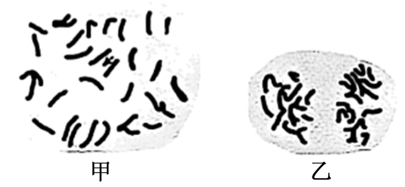
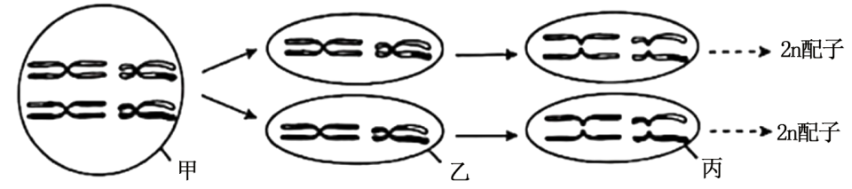
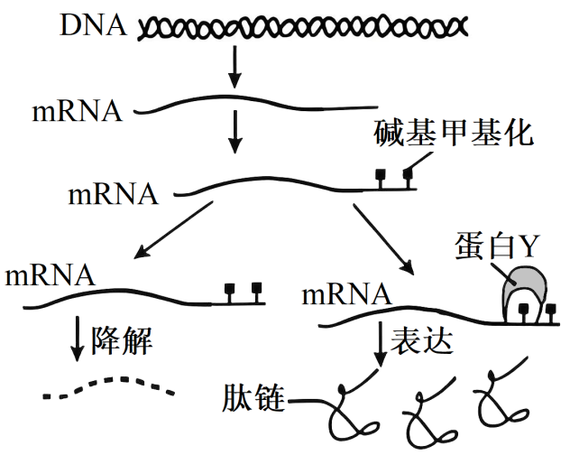
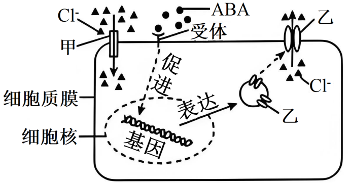
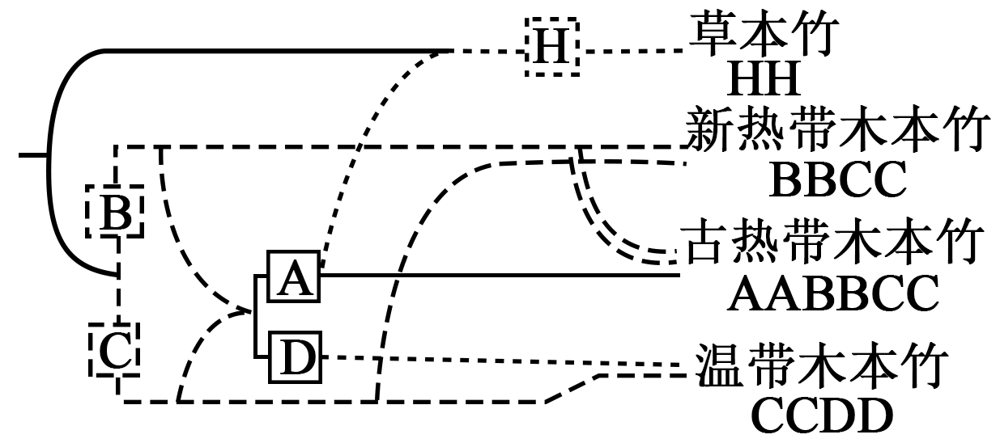
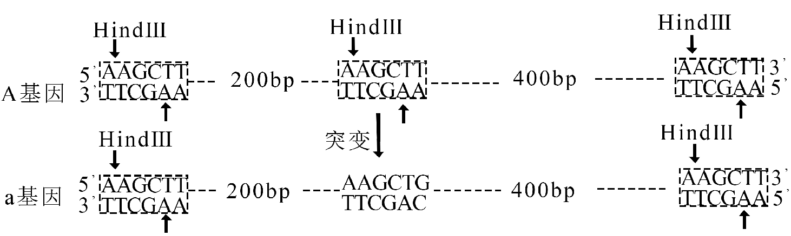
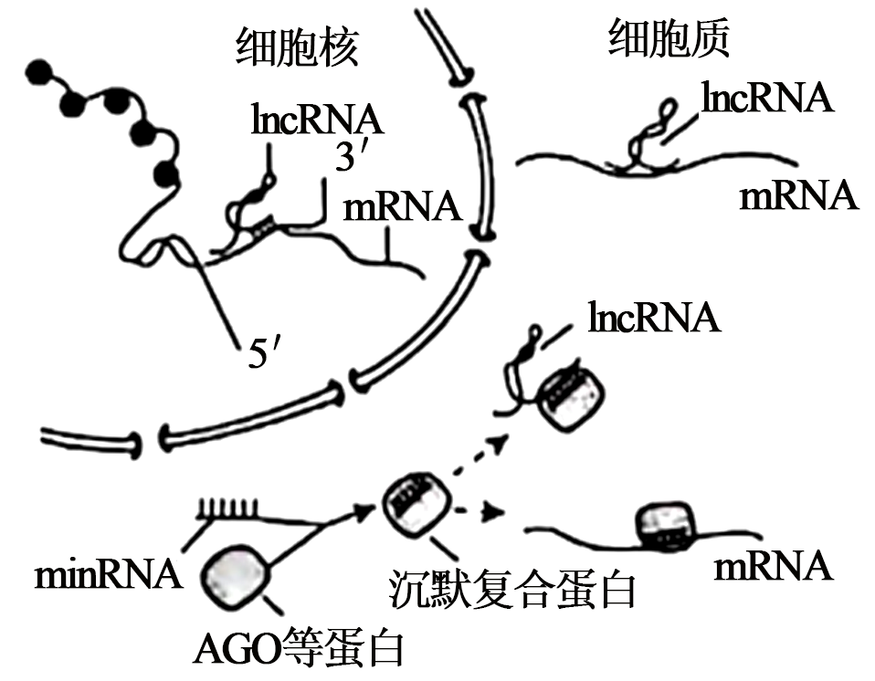
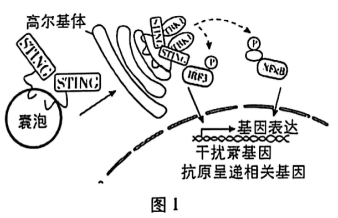
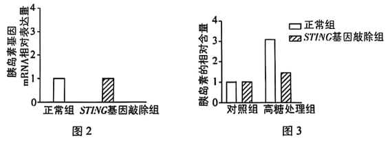
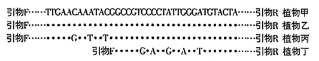

**2025年普通高中学业水平选择性考试（江苏卷）**

**生物学**

**本试卷共100分，考试时间75分钟。**

**一、单项选择题：共15题，每题2分，共30分。每题只有一个选项最符合题意。**

1\. 关于蛋白质、磷脂和淀粉，下列叙述正确的是（ ）

A. 三者组成元素都有C、H、O、N

B. 蛋白质和磷脂是构成生物膜的主要成分

C. 蛋白质和淀粉都是细胞内的主要储能物质

D. 磷脂和淀粉都是生物大分子

2\. 关于人体细胞和酵母细胞呼吸作用的比较分析，下列叙述正确的是（ ）

A. 细胞内葡萄糖分解成丙酮酸的场所不同

B. 有氧呼吸第二阶段都有O2和H2O参与

C. 呼吸作用都能产生\[H\]和ATP

D. 无氧呼吸的产物都有

3\. 关于“研究土壤中动物类群的丰富度”实验，下列叙述错误的是（ ）

A. 设计统计表格时应将物种数和个体数纳入其中

B. 可用采集罐采集土壤动物

C. 不宜采用样方法调查活动能力强的土壤动物

D. 记名计数法适用于体型小且数量极多的土壤动物

4\. 图示一种植物组织培养周期，①~③表示相应过程。下列相关叙述错误的是（ ）

A. 过程①发生了细胞的脱分化和有丝分裂

B. 过程②经细胞的再分化形成不同种类的细胞

C. 过程②③所用培养基的成分、浓度相同

D. 培养基中糖类既能作为碳源，又与维持渗透压有关

5\. 江苏某地运用生态修复工程技术，将废弃矿区建设成为中国最美的乡村湿地之一。下列相关叙述错误的是（ ）

A. 先从非生物因素入手，改善地貌条件、治理水体污染、修建引水工程

B. 构建适合本地、结构良好的植被体系，提高生产者的生物量

C. 生态修复工程调整了生态系统的营养结构

D. 建设合理景观，综合提高其经济、生态等生物多样性的直接价值

6\. 某同学利用红叶李果实制作果醋，图示其操作的简易流程。下列相关叙述正确的是（ ）

A. 果酒、果醋发酵所需菌种的细胞结构相同

B. 过程①中添加适量果胶酶，有利于提高出汁率

C. 过程②中，为使菌种充分吸收营养物质，需每日多次开盖搅拌

D. 过程③发酵时会产生大量气泡，需拧松瓶盖放气

7\. 梅花鹿和马鹿杂交后代生命力强、茸质好，但自然杂交很难完成，人工授精能解决此难题。胚胎工程技术的应用，可提高繁殖率，增加鹿场经济效益。下列相关叙述合理的是（ ）

A. 采集的精液无需固定、稀释，即可用血细胞计数板检测精子密度

B. 人工授精时，采集的精液经获能处理后才能输入雌性生殖道

C. 超数排卵处理时，常用含促性腺激素的促排卵剂

D. 母体子宫对胚胎的免疫耐受性低下是胚胎移植的生理学基础

8\. 为探究淀粉酶是否具有专一性，有同学设计了实验方案，主要步骤如表。下列相关叙述合理的是（ ）

<table style="width:71%;">
<colgroup>
<col style="width: 6%" />
<col style="width: 22%" />
<col style="width: 20%" />
<col style="width: 20%" />
</colgroup>
<tbody>
<tr>
<td style="text-align: center;">步骤</td>
<td style="text-align: center;">甲组</td>
<td style="text-align: center;">乙组</td>
<td style="text-align: center;">丙组</td>
</tr>
<tr>
<td style="text-align: center;">①</td>
<td style="text-align: center;">加入2mL淀粉溶液</td>
<td style="text-align: center;">加入2mL淀粉溶液</td>
<td style="text-align: center;">加入2mL蔗糖溶液</td>
</tr>
<tr>
<td style="text-align: center;">②</td>
<td style="text-align: center;">加入2mL淀粉酶溶液</td>
<td style="text-align: center;">加入2mL蒸馏水</td>
<td style="text-align: center;">？</td>
</tr>
<tr>
<td style="text-align: center;">③</td>
<td colspan="3" style="text-align: center;">60℃水浴加热，然后各加入2mL斐林试剂，再60℃水浴加热</td>
</tr>
</tbody>
</table>

A. 丙组步骤②应加入2mL蔗糖酶溶液

B. 两次水浴加热的主要目的都是提高酶活性

C. 根据乙组的实验结果可判断淀粉溶液中是否含有还原糖

D. 甲、丙组的预期实验结果都出现砖红色沉淀

9\. 图示小肠上皮组织，a~c表示3类不同功能的细胞。下列相关叙述错误的是（ ）

A. a类干细胞分裂产生的子细胞都继续分化成b类或c类细胞

B. 压力应激引起a类干细胞质膜通透性改变，可促使干细胞衰老

C. c类细胞凋亡和坏死，对细胞外液的影响不同

D. 3类不同功能的细胞都表达细胞骨架基因

10\. 脂肪细胞分泌的生物活性蛋白Leptin可使兴奋性递质5-羟色胺的合成和释放减少，阻碍神经元之间的兴奋传递，如图所示。下列相关叙述错误的是（ ）

A. 脂肪细胞通过释放Leptin使5-羟色胺的合成减少属于体液调节

B. Leptin直接影响突触前膜和突触后膜的静息电位

C. Leptin与突触前膜受体结合，影响兴奋在突触处的传递

D. 5-羟色胺与突触后膜受体结合减少，导致内流减少

11\. 从种植草莓的土壤中分离致病菌，简易流程如下：制备土壤悬液、分离、纯化、鉴定。下列相关叙述正确的是（ ）

A. 制备的培养基可用紫外线照射进行灭菌

B. 将土样加入无菌水混匀，梯度稀释后取悬液加入平板并涂布

C. 连续划线时，接上次划线的起始端开始划线

D. 鉴定后的致病菌，可接种在斜面培养基上，并在室温下长期保存

12\. 用秋水仙素处理大花葱（2n=16），将其根尖制成有丝分裂装片，图示2个细胞分裂相。下列相关叙述正确的是（ ）

A. 解离时间越长，越有利于获得图甲所示的分裂相

B. 取解离后的根尖，置于载玻片上，滴加清水并压片

C. 图乙是有丝分裂后期的细胞分裂相

D. 由于秋水仙素的诱导，图甲和图乙细胞的染色体数目都加倍

13\. 关于人体的内环境与稳态，下列叙述错误的是（ ）

A. 血浆浓度升高时，肾上腺皮质分泌的醛固酮增加，抑制肾小管对的重吸收

B. 血浆浓度升高时，与结合，分解成和，排出体外

C 寒冷刺激时，肾上腺素、甲状腺激素分泌增加，细胞代谢增强，产热增加

D. 体内失水过多时，抗利尿激素释放量增加，促进肾小管、集合管对水重吸收

14\. 图示二倍体植物形成2n异常配子的过程，下列相关叙述错误的是（ ）

A. 甲细胞中发生过染色体交叉互换

B. 乙细胞中不含有同源染色体

C. 丙细胞含有两个染色体组

D. 2n配子是由于减数第一次分裂异常产生的

15\. 甲基化读取蛋白Y识别甲基化修饰的mRNA，引起基因表达效应改变，如图所示。下列相关叙述正确的是（ ）

A. 甲基化通过抑制转录过程调控基因表达

B. 图中甲基化的碱基位于脱氧核糖核苷酸链上

C. 蛋白Y可结合甲基化的mRNA并抑制表达

D. 若图中DNA的碱基甲基化也可引起表观遗传效应

**二、多项选择题：共4题，每题3分，共12分。每题有不止一个选项符合题意。每题全选对者得3分，选对但不全的得1分，错选或不答的得0分。**

16\. 研究小组开展了Cl-胁迫下，添加脱落酸（ABA）对植物根系应激反应的实验，机理如图所示。下列相关叙述错误的有（ ）

A. Cl-通过自由扩散进入植物细胞

B. 转运蛋白甲、乙的结构和功能相同

C. ABA进入细胞核促进相关基因的表达

D. 细胞质膜发挥了物质运输、信息交流的功能

17\. 某岛屿上分布一种特有的爬行动物，以多种候鸟为食，候鸟主要栖息在灌丛和稀树草地。图示该爬行动物在不同生境下的年龄组成，下列相关叙述正确的有（ ）

A. 该爬行动物种群的年龄结构呈稳定型

B. 岛屿上植被和该爬行动物的分布均具有明显的垂直结构

C. 岛屿生态系统部分能量随候鸟的迁徙等途径流出

D. 栖息在不同生境中的候鸟存在生态位分化

18\. 图示部分竹子的进化发展史，其中A~D和H代表不同的染色体组。下列相关叙述正确的有（ ）

A. 新热带木本竹与温带木本竹杂交，是六倍体

B. 竹子的染色体数目变异是可遗传的

C. 四种类群的竹子共同组成进化的基本单位

D. 竹子化石为研究其进化提供直接证据

19\. 图示人体正常基因A突变为致病基因a及HindⅢ切割位点。AluⅠ限制酶识别序列及切割位点为，下列相关叙述正确的有（ ）

A. 基因A突变为a是一种碱基增添的突变

B. 用两种限制酶分别酶切A基因后，形成的末端类型不同

C. 用两种限制酶分别酶切a基因后，产生的片段大小一致

D. 产前诊断时，该致病基因可选用HindⅢ限制酶开展酶切鉴定

**三、非选择题：共5题，共58分。除特别说明外，每空1分。**

20\. 真核细胞进化出精细的基因表达调控机制，图示部分调控过程。请回答下列问题：

（1）细胞核中，DNA缠绕在组蛋白上形成\_\_\_\_\_\_。由于核膜的出现，实现了基因的转录和\_\_\_\_\_\_在时空上的分隔。

（2）基因转录时，\_\_\_\_\_\_酶结合到DNA链上催化合成RNA。加工后转运到细胞质中的RNA，直接参与蛋白质肽链合成的有rRNA、mRNA和\_\_\_\_\_\_。分泌蛋白的肽链在\_\_\_\_\_\_完成合成后，还需转运到高尔基体进行加工。

（3）转录后加工产生的lncRNA、miRNA参与基因的表达调控。据图分析，lncRNA调控基因表达的主要机制有\_\_\_\_\_\_miRNA与AGO等蛋白结合形成沉默复合蛋白，引导降解与其配对结合的RNA。据图可知，miRNA发挥的调控作用有\_\_\_\_\_\_。

（4）外源RNA进入细胞后，经加工可形成siRNA引导的沉默复合蛋白，科研人员据此研究防治植物虫害的RNA生物农药。根据RNA的特性及其作用机理，分析RNA农药的优点有\_\_\_\_\_\_\_\_\_\_\_\_。

21\. 科研人员从植物叶绿体中分离类囊体，构建含类囊体的人工细胞，并探究光照等因素对人工细胞功能的影响。请回答下列问题：

（1）细胞破碎后，在适宜温度下用低渗溶液处理，涨破\_\_\_\_\_\_膜，获得类囊体悬液。经离心分离获得类囊体，为保持其活性，需加入\_\_\_\_\_\_溶液重新悬浮，并保存备用。

（2）类囊体浓度用单位体积类囊体悬液中叶绿素的含量表示。吸取5μL类囊体悬液溶于995μL的\_\_\_\_\_\_溶液中，混匀后，测定出叶绿素浓度为3μg/mL，则类囊体的浓度为\_\_\_\_\_\_μg/mL。

（3）为检测类囊体活性，实验前需对类囊体进行多次洗涤，目的是消除类囊体悬液中原有光反应产物对后续实验结果的影响，这些产物主要有\_\_\_\_\_\_。

（4）已知荧光素PY的强弱与pH大小正相关。图示具有光反应活性的人工细胞，在适宜光照下，荧光强度\_\_\_\_\_\_（填“变强”“不变”或“变弱”），说明类囊体膜具有的功能有\_\_\_\_\_\_。

（5）在光反应研究的基础上，利用人工细胞开展类似碳反应生成糖类的实验研究，理论上还需要的物质有\_\_\_\_\_\_。

22\. 人体具有自我防御能力，能抵御病原体的侵袭。干扰素基因刺激因子（STING）是人体免疫功能的关键参与者，细胞中STING转运到高尔基体后，可激活STING信号通路，促进免疫相关基因的表达，如图1所示。请回答下列问题：

（1）有病毒入侵时，囊泡将STING转运进入高尔基体，体现囊泡和高尔基体的膜具有\_\_\_\_\_\_性。到达高尔基体的STING与蛋白激酶TBK1结合形成蛋白复合物，水解\_\_\_\_\_\_直接提供能量，磷酸化激活干扰素调控因子IRF3。

（2）激活的IRF3进入细胞核，促进细胞表达干扰素，抑制病毒增殖，这种免疫类型为\_\_\_\_\_\_。

（3）STING蛋白复合物还可以激活转录因子NFκB，促进细胞表达抗原呈递相关蛋白，进而可将入侵病毒的抗原呈递在细胞表面，有利于T细胞通过\_\_\_\_\_\_识别到病毒抗原后活化，裂解被病毒感染的靶细胞，这种免疫方式为\_\_\_\_\_\_。

（4）我国科学家研究发现，有些2型糖尿病患者的胰岛B细胞中STING信号通路异常。

①健康状态下，胰岛B细胞分泌胰岛素作用于靶细胞，促进血糖进入细胞进行氧化分解，促进\_\_\_\_\_\_，与胰岛A细胞分泌的\_\_\_\_\_\_共同维持血糖稳态。

②为探究胰岛B细胞中STING缺失与胰岛B细胞功能异常的关系，研究人员以正常小鼠和胰岛B细胞中STING基因敲除的小鼠为研究对象，分别分离了胰岛B细胞，开展两组实验：一组检测细胞中胰岛素基因的表达量，结果见图2；另一组用高糖溶液刺激，检测培养液中胰岛素的含量，结果见图3。根据图2、图3可得出结论：\_\_\_\_\_\_\_\_\_\_\_。

③依据上述研究，研发治疗血糖异常相关的新药物，还需探明胰岛B细胞中STING信号通路作用的分子机制。为筛选出STING基因敲除小鼠胰岛B细胞中表达量显著变化的基因，研究人员用小鼠开展了实验研究。请选出3个关键步骤，并按照实验流程排序：\_\_\_\_\_\_（填字母）。

a．提取正常组和STING基因敲除组小鼠胰岛B细胞的DNA

b．提取正常组和STING基因敲除组小鼠胰岛B细胞的RNA

c．逆转录成cDNA后，扩增、测序分析

d．PCR扩增，测序分析

e．确定差异表达基因，进行实验验证

23\. 川金丝猴是我国特有的珍稀濒危物种，为了更好地保护这一物种，研究者开展了以下研究。请回答下列问题：

（1）川金丝猴警戒行为具有监测捕食者和同种个体的功能，这说明生物之间的关系有\_\_\_\_\_\_。川金丝猴的警戒行为依赖于环境中获取的信息，信息类型有\_\_\_\_\_\_。川金丝猴根据这些信息及时作出反应，一方面可以降低被捕食风险，另一方面为争夺\_\_\_\_\_\_获得更多机会。

（2）川金丝猴以植食为主，消化道中部分微生物直接参与高纤维食物的消化，这些微生物与川金丝猴构成\_\_\_\_\_\_关系。

（3）研究者为了进一步研究川金丝猴食性，采集其粪便样本，进行DNA提取、扩增，部分实验过程如下。请完成下表：

<table style="width:59%;">
<colgroup>
<col style="width: 11%" />
<col style="width: 47%" />
</colgroup>
<tbody>
<tr>
<td style="text-align: left;">实验目的</td>
<td style="text-align: left;">简要操作步骤</td>
</tr>
<tr>
<td style="text-align: left;">释放DNA</td>
<td style="text-align: left;">在去杂后的样本中加入裂解液</td>
</tr>
<tr>
<td style="text-align: left;">析出DNA</td>
<td style="text-align: left;">离心后取①______，加入乙醇</td>
</tr>
<tr>
<td style="text-align: left;">②______</td>
<td style="text-align: left;">在沉淀物中加入纯水</td>
</tr>
<tr>
<td style="text-align: left;">扩增DNA</td>
<td style="text-align: left;">
将③______、引物、样本DNA、含有Mg²⁺缓冲

液、超纯水等加入PCR管中，进行PCR
</td>
</tr>
</tbody>
</table>

（4）为分析川金丝猴摄食的植物种类，研究者设计一对引物F和R，能同时扩增出不同种植物叶绿体中的rbeL基因片段，是因为引物F和R的碱基能与rbeL基因的保守序列的碱基\_\_\_\_\_\_。用引物F和R对4种植物样本甲~丁的叶绿体基因组DNA进行扩增测序，结果如图所示。若对4个样本的扩增产物进行DNA电泳条带分析，能检出的样本是\_\_\_\_\_\_。研究者用引物F和R对川金丝猴粪便DNA进行扩增并测序，得到的序列有图中的3种序列，据此可确定川金丝猴摄食的植物有\_\_\_\_\_\_。若要更准确鉴定出川金丝猴摄食的植物，参照叶绿体基因库，还需选用\_\_\_\_\_\_的保守序列设计引物，对川金丝猴粪便DNA进行扩增、测序分析。

注：“·”表示与植物甲对应位置上相同的碱基：“……”表示省略200个碱基

（5）依据上述研究，保护川金丝猴可采取的措施有\_\_\_\_\_\_（填字母）。

a．建立川金丝猴生态廊道，促进种群间基因交流

b．保护川金丝猴栖息地的植被和它喜食的植物

c．需用标记重捕法定期重捕，以精确监测种群数量

d．主要依赖迁地保护，扩大川金丝猴种群数量

24\. 某昆虫眼睛的颜色受独立遗传的两对等位基因控制，黄眼基因B对白眼基因b为显性，基因A存在时，眼色表现为黑色，基因a不影响B和b的作用。现有3组杂交实验，结果如下。请回答下列问题：

（1）组别①黑眼个体产生配子的基因组成有\_\_\_\_\_\_；中黑眼个体基因型有\_\_\_\_\_\_种。

（2）组别②亲本的基因型为\_\_\_\_\_\_；中黑眼个体随机杂交，后代表型及比例为\_\_\_\_\_\_。

（3）组别③的亲本基因型组合可能有\_\_\_\_\_\_。

（4）已知该昆虫性别决定方式为XO型，XX为雌性，XO为雄性。若X染色体上有一显性基因H，抑制A基因的作用。基因型为和AAbbXHO的亲本杂交，相互交配产生。

（ⅰ）中黑眼、黄眼、白眼表型的比例为\_\_\_\_\_\_；中白眼个体基因型有\_\_\_\_\_\_种。

（ⅱ）白眼雌性个体中，用测交不能区分出的基因型有\_\_\_\_\_\_。

（ⅲ）若要从群体中筛选出100个纯合黑眼雌性个体，理论上的个体数量至少需有\_\_\_\_\_\_个。
