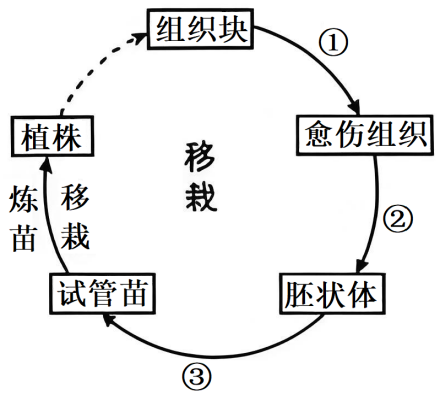
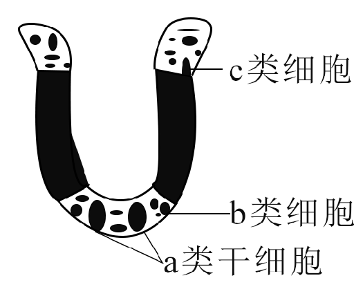
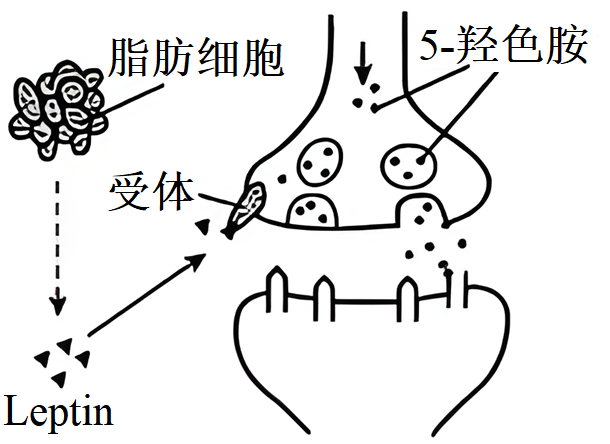
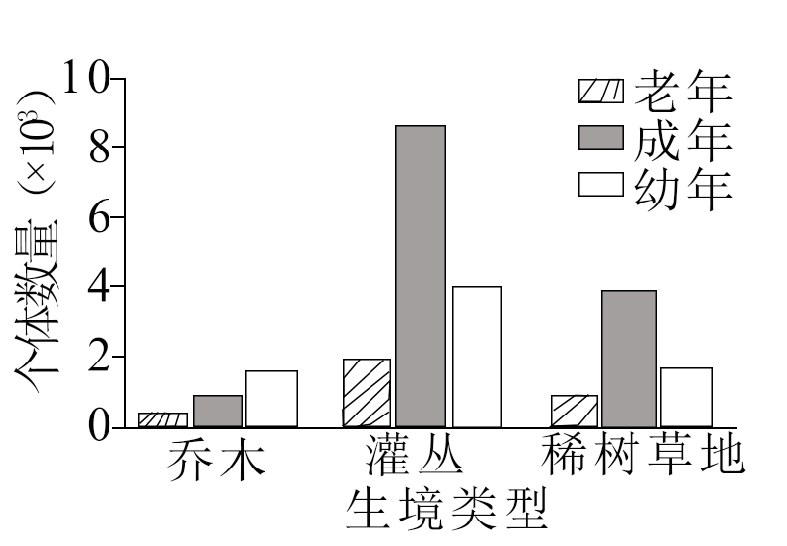
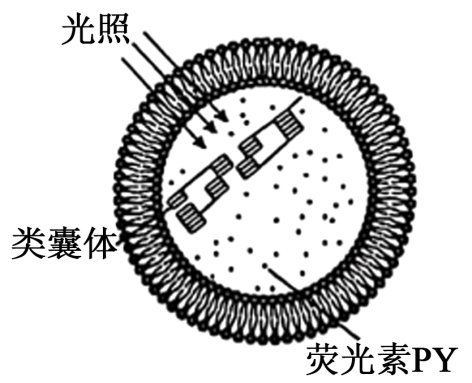
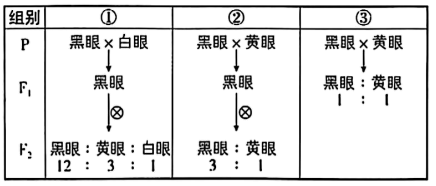

**2025年普通高中学业水平选择性考试（江苏卷）**

**生物学**

**本试卷共100分，考试时间75分钟。**

**一、单项选择题：共15题，每题2分，共30分。每题只有一个选项最符合题意。**

1\. 关于蛋白质、磷脂和淀粉，下列叙述正确的是（ ）

A. 三者组成元素都有C、H、O、N

B. 蛋白质和磷脂是构成生物膜的主要成分

C. 蛋白质和淀粉都是细胞内的主要储能物质

D. 磷脂和淀粉都是生物大分子

【答案】B

【解析】

【详解】蛋白质的基本单位是氨基酸，磷脂属于脂质，淀粉属于多糖。

【分析】A、蛋白质的组成元素为C、H、O、N（可能含S），磷脂含C、H、O、N、P，淀粉仅含C、H、O，淀粉不含N元素，A错误；

B、生物膜的主要成分是磷脂（构成基本支架）和蛋白质（承担膜功能），B正确；

C、淀粉是植物细胞的储能物质，而细胞内的主要储能物质是脂肪（动物）和淀粉（植物），蛋白质不是主要储能物质，C错误；

D、淀粉是多糖，属于生物大分子；磷脂由甘油、脂肪酸和磷酸组成，属于小分子，D错误；

故选**B**。

2\. 关于人体细胞和酵母细胞呼吸作用的比较分析，下列叙述正确的是（ ）

A. 细胞内葡萄糖分解成丙酮酸的场所不同

B. 有氧呼吸第二阶段都有O2和H2O参与

C. 呼吸作用都能产生\[H\]和ATP

D. 无氧呼吸的产物都有

【答案】C

【解析】

【分析】有氧呼吸分为三个阶段，第一阶段是葡萄糖酵解形成丙酮酸和还原氢，同时释放少量能量，第二阶段是丙酮酸和水反应产生二氧化碳和还原氢，同时释放少量能量，第三阶段是\[H\]和氧结合产生H2O，同时释放大量能量；真核细胞有氧呼吸的场所是细胞质基质和线粒体，主要场所是线粒体。

【详解】A、葡萄糖分解为丙酮酸是细胞呼吸的第一阶段，发生在细胞质基质中，人体细胞和酵母菌的场所相同，A错误；

B、有氧呼吸第二阶段是丙酮酸与水反应生成CO2和\[H\]，O2参与的是第三阶段（与\[H\]结合生成水），B错误；

C、人体细胞和酵母菌有氧呼吸各阶段均能产生ATP，第一、第二阶段能产生\[H\]，第三阶段利用\[H\]，无氧呼吸第一阶段产生少量\[H\]和ATP（后续被消耗），因此两者呼吸作用均能产生\[H\]和ATP，C正确；

D、人体细胞无氧呼吸产物为乳酸，不产生CO2；酵母菌无氧呼吸产物为CO2和酒精，D错误；

故选C。

3\. 关于“研究土壤中动物类群的丰富度”实验，下列叙述错误的是（ ）

A. 设计统计表格时应将物种数和个体数纳入其中

B. 可用采集罐采集土壤动物

C. 不宜采用样方法调查活动能力强的土壤动物

D. 记名计数法适用于体型小且数量极多的土壤动物

【答案】D

【解析】

【详解】土壤中的小动物活动能力较强、身体微小，不适合用样方法，而采用取样器取样法，样方法可用于调查植物的种群密度或物种丰富度。观察肉眼难识别的小动物使用放大镜；统计土壤动物丰富度的方法有：记名计算法和目测估计法；调查水中小动物类群丰富度采用取样调查。

【分析】A、统计土壤动物类群丰富度时，需记录物种数目（类群数）和各物种的个体数量，因此表格中需包含物种数和个体数，A正确；

B、采集土壤动物常用取样器取样法，采集罐可通过趋暗、避高温等习性收集动物，B正确；

C、土壤中的小动物活动能力较强、身体微小，不适合用样方法，而采用取样器取样法，C正确；

D、记名计数法适用于个体较大、种群数量有限的物种，D错误；

故选D。

4\. 图示一种植物组织培养周期，①~③表示相应过程。下列相关叙述错误的是（ ）

A. 过程①发生了细胞的脱分化和有丝分裂

B. 过程②经细胞的再分化形成不同种类的细胞

C. 过程②③所用培养基的成分、浓度相同

D. 培养基中糖类既能作为碳源，又与维持渗透压有关

【答案】C

【解析】

【分析】离体的植物组织或细胞，在培养一段时间后，会通过细胞分裂形成愈伤组织。愈伤组织的细胞排列疏松而无规则，是一种高度液泡化的呈无定形状态的薄壁细胞。由高度分化的植物组织或细胞产生愈伤组织的过程，称为植物细胞的脱分化。脱分化产生的愈伤组织继续进行培养，又可以重新分化成根或芽等器官，这个过程叫做再分化。再分化形成的试管苗，移栽到地里，可以发育成完整的植株体。

【详解】A、过程①形成了愈伤组织，发生了细胞的脱分化，此时细胞还进行有丝分裂，A正确；

B、过程②是愈伤组织经再分化形成胚状体的过程，故经过再分化形成不同种类的细胞，B正确；

C、过程②③所有培养基的成分、浓度不完全相同，如细胞分裂素和生长素的浓度不同，C错误；

D、培养基中常加入蔗糖，既能作为碳源，又与维持渗透压有关，D正确。

故选C。

5\. 江苏某地运用生态修复工程技术，将废弃矿区建设成为中国最美的乡村湿地之一。下列相关叙述错误的是（ ）

A. 先从非生物因素入手，改善地貌条件、治理水体污染、修建引水工程

B. 构建适合本地、结构良好的植被体系，提高生产者的生物量

C. 生态修复工程调整了生态系统的营养结构

D. 建设合理景观，综合提高其经济、生态等生物多样性的直接价值

【答案】D

【解析】

【分析】生态恢复工程指通过研究生态系统退化的原因，利用生态学、系统学、工程学的方法实现退化生态系统恢复与重建，以使一个生态系统恢复到较接近其受干扰前的状态的工程。

【详解】A、生态修复需优先改善非生物环境（如地貌、水体），为生物群落恢复奠定基础，A正确；

B、构建本地植被体系可提高生产者生物量，增强生态系统稳定性，B正确；

C、生态修复通过调整物种组成，改变食物链和食物网结构，即调整营养结构，C正确；

D、生态价值属于生物多样性的间接价值，而直接价值包括经济、美学等，D错误。

故选D。

6\. 某同学利用红叶李果实制作果醋，图示其操作的简易流程。下列相关叙述正确的是（ ）

A. 果酒、果醋发酵所需菌种的细胞结构相同

B. 过程①中添加适量果胶酶，有利于提高出汁率

C. 过程②中，为使菌种充分吸收营养物质，需每日多次开盖搅拌

D. 过程③发酵时会产生大量气泡，需拧松瓶盖放气

【答案】B

【解析】

【分析】1、果酒制作菌种是酵母菌，代谢类型是异养兼性厌氧型真菌，属于真核细胞，条件是18～30℃、前期需氧，后期不需氧。

2、果醋制作菌种是醋酸菌，属于原核细胞，适宜温度为30～35℃，需要持续通入氧气。

【详解】A、果酒发酵的菌种是酵母菌，是真核生物，果醋发酵的菌种是醋酸菌，是原核生物，两者的细胞结构不同，A错误；

B、过程①为榨汁，果胶酶能分解细胞壁中的果胶，添加适量果胶酶，有利于提高出汁率，B正确；

C、过程②为果酒发酵，酵母菌在无氧条件下进行酒精发酵，若多次开盖会引入氧气抑制无氧呼吸并增加杂菌污染风险，C错误；

D、过程③为果醋发酵，醋酸菌利用酒精产醋过程中不产生气体，不会产生大量气泡，也无需放气，D错误。

故选B。

7\. 梅花鹿和马鹿杂交后代生命力强、茸质好，但自然杂交很难完成，人工授精能解决此难题。胚胎工程技术的应用，可提高繁殖率，增加鹿场经济效益。下列相关叙述合理的是（ ）

A. 采集的精液无需固定、稀释，即可用血细胞计数板检测精子密度

B. 人工授精时，采集的精液经获能处理后才能输入雌性生殖道

C. 超数排卵处理时，常用含促性腺激素的促排卵剂

D. 母体子宫对胚胎的免疫耐受性低下是胚胎移植的生理学基础

【答案】C

【解析】

【分析】体外受精主要操作步骤：（1）卵母细胞的采集和培养:方法一:对小型动物一般用促性腺激素处理，使其排出更多的卵子，然后，从输卵管中冲取卵子，直接与获能的精子在体外受精。方法二:对大型动物是借助超声波探测仪、腹腔镜等直接从活体动物的卵巢中吸取卵母细胞，在体外经人工培养成熟后，才能与获能的精子受精（或从刚屠宰母畜的卵巢中采集卵母细胞)。（2）精子的采集和获能:在体外受精前，要对精子进行获能处理。采集方法:假阴道法、手握法和电刺激法等。获能方法:培养法和化学法。（3）受精:获能的精子和培养成熟的卵细胞在获能溶液或专用的受精溶液中完成受精过程。。

【详解】A、采集的精子需要经过稀释和固定处理，否则活动精子会影响计数准确性，且血细胞计数板通常用于已固定的细胞，A错误；

B、人工授精时，精子在雌性生殖道内自然获能，无需提前体外处理，B错误；

C、超数排卵通过注射促性腺激素（如FSH和LH）促进卵泡发育和排卵，C正确；

D、胚胎移植的生理学基础是母体子宫对胚胎的免疫耐受性高，不会发生免疫排斥，而非耐受低下，D错误。

故选C。

8\. 为探究淀粉酶是否具有专一性，有同学设计了实验方案，主要步骤如表。下列相关叙述合理的是（ ）

<table style="width:71%;">
<colgroup>
<col style="width: 6%" />
<col style="width: 22%" />
<col style="width: 20%" />
<col style="width: 20%" />
</colgroup>
<tbody>
<tr>
<td style="text-align: center;">步骤</td>
<td style="text-align: center;">甲组</td>
<td style="text-align: center;">乙组</td>
<td style="text-align: center;">丙组</td>
</tr>
<tr>
<td style="text-align: center;">①</td>
<td style="text-align: center;">加入2mL淀粉溶液</td>
<td style="text-align: center;">加入2mL淀粉溶液</td>
<td style="text-align: center;">加入2mL蔗糖溶液</td>
</tr>
<tr>
<td style="text-align: center;">②</td>
<td style="text-align: center;">加入2mL淀粉酶溶液</td>
<td style="text-align: center;">加入2mL蒸馏水</td>
<td style="text-align: center;">？</td>
</tr>
<tr>
<td style="text-align: center;">③</td>
<td colspan="3" style="text-align: center;">60℃水浴加热，然后各加入2mL斐林试剂，再60℃水浴加热</td>
</tr>
</tbody>
</table>

A. 丙组步骤②应加入2mL蔗糖酶溶液

B. 两次水浴加热的主要目的都是提高酶活性

C. 根据乙组的实验结果可判断淀粉溶液中是否含有还原糖

D. 甲、丙组的预期实验结果都出现砖红色沉淀

【答案】C

【解析】

【分析】淀粉酶的专一性指其仅催化淀粉水解，不能催化其他底物（如蔗糖）。实验需设置不同底物与酶的组合，并通过检测还原糖验证结果。斐林试剂用于检测还原糖，但需在沸水浴条件下显色，而题目中实验步骤的温度设置可能影响结果判断。

【详解】A、丙组步骤②应加入2mL淀粉酶溶液，而非蔗糖酶溶液。验证淀粉酶专一性需保持酶相同而底物不同，若加入蔗糖酶则无法证明淀粉酶的作用特性，A错误；

B、第一次60℃水浴是为酶提供最适温度以催化反应，第二次水浴是斐林试剂与还原糖反应的条件，B错误；

C、乙组（淀粉+蒸馏水）未加酶，若未显色说明淀粉本身不含还原糖，若显色则可能底物被污染或分解，因此乙组结果可用于判断淀粉是否含还原糖，C正确；

D、甲组（淀粉+淀粉酶）水解产物为葡萄糖（还原糖），与斐林试剂在水浴条件下呈砖红色；丙组（蔗糖+淀粉酶）无水解产物，故丙组出现蓝色，D错误。

故选C。

9\. 图示小肠上皮组织，a~c表示3类不同功能的细胞。下列相关叙述错误的是（ ）

A. a类干细胞分裂产生的子细胞都继续分化成b类或c类细胞

B 压力应激引起a类干细胞质膜通透性改变，可促使干细胞衰老

C. c类细胞凋亡和坏死，对细胞外液的影响不同

D. 3类不同功能的细胞都表达细胞骨架基因

【答案】A

【解析】

【分析】细胞分化是指在个体发育中,由一个或一种细胞增殖产生的后代,在形态,结构和生理功能上发生稳定性 差异的过程。细胞分化的实质是基因的选择性表达。

【详解】A 、a 类干细胞分裂产生的子细胞，一部分继续保持干细胞的状态，另一部分分化成 b 类或 c 类细胞，并非都继续分化成 b 类或 c 类细胞，A错误；

B、压力应激引起 a 类干细胞质膜通透性改变，会影响细胞内的正常代谢等，可促使干细胞衰老，B正确；

C、细胞凋亡是由基因决定的细胞自动结束生命的过程，对机体是有利的，细胞坏死是在种种不利因素影响下，由于细胞正常代谢活动受损或中断引起的细胞损伤和死亡，对机体是有害的，所以 c 类细胞凋亡和坏死对细胞外液的影响不同，C正确；

D、细胞骨架是真核细胞中由蛋白质纤维组成的网架结构，与细胞运动、分裂、分化以及物质运输等多种生命活动密切相关，3 类不同功能的细胞都需要细胞骨架发挥作用，都表达细胞骨架基因，D正确。

故选A。

10\. 脂肪细胞分泌的生物活性蛋白Leptin可使兴奋性递质5-羟色胺的合成和释放减少，阻碍神经元之间的兴奋传递，如图所示。下列相关叙述错误的是（ ）

A. 脂肪细胞通过释放Leptin使5-羟色胺的合成减少属于体液调节

B. Leptin直接影响突触前膜和突触后膜的静息电位

C. Leptin与突触前膜受体结合，影响兴奋在突触处的传递

D. 5-羟色胺与突触后膜受体结合减少，导致内流减少

【答案】B

【解析】

【分析】兴奋在细胞间的传递是通过突触来完成的。突触的结构包括突触前膜、突触间隙、突触后膜。神经元的轴突末梢膨大成突触小体。当神经冲动传到神经末梢时，突触小体内的突触小泡膜与突触前膜融合，将神经递质以胞吐的方式释放到突触间隙，突触间隙内的神经递质，经扩散通过突触间隙与突触后膜上的受体结合，引发突触后膜电位变化，使下一个神经元产生兴奋或抑制。随后，神经递质会与受体分开，并迅速被降解或回收进细胞。

【详解】A 、脂肪细胞分泌的 Leptin 通过体液运输作用于相关细胞，使 5 - 羟色胺的合成减少，这种调节方式属于体液调节，A 正确；

B C、由题干和图示信息可知 Leptin 与突触前膜受体结合，可使兴奋性递质 5 - 羟色胺的合成和释放减少，阻碍神经元之间的兴奋传递，简接影响突触前膜和突触后膜的静息电位，B 错误；C 正确；

D、5 - 羟色胺是兴奋性递质。当它与突触后膜受体正常结合时，会引起突触后膜兴奋。当 5 - 羟色胺与突触后膜受体结合减少，突触后膜对Na+的通透性降低，Na+内流的量相应减少 ，D 正确。

故选B。

11\. 从种植草莓的土壤中分离致病菌，简易流程如下：制备土壤悬液、分离、纯化、鉴定。下列相关叙述正确的是（ ）

A. 制备的培养基可用紫外线照射进行灭菌

B. 将土样加入无菌水混匀，梯度稀释后取悬液加入平板并涂布

C. 连续划线时，接上次划线的起始端开始划线

D. 鉴定后的致病菌，可接种在斜面培养基上，并在室温下长期保存

【答案】B

【解析】

【分析】微生物常见的接种方法：（1）平板划线法：将已经熔化的培养基倒入培养皿制成平板，接种，划线，在恒温箱里培养。在划线的开始部分，微生物往往连在一起生长，随着线的延伸，菌数逐渐减少，最后可能形成单个菌落。（2）稀释涂布平板法：将待分离的菌液经过大量稀释后，均匀涂布在培养皿表面，经培养后可形成单个菌落。

【详解】A、制备的培养基需用高压蒸汽灭菌法灭菌，紫外线仅用于表面或空气消毒，无法灭菌，A错误；

B、将土样加入无菌水制成悬液，经梯度稀释后，取各稀释度菌液涂布于培养基表面，分离并计数，B正确；

C、连续划线时，每次应从上次划线的末端开始，以逐步稀释菌体，若从起始端开始无法有效分离单菌落，C错误；

D、斜面培养基保存菌种需置于4℃短期保存，长期保存应使用甘油管藏法（-20℃），室温下无法长期保存，D错误。

故选B。

12\. 用秋水仙素处理大花葱（2n=16），将其根尖制成有丝分裂装片，图示2个细胞分裂相。下列相关叙述正确的是（ ）

A. 解离时间越长，越有利于获得图甲所示的分裂相

B. 取解离后的根尖，置于载玻片上，滴加清水并压片

C. 图乙是有丝分裂后期的细胞分裂相

D. 由于秋水仙素的诱导，图甲和图乙细胞的染色体数目都加倍

【答案】C

【解析】

【分析】1、低温或秋水仙素能抑制纺锤体的形成，使子染色体不能移向细胞两极，从而引起细胞内染色体数目加倍。

2、该实验的步骤为选材→固定→解离→漂洗→染色→制片。

【详解】A、解离时间过长，会使细胞过于酥软，导致细胞结构被破坏，不利于观察到如图甲所示的清晰分裂相，A错误；

B、解离后的根尖，应先进行漂洗，洗去解离液，然后置于载玻片上，滴加清水并压片，B错误；

C、图乙中细胞的着丝粒分裂，姐妹染色单体分开成为两条子染色体，分别向细胞两极移动，符合有丝分裂后期的特征，C正确；

D、图甲细胞不处于有丝分裂后期，且明显看出染色体数目多于16条，是秋水仙素诱导染色体数目加倍的结果，而图乙细胞处于正常的有丝分裂后期，着丝粒分裂导致其染色体数目加倍，并不是秋水仙素诱导的结果，D错误。

故选C。

13\. 关于人体的内环境与稳态，下列叙述错误的是（ ）

A. 血浆浓度升高时，肾上腺皮质分泌的醛固酮增加，抑制肾小管对的重吸收

B. 血浆浓度升高时，与结合，分解成和，排出体外

C. 寒冷刺激时，肾上腺素、甲状腺激素分泌增加，细胞代谢增强，产热增加

D. 体内失水过多时，抗利尿激素释放量增加，促进肾小管、集合管对水的重吸收

【答案】A

【解析】

【分析】本题考查内环境稳态的调节机制，涉及水盐平衡、酸碱平衡、体温调节及抗利尿激素的作用。醛固酮是由肾上腺皮质分泌的固醇类激素，能促进肾小管和集合管吸Na+排K+，使血钠升高、血钾降低。

【详解】A、醛固酮由肾上腺皮质分泌，当血浆Na+浓度升高时，醛固酮分泌减少，而非增加；且醛固酮会促进肾小管对Na+的重吸收，而非抑制，A错误；

B、HCO3-是缓冲系统的组成部分，血浆浓度升高时，能与H+结合生成H2CO3，分解为CO2和H2O，CO2通过呼吸排出，维持酸碱平衡，B正确；

C、寒冷时，肾上腺素和甲状腺激素分泌增加，通过提高细胞代谢速率使机体产生更多的热量，C正确；

D、抗利尿激素由下丘脑合成、垂体释放，体内失水过多时，其释放量增加，促进肾小管和集合管对水的重吸收，减少水分流失，D正确。

故选A。

14\. 图示二倍体植物形成2n异常配子的过程，下列相关叙述错误的是（ ）

A. 甲细胞中发生过染色体交叉互换

B. 乙细胞中不含有同源染色体

C. 丙细胞含有两个染色体组

D. 2n配子是由于减数第一次分裂异常产生的

【答案】D

【解析】

【分析】减数分裂过程：(1)减数第一次分裂：①前期：联会，同源染色体上的非姐妹染色单体互换；②中期：同源染色体成对的排列在赤道板两侧；③后期：同源染色体分离，非同源染色体自由组合；④末期：细胞质分裂。(2)减数第二次分裂：①前期：染色体散乱分布；②中期：染色体形态固定、数目清晰；③后期：着丝粒分裂，姐妹染色单体分开成为染色体，并均匀地移向两极；④末期：核膜、核仁重建、纺锤体和染色体消失。

【详解】A、观察，从甲细胞中同源染色体的非姐妹染色单体的颜色可知，发生过染色体交叉互换，A正确；

B、乙细胞是减数第一次分裂后的子细胞，此时同源染色体已经分离，所以乙细胞中不含有同源染色体，B正确；

C、丙细胞中的染色体可以分为形态、大小相同的两组，所以丙细胞含有两个染色体组，C正确；

D、从图中看到，2n 配子是由于减数第二次分裂后期姐妹染色体单体没有分开导致，D错误。

故选D。

15\. 甲基化读取蛋白Y识别甲基化修饰的mRNA，引起基因表达效应改变，如图所示。下列相关叙述正确的是（ ）

A. 甲基化通过抑制转录过程调控基因表达

B. 图中甲基化的碱基位于脱氧核糖核苷酸链上

C. 蛋白Y可结合甲基化的mRNA并抑制表达

D. 若图中DNA的碱基甲基化也可引起表观遗传效应

【答案】D

【解析】

【分析】表观遗传是指DNA序列不发生变化，但基因的表达却发生了可遗传的改变，即基因型未发生变化而表现型却发生了改变，如DNA的甲基化，甲基化的基因不能与RNA聚合酶结合，故无法进行转录产生mRNA，也就无法进行翻译最终合成蛋白质，从而抑制了基因的表达，导致了性状的改变。

【详解】A、观察可知，甲基化是发生在 mRNA 上，不是抑制转录过程，而是影响 mRNA 的翻译或稳定性来调控基因表达，A 错误；

B、由图可知甲基化发生在 mRNA 上，mRNA 是核糖核苷酸链，不是脱氧核糖核苷酸链，B 错误；

C、从图中可以甲基化的 mRNA 会降解，而蛋白 Y与甲基化的 mRNA结合后可以表达，说明蛋白Y结合甲基化的mRNA并促进表达，C 错误；

D、表观遗传可以由某些碱基的甲基化或蛋白质乙酰化引起，若图中DNA的碱基甲基化也可引起表观遗传效应，D 正确。

故选D。

**二、多项选择题：共4题，每题3分，共12分。每题有不止一个选项符合题意。每题全选对者得3分，选对但不全的得1分，错选或不答的得0分。**

16\. 研究小组开展了Cl-胁迫下，添加脱落酸（ABA）对植物根系应激反应的实验，机理如图所示。下列相关叙述错误的有（ ）

A. Cl-通过自由扩散进入植物细胞

B. 转运蛋白甲、乙的结构和功能相同

C. ABA进入细胞核促进相关基因的表达

D. 细胞质膜发挥了物质运输、信息交流的功能

【答案】ABC

【解析】

【分析】自由扩散的方向是从高浓度向低浓度，不需载体和能量，常见的有水、CO2、O2、甘油、苯、酒精等；协助扩散的方向是从高浓度向低浓度，需要转运蛋白，不需要能量，如红细胞吸收葡萄糖；主动运输的方向是从低浓度向高浓度，需要载体蛋白和能量，常见的如小肠绒毛上皮细胞吸收氨基酸、葡萄糖，K+等。

【详解】A、由图可知，Cl-借助转运蛋白甲顺浓度梯度进入植物细胞，属于协助扩散，A错误；

B、转运蛋白甲（载体蛋白）是协助Cl-顺浓度梯度进入植物细胞，转运蛋白乙（通道蛋白）协助Cl-排出植物细胞，两者的结构和功能不同，B错误；

C、由图可知，ABA与细胞质膜上的受体结合，没有进入细胞，通过信号转导促进细胞核相关基因的表达，C错误；

D、细胞质膜实现了跨膜运输Cl-及接受ABA的信息分子，发挥了物质运输、信息交流的功能，D正确。

故选ABC。

17\. 某岛屿上分布一种特有的爬行动物，以多种候鸟为食，候鸟主要栖息在灌丛和稀树草地。图示该爬行动物在不同生境下的年龄组成，下列相关叙述正确的有（ ）

A. 该爬行动物种群的年龄结构呈稳定型

B. 岛屿上植被和该爬行动物的分布均具有明显的垂直结构

C. 岛屿生态系统的部分能量随候鸟的迁徙等途径流出

D. 栖息在不同生境中的候鸟存在生态位分化

【答案】CD

【解析】

【分析】爬行动物，以多种候鸟为食，候鸟主要栖息在灌丛和稀树草地，则图中得到的爬行动物也主要分布在灌丛和稀树草地。生态位是指一个物种在群落中的地位或作用，包括所处的空间位置，占用资源的情况，以及与其他物种的关系等。

【详解】A、观察可知，在不同生境下，该爬行动物幼年个体数量较多，老年个体数量较少，年龄结构应呈增长型，而非稳定型，A错误；

B、垂直结构是指在垂直方向上，群落具有明显的分层现象。岛屿上植被具有明显的垂直结构，而该爬行动物是一个种群，不存在垂直结构，群落才有垂直结构，B错误；

C、候鸟会迁徙离开岛屿，候鸟在该生态系统中属于消费者，其体内的能量会随迁徙等途径流出该岛屿生态系统，C正确；

D、生态位分化是指由于竞争等原因，不同物种在资源利用等方面出现差异。栖息在不同生境中的候鸟，它们在食物获取、栖息场所等方面可能存在差异，即存在生态位分化，D正确。

故选CD。

18\. 图示部分竹子的进化发展史，其中A~D和H代表不同的染色体组。下列相关叙述正确的有（ ）

A. 新热带木本竹与温带木本竹杂交，是六倍体

B. 竹子的染色体数目变异是可遗传的

C. 四种类群的竹子共同组成进化的基本单位

D. 竹子化石为研究其进化提供直接证据

【答案】BD

【解析】

【分析】化石是生物进化最直接，最有力的证据。在越早形成的地层里，成为化石的生物越简单、越低等，在越晚形成的地层里，成为化石的生物就越复杂、越高等。

【详解】A、新热带木本竹（BBCC）为四倍体，温带木本竹（CCDD）为四倍体，它们杂交，新热带木本竹产生的配子含 2 个染色体组（BC），温带木本竹产生的配子含 2 个染色体组（CD），则F1的染色体组成为 BCCD，是四倍体，A错误；

B、染色体数目变异属于可遗传变异，因为这种变异是由遗传物质改变引起的，可以遗传给后代，B正确；

C、进化的基本单位是种群，而四种类群的竹子不是一个种群，C错误；

D、化石是研究生物进化的直接证据，竹子化石能直观地展现竹子在不同地质时期的形态、结构等特征，为研究其进化提供直接证据，D正确。

故选BD。

19\. 图示人体正常基因A突变为致病基因a及HindⅢ切割位点。AluⅠ限制酶识别序列及切割位点为，下列相关叙述正确的有（ ）

A. 基因A突变为a是一种碱基增添的突变

B. 用两种限制酶分别酶切A基因后，形成的末端类型不同

C. 用两种限制酶分别酶切a基因后，产生的片段大小一致

D. 产前诊断时，该致病基因可选用HindⅢ限制酶开展酶切鉴定

【答案】BD

【解析】

【分析】“分子手术刀”——限制酶：（1）来源：主要是从原核生物中分离纯化出来的。（2）功能：能够识别双链DNA分子的某种特定的核苷酸序列，并且使每一条链中特定部位的两个核苷酸之间的磷酸二酯键断开，因此具有专一性。（3）结果：经限制酶切割产生的DNA片段末端通常有两种形式，即黏性末端和平末端。

【详解】A 、对比 A 基因和 a 基因的序列，A 基因中 “AAGCTT” 变为 a 基因中 “AAGCTG” ，是碱基替换（T→G），并非碱基增添，A 错误；

B、HindⅢ 切割产生黏性末端，AluⅠ 切割后产生的是平末端，二者末端类型不相同，B正确；

C、观察图中 a 基因，HindⅢ 有 2 个切割位点，切割后会产生1个片段，AluⅠ有 3 个切割位点，切割后会产生2个片段，一个片段长度是 200bp左右，另一个是 400bp 左右，用两种限制酶分别酶切a基因后，产生的片段大小不一致，C 错误；

D、因为正常基因 A 和致病基因 a 的 HindⅢ 切割位点不同，所以产前诊断时，该致病基因可选用 HindⅢ 限制酶开展酶切鉴定，D 正确。

故选BD。

**三、非选择题：共5题，共58分。除特别说明外，每空1分。**

20\. 真核细胞进化出精细的基因表达调控机制，图示部分调控过程。请回答下列问题：

（1）细胞核中，DNA缠绕在组蛋白上形成\_\_\_\_\_\_。由于核膜的出现，实现了基因的转录和\_\_\_\_\_\_在时空上的分隔。

（2）基因转录时，\_\_\_\_\_\_酶结合到DNA链上催化合成RNA。加工后转运到细胞质中的RNA，直接参与蛋白质肽链合成的有rRNA、mRNA和\_\_\_\_\_\_。分泌蛋白的肽链在\_\_\_\_\_\_完成合成后，还需转运到高尔基体进行加工。

（3）转录后加工产生的lncRNA、miRNA参与基因的表达调控。据图分析，lncRNA调控基因表达的主要机制有\_\_\_\_\_\_miRNA与AGO等蛋白结合形成沉默复合蛋白，引导降解与其配对结合的RNA。据图可知，miRNA发挥的调控作用有\_\_\_\_\_\_。

（4）外源RNA进入细胞后，经加工可形成siRNA引导的沉默复合蛋白，科研人员据此研究防治植物虫害的RNA生物农药。根据RNA的特性及其作用机理，分析RNA农药的优点有\_\_\_\_\_\_\_\_\_\_\_\_。

【答案】（1） ①. 染色质##染色体 ②. 翻译

（2） ①. RNA聚合 ②. tRNA ③. 核糖体和内质网##内质网

（3） ①. 结合 ②. 与AGO等蛋白结合形成沉默复合蛋白，结合mRNA，阻止其翻译

（4）具有生物安全性、环境友好性‌‌、高效性等

【解析】

【分析】基因的表达包括转录和翻译，其中转录是以DNA的一条链为模板，在RNA聚合酶的作用下合成RNA的过程其原料是四种核糖核苷酸。

【小问1详解】

细胞核中，DNA缠绕在组蛋白上形成染色质（染色体）。转录在细胞核内进行，翻译在细胞质中的核糖体，故由于核膜的出现，实现了基因的转录和翻译在时空上的分隔。

【小问2详解】

基因转录时，RNA聚合酶结合到DNA链上催化合成RNA。加工后转运到细胞质中的RNA，直接参与蛋白质肽链合成的有rRNA（组成核糖体）、mRNA（翻译的模板）和tRNA（运输氨基酸）。分泌蛋白的肽链在核糖体和内质网完成合成后，还需转运到高尔基体进行加工。

【小问3详解】

转录后加工产生的lncRNA、miRNA参与基因的表达调控。据图分析，lncRNA调控基因表达的主要机制有一方面在细胞核内与mRNA结合，运出细胞核，阻止其翻译；另一方面在细胞质中与沉默复合蛋白结合。miRNA与AGO等蛋白结合形成沉默复合蛋白，引导降解与其配对结合的RNA。据图可知，miRNA发挥的调控作用有与AGO等蛋白结合形成沉默复合蛋白，结合mRNA，阻止其翻译。

【小问4详解】

外源RNA进入细胞后，经加工可形成siRNA引导的沉默复合蛋白，科研人员据此研究防治植物虫害的RNA生物农药。根据RNA的特性及其作用机理，分析RNA农药的优点有‌：

1、生物安全性‌：RNA农药具有高度的靶向性，能够实现对某一害虫的精准防控，不会对非靶生物造成负面影响。

2、 ‌高效性：RNA农药通过干扰害虫的特定基因表达，实现对害虫的高效防控。

3、环境友好性：与传统的化学农药相比，RNA农药具有更强的靶向性和环境友好性，能够在不破坏生态平衡的情况下有效控制害虫‌。

21\. 科研人员从植物叶绿体中分离类囊体，构建含类囊体的人工细胞，并探究光照等因素对人工细胞功能的影响。请回答下列问题：

（1）细胞破碎后，在适宜温度下用低渗溶液处理，涨破\_\_\_\_\_\_膜，获得类囊体悬液。经离心分离获得类囊体，为保持其活性，需加入\_\_\_\_\_\_溶液重新悬浮，并保存备用。

（2）类囊体浓度用单位体积类囊体悬液中叶绿素的含量表示。吸取5μL类囊体悬液溶于995μL的\_\_\_\_\_\_溶液中，混匀后，测定出叶绿素浓度为3μg/mL，则类囊体的浓度为\_\_\_\_\_\_μg/mL。

（3）为检测类囊体活性，实验前需对类囊体进行多次洗涤，目的是消除类囊体悬液中原有光反应产物对后续实验结果的影响，这些产物主要有\_\_\_\_\_\_。

（4）已知荧光素PY的强弱与pH大小正相关。图示具有光反应活性的人工细胞，在适宜光照下，荧光强度\_\_\_\_\_\_（填“变强”“不变”或“变弱”），说明类囊体膜具有的功能有\_\_\_\_\_\_。

（5）在光反应研究的基础上，利用人工细胞开展类似碳反应生成糖类的实验研究，理论上还需要的物质有\_\_\_\_\_\_。

【答案】（1） ①. 叶绿体 ②. 等渗

（2） ①. 有机溶剂 ②. 3

（3）ATP、NADPH

（4） ①. 变弱 ②. 吸收（和转化）光能、裂解水分子

（5）CO2、C5

【解析】

【分析】光合作用包括光反应阶段和暗反应阶段，光反应的场所是在叶绿体的类囊体薄膜上，暗反应的场所是叶绿体基质中。

【小问1详解】

类囊体位于叶绿体内，故细胞破碎后，在适宜温度下用低渗溶液处理，涨破叶绿体内外膜，获得类囊体悬液。经离心分离获得类囊体，为保持其活性，保持类囊体的渗透压，需加入等渗溶液重新悬浮，并保存备用。

【小问2详解】

类囊体浓度用单位体积类囊体悬液中叶绿素的含量表示。由于叶绿素溶解在有机溶剂，故吸取5μL类囊体悬液溶于995的有机溶剂溶液中，稀释200倍，混匀后，测定出叶绿素浓度为3μg/mL，1ml=1000μL，则类囊体的浓度为600μg/mL。

【小问3详解】

光反应产物有O2、NADPH和ATP。

【小问4详解】

已知荧光素PY的强弱与pH大小正相关。图示具有光反应活性的人工细胞，类囊体膜进行类囊体膜上分布着光合色素（如叶绿素），在适宜光照下，这些色素能够捕捉光能并将其转化为化学能。在类囊体膜上裂解水分子，产生氧气、质子（H⁺）和电子，其中氧气释放到胞外，质子在类囊体腔内累积形成pH梯度‌，pH降低，荧光强度变弱。

【小问5详解】

要进行暗反应，需要原料CO2、C5。

22\. 人体具有自我防御能力，能抵御病原体的侵袭。干扰素基因刺激因子（STING）是人体免疫功能的关键参与者，细胞中STING转运到高尔基体后，可激活STING信号通路，促进免疫相关基因的表达，如图1所示。请回答下列问题：

（1）有病毒入侵时，囊泡将STING转运进入高尔基体，体现囊泡和高尔基体的膜具有\_\_\_\_\_\_性。到达高尔基体的STING与蛋白激酶TBK1结合形成蛋白复合物，水解\_\_\_\_\_\_直接提供能量，磷酸化激活干扰素调控因子IRF3。

（2）激活的IRF3进入细胞核，促进细胞表达干扰素，抑制病毒增殖，这种免疫类型为\_\_\_\_\_\_。

（3）STING蛋白复合物还可以激活转录因子NFκB，促进细胞表达抗原呈递相关蛋白，进而可将入侵病毒的抗原呈递在细胞表面，有利于T细胞通过\_\_\_\_\_\_识别到病毒抗原后活化，裂解被病毒感染的靶细胞，这种免疫方式为\_\_\_\_\_\_。

（4）我国科学家研究发现，有些2型糖尿病患者的胰岛B细胞中STING信号通路异常。

①健康状态下，胰岛B细胞分泌的胰岛素作用于靶细胞，促进血糖进入细胞进行氧化分解，促进\_\_\_\_\_\_，与胰岛A细胞分泌的\_\_\_\_\_\_共同维持血糖稳态。

②为探究胰岛B细胞中STING缺失与胰岛B细胞功能异常的关系，研究人员以正常小鼠和胰岛B细胞中STING基因敲除的小鼠为研究对象，分别分离了胰岛B细胞，开展两组实验：一组检测细胞中胰岛素基因的表达量，结果见图2；另一组用高糖溶液刺激，检测培养液中胰岛素的含量，结果见图3。根据图2、图3可得出结论：\_\_\_\_\_\_\_\_\_\_\_。

③依据上述研究，研发治疗血糖异常相关的新药物，还需探明胰岛B细胞中STING信号通路作用的分子机制。为筛选出STING基因敲除小鼠胰岛B细胞中表达量显著变化的基因，研究人员用小鼠开展了实验研究。请选出3个关键步骤，并按照实验流程排序：\_\_\_\_\_\_（填字母）。

a．提取正常组和STING基因敲除组小鼠胰岛B细胞的DNA

b．提取正常组和STING基因敲除组小鼠胰岛B细胞的RNA

c．逆转录成cDNA后，扩增、测序分析

d．PCR扩增，测序分析

e．确定差异表达基因，进行实验验证

【答案】（1） ①. 一定的流动性 ②. ATP

（2）非特异性免疫 （3） ①. 特异性受体##受体 ②. 细胞免疫

（4） ①. 促进血糖进入肝、肌 肉并合成糖原，进入脂肪细胞和肝细胞转变为甘油三酯等 ②. 胰高血糖素 ③. STING缺失不影响胰岛素基因的转录，但抑制胰岛素基因的翻译 ④. bce

【解析】

【分析】胰岛素是由胰岛B细胞分泌的，具有加速组织细胞对糖的摄取、储存和利用，降低血糖浓度的作用。胰高血糖素是由胰岛A细胞分泌的，具有很强的促进糖原分解和糖异生作用，可使血糖浓度降低。

【小问1详解】

有病毒入侵时，囊泡将STING转运进入高尔基体，需要囊泡膜和高尔基体的膜融合，体现囊泡和高尔基体的膜具有一定的流动性。ATP是直接能源物质。故到达高尔基体的STING与蛋白激酶TBK1结合形成蛋白复合物，水解ATP直接提供能量，磷酸化激活干扰素调控因子IRF3。

【小问2详解】

干扰素抗病毒机制属于非特异性免疫。干扰素由宿主细胞分泌后，刺激邻近细胞产生抗病毒蛋白，抑制病毒复制。其作用不针对特定病毒，属于先天性的非特异性免疫。

【小问3详解】

STING蛋白复合物还可以激活转录因子NFκB，促进细胞表达抗原呈递相关蛋白，进而可将入侵病毒的抗原呈递在细胞表面，有利于T细胞通过特异性受体识别到病毒抗原后活化，裂解被病毒感染的靶细胞，这种免疫方式为细胞免疫。

【小问4详解】

①健康状态下，胰岛B细胞分泌的胰岛素作用于靶细胞，促进血糖进入细胞进行氧化分解，促进血糖进入肝、肌肉并合成糖原，进入脂肪细胞和肝细胞转变为甘油三酯等，抑制肝糖原分解和非糖物质转化为糖，与胰岛A细胞分泌的胰高血糖素共同维持血糖稳态。

②为探究胰岛B细胞中STING缺失与胰岛B细胞功能异常的关系，研究人员以正常小鼠和胰岛B细胞中STING基因敲除的小鼠为研究对象，分别分离了胰岛B细胞，开展两组实验：一组检测细胞中胰岛素基因的表达量，结果见图2；另一组用高糖溶液刺激，检测培养液中胰岛素的含量，结果见图3。根据图2、图3可知，图2两组的胰岛素基因的mRNA含量无变化，图3中高塘处理时正常组胰岛素的相对含量明显高于基因敲除组，可得出结论：STING缺失不影响胰岛素基因的转录，但高糖条件下明显抑制胰岛素基因的翻译。

③依据上述研究，研发治疗血糖异常相关的新药物，还需探明胰岛B细胞中STING信号通路作用的分子机制。为筛选出STING基因敲除小鼠胰岛B细胞中表达量显著变化的基因，研究人员用小鼠开展了实验研究。分析实验流程，可知，选出3个关键步骤如下：b．提取正常组和STING基因敲除组小鼠胰岛B细胞的RNA，c．逆转录成cDNA后，扩增、测序分析，e．确定差异表达基因，进行实验验证。

23\. 川金丝猴是我国特有的珍稀濒危物种，为了更好地保护这一物种，研究者开展了以下研究。请回答下列问题：

（1）川金丝猴警戒行为具有监测捕食者和同种个体的功能，这说明生物之间的关系有\_\_\_\_\_\_。川金丝猴的警戒行为依赖于环境中获取的信息，信息类型有\_\_\_\_\_\_。川金丝猴根据这些信息及时作出反应，一方面可以降低被捕食风险，另一方面为争夺\_\_\_\_\_\_获得更多机会。

（2）川金丝猴以植食为主，消化道中部分微生物直接参与高纤维食物的消化，这些微生物与川金丝猴构成\_\_\_\_\_\_关系。

（3）研究者为了进一步研究川金丝猴的食性，采集其粪便样本，进行DNA提取、扩增，部分实验过程如下。请完成下表：

<table style="width:59%;">
<colgroup>
<col style="width: 11%" />
<col style="width: 47%" />
</colgroup>
<tbody>
<tr>
<td style="text-align: left;">实验目的</td>
<td style="text-align: left;">简要操作步骤</td>
</tr>
<tr>
<td style="text-align: left;">释放DNA</td>
<td style="text-align: left;">在去杂后的样本中加入裂解液</td>
</tr>
<tr>
<td style="text-align: left;">析出DNA</td>
<td style="text-align: left;">离心后取①______，加入乙醇</td>
</tr>
<tr>
<td style="text-align: left;">②______</td>
<td style="text-align: left;">在沉淀物中加入纯水</td>
</tr>
<tr>
<td style="text-align: left;">扩增DNA</td>
<td style="text-align: left;">
将③______、引物、样本DNA、含有Mg²⁺缓冲

液、超纯水等加入PCR管中，进行PCR
</td>
</tr>
</tbody>
</table>

（4）为分析川金丝猴摄食的植物种类，研究者设计一对引物F和R，能同时扩增出不同种植物叶绿体中的rbeL基因片段，是因为引物F和R的碱基能与rbeL基因的保守序列的碱基\_\_\_\_\_\_。用引物F和R对4种植物样本甲~丁的叶绿体基因组DNA进行扩增测序，结果如图所示。若对4个样本的扩增产物进行DNA电泳条带分析，能检出的样本是\_\_\_\_\_\_。研究者用引物F和R对川金丝猴粪便DNA进行扩增并测序，得到的序列有图中的3种序列，据此可确定川金丝猴摄食的植物有\_\_\_\_\_\_。若要更准确鉴定出川金丝猴摄食的植物，参照叶绿体基因库，还需选用\_\_\_\_\_\_的保守序列设计引物，对川金丝猴粪便DNA进行扩增、测序分析。

注：“·”表示与植物甲对应位置上相同的碱基：“……”表示省略200个碱基

（5）依据上述研究，保护川金丝猴可采取的措施有\_\_\_\_\_\_（填字母）。

a．建立川金丝猴生态廊道，促进种群间基因交流

b．保护川金丝猴栖息地的植被和它喜食的植物

c．需用标记重捕法定期重捕，以精确监测种群数量

d．主要依赖迁地保护，扩大川金丝猴种群数量

【答案】（1） ①. 种间关系和种内关系 ②. 物理信息、化学信息、行为信息 ③. 食物和空间等资源

（2）互利共生 （3） ①. 上清液 ②. 溶解DNA ③. 4种脱氧核苷酸、耐高温的DNA聚合酶

（4） ①. 互补配对 ②. 甲乙丙丁 ③. 丙丁 ④. 染色体DNA

（5）ab

【解析】

【分析】生态系统中信息的种类(1)物理信息：生态系统中的光、声、温度、湿度、磁力等，通过物理过程传递的信息，如蜘蛛网的振动频率；(2)化学信息：生物在生命活动中，产生了一些可以传递信息的化学物质，如植物的生物碱、有机酸，动物的性外激素等；(3)行为信息：动物的特殊行为，对于同种或异种生物也能够传递某种信息，如孔雀开屏。

【小问1详解】

捕食者与川金丝猴是种间关系，川金丝猴和同种个体之间是种内关系。生态系统中信息的种类有物理信息、化学信息和行为信息。川金丝猴根据这些信息及时作出反应，一方面可以降低被捕食风险，另一方面为争夺食物和空间等资源获得更多机会。

【小问2详解】

川金丝猴以植食为主，消化道中部分微生物直接参与高纤维食物的消化，这些微生物从川金丝猴胃内获取营养物质，又能为川金丝猴分解纤维素，两者构成互利共生关系。

【小问3详解】

研究者为了进一步研究川金丝猴的食性，采集其粪便样本，进行DNA提取、扩增，部分实验过程如下：释放DNA：在去杂后的样本中加入裂解液，细胞裂解，内容物释放，→析出DNA：DNA呈溶解状态，离心后取①上清液，再加入乙醇，DNA不溶于酒精→故在沉淀物中加入纯水，②再次溶解DNA→扩增DNA：PCR扩增DNA，需要将③4种脱氧核苷酸、耐高温的DNA聚合酶、引物、样本DNA、含有Mg²⁺缓冲 液、超纯水等加入PCR管中，进行PCR。

【小问4详解】

为分析川金丝猴摄食的植物种类，研究者设计一对引物F和R，能同时扩增出不同种植物叶绿体中的rbeL基因片段，是因为引物F和R的碱基能与rbeL基因的保守序列的碱基互补配对，从而在耐高温的DNA聚合酶的作用下延伸子链。用引物F和R对4种植物样本甲~丁的叶绿体基因组DNA进行扩增测序，结果如图所示，可知植物甲乙丙的条带一样长，植物丁的短，但若对4个样本的扩增产物进行DNA电泳条带分析，都能形成条带，故能检出的样本是甲乙丙丁。研究者用引物F和R对川金丝猴粪便DNA进行扩增并测序，得到的序列有图中的3种序列，说明摄食的植物有三种，甲和乙的序列相同，不能确定，故据此可确定川金丝猴摄食的植物有丙和丁。选用染色体DNA的保守序列设计引物，对川金丝猴粪便DNA进行扩增、测序分析，能更准确鉴定出川金丝猴摄食的植物。

【小问5详解】

a、建立川金丝猴生态廊道，促进种群间基因交流，能够保护川金丝猴遗传多样性和物种多样性，a正确；

b、保护川金丝猴栖息地的植被和它喜食的植物，能够保护川金丝猴，b正确；

c、川金丝猴是我国特有的珍稀濒危物种，不能用标记重捕法定期重捕，c错误；

d、保护川金丝猴主要依赖就地保护，d错误。

故选ab。

24\. 某昆虫眼睛的颜色受独立遗传的两对等位基因控制，黄眼基因B对白眼基因b为显性，基因A存在时，眼色表现为黑色，基因a不影响B和b的作用。现有3组杂交实验，结果如下。请回答下列问题：

（1）组别①黑眼个体产生配子的基因组成有\_\_\_\_\_\_；中黑眼个体基因型有\_\_\_\_\_\_种。

（2）组别②亲本的基因型为\_\_\_\_\_\_；中黑眼个体随机杂交，后代表型及比例为\_\_\_\_\_\_。

（3）组别③的亲本基因型组合可能有\_\_\_\_\_\_。

（4）已知该昆虫性别决定方式为XO型，XX为雌性，XO为雄性。若X染色体上有一显性基因H，抑制A基因的作用。基因型为和AAbbXHO的亲本杂交，相互交配产生。

（ⅰ）中黑眼、黄眼、白眼表型的比例为\_\_\_\_\_\_；中白眼个体基因型有\_\_\_\_\_\_种。

（ⅱ）白眼雌性个体中，用测交不能区分出的基因型有\_\_\_\_\_\_。

（ⅲ）若要从群体中筛选出100个纯合黑眼雌性个体，理论上的个体数量至少需有\_\_\_\_\_\_个。

【答案】（1） ①. AB、Ab、aB、ab ②. 6

（2） ①. AABB和aaBB ②. 黑眼：黄眼=8:1

（3）AaBB和aaBB、AaBb和aaBB、AaBB和aaBb

（4） ①. 黑眼：黄眼：白眼=12:15:5 ②. 8 ③. aabbXHX h、aabbX hX h ④. 1600

【解析】

【分析】分析题意可知，某昆虫眼睛的颜色受独立遗传的两对等位基因控制，遵循自由组合定律。

【小问1详解】

组别①F2表型比例为12:3:1，为9:3:3:1的变式，可知，F1的基因型是AaBb，产生的配子基因组成为AB、Ab、aB、ab。已知黄眼基因B对白眼基因b为显性，基因A存在时，眼色表现为黑色，基因a不影响B和b的作用F2黑眼个体有：1AABB、2AABb、2AaBB、4AaBb、1AAbb、2Aabb，共6种。

【小问2详解】

组别②亲本黑眼和黄眼杂交子一代为黑眼，子二代黑眼：黄眼=3:1，可知黑眼子一代为单杂合子AaBB，故亲本黑眼和黄眼的基因型为AABB和aaBB。中黑眼个体1/3AABB、2/3AaBB随机杂交，产生配子为2/3、1/3aB，后代基因型及比例为AABB：AaBB：aaBB=4：4：1，故后代表型及比例为黑眼：黄眼=8:1。

【小问3详解】

组别③的亲本黑眼和黄眼杂交子一代为黑眼：黄眼=1:1，故亲本基因型组合可能有AaBB和aaBB、AaBb和aaBB、AaBB和aaBb。

【小问4详解】

（ⅰ）aaBBX h X h 和AAbbXHO的亲本杂交， F 1 基因型为AaBbXHX h 和AaBbX hO，雌雄相互交配产生 F 2 ，由于H抑制A基因的作用，故基因型为A---XHX h、A---XHO不能表现黑色，常染色体基因型有：1AABB、2AABb、2AaBB、4AaBb、1AAbb、2Aabb、1aaBB、2aaBb、1aabb，性染色体基因型为1XHX h、1XHO、1X hO、1X hX h，组合后黑眼：黄眼：白眼=12:15:5。F 2 中白眼个体基因型有AAbbXHX h、AAbbXHO、AabbXHX h、AabbXHO、aabbXHX h、aabbXHO、aabbX hO、aabbX hX h，共8种。

（ⅱ）白眼雌性个体有AAbbXHX h、AabbXHX h、aabbXHX h、aabbX hX h，用测交，即与aabbX hO杂交，AAbbXHX h测交后代白眼：黑眼=1:1，AabbXHX h测交后代白眼：黑眼=3:1，由于aabbXHX h、aabbX hX h测交后代都是全白眼，故这两种基因型不能区分。

（ⅲ）若要从群体中筛选出100个纯合黑眼雌性个体即1/32AABBX hX h、1/32AAbbX hX h，理论上的个体数量至少需有个100×32÷2=1600个。
