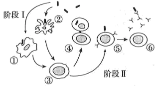
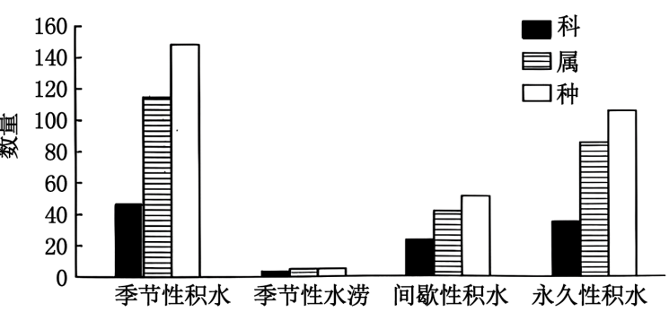
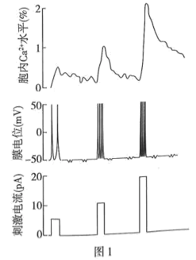
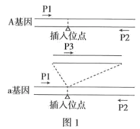
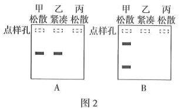
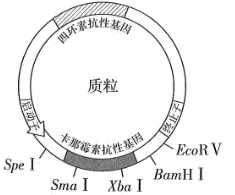
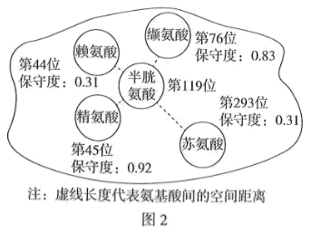

**卷2 2025年普通高中学业水平选择性考试（河南卷）生物学**

**一、选择题：本题共16小题，每小题3分，共48分。在每小题给出的四个选项中，只有一项是符合题目要求的。**

1\. 某研究小组将合成的必需基因导入去除DNA的支原体中，构建出具有最小基因组且能够正常生长和分裂的细胞。下列结构中，这种细胞一定含有的是（　　）

A. 核糖体 B. 线粒体 C. 中心体 D. 溶酶体

2\. 在T2噬菌体侵染大肠杆菌的实验中，子代噬菌体中的元素全部来自其宿主细胞的是（　　）

A. C B. S C. P D. N

3\. 耐寒黄花苜蓿的基因M编码的蛋白M属于水通道蛋白家族，将基因M转入烟草植株可提高其耐寒能力。下列叙述错误的是（　　）

A. 细胞内的结合水占比增加可提升植物的耐寒能力

B. 低温时，水分子通过与蛋白M结合转运到细胞外

C. 蛋白M增加了水的运输能力，但不改变水的运输方向

D. 水通道蛋白介导的跨膜运输不是水进出细胞的唯一方式

4\. 甜菜是我国重要的经济作物之一，根中含有大量的糖分。研究表明呼吸代谢可影响甜菜块根的生长，其中酶Ⅰ在有氧呼吸的第二阶段发挥催化功能，该酶活性与甜菜根重呈正相关。下列叙述正确的是（　　）

A. 酶Ⅰ主要分布在线粒体内膜上，催化的反应需要消耗氧气

B. 低温抑制酶Ⅰ的活性，进而影响二氧化碳和NADH的生成速率

C. 酶Ⅰ参与的有氧呼吸第二阶段是有氧呼吸中生成ATP最多的阶段

D. 呼吸作用会消耗糖分，因此在生长期喷施酶Ⅰ抑制剂会增加甜菜产量

5\. 导管是被子植物木质部中运输水分和无机盐的主要输导组织，由导管的原始细胞分裂、分化、死亡后形成。下列叙述正确的是（　　）

A. 细胞坏死形成导管的过程是一种自然的生理过程

B. 分化成熟后的导管仍具备脱分化和再分化的能力

C. 导管的原始细胞与叶肉细胞的基因表达情况存在差异

D. 细胞骨架在维持导管的形态及物质的运输中发挥作用

6\. 食醋和黄酒是我国传统的日常调味品，均通过发酵技术生产。下列叙述错误的是（　　）

A. 醋酸的发酵是好氧发酵，而酒精的发酵是厌氧发酵

B. 以谷物为原料酿造食醋和黄酒时，伴有pH下降和气体产生

C. 食醋和黄酒发酵过程中，微生物繁殖越快发酵产物产率越高

D. 使用天然混合菌种发酵往往会造成传统发酵食品的品质不一

7\. 系统进化树是一种表示物种间亲缘关系的树形图。研究人员结合形态学和分子证据，构建了绿色植物的系统进化关系，示意简图如下。下列推断正确的是（　　）

A. 植物的系统进化关系是共同由来学说的体现和自然选择的结果

B. 基因重组增强了生物变异的多样性，但不影响进化的速度和方向

C. 绿藻化石首次出现地层的年龄小于苔藓植物化石首次出现地层的年龄

D. 裸子植物与被子植物的亲缘关系比裸子植物与蕨类植物的亲缘关系远

8\. 病原体进入机体引起免疫应答过程的示意图如下。下列叙述正确的是（　　）

A. 阶段Ⅰ发生在感染早期，①和②为参与特异性免疫的淋巴细胞

B. ①和②通过摄取并呈递抗原，参与构成保卫机体的第一道防线

C. 活化之后的③可以分泌细胞因子，从而加速④的分裂分化过程

D. 阶段Ⅱ消灭病原体可通过③→⑤→⑥示意的细胞免疫过程来完成

9\. CO2是人体调节呼吸运动的重要体液因子。血液流经肌肉组织时，细胞产生的CO2进入红细胞，在酶的催化下迅速与水反应生成H2CO3，进一步解离为H+和。H+与血红蛋白结合促进O2释放，顺浓度梯度进入血浆。下列推断错误的是（　　）

A. CO2参与血浆中/ H2CO3缓冲对的形成

B. 血液流经肌肉组织后，红细胞会轻度吸水“肿胀”

C. 红细胞内pH下降时，血红蛋白与O2的亲和力增强

D. 脑干中呼吸中枢的正常兴奋存在对体液CO2浓度的依赖

10\. 向日葵具有向光生长的特性。研究人员以向日葵幼苗为实验材料，单侧光处理一段时间后，检测下胚轴两侧生长相关指标，结果如图所示。下列推断正确的是（　　）

A. 向日葵下胚轴向光面IAA促进生长的作用受抑制程度大于背光面

B. 下胚轴两侧IAA的含量基本一致，表明其向光生长不受IAA影响

C. IAA抑制物通过调节下胚轴IAA的含量进而导致向日葵向光生长

D. 在下胚轴一侧喷施IAA抑制物可导致黑暗中的向日葵向对侧弯曲

11\. 黄河流域是我国重要的生态屏障和经济地带，研究和保护黄河湿地生物多样性意义重大。某区域黄河湿地不同积水生境中植物物种的调查结果如图。下列叙述错误的是（　　）

A. 永久性积水退去后的植物群落演替属于次生演替

B. 积水生境中的植物具有适应所处非生物环境的共同特征

C. 积水频次和积水量均可以影响湿地生态系统的抵抗力稳定性

D. 影响季节性水涝生境中植物物种数量的关键生态因子属于密度制约因素

12\. 样方法是种群密度调查的常用方法，下列类群中最适用该方法调查种群密度的是（　　）

A. 跳蝻、蕨类植物、挺水植物

B. 灌木、鱼类、浮游植物

C 蚜虫、龟鳖类、土壤小动物

D. 鸟类、酵母菌、草本植物

13\. 植物细胞质雄性不育由线粒体基因控制，可被核恢复基因恢复育性。现有甲（雄性不育株，38条染色体）和乙（可育株，39条染色体）两份油菜。甲与正常油菜（38条染色体）杂交后代均为雄性不育，甲与乙杂交后代中可育株：雄性不育株=1：1，可育株均为39条染色体。下列推断错误的是（　　）

A. 正常油菜的初级卵母细胞中着丝粒数与核DNA分子数不等

B. 甲乙杂交后代的可育株含细胞质雄性不育基因和核恢复基因

C. 乙经单倍体育种获得的40条染色体植株与甲杂交，F1均可育

D. 乙的次级精母细胞与初级精母细胞中的核恢复基因数目不等

14\. 构成染色体的组蛋白可发生乙酰化。由组蛋白基因表达到产生乙酰化的组蛋白，需经历转录、转录后加工、翻译、翻译后加工与修饰等过程。下列叙述错误的是（　　）

A. 组蛋白乙酰化不改变自身的氨基酸序列但可影响个体表型

B. 具有生物活性的tRNA的形成涉及转录和转录后加工过程

C. 编码组蛋白的mRNA上结合的核糖体数量不同，可影响翻译的准确度和效率

D. 组蛋白乙酰化发生在翻译后，是基因表达调控的结果，也会影响基因的表达

15\. 现有二倍体植株甲和乙，自交后代中某性状的正常株：突变株均为3：1.甲自交后代中的突变株与乙自交后代中的突变株杂交，F1全为正常株，F2中该性状的正常株：突变株=9：6（等位基因可依次使用A/a、B/b……）。下列叙述错误的是（　　）

A. 甲的基因型是AaBB或AABb

B. F2出现异常分离比是因为出现了隐性纯合致死

C. F2植株中性状能稳定遗传的占7/15

D. F2中交配能产生AABB基因型的亲本组合有6种

16\. 饥饿可以通过肾上腺影响毛发生长。研究人员进行了相关实验，小鼠分组处理情况和实验结果如表所示。下列叙述错误的是（　　）

<table style="width:46%;">
<colgroup>
<col style="width: 6%" />
<col style="width: 18%" />
<col style="width: 13%" />
<col style="width: 6%" />
</colgroup>
<tbody>
<tr>
<td rowspan="2" style="text-align: left;">分组</td>
<td rowspan="2" style="text-align: left;">处理</td>
<td colspan="2" style="text-align: left;">实验结果</td>
</tr>
<tr>
<td style="text-align: left;">皮质醇水平</td>
<td style="text-align: left;">毛发</td>
</tr>
<tr>
<td style="text-align: left;">甲</td>
<td style="text-align: left;">正常饮食</td>
<td style="text-align: left;">正常</td>
<td style="text-align: left;">正常</td>
</tr>
<tr>
<td style="text-align: left;">乙</td>
<td style="text-align: left;">断食</td>
<td style="text-align: left;">升高</td>
<td style="text-align: left;">减少</td>
</tr>
<tr>
<td style="text-align: left;">丙</td>
<td style="text-align: left;">断食+切除肾上腺</td>
<td style="text-align: left;">无</td>
<td style="text-align: left;">正常</td>
</tr>
</tbody>
</table>

A. 断食处理可通过体液调节使靶细胞发生一系列的代谢变化

B. 通过甲乙组对比分析不能证明毛发的生长受肾上腺的调节

C. 丙组切除肾上腺处理是采用了自变量控制中的“减法原理”

D. 根据甲乙丙组实验可以证明饥饿通过皮质醇调节毛发生长

**二、非选择题：本题共5小题，共52分。**

17\. 光质和土壤中的盐含量是影响作物生理状态的重要因素。为探究不同光质对高盐含量（盐胁迫）下某作物生长的影响，将作物分组处理一段时间后，结果如图所示（光补偿点指当总光合速率等于呼吸速率时的光照强度）。

回答下列问题：

（1）光对植物生长发育的作用有\_\_\_\_\_\_和\_\_\_\_\_\_两个方面。

（2）上述实验需控制变量，为探究实验光处理是否完全抵消了盐胁迫对该作物生长的影响，至少应选用上述\_\_\_\_\_\_组（填组别）进行对比分析，该实验中的无关变量有\_\_\_\_\_\_\_\_\_\_\_\_（答出2点即可）。

（3）在光照强度达到光补偿点之前（CO2消耗量与光照强度视为正比关系），④组的总光合速率\_\_\_\_\_\_（填“始终大于”“始终小于”“先大于后等于”或“先小于后等于”）③组的总光合速率，判断依据是\_\_\_\_\_\_\_。

18\. 生物体的所有活细胞都具有静息电位，而动作电位仅见于神经元、肌细胞和部分腺细胞。回答下列问题：

（1）刺激神经元，胞外Na+内流使细胞兴奋，兴奋以\_\_\_\_\_\_\_\_\_\_\_\_的形式沿细胞膜传导至轴突末梢，激活Ca2+通道，Ca2+内流触发突触小泡释放神经递质。去除细胞外液中的Ca2+，刺激该神经元仍可触发Na+内流产生动作电位，释放的神经递质\_\_\_\_\_\_（填“增加”“减少”或“不变”）。

（2）最新研究发现某种肿瘤细胞也可产生动作电位。如图1所示，刺激肿瘤细胞，记录该细胞的膜电位和细胞内Ca2+浓度变化。结果显示随着刺激强度的增大，动作电位幅度、细胞内Ca2+浓度的变化是\_\_\_\_\_\_\_。在体外培养条件下，用Na+通道阻断剂TTX处理该细胞，使该细胞膜两侧的电位表现为\_\_\_\_\_\_\_\_\_\_\_\_，进而抑制其增殖生长。根据以上机制，若降低培养液中的K+浓度，可\_\_\_\_\_\_（填“促进”或“抑制”）该肿瘤细胞的生长。

（3）若细胞间有突触结构，突触前细胞兴奋，突触后细胞可记录到相应的膜电位变化，细胞内Ca2+浓度变化可作为判断肿瘤细胞间信息交流的指标。研究证实这种肿瘤细胞间无突触结构，通过体液调节方式实现信息交流。为验证上述研究结论，应选择图2中组\_\_\_\_（填“一”“二”或“三”）的细胞为研究对象设计实验，简要写出实验思路及预期结果\_\_\_\_\_。

19\. 烟粉虱是世界范围内常见的农业害虫，入侵性极强，严重危害番茄的生产。研究人员调查了番茄田中不同条件下烟粉虱种群密度的动态变化，结果如图所示。

回答下列问题：

（1）烟粉虱喜在番茄嫩叶背面吸食汁液获取营养，其与番茄的种间关系为\_\_\_\_\_\_。当番茄田中无天敌和竞争者时，10周内烟粉虱种群呈\_\_\_\_\_\_形增长。

（2）当番茄田中有烟粉虱的捕食者而无竞争者时，图中表示烟粉虱种群密度变化的曲线是\_\_\_\_\_\_（填“A””B”或”C”），理由是\_\_\_\_\_\_。

（3）通过引入天敌控制烟粉虱种群增长，属于控制动物危害技术方法中的\_\_\_\_\_\_，为减轻烟粉虱的危害，还可以采用的无公害方法是\_\_\_\_\_\_（多选）。

A.间作或轮作 B.使用杀虫剂 C.性信息素诱捕 D.灯光诱捕

（4）实施“番茄—草莓”立体种植可实现生态效益和经济效益的双赢，这主要体现了生态工程设计的\_\_\_\_\_\_原理。在设计立体农业时，应充分考虑群落结构中的\_\_\_\_\_\_和\_\_\_\_\_\_以减少作物之间的生态位重叠（不同物种对同一资源的共同利用）。

20\. 某二倍体植物松散株型与紧凑株型是一对相对性状，紧凑株型适合高密度种植，利于增产。研究人员获得了一个紧凑株型的植株，为研究控制该性状的基因，将其与纯合松散株型植株杂交，F1均为松散株型，F2中松散株型：紧凑株型=3：1，控制该相对性状的基因为A/a。回答下列问题：

（1）该紧凑株型性状由\_\_\_\_\_\_（填“A”或“a”）基因控制。

（2）在A基因编码蛋白质的区域中插入一段序列得到a基因（图1），a基因表达的肽链比A基因表达的肽链短。造成此现象的原因是\_\_\_\_\_\_\_\_\_\_\_\_。

（3）研究人员设计了3条引物（P1~P3），位置如图1（→表示引物5´→3´方向）。以3个F2单株（甲、乙、丙）d的DNA为模板，使用不同引物组合进行PCR扩增，琼脂糖凝胶电泳结果分别为图2-A和2-B（不考虑PCR结果异常）。

①图2-A中使用的引物组合是\_\_\_\_\_\_；丙单株无扩增条带的原因是\_\_\_\_\_\_\_\_\_\_。

②结合图2-A的扩增结果，在图2-B中，参照甲的条带补充乙与丙的电泳条带（将正确条带涂黑）\_\_\_\_\_\_\_\_\_\_。

③使用图2-A中的引物组合扩增F2全部样本，有扩增条带松散株型：无扩增条带松散株型=\_\_\_\_\_\_。

21\. 卡拉胶是一类源于海洋红藻的大分子多糖，可被某些细菌降解为具有多种应用前景的卡拉胶寡糖。某研究小组拟筛选具有高活性卡拉胶酶（CG）的菌种用于生产卡拉胶寡糖。回答下列问题：

（1）选择海藻和海泥作为样本筛选卡拉胶降解菌的原因是\_\_\_\_\_\_。将培养后的菌液混匀并充分\_\_\_\_\_\_，再接种至微孔板中，经培养和筛选获得了CG活性最高的菌种。

（2）为构建携带cg（CG的编码基因）的大肠杆菌表达载体（图1），对cg的PCR扩增产物和质粒进行双酶切，随后用E.coliDNA连接酶连接。为保证连接准确性和效率，cg转录模板链的5'端最好含有\_\_\_\_\_\_酶切位点。另有两组同学选用了各不相同的双酶切组合和T4DNA连接酶重复上述实验，获得的部分重组质粒分子大小符合预期，但均无法使用各自构建表达载体的双酶切组合进行切割，其原因是\_\_\_\_\_\_。

限制酶的识别序列和切割位点如下：

（3）为将构建好的表达载体转入大肠杆菌，需要先用Ca2+处理大肠杆菌细胞，目的是\_\_\_\_\_\_，随后在含\_\_\_\_\_\_和\_\_\_\_\_\_\_\_\_\_的培养基中培养一段时间后，根据菌落周围有无水解透明圈筛选目的菌株。

（4）已知空间上邻近的两个半胱氨酸易形成二硫键，从而提升蛋白质的耐热性。为提高CG的耐热性，研究人员分析了五个氨基酸位点的空间距离和保守度（保守度值越大表明该位点对酶的功能越关键），如图2所示。根据分析结果，选择第\_\_\_\_\_\_位的氨基酸替换成半胱氨酸最合适，原因是\_\_\_\_\_\_。

