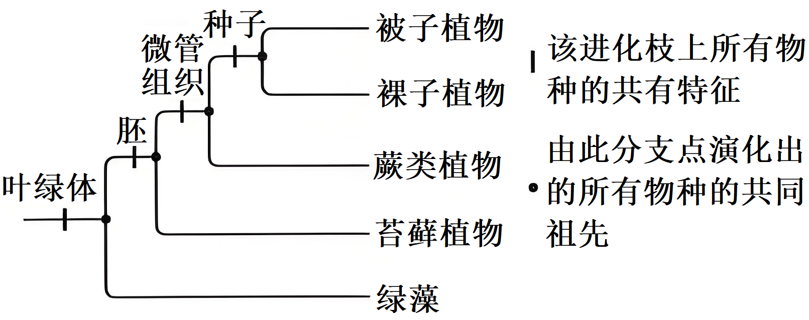
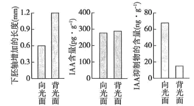
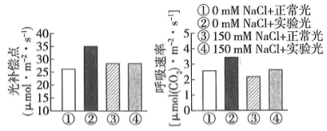
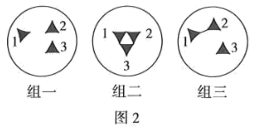
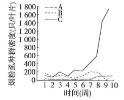
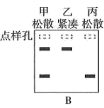
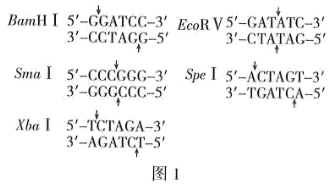

**卷2 2025年普通高中学业水平选择性考试（河南卷）生物学**

**一、选择题：本题共16小题，每小题3分，共48分。在每小题给出的四个选项中，只有一项是符合题目要求的。**

1\. 某研究小组将合成的必需基因导入去除DNA的支原体中，构建出具有最小基因组且能够正常生长和分裂的细胞。下列结构中，这种细胞一定含有的是（　　）

A. 核糖体 B. 线粒体 C. 中心体 D. 溶酶体

【答案】A

【解析】

【分析】原核细胞与真核细胞相比，最大的区别是原核细胞没有被核膜包被的成形的细胞核，没有核膜、核仁和染色体；原核细胞只有核糖体一种细胞器，但原核生物含有细胞膜、细胞质等结构，也含有核酸和蛋白质等物质。

【详解】某研究小组将合成的必需基因导入去除DNA的支原体中，构建出具有最小基因组且能够正常生长和分裂的细胞，导入的合成的必需基因具体作用未知的前提下，由于支原体属于原核生物，一定含有核糖体一种细胞器，A正确。

故选A。

2\. 在T2噬菌体侵染大肠杆菌的实验中，子代噬菌体中的元素全部来自其宿主细胞的是（　　）

A. C B. S C. P D. N

【答案】B

【解析】

【分析】1、噬菌体的结构：蛋白质（C、H、O、N、S）+DNA（C、H、O、N、P）。

2、噬菌体侵染细菌的过程：吸附→注入（注入噬菌体的DNA）→合成（控制者：噬菌体的DNA；原料：细菌的化学成分）→组装→释放。

3、T2噬菌体侵染细菌的实验步骤：分别用35S或32P标记噬菌体→噬菌体与大肠杆菌混合培养→噬菌体侵染未被标记的细菌→在搅拌器中搅拌，然后离心，检测上清液和沉淀物中的放射性物质。

【详解】T2噬菌体侵染大肠杆菌时，只有DNA进入大肠杆菌中并作为模板控制子代T2噬菌体的合成，而合成子代T2噬菌体所需的原料均由大肠杆菌提供，因此子代T2噬菌体外壳中元素全部来自大肠杆菌；但由于DNA复制方式为半保留复制，因此子代噬菌体DNA中一些元素来自亲代噬菌体，一些来自大肠杆菌。已知蛋白质由C、H、O、N、S组成，DNA由C、H、O、N、P组成，综上分析，子代噬菌体中的元素全部来自其宿主细胞大肠杆菌的是S，B正确。

故选B。

3\. 耐寒黄花苜蓿的基因M编码的蛋白M属于水通道蛋白家族，将基因M转入烟草植株可提高其耐寒能力。下列叙述错误的是（　　）

A. 细胞内的结合水占比增加可提升植物的耐寒能力

B. 低温时，水分子通过与蛋白M结合转运到细胞外

C. 蛋白M增加了水的运输能力，但不改变水的运输方向

D. 水通道蛋白介导的跨膜运输不是水进出细胞的唯一方式

【答案】B

【解析】

【分析】小分子物质跨膜运输的方式包括自由扩散、协助扩散和主动运输，其中协助扩散和主动运输需要转运蛋白的协助，主动运输需要消耗能量。根据题干信息分析，已知水分子通过细胞膜上的通道蛋白进行跨膜运输，且该过程不需要消耗能量，说明其跨膜运输方式为被动运输中的协助扩散，还可以自由扩散进出细胞。

【详解】A、结合水是与细胞内的其他物质相结合的水，是细胞结构的重要组成成分，细胞内的结合水占比增加可提升植物的耐寒能力，A正确；

B、水分子通过细胞膜上的通道蛋白进行跨膜运输时，不与通道蛋白相结合，B错误；

C、蛋白M是细胞膜上的水分子通道蛋白，增加了水的运输能力，但不改变水的运输方向，水的运输方向为水的顺浓度梯度，C正确；

D、水进出细胞的方式有水通道蛋白介导的协助扩散和自由扩散，D正确。

故选B。

4\. 甜菜是我国重要的经济作物之一，根中含有大量的糖分。研究表明呼吸代谢可影响甜菜块根的生长，其中酶Ⅰ在有氧呼吸的第二阶段发挥催化功能，该酶活性与甜菜根重呈正相关。下列叙述正确的是（　　）

A. 酶Ⅰ主要分布在线粒体内膜上，催化的反应需要消耗氧气

B. 低温抑制酶Ⅰ的活性，进而影响二氧化碳和NADH的生成速率

C. 酶Ⅰ参与的有氧呼吸第二阶段是有氧呼吸中生成ATP最多的阶段

D. 呼吸作用会消耗糖分，因此在生长期喷施酶Ⅰ抑制剂会增加甜菜产量

【答案】B

【解析】

【分析】有氧呼吸过程分为三个阶段，第一阶段是葡萄糖酵解形成丙酮酸和\[H\]，发生在细胞质基质中；有氧呼吸的第二阶段是丙酮酸和水反应产生二氧化碳和\[H\]，发生在线粒体基质中；有氧呼吸的第三阶段是\[H\]与氧气反应形成水，发生在线粒体内膜上。

【详解】A、酶Ⅰ在有氧呼吸的第二阶段发挥催化功能，故酶Ⅰ主要分布在线粒体基质中，催化的反应不需要消耗氧气，需要消耗水和丙酮酸，A错误；

B、有氧呼吸的第二阶段是丙酮酸和水反应产生二氧化碳和NADH，故低温抑制酶Ⅰ的活性，有氧呼吸的第二阶段减慢，进而影响二氧化碳和NADH的生成速率，B正确；

C、酶Ⅰ参与的有氧呼吸第二阶段生成ATP较少，有氧呼吸中生成ATP最多的是第三阶段，C错误；

D、在生长期喷施酶Ⅰ抑制剂会抑制有氧呼吸，生成ATP减少，细胞生长发育活动受抑制，减少甜菜产量，D错误。

故选B。

5\. 导管是被子植物木质部中运输水分和无机盐的主要输导组织，由导管的原始细胞分裂、分化、死亡后形成。下列叙述正确的是（　　）

A. 细胞坏死形成导管的过程是一种自然的生理过程

B. 分化成熟后的导管仍具备脱分化和再分化的能力

C. 导管的原始细胞与叶肉细胞的基因表达情况存在差异

D. 细胞骨架在维持导管的形态及物质的运输中发挥作用

【答案】C

【解析】

【分析】1、细胞分化是指在个体发育中，由一个或一种细胞增殖产生的后代，在形态，结构和生理功能上发生稳定性差异的过程，细胞分化的结果：使细胞的种类增多，功能趋于专门化。

2、细胞凋亡是由基因决定的细胞编程性死亡的过程，细胞凋亡是生物体正常的生命历程，对生物体是有利的，而且细胞凋亡贯穿于整个生命历程。

【详解】A、形成导管的细胞死亡属于细胞凋亡，是一种基因决定的自然的生理过程，不是细胞坏死，A错误；

B、分化成熟后的导管是死细胞，不具备脱分化和再分化的能力，B错误；

C、导管原始细胞与叶肉细胞的遗传物质相同，但结构、形态和功能的差异源于细胞分化过程中的基因选择性表达，C正确；

D、成熟的导管分子为长管状的死细胞，没有细胞骨架，D错误。

故选C。

6\. 食醋和黄酒是我国传统的日常调味品，均通过发酵技术生产。下列叙述错误的是（　　）

A. 醋酸的发酵是好氧发酵，而酒精的发酵是厌氧发酵

B. 以谷物为原料酿造食醋和黄酒时，伴有pH下降和气体产生

C. 食醋和黄酒发酵过程中，微生物繁殖越快发酵产物产率越高

D. 使用天然混合菌种发酵往往会造成传统发酵食品的品质不一

【答案】C

【解析】

【分析】参与果酒制作的微生物是酵母菌，其新陈代谢类型为异养兼性厌氧型。参与果醋制作的微生物是醋酸菌，其新陈代谢类型是异养需氧型。果醋制作的原理：当氧气、糖源都充足时，醋酸菌将葡萄汁中的葡萄糖分解成醋酸；当缺少糖源时，醋酸菌将乙醇变为乙醛，再将乙醛变为醋酸。

【详解】A、醋酸的发酵的微生物是醋酸菌，其新陈代谢类型是异养需氧型，故醋酸的发酵是好氧发酵，而酒精的发酵，参与的微生物是酵母菌，需要无氧呼吸产生酒精，故是厌氧发酵，A正确；

B、以谷物为原料酿造食醋和黄酒时，产物中的醋酸、二氧化碳等会使pH下降，B正确；

C、黄酒发酵过程中，酵母菌繁殖在有氧条件下，产酒精要在无氧条件下，繁殖越快则发酵产物酒精产率越低，C错误；

D、传统发酵食品所用的是自然菌种，没有进行严格的灭菌，以混合菌种的固体发酵及半固体发酵为主，往往会造成传统发酵食品的品质不一，D正确。

故选C

7\. 系统进化树是一种表示物种间亲缘关系的树形图。研究人员结合形态学和分子证据，构建了绿色植物的系统进化关系，示意简图如下。下列推断正确的是（　　）

A. 植物的系统进化关系是共同由来学说的体现和自然选择的结果

B. 基因重组增强了生物变异的多样性，但不影响进化的速度和方向

C. 绿藻化石首次出现地层的年龄小于苔藓植物化石首次出现地层的年龄

D. 裸子植物与被子植物的亲缘关系比裸子植物与蕨类植物的亲缘关系远

【答案】A

【解析】

【分析】生物有共同祖先的证据：

(1)化石证据：在研究生物进化的过程中，化石是最重要的、比较全面的证据，化石在地层中出现的先后顺序，说明了生物是由简单到复杂、由低等到高等、由水生到陆生逐渐进化而来的。

(2)解剖学证据：具有同源器官的生物是由共同祖先演化而来。这些具有共同祖先的生物生活在不同环境中，向着不同的方向进化发展，其结构适应于不同的生活环境，因而产生形态上的差异。

(3)胚胎学证据：①人和鱼的胚胎在发育早期都出现鳃裂和尾；②人和其它脊椎动物在胚胎发育早期都有彼此相似的阶段。

(4)细胞水平的证据：①细胞有许多共同特征，如有能进行代谢、生长和增殖的细胞；②细胞有共同的物质基础和结构基础。

(5)分子水平的证据：不同生物的DNA和蛋白质等生物大分子，既有共同点，又存在差异性。

【详解】A、系统进化树是一种表示物种间亲缘关系的树形图，而且自然选择决定进化的方向，故植物的系统进化关系是共同由来学说的体现和自然选择的结果，A正确；

B、基因重组增强了生物变异的多样性，能为进化提供更多的原材料，会影响进化的速度和方向，B错误；

C、绿藻的出现早于苔藓，故绿藻化石首次出现地层的年龄大于苔藓植物化石首次出现地层的年龄，C错误；

D、据图分析可知，裸子植物与被子植物的亲缘关系比裸子植物与蕨类植物的亲缘关系近，D错误。

故选A。

8\. 病原体进入机体引起免疫应答过程的示意图如下。下列叙述正确的是（　　）

A. 阶段Ⅰ发生在感染早期，①和②为参与特异性免疫的淋巴细胞

B. ①和②通过摄取并呈递抗原，参与构成保卫机体的第一道防线

C. 活化之后的③可以分泌细胞因子，从而加速④的分裂分化过程

D. 阶段Ⅱ消灭病原体可通过③→⑤→⑥示意的细胞免疫过程来完成

【答案】C

【解析】

【分析】体液免疫：病原体可以直接和B细胞接触，树突状细胞作为抗原呈递细胞，可对抗原进行加工、处理后呈递至辅助性T淋巴细胞，随后在抗原、激活的辅助性T细胞表面的特定分子双信号刺激下，B淋巴细胞活化，再接受细胞因子刺激后增殖分化成记忆细胞和浆细胞，浆细胞产生抗体，和病原体结合。

【详解】A、据图分析，①和②是巨噬细胞等抗原呈递细胞，其中巨噬细胞不一定是参与特异性免疫反应的细胞，在非特异性免疫中也起作用，A错误；

B、①和②（抗原呈递细胞）通过摄取和呈递抗原参与免疫反应，但它们属于第二道防线，不是第一道防线（皮肤、黏膜等物理屏障），B错误；

C、活化后的③（辅助性T细胞）可以分泌细胞因子，这些细胞因子能够加速④（B细胞）的分裂分化过程，促进体液免疫应答，C正确；

D、图示过程有抗体参与，应是体液免疫而非细胞免疫，D错误。

故选C。

9\. CO2是人体调节呼吸运动的重要体液因子。血液流经肌肉组织时，细胞产生的CO2进入红细胞，在酶的催化下迅速与水反应生成H2CO3，进一步解离为H+和。H+与血红蛋白结合促进O2释放，顺浓度梯度进入血浆。下列推断错误的是（　　）

A. CO2参与血浆中/ H2CO3缓冲对的形成

B. 血液流经肌肉组织后，红细胞会轻度吸水“肿胀”

C. 红细胞内pH下降时，血红蛋白与O2的亲和力增强

D. 脑干中呼吸中枢的正常兴奋存在对体液CO2浓度的依赖

【答案】C

【解析】

【分析】1、人体血浆中的CO 2主要来自有氧呼吸。

2、分析题图可知，CO2进入红细胞后，与水反应生成碳酸，碳酸电离形成H＋和，所以，CO2进入红细胞后，的数量增加；顺浓度梯度进入血浆，可知进入血浆的方式为协助扩散。

3、碳酸电离形成的氢离子与血红蛋白结合，引起血红蛋白的空间结构发生改变，促进氧气释放到血浆中，进而进入组织液供细胞吸收利用。

【详解】A、由题干信息“细胞产生的CO2进入红细胞，在酶的催化下迅速与水反应生成H2CO3，进一步解离为H+和”，可知CO2参与血浆中/ H2CO3缓冲对的形成，A正确；

B、血液流经肌肉组织，肌肉组织细胞需要O2用于有氧呼吸，故H+与血红蛋白结合，促进O2释放，此时红细胞渗透压略有升高，会轻度吸水“肿胀”，B正确；

C、红细胞内pH下降时，H+增多，H+与血红蛋白结合促进O2释放，即血红蛋白与O2的亲和力下降，C错误；

D、CO2是人体调节呼吸运动的重要体液因子，故脑干中呼吸中枢的正常兴奋存在对体液CO2浓度的依赖，D正确。

故选C。

10\. 向日葵具有向光生长的特性。研究人员以向日葵幼苗为实验材料，单侧光处理一段时间后，检测下胚轴两侧生长相关指标，结果如图所示。下列推断正确的是（　　）

A. 向日葵下胚轴向光面IAA促进生长的作用受抑制程度大于背光面

B. 下胚轴两侧IAA的含量基本一致，表明其向光生长不受IAA影响

C. IAA抑制物通过调节下胚轴IAA的含量进而导致向日葵向光生长

D. 在下胚轴一侧喷施IAA抑制物可导致黑暗中的向日葵向对侧弯曲

【答案】A

【解析】

【分析】生长素的产生：生长素的主要合成部位是幼嫩的芽、叶和发育中的种子，由色氨酸经过一系列反应转变而成。运输：胚芽鞘、芽、幼叶、幼根中：生长素只能从形态学的上端运输到形态学的下端，而不能反过来运输，称为极性运输；在成熟组织中：生长素可以通过韧皮部进行非极性运输。

【详解】A、据图可知，向光面和背光面的IAA含量差别不大，但向光面下胚轴的增加长度明显低于背光面，同时向光面的IAA抑制物质含量高于背光面，据此推测，向日葵下胚轴向光面IAA促进生长的作用受抑制程度大于背光面，A正确；

B、下胚轴两侧IAA的含量基本一致，但不能说明向光生长不受IAA影响，可能是IAA的活性或信号通路差异导致，B错误；

C、图示向光面和背光面的IAA含量差别不大，说明IAA抑制物不是通过调节下胚轴IAA的含量进而导致向日葵向光生长，C错误；

D、黑暗环境中无单侧光刺激，喷施IAA抑制物会抑制该侧生长，弯曲方向应为 向喷施侧弯曲（抑制侧生长慢，对侧相对快），D错误。

故选A。

11\. 黄河流域是我国重要的生态屏障和经济地带，研究和保护黄河湿地生物多样性意义重大。某区域黄河湿地不同积水生境中植物物种的调查结果如图。下列叙述错误的是（　　）

A. 永久性积水退去后的植物群落演替属于次生演替

B. 积水生境中的植物具有适应所处非生物环境的共同特征

C. 积水频次和积水量均可以影响湿地生态系统的抵抗力稳定性

D. 影响季节性水涝生境中植物物种数量的关键生态因子属于密度制约因素

【答案】D

【解析】

【分析】初生演替是指在一个从来没有被植物覆盖的地面，或者原来存在过植被但被彻底消灭了的地方发生的演替；次生演替是指在一个从来没有被植物覆盖的地面，或者是原来存在过植被、但被彻底消灭了的地方发生的演替。

【详解】A、永久性积水生境中有生物群落，永久性积水退去后的植物群落演替属于次生演替，A正确；

B、积水生境中的植物能够生存，说明具有适应所处非生物环境的共同特征，如具有发达的通气组织，用于储存和运输氧气，缓解低氧胁迫，B正确；

C、积水频次和积水量均可以影响植物种类，从而影响湿地生态系统的抵抗力稳定性，C正确；

D、影响季节性水涝生境中植物物种数量的关键生态因子，如积水深度、淹水持续时间等属于‌非密度制约因素‌，其作用强度与植物种群密度无关，D错误。

故选D。

12\. 样方法是种群密度调查的常用方法，下列类群中最适用该方法调查种群密度的是（　　）

A. 跳蝻、蕨类植物、挺水植物

B. 灌木、鱼类、浮游植物

C. 蚜虫、龟鳖类、土壤小动物

D. 鸟类、酵母菌、草本植物

【答案】A

【解析】

【分析】样方法是估算种群密度最常用的方法之一（1）概念：在被调查种群的分布范围内，随机选取若干个样方，通过计数每个样方内的个体数，求得每个样方的种群密度，以所有样方法种群密度的平均值作为该种群的种群密度估计值。（2）适用范围：植物种群密度，昆虫卵的密度，蚜虫、跳蝻的密度等。

【详解】A、蕨类植物、挺水植物等植物，以及跳蝻这种活动能力弱、活动范围小的动物都适合用样方法调查种群密度，A正确；

B、鱼类是活动能力强、活动范围大的动物，不适合用样方法调查种群密度，B错误；

C、土壤小动物有较强的活动能力，而且身体微小，不适合用样方法调查种群密度，C错误；

D、鸟类是活动能力强、活动范围大的动物，不适合用样方法调查种群密度；酵母菌细胞微小，用血细胞计数板调查种群密度，D错误。

故选A。

13\. 植物细胞质雄性不育由线粒体基因控制，可被核恢复基因恢复育性。现有甲（雄性不育株，38条染色体）和乙（可育株，39条染色体）两份油菜。甲与正常油菜（38条染色体）杂交后代均为雄性不育，甲与乙杂交后代中可育株：雄性不育株=1：1，可育株均为39条染色体。下列推断错误的是（　　）

A. 正常油菜的初级卵母细胞中着丝粒数与核DNA分子数不等

B. 甲乙杂交后代的可育株含细胞质雄性不育基因和核恢复基因

C. 乙经单倍体育种获得的40条染色体植株与甲杂交，F1均可育

D. 乙的次级精母细胞与初级精母细胞中的核恢复基因数目不等

【答案】D

【解析】

【分析】分析题干信息可知，雄性的育性由细胞核基因和细胞质基因共同控制，植物细胞质雄性不育由线粒体基因控制，可被核恢复基因恢复育性，故只有细胞质和细胞核中均为雄性不育基因时，个体才表现为雄性不育。

【详解】A、正常油菜有38条染色体，正常油菜的初级卵母细胞中着丝粒数=染色体数=38个，经过间期复制，核DNA分子数有76个，不相等，A正确；

B、甲乙杂交后代中可育株：雄性不育株=1：1，可育株均为39条染色体，可知可育株含细胞质雄性不育基因和核恢复基因，且核恢复基因位于第39条染色体，B正确；

C、乙为可育株，含39条染色体，配子有两种：19和20条染色体，20条染色体的配子中含核恢复基因，故经单倍体育种获得的40条染色体植株与甲杂交，F1均可育，C正确；

D、乙的核恢复基因位于第39条染色体，经复制初级精母细胞中的核恢复基因有2个，次级精母细胞中的核恢复基因数目为0或2个，故也可能相等，D错误。

故选D。

14\. 构成染色体的组蛋白可发生乙酰化。由组蛋白基因表达到产生乙酰化的组蛋白，需经历转录、转录后加工、翻译、翻译后加工与修饰等过程。下列叙述错误的是（　　）

A. 组蛋白乙酰化不改变自身的氨基酸序列但可影响个体表型

B. 具有生物活性的tRNA的形成涉及转录和转录后加工过程

C. 编码组蛋白的mRNA上结合的核糖体数量不同，可影响翻译的准确度和效率

D. 组蛋白乙酰化发生在翻译后，是基因表达调控的结果，也会影响基因的表达

【答案】C

【解析】

【分析】表观遗传是指生物体的碱基序列保持不变，但基因的表达和表型发生了可遗传变化的现象，即基因型未发生变化而表型却发生了改变，如DNA的甲基化、构成染色体的组蛋白发生甲基化、乙酰化等修饰。

【详解】A、组蛋白乙酰化不改变自身的氨基酸序列，但能降低染色质的紧密程度，从而促进基因的表达，可影响个体表型，A正确；

B、具有生物活性的tRNA的形成，需要DNA转录，还需要转录后加工形成三叶草结构，B正确；

C、编码组蛋白的mRNA上结合的核糖体数量不同，会影响翻译效率，但不会影响翻译的准确度，C错误；

D、组蛋白乙酰化发生在翻译出组蛋白后，是基因表达调控的结果，也会影响基因的表达，D正确。

故选C。

15\. 现有二倍体植株甲和乙，自交后代中某性状的正常株：突变株均为3：1.甲自交后代中的突变株与乙自交后代中的突变株杂交，F1全为正常株，F2中该性状的正常株：突变株=9：6（等位基因可依次使用A/a、B/b……）。下列叙述错误的是（　　）

A. 甲的基因型是AaBB或AABb

B. F2出现异常分离比是因为出现了隐性纯合致死

C. F2植株中性状能稳定遗传的占7/15

D. F2中交配能产生AABB基因型的亲本组合有6种

【答案】D

【解析】

【分析】自由组合定律实质：控制两对相对性状的等位基因相互独立，互不融合，在形成配子时，等位基因随着同源染色体分开而分离的同时，非同源染色体上的非等位基因表现为自由组合。即一对等位基因与另一对等位基因的分离或组合是互不干扰的，是各自独立地分配到配子中去的。

【详解】A、已知植株甲和乙，自交后代中某性状的正常株：突变株均为3：1，可知正常株为显性性状，突变株为隐性性状，甲自交后代中的突变株与乙自交后代中的突变株杂交，F1全为正常株，F2中该性状的正常株：突变株=9：6，为9：3：3：1的变式，可知杂交后代F1基因型为AaBb，正常株的基因型为A-B-，基因型为aabb的植株会死亡，其余基因型的植株为突变株。所以甲、乙自交后代中的突变株基因型分别为aaBB、AAbb或AAbb、aaBB，由于甲和乙自交后代中某性状的正常株（A-B-）：突变株均为3：1，故甲的基因型是AaBB或AABb，A正确；

B、F1基因型为AaBb，自交后代F2应该出现9：（6+1）的分离比，出现异常分离比是因为出现了隐性纯合aabb致死，B正确；

C、F2植株中正常株的基因型为1AABB、2AaBB、2AABb、4AaBb，突变株的基因型为1AAbb、2Aabb、1aaBB、2aaBb，其中性状能稳定遗传（自交后代不发生性状分离）的有1AABB、1AAbb、2Aabb、1aaBB、2aaBb，占7/15，C正确；

D、F2中交配能产生AABB基因型的亲本组合有：AABB×AaBB、AABB×AABb、AABB×AaBb、AaBB×AABb、AaBB×AaBb、AABb×AaBb6种杂交组合，和4种基因型AABB、AaBB、AABb、AaBb自交，故亲本组合有10种，D错误。

故选D。

16\. 饥饿可以通过肾上腺影响毛发生长。研究人员进行了相关实验，小鼠分组处理情况和实验结果如表所示。下列叙述错误的是（　　）

<table style="width:46%;">
<colgroup>
<col style="width: 6%" />
<col style="width: 18%" />
<col style="width: 13%" />
<col style="width: 6%" />
</colgroup>
<tbody>
<tr>
<td rowspan="2" style="text-align: left;">分组</td>
<td rowspan="2" style="text-align: left;">处理</td>
<td colspan="2" style="text-align: left;">实验结果</td>
</tr>
<tr>
<td style="text-align: left;">皮质醇水平</td>
<td style="text-align: left;">毛发</td>
</tr>
<tr>
<td style="text-align: left;">甲</td>
<td style="text-align: left;">正常饮食</td>
<td style="text-align: left;">正常</td>
<td style="text-align: left;">正常</td>
</tr>
<tr>
<td style="text-align: left;">乙</td>
<td style="text-align: left;">断食</td>
<td style="text-align: left;">升高</td>
<td style="text-align: left;">减少</td>
</tr>
<tr>
<td style="text-align: left;">丙</td>
<td style="text-align: left;">断食+切除肾上腺</td>
<td style="text-align: left;">无</td>
<td style="text-align: left;">正常</td>
</tr>
</tbody>
</table>

A. 断食处理可通过体液调节使靶细胞发生一系列的代谢变化

B. 通过甲乙组对比分析不能证明毛发的生长受肾上腺的调节

C. 丙组切除肾上腺处理是采用了自变量控制中的“减法原理”

D. 根据甲乙丙组实验可以证明饥饿通过皮质醇调节毛发生长

【答案】B

【解析】

【分析】肾上腺内层为髓质，外层为皮质，皮质分泌糖皮质激素（皮质醇）、醛固酮。髓质分泌肾上腺素和去甲肾上腺素。

【详解】A、断食处理可影响内环境中的营养物质含量，通过体液调节使靶细胞发生一系列的代谢变化，A正确；

B、甲乙组的自变量为是否断食，两组的皮质醇水平不同，故可以对比分析，证明毛发的生长受肾上腺的调节，B错误；

C、在对照实验中，控制自变量可以采用“加法原理”或“减法原理”。 与常态比较，人为去除某种影响因素的称为“减 法原理”。丙组切除肾上腺处理是采用了自变量控制中的“减法原理”，C正确；

D、根据甲乙丙组实验可以证明饥饿通过调节肾上腺分泌皮质醇来调节毛发生长，D正确。

故选B。

**二、非选择题：本题共5小题，共52分。**

17\. 光质和土壤中的盐含量是影响作物生理状态的重要因素。为探究不同光质对高盐含量（盐胁迫）下某作物生长的影响，将作物分组处理一段时间后，结果如图所示（光补偿点指当总光合速率等于呼吸速率时的光照强度）。

回答下列问题：

（1）光对植物生长发育的作用有\_\_\_\_\_\_和\_\_\_\_\_\_两个方面。

（2）上述实验需控制变量，为探究实验光处理是否完全抵消了盐胁迫对该作物生长的影响，至少应选用上述\_\_\_\_\_\_组（填组别）进行对比分析，该实验中的无关变量有\_\_\_\_\_\_\_\_\_\_\_\_（答出2点即可）。

（3）在光照强度达到光补偿点之前（CO2消耗量与光照强度视为正比关系），④组的总光合速率\_\_\_\_\_\_（填“始终大于”“始终小于”“先大于后等于”或“先小于后等于”）③组的总光合速率，判断依据是\_\_\_\_\_\_\_。

【答案】（1） ①. 为光合作用提供能量 ②. 作为一种信号调节植物生长发育

（2） ①. ①②④ ②. 温度和二氧化碳浓度

（3） ①. 始终大于 ②. ④组呼吸作用强于③组，但是两组光补偿点也就是总光合吸速率时的光照强度相等，所以④组达到光补偿点之前的总光合速率也大于③组

【解析】

【分析】光补偿点时呼吸作用速率等于光合作用速率，光饱和点以后时影响各种植物的光合作用速率的因素不再是光照强度，影响作物光合作用的因素有光照强度、温度或二氧化碳浓度等。

【小问1详解】

光可以为植物光合作用提供光能；同时光可以作为一种光信号调节植物生长发育，故光对植物生长发育的作用有为光合作用提供能量和作为一种信号调节植物生长发育两个方面。

【小问2详解】

探究实验光处理是否完全抵消了盐胁迫对该作物生长的影响，实验的自变量光（正常光和实验光）以及有无盐胁迫，因变量是作物生长情况，故该实验至少应选用上述①②④组进行对比分析（①和②对照自变量为光处理不同，②和④对照自变量是有无盐胁迫）。实验中除了自变量和因变量，其余变量称为无关变量，该实验中的无关变量有温度和二氧化碳浓度等。

【小问3详解】

由于④组呼吸作用强于③组，但是两组光补偿点也就是总光合吸速率时的光照强度相等，所以④组达到光补偿点之前的总光合速率始终大于③组。

18\. 生物体的所有活细胞都具有静息电位，而动作电位仅见于神经元、肌细胞和部分腺细胞。回答下列问题：

（1）刺激神经元，胞外Na+内流使细胞兴奋，兴奋以\_\_\_\_\_\_\_\_\_\_\_\_的形式沿细胞膜传导至轴突末梢，激活Ca2+通道，Ca2+内流触发突触小泡释放神经递质。去除细胞外液中的Ca2+，刺激该神经元仍可触发Na+内流产生动作电位，释放的神经递质\_\_\_\_\_\_（填“增加”“减少”或“不变”）。

（2）最新研究发现某种肿瘤细胞也可产生动作电位。如图1所示，刺激肿瘤细胞，记录该细胞的膜电位和细胞内Ca2+浓度变化。结果显示随着刺激强度的增大，动作电位幅度、细胞内Ca2+浓度的变化是\_\_\_\_\_\_\_。在体外培养条件下，用Na+通道阻断剂TTX处理该细胞，使该细胞膜两侧的电位表现为\_\_\_\_\_\_\_\_\_\_\_\_，进而抑制其增殖生长。根据以上机制，若降低培养液中的K+浓度，可\_\_\_\_\_\_（填“促进”或“抑制”）该肿瘤细胞的生长。

（3）若细胞间有突触结构，突触前细胞兴奋，突触后细胞可记录到相应的膜电位变化，细胞内Ca2+浓度变化可作为判断肿瘤细胞间信息交流的指标。研究证实这种肿瘤细胞间无突触结构，通过体液调节方式实现信息交流。为验证上述研究结论，应选择图2中组\_\_\_\_（填“一”“二”或“三”）的细胞为研究对象设计实验，简要写出实验思路及预期结果\_\_\_\_\_。

【答案】（1） ①. 电信号##神经冲动 ②. 减少

（2） ①. 动作电位幅度不变，细胞内Ca2+浓度逐渐增 ②. 外正内负 ③. 抑制

（3） ①. 一 ②. 实验思路：刺激组一中细胞1，检测细胞2、细胞3内Ca2+浓度变化。预期结果：刺激细胞1后，细胞2、细胞3内Ca2+浓度显著增加

【解析】

【分析】静息时，神经细胞膜对钾离子的通透性大，钾离子大量外流，形成内负外正的静息电位；兴奋时，钠离子大量内流，因此形成内正外负的动作电位。

【小问1详解】

兴奋在神经元上以电信号（神经冲动）的形式沿细胞膜传导；分析题意，Ca2+内流触发突触小泡释放神经递质，即Ca²⁺是递质释放的关键信号，去除细胞外Ca²⁺后，突触小泡无法与突触前膜融合释放神经递质，因此释放量减少。

【小问2详解】

据图1分析，随着刺激强度的增大，膜电位都是50mV左右，说明动作电位幅度不变，而细胞内Ca2+浓度不断升高；动作电位产生与钠离子内流有关，在体外培养条件下，用Na+通道阻断剂TTX处理该细胞，则钠离子内流减少，导致动作电位产生受阻，使该细胞膜两侧的电位维持外正内负的静息状态；静息电位的产生与钾离子外流有关，若降低培养液中的K+浓度，会加大细胞内外的钾离子浓度差，从而导致静息电位绝对值增加，细胞不易兴奋，从而抑制肿瘤细胞增殖。

【小问3详解】

分析题意，本实验目的是验证肿瘤细胞间无突触结构，通过体液调节方式实现信息交流，而突触是神经元之间进行信息交流的结构，为验证上述结论，应选择彼此之间无接触，即无突触结构的类型，故应选择组一；实验假设是Ca2+浓度变化可作为判断肿瘤细胞间信息交流的指标，故可刺激组一中细胞1，检测细胞2、细胞3内Ca2+浓度变化。

由于实验假设是通过体液调节方式实现信息交流，且实验为验证试验，故预期结果：刺激细胞1后，细胞2、细胞3内Ca2+浓度显著增加。

19\. 烟粉虱是世界范围内常见的农业害虫，入侵性极强，严重危害番茄的生产。研究人员调查了番茄田中不同条件下烟粉虱种群密度的动态变化，结果如图所示。

回答下列问题：

（1）烟粉虱喜在番茄嫩叶背面吸食汁液获取营养，其与番茄的种间关系为\_\_\_\_\_\_。当番茄田中无天敌和竞争者时，10周内烟粉虱种群呈\_\_\_\_\_\_形增长。

（2）当番茄田中有烟粉虱d的捕食者而无竞争者时，图中表示烟粉虱种群密度变化的曲线是\_\_\_\_\_\_（填“A””B”或”C”），理由是\_\_\_\_\_\_。

（3）通过引入天敌控制烟粉虱种群增长，属于控制动物危害技术方法中的\_\_\_\_\_\_，为减轻烟粉虱的危害，还可以采用的无公害方法是\_\_\_\_\_\_（多选）。

A.间作或轮作 B.使用杀虫剂 C.性信息素诱捕 D.灯光诱捕

（4）实施“番茄—草莓”立体种植可实现生态效益和经济效益的双赢，这主要体现了生态工程设计的\_\_\_\_\_\_原理。在设计立体农业时，应充分考虑群落结构中的\_\_\_\_\_\_和\_\_\_\_\_\_以减少作物之间的生态位重叠（不同物种对同一资源的共同利用）。

【答案】（1） ①. 寄生 ②. “J”

（2） ①. B ②. 当烟粉虱存在捕食者时，烟粉虱和捕食者的种群周期性的波动

（3） ①. 生物防治 ②. ACD

（4） ①. 整体 ②. 空间结构 ③. 季节性

【解析】

【分析】1、种间关系（不同种生物之间的关系）：互利共生（同生共死）、捕食（此长彼消、此消彼长）、种间竞争（你死我活）、寄生（寄生者不劳而获）。

2、生态位是指一个种群在生态系统中，在时间空间上所占据的位置及其与相关种群之间的功能关系与作用。表示生态系统中每种生物生存所必需的生境最小阈值。生态位重叠 生物群落中，多个物种取食相同食物的现象就是生态位重叠的一种表现，由此造成物种间的竞争，而食物缺乏时竞争加剧。

【小问1详解】

烟粉虱喜在番茄嫩叶背面吸食汁液获取营养，而非吃叶子，故其与番茄的种间关系为寄生，此处易错写为捕食。当番茄田中无天敌和竞争者时，环境适宜的条件下，10周内烟粉虱种群呈“J”形增长。

【小问2详解】

当番茄田中有烟粉虱的捕食者而无竞争者时，烟粉虱和捕食者的种群呈现周期性的波动，故图中表示烟粉虱种群密度变化的曲线是B。

【小问3详解】

控制动物危害技术方法有：机械防治、化学防治、生物防治。通过引入天敌控制烟粉虱种群增长，属于生物防治。为减轻烟粉虱的危害，还可以采用的无公害方法是间作或轮作（通过在不同季节种植不同的作物，可以打破烟粉虱的生存周期，减少其种群数量） 、 性信息素诱捕（利用烟粉虱的性信息素吸引并集中诱捕成虫，减少成虫与作物的接触机会，从而降低其繁殖率）和灯光诱捕（利用烟粉虱的趋光性，设置灯光诱捕器吸引并杀死成虫），为避免污染环境，不能使用杀虫剂 ，ACD正确。

故选 ACD。

【小问4详解】

实施“番茄—草莓”立体种植可实现生态效益和经济效益的双赢，这主要体现了生态工程设计的整体原理。在设计立体农业时，应充分考虑群落结构中的空间结构和季节性以减少作物之间的生态位重叠。

20\. 某二倍体植物松散株型与紧凑株型是一对相对性状，紧凑株型适合高密度种植，利于增产。研究人员获得了一个紧凑株型的植株，为研究控制该性状的基因，将其与纯合松散株型植株杂交，F1均为松散株型，F2中松散株型：紧凑株型=3：1，控制该相对性状的基因为A/a。回答下列问题：

（1）该紧凑株型性状由\_\_\_\_\_\_（填“A”或“a”）基因控制。

（2）在A基因编码蛋白质的区域中插入一段序列得到a基因（图1），a基因表达的肽链比A基因表达的肽链短。造成此现象的原因是\_\_\_\_\_\_\_\_\_\_\_\_。

（3）研究人员设计了3条引物（P1~P3），位置如图1（→表示引物5´→3´方向）。以3个F2单株（甲、乙、丙）的DNA为模板，使用不同引物组合进行PCR扩增，琼脂糖凝胶电泳结果分别为图2-A和2-B（不考虑PCR结果异常）。

①图2-A中使用的引物组合是\_\_\_\_\_\_；丙单株无扩增条带的原因是\_\_\_\_\_\_\_\_\_\_。

②结合图2-A的扩增结果，在图2-B中，参照甲的条带补充乙与丙的电泳条带（将正确条带涂黑）\_\_\_\_\_\_\_\_\_\_。

③使用图2-A中的引物组合扩增F2全部样本，有扩增条带松散株型：无扩增条带松散株型=\_\_\_\_\_\_。

【答案】（1）a （2）插入序列后，a基因中编码终止密码子的序列提前，a基因转录产生的mRNA提前终止翻译

（3） ①. P2和P3 ②. 丙的基因型为AA，无引物P3的结合序列，利用引物P2和P3扩增时，无法得到扩增产物 ③.  ④. 2∶1

【解析】

【分析】基因分离定律的实质：杂合体内，等位基因在减数分裂形成配子时随同源染色体的分开而分离，进入两个不同的配子，独立的随配子遗传给后代。

【小问1详解】

根据题意可知，研究人员获得了一个紧凑株型的植株，为研究控制该性状的基因，将其与纯合松散株型植株杂交，F1均为松散株型，F2中松散株型∶紧凑株型=3∶1，说明紧凑株型为隐性性状，由a基因控制。

【小问2详解】

在A基因编码蛋白质的区域中插入一段序列得到a基因（图1），a基因表达的肽链比A基因表达的肽链短，说明终止密码子提前出现，因此推测可能是A基因内部插入一段序列后，使a基因中编码终止密码子的序列提前，a基因转录产生的mRNA提前终止翻译。

【小问3详解】

①子二代中的基因型为AA、Aa、aa，根据图示可知，A和a基因上均含有P1和P2引物互补的序列，而P3引物识别的序列只有a基因中才存在，若选择引物P1和P2进行扩增，则A基因和a基因均能扩增出相应产物，只是a基因扩增的产物长度要大于A基因扩增的产物，即AA的个体扩增产物的电泳条带与aa的个体扩增产物的电泳条带不同，且Aa的个体扩增产物的电泳条带应为两条，与图A不符，若选择引物P3和P2进行扩增，则只有Aa和aa的个体中因含有a基因而能扩增出产物，且扩增出的产物电泳条带相同，而AA的个体由于不含与P3引物结合的序列，因此不能扩增出产物，没有对应的电泳条带。即图2-A中使用的引物组合是P2和P3，丙的基因型为AA，无引物P3的结合序列，利用引物P2和P3扩增时，无法得到扩增产物。

②图A是利用引物P3和P2扩增后电泳的结果，则图B是利用引物P1和P2扩增的产物电泳的结果，由于a基因扩增出来的产物长度大于A基因扩增的产物，因此AA（松散株型）、aa（紧凑株型）基因的个体扩增的产物电泳时均只有一个条带，且aa基因的个体扩增的产物电泳时形成的电泳条带距离点样孔近，而Aa（松散株型）的个体扩增的产物电泳时会出现两个电泳条带，故乙与丙的电泳条带为 。

③使用图2-A中的引物组合（P3和P2）扩增F2全部样本，由于只有含a基因的个体才能扩增出相应产物，且A-为松散株型，而子二代中Aa∶AA=2∶1，所以使用图2-A中的引物组合扩增F2全部样本，有扩增条带松散株型（Aa）∶无扩增条带松散株型（AA）=2∶1。

21\. 卡拉胶是一类源于海洋红藻的大分子多糖，可被某些细菌降解为具有多种应用前景的卡拉胶寡糖。某研究小组拟筛选具有高活性卡拉胶酶（CG）的菌种用于生产卡拉胶寡糖。回答下列问题：

（1）选择海藻和海泥作为样本筛选卡拉胶降解菌的原因是\_\_\_\_\_\_。将培养后的菌液混匀并充分\_\_\_\_\_\_，再接种至微孔板中，经培养和筛选获得了CG活性最高的菌种。

（2）为构建携带cg（CG的编码基因）的大肠杆菌表达载体（图1），对cg的PCR扩增产物和质粒进行双酶切，随后用E.coliDNA连接酶连接。为保证连接准确性和效率，cg转录模板链的5'端最好含有\_\_\_\_\_\_酶切位点。另有两组同学选用了各不相同的双酶切组合和T4DNA连接酶重复上述实验，获得的部分重组质粒分子大小符合预期，但均无法使用各自构建表达载体的双酶切组合进行切割，其原因是\_\_\_\_\_\_。

限制酶的识别序列和切割位点如下：

（3）为将构建好的表达载体转入大肠杆菌，需要先用Ca2+处理大肠杆菌细胞，目的是\_\_\_\_\_\_，随后在含\_\_\_\_\_\_和\_\_\_\_\_\_\_\_\_\_的培养基中培养一段时间后，根据菌落周围有无水解透明圈筛选目的菌株。

（4）已知空间上邻近的两个半胱氨酸易形成二硫键，从而提升蛋白质的耐热性。为提高CG的耐热性，研究人员分析了五个氨基酸位点的空间距离和保守度（保守度值越大表明该位点对酶的功能越关键），如图2所示。根据分析结果，选择第\_\_\_\_\_\_位的氨基酸替换成半胱氨酸最合适，原因是\_\_\_\_\_\_。

【答案】（1） ①. 在富含卡拉胶的环境中，存在能够分解卡拉胶的微生物的可能性较大 ②. 稀释

（2） ①. BamHI ②. 重组质粒连接处的序列不再是原来的限制酶识别序列

（3） ①. 使细胞处于一种能吸收周围环境中DNA分子的生理状态 ②. 卡拉胶 ③. 四环素

（4） ①. 44 ②. 该位点的氨基酸空间上离半胱氨酸更近，容易形成二硫键，而且保守度低，替换后对酶功能的影响较小

【解析】

【分析】基因工程的基本操作步骤主要包括四步：①目的基因的获取；②基因表达载体的构建；③将目的基因导入受体细胞；④目的基因的检测与表达。其中，基因表达载体的构建是基因工程的核心。

【小问1详解】

卡拉胶是一类源于海洋红藻的大分子多糖，可被某些细菌降解为具有多种应用前景的卡拉胶寡糖。由于在富含卡拉胶的环境中，存在能够分解卡拉胶的微生物的可能性较大，因此可选择海藻和海泥作为样本筛选卡拉胶降解菌。将培养后的菌液混匀并充分稀释，再接种至微孔板中，经培养和筛选获得了CG活性最高的菌种。

【小问2详解】

E.coliDNA连接酶只能连接具有黏性末端的片段，因此切割质粒和目的基因时不能选择切成平末端的限制酶，即不能选择EcoRV酶和SmaⅠ酶，而SpeⅠ酶与XbaⅠ酶切割后的黏性末端相同，若选择SpeⅠ酶与XbaⅠ酶切割，会出现质粒和目的基因的自连、甚至目的基因倒接，因此切割质粒时SpeⅠ酶与XbaⅠ酶中只能选择一个，而另一个限制酶需要选择BamHⅠ酶，又由于转录的方向是由启动子→终止子，且mRNA形成的方向是5’→3’，且mRNA与DNA的模板链方向相反，因此基因模板链的3’应靠近启动子，故为保证连接准确性和效率，cg转录模板链的5'端最好含有BamHI酶切位点。T4DNA连接酶既可以连接平末端，也可连接黏性末端，不同的平末端均可由T4DNA连接酶连接，由于限制酶的识别序列具有专一性，若连接后的序列不存在最初限制酶的识别序列，则可能导致重组质粒无法使用各自构建表达载体的双酶切组合进行切割。故另有两组同学选用了各不相同的双酶切组合和T4DNA连接酶重复上述实验，获得的部分重组质粒分子大小符合预期，但均无法使用各自构建表达载体的双酶切组合进行切割，其原因是重组质粒连接处的序列不再是原来的限制酶识别序列。

【小问3详解】

为将构建好的表达载体转入大肠杆菌，需要先用Ca2+处理大肠杆菌细胞，目的是使细胞处于一种能吸收周围环境中DNA分子的生理状态，便于重组DNA进入受体细胞。由于具有高活性卡拉胶酶（CG）的菌种可分解卡拉胶，使其菌落周围形成透明圈，且重组质粒上含有四环素抗性基因，因此导入目的基因的大肠杆菌可接种在含卡拉胶和四环素的培养基中培养一段时间后，根据菌落周围有无水解透明圈筛选目的菌株。

【小问4详解】

据图可知，虚线长度代表氨基酸间的空间距离，由于第44位点的氨基酸空间上离半胱氨酸更近，容易形成二硫键，而且保守度低，替换后对酶功能的影响较小，因此选择第44位的氨基酸替换成半胱氨酸最合适。
