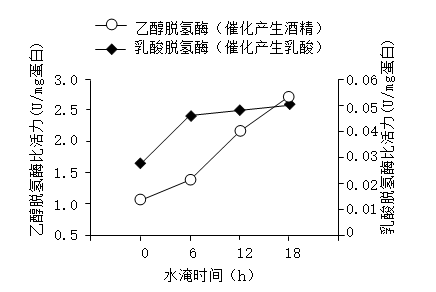
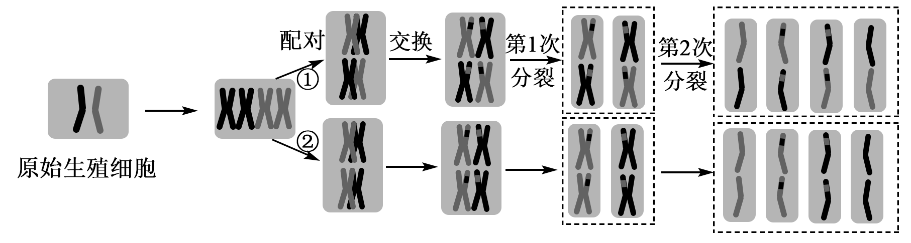
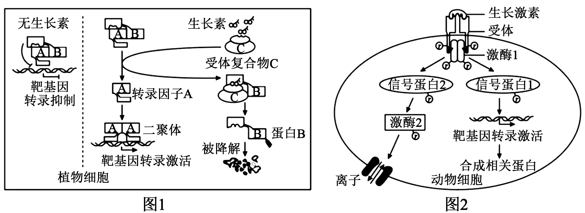
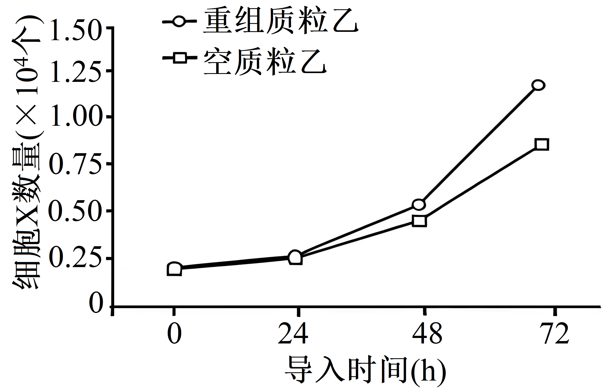

**2025年海南高考试题**

**一、单选题**

1\. 尖孢镰刀菌是一种土传病原真菌，可分泌相关致病蛋白引起瓜菜枯萎病。下列有关尖孢镰刀菌的叙述，错误的是（ ）

A. 具有细胞壁，可抵抗土壤机械压力 B. 具有细胞膜，能选择性吸收环境中营养物质

C. 具有内质网，能加工致病蛋白 D. 具有拟核，没有染色质，不能进行有丝分裂

2\. 极低密度脂蛋白是肝细胞分泌的一种脂蛋白复合物其中磷脂分子形成球形小体，表面镶嵌载脂蛋白，内部包裹胆固醇、甘油三酯等脂质分子。下列有关叙述错误的是（ ）

A. 极低密度脂蛋白的所有脂质分子只含C、H、O三种元素 B. 合成载脂蛋白的场所是核糖体

C. 肝细胞通过胞吐方式分泌极低密度脂蛋白 D. 极低密度脂蛋白可为肝外组织细胞提供能量

3\. 叶片遭受虫害时，植物细胞产生并释放的一类脂溶性小分子有机物茉莉素可作为信号分子诱导植物启动防御机制，如诱导表皮毛形成，以增强抗虫性。下列有关叙述正确的是（ ）

A. 茉莉素通过主动运输进入细胞

B. 细胞产生的茉莉素传递给邻近细胞，体现了细胞间的信息交流

C. 茉莉素可直接催化表皮毛细胞壁的纤维素合成

D. 茉莉素诱导植物启动防御机制与细胞核的功能无关

4\. 红树林是潮间带的重要生态系统，为候鸟提供了越冬场所。红树林中存在许多奇特生物，如分布于海南东寨港红树林的白边侧足海天牛吸食绿藻后，能留存叶绿体在自身细胞中进行光合作用。下列有关叙述正确的是（ ）

A. 红树林的物种组成和空间结构无季节性变化 B. 东寨港的所有红树植物组成一个种群

C. 常被水淹的红树植物生长不受水分限制 D. 白边侧足海天牛在生态系统中既是生产者也是消费者

5\. 山兰酒以海南山兰早稻米为原料 添加酒曲，经传统发酵酿造而成，发酵结束后快速冷却酒液并过滤，可获得风味独特的清澈酒体。米熟化的均匀度、发酵温度均会影响酒的品质。下列有关叙述错误的是（ ）

A. 酿造山兰酒所使用的酒曲为单一菌种

B. 充分蒸熟山兰米有利于淀粉糖化，为酵母菌提供更多的原料

C. 适宜的发酵温度有利于提高酶的活性，进而提高酒的产量

D. 快速冷却有利于保留酒液中易挥发的风味物质

6\. 孟德尔发现豌豆果荚的颜色和形状是两对独立遗传性状，某团队解析这两对性状显隐性分子机制时，发现绿荚（G）与黄荚（g）基因序列完全相同，但基因g的上游缺失一段DNA，导致其转录产物结构异常；果荚饱满（R）和皱缩（r）的基因序列存在一个碱基对的不同，使基因r翻译提前终止。下列有关叙述错误的是（ ）

A. 豌豆中基因G和g序列完全相同，两者指导合成的蛋白质结构和功能也相同

B. 豌豆基因组特定序列的变化导致基因g转录产物结构异常，出现黄荚性状

C. 与基因R相比，基因r表达的肽链缩短，可导致果荚皱缩

D. G和g、R和r这两对等位基因的遗传遵循自由组合定律

7\. 研究人员比较某家畜驯化种群和野生种群的基因组，发现该物种在驯化过程中积累了很多具有新功能的突变基因，人工选择是其主要驱动因素。下列有关叙述错误的是（ ）

A. 基因突变是物种进化的重要基础

B. 所有驯化个体和野生个体的全部基因共同组成该物种种群的基因库

C. 出现新功能的突变基因是人工选择的结果

D. 驯化种群和野生种群都受自然选择的作用

8\. 某团队研究了水淹对植物A根系呼吸作用的影响，结果如图。下列有关叙述正确的是（ ）

A. 图中两种酶的催化反应均发生在线粒体中

B. 图中水淹时间越长，植物A根系的无氧呼吸速率越慢

C. 水淹时，植物A根系的无氧呼吸既产生酒精，又产生乳酸

D. 图中酶促反应产生的ATP逐渐增加

9\. 某团队从一养蛇人所捐献的血样中，利用现代生物技术获得两种具有抗蛇毒能力的单克隆抗体，用于治疗毒蛇咬伤，效果良好。下列有关叙述错误的是（ ）

A. 若同种蛇毒再次进入该养蛇人体内，则其血液中抗蛇毒抗体的含量会增加

B. 该养蛇人体内抗蛇毒抗体的产生与B细胞有关，与T细胞无关

C. 抗蛇毒抗体能与蛇毒中的特定抗原结合，体现了抗体作用的特异性

D. 这两种单克隆抗体在体内结合蛇毒抗原后，可被免疫细胞吞噬

10\. 研究发现，小鼠肾脏细胞能表达嗅觉受体，受体A被激活会增加醛固酮的释放，受体B被激活可增加蛋白C的表达，蛋白C可促进肾小管中葡萄糖的重吸收。下列有关叙述正确的是（ ）

A. 激活受体A可导致小鼠血钠降低 B. 抑制受体A可导致小鼠尿量减少

C. 抑制受体B可导致小鼠血糖降低 D. 同时激活受体A和B可导致小鼠的血浆渗透压降低

11\. 花盆蛇（钩盲蛇）为孤雌生殖物种。某团队通过基因组测序结果，推测出花盆蛇原始生殖细胞产生子细胞的两种模型，如图。下列有关叙述正确的是（ ）

A. 图中出现的基因重组是花盆蛇变异来源之一，该过程仅发生在第1次分裂

B. 图中，原始生殖细胞产生4个子细胞的过程中，染色体复制两次，细胞分裂两次

C. 模型①产生的4个子细胞与体细胞含有不同的染色体数目

D. 模型②产生的4个子细胞具有相同的遗传组成

12\. 为探究脱落酸对某作物受低温胁迫的缓解效应，研究人员用不同浓度（浓度1~3依次增加）的脱落酸处理该作物一定时间后，置于低温下培养5天，测定生物量和细胞膜受损程度，结果如图。下列有关叙述错误的是（ ）

A. 与对照1相比，对照2的结果说明低温对该作物造成了胁迫

B. 与对照 2相比，脱落酸可增加该作物在低温下有机物的积累

C. 与对照 2相比，脱落酸可降低该作物在低温下细胞膜的稳定性

D. 3个浓度中，浓度1的脱落酸最有利于缓解低温对该作物造成的胁迫

13\. 某小组模拟赫尔希和蔡斯的T2噬菌体侵染大肠杆菌实验时，应用假说-演绎法推测出①~⑥种假设，如图。下列有关叙述错误的是（ ）

A. 实验1中，若离心后上清液的放射性高，沉淀物的放射性极低，则说明仅假设②正确

B. 实验2中，若离心后上清液的放射性极低，沉淀物的放射性高，则说明仅假设⑤正确

C. 若实验1子代噬菌体无放射性、实验2子代的部分菌体有放射性，则说明噬菌体的遗传物质是DNA

D. 若用35S和32P同时标记的噬菌体进行实验，则离心后上清液和沉淀物均有放射性

14\. 海南热带雨林国家公园内分布着大量的野茶。某团队采用样方法（20m×20m）调查该国家公园4个野茶种群，结果见表。下列有关叙述错误的是（ ）

<table style="width:90%;">
<colgroup>
<col style="width: 26%" />
<col style="width: 26%" />
<col style="width: 9%" />
<col style="width: 9%" />
<col style="width: 9%" />
<col style="width: 9%" />
</colgroup>
<tbody>
<tr>
<td colspan="2" style="text-align: left;">分布区</td>
<td style="text-align: left;">鹦哥岭</td>
<td style="text-align: left;">霸王岭</td>
<td style="text-align: left;">黎母山</td>
<td style="text-align: left;">吊罗山</td>
</tr>
<tr>
<td rowspan="3" style="text-align: left;">各年龄级个体数量（株）</td>
<td style="text-align: left;">繁殖前期（幼苗、幼树）</td>
<td style="text-align: left;">918</td>
<td style="text-align: left;">158</td>
<td style="text-align: left;">274</td>
<td style="text-align: left;">25</td>
</tr>
<tr>
<td style="text-align: left;">繁殖期（中树、大树）</td>
<td style="text-align: left;">156</td>
<td style="text-align: left;">16</td>
<td style="text-align: left;">13</td>
<td style="text-align: left;">0</td>
</tr>
<tr>
<td style="text-align: left;">繁殖后期（老树）</td>
<td style="text-align: left;">3</td>
<td style="text-align: left;">0</td>
<td style="text-align: left;">0</td>
<td style="text-align: left;">0</td>
</tr>
<tr>
<td colspan="2" style="text-align: left;">总数（株）</td>
<td style="text-align: left;">1077</td>
<td style="text-align: left;">174</td>
<td style="text-align: left;">287</td>
<td style="text-align: left;">25</td>
</tr>
<tr>
<td colspan="2" style="text-align: left;">样方数（个）</td>
<td style="text-align: left;">24</td>
<td style="text-align: left;">5</td>
<td style="text-align: left;">4</td>
<td style="text-align: left;">3</td>
</tr>
</tbody>
</table>

A. 该国家公园野茶种群年龄结构整体呈增长型

B. 4个分布区的种群密度呈现黎母山\>鹦哥岭\>霸王岭\>吊罗山

C. 据表推测，短期内吊罗山种群的增长潜力最低

D. 据表分析，最有利于维持出生率的是霸王岭种群

15\. 鸡黑羽（B）和麻羽（b）的基因位于常染色体，鸡胫白色（A）和黑色（a）的基因位于Z染色体。黑羽黑胫公鸡和黑羽白胫母鸡交配，产生的F1中黑羽：麻羽=3：1 。剔除F1中的麻羽鸡后，剩余的F1个体随机交配得到F2。下列有关叙述正确的是（ ）

A. F2 的黑羽个体中纯合子占4/9 B. F2 中b、Za的基因频率分别为1/3、1/2

C. F2 中黑羽黑胫母鸡的比例是2/9 D. F1 、F2的基因型分别为4种、12种

**二、非选择题**

16\. 三角梅为海南的省花，其特化的苞片（变态叶）酷似花瓣，色彩丰富，被广泛用于园林绿化。回答下列问题。

（1）人工培育三角梅通常采用无性繁殖技术，其中传统技术有\_\_\_\_\_，现代生物技术有\_\_\_\_\_（各答1种即可）。

（2）三角梅苞片呈现红、粉、白等多种颜色，其原因之一是苞片细胞中含有不同的色素，这些色素主要分布在\_\_\_\_\_（填细胞器名称）。

（3）某团队研究了不同补光光源对三角梅叶片总叶绿素含量及开花数量的影响，补光时间为20：00~24：00，同一光照强度连续补光20天，处理后45天测定相关指标，结果见表。

|              |       |        |        |       |
|:------------ |:----- |:------ |:------ |:----- |
| 测定指标         | 对照    | 紫光     | 红光     | 白光    |
| 总叶绿素含量（mg/g） | 16.28 | 29.92  | 21.56  | 21.52 |
| 开花数（朵/株）     | 23.83 | 171.17 | 104.33 | 47.83 |

据表判断，三种补光光源中，最有利于三角梅开花的光源是\_\_\_\_\_，从光合作用角度分析其原因是\_\_\_\_\_。

（4）某小组为探究补光光源A和水溶性激素B同时作用对三角梅开花数量的影响，开展了如下实验，

<table>
<colgroup>
<col style="width: 9%" />
<col style="width: 26%" />
<col style="width: 9%" />
<col style="width: 54%" />
</colgroup>
<tbody>
<tr>
<td style="text-align: left;">组别</td>
<td style="text-align: left;">处理条件</td>
<td style="text-align: left;">开花数</td>
<td style="text-align: left;">实验目的或结论</td>
</tr>
<tr>
<td style="text-align: left;">对照组</td>
<td style="text-align: left;">无处理</td>
<td style="text-align: left;">+</td>
<td style="text-align: left;">作为对照。</td>
</tr>
<tr>
<td style="text-align: left;">实验组1</td>
<td style="text-align: left;">补充光源A</td>
<td style="text-align: left;">++</td>
<td style="text-align: left;">与对照组相比，表明补充光源A有利于开花。</td>
</tr>
<tr>
<td style="text-align: left;">实验组2</td>
<td style="text-align: left;">喷施激素B溶液</td>
<td style="text-align: left;">+++</td>
<td style="text-align: left;">与对照组和实验组1相比，表明①_____。</td>
</tr>
<tr>
<td style="text-align: left;">实验组3</td>
<td style="text-align: left;">②_____</td>
<td style="text-align: left;">++</td>
<td style="text-align: left;">与实验组1相比，表明喷施激素B溶液的溶剂对开花无影响。</td>
</tr>
<tr>
<td style="text-align: left;">实验组4</td>
<td style="text-align: left;">补充光源A+喷施激素B溶液</td>
<td style="text-align: left;">+++++</td>
<td style="text-align: left;">与实验组1和实验组2相比，表明③_____。</td>
</tr>
<tr>
<td colspan="4" style="text-align: left;">结论：补光光源A和水溶性激素B对三角梅开花数量的影响具有④_____作用。</td>
</tr>
</tbody>
</table>

17\. 动、植物生命活动均受激素调节。植物生长素和动物生长激素通过一系列过程发挥生物学效应（如图1和图2），调节个体生长。

（1）用蛋白酶分别处理生长素和生长激素，失去活性的是\_\_\_\_\_。

（2）生长素在植物幼嫩组织中的运输方式是\_\_\_\_\_，生长激素在动物体内的运输方式是\_\_\_\_\_。

（3）图1中，若受体复合物C结合生长素的功能丧失，则生长素调控的靶基因转录无法被激活，理由是\_\_\_\_\_。

（4）图2中，被激活的信号蛋白1和信号蛋白2通过不同的信号通路发挥生物学效应，发挥效应较快的信号蛋白是\_\_\_\_\_，原因是\_\_\_\_\_。

（5）据图1和图2可知，生长素和生长激素在发挥生物学效应的过程中具有相似性，主要表现在\_\_\_\_\_（答出2点即可）。

18\. 我国利用航天优势开展玉米诱变育种，获得多个雄性不育突变体和矮秆突变体。回答下列问题。

（1）研究人员将玉米种子随机分为两份，一份送到太空，另一份保存在地面种子站，其目的是\_\_\_\_\_。太空诱变可导致一个基因发生不同的突变获得相关突变体，这说明基因突变具有的特点是\_\_\_\_\_。

（2）将雄性不育植株P1（aa）与可育植株P2（AA）杂交得到F1，F1自交得到F2。利用PCR技术分别扩增植株P1和P2的SSR（染色体上特定DNA序列），分别获得100 bp和135 bp的产物。若同样扩增F2，则F2中同时获得100 bp和135 bp的植株比例为\_\_\_\_\_。

（3）甲是太空诱变获得的雄性不育株，乙是同群体某一可育株。某团队开展以下2个实验：

|     |       |
|:--- |:----- |
| 实验① | 甲与乙杂交 |
| 实验② | 乙自交   |

根据实验①和②的结果，得出雄性不育性状是隐性性状的结论，支持这一结论的实验结果是\_\_\_\_\_。

（4）已知玉米株高和育性这两对性状独立遗传，可育对不育为显性，但高秆和矮秆的显隐性未知。现有纯合的高秆可育、高秆不育和矮秆可育品系，合理选用这些材料，通过育种技术培育纯合矮秆不育品系的实验思路是\_\_\_\_\_。

19\. 坡垒是海南热带雨林的标志性物种，现存野生种群个体数量极少且多为老树，已列为国家一级保护野生植物，目前海南已成功实现坡垒的人工繁育，在多地形成人工林，已知坡垒幼苗随着苗龄增加需光性增强。回答下列问题。

（1）为了精准统计坡垒野生种群的个体数量，应采用的调查方法是\_\_\_\_\_。

（2）在调查坡垒的生态位时，除了调查其自身特征外，还需要调查与其他物种的\_\_\_\_\_。

（3）热带雨林素有“热带密林”之称，森林下层直射光呈不连续分布，这会影响群落的\_\_\_\_\_ 结构，导致耐荫性较差的草本植物种群呈现 \_\_\_\_\_ 分布。海南热带雨林中现存坡垒野生种群更新困难，从坡垒自身生长习性角度分析其原因\_\_\_\_\_ 。

（4）碳库是生态系统的总碳储量。森林生态系统的碳库以有机碳为主。坡垒可增加热带雨林的碳库，从物质循环角度分析，坡垒在热带雨林中存储并输送有机碳的方式有\_\_\_\_\_ （答出2点即可）。

（5）为促进海南热带雨林国家公园内坡垒种群恢复，除了采取提高遗传多样性的措施外，还可采取的合理措施有\_\_\_\_\_ （答出2点即可）。

20\. 绵羊的羊毛长度与毛囊细胞的增殖有关，毛囊细胞中表达的基因Z可能是调控羊毛长度的关键基因。某团队利用基因工程技术，探究了基因Z对绵羊毛囊细胞X增殖的影响。回答下列问题。

（1）质粒甲保存有目的基因Z，如图。质粒乙有4种限制酶的酶切位点，识别序列见表。现需将质粒甲中的基因Z插入质粒乙中，构建重组质粒乙用于研究，须用的限制酶是\_\_\_\_\_和\_\_\_\_\_。

|       |             |
|:----- |:----------- |
| 限制酶   | 识别序列(5＇-3＇) |
| EcoRⅠ | GAATTC      |
| SalⅠ  | GTCGAC      |
| BglⅡ  | AGATCT      |
| XhoⅠ  | CTCGAG      |

（2）细胞X是一种贴壁细胞，可用\_\_\_\_\_（填“固体”或“液体”）培养基培养。在进行传代培养时，需使用胰蛋白酶并置于37℃环境中处理，理由是\_\_\_\_\_。

（3）将空质粒乙和重组质粒乙分别导入细胞X，导入后测定不同时间的细胞数量，结果如图。根据实验结果说明基因Z的表达对细胞增殖有\_\_\_\_\_作用，且随导入时间推移，增殖速率\_\_\_\_\_。

（4）siRNA是一种短的双链RNA，能引导内切核酸酶切割靶基因的mRNA。

①人工合成靶向基因Z的siRNA，将其导入细胞X作为实验组，同时设置对照组，将\_\_\_\_\_导入细胞X。一段时间后，发现实验组细胞数量少于对照组。该实验的目的是探究基因Z的\_\_\_\_\_对细胞X增殖的影响。

②为检测靶向基因Z的siRNA导入细胞X后能否发挥作用，简要写出在分子水平上检测的2种实验思路是：\_\_\_\_\_。
