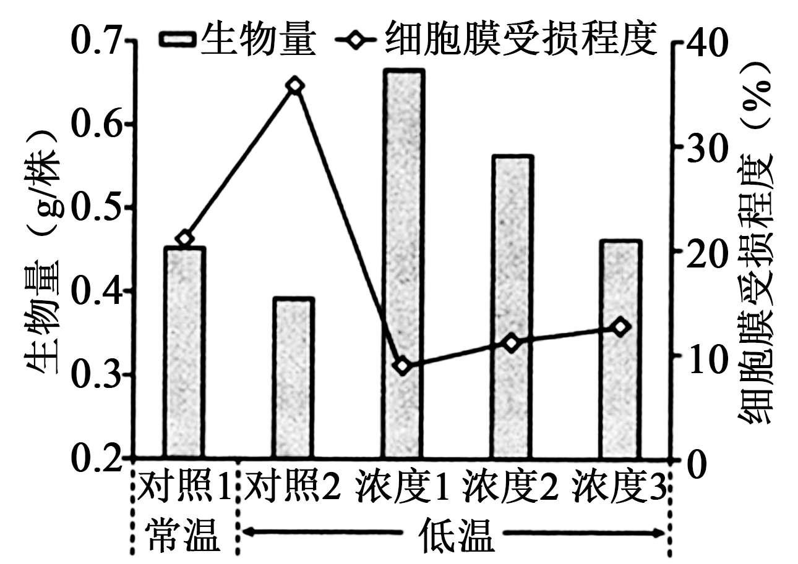
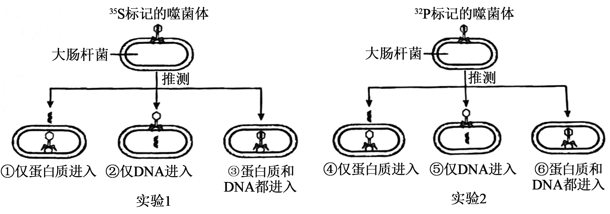

**2025年海南高考试题**

**一、单选题**

1\. 尖孢镰刀菌是一种土传病原真菌，可分泌相关致病蛋白引起瓜菜枯萎病。下列有关尖孢镰刀菌的叙述，错误的是（ ）

A. 具有细胞壁，可抵抗土壤机械压力 B. 具有细胞膜，能选择性吸收环境中营养物质

C. 具有内质网，能加工致病蛋白 D. 具有拟核，没有染色质，不能进行有丝分裂

【答案】D

【解析】

【详解】A、真菌具有细胞壁，主要成分为几丁质，能提供保护并抵抗土壤机械压力，A正确；

B、真菌具有细胞膜，具有选择透过性，能选择性吸收环境中的营养物质，B正确；

C、真菌作为真核生物，具有内质网等细胞器，内质网参与蛋白质的加工和运输，题干中提及尖孢镰刀菌分泌致病蛋白，C正确；

D、真菌是真核生物，具有由核膜包裹的细胞核，内含染色质（DNA和蛋白质复合物），并能进行有丝分裂；拟核是原核生物（如细菌）的特征，D错误。

故选D。

2\. 极低密度脂蛋白是肝细胞分泌的一种脂蛋白复合物其中磷脂分子形成球形小体，表面镶嵌载脂蛋白，内部包裹胆固醇、甘油三酯等脂质分子。下列有关叙述错误的是（ ）

A. 极低密度脂蛋白的所有脂质分子只含C、H、O三种元素 B. 合成载脂蛋白的场所是核糖体

C. 肝细胞通过胞吐方式分泌极低密度脂蛋白 D. 极低密度脂蛋白可为肝外组织细胞提供能量

【答案】A

【解析】

【详解】A、极低密度脂蛋白中的脂质分子包括甘油三酯（只含C、H、O）、胆固醇（只含C、H、O）和磷脂（如磷脂酰胆碱，含有C、H、O、P、N元素）。磷脂分子含有P和N元素，因此并非所有脂质分子只含C、H、O三种元素，A错误；

B、载脂蛋白是蛋白质，蛋白质合成的场所是核糖体，B正确；

C、极低密度脂蛋白是大分子复合物，肝细胞通过胞吐（外排）方式将其分泌出细胞，该过程依赖囊泡运输，C正确；

D、极低密度脂蛋白内部包裹甘油三酯等脂质，甘油三酯在肝外组织细胞（如脂肪细胞、肌肉细胞）中可被脂肪酶分解为甘油和脂肪酸，进入呼吸作用氧化供能，因此可为肝外组织细胞提供能量，D正确。

故选A。

3\. 叶片遭受虫害时，植物细胞产生并释放的一类脂溶性小分子有机物茉莉素可作为信号分子诱导植物启动防御机制，如诱导表皮毛形成，以增强抗虫性。下列有关叙述正确的是（ ）

A. 茉莉素通过主动运输进入细胞

B. 细胞产生的茉莉素传递给邻近细胞，体现了细胞间的信息交流

C. 茉莉素可直接催化表皮毛细胞壁的纤维素合成

D. 茉莉素诱导植物启动防御机制与细胞核的功能无关

【答案】B

【解析】

【详解】A、茉莉素是脂溶性小分子有机物，可通过自由扩散（被动运输的一种）直接穿过细胞膜的磷脂双分子层进入细胞，无需载体蛋白和能量，因此不属于主动运输，A错误；

B、茉莉素由植物细胞产生并释放后，传递给邻近细胞，与靶细胞上的特异性受体结合，触发细胞内信号转导途径，从而调控防御反应，这体现了细胞间的信息交流（如化学信号传递），B正确；

C、茉莉素作为信号分子，其功能是传递信息并调控基因表达或代谢活动，而非直接催化化学反应；催化纤维素合成需依赖纤维素合酶等酶的作用，因此茉莉素不能直接催化该过程，C错误；

D、茉莉素诱导的防御机制（如诱导表皮毛形成）涉及基因的选择性表达，该过程需在细胞核内完成转录（如合成相关mRNA）和调控，因此与细胞核的功能（如遗传信息储存和表达）密切相关，D错误。

故选B。

4\. 红树林是潮间带的重要生态系统，为候鸟提供了越冬场所。红树林中存在许多奇特生物，如分布于海南东寨港红树林的白边侧足海天牛吸食绿藻后，能留存叶绿体在自身细胞中进行光合作用。下列有关叙述正确的是（ ）

A. 红树林的物种组成和空间结构无季节性变化 B. 东寨港的所有红树植物组成一个种群

C. 常被水淹的红树植物生长不受水分限制 D. 白边侧足海天牛在生态系统中既是生产者也是消费者

【答案】D

【解析】

【详解】A、红树林位于潮间带，受潮汐、季节变化（如温度、降水、候鸟迁徙）影响，物种组成（如鸟类、植物）和空间结构（如垂直分层）会发生季节性变化，A错误；

B、种群指同一时间、同一区域内同种生物个体的总和。东寨港的红树植物包括多个物种，不属于同一物种，因此不能组成一个种群，B错误；

C、水分是红树植物生长的限制因子，尽管红树植物通过气生根等适应机制耐受水淹，但长期水淹会导致缺氧，影响其生长和分布，C错误；

D、白边侧足海天牛吸食绿藻（异养行为，属于消费者），同时能保留叶绿体进行光合作用（自养行为，属于生产者），因此在生态系统中既是生产者也是消费者，D正确。

故选D。

5\. 山兰酒以海南山兰早稻米为原料 添加酒曲，经传统发酵酿造而成，发酵结束后快速冷却酒液并过滤，可获得风味独特的清澈酒体。米熟化的均匀度、发酵温度均会影响酒的品质。下列有关叙述错误的是（ ）

A. 酿造山兰酒所使用的酒曲为单一菌种

B. 充分蒸熟山兰米有利于淀粉糖化，为酵母菌提供更多的原料

C. 适宜的发酵温度有利于提高酶的活性，进而提高酒的产量

D. 快速冷却有利于保留酒液中易挥发的风味物质

【答案】A

【解析】

【详解】A、酒曲在传统发酵中通常含有多种微生物，如霉菌（如根霉、曲霉）负责淀粉糖化，酵母菌负责酒精发酵，并非单一菌种，A错误；

B、充分蒸熟山兰米可使淀粉糊化，便于酶（如淀粉酶）将其分解为葡萄糖等还原糖，为酵母菌发酵提供更多底物，B正确；

C、发酵过程中，酶的活性受温度影响，适宜温度能提高酶促反应速率，促进酵母菌的酒精发酵，从而提高酒的产量，C正确；

D、快速冷却可降低温度，减少酒液中易挥发的风味物质（如酯类）的损失，有助于保留独特风味，D正确。

故选A。

6\. 孟德尔发现豌豆果荚的颜色和形状是两对独立遗传性状，某团队解析这两对性状显隐性分子机制时，发现绿荚（G）与黄荚（g）基因序列完全相同，但基因g的上游缺失一段DNA，导致其转录产物结构异常；果荚饱满（R）和皱缩（r）的基因序列存在一个碱基对的不同，使基因r翻译提前终止。下列有关叙述错误的是（ ）

A. 豌豆中基因G和g序列完全相同，两者指导合成的蛋白质结构和功能也相同

B. 豌豆基因组特定序列的变化导致基因g转录产物结构异常，出现黄荚性状

C. 与基因R相比，基因r表达的肽链缩短，可导致果荚皱缩

D. G和g、R和r这两对等位基因的遗传遵循自由组合定律

【答案】A

【解析】

【详解】A、 题干指出基因G和g序列完全相同，但基因g上游缺失一段DNA导致转录产物结构异常，这会影响mRNA的正常形成，进而可能使翻译出的蛋白质结构或功能异常，因此，两者指导合成的蛋白质结构和功能不一定相同，A错误；

B、 基因g上游缺失DNA片段属于基因组特定序列的变化，该变化导致转录产物结构异常，从而表现黄荚性状，B正确；

C、基因r因一个碱基对差异使翻译提前终止（即发生无义突变），导致表达的肽链缩短，影响蛋白质功能，最终引起果荚皱缩，C正确；

D、题干明确说明果荚颜色和形状是“两对独立遗传性状”，根据孟德尔自由组合定律，控制不同性状的独立遗传的等位基因（如G/g和R/r）在遗传时遵循自由组合定律，D正确；

故选A。

7\. 研究人员比较某家畜驯化种群和野生种群的基因组，发现该物种在驯化过程中积累了很多具有新功能的突变基因，人工选择是其主要驱动因素。下列有关叙述错误的是（ ）

A. 基因突变是物种进化的重要基础

B. 所有驯化个体和野生个体的全部基因共同组成该物种种群的基因库

C. 出现新功能的突变基因是人工选择的结果

D. 驯化种群和野生种群都受自然选择的作用

【答案】C

【解析】

【详解】A、基因突变能够产生新基因，为生物进化提供原材料，是物种进化的重要基础，A正确；

B、一个种群中全部个体所含有的全部基因，叫做这个种群的基因库，所以所有驯化个体和野生个体的全部基因共同组成该物种种群的基因库，B正确；

C、出现新功能的突变基因是基因突变的结果，而不是人工选择的结果，人工选择是对突变基因产生后所表现出的性状进行选择，C错误；

D、驯化种群和野生种群所处的环境存在差异，都受自然选择的作用，D正确。

故选C。

8\. 某团队研究了水淹对植物A根系呼吸作用的影响，结果如图。下列有关叙述正确的是（ ）

A. 图中两种酶的催化反应均发生在线粒体中

B. 图中水淹时间越长，植物A根系的无氧呼吸速率越慢

C. 水淹时，植物A根系的无氧呼吸既产生酒精，又产生乳酸

D. 图中酶促反应产生的ATP逐渐增加

【答案】C

【解析】

【详解】A、乙醇脱氢酶和乳酸脱氢酶均为无氧呼吸所需的酶，无氧呼吸的场所是细胞质基质，因此图中两种酶的催化反应均发生在细胞质基质中，A错误；

B、结合图示分析，水淹一定时间内，乙醇脱氢酶和乳酸脱氢酶比活力在增大，说明水淹时间越长，植物A根系的无氧呼吸速率越快，B错误；

C、结合图示可知，植物A根系呼吸作用过程中涉及乳酸脱氢酶和乙醇脱氢酶，说明水淹时，植物A根系的无氧呼吸既产生酒精，又产生乳酸，C正确；

D、图中所示的两种酶参与的是无氧呼吸的第二阶段，该阶段没有ATP产生，D错误。

故选C。

9\. 某团队从一养蛇人所捐献的血样中，利用现代生物技术获得两种具有抗蛇毒能力的单克隆抗体，用于治疗毒蛇咬伤，效果良好。下列有关叙述错误的是（ ）

A. 若同种蛇毒再次进入该养蛇人体内，则其血液中抗蛇毒抗体的含量会增加

B. 该养蛇人体内抗蛇毒抗体的产生与B细胞有关，与T细胞无关

C. 抗蛇毒抗体能与蛇毒中的特定抗原结合，体现了抗体作用的特异性

D. 这两种单克隆抗体在体内结合蛇毒抗原后，可被免疫细胞吞噬

【答案】B

【解析】

【详解】A、若同种蛇毒再次进入该养蛇人体内，由于免疫记忆的存在，记忆B细胞会迅速活化、增殖并分化为浆细胞，导致抗体分泌量增加，因此血液中抗蛇毒抗体的含量会升高，A正确；

B、抗蛇毒抗体的产生涉及体液免疫过程，抗原呈递细胞处理蛇毒抗原后，将抗原信息传递给辅助性T细胞，辅助性T细胞激活B细胞，B细胞分化为浆细胞产生抗体。因此，抗体的产生与T细胞密切相关，B错误；

C、抗体具有特异性，只能与特定抗原结合，抗蛇毒抗体专一性地识别蛇毒中的抗原成分，体现了抗体作用的特异性，C正确；

D、单克隆抗体在体内与蛇毒抗原结合后，形成抗原-抗体复合物，该复合物可被吞噬细胞（如巨噬细胞）识别并吞噬清除，D正确。

故选B。

10\. 研究发现，小鼠肾脏细胞能表达嗅觉受体，受体A被激活会增加醛固酮的释放，受体B被激活可增加蛋白C的表达，蛋白C可促进肾小管中葡萄糖的重吸收。下列有关叙述正确的是（ ）

A. 激活受体A可导致小鼠血钠降低 B. 抑制受体A可导致小鼠尿量减少

C. 抑制受体B可导致小鼠血糖降低 D. 同时激活受体A和B可导致小鼠的血浆渗透压降低

【答案】C

【解析】

【详解】A、激活受体A会增加醛固酮释放，醛固酮促进肾小管对钠离子的重吸收，导致血钠升高，而非降低，A错误；

B、抑制受体A会减少醛固酮释放，醛固酮减少导致钠离子重吸收减弱，进而减少水的重吸收，尿量增加，B错误；

C、抑制受体B会减少蛋白C表达，蛋白C减少导致肾小管对葡萄糖的重吸收减弱，更多葡萄糖随尿排出，血糖降低，C正确；

D、同时激活受体A和B：受体A激活增加醛固酮释放，促进钠离子重吸收，血钠升高；受体B激活增加蛋白C表达，促进葡萄糖重吸收，血糖升高；两者均使血浆溶质浓度增加，血浆渗透压升高，D错误。

故选C

11\. 花盆蛇（钩盲蛇）为孤雌生殖物种。某团队通过基因组测序结果，推测出花盆蛇原始生殖细胞产生子细胞的两种模型，如图。下列有关叙述正确的是（ ）

A. 图中出现的基因重组是花盆蛇变异来源之一，该过程仅发生在第1次分裂

B. 图中，原始生殖细胞产生4个子细胞的过程中，染色体复制两次，细胞分裂两次

C. 模型①产生的4个子细胞与体细胞含有不同的染色体数目

D. 模型②产生的4个子细胞具有相同的遗传组成

【答案】B

【解析】

【详解】A、图示为花盆蛇细胞减数分裂过程，结合图示可知，由于发生了交叉互换，第1次分裂和第2次分裂均发生了基因重组，A错误；

B、结合图示，从原始生殖细胞到复制之后的细胞可知，染色体复制了两次，随后进行了第1次分裂和第2次分裂，因此原始生殖细胞产生4个子细胞的过程中，染色体复制两次，细胞分裂两次，B正确；

C、如图所示，模型①通过两次分裂，最终产生的子细胞中染色体数目和原始生殖细胞中染色体数目相同，都是2条，C错误；

D、模型②产生的4个子细胞，其中两个子细胞染色体为黑色，另外两个子细胞染色体为灰色，灰色和黑色的染色体上的基因有差异，因此模型②产生的4个子细胞的遗传组成不相同，D错误。

故选B。

12\. 为探究脱落酸对某作物受低温胁迫的缓解效应，研究人员用不同浓度（浓度1~3依次增加）的脱落酸处理该作物一定时间后，置于低温下培养5天，测定生物量和细胞膜受损程度，结果如图。下列有关叙述错误的是（ ）

A. 与对照1相比，对照2的结果说明低温对该作物造成了胁迫

B. 与对照 2相比，脱落酸可增加该作物在低温下有机物的积累

C. 与对照 2相比，脱落酸可降低该作物在低温下细胞膜的稳定性

D. 3个浓度中，浓度1的脱落酸最有利于缓解低温对该作物造成的胁迫

【答案】C

【解析】

【详解】A、对照1是常温处理，对照2是低温处理，与对照1相比，对照2的生物量减少、细胞膜受损程度升高，说明低温对作物造成了胁迫，A正确；

B、与对照2（低温无脱落酸处理）相比，脱落酸处理组的生物量更高，说明脱落酸可增加低温下有机物的积累，B正确；

C、与对照2相比，脱落酸处理组的细胞膜受损程度降低，说明脱落酸提高了细胞膜的稳定性（而非降低），C错误；

D、3个浓度中，浓度1处理组的生物量最高、细胞膜受损程度最低，说明浓度1的脱落酸最有利于缓解低温胁迫，D正确。

故选C。

13\. 某小组模拟赫尔希和蔡斯的T2噬菌体侵染大肠杆菌实验时，应用假说-演绎法推测出①~⑥种假设，如图。下列有关叙述错误的是（ ）

A. 实验1中，若离心后上清液的放射性高，沉淀物的放射性极低，则说明仅假设②正确

B. 实验2中，若离心后上清液的放射性极低，沉淀物的放射性高，则说明仅假设⑤正确

C. 若实验1子代噬菌体无放射性、实验2子代的部分菌体有放射性，则说明噬菌体的遗传物质是DNA

D. 若用35S和32P同时标记的噬菌体进行实验，则离心后上清液和沉淀物均有放射性

【答案】B

【解析】

【详解】A、实验1中，35S标记的是噬菌体蛋白质，若离心后上清液的放射性高，沉淀物的放射性极低，则说明仅假设②正确，即噬菌体侵染细菌时只有蛋白质进入，A正确；

B、实验2中，32P标记的是噬菌体DNA，若离心后上清液的放射性极低，沉淀物的放射性高，则说明仅假设⑤⑥正确。即噬菌体侵染细菌时只有DNA进入或噬菌体的DNA和蛋白质均进入，B错误；

C、若实验1子代噬菌体无放射性，说明蛋白质没有实现亲子代之间的连续性，实验2子代的部分噬菌体有放射性说明亲子代之间有连续性的物质是DNA，则说明噬菌体的遗传物质是DNA，D正确；

D、若用35S和32P同时标记的噬菌体进行实验，则离心后上清液和沉淀物均有放射性，因为上清液中含有放射性标记的蛋白质，沉淀物中含有放射性标记的DNA,D正确。

故选B。

14\. 海南热带雨林国家公园内分布着大量的野茶。某团队采用样方法（20m×20m）调查该国家公园4个野茶种群，结果见表。下列有关叙述错误的是（ ）

<table style="width:90%;">
<colgroup>
<col style="width: 26%" />
<col style="width: 26%" />
<col style="width: 9%" />
<col style="width: 9%" />
<col style="width: 9%" />
<col style="width: 9%" />
</colgroup>
<tbody>
<tr>
<td colspan="2" style="text-align: left;">分布区</td>
<td style="text-align: left;">鹦哥岭</td>
<td style="text-align: left;">霸王岭</td>
<td style="text-align: left;">黎母山</td>
<td style="text-align: left;">吊罗山</td>
</tr>
<tr>
<td rowspan="3" style="text-align: left;">各年龄级个体数量（株）</td>
<td style="text-align: left;">繁殖前期（幼苗、幼树）</td>
<td style="text-align: left;">918</td>
<td style="text-align: left;">158</td>
<td style="text-align: left;">274</td>
<td style="text-align: left;">25</td>
</tr>
<tr>
<td style="text-align: left;">繁殖期（中树、大树）</td>
<td style="text-align: left;">156</td>
<td style="text-align: left;">16</td>
<td style="text-align: left;">13</td>
<td style="text-align: left;">0</td>
</tr>
<tr>
<td style="text-align: left;">繁殖后期（老树）</td>
<td style="text-align: left;">3</td>
<td style="text-align: left;">0</td>
<td style="text-align: left;">0</td>
<td style="text-align: left;">0</td>
</tr>
<tr>
<td colspan="2" style="text-align: left;">总数（株）</td>
<td style="text-align: left;">1077</td>
<td style="text-align: left;">174</td>
<td style="text-align: left;">287</td>
<td style="text-align: left;">25</td>
</tr>
<tr>
<td colspan="2" style="text-align: left;">样方数（个）</td>
<td style="text-align: left;">24</td>
<td style="text-align: left;">5</td>
<td style="text-align: left;">4</td>
<td style="text-align: left;">3</td>
</tr>
</tbody>
</table>

A. 该国家公园野茶种群年龄结构整体呈增长型

B. 4个分布区的种群密度呈现黎母山\>鹦哥岭\>霸王岭\>吊罗山

C. 据表推测，短期内吊罗山种群的增长潜力最低

D. 据表分析，最有利于维持出生率的是霸王岭种群

【答案】D

【解析】

【详解】A、年龄结构增长型表现为幼年个体（繁殖前期）比例高、老年个体（繁殖后期）比例低。计算国家公园整体数据：繁殖前期共1375株（918+158+274+25），繁殖期共185株（156+16+13+0），繁殖后期共3株（仅鹦哥岭），幼年个体占比约88%（1375/1563），远高于其他年龄级，符合增长型特征，A正确；

B、种群密度为单位面积个体数，样方面积相同（20m×20m=400m²），可比较每样方平均个体数：黎母山287÷4=71.75株/样方，鹦哥岭1077÷24≈44.88株/样方，霸王岭174÷5=34.8株/样方，吊罗山25÷3≈8.33株/样方，故密度顺序为黎母山＞鹦哥岭＞霸王岭＞吊罗山，B正确；

C、种群增长潜力取决于繁殖能力（繁殖期个体数量）。吊罗山繁殖期个体为0，无成熟繁殖能力；其繁殖前期仅25株，需较长时间生长才能繁殖，短期内无法新增个体。其他区域均有繁殖期个体（鹦哥岭156株、霸王岭16株、黎母山13株），故吊罗山增长潜力最低，C正确；

D、出生率主要由繁殖期个体数量及比例决定。霸王岭繁殖期仅16株，比例9.2%（16/174），数量及比例均低于鹦哥岭（繁殖期156株，比例14.5%）。鹦哥岭繁殖个体更多，更有利于维持当前出生率。霸王岭幼年个体虽多，但短期内无法贡献出生率，D错误。

故选D。

15\. 鸡黑羽（B）和麻羽（b）的基因位于常染色体，鸡胫白色（A）和黑色（a）的基因位于Z染色体。黑羽黑胫公鸡和黑羽白胫母鸡交配，产生的F1中黑羽：麻羽=3：1 。剔除F1中的麻羽鸡后，剩余的F1个体随机交配得到F2。下列有关叙述正确的是（ ）

A. F2 的黑羽个体中纯合子占4/9 B. F2 中b、Za的基因频率分别为1/3、1/2

C. F2 中黑羽黑胫母鸡的比例是2/9 D. F1 、F2的基因型分别为4种、12种

【答案】C

【解析】

【详解】A、F1中黑羽：麻羽=3：1。剔除F1中的麻羽鸡后，剩余的F1（1/3BB、2/3Bb）个体随机交配得到F2。F2中黑羽个体（基因型BB或Bb）占8/9，纯合子（BB）占4/9，所以黑羽个体中纯合子（BB）的比例为（4/9）÷（8/9）=1/2，A错误；

B、F2黑羽和麻羽中BB占4/9，Bb占4/9，bb占1/9，所以b的基因频率为bb+1/2Bb=1/3；关于Za，亲本中黑胫公鸡（ZaZa）和白胫母鸡（ZAW）交配，产生的F1中有白胫公鸡（ZAZa）和黑胫母鸡（ZaW），F1个体随机交配得到F2，F2鸡胫白色和黑色中1/4ZAZa、1/4ZaZa、1/4ZAW、1/4ZaW，所以Za的基因频率=Za/(ZA+Za)=（1+2+1）/（2+2+1+1）=2/3，B错误；

C、F2黑羽和麻羽中BB占4/9，Bb占4/9，bb占1/9，鸡胫白色和黑色中1/4ZAZa、1/4ZaZa、1/4ZAW、1/4ZaW，所以黑羽黑胫母鸡（B-ZaW）的比例=8/9×1/4=2/9，C正确；

D、F1的基因型共有6种（雄性麻羽或黑羽：bbZAZa、BbZAZa、BBZAZa；雌性麻羽或黑羽：bbZaW、BbZaW、BBZaW），不是4种；F2的基因型共有12种（雄性羽色3种×胫色2种（ZAZa或ZaZa）共6种；雌性羽色3种×胫色2种（ZAW或ZaW）共6种），D错误。

故选C。

**二、非选择题**

16\. 三角梅为海南的省花，其特化的苞片（变态叶）酷似花瓣，色彩丰富，被广泛用于园林绿化。回答下列问题。

（1）人工培育三角梅通常采用无性繁殖技术，其中传统技术有\_\_\_\_\_，现代生物技术有\_\_\_\_\_（各答1种即可）。

（2）三角梅苞片呈现红、粉、白等多种颜色，其原因之一是苞片细胞中含有不同的色素，这些色素主要分布在\_\_\_\_\_（填细胞器名称）。

（3）某团队研究了不同补光光源对三角梅叶片总叶绿素含量及开花数量的影响，补光时间为20：00~24：00，同一光照强度连续补光20天，处理后45天测定相关指标，结果见表。

|              |       |        |        |       |
|:------------ |:----- |:------ |:------ |:----- |
| 测定指标         | 对照    | 紫光     | 红光     | 白光    |
| 总叶绿素含量（mg/g） | 16.28 | 29.92  | 21.56  | 21.52 |
| 开花数（朵/株）     | 23.83 | 171.17 | 104.33 | 47.83 |

据表判断，三种补光光源中，最有利于三角梅开花的光源是\_\_\_\_\_，从光合作用角度分析其原因是\_\_\_\_\_。

（4）某小组为探究补光光源A和水溶性激素B同时作用对三角梅开花数量的影响，开展了如下实验，

<table>
<colgroup>
<col style="width: 9%" />
<col style="width: 26%" />
<col style="width: 9%" />
<col style="width: 54%" />
</colgroup>
<tbody>
<tr>
<td style="text-align: left;">组别</td>
<td style="text-align: left;">处理条件</td>
<td style="text-align: left;">开花数</td>
<td style="text-align: left;">实验目的或结论</td>
</tr>
<tr>
<td style="text-align: left;">对照组</td>
<td style="text-align: left;">无处理</td>
<td style="text-align: left;">+</td>
<td style="text-align: left;">作为对照。</td>
</tr>
<tr>
<td style="text-align: left;">实验组1</td>
<td style="text-align: left;">补充光源A</td>
<td style="text-align: left;">++</td>
<td style="text-align: left;">与对照组相比，表明补充光源A有利于开花。</td>
</tr>
<tr>
<td style="text-align: left;">实验组2</td>
<td style="text-align: left;">喷施激素B溶液</td>
<td style="text-align: left;">+++</td>
<td style="text-align: left;">与对照组和实验组1相比，表明①_____。</td>
</tr>
<tr>
<td style="text-align: left;">实验组3</td>
<td style="text-align: left;">②_____</td>
<td style="text-align: left;">++</td>
<td style="text-align: left;">与实验组1相比，表明喷施激素B溶液的溶剂对开花无影响。</td>
</tr>
<tr>
<td style="text-align: left;">实验组4</td>
<td style="text-align: left;">补充光源A+喷施激素B溶液</td>
<td style="text-align: left;">+++++</td>
<td style="text-align: left;">与实验组1和实验组2相比，表明③_____。</td>
</tr>
<tr>
<td colspan="4" style="text-align: left;">结论：补光光源A和水溶性激素B对三角梅开花数量的影响具有④_____作用。</td>
</tr>
</tbody>
</table>

【答案】（1） ①. 扞插、嫁接和压条 ②. 植物组织培养

（2）液泡或有色体 （3） ①. 紫光 ②. 三角梅在紫光补光下叶绿素含量高于红光和白光组，叶绿素含量高则光合速率强，产生更多的有机物，引起植物开花更多

（4） ①. 喷施激素B有利于开花，且开花数比补充光源A更有利于开花 ②. 喷施激素B溶液的溶剂+补充光源A ③. 补充光源A和施加激素B能相互促进，开更多的花 ④. 协同

【解析】

【分析】光合作用分为光反应阶段和暗反应阶段，光反应阶段发生在叶绿体类囊体薄膜，完成水的光解和ATP的合成，暗反应发生在叶绿体基质，完成二氧化碳的固定和三碳化合物的合成。

【小问1详解】

人工培育三角梅通常采用无性繁殖技术，其中传统技术有扞插、嫁接和压条，现代生物技术有植物组织培养，植物组织培养技术的原理是植物细胞的全能性。

【小问2详解】

三角梅苞片呈现红、粉、白等多种颜色，其原因之一是苞片细胞中含有不同的色素，这些色素主要分布在液泡中，液泡与植物细胞形态的维持有关，调控植物细胞的吸水和失水。

【小问3详解】

据表判断，三种补光光源中，最有利于三角梅开花的光源是紫光，表中信息显示，三角梅在紫光补光下叶绿素含量高于红光和白光组，叶绿素含量高则光合速率强，产生更多的有机物，引起植物开花更多。

【小问4详解】

某小组为探究补充光源A和水溶性激素B同时作用对三角梅开花数量的影响，则本实验至少需要设置四组实验，依次为空白对照组、补充光源A组、喷施激素B溶液组和补充光源A+喷施激素B溶液，因变量是三角梅开花数量的不同，根据实验目的可知实验结果为：与对照组和实验组1相比，喷施激素B溶液组有利于开花，且开花数比补充光源A更有利于开花；与实验组1和实验组2相比，实验组4开花数更多，表明补充光源A和施加激素B能相互促进，因而可开更多的花。据此实验结论是补光光源A和水溶性激素B对三角梅开花数量的影响具有协同作用。

17\. 动、植物生命活动均受激素调节。植物生长素和动物生长激素通过一系列过程发挥生物学效应（如图1和图2），调节个体生长。

（1）用蛋白酶分别处理生长素和生长激素，失去活性的是\_\_\_\_\_。

（2）生长素在植物幼嫩组织中的运输方式是\_\_\_\_\_，生长激素在动物体内的运输方式是\_\_\_\_\_。

（3）图1中，若受体复合物C结合生长素的功能丧失，则生长素调控的靶基因转录无法被激活，理由是\_\_\_\_\_。

（4）图2中，被激活的信号蛋白1和信号蛋白2通过不同的信号通路发挥生物学效应，发挥效应较快的信号蛋白是\_\_\_\_\_，原因是\_\_\_\_\_。

（5）据图1和图2可知，生长素和生长激素在发挥生物学效应的过程中具有相似性，主要表现在\_\_\_\_\_（答出2点即可）。

【答案】（1）生长激素

（2） ①. 极性运输（或主动运输） ②. 体液运输（或血液运输）

（3）生长素无法与受体复合物C结合，导致B无法与A分离（不能形成转录因子A单体），无法形成A的二聚体，无法激活靶基因转录（无法解除对靶基因转录的抑制）

（4） ①. 信号蛋白2 ②. 因为它通过激酶2传递信号，更快；而信号蛋白1通过基因转录和翻译（表达）过程更慢

（5）（都是信息分子，均通过调节基因转录（或蛋白质合成）来发挥效应（生长素激活靶基因转录，生长激素通过信号通路促进相关蛋白合成；均需与特异性受体结合（生长素与受体复合物C结合，生长激素与细胞膜受体结合）

【解析】

【分析】兴奋在神经纤维上以电信号的形式传导。静息电位由于钾离子外流表现为内负外正，动作电位由于钠离子内流，表现为内正外负。兴奋传到突触处，由于神经递质只能由突触前膜释放作用于突触后膜，所以只能单向传递，同时由于经过突触发生信号的转化，所以有突触延搁，传递速度慢。

【小问1详解】

生长素是植物激素，化学本质为吲哚乙酸（一种小分子有机物），蛋白酶通常作用于蛋白质或多肽，因此蛋白酶处理对生长素活性无影响。生长激素是动物激素，化学本质为蛋白质（多肽），可被蛋白酶水解而失去活性。

小问2详解】

在幼嫩组织中，生长素主要通过极性运输（主动运输）进行，即从形态学上端向下端单向运输。生长激素由垂体分泌后进入血液循环，通过体液运输（或血液运输）到靶细胞或靶器官。

【小问3详解】

受体复合物C是生长素与受体结合后形成的复合物，它能进入细胞核并激活靶基因转录。若其结合生长素的功能丧失，生长素无法与受体复合物C结合，导致B无法与A分离（不能形成转录因子A单体），无法形成A的二聚体，无法激活靶基因转录（无法解除对靶基因转录的抑制）。

【小问4详解】

信号蛋白2通过激酶2直接调节代谢过程，属于快速反应；信号蛋白1通过进入细胞核调节基因表达，涉及转录和翻译，耗时较长。

【小问5详解】

据图1和图2可知，生长素和生长激素在发挥生物学效应的过程中具有相似性，主要表现在：生长素激活靶基因转录，生长激素通过信号通路促进相关蛋白合成来发挥生物学效应，因此生长素和生长激素都是信息分子，均通过调节基因转录（或蛋白质合成）来发挥效应；根据图示，生长素与受体复合物C结合，生长激素与细胞膜受体结合。

18\. 我国利用航天优势开展玉米诱变育种，获得多个雄性不育突变体和矮秆突变体。回答下列问题。

（1）研究人员将玉米种子随机分为两份，一份送到太空，另一份保存在地面种子站，其目的是\_\_\_\_\_。太空诱变可导致一个基因发生不同的突变获得相关突变体，这说明基因突变具有的特点是\_\_\_\_\_。

（2）将雄性不育植株P1（aa）与可育植株P2（AA）杂交得到F1，F1自交得到F2。利用PCR技术分别扩增植株P1和P2的SSR（染色体上特定DNA序列），分别获得100 bp和135 bp的产物。若同样扩增F2，则F2中同时获得100 bp和135 bp的植株比例为\_\_\_\_\_。

（3）甲是太空诱变获得的雄性不育株，乙是同群体某一可育株。某团队开展以下2个实验：

|     |       |
|:--- |:----- |
| 实验① | 甲与乙杂交 |
| 实验② | 乙自交   |

根据实验①和②的结果，得出雄性不育性状是隐性性状的结论，支持这一结论的实验结果是\_\_\_\_\_。

（4）已知玉米株高和育性这两对性状独立遗传，可育对不育为显性，但高秆和矮秆的显隐性未知。现有纯合的高秆可育、高秆不育和矮秆可育品系，合理选用这些材料，通过育种技术培育纯合矮秆不育品系的实验思路是\_\_\_\_\_。

【答案】（1） ①. 设置对照实验 ②. 不定向性

（2）1/2 （3）实验①和实验②后代都为雄性可育；或实验①后代为雄性可育：雄性不育=1:1，实验②后代为雄性可育：雄性不育=3:1

（4）将纯合的高秆不育和矮秆可育植株杂交，若F1表现为高秆可育，则将F1自交得到F2，F2中出现的矮秆不育植株即为目标品系；若F1表型为矮秆可育，则将进行花药离体培养，获得单倍体幼苗，然后用秋水仙素或低温处理幼苗使染色体数目加倍，出现的矮秆不育植株即为目标品系

【解析】

【分析】基因分离定律和自由组合定律的实质：进行有性生殖的生物在进行减数分裂形成配子的过程中，位于同源染色体上的等位基因随同源染色体分离而分离，分别进入不同的配子中，随配子独立遗传给后代，同时位于非同源染色体上的非等位基因进行自由组合。

【小问1详解】

将种子分为太空组和地面组，目的是设置对照（排除其他因素干扰，验证太空诱变的效果）；基因突变的‌不定向性‌指的是一个基因可以向多个不同的方向发生突变，而太空诱变可导致一个基因发生不同的突变获得多个突变体，说明基因突变具有不定向性的特点。

【小问2详解】

F1基因型为 Aa，自交后 F2 基因型及比例为 AA:Aa:aa=1:2:1。利用PCR技术分别扩增植株P1和P2的SSR（染色体上特定DNA序列），分别获得100 bp （对应雄性不育植株P1（aa）两条染色体上的SSR都为100 bp ）和135 bp的产物（对应可育植株P2（AA）两条染色体上的SSR都为135 bp）。（100 bp与 a 基因，135 bp与 A 基因的行为存在平行关系，为方便计算和理解，假设 100 bp对应 a 基因，假设135 bp对应 A 基因）所以若同样扩增F2，则F2中同时获得 100 bp和 135 bp的植株比例（可以理解为F2中出现植株基因型为 Aa的概率）为1/2。

【小问3详解】

若雄性不育是隐性性状，则甲为隐性纯合子，则乙可育株为显性性状，其可为杂合子，也可为纯合子，若乙为杂合子，则实验①甲与乙杂交（杂合子测交）的后代为雄性可育：雄性不育=1：1，实验②乙自交（杂合子自交）的后代为雄性可育：雄性不育=3：1；若乙为纯合子，实验①甲与乙杂交（纯合子测交）和实验②乙自交（纯合子自交）后代都为雄性可育。

【小问4详解】

欲获得纯合矮秆不育品系，可将纯合的高秆不育和矮秆可育植株杂交，若F1表现为高秆可育，说明高秆为显性，矮秆为隐性，则将F1自交得到F2，F2中出现的矮秆不育植株即为目标品系；若F1表型为矮秆可育，说明矮秆为显性，高秆为隐性，为培育纯合矮秆不育品系，不能将F1自交得到F2，因为F2中出现的矮秆不育植株为杂合子，所以将进行花药离体培养，获得单倍体幼苗，然后用秋水仙素或低温处理幼苗使染色体数目加倍，出现的矮秆不育植株即为目标品系。

19\. 坡垒是海南热带雨林的标志性物种，现存野生种群个体数量极少且多为老树，已列为国家一级保护野生植物，目前海南已成功实现坡垒的人工繁育，在多地形成人工林，已知坡垒幼苗随着苗龄增加需光性增强。回答下列问题。

（1）为了精准统计坡垒野生种群的个体数量，应采用的调查方法是\_\_\_\_\_。

（2）在调查坡垒的生态位时，除了调查其自身特征外，还需要调查与其他物种的\_\_\_\_\_。

（3）热带雨林素有“热带密林”之称，森林下层直射光呈不连续分布，这会影响群落的\_\_\_\_\_ 结构，导致耐荫性较差的草本植物种群呈现 \_\_\_\_\_ 分布。海南热带雨林中现存坡垒野生种群更新困难，从坡垒自身生长习性角度分析其原因\_\_\_\_\_ 。

（4）碳库是生态系统的总碳储量。森林生态系统的碳库以有机碳为主。坡垒可增加热带雨林的碳库，从物质循环角度分析，坡垒在热带雨林中存储并输送有机碳的方式有\_\_\_\_\_ （答出2点即可）。

（5）为促进海南热带雨林国家公园内坡垒种群恢复，除了采取提高遗传多样性的措施外，还可采取的合理措施有\_\_\_\_\_ （答出2点即可）。

【答案】（1）逐个计数法

（2）种间关系 （3） ①. 水平 ②. 镶嵌 ③. 坡垒幼苗随着苗龄增加需光性逐渐增强，而热带雨林的郁闭度高

（4）存储：①通过光合作用合成有机碳存储体内

输送：②通过凋落物、根系分泌物等形式向土壤输送有机碳③以食物的形式向热带雨林输送有机物

（5）①采用合理合法措施，改善幼苗d的生长生存空间和光照强度

②利用人工林，优化年龄结构

【解析】

【分析】逐个计数法适用于分布范围小、个体大的生物，样方法适用于大多数植物和活动能力弱的动物，标记重捕法适用于活动能力强、活动范围大的动物。

【小问1详解】

坡垒是海南热带雨林的标志性物种，现存野生种群个体数量极少且多为老树，已列为国家一级保护野生植物，为准确掌握该地坡垒的种群数量，针对范围小，个体较大的种群采用的调查方法是逐个计数。

【小问2详解】

在调查坡垒的生态位时，除了调查其自身特征如出现频率、种群密度、植株高度等特征外，还需要调查其与其他物种的关系，即种间关系。

【小问3详解】

热带雨林素有“热带密林”之称，森林下层直射光呈不连续分布，这会导致光照不均匀，因而会影响群落的水平 结构，导致耐荫性较差的草本植物种群呈现镶嵌分布。从坡垒自身生长习性分析，种群更新困难是因为其幼苗需光性逐渐增强，而热带雨林的郁闭度高。

【小问4详解】

碳库是生态系统的总碳储量。森林生态系统的碳库以有机碳为主。坡垒可增加热带雨林的碳库，从物质循环角度分析，坡垒作为绿色植物可进行光合作用，可将有机物储存在体内；通过凋落物、根系分泌物等形式向土壤输送有机碳；还可以食物（通过植食性动物的消化道）的形式向热带雨林输送有机物，进而增加热带雨林中的有机碳。

【小问5详解】

为促进海南热带雨林国家公园内坡垒种群恢复，除了采取提高遗传多样性的措施外，还可采取的合理措施有：适度采伐或修剪，减少其他植物对坡垒的遮阴，改善其生存空间和光照条件；对坡垒的种子进行人工培育，提高种子的萌发率，优化年龄结构；人工培育坡垒幼苗后移栽到该地；对成树进行保护，提高其开花结果率等。

20\. 绵羊的羊毛长度与毛囊细胞的增殖有关，毛囊细胞中表达的基因Z可能是调控羊毛长度的关键基因。某团队利用基因工程技术，探究了基因Z对绵羊毛囊细胞X增殖的影响。回答下列问题。

（1）质粒甲保存有目的基因Z，如图。质粒乙有4种限制酶的酶切位点，识别序列见表。现需将质粒甲中的基因Z插入质粒乙中，构建重组质粒乙用于研究，须用的限制酶是\_\_\_\_\_和\_\_\_\_\_。

|       |             |
|:----- |:----------- |
| 限制酶   | 识别序列(5＇-3＇) |
| EcoRⅠ | GAATTC      |
| SalⅠ  | GTCGAC      |
| BglⅡ  | AGATCT      |
| XhoⅠ  | CTCGAG      |

（2）细胞X是一种贴壁细胞，可用\_\_\_\_\_（填“固体”或“液体”）培养基培养。在进行传代培养时，需使用胰蛋白酶并置于37℃环境中处理，理由是\_\_\_\_\_。

（3）将空质粒乙和重组质粒乙分别导入细胞X，导入后测定不同时间的细胞数量，结果如图。根据实验结果说明基因Z的表达对细胞增殖有\_\_\_\_\_作用，且随导入时间推移，增殖速率\_\_\_\_\_。

（4）siRNA是一种短的双链RNA，能引导内切核酸酶切割靶基因的mRNA。

①人工合成靶向基因Z的siRNA，将其导入细胞X作为实验组，同时设置对照组，将\_\_\_\_\_导入细胞X。一段时间后，发现实验组细胞数量少于对照组。该实验的目的是探究基因Z的\_\_\_\_\_对细胞X增殖的影响。

②为检测靶向基因Z的siRNA导入细胞X后能否发挥作用，简要写出在分子水平上检测的2种实验思路是：\_\_\_\_\_。

【答案】（1） ①. EcoR Ⅰ ②. Xho Ⅰ

（2） ①. 液体 ②. 使贴壁细胞分散为单个细胞，37℃是胰蛋白酶的最适温度

（3） ①. 促进 ②. 增加

（4） ①. 无靶向的siRNA ②. 表达减少 ③.

a、提取实验组和对照组的mRNA，使用PCR技术进行扩增，对比检测Z基因的mRNA的含量，若实验组含量减少，则说明siRNA起作用；

b、提取实验组和对照组的蛋白质，使用抗原-抗体杂交技术，对比检测Z基因表达蛋白质的含量，若实验组含量减少，则说明siRNA起作用）

【解析】

【分析】基因工程的基本操作程序：目的基因的获取，基因表达载体的构建，将目的基因导入受体细胞，目的基因的检测与鉴定。

【小问1详解】

需选择质粒甲和质粒乙共有的限制酶切割，保证目的基因和质粒产生相同黏性末端。质粒甲的目的基因两端有EcoRⅠ和Xho Ⅰ的酶切位点（对应质粒乙的酶切位点），因此用EcoRⅠ和Xho Ⅰ。

【小问2详解】

动物细胞培养使用液体培养基； 胰蛋白酶在 37℃（人体 / 动物细胞适宜温度）下活性高，可分解细胞间的蛋白质，使贴壁细胞分散成单个细胞，便于传代培养。

【小问3详解】

与空质粒乙组（对照组）相比，重组质粒乙组（含基因 Z）的细胞数量更多，说明基因 Z 的表达对细胞增殖有促进作用；随导入时间推移，两组细胞数量的差距增大，说明增殖速率加快。

【小问4详解】

①对照组应导入无关序列的 siRNA（或空载体）（排除 siRNA 本身的影响）；该实验通过抑制基因 Z 的表达（siRNA 切割其 mRNA），目的是探究基因 Z 的表达缺失（或抑制表达）对细胞增殖的影响。

②在分子水平检测基因的表达，可以从转录和翻译水平，可提取实验组和对照组的mRNA，使用PCR技术进行扩增，对比检测Z基因的mRNA的含量，若实验组含量减少，则说明siRNA起作用；也可提取实验组和对照组的蛋白质，使用抗原-抗体杂交技术，对比检测Z基因表达蛋白质的含量，若实验组含量减少，则说明siRNA起作用。
