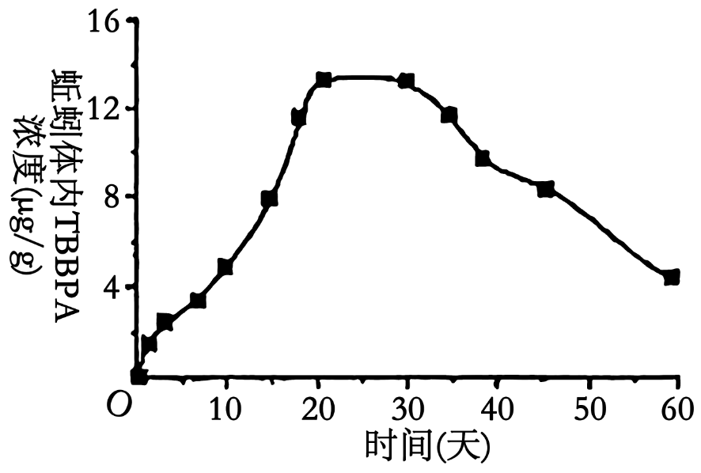
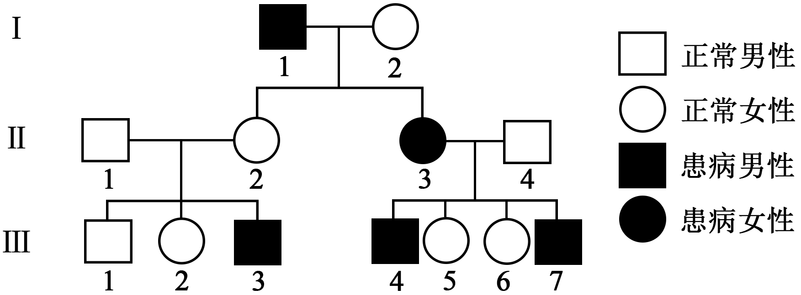
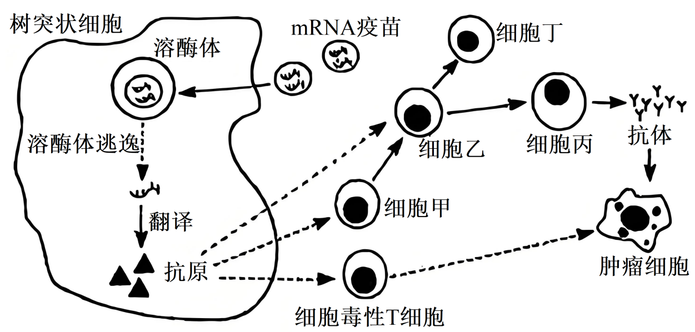

**机密★启用前**

**2025年湖北省普通高中学业水平选择性考试生物学**

**本试卷共8页，22题。全卷满分100分。考试用时75分钟。**

**一、单项选择题：本题共18小题，每小题2分，共36分。在每小题给出的四个选项中，只有一项是符合题目要求的。**

1\. 2023年7月，习近平总书记在全国生态环境保护大会上发表的重要讲话中强调：着力提升生态系统多样性、稳定性、持续性，要站在维护国家生态安全、中华民族永续发展和对人类文明负责的高度，加强生态保护和修复，为子孙后代留下山湾水秀的生态空间。下列措施不符合以上精神的是（　　）

A. 通过大规模围湖造田扩大耕地面积，提高粮食产量

B. 对有代表性的自然生态系统和珍稀物种栖息地进行保护

C. 对过度利用的森林与草原进行封育，待恢复到较好状态时再适度利用

D. 开展大规模国土绿化行动，推进“三北”防护林体系建设和京津风沙源治理

2\. 《中国睡眠研究报告（2023）》指出，长期睡眠不足会引发机体胰岛素敏感性下降、管后血糖与脂肪代谢效率降低等问题，并伴随注意力不集中、短期记忆受损、免疫力下降等症状。下列关于长期睡眠不足的危害，叙述错误的是（　　）

A. 影响神经元之间的信息交流

B. 患高血脂、糖尿病的风险上升

C. 可能导致与免疫相关的细胞因子分泌减少

D. 导致体内二氧化碳浓度升高，血液pH下降

3\. 我国科学家对三万余株水稻进行筛选，成功定位并克隆出耐碱—耐热基因ATT，发现该基因编码GA20氧化酶，从而调控赤霉素的生物合成。适宜浓度的赤霉素通过调节SLR1蛋白的含量，能减少碱性和高温环境对植株的损伤。下列叙述错误的是（　　）

A. 该研究表明基因与性状是一一对应关系

B. ATT基因通过控制酶的合成影响水稻的性状

C. 可以通过调节ATT基因的表达调控赤霉素的水平

D. 该研究成果为培育耐碱—耐热水稻新品种提供了新思路

4\. 在花粉过敏症患者中，法国梧桐花粉过敏原检测阳性率较高。接触法国梧桐花粉可诱发哮喘和过敏性鼻炎等过敏反应。下列叙述错误的是（　　）

A. 抗原-抗体特异性结合的原理可用于过敏原检测

B. 抑制机体内辅助性T细胞活性的药物，可缓解过敏反应

C. 不同人对相同过敏原的过敏反应程度不同，说明过敏反应可能与遗传因素有关

D. 法国梧桐花粉刺激机体产生的抗体，可避免机体再次接触该种花粉时产生过敏反应

5\. 水母雪莲是我国的一种名贵药材，主要活性成分为次生代谢产物黄酮。水母雪莲生长缓慢，长期的掠夺性采挖导致该药材资源严重匮乏。研究人员开展了悬浮培养水母雪莲细胞合成黄酮的工程技术研究，结果如表所示。下列叙述错误的是（　　）

|           |      |      |      |      |
|:--------- |:---- |:---- |:---- |:---- |
| 转速（r/min） | 55   | 65   | 75   | 85   |
| 相对生长速率    | 0.21 | 0.25 | 0.26 | 0.25 |
| 细胞干重（g/L） | 7.5  | 9.7  | 11.4 | 9.5  |
| 黄酮产量（g/L） | 0.2  | 0.27 | 0.32 | 0.25 |

A. 黄酮产量与细胞干重呈正相关

B. 黄酮是水母雪莲细胞生存和生长所必需的

C. 氧气供给对于水母雪莲细胞生长、分裂和代谢是必需的

D. 转速为75r/min时既利于细胞分裂，又利于黄酮的积累

6\. 利用犬肾细胞MDCK扩增流感病毒，生产流感疫苗，具有标准化、产量高等优点。但MDCK细胞贴壁生长的特性不利于生产规模的扩大，严重制约疫苗的生产效率。研究人员通过筛选，成功获得一种无成瘤性的（多代培养不会癌变）、可悬浮培养的MDCK细胞——XF06.下列叙述错误的是（　　）

A. XF06悬浮培养可提高细胞密度，进而提升生产效率

B. 细胞贴壁生长特性的改变是由于流感病毒感染所导致

C. 可采用离心技术从感染病毒的细胞裂解液中分离出流感病毒

D. 采用无成瘤性细胞生产疫苗，是为了避免疫苗中有致瘤DNA的污染

7\. 我国农学家贾思勰所著《齐民要术》记载：“凡五谷种子，浥郁则不生，生者亦寻死。”意思是种子如果受潮发霉就不会发芽，即使发芽也会很快死亡。下列叙述错误的是（　　）

A. 农业生产中，种子储藏需要干燥的环境

B. 种子受潮导致细胞内结合水比例升高，自由水比例降低，细胞代谢减弱

C. 霉菌在种子上大量繁殖，消耗了种子的营养物质，不利于种子正常萌发

D. 发霉过程中，微生物代谢产生的有害物质可能抑制种子萌发相关酶的活性

8\. 科研人员对四种植物进行不同光照处理实验，记录开花情况如下表。根据实验结果，以下推断合理的是（　　）

|      |      |      |
|:---- |:---- |:---- |
| 植物种类 | 长日照  | 短日照  |
| 甲    | 正常开花 | 不开花  |
| 乙    | 不开花  | 正常开花 |
| 丙    | 正常开花 | 正常开花 |
| 丁    | 延迟开花 | 正常开花 |

A. 对植物丁进行人工补光延长光照时间，能使其更快开花

B. 植物丙的开花不受环境因素影响，由自身遗传物质决定

C. 表中植物甲和乙开花的差异，是因为它们对光照强度的敏感度不同

D. 若在湖北同一地点种植，植物甲可能在夏季开花，植物乙可能在秋季开花

9\. 阿维菌素是一种用于害虫防治的生物农药。科研人员研究了阿维菌素对褐飞虱的影响，结果如下图。下列叙述错误的是（　　）

A. 途径①与②对褐飞虱的作用效果相反

B. 阿维菌素对褐飞虱的不同作用效果有浓度依赖性

C. 雌虫体内成熟生殖细胞的数量与卵黄蛋白原的含量呈正相关

D. 若干扰AstA蛋白与AstA受体的结合，会使褐飞虱产卵量增加

10\. 深秋时节，有机蔬菜种植基地常会收集大量塘泥堆置于池塘周边，待其自然风干，再经过冬季自然腐熟后，次年可作为优质有机肥。根据上述材料，下列叙述错误的是（　　）

A. 塘泥不能直接用作有机肥是因为其水分含量过高

B. 腐熟过程中发挥核心作用的是微生物的分解活动

C. 处理后的塘泥作为有机肥，可有效提升土壤肥力

D. 塘泥的资源化利用符合生态学循环原理，有助于农业可持续发展

11\. 蚯蚓通常栖息在阴暗、潮湿的土壤环境中，以落叶、禽畜粪便和线虫等为食。四溴双酚A（TBBPA）是土壤中常见的污染物之一。科研人员以蚯蚓为实验对象，将其培养在浓度为1mg/kg的TBBPA污染土壤中进行30天富集实验，然后将蚯蚓转至干净土壤进行30天排出实验，实验结果如下图。下列叙述错误的是（　　）

A. 蚯蚓在生态系统中既是消费者也是分解者

B. 蚯蚓对TBBPA的富集效应在20天以后趋于饱和

C. 该实验结束时蚯蚓被其他捕食者所食，TBBPA不会沿食物链传递

D. 15天时蚯蚓体内富集的TBBPA浓度约是初始实验环境中TBBPA的8倍

12\. 某学生重复孟德尔豌豆杂交实验，取一粒黄色圆粒F₁种子（YyRr），培养成植株，成熟后随机取4个豆荚，所得32粒豌豆种子表型计数结果如表所示。下列叙述最合理的是（　　）

|       |     |     |     |     |
|:----- |:--- |:--- |:--- |:--- |
| 性状    | 黄色  | 绿色  | 圆粒  | 皱粒  |
| 个数（粒） | 25  | 7   | 20  | 12  |

A. 32粒种子中有18粒黄色圆粒种子，2粒绿色皱粒种子

B. 实验结果说明含R基因配子的活力低于含r基因的配子

C. 不同批次随机摘取4个豆荚，所得种子的表型比会有差别

D. 该实验豌豆种子的圆粒与皱粒表型比支持孟德尔分离定律

13\. 科研人员以SA-β-Gal作为细胞衰老的分子标志，以EdU作为细胞DNA复制的标记，揭示了AP2A1蛋白通过调节p53蛋白表达量来影响细胞衰老的机制，实验结果如下图。下列叙述错误的是（　　）

A. 对照组中也有衰老的细胞

B. 蛋白质AP2A1促进了细胞中p53蛋白积累

C. 据图可推测衰老细胞中各种蛋白质的表达量上升

D. 含EdU标记的细胞所占比例越大，表明细胞增殖越旺盛

14\. 大数据时代，全球每天产生海量数据，预计2040年需一百万吨硅基芯片才能储存全球一年产生的数据。为解决这一难题，科学家尝试运用DNA来储存数据。我国科学家已经将汉代拓片、熊猫照片等文化数据写入DNA，实现数据长期保存。下列叙述中，DNA可以作为存储介质的优点不包括（　　）

A. DNA具有可复制性，有利于数据的传播

B. 可通过DNA转录和翻译传递相应数据信息

C. DNA长链中碱基排列的多样化，为大量数据的存储提供可能

D. DNA作为存储介质体积小，为数据携带和保存节约了大量空间

15\. 花鼠取食偏好红松球果，且具有分散贮食和遗忘贮藏点的特性。研究人员在2019~2023年间，对某地红松林中花鼠种群数量和红松结实量开展调查，发现2022年红松结实量最高，与其余四年的结实量存在显著差异；其余四年之间的结实量没有显著差异。花鼠种群5年的调查结果如下表。根据上述材料，下列推测合理的是（　　）

|         |       |       |       |       |       |
|:------- |:----- |:----- |:----- |:----- |:----- |
|         | 2019年 | 2020年 | 2021年 | 2022年 | 2023年 |
| 性比（雌：雄） | 0.77  | 0.76  | 0.78  | 1.16  | 0.98  |
| 幼年组     | 14    | 21    | 26    | 47    | 37    |
| 成年组     | 62    | 56    | 60    | 54    | 62    |
| 老年组     | 2     | 2     | 3     | 5     | 3     |

A. 花鼠能促进红松种子的传播

B. 红松结实量受到花鼠种群数量的调控

C. 花鼠的种群数量波动与其性比之间没有关联

D. 从年龄结构分析，上述花鼠种群属于衰退型种群

16\. 若在一个随机交配的二倍体生物种群中，偶然出现一个有利突变基因，该突变基因可能是隐性或显性，具有突变表型的个体更容易生存和繁衍。图1与图2是在自然选择下突变基因的频率变化趋势图。据图分析，下列叙述正确的是（　　）

 

A. 图1曲线在1200代左右时形成了新物种

B. 对比图1与图2，推测图1中有利突变基因为隐性

C. 随着世代数的增加，图2曲线的峰值只能接近1，无法等于1

D. 图2曲线在200~400代增长慢，推测该阶段含有利基因的纯合体占比少

17\. 研究表明，人体肠道中某些微生物合成、分泌的植物激素生长素，能增强癌症患者对化疗药物的响应，改善胰腺癌、结直肠癌和肺癌等的治疗效果。进一步研究发现，色氨酸可提高血清中生长素的水平：生长素通过抑制E酶（自由基清除酶）的活性，增强化疗药物对癌细胞的杀伤作用。下列叙述错误的是（　　）

A. 自由基对癌细胞和正常细胞都有毒害作用

B. 富含色氨酸的食品能改善癌症患者的化疗效果

C. 患者个体肠道微生物种群差异可能会影响癌症化疗效果

D. 该研究结果表明生长素可作为一种潜在的化疗药物用于癌症治疗

18\. 研究表明，人类女性体细胞中仅有一条X染色体保持活性，从而使女性与男性体细胞中X染色体基因表达水平相当。基因G编码G蛋白，其等位基因g编码活性低的g蛋白。缺失G基因的个体会患某种遗传病。图示为该疾病的一个家族系谱图，已知Ⅱ-I不含g基因。随机选取Ⅲ-5体内200个体细胞，分析发现其中100个细胞只表达G蛋白，另外100个细胞只表达g蛋白。下列叙述正确的是（　　）

A. Ⅲ-3个体的致病基因可追溯源自I-2

B. Ⅲ-5细胞中失活的X染色体源自母方

C. Ⅲ-2所有细胞中可能检测不出g蛋白

D. 若Ⅲ-6与某男性婚配，预期生出一个不患该遗传病男孩的概率是1/2

**二、非选择题：本题共4小题，共64分。**

19\. 某种昆虫病毒的遗传物质为双链环状DNA.该病毒具有包膜结构，包膜上的蛋白A与宿主细胞膜上的受体结合后，两者的膜发生融合，从而使病毒DNA进入细胞内进行自我复制。回答下列问题：

（1）要清楚观察病毒的形态结构需要使用的显微镜类型是\_\_\_\_\_\_\_\_\_。

（2）体外培养的梭形昆虫细胞，被上述病毒感染后会转变为圆球形，原因是病毒感染引起了昆虫细胞内\_\_\_\_\_\_\_\_\_（填细胞结构名称）的改变。

（3）这类病毒的基因组中通常含有抗细胞凋亡的基因，这类基因对病毒的生物学意义是： \_\_\_\_\_\_\_\_\_。

（4）该病毒DNA能在宿主细胞中自我复制，却无法在大肠杆菌中复制。为解决这一问题，可在该病毒的DNA中插入\_\_\_\_\_\_\_\_\_序列，以实现利用大肠杆菌扩增该病毒DNA的目的。

（5）用该病毒感染哺乳动物细胞，可以在细胞内检测到该病毒完整的基因组DNA，但无对应的转录产物。推测其无法转录的原因是：\_\_\_\_\_\_\_\_\_。

（6）采用脂溶剂处理该病毒颗粒可使病毒失去对宿主细胞的感染性，其原因是：\_\_\_\_\_\_\_。

20\. mRNA-X是一款新型肿瘤治疗性疫苗，可编码肿瘤抗原，刺激机体产生特异性免疫，从而杀死肿瘤细胞（部分过程如图所示）。该疫苗是由脂质材料包裹特定序列的mRNA所构成。

回答下列问题：

（1）在mRNA-X疫苗制备过程中，可依据\_\_\_\_\_\_\_\_\_\_序列来合成对应的mRNA.

（2）据图分析，“溶酶体逃逸”的作用是：\_\_\_\_\_\_\_\_\_\_。

（3）细胞乙增殖分化为细胞丙和丁，主要得益于两种信号刺激，分别是：\_\_\_\_\_\_\_\_\_\_、\_\_\_\_\_\_\_\_\_\_。

（4）图中细胞丁的名称是\_\_\_\_\_\_\_\_\_\_，其作用是：\_\_\_\_\_\_\_\_\_\_。

（5）相对于放射治疗，利用mRNA疫苗治疗癌症的优点是：\_\_\_\_\_\_\_\_\_\_（回答一点即可）。

21\. 在荒漠生态系统中，螨虫、跳虫等小型节肢动物对凋落物和有机碎屑的分解发挥着重要作用，这种作用主要是通过取食真菌、传播真菌孢子和捕食噬菌线虫来完成的。基于此，科研人员开展了以下两个相关实验：

实验①：分别使用杀真菌剂和杀虫剂（杀灭小型节肢动物）对荒漠灌木植物柠条的凋落物和有机碎屑进行处理，发现使用杀真菌剂后，分解作用减少了29%；使用杀虫剂后，分解作用减少了53%。

实验②：清除柠条凋落物和有机碎屑中的小型节肢动物（主要是螨虫），使得噬菌线虫（取食细菌等）数量增加、细菌数量减少，分解作用减少40%；而清除噬菌线虫和小型节肢动物，使细菌数量增加。

回答下列问题：

（1）区别荒漠群落和森林群落的重要依据是\_\_\_\_\_\_\_\_\_\_。

（2）上述荒漠生态系统中，排除小型节肢动物后，噬菌线虫种群增长曲线呈\_\_\_\_\_\_\_\_\_\_形；清除线虫和小型节肢动物后，生态系统抵抗力稳定性的变化是：\_\_\_\_\_\_\_\_\_\_（填序号）。

①变强 ②不变 ③变弱 ④无法判断

（3）根据上述材料，画出噬菌线虫的能量输入与输出的示意图：\_\_\_\_\_\_\_\_\_\_。

（4）根据上述材料分析，螨虫通过直接调节\_\_\_\_\_\_\_\_\_\_的种群大小，从而对荒漠生态系统中凋落物和有机碎屑的分解产生影响。

（5）从生态系统功能的角度，评价杀虫剂等农药对生态系统的影响：\_\_\_\_\_\_\_\_\_\_。

22\. 治疗疟疾的药物青蒿素主要从植物黄花蒿中提取，但含量低。为培育青蒿素含量高的黄花蒿新品种，科研工作者开展了相关研究，发现青蒿素主要在叶片的腺毛中合成与积累，并受到如水杨酸（SA）和茉莉酸甲酯（MeJA）等植物激素的调节。研究表明，SA和MeJA通过调控miR160的表达量（miR160是一种微小RNA，能与靶mRNA结合，引起后者降解），影响黄花蒿腺毛密度和青蒿素含量。miR160的一种靶mRNA编码ARFI蛋白，该蛋白影响青蒿素合成关键酶基因DBR2的表达。研究结果如图所示。

回答下列问题：

（1）青蒿素主要在叶片的腺毛中合成与积累，其根本原因是：\_\_\_\_\_\_\_\_\_\_。

（2）据图分析可知，miR160的表达量与青蒿素含量间呈现\_\_\_\_\_\_\_\_\_\_相关性，并且可以推测外源MeJA处理对青蒿素含量的影响是：\_\_\_\_\_\_\_\_\_\_\_。

（3）基于上述材料，miR160通过直接影响\_\_\_\_\_\_\_\_\_\_，调控青蒿素的合成。

（4）请写出SA、ARFI、miR160和DBR2调控青蒿素生物合成的通路（用“→”表示促进，用“—\|”表示抑制，显示各成员间的调控关系）：\_\_\_\_\_\_\_\_\_\_。

（5）请根据上述材料，提出一种培育青蒿素含量高的黄花蒿新品种的思路：\_\_\_\_\_\_\_\_\_\_。
