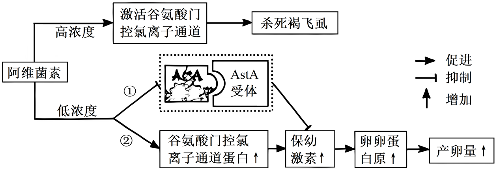
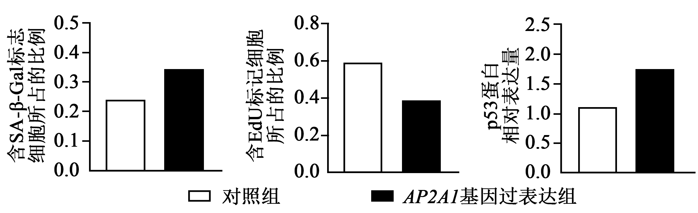
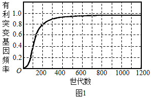
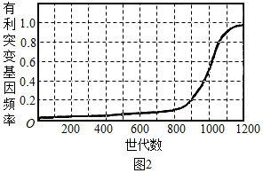
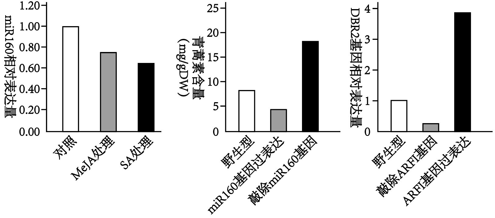

**机密★启用前**

**2025年湖北省普通高中学业水平选择性考试生物学**

**本试卷共8页，22题。全卷满分100分。考试用时75分钟。**

**一、单项选择题：本题共18小题，每小题2分，共36分。在每小题给出的四个选项中，只有一项是符合题目要求的。**

1\. 2023年7月，习近平总书记在全国生态环境保护大会上发表的重要讲话中强调：着力提升生态系统多样性、稳定性、持续性，要站在维护国家生态安全、中华民族永续发展和对人类文明负责的高度，加强生态保护和修复，为子孙后代留下山湾水秀的生态空间。下列措施不符合以上精神的是（　　）

A. 通过大规模围湖造田扩大耕地面积，提高粮食产量

B. 对有代表性的自然生态系统和珍稀物种栖息地进行保护

C. 对过度利用的森林与草原进行封育，待恢复到较好状态时再适度利用

D. 开展大规模国土绿化行动，推进“三北”防护林体系建设和京津风沙源治理

【答案】A

【解析】

【分析】合理的利用就是最好的保护。生物多样性的保护：（1）就地保护(自然保护区)：就地保护是保护物种多样性最为有效的措施。（2）易地保护：动物园、植物园。（3）利用生物技术对生物进行濒危物种的基因进行保护。如建立精子库、种子库等。（4）利用生物技术对生物进行濒危物种进行保护。如人工授精、组织培养和胚胎移植等。

【详解】A、围湖造田会破坏湿地生态系统，导致生物栖息地丧失、蓄洪能力下降，降低生态系统的稳定性和生物多样性，属于牺牲生态换取短期经济利益的行为，不符合题意，A错误；

B、保护自然生态系统和珍稀物种栖息地，能直接维持生物多样性和生态系统的稳定性，符合题意，B正确；

C、封育过度利用的生态系统并适度恢复后利用，体现了生态系统的可持续性，符合题意，C正确；

D、大规模国土绿化和防护林建设可改善生态环境，增强生态系统的稳定性，符合题意，D正确。

故选A。

2\. 《中国睡眠研究报告（2023）》指出，长期睡眠不足会引发机体胰岛素敏感性下降、管后血糖与脂肪代谢效率降低等问题，并伴随注意力不集中、短期记忆受损、免疫力下降等症状。下列关于长期睡眠不足的危害，叙述错误的是（　　）

A. 影响神经元之间的信息交流

B. 患高血脂、糖尿病的风险上升

C. 可能导致与免疫相关的细胞因子分泌减少

D. 导致体内二氧化碳浓度升高，血液pH下降

【答案】D

【解析】

【分析】血糖平衡调节：由胰岛α细胞分泌胰高血糖素（分布在胰岛外围）提高血糖浓度，促进血糖来源；由胰岛β细胞分泌胰岛素（分布在胰岛内）降低血糖浓度，促进血糖去路，减少血糖来源，两者激素间是拮抗关系。

【详解】A、长期睡眠不足可能影响突触处神经递质的释放或传递，导致神经元间信息交流受阻，与题干中“注意力不集中、短期记忆受损”相符，A正确；

B、胰岛素敏感性下降会引发血糖调节异常（易患糖尿病），脂肪代谢效率降低则导致血脂升高（易患高血脂），B正确；

C．免疫力下降与免疫细胞活性降低或细胞因子分泌减少有关，C正确；

D．人体通过呼吸系统和缓冲系统维持内环境pH稳定，即使CO2产生增多，也会通过加快呼吸排出，不会导致血液pH显著下降，D错误；

故选D。

3\. 我国科学家对三万余株水稻进行筛选，成功定位并克隆出耐碱—耐热基因ATT，发现该基因编码GA20氧化酶，从而调控赤霉素的生物合成。适宜浓度的赤霉素通过调节SLR1蛋白的含量，能减少碱性和高温环境对植株的损伤。下列叙述错误的是（　　）

A. 该研究表明基因与性状是一一对应关系

B. ATT基因通过控制酶的合成影响水稻的性状

C. 可以通过调节ATT基因的表达调控赤霉素的水平

D. 该研究成果为培育耐碱—耐热水稻新品种提供了新思路

【答案】A

【解析】

【分析】转录以DNA一条链为模板，以游离的核糖核苷酸为原料，在RNA聚合酶的催化作用下合成RNA的过程。翻译以mRNA为模板，以游离的氨基酸为原料，在酶的催化作用下合成蛋白质的过程。

【详解】A、题干中ATT基因通过调控赤霉素合成影响耐碱和耐热两种性状，体现一个基因影响多个性状，A错误；

B、ATT基因编码GA20氧化酶，通过控制酶的合成调控代谢过程，进而影响性状，符合基因间接控制性状的途径，B正确；

C、ATT基因的表达产物是赤霉素合成的关键酶，调节其表达可改变赤霉素水平，C正确；

D、克隆ATT基因后，可通过转基因技术培育耐碱—耐热水稻，D正确；

故选A。

4\. 在花粉过敏症患者中，法国梧桐花粉过敏原检测阳性率较高。接触法国梧桐花粉可诱发哮喘和过敏性鼻炎等过敏反应。下列叙述错误的是（　　）

A. 抗原-抗体特异性结合的原理可用于过敏原检测

B. 抑制机体内辅助性T细胞活性的药物，可缓解过敏反应

C. 不同人对相同过敏原的过敏反应程度不同，说明过敏反应可能与遗传因素有关

D. 法国梧桐花粉刺激机体产生的抗体，可避免机体再次接触该种花粉时产生过敏反应

【答案】D

【解析】

【分析】过敏反应是已免疫的机体再次接触相同过敏原时发生的异常免疫应答。过敏原首次刺激机体产生抗体，吸附于肥大细胞等表面；再次接触时，过敏原与抗体结合，引发组织胺释放，导致过敏症状。

【详解】A、过敏原检测通过抗原-抗体特异性结合原理检测体内是否存在针对该过敏原的抗体，A正确；

B、辅助性T细胞在过敏反应中起着重要作用，它可以辅助B细胞产生抗体等。抑制机体内辅助性T细胞活性，能够减少过敏反应中相关免疫活性物质的产生，从而缓解过敏反应，B正确；

C、过敏反应存在个体差异，与遗传因素（如易感基因）密切相关，C正确；

D、法国梧桐花粉刺激产生的抗体是导致再次接触时引发过敏反应的关键，而非“避免”过敏反应，D错误。

故选D。

5\. 水母雪莲是我国的一种名贵药材，主要活性成分为次生代谢产物黄酮。水母雪莲生长缓慢，长期的掠夺性采挖导致该药材资源严重匮乏。研究人员开展了悬浮培养水母雪莲细胞合成黄酮的工程技术研究，结果如表所示。下列叙述错误的是（　　）

|           |      |      |      |                                                              |
|:--------- |:---- |:---- |:---- |:------------------------------------------------------------ |
| 转速（r/min） | 55   | 65   | 75   | 85                                                           |
| 相对生长速率    | 0.21 | 0.25 | 0.26 | 0.25                                                         |
| 细胞干重（g/L） | 7.5  | 9.7  | 11.4 | 95 |
| 黄酮产量（g/L） | 0.2  | 0.27 | 0.32 | 0.25                                                         |

A. 黄酮产量与细胞干重呈正相关

B. 黄酮是水母雪莲细胞生存和生长所必需的

C. 氧气供给对于水母雪莲细胞生长、分裂和代谢是必需的

D. 转速为75r/min时既利于细胞分裂，又利于黄酮的积累

【答案】B

【解析】

【分析】分析表格，随着转速升高，细胞干重增加，黄酮产量最多。

【详解】A．从图中看出，黄酮产量随着细胞干重增加而增加，所以黄酮产量与细胞干重呈正相关，A正确；

B．黄酮属于次生 代谢产物，并非细胞生存和生长所必需，B错误；

C．氧气参与有氧呼吸，为细胞生长、分裂和代谢提供能量，所以氧气供给对于水母雪莲细胞生长、分裂和代谢是必需的，C正确；

D．75r/min时相对生长速率、细胞干重和黄酮产量均最高，所以转速为75r/min时既利于细胞分裂，又利于黄酮的积累，D正确；

故选B。

6\. 利用犬肾细胞MDCK扩增流感病毒，生产流感疫苗，具有标准化、产量高等优点。但MDCK细胞贴壁生长的特性不利于生产规模的扩大，严重制约疫苗的生产效率。研究人员通过筛选，成功获得一种无成瘤性的（多代培养不会癌变）、可悬浮培养的MDCK细胞——XF06.下列叙述错误的是（　　）

A. XF06悬浮培养可提高细胞密度，进而提升生产效率

B. 细胞贴壁生长特性的改变是由于流感病毒感染所导致

C. 可采用离心技术从感染病毒的细胞裂解液中分离出流感病毒

D. 采用无成瘤性细胞生产疫苗，是为了避免疫苗中有致瘤DNA的污染

【答案】B

【解析】

【分析】动物细胞培养是指从动物体中取出相关的组织，将它分散成单个细胞，然后在适当的培养条件下，让这些细胞生长和增殖的技术。动物细胞培养需满足基本的营养条件，培养液中需有氨基酸、无机盐、糖类和维生素等，同时需要适宜的温度、pH和渗透压，还需在无菌无毒的环境下去培养。无菌：对培养液和所有的培养用具进行灭菌处理，在无菌的环境下进行操作；无毒：定期更换培养液，以便清除代谢产物。

【详解】A、悬浮培养的XF06细胞无需贴壁，可在培养液中自由增殖，从而提高细胞密度，扩大病毒产量，提升生产效率，A正确；

B、XF06细胞的贴壁特性改变是通过筛选获得的遗传特性，而非流感病毒感染所致（病毒感染仅用于扩增病毒，不改变宿主细胞生长方式），B错误；

C、流感病毒释放到细胞裂解液后，离心可分离细胞碎片（沉淀）与病毒（上清液），C正确；

D、无成瘤性细胞不含癌基因，可避免疫苗中混入致瘤性DNA片段，确保疫苗安全性，D正确；

故选B。

7\. 我国农学家贾思勰所著《齐民要术》记载：“凡五谷种子，浥郁则不生，生者亦寻死。”意思是种子如果受潮发霉就不会发芽，即使发芽也会很快死亡。下列叙述错误的是（　　）

A. 农业生产中，种子储藏需要干燥的环境

B. 种子受潮导致细胞内结合水比例升高，自由水比例降低，细胞代谢减弱

C. 霉菌在种子上大量繁殖，消耗了种子的营养物质，不利于种子正常萌发

D. 发霉过程中，微生物代谢产生的有害物质可能抑制种子萌发相关酶的活性

【答案】B

【解析】

【分析】自由水是良好的溶剂，是许多化学反应的介质，自由水还参与许多化学反应，自由水对于营养物质和代谢废物的运输具有重要作用；自由水与结合水不是一成不变的，可以相互转化，自由水与结合水的比值越高，细胞代谢越旺盛，抗逆性越低，反之亦然。

【详解】A、种子储藏需要干燥环境，以减少自由水含量，降低细胞呼吸速率，减少有机物消耗，A正确；

B、种子受潮时，自由水比例应升高而非降低，结合水比例下降，此时细胞代谢应增强而非减弱。但若种子发霉死亡，代谢停止，但选项描述的水分变化方向错误，B错误；

C、霉菌繁殖会消耗种子储存的有机物，导致种子缺乏萌发所需营养，C正确；

D、霉菌代谢产物（如毒素）可能破坏种子细胞结构或抑制酶活性，阻碍萌发，D正确；

故选B。

8\. 科研人员对四种植物进行不同光照处理实验，记录开花情况如下表。根据实验结果，以下推断合理的是（　　）

|      |      |      |
|:---- |:---- |:---- |
| 植物种类 | 长日照  | 短日照  |
| 甲    | 正常开花 | 不开花  |
| 乙    | 不开花  | 正常开花 |
| 丙    | 正常开花 | 正常开花 |
| 丁    | 延迟开花 | 正常开花 |

A. 对植物丁进行人工补光延长光照时间，能使其更快开花

B. 植物丙的开花不受环境因素影响，由自身遗传物质决定

C. 表中植物甲和乙开花的差异，是因为它们对光照强度的敏感度不同

D. 若在湖北同一地点种植，植物甲可能在夏季开花，植物乙可能在秋季开花

【答案】D

【解析】

【分析】光敏色素是一类蛋白质（色素—蛋白复合体），分布在植物的各个部位，其中在分生组织的细胞内比较丰富。在受到光照射时，光敏色素的结构会发生变化，这一变化的信息会经过信息传递系统传导到细胞核内，影响特定基因的表达，从而表现出生物学效应。

【详解】A、丁在长日照下延迟开花，短日照下正常开花。若人工补光延长光照时间（模拟长日照），反而会延迟开花，A错误；

B、丙在长、短日照下均正常开花，说明其开花不受光周期影响，属于日中性植物。但“不受环境因素影响”表述绝对化，其他环境因素（如温度、水分）可能仍影响开花，B错误；

C、甲和乙开花差异源于对光照时间（光周期）的敏感度不同，而非光照强度，C错误；

D、湖北夏季昼长（长日照），甲作为长日照植物可能在夏季开花；秋季昼短（短日照），乙作为短日照植物可能在秋季开花，D正确。

故选D。

9\. 阿维菌素是一种用于害虫防治的生物农药。科研人员研究了阿维菌素对褐飞虱的影响，结果如下图。下列叙述错误的是（　　）

A. 途径①与②对褐飞虱的作用效果相反

B. 阿维菌素对褐飞虱的不同作用效果有浓度依赖性

C. 雌虫体内成熟生殖细胞的数量与卵黄蛋白原的含量呈正相关

D. 若干扰AstA蛋白与AstA受体的结合，会使褐飞虱产卵量增加

【答案】A

【解析】

【分析】由图可知，高浓度的阿维菌素最终会杀死褐飞虱，低浓度的阿维菌素会增加产卵量，而增加产卵量有两条途径，一方面抑制AstA蛋白与AstA受体的结合，最终使产卵量增加，另一方面促进谷氨酸门控氯离子通道蛋白增加，最终也会使产卵量增加。

【详解】A、途径①中低浓度阿维菌素抑制AstA蛋白与AstA受体结合，对保幼激素的抑制作用减弱，使的保幼激素的量增加，最终使产卵量增加，而途径②中低浓度阿维菌素使谷氨酸门控氯离子通道蛋白增加，最终也会使产卵量增加，所以二者对褐飞虱的作用效果相同，A错误；

B、从图中可以明显看出，高浓度阿维菌素激活谷氨酸门控氯离子通道杀死褐飞虱，低浓度阿维菌素促进产卵等，阿维菌素对褐飞虱的不同作用效果确实有浓度依赖性，B正确；

C、因为卵黄蛋白原可促进产卵，而产卵量与雌虫体内成熟生殖细胞数量有关，所以雌虫体内成熟生殖细胞的数量与卵黄蛋白原的含量呈正相关，C正确；

D、由图可知，AstA蛋白与AstA受体结合，会抑制保幼激素的增加，最终使产卵量减少，若干扰AstA蛋白与AstA受体的结合，会使褐飞虱产卵量增加，D正确。 

故选A。

10\. 深秋时节，有机蔬菜种植基地常会收集大量塘泥堆置于池塘周边，待其自然风干，再经过冬季自然腐熟后，次年可作为优质有机肥。根据上述材料，下列叙述错误的是（　　）

A. 塘泥不能直接用作有机肥是因为其水分含量过高

B. 腐熟过程中发挥核心作用的是微生物的分解活动

C. 处理后的塘泥作为有机肥，可有效提升土壤肥力

D. 塘泥的资源化利用符合生态学循环原理，有助于农业可持续发展

【答案】A

【解析】

【分析】生态系统的结构包括组成成分和营养结构，组成成分包括非生物的物质和能量、生产者、消费者和分解者，营养结构包括食物链和食物网。

【详解】A、塘泥不能直接用作有机肥，主要原因不是水分含量过高，而是其中可能含有未分解的有机物等，需要经过腐熟过程让微生物将其分解转化为更易被植物吸收利用的物质，A错误；

B、在腐熟过程中，微生物发挥着核心作用，微生物通过自身的代谢活动，将塘泥中的复杂有机物逐步分解为简单的无机物，如二氧化碳、水、无机盐等，B正确；

C、处理后的塘泥作为有机肥，其中含有丰富的营养物质，能够为植物生长提供所需的养分，有效提升土壤肥力，改善土壤的物理和化学性质，C正确；

D、塘泥的资源化利用，将原本可能被废弃的塘泥转化为对农业生产有益的有机肥，符合生态学的物质循环原理，减少了废弃物的排放，有助于农业的可持续发展，D正确。

故选A。

11\. 蚯蚓通常栖息在阴暗、潮湿的土壤环境中，以落叶、禽畜粪便和线虫等为食。四溴双酚A（TBBPA）是土壤中常见的污染物之一。科研人员以蚯蚓为实验对象，将其培养在浓度为1mg/kg的TBBPA污染土壤中进行30天富集实验，然后将蚯蚓转至干净土壤进行30天排出实验，实验结果如下图。下列叙述错误的是（　　）

A. 蚯蚓在生态系统中既是消费者也是分解者

B. 蚯蚓对TBBPA的富集效应在20天以后趋于饱和

C. 该实验结束时蚯蚓被其他捕食者所食，TBBPA不会沿食物链传递

D. 15天时蚯蚓体内富集的TBBPA浓度约是初始实验环境中TBBPA的8倍

【答案】C

【解析】

【分析】生态系统的结构包括组成成分和营养结构，组成成分包括非生物的物质和能量、生产者、消费者和分解者，营养结构包括食物链和食物网。

【详解】A、蚯蚓以落叶、禽畜粪便为食时属于分解者，以线虫为食时属于消费者，所以蚯蚓在生态系统中既是消费者也是分解者，A正确；

B、从实验结果图可以看出，在20天以后，蚯蚓体内TBBPA浓度曲线趋于平缓，说明蚯蚓对TBBPA的富集效应在20天以后趋于饱和，B正确；

C、TBBPA是土壤中常见的污染物，具有生物富集作用，若实验结束时蚯蚓被其他捕食者所食，TBBPA会沿食物链传递，C错误；

D、由图可知，初始实验环境中TBBPA浓度为1mg/kg，15天时蚯蚓体内TBBPA浓度约为8μg/g=8mg/kg，所以15天时蚯蚓体内富集的TBBPA浓度约是初始实验环境中TBBPA的8倍，D正确。

故选C。

12\. 某学生重复孟德尔豌豆杂交实验，取一粒黄色圆粒F₁种子（YyRr），培养成植株，成熟后随机取4个豆荚，所得32粒豌豆种子表型计数结果如表所示。下列叙述最合理的是（　　）

|       |     |     |     |     |
|:----- |:--- |:--- |:--- |:--- |
| 性状    | 黄色  | 绿色  | 圆粒  | 皱粒  |
| 个数（粒） | 25  | 7   | 20  | 12  |

A. 32粒种子中有18粒黄色圆粒种子，2粒绿色皱粒种子

B. 实验结果说明含R基因配子的活力低于含r基因的配子

C. 不同批次随机摘取4个豆荚，所得种子的表型比会有差别

D. 该实验豌豆种子的圆粒与皱粒表型比支持孟德尔分离定律

【答案】C

【解析】

【分析】两对相对性状的黄色圆粒豌豆实验，遵循基因的自由组合定律。F1黄色圆粒豌豆YyRr，在减数分裂过程中，同源染色体分离，非同源染色体上的非等位基因自由组合，能产生4种配子，F1黄色圆粒豌豆（YyRr）自交产生F2为Y_R\_：Y_rr：yyR\_：yyrr=9：3：3：1。

【详解】A、黄色圆粒种子理论值为18粒（32×9/16），绿色皱粒为2粒（32×1/16）。但实际数据中，黄色和圆粒的总数分别为25和20，无法直接推导组合性状的具体数值，A错误；

B、圆粒与皱粒比为5:3，可能因R配子活力低于r，但由于样本太少，所以不能确定含R基因配子的活力低于含r基因的配子，B错误；

C、由于样本量小（仅4个豆荚，32粒种子），不同批次摘取豆荚可能因抽样误差导致表型比波动，C正确；

D、圆粒与皱粒实际比为5:3，不符合分离定律预期的3:1，同时样本数目太少，所以不支持孟德尔分离定律，D错误；

故选C。

13\. 科研人员以SA-β-Gal作为细胞衰老的分子标志，以EdU作为细胞DNA复制的标记，揭示了AP2A1蛋白通过调节p53蛋白表达量来影响细胞衰老的机制，实验结果如下图。下列叙述错误的是（　　）

A. 对照组中也有衰老的细胞

B. 蛋白质AP2A1促进了细胞中p53蛋白积累

C. 据图可推测衰老细胞中各种蛋白质的表达量上升

D. 含EdU标记的细胞所占比例越大，表明细胞增殖越旺盛

【答案】C

【解析】

【分析】衰老的细胞主要具有以下特征：

（1）细胞内的水分减少，结果使细胞萎缩。体积变小，细胞新陈代谢的速率减慢。

（2）细胞内多种酶的活性降低。例如，由于头发基部的黑色素细胞衰老，细胞中的酪氨酸酶活性降低，黑色素合成减少，所以老人的头发会变白。

（3）细胞内的色素会随着细胞衰老而逐渐积累，它们会妨碍细胞内物质的交流和传递，影响细胞正常的生理功能。细胞内呼吸速率减慢，细胞核的体积增大，核膜内折，染色质收缩，染色加深。

（4）细胞膜通透性改变，使物质运输功能降低。

【详解】A、从左图看出，对照组中SA-β-Gal含量不为0，而SA-β-Gal作为细胞衰老的分子标志，所以对照组中也有衰老的细胞，A正确；

B、从最右图看出，AP2A1基因过度表达组中p53蛋白含量明显比对照组多，所以可能蛋白质AP2A1促进了细胞中p53蛋白积累，B正确；

C、据图可知，衰老细胞中与衰老有关的蛋白质表达量增加，但不是各种蛋白质的表达量都会增加，C错误；

D、EdU作为细胞DNA复制的标记，细胞增殖过程中会发生DNA复制，所以含EdU标记的细胞所占比例越大，表明细胞增殖越旺盛，D正确。

故选C。

14\. 大数据时代，全球每天产生海量数据，预计2040年需一百万吨硅基芯片才能储存全球一年产生的数据。为解决这一难题，科学家尝试运用DNA来储存数据。我国科学家已经将汉代拓片、熊猫照片等文化数据写入DNA，实现数据长期保存。下列叙述中，DNA可以作为存储介质的优点不包括（　　）

A. DNA具有可复制性，有利于数据的传播

B. 可通过DNA转录和翻译传递相应数据信息

C. DNA长链中碱基排列的多样化，为大量数据的存储提供可能

D. DNA作为存储介质体积小，为数据携带和保存节约了大量空间

【答案】B

【解析】

【分析】DNA独特的双螺旋结构构成了DNA分子的稳定性；DNA分子由于碱基对的数量不同，碱基对的排列顺序千变万化，因而构成了DNA分子的多样性；不同的每个DNA分子的碱基对都有特定的排列顺序，特定的遗传信息，从而使DNA分子具有特异性。遗传信息就储存在DNA分子碱基对（脱氧核苷酸）的排列顺序中。

【详解】A、DNA通过半保留复制可快速扩增数据，便于传播，A不符合题意；

B、DNA储存数据时，信息读取依赖测序技术而非转录翻译（后者为生物体内表达遗传信息的过程），与数据存储无关，B符合题意；

C、DNA碱基对排列顺序的多样性使其可编码海量信息，是存储优势，C不符合题意；

D、DNA分子结构紧凑，单位体积存储密度极高，节省空间，D不符合题意；

故选B。

15\. 花鼠取食偏好红松球果，且具有分散贮食和遗忘贮藏点的特性。研究人员在2019~2023年间，对某地红松林中花鼠种群数量和红松结实量开展调查，发现2022年红松结实量最高，与其余四年的结实量存在显著差异；其余四年之间的结实量没有显著差异。花鼠种群5年的调查结果如下表。根据上述材料，下列推测合理的是（　　）

|         |       |       |       |       |       |
|:------- |:----- |:----- |:----- |:----- |:----- |
|         | 2019年 | 2020年 | 2021年 | 2022年 | 2023年 |
| 性比（雌：雄） | 0.77  | 0.76  | 0.78  | 1.16  | 0.98  |
| 幼年组     | 14    | 21    | 26    | 47    | 37    |
| 成年组     | 62    | 56    | 60    | 54    | 62    |
| 老年组     | 2     | 2     | 3     | 5     | 3     |

A. 花鼠能促进红松种子的传播

B. 红松结实量受到花鼠种群数量的调控

C. 花鼠的种群数量波动与其性比之间没有关联

D. 从年龄结构分析，上述花鼠种群属于衰退型种群

【答案】A

【解析】

【分析】调查动物的种群密度常用的方法是标记重捕法，计算种群数量时利用公式计算若将该地段种群个体总数记作N，其中标志数为M，重捕个体数为n，重捕中标记个体数为m，假定总数中标志个体的比例与重捕取样中标志个体的比例相同，则N=Mn/m。种群的数量特征包括种群密度、生率和死亡率、迁入率和迁出率、年龄组成和性别比例，其中种群密度是最基本的数量特征，出生率和死亡率、迁入率和迁出率决定种群密度的大小，性别比例直接影响种群的出生率，年龄组成预测种群密度变化。

【详解】A、花鼠分散贮食并遗忘贮藏点，未被取食的红松种子可能萌发，促进传播，A正确；

B、红松结实量在2022年异常高，可能受气候等因素影响，而非花鼠数量调控，B错误；

C、2022年性比（雌多雄少）与幼年组数量激增相关，说明性比变化影响繁殖率，C错误；

D、老年组个体数较少，且幼年组且占比逐年上升（如2022年达47），年龄结构为增长型，D错误。

故选A。

16\. 若在一个随机交配的二倍体生物种群中，偶然出现一个有利突变基因，该突变基因可能是隐性或显性，具有突变表型的个体更容易生存和繁衍。图1与图2是在自然选择下突变基因的频率变化趋势图。据图分析，下列叙述正确的是（　　）

 

A. 图1曲线在1200代左右时形成了新物种

B. 对比图1与图2，推测图1中有利突变基因为隐性

C. 随着世代数的增加，图2曲线的峰值只能接近1，无法等于1

D. 图2曲线在200~400代增长慢，推测该阶段含有利基因的纯合体占比少

【答案】D

【解析】

【分析】现代进化理论的基本内容是：①进化是以种群为基本单位，进化的实质是种群的基因频率的改变。②突变和基因重组产生进化的原材料。③自然选择决定生物进化的方向。④隔离导致物种形成。

【详解】A、据图分析，图1曲线在1200代左右时突变基因频率达到1，种群基因频率改变，说明生物进化，但新物种的形成通常需要生殖隔离的出现，仅基因频率变化不能直接证明新物种形成，A错误；

B、据图可知，图1有利突变基因频率上升较快，而图2中突变基因频率缓慢上升且后期稳定，据此推测图1中有利突变基因为显性，即一旦发生突变，杂合子即可表现，B错误；

C、图2曲线突变基因频率缓慢上升且后期稳定，相关突变是隐性突变，由于其更有生存和繁衍优势，显性个体被淘汰，则最终可能导致峰值等于1，C错误；

D、设相关基因是A/a，图2在200~400代增长慢，可能因隐性基因的纯合体（aa）占比少，此时选择主要作用于杂合子（Aa），导致频率上升较慢，D正确。

故选D。

17\. 研究表明，人体肠道中某些微生物合成、分泌的植物激素生长素，能增强癌症患者对化疗药物的响应，改善胰腺癌、结直肠癌和肺癌等的治疗效果。进一步研究发现，色氨酸可提高血清中生长素的水平：生长素通过抑制E酶（自由基清除酶）的活性，增强化疗药物对癌细胞的杀伤作用。下列叙述错误的是（　　）

A. 自由基对癌细胞和正常细胞都有毒害作用

B. 富含色氨酸的食品能改善癌症患者的化疗效果

C. 患者个体肠道微生物种群差异可能会影响癌症化疗效果

D. 该研究结果表明生长素可作为一种潜在的化疗药物用于癌症治疗

【答案】D

【解析】

【分析】细胞癌变的原因是在致癌因子的作用下，细胞中原癌基因和抑癌基因发生突变，导致正常细胞的生长和分裂失控。癌症的发生不是单一基因突变的结果，至少在一个细胞中发生5~6个基因突变，才出现癌细胞的所有特点。

【详解】A、因为E酶是自由基清除酶，生长素抑制E酶活性增强化疗药物对癌细胞的杀伤作用，这意味着自由基对癌细胞有毒害作用，而自由基在细胞内普遍存在，会攻击细胞结构，导致细胞损伤，对正常细胞也有毒害作用，A正确；

B、由于色氨酸可提高血清中生长素的水平，而生长素能增强癌症患者对化疗药物的响应，改善治疗效果，所以富含色氨酸的食品能改善癌症患者的化疗效果，B正确；

C、人体肠道中某些微生物合成、分泌的植物激素生长素能影响化疗效果，不同患者个体肠道微生物种群有差异，可能会导致合成、分泌的生长素量不同，从而影响癌症化疗效果，C正确；

D、生长素是通过抑制E酶（自由基清除酶）的活性，增强化疗药物对癌细胞的杀伤作用，并不是作为一种潜在的化疗药物直接用于癌症治疗，D错误。

故选D。

18\. 研究表明，人类女性体细胞中仅有一条X染色体保持活性，从而使女性与男性体细胞中X染色体基因表达水平相当。基因G编码G蛋白，其等位基因g编码活性低的g蛋白。缺失G基因的个体会患某种遗传病。图示为该疾病的一个家族系谱图，已知Ⅱ-I不含g基因。随机选取Ⅲ-5体内200个体细胞，分析发现其中100个细胞只表达G蛋白，另外100个细胞只表达g蛋白。下列叙述正确的是（　　）

A. Ⅲ-3个体的致病基因可追溯源自I-2

B. Ⅲ-5细胞中失活的X染色体源自母方

C. Ⅲ-2所有细胞中可能检测不出g蛋白

D. 若Ⅲ-6与某男性婚配，预期生出一个不患该遗传病男孩的概率是1/2

【答案】C

【解析】

【分析】基因的分离定律的实质是：在杂合子的细胞中，位于一对同源染色体上的等位基因，具有一定的独立性，在减数分裂形成配子的过程中，等位基因会随同源染色体的分开而分离，分别进入两个配子中，独立地随配子遗传给后代。

【详解】A、根据系谱图可知该遗传病为伴X染色体隐性遗传病（因为Ⅰ- 1男性患病，Ⅱ-3女性患病），由于Ⅱ-I不含g基因，所以Ⅲ-3的致病基因来自Ⅱ-2，Ⅱ-2的致病基因来自Ⅰ-1，而不是Ⅰ-2，A错误；

B、已知Ⅱ-4基因型为XGY，Ⅱ-3的基因型为XgXg，Ⅲ-5的基因型为XGXg，随机选取Ⅲ-5体内200个体细胞，其中100个细胞只表达G蛋白，另外100个细胞只表达g蛋白，说明两条X染色体都有可能失活，所以Ⅲ-5细胞中失活的X染色体不一定源自母方，B错误；

C、已知Ⅱ-1不含g基因，其基因型为XGY，Ⅱ-2的基因型为XGXg，Ⅲ-2的基因型为XGXG或XGXg，若其基因型为XGXG，则所有细胞中都检测不出g蛋白，所以Ⅲ-2所有细胞中可能检测不出g蛋白，C正确；

D、已知Ⅱ-4基因型为XGY，Ⅱ-3的基因型为XgXg，Ⅲ-6的基因型为XGXg，与某男性（X？Y）婚配，生出不患该遗传病男孩（XGY）的概率为1/4，D错误。 

故选C。

**二、非选择题：本题共4小题，共64分。**

19\. 某种昆虫病毒的遗传物质为双链环状DNA.该病毒具有包膜结构，包膜上的蛋白A与宿主细胞膜上的受体结合后，两者的膜发生融合，从而使病毒DNA进入细胞内进行自我复制。回答下列问题：

（1）要清楚观察病毒的形态结构需要使用的显微镜类型是\_\_\_\_\_\_\_\_\_。

（2）体外培养的梭形昆虫细胞，被上述病毒感染后会转变为圆球形，原因是病毒感染引起了昆虫细胞内\_\_\_\_\_\_\_\_\_（填细胞结构名称）的改变。

（3）这类病毒的基因组中通常含有抗细胞凋亡的基因，这类基因对病毒的生物学意义是： \_\_\_\_\_\_\_\_\_。

（4）该病毒DNA能在宿主细胞中自我复制，却无法在大肠杆菌中复制。为解决这一问题，可在该病毒的DNA中插入\_\_\_\_\_\_\_\_\_序列，以实现利用大肠杆菌扩增该病毒DNA的目的。

（5）用该病毒感染哺乳动物细胞，可以在细胞内检测到该病毒完整的基因组DNA，但无对应的转录产物。推测其无法转录的原因是：\_\_\_\_\_\_\_\_\_。

（6）采用脂溶剂处理该病毒颗粒可使病毒失去对宿主细胞的感染性，其原因是：\_\_\_\_\_\_\_。

【答案】（1）电子显微镜

（2）细胞骨架 （3）抑制宿主细胞的凋亡，为病毒的复制和繁殖提供更多的时间和场所 （4）大肠杆菌复制原点

（5）哺乳动物细胞中缺乏该病毒 DNA 转录所需的酶

（6）蛋白镶嵌或贯穿于膜上，脂溶剂处理该病毒颗粒使得包膜溶解，包膜上的蛋白A游离，蛋白A与细胞膜受体结合不能使病毒DNA进入细胞内

【解析】

【分析】病毒的结构较为简单，无细胞结构，主要由核酸（DNA 或 RNA）和蛋白质外壳组成。有些病毒在核衣壳之外还有包膜结构。核酸是病毒的遗传物质，储存着病毒的遗传信息，控制着病毒的繁殖、变异等生命活动。蛋白质外壳则起到保护核酸的作用，同时还能介导病毒与宿主细胞的识别与结合。具有包膜的病毒，其包膜一般来源于宿主细胞膜或核膜，包膜上镶嵌着一些糖蛋白刺突，这些刺突有助于病毒吸附和侵入宿主细胞。

【小问1详解】

病毒个体极其微小，普通光学显微镜无法清晰观察其形态结构，需要使用电子显微镜才能清楚观察病毒的形态结构。

【小问2详解】

细胞骨架对于维持细胞的形态具有重要作用，体外培养的梭形昆虫细胞被病毒感染后转变为圆球形，很可能是病毒感染引起了昆虫细胞内细胞骨架的改变。

【小问3详解】

病毒需要在宿主细胞内进行生存和繁殖，细胞凋亡会导致宿主细胞死亡，不利于病毒的生存和繁殖。病毒基因组中含有的抗细胞凋亡基因可以抑制宿主细胞的凋亡，为病毒的复制和繁殖提供更多的时间和场所 。

【小问4详解】

要使病毒 DNA 能在大肠杆菌中复制，需要在病毒 DNA 中插入大肠杆菌复制原点序列，这样才能利用大肠杆菌细胞内的复制系统进行复制。

【小问5详解】

转录需要特定的酶等条件，该病毒 DNA 能进入哺乳动物细胞，但无对应的转录产物，可能是因为哺乳动物细胞中缺乏该病毒 DNA 转录所需的酶。

【小问6详解】

该病毒具有包膜结构，包膜的主要成分是脂质等，脂溶剂可以溶解病毒的包膜，蛋白镶嵌或贯穿于膜上，脂溶剂处理该病毒颗粒使得包膜溶解，包膜上的蛋白A游离，蛋白A与细胞膜受体结合不能使病毒DNA进入细胞内。

20\. mRNA-X是一款新型肿瘤治疗性疫苗，可编码肿瘤抗原，刺激机体产生特异性免疫，从而杀死肿瘤细胞（部分过程如图所示）。该疫苗是由脂质材料包裹特定序列的mRNA所构成。

回答下列问题：

（1）在mRNA-X疫苗制备过程中，可依据\_\_\_\_\_\_\_\_\_\_序列来合成对应的mRNA.

（2）据图分析，“溶酶体逃逸”的作用是：\_\_\_\_\_\_\_\_\_\_。

（3）细胞乙增殖分化为细胞丙和丁，主要得益于两种信号刺激，分别是：\_\_\_\_\_\_\_\_\_\_、\_\_\_\_\_\_\_\_\_\_。

（4）图中细胞丁的名称是\_\_\_\_\_\_\_\_\_\_，其作用是：\_\_\_\_\_\_\_\_\_\_。

（5）相对于放射治疗，利用mRNA疫苗治疗癌症的优点是：\_\_\_\_\_\_\_\_\_\_（回答一点即可）。

【答案】（1）肿瘤抗原的氨基酸

（2）使mRNA避免被溶酶体中的水解酶降解，以正常翻译出肿瘤抗原

（3） ①. 抗原与B细胞接触 ②. 辅助性T细胞表面的特定分子与B细胞结合以及辅助性T细胞分泌的细胞因子的作用

（4） ①. 记忆B细胞 ②. 当相同肿瘤抗原再次入侵机体时，迅速增殖分化为浆细胞，浆细胞产生大量抗体，快速发挥免疫效应

（5）能特异性攻击肿瘤细胞，对正常细胞的损伤较小

【解析】

【分析】特异性免疫包括体液免疫和细胞免疫。体液免疫过程为：（1）抗原可以直接刺激B细胞外，抗原被抗原呈递细胞摄取和处理，并暴露出其抗原信息并将抗原呈递给辅助性T细胞，辅助性T细胞细胞表面发生变化并与B细胞结合，辅助性T细胞分泌细胞因子作用于B细胞；（2）B细胞开始进行一系列的增殖、分化，形成记忆B细胞和浆细胞；（3）浆细胞分泌抗体与相应的抗原特异性结合，发挥免疫效应。

【小问1详解】

在mRNA - X疫苗制备过程中，可依据肿瘤抗原的氨基酸序列，通过密码子与氨基酸的对应关系，来合成对应的mRNA。因为mRNA上的密码子决定了蛋白质（这里是肿瘤抗原）中氨基酸的排列顺序，所以可以根据已知的氨基酸序列反推得到相应的mRNA序列。

【小问2详解】

据图分析，溶酶体中含有多种水解酶，如果mRNA被溶酶体中的水解酶降解，就无法发挥编码肿瘤抗原的作用。“溶酶体逃逸”可以使mRNA避免被溶酶体中的水解酶降解，从而能够正常翻译出肿瘤抗原 。

【小问3详解】

细胞乙为B细胞，B细胞增殖分化为浆细胞（细胞丙）和记忆B细胞（细胞丁），主要得益于两种信号刺激，一是抗原与B细胞表面受体的结合，二是辅助性T细胞表面的特定分子与B细胞结合以及辅助性T细胞分泌的细胞因子的作用。

【小问4详解】

图中细胞丁的名称是记忆B细胞，其作用是当相同肿瘤抗原再次入侵机体时，记忆B细胞能迅速增殖分化为浆细胞，浆细胞产生大量抗体，快速发挥免疫效应 。

【小问5详解】

相对于放射治疗，利用mRNA疫苗治疗癌症的优点是能特异性攻击肿瘤细胞，对正常细胞的损伤较小。因为mRNA疫苗可刺激机体产生特异性免疫，针对肿瘤细胞进行作用，而放射治疗可能对正常细胞也会产生较大的杀伤作用。

21\. 在荒漠生态系统中，螨虫、跳虫等小型节肢动物对凋落物和有机碎屑的分解发挥着重要作用，这种作用主要是通过取食真菌、传播真菌孢子和捕食噬菌线虫来完成的。基于此，科研人员开展了以下两个相关实验：

实验①：分别使用杀真菌剂和杀虫剂（杀灭小型节肢动物）对荒漠灌木植物柠条的凋落物和有机碎屑进行处理，发现使用杀真菌剂后，分解作用减少了29%；使用杀虫剂后，分解作用减少了53%。

实验②：清除柠条凋落物和有机碎屑中的小型节肢动物（主要是螨虫），使得噬菌线虫（取食细菌等）数量增加、细菌数量减少，分解作用减少40%；而清除噬菌线虫和小型节肢动物，使细菌数量增加。

回答下列问题：

（1）区别荒漠群落和森林群落的重要依据是\_\_\_\_\_\_\_\_\_\_。

（2）上述荒漠生态系统中，排除小型节肢动物后，噬菌线虫种群增长曲线呈\_\_\_\_\_\_\_\_\_\_形；清除线虫和小型节肢动物后，生态系统抵抗力稳定性的变化是：\_\_\_\_\_\_\_\_\_\_（填序号）。

①变强 ②不变 ③变弱 ④无法判断

（3）根据上述材料，画出噬菌线虫的能量输入与输出的示意图：\_\_\_\_\_\_\_\_\_\_。

（4）根据上述材料分析，螨虫通过直接调节\_\_\_\_\_\_\_\_\_\_的种群大小，从而对荒漠生态系统中凋落物和有机碎屑的分解产生影响。

（5）从生态系统功能的角度，评价杀虫剂等农药对生态系统的影响：\_\_\_\_\_\_\_\_\_\_。

【答案】（1）物种组成

（2） ①. S ②. ③

（3）取食细菌等噬菌线虫呼吸作用散失、用于生长、发育和繁殖、流向分解者 （4）噬菌线虫和细菌

（5）杀虫剂等农药会使生态系统的分解作用减弱，物质循环和能量流动受阻，破坏生态系统的稳定性。

【解析】

【分析】现实中，环境资源有限，当种群在一个有限的环境中增长时，随着种群密度上升，个体间因有限资源而竞争加剧，同时捕食者数量可能增加，这就会使种群的出生率降低，死亡率升高。当死亡率增加到与出生率相等时，种群的增长就会停止，种群数量达到环境条件所允许的最大值K值（环境容纳量），增长曲线呈 “S” 形 。在 “S” 形曲线增长初期，由于资源相对充足，种群增长速率逐渐增大；当种群数量达到K/2时，增长速率最大；之后随着资源减少等，增长速率逐渐减小，到K值时增长速率为 0 。

【小问1详解】

群落的物种组成是区别不同群落的重要依据，所以区别荒漠群落和森林群落的重要依据是物种组成。

【小问2详解】

在自然条件下，由于资源和空间有限，种群增长曲线一般为 “S” 形。排除小型节肢动物后，噬菌线虫由于缺少捕食者，食物相对充足，但环境资源依然有限，所以其种群增长曲线是 “S” 形。清除线虫和小型节肢动物后，生态系统的营养结构变简单，自我调节能力减弱，抵抗力稳定性降低，即③。

【小问3详解】

噬菌线虫取食细菌等获得能量，一部分能量用于自身呼吸作用以热能形式散失，一部分能量用于自身生长、发育和繁殖等生命活动，还有一部分能量流向分解者。示意图如下：

取食细菌等噬菌线虫呼吸作用散失、用于生长、发育和繁殖、流向分解者

【小问4详解】

根据实验②，清除柠条凋落物和有机碎层中的小型节肢动物（主要是螨虫），使得噬菌线虫数量增加、细菌数量减少，说明螨虫通过直接调节噬菌线虫和细菌的种群大小，从而对荒漠生态系统中凋落物和有机碎层的分解产生影响。

【小问5详解】

从生态系统功能的角度，杀虫剂等农药会杀灭小型节肢动物，使生态系统的分解作用减弱，物质循环和能量流动受阻；同时可能会对其他生物造成影响，破坏生态系统的营养结构，进而影响生态系统的稳定性。

22\. 治疗疟疾的药物青蒿素主要从植物黄花蒿中提取，但含量低。为培育青蒿素含量高的黄花蒿新品种，科研工作者开展了相关研究，发现青蒿素主要在叶片的腺毛中合成与积累，并受到如水杨酸（SA）和茉莉酸甲酯（MeJA）等植物激素的调节。研究表明，SA和MeJA通过调控miR160的表达量（miR160是一种微小RNA，能与靶mRNA结合，引起后者降解），影响黄花蒿腺毛密度和青蒿素含量。miR160的一种靶mRNA编码ARFI蛋白，该蛋白影响青蒿素合成关键酶基因DBR2的表达。研究结果如图所示。

回答下列问题：

（1）青蒿素主要在叶片的腺毛中合成与积累，其根本原因是：\_\_\_\_\_\_\_\_\_\_。

（2）据图分析可知，miR160的表达量与青蒿素含量间呈现\_\_\_\_\_\_\_\_\_\_相关性，并且可以推测外源MeJA处理对青蒿素含量的影响是：\_\_\_\_\_\_\_\_\_\_\_。

（3）基于上述材料，miR160通过直接影响\_\_\_\_\_\_\_\_\_\_，调控青蒿素的合成。

（4）请写出SA、ARFI、miR160和DBR2调控青蒿素生物合成的通路（用“→”表示促进，用“—\|”表示抑制，显示各成员间的调控关系）：\_\_\_\_\_\_\_\_\_\_。

（5）请根据上述材料，提出一种培育青蒿素含量高的黄花蒿新品种的思路：\_\_\_\_\_\_\_\_\_\_。

【答案】（1）与青蒿素合成相关的基因在叶片腺毛细胞中选择性表达

（2） ①. 负 ②. 外源 MeJA 处理会使青蒿素含量增加

（3）ARF1 蛋白的合成（或 ARF1 基因的表达）

（4）SA—\|miR160—\|ARF1→DBR2→青蒿素

（5）通过基因工程技术敲除黄花蒿中的 miR160 基因（或抑制 miR160 基因的表达 ）

【解析】

【分析】细胞中的基因是一样的，但在细胞分化过程中，不同细胞会有选择地表达某些基因，关闭另一些基因，这就是基因的选择性表达。就像在黄花蒿叶片腺毛细胞中，与青蒿素合成相关的基因表达，使得这些细胞能合成和积累青蒿素；而在其他细胞中，这些基因不表达，就不能合成青蒿素 。基因选择性表达受多种因素调控，它决定了细胞的功能和特性，是细胞分化、个体发育等生命过程的基础。

【小问1详解】

在细胞分化过程中，基因会进行选择性表达。青蒿素主要在叶片的腺毛中合成与积累，这是因为与青蒿素合成相关的基因在叶片腺毛细胞中进行了选择性表达。

【小问2详解】

①观察可知，miR160 基因过表达时，青蒿素含量降低；敲除 miR160 基因时，青蒿素含量升高，所以 miR160 的表达量与青蒿素含量间呈现负相关性。 ②从图中看到，MeJA 处理组与对照组相比，miR160 表达量降低，而 miR160 表达量与青蒿素含量负相关，所以可以推测外源 MeJA 处理会使青蒿素含量增加。

【小问3详解】

已知 miR160 是一种微小 RNA，能与靶 mRNA 结合，引起后者降解，且 miR160 的一种靶 mRNA 编码 ARF1 蛋白，所以 miR160 通过直接影响 ARF1 蛋白的合成（或 ARF1 基因的表达），调控青蒿素的合成。

【小问4详解】

根据题意，SA 和 MeJA 通过调控 miR160 的表达量，miR160 能影响 ARF1 蛋白（因为其靶 mRNA 编码 ARF1 蛋白），ARF1 蛋白影响青蒿素合成关键酶基因 DBR2 的表达，进而影响青蒿素合成。所以调控通路为：SA—\|miR160—\|ARF1→DBR2→青蒿素 （这里表示 SA 抑制 miR160 表达，miR160 抑制 ARF1 表达，ARF1 促进 DBR2 表达，DBR2 促进青蒿素合成 ）

【小问5详解】

由于 miR160 的表达量与青蒿素含量呈负相关，所以可以通过基因工程技术敲除黄花蒿中的 miR160 基因，或者抑制 miR160 基因的表达，从而培育出青蒿素含量高的黄花蒿新品种。
