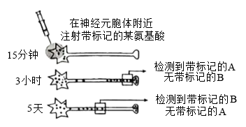
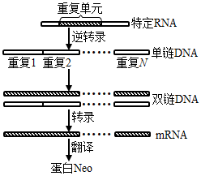
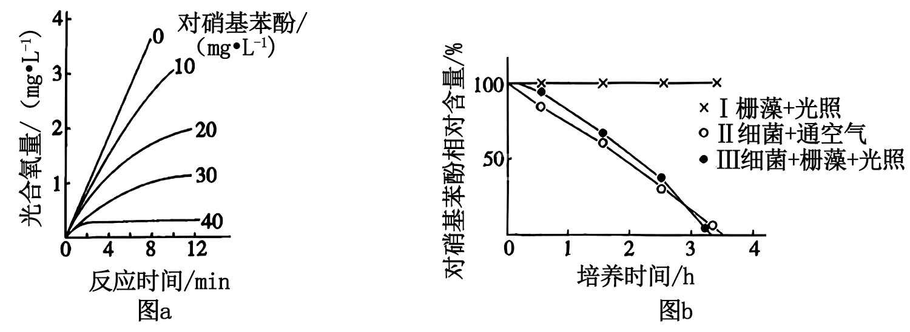
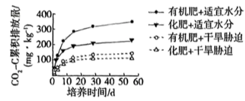

**2025年湖南省普通高中学业水平选择性考试**

**生物学**

**一、选择题：本题共12小题，每小题2分，共24分。在每小题给出的四个选项中，只有一项是符合题目要求的。**

1\. T细胞是重要的免疫细胞。下列叙述错误的是（　　）

A. T细胞来自骨髓造血干细胞并在骨髓中成熟

B. 树突状细胞可将病毒相关抗原呈递给辅助性T细胞

C. 辅助性T细胞可参与细胞毒性T细胞的活化

D. T细胞可集中分布在淋巴结等免疫器官

2\. 用替代的实验材料或者试剂开展下列实验，不能达成实验目的的是（　　）

|     |                                                                                                                  |                     |
|:--- |:---------------------------------------------------------------------------------------------------------------- |:------------------- |
| 选项  | 实验内容                                                                                                             | 替代措施                |
| A   | 用高倍显微镜观察叶绿体                                                                                                      | 用“菠菜叶”替代“藓类叶片”      |
| B   | DNA的粗提取与鉴定                                                                                                       | 用“猪成熟红细胞”替代“猪肝细胞”   |
| C   | 观察根尖分生区组织细胞有丝分裂 | 用“醋酸洋红液”替代“甲紫溶液”    |
| D   | 比较过氧化氢在不同条件下的分解                                                                                                  | 用“过氧化氢酶溶液”替代“肝脏研磨液” |

A. A B. B C. C D. D

3\. 蛋白R功能缺失与人血液低胆固醇水平相关。蛋白R是肝细胞膜上的受体，参与去唾液酸糖蛋白的胞吞和降解，从而调节胆固醇代谢。下列叙述错误的是（　　）

A. 去唾液酸糖蛋白的胞吞过程需要消耗能量

B. 去唾液酸糖蛋白的胞吞离不开膜脂的流动

C. 抑制蛋白R合成能增加血液胆固醇含量

D. 去唾液酸糖蛋白可以在溶酶体中被降解

4\. 单一使用干扰素-γ治疗肿瘤效果有限。降低线粒体蛋白V合成，不影响癌细胞凋亡，但同时加入干扰素-γ能破坏线粒体膜结构，促进癌细胞凋亡。下列叙述错误的是（　　）

A. 癌细胞凋亡是由基因决定的

B. 蛋白V可能抑制干扰素-γ诱发的癌细胞凋亡

C. 线粒体膜结构破坏后，其DNA可能会释放

D. 抑制蛋白V合成会减弱肿瘤治疗的效果

5\. 采集果园土壤进行微生物分离或计数。下列叙述正确的是（　　）

A. 稀释涂布平板法和平板划线法都能用于尿素分解菌的分离和计数

B. 完成平板划线后，培养时需增加一个未接种的平板作为对照

C. 土壤中分离得到的醋酸菌能在无氧条件下将葡萄糖分离成乙酸

D. 用于筛选尿素分解菌的培养基含有蛋白胨、尿素和无机盐等营养物质

6\. 酸碱平衡是维持人体正常生命活动的必要条件之一。下列叙述正确的是（　　）

A. 细胞内液的酸碱平衡与无机盐离子无关

B. 血浆的酸碱平衡与等物质有关

C. 胃蛋白酶进入肠道后失活与内环境酸碱度有关

D. 肌细胞无氧呼吸分解葡萄糖产生的参与酸碱平衡的调节

7\. 机体可通过信息分子协调各组织器官活动。下列叙述正确的是（　　）

A. 甲状腺激素能提高神经系统的兴奋性

B. 抗利尿激素和醛固酮协同提高血浆中Na+含量

C. 交感神经兴奋释放神经递质，促进消化腺分泌活动

D. 下丘脑释放促肾上腺皮质激素，增强肾上腺分泌功能

8\. 为调查某自然保护区动物资源现状，研究人员利用红外触发相机记录到多种动物，其中豹猫、猪獾在海拔分布上重叠度较高。下列叙述错误的是（　　）

A. 建立自然保护区可对豹猫进行最有效保护

B. 该保护区的豹猫和猪獾处于相同的生态位

C. 红外触发相机能用于调查豹猫的种群数量

D. 食物是影响豹猫种群数量变化的密度制约因素

9\. 基因W编码的蛋白W能直接抑制核基因P和M转录起始。P和M可分别提高水稻抗虫性和产量。下列叙述错误的是（　　）

A. 蛋白W在细胞核中发挥调控功能

B. 敲除基因W有助于提高水稻抗虫性和产量

C. 在基因P缺失突变体水稻中，增加基因W的表达量能提高其抗虫性

D. 蛋白W可能通过抑制RNA聚合酶识别基因P和M的启动子而发挥作用

10\. 顺向轴突运输分快速轴突运输（主要运输跨膜蛋白L）和慢速轴突运输（主要运输细胞骨架蛋白）两种，都以移动、停滞反复交替的方式（移动时速度无差异）向轴突末梢运输物质。用带标记的某氨基酸（合成蛋白A和B所必需）分析蛋白A和B的轴突运输方式，实验如图。下列叙述正确的是（　　）

A. 氨基酸通过自由扩散进入细胞

B. 蛋白A是一种细胞骨架蛋白

C. 轴突运输中，胞体中形成的突触小泡与跨膜蛋白L的运输方向不同

D. 在单位时间内，运输蛋白B时的停滞时间长于蛋白A

11\. 被噬菌体侵染时，某细菌以一特定RNA片段为重复单元，逆转录成串联重复DNA，再指导合成含多个串联重复肽段的蛋白Neo，如图所示。该蛋白能抑制细菌生长，从而阻止噬菌体利用细胞资源。下列叙述错误的是（　　）

A. 噬菌体侵染细菌时，会将核酸注入细菌内

B. 蛋白Neo在细菌的核糖体中合成

C. 串联重复的双链DNA的两条链均可作为模板指导蛋白Neo合成

D. 串联重复DNA中单个重复单元转录产生的mRNA无终止密码子

12\. 在常温（20℃）、长日照条件下栽培某油菜品种，幼苗生长至4~5叶时，将部分植株置于低温（5℃）处理6周后，立即进行嫁接。然后将所有植株常温栽培。不同处理植株茎尖中赤霉素含量（鲜重）及开花情况如表所示。下列叙述正确的是（　　）

<table style="width:97%;">
<colgroup>
<col style="width: 24%" />
<col style="width: 11%" />
<col style="width: 15%" />
<col style="width: 15%" />
<col style="width: 15%" />
<col style="width: 15%" />
</colgroup>
<tbody>
<tr>
<td rowspan="2" style="text-align: left;">低温处理结束后（天）</td>
<td rowspan="2" style="text-align: left;">检测指标</td>
<td rowspan="2" style="text-align: left;">常温处理植株</td>
<td rowspan="2" style="text-align: left;">低温处理植株</td>
<td style="text-align: left;">常温处理接穗</td>
<td style="text-align: left;">常温处理接穗</td>
</tr>
<tr>
<td style="text-align: left;">常温处理砧木</td>
<td style="text-align: left;">低温处理砧木</td>
</tr>
<tr>
<td style="text-align: left;">0</td>
<td style="text-align: left;">赤霉素</td>
<td style="text-align: left;">90.2</td>
<td style="text-align: left;">215.3</td>
<td style="text-align: left;">/</td>
<td style="text-align: left;">/</td>
</tr>
<tr>
<td style="text-align: left;">15</td>
<td style="text-align: left;">赤霉素</td>
<td style="text-align: left;">126.4</td>
<td style="text-align: left;">632.0</td>
<td style="text-align: left;">113.8</td>
<td style="text-align: left;">582.0</td>
</tr>
<tr>
<td style="text-align: left;">50</td>
<td style="text-align: left;">开花情况</td>
<td style="text-align: left;">不开花</td>
<td style="text-align: left;">开花</td>
<td style="text-align: left;">不开花</td>
<td style="text-align: left;">开花</td>
</tr>
</tbody>
</table>

A. 除赤霉素外，低温处理诱导油菜开花不需要其他物质参与

B. 赤霉素直接参与油菜开花生理代谢反应的浓度需达到某临界值

C. 将油菜幼苗的成熟叶片置于低温下，其余部位置于常温，不能诱导开花

D. 若外源赤霉素代替低温也能促进油菜开花，则两者诱导开花的代谢途径相同

**二、选择题：本题共4小题，每小题4分，共16分。在每小题给出的四个选项中，有一项或多项符合题目要求。全部选对的得4分，选对但不全的得2分，有选错的得0分。**

13\. 某人擅自在一湖泊中“放生”大量鲶鱼。短期内鲶鱼大量死亡，导致水质恶化，造成生态资源损失，此人被判承担相关责任。下列叙述正确的是（　　）

A. 鲶鱼同化的能量可用于自身生长发育繁殖

B. 鲶鱼死亡的原因可能是水体中氧气不足

C. 鲶鱼死亡与水质恶化间存在负反馈调节

D. 移除死鱼有助于缩短该湖泊恢复原状的时间

14\. 红细胞凝集的本质是抗原—抗体反应。ABO血型分型依据如表。A和B抗原都在H抗原的基础上形成，基因H决定H抗原的形成，基因H缺失者血清中有抗A、抗B和抗H抗体。下列叙述错误的是（　　）

|     |          |         |
|:--- |:-------- |:------- |
| 血型  | 红细胞膜上的抗原 | 血清中的抗体  |
| A   | A        | 抗B      |
| B   | B        | 抗A      |
| AB  | A和B      | 抗A、抗B均无 |
| O   | A、B均无    | 抗A、抗B   |

A. A和B抗原都是红细胞的分子标签

B. 若按ABO血型分型依据，基因H缺失者的血型属于O型

C. O型血的血液与A型血的血清混合，会发生红细胞凝集

D. 基因H缺失者的血液与基因H正常的O型血液混合，不会发生红细胞凝集

15\. Cl属于植物的微量元素。分别用渗透压相同、Na+或Cl-物质的量浓度也相同的三种溶液处理某荒漠植物（不考虑溶液中其他离子的影响）。5天后，与对照组（Ⅰ）相比，Ⅱ和Ⅲ组光合速率降低，而Ⅳ组无显著差异；各组植株的地上部分和根中Cl-、K+含量如图所示。下列叙述错误的是（　　）

注：Ⅰ对照（正常栽培）；Ⅱ．NaCl溶液；Ⅲ．Na+浓度与Ⅱ中相同、无Cl-的溶液；Ⅳ．Cl-浓度与Ⅱ中相同、无Na+的溶液

A. 过量的Cl-可能储存于液泡中，以避免高浓度Cl-对细胞的毒害

B. 溶液中Cl-浓度越高，该植物向地上部分转运的K+量越多

C. Na+抑制该植物组织中K+的积累，有利于维持Na+、K+的平衡

D. K+从根转运到地上部分的组织细胞中需要消耗能量

16\. 已知甲、乙家系的耳聋分别由基因E、F突变导致；丙家系耳聋由线粒体基因G突变为g所致，部分个体携带基因g但听力正常。下列叙述错误的是（　　）

A. 听觉相关基因在人的DNA上本来就存在

B. 遗传病是由获得了双亲的致病遗传物质所致

C. 含基因g的线粒体积累到一定程度才会导致耳聋

D. 甲、乙家系的耳聋是多基因遗传病

**三、非选择题：本题共5小题，共60分。**

17\. 对硝基苯酚可用于生产某些农药和染料，其化学性质稳定。研究发现，某细菌不能在无氧条件下生长，在适宜条件下能降解和利用对硝基苯酚，并释放。在Burk无机培养基和光照条件下，培养某栅藻（真核生物）的过程中，对硝基苯酚含量与栅藻光合放氧量的关系如图a。为进一步分析栅藻与细菌共培养条件下对硝基苯酚的降解情况，开展了Ⅰ、Ⅱ和Ⅲ组对比实验，结果如图b。回答下列问题：

（1）栅藻的光合放氧反应部位是\_\_\_\_\_\_（填细胞器名称）。图a结果表明，对硝基苯酚\_\_\_\_\_\_栅藻的光合放氧反应。

（2）细菌在利用对硝基苯酚时，限制因子是\_\_\_\_\_\_。

（3）若Ⅰ中对硝基苯酚含量为，培养10min后，推测该培养液pH会\_\_\_\_\_\_，培养液中对硝基苯酚相对含量\_\_\_\_\_\_。

（4）细菌与栅藻通过原始合作，可净化被对硝基苯酚污染的水体，理由是\_\_\_\_\_\_。

18\. 未成熟豌豆豆荚的绿色和黄色是一对相对性状，科研人员揭示了该相对性状的部分遗传机制。回答下列问题：

（1）纯合绿色豆荚植株与纯合黄色豆荚植株杂交，只有一种表型。自交得到的中，绿色和黄色豆荚植株数量分别为297株和105株，则显性性状为\_\_\_\_\_\_。

（2）进一步分析发现：相对于绿色豆荚植株，黄色豆荚植株中基因H（编码叶绿素合成酶）的上游缺失非编码序列G。为探究G和下游H的关系，研究人员拟将某绿色豆荚植株的基因H突变为h（突变位点如图a所示，h编码的蛋白无功能），然后将获得的Hh植株与黄色豆荚植株杂交，思路如图a：

①为筛选Hh植株，根据突变位点两侧序列设计一对引物提取待测植株的DNA进行PCR。若扩增产物电泳结果全为预测的1125bp，则基因H可能未发生突变，或发生了碱基对的\_\_\_\_\_\_；若H的扩增产物能被酶切为699bp和426bp的片段，而h的酶切位点丧失，则图b（扩增产物酶切后电泳结果）中的\_\_\_\_\_\_（填“Ⅰ”“Ⅱ”或“Ⅲ”）对应的是Hh植株。

②若图a的中绿色豆荚：黄色豆荚=1：1，则中黄色豆荚植株的基因型为\_\_\_\_\_\_\[书写以图a中亲本黄色豆荚植株的基因型（△G+H）/（△G+H）为例，其中“△G”表示缺失G\]。据此推测中黄色豆荚植株产生的遗传分子机制是\_\_\_\_\_\_。

③若图a的中两种基因型植株的数量无差异，但豆荚全为绿色，则说明\_\_\_\_\_\_。

19\. 为探究施肥方式和土壤水分对微生物利用秸秆中碳的影响，采集分别用有机肥和含等量养分的化肥处理的表层土壤，再添加等量玉米秸秆，在适宜水分或干旱胁迫条件下培养。源于秸秆的（表示中的C）排放结果如图所示。回答下列问题：

（1）碳在生物群落内部传递的形式是\_\_\_\_\_\_。碳循环在生命系统结构层次的\_\_\_\_\_\_中完成，体现了全球性。

（2）追踪秸秆中碳的去向可采用\_\_\_\_\_\_法。

（3）无论在适宜水分还是干旱胁迫条件下，施用\_\_\_\_\_\_（填“化肥”或“有机肥”）更能促进秸秆中有机物的氧化分解。

（4）秸秆用于沼气工程既改善了生态环境，又提高了社会和经济效益，体现了生态工程的\_\_\_\_\_\_原理。秸秆还可在沙漠中用于防风固沙，使土壤颗粒和有机物逐渐增多，为\_\_\_\_\_\_的形成创造条件，有利于植被形成，逐渐提高生物多样性。

20\. 气味分子与小鼠嗅细胞膜上特定受体结合，激活嗅细胞，嗅觉神经通路兴奋，产生嗅觉。激活小鼠LDT脑区细胞，奖赏神经通路兴奋，可使其愉快；而激活LHb脑区细胞，惩罚神经通路兴奋，可使其痛苦。实验小鼠的嗅细胞、LDT和LHb脑区细胞可被特殊光源激活。A和C是两种气味完全不同的物品，小鼠嗅细胞M、嗅细胞X分别识别A、C中的气味分子。研究人员通过以下实验探讨脑的某些高级功能，实验如表。回答下列问题：

<table style="width:100%;">
<colgroup>
<col style="width: 6%" />
<col style="width: 15%" />
<col style="width: 11%" />
<col style="width: 6%" />
<col style="width: 6%" />
<col style="width: 53%" />
</colgroup>
<tbody>
<tr>
<td rowspan="3" style="text-align: left;">组别</td>
<td colspan="4" style="text-align: left;">处理</td>
<td rowspan="3" style="text-align: left;">处理24h后放入观测盒中，记录小鼠在两侧的停留时间</td>
</tr>
<tr>
<td rowspan="2" style="text-align: left;">足部反复电击</td>
<td colspan="3" style="text-align: left;">特殊光源反复刺激</td>
</tr>
<tr>
<td style="text-align: left;">嗅细胞M</td>
<td style="text-align: left;">LDT</td>
<td style="text-align: left;">LHb</td>
</tr>
<tr>
<td style="text-align: left;">对照</td>
<td style="text-align: left;">-</td>
<td style="text-align: left;">-</td>
<td style="text-align: left;">-</td>
<td style="text-align: left;">-</td>
<td style="text-align: left;">无差异</td>
</tr>
<tr>
<td style="text-align: left;">Ⅰ</td>
<td style="text-align: left;">√</td>
<td style="text-align: left;">√</td>
<td style="text-align: left;">-</td>
<td style="text-align: left;">-</td>
<td style="text-align: left;">较长时间停留在有C的一侧</td>
</tr>
<tr>
<td style="text-align: left;">Ⅱ</td>
<td style="text-align: left;">-</td>
<td style="text-align: left;">√</td>
<td style="text-align: left;">-</td>
<td style="text-align: left;">-</td>
<td style="text-align: left;">无差异</td>
</tr>
<tr>
<td style="text-align: left;">Ⅲ</td>
<td style="text-align: left;">-</td>
<td style="text-align: left;">-</td>
<td style="text-align: left;">√</td>
<td style="text-align: left;">-</td>
<td style="text-align: left;">无差异</td>
</tr>
<tr>
<td style="text-align: left;">Ⅳ</td>
<td style="text-align: left;">-</td>
<td style="text-align: left;">√</td>
<td style="text-align: left;">√</td>
<td style="text-align: left;">-</td>
<td style="text-align: left;">较长时间停留在有A的一侧</td>
</tr>
<tr>
<td style="text-align: left;">Ⅴ</td>
<td style="text-align: left;">-</td>
<td style="text-align: left;">-</td>
<td style="text-align: left;">-</td>
<td style="text-align: left;">√</td>
<td style="text-align: left;">无差异</td>
</tr>
<tr>
<td style="text-align: left;">Ⅵ</td>
<td style="text-align: left;">-</td>
<td style="text-align: left;">√</td>
<td style="text-align: left;">-</td>
<td style="text-align: left;">√</td>
<td style="text-align: left;">______？</td>
</tr>
</tbody>
</table>

注：观测盒内正中间用带小孔的隔板分为左右两侧，分别放置物品A和C，小鼠可通过小孔在盒内自由移动。“-”表示未处理，“√”表示处理，两个“√”表示同时实施两种处理。

（1）当观测盒中Ⅳ组小鼠接触物品A时，产生兴奋的神经通路是\_\_\_\_\_\_和\_\_\_\_\_\_。该组小鼠在建立条件反射的过程中，条件刺激的靶细胞是\_\_\_\_\_\_。

（2）推测Ⅵ组的结果是\_\_\_\_\_\_。

（3）Ⅰ和Ⅳ组小鼠的行为特点存在差异，从脑的高级功能角度分析，这与小鼠脑内储存的\_\_\_\_\_\_不同有关。若要实现实验小鼠偏爱物品C，写出处理措施\_\_\_\_\_\_（不考虑使用任何有气味的物品）。

21\. 非洲猪瘟病毒是一种双链DNA病毒，可引起急性猪传染病。基因A编码该病毒的主要结构蛋白A，其在病毒侵入宿主细胞和诱导机体免疫应答过程中发挥重要作用。回答下列问题：

（1）制备特定抗原

①获取基因A，构建重组质粒（该质粒的部分结构如图所示）。重组质粒的必备元件包括目的基因、限制酶切割位点、标记基因、启动子和\_\_\_\_\_\_等；为确定基因A已连接到质粒中且插入方向正确，应选用图中的一对引物\_\_\_\_\_\_对待测质粒进行PCR扩增，预期扩增产物的片段大小为\_\_\_\_\_\_bp。

②将DNA测序正确的重组质粒转入大肠杆菌构建重组菌。培养重组菌，诱导蛋白A合成。收集重组菌发酵液进行离心，发现上清液中无蛋白A，可能的原因是\_\_\_\_\_\_（答出两点即可）。

（2）制备抗蛋白A单克隆抗体

用蛋白A对小鼠进行免疫后，将免疫小鼠B淋巴细胞与骨髓瘤细胞融合，诱导融合的常用方法有\_\_\_\_\_\_（答出一种即可）。选择培养时，对杂交瘤细胞进行克隆化培养和\_\_\_\_\_\_，多次筛选获得足够数量的能分泌所需抗体的细胞。体外培养或利用小鼠大量生产的抗蛋白A单克隆抗体，可用于非洲猪瘟的早期诊断。
