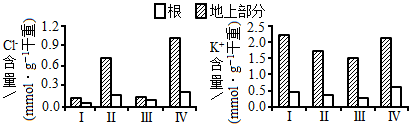
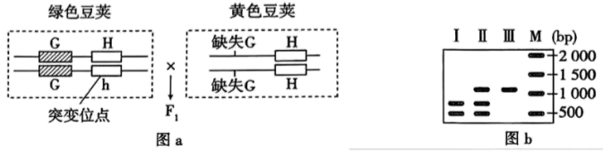
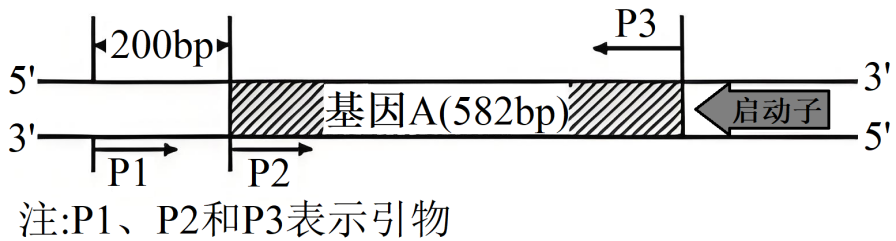

**2025年湖南省普通高中学业水平选择性考试**

**生物学**

**一、选择题：本题共12小题，每小题2分，共24分。在每小题给出的四个选项中，只有一项是符合题目要求的。**

1\. T细胞是重要的免疫细胞。下列叙述错误的是（　　）

A. T细胞来自骨髓造血干细胞并在骨髓中成熟

B. 树突状细胞可将病毒相关抗原呈递给辅助性T细胞

C. 辅助性T细胞可参与细胞毒性T细胞的活化

D. T细胞可集中分布在淋巴结等免疫器官

【答案】A

【解析】

【分析】体液免疫过程：①一些病原体可以和B细胞接触，为激活B细胞提供第一个信号；②树突状细胞、B细胞等抗原呈递细胞摄取病原体，而后对抗原进行处理，呈递在细胞表面，然后传递给辅助性T细胞；③辅助性T细胞表面特定分子发生变化并与B细胞结合，这是激活B细胞的第二个信号；辅助性T细胞开始分裂、分化，并分泌细胞因子；④B细胞受到两个信号的刺激后开始分裂、分化，大部分分化为浆细胞，小部分分化为记忆B细胞。细胞因子能促进B细胞的分裂、分化过程。⑤浆细胞产生和分泌大量抗体，抗体可以随体液在全身循环并与病原体结合。抗体与病原体的结合可以抑制病原体的增殖或对人体细胞的黏附。

【详解】A、T细胞起源于骨髓造血干细胞，但迁移到胸腺中成熟，而非骨髓。骨髓是B细胞成熟的场所，A错误；

B、树突状细胞作为抗原呈递细胞，能摄取、处理病毒抗原，并将其呈递给辅助性T细胞，B正确；

C、辅助性T细胞通过分泌细胞因子并提供第二信号，参与激活细胞毒性T细胞，C正确；

D、T细胞作为淋巴细胞，主要分布在淋巴结、脾等免疫器官中，D正确。

故选A。

2\. 用替代的实验材料或者试剂开展下列实验，不能达成实验目的的是（　　）

|     |                  |                     |
|:--- |:---------------- |:------------------- |
| 选项  | 实验内容             | 替代措施                |
| A   | 用高倍显微镜观察叶绿体      | 用“菠菜叶”替代“藓类叶片”      |
| B   | DNA的粗提取与鉴定       | 用“猪成熟红细胞”替代“猪肝细胞”   |
| C   | 观察根尖分生区组织细胞的有丝分裂 | 用“醋酸洋红液”替代“甲紫溶液”    |
| D   | 比较过氧化氢在不同条件下的分解  | 用“过氧化氢酶溶液”替代“肝脏研磨液” |

A. A B. B C. C D. D

【答案】B

【解析】

【分析】制作装片流程：解离→漂洗→染色→制片。解离的目的是用药液使组织中的细胞相互分离开来，漂洗的目的是洗去药液，防止解离过度，染色时用甲紫溶液或醋酸洋红液能使染色体着色。

【详解】A、藓类叶片薄，只有一层细胞，可直接用于观察叶绿体，菠菜叶由多层细胞构成，但可用菠菜叶稍带些叶肉的下表皮细胞来观察叶绿体，因为叶肉细胞中有叶绿体，所以能用“菠菜叶”替代“藓类叶片”进行高倍显微镜观察叶绿体的实验，A正确；

B、猪是哺乳动物，猪成熟红细胞没有细胞核和众多细胞器，也就不含DNA，而猪肝细胞含有细胞核和线粒体等含有DNA的结构，所以不能用“猪成熟红细胞”替代“猪肝细胞”进行DNA的粗提取与鉴定实验，B错误；

C、醋酸洋红液和甲紫溶液都属于碱性染料，都能使染色体着色，所以在观察根尖分生区组织细胞的有丝分裂实验中，能用“醋酸洋红液”替代“甲紫溶液”，C正确；

D、肝脏研磨液中含有过氧化氢酶，所以在比较过氧化氢在不同条件下的分解实验中，能用“过氧化氢酶溶液”替代“肝脏研磨液”，D正确。

故选B。

3\. 蛋白R功能缺失与人血液低胆固醇水平相关。蛋白R是肝细胞膜上的受体，参与去唾液酸糖蛋白的胞吞和降解，从而调节胆固醇代谢。下列叙述错误的是（　　）

A. 去唾液酸糖蛋白的胞吞过程需要消耗能量

B. 去唾液酸糖蛋白的胞吞离不开膜脂的流动

C. 抑制蛋白R合成能增加血液胆固醇含量

D. 去唾液酸糖蛋白可以在溶酶体中被降解

【答案】C

【解析】

【分析】当细胞摄取大分子时，首先是大分子与膜上的蛋白质结合，从而引起这部分细胞膜内陷形成小囊，包围着大分 子。然后，小囊从细胞膜上分离下来，形成囊泡，进入细胞内部，这种现象叫胞吞。细胞需要外排的大 分子，先在细胞内形成囊泡，囊泡移动到细胞膜处，与细胞膜融合，将大分子排出细胞，这种现象叫胞吐。在物质的跨膜运输过程中，胞吞、胞吐是普遍存在的现象，它们也需要消耗细胞呼吸所释放的能量。

【详解】A、胞吞过程是一个耗能过程，需要消耗能量，去唾液酸糖蛋白的胞吞也不例外，A正确；

B、胞吞过程中细胞膜会发生形态的改变，这依赖于膜脂的流动性，所以去唾液酸糖蛋白的胞吞离不开膜脂的流动，B正确；

C、已知蛋白R功能缺失与人血液低胆固醇水平相关，蛋白R参与去唾液酸糖蛋白的胞吞和降解从而调节胆固醇代谢，那么抑制蛋白R合成，会使蛋白R减少，可能导致血液中胆固醇水平降低，而不是增加，C错误；

D、溶酶体中含有多种水解酶，能够分解衰老、损伤的细胞器，吞噬并杀死侵入细胞的病毒或细菌等，去唾液酸糖蛋白被胞吞后可以在溶酶体中被降解，D正确。

故选C。

4\. 单一使用干扰素-γ治疗肿瘤效果有限。降低线粒体蛋白V合成，不影响癌细胞凋亡，但同时加入干扰素-γ能破坏线粒体膜结构，促进癌细胞凋亡。下列叙述错误的是（　　）

A. 癌细胞凋亡是由基因决定的

B. 蛋白V可能抑制干扰素-γ诱发的癌细胞凋亡

C. 线粒体膜结构破坏后，其DNA可能会释放

D. 抑制蛋白V合成会减弱肿瘤治疗的效果

【答案】D

【解析】

【分析】细胞凋亡是由基因决定的细胞自动结束生命的过程，在成熟的生物体中，细胞的自然更新、被病原体感染的细胞的清除都是通过细胞凋亡完成的。

【详解】A、细胞凋亡是由基因决定的细胞自动结束生命的过程，癌细胞凋亡也不例外，A正确；

B、根据题意，降低线粒体蛋白V合成，不影响癌细胞凋亡，但与干扰素-γ同时作用能促进癌细胞凋亡，由此推测蛋白V可能抑制干扰素-γ诱发的癌细胞凋亡，B正确；

C、线粒体是半自主性细胞器，含有少量DNA，线粒体膜结构破坏后，其DNA可能会释放出来，C正确；

D、由题可知，降低线粒体蛋白V合成，再同时加入干扰素-γ能促进癌细胞凋亡，所以抑制蛋白V合成会增强肿瘤治疗的效果，而不是减弱，D错误。

故选D。

5\. 采集果园土壤进行微生物分离或计数。下列叙述正确的是（　　）

A. 稀释涂布平板法和平板划线法都能用于尿素分解菌的分离和计数

B. 完成平板划线后，培养时需增加一个未接种的平板作为对照

C. 土壤中分离得到的醋酸菌能在无氧条件下将葡萄糖分离成乙酸

D. 用于筛选尿素分解菌的培养基含有蛋白胨、尿素和无机盐等营养物质

【答案】B

【解析】

【分析】微生物常用的接种方法有平板划线法和稀释涂布平板法，平板划线主要是用来纯化的，稀释涂布主要用来计数；此外，利用分离对象对某一营养物质的“嗜好”，专门在培养基中加入该营养物质，制备选择培养基，从而使该微生物大量增殖，也可用于微生物的分离和纯化。

【详解】A、稀释涂布平板法可通过菌落数进行计数，而平板划线法仅用于分离纯化菌种，无法计数，A错误；

B、平板划线法操作后需设置未接种的平板作为空白对照，以验证培养基灭菌是否彻底，B正确；

C、醋酸菌为严格好氧菌，其代谢需氧气，无氧条件下无法将葡萄糖转化为乙酸，C错误；

D、筛选尿素分解菌的培养基应以尿素为唯一氮源，若含蛋白胨（含其他氮源），则无法筛选目标菌，D错误。

故选B

6\. 酸碱平衡是维持人体正常生命活动的必要条件之一。下列叙述正确的是（　　）

A. 细胞内液的酸碱平衡与无机盐离子无关

B. 血浆的酸碱平衡与等物质有关

C. 胃蛋白酶进入肠道后失活与内环境酸碱度有关

D. 肌细胞无氧呼吸分解葡萄糖产生的参与酸碱平衡的调节

【答案】B

【解析】

【分析】关于“内环境稳态的调节”应掌握以下几点：(1） 实质：体内渗透压、温度、pH等理化特性呈现动态平衡的过程；（2）定义：在神经系统和体液的调节下，通过各个器官、系统的协调活动，共同维持内环境相对稳定的状态；(3） 调节机制：神经—体液—免疫调节网络；(4）层面：水、无机盐、血糖、体温等的平衡与调节；(5） 意义：机体进行正常生命活动的必要条件。

【详解】A、细胞内液的酸碱平衡依赖缓冲系统（如磷酸盐缓冲对），而缓冲物质属于无机盐离子，A错误；

B、血浆中的是主要的缓冲对，能中和酸性或碱性物质，维持pH稳定，B正确；

C、但肠道属于外界环境，而非内环境（内环境为血浆、组织液、淋巴），C错误；

D、肌细胞无氧呼吸产物为乳酸，不产生，由有氧呼吸产生，D错误。

故选B。

7\. 机体可通过信息分子协调各组织器官活动。下列叙述正确的是（　　）

A. 甲状腺激素能提高神经系统的兴奋性

B. 抗利尿激素和醛固酮协同提高血浆中Na+含量

C. 交感神经兴奋释放神经递质，促进消化腺分泌活动

D. 下丘脑释放促肾上腺皮质激素，增强肾上腺分泌功能

【答案】A

【解析】

【分析】人体缺水时，细胞外液渗透压升高，刺激下丘脑渗透压感受器兴奋，一方面由下丘脑合成分泌、垂体释放的抗利尿激素增多，促进肾小管和集合管重吸收水。另一方面大脑皮层产生渴感，调节人主动饮水，使细胞外液渗透压降低。

【详解】A、甲状腺激素具有促进新陈代谢和生长发育，提高神经系统兴奋性的作用，A正确；

B、抗利尿激素的作用是促进肾小管和集合管对水的重吸收，醛固酮的作用是促进肾小管和集合管对Na+的重吸收和对K+的分泌，二者不是协同提高血浆中Na+含量，B错误；

C、交感神经兴奋时，会抑制消化腺的分泌活动，副交感神经兴奋时促进消化腺分泌，C错误；

D、下丘脑释放促肾上腺皮质激素释放激素，垂体释放促肾上腺皮质激素，促肾上腺皮质激素能增强肾上腺分泌功能，D错误。

故选A。

8\. 为调查某自然保护区动物资源现状，研究人员利用红外触发相机记录到多种动物，其中豹猫、猪獾在海拔分布上重叠度较高。下列叙述错误的是（　　）

A. 建立自然保护区可对豹猫进行最有效保护

B. 该保护区的豹猫和猪獾处于相同的生态位

C. 红外触发相机能用于调查豹猫的种群数量

D. 食物是影响豹猫种群数量变化的密度制约因素

【答案】B

【解析】

【分析】调查动物种群密度的常用方法，如样方法，标记重捕法，往往需要直接观察或捕捉个体。在调查生活在荫蔽、复杂环境中的动物，特别是猛禽和猛兽时，这些方法就不适用了，可通过红外触发相机、粪便等进行调查。

【详解】A、建立自然保护区属于就地保护，是对生物多样性最有效的保护措施，所以对豹猫进行最有效保护的方式是建立自然保护区，A正确；

B、虽然豹猫和猪獾在海拔分布上重叠度较高，但生态位是指一个物种在群落中的地位或作用，包括所处的空间位置、占用资源情况以及与其他物种的关系等。不同物种通常具有不同的生态位，即使在空间分布上有重叠，它们在食物、行为等方面也可能存在差异，所以豹猫和猪獾不可能处于相同的生态位，B错误；

C、红外触发相机可以在不干扰动物的情况下，对一定区域内的豹猫进行拍摄记录，通过对拍摄到的个体进行识别和统计等方法，能够用于调查豹猫的种群数量，C正确；

D、密度制约因素是指影响种群数量变化的因素，其作用强度与种群密度有密切关系。食物的多少会随着豹猫种群密度的变化而对豹猫种群数量产生影响，当种群密度增大时，食物相对不足，会限制种群数量增长，所以食物是影响豹猫种群数量变化的密度制约因素，D正确。

故选B。

9\. 基因W编码的蛋白W能直接抑制核基因P和M转录起始。P和M可分别提高水稻抗虫性和产量。下列叙述错误的是（　　）

A. 蛋白W在细胞核中发挥调控功能

B. 敲除基因W有助于提高水稻抗虫性和产量

C. 在基因P缺失突变体水稻中，增加基因W的表达量能提高其抗虫性

D. 蛋白W可能通过抑制RNA聚合酶识别基因P和M的启动子而发挥作用

【答案】C

【解析】

【分析】转录过程以四种核糖核苷酸为原料，以DNA分子的一条链为模板，在RNA聚合酶的作用下消耗能量，合成RNA。

【详解】A、因为蛋白W能抑制核基因P和M的转录起始，转录发生在细胞核中，所以蛋白W在细胞核中发挥调控功能，A正确；

B、敲除基因W后，就不会有蛋白W抑制核基因P和M的转录起始，P和M能正常表达，有助于提高水稻抗虫性和产量，B正确；

C、在基因P缺失突变体水稻中，本身就没有基因P ，增加基因W的表达量也无法提高其抗虫性，因为没有基因P来发挥提高抗虫性的作用，C错误；

D、转录起始需要RNA聚合酶识别基因的启动子，蛋白W能抑制核基因P和M转录起始，可能是通过抑制RNA聚合酶识别基因P和M的启动子而发挥作用，D正确。

故选C。

10\. 顺向轴突运输分快速轴突运输（主要运输跨膜蛋白L）和慢速轴突运输（主要运输细胞骨架蛋白）两种，都以移动、停滞反复交替的方式（移动时速度无差异）向轴突末梢运输物质。用带标记的某氨基酸（合成蛋白A和B所必需）分析蛋白A和B的轴突运输方式，实验如图。下列叙述正确的是（　　）

A. 氨基酸通过自由扩散进入细胞

B. 蛋白A是一种细胞骨架蛋白

C. 轴突运输中，胞体中形成的突触小泡与跨膜蛋白L的运输方向不同

D. 在单位时间内，运输蛋白B时的停滞时间长于蛋白A

【答案】D

【解析】

【分析】物质跨膜运输：自由扩散是从高浓度运输到低浓度，不需要载体和能量，如水、CO2、甘油；协助扩散是从高浓度运输到低浓度，需要载体，不需要能量，如红细胞吸收葡萄糖；主动运输是从低浓度运输到高浓度，需要载体和能量，如小肠绒毛上皮细胞吸收氨基酸、葡萄糖、K+、Na+等。

【详解】A、氨基酸是小分子物质，且是极性分子，一般通过主动运输的方式进入细胞，而非自由扩散，A错误；

B、已知顺向轴突运输分快速轴突运输（主要运输跨膜蛋白L）和慢速轴突运输（主要运输细胞骨架蛋白）两种，在注射带标记的氨基酸，3小时就检测到带标记的A，5天才检测到带标记的B，说明蛋白A的运输速度快，属于快速轴突运输，所以蛋白A不是细胞骨架蛋白（细胞骨架蛋白是慢速轴突运输），B错误；

C、轴突运输中，胞体中形成的突触小泡与跨膜蛋白L都是向轴突末梢运输，运输方向相同，C错误；

D、由于蛋白A是快速轴突运输，蛋白B是慢速轴突运输，且二者移动时速度无差异，那么慢速轴突运输在单位时间内移动得少，是因为停滞时间长，所以在单位时间内，运输蛋白B时的停滞时间长于蛋白A，D正确。 

故选D。

11\. 被噬菌体侵染时，某细菌以一特定RNA片段为重复单元，逆转录成串联重复DNA，再指导合成含多个串联重复肽段的蛋白Neo，如图所示。该蛋白能抑制细菌生长，从而阻止噬菌体利用细胞资源。下列叙述错误的是（　　）

A. 噬菌体侵染细菌时，会将核酸注入细菌内

B. 蛋白Neo在细菌的核糖体中合成

C. 串联重复的双链DNA的两条链均可作为模板指导蛋白Neo合成

D. 串联重复DNA中单个重复单元转录产生的mRNA无终止密码子

【答案】C

【解析】

【分析】中心法则：

（1）遗传信息可以从DNA流向DNA，即DNA的复制；

（2）遗传信息可以从DNA流向RNA，进而流向蛋白质，即遗传信息的转录和翻译。后来中心法则又补充了遗传信息从RNA流向RNA以及从RNA流向DNA两条途径。

【详解】A、噬菌体侵染细菌时，会将自身的核酸注入细菌内，而蛋白质外壳留在外面，这是噬菌体侵染细菌的特点，A正确；

B、细菌有核糖体，蛋白Neo是在细菌细胞内合成的蛋白质，所以在细菌的核糖体中合成，B正确；

C、在转录过程中，以DNA的一条链为模板合成mRNA，进而指导蛋白质的合成，而不是双链DNA的两条链都作为模板指导蛋白Neo合成，C错误；

D、因为最终合成的是含多个串联重复肽段的蛋白Neo，说明串联重复DNA中单个重复单元转录产生的mRNA无终止密码子，若有终止密码子就会提前终止翻译，不能形成含多个串联重复肽段的蛋白，D正确。

故选C。

12\. 在常温（20℃）、长日照条件下栽培某油菜品种，幼苗生长至4~5叶时，将部分植株置于低温（5℃）处理6周后，立即进行嫁接。然后将所有植株常温栽培。不同处理植株茎尖中赤霉素含量（鲜重）及开花情况如表所示。下列叙述正确的是（　　）

<table style="width:97%;">
<colgroup>
<col style="width: 24%" />
<col style="width: 11%" />
<col style="width: 15%" />
<col style="width: 15%" />
<col style="width: 15%" />
<col style="width: 15%" />
</colgroup>
<tbody>
<tr>
<td rowspan="2" style="text-align: left;">低温处理结束后（天）</td>
<td rowspan="2" style="text-align: left;">检测指标</td>
<td rowspan="2" style="text-align: left;">常温处理植株</td>
<td rowspan="2" style="text-align: left;">低温处理植株</td>
<td style="text-align: left;">常温处理接穗</td>
<td style="text-align: left;">常温处理接穗</td>
</tr>
<tr>
<td style="text-align: left;">常温处理砧木</td>
<td style="text-align: left;">低温处理砧木</td>
</tr>
<tr>
<td style="text-align: left;">0</td>
<td style="text-align: left;">赤霉素</td>
<td style="text-align: left;">90.2</td>
<td style="text-align: left;">215.3</td>
<td style="text-align: left;">/</td>
<td style="text-align: left;">/</td>
</tr>
<tr>
<td style="text-align: left;">15</td>
<td style="text-align: left;">赤霉素</td>
<td style="text-align: left;">126.4</td>
<td style="text-align: left;">632.0</td>
<td style="text-align: left;">113.8</td>
<td style="text-align: left;">582.0</td>
</tr>
<tr>
<td style="text-align: left;">50</td>
<td style="text-align: left;">开花情况</td>
<td style="text-align: left;">不开花</td>
<td style="text-align: left;">开花</td>
<td style="text-align: left;">不开花</td>
<td style="text-align: left;">开花</td>
</tr>
</tbody>
</table>

A. 除赤霉素外，低温处理诱导油菜开花不需要其他物质参与

B. 赤霉素直接参与油菜开花生理代谢反应的浓度需达到某临界值

C. 将油菜幼苗的成熟叶片置于低温下，其余部位置于常温，不能诱导开花

D. 若外源赤霉素代替低温也能促进油菜开花，则两者诱导开花的代谢途径相同

【答案】C

【解析】

【分析】春化作用是指植物必须经历一段时间的持续低温才能由营养生长阶段转入生殖阶段生长的现象。春化作用的出现和休眠一样，也是植物应对恶劣环境的一种策略，植物在开花期时最脆弱，如果此时遇上低温，则很容易无法抵抗而导致不开花或死亡。所以经过长久的演化，植物会等待寒冬过去后再开花结实，以确保顺利繁衍后代。

【详解】A、低温处理可能通过诱导赤霉素合成及其他信号物质（如开花素）共同促进开花，仅赤霉素不足以说明无需其他物质，A错误；

B、赤霉素作为植物激素，通过调节基因表达等传递信息，而非直接参与代谢反应，B错误；

C、春化作用通常作用于分生组织（如茎尖），成熟叶片低温处理无法传递开花信号至茎尖，故不能诱导开花，C正确；

D、外源赤霉素作为植物生长调节剂诱导油菜开花，而低温是通过诱导内源激素的合成从而诱导开花，两者代谢途径不相同，D错误。

故选C。

**二、选择题：本题共4小题，每小题4分，共16分。在每小题给出的四个选项中，有一项或多项符合题目要求。全部选对的得4分，选对但不全的得2分，有选错的得0分。**

13\. 某人擅自在一湖泊中“放生”大量鲶鱼。短期内鲶鱼大量死亡，导致水质恶化，造成生态资源损失，此人被判承担相关责任。下列叙述正确的是（　　）

A. 鲶鱼同化的能量可用于自身生长发育繁殖

B. 鲶鱼死亡的原因可能是水体中氧气不足

C. 鲶鱼死亡与水质恶化间存在负反馈调节

D. 移除死鱼有助于缩短该湖泊恢复原状的时间

【答案】ABD

【解析】

【分析】正反馈：反馈信息与原输入信息起相同作用，使输出进一步增强的调节，负反馈是 生态系统、生物体内环境稳态调节等过程中常见的一种调节机制，核心是系统输出反过来抑制系统输入，让系统保持稳定 。

【详解】A、鲶鱼同化的能量包括呼吸消耗、分解者分解和用于自身生长、发育、繁殖的部分，A正确；

B、短期内大量鲶鱼导致水体溶解氧被迅速消耗，可能因缺氧死亡，B正确；

C、鲶鱼死亡导致水质恶化，进一步加剧死亡，属于正反馈而非负反馈调节，C错误；

D、移除死鱼可减少分解者耗氧和污染物积累，加速生态恢复，D正确。

故选ABD。

14\. 红细胞凝集的本质是抗原—抗体反应。ABO血型分型依据如表。A和B抗原都在H抗原的基础上形成，基因H决定H抗原的形成，基因H缺失者血清中有抗A、抗B和抗H抗体。下列叙述错误的是（　　）

|     |          |         |
|:--- |:-------- |:------- |
| 血型  | 红细胞膜上的抗原 | 血清中的抗体  |
| A   | A        | 抗B      |
| B   | B        | 抗A      |
| AB  | A和B      | 抗A、抗B均无 |
| O   | A、B均无    | 抗A、抗B   |

A. A和B抗原都是红细胞的分子标签

B. 若按ABO血型分型依据，基因H缺失者的血型属于O型

C. O型血的血液与A型血的血清混合，会发生红细胞凝集

D. 基因H缺失者的血液与基因H正常的O型血液混合，不会发生红细胞凝集

【答案】C

【解析】

【分析】根据红细胞表面有无特异性抗原（凝集原）A和B来划分血液类型系统，根据凝集原A、B的分布把血液分为A、B、AB、O四型．红细胞上只有凝集原A的为A型血，其血清中有抗B凝集素；红细胞上只有凝集原B的为B型血，其血清中有抗A的凝集素；红细胞上A、B两种凝集原都有的为AB型血，其血清中无抗A、抗B凝集素；红细胞上A、B两种凝集原皆无者为O型，其血清中抗A、抗B凝集素皆有．具有凝集原A的红细胞可被抗A凝集素凝集；抗B凝集素可使含凝集原B的红细胞发生凝集。

【详解】A、红细胞膜上的 A 和 B 抗原可以作为红细胞的分子标签，用于区分不同的血型，A 正确；

B、基因 H 缺失者不能形成 H 抗原，也就无法形成 A 和 B 抗原，血清中有抗 A、抗 B 和抗 H 抗体，按照 ABO 血型分型依据，其血型属于 O 型，B 正确；

C、O 型血红细胞膜上无 A、B 抗原，血清中有抗 A、抗 B 抗体；A 型血血清中有抗 B 抗体，O 型血的血液与 A 型血的血清混合，O 型血红细胞不会与 A 型血血清中的抗 B 抗体发生凝集反应，C 错误；

D、基因 H 缺失者血清中有抗 A、抗 B 和抗 H 抗体，基因 H 正常的 O 型血红细胞膜上无 A、B 抗原，二者血液混合，不会发生红细胞凝集，D 正确。

故选C。

15\. Cl属于植物的微量元素。分别用渗透压相同、Na+或Cl-物质的量浓度也相同的三种溶液处理某荒漠植物（不考虑溶液中其他离子的影响）。5天后，与对照组（Ⅰ）相比，Ⅱ和Ⅲ组光合速率降低，而Ⅳ组无显著差异；各组植株的地上部分和根中Cl-、K+含量如图所示。下列叙述错误的是（　　）

注：Ⅰ对照（正常栽培）；Ⅱ．NaCl溶液；Ⅲ．Na+浓度与Ⅱ中相同、无Cl-的溶液；Ⅳ．Cl-浓度与Ⅱ中相同、无Na+的溶液

A. 过量的Cl-可能储存于液泡中，以避免高浓度Cl-对细胞的毒害

B. 溶液中Cl-浓度越高，该植物向地上部分转运的K+量越多

C. Na+抑制该植物组织中K+的积累，有利于维持Na+、K+的平衡

D. K+从根转运到地上部分的组织细胞中需要消耗能量

【答案】B

【解析】

【分析】液泡具有维持植物细胞的渗透压稳定。无机盐离子的运输方式一般是主动运输。

【详解】A、植物细胞可以通过将过量的Cl-储存于液泡中，来降低细胞质中Cl-的浓度，从而避免高浓度Cl-对细胞的毒害，A正确；

B、分析可知，Ⅱ组（NaCl溶液）与Ⅳ组（Cl-浓度与Ⅱ中相同、无Na+的溶液）相比，Ⅱ组向地上部分转运的K+量少，说明不是溶液中Cl-浓度越高，植物向地上部分转运的K+量越多，B错误 ；

C、对比Ⅰ组（对照）、Ⅱ组（NaCl溶液）和Ⅲ组（Na+浓度与Ⅱ中相同、无Cl-的溶液），发现Ⅱ组和Ⅲ组中Na+存在时，植物组织中K+积累受到抑制，这有利于维持Na+、K+的平衡，C正确；

D、 K+从根转运到地上部分的组织细胞是主动运输过程，主动运输需要消耗能量，D正确。

故选B。

16\. 已知甲、乙家系的耳聋分别由基因E、F突变导致；丙家系耳聋由线粒体基因G突变为g所致，部分个体携带基因g但听力正常。下列叙述错误的是（　　）

A. 听觉相关基因在人的DNA上本来就存在

B. 遗传病是由获得了双亲的致病遗传物质所致

C. 含基因g的线粒体积累到一定程度才会导致耳聋

D. 甲、乙家系的耳聋是多基因遗传病

【答案】BD

【解析】

【分析】人类遗传病是指由于遗传物质发生改变而引起的疾病，不一定是生下来就有的疾病；由性染色体异常引起的疾病称为性染色体遗传病；多基因遗传病在群体中发病率比较高；均不携带致病基因的双亲，在其形成配子过程中可能会出现染色体变异或基因突变，其后代可能会患遗传病。

【详解】A 、听觉相关基因是人体基因的一部分，正常存在于人的 DNA 上，只是突变后可能引发耳聋，A正确；

B、遗传病是因遗传物质发生改变（突变或缺陷）引起的疾病，包括单基因、多基因、染色体异常遗传病等，并非单纯 “获得双亲致病遗传物质”，比如新发突变也会导致，B错误；

C、丙家系线粒体基因 G 变 g，部分携带 g 但听力正常，说明含基因 g 的线粒体积累到一定程度（阈值效应）才会致耳聋，C正确；

D、耳聋基因可能涉及多个致病基因（比如B、F、G突变所致）,但通常是由一个明确的基因突变所致,属于单基因遗传病范畴，D错误

故选BD。

**三、非选择题：本题共5小题，共60分。**

17\. 对硝基苯酚可用于生产某些农药和染料，其化学性质稳定。研究发现，某细菌不能在无氧条件下生长，在适宜条件下能降解和利用对硝基苯酚，并释放。在Burk无机培养基和光照条件下，培养某栅藻（真核生物）的过程中，对硝基苯酚含量与栅藻光合放氧量的关系如图a。为进一步分析栅藻与细菌共培养条件下对硝基苯酚的降解情况，开展了Ⅰ、Ⅱ和Ⅲ组对比实验，结果如图b。回答下列问题：

（1）栅藻的光合放氧反应部位是\_\_\_\_\_\_（填细胞器名称）。图a结果表明，对硝基苯酚\_\_\_\_\_\_栅藻的光合放氧反应。

（2）细菌在利用对硝基苯酚时，限制因子是\_\_\_\_\_\_。

（3）若Ⅰ中对硝基苯酚含量为，培养10min后，推测该培养液pH会\_\_\_\_\_\_，培养液中对硝基苯酚相对含量\_\_\_\_\_\_。

（4）细菌与栅藻通过原始合作，可净化被对硝基苯酚污染的水体，理由是\_\_\_\_\_\_。

【答案】（1） ①. 叶绿体 ②. 抑制 （2）氧气

（3） ①. 升高 ②. 基本不变

（4）栅藻进行光合放氧为细菌的生长提供有氧环境，细菌降解水体中的对硝基苯酚，并将产生的CO2提供给栅藻进行光合作用。

【解析】

【分析】栅藻为真核细胞，其捕获光能的过程发生在光反应阶段，光反应的场所是叶绿体的类囊体薄膜。

【小问1详解】

栅藻是真核生物， 进行光合作用的细胞器是叶绿体。图a结果表明，对硝基苯酚可抑制栅藻光合放氧反应，且在一定范围内，随着对硝基苯酚浓度增加，栅藻的光合放氧量逐渐下降，对光合放氧的抑制作用增强。

【小问2详解】

由题意知，该细菌不能在无氧条件下生长，栅藻在光照下会产生氧气，分析图b可知，I、Ⅱ、Ⅲ三组对比，I组有氧气，Ⅱ、Ⅲ组有细菌+氧气，Ⅱ、Ⅲ组对硝基苯酚相对含量下降趋势基本一致，I组基本不变，则细菌在有氧条件下可降解对硝基苯酚，可推知细菌利用对硝基苯酚的限制因子是氧气。

【小问3详解】

图b中，I组为“栅藻+光照” ，对硝基苯酚含量为40mg×L-1；分析图a可知，对硝基苯酚含量为20mg×L -1时，栅藻进行光合放氧量较高，而光合作用会消耗培养液中的CO2，故培养液的pH会升高；结合图b的I组可知，对硝基苯酚相对含量不变，栅藻不能吸收利用对硝基苯酚，所以培养液中对硝基苯酚相对含量基本不变。

【小问4详解】

结合题意和图b的I组可知，在光照条件下栅藻进行光合放氧为细菌提供有氧环境，而细菌在有氧环境下可降解对硝基苯酚，并为栅藻提供CO2，故二者可通过原始合作净化被对硝基苯酚污染的水体。

18\. 未成熟豌豆豆荚的绿色和黄色是一对相对性状，科研人员揭示了该相对性状的部分遗传机制。回答下列问题：

（1）纯合绿色豆荚植株与纯合黄色豆荚植株杂交，只有一种表型。自交得到的中，绿色和黄色豆荚植株数量分别为297株和105株，则显性性状为\_\_\_\_\_\_。

（2）进一步分析发现：相对于绿色豆荚植株，黄色豆荚植株中基因H（编码叶绿素合成酶）的上游缺失非编码序列G。为探究G和下游H的关系，研究人员拟将某绿色豆荚植株的基因H突变为h（突变位点如图a所示，h编码的蛋白无功能），然后将获得的Hh植株与黄色豆荚植株杂交，思路如图a：

①为筛选Hh植株，根据突变位点两侧序列设计一对引物提取待测植株的DNA进行PCR。若扩增产物电泳结果全为预测的1125bp，则基因H可能未发生突变，或发生了碱基对的\_\_\_\_\_\_；若H的扩增产物能被酶切为699bp和426bp的片段，而h的酶切位点丧失，则图b（扩增产物酶切后电泳结果）中的\_\_\_\_\_\_（填“Ⅰ”“Ⅱ”或“Ⅲ”）对应的是Hh植株。

②若图a的中绿色豆荚：黄色豆荚=1：1，则中黄色豆荚植株的基因型为\_\_\_\_\_\_\[书写以图a中亲本黄色豆荚植株的基因型（△G+H）/（△G+H）为例，其中“△G”表示缺失G\]。据此推测中黄色豆荚植株产生的遗传分子机制是\_\_\_\_\_\_。

③若图a的中两种基因型植株的数量无差异，但豆荚全为绿色，则说明\_\_\_\_\_\_。

【答案】（1）绿色 （2） ①. 替换 ②. Ⅱ ③. (G+h)/(△G+H) ④. 黄色亲本植株中缺失G序列，导致基因H表达量降低（或不表达），不能合成叶绿素（或叶绿素合成量少），豆荚表现为黄色 ⑤. G序列对H基因的表达没有影响（或影响很小）

【解析】

【分析】判断性状显隐性通常有两种方法。一是具有相对性状的纯合亲本杂交，子一代所表现出来的性状就是显性性状，比如本题中纯合绿色豆荚植株与纯合黄色豆荚植株杂交，F1只有一种表型，此表型对应的性状即为显性性状 。二是杂合子自交，后代出现性状分离，分离比中占比多的那个性状为显性性状，像本题F1自交得到F2，绿色和黄色豆荚植株数量比约为3:1 ，绿色植株数量多，所以绿色是显性性状。

【小问1详解】

纯合绿色豆荚植株与纯合黄色豆荚植株杂交，F1只有一种表型，说明F1表现的性状为显性性状。F1自交得到F2，绿色和黄色豆荚植株数量比约为297:105=3:1，符合孟德尔分离定律中杂合子自交后代显性性状与隐性性状的分离比，所以显性性状为绿色。

【小问2详解】

①若扩增产物电泳结果全为预测的 1125bp ，基因 H 可能未发生突变，若发生突变且产物长度不变，则可能是发生了碱基对的替换。 H 的扩增产物能被酶切为 699bp 和 426bp 的片段，h的酶切位点丧失。 Hh植株会产生两种类型的扩增产物，一种是H经酶切后的699bp 和426bp 片段，一种是h未被酶切的1125bp 片段，所以图 b 中的 Ⅱ 对应的是 Hh 植株。

② Hh 植株与黄色豆荚植株 (△G+H)/(△G+H) 杂交，若 F1 ​中绿色豆荚：黄色豆荚 =1:1 ，说明 Hh 植株产生了两种配子 G+H 和G+ h ，且黄色豆荚植株只能产生含 △G+H 的配子，所以 F1 中黄色豆荚植株的基因型为 (G+h)/(△G+H) 。产生的遗传分子机制是：黄色亲本植株中缺失 G 序列，导致基因 H 表达量降低（或不表达），不能合成叶绿素（或叶绿素合成量少），豆荚表现为黄色。

③ 若图a的F1中两种基因型植株的数量无差异，但豆荚全为绿色，说明虽然黄色亲本中基因H上游缺失G ，但H基因仍能正常表达（或表达量足够）合成叶绿素，使豆荚表现为绿色，即G序列对H基因的表达没有影响（或影响很小）。

19\. 为探究施肥方式和土壤水分对微生物利用秸秆中碳的影响，采集分别用有机肥和含等量养分的化肥处理的表层土壤，再添加等量玉米秸秆，在适宜水分或干旱胁迫条件下培养。源于秸秆的（表示中的C）排放结果如图所示。回答下列问题：

（1）碳在生物群落内部传递的形式是\_\_\_\_\_\_。碳循环在生命系统结构层次的\_\_\_\_\_\_中完成，体现了全球性。

（2）追踪秸秆中碳的去向可采用\_\_\_\_\_\_法。

（3）无论在适宜水分还是干旱胁迫条件下，施用\_\_\_\_\_\_（填“化肥”或“有机肥”）更能促进秸秆中有机物的氧化分解。

（4）秸秆用于沼气工程既改善了生态环境，又提高了社会和经济效益，体现了生态工程的\_\_\_\_\_\_原理。秸秆还可在沙漠中用于防风固沙，使土壤颗粒和有机物逐渐增多，为\_\_\_\_\_\_的形成创造条件，有利于植被形成，逐渐提高生物多样性。

【答案】（1） ①. 含碳有机物 ②. 生物圈 （2）同位素标记

（3）有机肥 （4） ①. 整体性 ②. 次生演替

【解析】

【分析】实验变量：自变量是施肥方式（有机肥、化肥）和土壤水分情况（适宜水分、干旱胁迫）；因变量是源于秸秆的 CO₂ - C 排放情况，这一指标能反映微生物对秸秆中碳的利用程度。 实验目的：通过设置不同的施肥方式和土壤水分条件，探究它们如何影响微生物对秸秆中碳的利用，从而了解农业生产中不同措施对土壤生态系统碳循环的作用。

【小问1详解】

生物群落由各种生物组成，生物之间通过食物链和食物网相互联系。在食物链中，比如草被兔子吃，兔子又被狼吃，碳元素是以含碳有机物的形式从草传递到兔子，再传递到狼，所以碳在生物群落内部传递的形式是含碳有机物。碳循环涉及到地球上所有生物及其生存环境。生物圈是地球上最大的生态系统，包含了地球上所有的生物及其生存的无机环境，碳在整个生物圈中循环流动，从大气中的二氧化碳，通过植物光合作用进入生物群落，又通过生物呼吸作用、微生物分解等返回大气，体现出全球性，所以碳循环在生命系统结构层次的生物圈中完成。

【小问2详解】

追踪物质的去向通常采用同位素标记法，要追踪秸秆中碳的去向可采用同位素标记法（如标记14C 等）。

【小问3详解】

从图中可以看出，无论在适宜水分还是干旱胁迫条件下，有机肥处理组源于秸秆的CO2−C排放量都高于化肥处理组，说明施用有机肥更能促进秸秆中有机物的氧化分解。

【小问4详解】

秸秆用于沼气工程既改善了生态环境，又提高了社会和经济效益，这体现了生态工程的整体性原理，该原理强调生态系统建设要考虑自然、经济、社会的整体影响，所以答案为整体性。 秸秆在沙漠中用于防风固沙，使土壤颗粒和有机物逐渐增多，为土壤小动物等生物的生存创造条件，有利于植被形成，逐渐提高生物多样性，这是为群落的次生演替创造条件.

20\. 气味分子与小鼠嗅细胞膜上特定受体结合，激活嗅细胞，嗅觉神经通路兴奋，产生嗅觉。激活小鼠LDT脑区细胞，奖赏神经通路兴奋，可使其愉快；而激活LHb脑区细胞，惩罚神经通路兴奋，可使其痛苦。实验小鼠的嗅细胞、LDT和LHb脑区细胞可被特殊光源激活。A和C是两种气味完全不同的物品，小鼠嗅细胞M、嗅细胞X分别识别A、C中的气味分子。研究人员通过以下实验探讨脑的某些高级功能，实验如表。回答下列问题：

<table style="width:100%;">
<colgroup>
<col style="width: 6%" />
<col style="width: 15%" />
<col style="width: 11%" />
<col style="width: 6%" />
<col style="width: 6%" />
<col style="width: 53%" />
</colgroup>
<tbody>
<tr>
<td rowspan="3" style="text-align: left;">组别</td>
<td colspan="4" style="text-align: left;">处理</td>
<td rowspan="3" style="text-align: left;">处理24h后放入观测盒中，记录小鼠在两侧的停留时间</td>
</tr>
<tr>
<td rowspan="2" style="text-align: left;">足部反复电击</td>
<td colspan="3" style="text-align: left;">特殊光源反复刺激</td>
</tr>
<tr>
<td style="text-align: left;">嗅细胞M</td>
<td style="text-align: left;">LDT</td>
<td style="text-align: left;">LHb</td>
</tr>
<tr>
<td style="text-align: left;">对照</td>
<td style="text-align: left;">-</td>
<td style="text-align: left;">-</td>
<td style="text-align: left;">-</td>
<td style="text-align: left;">-</td>
<td style="text-align: left;">无差异</td>
</tr>
<tr>
<td style="text-align: left;">Ⅰ</td>
<td style="text-align: left;">√</td>
<td style="text-align: left;">√</td>
<td style="text-align: left;">-</td>
<td style="text-align: left;">-</td>
<td style="text-align: left;">较长时间停留在有C的一侧</td>
</tr>
<tr>
<td style="text-align: left;">Ⅱ</td>
<td style="text-align: left;">-</td>
<td style="text-align: left;">√</td>
<td style="text-align: left;">-</td>
<td style="text-align: left;">-</td>
<td style="text-align: left;">无差异</td>
</tr>
<tr>
<td style="text-align: left;">Ⅲ</td>
<td style="text-align: left;">-</td>
<td style="text-align: left;">-</td>
<td style="text-align: left;">√</td>
<td style="text-align: left;">-</td>
<td style="text-align: left;">无差异</td>
</tr>
<tr>
<td style="text-align: left;">Ⅳ</td>
<td style="text-align: left;">-</td>
<td style="text-align: left;">√</td>
<td style="text-align: left;">√</td>
<td style="text-align: left;">-</td>
<td style="text-align: left;">较长时间停留在有A的一侧</td>
</tr>
<tr>
<td style="text-align: left;">Ⅴ</td>
<td style="text-align: left;">-</td>
<td style="text-align: left;">-</td>
<td style="text-align: left;">-</td>
<td style="text-align: left;">√</td>
<td style="text-align: left;">无差异</td>
</tr>
<tr>
<td style="text-align: left;">Ⅵ</td>
<td style="text-align: left;">-</td>
<td style="text-align: left;">√</td>
<td style="text-align: left;">-</td>
<td style="text-align: left;">√</td>
<td style="text-align: left;">______？</td>
</tr>
</tbody>
</table>

注：观测盒内正中间用带小孔的隔板分为左右两侧，分别放置物品A和C，小鼠可通过小孔在盒内自由移动。“-”表示未处理，“√”表示处理，两个“√”表示同时实施两种处理。

（1）当观测盒中Ⅳ组小鼠接触物品A时，产生兴奋的神经通路是\_\_\_\_\_\_和\_\_\_\_\_\_。该组小鼠在建立条件反射的过程中，条件刺激的靶细胞是\_\_\_\_\_\_。

（2）推测Ⅵ组的结果是\_\_\_\_\_\_。

（3）Ⅰ和Ⅳ组小鼠的行为特点存在差异，从脑的高级功能角度分析，这与小鼠脑内储存的\_\_\_\_\_\_不同有关。若要实现实验小鼠偏爱物品C，写出处理措施\_\_\_\_\_\_（不考虑使用任何有气味的物品）。

【答案】（1） ①. 嗅觉神经通路 ②. 奖赏神经通路 ③. 嗅细胞

（2）较长时间停留在有C的一侧

（3） ①. 记忆 ②. 用特殊光源反复同时刺激嗅细胞X和LDT脑区细胞

【解析】

【分析】气味分子与小鼠嗅细胞膜上特定受体结合，激活嗅细胞，说明嗅细胞是一种化学感受器。感受器受到刺激产生的兴奋，经过兴奋在神经纤维上的传导和在细胞间的传导传递，传到大脑皮层，进而产生各种感觉。

【小问1详解】

由题意和表中信息可知：嗅细胞是一种化学感受器。第Ⅳ组实验小鼠的嗅细胞M和LDT 脑区细胞被特殊光源激活，处理24h后放入观测盒中，该组小鼠较长时间停留在有A的一侧，说明当观测盒中Ⅳ组小鼠接触物品A时，产生兴奋的神经通路是嗅觉神经通路和奖赏神经通路。该组小鼠在建立条件反射的过程中，条件刺激的靶细胞是嗅细胞M。

【小问2详解】

激活LHb脑区细胞，惩罚神经通路兴奋，可使其痛苦，对比第Ⅰ组（足部反复电击和激活嗅细胞M）的观测结果，可推测：同时激活第Ⅵ组实验小鼠的嗅细胞M和LHb 脑区细胞，小鼠会较长时间停留在有C的一侧。

【小问3详解】

Ⅰ和Ⅳ组小鼠的行为特点存在差异，从脑的高级功能角度分析，是由小鼠脑内产生和储存的记忆不同引起的。小鼠嗅细胞X识别C中的气味分子，激活小鼠LDT脑区细胞，奖赏神经通路兴奋，可使其愉快，若要实现实验小鼠偏爱物品C，可对小鼠用特殊光源反复同时刺激嗅细胞X和LDT脑区细胞。

21\. 非洲猪瘟病毒是一种双链DNA病毒，可引起急性猪传染病。基因A编码该病毒的主要结构蛋白A，其在病毒侵入宿主细胞和诱导机体免疫应答过程中发挥重要作用。回答下列问题：

（1）制备特定抗原

①获取基因A，构建重组质粒（该质粒的部分结构如图所示）。重组质粒的必备元件包括目的基因、限制酶切割位点、标记基因、启动子和\_\_\_\_\_\_等；为确定基因A已连接到质粒中且插入方向正确，应选用图中的一对引物\_\_\_\_\_\_对待测质粒进行PCR扩增，预期扩增产物的片段大小为\_\_\_\_\_\_bp。

②将DNA测序正确的重组质粒转入大肠杆菌构建重组菌。培养重组菌，诱导蛋白A合成。收集重组菌发酵液进行离心，发现上清液中无蛋白A，可能的原因是\_\_\_\_\_\_（答出两点即可）。

（2）制备抗蛋白A单克隆抗体

用蛋白A对小鼠进行免疫后，将免疫小鼠B淋巴细胞与骨髓瘤细胞融合，诱导融合的常用方法有\_\_\_\_\_\_（答出一种即可）。选择培养时，对杂交瘤细胞进行克隆化培养和\_\_\_\_\_\_，多次筛选获得足够数量的能分泌所需抗体的细胞。体外培养或利用小鼠大量生产的抗蛋白A单克隆抗体，可用于非洲猪瘟的早期诊断。

【答案】（1） ①. 终止子、复制原点 ②. P1 和 P3 ③. 782 ④. 重组菌没有裂解或没有将蛋白A释放到细胞外、转速过高使蛋白A发生沉淀、蛋白A亲水性较差发生沉淀、蛋白A被大肠杆菌的蛋白酶降解

（2） ①. 聚乙二醇（PEG）融合法（或灭活的病毒诱导法、电融合法） ②. 抗体检测

【解析】

【分析】1基因工程的操作步骤：（1）目的基因的选与获取：从基因文库中获取目的基因、利用PCR技术获取和扩增目的基因、化学方法直接合成目的基因。（2）基因表达载体的构建：基因表达载体是载体的一种，除目的基因、标记基因外，它还必须有启动子、终止子(terminator等，这是基因工程的核心步骤。（3）将目的基因导入受体细胞：构建好的基因表达载体需要通过一定的方式才能进入受体细胞。（4）目的基因的检测与鉴定。首先是分子水平的检测，包括通过PCR等技术检测受体细胞的染色体DNA上是否插入了目的基因或检测目的基因是否转录出了mRNA；从转基因生物细胞中提取蛋白质，用相应的抗体进行抗原一抗体杂交，检测目的基因是否翻译成相应的蛋白等。其次，还需要进行个体生物学水平的鉴定。

【小问1详解】

重组质粒的必备元件包括目的基因、限制酶切割位点、标记基因、启动子和终止子，复制原点等，终止子能终止转录过程。 要确定基因 A 已连接到质粒中且插入方向正确，应选用引物 P1 和 P3。因为 P1 与基因 A 上游的非编码区互补配对，P3 与基因 A 下游且靠近启动子的区域互补配对，这样扩增的片段大小为200+582=782bp。

将 DNA 测序正确的重组质粒转入大肠杆菌构建重组菌，培养后上清液中无蛋白 A，可能的原因有：重组菌没有裂解或没有将蛋白A释放到细胞外，转速过高使蛋白A发生沉淀，蛋白A亲水性较差发生沉淀，蛋白A被大肠杆菌的蛋白酶降解。

【小问2详解】

①诱导动物细胞融合的常用方法有聚乙二醇（PEG）融合法、灭活的病毒诱导法、电融合法等，这里答出其中一种即可，比如聚乙二醇（PEG）融合法。

②选择培养时，对杂交瘤细胞进行克隆化培养和抗体检测，多次筛选获得足够数量的能分泌所需抗体的细胞。
