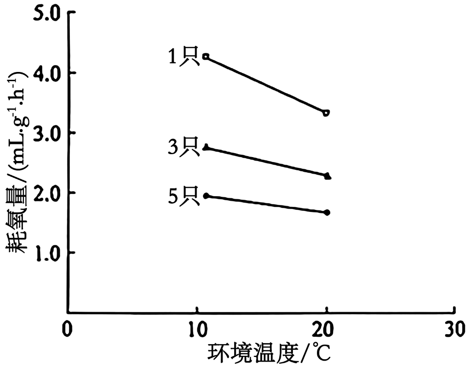
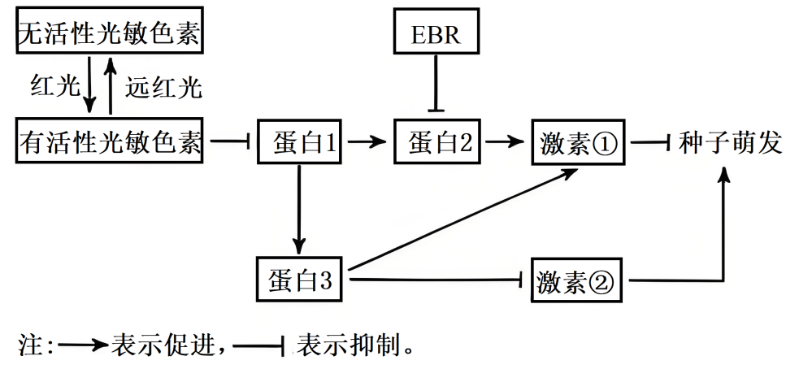
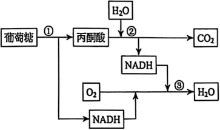
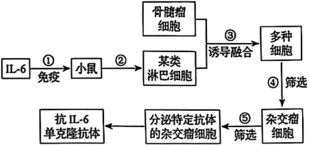
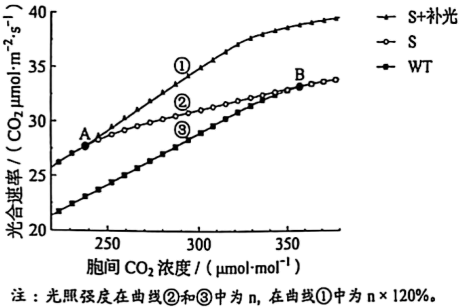
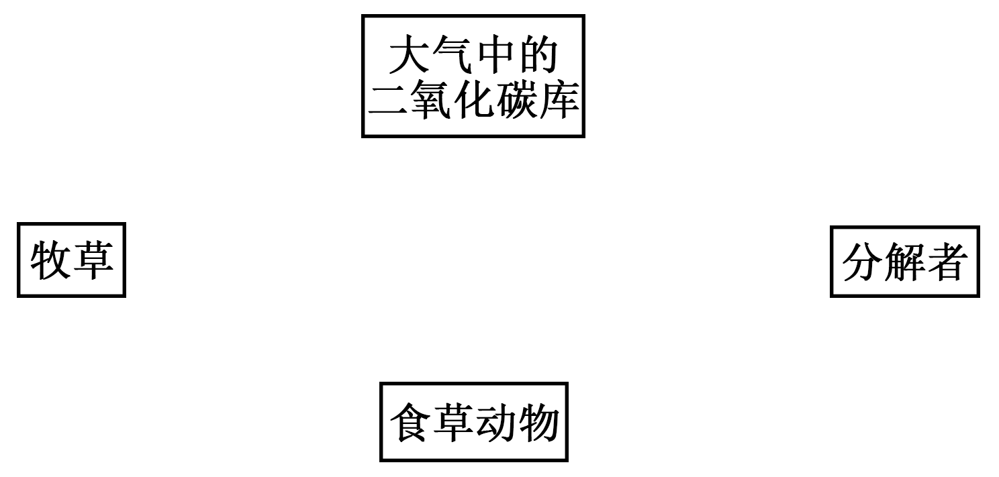
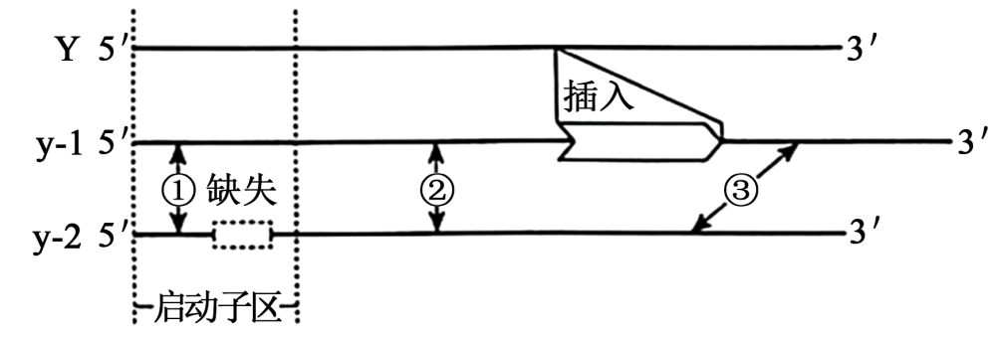
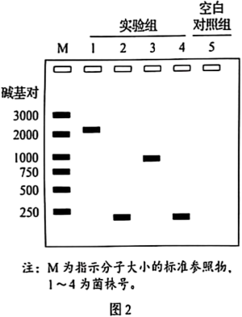

**机密★启用前**

**2025年黑龙江、吉林、辽宁、内蒙古普通高等学校招生选择性考试**

**生物学**

**本试卷共25题，共100分，共11页。考试结束后，将本试题和答题卡一并交回。**

**注意事项：**

**1．答题前，考生先将自己的姓名、准考证号码填写清楚，将条形码准确粘贴在条形码区域内。**

**2．选择题必须使用2B铅笔填涂；非选择题必须使用0.5毫米黑色字迹的签字笔书写，字体工整，笔记清楚。**

**3．请按照题号顺序在答题卡各题目的答题区域内作答，超出答题区域书写的答案无效；在草稿纸、试卷上答题无效。**

**4．作图可先使用铅笔画出，确定后必须用黑色字迹的签字笔描黑。**

**5．保持卡面清洁，不要折叠、不要弄破、弄皱，不准使用涂改液、修正带、刮纸刀。**

**一、选择题：本题共15小题，每小题2分，共30分。在每小题给出的四个选项中，只有一项是符合题目要求的。**

1\. 下列关于耐高温的DNA聚合酶的叙述正确的是（ ）

A. 基本单位是脱氧核苷酸

B. 在细胞内或细胞外均可发挥作用

C. 当模板DNA和脱氧核苷酸存在时即可催化反应

D. 为维持较高活性，适宜在70℃~75℃下保存

2\. 下列关于现代生物进化理论的叙述错误的是（ ）

A. 进化的基本单位是种群

B. 可遗传变异使种群基因频率定向改变，导致生物进化

C. 某些物种经过地理隔离后出现生殖隔离会产生新物种

D. 不同物种间、生物与无机环境之间在相互影响中不断进化和发展

3\. 下列关于人体内环境稳态的叙述错误的是（ ）

A. 胰岛素受体被破坏，可引起血糖升高

B. 抗利尿激素分泌不足时，可引起尿量减少

C 醛固酮分泌过多，可引起血钠含量上升

D. 血液中Ca2+浓度过低，可引起肌肉抽搐

4\. 科研人员通过稀释涂布平板法筛选出高耐受且降解金霉素（C22H23ClN2O8）能力强的菌株，旨在解决金霉素过量使用所导致的环境污染问题。下列叙述错误的是（ ）

A. 以金霉素为唯一碳源可制备选择培养基

B. 逐步提高培养基中金霉素的浓度有助于获得高耐受的菌株

C. 配制选择培养基时，需确保pH满足实验要求

D. 用接种环将菌液均匀地涂布在培养基表面

5\. 下图为某森林生态系统的部分食物网。下列叙述正确的是（ ）

A. 图中的生物及其非生物环境构成生态系统

B. 野猪数量下降时，虎对豹的排斥加剧

C. 图中的食物网共由6条食物链组成

D. 树木同化的能量约有10%~20%流入到野猪

6\. 为修复矿藏开采对土壤、植被等造成的毁坏，采用生态工程技术对矿区开展生态修复。下列叙述错误的是（ ）

A. 修复首先要对土壤进行改良，为植物生长提供条件

B. 修复应遵循生态工程的协调原理，因地制宜配置物种

C. 修复后，植物多样性提升，丰富了动物栖息环境，促进了群落演替

D. 修复后，生物群落能实现自我更新和维持，体现了生态工程整体原理

7\. 红藻兼具无性生殖和有性生殖。海蟑螂依赖红藻躲避天敌，并取食红藻表面附生的硅藻，在此过程中携带了红藻的雄配子，使红藻有性生殖成功率提升。下列叙述错误的是（ ）

A. 海蟑螂与红藻存在互惠关系，二者协同进化

B. 海蟑螂数量减少不利于红藻形成多样的变异

C. 硅藻附生于红藻，因此二者存在寄生关系

D. 海蟑螂与红藻的关系类似传粉昆虫与虫媒花

8\. 利用植物组织培养技术获得红豆杉试管苗，有助于解决紫杉醇药源短缺问题。下列叙述正确的是（ ）

A. 细胞分裂素和生长素的比例会影响愈伤组织的形成

B. 培养基先分装到锥形瓶，封口后用干热灭菌法灭菌

C. 芽原基细胞由于基因选择性表达，不能用作外植体

D. 紫杉醇不能通过细胞产物的工厂化生产来获取，植物组织培养优势明显

9\. 研究显示，约70%的小鼠体细胞核移植胚胎未能成功发育至囊胚期，且仅有约2%的胚胎移植到代孕母鼠后可正常发育。下列叙述错误的是（ ）

A. 体细胞核进入去核的MⅡ期卵母细胞形成重构胚

B. 移植前胚胎发育率低，可能是植入的体细胞核不能完全恢复分化前的功能状态

C. 胚胎移植到代孕母鼠后成活率低，可能是早期胚胎未能及时从滋养层内孵化

D. 为提高胚胎成活率，可用胚胎细胞核移植代替体细胞核移植

10\. 黑暗条件下，叶绿体内膜的载体蛋白NTT顺浓度梯度运输ATP、ADP和Pi的过程示意图如下。其他条件均适宜，下列叙述正确的是（ ）

A. ATP、ADP和Pi通过NTT时，无需与NTT结合

B. NTT转运ATP、ADP和Pi的方式为主动运输

C. 图中进入叶绿体基质的ATP均由线粒体产生

D. 光照充足，NTT运出ADP的数量会减少甚至停止

11\. 下列关于实验操作和现象的叙述错误的是（ ）

A. 观察叶绿体的形态和分布，需先用低倍镜找到叶绿体再换用高倍镜

B. 用斐林试剂检测梨汁中的还原糖时，需要加热后才能呈现砖红色

C. 将染色后的洋葱根尖置于载玻片上，滴清水并盖上盖玻片即可观察染色体

D. 分离菠菜叶中的色素时，因层析液有挥发性，需在通风好的条件下进行

12\. 黄毛鼠在不同环境温度下独居或聚群时的耗氧量（代表产热量）测定值见下图。下列叙述正确的是（ ）

A. 与20℃相比，10℃时，黄毛鼠产热量增加，散热量减少

B. 10℃时，聚群个体的产热量和散热量比独居的多

C. 10℃时，聚群个体下丘脑合成和分泌TRH比独居的少

D. 聚群是黄毛鼠在低温环境下减少能量消耗的生理性调节

13\. 光照、植物激素EBR、脱落酸和赤霉素均参与调节拟南芥种子的萌发，部分作用关系如下图。下列叙述正确的是（ ）

A. 光敏色素是一类含有色素的脂质化合物

B. 图中激素①是赤霉素，激素②是脱落酸

C. EBR和赤霉素是相抗衡的关系

D. 红光和EBR均能诱导拟南芥种子萌发

14\. 下列关于基因表达及其调控的叙述错误的是（ ）

A. 转录和翻译过程中，碱基互补配对的方式不同

B. 转录时通过RNA聚合酶打开DNA双链

C. 某些DNA甲基化可通过抑制基因转录影响生物表型

D. 核糖体与mRNA的结合部位形成1个tRNA结合位点

15\. 某二倍体（2n）植物的三体（2n+1）变异株可正常生长。该变异株减数分裂得到的配子为“n”型和“n+1”型两种，其中“n+1”型的花粉只有约50%的受精率，而卵子不受影响。该变异株自交，假设四体（2n+2）细胞无法存活，预期子一代中三体变异株的比例约为（ ）

A. 3/5 B. 3/4 C. 2/3 D. 1/2

**二、选择题：本题共5小题，每小题3分，共15分。在每小题给出的四个选项中，有一项或多项是符合题目要求的。全部选对得3分，选对但选不全得1分，有选错得0分。**

16\. 下图为植物细胞呼吸的部分反应过程示意图，图中NADH可储存能量，①、②和③表示不同反应阶段。下列叙述正确的是（ ）

A. ①发生在细胞质基质，②和③发生在线粒体

B. ③中NADH通过一系列的化学反应参与了水的形成

C. 无氧条件下，③不能进行，①和②能正常进行

D. 无氧条件下，①产生的NADH中的部分能量转移到ATP中

17\. T细胞通过T细胞受体（TCR）识别肿瘤抗原，为研究TCR与抗原结合的亲和力对肿瘤生长的影响，将高、低两种亲和力的特异性T细胞输入至肿瘤模型小鼠，检测肿瘤生长情况（图1）及评估T细胞耗竭程度（图2）。T细胞耗竭指T细胞功能下降和增殖能力减弱，表达耗竭标志物的T细胞比例与其耗竭程度正相关。下列叙述正确的是（ ）

A. T细胞的抗肿瘤作用体现了免疫自稳功能

B. T细胞在抗肿瘤免疫中不需要抗原呈递细胞参与

C. 低亲和力T细胞能够抑制肿瘤生长

D. 高亲和力T细胞更易耗竭且能抑制小鼠的免疫

18\. 某山体公园自然条件下猕猴种群的环境容纳量约为840只。1986年后，游客的投喂和以保护为目的的固定投食，致使猕猴种群数量快速增长，引发了人猴冲突。为减少冲突事件的发生，研究人员做了相关调查，结果如下图。下列叙述正确的是（ ）

A. 调查期间猕猴种群的λ\>1，若现有条件不变，种群数量会持续增长

B. 2013年人猴冲突事件减少，是因为猕猴种群数量接近自然条件下的环境容纳量

C. 2016年后，猕猴种群数量超过自然条件下环境容纳量的主要原因是人为投食

D. 为保护猕猴和减少人猴冲突，应适时迁出部分猕猴族群达到人与动物和谐相处

19\. 下图是制备抗白细胞介素-6（IL-6）单克隆抗体的示意图。下列叙述错误的是（ ）

A. 步骤①给小鼠注射IL-6后，应从脾中分离筛选T淋巴细胞

B. 步骤②在脾组织中加入胃蛋白酶，制成单细胞悬液

C. 步骤③加入灭活病毒或PEG诱导细胞融合，体现了细胞膜的流动性

D. 步骤④经过克隆化培养和抗体检测筛选出了杂交瘤细胞

20\. 中国养蚕制丝历史悠久。蚕卵的红色、黄色由常染色体上一对等位基因（R/r）控制。将外源绿色蛋白基因（G）导入到纯合的黄卵（rr）、结白茧雌蚕的Z染色体上，获得结绿茧的亲本1，与纯合的红卵、结白茧雄蚕（亲本2）杂交选育红卵、结绿茧的纯合品系。不考虑突变，下列叙述正确的是（ ）

A. F1雌蚕均表现出红卵、结绿茧表型

B. F1雄蚕次级精母细胞中的基因组成可能有RRGG、rr等类型

C. F1随机交配得到的F2中，红卵、结绿茧的个体比例是3/8

D. F2中红卵、结绿茧的个体随机交配，子代中目的个体的比例是2/9

**三、非选择题：本题共5小题，共55分。**

21\. Rubisco是光合作用暗反应中的关键酶。科研人员将Rubisco基因转入某作物的野生型（WT）获得该酶含量增加的转基因品系（S），并做了相关研究。实验结果表明，这一改良提高了该作物的光合速率（如下图）和产量潜力。回答下列问题。

（1）Rubisco在叶绿体的\_\_\_\_\_\_\_\_中催化\_\_\_\_\_\_\_\_与CO2结合。部分产物经过一系列反应形成（CH2O），这一过程中能量转换是\_\_\_\_\_\_\_\_。

（2）据图分析，当胞间CO2浓度高于B点时，曲线②与③重合是由于\_\_\_\_\_\_\_\_不足。A点之前曲线①和②重合的最主要限制因素是\_\_\_\_\_\_\_\_。胞间CO2浓度为300μmol·mol-1时，曲线①比②的光合速率高的具体原因是\_\_\_\_\_\_\_\_。

（3）研究发现，在饱和光照和适宜CO2浓度条件下，S植株固定CO2生成C3的速率比WT更快。使用同位素标记的方法设计实验直接加以验证，简要写出实验思路。\_\_\_\_\_\_\_\_

22\. 躯干四肢疼痛信息需依次经脊髓背根神经节、脊髓、丘脑三级神经元，传递至大脑躯体感觉皮层产生痛觉（如图1）。回答下列问题。

（1）局部组织损伤时，会释放致痛物质（缓激肽等），使感受器产生电信号。该信号沿图1所示通路传至大脑躯体感觉皮层产生痛觉的过程\_\_\_\_\_\_\_\_（填“是”或“不是”）反射；该信号传递至下一级神经元时，需经过的信号转换是\_\_\_\_\_\_\_\_；该信号也可以从传入神经纤维分叉处传向另一末梢分支，引起P物质等的释放，加强感受器活动，通过\_\_\_\_\_\_\_\_（填“正反馈”或“负反馈”）调节造成持续疼痛。

（2）电针疗法是用带微弱电流的针灸针刺激特定穴位的镇痛疗法。背根神经节中表达的P2X蛋白在痛觉信号传入中发挥重要作用，为探究电针疗法的镇痛效果及其机制，进行的动物实验处理（表）及结果（图2）如下：

<table style="width:86%;">
<colgroup>
<col style="width: 60%" />
<col style="width: 12%" />
<col style="width: 12%" />
</colgroup>
<tbody>
<tr>
<td style="text-align: center;">动物模型</td>
<td style="text-align: center;">分组</td>
<td style="text-align: center;">治疗处理</td>
</tr>
<tr>
<td style="text-align: left;">对照组：在正常大鼠足掌皮下注射生理盐水</td>
<td style="text-align: center;">A</td>
<td style="text-align: center;">不治疗</td>
</tr>
<tr>
<td rowspan="2" style="text-align: left;">疼痛模型组：在正常大鼠足掌皮下注射等体积致痛物质诱导剂</td>
<td style="text-align: center;">B</td>
<td style="text-align: center;">不治疗</td>
</tr>
<tr>
<td style="text-align: center;">C</td>
<td style="text-align: center;">电针治疗</td>
</tr>
</tbody>
</table>

设置A组作为对照组的具体目的是\_\_\_\_\_\_\_\_和\_\_\_\_\_\_\_\_。疼痛阈值与痛觉敏感性呈负相关，由结果推测电针疗法可能通过抑制P2X的表达发挥一定的镇痛作用，依据是\_\_\_\_\_\_\_\_。

（3）镇痛药物通常分为麻醉性（长期或超量使用易成瘾）和非麻醉性。从痛觉传入通路的角度分析，药物镇痛可能的作用机理有\_\_\_\_\_\_\_\_、\_\_\_\_\_\_\_\_和抑制突触信息传递。若某人患有反复发作的中轻度颈肩痛，以上镇痛疗法，不宜选择\_\_\_\_\_\_\_\_。

23\. 粪甲虫是一类嗜粪昆虫的总称，其中金龟科和蜉金龟科粪甲虫以粪便为食，隐翅虫科则主要捕食粪便中滋生的某些小型无脊椎动物。大环内酯类兽药（ML）可以有效治疗畜禽的呼吸道疾病，但其在粪便中的残留会显著影响一些粪甲虫的存活和后代孵化。回答下列问题。

（1）草原生态系统粪甲虫种类繁多，体现了生物多样性中的\_\_\_\_\_\_\_\_。金龟科和蜉金龟科粪甲虫能够快速分解草场中的粪便，促进土壤养分循环，体现了生物多样性的\_\_\_\_\_\_\_\_价值。

（2）用箭头连接下列草原生态系统中的关键因子，完成碳循环模型\_\_\_\_\_\_\_\_。

（3）对使用ML前后同一草场的粪甲虫进行调查，通常采用陷阱法取样，陷阱位置的选择应符合\_\_\_\_\_\_\_\_原则；陷阱中新鲜牛粪的气味吸引粪甲虫，属于生态系统中的\_\_\_\_\_\_\_\_信息传递。

（4）分类统计诱捕到的粪甲虫，结果见下表。由表可知，ML使用后粪甲虫数量明显\_\_\_\_\_\_\_\_，优势科变为了\_\_\_\_\_\_\_\_（填科名），这种变化将会使草场牛粪的清除速度下降，影响草场的生态功能。

<table style="width:86%;">
<colgroup>
<col style="width: 14%" />
<col style="width: 19%" />
<col style="width: 19%" />
<col style="width: 16%" />
<col style="width: 16%" />
</colgroup>
<tbody>
<tr>
<td rowspan="2" style="text-align: center;">粪甲虫种类</td>
<td colspan="2" style="text-align: center;">ML使用前</td>
<td colspan="2" style="text-align: center;">ML使用后</td>
</tr>
<tr>
<td style="text-align: center;">平均数量/（只/陷阱）</td>
<td style="text-align: center;">个体占比</td>
<td style="text-align: center;">平均数量/（只/陷阱）</td>
<td style="text-align: center;">个体占比</td>
</tr>
<tr>
<td style="text-align: center;">蜉金龟科</td>
<td style="text-align: center;">121.7</td>
<td style="text-align: center;">62.3%</td>
<td style="text-align: center;">29.9</td>
<td style="text-align: center;">44.4%</td>
</tr>
<tr>
<td style="text-align: center;">金龟科</td>
<td style="text-align: center;">73.7</td>
<td style="text-align: center;">37.7%</td>
<td style="text-align: center;">0.8</td>
<td style="text-align: center;">1.2%</td>
</tr>
<tr>
<td style="text-align: center;">隐翅虫科</td>
<td style="text-align: center;">0</td>
<td style="text-align: center;">0</td>
<td style="text-align: center;">36.6</td>
<td style="text-align: center;">54.4%</td>
</tr>
</tbody>
</table>

（5）为了维持草场畜牧业的可持续发展，降低兽药残留对当地粪甲虫的影响，可采用的方法包括\_\_\_\_\_\_\_\_。

A. 研发低残留、易降解兽药

B. 制定严格用药指南，避免过量使用兽药

C. 引入新的粪甲虫种类

D. 培育抗病力强的牲畜品种减少兽药使用

24\. 科学家系统解析了豌豆7对性状的遗传基础，以下为部分实验，回答下列问题。

（1）将控制花腋生和顶生性状的基因定位于4号染色体上，用F/f表示。在大多数腋生纯系与顶生纯系的杂交中，F2腋生：顶生约为3：1，符合孟德尔的\_\_\_\_\_\_\_\_定律。

（2）然而，某顶生个体自交，子代个体中20%以上表现为腋生。此现象\_\_\_\_\_\_\_\_（填“能”或“不能”）用基因突变来解释，原因是\_\_\_\_\_\_\_\_。

（3）定位于6号染色体上的基因D/d可能与（2）中的现象有关。为了验证这个假设，用两种纯种豌豆杂交得到F1，F1自交产生的F2表型和基因型的对应关系如下表，表格内“+”、“-”分别表示有、无相应基因型的个体。

<table style="width:38%;">
<colgroup>
<col style="width: 5%" />
<col style="width: 4%" />
<col style="width: 4%" />
<col style="width: 3%" />
<col style="width: 5%" />
<col style="width: 4%" />
<col style="width: 4%" />
<col style="width: 3%" />
</colgroup>
<tbody>
<tr>
<td colspan="4" style="text-align: center;">腋生表型</td>
<td colspan="4" style="text-align: center;">顶生表型</td>
</tr>
<tr>
<td style="text-align: center;">基因型</td>
<td style="text-align: center;">FF</td>
<td style="text-align: center;">Ff</td>
<td style="text-align: center;">ff</td>
<td style="text-align: center;">基因型</td>
<td style="text-align: center;">FF</td>
<td style="text-align: center;">Ff</td>
<td style="text-align: center;">ff</td>
</tr>
<tr>
<td style="text-align: center;">DD</td>
<td style="text-align: center;">+</td>
<td style="text-align: center;">+</td>
<td style="text-align: center;">-</td>
<td style="text-align: center;">DD</td>
<td style="text-align: center;">-</td>
<td style="text-align: center;">-</td>
<td style="text-align: center;">+</td>
</tr>
<tr>
<td style="text-align: center;">Dd</td>
<td style="text-align: center;">+</td>
<td style="text-align: center;">+</td>
<td style="text-align: center;">-</td>
<td style="text-align: center;">Dd</td>
<td style="text-align: center;">-</td>
<td style="text-align: center;">-</td>
<td style="text-align: center;">+</td>
</tr>
<tr>
<td style="text-align: center;">dd</td>
<td style="text-align: center;">+</td>
<td style="text-align: center;">+</td>
<td style="text-align: center;">+</td>
<td style="text-align: center;">dd</td>
<td style="text-align: center;">-</td>
<td style="text-align: center;">-</td>
<td style="text-align: center;">-</td>
</tr>
</tbody>
</table>

结果证实了上述假设，则F2中腋生:顶生的理论比例为\_\_\_\_\_\_\_\_，并可推出（2）中顶生亲本的基因型是\_\_\_\_\_\_\_\_。

（4）研究发现群体中控制黄色子叶的Y基因有两种突变形式y-1和y-2，基因结构示意图如下。Y突变为y-1导致其表达的蛋白功能丧失，Y突变为y-2导致\_\_\_\_\_\_\_\_。y-1和y-2纯合突变体都表现为绿色子叶。

在一次y-1纯合体与y-2纯合体杂交中，F1全部为绿色子叶，F2出现黄色子叶个体，这种现象可因减数分裂过程中发生染色体互换引起。图中哪一个位点发生断裂并交换能解释上述现象？\_\_\_\_\_\_\_\_（填“①”或“②”或“③”）。若此F1个体的20个花粉母细胞（精母细胞）在减数分裂中各发生一次此类交换，在减数分裂完成时会产生\_\_\_\_\_\_\_\_个具有正常功能Y基因的子细胞。

25\. 香树脂醇具有抗炎等功效，从植物中提取难度大、产率低。通过在酵母菌中表达外源香树脂醇合酶基因N，可高效生产香树脂醇。回答下列问题。

（1）可从\_\_\_\_\_\_\_\_中查询基因N的编码序列，设计特定引物。如图1所示，a链为转录模板链，为保证基因N与质粒pYL正确连接，需在引物1和引物2的5*'*端分别引入\_\_\_\_\_\_\_\_和\_\_\_\_\_\_\_\_限制酶识别序列。PCR扩增基因N，特异性酶切后，利用\_\_\_\_\_\_\_\_连接DNA片段，构建重组质粒，大小约9.5kb（kb为千碱基对），假设构建重组质粒前后，质粒pYL对应部分大小基本不变。

（2）进一步筛选构建的质粒，以1-4号菌株中提取的质粒为模板，使用引物1和引物2进行PCR扩增，电泳PCR产物，结果如图2。在第5组的PCR反应中，使用无菌水代替实验组的模板DNA，目的是检验PCR反应中是否有\_\_\_\_\_\_\_\_的污染。初步判断实验组\_\_\_\_\_\_\_\_（从“1~4”中选填）的质粒中成功插入了基因N，理由是\_\_\_\_\_\_\_\_。

（3）为提高香树脂醇合酶催化效率，将编码第240位脯氨酸或第243位苯丙氨酸的碱基序列替换为编码丙氨酸的碱基序列，丙氨酸的密码子有GCA等。a是诱变第240位脯氨酸编码序列的引物（GCA为诱变序列），b、c、d其中一条是诱变第243位苯丙氨酸的引物，其配对模板与a的配对模板相同。据此分析，丙氨酸的密码子除GCA外，还有\_\_\_\_\_\_\_\_。

a：5*'*-…GCA/CCC/GAG/TTC/TGG/CTG/TTT/CCC/TCT/TTC/TTC…-3*'*

b：5*'*-…GAA/CTG/TGG/GAC/ACC/CTG/AAC/TAC/TTC/TCT/GAG…-3*'*

c：5*'*-…GCC/TGG/CTG/TTT/CCC/TCT/TTC/TTC/CCC/TAC/CAC…-3*'*

d：5*'*-…GAT/AAT/AAG/ATC/CGA/GAG/AAG/GCC/ATG/CGA/AAG…-3*'*

（4）进一步检测转基因酵母菌发酵得到的\_\_\_\_\_\_\_\_含量并进行比较，可以选出最优的香树脂醇合酶基因的改造方案。
