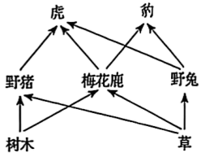
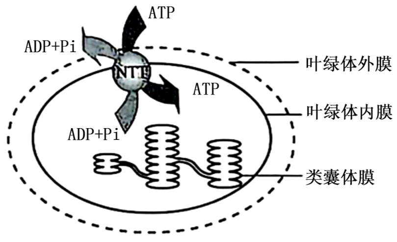
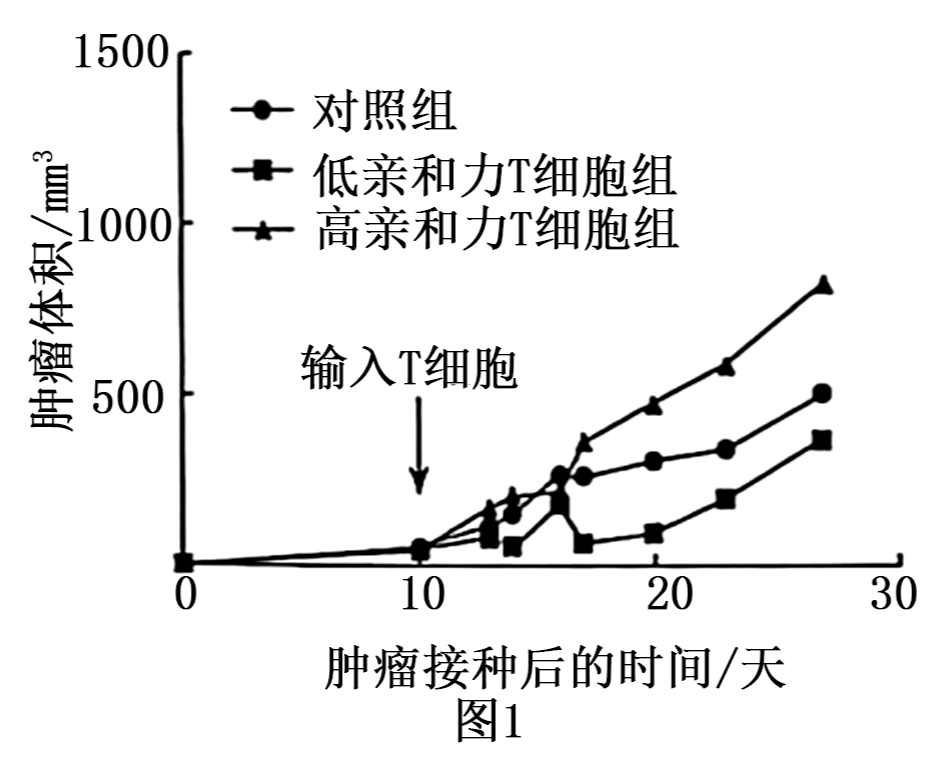
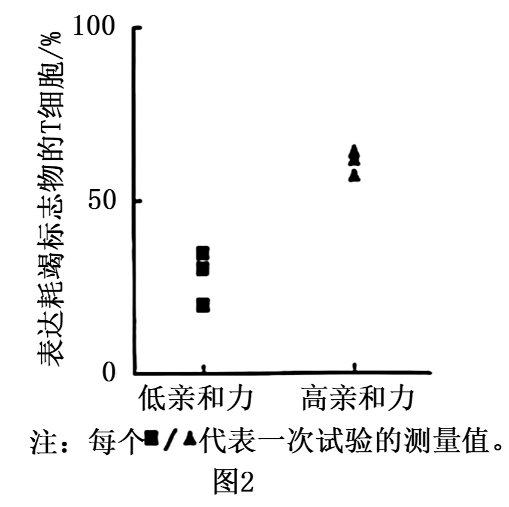
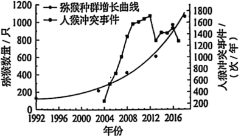
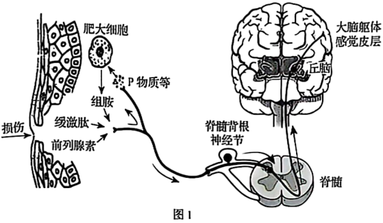
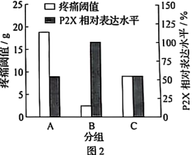
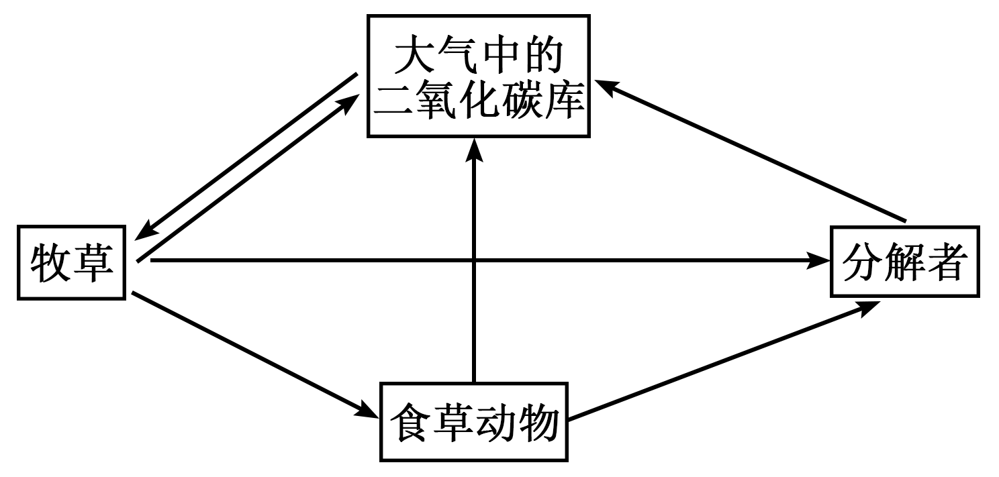
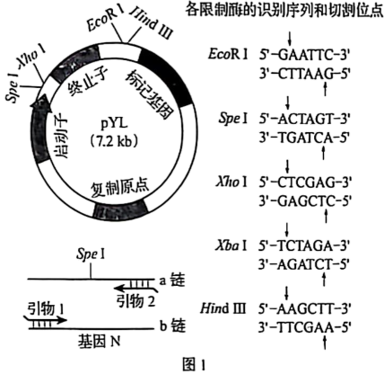

**机密★启用前**

**2025年黑龙江、吉林、辽宁、内蒙古普通高等学校招生选择性考试**

**生物学**

**本试卷共25题，共100分，共11页。考试结束后，将本试题和答题卡一并交回。**

**注意事项：**

**1．答题前，考生先将自己的姓名、准考证号码填写清楚，将条形码准确粘贴在条形码区域内。**

**2．选择题必须使用2B铅笔填涂；非选择题必须使用0.5毫米黑色字迹的签字笔书写，字体工整，笔记清楚。**

**3．请按照题号顺序在答题卡各题目的答题区域内作答，超出答题区域书写的答案无效；在草稿纸、试卷上答题无效。**

**4．作图可先使用铅笔画出，确定后必须用黑色字迹的签字笔描黑。**

**5．保持卡面清洁，不要折叠、不要弄破、弄皱，不准使用涂改液、修正带、刮纸刀。**

**一、选择题：本题共15小题，每小题2分，共30分。在每小题给出的四个选项中，只有一项是符合题目要求的。**

1\. 下列关于耐高温的DNA聚合酶的叙述正确的是（ ）

A. 基本单位是脱氧核苷酸

B. 在细胞内或细胞外均可发挥作用

C. 当模板DNA和脱氧核苷酸存在时即可催化反应

D. 为维持较高活性，适宜在70℃~75℃下保存

【答案】B

【解析】

【分析】酶是活细胞产生的，具有催化作用的一类有机物，绝大多数是蛋白质，少数是RNA。

【详解】A、耐高温的DNA聚合酶的本质是蛋白质，基本单位为氨基酸，A错误；

B、耐高温DNA聚合酶在细胞内的DNA复制和体外的PCR反应中均能发挥作用，B正确；

C、缺少引物和缓冲液时反应无法启动，C错误；

D、高温保存会破坏酶活性，需低温保存，D错误。

故选B。

2\. 下列关于现代生物进化理论的叙述错误的是（ ）

A. 进化的基本单位是种群

B. 可遗传变异使种群基因频率定向改变，导致生物进化

C. 某些物种经过地理隔离后出现生殖隔离会产生新物种

D. 不同物种间、生物与无机环境之间在相互影响中不断进化和发展

【答案】B

【解析】

【分析】现代生物进化理论的基本观点：种群是生物进化的基本单位，生物进化的实质在于种群基因频率的改变．突变和基因重组、自然选择及隔离是物种形成过程的三个基本环节，通过它们的综合作用，种群产生分化，最终导致新物种的形成，其中突变和基因重组产生生物进化的原材料，自然选择使种群的基因频率发生定向的改变并决定生物进化的方向，隔离是新物种形成的必要条件。

【详解】A、现代生物进化理论认为，种群是生物进化的基本单位，A正确；

B、可遗传变异（突变和基因重组）是不定向的，仅为生物进化提供原材料；自然选择通过作用于个体的表现型，定向改变种群的基因频率，从而决定生物进化的方向。因此，“可遗传变异使种群基因频率定向改变”的表述错误，B错误；

C、物种形成的常见方式是地理隔离→生殖隔离（如达尔文雀的形成），C正确；

D、协同进化指不同物种间、生物与无机环境间在相互影响中不断进化和发展，是现代生物进化理论的核心内容之一，D正确。

故选B。

3\. 下列关于人体内环境稳态的叙述错误的是（ ）

A. 胰岛素受体被破坏，可引起血糖升高

B. 抗利尿激素分泌不足时，可引起尿量减少

C. 醛固酮分泌过多，可引起血钠含量上升

D. 血液中Ca2+浓度过低，可引起肌肉抽搐

【答案】B

【解析】

【分析】抗利尿激素作用是促进肾小管和集合管对水分的重吸收。

【详解】A、胰岛素通过与靶细胞表面的受体结合，促进细胞摄取、利用和储存葡萄糖，从而降低血糖。若胰岛素受体被破坏，细胞无法响应胰岛素，葡萄糖无法正常被利用，会导致血糖升高，A正确；

B、抗利尿激素（ADH）的作用是促进肾小管和集合管对水分的重吸收，减少尿量。若ADH分泌不足，肾小管和集合管对水的重吸收减少，尿量会增加而非减少，B错误；

C、醛固酮的主要作用是促进肾小管和集合管对Na⁺的重吸收（同时排K⁺）。醛固酮分泌过多时，Na⁺重吸收增加，会导致血钠含量上升，C正确；

D、血液中Ca2+浓度过低时，神经肌肉的兴奋性异常升高，容易引发肌肉抽搐，D正确。

故选B。

4\. 科研人员通过稀释涂布平板法筛选出高耐受且降解金霉素（C22H23ClN2O8）能力强的菌株，旨在解决金霉素过量使用所导致的环境污染问题。下列叙述错误的是（ ）

A. 以金霉素为唯一碳源可制备选择培养基

B. 逐步提高培养基中金霉素的浓度有助于获得高耐受的菌株

C. 配制选择培养基时，需确保pH满足实验要求

D. 用接种环将菌液均匀地涂布在培养基表面

【答案】D

【解析】

【分析】在微生物学中，将允许特定种类的微生物生长，同时抑制或阻止其他种类微生物生长的培养基，称为选择培养基。

【详解】A、以金霉素为唯一碳源的选择培养基，仅允许能利用金霉素的微生物生长（其他无法利用金霉素的微生物被抑制），符合选择培养基的设计原理，A正确；

B、逐步提高金霉素浓度可模拟环境胁迫，筛选出耐受性更强的菌株（类似“驯化”过程），B正确；

C、培养基的pH需根据目标微生物的生长需求调整（如细菌通常中性偏碱，真菌偏酸性），是配制培养基的基本要求，C正确；

D、稀释涂布平板法需用​​涂布器​​将菌液均匀涂布在培养基表面，而接种环用于平板划线法（分离单菌落）。用接种环涂布无法保证菌液均匀，D错误。

故选D。

5\. 下图为某森林生态系统的部分食物网。下列叙述正确的是（ ）

A. 图中的生物及其非生物环境构成生态系统

B. 野猪数量下降时，虎对豹的排斥加剧

C. 图中的食物网共由6条食物链组成

D. 树木同化的能量约有10%~20%流入到野猪

【答案】B

【解析】

【分析】生态系统的结构包括生态系统的组成成分和营养结构，而组成成分包括非生物的物质和能量、生产者、消费者和分解者，营养结构是指食物链和食物网。

【详解】A、在一定的地域内生物与无机环境所形成的统一整体叫生态系统，图中的生物只有生产者和消费者，缺少分解者，所以图中的生物及其非生物环境不能构成生态系统，A错误；

B、野猪数量下降，虎和豹会竞争剩余的食物资源（如野兔、 梅花鹿），竞争加剧可能导致排斥加剧，B正确；

C、分析题图可知，图中的食物网共由8条食物链组成，分别是树木→野猪→虎、树木→梅花鹿→虎、树木→梅花鹿→豹、草→野猪→虎、草→梅花鹿→虎、草→梅花鹿→豹、草→野兔→虎、草→野兔→豹，C错误；

D、能量传递效率是10%~20%，但这是指从一个营养级到下一个营养级的平均效率，树木同化的能量会分配给所有初级消费者 （野猪、野兔、梅花鹿），而不仅仅是野猪，因此流入野猪的比例不一定是10%~20%，可能更少，D错误。

故选B。

6\. 为修复矿藏开采对土壤、植被等造成的毁坏，采用生态工程技术对矿区开展生态修复。下列叙述错误的是（ ）

A. 修复首先要对土壤进行改良，为植物生长提供条件

B. 修复应遵循生态工程的协调原理，因地制宜配置物种

C 修复后，植物多样性提升，丰富了动物栖息环境，促进了群落演替

D. 修复后，生物群落能实现自我更新和维持，体现了生态工程整体原理

【答案】D

【解析】

【分析】生态学原理：循环原理：通过系统设计实现不断循环，使前一个环节产生的废物尽可能地被后一个环节利用，减少整个生产环节“废物”的产生。自生原理：把很多单个生产系统通过优化组合，有机地整合在一起，成为一个新的高效生态系统。整体原理：充分考虑生态、经济和社会问题。

【详解】A、矿区土壤常因开采导致污染、结构破坏或肥力低下，修复时需先改良土壤（如去除污染物、补充养分等），为植物生长创造条件，A正确；

B、协调原理要求生物与环境相适应，因地制宜选择本地物种（避免外来物种入侵），符合生态修复的基本原则，B正确；

C、植物多样性提升后，可为动物提供更多食物和栖息地，促进动物种类增加，推动群落向更复杂、稳定的方向演替，C正确；

D、生物群落的自我更新和维持体现的是​​自生原理​​（依赖物种多样性和生态系统的内在调节能力），而整体原理强调整个系统的总体功能（自然、经济、社会效益统一），D错误。

故选D。

7\. 红藻兼具无性生殖和有性生殖。海蟑螂依赖红藻躲避天敌，并取食红藻表面附生的硅藻，在此过程中携带了红藻的雄配子，使红藻有性生殖成功率提升。下列叙述错误的是（ ）

A. 海蟑螂与红藻存在互惠关系，二者协同进化

B. 海蟑螂数量减少不利于红藻形成多样的变异

C. 硅藻附生于红藻，因此二者存在寄生关系

D. 海蟑螂与红藻的关系类似传粉昆虫与虫媒花

【答案】C

【解析】

【分析】1、不同物种之间、生物与无机环境之间在相互影响中不断进化和发展，这就是协同进化。

2、一个群落中的物种不论多少，都不是随机的简单集合，而是通过复杂的种间关系，形成一个有机的整体。种间关系主要有原始合作（互惠）、互利共生、种间竞争、捕食和寄生等。

【详解】A、依题意，红藻兼具无性生殖和有性生殖，海蟑螂从红藻获得庇护和食物（间接通过其取食硅藻），红藻则从海蟑螂的活动中获得有性生殖帮助（雄配子传播），因此二者存在互惠关系，长期互动可能促使协同进化，A正确；

B、海蟑螂帮助红藻进行有性生殖，有性生殖通过基因重组产生多性的变异，海蟑螂数量减少不利于红藻形成多样的变异，B正确；

C、依题意，硅藻附着于红藻表面，但并未提供其附着的目的，且硅藻是自养生物，故不能推测二者存在寄生关系，C错误；

D、海蟑螂携带红藻的雄配子，使红藻有性生殖成功率提升；传粉昆虫帮助虫媒花传粉，促进其受精，海蟑螂与红藻的关系类似传粉昆虫与虫媒花，D正确。

故选C。

8\. 利用植物组织培养技术获得红豆杉试管苗，有助于解决紫杉醇药源短缺问题。下列叙述正确的是（ ）

A. 细胞分裂素和生长素的比例会影响愈伤组织的形成

B. 培养基先分装到锥形瓶，封口后用干热灭菌法灭菌

C. 芽原基细胞由于基因选择性表达，不能用作外植体

D. 紫杉醇不能通过细胞产物的工厂化生产来获取，植物组织培养优势明显

【答案】A

【解析】

【分析】植物组织培养技术：1、过程：离体的植物组织，器官或细胞（外植体）→愈伤组织→胚状体→植株（新植体）。2、原理：植物细胞的全能性。3、条件：①细胞离体和适宜的外界条件（如适宜温度、适时的光照、pH和无菌环境等）；②一定的营养（无机、有机成分）和植物激素（生长素和细胞分裂素）。4、植物细胞工程技术的应用：植物繁殖的新途径（包括微型繁殖，作物脱毒、人工种子等）、作物新品种的培育（单倍体育种、突变体的利用）、细胞产物的工厂化生产。

【详解】A、在植物组织培养中，生长素和细胞分裂素的比例直接影响细胞的分化方向。当二者比例适中时，促进愈伤组织的形成；比例过高时促进生根，比例过低时促进生芽，A正确；

B、培养基含大量水分，需用高压蒸汽灭菌法灭菌（121℃，15-20分钟）；干热灭菌法适用于耐高温且干燥的物品（如玻璃器皿），不能用于培养基灭菌，B错误；

C、外植体可以是植物的任何活细胞、组织或器官，只要具有全能性。芽原基细胞是分生组织的一部分，全能性高，可作为外植体。基因选择性表达是细胞分化的基础，不影响其作为外植体的能力，C错误；

D、细胞产物的工厂化生产正是通过植物组织培养技术实现的，如大量培养红豆杉细胞，从培养液中提取紫杉醇。因此，紫杉醇可通过此方法获取，植物组织培养的优势（如快速增殖、大量生产细胞产物）在此体现，D错误。

故选A。

9\. 研究显示，约70%的小鼠体细胞核移植胚胎未能成功发育至囊胚期，且仅有约2%的胚胎移植到代孕母鼠后可正常发育。下列叙述错误的是（ ）

A. 体细胞核进入去核的MⅡ期卵母细胞形成重构胚

B. 移植前胚胎发育率低，可能是植入的体细胞核不能完全恢复分化前的功能状态

C. 胚胎移植到代孕母鼠后成活率低，可能是早期胚胎未能及时从滋养层内孵化

D. 为提高胚胎成活率，可用胚胎细胞核移植代替体细胞核移植

【答案】C

【解析】

【分析】动物体细胞分化程度高，表现全能性十分困难。因此动物体细胞核移植的难度明显高于胚胎细胞核移植。胚胎移植是指将通过体外受精及其他方式得到的胚胎，移植到同种的、生理状态相同的雌性动物体内，使之继续发育为新个体的技术。其中提供胚胎的个体称为“供体”，接受胚胎的个体叫“受体”。通过任何一项技术（如转基因、核移植和体外受精等）获得的胚胎，都必须移植给受体才能获得后代。

【详解】A、由于M Ⅱ期卵母细胞的细胞更大，便于进行技术操作，细胞质中含有激发细胞核全能性的物质，因此体细胞核移植到去核的MⅡ期卵母细胞形成重构胚，A正确；

B、移植前胚胎发育率低，细胞核来自于已分化的体细胞，全能性容易受到影响，因此可能是植入的体细胞核不能完全恢复分化前的功能状态，B正确；

C、胚胎移植到代孕母鼠后成活率低，可能是早期胚胎未能成功在代孕母鼠子宫内着床，胚胎从透明带中出来称为孵化，C错误；

D、胚胎细胞核全能性高于体细胞，因此为提高胚胎成活率，可用胚胎细胞核移植代替体细胞核移植，D正确。

故选C。

10\. 黑暗条件下，叶绿体内膜的载体蛋白NTT顺浓度梯度运输ATP、ADP和Pi的过程示意图如下。其他条件均适宜，下列叙述正确的是（ ）

A. ATP、ADP和Pi通过NTT时，无需与NTT结合

B. NTT转运ATP、ADP和Pi的方式为主动运输

C. 图中进入叶绿体基质的ATP均由线粒体产生

D. 光照充足，NTT运出ADP的数量会减少甚至停止

【答案】D

【解析】

【分析】小分子物质跨膜运输的方式包括：自由扩散、协助扩散、主动运输。自由扩散高浓度到低浓度，不需要载体，不需要能量；协助扩散是从高浓度到低浓度，不需要能量，需要载体；主动运输从低浓度到高浓度，需要载体，需要能量。大分子或颗粒物质进出细胞的方式是胞吞和胞吐，不需要载体，消耗能量。

【详解】A、载体蛋白的作用机制通常需要与底物结合后才能转运物质。NTT作为载体蛋白，运输ATP、ADP和Pi时必然需要结合底物，A错误；

B、黑暗条件下，叶绿体内膜的载体蛋白NTT顺浓度梯度运输ATP、ADP和Pi，因此不是主动运输，B错误；

C、黑暗条件下，叶绿体无法进行光反应，自身不能合成ATP。此时进入叶绿体基质的ATP可来自细胞呼吸，但细胞呼吸产生ATP的场所包括细胞质基质（糖酵解）和线粒体（有氧呼吸第二、三阶段），C错误；

D、光照充足时，叶绿体类囊体膜上进行光反应合成ATP，需要消耗大量ADP和Pi作为原料。此时叶绿体基质中的ADP和Pi会优先被类囊体膜利用，导致基质中ADP浓度降低。由于NTT顺浓度梯度运输ADP（从基质到细胞质基质），当基质中ADP不足时，NTT运出ADP的数量会减少甚至停止，D正确。

故选D。

11\. 下列关于实验操作和现象的叙述错误的是（ ）

A. 观察叶绿体的形态和分布，需先用低倍镜找到叶绿体再换用高倍镜

B. 用斐林试剂检测梨汁中的还原糖时，需要加热后才能呈现砖红色

C. 将染色后的洋葱根尖置于载玻片上，滴清水并盖上盖玻片即可观察染色体

D. 分离菠菜叶中的色素时，因层析液有挥发性，需在通风好的条件下进行

【答案】C

【解析】

【分析】本题考查了高中生物课本中相关实验，意在考查考生的识记能力和实验操作能力，难度适中。考生要能够识记实验的原理、实验的相关操作步骤，并能够对实验操作的错误进行原因分析。

【详解】A、观察叶绿体时，先用低倍镜找到细胞中的叶绿体（因叶绿体较大、颜色深，易观察），再换高倍镜观察形态和分布，操作正确，A正确；

B、斐林试剂检测还原糖需在水浴加热（50-65℃）条件下，还原糖与斐林试剂反应生成砖红色沉淀，操作正确，B正确；

C、观察染色体需经过压片处理：染色后（如龙胆紫），将根尖置于载玻片，加清水，用镊子轻捣使细胞分散，盖上盖玻片后用拇指垂直轻压盖玻片（或用铅笔橡皮头轻敲），使细胞分离成单层。否则细胞重叠，染色体无法清晰观察，C错误；

D、层析液（如石油醚、丙酮等）易挥发且可能有毒，实验需在通风良好的环境中进行（如通风橱），防止吸入有害气体，操作正确，D正确。

故选C。

12\. 黄毛鼠在不同环境温度下独居或聚群时的耗氧量（代表产热量）测定值见下图。下列叙述正确的是（ ）

A. 与20℃相比，10℃时，黄毛鼠产热量增加，散热量减少

B. 10℃时，聚群个体的产热量和散热量比独居的多

C. 10℃时，聚群个体下丘脑合成和分泌TRH比独居的少

D. 聚群是黄毛鼠在低温环境下减少能量消耗的生理性调节

【答案】C

【解析】

【分析】体温调节是温度感受器接受体内、外环境温度的刺激，通过体温调节中枢的活动，相应地引起内分泌腺、骨骼肌、皮肤血管和汗腺等组织器官活动的改变，从而调整机体的产热和散热过程，使体温保持在相对恒定的水平。

【详解】A、依据题干信息，耗氧量代表产热量，依据图示信息可知，与20℃相比，10℃时，黄毛鼠的耗氧量较高，说明产热量增加，低温下，散热量也增加，产热和散热处于动态平衡，A错误；

B、黄毛鼠属于恒温动物，其产热量等于散热量，10℃时，聚群动物的耗氧量低于独居动物，说明集群动物的产热量低于独居动物，散热量也低于独居动物，B错误；

C、10℃时，聚群动物的耗氧量低于独居动物，说明集群动物的产热量低于独居动物，甲状腺激素可以促进产热，甲状腺激素的分泌是通过下丘脑垂体甲状腺甲状腺激素来实现的，所以可推知，10℃时，聚群个体下丘脑合成和分泌TRH比独居的少，C正确；

D、聚群是黄毛鼠在低温环境下减少能量消耗的行为性调节，D错误。

故选C。

13\. 光照、植物激素EBR、脱落酸和赤霉素均参与调节拟南芥种子的萌发，部分作用关系如下图。下列叙述正确的是（ ）

A. 光敏色素是一类含有色素的脂质化合物

B. 图中激素①是赤霉素，激素②是脱落酸

C. EBR和赤霉素是相抗衡的关系

D. 红光和EBR均能诱导拟南芥种子萌发

【答案】D

【解析】

【分析】脱落酸：合成部位：根冠、萎蔫的叶片等。主要功能：抑制植物细胞的分裂和种子的萌发；促进植物进入休眠；促进叶和果实的衰老、脱落。

【详解】A、光敏色素是一类含有色素的蛋白质（色素蛋白复合体），而非脂质化合物，A错误；

B、赤霉素（GA）的主要作用是促进种子萌发，脱落酸（ABA）的主要作用是抑制种子萌发，据图分析，图中激素①是脱落酸，激素②是赤霉素，B错误；

C、赤霉素（GA）的主要作用是促进种子萌发，分析题图，EBR抑制蛋白2形成，减少激素①对种子的抑制作用，因此EBR和赤霉素是协同的关系，C错误；

D、红光使光敏色素从无活性到有活性，促进种子萌发，而EBR抑制蛋白2形成，减少激素①对种子的抑制作用，因此红光和EBR均能诱导拟南芥种子萌发，D正确。

故选D。

14\. 下列关于基因表达及其调控的叙述错误的是（ ）

A. 转录和翻译过程中，碱基互补配对的方式不同

B. 转录时通过RNA聚合酶打开DNA双链

C. 某些DNA甲基化可通过抑制基因转录影响生物表型

D. 核糖体与mRNA的结合部位形成1个tRNA结合位点

【答案】D

【解析】

【分析】转录过程以四种核糖核苷酸为原料，以DNA分子的一条链为模板，在RNA聚合酶的作用下消耗能量，合成RNA。翻译过程以氨基酸为原料，以转录过程产生的mRNA为模板，在酶的作用下，消耗能量产生多肽链。多肽链经过折叠加工后形成具有特定功能的蛋白质。

【详解】A、转录过程的碱基配对是A-U、T-A、C-G、G-C，翻译过程的碱基配对是A-U、U-A、C-G、G-C，配对方式 不完全相同，A正确；

B、转录时，RNA聚合酶结合启动子并解开DNA双链，以其中一条链为模板合成RNA，B正确；

C、DNA甲基化是表观遗传的一种，甲基化可阻碍DNA与转录因子结合，从而抑制基因转录，影响蛋白质合成及生物表型，C正确；

D、一个核糖体与mRNA的结合部位形成2个tRNA的结合位点，D错误。

故选D。

15\. 某二倍体（2n）植物的三体（2n+1）变异株可正常生长。该变异株减数分裂得到的配子为“n”型和“n+1”型两种，其中“n+1”型的花粉只有约50%的受精率，而卵子不受影响。该变异株自交，假设四体（2n+2）细胞无法存活，预期子一代中三体变异株的比例约为（ ）

A. 3/5 B. 3/4 C. 2/3 D. 1/2

【答案】A

【解析】

【分析】染色体变异分为染色体结构变异和染色体数目变异（一类是细胞内个别染色体的增加或减少，另一类是细胞内染色体数目以染色体组为基数成倍地增加或成套地减少）。

【详解】据题分析，配子类型​​：三体（2n+1）减数分裂产生n（正常）和n+1（多一条）两种配子，各占1/2。​​父本精子受精率​​：n+1型花粉仅50%受精，故实际参与受精的精子中，n型占2/3（n型全受精，n+1型半受精），n+1型占1/3。​子代组合​​： n（卵细胞）×n（精子）→2n（正常），概率1/2×2/3=1/3；n（卵细胞）×n+1（精子）→2n+1（三体），概率1/2×1/3=1/6； n+1（卵细胞）×n（精子）→2n+1（三体），概率1/2×2/3=1/3； n+1（卵细胞）×n+1（精子）→2n+2（四体，死亡），概率1/2×1/3=1/6（淘汰）。因此三体比例​​：存活子代中三体总概率为（1/6+1/3）=1/2，占总存活的（1/3+1/6+1/3）=5/6，故比例为（1/2）÷（5/6）=3/5。A正确，BCD错误。

故选A。

**二、选择题：本题共5小题，每小题3分，共15分。在每小题给出的四个选项中，有一项或多项是符合题目要求的。全部选对得3分，选对但选不全得1分，有选错得0分。**

16\. 下图为植物细胞呼吸的部分反应过程示意图，图中NADH可储存能量，①、②和③表示不同反应阶段。下列叙述正确的是（ ）

A. ①发生在细胞质基质，②和③发生在线粒体

B. ③中NADH通过一系列的化学反应参与了水的形成

C. 无氧条件下，③不能进行，①和②能正常进行

D. 无氧条件下，①产生的NADH中的部分能量转移到ATP中

【答案】AB

【解析】

【分析】有氧呼吸的第一、二、三阶段的场所依次是细胞质基质、线粒体基质和线粒体内膜，有氧呼吸第一阶段是葡萄糖分解成丙酮酸和\[H\]，合成少量ATP；第二阶段是丙酮酸和水反应生成二氧化碳和\[H\]，合成少量ATP；第三阶段是氧气和\[H\]反应生成水，合成大量ATP；无氧呼吸的场所是细胞质基质，无氧呼吸的第一阶段和有氧呼吸的第一阶段相同。

【详解】A、①​​为有氧呼吸第一阶段，发生在细胞质基质， ​​②​​为有氧呼吸第二阶段（丙酮酸分解为二氧化碳并产生NADH），发生在线粒体基质；​​③​​为有氧呼吸第三阶段（NADH与氧气结合生成水），发生在线粒体内膜。②和③发生在线粒体，A正确；

B、有氧呼吸第三阶段（③）中，NADH通过电子传递链将电子传递给氧气，最终与质子结合生成水。NADH直接参与了水的形成，B正确；

C、①（有氧呼吸第一阶段）可正常进行，但②（有氧呼吸第二阶段）需要线粒体和氧气参与，无氧时植物细胞转向无氧呼吸，丙酮酸在细胞质基质中转化为酒精和二氧化碳，​​不进行②过程​​，C错误；

D、无氧呼吸仅第一阶段（①）产生少量ATP，第二阶段不产生ATP。NADH的能量用于还原丙酮酸（如生成酒精），未转移到ATP中，D错误。

故选AB。

17\. T细胞通过T细胞受体（TCR）识别肿瘤抗原，为研究TCR与抗原结合的亲和力对肿瘤生长的影响，将高、低两种亲和力的特异性T细胞输入至肿瘤模型小鼠，检测肿瘤生长情况（图1）及评估T细胞耗竭程度（图2）。T细胞耗竭指T细胞功能下降和增殖能力减弱，表达耗竭标志物的T细胞比例与其耗竭程度正相关。下列叙述正确的是（ ）

A. T细胞的抗肿瘤作用体现了免疫自稳功能

B. T细胞在抗肿瘤免疫中不需要抗原呈递细胞参与

C. 低亲和力T细胞能够抑制肿瘤生长

D. 高亲和力T细胞更易耗竭且能抑制小鼠的免疫

【答案】CD

【解析】

【分析】免疫系统三大功能：①免疫防御，针对外来抗原性异物，如各种病原体。②免疫自稳，清除衰老或损伤的细胞。③免疫监视，识别和清除突变的细胞，防止肿瘤发生。

【详解】A、T细胞的抗肿瘤作用体现了免疫监视功能，A错误；

B、T细胞表面的受体不能直接识别肿瘤抗原，也就是说，T细胞在抗肿瘤免疫中需要抗原呈递细胞的参与，B错误；

C、依据图1可知，低亲和力T细胞组与高亲和力T细胞组相比较，肿瘤体积偏低，说明低亲和力T细胞能够抑制肿瘤生长，C正确；

D、依据图2可知，低亲和力组与高亲和力组相比较，表达耗竭标志物的T细胞比例明显偏低，T细胞耗竭指T细胞功能下降和增殖能力减弱，表达耗竭标志物的T细胞比例与其耗竭程度正相关，说明低亲和力组的T细胞功能大于高亲和力组，增殖能力强于高亲和力组，高亲和力T细胞更易耗竭，依据图1可知，高亲和力组肿瘤体积大于对照组，说明其能抑制小鼠的免疫，D正确。

故选CD。

18\. 某山体公园自然条件下猕猴种群的环境容纳量约为840只。1986年后，游客的投喂和以保护为目的的固定投食，致使猕猴种群数量快速增长，引发了人猴冲突。为减少冲突事件的发生，研究人员做了相关调查，结果如下图。下列叙述正确的是（ ）

A. 调查期间猕猴种群的λ\>1，若现有条件不变，种群数量会持续增长

B. 2013年人猴冲突事件减少，是因为猕猴种群数量接近自然条件下的环境容纳量

C. 2016年后，猕猴种群数量超过自然条件下环境容纳量的主要原因是人为投食

D. 为保护猕猴和减少人猴冲突，应适时迁出部分猕猴族群达到人与动物和谐相处

【答案】CD

【解析】

【分析】种群数量增长的J形曲线：在食物（养料）和空间条件充裕、气候适宜和没有敌害等理想条件下种群数量的增长类型；种群增长的“S”形曲线：自然界的资源和空间是有限的，当种群密度增大时，种内竞争就会加剧，以该种群为食的捕食者数量也会增加。

【详解】A、公园内空间有限，随着猕猴种群密度增大，猴群数量会受到栖息空间的制约，种群数量不会持续增长，A错误；

B、题目明确指出人猴冲突是因人为投食导致数量快速增长引发的。尽管自然K值下种群稳定时冲突较少，但此时人为投食已存在，实际环境容纳量已被提高（高于840只），猕猴数量仍在增长并即将超过自然K值。冲突减少更可能是由于种群增长速率放缓（接近K值时增长趋缓），而非“接近自然K值”本身（因人为投食已改变环境条件），B错误；

C、题目明确提到“1986年后，游客的投喂和以保护为目的的固定投食，致使猕猴种群数量快速增长”，且2016年后种群数量显著超过自然K值（840只）。人为投食是突破自然环境限制、导致数量超限的主要原因，C正确；

D、迁出部分猕猴可降低种群密度，减少对人类食物的依赖和竞争，从而缓解人猴冲突，是保护猕猴与人类和谐共处的合理措施，D正确。

故选CD。

19\. 下图是制备抗白细胞介素-6（IL-6）单克隆抗体的示意图。下列叙述错误的是（ ）

A. 步骤①给小鼠注射IL-6后，应从脾中分离筛选T淋巴细胞

B. 步骤②在脾组织中加入胃蛋白酶，制成单细胞悬液

C. 步骤③加入灭活病毒或PEG诱导细胞融合，体现了细胞膜的流动性

D. 步骤④经过克隆化培养和抗体检测筛选出了杂交瘤细胞

【答案】ABD

【解析】

【分析】单克隆抗体制备流程：先给小鼠注射特定抗原使之发生免疫反应，之后从小鼠脾脏中获取已经免疫的B淋巴细胞；诱导B细胞和骨髓瘤细胞融合，利用选择培养基筛选出杂交瘤细胞；进行抗体检测，筛选出能产生特定抗体的杂交瘤细胞；进行克隆化培养，即用培养基培养和注入小鼠腹腔中培养；最后从培养液或小鼠腹水中获取单克隆抗体。

【详解】A、步骤①给小鼠注射IL-6后，应从小鼠的脾中获取B淋巴细胞，A错误；

B、步骤②需要在组织中加入胰蛋白酶或胶原蛋白酶，使其成为单细胞，进而制成悬液，B错误；

C、步骤③是诱导细胞融合过程，该过程可加入灭活病毒或PEG诱导，细胞融合的过程体现了细胞膜的流动性，C正确；

D、步骤④是在选择培养基上筛选得到的杂交瘤细胞，该过程得到的杂交瘤细胞不一定能产生所需抗体，步骤⑤经过克隆化培养和抗体检测筛选出了杂交瘤细胞，D错误。

故选ABD。

20\. 中国养蚕制丝历史悠久。蚕卵的红色、黄色由常染色体上一对等位基因（R/r）控制。将外源绿色蛋白基因（G）导入到纯合的黄卵（rr）、结白茧雌蚕的Z染色体上，获得结绿茧的亲本1，与纯合的红卵、结白茧雄蚕（亲本2）杂交选育红卵、结绿茧的纯合品系。不考虑突变，下列叙述正确的是（ ）

A. F1雌蚕均表现出红卵、结绿茧表型

B. F1雄蚕次级精母细胞中的基因组成可能有RRGG、rr等类型

C. F1随机交配得到的F2中，红卵、结绿茧的个体比例是3/8

D. F2中红卵、结绿茧的个体随机交配，子代中目的个体的比例是2/9

【答案】BCD

【解析】

【分析】1、位于性染色体上的基因控制的性状在遗传时总是与性别相关联，而位于常染色体上的基因控制的性状在遗传时一般与性别无关；

2、题干信息分析： 蚕卵颜色由常染色体上一对等位基因（R/r）控制，红色、黄色是这对等位基因控制的不同表现型。将外源绿色蛋白基因（G）导入到纯合的黄卵（rr）、结白茧雌蚕的Z 染色体上，得到亲本1，其基因型为rrZGW。亲本2是纯合的红卵、结白茧雄蚕，基因型为RRZgZg。 

【详解】A、由题意可知，亲本1为rrZGW，亲本2为RRZgZg，F1中雌蚕基因型为RrZgW，表现为红卵、结白茧，而不是红卵、结绿茧，A错误；

B、F1雄蚕基因型为RrZGZg，减数分裂Ⅰ前的间期，染色体复制，基因也复制，初级精母细胞的基因组成为RRrrZGZGZgZg，减数分裂Ⅰ后期，同源染色体分离，非同源染色体自由组合，形成的次级精母细胞的基因组成可能有RRGG（RRZGZG）、rr（rr不考虑Z染色体上基因时）等类型，B正确；

C、F1的基因型为雄蚕RrZGZg，雌蚕RrZgW。先分析常染色体上的基因，Rr×Rr，后代R\_：rr=3：1；再分析Z染色体上的基因，ZGZg×ZgW，后代ZGZg：ZGW：ZgZg：ZgW=1:1:1:1。  红卵、结绿茧个体的基因型为R-ZGZg、R-ZGW。R-的比例为3/4，ZGZg和ZGW的比例t各为1/4，所以红卵、结绿茧的个体比例是3/4×1/4+3/×1/4 = 3/8，C正确；

D、F2中红卵、结绿茧的个体：R-ZGZg和R-ZGW。R-中RR：Rr=1：2，产生的配子R：r=2：1，随机交配得RR：Rr：rr=4:4:1，故RR占4/9；ZGZg和ZGW随机交配，子代的基因型及比例为ZGZG：ZGW：ZGZg：ZgW=1:1:1:1，其中纯合子（ZGZG和ZGW）占1/2，因此F2中红卵、结绿茧的个体（R-ZGZg和R-ZGW）随机交配，子代中目的个体的比例是4/9×1/2=2/9，D正确。  

故选BCD。

**三、非选择题：本题共5小题，共55分。**

21\. Rubisco是光合作用暗反应中的关键酶。科研人员将Rubisco基因转入某作物的野生型（WT）获得该酶含量增加的转基因品系（S），并做了相关研究。实验结果表明，这一改良提高了该作物的光合速率（如下图）和产量潜力。回答下列问题。

（1）Rubisco在叶绿体的\_\_\_\_\_\_\_\_中催化\_\_\_\_\_\_\_\_与CO2结合。部分产物经过一系列反应形成（CH2O），这一过程中能量转换是\_\_\_\_\_\_\_\_。

（2）据图分析，当胞间CO2浓度高于B点时，曲线②与③重合是由于\_\_\_\_\_\_\_\_不足。A点之前曲线①和②重合的最主要限制因素是\_\_\_\_\_\_\_\_。胞间CO2浓度为300μmol·mol-1时，曲线①比②的光合速率高的具体原因是\_\_\_\_\_\_\_\_。

（3）研究发现，在饱和光照和适宜CO2浓度条件下，S植株固定CO2生成C3的速率比WT更快。使用同位素标记的方法设计实验直接加以验证，简要写出实验思路。\_\_\_\_\_\_\_\_

【答案】（1） ①. 基质 ②. C5 ③. ATP和NADPH中活跃的化学能转化为有机物（CH2O）中稳定的化学能

（2） ①. 光照强度 ②. CO2浓度 ③. 曲线①光照强度高，光反应速率快，产生更多的ATP和NADPH，使暗反应速率加快，光合速率高。

（3）用14C标记CO2，分别将S植株与WT植株置于相同的饱和光照和适宜14CO2浓度条件下，定时检测C3放射性强度，比较S植株与WT的C3生成速率。

【解析】

【分析】光合作用包括光反应和暗反应两个阶段。光反应发生场所在叶绿体的类囊体薄膜上，色素吸收、传递和转换光能，并将一部分光能用于水的光解生成NADPH和氧气，另一部分光能用于合成ATP，暗反应发生场所是叶绿体基质中，首先发生二氧化碳的固定，即二氧化碳和五碳化合物结合形成两分子的三碳化合物，三碳化合物利用光反应产生的NADPH和ATP被还原。

【小问1详解】

Rubisco是光合作用暗反应中的关键酶，暗反应的场所是叶绿体基质，因此Rubisco在叶绿体基质中催化C5与CO2结合生成C3。在C3的还原过程中需要ATP和NADPH提供能量，部分产物经过一系列反应形成（CH2O），这一过程中能量转换是ATP和NADPH中活跃的化学能转化为有机物（CH2O）中稳定的化学能。

【小问2详解】

①②曲线的自变量是有无补光（光照强度），②③曲线的自变量是有无转入Rubisco基因（Rubisco的含量）。据图分析，当胞间CO2浓度低于B点时，曲线②高于③，是因为②中Rubisco的含量多，固定CO2的能力强，当胞间CO2浓度高于于B点时，曲线②与③重合，说明Rubisco的量已经不是限制光合速率的因素，而曲线①的光合速率高于曲线②③，曲线①的有较高的光照强度，因此曲线②与③重合是由于光照强度不足。曲线①的光照强度高于②，但是A点之前曲线①和②重合，光照强度不是限制因素，此时最主要限制因素是CO2浓度。胞间CO2浓度为300μmol·mol-1时，曲线①比②的光合速率高的具体原因是曲线①光照强度高，光反应速率快，产生更多的ATP和NADPH，使暗反应速率加快，光合速率高。

【小问3详解】

研究发现，在饱和光照和适宜CO2浓度条件下，S植株固定CO2生成C3的速率比WT更快。要验证此结论，实验思路为：用14C标记CO2，分别将S植株与WT植株置于相同的饱和光照和适宜14CO2浓度条件下，定时检测C3放射性强度，比较S植株与WT的C3生成速率。

22\. 躯干四肢疼痛信息需依次经脊髓背根神经节、脊髓、丘脑三级神经元，传递至大脑躯体感觉皮层产生痛觉（如图1）。回答下列问题。

（1）局部组织损伤时，会释放致痛物质（缓激肽等），使感受器产生电信号。该信号沿图1所示通路传至大脑躯体感觉皮层产生痛觉的过程\_\_\_\_\_\_\_\_（填“是”或“不是”）反射；该信号传递至下一级神经元时，需经过的信号转换是\_\_\_\_\_\_\_\_；该信号也可以从传入神经纤维分叉处传向另一末梢分支，引起P物质等的释放，加强感受器活动，通过\_\_\_\_\_\_\_\_（填“正反馈”或“负反馈”）调节造成持续疼痛。

（2）电针疗法是用带微弱电流的针灸针刺激特定穴位的镇痛疗法。背根神经节中表达的P2X蛋白在痛觉信号传入中发挥重要作用，为探究电针疗法的镇痛效果及其机制，进行的动物实验处理（表）及结果（图2）如下：

<table style="width:86%;">
<colgroup>
<col style="width: 60%" />
<col style="width: 12%" />
<col style="width: 12%" />
</colgroup>
<tbody>
<tr>
<td style="text-align: center;">动物模型</td>
<td style="text-align: center;">分组</td>
<td style="text-align: center;">治疗处理</td>
</tr>
<tr>
<td style="text-align: left;">对照组：在正常大鼠足掌皮下注射生理盐水</td>
<td style="text-align: center;">A</td>
<td style="text-align: center;">不治疗</td>
</tr>
<tr>
<td rowspan="2" style="text-align: left;">疼痛模型组：在正常大鼠足掌皮下注射等体积致痛物质诱导剂</td>
<td style="text-align: center;">B</td>
<td style="text-align: center;">不治疗</td>
</tr>
<tr>
<td style="text-align: center;">C</td>
<td style="text-align: center;">电针治疗</td>
</tr>
</tbody>
</table>

设置A组作为对照组的具体目的是\_\_\_\_\_\_\_\_和\_\_\_\_\_\_\_\_。疼痛阈值与痛觉敏感性呈负相关，由结果推测电针疗法可能通过抑制P2X的表达发挥一定的镇痛作用，依据是\_\_\_\_\_\_\_\_。

（3）镇痛药物通常分为麻醉性（长期或超量使用易成瘾）和非麻醉性。从痛觉传入通路的角度分析，药物镇痛可能的作用机理有\_\_\_\_\_\_\_\_、\_\_\_\_\_\_\_\_和抑制突触信息传递。若某人患有反复发作的中轻度颈肩痛，以上镇痛疗法，不宜选择\_\_\_\_\_\_\_\_。

【答案】（1） ①. 不是 ②. 电信号→化学信号→电信号 ③. 正反馈

（2） ①. 排除正常大鼠自身生理状态（如正常神经调节等 ）对实验结果的影响 ②. 作为空白对照，与疼痛模型组（B、C 组 ）对比，突出疼痛模型及电针治疗的作用 ③. C组疼痛阈值高于B组，但P2X相对表达水平低于B组

（3） ①. 抑制痛觉感受器的兴奋产生 ②. 阻断痛觉信号的神经传导 ③. 麻醉性镇痛药

【解析】

【分析】兴奋在神经元之间需要通过突触结构进行传递，突触包括突触前膜、突触间隙、突触后膜，其具体的传递过程为：兴奋以电信号的形式传导到轴突末梢时，突触小泡释放递质（化学信号)，递质作用于突触后膜，引起突触后膜产生膜电位（电信号)，从而将兴奋传递到下一个神经元。

【小问1详解】

反射需要完整反射弧（感受器→传入神经→神经中枢→传出神经→效应器 ）。痛觉产生仅到大脑躯体感觉皮层（神经中枢部分环节 ），无传出神经和效应器参与，所以躯体感觉皮层产生痛觉的过程不是反射；神经元间信号转换 神经元间通过突触传递信号，电信号传到突触前膜，引发神经递质释放（化学信号），作用于突触后膜再转为电信号，因此该信号传递至下一级神经元时，需经过的信号转换是电信号→化学信号→电信号；该信号从传入神经纤维分叉处传向另一末梢分支，释放 P 物质等加强感受器活动，使疼痛持续且加剧，是正反馈调节（正反馈是使生理过程不断加强、偏离原有平衡状态 ）；

【小问2详解】

实验有正常大鼠（对照组 ）和疼痛模型大鼠（疼痛模型组 ），A 组（正常大鼠不治疗 ）一是排除正常大鼠自身生理状态（如正常神经调节等 ）对实验结果的影响 ，二是作为空白对照，与疼痛模型组（B、C组 ）对比，突出疼痛模型及电针治疗的作用；由题意可知，疼痛阈值与痛觉敏感性负相关（疼痛阈值越高，痛觉越不敏感 ）。C组（电针治疗疼痛模型大鼠 ）与B组（未治疗疼痛模型大鼠 ）相比，C组疼痛阈值高于B组，但P2X相对表达水平低于B组，说明电针疗法可能通过抑制P2X表达，提高疼痛阈值，发挥镇痛作用；

【小问3详解】

从痛觉传入通路（感受器→传入神经→神经中枢 ）的角度看，药物镇痛可能的作用机理有抑制痛觉感受器的兴奋产生 、阻断痛觉信号的神经传导 、抑制突触信息传递；麻醉性镇痛药长期或超量用易成瘾，对于反复发作轻中度肩痛，不宜选择麻醉性镇痛药 ，避免成瘾风险。

23\. 粪甲虫是一类嗜粪昆虫的总称，其中金龟科和蜉金龟科粪甲虫以粪便为食，隐翅虫科则主要捕食粪便中滋生的某些小型无脊椎动物。大环内酯类兽药（ML）可以有效治疗畜禽的呼吸道疾病，但其在粪便中的残留会显著影响一些粪甲虫的存活和后代孵化。回答下列问题。

（1）草原生态系统粪甲虫种类繁多，体现了生物多样性中的\_\_\_\_\_\_\_\_。金龟科和蜉金龟科粪甲虫能够快速分解草场中的粪便，促进土壤养分循环，体现了生物多样性的\_\_\_\_\_\_\_\_价值。

（2）用箭头连接下列草原生态系统中的关键因子，完成碳循环模型\_\_\_\_\_\_\_\_。

（3）对使用ML前后同一草场的粪甲虫进行调查，通常采用陷阱法取样，陷阱位置的选择应符合\_\_\_\_\_\_\_\_原则；陷阱中新鲜牛粪的气味吸引粪甲虫，属于生态系统中的\_\_\_\_\_\_\_\_信息传递。

（4）分类统计诱捕到的粪甲虫，结果见下表。由表可知，ML使用后粪甲虫数量明显\_\_\_\_\_\_\_\_，优势科变为了\_\_\_\_\_\_\_\_（填科名），这种变化将会使草场牛粪的清除速度下降，影响草场的生态功能。

<table style="width:86%;">
<colgroup>
<col style="width: 14%" />
<col style="width: 19%" />
<col style="width: 19%" />
<col style="width: 16%" />
<col style="width: 16%" />
</colgroup>
<tbody>
<tr>
<td rowspan="2" style="text-align: center;">粪甲虫种类</td>
<td colspan="2" style="text-align: center;">ML使用前</td>
<td colspan="2" style="text-align: center;">ML使用后</td>
</tr>
<tr>
<td style="text-align: center;">平均数量/（只/陷阱）</td>
<td style="text-align: center;">个体占比</td>
<td style="text-align: center;">平均数量/（只/陷阱）</td>
<td style="text-align: center;">个体占比</td>
</tr>
<tr>
<td style="text-align: center;">蜉金龟科</td>
<td style="text-align: center;">121.7</td>
<td style="text-align: center;">62.3%</td>
<td style="text-align: center;">29.9</td>
<td style="text-align: center;">44.4%</td>
</tr>
<tr>
<td style="text-align: center;">金龟科</td>
<td style="text-align: center;">73.7</td>
<td style="text-align: center;">37.7%</td>
<td style="text-align: center;">0.8</td>
<td style="text-align: center;">1.2%</td>
</tr>
<tr>
<td style="text-align: center;">隐翅虫科</td>
<td style="text-align: center;">0</td>
<td style="text-align: center;">0</td>
<td style="text-align: center;">36.6</td>
<td style="text-align: center;">54.4%</td>
</tr>
</tbody>
</table>

（5）为了维持草场畜牧业的可持续发展，降低兽药残留对当地粪甲虫的影响，可采用的方法包括\_\_\_\_\_\_\_\_。

A. 研发低残留、易降解兽药

B. 制定严格用药指南，避免过量使用兽药

C. 引入新的粪甲虫种类

D. 培育抗病力强的牲畜品种减少兽药使用

【答案】（1） ①. 物种多样性 ②. 间接

（2） （3） ①. 随机取样 ②. 化学

（4） ①. 减少 ②. 隐翅虫科 （5）ABD

【解析】

【分析】直接价值是对人类有食用、药用和作为工业原料等实用意义的，以及有旅游观赏、科学研究和文学艺术创作等非实用意义的价值，生物多样性的间接价值主要体现在调节生态系统的功能等方面。例如，森林和草地具有防风固沙、水土保持作用，湿地可以蓄洪防旱、净化水质、调节气候，等等，生物多样性的间接价值明显大于它的直接价值，生物多样性还具有许多目前人们尚不太清楚的潜在价值。

【小问1详解】

生物多样性包括基因多样性、物种多样性和生态系统多样性，草原生态系统粪甲虫种类繁多，体现的是物种多样性。金龟科和蜉金龟科粪甲虫能够快速分解草场中的粪便，促进土壤养分循环，这对生态系统的功能有积极作用，属于生物多样性的间接价值。

【小问2详解】

草原生态系统碳循环过程为：牧草通过光合作用吸收大气中的二氧化碳库中的二氧化碳转变为有机碳，食草动物通过摄食牧草获取有机碳，食草动物和牧草通过呼吸作用向大气中的二氧化碳库释放二氧化碳，分解者分解牧草和食草动物的遗体残骸等含碳有机物，将有机碳以二氧化碳形式释放回大气中的二氧化碳库，所以碳循环模型如图。

【小问3详解】

采用陷阱法取样调查粪甲虫时，陷阱位置的选择应符合随机取样原则，这样才能保证样本具有代表性，使调查结果更准确；气味属于化学物质，陷阱中新鲜牛粪的气味吸引粪甲虫，属于生态系统中的化学信息传递。

【小问4详解】

对比ML使用前和使用后粪甲虫的平均数量之和，ML使用前为121.7+73.7+0=195.4（只/陷阱），ML使用后为29.9+0.8+36.6=67.3（只/陷阱），所以ML使用后粪甲虫数量明显减少，ML使用前蜉金龟科个体占比62.3%为优势科，ML使用后隐翅虫科个体占比54.4%，成为优势科。

【小问5详解】

A、研发低残留、易降解兽药，可以减少兽药在粪便中的残留量，从而降低对粪甲虫的影响，该方法可行，A正确；

B、制定严格用药指南，避免过量使用兽药，能减少进入环境中的兽药总量，降低对粪甲虫的危害，该方法可行，B正确；

C、引入新的粪甲虫种类可能会破坏当地原有的生态平衡，带来新的生态问题，此方法不可行，C错误；

D、培育抗病力强的牲畜品种减少兽药使用，从源头上减少了兽药进入环境，进而降低对粪甲虫的影响，该方法可行，D正确。

故选ABD。

24\. 科学家系统解析了豌豆7对性状的遗传基础，以下为部分实验，回答下列问题。

（1）将控制花腋生和顶生性状的基因定位于4号染色体上，用F/f表示。在大多数腋生纯系与顶生纯系的杂交中，F2腋生：顶生约为3：1，符合孟德尔的\_\_\_\_\_\_\_\_定律。

（2）然而，某顶生个体自交，子代个体中20%以上表现为腋生。此现象\_\_\_\_\_\_\_\_（填“能”或“不能”）用基因突变来解释，原因是\_\_\_\_\_\_\_\_。

（3）定位于6号染色体上的基因D/d可能与（2）中的现象有关。为了验证这个假设，用两种纯种豌豆杂交得到F1，F1自交产生的F2表型和基因型的对应关系如下表，表格内“+”、“-”分别表示有、无相应基因型的个体。

<table style="width:38%;">
<colgroup>
<col style="width: 5%" />
<col style="width: 4%" />
<col style="width: 4%" />
<col style="width: 3%" />
<col style="width: 5%" />
<col style="width: 4%" />
<col style="width: 4%" />
<col style="width: 3%" />
</colgroup>
<tbody>
<tr>
<td colspan="4" style="text-align: center;">腋生表型</td>
<td colspan="4" style="text-align: center;">顶生表型</td>
</tr>
<tr>
<td style="text-align: center;">基因型</td>
<td style="text-align: center;">FF</td>
<td style="text-align: center;">Ff</td>
<td style="text-align: center;">ff</td>
<td style="text-align: center;">基因型</td>
<td style="text-align: center;">FF</td>
<td style="text-align: center;">Ff</td>
<td style="text-align: center;">ff</td>
</tr>
<tr>
<td style="text-align: center;">DD</td>
<td style="text-align: center;">+</td>
<td style="text-align: center;">+</td>
<td style="text-align: center;">-</td>
<td style="text-align: center;">DD</td>
<td style="text-align: center;">-</td>
<td style="text-align: center;">-</td>
<td style="text-align: center;">+</td>
</tr>
<tr>
<td style="text-align: center;">Dd</td>
<td style="text-align: center;">+</td>
<td style="text-align: center;">+</td>
<td style="text-align: center;">-</td>
<td style="text-align: center;">Dd</td>
<td style="text-align: center;">-</td>
<td style="text-align: center;">-</td>
<td style="text-align: center;">+</td>
</tr>
<tr>
<td style="text-align: center;">dd</td>
<td style="text-align: center;">+</td>
<td style="text-align: center;">+</td>
<td style="text-align: center;">+</td>
<td style="text-align: center;">dd</td>
<td style="text-align: center;">-</td>
<td style="text-align: center;">-</td>
<td style="text-align: center;">-</td>
</tr>
</tbody>
</table>

结果证实了上述假设，则F2中腋生:顶生的理论比例为\_\_\_\_\_\_\_\_，并可推出（2）中顶生亲本的基因型是\_\_\_\_\_\_\_\_。

（4）研究发现群体中控制黄色子叶的Y基因有两种突变形式y-1和y-2，基因结构示意图如下。Y突变为y-1导致其表达的蛋白功能丧失，Y突变为y-2导致\_\_\_\_\_\_\_\_。y-1和y-2纯合突变体都表现为绿色子叶。

在一次y-1纯合体与y-2纯合体杂交中，F1全部为绿色子叶，F2出现黄色子叶个体，这种现象可因减数分裂过程中发生染色体互换引起。图中哪一个位点发生断裂并交换能解释上述现象？\_\_\_\_\_\_\_\_（填“①”或“②”或“③”）。若此F1个体的20个花粉母细胞（精母细胞）在减数分裂中各发生一次此类交换，在减数分裂完成时会产生\_\_\_\_\_\_\_\_个具有正常功能Y基因的子细胞。

【答案】（1）分离 （2） ①. 不能 ②. 基因突变的频率很低

（3） ①. 13：3 ②. ffDD、FFdd

（4） ①. 基因无法正常表达 ②. ① ③. 20##二十

【解析】

【分析】分离定律： 在生物的体细胞中，控制同一性状的遗传因子成对存在，不相融合；在形成配子时，成对的遗传因子发生分离，分离后的遗传因子分别进入不同的配子中，随配子遗传给后代。

【小问1详解】

豌豆花腋生和顶生性状属于相对性状，其由一对等位基因F/f控制，即一对等位基因控制的一对相对性状；大多数腋生纯系与顶生纯系的杂交中，F2腋生：顶生约为3：1，符合孟德尔的分离定律。

【小问2详解】

基因突变具有低频性，即频率很低，若发生基因突变，某顶生个体自交，不可能出现子代个体中20%以上表现为腋生。即某顶生个体自交，子代个体中20%以上表现为腋生。此现象不能用基因突变来解释，原因是基因突变出现的频率很低。

【小问3详解】

分析题表可知，F2中F_D\_+F_dd+ffdd为腋生，ffD_为顶生，可见F2属于9：3：3：1变式，即F2中腋生（F_D\_+F_dd+ffdd=9+3+1=13）：顶生（ffD\_=3）=13：3，可见F1基因型为FfDd，亲本两种纯种基因型为FFdd×ffDD。

【小问4详解】

分析题图可知，Y基因非编码区启动子区缺失了部分序列使得Y基因突变为y-2，导致RNA聚合酶无法识别并结合启动子，基因无法正常表达。

根据题意可知，Y控制黄色子叶，y-1因为编码区插入了一段DNA序列导致其表达的蛋白功能丧失，而y-2因为启动子区缺失了部分序列导致基因无法正常表达；在一次y-1纯合体与y-2纯合体杂交中，F1全部为绿色子叶，F2出现黄色子叶个体，这种现象可因减数分裂过程中发生染色体互换引起。分析题图可知，图中y-1与y-2①位点发生断裂并交换能解释上述现象。在一次y-1纯合体与y-2纯合体杂交中，F1全部为绿色子叶，F1基因型为y-1y-2，1个基因型为y-1y-2的花粉母细胞经过减数分裂且减数分裂中发生一次①位点的交换，产生4个精细胞，其中只有1个具有正常功能Y基因，则F1个体的20个花粉母细胞（精母细胞）在减数分裂中各发生一次此类交换，在减数分裂完成时会产生20个具有正常功能Y基因的子细胞。

25\. 香树脂醇具有抗炎等功效，从植物中提取难度大、产率低。通过在酵母菌中表达外源香树脂醇合酶基因N，可高效生产香树脂醇。回答下列问题。

（1）可从\_\_\_\_\_\_\_\_中查询基因N的编码序列，设计特定引物。如图1所示，a链为转录模板链，为保证基因N与质粒pYL正确连接，需在引物1和引物2的5*'*端分别引入\_\_\_\_\_\_\_\_和\_\_\_\_\_\_\_\_限制酶识别序列。PCR扩增基因N，特异性酶切后，利用\_\_\_\_\_\_\_\_连接DNA片段，构建重组质粒，大小约9.5kb（kb为千碱基对），假设构建重组质粒前后，质粒pYL对应部分大小基本不变。

（2）进一步筛选构建的质粒，以1-4号菌株中提取的质粒为模板，使用引物1和引物2进行PCR扩增，电泳PCR产物，结果如图2。在第5组的PCR反应中，使用无菌水代替实验组的模板DNA，目的是检验PCR反应中是否有\_\_\_\_\_\_\_\_的污染。初步判断实验组\_\_\_\_\_\_\_\_（从“1~4”中选填）的质粒中成功插入了基因N，理由是\_\_\_\_\_\_\_\_。

（3）为提高香树脂醇合酶催化效率，将编码第240位脯氨酸或第243位苯丙氨酸的碱基序列替换为编码丙氨酸的碱基序列，丙氨酸的密码子有GCA等。a是诱变第240位脯氨酸编码序列的引物（GCA为诱变序列），b、c、d其中一条是诱变第243位苯丙氨酸的引物，其配对模板与a的配对模板相同。据此分析，丙氨酸的密码子除GCA外，还有\_\_\_\_\_\_\_\_。

a：5*'*-…GCA/CCC/GAG/TTC/TGG/CTG/TTT/CCC/TCT/TTC/TTC…-3*'*

b：5*'*-…GAA/CTG/TGG/GAC/ACC/CTG/AAC/TAC/TTC/TCT/GAG…-3*'*

c：5*'*-…GCC/TGG/CTG/TTT/CCC/TCT/TTC/TTC/CCC/TAC/CAC…-3*'*

d：5*'*-…GAT/AAT/AAG/ATC/CGA/GAG/AAG/GCC/ATG/CGA/AAG…-3*'*

（4）进一步检测转基因酵母菌发酵得到的\_\_\_\_\_\_\_\_含量并进行比较，可以选出最优的香树脂醇合酶基因的改造方案。

【答案】（1） ①. 基因数据库##序列数据库 ②. Xho Ⅰ ③. Xba Ⅰ ④. DNA 连接酶

（2） ①. 试剂 ②. 1 ③. 目的基因N大小为2.3kb

（3）GCC （4）香树脂醇

【解析】

【分析】PCR原理：在解旋酶作用下，打开DNA双链，每条DNA单链作为母链，以4种游离脱氧核苷酸为原料，合成子链，在引物作用下，DNA聚合酶从引物3'端开始延伸DNA链，即DNA的合成方向是从子链的5'端自3'端延伸的。实际上就是在体外模拟细胞内DNA的复制过程。DNA的复制需要引物，其主要原因是DNA聚合酶只能从3′端延伸DNA链。PCR反应过程是：变性→复性→延伸。

【小问1详解】

GenBank是目前国际上广泛使用 的序列数据库之一，它的数据主要是各国的 实验室、测序机构等发布的序列信息。利用这个数据库，我们可以便捷地检索到基因和蛋白质的序列信息；故可从序列数据库或基因数据库中查询基因N的编码序列，设计特定引物。保证基因N与质粒pYL正确连接，需要使用双酶切法，为了目的基因能正确表达，目的基因需要插入质粒的启动子和终止子之间，且质粒和目的基因需要使用相同的酶或能产生相同黏性末端的酶；分析图1可知，质粒pYL应该选用Spe Ⅰ和Xho Ⅰ酶切，由于目的基因N含有Spe Ⅰ识别序列，故N基因不能使用Spe Ⅰ酶切，但Xba Ⅰ与其具有相同的黏性末端，基因N酶切时可以用Xba Ⅰ替换Spe Ⅰ，即N基因两端应该含有Xba Ⅰ和Xho Ⅰ识别序列；题干信息：N基因a链为转录模板链，才有引物1和引物2扩增N基因，则扩增后模板链的5'端含有引物1序列，而编码链的5'端含有引物2序列，结合质粒pYL上的启动子和终止子方向，可知应该在引物2需要5'端添加Xba Ⅰ、引物1 5'端添加Xho Ⅰ识别序列。PCR扩增基因N，特异性酶切后，利用DNA连接酶连接DNA片段，构建重组质粒，大小约9.5kb（kb为千碱基对），假设构建重组质粒前后，质粒pYL对应部分大小基本不变。

【小问2详解】

构建重组质粒，大小约9.5kb（kb为千碱基对），假设构建重组质粒前后，质粒pYL对应部分大小基本不变，而质粒pYL本身7.2kb，可知目的基因N大小为2.3kb；分析电泳图可知，初步判断实验组1的质粒中成功插入了基因N。在第5组的PCR反应中，使用无菌水代替实验组的模板DNA，目的是检验PCR反应体系是否存在污染，即检验PCR反应中是否有试剂污染。

【小问3详解】

编码第240位脯氨酸或第243位苯丙氨酸的碱基序列替换为编码丙氨酸的碱基序列，丙氨酸的密码子有GCA；密码子位于mRNA上，mRNA上的序列与编码链序列相似，而a是诱变第240位脯氨酸编码序列的引物（GCA为诱变序列），可知a引物延申后的序列为编码链；b、c、d其中一条是诱变第243位苯丙氨酸的引物，其配对模板与a的配对模板相同，分析题图bcd序列可知c是诱变第243位苯丙氨酸的引物，且c引物延申后的序列为编码链，根据a引物5*'*-端首位GCA为240位，则c引物5*'*-端GCC为243位，故据此分析，丙氨酸的密码子除GCA外，还有GCC。

【小问4详解】

题干研究目的是通过在酵母菌中表达外源香树脂醇合酶基因N，可高效生产香树脂醇；由此可知，进一步检测转基因酵母菌发酵得到的香树脂醇含量并进行比较，可以选出最优的香树脂醇合酶基因的改造方案。
