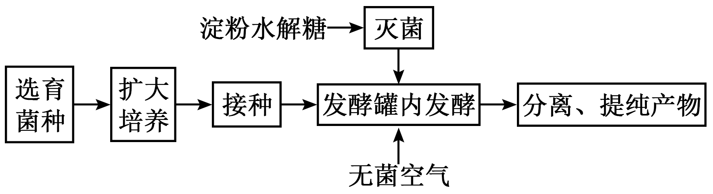
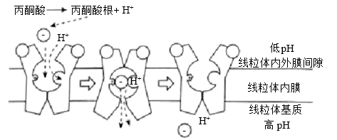
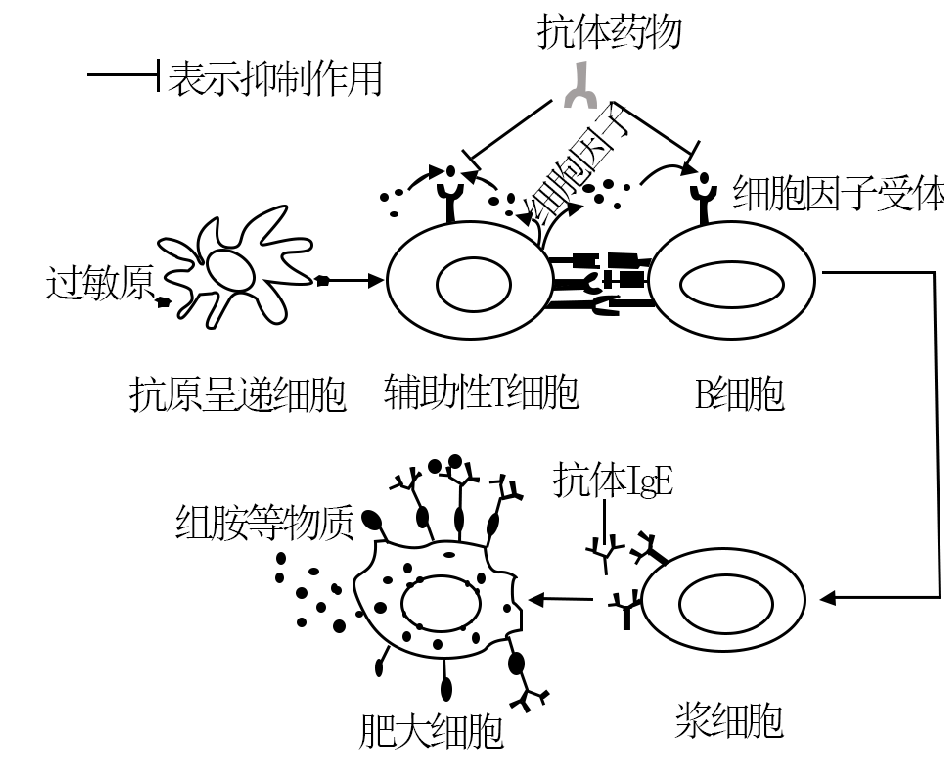
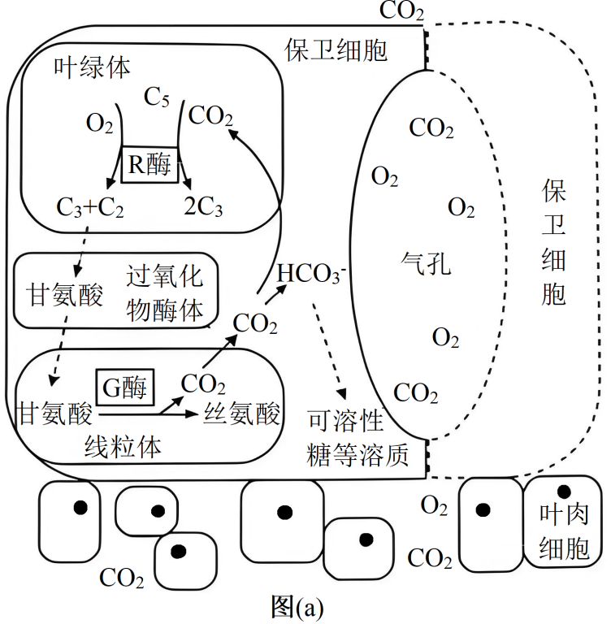
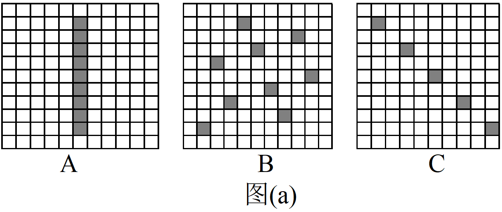

**2025年普通高中学业水平选择性考试（陕晋宁青卷）**

**陕西、山西、宁夏、青海四省（陕晋宁青）**

**生物学**

**本试卷共100分，考试时间75分钟。**

**一、选择题：本题共16小题，每小题3分，共48分。在每小题给出的四个选项中，只有一项是符合题目要求的。**

1\. 佝偻病伴发的手足抽搐症状与人体内某种元素缺乏有关。该元素还可以（ ）

A. 参与构成叶绿素 B. 用于诱导原生质体融合

C. 辅助血红蛋白携氧 D. 参与构成甲状腺激素

2\. 某樱桃品种由北方引种到南方后，栽培于平地和同一地区高山的相比，花芽小且产量较低。研究人员分析了花芽的激素含量，结果如下表。下列叙述错误的是（ ）

<table style="width:100%;">
<colgroup>
<col style="width: 10%" />
<col style="width: 11%" />
<col style="width: 16%" />
<col style="width: 12%" />
<col style="width: 8%" />
<col style="width: 8%" />
<col style="width: 8%" />
<col style="width: 24%" />
</colgroup>
<tbody>
<tr>
<td rowspan="2" style="text-align: center;">栽培地点</td>
<td rowspan="2" style="text-align: center;">海拔（m）</td>
<td rowspan="2" style="text-align: center;">年均温度（℃）</td>
<td colspan="4" style="text-align: center;">激素含量（ng·g-1）</td>
<td rowspan="2" style="text-align: left;">每100个花芽的质量（g）</td>
</tr>
<tr>
<td style="text-align: center;">细胞分裂素</td>
<td style="text-align: center;">赤霉素</td>
<td style="text-align: center;">脱落酸</td>
<td style="text-align: center;">生长素</td>
</tr>
<tr>
<td style="text-align: center;">平地</td>
<td style="text-align: center;">10</td>
<td style="text-align: center;">18.7</td>
<td style="text-align: center;">17.2</td>
<td style="text-align: center;">4.1</td>
<td style="text-align: center;">1028</td>
<td style="text-align: center;">43.1</td>
<td style="text-align: center;">6.6</td>
</tr>
<tr>
<td style="text-align: center;">高山</td>
<td style="text-align: center;">1058</td>
<td style="text-align: center;">134</td>
<td style="text-align: center;">20.9</td>
<td style="text-align: center;">4.9</td>
<td style="text-align: center;">95.9</td>
<td style="text-align: center;">41.9</td>
<td style="text-align: center;">7.3</td>
</tr>
</tbody>
</table>

A. 樱桃花芽的发育受多种植物激素的共同调控

B. 平地和高山的樱桃花芽激素含量受温度影响

C. 樱桃花芽发育中赤霉素和脱落酸的作用相反

D. 生长素与细胞分裂素比值高有利于花芽膨大

3\. 我国是世界上最大的柠檬酸生产国。利用黑曲霉通过深层通气液体发酵技术生产柠檬酸，流程如下图。下列叙述错误的是（ ）

A. 淀粉水解糖为发酵提供碳源和能源 B. 扩大培养可提供足量的黑曲霉菌种

C. 培养基、发酵罐和空气的灭菌方法相同 D. 通气、搅拌有利于溶解氧增加和柠檬酸积累

4\. 细胞衰老表现为细胞形态、结构和功能的改变。下列叙述错误的是（ ）

A. 细胞持续分裂过程中端粒缩短可引起细胞衰老

B. 皮肤生发层新形成细胞替代衰老细胞过程中有新蛋白合成

C. 哺乳动物成熟红细胞的程序性死亡会导致机体的衰老

D. 衰老小肠上皮细胞的膜通透性改变，物质吸收效率降低

5\. 对下列关于中学生物学实验的描述错误的是（ ）

①探究淀粉酶对淀粉和蔗糖的水解作用

②观察植物细胞的质壁分离现象

③探究培养液中酵母菌种群数量的变化

④观察植物细胞的有丝分裂

⑤观察叶绿体和细胞质的流动

⑥DNA的粗提取与鉴定

A. ①⑥通过观察颜色判断实验结果 B. ③⑥均须进行离心操作

C. ②④均可使用洋葱作为实验材料 D. ②⑤实验过程均须保持细胞活性

6\. 临床上常用能量合剂给患者提供能量，改善细胞功能，提高治疗效果。某能量合剂的配方如下表，其中辅酶A参与糖和脂肪等有机物的氧化分解。下列叙述错误的是（ ）

<table style="width:47%;">
<colgroup>
<col style="width: 6%" />
<col style="width: 7%" />
<col style="width: 9%" />
<col style="width: 10%" />
<col style="width: 13%" />
</colgroup>
<tbody>
<tr>
<td style="text-align: center;">成分</td>
<td style="text-align: center;">ATP</td>
<td style="text-align: center;">辅酶A</td>
<td style="text-align: center;">10%KCl</td>
<td style="text-align: center;">5%NaHCO3</td>
</tr>
<tr>
<td style="text-align: center;">用量</td>
<td style="text-align: center;">60mg</td>
<td style="text-align: center;">100U</td>
<td style="text-align: center;">10mL</td>
<td style="text-align: center;">50mL</td>
</tr>
<tr>
<td style="text-align: center;">用法</td>
<td colspan="4" style="text-align: center;">溶于500mL5%葡萄糖溶液后，静脉滴注</td>
</tr>
</tbody>
</table>

A. K+经协助扩散内流以维持神经细胞静息电位

B. 补充辅酶A可增强细胞呼吸促进ATP生成

C. /H2CO3在维持血浆pH稳定中起重要作用

D. 合剂中的无机盐离子参与细胞外液渗透压的维持

7\. 科研人员通过对绵羊受精卵进行基因编辑和胚胎移植等操作，获得了羊毛长度显著长于对照组的优良品系。下列叙述错误的是（ ）

A. 为获取足够的卵子，需对供体绵羊注射促性腺激素进行超数排卵处理

B. 为确保受体绵羊与供体绵羊生理状态一致，需进行同期发情处理

C 受精卵发育至桑葚胚阶段，细胞数量和胚胎总体积均增加

D. 对照组绵羊的选择需考虑年龄、性别等无关变量的影响

8\. 丙酮酸是糖代谢过程的重要中间物质。丙酮酸转运蛋白（MPC）运输丙酮酸通过线粒体内膜的过程如下图。下列叙述错误的是（ ）

A. MPC功能减弱的动物细胞中乳酸积累将会增加

B. 丙酮酸根、H+共同与MPC结合使后者构象改变

C. 线粒体内外膜间隙pH变化影响丙酮酸根转运速率

D. 线粒体内膜两侧的丙酮酸根浓度差越大其转运速率越高

9\. 专食性绢蝶幼虫以半荷包紫堇叶片为食，成体绢蝶偏好在绿叶型半荷包紫堇植株附近产卵。生长于某冰川地域的半荷包紫堇因bHLH35基因突变使叶片呈现类似岩石的灰色，不易被成体绢蝶识别。冰川消融导致裸露岩石增多、分布范围扩大，则该地区（ ）

A. 半荷包紫堇突变的bHLH35基因频率会逐渐增加

B. 半荷包紫堇bHLH35基因突变会引起绢蝶的变异

C. 灰叶型半荷包紫堇的出现标志着新物种的形成

D. 冰川消融导致绢蝶受到的选择压力减小

10\. 金刚鹦鹉的羽毛色彩缤纷。研究发现乙醛脱氢酶能催化鹦鹉黄素的醛基转化为羧基，造成羽色由红到黄的渐变。同一只鹦鹉不同部位的羽色有红黄差异，该现象最不可能源于（ ）

A. 乙醛脱氢酶基因序列的差异 B. 编码乙醛脱氢酶mRNA量的差异

C. 乙醛脱氢酶活性的差异 D. 鹦鹉黄素醛基转化为羧基数的差异

11\. 入侵物种线虫甲和本土物种线虫乙常引起松树成片死亡。为探究两者的竞争关系，在相同实验条件下对甲和乙混合培养，部分结果如下表。下列叙述错误的是（ ）

|     |          |          |      |
|:---:|:--------:|:--------:|:----:|
| 组别  | 甲初始数量（条） | 乙初始数量（条） | 存活物种 |
| 1   | 9♂+9♀    | 10♂+10♀  | 甲    |
| 2   | 6♂+6♀    | 10♂+10♀  | 甲    |
| 3   | 4♂+4♀    | 10♂+10♀  | 甲    |
| 4   | 3♂+3♀    | 10♂+10♀  | 乙    |

A. 相同条件下甲单独培养时的K值比混合培养时大

B. 实验中仅存活一种线虫的原因是两者生态位相似

C. 设置相同雌雄比是为排除性比对实验结果的干扰

D. 结果表明野外释放乙是生物防治甲入侵的有效措施

12\. 我国自主研发的某单克隆抗体药物能够与特异性细胞因子受体结合，用于治疗季节性过敏性鼻炎，部分过程示意图如下。下列叙述错误的是（ ）

A. 抗原呈递细胞和辅助性T细胞都能摄取、加工处理和呈递抗原

B. 活化B细胞需要过敏原和辅助性T绸胞传递的信号刺激

C. 过敏原再次进入机体与肥大细胞表面的抗体IgE结合后引发过敏反应

D. 该抗体药物能与特异性细胞因子受体结合，减少抗体IgE的产生

13\. 丛枝菌根真菌（AMF）可以帮助植物吸收磷，同时从植物中获取有机物。我国科研人员最近研究发现，小麦CNGC15基因突变后根细胞合成和分泌的黄酮类物质增加，吸引更多的AMF在小麦根部定殖。下列叙述错误的是（ ）

A. 该基因突变可以增加生物多样性 B. 低磷条件下AMF与小麦互利共生

C. 小麦和AMF通过化学信息调节种间关系 D. 该基因突变不影响AMF和小麦种群间能量流动

14\. 高温胁迫导致植物细胞中错误折叠或未折叠蛋白质在内质网中异常积累，使细胞合成更多的参与蛋白质折叠的分子伴侣蛋白，以恢复内质网中正常的蛋白质合成与加工，此过程称为“未折叠蛋白质应答反应（UPR）”。下列叙述正确的是（ ）

A. 错误折叠或未折叠蛋白质被转运至高尔基体降解

B. 合成新的分子伴侣所需能量全部由线粒体提供

C. UPR过程需要细胞核、核糖体和内质网的协作

D. 阻碍UPR可增强植物对高温胁迫的耐受性

15\. 冰川融水会将溪流沿岸的无机盐和有机物残体等带入湖泊，如图（a）。环境DNA（eDNA）技术通过检测环境样品中特异性基因序列来识别物种，利用该技术分析青藏高原某冰川前缘、溪流到下游湖泊的15个采样点的物种丰富度，如图（b）。下列叙述正确的是（ ）

A 冰川前缘至少有2个营养级，湖泊中至少有4个营养级

B. eDNA结果可同时反映水体及周边陆地生态系统物种多样性

C. 从高山流石滩到高寒草甸生物的分布体现了群落的垂直结构

D. 蓝细菌等生产者固定的太阳能是输入湖泊生态系统的总能量

16\. 某常染色体遗传病致病基因为H，在一些个体中可因甲基化而失活（不表达），又会因去甲基化而恢复表达。由于遗传背景的差异，H基因在精子中为甲基化状态，在卵细胞中为去甲基化状态，且都在受精后被子代保留。该病的某系谱图如下，Ⅲ1的基因型为Hh，不考虑其他表观遗传效应和变异的影响，下列分析错误的是（ ）

A. I1和I2均含有甲基化的H基因 B. Ⅱ1为杂合子的概率2/3

C. Ⅱ2和Ⅱ3再生育子女的患病概率是1/2 D. Ⅲ1的h基因只能来自父亲

**二、非选择题：本题共5小题，共52分。**

17\. 叶绿体中R酶既能催化CO2固定，也能催化C5与O2反应，CO2和O2两种底物竞争R酶同一活性位点；线粒体中G酶参与催化甘氨酸转化为丝氨酸，如图（a）。为探究保卫细胞中G酶对植物光合作用的影响，研究者以野生型植株W为参照，构建了G酶表达量仅在保卫细胞中增加的植株S，实验结果如图（b）。回答下列问题。

（1）R酶催化CO2固定的场所是叶绿体的\_\_\_\_\_\_\_\_，产物C3在光反应生成的\_\_\_\_\_\_\_\_参与下合成糖类等有机物。

（2）植物保卫细胞吸水，气孔开度增大。由图（a）（b）可知，相同光照条件下植株S保卫细胞中G酶表达量提高，叶片的净光合速率高于植株W，原因是\_\_\_\_\_\_\_\_\_\_\_\_\_\_\_\_。

（3）保持环境中CO2浓度不变，当O2浓度从21%升高到40%时，植株S的净光合速率\_\_\_\_\_\_\_\_（填“增大”或“减小”）；相较于植株W，植株S的净光合速率变化幅度\_\_\_\_\_\_\_\_（填“大”“小”或“无法判断”）。

（4）若需确认保卫细胞中G酶对叶片净光合速率的影响，还需补充一个实验组。写出实验思路及预期结果：\_\_\_\_\_\_\_\_\_\_\_\_\_\_\_\_。

18\. 某芸香科植物分泌腔内的萜烯等化合物可抗虫害，纯合栽培品种（X）果实糖分含量高，叶全缘，但没有分泌腔；而野生纯合植株（甲）叶缘齿状，具有发达的分泌腔。我国科研人员发现A基因和B基因与该植物叶缘形状、分泌腔形成有关。对植株甲进行基因敲除后得到植株乙、丙、丁，其表型如下表。回答下列问题。

<table style="width:85%;">
<colgroup>
<col style="width: 29%" />
<col style="width: 6%" />
<col style="width: 8%" />
<col style="width: 2%" />
<col style="width: 37%" />
</colgroup>
<tbody>
<tr>
<td style="text-align: center;">植株</td>
<td style="text-align: center;">叶缘</td>
<td style="text-align: center;">分泌腔</td>
<td rowspan="5" style="text-align: left;"></td>
<td rowspan="5" style="text-align: left;">
P 野生型（甲）×栽培品种（X）

↓

F1 有分泌腔

↓

F2 有分泌腔 无分泌腔

3 : 1
</td>
</tr>
<tr>
<td style="text-align: center;">甲（野生型）</td>
<td style="text-align: center;">齿状</td>
<td style="text-align: center;">有</td>
</tr>
<tr>
<td style="text-align: center;">乙（敲除A基因）</td>
<td style="text-align: center;">全缘</td>
<td style="text-align: center;">无</td>
</tr>
<tr>
<td style="text-align: center;">丙（敲除B基因）</td>
<td style="text-align: center;">齿状</td>
<td style="text-align: center;">无</td>
</tr>
<tr>
<td style="text-align: center;">丁（敲除A基因和B基因）</td>
<td style="text-align: center;">全缘</td>
<td style="text-align: center;">无</td>
</tr>
</tbody>
</table>

（1）由表分析可知，控制叶缘形状的基因是\_\_\_\_\_\_\_\_，控制分泌腔形成的基因是\_\_\_\_\_\_\_\_。

（2）为探究A基因和B基因之间的调控关系，在植株乙中检测到B基因的表达量显著减少，而植株丙中A基因的表达量无变化，说明\_\_\_\_\_\_\_\_\_\_\_\_\_\_\_\_\_\_\_\_\_\_\_\_。

（3）为探究A基因与B基因在染色体上的位置关系，不考虑突变及其他基因的影响，选择表中的植株进行杂交，可选择的亲本组合是\_\_\_\_\_\_\_\_。F1自交得到F2，若F2的表型及比例为\_\_\_\_\_\_\_\_，则A、B基因位于两对同源染色体上。在此情况下结合图中杂交结果，可推测栽培品种（X）的\_\_\_\_\_\_\_\_（填“A”“B”或“A和B”）基因功能缺陷，可引入相应基因来提高栽培品种的抗虫品质。

19\. 摄食行为受神经—体液调节，长期睡眼眠不足会影响摄食，易导致体重增加，引发肥胖等代谢问题。回答下列问题。

（1）胃肠道管壁感受器接受食物刺激后，产生兴奋，在脑干、脊髓等中枢参与下，胃肠平滑肌收缩，属于\_\_\_\_\_\_\_\_（填“非条件”或“条件”）反射，该过程也受大脑皮层的调控，属于神经系统的\_\_\_\_\_\_\_\_调节。

（2）我国科研人员新发现一种激素R，夜间分泌量高，白天分泌量低，表明激素R分泌具有\_\_\_\_\_\_\_\_性。分别对不同人群、睡眠效率与激素R含量的关系进行分析，结果如图（a），可知\_\_\_\_\_\_\_\_\_\_\_\_\_\_\_\_（答出2点即可）。

（3）利用R基因（控制合成激素R）敲除小鼠开展研究，结果如图（b），该实验的目的是\_\_\_\_\_\_\_\_\_\_\_\_\_\_\_\_。

（4）研究人员针对激素R的受体GRM3开展了相关研究，结果如图（c）。与甲组相比，乙组将小鼠下丘脑摄食抑制神经元上的GRM3敲除，使突触前膜以\_\_\_\_\_\_\_\_方式释放的神经递质减少，兴奋传递效率降低，小鼠食欲增加；丙组将小鼠胃运动神经元上的GRM3敲除，胃运动神经元释放的\_\_\_\_\_\_\_\_（填“兴奋性”或“抑制性”）递质减少，使胃平滑肌收缩增强。据此推测激素R缓解肥胖的机制是\_\_\_\_\_\_\_\_\_\_\_\_\_\_\_\_。

20\. 过度放牧会导致土地退化，禁牧封育是防治荒漠化和开展风沙治理的重要措施。研究人员在黄土高原半干旱区对不同禁牧封育年限的群落开展植物多样性调查，结果如下表。其中，辛普森多样性指数越大表示群落物种多样性水平越高。回答下列问题。

<table style="width:82%;">
<colgroup>
<col style="width: 12%" />
<col style="width: 8%" />
<col style="width: 12%" />
<col style="width: 12%" />
<col style="width: 16%" />
<col style="width: 18%" />
</colgroup>
<tbody>
<tr>
<td rowspan="2" style="text-align: center;">
禁牧封育

时长（年）
</td>
<td colspan="3" style="text-align: center;">物种数（种）</td>
<td rowspan="2" style="text-align: center;">物种总数（种）</td>
<td rowspan="2" style="text-align: center;">辛普森多样性指数</td>
</tr>
<tr>
<td style="text-align: center;">半灌木</td>
<td style="text-align: center;">多年生草本</td>
<td style="text-align: center;">一年生草本</td>
</tr>
<tr>
<td style="text-align: center;">0</td>
<td style="text-align: center;">0</td>
<td style="text-align: center;">11</td>
<td style="text-align: center;">2</td>
<td style="text-align: center;">13</td>
<td style="text-align: center;">0.6</td>
</tr>
<tr>
<td style="text-align: center;">3</td>
<td style="text-align: center;">2</td>
<td style="text-align: center;">16</td>
<td style="text-align: center;">4</td>
<td style="text-align: center;">22</td>
<td style="text-align: center;">0.8</td>
</tr>
<tr>
<td style="text-align: center;">6</td>
<td style="text-align: center;">2</td>
<td style="text-align: center;">19</td>
<td style="text-align: center;">6</td>
<td style="text-align: center;">27</td>
<td style="text-align: center;">0.9</td>
</tr>
<tr>
<td style="text-align: center;">10</td>
<td style="text-align: center;">2</td>
<td style="text-align: center;">21</td>
<td style="text-align: center;">5</td>
<td style="text-align: center;">28</td>
<td style="text-align: center;">0.9</td>
</tr>
<tr>
<td style="text-align: center;">15</td>
<td style="text-align: center;">2</td>
<td style="text-align: center;">22</td>
<td style="text-align: center;">2</td>
<td style="text-align: center;">26</td>
<td style="text-align: center;">0.8</td>
</tr>
</tbody>
</table>

注：深色方块代表样方的相对位置

（1）开展植物种群密度调查时常用样方法。研究区域的植物分布不均匀，理论上样方设置较合理的是图（a）中的\_\_\_\_\_\_\_\_（填“A”“B”或“C”），其原因是\_\_\_\_\_\_\_\_\_\_\_\_\_\_\_\_\_\_\_\_\_\_\_\_。

（2）本研究结果说明生态系统遭到一定程度的破坏后，经过一段时间，可以恢复到接近原来的状态，这是由于生态系统具有\_\_\_\_\_\_\_\_。

（3）根据表中物种数量变化分析，研究区域禁牧封育后发生的群落演替类型为\_\_\_\_\_\_\_\_，该群落最终演替成为灌草群落。若在该半干旱地区大量种植阔叶乔木，生态系统稳定性会\_\_\_\_\_\_\_\_，其原因是\_\_\_\_\_\_\_\_\_\_\_\_\_\_\_\_。

（4）据表可知，随禁牧封育时间延长，物种多样性的变化趋势是\_\_\_\_\_\_\_\_，该结果说明\_\_\_\_\_\_\_\_\_\_\_\_\_\_\_\_；针对其中出现的问题，结合图（b）所示，对长期禁牧封育的群落恢复提出可行优化建议：\_\_\_\_\_\_\_\_\_\_\_\_\_\_\_\_。

21\. 马铃薯作为重要农作物，提高其冷耐受性可拓展优质马铃薯的种植区域。我国科研人员发现，野生马铃薯中S基因的表达与其冷耐受性调控有关，将该基因导入栽培马铃薯中可显著增强其抗寒能力。回答下列问题。

（1）PCR扩增目的基因时，需要模板DNA、引物、\_\_\_\_\_\_\_\_、含Mg2+的缓冲液和耐高温的DNA聚合酶。DNA聚合酶在PCR的\_\_\_\_\_\_\_\_步骤中起作用。

（2）图中标识了载体和S基因中限制酶的切割位点。为将S基因正确插入载体，PCR扩增S基因时需在引物的\_\_\_\_\_\_\_\_（填“5'端”或“3'端”）添加限制酶识别序列，结合上表分析，上游引物应添加的碱基序列是5'-\_\_\_\_\_\_\_\_-3'，切割载体时应选用的两种限制酶是\_\_\_\_\_\_\_\_，PCR扩增产物和载体分别被限制酶切割后，经纯化和连接，获得含S基因的表达载体并导入农杆菌。

（3）用携带S基因的农杆菌侵染栽培马铃薯愈伤组织时，基因表达载体中T-DNA进入愈伤组织细胞，将S基因整合到\_\_\_\_\_\_\_\_，抗性基因\_\_\_\_\_\_\_\_可用于筛选成功转化的愈伤组织。该愈伤组织经\_\_\_\_\_\_\_\_形成芽、根，继续培育可获得抗寒能力显著增强的马铃薯植株。
