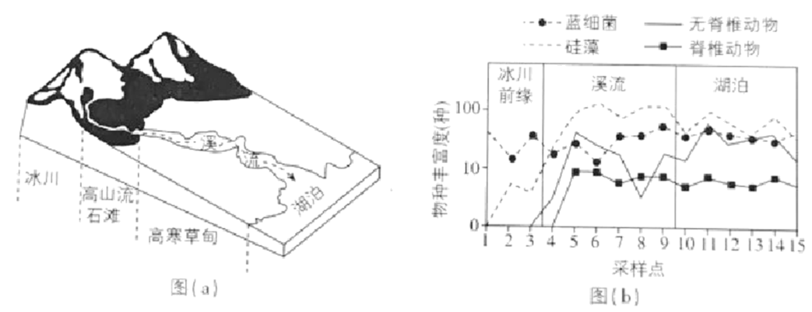
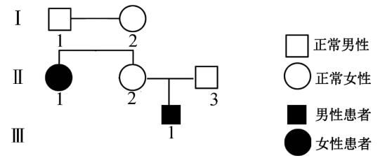
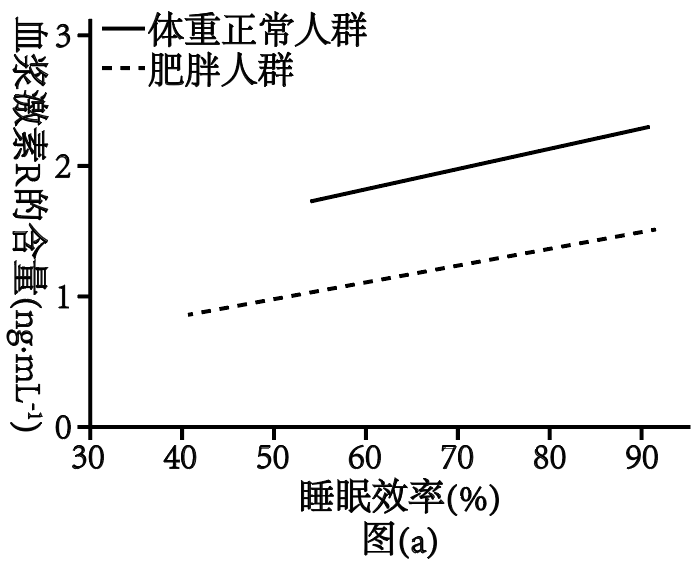
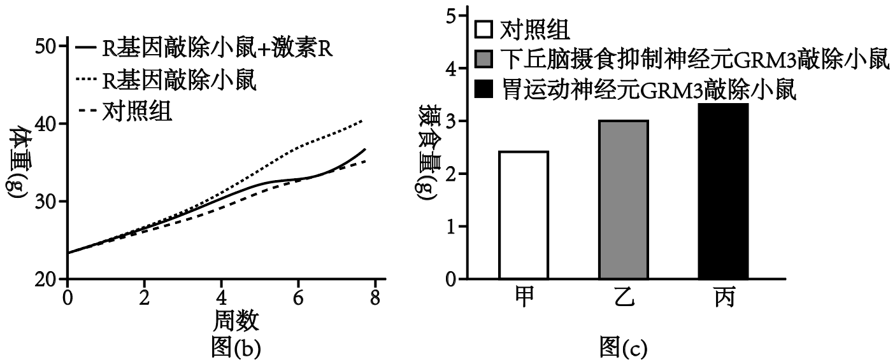
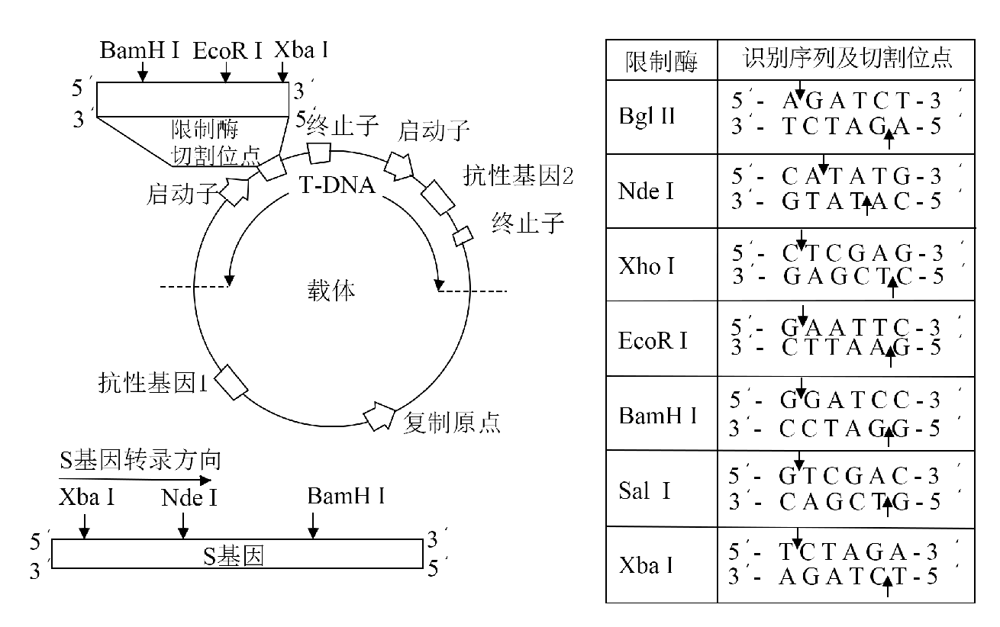

**2025年普通高中学业水平选择性考试（陕晋宁青卷）**

**陕西、山西、宁夏、青海四省（陕晋宁青）**

**生物学**

**本试卷共100分，考试时间75分钟。**

**一、选择题：本题共16小题，每小题3分，共48分。在每小题给出的四个选项中，只有一项是符合题目要求的。**

1\. 佝偻病伴发的手足抽搐症状与人体内某种元素缺乏有关。该元素还可以（ ）

A. 参与构成叶绿素 B. 用于诱导原生质体融合

C. 辅助血红蛋白携氧 D. 参与构成甲状腺激素

【答案】B

【解析】

【分析】手足抽搐是由于血钙浓度降低引起的，而佝偻病与钙吸收不足有关。

【详解】A、佝偻病伴发的手足抽搐症状与人体内钙（Ca2+）缺乏有关，叶绿素的核心元素是镁（Mg2+），钙（Ca2+）不参与叶绿素构成，A错误；

B、在植物体细胞杂交技术中，高Ca2+-高pH是植物原生质体融合的其中一种方法，与钙（Ca2+）有关，B正确；

C、血红蛋白的辅基含铁（Fe2+），负责携氧，与钙无关，C错误；

D、甲状腺激素含碘（I-），钙不参与其构成，D错误。

故选B。

2\. 某樱桃品种由北方引种到南方后，栽培于平地和同一地区高山的相比，花芽小且产量较低。研究人员分析了花芽的激素含量，结果如下表。下列叙述错误的是（ ）

<table>
<colgroup>
<col style="width: 10%" />
<col style="width: 11%" />
<col style="width: 16%" />
<col style="width: 12%" />
<col style="width: 8%" />
<col style="width: 8%" />
<col style="width: 8%" />
<col style="width: 24%" />
</colgroup>
<tbody>
<tr>
<td rowspan="2" style="text-align: center;">栽培地点</td>
<td rowspan="2" style="text-align: center;">海拔（m）</td>
<td rowspan="2" style="text-align: center;">年均温度（℃）</td>
<td colspan="4" style="text-align: center;">激素含量（ng·g-1）</td>
<td rowspan="2" style="text-align: left;">每100个花芽的质量（g）</td>
</tr>
<tr>
<td style="text-align: center;">细胞分裂素</td>
<td style="text-align: center;">赤霉素</td>
<td style="text-align: center;">脱落酸</td>
<td style="text-align: center;">生长素</td>
</tr>
<tr>
<td style="text-align: center;">平地</td>
<td style="text-align: center;">10</td>
<td style="text-align: center;">18.7</td>
<td style="text-align: center;">17.2</td>
<td style="text-align: center;">4.1</td>
<td style="text-align: center;">102.8</td>
<td style="text-align: center;">43.1</td>
<td style="text-align: center;">6.6</td>
</tr>
<tr>
<td style="text-align: center;">高山</td>
<td style="text-align: center;">1058</td>
<td style="text-align: center;">13.4</td>
<td style="text-align: center;">20.9</td>
<td style="text-align: center;">4.9</td>
<td style="text-align: center;">95.9</td>
<td style="text-align: center;">41.9</td>
<td style="text-align: center;">7.3</td>
</tr>
</tbody>
</table>

A. 樱桃花芽的发育受多种植物激素的共同调控

B. 平地和高山的樱桃花芽激素含量受温度影响

C. 樱桃花芽发育中赤霉素和脱落酸的作用相反

D. 生长素与细胞分裂素比值高有利于花芽膨大

【答案】D

【解析】

【详解】植物的生长发育不仅受环境影响，也受植物体内多种激素的共同调节。

【分析】A、樱桃花芽的发育涉及细胞分裂素、赤霉素、脱落酸和生长素等多种激素，说明其受多种激素共同调控，A正确；

B、平地和高山的温度存在较大的差异，表中激素含量差异可推断可能由温度变化引起，B正确；

C、赤霉素促进细胞伸长和生长，脱落酸抑制生长，两者在花芽发育中起拮抗作用，C正确；

D、平地的生长素/细胞分裂素比值为43.1/17.2≈2.5，高山为41.9/20.9≈2.0，而高山花芽质量更高，说明比值低时更有利于花芽膨大，D错误。

故选D。

3\. 我国是世界上最大的柠檬酸生产国。利用黑曲霉通过深层通气液体发酵技术生产柠檬酸，流程如下图。下列叙述错误的是（ ）

A. 淀粉水解糖为发酵提供碳源和能源 B. 扩大培养可提供足量的黑曲霉菌种

C. 培养基、发酵罐和空气的灭菌方法相同 D. 通气、搅拌有利于溶解氧增加和柠檬酸积累

【答案】C

【解析】

【分析】黑曲霉发酵时需通入空气，为异养需氧型。

【详解】A、淀粉水解形成的糖类可以作为黑曲霉生存所需的碳源，氧化分解可以为黑曲霉提供能源，A正确；

B、通过液体培养基的扩大培养，可以为后续的发酵罐内发酵提供足量的黑曲霉菌种，B正确；

C、空气一般用过滤除菌的方式，培养基一般用高压蒸汽灭菌的方式，发酵罐可以用高温灭菌的方式等，因此它们的灭菌方法不相同，C错误；

D、已知利用黑曲霉通过深层通气液体发酵技术生产柠檬酸，说明通气、搅拌有利于溶解氧增加，有利于发酵产物柠檬酸的积累，D正确。

故选C。

4\. 细胞衰老表现为细胞形态、结构和功能的改变。下列叙述错误的是（ ）

A. 细胞持续分裂过程中端粒缩短可引起细胞衰老

B. 皮肤生发层新形成细胞替代衰老细胞过程中有新蛋白合成

C. 哺乳动物成熟红细胞的程序性死亡会导致机体的衰老

D. 衰老小肠上皮细胞的膜通透性改变，物质吸收效率降低

【答案】C

【解析】

【分析】衰老细胞的特征：细胞内水分减少，细胞萎缩，体积变小，但细胞核体积增大，染色质固缩，染色加深；细胞膜通透性功能改变，物质运输功能降低；细胞色素随着细胞衰老逐渐累积；有些酶的活性降低；呼吸速度减慢，新陈代谢减慢。

【详解】A、端粒随细胞分裂逐渐缩短，当端粒缩短到临界值时，细胞停止分裂并衰老，符合端粒学说，A正确；

B、皮肤生发层细胞分裂产生新细胞时，需合成DNA复制所需的酶及结构蛋白，故有新蛋白生成，B正确；

C、哺乳动物成熟红细胞无细胞核及基因，其死亡属于被动坏死，而非基因调控的程序性死亡（凋亡），且红细胞寿命有限，其正常死亡不会直接导致机体衰老，C错误；

D、衰老细胞的细胞膜通透性改变，载体蛋白减少或功能下降，主动运输效率降低，D正确；

故选C。

5\. 对下列关于中学生物学实验的描述错误的是（ ）

①探究淀粉酶对淀粉和蔗糖的水解作用

②观察植物细胞的质壁分离现象

③探究培养液中酵母菌种群数量的变化

④观察植物细胞的有丝分裂

⑤观察叶绿体和细胞质的流动

⑥DNA的粗提取与鉴定

A. ①⑥通过观察颜色判断实验结果 B. ③⑥均须进行离心操作

C. ②④均可使用洋葱作为实验材料 D. ②⑤实验过程均须保持细胞活性

【答案】B

【解析】

【详解】探索淀粉酶对淀粉和蔗糖的作用的实验中，最后需要用本尼迪特试剂检测，因此需要水浴加热和根据颜色反应来确定。

【分析】A、淀粉和蔗糖都不是还原糖，不能与本尼迪特试剂反应，淀粉和蔗糖水解产物为还原糖，可以与本尼迪特试剂反应，因此可以用本尼迪特试剂鉴定淀粉酶对淀粉和蔗糖的水解作用，若淀粉组出现红黄色，蔗糖组没有出现红黄色，说明淀粉酶可以催化淀粉水解不能催化蔗糖水解；⑥中DNA与二苯胺在沸水浴下显蓝色，因此①⑥均通过颜色判断结果，A正确；

B、③通过血球计数板直接计数酵母菌，无需离心；⑥需离心去除杂质以提取DNA，B错误；

C、②可用洋葱紫色外表皮观察质壁分离，④可用洋葱根尖分生区观察有丝分裂，C正确；

D、②活的植物细胞原生质体具有选择透性，可以发生质壁分离现象；⑤活细胞的叶绿体和细胞质才能流动，因此②⑤实验过程均须保持细胞活性，D正确。

故选B。

6\. 临床上常用能量合剂给患者提供能量，改善细胞功能，提高治疗效果。某能量合剂的配方如下表，其中辅酶A参与糖和脂肪等有机物的氧化分解。下列叙述错误的是（ ）

<table style="width:47%;">
<colgroup>
<col style="width: 6%" />
<col style="width: 7%" />
<col style="width: 9%" />
<col style="width: 10%" />
<col style="width: 13%" />
</colgroup>
<tbody>
<tr>
<td style="text-align: center;">成分</td>
<td style="text-align: center;">ATP</td>
<td style="text-align: center;">辅酶A</td>
<td style="text-align: center;">10%KCl</td>
<td style="text-align: center;">5%NaHCO3</td>
</tr>
<tr>
<td style="text-align: center;">用量</td>
<td style="text-align: center;">60mg</td>
<td style="text-align: center;">100U</td>
<td style="text-align: center;">10mL</td>
<td style="text-align: center;">50mL</td>
</tr>
<tr>
<td style="text-align: center;">用法</td>
<td colspan="4" style="text-align: center;">溶于500mL5%葡萄糖溶液后，静脉滴注</td>
</tr>
</tbody>
</table>

A. K+经协助扩散内流以维持神经细胞静息电位

B. 补充辅酶A可增强细胞呼吸促进ATP生成

C. /H2CO3在维持血浆pH稳定中起重要作用

D. 合剂中的无机盐离子参与细胞外液渗透压的维持

【答案】A

【解析】

【分析】静息电位形成的主要原因是K+外流，动作电位形成的原因是Na+内流。

【详解】A、静息电位形成的主要原因是K+经协助扩散外流，A错误；

B、已知辅酶A参与糖和脂肪等有机物的氧化分解，补充辅酶A可增强糖和脂肪等有机物的氧化分解，从而促进ATP的生成，B正确；

C、HCO₃⁻/H₂CO₃是血浆中重要的缓冲对，能中和酸性或碱性物质以维持pH稳定，C正确；

D、细胞外液渗透压主要由Na⁺、Cl⁻等无机盐离子维持，合剂中的K⁺、Cl⁻、Na⁺等均参与此过程，D正确。

故选A。

7\. 科研人员通过对绵羊受精卵进行基因编辑和胚胎移植等操作，获得了羊毛长度显著长于对照组的优良品系。下列叙述错误的是（ ）

A. 为获取足够的卵子，需对供体绵羊注射促性腺激素进行超数排卵处理

B. 为确保受体绵羊与供体绵羊生理状态一致，需进行同期发情处理

C. 受精卵发育至桑葚胚阶段，细胞数量和胚胎总体积均增加

D. 对照组绵羊的选择需考虑年龄、性别等无关变量的影响

【答案】C

【解析】

【详解】动物胚胎发育的基本过程：(1)受精场所是母体的输卵管。(2)卵裂期：细胞有丝分裂，细胞数量不断增加，但胚胎的总体体积并不增加，或略有减小。(3)桑葚胚：胚胎细胞数目达到32个左右时，胚胎形成致密的细胞团，形似桑葚，是全能细胞。(4)囊胚：细胞开始出现分化(该时期细胞的全能性仍比较高)，聚集在胚胎一端个体较大的细胞称为内细胞团，将来发育成胎儿的各种组织。中间的空腔称为囊胚腔。(5)原肠胚：有了三胚层的分化，具有囊胚腔和原肠腔。

【分析】A、促性腺激素可促进供体超数排卵，从而获得更多卵子，A正确；

B、为确保受体绵羊与供体绵羊生理状态一致，受体与供体需同期发情处理以保证胚胎移植后生理环境同步，B正确；

C、桑葚胚阶段的细胞通过卵裂增殖，细胞数量增加，但胚胎总体积不变，或略有减小，C错误；

D、本实验的自变量是是否对绵羊受精卵进行基因编辑等，其余为无关变量，对照组与实验组的无关变量（如年龄、性别）需保持一致，以排除干扰，D正确。

故选C。

8\. 丙酮酸是糖代谢过程的重要中间物质。丙酮酸转运蛋白（MPC）运输丙酮酸通过线粒体内膜的过程如下图。下列叙述错误的是（ ）

A. MPC功能减弱的动物细胞中乳酸积累将会增加

B. 丙酮酸根、H+共同与MPC结合使后者构象改变

C. 线粒体内外膜间隙pH变化影响丙酮酸根转运速率

D. 线粒体内膜两侧的丙酮酸根浓度差越大其转运速率越高

【答案】D

【解析】

【分析】结合图示分析，丙酮酸根的运输速率受MPC数量、H+浓度以及丙酮酸根数量等多种因素的影响。

【详解】A、MPC功能减弱会抑制丙酮酸进入线粒体，就会有更多的丙酮酸在细胞质基质中进行无氧呼吸，从而导致产生更多的乳酸，动物细胞中乳酸积累将会增加，A正确；

B、结合图示可知，丙酮酸分解形成丙酮酸根和H+，两者共同与MPC结合使MPC构象改变，从而运输丙酮酸根和H+，B正确；

C、结合图示可知，H+会协助丙酮酸根进入线粒体，pH的变化受H+浓度的影响，因此线粒体内外膜间隙pH变化影响丙酮酸根转运速率，C正确；

D、丙酮酸根的运输需要丙酮酸转运蛋白（MPC）的参与，且需要H+电化学梯度（H+浓度差），因此丙酮酸根的运输效率不仅受丙酮酸根浓度影响，也受MPC的数量及H+浓度的影响，因此并不是线粒体内膜两侧的丙酮酸根浓度差越大其转运速率越高，D错误。

故选D。

9\. 专食性绢蝶幼虫以半荷包紫堇叶片为食，成体绢蝶偏好在绿叶型半荷包紫堇植株附近产卵。生长于某冰川地域的半荷包紫堇因bHLH35基因突变使叶片呈现类似岩石的灰色，不易被成体绢蝶识别。冰川消融导致裸露岩石增多、分布范围扩大，则该地区（ ）

A. 半荷包紫堇突变的bHLH35基因频率会逐渐增加

B. 半荷包紫堇bHLH35基因突变会引起绢蝶的变异

C. 灰叶型半荷包紫堇的出现标志着新物种的形成

D. 冰川消融导致绢蝶受到的选择压力减小

【答案】A

【解析】

【分析】生物进化的标志是基因频率的改变，新物种形成的标志是生殖隔离的产生。

【详解】A、冰川消融后，灰色叶片植株更易隐藏，避免被绢蝶产卵，生存和繁殖机会增加，导致bHLH35突变基因频率逐渐上升，A正确；

B、变异在任何条件都会发生，半荷包紫堇bHLH35基因突变不会引起绢蝶的变异，B错误；

C、新物种形成的标志是生殖隔离的产生，灰叶型半荷包紫堇的出现是基因突变的结果，基因频率发生改变，标志着生物发生了进化，C错误；

D、生长于某冰川地域的半荷包紫堇因基因突变使叶片呈现类似岩石的灰色，冰川消融后，岩石的灰色呈现，这样不易被成体绢蝶识别，产卵成功率下降，生存压力增大，选择压力反而增强，D错误。

故选A。

10\. 金刚鹦鹉的羽毛色彩缤纷。研究发现乙醛脱氢酶能催化鹦鹉黄素的醛基转化为羧基，造成羽色由红到黄的渐变。同一只鹦鹉不同部位的羽色有红黄差异，该现象最不可能源于（ ）

A. 乙醛脱氢酶基因序列的差异 B. 编码乙醛脱氢酶mRNA量的差异

C. 乙醛脱氢酶活性的差异 D. 鹦鹉黄素醛基转化为羧基数的差异

【答案】A

【解析】

【详解】同一生物体的不同细胞基因序列相同，羽色差异源于基因选择性表达或环境因素。

【分析】A、同一只鹦鹉的体细胞由同一受精卵分裂分化而来，基因序列应相同，差异不可能来自乙醛脱氢酶基因序列，A符合题意；

B、乙醛脱氢酶能催化鹦鹉黄素的醛基转化为羧基，造成羽色由红到黄的渐变，编码乙醛脱氢酶mRNA量的差异，导致产生的乙醛脱氢酶含量变化，造成羽色由红到黄的能力改变，进而引起生物性状的变化，B不符合题意；

C、不同细胞中乙醛脱氢酶活性可能存在一定的差异，造成羽色由红到黄的能力改变，进而导致同一只鹦鹉不同部位的羽色有红黄差异，C不符合题意；

D、乙醛脱氢酶能催化鹦鹉黄素的醛基转化为羧基，造成羽色由红到黄的渐变，可能是不同部位鹦鹉黄素醛基转化为羧基数的差异，所以导致同一只鹦鹉不同部位的羽色有红黄差异，D不符合题意。

故选A。

11\. 入侵物种线虫甲和本土物种线虫乙常引起松树成片死亡。为探究两者的竞争关系，在相同实验条件下对甲和乙混合培养，部分结果如下表。下列叙述错误的是（ ）

|     |          |          |      |
|:---:|:--------:|:--------:|:----:|
| 组别  | 甲初始数量（条） | 乙初始数量（条） | 存活物种 |
| 1   | 9♂+9♀    | 10♂+10♀  | 甲    |
| 2   | 6♂+6♀    | 10♂+10♀  | 甲    |
| 3   | 4♂+4♀    | 10♂+10♀  | 甲    |
| 4   | 3♂+3♀    | 10♂+10♀  | 乙    |

A. 相同条件下甲单独培养时的K值比混合培养时大

B. 实验中仅存活一种线虫的原因是两者生态位相似

C. 设置相同雌雄比是为排除性比对实验结果的干扰

D. 结果表明野外释放乙是生物防治甲入侵的有效措施

【答案】D

【解析】

【分析】表格数据分析，当乙初始数量远多于甲初始数量，最终存活的物种才是乙。

【详解】A、单独培养时，甲的环境阻力较小，资源充足，其环境容纳量（K值）应高于混合培养时因竞争导致的K值，A正确；

B、两种线虫由于生态位非常相似，导致竞争非常强烈，竞争弱的一方最终被淘汰，B正确；

C、雌雄比一致可避免性比差异影响繁殖率，从而排除无关变量干扰，C正确；

D、实验显示甲在多数情况下占优，仅当甲初始数量极少时乙存活，说明释放乙难以有效抑制甲入侵，D错误。

故选D。

12\. 我国自主研发的某单克隆抗体药物能够与特异性细胞因子受体结合，用于治疗季节性过敏性鼻炎，部分过程示意图如下。下列叙述错误的是（ ）

A. 抗原呈递细胞和辅助性T细胞都能摄取、加工处理和呈递抗原

B. 活化B细胞需要过敏原和辅助性T绸胞传递的信号刺激

C. 过敏原再次进入机体与肥大细胞表面的抗体IgE结合后引发过敏反应

D. 该抗体药物能与特异性细胞因子受体结合，减少抗体IgE的产生

【答案】A

【解析】

【分析】体液免疫：病原体可以直接和B细胞接触，树突状细胞作为抗原呈递细胞，可对抗原进行加工、处理后呈递至辅助性T淋巴细胞，随后在抗原、激活的辅助性T细胞表面的特定分子信号刺激下，B淋巴细胞活化，再接受细胞因子刺激后增殖分化成记忆细胞和浆细胞，浆细胞产生抗体，和病原体结合。

【详解】A、抗原呈递细胞可以摄取、加工处理和呈递抗原，但辅助性T细胞不能摄取、加工处理和呈递抗原，A错误；

B、对于过敏反应的个体而言，过敏原就是一种抗原，活化B细胞需要过敏原和辅助性T细胞传递的信号刺激，同时还需要辅助性T细胞释放的细胞因子的作用，B正确；

C、首次接触过敏原，机体产生的抗体大量附着在肥大细胞表面，过敏原再次进入机体与肥大细胞表面的抗体IgE结合后引发过敏反应，C正确；

D、结合图示可知，该抗体药物能与细胞因子争夺细胞因子受体，从而减弱了细胞因子对B细胞的促进作用，最终减少抗体IgE的产生，D正确。

故选A。

13\. 丛枝菌根真菌（AMF）可以帮助植物吸收磷，同时从植物中获取有机物。我国科研人员最近研究发现，小麦CNGC15基因突变后根细胞合成和分泌的黄酮类物质增加，吸引更多的AMF在小麦根部定殖。下列叙述错误的是（ ）

A. 该基因突变可以增加生物多样性 B. 低磷条件下AMF与小麦互利共生

C. 小麦和AMF通过化学信息调节种间关系 D. 该基因突变不影响AMF和小麦种群间能量流动

【答案】D

【解析】

【详解】生物多样性包括了遗传多样性、物种多样性和生态系统多样性。

【分析】A、生物多样性包括了遗传多样性、物种多样性和生态系统多样性，基因突变属于可遗传变异，增加了遗传多样性，因此该基因突变可以增加生物多样性，A正确；

B、AMF帮助小麦吸收磷，小麦为AMF提供有机物，两者相互依存，属于互利共生关系，尤其在低磷条件下更为显著，B正确；

C、黄酮类物质作为化学信号吸引AMF，属于化学信息调节种间关系，C正确；

D、基因突变导致小麦分泌更多黄酮类物质，吸引更多AMF定殖，AMF获取的有机物（能量）增加，说明能量流动发生改变，D错误。

故选D。

14\. 高温胁迫导致植物细胞中错误折叠或未折叠蛋白质在内质网中异常积累，使细胞合成更多的参与蛋白质折叠的分子伴侣蛋白，以恢复内质网中正常的蛋白质合成与加工，此过程称为“未折叠蛋白质应答反应（UPR）”。下列叙述正确的是（ ）

A. 错误折叠或未折叠蛋白质被转运至高尔基体降解

B. 合成新的分子伴侣所需能量全部由线粒体提供

C. UPR过程需要细胞核、核糖体和内质网的协作

D. 阻碍UPR可增强植物对高温胁迫的耐受性

【答案】C

【解析】

【分析】内质网能有效地增加细胞内的膜面积，其外连细胞膜，内连核膜，将细胞中的各种结构连成一个整体，具有承担细胞内物质运输的作用。蛋白质的合成、加工通常需要核糖体、内质网和高尔基体、线粒体的共同参与。

【详解】A、错误折叠或未折叠蛋白质的降解需要蛋白质水解酶的参与，对于植物细胞而言，液泡具有类似动物溶酶体的功能，可以对这些蛋白进行降解，A错误；

B、合成分子伴侣所需的能量由细胞质基质和线粒体共同提供（ATP来自细胞呼吸），而非全部由线粒体提供，B错误；

C、UPR过程中，分子伴侣蛋白的合成需细胞核控制基因表达（转录）、核糖体合成蛋白质、内质网进行加工，三者协作完成，C正确；

D、阻碍UPR会导致内质网功能无法恢复，加剧高温胁迫对细胞的损伤，降低耐受性，D错误。

故选C。

15\. 冰川融水会将溪流沿岸的无机盐和有机物残体等带入湖泊，如图（a）。环境DNA（eDNA）技术通过检测环境样品中特异性基因序列来识别物种，利用该技术分析青藏高原某冰川前缘、溪流到下游湖泊的15个采样点的物种丰富度，如图（b）。下列叙述正确的是（ ）

A. 冰川前缘至少有2个营养级，湖泊中至少有4个营养级

B. eDNA结果可同时反映水体及周边陆地生态系统物种多样性

C. 从高山流石滩到高寒草甸生物的分布体现了群落的垂直结构

D. 蓝细菌等生产者固定的太阳能是输入湖泊生态系统的总能量

【答案】B

【解析】

【分析】输入湖泊生态系统的总能量包括蓝细菌等生产者固定的太阳能以及溪流沿岸的有机物的化学能。

【详解】A、据图b所示，冰川前缘有蓝细菌和硅藻、无脊椎动物，蓝细菌和硅藻均为生产者，都为第一营养级，因此冰川前缘至少有2个营养级，湖泊中有四类生物，蓝细菌和硅藻为第一营养级，因此至少有3个营养级，A错误；

B、环境DNA（eDNA）技术通过检测环境样品中特异性基因序列来识别物种，冰川融水会将溪流沿岸的无机盐和有机物残体等带入湖泊，因此eDNA结果可同时反映水体及周边陆地生态系统物种多样性，B正确；

C、从高山流石滩到高寒草甸生物的分布体现了群落的水平结构，C错误；

D、冰川融水会将溪流沿岸的无机盐和有机物残体等带入湖泊，因此输入湖泊生态系统的总能量包括蓝细菌等生产者固定的太阳能以及溪流沿岸的有机物化学能，D错误。

故选B

16\. 某常染色体遗传病致病基因为H，在一些个体中可因甲基化而失活（不表达），又会因去甲基化而恢复表达。由于遗传背景的差异，H基因在精子中为甲基化状态，在卵细胞中为去甲基化状态，且都在受精后被子代保留。该病的某系谱图如下，Ⅲ1的基因型为Hh，不考虑其他表观遗传效应和变异的影响，下列分析错误的是（ ）

A. I1和I2均含有甲基化的H基因 B. Ⅱ1为杂合子的概率2/3

C. Ⅱ2和Ⅱ3再生育子女的患病概率是1/2 D. Ⅲ1的h基因只能来自父亲

【答案】B

【解析】

【分析】根据题干信息分析，子代若获得母亲提供的H基因则患病，否则不患病。

【详解】A、Ⅲ1的基因型为Hh，该个体患病，说明H来自Ⅱ2，Ⅱ2不患病，说明其H来自Ⅰ1，Ⅰ1不患病，Ⅰ1含有甲基化的H基因；Ⅱ1患病，其H基因来自Ⅰ2，Ⅰ2不患病，说明Ⅰ2含有甲基化的H基因，A正确；

B、Ⅲ1的基因型为Hh，其H来自Ⅱ2，Ⅱ2不患病，其H基因来自Ⅰ1，Ⅱ1患病，其H基因来自Ⅰ2，Ⅰ1和Ⅰ2均含有H基因且都不患病，基因型必定都为Hh，为了区分来自Ⅰ1和Ⅰ2的H基因，Ⅰ1基因型为H1h，Ⅰ2基因型为H2h，已知Ⅱ1患病，其H基因需要来自母亲，因此Ⅱ1的基因型为H1H2或H2h，杂合子的概率为1/2，B错误；

C、已知Ⅱ2基因型为Hh，Ⅱ2和Ⅱ3再生育子女的患病只受母亲Ⅱ2的影响，因此子代获得H基因就患病，否者就不患病，因此Ⅱ2和Ⅱ3再生育子女的患病概率是1/2，C正确；

D、Ⅲ1的基因型为Hh，该个体患病，说明H来自Ⅱ2，Ⅲ1的h基因只能来自父亲，D正确。

故选B。

**二、非选择题：本题共5小题，共52分。**

17\. 叶绿体中R酶既能催化CO2固定，也能催化C5与O2反应，CO2和O2两种底物竞争R酶同一活性位点；线粒体中G酶参与催化甘氨酸转化为丝氨酸，如图（a）。为探究保卫细胞中G酶对植物光合作用的影响，研究者以野生型植株W为参照，构建了G酶表达量仅在保卫细胞中增加的植株S，实验结果如图（b）。回答下列问题。

（1）R酶催化CO2固定的场所是叶绿体的\_\_\_\_\_\_\_\_，产物C3在光反应生成的\_\_\_\_\_\_\_\_参与下合成糖类等有机物。

（2）植物保卫细胞吸水，气孔开度增大。由图（a）（b）可知，相同光照条件下植株S保卫细胞中G酶表达量提高，叶片的净光合速率高于植株W，原因是\_\_\_\_\_\_\_\_\_\_\_\_\_\_\_\_。

（3）保持环境中CO2浓度不变，当O2浓度从21%升高到40%时，植株S的净光合速率\_\_\_\_\_\_\_\_（填“增大”或“减小”）；相较于植株W，植株S的净光合速率变化幅度\_\_\_\_\_\_\_\_（填“大”“小”或“无法判断”）。

（4）若需确认保卫细胞中G酶对叶片净光合速率的影响，还需补充一个实验组。写出实验思路及预期结果：\_\_\_\_\_\_\_\_\_\_\_\_\_\_\_\_。

【答案】（1） ①. 基质 ②. ATP、NADPH

（2）植株S保卫细胞中G酶表达量提高，促进甘氨酸转化为丝氨酸，释放二氧化碳用于光合作用，从而生成更多的可溶性糖，提高了保卫细胞的细胞液浓度，植物保卫细胞吸水，气孔开度增大，二氧化碳吸收加快，碳反应速率加快

（3） ①. 减小 ②. 小

（4）实验思路：以野生型植株W为参照，构建了G酶表达量仅在保卫细胞中增加的植株S和构建了G酶表达量仅在保卫细胞中减少的植株T为实验组，在相同且适宜条件下培养，测定三组植物在不同光照强度下的净光合速率。

预期结果：植株T净光合速率小于植株W，植株S净光合速率大于植株W

【解析】

【分析】光合作用的过程（1）光反应阶段：在类囊体的薄膜上进行。光合色素吸收光能的用途，一是将水分解为O2和H+，H+与氧化性辅酶NADP+结合，形成还原型辅酶NADPH。二是在有关酶的催化作用下，提供能量促使ADP和Pi反应形成ATP。（2）暗反应阶段：在叶绿体基质中进行。绿叶吸收的CO2，在特定酶的作用下与C5结合生成C3。C3接受ATP和NADPH提供的能量，并且被NADPH还原，一部分C3转化为糖类，另一部分C3被还原为C5。

【小问1详解】

叶绿体中R酶催化CO2固定，二氧化碳固定属于暗反应过程，暗反应发生在叶绿体基质中。产物C3在光反应生成的ATP和NADPH的作用下合成糖类等有机物，其中ATP可以提供能量，NADPH作为还原剂并提供能量。

【小问2详解】

结合图示和题干信息分析，相同光照条件下植株S保卫细胞中G酶表达量提高，促进甘氨酸转化为丝氨酸，释放二氧化碳用于光合作用，从而生成更多的可溶性糖，提高了保卫细胞的细胞液浓度，植物保卫细胞吸水，气孔开度增大，二氧化碳吸收加快，碳反应速率加快，从而使得植株S叶片的净光合速率高于植株W。

【小问3详解】

叶绿体中R酶既能催化CO2固定，也能催化C5与O2反应，CO2和O2两种底物竞争R酶同一活性位点，保持环境中CO2浓度不变，当O2浓度从21%升高到40%时，二氧化碳竞争R酶的能力减弱，碳反应速率减小，因此植株S的净光合速率减小。相较于植株W，植株S在相同条件下气孔开度相对较大，有利于二氧化碳的吸收，因此植株S的净光合速率变化幅度较小。

【小问4详解】

为探究保卫细胞中G酶对植物光合作用的影响，以野生型植株W为参照，构建了G酶表达量仅在保卫细胞中增加的植株S，还需要补充的一个实验组是构建了G酶表达量仅在保卫细胞中减少的植株（假设为T），实验思路是以野生型植株W为参照，构建了G酶表达量仅在保卫细胞中增加的植株S和构建了G酶表达量仅在保卫细胞中减少的植株T为实验组，在相同且适宜条件下培养，测定三组植物在不同光照强度下的净光合速率。根据上述分析，G酶有利于光合作用的进行，因此预期结果是植株T净光合速率小于植株W，植株S净光合速率大于植株W。

18\. 某芸香科植物分泌腔内的萜烯等化合物可抗虫害，纯合栽培品种（X）果实糖分含量高，叶全缘，但没有分泌腔；而野生纯合植株（甲）叶缘齿状，具有发达的分泌腔。我国科研人员发现A基因和B基因与该植物叶缘形状、分泌腔形成有关。对植株甲进行基因敲除后得到植株乙、丙、丁，其表型如下表。回答下列问题。

<table style="width:85%;">
<colgroup>
<col style="width: 29%" />
<col style="width: 6%" />
<col style="width: 8%" />
<col style="width: 2%" />
<col style="width: 37%" />
</colgroup>
<tbody>
<tr>
<td style="text-align: center;">植株</td>
<td style="text-align: center;">叶缘</td>
<td style="text-align: center;">分泌腔</td>
<td rowspan="5" style="text-align: left;"></td>
<td rowspan="5" style="text-align: left;">
P 野生型（甲）×栽培品种（X）

↓

F1 有分泌腔

↓

F2 有分泌腔 无分泌腔

3 : 1
</td>
</tr>
<tr>
<td style="text-align: center;">甲（野生型）</td>
<td style="text-align: center;">齿状</td>
<td style="text-align: center;">有</td>
</tr>
<tr>
<td style="text-align: center;">乙（敲除A基因）</td>
<td style="text-align: center;">全缘</td>
<td style="text-align: center;">无</td>
</tr>
<tr>
<td style="text-align: center;">丙（敲除B基因）</td>
<td style="text-align: center;">齿状</td>
<td style="text-align: center;">无</td>
</tr>
<tr>
<td style="text-align: center;">丁（敲除A基因和B基因）</td>
<td style="text-align: center;">全缘</td>
<td style="text-align: center;">无</td>
</tr>
</tbody>
</table>

（1）由表分析可知，控制叶缘形状的基因是\_\_\_\_\_\_\_\_，控制分泌腔形成的基因是\_\_\_\_\_\_\_\_。

（2）为探究A基因和B基因之间的调控关系，在植株乙中检测到B基因的表达量显著减少，而植株丙中A基因的表达量无变化，说明\_\_\_\_\_\_\_\_\_\_\_\_\_\_\_\_\_\_\_\_\_\_\_\_。

（3）为探究A基因与B基因在染色体上的位置关系，不考虑突变及其他基因的影响，选择表中的植株进行杂交，可选择的亲本组合是\_\_\_\_\_\_\_\_。F1自交得到F2，若F2的表型及比例为\_\_\_\_\_\_\_\_，则A、B基因位于两对同源染色体上。在此情况下结合图中杂交结果，可推测栽培品种（X）的\_\_\_\_\_\_\_\_（填“A”“B”或“A和B”）基因功能缺陷，可引入相应基因来提高栽培品种的抗虫品质。

【答案】（1） ①. A ②. B

（2）A基因促进B基因表达，而B基因不参与调控A基因表达

（3） ①. 甲和丁或乙和丙 ②. 齿状有分泌腔：齿状无分泌腔：全缘有分泌腔：全缘无分泌腔=9:3:3:1 ③. B

【解析】

【分析】自由组合定律的实质是减数分裂形成配子时非同源染色体上的非等位基因自由组合。

【小问1详解】

结合表格分析，野生型甲为齿状，有分泌腔，乙敲除A基因，表现为全缘，说明控制叶缘形状的基因是A；丙（敲除B基因）表现为无分泌腔，说明控制分泌腔形成的基因是B。

【小问2详解】

乙敲除A基因，但没有敲除B基因，在植株乙中检测到B基因的表达量显著减少，说明A基因可以促进B基因的表达；丙敲除B基因，但没有敲除A基因，植株丙中A基因的表达量无变化，说明B基因不参与调控A基因的表达。

【小问3详解】

假定基因敲除后用相应的小写字母表示，甲基因型为AABB，乙为aaBB，丙为AAbb，丁为aabb，要探究A基因与B基因在染色体上的位置关系，即探究两对基因是位于一对同源染色体上还是位于两对同源染色体上，我们通常需要获得双杂合子AaBb进行自交，因此可选择的亲本组合是甲和丁或乙和丙，F1AaBb自交得到F2，若A、B基因位于两对同源染色体上，则满足自由组合定律，F2的表型及比例为齿状有分泌腔：齿状无分泌腔：全缘有分泌腔：全缘无分泌腔=9:3:3:1。图示中野生型甲和栽培品种杂交，子一代都有分泌腔，子一代自交，子二代有分泌腔：无分泌腔=3:1，B基因控制有分泌腔，说明栽培品种（X）B基因功能缺陷，可引入相应基因来提高栽培品种的抗虫品质。

19\. 摄食行为受神经—体液调节，长期睡眼眠不足会影响摄食，易导致体重增加，引发肥胖等代谢问题。回答下列问题。

（1）胃肠道管壁感受器接受食物刺激后，产生兴奋，在脑干、脊髓等中枢参与下，胃肠平滑肌收缩，属于\_\_\_\_\_\_\_\_（填“非条件”或“条件”）反射，该过程也受大脑皮层的调控，属于神经系统的\_\_\_\_\_\_\_\_调节。

（2）我国科研人员新发现一种激素R，夜间分泌量高，白天分泌量低，表明激素R分泌具有\_\_\_\_\_\_\_\_性。分别对不同人群、睡眠效率与激素R含量的关系进行分析，结果如图（a），可知\_\_\_\_\_\_\_\_\_\_\_\_\_\_\_\_（答出2点即可）。

（3）利用R基因（控制合成激素R）敲除小鼠开展研究，结果如图（b），该实验的目的是\_\_\_\_\_\_\_\_\_\_\_\_\_\_\_\_。

（4）研究人员针对激素R的受体GRM3开展了相关研究，结果如图（c）。与甲组相比，乙组将小鼠下丘脑摄食抑制神经元上的GRM3敲除，使突触前膜以\_\_\_\_\_\_\_\_方式释放的神经递质减少，兴奋传递效率降低，小鼠食欲增加；丙组将小鼠胃运动神经元上的GRM3敲除，胃运动神经元释放的\_\_\_\_\_\_\_\_（填“兴奋性”或“抑制性”）递质减少，使胃平滑肌收缩增强。据此推测激素R缓解肥胖的机制是\_\_\_\_\_\_\_\_\_\_\_\_\_\_\_\_。

【答案】（1） ①. 非条件 ②. 分级

（2） ①. 昼夜节律 ②. 睡眠效率与激素R含量呈正相关；肥胖人群的睡眠效率低于体重正常人群；肥胖人群的激素R含量低于体重正常人群

（3）探究激素R对摄食行为和体重的影响

（4） ①. 胞吐 ②. 抑制性 ③. 激素R通过与下丘脑摄食抑制神经元上的GRM3 结合，促进神经递质释放，抑制食欲；同时与胃运动神经元上的 GRM3 结合，促进抑制性递质释放，减弱胃平滑肌收缩，减少摄食，从而缓解肥胖

【解析】

【分析】反射一般分为两大类，非条件反射和条件反射，非条件反射是指人生来就有的先天性反射，是一种比较低级的神经活动，由大脑皮层以下的神经中枢参与即可完成；条件反射是出生以后在生活过程中逐渐形成的后天性反射，是在非条件反射的基础上，在大脑皮层参与下完成的，是高级神经活动的基本方式。

【小问1详解】

胃肠平滑肌收缩是先天性的、不需要后天学习的反射活动，属于非条件反射。胃肠道管壁感受器接受食物刺激后，产生兴奋，在脑干，脊髓等中枢参与下，胃肠平滑肌收缩，但同时受到大脑皮层的调控，体现了神经系统高级中枢对低级中枢的分级调节机制。

【小问2详解】

我国科研人员新发现一种激素R，夜间分泌量高，白天分泌量低，表明激素R分泌具有昼夜节律性。据题图a可知，随着睡眠效率的逐渐增加，体重正常人群和肥胖人群体内血浆中激素R的含量都在逐渐增多，且肥胖人群体内的激素R含量低于体重正常人群，据此可推测：睡眠效率与激素R含量呈正相关；肥胖人群的睡眠效率低于体重正常人群；肥胖人群的激素R含量低于体重正常人群。

【小问3详解】

据图b可知，R基因敲除小鼠和对照组的体重随生长周数增加相似，而R基因敲除小鼠+激素R组体重增加量都高于R基因敲除小鼠和对照组，由（2）小问又可知，激素R与随眠效率有关，且长期睡眠不足会影响摄食，易导致体重增加，引发肥胖等代谢问题，故据此可推测该实验的目的是探究激素R对摄食行为和体重的影响。

【小问4详解】

与甲组相比，乙组将小鼠下丘脑摄食抑制神经元上的GRM3敲除，使突触前膜以胞吐方式释放的神经递质减少，兴奋传递效率降低，小鼠食欲增加；丙组将小鼠胃运动神经元上的GRM3敲除，胃运动神经元释放的抑制性递质减少，使胃平滑肌收缩增强。据此推测激素R缓解肥胖的机制是激素R通过与下丘脑摄食抑制神经元上的GRM3 结合，促进神经递质释放，抑制食欲；同时与胃运动神经元上的 GRM3 结合，促进抑制性递质释放，减弱胃平滑肌收缩，减少摄食，从而缓解肥胖。

20\. 过度放牧会导致土地退化，禁牧封育是防治荒漠化和开展风沙治理的重要措施。研究人员在黄土高原半干旱区对不同禁牧封育年限的群落开展植物多样性调查，结果如下表。其中，辛普森多样性指数越大表示群落物种多样性水平越高。回答下列问题。

<table style="width:82%;">
<colgroup>
<col style="width: 12%" />
<col style="width: 8%" />
<col style="width: 12%" />
<col style="width: 12%" />
<col style="width: 16%" />
<col style="width: 18%" />
</colgroup>
<tbody>
<tr>
<td rowspan="2" style="text-align: center;">
禁牧封育

时长（年）
</td>
<td colspan="3" style="text-align: center;">物种数（种）</td>
<td rowspan="2" style="text-align: center;">物种总数（种）</td>
<td rowspan="2" style="text-align: center;">辛普森多样性指数</td>
</tr>
<tr>
<td style="text-align: center;">半灌木</td>
<td style="text-align: center;">多年生草本</td>
<td style="text-align: center;">一年生草本</td>
</tr>
<tr>
<td style="text-align: center;">0</td>
<td style="text-align: center;">0</td>
<td style="text-align: center;">11</td>
<td style="text-align: center;">2</td>
<td style="text-align: center;">13</td>
<td style="text-align: center;">0.6</td>
</tr>
<tr>
<td style="text-align: center;">3</td>
<td style="text-align: center;">2</td>
<td style="text-align: center;">16</td>
<td style="text-align: center;">4</td>
<td style="text-align: center;">22</td>
<td style="text-align: center;">0.8</td>
</tr>
<tr>
<td style="text-align: center;">6</td>
<td style="text-align: center;">2</td>
<td style="text-align: center;">19</td>
<td style="text-align: center;">6</td>
<td style="text-align: center;">27</td>
<td style="text-align: center;">0.9</td>
</tr>
<tr>
<td style="text-align: center;">10</td>
<td style="text-align: center;">2</td>
<td style="text-align: center;">21</td>
<td style="text-align: center;">5</td>
<td style="text-align: center;">28</td>
<td style="text-align: center;">0.9</td>
</tr>
<tr>
<td style="text-align: center;">15</td>
<td style="text-align: center;">2</td>
<td style="text-align: center;">22</td>
<td style="text-align: center;">2</td>
<td style="text-align: center;">26</td>
<td style="text-align: center;">0.8</td>
</tr>
</tbody>
</table>

注：深色方块代表样方的相对位置

（1）开展植物种群密度调查时常用样方法。研究区域的植物分布不均匀，理论上样方设置较合理的是图（a）中的\_\_\_\_\_\_\_\_（填“A”“B”或“C”），其原因是\_\_\_\_\_\_\_\_\_\_\_\_\_\_\_\_\_\_\_\_\_\_\_\_。

（2）本研究结果说明生态系统遭到一定程度的破坏后，经过一段时间，可以恢复到接近原来的状态，这是由于生态系统具有\_\_\_\_\_\_\_\_。

（3）根据表中物种数量变化分析，研究区域禁牧封育后发生的群落演替类型为\_\_\_\_\_\_\_\_，该群落最终演替成为灌草群落。若在该半干旱地区大量种植阔叶乔木，生态系统稳定性会\_\_\_\_\_\_\_\_，其原因是\_\_\_\_\_\_\_\_\_\_\_\_\_\_\_\_。

（4）据表可知，随禁牧封育时间延长，物种多样性的变化趋势是\_\_\_\_\_\_\_\_，该结果说明\_\_\_\_\_\_\_\_\_\_\_\_\_\_\_\_；针对其中出现的问题，结合图（b）所示，对长期禁牧封育的群落恢复提出可行优化建议：\_\_\_\_\_\_\_\_\_\_\_\_\_\_\_\_。

【答案】（1） ①. B ②. B种样方设置做到了随机取样，调查数据更加科学严谨，A、C样方设置没有做到随机取样

（2）一定的自我调节能力##恢复力稳定性

（3） ①. 次生演替 ②. 降低 ③. 阔叶乔木生长需要大量的水，在半干旱地区种植会导致水资源短缺，使该生态系统中原有的物种因缺水而逐渐减少甚至消失，生物种类减少，营养结构变得单一

（4） ①. 先增加后降低 ②. 适度禁牧有利于物种多样性的增加，过度禁牧则不利于物种多样性的维持 ③. 适度的放牧，一定的人为干预

【解析】

【分析】表格数据分析，适度禁牧有利于物种多样性的增加，过度禁牧则不利于物种多样性的维持。

【小问1详解】

开展植物种群密度调查时常用样方法，样方法调查时需要随机取样，观察图（a）中的样方未知，A和C均没有做到随机取样，只有B是在研究区域内随机取样，这样的调查结果会更加严谨和科学，因此理论上样方设置较合理的是图（a）中的B。

【小问2详解】

生态系统遭到一定程度的破坏后，经过一段时间，可以恢复到接近原来的状态，原因是生态系统具有一定的自我调节能力（恢复力稳定性）。

【小问3详解】

结合表格数据分析，研究区域禁牧封育前存在一定的物种，禁牧封育物种数在不断增多，发生的群落演替类型为次生演替。若在该半干旱地区大量种植阔叶乔木，生态系统稳定性会降低，原因是阔叶乔木生长需要大量的水，在半干旱地区种植会导致水资源短缺，使该生态系统中原有的物种因缺水而逐渐减少甚至消失，生物种类减少，营养结构变得单一，因此生态系统的稳定性降低。

【小问4详解】

辛普森多样性指数越大表示群落物种多样性水平越高，结合表格数据可知，随禁牧封育时间延长，物种多样性的变化趋势是先增加后降低。该结果说明适度禁牧有利于物种多样性的增加，过度禁牧则不利于物种多样性的维持。图（b）分析，群落受到一定程度的干扰是可以提高物种多样性的，有利于生态系统的稳定，因此对长期禁牧封育的群落恢复可提出的建议是进行适度的放牧，也可以进行一定的人为干预。

21\. 马铃薯作为重要农作物，提高其冷耐受性可拓展优质马铃薯的种植区域。我国科研人员发现，野生马铃薯中S基因的表达与其冷耐受性调控有关，将该基因导入栽培马铃薯中可显著增强其抗寒能力。回答下列问题。

（1）PCR扩增目的基因时，需要模板DNA、引物、\_\_\_\_\_\_\_\_、含Mg2+的缓冲液和耐高温的DNA聚合酶。DNA聚合酶在PCR的\_\_\_\_\_\_\_\_步骤中起作用。

（2）图中标识了载体和S基因中限制酶的切割位点。为将S基因正确插入载体，PCR扩增S基因时需在引物的\_\_\_\_\_\_\_\_（填“5'端”或“3'端”）添加限制酶识别序列，结合上表分析，上游引物应添加的碱基序列是5'-\_\_\_\_\_\_\_\_-3'，切割载体时应选用的两种限制酶是\_\_\_\_\_\_\_\_，PCR扩增产物和载体分别被限制酶切割后，经纯化和连接，获得含S基因的表达载体并导入农杆菌。

（3）用携带S基因的农杆菌侵染栽培马铃薯愈伤组织时，基因表达载体中T-DNA进入愈伤组织细胞，将S基因整合到\_\_\_\_\_\_\_\_，抗性基因\_\_\_\_\_\_\_\_可用于筛选成功转化的愈伤组织。该愈伤组织经\_\_\_\_\_\_\_\_形成芽、根，继续培育可获得抗寒能力显著增强的马铃薯植株。

【答案】（1） ①. 4种脱氧核苷酸 ②. 延伸

（2） ①. 5'端 ②. AGATCT ③. BamHⅠ、EcoRⅠ

（3） ①. 栽培马铃薯愈伤组织细胞的染色体上 ②. 2 ③. 再分化

【解析】

【分析】1、基因工程的步骤：目的基因的提取、目的基因与运载体结合、目的基因导入受体细胞、目的基因的检测与鉴定。

2、对限制酶选择条件：不能破坏目的基因和启动子、终止子，以便于目的基因和载体正确连接。

【小问1详解】

PCR扩增目的基因时，需要模板DNA、引物、4种脱氧核苷酸、含Mg2+的缓冲液和耐高温的DNA聚合酶。PCR一般分为变性、复性和延伸三步，其中DNA聚合酶在PCR的延伸步骤中起作用。

【小问2详解】

为了使目的基因能够被限制酶切割，扩增目的基因时，需要在引物的5'端添加限制酶的识别序列。结合图表分析，在载体的启动子和终止子之间有BamH I、EcoR I和Xba I的识别序列，而S基因内部含有Xba I、Nde I和BamH I的识别序列，要用BamH I、EcoR I或Xba I切割载体，又不能用Xba I、Nde I或BamH I切割S基因，再根据各种限制酶的识别序列及切割位点，可知，需要用BamH I、EcoR I切割载体，用BamH I的同尾酶Bgl Ⅱ和EcoR I切割S基因，故PCR扩增S基因时需在上游引物添加的碱基序列是5'-AGATCT-3'。

【小问3详解】

T-DNA属于可转移DNA，用携带S基因的农杆菌侵染栽培马铃薯愈伤组织时，基因表达载体中T-DNA进入愈伤组织细胞，将S基因整合到栽培马铃薯愈伤组织细胞的染色体上，抗性基因1位于T-DNA外部，用于筛选含有重组载体的农杆菌，而抗性基因2位于T-DNA内部，可用于筛选成功转化的愈伤组织。该愈伤组织经再分化形成芽、根，继续培育可获得抗寒能力显著增强的马铃薯植株。
