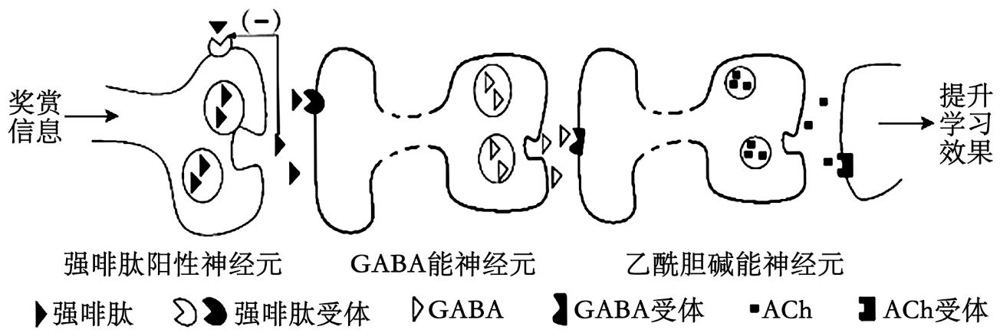
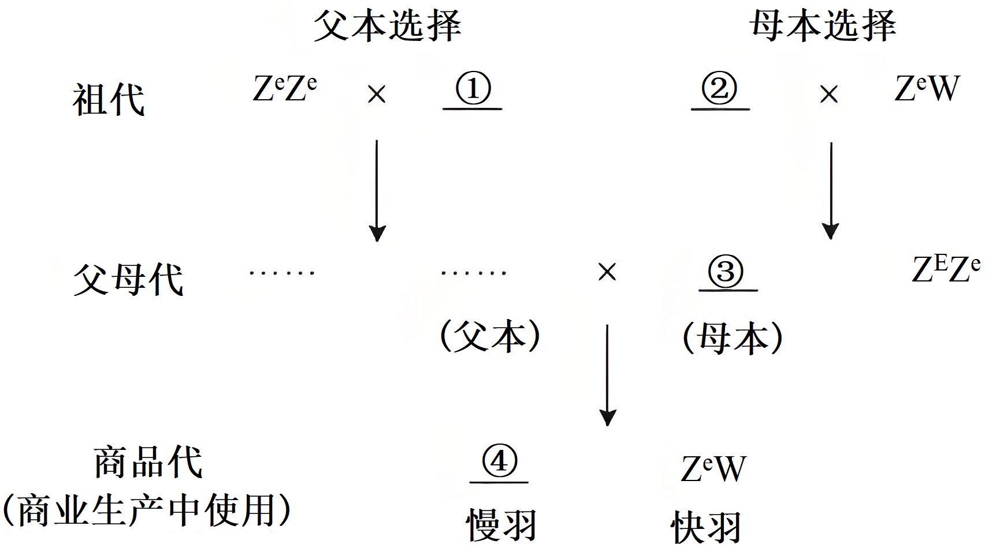
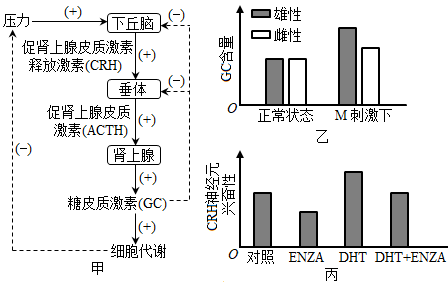
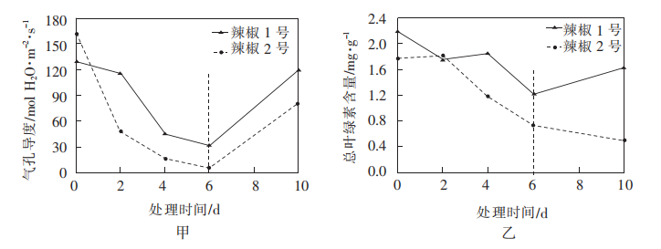
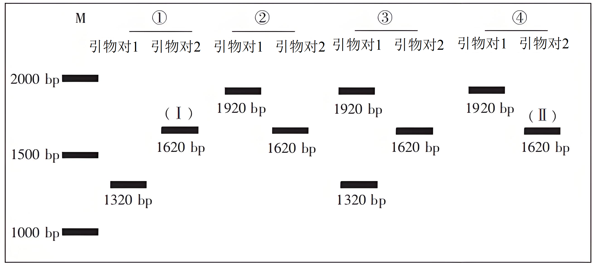

**生物学**

1\. 体重水平与人体健康状况密切相关，体重异常特别的超重和肥胖是导致心脑血管疾病、糖尿病和部分癌症等慢性病的重要危险因素。国家卫生健康委员会等16部门启动了“体重管理年”活动。从机体能量代谢的角度分析，下列叙述错误的是（　　）

A. 有氧运动可加速新陈代谢，促进脂肪进入线粒体分解

B. 高脂饮食易破坏能量平衡，导致脂肪积累而发生肥胖

C. 低脂饮食可减少能量摄入，有氧运动可促进能量消耗

D. 有氧运动能够避免肌细胞进行无氧呼吸产生大量乳酸

2\. 为分析两种不同类型糖尿病患者的血糖调节差异，研究人员检测了健康个体、患者甲和乙的空腹血糖及胰岛素浓度(见表)。下列推测合理的是（　　）

|      |                         |                         |
|:---- |:----------------------- |:----------------------- |
| 检测对象 | 血糖(mmol·L-1) | 胰岛素(mIU·L-1) |
| 健康个体 | 5.0                     | 12.5                    |
| 患者甲  | 13.3                    | 2.3                     |
| 患者乙  | 9.9                     | 25.1                    |

A. 患者甲的血糖浓度高于健康个体是由于胰岛素未能发挥功能

B. 患者乙的血糖浓度高于健康个体是由于胰高血糖素分泌过多

C. 若药物X能促进胰岛素的分泌，则可用于缓解患者甲的高血糖

D. 若药物Y能抑制胰岛素的分泌，则可用于缓解患者乙的高血糖

3\. 诱导多能干细胞(ips细胞)在生物医药领域有广阔的应用前景。研究人员利用多种小分子化合物协同诱导小鼠胎儿成纤维细胞，成功获得ips细胞。下列叙述错误的是（　　）

A. 小分子化合物改变了小鼠胎儿成纤维细胞的基因表达

B. 小鼠胎儿成纤维细胞形成ips细胞的过程属于细胞分化

C. 利用胰蛋白酶处理小鼠胎儿某些组织可获得分散的成纤维细胞

D. 培养小鼠胎儿成纤维细胞和ips细胞时需提供一定浓度的CO2

4\. 农谚“冬天麦盖三层被，来年枕着馒头睡”形象描绘了雪对冬小麦生长发育的重要意义。积雪的低温能杀死表层土壤中的害虫卵，厚厚的积雪可以减缓深层土壤的热量散失，雪融化后能为冬小麦提供水和矿质元素。下列叙述错误的是（　　）

A. 一段时间的低温有利于冬小麦的生长

B. 雪水中含有冬小麦生长所需的部分大量元素

C. 害虫是冬小麦种群数量变动的非密度制约因素

D. 冬小麦的生长受生物和非生物因素的共同影响

5\. 生物治沙在我国的防沙治沙工程中发挥了重要作用，沙区普遍依照“以水定绿”的策略，在绿洲外围沙漠边缘育草覆绿，绿洲前沿地带种植胡杨、梭梭等乔灌木结合的防沙林带，绿洲内部地带建设农田防护林网。下列叙述错误的是（　　）

A. 草和乔灌木的分区搭配体现了群落的垂直结构

B. 生物治沙增加了沙漠生态系统食物网的复杂性

C. 生物治沙提高了沙漠生态系统的抵抗力稳定性

D. “以水定绿”的策略体现了生态工程的协调原理

6\. 机体免疫失调会导致低丙种球蛋白血症和重症肌无力等疾病。低丙种球蛋白血症主要是机体辅助性T细胞功能异常，进而引起相关抗体合成障碍所致；重症肌无力主要是自身的乙酰胆碱受体刺激机体产生抗体，该抗体竞争性结合乙酰胆碱受体导致的功能性障碍。依据以上叙述，下列判断正确的是（　　）

A. 低丙种球蛋白血症和重症肌无力都属于自身免疫病

B. 低丙种球蛋白血症主要是细胞免疫异常引起的疾病

C. 重症肌无力发生过程中出现了体液免疫异常的现象

D. 记忆B细胞是乙酰胆碱受体刺激机体产生抗体的必要条件

7\. 芸香糖苷酶能水解芸香糖苷类黄酮化合物生产槲皮素、柚皮素和橙皮素等活性物质，具有重要的应用前景。研究人员比较了芸香糖苷酶I、Ⅱ和Ⅲ的酶学性质，部分结果如表。下列叙述正确的是（　　）

|       |         |      |
|:----- |:------- |:---- |
| 芸香糖苷酶 | 最适温度(℃) | 最适pH |
| I     | 50      | 4.0  |
| Ⅱ     | 70      | 4.0  |
| Ⅲ     | 40      | 6.0  |

A. 酶I的反应温度升高20℃，其他条件不变，酶I与酶Ⅱ活性一致

B. 三种酶在最适的温度和pH条件下，催化底物的活性相同

C. 三种酶能水解芸香糖苷类黄酮化合物，表明它们具有专一性

D. 三种酶的空间结构会因环境温度和pH的改变而发生变化

8\. 为探究土地利用方式对羊草草地植物群落的影响，研究人员测定了不同土地利用方式下某羊草草地的相关指标，结果如表。与传统放牧相比，下列关于该草地的推测，不合理的是（　　）

|        |                             |                              |                            |         |
|:------ |:--------------------------- |:---------------------------- |:-------------------------- |:------- |
| 土地利用方式 | 土壤速效氮/磷(mg·kg-1) | 植物群落的地上生物量(g·m-2) | 羊草的地上生物量(g·m-2) | 植物群落丰富度 |
| 传统放牧   | 16.7/5.8                    | 72.7                         | 23.1                       | 11.0    |
| 围封打草   | 18.8/13.4                   | 202.2                        | 89.2                       | 10.8    |
| 畜禽草耦合  | 42.9/34.7                   | 423.5                        | 288.0                      | 7.5     |

A. 围封打草和畜禽草耦合均提高了土壤肥力

B. 围封打草减弱了羊草在植物群落中的优势

C. 畜禽草耦合提高了植物群落的光能利用率

D. 畜禽草耦合降低了植物群落的物种多样性

9\. 某水稻品种的R基因突变为r后，会造成细胞分裂时染色体在赤道板上的排列受到干扰，且分离时滞后或分配错误。为了解该突变对水稻细胞分裂的具体影响，研究人员观察了相关表型(如表)。下列关于该突变的推测，不合理的是

|     |     |     |     |
|:--- |:--- |:--- |:--- |
| 基因型 | 株高  | 根系  | 花粉  |
| RR  | 正常  | 正常  | 正常  |
| rr  | 矮   | 短   | 无   |

A. 导致了某些细胞的有丝分裂失败

B. 导致了花药中发生的减数分裂全部失败

C. 影响纺锤体进而干扰有丝分裂

D. 在减I前期和后期干扰减数分裂

10\. 乙酰胆碱(ACh)可在多条神经调节通路中发挥作用。研究发现，小鼠获得奖赏时，强啡肽阳性神经元会释放强啡肽，通过图示通路促进ACh的释放，提升学习效果。GABA是一种抑制性神经递质，能抑制ACh的释放。在奖赏信息刺激下，下列推测合理的是（　　）

A. 敲除强啡肽阳性神经元的强啡肽受体基因，ACh的释放量会更多

B. 强啡肽与GABA能神经元上的受体结合后，GABA的释放量会更多

C. 敲除GABA能神经元的强啡肽受体基因，ACh的释放量会更多

D. 去除奖赏信息刺激后，乙酰胆碱能神经元会停止释放ACh

11\. 为了获得抗白叶枯病的水稻品种，研究人员构建了含有抗病基因D的重组Ti质粒(如图)，通过农杆菌转化法将D基因导入水稻种子诱导的愈伤组织，最终获得抗病植株。下列叙述正确的是

A. 水稻愈伤组织细胞中RNA聚合酶无法识别U6启动子

B. 在含重组Ti质粒的农杆菌中U6启动子不能驱动卡那霉素抗性基因表达

C. 农杆菌侵染愈伤组织后所用的筛选培养基中需加入卡那霉素

D. 愈伤组织再分化获得的含有D基因的幼苗属于抗病植株

12\. 某品种的初生雏鸡慢羽性状(羽毛生长慢)由Z染色体上的E基因控制。为提升商业生产中依据快/慢羽判断雏鸡雌雄的准确性，研究人员设计了育种路线(如图)。下列叙述错误的是（　　）

A. ①的表型是快羽雌鸡 B. ②的基因型是ZEZE

C. ③的表型是快羽雌鸡 D. ④的基因型是ZEZe

13\. 下图为某湖泊生态系统中部分食物网。据图分析，下列叙述正确的是（　　）

A. 鹤既属于第二，又属于第三营养级

B. 一般情况下，雕获得的能量不高于2.4×106kJ

C. 碳元素从水草进入到鱼的主要形式是有机物

D. 鼠和鹤的数量变化体现了生态系统的正反馈调节

14\. 杜鹃A是一种珍稀濒危植物，种子萌发率低。为了探究杜鹃A种子萌发的影响因素，研究人员将正常种子分别置于蒸馏水和适宜浓度的赤霉素溶液中浸泡，每4h取蒸馏水中浸泡的种子统计吸水率，每12h取赤霉素溶液中浸泡的种子进行培养，统计发芽率，结果如图。下列推测合理的是（　　）

A. 浸种12h内，种子中赤霉素的含量逐渐升高

B. 浸种24h内，种子细胞中自由水与结合水的比值升高

C 浸种24—48h，种子内高浓度赤霉素会抑制种子萌发

D. 浸种36—48h，种子细胞的无氧呼吸强度逐渐提高

15\. 为高效检测抗菌剂的抗菌效果，研究人员构建了能够表达外源荧光素酶的重组菌Q，将其接种到有足量荧光素的液体培养基中，一段时间后添加待测抗菌剂，定时检测培养液的荧光强度。下列有关该实验的叙述，正确的是（　　）

A. 需要设置一个对照组保证检测结果的准确性

B. 实验过程中所用的培养基是一种选择培养基

C. 在重组菌Q胞内的荧光素酶可催化荧光素水解

D. 培养液的荧光强度变化可作为抗菌效果的判断依据

16\. 有研究表明，基因突变对生物适应性的影响并不是非益即害的，大量的基因突变是中性的。以下能支撑中性突变学说的事实有（　　）

A. 减数分裂过程中非姐妹染色单体的交叉互换可产生新的配子类型

B. 很多突变改变了氨基酸的序列，但没有改变蛋白质的功能

C. 基因中对应密码子第三位碱基的多态性远高于前两位碱基

D. 很多突变产生的新等位基因在长期进化中取代原基因或完全消失

17\. 过度捕捞易造成鱼类个体规格变小(小型化)。我国已实施长江十年禁渔(以下简称禁渔)，为了探讨禁渔对鱼类生长发育的影响，研究人员以长江特有的J鱼为对象，调查了相关数据(如表)。

<table style="width:85%;">
<colgroup>
<col style="width: 19%" />
<col style="width: 22%" />
<col style="width: 22%" />
<col style="width: 21%" />
</colgroup>
<tbody>
<tr>
<td rowspan="2" style="text-align: left;">年龄</td>
<td colspan="2" style="text-align: left;">禁渔前平均体长(mm)</td>
<td rowspan="2" style="text-align: left;">
禁渔后

平均体长(mm)
</td>
</tr>
<tr>
<td style="text-align: left;">正常捕捞时期</td>
<td style="text-align: left;">过度捕捞时期</td>
</tr>
<tr>
<td style="text-align: left;">1</td>
<td style="text-align: left;">132.8</td>
<td style="text-align: left;">112.4</td>
<td style="text-align: left;">137.5</td>
</tr>
<tr>
<td style="text-align: left;">2</td>
<td style="text-align: left;">174.9</td>
<td style="text-align: left;">155.4</td>
<td style="text-align: left;">194.1</td>
</tr>
<tr>
<td style="text-align: left;">3</td>
<td style="text-align: left;">199.3</td>
<td style="text-align: left;">181.7</td>
<td style="text-align: left;">2220</td>
</tr>
<tr>
<td style="text-align: left;">4</td>
<td style="text-align: left;">225.6</td>
<td style="text-align: left;">206.4</td>
<td style="text-align: left;">248.5</td>
</tr>
<tr>
<td style="text-align: left;">5</td>
<td style="text-align: left;">249.3</td>
<td style="text-align: left;">235.4</td>
<td style="text-align: left;">271.0</td>
</tr>
<tr>
<td style="text-align: left;">6</td>
<td style="text-align: left;">—</td>
<td style="text-align: left;">271.0</td>
<td style="text-align: left;">291.6</td>
</tr>
<tr>
<td style="text-align: left;">7</td>
<td style="text-align: left;">—</td>
<td style="text-align: left;">—</td>
<td style="text-align: left;">313.3</td>
</tr>
</tbody>
</table>

注：本题不考虑体重因素，“—”表示无数据

回答下列问题：

（1）J鱼是一种杂食性动物，属于长江生态系统组成成分中的\_\_\_\_\_\_\_\_\_\_\_；J鱼对维持长江生态系统的结构与功能有重要作用，这体现了生物多样性的\_\_\_\_\_\_\_\_\_\_\_价值。

（2）捕捞强度与持续获得的鱼产量密切相关，其关系可用图\_\_\_\_\_\_\_\_\_\_\_(选填“甲”“乙”或“丙”)表示。

（3）分析表中数据可知，禁渔前J鱼出现了小型化，实施禁渔后取得明显效果。得出上述结论的依据是\_\_\_\_\_\_\_\_\_\_\_。

（4）为进一步探究J鱼体长变化的原因，研究人员查阅资料发现，这可能和能量分配与权衡有关。能量分配与权衡是生物体在生长发育和繁殖过程中适应外界环境变化的重要对策。一般情况下，生物体需在可获取能量的生理限制范围内，将能量分配到个体生长和繁殖后代两个方面，由此可以推测J鱼用于生长和繁殖的能量之间呈\_\_\_\_\_\_\_\_\_\_\_(选填“正”或“负”)相关关系。综合上述材料分析，禁渔后J鱼体长变化的原因是\_\_\_\_\_\_\_\_\_\_\_。

18\. 机体受到压力时，会通过促进下丘脑—垂体—肾上腺皮质轴(HPA轴)分泌糖皮质激素(GC)进行调节(图甲)。调查发现，压力刺激下，男性和女性的血清GC含量存在差异。为探究压力刺激下性激素对GC分泌的影响，研究人员以小鼠为实验对象，检测了某种压力(M)刺激下的血清GC含量(图乙)。

回答下列问题：

（1）GC分泌受HPA轴的\_\_\_\_\_\_\_\_\_\_\_调节，GC含量达到一定程度时可通过\_\_\_\_\_\_\_\_\_\_\_机制调节CRH和ACTH分泌。

（2）据图乙推测，M刺激下雄激素对GC的分泌具有\_\_\_\_\_\_\_\_\_\_\_作用。为验证上述推测，研究人员检测了M刺激下正常雄性、摘除睾丸和摘除睾丸后补充雄激素的小鼠血清GC含量，分别为A、B和C，其中最低的为\_\_\_\_\_\_\_\_\_\_\_，A和C的关系为\_\_\_\_\_\_\_\_\_\_\_(选填序号，①A=C；②A\>C；③A\<C；④无法确定)。

（3）已知小鼠下丘脑中CRH神经元上存在雄激素受体(AR)。为进一步探究M刺激下雄激素影响GC分泌的机制，研究人员选择正常雄性小鼠，随机分为四组，分别注射等量vehicle(对照)、ENZA(AR拮抗剂)、DHT(雄激素)和DHT十ENZA后，检测M刺激下各组小鼠CRH神经元的兴奋性(图丙)。结合图甲分析，M刺激下雄激素影响GC分泌的机制是\_\_\_\_\_\_\_\_\_\_\_。

（4）已知较高含量的GC会促进免疫细胞凋亡。综合以上信息推测，人在长期压力下，免疫力会\_\_\_\_\_\_\_\_\_\_\_，分析其可能原因是\_\_\_\_\_\_\_\_\_\_\_。

19\. 流行病学调查在传染病防治中具有重要意义。AB基因编码的AB蛋白是致病菌W的一种特异性分泌蛋白。为构建快速检测致病菌W感染的血清学诊断技术(一种抗原抗体特异性反应技术)，研究人员从致病菌W中克隆AB基因，构建表达载体，导入原核宿主E，诱导后，分析表达情况(如表)。

|      |           |      |
|:---- |:--------- |:---- |
| 细胞   | AB基因的mRNA | AB蛋白 |
| 致病菌W | 十         | 十    |
| 宿主E  | —         | —    |
| 工程菌  | 十         | —    |

注：“十”表示有检出，“—”表示未检出

回答下列问题：

（1）根据中心法则，结合表中数据判断，AB基因在工程菌中能进行\_\_\_\_\_\_\_\_\_\_\_，但不能进行有效的\_\_\_\_\_\_\_\_\_\_\_。

（2）分析发现，致病菌W合成AB蛋白时，某些氨基酸使用的部分密码子在宿主E中的使用频率低(称为该物种的稀有密码子，如表中密码子CGG在宿主E中为稀有密码子)。从蛋白质合成条件的角度分析，形成这一现象的原因是宿主E中缺乏\_\_\_\_\_\_\_\_\_\_\_。

<table style="width:41%;">
<colgroup>
<col style="width: 17%" />
<col style="width: 13%" />
<col style="width: 9%" />
</colgroup>
<tbody>
<tr>
<td rowspan="2" style="text-align: left;">精氨酸的密码子</td>
<td colspan="2" style="text-align: left;">密码子使用频率(10-3)</td>
</tr>
<tr>
<td style="text-align: left;">致病菌W</td>
<td style="text-align: left;">宿主E</td>
</tr>
<tr>
<td style="text-align: left;">CGA</td>
<td style="text-align: left;">7.2</td>
<td style="text-align: left;">4.3</td>
</tr>
<tr>
<td style="text-align: left;">CGC</td>
<td style="text-align: left;">28.5</td>
<td style="text-align: left;">26.0</td>
</tr>
<tr>
<td style="text-align: left;">CGG</td>
<td style="text-align: left;">24.7</td>
<td style="text-align: left;">4.1</td>
</tr>
<tr>
<td style="text-align: left;">CGU</td>
<td style="text-align: left;">8.5</td>
<td style="text-align: left;">21.1</td>
</tr>
<tr>
<td style="text-align: left;">AGA</td>
<td style="text-align: left;">1.3</td>
<td style="text-align: left;">1.4</td>
</tr>
<tr>
<td style="text-align: left;">AGG</td>
<td style="text-align: left;">3.2</td>
<td style="text-align: left;">1.6</td>
</tr>
</tbody>
</table>

（3）进一步分析发现，宿主E缺乏高效表达GC含量过高的外源基因所需要的机制。已知AB基因的GC含量较高，为在宿主E中实现AB蛋白的高效表达，可将精氨酸密码子CGG的使用进行优化，从第(2)题表中选择最佳密码子为\_\_\_\_\_\_\_\_\_\_\_。

（4）现有一位体内未检测到致病菌W人。为了解此人是否有致病菌W感染史，设计一个直接利用AB蛋白的血清学诊断实验。①简要写出实验思路：\_\_\_\_\_\_\_\_\_\_\_；②预测实验结果：\_\_\_\_\_\_\_\_\_\_\_；③分析实验结果：\_\_\_\_\_\_\_\_\_\_\_。

20\. 辣椒的生长会受到低温弱光等逆境的影响。为比较不同辣椒品种的抗逆性，研究人员将辣椒1号和辣椒2号幼苗在人工低温弱光条件下处理6天后，转入正常光照的温室中培养4天，这期间定时检测辣椒叶片的气孔导度和总叶绿素含量等指标(如图)。

回答下列问题：

（1）在低温弱光处理的6天内，辣椒1号和辣椒2号的光合速率变化趋势均为\_\_\_\_\_\_\_\_\_\_\_，据图甲分析其原因是\_\_\_\_\_\_\_\_\_\_\_。

（2）检测发现，长时间的低温弱光处理对辣椒幼苗的叶绿体结构造成了损伤，结合图乙，推测第6天时，辣椒2号的叶绿体比辣椒1号的受损程度更高。为验证上述推测，研究人员以叶绿体的光反应功能为衡量指标，利用试剂D在捕获叶绿体光反应中生成的电子后，会从蓝色氧化态变为无色还原态这一原理开展实验。完善下列实验过程：

①分别取\_\_\_\_\_\_\_\_\_\_\_叶片；

②分别制作等体积的\_\_\_\_\_\_\_\_\_\_\_悬浮液；

③向各悬浮液中分别滴加\_\_\_\_\_\_\_\_\_\_\_的D溶液；

④将悬浮液置于适宜光照条件下反应一段时间；

⑤定量测定并计算各悬浮液中生成的还原态D的含量。预测实验结果为\_\_\_\_\_\_\_\_\_\_\_。

（3）综合上述信息，初步判断辣椒\_\_\_\_\_\_\_\_\_\_\_号的抗逆性更强。

21\. 天然色素可赋予稻米多样化颜色。为解析红色稻米品种ka的遗传机制，研究人员以连续自交表型均稳定遗传的纯合品种ka(红色)、Dr(白色)和Pu(白色)开展实验(本题涉及的基因名称依次定义为A/a、B/b……)。回答下列问题：

（1）ka和Dr正反交，获得籽粒(F1)，种植后自交获得籽粒(F2)，F2自交获得F3，表型如下表，表明其遗传方式为母性影响(子代表型由母本的核基因控制)。完善表中表型数据。

|             |                  |                  |                 |
|:----------- |:---------------- |:---------------- |:--------------- |
| 亲本组合        | F1 颜色 | F2颜色  | F3颜色 |
| ka(红)×Dr(白) | 全红               | 全红               | \_\_\_\_\_\_\_  |
| Dr(白)×Ka(红) | 全白               | \_\_\_\_\_\_\_\_ | 红：白=3:1         |

（2）ka和Pu杂交，后代连续自交获得F3的表型比例为9红：3棕：4白，表明ka中籽粒颜色由两对基因控制，结出棕色籽粒的F2植株基因型为\_\_\_\_\_\_\_\_\_\_\_或\_\_\_\_\_\_\_\_\_\_\_。

（3）在定位好的A/a、B/b基因两侧设计PCR引物，引物对1和引物对2分别可扩增A/a、B/b全部序列。下图是对亲本ka、Dr、Pu和第(2)题中F2某个体PCR后电泳的结果。已知图中①为ka，②为Dr，可判断a基因由A基因发生\_\_\_\_\_\_\_\_\_\_\_突变形成；③结出的籽粒颜色是\_\_\_\_\_\_\_\_\_\_\_或\_\_\_\_\_\_\_\_\_\_\_。

（4）回收第(3)题图中条带I和Ⅱ中的DNA，以speI(一种限制性内切核酸酶)处理，I中的DNA不能被切割，Ⅱ中的DNA被切割成4个片段，据此推测B基因突变为b基因的过程中至少有\_\_\_\_\_\_\_\_\_\_\_个碱基发生了突变。
