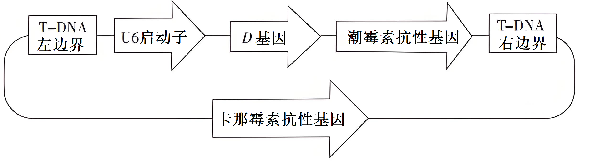
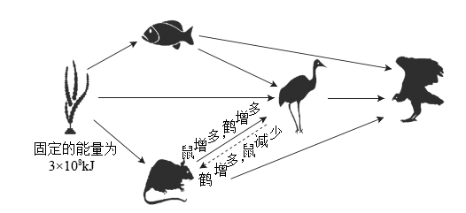
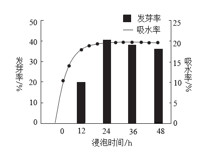
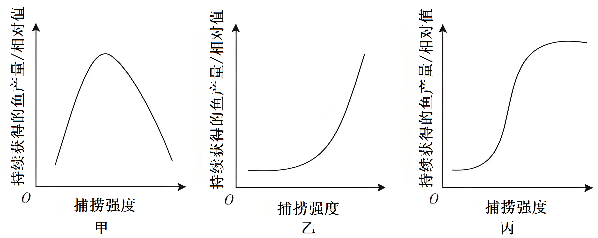

**生物学**

1\. 体重水平与人体健康状况密切相关，体重异常特别的超重和肥胖是导致心脑血管疾病、糖尿病和部分癌症等慢性病的重要危险因素。国家卫生健康委员会等16部门启动了“体重管理年”活动。从机体能量代谢的角度分析，下列叙述错误的是（　　）

A. 有氧运动可加速新陈代谢，促进脂肪进入线粒体分解

B. 高脂饮食易破坏能量平衡，导致脂肪积累而发生肥胖

C. 低脂饮食可减少能量摄入，有氧运动可促进能量消耗

D. 有氧运动能够避免肌细胞进行无氧呼吸产生大量乳酸

【答案】A

【解析】

【详解】A、脂肪需先分解为甘油和脂肪酸，脂肪酸进入线粒体氧化分解，而非直接以脂肪形式进入线粒体，A错误；

B、高脂饮食提供过量能量，若摄入＞消耗，多余能量以脂肪形式储存，导致肥胖，B正确；

C、低脂饮食减少能量摄入，有氧运动增加能量消耗，符合能量平衡原理，C正确；

D、有氧运动中氧气充足，肌细胞主要进行有氧呼吸，避免无氧呼吸产生大量乳酸，D正确。

故选A。

2\. 为分析两种不同类型糖尿病患者的血糖调节差异，研究人员检测了健康个体、患者甲和乙的空腹血糖及胰岛素浓度(见表)。下列推测合理的是（　　）

|      |                         |                                                                |
|:---- |:----------------------- |:-------------------------------------------------------------- |
| 检测对象 | 血糖(mmol·L-1) | 胰岛素(mIU·L-1)                                        |
| 健康个体 | 5.0                     | 12.5                                                           |
| 患者甲  | 13.3                    | 23 |
| 患者乙  | 9.9                     | 25.1                                                           |

A. 患者甲的血糖浓度高于健康个体是由于胰岛素未能发挥功能

B. 患者乙的血糖浓度高于健康个体是由于胰高血糖素分泌过多

C. 若药物X能促进胰岛素的分泌，则可用于缓解患者甲的高血糖

D. 若药物Y能抑制胰岛素的分泌，则可用于缓解患者乙的高血糖

【答案】C

【解析】

【详解】A、根据表格信息，患者甲胰岛素含量远低于健康个体，其血糖高于健康个体的原因是由于胰岛素分泌不足，而非胰岛素未能发挥功能；若药物X能促进胰岛素分泌，则可用于缓解患者甲的高血糖症状，A错误，C正确；

B、患者乙胰岛素含量高于健康个体，其血糖高于健康个体的主要原因是胰岛素抵抗，而非胰高血糖素分泌过多，B错误；

D、患者乙存在胰岛素抵抗，若药物Y抑制胰岛素分泌会减少胰岛素水平，但不能改善胰岛素抵抗，不能缓解患者乙的高血糖症状，D错误。

故选C。

3\. 诱导多能干细胞(ips细胞)在生物医药领域有广阔的应用前景。研究人员利用多种小分子化合物协同诱导小鼠胎儿成纤维细胞，成功获得ips细胞。下列叙述错误的是（　　）

A. 小分子化合物改变了小鼠胎儿成纤维细胞的基因表达

B. 小鼠胎儿成纤维细胞形成ips细胞的过程属于细胞分化

C. 利用胰蛋白酶处理小鼠胎儿某些组织可获得分散的成纤维细胞

D. 培养小鼠胎儿成纤维细胞和ips细胞时需提供一定浓度的CO2

【答案】B

【解析】

【详解】A、小分子化合物通过调控基因表达使成纤维细胞重编程为ips细胞，改变了原有基因表达模式，A正确；

B、成纤维细胞形成ips细胞的过程是逆分化（去分化），而非细胞分化，B错误；

C、胰蛋白酶可分解细胞间质蛋白，使组织分散为单个细胞，符合动物细胞培养操作，C正确；

D、动物细胞培养通常需要5% CO2以维持培养液pH，成纤维细胞和ips细胞培养均需此条件，D正确。

故选B。

4\. 农谚“冬天麦盖三层被，来年枕着馒头睡”形象描绘了雪对冬小麦生长发育的重要意义。积雪的低温能杀死表层土壤中的害虫卵，厚厚的积雪可以减缓深层土壤的热量散失，雪融化后能为冬小麦提供水和矿质元素。下列叙述错误的是（　　）

A. 一段时间的低温有利于冬小麦的生长

B. 雪水中含有冬小麦生长所需的部分大量元素

C. 害虫是冬小麦种群数量变动非密度制约因素

D. 冬小麦的生长受生物和非生物因素的共同影响

【答案】C

【解析】

【分析】影响种群密度的因素包括密度制约因素和非密度制约因素。

【详解】A、低温可杀死害虫卵，减少虫害，同时积雪减缓深层土壤热量散失，保护冬小麦根系，且冬小麦可能需要低温春化作用促进生长，A正确；

B、雪水提供的水和矿质元素中包括大量元素（如N、P、K等），B正确；

C、害虫对冬小麦的影响会随小麦种群密度增加而增强（如害虫更易传播），属于密度制约因素，C错误；

D、冬小麦生长受害虫（生物因素）和温度、水、矿质元素（非生物因素）共同影响，D正确。

故选C。

5\. 生物治沙在我国的防沙治沙工程中发挥了重要作用，沙区普遍依照“以水定绿”的策略，在绿洲外围沙漠边缘育草覆绿，绿洲前沿地带种植胡杨、梭梭等乔灌木结合的防沙林带，绿洲内部地带建设农田防护林网。下列叙述错误的是（　　）

A. 草和乔灌木的分区搭配体现了群落的垂直结构

B. 生物治沙增加了沙漠生态系统食物网的复杂性

C. 生物治沙提高了沙漠生态系统的抵抗力稳定性

D. “以水定绿”的策略体现了生态工程的协调原理

【答案】A

【解析】

【详解】A、草和乔灌木的分区搭配属于不同区域（如绿洲外围、前沿、内部）的分布，体现群落的水平结构，而非垂直结构（垂直结构指分层现象），A错误；

B、生物治沙引入多种植物，增加了生产者的种类，进而使食物链增多，食物网更复杂，B正确；

C、抵抗力稳定性与物种丰富度正相关，生物治沙增加物种多样性，提高了生态系统的自我调节能力，C正确；

D、“以水定绿”根据水资源条件确定绿化规模，符合生态工程中生物与环境协调的“协调原理”，D正确。

故选A。

6\. 机体免疫失调会导致低丙种球蛋白血症和重症肌无力等疾病。低丙种球蛋白血症主要是机体辅助性T细胞功能异常，进而引起相关抗体合成障碍所致；重症肌无力主要是自身的乙酰胆碱受体刺激机体产生抗体，该抗体竞争性结合乙酰胆碱受体导致的功能性障碍。依据以上叙述，下列判断正确的是（　　）

A. 低丙种球蛋白血症和重症肌无力都属于自身免疫病

B. 低丙种球蛋白血症主要是细胞免疫异常引起的疾病

C. 重症肌无力发生过程中出现了体液免疫异常的现象

D. 记忆B细胞是乙酰胆碱受体刺激机体产生抗体的必要条件

【答案】C

【解析】

【详解】A、低丙种球蛋白血症是免疫缺陷病，重症肌无力是自身免疫病，两者类型不同，A错误；

B、低丙种球蛋白血症主要是机体辅助性T细胞功能异常，引起相关抗体合成障碍所致，说明辅助性T细胞功能异常主要影响体液免疫（如抗体合成），B错误；

C、重症肌无力因自身抗体产生，属于体液免疫异常，C正确；

D、抗体由浆细胞分泌，B细胞和记忆B细胞受抗原刺激后增殖分化为浆细胞，记忆B细胞受刺激产生抗体不是必要条件，D错误。

故选C。

7\. 芸香糖苷酶能水解芸香糖苷类黄酮化合物生产槲皮素、柚皮素和橙皮素等活性物质，具有重要的应用前景。研究人员比较了芸香糖苷酶I、Ⅱ和Ⅲ的酶学性质，部分结果如表。下列叙述正确的是（　　）

|       |         |      |
|:----- |:------- |:---- |
| 芸香糖苷酶 | 最适温度(℃) | 最适pH |
| I     | 50      | 4.0  |
| Ⅱ     | 70      | 4.0  |
| Ⅲ     | 40      | 6.0  |

A. 酶I的反应温度升高20℃，其他条件不变，酶I与酶Ⅱ活性一致

B. 三种酶在最适的温度和pH条件下，催化底物的活性相同

C. 三种酶能水解芸香糖苷类黄酮化合物，表明它们具有专一性

D. 三种酶的空间结构会因环境温度和pH的改变而发生变化

【答案】D

【解析】

【详解】A、酶的活性受温度影响，在最适温度前，随温度升高酶活性增强；超过最适温度，随温度升高酶活性下降。酶I的最适温度为50℃，升高20℃至70℃时，超过其最适温度，酶活性会因高温变性而下降；而酶Ⅱ的最适温度为70℃，此时活性最高。两者活性不可能一致，A错误；

B、最适条件仅表明此时酶活性最高，但不同酶在最适条件下的催化效率（即酶活性）可能因酶的种类和结构差异而不同，B错误；

C、酶的专一性是指一种酶只能催化一种或一类化学反应。三种酶均能水解同一类底物（芸香糖苷类黄酮化合物），体现的是酶的催化作用具有共性，而非专一性（专一性强调对特定底物的催化），C错误；

D、酶的活性受温度和pH的影响，温度和pH的变化会影响酶的空间结构，进而影响酶的活性。当环境温度或pH偏离最适条件时，酶的空间结构可能发生改变，甚至导致酶变性失活，D正确。

故选D。

8\. 为探究土地利用方式对羊草草地植物群落的影响，研究人员测定了不同土地利用方式下某羊草草地的相关指标，结果如表。与传统放牧相比，下列关于该草地的推测，不合理的是（　　）

|        |                             |                              |                            |         |
|:------ |:--------------------------- |:---------------------------- |:-------------------------- |:------- |
| 土地利用方式 | 土壤速效氮/磷(mg·kg-1) | 植物群落的地上生物量(g·m-2) | 羊草的地上生物量(g·m-2) | 植物群落丰富度 |
| 传统放牧   | 16.7/5.8                    | 72.7                         | 23.1                       | 11.0    |
| 围封打草   | 18.8/13.4                   | 202.2                        | 89.2                       | 10.8    |
| 畜禽草耦合  | 42.9/34.7                   | 423.5                        | 288.0                      | 7.5     |

A. 围封打草和畜禽草耦合均提高了土壤肥力

B. 围封打草减弱了羊草在植物群落中的优势

C. 畜禽草耦合提高了植物群落的光能利用率

D. 畜禽草耦合降低了植物群落的物种多样性

【答案】B

【解析】

【详解】A、分析表格数据可知围封打草和畜禽草耦合的土壤速效氮/磷分别为18.8/13.4和42.9/34.7，均高于传统放牧（16.7/5.8），说明围封打草和畜禽草耦合均提高了土壤肥力，A正确；

B、分析表格数据可知围封打草中羊草生物量占比为89.2÷202.2≈44.1%，传统放牧中羊草生物量占比为23.1÷72.7≈31.8%，由此可知围封打草增强了羊草在植物群落中的优势，B错误；

C、分析表格数据可知畜禽草耦合的植物群落总生物量（423.5 g·m⁻²）显著高于传统放牧（72.7 g·m⁻²），由此表明畜禽草耦合提高了植物群落的光能利用率，C正确；

D、分析表格数据可知畜禽草耦合的植物群落丰富度（7.5）低于传统放牧（11.0），物种多样性降低，D正确。

故选B。

9\. 某水稻品种的R基因突变为r后，会造成细胞分裂时染色体在赤道板上的排列受到干扰，且分离时滞后或分配错误。为了解该突变对水稻细胞分裂的具体影响，研究人员观察了相关表型(如表)。下列关于该突变的推测，不合理的是

|     |     |     |     |
|:--- |:--- |:--- |:--- |
| 基因型 | 株高  | 根系  | 花粉  |
| RR  | 正常  | 正常  | 正常  |
| rr  | 矮   | 短   | 无   |

A. 导致了某些细胞的有丝分裂失败

B. 导致了花药中发生的减数分裂全部失败

C. 影响纺锤体进而干扰有丝分裂

D. 在减I前期和后期干扰减数分裂

【答案】D

【解析】

【详解】A、染色体排列和分离异常可能导致有丝分裂失败，这与表型中rr植株矮小（细胞分裂受阻影响生长）和根系短（细胞分裂异常）一致，A正确；

B、由表格数据可知，rr植株无花粉，说明可能导致减数分裂完全失败，无法形成可育配子，B正确；

C、赤道板排列异常可能与纺锤体功能受损有关，进而干扰有丝分裂，C正确；

D、分析题意可知，某水稻品种的R基因突变为r后，会造成细胞分裂时染色体在赤道板上的排列受到干扰，赤道板排列通常发生在中期，而减数I前期（同源染色体联会）与赤道板排列无直接关联，D错误。

故选D。

10\. 乙酰胆碱(ACh)可在多条神经调节通路中发挥作用。研究发现，小鼠获得奖赏时，强啡肽阳性神经元会释放强啡肽，通过图示通路促进ACh的释放，提升学习效果。GABA是一种抑制性神经递质，能抑制ACh的释放。在奖赏信息刺激下，下列推测合理的是（　　）

A. 敲除强啡肽阳性神经元的强啡肽受体基因，ACh的释放量会更多

B. 强啡肽与GABA能神经元上的受体结合后，GABA的释放量会更多

C. 敲除GABA能神经元的强啡肽受体基因，ACh的释放量会更多

D. 去除奖赏信息刺激后，乙酰胆碱能神经元会停止释放ACh

【答案】A

【解析】

【分析】小鼠获得奖赏时，强啡肽阳性神经元会释放强啡肽，通过图示通路促进 ACh 的释放； GABA 是一种抑制性神经递质，能抑制 ACh 的释放,由上述两个信息推测强啡肽阳性神经元是抑制性神经元，会抑制 GABA 的释放。因此，图示通路为：奖赏信息刺激下, 强啡肽阳性神经元会释放强啡肽，强啡肽与GABA能神经元上的强啡肽受体结合后,抑制了 GABA 释放，进而降低了 GABA 与乙酰胆碱能神经元上 GABA 受体的结合，降低了 GABA对乙酰胆碱能神经元的抑制作用，导致 ACh释放量增加。

【详解】A、敲除强啡肽阳性神经元的强啡肽受体基因，强啡肽无法作用于强啡肽阳性神经元自身，其对自身的抑制作用去除了，会促进强啡肽的释放，从而抑制 GABA 释放的作用加强，进一步减少了 GABA 与 GABA 受体结合，进一步解除了 GABA 对乙酰胆碱能神经元的抑制作用， ACh 的释放含量会更多， A 正确；

B、 强啡肽与 GABA 能神经元上的强啡肽受体结合后，会抑制 GABA 的释放， GABA 的释放量会更少， B 错误；

C、 敲除 GABA 能神经元的强啡肽受体基因，强啡肽不能作用于 GABA 能神经元，对 GABA 能神经元的抑制作用去除了， GABA 能神经元对乙酰胆碱能神经元的抑制作用加强了， ACh 的释放量会更少， C 错误；

D、 去除奖赏信息刺激后，强啡肽阳性神经元不释放强啡肽，对 GABA 释放的抑制作用去除了， GABA 对乙酰胆碱能神经元的抑制作用加强了，抑制了乙酰胆碱的释放，并非停止释放 ACh , D 错误。

故选A。

11\. 为了获得抗白叶枯病的水稻品种，研究人员构建了含有抗病基因D的重组Ti质粒(如图)，通过农杆菌转化法将D基因导入水稻种子诱导的愈伤组织，最终获得抗病植株。下列叙述正确的是

A. 水稻愈伤组织细胞中RNA聚合酶无法识别U6启动子

B. 在含重组Ti质粒的农杆菌中U6启动子不能驱动卡那霉素抗性基因表达

C. 农杆菌侵染愈伤组织后所用筛选培养基中需加入卡那霉素

D. 愈伤组织再分化获得的含有D基因的幼苗属于抗病植株

【答案】B

【解析】

【详解】A、将T - DNA整合到水稻愈伤组织的染色体DNA后，若要使D基因表达并使水稻植株表现出抗病性状。那么D基因上游的U6启动子需被水稻愈伤组织细胞中RNA聚合酶识别， A错误；

B、启动子是一段有特殊序列结构的DNA片段，位于基因的上游，它是RNA聚合识别和结合的部位，并能够驱动基因转录出mRNA，最终表达出蛋白质。由图得出，上述重组Ti质粒中的U6启动子并非位于卡那霉素抗性基因的上游，因而不能驱动卡那霉素抗性基因的表达， B正确；

C、愈伤组织多指将植物体的某一组织、器官置于特定培养基中培养，诱导产生的无定形的组织团块，当农杆菌侵染愈伤组织后，T - DNA整合到水稻细胞染色体的DNA中 ，通常情况下，若D基因能表达，那么T - DNA上的潮霉素抗性基因也能表达，从而使得导入T - DNA的水稻愈伤组织具有潮霉素抗性基因；卡那霉素抗性基因不位于T - DNA上，不会发生上述生理过程。因此，在农杆菌侵染愈伤组织后所用的筛选培养基中需加入潮霉素， C错误；

D、 检测是否成功获得转基因品种一般需要经历两个阶段，首先是分子水平的检测，包括检测目的基因是否导入宿主细胞、检测在宿主细胞中目的基因是否转录出mRNA或最终表达出蛋白质，其次，还需要进行个体生物学水平的鉴定。因此愈伤组织再分化获得的含有D基因的幼苗不一定是抗病植株， D错误。

故选B。

12\. 某品种的初生雏鸡慢羽性状(羽毛生长慢)由Z染色体上的E基因控制。为提升商业生产中依据快/慢羽判断雏鸡雌雄的准确性，研究人员设计了育种路线(如图)。下列叙述错误的是（　　）

A. ①的表型是快羽雌鸡 B. ②的基因型是ZEZE

C. ③的表型是快羽雌鸡 D. ④的基因型是ZEZe

【答案】C

【解析】

【详解】分析题意可知，商品代需要依据快/慢羽判断雏鸡雌雄，则商品代中雌性全为快羽（基因型为ZeW），雄性全为慢羽，则父母代中父本的基因型应为ZeZe，④的基因型为ZEZe，由此可以得出父母代中③母本的基因型应为ZEW，表型为慢羽雌鸡；祖代中的②与ZeW杂交，子代的基因型为ZEW和ZEZe，则②的基因型是ZEZE；祖代中的①与ZeZe杂交，子代中雄性的基因型为ZeZe，则①的基因型是ZeW，表型是快羽雌鸡，ABD正确，C错误。

故选C。

13\. 下图为某湖泊生态系统中的部分食物网。据图分析，下列叙述正确的是（　　）

A. 鹤既属于第二，又属于第三营养级

B. 一般情况下，雕获得的能量不高于2.4×106kJ

C. 碳元素从水草进入到鱼的主要形式是有机物

D. 鼠和鹤的数量变化体现了生态系统的正反馈调节

【答案】AC

【解析】

【详解】A、由图可知，鹤可以以第一营养级的植物为食，也可以第二营养级的鼠和鱼为食，因此鹤既属于第二，又属于第三营养级，A正确；

B、能量流动具有单向流动、逐级递减的特点，在相邻营养级间的传递效率为10%~20%，该食物网为某湖泊生态系统中的部分食物网，雕可能有其他的食物来源，因此雕获得的能量有可能高于2.4×106kJ，B错误；

C、鱼通过捕食获得水草中的碳，即碳元素从水草进入到鱼的主要形式是有机物，C正确；

D、鼠增多导致鹤增多，鹤增多导致鼠减少，可知鼠和鹤的数量变化体现了生态系统的负反馈调节，D错误。

故选AC。

14\. 杜鹃A是一种珍稀濒危植物，种子萌发率低。为了探究杜鹃A种子萌发的影响因素，研究人员将正常种子分别置于蒸馏水和适宜浓度的赤霉素溶液中浸泡，每4h取蒸馏水中浸泡的种子统计吸水率，每12h取赤霉素溶液中浸泡的种子进行培养，统计发芽率，结果如图。下列推测合理的是（　　）

A. 浸种12h内，种子中赤霉素的含量逐渐升高

B. 浸种24h内，种子细胞中自由水与结合水的比值升高

C. 浸种24—48h，种子内高浓度赤霉素会抑制种子萌发

D. 浸种36—48h，种子细胞的无氧呼吸强度逐渐提高

【答案】ABD

【解析】

【分析】赤霉素属于植物激素，主要是促进细胞伸长，从而引起植株增高，促进细胞分裂分化，促进种子萌发、开花和果实发育，可用于蔬菜、棉花、葡萄，使之提早成熟，提高产量。

从图中可以得知：在一定范围内（0~24h），随赤霉素浸泡时间的延长，种子的吸水率和发芽率都在上升，超过一定浸泡时间（＞24h），吸水率不再增大，发芽率呈小幅下降。

【详解】A、从图中可以得知，与浸泡蒸馏水组对比，浸种12h内，种子的发芽率在上升，因赤霉素有促进种子萌发的作用，可推知种子中的赤霉素含量在上升，A正确；

B、浸种24h内，随赤霉素浸泡时间的延长，种子的吸水率在上升，吸水过程中自由水含量增加，可推出种子细胞中自由水与结合水的比值升高，B正确；

C、浸种24—48h，种子的发芽率呈下降趋势，但仍旧比蒸馏水浸泡组高，故此时间内赤霉素仍是促进种子萌发，C错误；

D、浸种36—48h，种子长时间浸泡在溶液中，氧气供应不足，导致无氧呼吸增强，D正确。

故选ABD。

15\. 为高效检测抗菌剂的抗菌效果，研究人员构建了能够表达外源荧光素酶的重组菌Q，将其接种到有足量荧光素的液体培养基中，一段时间后添加待测抗菌剂，定时检测培养液的荧光强度。下列有关该实验的叙述，正确的是（　　）

A. 需要设置一个对照组保证检测结果的准确性

B. 实验过程中所用的培养基是一种选择培养基

C. 在重组菌Q胞内的荧光素酶可催化荧光素水解

D. 培养液的荧光强度变化可作为抗菌效果的判断依据

【答案】AD

【解析】

【详解】A、实验中需设置不加抗菌剂的对照组，以排除菌体自然裂解等因素的影响，确保荧光强度变化由抗菌剂引起，A正确；

B、重组菌Q已构建成功，实验目的是检测抗菌效果，所用培养基含足量荧光素，属于鉴定培养基，B错误；

C、荧光素位于胞外，荧光素酶在胞内，两者无法直接接触反应。只有当菌体裂解后酶释放至胞外，才能催化荧光素发光，C错误；

D、抗菌剂有效时，菌体死亡裂解，荧光素酶释放催化荧光素，荧光强度显著增加；无效时，菌体存活，酶滞留胞内，荧光强度变化小。因此，荧光强度变化可直接反映抗菌效果，D正确。

故选AD。

16\. 有研究表明，基因突变对生物适应性的影响并不是非益即害的，大量的基因突变是中性的。以下能支撑中性突变学说的事实有（　　）

A. 减数分裂过程中非姐妹染色单体的交叉互换可产生新的配子类型

B. 很多突变改变了氨基酸的序列，但没有改变蛋白质的功能

C. 基因中对应密码子第三位碱基的多态性远高于前两位碱基

D. 很多突变产生的新等位基因在长期进化中取代原基因或完全消失

【答案】BC

【解析】

【详解】A、减数分裂过程中同源染色体的非姐妹染色单体的交叉互换属于基因重组，不属于基因突变的范畴，A不符合题意；

B、很多突变改变了氨基酸的序列，但没有改变蛋白质的功能，这符合中性突变的定义，因为尽管序列变化，但功能未变，说明突变的影响是中性的，无益无害，B符合题意；

C、基因中对应密码子第三位碱基的多态性远高于前两位碱基，这支持中性学说，因为第三位碱基的突变常因密码子简并性而不改变编码的氨基酸，属于中性突变，C符合题意；

D、很多突变产生的新等位基因在长期进化中取代原基因或完全消失，不确定产生的基因对生物体是有益还是有害，D不符合题意。

故选BC。

17\. 过度捕捞易造成鱼类个体规格变小(小型化)。我国已实施长江十年禁渔(以下简称禁渔)，为了探讨禁渔对鱼类生长发育的影响，研究人员以长江特有的J鱼为对象，调查了相关数据(如表)。

<table style="width:85%;">
<colgroup>
<col style="width: 19%" />
<col style="width: 22%" />
<col style="width: 22%" />
<col style="width: 21%" />
</colgroup>
<tbody>
<tr>
<td rowspan="2" style="text-align: left;">年龄</td>
<td colspan="2" style="text-align: left;">禁渔前平均体长(mm)</td>
<td rowspan="2" style="text-align: left;">
禁渔后

平均体长(mm)
</td>
</tr>
<tr>
<td style="text-align: left;">正常捕捞时期</td>
<td style="text-align: left;">过度捕捞时期</td>
</tr>
<tr>
<td style="text-align: left;">1</td>
<td style="text-align: left;">132.8</td>
<td style="text-align: left;">112.4</td>
<td style="text-align: left;">137.5</td>
</tr>
<tr>
<td style="text-align: left;">2</td>
<td style="text-align: left;">174.9</td>
<td style="text-align: left;">155.4</td>
<td style="text-align: left;">194.1</td>
</tr>
<tr>
<td style="text-align: left;">3</td>
<td style="text-align: left;">199.3</td>
<td style="text-align: left;">181.7</td>
<td style="text-align: left;">222.0</td>
</tr>
<tr>
<td style="text-align: left;">4</td>
<td style="text-align: left;">225.6</td>
<td style="text-align: left;">206.4</td>
<td style="text-align: left;">248.5</td>
</tr>
<tr>
<td style="text-align: left;">5</td>
<td style="text-align: left;">249.3</td>
<td style="text-align: left;">235.4</td>
<td style="text-align: left;">271.0</td>
</tr>
<tr>
<td style="text-align: left;">6</td>
<td style="text-align: left;">—</td>
<td style="text-align: left;">271.0</td>
<td style="text-align: left;">291.6</td>
</tr>
<tr>
<td style="text-align: left;">7</td>
<td style="text-align: left;">—</td>
<td style="text-align: left;">—</td>
<td style="text-align: left;">313.3</td>
</tr>
</tbody>
</table>

注：本题不考虑体重因素，“—”表示无数据

回答下列问题：

（1）J鱼是一种杂食性动物，属于长江生态系统组成成分中的\_\_\_\_\_\_\_\_\_\_\_；J鱼对维持长江生态系统的结构与功能有重要作用，这体现了生物多样性的\_\_\_\_\_\_\_\_\_\_\_价值。

（2）捕捞强度与持续获得的鱼产量密切相关，其关系可用图\_\_\_\_\_\_\_\_\_\_\_(选填“甲”“乙”或“丙”)表示。

（3）分析表中数据可知，禁渔前J鱼出现了小型化，实施禁渔后取得明显效果。得出上述结论的依据是\_\_\_\_\_\_\_\_\_\_\_。

（4）为进一步探究J鱼体长变化的原因，研究人员查阅资料发现，这可能和能量分配与权衡有关。能量分配与权衡是生物体在生长发育和繁殖过程中适应外界环境变化的重要对策。一般情况下，生物体需在可获取能量的生理限制范围内，将能量分配到个体生长和繁殖后代两个方面，由此可以推测J鱼用于生长和繁殖的能量之间呈\_\_\_\_\_\_\_\_\_\_\_(选填“正”或“负”)相关关系。综合上述材料分析，禁渔后J鱼体长变化的原因是\_\_\_\_\_\_\_\_\_\_\_。

【答案】（1） ①. 消费者 ②. 间接

（2）甲 （3）正常捕捞和过度捕捞时鱼的平均体长均小于禁渔后鱼的平均体长

（4） ①. 负 ②. 禁渔后，鱼面临的捕捞压力减小，将更多能量分配到生长上，用于繁殖的能量相对减少，从而体长增长。

【解析】

【分析】同化量的去向包括呼吸作用以热能形式散失的能量和用于自身生长、发育、繁殖的能量。用于自身生长、发育、繁殖的能量包括被分解者分解的能量、流入下一营养级的能量和未被利用的。能量传递效率是相邻两个营养级同化量的比值，营养级包括处于这一营养级的所有的生物，而不是一个个体也不是一个种群。

【小问1详解】

J鱼是一种杂食性动物，不能自己制造有机物，直接或间接以其他生物为食，属于消费者；生物多样性的间接价值是指对生态系统起到重要调节作用的价值，如森林和草地对水土的保持作用，湿地在蓄洪防旱、调节气候等方面的作用。鱼对维持长江生态系统的结构与功能有重要作用，这体现了生物多样性的间接价值。

【小问2详解】

据表可知，过度捕捞时鱼的平均体长比正常捕捞时小，且随着年龄增长，正常捕捞和过度捕捞下鱼的平均体长与禁渔后平均体长的差距等情况，表明过度捕捞会使鱼个体变小，而适度捕捞有利于鱼的生长等，进而影响渔业产量，即捕捞强度与持续获得的渔产量呈先上升后下降的关系，符合图甲的曲线。所以答案为甲。

【小问3详解】

要得出“禁渔前鱼出现了小型化，实施禁渔后取得明显效果”的结论，需对比禁渔前（正常捕捞和过度捕捞时期）与禁渔后鱼的平均体长。从表中数据能看到，正常捕捞和过度捕捞时鱼的平均体长均小于禁渔后鱼的平均体长，这就为结论提供了依据。

【小问4详解】

因为生物体可获取的能量是有限的，要分配到个体生长和繁殖后代两个方面，所以当用于生长的能量增多时，用于繁殖的能量往往会减少，反之亦然，二者呈负相关关系。禁渔后，鱼所面临的捕捞压力大大减小，生存环境相对稳定。鱼会将更多的能量分配到个体生长上，而用于繁殖的能量相对减少，这样就使得鱼的体长得以增长，所以禁渔后鱼体长发生变化。

18\. 机体受到压力时，会通过促进下丘脑—垂体—肾上腺皮质轴(HPA轴)分泌糖皮质激素(GC)进行调节(图甲)。调查发现，压力刺激下，男性和女性的血清GC含量存在差异。为探究压力刺激下性激素对GC分泌的影响，研究人员以小鼠为实验对象，检测了某种压力(M)刺激下的血清GC含量(图乙)。

回答下列问题：

（1）GC的分泌受HPA轴的\_\_\_\_\_\_\_\_\_\_\_调节，GC含量达到一定程度时可通过\_\_\_\_\_\_\_\_\_\_\_机制调节CRH和ACTH分泌。

（2）据图乙推测，M刺激下雄激素对GC的分泌具有\_\_\_\_\_\_\_\_\_\_\_作用。为验证上述推测，研究人员检测了M刺激下正常雄性、摘除睾丸和摘除睾丸后补充雄激素的小鼠血清GC含量，分别为A、B和C，其中最低的为\_\_\_\_\_\_\_\_\_\_\_，A和C的关系为\_\_\_\_\_\_\_\_\_\_\_(选填序号，①A=C；②A\>C；③A\<C；④无法确定)。

（3）已知小鼠下丘脑中CRH神经元上存在雄激素受体(AR)。为进一步探究M刺激下雄激素影响GC分泌的机制，研究人员选择正常雄性小鼠，随机分为四组，分别注射等量vehicle(对照)、ENZA(AR拮抗剂)、DHT(雄激素)和DHT十ENZA后，检测M刺激下各组小鼠CRH神经元的兴奋性(图丙)。结合图甲分析，M刺激下雄激素影响GC分泌的机制是\_\_\_\_\_\_\_\_\_\_\_。

（4）已知较高含量的GC会促进免疫细胞凋亡。综合以上信息推测，人在长期压力下，免疫力会\_\_\_\_\_\_\_\_\_\_\_，分析其可能原因是\_\_\_\_\_\_\_\_\_\_\_。

【答案】（1） ①. 分级 ②. 反馈##负反馈

（2） ①. 促进 ②. B ③. ④

（3）雄激素与CRH神经元上的AR结合后，CRH神经元兴奋性增加，CRH分泌增多，促进ACTH分泌，最终促进GC分泌

（4） ①. 降低 ②. 长期压力刺激下，人体GC分泌增加，持续较高水平的GC促进免疫细胞凋亡，抑制免疫功能，导致免疫力降低

【解析】

【分析】将下丘脑、垂体和靶腺体之间的这种分层调控，称为分级调节。分级调节可以放大激素的调节效应，形成多级反馈调节，有利于精准调控，从而维持机体的稳态。 在一个系统中，系统本身工作的效果，反过来又作为信息调节该系统的工作，这种调节方式叫做反馈调节。反馈调节是生命系统中非常普遍的调节机制，它对于机体维持稳态具有重要意义。

【小问1详解】

从图甲可以看出，GC的分泌是通过下丘脑分泌CRH作用于垂体，垂体分泌ACTH作用于肾上腺皮质，进而促进GC分泌，这属于分级调节。当GC含量达到一定程度时，会反过来抑制下丘脑和垂体分泌CRH和ACTH，这种调节机制是负反馈调节。

【小问2详解】

图乙中，与正常状态相比，M刺激下雄性血清GC含量高于雌性，推测M刺激下雄激素对GC的分泌具有促进作用。实验目的：验证M刺激下雄激素对GC的分泌具有促进作用。自变量是有无雄激素。睾丸分泌雄激素，通过摘除睾丸，雄激素缺乏，GC分泌减少（B），与M刺激下正常雄性的小鼠血清GC含量（A）相比，A ＞B，摘除睾丸后补充雄激素的小鼠血清GC含量会比补充雄激素增加，因此C＞B，因此B含量最低，但是A与C的关系无法确定。

【小问3详解】

已知小鼠下丘脑中CRH神经元上存在雄激素受体(AR)。为探究M刺激下雄激素影响GC分泌的机制。结合图甲和图丙，注射ENZA（AR拮抗剂）后，CRH神经元兴奋性降低；注射DHT（雄激素）后，CRH神经元兴奋性升高；注射DHT + ENZA后，CRH神经元兴奋性与对照组相近，低于注射DHT组，但高于注射ENZA组。由此可知，M刺激下雄激素影响GC分泌的机制是：雄激素与CRH神经元上的AR结合后，CRH神经元兴奋性增加，CRH分泌增多，促进ACTH分泌，最终促进GC分泌。

【小问4详解】

因为较高含量的GC会促进免疫细胞凋亡，长期压力刺激下，人体GC分泌增加，持续较高水平的GC促进免疫细胞凋亡，抑制免疫功能，导致免疫力降低

19\. 流行病学调查在传染病防治中具有重要意义。AB基因编码的AB蛋白是致病菌W的一种特异性分泌蛋白。为构建快速检测致病菌W感染的血清学诊断技术(一种抗原抗体特异性反应技术)，研究人员从致病菌W中克隆AB基因，构建表达载体，导入原核宿主E，诱导后，分析表达情况(如表)。

|      |           |      |
|:---- |:--------- |:---- |
| 细胞   | AB基因的mRNA | AB蛋白 |
| 致病菌W | 十         | 十    |
| 宿主E  | —         | —    |
| 工程菌  | 十         | —    |

注：“十”表示有检出，“—”表示未检出

回答下列问题：

（1）根据中心法则，结合表中数据判断，AB基因在工程菌中能进行\_\_\_\_\_\_\_\_\_\_\_，但不能进行有效的\_\_\_\_\_\_\_\_\_\_\_。

（2）分析发现，致病菌W合成AB蛋白时，某些氨基酸使用的部分密码子在宿主E中的使用频率低(称为该物种的稀有密码子，如表中密码子CGG在宿主E中为稀有密码子)。从蛋白质合成条件的角度分析，形成这一现象的原因是宿主E中缺乏\_\_\_\_\_\_\_\_\_\_\_。

<table style="width:41%;">
<colgroup>
<col style="width: 17%" />
<col style="width: 13%" />
<col style="width: 9%" />
</colgroup>
<tbody>
<tr>
<td rowspan="2" style="text-align: left;">精氨酸的密码子</td>
<td colspan="2" style="text-align: left;">密码子使用频率(10-3)</td>
</tr>
<tr>
<td style="text-align: left;">致病菌W</td>
<td style="text-align: left;">宿主E</td>
</tr>
<tr>
<td style="text-align: left;">CGA</td>
<td style="text-align: left;">7.2</td>
<td style="text-align: left;">4.3</td>
</tr>
<tr>
<td style="text-align: left;">CGC</td>
<td style="text-align: left;">28.5</td>
<td style="text-align: left;">26.0</td>
</tr>
<tr>
<td style="text-align: left;">CGG</td>
<td style="text-align: left;">24.7</td>
<td style="text-align: left;">4.1</td>
</tr>
<tr>
<td style="text-align: left;">CGU</td>
<td style="text-align: left;">8.5</td>
<td style="text-align: left;">21.1</td>
</tr>
<tr>
<td style="text-align: left;">AGA</td>
<td style="text-align: left;">1.3</td>
<td style="text-align: left;">1.4</td>
</tr>
<tr>
<td style="text-align: left;">AGG</td>
<td style="text-align: left;">3.2</td>
<td style="text-align: left;">1.6</td>
</tr>
</tbody>
</table>

（3）进一步分析发现，宿主E缺乏高效表达GC含量过高的外源基因所需要的机制。已知AB基因的GC含量较高，为在宿主E中实现AB蛋白的高效表达，可将精氨酸密码子CGG的使用进行优化，从第(2)题表中选择最佳密码子为\_\_\_\_\_\_\_\_\_\_\_。

（4）现有一位体内未检测到致病菌W的人。为了解此人是否有致病菌W感染史，设计一个直接利用AB蛋白的血清学诊断实验。①简要写出实验思路：\_\_\_\_\_\_\_\_\_\_\_；②预测实验结果：\_\_\_\_\_\_\_\_\_\_\_；③分析实验结果：\_\_\_\_\_\_\_\_\_\_\_。

【答案】（1） ①. 转录 ②. 翻译

（2）该密码子所对应的tRNA

（3）AGA （4） ①. 取此人血清，与AB蛋白混合， 观察是否发生抗原-抗体反应（或是否出现沉淀现象） ②. 若发生抗原-抗体反应（出现沉淀），此人有致病菌W感染史；若不发生抗原-抗体反应（不出现沉淀），此人没有致病菌W感染史 ③. 若此人有致病菌W感染史，血清中存在AB蛋白的相应抗体，AB蛋白能与抗体反应形成沉淀。若此人无致病菌W感染史，血清中不存在AB蛋白的相应抗体，不会形成沉淀

【解析】

【分析】转录过程以四种核糖核苷酸为原料，以DNA分子的一条链为模板，在RNA聚合酶的作用下消耗能量，合成RNA。翻译过程以氨基酸为原料，以转录过程产生的mRNA为模板，在酶的作用下，消耗能量产生多肽链。

【小问1详解】

结合表中数据可知，工程菌中含有AB基因的mRNA，说明AB基因在工程菌中能进行转录。工程菌中没有AB蛋白，说明该基因不能进行有效的翻译。

【小问2详解】

蛋白质合成过程中，需要tRNA搬运氨基酸，致病菌W合成AB蛋白时，某些氨基酸使用的部分密码子在宿主E中的使用频率低，形成这一现象的原因是宿主E中缺乏该密码子所对应的tRNA。

【小问3详解】

进一步分析发现，宿主E缺乏高效表达GC含量过高的外源基因所需要的机制，AB基因的GC含量较高，精氨酸密码子CGG的GC含量高，精氨酸密码子还有AGA（GC含量降低，该密码子使用频率较高），要对精氨酸密码子CGG的使用进行优化，选择最佳密码子为AGA。

【小问4详解】

血清学诊断是利用抗原-抗体反应，AB蛋白可作为抗原，若有病菌W感染史，体内会产生相应抗体，能与AB蛋白发生特性结合，并形成沉淀，故实验思路为：取此人血清，与AB蛋白混合， 观察是否发生抗原-抗体反应（是否出现沉淀）。若此人有致病菌W感染史，血清中存在AB蛋白的相应抗体，AB蛋白能与抗体反应形成沉淀。若此人无致病菌W感染史，血清中不存在AB蛋白的相应抗体，不会形成沉淀，

20\. 辣椒的生长会受到低温弱光等逆境的影响。为比较不同辣椒品种的抗逆性，研究人员将辣椒1号和辣椒2号幼苗在人工低温弱光条件下处理6天后，转入正常光照的温室中培养4天，这期间定时检测辣椒叶片的气孔导度和总叶绿素含量等指标(如图)。

回答下列问题：

（1）在低温弱光处理的6天内，辣椒1号和辣椒2号的光合速率变化趋势均为\_\_\_\_\_\_\_\_\_\_\_，据图甲分析其原因是\_\_\_\_\_\_\_\_\_\_\_。

（2）检测发现，长时间的低温弱光处理对辣椒幼苗的叶绿体结构造成了损伤，结合图乙，推测第6天时，辣椒2号的叶绿体比辣椒1号的受损程度更高。为验证上述推测，研究人员以叶绿体的光反应功能为衡量指标，利用试剂D在捕获叶绿体光反应中生成的电子后，会从蓝色氧化态变为无色还原态这一原理开展实验。完善下列实验过程：

①分别取\_\_\_\_\_\_\_\_\_\_\_叶片；

②分别制作等体积的\_\_\_\_\_\_\_\_\_\_\_悬浮液；

③向各悬浮液中分别滴加\_\_\_\_\_\_\_\_\_\_\_的D溶液；

④将悬浮液置于适宜光照条件下反应一段时间；

⑤定量测定并计算各悬浮液中生成的还原态D的含量。预测实验结果为\_\_\_\_\_\_\_\_\_\_\_。

（3）综合上述信息，初步判断辣椒\_\_\_\_\_\_\_\_\_\_\_号的抗逆性更强。

【答案】（1） ①. 下降 ②. 叶片气孔导度下降，引起胞间CO2浓度下降，导致光合速率下降

（2） ①. 等量的第0天和处理后第6天的辣椒1号、辣椒2号 ②. 离体叶绿体 ③. 足量且等量 ④. 同一辣椒品种第0天的样品生成的还原态D比第6天的多，且辣椒2号的差异更大。

（3）1

【解析】

【分析】分析图甲可知，将辣椒1号和辣椒2号幼苗在人工低温弱光条件下处理6天后，辣椒1号的气孔导度和总叶绿素含量均高于辣椒2号，与辣椒1号相比，辣椒2号的叶片的气孔导度和总叶绿素含量等指标下降幅度较大，说明辣椒2号的抗逆性不如辣椒1号。

【小问1详解】

根据图示信息可知，在低温弱光处理的6天内，辣椒1号和辣椒2号的叶片气孔导度均下降，叶片气孔导度下降，引起胞间CO2浓度下降，导致光合速率下降。因此两者的光合速率变化趋势均为下降。

【小问2详解】

根据题意信息可知，长时间的低温弱光处理对辣椒幼苗的叶绿体结构造成了损伤，结合图乙，推测第6天时，辣椒2号的叶绿体比辣椒1号的受损程度更高。现在想要利用试剂D在捕获叶绿体光反应中生成的电子后，会从蓝色氧化态变为无色还原态这一原理来检验辣椒2号和辣椒1号的叶绿体的光反应功能。首先分别取等量的第0天和处理后第6天的辣椒1号、辣椒2号的叶片，制作对应的等体积的离体叶绿体悬浮液；向各悬浮液中分别滴加足量且等量的试剂D溶液，让其反应一段时间后，测定悬浮液中无色还原态的试剂D的含量，根据推测“长时间的低温弱光处理对辣椒幼苗的叶绿体结构造成了损伤，且辣椒2号的叶绿体比辣椒1号的受损程度更高”，预期实验结果应是：同一辣椒品种在第0天的样品生成的还原态D比第6天的多，且辣椒2号的差异更大。

【小问3详解】

根据小问（1）（2）可知，辣椒2号叶片气孔导度和总叶绿素含量下降幅度更大，且辣椒2号的叶绿体比辣椒1号的受损程度更高，初步判断辣椒1号的抗逆性更强。

21\. 天然色素可赋予稻米多样化颜色。为解析红色稻米品种ka的遗传机制，研究人员以连续自交表型均稳定遗传的纯合品种ka(红色)、Dr(白色)和Pu(白色)开展实验(本题涉及的基因名称依次定义为A/a、B/b……)。回答下列问题：

（1）ka和Dr正反交，获得籽粒(F1)，种植后自交获得籽粒(F2)，F2自交获得F3，表型如下表，表明其遗传方式为母性影响(子代表型由母本的核基因控制)。完善表中表型数据。

|             |                  |                  |                 |
|:----------- |:---------------- |:---------------- |:--------------- |
| 亲本组合        | F1 颜色 | F2颜色  | F3颜色 |
| ka(红)×Dr(白) | 全红               | 全红               | \_\_\_\_\_\_\_  |
| Dr(白)×Ka(红) | 全白               | \_\_\_\_\_\_\_\_ | 红：白=3:1         |

（2）ka和Pu杂交，后代连续自交获得F3的表型比例为9红：3棕：4白，表明ka中籽粒颜色由两对基因控制，结出棕色籽粒的F2植株基因型为\_\_\_\_\_\_\_\_\_\_\_或\_\_\_\_\_\_\_\_\_\_\_。

（3）在定位好的A/a、B/b基因两侧设计PCR引物，引物对1和引物对2分别可扩增A/a、B/b全部序列。下图是对亲本ka、Dr、Pu和第(2)题中F2某个体PCR后电泳的结果。已知图中①为ka，②为Dr，可判断a基因由A基因发生\_\_\_\_\_\_\_\_\_\_\_突变形成；③结出的籽粒颜色是\_\_\_\_\_\_\_\_\_\_\_或\_\_\_\_\_\_\_\_\_\_\_。

（4）回收第(3)题图中条带I和Ⅱ中的DNA，以speI(一种限制性内切核酸酶)处理，I中的DNA不能被切割，Ⅱ中的DNA被切割成4个片段，据此推测B基因突变为b基因的过程中至少有\_\_\_\_\_\_\_\_\_\_\_个碱基发生了突变。

【答案】（1） ①. 红：白=3：1 ②. 全红

（2） ①. AAbb ②. Aabb

（3） ①. 增添/插入 ②. 红 ③. 棕

（4）3##三

【解析】

【分析】基因自由组合定律的实质是：位于非同源染色体上的非等位基因的分离或自由组合是互不干扰的；在减数分裂过程中，同源染色体上的等位基因彼此分离的同时，非同源染色体上的非等位基因自由组合。

【小问1详解】

分析题意可知，该性状的遗传方式为母性影响(子代表型由母本的核基因控制)，分析表格数据，组合1ka（红，设基因型为AA） × Dr（白，设基因型是aa），F₁基因型为Aa（由母本ka控制，籽粒全红），但F₂籽粒表型由F₁母本（Aa）决定，故全红，F₂植株基因型为1 AA ： 2 Aa ： 1 aa，但F₃籽粒表型由F₂母本决定：AA和Aa母本→籽粒红色（3/4），aa母本→籽粒白色（1/4），故最终表现为红 ： 白 = 3 ： 1；组合2Dr（aa） × ka（AA），F₁基因型：Aa（由母本Dr控制，籽粒全白，因母本为aa），F₁植株基因型为Aa，但F₂籽粒表型由F₁母本（Aa）决定，故全红。

小问2详解】

ka和Pu杂交，后代连续自交获得F3的表型比例为9红：3棕：4白，是9：3：3：1的变式，表明ka中籽粒颜色由两对基因控制，相关基因型是A/a、B/b，亲代ka(红)基因型是AABB，Dr(白)应为AAbb或aaBB，ka（AABB）和Pu（aabb）杂交，子一代基因型是AaBb，则F2个体中应为A-B-∶A-bb∶aaB-∶aabb=9∶3∶3∶1，且白色是隐性上位性状（此时纯合）对应基因型aa\_，A和B同时存在时籽粒红色，A存在B不存在时为棕色， 可推测Ka(红色）、Dr(白色）和Pu(白色）基因型分别为AABB、aaBB和 aabb，据此可知结出棕色籽粒的F2植株基因型为AAbb或Aabb。

【小问3详解】

结合（2）可知，亲代ka(红)基因型是AABB，Dr(白)为aaBB，Pu（aabb）杂交，已知引物对1和引物对2分别可扩增A/a、B/b全部序列，分析电泳图，①为ka，②为Dr，其中ka（①）引物对1长度为1320bp，而②Dr引物对1是1920bp，说明a基因由A基因发生增添/插入所致；③的基因型由电泳图分析为Aa\_，显然不是Pu，④才是Pu，其基因型为 aabb，表明B/b基因长度一致，无法用电泳检测，则么③的基因型可能为 AaB_或Aabb，它所结出籽粒的颜色由这两种基因型决定，为红色或棕色。

【小问4详解】

根据ka和Pu的基因型，条带I和II对应的基因分别为B和b，B基因对应的DNA序列不能被切割，b基因对应的DNA序列可 被切割为4个片段，表明B突变到b过程中出现了3个新的酶切位点，产 生一个新酶切位点至少要1个碱基发生突变，所以B基因突变为b基因的过程中至少有3个碱基发生了突变。
