**2025年福建省普通高中学业水平选择性考试**

**生物学**

**本试卷共8页，考试时间75分钟**

**注意事项：**

**1．答题前，考生务在规定位置填写自己的准考证号、姓名。考生要认真核对答题卡上粘贴的条形码的“准考证号、姓名”与考生本人准考证号、姓名是否一致。**

**2．回答选择题时，选出每小题答案后，用2B铅笔把答题卡上对应题目的答案标号涂黑，如需改动，用橡皮擦干净后，再选涂其他答案标号。回答非选择题时，用黑色墨水签字笔将答案写在答题卡相应位置上。写在草稿纸、试题卷上无效。**

**3．考试结束后，将本试卷和答题卡一并交回。**

**一、选择题：本题共15小题，1~10小题，每小题2分，11~15小题，每小题4分。共计40分。在每小题给出的四个选项中，只有一项符合题目要求。**

1\. 今年是我国的“体重管理年”。下列与体重管理相关的叙述，错误的是（ ）

A. 体重超标易引发身体代谢异常 B. 糖原会直接转化为脂肪导致肥胖

C. 长期低蛋白饮食会危害身体健康 D. 过度节食会影响身体的营养均衡

2\. 我国航天员在空间站收获并品尝了新鲜的“太空蔬菜”。下列叙述错误的是（ ）

A. 太空蔬菜中的激素分布不受微重力的影响

B. 太空蔬菜可为航天员提供维生素和膳食纤维

C. 太空蔬菜种植可促进空间站内的物质循环

D. 太空蔬菜的生长体现了植物对环境的适应性

3\. 在森林内经常可观察到小动物出没于地表的枯枝落叶中。下列叙述正确的是（ ）

A. 枯枝落叶的分布属于生物群落的水平结构

B. 枯枝落叶的分解由分解者和生产者共同主导

C. 枯枝落叶和地表的一些小动物是互利共生关系

D. 枯枝落叶的种类间接反映了群落的物种丰富度

4\. 我国科学家通过对福建发现的侏罗纪鸟类化石的研究，确认了目前全球最古老的鸟类并命名为“政和八闽鸟”。下列叙述正确的是（ ）

A. 该化石为研究鸟类进化提供了最直接的证据

B. 政和八闽鸟为躲避爬行类的捕食进化出了翅膀

C. 该发现证明政和八闽鸟是现代所有鸟类的原始祖先

D. 与现代鸟类同源DNA化学组成比对可确认化石的分类地位

5\. 登革热等蚊媒病毒传染病威胁人类健康。蚊子叮咬蚊媒病毒感染者后，病毒会转移至蚊唾液腺，当蚊子再次叮咬时会发生传染。下列叙述错误的是（ ）

A. 蚊子和人都是登革热病毒的宿主

B. 利用不育雄蚊防治蚊虫属于生物防治

C. 喷施不易分解的灭蚊杀虫剂易引起生物富集

D. 为预防登革热灭绝蚊子不影响生物多样性价值

6\. 下列高中生物学实验的部分操作，正确的是（ ）

|     |                  |                            |
|:--- |:---------------- |:-------------------------- |
| 选项  | 实验名称             | 实验操作                       |
| A   | 探究抗生素对细菌的选择作用    | 涂菌前，需将抗生素均匀涂抹在培养基平板上       |
| B   | 制作果酒和果醋          | 当葡萄酒制作完成后，需拧紧瓶盖，促进葡萄醋的发酵   |
| C   | 土壤中分解尿素的细菌的分离与计数 | 稀释土壤样品时，每个梯度稀释时都需更换移液器枪头   |
| D   | DNA片段的扩增及电泳鉴定    | 接通电源后，看到DNA条带迁移至凝胶边缘时，停止电泳 |

A. A B. B C. C D. D

7\. 一个蜂群中，受精卵孵化的幼虫若用蜂王浆饲喂会发育成蜂王，而用花粉和花蜜饲喂则发育成工蜂。若降低基因组甲基化水平，饲喂花粉和花蜜的雌蜂幼虫也能发育成蜂王。下列叙述正确的是（ ）

A. 蜂王和工蜂的表观修饰水平相同

B. 蜂王和工蜂的表型是由食物决定的

C. 蜂王和工蜂体内的蛋白质组成相同

D. 蜂王和工蜂体细胞的染色体数目相同

8\. 关于生物科学史中经典实验对应的实验设计，下列叙述错误的是（ ）

|     |                      |                                |
|:--- |:-------------------- |:------------------------------ |
| 选项  | 经典实验                 | 实验设计                           |
| A   | 恩格尔曼探究叶绿体的功能         | 选择水绵为实验材料、利用需氧细菌指示氧气释放的场所      |
| B   | 艾弗里证明DNA是遗传物质        | 利用“减法原理”设法分离DNA和蛋白质等物质。研究它们的作用 |
| C   | 梅塞尔森和斯塔尔证明DNA的半保留复制  | 选择大肠杆菌为实验材料，应用同位素标记技术进行探究      |
| D   | 毕希纳探究发酵是否需要酵母菌活细胞的参与 | 破碎酵母菌细胞，获得不含细胞的提取液进行发酵         |

A. A B. B C. C D. D

9\. 为研究光照对培养箱中拟南芥生长的影响，科研人员在总光强相同情况下设置了不同的红蓝光强度比，并改变光照时间，进行相关实验，部分结果如图。下列叙述正确的是（ ）

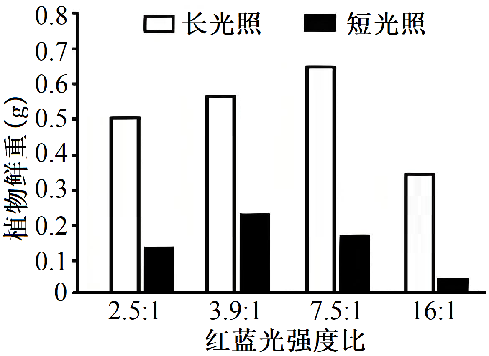

A. 蓝光不能作为信号调控拟南芥生长

B. 拟南芥叶绿素b的吸收光谱受光照时长的影响

C. 适当调高16：1组的蓝光比例有利于拟南芥生长

D. 不同光照时间下促进拟南芥生长的最佳红蓝光强度比相同

10\. 紫杉醇是红豆杉的代谢产物，会干扰纺锤体的正常功能。科研人员利用农杆菌将紫杉醇合成的相关基因导入烟草中，实现了紫杉醇前体物质的合成。下列叙述错误的是（ ）

A. 农杆菌转化前应先使用Ca2+处理烟草细胞

B. 紫杉醇合成的相关基因会整合到烟草染色体DNA上

C. 紫杉醇因干扰肿瘤细胞的有丝分裂而具有抗癌作用

D. 该技术的突破有利于红豆杉天然资源的保护

11\. 科研人员将光合系统相关基因整合到大肠杆菌后，该菌能在无碳源培养基中生长繁殖。下列叙述错误的是（ ）

A. 必需整合光反应和暗反应系统的相关基因

B. 暗反应所需的所有能量来源于细胞中的ATP

C. 改造成功的大肠杆菌可用作为唯一碳源

D. 该菌在无碳源培养基中生长繁殖一定需要光照

12\. 为探究种养关系，科研人员构建了“稻田-鱼塘循环水养殖系统”，如图所示，鱼塘养殖水被泵入水塔后，流经稻田、集水池和生态沟，再回流到鱼塘。稻田进入水和流出水中可溶性氧气浓度（DO）、总氮浓度（TN）和总磷浓度（TP）的检测结果如下表。

|          |      |       |
|:-------- |:---- |:----- |
| 指标       | 进入水  | 流出水   |
| DO（mg/L） | 7.02 | 12.05 |
| TN（mg/L） | 3.84 | 2.64  |
| TP（mg/L） | 0.84 | 0.65  |

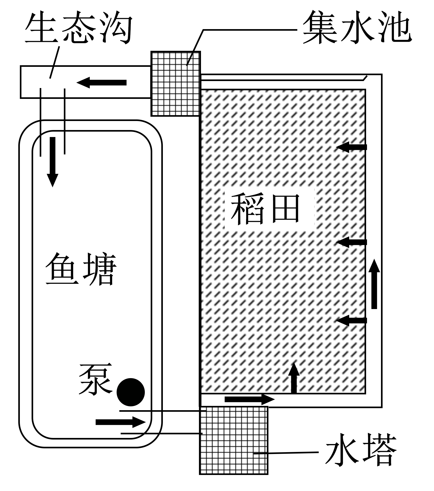

关于该系统，下列叙述错误的是（ ）

A. 同时提高了鱼塘的氧含量和稻田肥力 B. 同时增大了水稻和鱼塘的能量输入

C. 能够降低稻田的施肥量并改善环境 D. 可减少鱼塘污染物，体现了循环原理

13\. 细胞呼吸产生的乳酸等物质的释放会引起胞外环境的酸化。为探究氧浓度对细胞呼吸的影响，科研人员将两组肿瘤细胞在不同氧浓度下短暂培养，在箭头所示的时间点更换新的无机盐缓冲液（不含葡萄糖），并分别添加相应的成分，其中a为足量的葡萄糖，b和c为有氧呼吸某一阶段的抑制剂，检测细胞外的酸化速率，结果如图。下列叙述错误的是（ ）

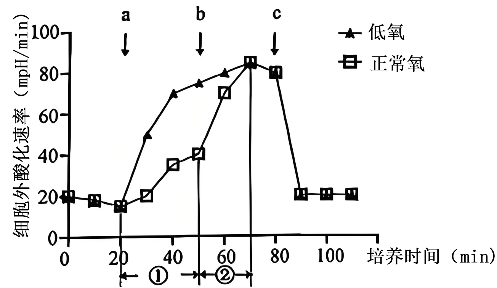

A. 试剂c只能是有氧呼吸第一阶段的抑制剂

B. 低氧组细胞对足量葡萄糖引发的无氧呼吸更强烈

C. ①时间段正常氧组细胞同时发生有氧呼吸和无氧呼吸

D. ②时间段正常氧组细胞无氧呼吸消耗的葡萄糖多于低氧组

14\. 某动物（AaBbDd）的孤雌生殖方式是：来自次级卵母细胞的极体，随机与来自同一卵原细胞的其他极体融合形成二倍体细胞，而后发育成新个体。该动物一个次级卵母细胞形成的卵细胞染色体如图所示。来自该次级卵母细胞的极体，以此生殖方式形成的二倍体细胞是（ ）

A.  B. 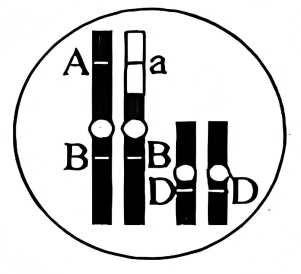 C.  D. 

15\. 质粒P含有2个EcoRⅠ、1个SacⅠ和1个BamHⅠ的限制酶切割位点。已知BamHⅠ位点位于2个EcoRⅠ位点的正中间，用上述3种酶切割该质粒，酶切产物的凝胶电泳结果如图，其中泳道①条带是未酶切的质粒P，泳道②③④条带为3种单酶切产物，泳道⑤⑥⑦条带为双酶切产物。下列叙述正确的是（ ）

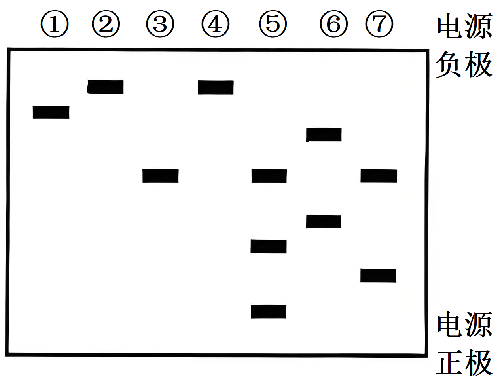

A. DNA分子在该凝胶的迁移方向是从电源正极到负极

B. 可确认泳道②③条带分别是SacⅠ和EcoRⅠ的单酶切产物

C. 泳道⑤条带是SacⅠ和EcoRⅠ的双酶切产物

D. 泳道①②说明未酶切质粒的碱基数小于酶切后质粒的碱基数

**二、非选择题：本大题共5小题，共60分。**

16\. 麋鹿是我国一级保护动物，喜食外来入侵种互花米草。某滩涂湿地互花米草泛滥成灾，导致当地草本植物基本消失。为保护麋鹿和治理互花米草，该地设置围栏区放养麋鹿。上述物种种群数量在互花米草入侵后变化如图。回答下列问题：

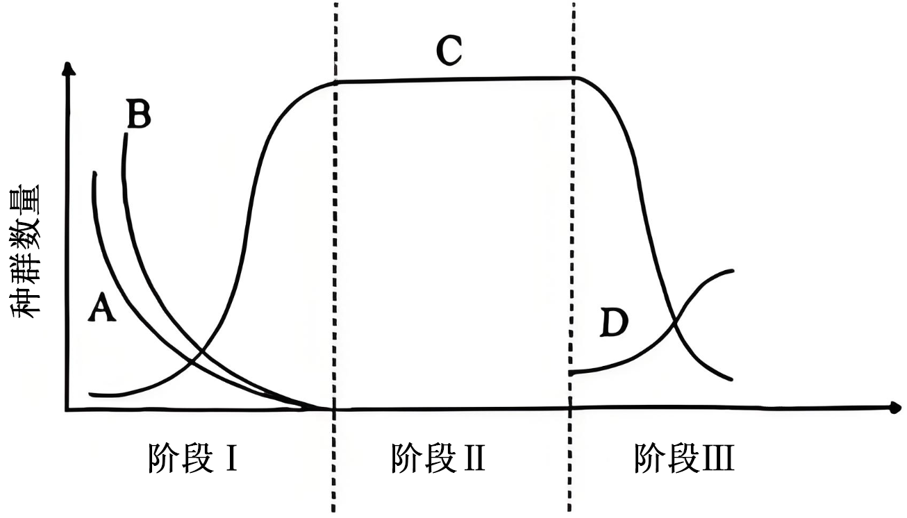

注：A、B、C和D分别表示不同d的物种。

（1）物种D属于该生态系统组成成分的\_\_\_\_\_。

（2）若将同等条件的麋鹿在阶段Ⅱ引入围栏区，\_\_\_\_\_（填“会”或“不会”）影响围栏区内麋鹿的环境容纳量，理由是\_\_\_\_\_。

（3）由图可知，存在两个发生植物种群衰退的阶段，土壤肥力增加较多的是阶段\_\_\_\_\_。该阶段C种群生态位\_\_\_\_\_（填“会”或“不会”）发生改变，原因是\_\_\_\_\_。

17\. 运动是预防肥胖的方式之一、剧烈运动后，人体血液中乳酸-苯丙氨酸（Lac-Phe）的含量明显上升。为探究Lac-Phe的产生机理及功效，科研人员进行了相关实验。回答下列问题：

（1）Lac-Phe可由乳酸盐和苯丙氨酸在一定条件下缩合而成。剧烈运动时机体供氧不足，部分丙酮酸在细胞的\_\_\_\_\_（填场所）中转化为乳酸，为Lac-Phe的生成提供原料。

（2）已知酶C促进了机体Lac-Phe合成。为验证该结论，科研人员将野生型小鼠细胞（甲组）和敲除C基因的小鼠细胞（乙组）分别培养，一段时间后进行了相关检测。

①收集培养液后，用\_\_\_\_\_酶处理贴壁细胞，使其分散为单细胞悬液，离心获得细胞，发现两组细胞内Lac-Phe的浓度相同；

②还需进一步检测\_\_\_\_\_中的Lac-Phe浓度，且结果为\_\_\_\_\_，则可证实该结论。

（3）研究发现C基因的突变与体重异常相关。据此，推测如下：运动时机体产生的乳酸在酶C的作用下转化为Lac-Phe，Lac-Phe可抑制肥胖的发生。为证实该推测，采用高脂饲料喂养不同条件处理的小鼠，一段时间后检测相应的指标，实验分组及部分结果如下表。

a组：野生型小鼠+静息

b组：C基因敲除小鼠+静息

c组：野生型小鼠+运动

d组：C基因敲除小鼠+运动

<table style="width:59%;">
<colgroup>
<col style="width: 11%" />
<col style="width: 26%" />
<col style="width: 21%" />
</colgroup>
<tbody>
<tr>
<td style="text-align: left;">
组别

检测指标
</td>
<td style="text-align: left;">血浆Lac-Phe浓度（μM）</td>
<td style="text-align: left;">小鼠体重增量（g）</td>
</tr>
<tr>
<td style="text-align: left;">a组</td>
<td style="text-align: left;">0.3</td>
<td style="text-align: left;">16</td>
</tr>
<tr>
<td style="text-align: left;">①</td>
<td style="text-align: left;">0.4</td>
<td style="text-align: left;">7</td>
</tr>
<tr>
<td style="text-align: left;">②</td>
<td style="text-align: left;">1.5</td>
<td style="text-align: left;">4</td>
</tr>
<tr>
<td style="text-align: left;">③</td>
<td style="text-align: left;">0.1</td>
<td style="text-align: left;">④</td>
</tr>
</tbody>
</table>

若推测成立，则表中①②③对应的组别分别是\_\_\_\_\_（填字母），表中④的值应为\_\_\_\_\_（填选项）。

A．小于4 B．4~7 C．7~16 D．大于16

18\. Ⅰ型单纯疱疹病毒（HSV-1）感染会导致体内五羟色胺（5-HT）含量明显升高。为探究5-HT的作用机制，科研人员开展了相关研究。回答下列问题：

（1）HSV-1侵染细胞后，机体需通过\_\_\_\_\_免疫将靶细胞裂解，暴露的病原体与抗体结合，或被巨噬细胞等免疫细胞吞噬。

（2）体外实验研究5-HT对被HSV-1侵染的小鼠巨噬细胞的影响，实验分组和结果如图1，说明5-HT能\_\_\_\_\_（填“促进”或“抑制”）巨噬细胞分泌干扰素β（IFN-β），并\_\_\_\_\_（填“增强”或“减弱”）HSV-1的增殖。

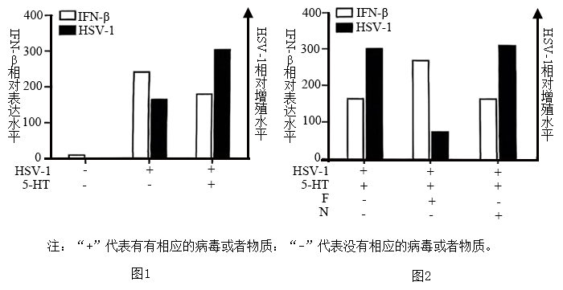

（3）5-HT对靶细胞的作用方式是：①直接被转运至胞内发挥作用；②与膜受体结合后，将信号传递至胞内发挥作用。分别用5-HT膜转运蛋白抑制剂（F）和5-HT膜受体抑制剂（N）处理巨噬细胞，实验分组和结果如图2，说明5-HT对巨噬细胞的作用方式是第\_\_\_\_\_（填“①”或“②”）种，判断依据是\_\_\_\_\_。

（4）体内实验进一步证实了5-HT对小鼠抗HSV-1的免疫调控效应，实验方案如下：

将实验方案补充完整：①\_\_\_\_\_；②\_\_\_\_\_。

（5）根据上述实验结果，提出一种增强机体抗HSV-1感染的设想：\_\_\_\_\_。

19\. 家猫毛色受常染色体和性染色体基因控制，回答下列问题：

（1）家猫常染色体上的2对等位基因独立遗传（A/a、E/e），显性基因E使毛色呈黑色，隐性基因e使毛色呈黄色，A蛋白抑制E蛋白功能，a蛋白无此功能。据此可知黑猫的基因型为\_\_\_\_\_。基因型为AaEe的雌雄家猫交配，子代黑猫的概率为\_\_\_\_\_。

（2）研究发现：①在家猫发育过程中，体细胞的2条X染色体同时存在时，会随机失活其中1条；②X染色体上1对等位基因参与毛色控制：XB（黑色）、XO（黄色）和XB XO（玳瑁色）。对家猫胚胎皮肤细胞进行检测，统计能转录B或O基因的不同类型细胞比例，结果如图1。

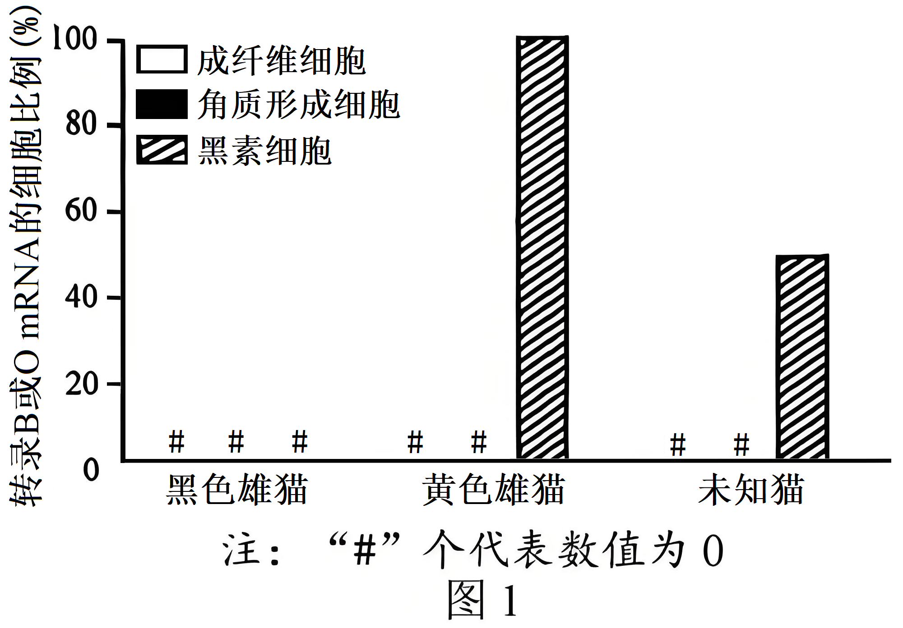

从结果可知该mRNA特异性地在\_\_\_\_\_细胞中由\_\_\_\_\_基因转录，由此判断图中未知猫的基因型是\_\_\_\_\_（只考虑性染色体）。

（3）性染色体基因（B/O）能影响常染色体基因对毛色的控制。E蛋白通过P蛋白控制毛色形成；O蛋白存在时，与P蛋白结合，导致P蛋白降解从而改变毛色，机制如图2所示。若无E蛋白则毛色皆为黄色。

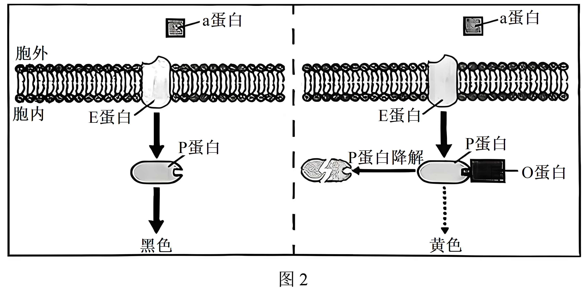

①不含A基因的杂合黄色雌猫基因型有\_\_\_\_\_种。含aaEe基因的黄色雌猫与含aaEe基因的黑色雄猫杂交，子代雄猫的毛色是\_\_\_\_\_。

②若两只纯合黄猫杂交，子代雄猫均为黑色，子代雌猫基因型为\_\_\_\_\_。

20\. 为建立一种效率高、毒性小的基因敲除系统，将图1所示的质粒1和质粒2导入大肠杆菌，质粒2中的sgRNA基因依据目的基因设计，其转录的短链RNA通过与目的基因碱基互补配对，与Cas9蛋白共同作用，敲除大肠杆菌基因组中的目的基因。

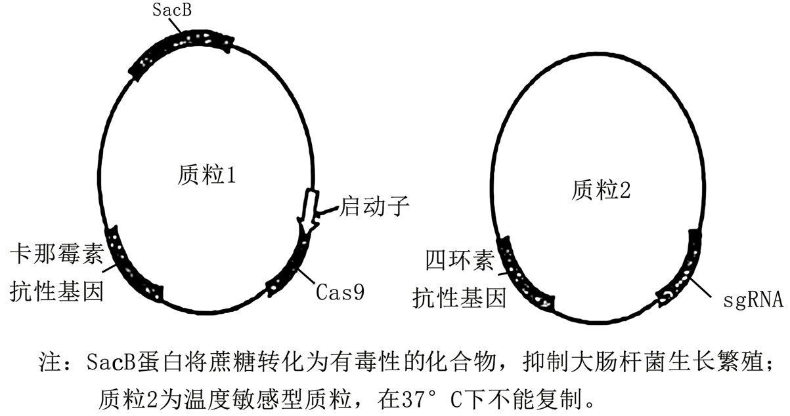

回答下列问题：

（1）大肠杆菌LacZ基因的表达产物可催化X-gal生成蓝色物质从而使菌落呈现蓝色，否则菌落为白色。将质粒1与含LacZ基因相应sgRNA基因的质粒2同时转化到大肠杆菌中，涂布到含抗生素\_\_\_\_\_的平板（含有X-gal）上进行培养。若长出的是\_\_\_\_\_色菌落则为LacZ基因被敲除的大肠杆菌。

（2）Cas9基因的表达量会影响敲除效率，但其过量表达会对大肠杆菌有毒。为评估毒性和敲除效率，用5种启动子（A、B、C、D和E）启动Cas9的转录，相应检测结果如图2所示。结果表明，启动子\_\_\_\_\_对细胞毒性最小；综合考量毒性和敲除效率，应选用启动子\_\_\_\_\_用于该系统。

（3）含有质粒的大肠杆菌在无抗生素选择压力下培养，少数子代细胞会丢失质粒。结合质粒1和质粒2的特点，在成功敲除LacZ基因的大肠杆菌中消除质粒1和质粒2，实验流程如图3所示。

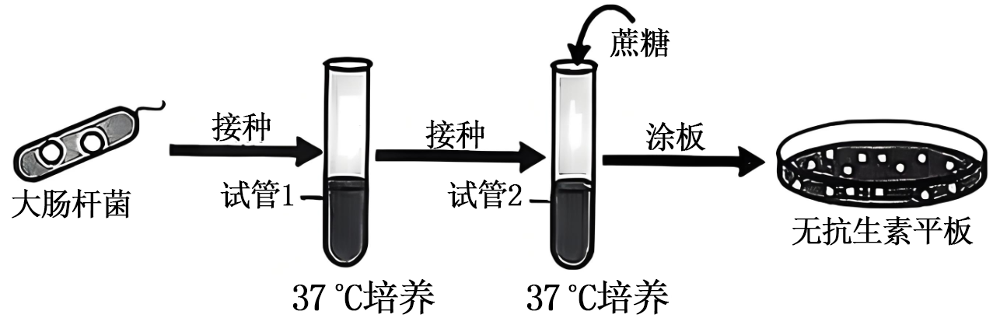

①培养12小时后，图3试管1中大部分的大肠杆菌\_\_\_\_\_（填选项）。

A．含质粒1和质粒2 B．只含质粒1 C．只含质粒2 D．无质粒1和质粒2

②若要从图3平板上筛出质粒1和质粒2均被消除的大肠杆菌，简要写出实验思路和预期结果：\_\_\_\_\_。
