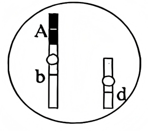
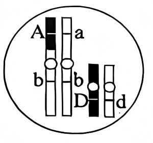
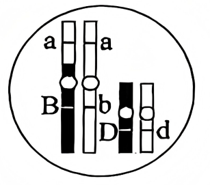
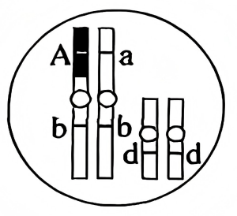
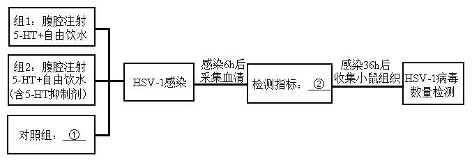
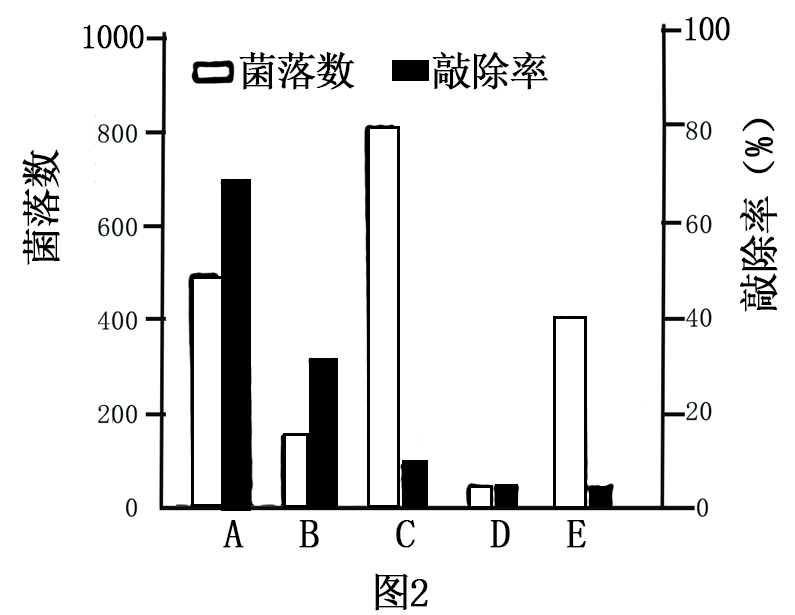

**2025年福建省普通高中学业水平选择性考试**

**生物学**

**本试卷共8页，考试时间75分钟**

**注意事项：**

**1．答题前，考生务在规定位置填写自己的准考证号、姓名。考生要认真核对答题卡上粘贴的条形码的“准考证号、姓名”与考生本人准考证号、姓名是否一致。**

**2．回答选择题时，选出每小题答案后，用2B铅笔把答题卡上对应题目的答案标号涂黑，如需改动，用橡皮擦干净后，再选涂其他答案标号。回答非选择题时，用黑色墨水签字笔将答案写在答题卡相应位置上。写在草稿纸、试题卷上无效。**

**3．考试结束后，将本试卷和答题卡一并交回。**

**一、选择题：本题共15小题，1~10小题，每小题2分，11~15小题，每小题4分。共计40分。在每小题给出的四个选项中，只有一项符合题目要求。**

1\. 今年是我国的“体重管理年”。下列与体重管理相关的叙述，错误的是（ ）

A. 体重超标易引发身体代谢异常 B. 糖原会直接转化为脂肪导致肥胖

C. 长期低蛋白饮食会危害身体健康 D. 过度节食会影响身体的营养均衡

【答案】B

【解析】

【详解】A、体重超标会增加代谢负担，如胰岛素抵抗、血脂异常等，属于代谢异常，A正确；

B、糖原需先分解为葡萄糖，经转化才能合成脂肪，而非直接转化，B错误；

C、蛋白质是生命活动主要承担者，长期缺乏会导致组织修复受阻、酶合成不足等，C正确；

D、过度节食会导致必需营养素摄入不足，打破营养平衡，D正确。

故选B。

2\. 我国航天员在空间站收获并品尝了新鲜的“太空蔬菜”。下列叙述错误的是（ ）

A. 太空蔬菜中的激素分布不受微重力的影响

B. 太空蔬菜可为航天员提供维生素和膳食纤维

C. 太空蔬菜种植可促进空间站内的物质循环

D. 太空蔬菜的生长体现了植物对环境的适应性

【答案】A

【解析】

【分析】细胞中的有机物包括蛋白质、糖类、脂质等，其中蛋白质通常是含量最多的有机物。光照强度会影响光合作用的效率，适宜强度的光照有助于蔬菜生长。植物生长需要多种元素，其中镁元素是合成叶绿素的重要元素。

【详解】A、植物激素的分布受重力影响，如生长素在地球上因重力导致极性运输和横向运输。微重力环境下，激素分布会发生改变，A错误；

B、蔬菜富含维生素和纤维素（膳食纤维），能为航天员提供必要营养，B正确；

C、植物通过光合作用和呼吸作用参与物质循环（如CO₂和O₂的转换），促进空间站内物质循环，C正确；

D、植物在微重力环境下生长，说明其能调整生理活动适应环境，体现适应性，D正确；

故选A。

3\. 在森林内经常可观察到小动物出没于地表的枯枝落叶中。下列叙述正确的是（ ）

A. 枯枝落叶的分布属于生物群落的水平结构

B. 枯枝落叶的分解由分解者和生产者共同主导

C. 枯枝落叶和地表的一些小动物是互利共生关系

D. 枯枝落叶的种类间接反映了群落的物种丰富度

【答案】D

【解析】

【详解】A、群落的水平结构指不同生物种群的水平分布，枯枝落叶本身并非生物种群，因此不属于群落的水平结构，A错误；

B、枯枝落叶的分解主要由分解者（如细菌、真菌）完成，生产者（如绿色植物）不参与分解过程，B错误；

C、小动物以枯枝落叶为食，属于分解者与被分解物的关系（腐生），而互利共生是两种生物相互依赖、彼此有利的关系（如根瘤菌与豆科植物），C错误；

D、枯枝落叶的种类由生产者的种类决定，其多样性可间接反映生产者群落的物种丰富度，D正确。

故选D。

4\. 我国科学家通过对福建发现的侏罗纪鸟类化石的研究，确认了目前全球最古老的鸟类并命名为“政和八闽鸟”。下列叙述正确的是（ ）

A. 该化石为研究鸟类进化提供了最直接的证据

B. 政和八闽鸟为躲避爬行类的捕食进化出了翅膀

C. 该发现证明政和八闽鸟是现代所有鸟类的原始祖先

D. 与现代鸟类同源DNA化学组成比对可确认化石的分类地位

【答案】A

【解析】

【分析】现代进化理论的基本内容是：①进化是以种群为基本单位，进化的实质是种群的基因频率的改变。②突变和基因重组产生进化的原材料。③自然选择决定生物进化的方向。④隔离导致物种形成。

【详解】A、化石是保存在地层中的古代生物的遗体、遗物或生活痕迹，能直接反映生物形态结构特征，属于研究生物进化最直接的证据，A正确；

B、进化是自然选择作用下种群基因频率的定向改变，翅膀的形成是长期自然选择的结果，而非个体主动适应环境的行为，该表述属于拉马克的“用进废退”观点，B错误；

C、“政和八闽鸟”是目前发现的最古老鸟类化石，但无法证明其为所有现代鸟类的共同祖先，可能存在其他未发现的过渡类型或分支，C错误；

D、DNA化学组成（如脱氧核糖、磷酸和四种碱基）在所有生物中均相同，无法用于分类判断；需通过DNA序列相似度或同源基因比对才能确认亲缘关系，D错误。

故选A。

5\. 登革热等蚊媒病毒传染病威胁人类健康。蚊子叮咬蚊媒病毒感染者后，病毒会转移至蚊唾液腺，当蚊子再次叮咬时会发生传染。下列叙述错误的是（ ）

A. 蚊子和人都是登革热病毒的宿主

B. 利用不育雄蚊防治蚊虫属于生物防治

C. 喷施不易分解的灭蚊杀虫剂易引起生物富集

D. 为预防登革热灭绝蚊子不影响生物多样性价值

【答案】D

【解析】

【分析】1、病毒的结构非常简单，没有细胞结构，仅由蛋白质外壳和内部的遗传物质组成，不能独立生存，只有寄生在活细胞里才能进行生命活动。一旦离开就会变成结晶体。

2、预防传染病的措施有控制传染源、切断传播途径、保护易感人群。

【详解】A、登革热病毒可在人体内增殖，并在蚊子体内复制，故蚊子和人均为宿主，A正确；

B、不育雄蚊通过干扰繁殖控制种群，属于生物防治中的遗传防治，B正确；

C、不易分解的杀虫剂会通过食物链在生物体内积累，导致生物富集，C正确；

D、灭绝蚊子可能破坏生态平衡，影响生物多样性的间接价值（如生态功能），D错误。

故选D。

6\. 下列高中生物学实验的部分操作，正确的是（ ）

|     |                  |                            |
|:--- |:---------------- |:-------------------------- |
| 选项  | 实验名称             | 实验操作                       |
| A   | 探究抗生素对细菌的选择作用    | 涂菌前，需将抗生素均匀涂抹在培养基平板上       |
| B   | 制作果酒和果醋          | 当葡萄酒制作完成后，需拧紧瓶盖，促进葡萄醋的发酵   |
| C   | 土壤中分解尿素的细菌的分离与计数 | 稀释土壤样品时，每个梯度稀释时都需更换移液器枪头   |
| D   | DNA片段的扩增及电泳鉴定    | 接通电源后，看到DNA条带迁移至凝胶边缘时，停止电泳 |

A. A B. B C. C D. D

【答案】C

【解析】

【详解】A、抗生素不能涂抹在培养基上，而是将含有少量细菌的培养液均匀涂抹在培养基上，将培养皿分成4个区域，在3个区域放含有抗生素的纸片，在另外一个区域放不含抗生素的纸片，A错误；

B、制作果醋需在有氧条件下进行，拧紧瓶盖会抑制醋酸菌（需氧型）的发酵，B错误；

C、稀释涂布平板法中，更换枪头可避免不同浓度菌液交叉污染，确保稀释梯度准确，C正确；

D、DNA电泳应通过指示剂（如溴酚蓝）判断停止时间，若DNA迁移至凝胶边缘可能已流失，D错误。

故选C。

7\. 一个蜂群中，受精卵孵化的幼虫若用蜂王浆饲喂会发育成蜂王，而用花粉和花蜜饲喂则发育成工蜂。若降低基因组甲基化水平，饲喂花粉和花蜜的雌蜂幼虫也能发育成蜂王。下列叙述正确的是（ ）

A. 蜂王和工蜂的表观修饰水平相同

B. 蜂王和工蜂的表型是由食物决定的

C. 蜂王和工蜂体内的蛋白质组成相同

D. 蜂王和工蜂体细胞d的染色体数目相同

【答案】D

【解析】

【详解】A、蜂王和工蜂的表观修饰水平不同，因降低甲基化可使工蜂发育为蜂王，A错误；

B、表型由基因表达差异决定，食物通过影响甲基化间接起作用，B错误；

C、蜂王和工蜂功能不同，蛋白质组成必然存在差异，C错误；

D、蜂王和工蜂均为受精卵发育的二倍体，染色体数目相同，D正确。

故选D。

8\. 关于生物科学史中经典实验对应的实验设计，下列叙述错误的是（ ）

|     |                      |                                |
|:--- |:-------------------- |:------------------------------ |
| 选项  | 经典实验                 | 实验设计                           |
| A   | 恩格尔曼探究叶绿体的功能         | 选择水绵为实验材料、利用需氧细菌指示氧气释放的场所      |
| B   | 艾弗里证明DNA是遗传物质        | 利用“减法原理”设法分离DNA和蛋白质等物质。研究它们的作用 |
| C   | 梅塞尔森和斯塔尔证明DNA的半保留复制  | 选择大肠杆菌为实验材料，应用同位素标记技术进行探究      |
| D   | 毕希纳探究发酵是否需要酵母菌活细胞的参与 | 破碎酵母菌细胞，获得不含细胞的提取液进行发酵         |

A. A B. B C. C D. D

【答案】B

【解析】

【详解】A、恩格尔曼探究叶绿体的功能时，选择水绵为实验材料，水绵的叶绿体呈螺旋式带状，便于观察，利用需氧细菌指示氧气释放的场所，因为需氧细菌会向氧气浓度高的部位聚集，A正确；

B、艾弗里利用“减法原理”（即通过酶解法分别去除DNA、蛋白质、RNA等成分）去除某种化学成分，研究哪种成分是转化因子（遗传物质），证明DNA是遗传物质，而不是设法分离DNA和蛋白质等物质，B错误；

C、梅塞尔森和斯塔尔证明DNA的半保留复制时，选择大肠杆菌为实验材料，应用同位素标记技术（用15N标记）和密度梯度离心，进行探究，C正确；

D、毕希纳探究发酵是否需要酵母菌活细胞的参与，是把酵母菌细胞放在石英砂中研磨，加水搅拌，再进行过滤，获得不含酵母菌细胞的提取液，然后进行发酵，D正确。

故选B。

9\. 为研究光照对培养箱中拟南芥生长的影响，科研人员在总光强相同情况下设置了不同的红蓝光强度比，并改变光照时间，进行相关实验，部分结果如图。下列叙述正确的是（ ）

A. 蓝光不能作为信号调控拟南芥生长

B. 拟南芥叶绿素b的吸收光谱受光照时长的影响

C. 适当调高16：1组的蓝光比例有利于拟南芥生长

D. 不同光照时间下促进拟南芥生长的最佳红蓝光强度比相同

【答案】C

【解析】

【详解】A、蓝光是植物重要的光信号之一（如蓝光受体参与向光性、气孔开放等调控），能作为信号调控拟南芥生长，A错误；

B、叶绿素b的吸收光谱是其自身的理化特性，由分子结构决定，不受光照时长影响，B错误；

C、从图中可见，红蓝光强度比为16:1时，拟南芥新鲜重量低于3.9:1、7.5:1组。若适当调高16:1组的蓝光比例（即降低红光比例，向3.9:1、7.5:1方向调整），有利于拟南芥生长，C正确；

D、长光照下，促进拟南芥生长的最佳红蓝光强度比约为7.5:1；短光照下，各红蓝光强度比的生长效果均远低于长光照，因此，不同光照时间下最佳红蓝光强度比不同，D错误。

故选C。

10\. 紫杉醇是红豆杉的代谢产物，会干扰纺锤体的正常功能。科研人员利用农杆菌将紫杉醇合成的相关基因导入烟草中，实现了紫杉醇前体物质的合成。下列叙述错误的是（ ）

A. 农杆菌转化前应先使用Ca2+处理烟草细胞

B. 紫杉醇合成的相关基因会整合到烟草染色体DNA上

C. 紫杉醇因干扰肿瘤细胞的有丝分裂而具有抗癌作用

D. 该技术的突破有利于红豆杉天然资源的保护

【答案】A

【解析】

【详解】A、转化是指目的基因进入受体细胞内，并在受体细胞内维持稳定和表达的过程。农杆菌转化前，需要将含目的基因的重组Ti质粒转入农杆菌中，此时应先使用Ca2+处理农杆菌细胞，使农杆菌细胞处于一种能吸收周围环境中 DNA分子的生理状态，A错误；

B、农杆菌的Ti质粒上的T-DNA可转移至受体细胞，并且整合到受体细胞染色体的DNA中，因此紫杉醇合成的相关基因会随T-DNA整合到烟草染色体DNA上，B正确；

C、紫杉醇会干扰纺锤体的正常功能，通过抑制纺锤体的形成，阻碍肿瘤细胞的有丝分裂，从而发挥抗癌作用，C正确；

D、利用转基因技术生产紫杉醇前体，可减少对天然红豆杉的依赖，有利于保护其资源，D正确。

故选A。

11\. 科研人员将光合系统相关基因整合到大肠杆菌后，该菌能在无碳源培养基中生长繁殖。下列叙述错误的是（ ）

A. 必需整合光反应和暗反应系统的相关基因

B. 暗反应所需的所有能量来源于细胞中的ATP

C. 改造成功的大肠杆菌可用作为唯一碳源

D. 该菌在无碳源培养基中生长繁殖一定需要光照

【答案】B

【解析】

【分析】光合作用是指绿色植物通过叶绿体，利用光能把二氧化碳和水转变成储存着能量的有机物，并释放出氧气的过程。 光合作用根据是否需要光照，可以概括地分为光反应和暗反应。光反应阶段必须需要光照才能进行，发生在类囊体薄膜上。主要发生水的光解，NADPH的合成，ATP的合成；暗反应阶段有没有光照都能进行，发生在叶绿体基质中，主要发生二氧化碳的固定和三碳化合物的还原。光反应和暗反应之间是紧密联系的，能量转化和物质变化密不可分。

【详解】A、光反应生成ATP和NADPH，暗反应利用这些物质固定CO₂，两者缺一不可，因此必须整合光反应和暗反应相关基因，A正确；

B、暗反应的能量不仅来源于ATP，还需NADPH提供能量且作为还原剂，B错误；

C、改造后的大肠杆菌通过暗反应固定CO₂合成有机物，CO₂可作为唯一碳源，C正确；

D、光反应需要光照提供能量，若培养基无碳源，菌体必须依赖光反应进行自养，因此生长繁殖需要光照，D正确。

故选B。

12\. 为探究种养关系，科研人员构建了“稻田-鱼塘循环水养殖系统”，如图所示，鱼塘养殖水被泵入水塔后，流经稻田、集水池和生态沟，再回流到鱼塘。稻田进入水和流出水中可溶性氧气浓度（DO）、总氮浓度（TN）和总磷浓度（TP）的检测结果如下表。

|          |      |       |
|:-------- |:---- |:----- |
| 指标       | 进入水  | 流出水   |
| DO（mg/L） | 7.02 | 12.05 |
| TN（mg/L） | 3.84 | 2.64  |
| TP（mg/L） | 0.84 | 0.65  |

关于该系统，下列叙述错误的是（ ）

A. 同时提高了鱼塘的氧含量和稻田肥力 B. 同时增大了水稻和鱼塘的能量输入

C. 能够降低稻田的施肥量并改善环境 D. 可减少鱼塘污染物，体现了循环原理

【答案】B

【解析】

【详解】A、从表格数据可知，流出水的溶氧量（DO）高于进入水，说明经过稻田后水体溶氧增加，回流到鱼塘可提高鱼塘溶氧量；同时，总氮（TN）、总磷（TP）浓度降低，说明稻田吸收了氮、磷等营养物质，提高了稻田肥力，A正确；

B、水稻的能量输入主要来自太阳能，鱼塘的能量输入主要来自人工投放的饲料等。该循环水系统是对 “水” 的循环利用，并不会增加水稻的太阳能输入，也不会增加鱼塘的能量输入，B错误；

C、由于稻田可吸收水中的氮、磷等营养物质，因此可以减少稻田化肥的施用量；同时，降低了水体中氮、磷的排放，改善了环境，C正确；

D、鱼塘的水经稻田、集水池、生态沟处理后，污染物（如 TN、TP）减少，实现了水资源和物质的循环利用，体现了生态工程的循环原理，D正确。

故选B。

13\. 细胞呼吸产生的乳酸等物质的释放会引起胞外环境的酸化。为探究氧浓度对细胞呼吸的影响，科研人员将两组肿瘤细胞在不同氧浓度下短暂培养，在箭头所示的时间点更换新的无机盐缓冲液（不含葡萄糖），并分别添加相应的成分，其中a为足量的葡萄糖，b和c为有氧呼吸某一阶段的抑制剂，检测细胞外的酸化速率，结果如图。下列叙述错误的是（ ）

A. 试剂c只能是有氧呼吸第一阶段的抑制剂

B. 低氧组细胞对足量葡萄糖引发的无氧呼吸更强烈

C. ①时间段正常氧组细胞同时发生有氧呼吸和无氧呼吸

D. ②时间段正常氧组细胞无氧呼吸消耗的葡萄糖多于低氧组

【答案】D

【解析】

【详解】A、细胞外酸化是由无氧呼吸产生的乳酸导致的。若试剂c是有氧呼吸第一阶段的抑制剂，则有氧呼吸被完全抑制，细胞只能进行无氧呼吸。此时低氧组和正常氧组的酸化速率（无氧呼吸强度）会趋于一致，与图中结果相符。若c抑制有氧呼吸第二或第三阶段，第一阶段产生的丙酮酸仍可进入无氧呼吸，正常氧组的酸化速率不会与低氧组完全一致。因此，试剂c只能是有氧呼吸第一阶段的抑制剂，A正确；

B、细胞外酸化速率反映无氧呼吸产生乳酸的速率。添加足量葡萄糖（a）后，低氧组的酸化速率显著高于正常氧组，说明低氧组无氧呼吸更强烈，B正确；

C、①时间段正常氧组的酸化速率不为 0，说明存在无氧呼吸；同时正常氧环境下，细胞也可进行有氧呼吸。因此，①时间段正常氧组细胞同时发生有氧呼吸和无氧呼吸，C正确；

D、无氧呼吸的反应式为：C6H12O62C3H6O3（乳酸）+少量能量，即消耗1mol葡萄糖产生2mol乳酸。酸化速率与乳酸产生速率正相关，因此酸化速率越高，消耗的葡萄糖越多。②时间段低氧组的酸化速率高于正常氧组，说明低氧组无氧呼吸消耗的葡萄糖更多，D错误。

故选D。

14\. 某动物（AaBbDd）的孤雌生殖方式是：来自次级卵母细胞的极体，随机与来自同一卵原细胞的其他极体融合形成二倍体细胞，而后发育成新个体。该动物一个次级卵母细胞形成的卵细胞染色体如图所示。来自该次级卵母细胞的极体，以此生殖方式形成的二倍体细胞是（ ）

A.  B.  C.  D. 

【答案】C

【解析】

【详解】分析题意可知，该动物基因型是AaBbDd，结合图示可知，三对等位基因存在连锁现象，且应发生了A/a的互换，该该动物一个次级卵母细胞形成的卵细胞是Abd，则与之同时产生的第二极体应是abd，第一极体产生的第二极体是ABD和aBD，且A/a与B/b应连锁，该生物孤雌生殖方式是：来自次级卵母细胞的极体，随机与来自同一卵原细胞的其他极体融合形成二倍体细胞，以此生殖方式形成的二倍体细胞可能是aaBbDd（abd的极体与aBD结合后发育而成），而图示AabbDd、AaBBDD和Aabbdd的个体不可能通过上述情况产生，C符合题意。

故选C。

15\. 质粒P含有2个EcoRⅠ、1个SacⅠ和1个BamHⅠ的限制酶切割位点。已知BamHⅠ位点位于2个EcoRⅠ位点的正中间，用上述3种酶切割该质粒，酶切产物的凝胶电泳结果如图，其中泳道①条带是未酶切的质粒P，泳道②③④条带为3种单酶切产物，泳道⑤⑥⑦条带为双酶切产物。下列叙述正确的是（ ）

A. DNA分子在该凝胶的迁移方向是从电源正极到负极

B. 可确认泳道②③条带分别是SacⅠ和EcoRⅠ的单酶切产物

C. 泳道⑤条带是SacⅠ和EcoRⅠ的双酶切产物

D. 泳道①②说明未酶切质粒的碱基数小于酶切后质粒的碱基数

【答案】C

【解析】

【详解】A、因为DNA分子带负电，在凝胶中会向电源正极迁移，所以其迁移方向是从电源负极到正极，并非从电源正极到负极，A错误；

B、质粒P有2个EcoR I、1个Sac I、1个BamH Ⅰ酶切位点。EcoR I有2个酶切位点，单酶切会产生2个片段，片段较小，Sac I有1个酶切位点，单酶切会产生1个线性片段，长度为质粒总长（①条带），观察电泳图谱，②和③都是一个条带，而②的条带大于①条带，因此图中泳道②不可能是Sac Ⅰ酶切产物，③条带可能是EcoR Ⅰ的单酶切产物（单酶切产生2个片段大小相同），B错误；

C、EcoR I有2个酶切位点，单酶切会产生2个片段，Sac I有1个酶切位点，单酶切会产生1个线性片段。Sac I和EcoR I双酶切，会产生3个片段，观察电泳图谱，泳道⑤有3个条带，可推测泳道⑤为Sac I和EcoR I酶切产物，C正确；

D、酶切只是将质粒的环状结构切开，变成线性等结构，碱基总数不会改变，D错误。

故选C。

**二、非选择题：本大题共5小题，共60分。**

16\. 麋鹿是我国一级保护动物，喜食外来入侵种互花米草。某滩涂湿地互花米草泛滥成灾，导致当地草本植物基本消失。为保护麋鹿和治理互花米草，该地设置围栏区放养麋鹿。上述物种种群数量在互花米草入侵后变化如图。回答下列问题：

注：A、B、C和D分别表示不同的物种。

（1）物种D属于该生态系统组成成分的\_\_\_\_\_。

（2）若将同等条件的麋鹿在阶段Ⅱ引入围栏区，\_\_\_\_\_（填“会”或“不会”）影响围栏区内麋鹿的环境容纳量，理由是\_\_\_\_\_。

（3）由图可知，存在两个发生植物种群衰退的阶段，土壤肥力增加较多的是阶段\_\_\_\_\_。该阶段C种群生态位\_\_\_\_\_（填“会”或“不会”）发生改变，原因是\_\_\_\_\_。

【答案】（1）消费者 （2） ①. 不会 ②. 在阶段Ⅱ和Ⅲ，互花米草最大种群数量和围栏空间不变

（3） ①. Ⅲ ②. 会 ③. 受麋鹿捕食，互花米草种群密度下降

【解析】

【分析】1、种群数量增长的”J“型曲线：在食物（养料）和空间条件充裕、气候适宜和没有敌害等理想条件下种群数量的增长类型；种群增长的“S”型曲线：自然界的资源和空间是有限的，当种群密度增大时，种内竞争就会加剧，以该种群为食的捕食者数量也会增加。

2、环境容纳量（K值）：指在环境条件不被破坏的情况下，一定空间中所能维持的种群最大数量。

3、在食物充足，无限空间，无天敌等理想条件下生物具有无限增长的潜能。

【小问1详解】

生态系统的组成成分包括生产者、消费者、分解者和非生物的物质和能量。物种D是麋鹿，喜食互花米草（生产者），属于直接以生产者为食的生物，因此属于消费者。

【小问2详解】

环境容纳量（K值）是指环境条件不受破坏时，一定空间所能维持的种群最大数量，其大小由环境资源（食物、空间等）和生物制约因素决定。在阶段Ⅱ引入同等条件的麋鹿时，互花米草的最大种群数量和围栏空间均未改变（即麋鹿的食物资源和生存空间未发生变化），因此不会影响围栏内麋鹿的环境容纳量。

【小问3详解】

植物种群衰退的阶段为阶段Ⅰ和阶段Ⅲ。在阶段Ⅲ，由于麋鹿捕食互花米草，互花米草种群密度下降，其原本占据的土壤养分等资源被释放，因此土壤肥力增加较多的是阶段Ⅲ。 生态位是指物种在群落中的地位或作用，包括空间位置、资源占用、与其他物种的关系等。阶段Ⅲ中，C种群（互花米草）受麋鹿捕食，种群密度下降，其资源占用情况和与其他物种的相互关系发生改变，因此C种群生态位会发生改变。

17\. 运动是预防肥胖的方式之一、剧烈运动后，人体血液中乳酸-苯丙氨酸（Lac-Phe）的含量明显上升。为探究Lac-Phe的产生机理及功效，科研人员进行了相关实验。回答下列问题：

（1）Lac-Phe可由乳酸盐和苯丙氨酸在一定条件下缩合而成。剧烈运动时机体供氧不足，部分丙酮酸在细胞的\_\_\_\_\_（填场所）中转化为乳酸，为Lac-Phe的生成提供原料。

（2）已知酶C促进了机体Lac-Phe合成。为验证该结论，科研人员将野生型小鼠细胞（甲组）和敲除C基因的小鼠细胞（乙组）分别培养，一段时间后进行了相关检测。

①收集培养液后，用\_\_\_\_\_酶处理贴壁细胞，使其分散为单细胞悬液，离心获得细胞，发现两组细胞内Lac-Phe的浓度相同；

②还需进一步检测\_\_\_\_\_中的Lac-Phe浓度，且结果为\_\_\_\_\_，则可证实该结论。

（3）研究发现C基因的突变与体重异常相关。据此，推测如下：运动时机体产生的乳酸在酶C的作用下转化为Lac-Phe，Lac-Phe可抑制肥胖的发生。为证实该推测，采用高脂饲料喂养不同条件处理的小鼠，一段时间后检测相应的指标，实验分组及部分结果如下表。

a组：野生型小鼠+静息

b组：C基因敲除小鼠+静息

c组：野生型小鼠+运动

d组：C基因敲除小鼠+运动

<table style="width:59%;">
<colgroup>
<col style="width: 11%" />
<col style="width: 26%" />
<col style="width: 21%" />
</colgroup>
<tbody>
<tr>
<td style="text-align: left;">
组别

检测指标
</td>
<td style="text-align: left;">血浆Lac-Phe浓度（μM）</td>
<td style="text-align: left;">小鼠体重增量（g）</td>
</tr>
<tr>
<td style="text-align: left;">a组</td>
<td style="text-align: left;">0.3</td>
<td style="text-align: left;">16</td>
</tr>
<tr>
<td style="text-align: left;">①</td>
<td style="text-align: left;">0.4</td>
<td style="text-align: left;">7</td>
</tr>
<tr>
<td style="text-align: left;">②</td>
<td style="text-align: left;">1.5</td>
<td style="text-align: left;">4</td>
</tr>
<tr>
<td style="text-align: left;">③</td>
<td style="text-align: left;">0.1</td>
<td style="text-align: left;">④</td>
</tr>
</tbody>
</table>

若推测成立，则表中①②③对应的组别分别是\_\_\_\_\_（填字母），表中④的值应为\_\_\_\_\_（填选项）。

A．小于4 B．4~7 C．7~16 D．大于16

【答案】（1）细胞质基质

（2） ①. 胰蛋白 ②. 培养液 ③. 甲组培养液中Lac-Phe浓度高于乙组培养液

（3） ①. dcb ②. D

【解析】

【分析】无氧呼吸是指细胞在无氧条件下，通过酶的催化作用,把葡萄糖等有机物分解成乙醇和二氧化碳或乳酸，同时释放少量能量的过程。

【小问1详解】

人体细胞进行无氧呼吸产生乳酸的场所是细胞质基质，所以人体在剧烈运动后，由于机体缺氧，一部分丙酮酸在细胞质基质转化为乳酸，为Lac-Phe的合成提供原料。

【小问2详解】

①收集培养液后，用胰蛋白(胰蛋白酶和胶原蛋白酶)酶处理贴壁细胞，制成单细胞悬液。

②要检测细胞外的Lac-Phe浓度，需要收集培养液。已知酶C促进乳酸转化成Lac-Phe，甲组是野生型小鼠细胞（有酶C），乙组是酶C基因敲除小鼠细胞（无酶C）。若结论正确，甲组细胞能将更多乳酸转化为Lac-Phe释放到培养液中，所以实验结果为甲组培养液中Lac-Phe的浓度高于乙组。

【小问3详解】

根据题意，Lac-Phe可以抑制肥胖发生，即血浆中Lac-Phe浓度越高，小鼠体重应该越轻。野生型小鼠在运动条件下，乳酸在酶C的作用下与苯丙氨酸合成Lac-Phe，其血浆中Lac-Phe浓度应该较高，体重较轻；C基因敲除小鼠由于没有酶C基因，无法合成Lac-Phe或者合成量极少，在相同运动条件下体重应该较重；野生型小鼠静息时合成的Lac-Phe比运动时少，体重比运动时的野生型小鼠重。 观察表格数据，②组血浆中Lac-Phe浓度最高为1.5μM，所以②对应的是野生型小鼠+运动（c组）；①组血浆中Lac-Phe浓度为0.4μM，大于a组（野生型小鼠+静息）的0.3μM，所以①对应的是C基因敲除小鼠+运动（d组）；③组血浆中Lac-Phe浓度为0.1μM，小于a组，所以③对应的是C基因敲除小鼠+静息（b组）。③组是C基因敲除小鼠+静息，由于C基因敲除，无法正常合成Lac-Phe来抑制肥胖，且用高脂饲料喂养，其体重应该比野生型小鼠+静息（a组）的体重大，a组体重为16g，所以④相对应的体重应该大于16，D正确。

故选D。

18\. Ⅰ型单纯疱疹病毒（HSV-1）感染会导致体内五羟色胺（5-HT）含量明显升高。为探究5-HT的作用机制，科研人员开展了相关研究。回答下列问题：

（1）HSV-1侵染细胞后，机体需通过\_\_\_\_\_免疫将靶细胞裂解，暴露的病原体与抗体结合，或被巨噬细胞等免疫细胞吞噬。

（2）体外实验研究5-HT对被HSV-1侵染的小鼠巨噬细胞的影响，实验分组和结果如图1，说明5-HT能\_\_\_\_\_（填“促进”或“抑制”）巨噬细胞分泌干扰素β（IFN-β），并\_\_\_\_\_（填“增强”或“减弱”）HSV-1的增殖。

（3）5-HT对靶细胞的作用方式是：①直接被转运至胞内发挥作用；②与膜受体结合后，将信号传递至胞内发挥作用。分别用5-HT膜转运蛋白抑制剂（F）和5-HT膜受体抑制剂（N）处理巨噬细胞，实验分组和结果如图2，说明5-HT对巨噬细胞的作用方式是第\_\_\_\_\_（填“①”或“②”）种，判断依据是\_\_\_\_\_。

（4）体内实验进一步证实了5-HT对小鼠抗HSV-1的免疫调控效应，实验方案如下：

将实验方案补充完整：①\_\_\_\_\_；②\_\_\_\_\_

（5）根据上述实验结果，提出一种增强机体抗HSV-1感染的设想：\_\_\_\_\_。

【答案】（1）细胞 （2） ①. 抑制 ②. 增强

（3） ①. ① ②. 与对照组相比，5-HT膜转运蛋白抑制剂处理能够促进IFN-β表达，抑制病毒增殖；而5-HT膜受体抑制剂处理不影响IFN-β表达和病毒增殖

（4） ①. 腹腔注射等量5-HT溶剂+自由饮水 ②. 干扰素β（IFN-β）等与抗病毒免疫相关的细胞因子水平

（5）使用5-HT抑制剂、5-HT膜转运蛋白抑制剂

【解析】

【分析】细胞免疫：靶细胞膜表面的某些分子发生变化，细胞毒性T细胞识别变化的信号。细胞毒性T细胞分裂并分化，形成新的细胞毒性T细胞和记忆T细胞，细胞因子能加速这一过程。新形成的细胞毒性T细胞在体液中循环，它们可以识别并接触、裂解被同样病原体感染的靶细胞。靶细胞裂解、死亡后，病原体暴露出来，抗体可以与之结合；或被其他细胞吞噬掉。

【小问1详解】

在细胞免疫过程中，细胞毒性T细胞可以识别并接触、裂解被病原体感染的靶细胞。Ⅰ型单纯疱疹病毒（HSV-1）营寄生生活，其侵染宿主细胞后，机体需通过细胞免疫将靶细胞裂解，暴露的病原体与抗体结合，或被巨噬细胞等免疫细胞吞噬。

【小问2详解】

由图1可知：HSV-1和5-HT都不存在组没有HSV-1增殖。当HSV-1和5-HT同时存在时，IFN-β相对表达水平低于仅存在HSV-1组、高于HSV-1和5-HT都不存在组，但HSV-1相对增殖水平却明显高于仅存在HSV-1组，由此可说明5-HT能抑制巨噬细胞分泌干扰素β（IFN-β），并增强HSV-1的增殖。

【小问3详解】

由图2可知：①与对照组（没有使用任何抑制剂处理）相比，5-HT膜转运蛋白抑制剂（F）处理组的IFN-β相对表达水平高、HSV-1相对增殖水平低，说明5-HT膜转运蛋白抑制剂处理能够促进IFN-β表达，抑制病毒增殖；而5-HT膜受体抑制剂（N）处理组的IFN-β相对表达水平和HSV-1相对增殖水平与对照组无差异，说明5-HT膜受体抑制剂处理不影响IFN-β表达和病毒增殖。综上分析可判断5-HT对靶细胞的作用方式是第①种（直接被转运至胞内发挥作用），而不是第②种（与膜受体结合后，将信号传递至胞内发挥作用）。

【小问4详解】

分析“证实5-HT对小鼠抗HSV-1的免疫调控效应的实验方案”可知：为了排除配制5-HT溶液时使用的溶剂对实验结果的影响，对照组即①的处理为：腹腔注射等量5-HT溶剂+自由饮水。HSV-1感染6h后采集血清样本，检测指标即②为与抗病毒免疫相关的细胞因子水平，如干扰素β（IFN-β）等。

【小问5详解】

上述实验结果表明：5-HT能抑制巨噬细胞分泌干扰素β（IFN-β），并增强HSV-1的增殖；5-HT膜转运蛋白抑制剂处理能够促进IFN-β表达，抑制病毒增殖。由此可见，使用5-HT抑制剂、5-HT膜转运蛋白抑制剂可增强机体抗HSV-1感染的能力。

19\. 家猫毛色受常染色体和性染色体基因控制，回答下列问题：

（1）家猫常染色体上的2对等位基因独立遗传（A/a、E/e），显性基因E使毛色呈黑色，隐性基因e使毛色呈黄色，A蛋白抑制E蛋白功能，a蛋白无此功能。据此可知黑猫的基因型为\_\_\_\_\_。基因型为AaEe的雌雄家猫交配，子代黑猫的概率为\_\_\_\_\_。

（2）研究发现：①在家猫发育过程中，体细胞的2条X染色体同时存在时，会随机失活其中1条；②X染色体上1对等位基因参与毛色控制：XB（黑色）、XO（黄色）和XB XO（玳瑁色）。对家猫胚胎皮肤细胞进行检测，统计能转录B或O基因的不同类型细胞比例，结果如图1。

从结果可知该mRNA特异性地在\_\_\_\_\_细胞中由\_\_\_\_\_基因转录，由此判断图中未知猫的基因型是\_\_\_\_\_（只考虑性染色体）。

（3）性染色体基因（B/O）能影响常染色体基因对毛色的控制。E蛋白通过P蛋白控制毛色形成；O蛋白存在时，与P蛋白结合，导致P蛋白降解从而改变毛色，机制如图2所示。若无E蛋白则毛色皆为黄色。

①不含A基因的杂合黄色雌猫基因型有\_\_\_\_\_种。含aaEe基因的黄色雌猫与含aaEe基因的黑色雄猫杂交，子代雄猫的毛色是\_\_\_\_\_。

②若两只纯合黄猫杂交，子代雄猫均为黑色，子代雌猫基因型为\_\_\_\_\_。

【答案】（1） ①. aaEE、aaEe ②. 3/16

（2） ①. 黑素 ②. O ③. 

（3） ①. 2##二##两 ②. 黄色 ③. 

【解析】

【分析】自由组合定律的实质是位于非同源染色体上的非等位基因自由组合。分析题干信息可知，家猫常染色体上的2对等位基因独立遗传（A/a、E/e），显性基因E使毛色呈黑色，隐性基因e使毛色呈黄色，A蛋白抑制E蛋白功能，a蛋白无此功能，由此可知，黑猫的基因型为aaE\_（aaEE、aaEe）。

【小问1详解】

分析题干信息可知，显性基因E使毛色呈黑色，隐性基因e使毛色呈黄色，A蛋白抑制E蛋白功能，a蛋白无此功能，由此可知，黑猫的基因型为aaE\_（aaEE、aaEe）。家猫常染色体上的2对等位基因独立遗传（A/a、E/e），因此基因型为AaEe的雌雄家猫交配，子代黑猫（aaE\_）的概率为1/4×3/4=3/16。

【小问2详解】

结合题干信息可知，黑色雄猫的基因型为XBY，黄色雄猫的基因型为XOY，结合题图可知，该mRNA特异性地在黑素细胞中由O基因转录，在未知猫黑素细胞中转录OmRNA的细胞比例为50%，由此判断图中未知猫的基因型是XBXO。

【小问3详解】

①E使毛色呈黑色，隐性基因e使毛色呈黄色，A蛋白抑制E蛋白功能，a蛋白无此功能。E蛋白通过P蛋白控制毛色形成；O蛋白存在时，与P蛋白结合，导致P蛋白降解从而改变毛色，若无E蛋白则毛色皆为黄色，且在家猫发育过程中，体细胞的2条X染色体同时存在时，会随机失活其中1条，则不含A基因的杂合黄色雌猫的基因型可能为aaEeXOXO或aaeeXBXO，有2种。含aaEe基因的黄色雌猫（aaEeXOXO）与含aaEe基因的黑色雄猫（aaEeXBY）杂交，子代雄猫的基因型为aaE_XOY或aaeeXOY，由于“E蛋白通过P蛋白控制毛色形成，O蛋白存在时，与P蛋白结合，导致P蛋白降解从而改变毛色，若无E蛋白则毛色皆为黄色”，则子代雄猫的毛色均表现为黄色。

②两只纯合黄猫杂交，子代雄猫均为黑色（aaE_XBY），由此逆推亲本纯合黄猫的基因型为aaEEXOY、aaeeXBXB，则子代雌猫基因型为aaEeXBXO。

20\. 为建立一种效率高、毒性小的基因敲除系统，将图1所示的质粒1和质粒2导入大肠杆菌，质粒2中的sgRNA基因依据目的基因设计，其转录的短链RNA通过与目的基因碱基互补配对，与Cas9蛋白共同作用，敲除大肠杆菌基因组中的目的基因。

回答下列问题：

（1）大肠杆菌LacZ基因的表达产物可催化X-gal生成蓝色物质从而使菌落呈现蓝色，否则菌落为白色。将质粒1与含LacZ基因相应sgRNA基因的质粒2同时转化到大肠杆菌中，涂布到含抗生素\_\_\_\_\_的平板（含有X-gal）上进行培养。若长出的是\_\_\_\_\_色菌落则为LacZ基因被敲除的大肠杆菌。

（2）Cas9基因的表达量会影响敲除效率，但其过量表达会对大肠杆菌有毒。为评估毒性和敲除效率，用5种启动子（A、B、C、D和E）启动Cas9的转录，相应检测结果如图2所示。结果表明，启动子\_\_\_\_\_对细胞毒性最小；综合考量毒性和敲除效率，应选用启动子\_\_\_\_\_用于该系统。

（3）含有质粒的大肠杆菌在无抗生素选择压力下培养，少数子代细胞会丢失质粒。结合质粒1和质粒2的特点，在成功敲除LacZ基因的大肠杆菌中消除质粒1和质粒2，实验流程如图3所示。

①培养12小时后，图3试管1中大部分的大肠杆菌\_\_\_\_\_（填选项）。

A．含质粒1和质粒2 B．只含质粒1 C．只含质粒2 D．无质粒1和质粒2

②若要从图3平板上筛出质粒1和质粒2均被消除的大肠杆菌，简要写出实验思路和预期结果：\_\_\_\_\_。

【答案】（1） ①. 卡那霉素和四环素 ②. 白

（2） ①. C ②. A

（3） ①. B ②. 将同一菌落的大肠杆菌分别用含卡那霉素和四环素培养基进行培养，两者均不生长则为筛出的大肠杆菌

【解析】

【分析】基因工程的基本操作步骤主要包括四步：①目的基因的获取；②基因表达载体的构建；③将目的基因导入受体细胞；④目的基因的检测与表达。其中，基因表达载体的构建是基因工程的核心。

【小问1详解】

质粒2中含有与LacZ基因对应的sgRNA基因，其转录出来的短链RNA与目的基因（LacZ基因）发生碱基互补配对，使其不能表达，因而不能使X-gal分解产生蓝色物质，将质粒1和质粒2导入大肠杆菌，因此在含四环素和卡那霉素且含X-gal的培养基中，筛选白色的菌落即为LacZ基因成功敲除的菌落。

【小问2详解】

Cas9的表达量过高对大肠杆菌产生毒性，使其数量减少，结合图示可知，启动子C对应的菌落数最高，因此启动子C对细胞毒性最小。结合菌落数和敲除率可知，启动子A的菌落数和敲除率均较高，因此综合考虑，应选择启动子A作用于该系统。

【小问3详解】

①质粒2为温度敏感型质粒，在37℃下不能进行复制，培养12小时后，试管1中大部分大肠杆菌为只有质粒1，B正确，ACD错误。

故选B。

②试管2加入蔗糖，质粒1中的SacB基因表达的SacB蛋白能将蔗糖转化为有毒化合物，抑制大肠杆菌的生长繁殖，因此试管2含质粒2的大肠杆菌较少，为进一步筛选质粒1和质粒2均消除成功的大肠杆菌，实验设计思路和预测实验结果为：将同一菌落的大肠杆菌分别用含卡那霉素和四环素培养基进行培养，在无抗生素平板上可以生长，在含抗生素平板上均不生长的则为筛出的大肠杆菌。
