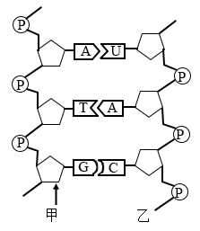
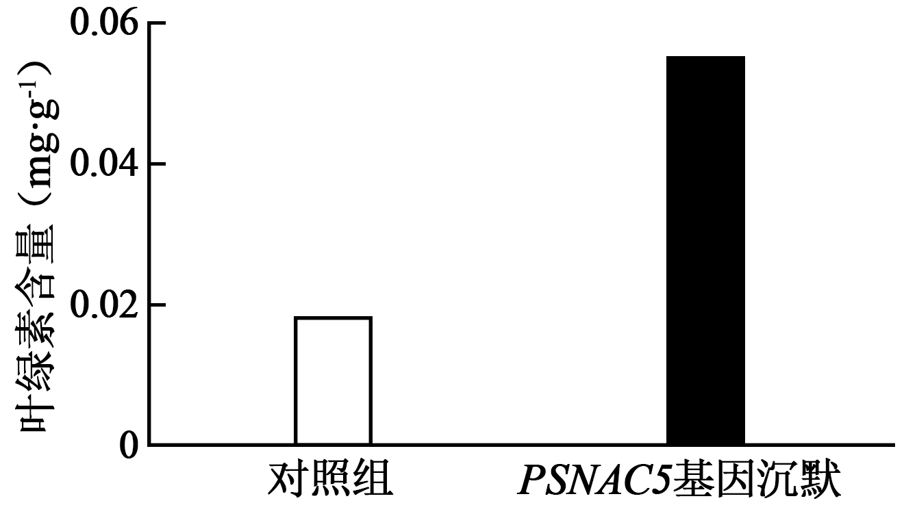

**2025年贵州省普通高中学业水平选择性考试生物学**

**注意事项：**

**1．答卷前，考生务必将自己的姓名、准考证号填写在答题卡上。**

**2．回答选择题时，选出每小题答案后，用28铅笔把答题卡上对应题目的答案标号涂黑，如需改动，用橡皮擦干净后，再选涂其他答案标号。回答非选择题时，将答案写在答题卡上。答案写在本试卷上无效。**

**3．考试结束后，将本试卷和答题卡一并交回。**

**一、选择题：本题共16小题，每小题3分，共48分。在每小题给出的四个选项中，只有一项符合题目要求。**

1\. 2025年我国将健康体重管理行动纳入健康中国行动。科学管理体重需注意合理膳食、适量运动等。下列叙述错误的是（　　）

A. 糖类可在体内转化为脂肪，长期糖摄入超标可能导致肥胖

B. 食物中搭配奶制品和大豆制品等，可补充人体的必需氨基酸

C. 纤维素难以被人体消化吸收，科学减重期间应减少膳食纤维的摄入

D. 无机盐对维持人体细胞渗透压有重要作用，大量出汗需适量补充水和无机盐

2\. 科研人员筛选得到某种可参与降解塑料的酶，并探究了温度对该酶催化反应速率的影响，实验结果如下图所示。下列叙述错误的是（　　）

A. 该实验中，酶的用量、pH、处理时间和初始底物浓度相同且适宜

B. 该实验中，温度高于60℃后酶变性导致反应速率下降

C. 该实验条件下，底物充足时增加酶的用量对反应速率无影响

D. 进一步探究该酶最适温度时，宜在50~60℃之间设置更小温度梯度

3\. R848分子可抑制X精子（含X染色体）中葡萄糖生成丙酮酸的过程和线粒体活性。哺乳动物育种时可用R848筛选精子类型控制雌雄比例。下列叙述错误的是（　　）

A. R848能影响X精子的无氧呼吸

B. R848会导致X精子ATP生成量减少

C. R848不会影响有氧呼吸的O2消耗量

D. R848可通过改变X精子的运动能力达到筛选目的

4\. 正常情况下，有效磷浓度低于植物根细胞内的磷浓度，某些解磷真菌能分泌酸性酶将土壤中的有机固态磷转化为有效磷，利于植物吸收。植物吸收的磷主要储存于液泡中，缺磷时液泡中的磷可进入细胞质基质。下列叙述错误的是（　　）

A 正常情况下植物根细胞吸收有效磷需要消耗能量

B. 无机磷从液泡进入细胞质基质需要蛋白质参与

C. 植物吸收的磷可参与构成细胞的生物膜系统

D. 解磷真菌分泌酸性磷酸酶的过程使细胞膜面积减少

5\. 下图为核酸的部分结构及遗传信息传递过程的示意图。下列叙述正确的是（　　）

A. 图中箭头所指碳原子上连接的基团是-OH

B. 甲链中相邻两个五碳糖通过磷酸二酯键连接

C. 若图中序列编码一个氨基酸，则其密码子为UAC

D. 遗传信息可从甲链流向乙链，但不能从乙链流向甲链

6\. 研究发现，椪柑中CrMER3基因编码区单碱基T缺失，突变为CrMER3a基因。该突变基因转录的mRNA上终止密码子提前出现，无法编码功能性CrMER3蛋白，导致无法形成正常四分体，表现为果实无子。下列叙述错误的是（　　）

A. CrMER3a基因编码的多肽比CrMER3基因编码的短

B. CrMER3蛋白发挥作用的时期是减数分裂Ⅰ前期

C. CrMER3基因突变为CrMER3a基因是人工选择的结果

D. 在生产实践中宜选用无性繁殖的方式培育无子椪柑

7\. 非整体倍现象的出现通常是配子形成时个别染色体分离异常造成的。下图为人体精子形成时性染色体异常的示意图（不考虑其他突变及染色体互换）。下列叙述正确的是（　　）

A. 人体中细胞①和②的染色体数相同

B. 图甲细胞③中染色体组成类型有223种可能

C. 图乙细胞④中所示染色体为同源染色体

D. 产生XYY个体的异常配子来源于图乙途径

8\. 肾脏通过肾小球与肾小囊之间的滤过膜形成原尿，科研人员以健康大鼠为实验对象，将非甾体抗炎药和药物A分别溶解于生理盐水进行相关实验，结果如下。下列叙述错误的是（　　）

|     |           |         |         |         |
|:--- |:--------- |:------- |:------- |:------- |
| 分组  | 处理①       | 尿液中蛋白含量 | 处理②     | 尿液中蛋白含量 |
| 甲   | 生理盐水      | 微量      | 生理盐水    | 微量      |
| 乙   | 高浓度非甾体抗炎药 | 大量      | 生理盐水    | 大量      |
| 丙   | 高浓度非甾体抗炎药 | 大量      | 适宜浓度药物A | 少量      |

注：处理①、处理②表示灌胃给药（灌胃量相同）先后顺序，且间隔适宜时间

A. 设置甲组可以排除生理盐水对实验的干扰

B. 乙组大鼠血浆渗透压降低可引起组织液减少

C. 滥用非甾体抗炎药可能导致肾脏滤过膜损伤

D. 适宜浓度的药物A具有降尿蛋白的作用

9\. 女性下丘脑促性腺激素释放激素（GnRH）神经元发育成熟，开始释放GnRH，进而影响卵巢雌激素和孕激素的释放，形成规律性的月经周期。下列叙述错误的是（　　）

A. GnRH与卵巢上GnRH受体结合，促进雌激素和孕激素的分泌

B. 若GnRH神经元过早成熟，可导致女性首次月经提前出现

C. 异常紧张可能影响月经周期，说明月经周期受高级中枢的调节

D. 卵巢分泌的雌激素和孕激素对下丘脑分泌GnRH有影响

10\. 抗蛇毒血清常用已免疫的马制备，对毒蛇咬伤病人的治疗具有不可替代的临床价值，但注射后可能引起部分病人皮肤潮红、呼吸困难等，严重者可致过敏性休克。下列叙述错误的是（　　）

A. 给病人注射抗蛇毒血清使B细胞分化并产生针对蛇毒的特异性抗体

B. 抗蛇毒血清引起病人出现皮肤潮红是机体排除外来异物的免疫防御

C. 注射后出现呼吸困难的病人应停用抗蛇毒血清并适当使用抗组胺药物

D. 上述症状的出现与否和严重程度存在着明显的遗传倾向以及个体差异

11\. 红酸汤是贵州传统特色发酵食品。研究人员利用乳杆菌、双歧杆菌和假丝酵母菌共同接种发酵，以优化生产工艺。下图为发酵120h内三种微生物种群数量变化情况。下列叙述正确的是（　　）

A. 发酵48h时，双歧杆菌和乳杆菌的环境容纳量相同

B. 发酵48h后，乳杆菌的竞争力强于双歧杆菌和假丝酵母菌

C. 发酵48h时，假丝酵母菌种群数量的增长速率达到最大

D. 发酵48h后，pH下降不影响乳杆菌种群数量的增加

12\. 乌蒙山区的百里杜鹃林被誉为“地球上最美的彩带”，分布有40多种乔木型和灌木型杜鹃。下列叙述正确的是（　　）

A. 多种多样的杜鹃构成百里杜鹃林群落

B. 百里杜鹃林群落的分层结构主要由温度决定

C. 百里杜鹃林中乔木型杜鹃终会取代灌木型杜鹃

D. 百里杜鹃林生物多样性的间接价值大于直接价值

13\. 模型建构是生物学研究中的常用方法。下列过程或关系符合下图所示模型的是（　　）

A. 光合作用的暗反应过程

B. 生物圈中的碳循环过程

C. 组织液、血浆和淋巴液的物质交换关系

D. 细胞膜、内质网膜和核膜成分的转换关系

14\. 结肠癌是一种消化道恶性肿瘤，临床上常用药物5-氟尿嘧啶（抑制DNA合成）治疗。研究发现，结肠癌患者肠道内多种细菌数量发生显著变化，部分细菌产生具有致癌的毒素，与肿瘤发生密切相关。下列叙述错误的是（　　）

A. 肠道内细菌分泌毒素的过程需高尔基体和溶酶体参与

B. 人体结肠癌的发生与原癌基因和抑癌基因的突变有关

C. 取可疑癌变组织进行镜检观察细胞的形态可初步诊断

D. 利用5-氟尿嘧啶治疗结肠癌可将癌细胞阻断在分裂间期

15\. 金龟子绿僵菌（Ma）是一种昆虫病原真菌，可以侵染某些农林害虫。Ma寄生时其孢子（单细胞后代）萌发后侵入昆虫体内大量增殖并产生毒素，导致寄主僵化、死亡。下列叙述错误的是（　　）

A. 可利用Ma开发成微生物杀虫剂

B. 为分离Ma可从研磨的僵虫组织中取样

C. 稀释涂布平板法可用于分离样品中的Ma

D. 接种培养Ma时使用的器具需消毒

16\. 下图为PML蛋白单克隆抗体的制备过程。下列叙述正确的是（　　）

A 应使用总蛋白进行多次免疫且每次免疫间隔适宜时间

B. W细胞是先提取B淋巴细胞再用PML蛋白免疫而获得

C. 步骤2的目的是去除不能产生特异性抗体的细胞

D. 应选择孔2中的细胞进行后续处理以制备单克隆抗体

**二、非选择题：本题共5大题，共52分**

17\. 牡丹绿色系品种“豆绿”开花初期花瓣绿色逐渐加深，中后期逐渐褪绿转为淡粉色。叶绿素是影响该花呈色的主要色素，其合成与降解需多种酶参与。回答下列问题：

（1）开花初期花瓣绿色逐渐加深，影响这一过程的主要环境因素是\_\_\_\_\_\_，叶绿素分布在叶绿体的\_\_\_\_\_\_上，开花初期叶绿素使花呈现绿色的原因是\_\_\_\_\_\_。

（2）为研究不同时期花瓣中叶绿素含量变化，需在不同时间取样，并将样品低温保存，低温保存的目的\_\_\_\_\_\_。用于提取“豆绿”花瓣中叶绿素的试剂是\_\_\_\_\_\_。

（3）研究表明，PSNAC5蛋白通过调控叶绿素代谢相关基因的表达影响叶绿素含量。下图所示为“豆绿”开花初期PSNAC5基因沉默对花瓣中叶绿素含量的影响。据图推测，PSNAC5基因沉默后叶绿素含量变化的根本原因可能是\_\_\_\_\_\_。（答出2点）

18\. 番茄细胞中线粒体形态与其自身功能密切相关，并影响番茄果实的成熟过程。研究者将决定蛋白质在细胞内定位的特定肽链“嫁接”到绿色荧光蛋白（GFP）上，控制GFP在番茄细胞内的分布，从而在显微镜下观察线粒体的形态变化。回答下列问题：

（1）根据蛋白质工程原理，一般不会直接拼接肽链，而是将两段肽链对应的\_\_\_\_\_\_拼接在一起完成“嫁接”，细胞色素c氧化酶Ⅳ（COXⅣ）参与有氧呼吸生成水的过程。COXⅣ的一段肽链序列X决定了COXⅣ在细胞内的分布，研究者选择将X与GFP拼接，理由是\_\_\_\_\_\_。

（2）拼接好的序列应插入下图中农杆菌T-DNA的\_\_\_\_\_\_（填下图字母）处。理由是\_\_\_\_\_\_。

（3）选择番茄幼嫩子叶进行离体培养，这些培养的器官、组织或细胞被称为\_\_\_\_\_\_。农杆菌侵染后有一定几率将目的基因整合到番茄细胞的\_\_\_\_\_\_中，番茄组织培养过程中，芽诱导期需在培养基中添加的植物激素是\_\_\_\_\_\_。

19\. 喀斯特洞穴是一种相对封闭的特殊生态系统，洞穴内全年温度相对恒定，食物短缺。随着人类活动范围增大，喀斯特洞穴原生境被破坏难以恢复。因此，研究喀斯特洞穴生态系统的结构和功能具有重要意义。回答下列问题：

（1）研究喀斯特洞穴生态系统的结构，首先要调查该生态系统的\_\_\_\_\_\_，分析各物种之间的营养级关系，绘制食物网。研究发现，喀斯特洞穴生态系统有多条食物链，但第一营养级往往来自洞穴外，最可能的原因是\_\_\_\_\_\_。

（2）喀斯特洞穴内的昆虫能通过发达的触角感知危险并逃避敌害，说明信息传递在生态系统中的作用是\_\_\_\_\_\_。进一步研究发现，喀斯特洞穴生态系统的能量传递效率相对较高，从能量流动的角度分析，主要原因是\_\_\_\_\_\_。

（3）喀斯特洞穴是研究动物进化的理想场所。根据喀斯特洞穴的特点分析其在动物进化研究中的优势是\_\_\_\_\_\_。（答出2点即可）

20\. 心脏通过节律性的搏动（收缩和舒张）完成泵血功能，心脏每分钟搏动的次数称为心率。在正常生理范围内，心率的变动范围较大，如人的心率一般为60~100次/分。心率快慢主要受自主神经系统的调节。回答下列问题：

（1）自主神经系统由\_\_\_\_\_\_两部分组成，它们对心脏的调节作用\_\_\_\_\_\_（选填“相同”或“相反”）。

（2）心室肌细胞受刺激产生动作电位的过程如下图所示，a点膜内电位为负，原因是\_\_\_\_\_\_。受到足够强度刺激后，引起ab段电位变化的离子主要是\_\_\_\_\_\_，该离子的通道有静息、激活和失活三种功能状态。在bc段，无论心室肌受到多强刺激都不能引发新的动作电位，也不会发生新的收缩和舒张，此时该离子通道的状态是\_\_\_\_\_\_。

（3）为探究在一次心脏搏动中bc段持续的时长，现以蛙心为实验材料，写出实验思路。\_\_\_\_\_\_。

21\. 某品种鸡2N=78的胫色主要由Z染色体上的等位基因A/a和20号染色体上的等位基因B/b控制。胫色在a基因纯合时都表现为黑色，基因A和B同时存在时也表现为黑色，含A且b纯合时表现为黄色。回答下列问题：

（1）该种鸡的一个染色体组含有的染色体数是\_\_\_\_\_\_，性染色体组成为异型的性别是\_\_\_\_\_\_。

（2）仅考虑A/a和B/b基因，黄色胫雄鸡的基因型为\_\_\_\_\_\_。为了在雏鸡时根据胫色选育雌鸡，可用基因型为\_\_\_\_\_\_的亲本进行杂交，保留子代中胫色表型为\_\_\_\_\_\_的个体。

（3）进一步研究发现，胫色还受24号染色体上的等位基因E/e影响。E基因存在时，会使黑色变浅为青色，黄色变浅为白色，而e纯合时，对色没有影响。现用基因型为与的亲本交配，子一代胫色表型为\_\_\_\_\_\_，子一代雌雄个体互相交配，子二代雌鸡中胫色表型及比例为\_\_\_\_\_\_。
