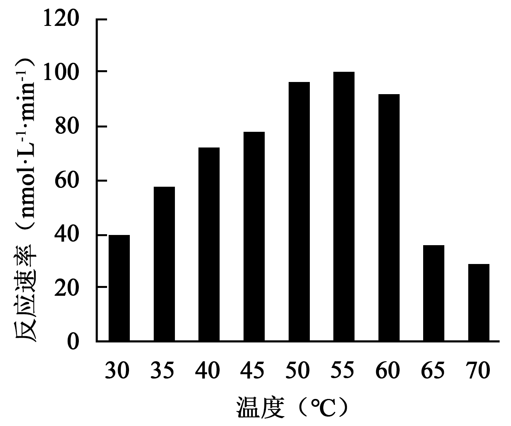
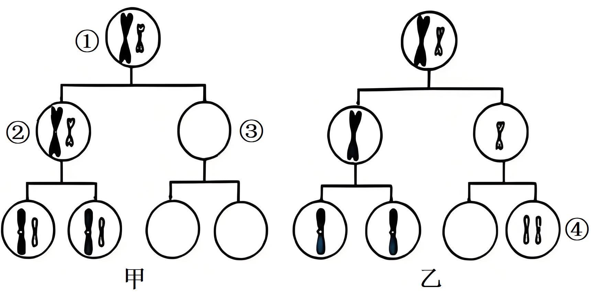
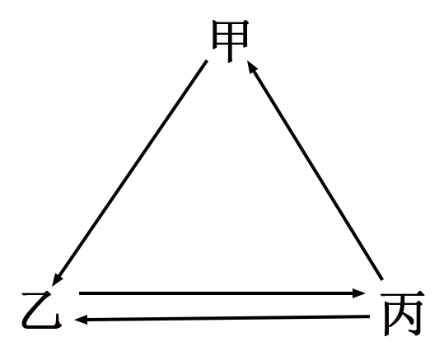
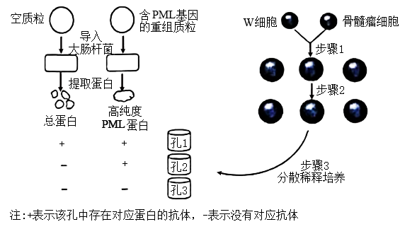
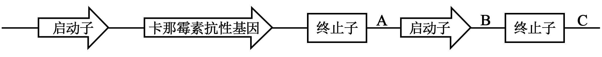
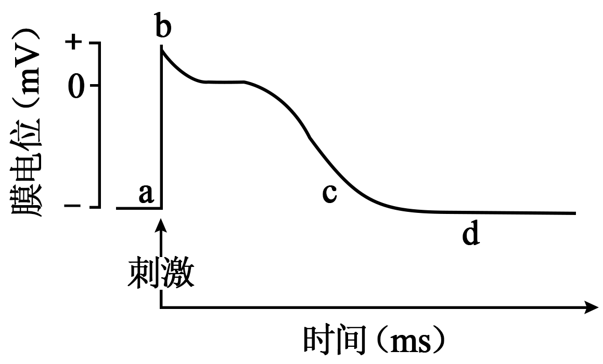

**2025年贵州省普通高中学业水平选择性考试生物学**

**注意事项：**

**1．答卷前，考生务必将自己的姓名、准考证号填写在答题卡上。**

**2．回答选择题时，选出每小题答案后，用28铅笔把答题卡上对应题目的答案标号涂黑，如需改动，用橡皮擦干净后，再选涂其他答案标号。回答非选择题时，将答案写在答题卡上。答案写在本试卷上无效。**

**3．考试结束后，将本试卷和答题卡一并交回。**

**一、选择题：本题共16小题，每小题3分，共48分。在每小题给出的四个选项中，只有一项符合题目要求。**

1\. 2025年我国将健康体重管理行动纳入健康中国行动。科学管理体重需注意合理膳食、适量运动等。下列叙述错误的是（　　）

A. 糖类可在体内转化为脂肪，长期糖摄入超标可能导致肥胖

B. 食物中搭配奶制品和大豆制品等，可补充人体的必需氨基酸

C. 纤维素难以被人体消化吸收，科学减重期间应减少膳食纤维的摄入

D. 无机盐对维持人体细胞渗透压有重要作用，大量出汗需适量补充水和无机盐

【答案】C

【解析】

【详解】A、糖类在人体内可转化为脂肪储存，长期过量摄入糖会导致脂肪堆积，引发肥胖，A正确；

B、奶制品和大豆制品分别含动物蛋白和植物蛋白，搭配食用可提供全部必需氨基酸（如大豆中的赖氨酸补充谷物蛋白的不足），B正确；

C、纤维素虽无法被人体消化，但能促进肠道蠕动，增加饱腹感，减少热量摄入，科学减重期间应适当摄入而非减少，C错误；

D、无机盐（如Na+、K+）维持细胞渗透压，大量出汗导致水分和无机盐流失，需及时补充以维持内环境稳态，D正确。

故选C

2\. 科研人员筛选得到某种可参与降解塑料的酶，并探究了温度对该酶催化反应速率的影响，实验结果如下图所示。下列叙述错误的是（　　）

A. 该实验中，酶的用量、pH、处理时间和初始底物浓度相同且适宜

B. 该实验中，温度高于60℃后酶变性导致反应速率下降

C. 该实验条件下，底物充足时增加酶的用量对反应速率无影响

D. 进一步探究该酶最适温度时，宜在50~60℃之间设置更小温度梯度

【答案】C

【解析】

【详解】A、探究温度对该酶催化反应速率的影响应遵循单一变量原则，酶的用量、pH、处理时间和初始底物浓度都是无关变量，无关变量相同且适宜，A正确；

B、酶在高温条件下会变性失活，从图中可以看出，温度高于60℃后，反应速率下降，是因为高温使酶的空间结构遭到破坏，酶发生变性，B正确；

C、在底物充足的情况下，酶促反应速率与酶的浓度呈正相关，增加酶的用量会使反应速率加快，C错误；

D、由图可知，该酶的最适温度在50~60℃之间，所以进一步探究该酶最适温度时，宜在50~60℃之间设置更小温度梯度，D正确。

故选C。

3\. R848分子可抑制X精子（含X染色体）中葡萄糖生成丙酮酸的过程和线粒体活性。哺乳动物育种时可用R848筛选精子类型控制雌雄比例。下列叙述错误的是（　　）

A. R848能影响X精子的无氧呼吸

B. R848会导致X精子ATP生成量减少

C. R848不会影响有氧呼吸的O2消耗量

D. R848可通过改变X精子的运动能力达到筛选目的

【答案】C

【解析】

【详解】A、葡萄糖生成丙酮酸是糖酵解阶段，为无氧呼吸和有氧呼吸的共同过程。R848抑制此过程，直接影响无氧呼吸，A正确；

B、糖酵解和线粒体活性被抑制，导致有氧呼吸和无氧呼吸的ATP生成均减少，B正确；

C、线粒体活性被抑制会阻碍有氧呼吸第三阶段（电子传递链），减少O₂的消耗量，因此R848会影响O₂消耗量，C错误；

D、X精子因ATP生成减少导致运动能力下降，可通过此差异筛选精子类型，D正确。

故选C。

4\. 正常情况下，有效磷浓度低于植物根细胞内的磷浓度，某些解磷真菌能分泌酸性酶将土壤中的有机固态磷转化为有效磷，利于植物吸收。植物吸收的磷主要储存于液泡中，缺磷时液泡中的磷可进入细胞质基质。下列叙述错误的是（　　）

A. 正常情况下植物根细胞吸收有效磷需要消耗能量

B. 无机磷从液泡进入细胞质基质需要蛋白质参与

C. 植物吸收的磷可参与构成细胞的生物膜系统

D. 解磷真菌分泌酸性磷酸酶的过程使细胞膜面积减少

【答案】D

【解析】

【详解】A、正常情况下，有效磷浓度低于根细胞内，吸收方式为逆浓度梯度的主动运输，需载体和能量，A正确；

B、据题干信息可知，无机磷从液泡（高浓度）到细胞质基质（低浓度）为协助扩散，需转运蛋白参与，B正确；

C、磷是磷脂、核酸等的组成元素，生物膜含磷脂，故植物吸收的磷可参与构成生物膜系统，C正确；

D、解磷真菌分泌酸性磷酸酶的方式为胞吐，胞吐通过囊泡与细胞膜融合释放物质，此过程会使细胞膜面积暂时增加，而非减少，D错误。

故选D。

5\. 下图为核酸的部分结构及遗传信息传递过程的示意图。下列叙述正确的是（　　）

A. 图中箭头所指碳原子上连接的基团是-OH

B. 甲链中相邻两个五碳糖通过磷酸二酯键连接

C. 若图中序列编码一个氨基酸，则其密码子为UAC

D. 遗传信息可从甲链流向乙链，但不能从乙链流向甲链

【答案】B

【解析】

【详解】A、图中含有尿嘧啶和胸腺嘧啶，应该代表的是转录（或逆转录）过程，图中箭头所指碳原子为脱氧核糖的2号碳原子，其上连接的基团是-H，A错误；

B、甲链中相邻两个五碳糖通过磷酸二酯键连接，即核酸中连接两个核苷酸的碱基是磷酸二酯键，B正确；

C、若图中序列编码一个氨基酸，即图示过程为转录过程，则其密码子为5’-CAU-3’，因为密码子读取的方向是5’→3’，C错误；

D、遗传信息通过转录过程从甲链流向乙链，还可通过逆转录过程从乙链流向甲链，D错误。

故选B。

6\. 研究发现，椪柑中CrMER3基因编码区单碱基T缺失，突变为CrMER3a基因。该突变基因转录的mRNA上终止密码子提前出现，无法编码功能性CrMER3蛋白，导致无法形成正常四分体，表现为果实无子。下列叙述错误的是（　　）

A. CrMER3a基因编码的多肽比CrMER3基因编码的短

B. CrMER3蛋白发挥作用的时期是减数分裂Ⅰ前期

C. CrMER3基因突变为CrMER3a基因是人工选择的结果

D. 在生产实践中宜选用无性繁殖的方式培育无子椪柑

【答案】C

【解析】

【详解】A、CrMER3a基因因单碱基缺失导致终止密码子提前，翻译出的多肽链长度缩短，A正确；

B、CrMER3蛋白参与四分体形成，而四分体出现在减数分裂Ⅰ前期，B正确；

C、基因突变是自发或诱变的结果，人工选择是对变异的筛选，而非直接导致突变，C错误；

D、无子性状因减数分裂异常无法形成正常配子，无性繁殖可保留该性状，D正确；

故选C。

7\. 非整体倍现象的出现通常是配子形成时个别染色体分离异常造成的。下图为人体精子形成时性染色体异常的示意图（不考虑其他突变及染色体互换）。下列叙述正确的是（　　）

A. 人体中细胞①和②的染色体数相同

B. 图甲细胞③中染色体组成类型有223种可能

C. 图乙细胞④中所示染色体为同源染色体

D. 产生XYY个体的异常配子来源于图乙途径

【答案】D

【解析】

【详解】A、细胞①为精原细胞，染色体数为46条；细胞②为次级精母细胞，发生了减数分裂，所以人体中细胞①和②的染色体数不相同，A错误；

B、图甲中，细胞①（初级精母细胞）在减数第一次分裂时，性染色体没有分离（X和Y不分离），且不考虑其他突变及染色体互换，细胞③为次级精母细胞，其染色体组成类型为222种可能（不含X和Y），B错误；

C、图乙中细胞④是减数第二次分裂产生的精细胞，减数第二次分裂时同源染色体已经分离，所以细胞④中所示染色体为非同源染色体，C错误；

D、产生XYY个体的异常配子是含有YY的精子，这种情况是由于减数第二次分裂时，Y染色体的着丝粒分裂后，两条Y染色体没有分离，对应图乙途径，D正确。

故选D。

8\. 肾脏通过肾小球与肾小囊之间的滤过膜形成原尿，科研人员以健康大鼠为实验对象，将非甾体抗炎药和药物A分别溶解于生理盐水进行相关实验，结果如下。下列叙述错误的是（　　）

|     |           |         |         |         |
|:--- |:--------- |:------- |:------- |:------- |
| 分组  | 处理①       | 尿液中蛋白含量 | 处理②     | 尿液中蛋白含量 |
| 甲   | 生理盐水      | 微量      | 生理盐水    | 微量      |
| 乙   | 高浓度非甾体抗炎药 | 大量      | 生理盐水    | 大量      |
| 丙   | 高浓度非甾体抗炎药 | 大量      | 适宜浓度药物A | 少量      |

注：处理①、处理②表示灌胃给药（灌胃量相同）先后顺序，且间隔适宜时间

A. 设置甲组可以排除生理盐水对实验的干扰

B 乙组大鼠血浆渗透压降低可引起组织液减少

C. 滥用非甾体抗炎药可能导致肾脏滤过膜损伤

D. 适宜浓度的药物A具有降尿蛋白的作用

【答案】B

【解析】

【分析】根据实验的目的、单一变量原则和对照性原则，该实验的自变量为有无药物A，因变量为尿液中的蛋白含量，甲组为空白对照组，乙组为模型对照组，丙组为实验组。

【详解】A、甲组两次处理均使用生理盐水，尿液蛋白含量始终微量，说明生理盐水本身不影响实验结果，因此设置甲组可以排除生理盐水对实验的干扰，A正确；

B、乙组处理①后尿液蛋白大量，表明肾小球滤过膜受损，血浆蛋白流失导致血浆渗透压下降，此时水分会从血浆进入组织液，导致组织液增多而非减少，B错误；

C、乙组使用高浓度非甾体抗炎药后出现大量蛋白尿，说明该药物可能破坏滤过膜结构，滥用会导致肾脏损伤，C正确；

D、丙组处理②使用药物A后尿液中蛋白含量减少，与乙组对比可知药物A能缓解滤过膜损伤，降低尿蛋白，D正确。

故选B。

9\. 女性下丘脑促性腺激素释放激素（GnRH）神经元发育成熟，开始释放GnRH，进而影响卵巢雌激素和孕激素的释放，形成规律性的月经周期。下列叙述错误的是（　　）

A. GnRH与卵巢上GnRH受体结合，促进雌激素和孕激素的分泌

B. 若GnRH神经元过早成熟，可导致女性首次月经提前出现

C. 异常紧张可能影响月经周期，说明月经周期受高级中枢的调节

D. 卵巢分泌的雌激素和孕激素对下丘脑分泌GnRH有影响

【答案】A

【解析】

【详解】A、GnRH由下丘脑分泌，其靶器官是垂体而非卵巢。GnRH通过促进垂体释放促性腺激素（FSH和LH），间接调控卵巢分泌雌激素和孕激素。卵巢细胞表面无GnRH受体，A错误；

B、GnRH神经元成熟是月经周期启动的前提。若GnRH神经元过早成熟，GnRH提前释放会加速性激素分泌，导致首次月经提前，B正确；

C、异常紧张等情绪通过大脑皮层（高级中枢）影响下丘脑功能，干扰激素分泌和月经周期，体现神经-体液调节，C正确；

D、雌激素和孕激素可通过负反馈调节抑制下丘脑分泌GnRH（或正反馈促进，依月经周期阶段而定），D正确。

故选A。

10\. 抗蛇毒血清常用已免疫的马制备，对毒蛇咬伤病人的治疗具有不可替代的临床价值，但注射后可能引起部分病人皮肤潮红、呼吸困难等，严重者可致过敏性休克。下列叙述错误的是（　　）

A. 给病人注射抗蛇毒血清使B细胞分化并产生针对蛇毒的特异性抗体

B. 抗蛇毒血清引起病人出现皮肤潮红是机体排除外来异物的免疫防御

C. 注射后出现呼吸困难的病人应停用抗蛇毒血清并适当使用抗组胺药物

D. 上述症状的出现与否和严重程度存在着明显的遗传倾向以及个体差异

【答案】A

【解析】

【详解】A、抗蛇毒血清中含有现成的抗体，可直接中和蛇毒，无需患者自身B细胞分化为浆细胞并产生抗体。此过程属于被动免疫，而非主动免疫，因此A错误；

B、过敏反应属于免疫系统的异常应答，但仍属于免疫防御功能的范畴。皮肤潮红是过敏反应的表现，B正确；

C、过敏反应中组胺释放导致症状，抗组胺药物可缓解症状，因此停用血清并使用抗组胺药物是合理措施，C正确；

D、过敏反应与遗传因素相关，存在个体差异和遗传倾向，D正确。

故选A。

11\. 红酸汤是贵州传统特色发酵食品。研究人员利用乳杆菌、双歧杆菌和假丝酵母菌共同接种发酵，以优化生产工艺。下图为发酵120h内三种微生物种群数量变化情况。下列叙述正确的是（　　）

A. 发酵48h时，双歧杆菌和乳杆菌的环境容纳量相同

B. 发酵48h后，乳杆菌的竞争力强于双歧杆菌和假丝酵母菌

C. 发酵48h时，假丝酵母菌种群数量的增长速率达到最大

D. 发酵48h后，pH下降不影响乳杆菌种群数量的增加

【答案】B

【解析】

【详解】A、环境容纳量（K值）是指种群在环境中能达到的最大数量。从图中看，发酵48h时，双歧杆菌和乳杆菌的数量虽然有交叉，但它们的K值（曲线最终稳定的数值）并不相同，A错误；

B、48h后，乳杆菌数量继续增加，而双歧杆菌和酿酒酵母数量下降，说明乳杆菌在竞争中占据优势，B正确；

C、增长速率最大通常出现在种群数量达到K/2时。从图中看，假丝酵母菌在48h时种群数量不是K/2，此时增长速率已下降，并非最大，C错误；

D、48h后，乳杆菌持续产乳酸会导致环境 pH 不断下降。虽乳杆菌耐酸，但pH过低仍会抑制其代谢活动，导致其增长速率放缓，因此，pH 下降会影响乳杆菌种群数量的增加，D错误。

故选B。

12\. 乌蒙山区的百里杜鹃林被誉为“地球上最美的彩带”，分布有40多种乔木型和灌木型杜鹃。下列叙述正确的是（　　）

A. 多种多样的杜鹃构成百里杜鹃林群落

B. 百里杜鹃林群落的分层结构主要由温度决定

C. 百里杜鹃林中乔木型杜鹃终会取代灌木型杜鹃

D. 百里杜鹃林生物多样性的间接价值大于直接价值

【答案】D

【解析】

【详解】A、群落是一定区域内所有生物的集合，多种多样的杜鹃不能构成群落，A错误；

B、植物群落的垂直分层结构​如乔木层、灌木层、草本层等，主要受光照强度的影响。高大的乔木占据上层，吸收大部分阳光，下层的灌木和草本植物则适应较弱的光照条件，B错误；

C、在自然生态系统中，不同类型的植物，如乔木型与灌木型杜鹃，往往占据不同的生态位，它们通过资源利用的分化实现共存。乔木型杜鹃虽然长得高大，但并不会完全取代灌木型杜鹃，因为后者适应于较低的光照环境，有其自身的生存策略和生态功能，C错误；

D、生物多样性的间接价值（如调节气候、保持水土等）通常远大于直接价值（如观赏、药用等），D正确。

故选D。

13\. 模型建构是生物学研究中的常用方法。下列过程或关系符合下图所示模型的是（　　）

A. 光合作用的暗反应过程

B. 生物圈中的碳循环过程

C. 组织液、血浆和淋巴液的物质交换关系

D. 细胞膜、内质网膜和核膜成分的转换关系

【答案】C

【解析】

【详解】A、光合作用的暗反应过程中，CO2的固定和C3的还原等过程是单向的酶促反应，不存在图示中三者间的双向流动关系，A错误；

B、生物圈中的碳循环过程，涉及生产者、消费者、分解者以及无机环境之间的碳元素循环，而题干中的图只有三者的关系，不符合图示模型，B错误；

C、组织液、血浆和淋巴液的物质交换关系是：血浆和组织液之间可以双向渗透，组织液可以单向渗透到淋巴液，淋巴液通过淋巴循环回到血浆，与图示三者间的关系相符，C正确；

D、细胞膜、内质网膜和核膜成分的转换关系是通过囊泡等进行的，是单向的膜成分转移（如内质网膜→高尔基体膜→细胞膜等），不存在图示中的双向关系，D错误。

故选C。

14\. 结肠癌是一种消化道恶性肿瘤，临床上常用药物5-氟尿嘧啶（抑制DNA合成）治疗。研究发现，结肠癌患者肠道内多种细菌数量发生显著变化，部分细菌产生具有致癌的毒素，与肿瘤发生密切相关。下列叙述错误的是（　　）

A. 肠道内细菌分泌毒素的过程需高尔基体和溶酶体参与

B. 人体结肠癌的发生与原癌基因和抑癌基因的突变有关

C. 取可疑癌变组织进行镜检观察细胞的形态可初步诊断

D. 利用5-氟尿嘧啶治疗结肠癌可将癌细胞阻断在分裂间期

【答案】A

【解析】

【详解】A、肠道内的细菌属于原核生物，其细胞结构中不含高尔基体和溶酶体，分泌毒素的过程依赖细胞膜和细胞质基质中的相关酶，无需高尔基体和溶酶体参与，A错误；

B、结肠癌发生是原癌基因（调控细胞周期）和抑癌基因（阻止细胞异常增殖）发生突变导致的，B正确；

C、癌细胞的形态结构会发生显著改变（如细胞变圆、核增大等），通过显微镜观察可疑组织的细胞形态可初步判断是否癌变，C正确；

D、5-氟尿嘧啶通过抑制DNA合成阻止癌细胞增殖，而DNA复制发生在分裂间期（S期），因此该药物可将癌细胞阻断在分裂间期，D正确。

故选A。

15\. 金龟子绿僵菌（Ma）是一种昆虫病原真菌，可以侵染某些农林害虫。Ma寄生时其孢子（单细胞后代）萌发后侵入昆虫体内大量增殖并产生毒素，导致寄主僵化、死亡。下列叙述错误是（　　）

A. 可利用Ma开发成微生物杀虫剂

B. 为分离Ma可从研磨的僵虫组织中取样

C. 稀释涂布平板法可用于分离样品中的Ma

D. 接种培养Ma时使用的器具需消毒

【答案】D

【解析】

【详解】A、金龟子绿僵菌（Ma）作为昆虫病原真菌，可通过寄生导致害虫死亡，符合微生物杀虫剂的特点，可用于生物防治，A正确；

B、僵化死亡的昆虫体内含有大量Ma菌体，因此从研磨的僵虫组织取样是分离Ma的合理方法，B正确；

C、稀释涂布平板法可通过梯度稀释和菌落形成来分离纯化微生物，适用于分离样品中的Ma，C正确；

D、微生物培养中，接种环等直接接触菌种的器具需严格灭菌（如灼烧灭菌），而非仅消毒，消毒无法彻底杀灭微生物的芽孢或孢子，D错误。

故选D。

16\. 下图为PML蛋白单克隆抗体的制备过程。下列叙述正确的是（　　）

A. 应使用总蛋白进行多次免疫且每次免疫间隔适宜时间

B. W细胞是先提取B淋巴细胞再用PML蛋白免疫而获得

C. 步骤2的目的是去除不能产生特异性抗体的细胞

D. 应选择孔2中的细胞进行后续处理以制备单克隆抗体

【答案】D

【解析】

【详解】A、PML蛋白单克隆抗体的制备过程，应用PML蛋白作为抗原间隔多次免疫小鼠，目的是获得更多的能产生PML蛋白抗体的B淋巴细胞，A错误；

B、W细胞是先用PML蛋白免疫而获得相应的B淋巴细胞，后通过筛选提取能产生单一抗体的B淋巴细胞，B错误；

C、根据题意可知步骤1是诱导W细胞与骨髓瘤细胞融合，步骤2是利用选择培养基筛选出杂交瘤细胞，C错误；

D、根据电泳结果可知应选择孔2中的细胞进行后续处理以制备单克隆抗体，因为孔2中的细胞能特异性产生高密度PML蛋白，D正确。

故选D。

**二、非选择题：本题共5大题，共52分**

17\. 牡丹绿色系品种“豆绿”开花初期花瓣绿色逐渐加深，中后期逐渐褪绿转为淡粉色。叶绿素是影响该花呈色的主要色素，其合成与降解需多种酶参与。回答下列问题：

（1）开花初期花瓣绿色逐渐加深，影响这一过程的主要环境因素是\_\_\_\_\_\_，叶绿素分布在叶绿体的\_\_\_\_\_\_上，开花初期叶绿素使花呈现绿色的原因是\_\_\_\_\_\_。

（2）为研究不同时期花瓣中叶绿素含量变化，需在不同时间取样，并将样品低温保存，低温保存的目的\_\_\_\_\_\_。用于提取“豆绿”花瓣中叶绿素的试剂是\_\_\_\_\_\_。

（3）研究表明，PSNAC5蛋白通过调控叶绿素代谢相关基因的表达影响叶绿素含量。下图所示为“豆绿”开花初期PSNAC5基因沉默对花瓣中叶绿素含量的影响。据图推测，PSNAC5基因沉默后叶绿素含量变化的根本原因可能是\_\_\_\_\_\_。（答出2点）

【答案】（1） ①. 温度和光照 ②. 类囊体薄膜 ③. 叶绿素主要吸收红光和蓝紫光，几乎不吸收绿光，绿光被反射出来

（2） ①. 低温条件下，酶活性低，叶绿素不易被降解 ②. 无水乙醇

（3）PSNAC5基因沉默后促进了叶绿素合成相关基因的表达，抑制了与叶绿素分解相关基因的表达

【解析】

【分析】叶绿体中的色素包括叶绿素a(蓝绿色)、叶绿素b(黄绿色)、胡萝卜素(橙黄色)、叶黄素(黄色)。其中叶绿素主要吸收红光和蓝紫光，胡萝卜素主要吸收蓝紫光。在滤纸条上的分布从上到下依次为：胡萝卜素、叶黄素、叶绿素a、叶绿素b。

【小问1详解】

牡丹绿色系品种“豆绿”开花初期花瓣绿色逐渐加深，中后期逐渐褪绿转为淡粉色。叶绿素是影响该花呈色的主要色素，其合成与降解需多种酶参与，酶活性受温度的影响，此外叶绿素还会在光下分解，据此推测，开花初期花瓣绿色逐渐加深，影响这一过程的主要环境因素是温度和光照，叶绿素分布在叶绿体的类囊体薄膜上，开花初期叶绿素使花呈现绿色的原因是叶绿素主要吸收红光和蓝紫光，反射绿光，因此花瓣呈现绿色。

【小问2详解】

为研究不同时期花瓣中叶绿素含量变化，需在不同时间取样，并将样品低温保存，这是因为低温条件下，酶活性低，叶绿素不易被降解，因而便于叶绿素含量的检测。用于提取“豆绿”花瓣中叶绿素的试剂是无水乙醇，这是根据叶绿素能溶解到有机溶剂中设计的。

小问3详解】

研究表明，PSNAC5蛋白通过调控叶绿素代谢相关基因的表达影响叶绿素含量。题图所示为“豆绿”开花初期PSNAC5基因沉默对花瓣中叶绿素含量的影响。图中显示，PSNAC5基因沉默后叶绿素含量比对照组增多，据此推测，PSNAC5基因沉默后叶绿素含量变化的根本原因可能是PSNAC5基因沉默后促进了叶绿素合成相关基因的表达，抑制了与叶绿素分解相关基因的表达。

18\. 番茄细胞中线粒体形态与其自身功能密切相关，并影响番茄果实的成熟过程。研究者将决定蛋白质在细胞内定位的特定肽链“嫁接”到绿色荧光蛋白（GFP）上，控制GFP在番茄细胞内的分布，从而在显微镜下观察线粒体的形态变化。回答下列问题：

（1）根据蛋白质工程原理，一般不会直接拼接肽链，而是将两段肽链对应的\_\_\_\_\_\_拼接在一起完成“嫁接”，细胞色素c氧化酶Ⅳ（COXⅣ）参与有氧呼吸生成水的过程。COXⅣ的一段肽链序列X决定了COXⅣ在细胞内的分布，研究者选择将X与GFP拼接，理由是\_\_\_\_\_\_。

（2）拼接好的序列应插入下图中农杆菌T-DNA的\_\_\_\_\_\_（填下图字母）处。理由是\_\_\_\_\_\_。

（3）选择番茄幼嫩子叶进行离体培养，这些培养的器官、组织或细胞被称为\_\_\_\_\_\_。农杆菌侵染后有一定几率将目的基因整合到番茄细胞的\_\_\_\_\_\_中，番茄组织培养过程中，芽诱导期需在培养基中添加的植物激素是\_\_\_\_\_\_。

【答案】（1） ①. DNA序列 ②. COXⅣ位于线粒体内膜，它的肽链序列X能引导GFP 定位到线粒体，从而通过GFP来观察线粒体的形态变化

（2） ①. B ②. B位于启动子下游与终止子上游，目的基因插入B点才可能转录

（3） ①. 外植体 ②. 染色体DNA ③. 生长素和细胞分裂素

【解析】

【分析】核心思路：通过 “蛋白质工程” 思路，将决定蛋白质细胞内定位的特定肽链与绿色荧光蛋白（GFP）“嫁接”，利用 GFP 的荧光标记，在显微镜下观察线粒体形态变化。知识融合：蛋白质工程：需通过改造基因（DNA 片段）实现肽链 “嫁接”，利用特定肽链（如 COXⅣ 的肽链序列X）的细胞定位功能，引导 GFP 标记线粒体。基因工程：借助农杆菌转化法，将目的序列插入 Ti 质粒的T - DNA（可转移至植物细胞并整合到染色体 DNA 上）。植物组织培养：涉及外植体（离体的器官、组织或细胞）、目的基因整合位置（番茄细胞的染色体 DNA），以及诱导期所需的植物激素（生长素和细胞分裂素，调控细胞脱分化与再分化）。

【小问1详解】

根据蛋白质工程原理，一般不会直接拼接肽链，而是将两段肽链对应的DNA序列拼接在一起完成 “嫁接”（蛋白质工程是通过改造基因来改造蛋白质）。COXⅣ 的一段肽链序列X决定了 COXⅣ 在细胞内的分布，研究者选择将X与GFP拼接，理由COXⅣ位于线粒体内膜，它的肽链序列X能引导GFP 定位到线粒体，从而通过GFP的荧光来观察线粒体的形态变化（利用X的定位功能，使GFP标记线粒体）。

【小问2详解】

拼接好的序列应插入农杆菌 Ti - DNA 的B处。B位于启动子下游与终止子上游，目的基因插入B点才可能转录。

【小问3详解】

选择番茄幼嫩子叶进行离体培养，这些培养的器官、组织或细胞被称为外植体（外植体是植物组织培养中用于培养的离体器官、组织或细胞）。农杆菌侵染后有一定几率将目的基因整合到番茄细胞的染色体DNA中（农杆菌的 T - DNA 会整合到植物细胞的染色体 DNA 上）。番茄组织培养过程中，诱导期需在培养基中添加的植物激素是生长素和细胞分裂素（植物组织培养中，生长素和细胞分裂素的比例会影响细胞的脱分化和再分化过程，芽诱导期需要这两种激素来启动细胞的分裂和分化）。

19\. 喀斯特洞穴是一种相对封闭的特殊生态系统，洞穴内全年温度相对恒定，食物短缺。随着人类活动范围增大，喀斯特洞穴原生境被破坏难以恢复。因此，研究喀斯特洞穴生态系统的结构和功能具有重要意义。回答下列问题：

（1）研究喀斯特洞穴生态系统的结构，首先要调查该生态系统的\_\_\_\_\_\_，分析各物种之间的营养级关系，绘制食物网。研究发现，喀斯特洞穴生态系统有多条食物链，但第一营养级往往来自洞穴外，最可能的原因是\_\_\_\_\_\_。

（2）喀斯特洞穴内的昆虫能通过发达的触角感知危险并逃避敌害，说明信息传递在生态系统中的作用是\_\_\_\_\_\_。进一步研究发现，喀斯特洞穴生态系统的能量传递效率相对较高，从能量流动的角度分析，主要原因是\_\_\_\_\_\_。

（3）喀斯特洞穴是研究动物进化的理想场所。根据喀斯特洞穴的特点分析其在动物进化研究中的优势是\_\_\_\_\_\_。（答出2点即可）

【答案】（1） ①. 组成成分 ②. 洞穴内几乎无光照，绿色植物无法正常生长

（2） ①. 调节生物的种间关系，维持生态系统的平衡与稳定 ②. 洞穴内全年温度相对恒定，各营养级通过呼吸作用散失的能量少，流入下一营养级的能量多

（3）①封闭的环境减少了外来基因的干扰，使种群进化更独立，有利于研究生殖隔离的形成；②稳定的温度条件使自然选择方向相对一致，有利于研究适应性进化的机制；③食物短缺的环境增加了选择压力，有利于研究极端环境下的适应性进化机制

【解析】

【分析】1、生态系统中信息的类型（1）物理信息：生态系统中的光、声、颜色、温度、湿度、磁力等，通过物理过程传递的信息。（2）化学信息：生物在生命活动过程中，产生的一些可以传递信息的化学物质。（3）行为信息：是指某些动物通过某些特殊行为，在同种或异种生物间传递的某种信息。

2、信息传递在生态系统中的作用：（1）个体：生命活动的正常进行，离不开信息的传递。（2）种群：生物种群的繁衍，离不开信息的传递。（3）群落和生态系统：能调节生物的种间关系，以维持生态系统的稳定。

【小问1详解】

生态系统的结构包括生态系统的组成成分​（非生物的物质和能量、生产者、消费者、分解者）和营养结构​（食物链和食物网）。研究喀斯特洞穴生态系统的结构，首先要调查该生态系统的组成成分，分析各物种之间的营养级关系，绘制食物网。研究发现，喀斯特洞穴生态系统有多条食物链，但第一营养级往往来自洞穴外，最可能的原因是​​​洞穴内几乎无光照，绿色植物无法正常生长，因此第一营养级（生产者）通常依赖洞穴外输入的有机物质（如洞穴外流入的枯枝落叶、动物尸体等）或洞穴外进入的初级消费者（如蝙蝠粪便、洞穴外昆虫等）。​

【小问2详解】

喀斯特洞穴内的昆虫能通过发达的触角感知危险并逃避敌害，说明信息传递在生态系统中的作用是调节生物的种间关系，维持生态系统的平衡与稳定。进一步研究发现，喀斯特洞穴生态系统的能量传递效率相对较高，从能量流动的角度分析，主要原因是洞穴内全年温度相对恒定，各营养级通过呼吸作用散失的能量少，流入下一营养级的能量多。

【小问3详解】

喀斯特洞穴是研究动物进化的理想场所。根据喀斯特洞穴的特点分析其在动物进化研究中的优势是①封闭的环境减少了外来基因的干扰，使种群进化更独立，有利于研究生殖隔离的形成；②稳定的温度条件使自然选择方向相对一致，有利于研究适应性进化的机制；③食物短缺的环境增加了选择压力，有利于研究极端环境下的适应性进化机制。

20\. 心脏通过节律性的搏动（收缩和舒张）完成泵血功能，心脏每分钟搏动的次数称为心率。在正常生理范围内，心率的变动范围较大，如人的心率一般为60~100次/分。心率快慢主要受自主神经系统的调节。回答下列问题：

（1）自主神经系统由\_\_\_\_\_\_两部分组成，它们对心脏的调节作用\_\_\_\_\_\_（选填“相同”或“相反”）。

（2）心室肌细胞受刺激产生动作电位的过程如下图所示，a点膜内电位为负，原因是\_\_\_\_\_\_。受到足够强度刺激后，引起ab段电位变化的离子主要是\_\_\_\_\_\_，该离子的通道有静息、激活和失活三种功能状态。在bc段，无论心室肌受到多强刺激都不能引发新的动作电位，也不会发生新的收缩和舒张，此时该离子通道的状态是\_\_\_\_\_\_。

（3）为探究在一次心脏搏动中bc段持续的时长，现以蛙心为实验材料，写出实验思路。\_\_\_\_\_\_。

【答案】（1） ①. 交感神经和副交感神经 ②. 相反

（2） ①. 静息时细胞膜对 K⁺的通透性较大，K⁺外流 ②. Na⁺ ③. 失活

（3）①取活蛙，破坏其脑和脊髓后暴露心脏，用任氏液持续灌流以维持蛙心体外节律性搏动；②将蛙心与记录装置连接，记录正常搏动曲线，确定心室收缩的起始时间；③在一次心室收缩开始后，每隔一定时间给予一次阈上刺激，观察是否引发额外收缩；④重复实验 3~5 次，统计从心室收缩起始到第一次引发额外收缩的最短时间，即为 bc 段持续时长

【解析】

【分析】静息电位时，神经细胞膜对钾离子的通透性大，钾离子大量外流，形成内负外正的静息电位；受到刺激后，神经细胞膜的通透性发生改变，对钠离子的通透性增大，钠离子内流，形成内正外负的动作电位。兴奋部位和非兴奋部位形成电位差，产生局部电流。

【小问1详解】

交感神经兴奋时，会使心率加快、心肌收缩力增强；副交感神经（如迷走神经）兴奋时，会使心率减慢、心肌收缩力减弱。二者对心脏的调节作用相反，共同维持心率的稳定。

【小问2详解】

a点为静息电位，此时细胞膜对K⁺的通透性远大于其他离子，K⁺顺浓度梯度从膜内流向膜外，导致膜内正电荷流失，最终膜内电位低于膜外，表现为负电位。受到足够强度刺激后，细胞膜上的Na⁺通道迅速激活开放，Na⁺顺浓度梯度大量内流，使膜内电位快速由负变正，因此，引起ab段电位变化的离子主要是Na⁺。在bc段Na⁺通道已进入失活状态（无法被刺激再次激活），即使给予更强的刺激，也无法引发新的Na⁺内流和动作电位，因此不会发生新的收缩和舒张。

【小问3详解】

bc段是心室肌细胞的绝对不应期，此阶段细胞对任何强度的刺激均无反应；度过绝对不应期后，细胞可对刺激产生反应（引发额外收缩）。通过在心脏搏动的不同时刻给予阈上刺激（能引发正常动作电位的最小刺激强度），记录 “从心室收缩开始到第一次能引发额外收缩的时间”，即为bc段的持续时长。实验思路：（1）制备蛙心标本：取活蛙，破坏脑和脊髓后暴露心脏，剪开心包，用任氏液（维持蛙心活性的生理溶液）持续灌流蛙心，确保心脏在体外保持节律性搏动；（2）记录基础搏动：将蛙心与张力换能器（或记录装置）连接，记录蛙心正常的搏动曲线（明确心室收缩、舒张的时间节点，如以收缩起始点为计时零点）；（3）给予梯度时间刺激：在一次心室收缩（对应bc段起点）开始后，每隔一定时间给予一次阈上刺激（强度固定，需提前确定能引发额外收缩的最小刺激强度），观察每次刺激是否能在搏动曲线上引发 “额外收缩峰”；（4）确定绝对不应期时长：重复上述实验3~5次，统计 “从心室收缩起始到第一次出现额外收缩峰的最短时间”，该时间即为 bc 段（绝对不应期）的持续时长。

21\. 某品种鸡2N=78的胫色主要由Z染色体上的等位基因A/a和20号染色体上的等位基因B/b控制。胫色在a基因纯合时都表现为黑色，基因A和B同时存在时也表现为黑色，含A且b纯合时表现为黄色。回答下列问题：

（1）该种鸡的一个染色体组含有的染色体数是\_\_\_\_\_\_，性染色体组成为异型的性别是\_\_\_\_\_\_。

（2）仅考虑A/a和B/b基因，黄色胫雄鸡的基因型为\_\_\_\_\_\_。为了在雏鸡时根据胫色选育雌鸡，可用基因型为\_\_\_\_\_\_的亲本进行杂交，保留子代中胫色表型为\_\_\_\_\_\_的个体。

（3）进一步研究发现，胫色还受24号染色体上的等位基因E/e影响。E基因存在时，会使黑色变浅为青色，黄色变浅为白色，而e纯合时，对色没有影响。现用基因型为与的亲本交配，子一代胫色表型为\_\_\_\_\_\_，子一代雌雄个体互相交配，子二代雌鸡中胫色表型及比例为\_\_\_\_\_\_。

【答案】（1） ①. 39 ②. 雌性

（2） ①. bbZAZA 或 bbZAZa ②. bbZAW和bbZaZa ③. 黑色

（3） ①. 青色 ②. 青色：黑色：白色：黄色=21:7:3:1

【解析】

【分析】鸡的性别决定为ZW型，雌性性染色体组成为ZW，雄性为ZZ；A、a位于Z染色体上，B、b位于20号染色体上，E、e位于24号染色体上，三对基因遵循基因的自由组合定律。

【小问1详解】

染色体组是指细胞中形态和功能各不相同、携带着控制生物生长发育全部遗传信息的一组非同源染色体，已知该鸡2N=78（二倍体染色体数），因此一个染色体组含有的染色体数为 78÷2=39；鸡的性别决定为ZW型，雌性性染色体组成为ZW，雄性为ZZ，性染色体组成为异型的性别是为雌性。

【小问2详解】

据题干信息，含A且b纯合时表现为黄色，黄色胫雄鸡的基因型为bbZAZA 或 bbZAZa；为了在雏鸡时根据胫色选育雌鸡，可用基因型为bbZAW和bbZaZa的亲本进行杂交，后代个体为bb ZAZa（黄色雄鸡）、bbZaW（黑色雌鸡），保留子代中胫色表型为黑色个体即为雌鸡。

【小问3详解】

与亲本杂交，子一代为BbEeZAZa和BbEeZAW，由题意得三对基因分别位于三对同源染色体上遵循基因的自由组合定律，可以先分别考虑每一对基因，子一代雌雄个体互相交配后，子二代B-：bb=3:1、E-:ee=3:1、子二代雌鸡为ZAW：ZaW=1:1，根据胫色在a基因纯合时都表现为黑色，基因A和B同时存在时也表现为黑色，含A且b纯合时表现为黄色，（3B-：1bb）×（1ZAW：1ZaW）=3B-ZA黑色：3B-ZaW黑色：1bbZaW黑色：1bbZAW黄色=7黑色:1黄色；又E基因存在时，会使黑色变浅为青色，黄色变浅为白色，而e纯合时，对色没有影响，（E-:ee=3:1）×（7黑色:1黄色）=青色：黑色：白色：黄色=21:7:3:1。
