**2021年上海市普通高中学业水平等级性考试**

**生物试卷**

**考生注意：**

**1.本试卷满分100分，考试时间60分钟。**

**2.本考试设试卷和答题纸两部分，试卷包括试题与答题要求；所有答题必须涂（选择题）或写（综合题）在答题纸上；做在试卷上一律不得分。**

**3.答题前，考生务必在答题纸上用钢笔或圆珠笔清楚填写姓名、准考证号，并将核对后的条形码贴在指定位置上。**

**4.答题纸与试卷在试题编号上是一一对应的，答题时应特别注意，不能错位。**

**一、选择题（共40分，每小题2分，每小题只有一个正确答案）**

1.小萌清晰观察到蚕豆叶下表皮细胞如图1，想进一步观察视野中央的细胞，他需要进行的

第一步操作是（ ）

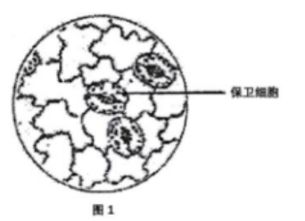

A.转动转换器 B.调节细调节器

C.调节粗调节器 D.移动玻片

2.鸭子毛色有黑色、白色等多种，这体现了（ ）

A.生态多样性 B.物种多样性

C.遗传多样性 D.生境多样性

3.据下图分析胆固醇转化为胆固醇酯的过程的反应类型为（ ）

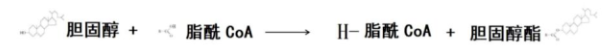

A.合成反应 B.水解反应 C.氧化分解反应 D.转氨基作用

4.“温故知新”的是一种优良的学习品质，关于学习反射的特点正确的是（ ）

①非条件反射 ②条件反射 ③会消退 ④不会消退

A.①③ B.①④ C.②③ D.②④

5.光合作用过程中活跃化学能转化为稳定化学能时，还能发生的过程有（ ）

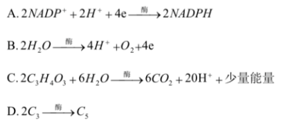

6.据图在“探究细胞外界溶液浓度与质壁分离程度关系”的实验中，滴加清水后出现的现象有（ ）

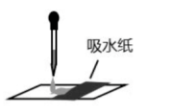

A.液泡变大 B.原生质层收缩 C.细胞皱缩 D.液泡颜色加深

7.为了抗癌通过一些手段给某种免疫细胞增加特异性受体来更好地杀死癌细胞，选的细胞

最可能是（ ）

A.巨噬细胞 B.T淋巴细胞 C.浆细胞 D.B淋巴细胞

8.游客给猴子投喂不含脂肪的香蕉后，导致猴子肥胖，据图分析原因是（ ）

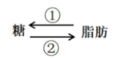

A.①过程增强 B.②过程增强 C.①过程减弱 D.②过程减弱

9.水稻种子萌发时所需能量主要来自（ ）

A.纤维素 B.淀粉 C.糖原 D.维生素

10.狂犬病疫苗的接种需在一定时期内间隔注射三次，其目的是（ ）

A.使机体积累更多数量的疫苗 B.延长病毒潜伏期

C.使机体产生更多数量的记忆细胞 D.缩短病毒潜伏期

11.马拉松运动后大量饮用清水会出现的现象是（ ）

A.细胞内液渗透压降低 B.细胞外液渗透压降低

C.细胞内液含量降低 D.细胞外液含量降低

12.诺如病毒危害性极大，经检测病毒的遗传物质中含有核糖，该病毒含有的基因有（ ）

①衣壳蛋白基因 ②RNA复制酶基因

③核糖体蛋白基因 ④特异性入侵宿主细胞的表面蛋白基因

A.①②③ B.②③④ C.①②④ D.①③④

13.图为初级精母细胞的染色体组成，则该细胞分裂形成的次级精母细胞的染色体组成可能

为（ ）

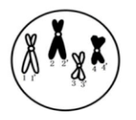

A.1、1'和2、2’ B.1、2和3、4

C.3、3’和4、4’ D.2、2’和4、4’

14.下列图示过程能正确表示单链RNA逆转录过程的是（ ）

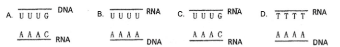

15.颤藻和水绵都是绿色丝状水生生物，将它们放在同一块载玻片上染色后用光学显微镜的

高倍镜观察，确认丝状物是水绵的依据是（ ）

A.叶绿体 B.细胞膜 C.细胞壁 D.核糖体

16.流浪蚁是一种生活在热带的极具危险的入侵物种，由于商贸活动入侵到温带，形成入侵

物种，在温带形成的种群基因库变化趋势为（ ）

A.持续增大 B.持续减小 C.先减小后稳定 D.先增大后稳定

17.原产欧洲南部喷瓜的性别不是由性染色体决定，而是由3个复等位基因aD\>a+\>ad决定

的，其中，aD决定雄性、a+决定两性、ad决定雌性植株，雌花亲本接受哪种基因型个体的花

粉子代雌花所占比例最大（ ）

A.aDaD B.aD a+ C.aDad D .adad

18.在a、b、c、d条件下，测得酵母菌呼吸时CO2和O2体积变化的相对值如表。若底物是葡萄糖，下列关于d条件的叙述中正确是（ ）

|                   |     |     |     |     |
| ----------------- | --- | --- | --- | --- |
| 条件                | a   | b   | c   | d   |
| CO2释放量 | 7   | 7   | 7   | 10  |
| O2吸收量  | 7   | 7   | 7   | 7   |

A.有氧呼吸加快 B.无氧呼吸加快 C.有氧呼吸减慢 D.无氧呼吸减慢

19.d为隐性基因，决定螺壳左旋，D为显性基因，决定螺壳右旋，两只田螺，母本为dd，

父本为DD，子代表现型受母本基因型控制，已知F1代皆为左旋，F1自交后代的表现型比例

为（ ）

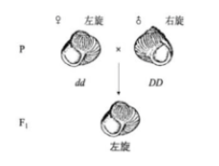

A.全左旋 B.右旋：左旋=3：1 C.全右旋 D.右旋：左旋=1：3

20.小麦密植容易出现黄叶，通过合理密植后提高光合作用速率提高产量，合理密植对光合

作用的影响是（ ）

A.光反应速率提高 B.暗反应速率提高

C.光反应和暗反应速率都提高 D.光反应和暗反应速率都不提高

**二、综合题（60分）**

**（一）香蕉枯萎病的微生物防治（12分）**

香蕉枯萎病对香蕉种植业极具破坏性，由土壤中的尖孢镰刀菌感染香蕉植株所导致。现

有菌株S可抑制尖孢镰刀菌，某研究小组拟利用微生物协同作用，优化枯萎病生物防治方

案，部分过程如下：

**【阶段一】将菌株S施于香蕉种植园的土壤中，并分析土壤微生物数量变化情况。**

21.（2分）若要筛选出土壤中与菌株S有协同作用的有益菌，应选择施加菌株S后数量

变化趋势是 （下降/上升/不变）的有益菌。

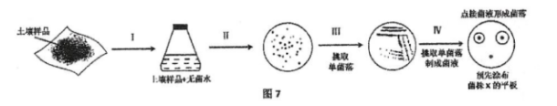

**【阶段二】筛选与菌株S有协同作用的有益菌。过程如图7.其接菌液并培养后如表2。**

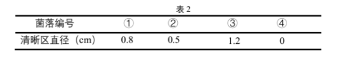

22.（5分）Ⅰ~Ⅳ环节中，需无菌操作的是 ；在第 环节分离土壤中的各种菌；环节Ⅳ中需先涂布的菌株X是 。

23.（1分）为达到阶段二的目的，据表2应优先选择的是菌落 。

**【阶段三】利用筛选到的有益菌P.分析菌株之间的相互关系，形成表3中所列方案。**

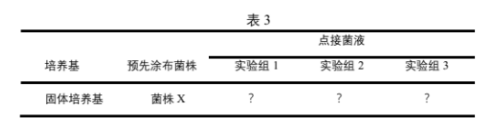

24.（4分）各实验组上接的菌液中应含有的菌株分别是：实验组1 ，实验组2 ，

实验组3 ，其中能说明菌株P对菌株S的作用的实验组是 。

**（二）人类遗传病（12分）**

人类细胞内Cas-8酶能够切割RIPK1蛋白（图8），正常情况下，未被切割的和被切割的

RIPK1蛋白比例约为6:4。RIPKI基因突变后.编码的蛋白不能为Cas-8酶切割，其会引发反复发作的发烧和炎症，并损害机体重要的器官，即CRlA综合征，该突变基因为显性，图9为该病的一个家族系谱图，Ⅱ3和Ⅲ-2均携带了RIPKl突变基因。

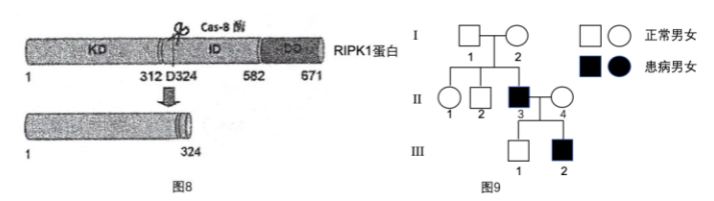

25.（2分）RIPK1基因位于 （常/X）染色体上。

26.（2分）图9所示家族中，可能存在RIPKl突变基因传递路径的是 （多选）。

A.从Ⅰ-1的体细胞传递到Ⅱ-3的次级精母细胞

B.从Ⅰ-2的卵母细胞传递到Ⅱ-3的胚胎细胞

C.从Ⅰ-1的次级精母细胞传递到Ⅱ-3的体细胞

D.从Ⅰ-2的第一极体传递到Ⅱ-3的次级精母细胞

27.（2分）Ⅱ-3与Ⅱ-4再生一个孩子，Ⅱ-3将蛋白突变基因传递给孩子的概率是 。

28.（2分）根据CRIA综合征的致病机理分析，Ⅱ-3体内未被切割的RIPK1蛋白：被切

割的RIPKl蛋白比例接近 。

A.8: 2 B.6: 4 C.5: 5 D.0: 10

29.（4分）若用（A/a）表示RIPK1基因，（B/b）表示Cas-8酶基因，Ⅱ-1与某健康男性

婚配，其儿子患CRIA综合征，在不考虑基因突变和连锁的情况下，推测其儿子的基因

型可能是 ；Ⅱ-1号的基因型可能是 。

**（四）植物生理（12分）**

豌豆植株的芽对不同浓度生长素的响应不同（表4）。现有一株具有顶端优势的豌豆植株，生长于适宜条件下（图11）。

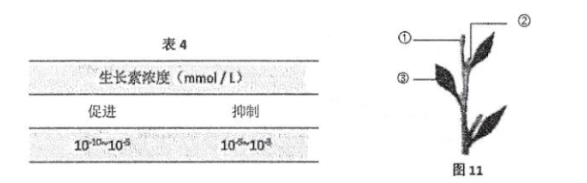

35.（2分）在豌豆植株中，对①生长素浓度的推测正确的是

A.可能小于10-5 mol/L B.可能大于10-5 mol/L

C.可能小于10-10 mol/L D.可能大于10-3 mol/L

36.（3分）分析同一时刻，豌豆1、2处细胞的状态，下列正确的是 （多选）

A.①处的细胞分裂比②处活跃 B.①处的细胞分化能力高于②处

C.①、②均发生蛋白质合成 D.①的纤维素合成比②活跃

37.（2分）关于①处发育过程中所需的能量和物质，下列正确的是 （多选）

A.少部分能量来自于①处细胞三羧酸循环

B.物质中的Mg2+主要来自于②处细胞中被分解的化合物

C.部分能量来自于③处细胞的光反应

D.物质中的碳原子可能来自③细胞中的CO2

研究发现一种植物激素SLs，由根细胞合成，可抑制侧芽处的生长素向侧芽外运输。生长素促进SLs的合成。

38.（2分）若去除该豌豆植物（图11）的顶芽，接下来的一段时间内，2处生长素含量 （减少/增加/不变）。据此可知SLs对侧芽的发育影响应是 （抑制/促进/无关）。

39.（3分）据图11和题意，下列外界环境因素中，会影响豌豆植株SLs合成量的是 （填写编号）

①光质 ②光照强度 ③光照时间 ④土壤pH ⑤土壤中02浓度

**（五）酶的改造（12分）**

利用DszC酶可以获得低硫石油，减少酸雨，以红球菌获得的天然DszC酶活性会受到产物的抑制。为此改造DszC酶如下：

Ⅰ：将三种DszC突变基因用SpcI和EcoRI切割，分别与质粒（图12）连接。

Ⅱ:将连接好的DNA分子导入受体细胞，接入含抗生素的培养基，筛选成功导入目的基因的受体细胞。

Ⅲ：培养受体细胞，并测DszC酶活性与其产物浓度关系（图13）。

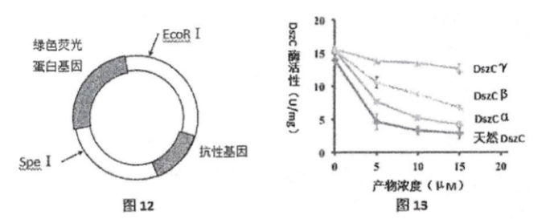

40.（4分）在Ⅱ中，培养基上发出绿色荧光的受体细胞中，一定含有的基因是 （填写编号）；Ⅱ筛选到的受体细胞会有基因 （填写编号）。

①天然DszC酶基因 ②DszC突变基因 ③绿色荧光蛋白基因 ④抗性基因

41.（2分）Ⅰ~Ⅲ中DszC基因表达的阶段是 。

42.（6分）已知DszC基因长度为1254个碱基对，结合图13信息，通过比较不同酶的活性

及产物抑制程度，分析DszC y酶基因的长度，更可能是1257个碱基对还是303个碱基对？

写出分析过程。

**上海市2021年生物等级考真题参考答案**

**一.选择题（共40分，每小题2分，每小题只有一个正确答案）**

1.A 2.C 3.A 4.C 5.D 6.A 7.B 8.B 9.B 10.C

11.B 12.C 13.D 14.B 15.A 16.D 17.C 18.B 19.C 20.C

**二、综合题（60分）**

**（一）香蕉枯萎病的微生物防治（12分）**

21.上升

22.Ⅱ、Ⅱ、Ⅲ、Ⅳ Ⅱ、Ⅲ 尖孢镰刀菌

23\. ③

24.菌株P 菌株S 菌株P和菌株S 实验组2和实验组3

**（二）人类遗传病（12分）**

25.常

26.BC

27\. 50%

28.A

29.aabb或aaXbY aaBb或aaxBXb

**（三）头发知多少？（12分）**

30.A

31\. ③④

32.AB

33.B

34.可以。当压力水平降低以后。会使得神经元N1接受到的刺激减弱，从而分泌激素Ⅰ低减少，使垂体细胞后分泌的激素Ⅱ减少，从而作用于肾上腺皮质细胞的激素Ⅱ减少，导致肾上腺皮质细胞分泌的皮质醇减少，从而有利于毛囊干细胞的分化，重新分化出毛囊，长出毛发，使毛发恢复正常。

**（四）植物生理（12分）**

35.A

36.ABCD

37\. AD

38.减少 抑制

39.①②③④⑤

**（五）酶的改造（12分）**

40.③④ ②④

41.Ⅱ、Ⅲ

42.据图可知，在产物浓度为0时，DszC y酶、其他改造酶和天然酶的活性虽然有所差异但是相差不大，说明突变改造后的DszC y酶与底物结合以及在发挥催化活性的关键结构上没有发生改变，推测控制该酶的基因结构本身没有发生明显的改变；随着产物浓度的逐渐增加，天然酶和改造后的酶活性均受到产物抑制，但是与其他DszC酶活性相比，DszC y酶仍然保持了较高的活性，说明该酶基因突变后极大地缓解了产物对DszC y酶的抑制作用。根据DszC y酶初始活力和该突变有效地解除了产物对DszC y酶的抑制作用，可知，其突变并不会显著改变酶本身的分子结构，如缩短酶分子的氨基酸数量，故DszC y酶基因的长度更可能是1257个碱基对，而非是303个碱基对。
