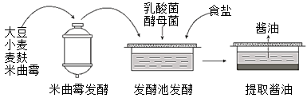
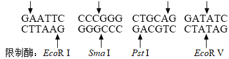

**2021年高考全国乙卷理综生物试卷**

1\. 果蝇体细胞含有8条染色体。下列关于果蝇体细胞有丝分裂叙述，错误的是（ ）

A. 在间期，DNA进行半保留复制，形成16个DNA分子

B. 在前期，每条染色体由2条染色单体组成，含2个DNA分子

C. 在中期，8条染色体的着丝点排列在赤道板上，易于观察染色体

D. 在后期，成对的同源染色体分开，细胞中有16条染色体

2\. 选择合适的试剂有助于达到实验目的。下列关于生物学实验所用试剂的叙述，错误的是（ ）

A. 鉴别细胞的死活时，台盼蓝能将代谢旺盛的动物细胞染成蓝色

B. 观察根尖细胞有丝分裂中期的染色体，可用龙胆紫溶液使其着色

C. 观察RNA在细胞中分布的实验中，盐酸处理可改变细胞膜的通透性

D. 观察植物细胞吸水和失水时，可用蔗糖溶液处理紫色洋葱鳞片叶外表皮

3\. 植物在生长发育过程中，需要不断从环境中吸收水。下列有关植物体内水的叙述，错误的是（ ）

A. 根系吸收的水有利于植物保持固有姿态

B. 结合水是植物细胞结构的重要组成成分

C. 细胞的有氧呼吸过程不消耗水但能产生水

D. 自由水和结合水比值的改变会影响细胞的代谢活动

4\. 在神经调节过程中，兴奋会在神经纤维上传导和神经元之间传递。下列有关叙述错误的是（ ）

A. 兴奋从神经元细胞体传导至突触前膜，会引起Na+外流

B. 突触前神经元兴奋可引起突触前膜释放乙酰胆碱

C. 乙酰胆碱是一种神经递质，在突触间隙中经扩散到达突触后膜

D 乙酰胆碱与突触后膜受体结合，引起突触后膜电位变化

5\. 在格里菲思所做的肺炎双球菌转化实验中，无毒性的R型活细菌与被加热杀死的S型细菌混合后注射到小鼠体内，从小鼠体内分离出了有毒性的S型活细菌。某同学根据上述实验，结合现有生物学知识所做的下列推测中，不合理的是（ ）

A. 与R型菌相比，S型菌的毒性可能与荚膜多糖有关

B. S型菌的DNA能够进入R型菌细胞指导蛋白质的合成

C. 加热杀死S型菌使其蛋白质功能丧失而DNA功能可能不受影响

D. 将S型菌的DNA经DNA酶处理后与R型菌混合，可以得到S型菌

6\. 某种二倍体植物的*n*个不同性状由*n*对独立遗传的基因控制（杂合子表现显性性状）。已知植株A的*n*对基因均杂合。理论上，下列说法错误的是（ ）

A. 植株A的测交子代会出现2n种不同表现型的个体

B. *n*越大，植株A测交子代中不同表现型个体数目彼此之间的差异越大

C. 植株A测交子代中*n*对基因均杂合个体数和纯合子的个体数相等

D. *n*≥2时，植株A的测交子代中杂合子的个体数多于纯合子的个体数

7\. 生活在干旱地区的一些植物（如植物甲）具有特殊的CO2固定方式。这类植物晚上气孔打开吸收CO2，吸收的CO2通过生成苹果酸储存在液泡中；白天气孔关闭，液泡中储存的苹果酸脱羧释放的CO2可用于光合作用。回答下列问题：

（1）白天叶肉细胞产生ATP的场所有\_\_\_\_\_\_\_\_\_\_。光合作用所需的CO2来源于苹果酸脱羧和\_\_\_\_\_\_\_\_\_\_\_\_\_\_释放的CO2。

（2）气孔白天关闭、晚上打开是这类植物适应干旱环境的一种方式，这种方式既能防止\_\_\_\_\_\_\_\_\_\_\_\_\_\_，又能保证\_\_\_\_\_\_\_\_\_\_\_\_\_正常进行。

（3）若以pH作为检测指标，请设计实验来验证植物甲在干旱环境中存在这种特殊的CO2固定方式。\_\_\_\_\_（简要写出实验思路和预期结果）

8\. 在自然界中，竞争是一个非常普遍的现象。回答下列问题：

（1）竞争排斥原理是指在一个稳定的环境中，两个或两个以上受资源限制的，但具有相同资源利用方式的物种不能长期共存在一起。为了验证竞争排斥原理，某同学选用双小核草履虫和大草履虫为材料进行实验，选择动物所遵循的原则是\_\_\_\_\_\_\_\_\_\_\_\_\_\_。该实验中需要将两种草履虫放在资源\_\_\_\_\_\_\_\_\_\_\_\_\_\_（填“有限的”或“无限的”）环境中混合培养。当实验出现\_\_\_\_\_\_\_\_\_\_\_\_\_\_的结果时即可证实竞争排斥原理。

（2）研究发现，以同一棵树上的种子为食物的两种雀科鸟原来存在竞争关系，经进化后通过分别取食大小不同的种子而能长期共存。若仅从取食的角度分析，两种鸟除了因取食的种子大小不同而共存，还可因取食的\_\_\_\_\_\_\_\_\_\_\_\_\_\_（答出1点即可）不同而共存。

（3）根据上述实验和研究，关于生物种间竞争结果可得出的结论是\_\_\_\_\_\_\_\_\_\_\_\_\_\_。

9\. 哺乳动物细胞之间的信息交流是其生命活动所必需的。请参照表中内容，围绕细胞间的信息交流完成下表，以体现激素和靶器官（或靶细胞）响应之间的对应关系。

<table>
<colgroup>
<col style="width: 16%" />
<col style="width: 17%" />
<col style="width: 16%" />
<col style="width: 21%" />
<col style="width: 27%" />
</colgroup>
<tbody>
<tr>
<td style="text-align: left;">
内分泌腺或

内分泌细胞
</td>
<td style="text-align: left;">激素</td>
<td style="text-align: left;">激素运输</td>
<td style="text-align: left;">靶器官或靶细胞</td>
<td style="text-align: left;">靶器官或靶细胞的响应</td>
</tr>
<tr>
<td style="text-align: left;">肾上腺</td>
<td style="text-align: left;">肾上腺素</td>
<td rowspan="3" style="text-align: left;">（3）通过____运输</td>
<td style="text-align: left;">（4）__________</td>
<td style="text-align: left;">心率加快</td>
</tr>
<tr>
<td style="text-align: left;">胰岛B细胞</td>
<td style="text-align: left;">（1）________</td>
<td style="text-align: left;">肝细胞</td>
<td style="text-align: left;">促进肝糖原的合成</td>
</tr>
<tr>
<td style="text-align: left;">垂体</td>
<td style="text-align: left;">（2）________</td>
<td style="text-align: left;">甲状腺</td>
<td style="text-align: left;">（5）______________</td>
</tr>
</tbody>
</table>

10\. 果蝇的灰体对黄体是显性性状，由X染色体上的1对等位基因（用A/a表示）控制；长翅对残翅是显性性状，由常染色体上的1对等位基因（用B/b表示）控制。回答下列问题：

（1）请用灰体纯合子雌果蝇和黄体雄果蝇为实验材料，设计杂交实验以获得黄体雌果蝇。\_\_\_\_\_\_\_（要求：用遗传图解表示杂交过程。）

（2）若用黄体残翅雌果蝇与灰体长翅雄果蝇（XAYBB）作为亲本杂交得到F1，F1相互交配得F2，则F2中灰体长翅∶灰体残翅∶黄体长翅∶黄体残翅=\_\_\_\_\_\_，F2中灰体长翅雌蝇出现的概率为\_\_\_\_\_\_\_\_\_\_\_\_\_。

**\[生物一选修1：生物技术实践\]**

11\. 工业上所说的发酵是指微生物在有氧或无氧条件下通过分解与合成代谢将某些原料物质转化为特定产品的过程。利用微生物发酵制作酱油在我国具有悠久的历史。某企业通过发酵制作酱油的流程示意图如下。

回答下列问题：

（1）米曲霉发酵过程中，加入大豆、小麦和麦麸可以为米曲霉的生长提供营养物质，大豆中的\_\_\_\_\_\_\_\_\_\_\_可为米曲霉的生长提供氮源，小麦中的淀粉可为米曲霉的生长提供\_\_\_\_\_\_\_\_\_\_\_。

（2）米曲霉发酵过程的主要目的是使米曲霉充分生长繁殖，大量分泌制作酱油过程所需的酶类，这些酶中的\_\_\_\_\_、\_\_\_\_\_\_能分别将发酵池中的蛋白质和脂肪分解成易于吸收、风味独特的成分，如将蛋白质分解为小分子的肽和\_\_\_\_\_\_\_\_\_\_。米曲霉发酵过程需要提供营养物质、通入空气并搅拌，由此可以判断米曲霉属于\_\_\_\_\_\_\_\_\_\_\_（填“自养厌氧”“异养厌氧”或“异养好氧”）微生物。

（3）在发酵池发酵阶段添加的乳酸菌属于\_\_\_\_\_\_\_\_\_\_\_（填“真核生物”或“原核生物”）；添加的酵母菌在无氧条件下分解葡萄糖的产物是\_\_\_\_\_\_\_\_\_\_\_。在该阶段抑制杂菌污染和繁殖是保证酱油质量的重要因素，据图分析该阶段中可以抑制杂菌生长的物质是\_\_\_\_\_\_\_\_\_\_\_（答出1点即可）。

**\[生物——选修3：现代生物科技专题\]**

12\. 用DNA重组技术可以赋予生物以新的遗传特性，创造出更符合人类需要的生物产品。在此过程中需要使用多种工具酶，其中4种限制性核酸内切酶的切割位点如图所示。

回答下列问题：

（1）常用的DNA连接酶有*E. coli* DNA连接酶和T4DNA连接酶。上图中\_\_\_\_\_\_\_\_\_\_酶切割后的DNA片段可以用*E. coli* DNA连接酶连接。上图中\_\_\_\_\_\_\_\_\_\_\_酶切割后的DNA片段可以用T4DNA连接酶连接。

（2）DNA连接酶催化目的基因片段与质粒载体片段之间形成的化学键是\_\_\_\_\_\_\_\_\_\_\_\_。

（3）DNA重组技术中所用的质粒载体具有一些特征，如质粒DNA分子上有复制原点，可以保证质粒在受体细胞中能\_\_\_\_\_\_\_\_\_\_\_；质粒DNA分子上有\_\_\_\_\_\_\_\_\_\_\_\_\_\_，便于外源DNA插入；质粒DNA分子上有标记基因（如某种抗生素抗性基因），利用抗生素可筛选出含质粒载体的宿主细胞，方法是\_\_\_\_\_\_\_\_\_\_\_\_\_\_。

（4）表达载体含有启动子，启动子是指\_\_\_\_\_\_\_\_\_\_\_\_\_\_\_\_\_\_。
