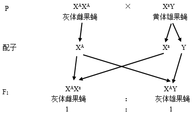
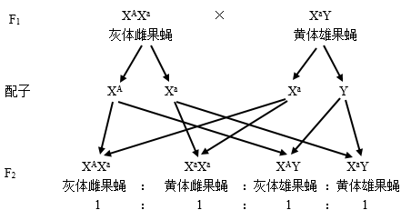

**2021年高考全国乙卷理综生物试卷**

1\. 果蝇体细胞含有8条染色体。下列关于果蝇体细胞有丝分裂的叙述，错误的是（ ）

A. 在间期，DNA进行半保留复制，形成16个DNA分子

B. 在前期，每条染色体由2条染色单体组成，含2个DNA分子

C. 在中期，8条染色体的着丝点排列在赤道板上，易于观察染色体

D. 在后期，成对的同源染色体分开，细胞中有16条染色体

【答案】D

【解析】

【分析】1、有丝分裂过程：（1）间期：进行DNA的复制和有关蛋白质的合成；（2）前期：核膜、核仁逐渐解体消失，出现纺锤体和染色体；（3）中期：染色体形态固定、数目清晰，着丝点排列在赤道板上；（4）后期：着丝点分裂，姐妹染色单体分开成为染色体，并均匀地移向两极；（5）末期：核膜、核仁重建、纺锤体和染色体消失。

2、染色体、染色单体、DNA变化特点（体细胞染色体为2N）：（1）染色体数目变化：后期加倍（4N），平时不变（2N）；（2）核DNA含量变化：间期加倍（2N→4N），末期还原（2N）；（3）染色单体数目变化：间期出现（0→4N），前期出现（4N），后期消失（4N→0），存在时数目同DNA。

【详解】A、已知果蝇体细胞含有8条染色体，每条染色体上有1个DNA分子，共8个DNA分子，在间期，DNA进行半保留复制，形成16个DNA分子，A正确；

B、间期染色体已经复制，故在前期每条染色体由2条染色单体组成，含2个DNA分子，B正确；

C、在中期，8条染色体的着丝点排列在赤道板上，此时染色体形态固定、数目清晰，易于观察染色体，C正确；

D、有丝分裂后期，着丝点分裂，姐妹染色单体分开，染色体数目加倍，由8条变成16条，同源染色体不分离，D错误。

故选D。

2\. 选择合适的试剂有助于达到实验目的。下列关于生物学实验所用试剂的叙述，错误的是（ ）

A. 鉴别细胞死活时，台盼蓝能将代谢旺盛的动物细胞染成蓝色

B. 观察根尖细胞有丝分裂中期的染色体，可用龙胆紫溶液使其着色

C. 观察RNA在细胞中分布的实验中，盐酸处理可改变细胞膜的通透性

D. 观察植物细胞吸水和失水时，可用蔗糖溶液处理紫色洋葱鳞片叶外表皮

【答案】A

【解析】

【分析】1、细胞膜具有选择透过性，台盼蓝等不被细胞需要的大分子物质不能进入细胞内。

2、染色质（体）主要由蛋白质和DNA组成，易被碱性染料（龙胆紫、醋酸洋红等）染成深色而得名。

3、在“观察DNA和RNA在细胞中的分布”实验中∶（1）用质量分数为0.9%的NaCIl溶液保持细胞原有的形态﹔（2）用质量分数为8%的盐酸改变细胞膜的通透性，加速染色剂进入细胞，将染色体上的DNA和蛋白质分离，便于染色剂与DNA结合；（3）用吡罗红-甲基绿染色剂对DNA和RNA进行染色。

4、观察植物细胞吸水和失水时，需要选择有颜色的成熟的植物细胞，紫色洋葱鳞片叶外表皮细胞符合条件。

【详解】A、代谢旺盛的动物细胞是活细胞，细胞膜具有选择透过性，台盼蓝不能进入细胞内，故不能将代谢旺盛的动物细胞染成蓝色，A错误；

B、龙胆紫溶液可以将染色体染成深色，故观察根尖细胞有丝分裂中期的染色体，可用龙胆紫溶液使其着色，B正确；

C、观察RNA在细胞中分布的实验中，盐酸处理可改变细胞膜的通透性，加速染色剂进入细胞，C正确；

D、观察植物细胞吸水和失水时，可用较高浓度的蔗糖溶液处理紫色洋葱鳞片叶外表，使其失水而发生质壁分离，D正确。

故选A。

3\. 植物在生长发育过程中，需要不断从环境中吸收水。下列有关植物体内水的叙述，错误的是（ ）

A. 根系吸收的水有利于植物保持固有姿态

B. 结合水是植物细胞结构的重要组成成分

C. 细胞的有氧呼吸过程不消耗水但能产生水

D. 自由水和结合水比值的改变会影响细胞的代谢活动

【答案】C

【解析】

【分析】水的存在形式和作用：1、含量：生物体中的水含量一般为60%~90%，特殊情况下可能超过90%，是活细胞中含量最多的化合物。

2、存在形式：细胞内的水以自由水与结合水的形式存在。

3、作用：结合水是细胞结构的重要组成成分，自由水是良好的溶剂，是许多化学反应的介质，自由水还参与许多化学反应，自由水对于运输营养物质和代谢废物具有重要作用，自由水与结合水比值越高，细胞代谢越旺盛，抗逆性越差，反之亦然。

【详解】A、水是植物细胞液的主要成分，细胞液主要存在于液泡中，充盈的液泡使植物细胞保持坚挺，故根系吸收的水有利于植物保持固有姿态，A正确；

B、结合水与细胞内其他物质相结合，是植物细胞结构的重要组成成分，B正确；

C、细胞的有氧呼吸第二阶段消耗水，第三阶段产生水，C错误；

D、自由水参与细胞代谢活动，故自由水和结合水比值的改变会影响细胞的代谢活动，自由水与结合水比值越高，细胞代谢越旺盛，反之亦然，D正确。

故选C。

4\. 在神经调节过程中，兴奋会在神经纤维上传导和神经元之间传递。下列有关叙述错误是（ ）

A. 兴奋从神经元的细胞体传导至突触前膜，会引起Na+外流

B. 突触前神经元兴奋可引起突触前膜释放乙酰胆碱

C. 乙酰胆碱是一种神经递质，在突触间隙中经扩散到达突触后膜

D. 乙酰胆碱与突触后膜受体结合，引起突触后膜电位变化

【答案】A

【解析】

【分析】1、神经冲动的产生：静息时，神经细胞膜对钾离子的通透性大，钾离子大量外流，形成内负外正的静息电位；受到刺激后，神经细胞膜的通透性发生改变，对钠离子的通透性增大，钠离子内流，形成内正外负的动作电位。兴奋部位和非兴奋部位形成电位差，产生局部电流，兴奋传导的方向与膜内电流方向一致。

2、兴奋在神经元之间需要通过突触结构进行传递，突触包括突触前膜、突触间隙、突触后膜，其具体的传递过程为：兴奋以电流的形式传导到轴突末梢时，突触小泡释放递质（化学信号），递质作用于突触后膜，引起突触后膜产生膜电位（电信号），从而将兴奋传递到下一个神经元。

【详解】A、神经细胞膜外Na+浓度高于细胞内，兴奋从神经元的细胞体传导至突触前膜，会引起Na+内流，A错误；

B、突触前神经元兴奋可引起突触前膜释放神经递质，如乙酰胆碱，B正确；

C、乙酰胆碱是一种兴奋性神经递质，在突触间隙中经扩散到达突触后膜，与后膜上的特异性受体相结合，C正确；

D、乙酰胆碱与突触后膜受体结合，引起突触后膜电位变化，即引发一次新的神经冲动，D正确。

故选A。

5\. 在格里菲思所做的肺炎双球菌转化实验中，无毒性的R型活细菌与被加热杀死的S型细菌混合后注射到小鼠体内，从小鼠体内分离出了有毒性的S型活细菌。某同学根据上述实验，结合现有生物学知识所做的下列推测中，不合理的是（ ）

A. 与R型菌相比，S型菌毒性可能与荚膜多糖有关

B. S型菌的DNA能够进入R型菌细胞指导蛋白质的合成

C. 加热杀死S型菌使其蛋白质功能丧失而DNA功能可能不受影响

D. 将S型菌的DNA经DNA酶处理后与R型菌混合，可以得到S型菌

【答案】D

【解析】

【分析】肺炎双球菌转化实验包括格里菲斯体内转化实验和艾弗里体外转化实验，其中格里菲斯体内转化实验证明S型细菌中存在某种转化因子，能将R型细菌转化为S型细菌，没有证明转化因子是什么物质，而艾弗里体外转化实验，将各种物质分开，单独研究它们在遗传中的作用，并用到了生物实验中的减法原理，最终证明DNA是遗传物质。

【详解】A、与R型菌相比，S型菌具有荚膜多糖，S型菌有毒，故可推测S型菌的毒性可能与荚膜多糖有关，A正确；

B、S型菌的DNA进入R型菌细胞后使R型菌具有了S型菌的性状，可知S型菌的DNA进入R型菌细胞后指导蛋白质的合成，B正确；

C、加热杀死的S型菌不会使小白鼠死亡，说明加热杀死的S型菌的蛋白质功能丧失，而加热杀死的S型菌的DNA可以使R型菌发生转化，可知其DNA功能不受影响，C正确；

D、将S型菌的DNA经DNA酶处理后，DNA被水解为小分子物质，故与R型菌混合，不能得到S型菌，D错误。

故选D。

6\. 某种二倍体植物的*n*个不同性状由*n*对独立遗传的基因控制（杂合子表现显性性状）。已知植株A的*n*对基因均杂合。理论上，下列说法错误的是（ ）

A. 植株A的测交子代会出现2n种不同表现型的个体

B. *n*越大，植株A测交子代中不同表现型个体数目彼此之间的差异越大

C. 植株A测交子代中*n*对基因均杂合的个体数和纯合子的个体数相等

D. *n*≥2时，植株A的测交子代中杂合子的个体数多于纯合子的个体数

【答案】B

【解析】

【分析】1、基因的自由组合定律的实质是：位于非同源染色体上的非等位基因的分离或组合是互不干扰的；在减数分裂的过程中，同源染色体上的等位基因彼此分离的同时，非同源染色体上的非等位基因自由组合。

2、分析题意可知：*n*对等位基因独立遗传，即*n*对等位基因遵循自由组合定律

【详解】A、每对等位基因测交后会出现2种表现型，故*n*对等位基因杂合的植株A的测交子代会出现2n种不同表现型的个体，A正确；

B、不管n有多大，植株A测交子代比为（1：1）n=1：1：1：1……（共2n个1），即不同表现型个体数目均相等，B错误；

C、植株A测交子代中*n*对基因均杂合的个体数为1/2n，纯合子的个体数也是1/2n，两者相等，C正确；

D、*n*≥2时，植株A的测交子代中纯合子的个体数是1/2n，杂合子的个体数为1-（1/2n），故杂合子的个体数多于纯合子的个体数，D正确。

故选B。

7\. 生活在干旱地区的一些植物（如植物甲）具有特殊的CO2固定方式。这类植物晚上气孔打开吸收CO2，吸收的CO2通过生成苹果酸储存在液泡中；白天气孔关闭，液泡中储存的苹果酸脱羧释放的CO2可用于光合作用。回答下列问题：

（1）白天叶肉细胞产生ATP的场所有\_\_\_\_\_\_\_\_\_\_。光合作用所需的CO2来源于苹果酸脱羧和\_\_\_\_\_\_\_\_\_\_\_\_\_\_释放的CO2。

（2）气孔白天关闭、晚上打开是这类植物适应干旱环境的一种方式，这种方式既能防止\_\_\_\_\_\_\_\_\_\_\_\_\_\_，又能保证\_\_\_\_\_\_\_\_\_\_\_\_\_正常进行。

（3）若以pH作为检测指标，请设计实验来验证植物甲在干旱环境中存在这种特殊的CO2固定方式。\_\_\_\_\_（简要写出实验思路和预期结果）

【答案】 (1). 细胞质基质、线粒体（线粒体基质和线粒体内膜）、叶绿体类囊体薄膜 (2). 细胞呼吸（或呼吸作用） (3). 蒸腾作用过强导致水分散失过多 (4). 光合作用 (5). 实验思路：取生长状态相同的植物甲若干株随机均分为A、B两组；A组在（湿度适宜的）正常环境中培养，B组在干旱环境中培养，其他条件相同且适宜，一段时间后，分别检测两组植株夜晚同一时间液泡中的pH，并求平均值。\
预期结果：A组pH平均值高于B组。

【解析】

【分析】据题可知，植物甲生活在干旱地区，为降低蒸腾作用减少水分的散失，气孔白天关闭、晚上打开。白天气孔关闭时：液泡中储存的苹果酸脱羧释放的CO2可用于光合作用，光合作用生成的氧气和有机物可用于细胞呼吸，白天能产生ATP的场所有细胞质基质、线粒体和叶绿体；而晚上虽然气孔打开，但由于无光照，叶肉细胞只能进行呼吸作用，能产生ATP的场所有细胞质基质和线粒体。

【详解】（1）白天有光照，叶肉细胞能利用液泡中储存的苹果酸脱羧释放的CO2进行光合作用，也能利用光合作用产生的氧气和有机物进行有氧呼吸，光合作用光反应阶段能将光能转化为化学能储存在ATP中，有氧呼吸三阶段都能产生能量合成ATP，因此叶肉细胞能产生ATP的场所有细胞质基质、线粒体（线粒体基质和线粒体内膜）、叶绿体类囊体薄膜。光合作用为有氧呼吸提供有机物和氧气，反之，细胞呼吸（呼吸作用）产生的二氧化碳也能用于光合作用暗反应，故光合作用所需的CO2可来源于苹果酸脱羧和细胞呼吸（或呼吸作用）释放的CO2。

（2）由于环境干旱，植物吸收的水分较少，为了维持机体的平衡适应这一环境，气孔白天关闭能防止白天因温度较高蒸腾作用较强导致植物体水分散失过多，晚上气孔打开吸收二氧化碳储存固定以保证光合作用等生命活动的正常进行。

（3）该实验自变量是植物甲所处的生存环境是否干旱，由于夜间气孔打开吸收二氧化碳，生成苹果酸储存在液泡中，导致液泡pH降低，故可通过检测液泡的pH验证植物甲存在该特殊方式，即因变量检测指标是液泡中的pH值。实验思路：取生长状态相同的植物甲若干株随机均分为A、B两组；A组在（湿度适宜的）正常环境中培养，B组在干旱环境中培养，其他条件相同且适宜，一段时间后，分别检测两组植株夜晚同一时间液泡中的pH，并求平均值。

预期结果：A组pH平均值高于B组。

【点睛】解答本题的关键是明确实验材料选取的原则，以及因变量的检测方法和无关变量的处理原则。

8\. 在自然界中，竞争是一个非常普遍的现象。回答下列问题：

（1）竞争排斥原理是指在一个稳定的环境中，两个或两个以上受资源限制的，但具有相同资源利用方式的物种不能长期共存在一起。为了验证竞争排斥原理，某同学选用双小核草履虫和大草履虫为材料进行实验，选择动物所遵循的原则是\_\_\_\_\_\_\_\_\_\_\_\_\_\_。该实验中需要将两种草履虫放在资源\_\_\_\_\_\_\_\_\_\_\_\_\_\_（填“有限的”或“无限的”）环境中混合培养。当实验出现\_\_\_\_\_\_\_\_\_\_\_\_\_\_的结果时即可证实竞争排斥原理。

（2）研究发现，以同一棵树上的种子为食物的两种雀科鸟原来存在竞争关系，经进化后通过分别取食大小不同的种子而能长期共存。若仅从取食的角度分析，两种鸟除了因取食的种子大小不同而共存，还可因取食的\_\_\_\_\_\_\_\_\_\_\_\_\_\_（答出1点即可）不同而共存。

（3）根据上述实验和研究，关于生物种间竞争的结果可得出的结论是\_\_\_\_\_\_\_\_\_\_\_\_\_\_。

【答案】 (1). 形态和习性上很接近（或具有相同的资源利用方式） (2). 有限的 (3). 一方（双小核草履虫）存活，另一方（大草履虫）死亡 (4). 部位、时间等（合理即可） (5). 有相同资源利用方式的物种竞争排斥，有不同资源利用方式的物种竞争共存

【解析】

【分析】竞争指两种或两种以上生物相互争夺资源和空间等。竞争的结果常表现为相互抑制，有时表现为一方占优势，另一方处于劣势甚至死亡。

【详解】（1）为了验证竞争排斥原理，某同学选用双小核草履虫和大草履虫为材料进行实验，选择动物所遵循的原则是形态和习性上很接近，或相同的资源利用方式。竞争排斥原理是指在一个稳定的环境中，两个或两个以上受资源限制的，但具有相同资源利用方式的物种不能长期共存在一起，因此，该实验中需要将两种草履虫放在资源有限的环境中混合培养。当实验出现一方（双小核草履虫）存活，另一方（大草履虫）死亡的结果时即可证实竞争排斥原理。

（2）研究发现，以同一棵树上的种子为食物的两种雀科鸟原来存在竞争关系，经进化后通过分别取食大小不同的种子而能长期共存。若仅从取食的角度分析，两种鸟除了因取食的种子大小不同而共存，还可因取食的部位、时间等（合理即可）不同而共存。

（3）根据上述实验和研究，关于生物种间竞争的结果可得出的结论是有相同资源利用方式的物种竞争排斥，有不同资源利用方式的物种竞争共存。

【点睛】解答本题的关键是明确种间竞争概念，竞争导致的两种不同结果，以及竞争排斥和竞争共存的区别。

9\. 哺乳动物细胞之间的信息交流是其生命活动所必需的。请参照表中内容，围绕细胞间的信息交流完成下表，以体现激素和靶器官（或靶细胞）响应之间的对应关系。

<table>
<colgroup>
<col style="width: 16%" />
<col style="width: 17%" />
<col style="width: 16%" />
<col style="width: 21%" />
<col style="width: 27%" />
</colgroup>
<tbody>
<tr>
<td style="text-align: left;">
内分泌腺或

内分泌细胞
</td>
<td style="text-align: left;">激素</td>
<td style="text-align: left;">激素运输</td>
<td style="text-align: left;">靶器官或靶细胞</td>
<td style="text-align: left;">靶器官或靶细胞的响应</td>
</tr>
<tr>
<td style="text-align: left;">肾上腺</td>
<td style="text-align: left;">肾上腺素</td>
<td rowspan="3" style="text-align: left;">（3）通过____运输</td>
<td style="text-align: left;">（4）__________</td>
<td style="text-align: left;">心率加快</td>
</tr>
<tr>
<td style="text-align: left;">胰岛B细胞</td>
<td style="text-align: left;">（1）________</td>
<td style="text-align: left;">肝细胞</td>
<td style="text-align: left;">促进肝糖原的合成</td>
</tr>
<tr>
<td style="text-align: left;">垂体</td>
<td style="text-align: left;">（2）________</td>
<td style="text-align: left;">甲状腺</td>
<td style="text-align: left;">（5）______________</td>
</tr>
</tbody>
</table>

【答案】 (1). 胰岛素 (2). 促甲状腺激素 (3). 体液 (4). 心脏（心肌细胞） (5). 促进甲状腺分泌甲状腺激素

【解析】

【分析】激素调节特点：1、微量和高效：激素在血液中含量很低，但却能产生显著生理效应，这是由于激素的作用被逐级放大的结果。

2、通过体液运输：内分泌腺没有导管，所以激素扩散到体液中，由血液来运输。

3、作用于靶器官、靶细胞：激素的作用具有特异性，它有选择性地作用于靶器官、靶腺体或靶细胞，激素一经靶细胞接受并起作用后就被灭活，因此体内需要源源不断的产生激素，以维持激素含量的动态平衡。激素种类多、含量极微，既不组成细胞结构，也不提供能量，只起到调节生命活动的作用。

【详解】（1）肾上腺分泌肾上腺素，通过体液运输，由题靶细胞的响应是使心跳加速、心率加快，因此肾上腺素作用于心肌细胞。

（2）胰岛B细胞分泌胰岛素，胰岛素是机体唯一的降血糖激素，通过体液运输，作用于肝细胞，促进肝糖原的合成，使血糖水平降低。

（3）由题干垂体作用的靶器官是甲状腺可知，垂体可以分泌促甲状腺激素，通过体液运输，作用于甲状腺，促进甲状腺分泌甲状腺激素，提高细胞代谢速率，使机体产生更多的热量。

【点睛】本题考查机体内分泌腺分泌的激素种类及作用、激素调节的特点等相关知识，解决本题的关键是注意靶器官或靶细胞这一栏的答案应该与相应的靶器官和靶细胞响应保持一致。

10\. 果蝇的灰体对黄体是显性性状，由X染色体上的1对等位基因（用A/a表示）控制；长翅对残翅是显性性状，由常染色体上的1对等位基因（用B/b表示）控制。回答下列问题：

（1）请用灰体纯合子雌果蝇和黄体雄果蝇为实验材料，设计杂交实验以获得黄体雌果蝇。\_\_\_\_\_\_\_（要求：用遗传图解表示杂交过程。）

（2）若用黄体残翅雌果蝇与灰体长翅雄果蝇（XAYBB）作为亲本杂交得到F1，F1相互交配得F2，则F2中灰体长翅∶灰体残翅∶黄体长翅∶黄体残翅=\_\_\_\_\_\_，F2中灰体长翅雌蝇出现的概率为\_\_\_\_\_\_\_\_\_\_\_\_\_。

【答案】 (1).\
\
 (2). 3：1：3：1 (3). 3/16

【解析】

【分析】分析题意可知：果蝇的灰体对黄体是显性性状，由X染色体上的1对等位基因A/a 控制，可知雌果蝇基因型为XAXA（灰体）、XAXa（灰体）、XaXa（黄体），雄果蝇基因型为XAY（灰体）、XaY（黄体）；长翅对残翅是显性性状，由常染色体上的1对等位基因B/b控制，可知相应基因型为BB（长翅）、Bb（长翅）、bb（残翅）。

【详解】（1）亲本灰体纯合子雌果蝇的基因型为XAXA，黄体雄果蝇基因型为XaY，二者杂交，子一代基因型和表现型为XAXa（灰体雌果蝇）、XAY（灰体雄果蝇），想要获得黄体雌果蝇XaXa，则需要再让子一代与亲代中的黄体雄果蝇杂交，相应遗传图解如下：

 

子二代中黄体雌果蝇即为目标果蝇，选择即可。

（2）已知长翅对残翅是显性性状，基因位于常染色体上，若用黄体残翅雌果蝇（XaXabb）与灰体长翅雄果蝇(XAYBB) 作为亲本杂交得到F1，F1 的基因型为XAXaBb、XaYBb，F1相互交配得F2，分析每对基因的遗传，可知F2中长翅：残翅=（1BB+2Bb）∶（1bb）=3∶1，灰体：黄体=（1XAXa+1XAY）∶（1XaXa+1XaY）=1∶1，故灰体长翅：灰体残翅：黄体长翅：黄体残翅=（1/2×3/4）∶（1/2×1/4）∶（1/2×3/4）∶（1/2×1/4）=3∶1∶3∶1，F2中灰体长翅雌蝇（XAXaB-）出现的概率为1/4×3/4=3/16。

【点睛】本题考查基因自由组合定律以及伴性遗传规律的应用的相关知识，意在考查考生运用所学知识解决实际问题的能力，答题关键在于利用分离定律思维解决自由组合定律概率计算问题。

**\[生物一选修1：生物技术实践\]**

11\. 工业上所说的发酵是指微生物在有氧或无氧条件下通过分解与合成代谢将某些原料物质转化为特定产品的过程。利用微生物发酵制作酱油在我国具有悠久的历史。某企业通过发酵制作酱油的流程示意图如下。

回答下列问题：

（1）米曲霉发酵过程中，加入大豆、小麦和麦麸可以为米曲霉的生长提供营养物质，大豆中的\_\_\_\_\_\_\_\_\_\_\_可为米曲霉的生长提供氮源，小麦中的淀粉可为米曲霉的生长提供\_\_\_\_\_\_\_\_\_\_\_。

（2）米曲霉发酵过程的主要目的是使米曲霉充分生长繁殖，大量分泌制作酱油过程所需的酶类，这些酶中的\_\_\_\_\_、\_\_\_\_\_\_能分别将发酵池中的蛋白质和脂肪分解成易于吸收、风味独特的成分，如将蛋白质分解为小分子的肽和\_\_\_\_\_\_\_\_\_\_。米曲霉发酵过程需要提供营养物质、通入空气并搅拌，由此可以判断米曲霉属于\_\_\_\_\_\_\_\_\_\_\_（填“自养厌氧”“异养厌氧”或“异养好氧”）微生物。

（3）在发酵池发酵阶段添加的乳酸菌属于\_\_\_\_\_\_\_\_\_\_\_（填“真核生物”或“原核生物”）；添加的酵母菌在无氧条件下分解葡萄糖的产物是\_\_\_\_\_\_\_\_\_\_\_。在该阶段抑制杂菌污染和繁殖是保证酱油质量的重要因素，据图分析该阶段中可以抑制杂菌生长的物质是\_\_\_\_\_\_\_\_\_\_\_（答出1点即可）。

【答案】 (1). 蛋白质 (2). 碳源 (3). 蛋白酶 (4). 脂肪酶 (5). 氨基酸 (6). 异养好氧 (7). 原核生物 (8). 酒精和二氧化碳 (9). 酒精、乳酸、食盐（答一个即可）

【解析】

【分析】1、参与腐乳制作的微生物主要是毛霉，其新陈代谢类型是异养需氧型。腐乳制作的原理：毛霉等微生物产生的蛋白酶能将豆腐中的蛋白质分解成小分子的肽和氨基酸；脂肪酶可将脂肪分解成甘油和脂肪酸。

2、微生物的生长繁殖一般需要水、无机盐、碳源和氮源等基本营养物质，有些还需要特殊的营养物质如生长因子，还需要满足氧气和pH等条件。

3、果酒制作的菌种为酵母菌，其原理是：在有氧的条件下，酵母菌大量繁殖，无氧的条件下，酵母菌产生酒精和二氧化碳。

【详解】（1）大豆中含有丰富的蛋白质，可为微生物的生长繁殖提供氮源。小麦中的淀粉可以为微生物的生长繁殖提供碳源。

（2）米曲霉在发酵过程中产生的蛋白酶能将蛋白质分解为小分子的肽和氨基酸，产生的脂肪酶能将脂肪分解为甘油和脂肪酸，使发酵的产物具有独特的风味。米曲霉发酵时需要利用现有的有机物和需要氧气，说明其代谢类型是异养好氧型。

（3）乳酸菌没有核膜包被的细胞核，属于原核生物。酵母菌属于兼性厌氧型微生物，既可以进行有氧呼吸，也可以进行无氧呼吸，无氧呼吸的产物是酒精和二氧化碳。在发酵池中酵母菌产生的酒精能抑制杂菌的生长，乳酸菌产生的乳酸使发酵液呈酸性也能抑制杂菌的生长，同时往发酵池中添加的食盐也能抑制杂菌的生长。

【点睛】本题以酱油的制作为题材，本质考查果酒和腐乳的制作，对于此类试题，需要考生注意的细节较多，如实验的原理、实验条件、实验现象等，需要考生在平时的学习过程中注意积累。

**\[生物——选修3：现代生物科技专题\]**

12\. 用DNA重组技术可以赋予生物以新的遗传特性，创造出更符合人类需要的生物产品。在此过程中需要使用多种工具酶，其中4种限制性核酸内切酶的切割位点如图所示。

回答下列问题：

（1）常用DNA连接酶有*E. coli* DNA连接酶和T4DNA连接酶。上图中\_\_\_\_\_\_\_\_\_\_酶切割后的DNA片段可以用*E. coli* DNA连接酶连接。上图中\_\_\_\_\_\_\_\_\_\_\_酶切割后的DNA片段可以用T4DNA连接酶连接。

（2）DNA连接酶催化目的基因片段与质粒载体片段之间形成的化学键是\_\_\_\_\_\_\_\_\_\_\_\_。

（3）DNA重组技术中所用的质粒载体具有一些特征，如质粒DNA分子上有复制原点，可以保证质粒在受体细胞中能\_\_\_\_\_\_\_\_\_\_\_；质粒DNA分子上有\_\_\_\_\_\_\_\_\_\_\_\_\_\_，便于外源DNA插入；质粒DNA分子上有标记基因（如某种抗生素抗性基因），利用抗生素可筛选出含质粒载体的宿主细胞，方法是\_\_\_\_\_\_\_\_\_\_\_\_\_\_。

（4）表达载体含有启动子，启动子是指\_\_\_\_\_\_\_\_\_\_\_\_\_\_\_\_\_\_。

【答案】 (1). EcoRI、PstI (2). EcoRI、PstI、 SmaI和EcoRV (3). 磷酸二酯键 (4). 自我复制 (5). 一至多个限制酶切位点 (6). 用含有该抗生素的培养基培养宿主细胞，能够存活的即为含有质粒载体的宿主细胞 (7). 位于基因首端的一段特殊DNA序列，是RNA聚合酶识别及结合的部位，能驱动转录过程

【解析】

【分析】基因工程技术的基本步骤：

（1）目的基因的获取：方法有从基因文库中获取、利用PCR技术扩增和人工合成。

（2）基因表达载体的构建：是基因工程的核心步骤，基因表达载体包括目的基因、启动子、终止子和标记基因等。

（3）将目的基因导入受体细胞：根据受体细胞不同，导入的方法也不一样．将目的基因导入植物细胞的方法有农杆菌转化法、基因枪法和花粉管通道法；将目的基因导入动物细胞最有效的方法是显微注射法；将目的基因导入微生物细胞的方法是感受态细胞法。

（4）目的基因的检测与鉴定：分子水平上的检测：①检测转基因生物染色体的DNA是否插入目的基因--DNA分子杂交技术；②检测目的基因是否转录出了mRNA--分子杂交技术；③检测目的基因是否翻译成蛋白质--抗原-抗体杂交技术．个体水平上的鉴定：抗虫鉴定、抗病鉴定、活性鉴定等。

【详解】（1）限制酶EcoRI和PstI切割形成的是黏性末端，限制酶SmaI和EcoRV切割形成的是平末端，E. coli DNA连接酶来源于大肠杆菌，只能将双链DNA片段互补的黏性末端之间的磷酸二酯键连接起来，而T4DNA连接酶来源于T4噬菌体，可用于连接黏性末端和平末端，但连接效率较低。因此图中EcoRI和PstI切割后的DNA片段（黏性末端）可以用E. coli DNA连接酶连接，除了这两种限制酶切割的DNA片段，限制酶SmaI和EcoRV切割后的DNA片段（平末端）也可以用T4DNA连接酶连接。

（2）DNA连接酶将两个DNA片段连接形成磷酸二酯键。

（3）质粒是小型环状的DNA分子，常作为基因表达的载体，首先质粒上含有复制原点，能保证质粒在受体细胞中自我复制。质粒DNA分子上有一个至多个限制性核酸内切酶的酶切位点，便于目的基因的导入。质粒上的标记基因是为了鉴定受体细胞中是否含有目的基因，具体做法是用含有该抗生素的培养基培养宿主细胞，能够存活的即为含有质粒载体的宿主细胞。

（4）启动子是一段特殊结构的DNA片段，位于基因的首端，它是RNA聚合酶识别和结合的部位，有了它才能驱动基因转录出mRNA，最终获得需要的蛋白质。

【点睛】本题考查基因工程的相关知识，要求考生识记基因工程的概念、原理及操作步骤，掌握各操作步骤中需要注意的细节，能结合所学的知识准确答题。
