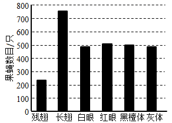

**2021年普通高等学校招生全国统一考试**

**理科综合能力测试·生物部分**

注意事项：

　　1．答卷前，考生务必将自己的姓名、准考证号填写在答题卡上。

　　2．回答选择题时，选出每小题答案后，用铅笔把答题卡上对应题目的答案标号涂黑。如需改动，用橡皮擦干净后，再选涂其他答案标号。回答非选择题时，将答案写在答题卡上。写在本试卷上无效。

　　3．考试结束后，将本试卷和答题卡一并交回。

　　可能用到的相对原子质量：H1　C12　N14　O16　S32　Cu64　Zr91

**一、选择题：本题共13小题，每小题6分，共78分。在每小题给出的四个选项中，只有一项是符合题目要求的。**

1\. 已知①酶、②抗体、③激素、④糖原、⑤脂肪、⑥核酸都是人体内有重要作用的物质。下列说法正确的是（ ）

A. ①②③都是由氨基酸通过肽键连接而成的

B. ③④⑤都是生物大分子，都以碳链为骨架

C. ①②⑥都是由含氮的单体连接成的多聚体

D. ④⑤⑥都是人体细胞内的主要能源物质

2\. 某同学将酵母菌接种在马铃薯培养液中进行实验，不可能得到的结果是（ ）

A. 该菌在有氧条件下能够繁殖

B. 该菌在无氧呼吸过程中无丙酮酸产生

C. 该菌在无氧条件下能够产生乙醇

D. 该菌在有氧和无氧条件下都能产生CO2

3\. 生长素具有促进植物生长等多种生理功能。下列与生长素有关的叙述，错误的是（ ）

A. 植物生长的“顶端优势”现象可以通过去除顶芽而解除

B. 顶芽产生的生长素可以运到侧芽附近从而抑制侧芽生长

C. 生长素可以调节植物体内某些基因的表达从而影响植物生长

D. 在促进根、茎两种器官生长时，茎是对生长素更敏感器官

4\. 人体下丘脑具有内分泌功能，也是一些调节中枢的所在部位。下列有关下丘脑的叙述，错误的是（ ）

A. 下丘脑能感受细胞外液渗透压的变化

B 下丘脑能分泌抗利尿激素和促甲状腺激素

C. 下丘脑参与水盐平衡的调节：下丘脑有水平衡调节中枢

D. 下丘脑能感受体温的变化；下丘脑有体温调节中枢

5\. 果蝇的翅型、眼色和体色3个性状由3对独立遗传的基因控制，且控制眼色的基因位于X染色体上。让一群基因型相同的果蝇（果蝇M）与另一群基因型相同的果蝇（果蝇N）作为亲本进行杂交，分别统计子代果蝇不同性状的个体数量，结果如图所示。已知果蝇N表现为显性性状灰体红眼。下列推断错误的是（ ）

A. 果蝇M为红眼杂合体雌蝇

B. 果蝇M体色表现为黑檀体

C. 果蝇N为灰体红眼杂合体

D. 亲本果蝇均长翅杂合体

6\. 群落是一个不断发展变化的动态系统。下列关于发生在裸岩和弃耕农田上的群落演替的说法，错误的是（ ）

A. 人为因素或自然因素的干扰可以改变植物群落演替的方向

B. 发生在裸岩和弃耕农田上的演替分别为初生演替和次生演替

C. 发生在裸岩和弃耕农田上的演替都要经历苔藓阶段、草本阶段

D. 在演替过程中，群落通常是向结构复杂、稳定性强的方向发展

7\. 植物的根细胞可以通过不同方式吸收外界溶液中的K+。回答下列问题：

（1）细胞外的K+可以跨膜进入植物的根细胞。细胞膜和核膜等共同构成了细胞的生物膜系统，生物膜的结构特点是\_\_\_\_\_\_\_。

（2）细胞外的K+能够通过离子通道进入植物的根细胞。离子通道是由\_\_\_\_\_\_\_复合物构成的，其运输的特点是\_\_\_\_\_\_\_（答出1点即可）。

（3）细胞外的K+可以通过载体蛋白逆浓度梯度进入植物的根细胞。在有呼吸抑制剂的条件下，根细胞对K+的吸收速率降低，原因是\_\_\_\_\_\_\_。

8\. 用一段由放射性同位素标记的DNA片段可以确定基因在染色体上的位置。某研究人员使用放射性同位素32P标记的脱氧腺苷三磷酸(dATP，dA-Pα~Pβ~Pγ)等材料制备了DNA片段甲（单链），对W基因在染色体上的位置进行了研究，实验流程的示意图如下。

回答下列问题：

（1）该研究人员在制备32p标记的DNA片段甲时，所用dATP的α位磷酸基团中的磷必须是32P，原因是\_\_\_\_\_\_\_。

（2）该研究人员以细胞为材料制备了染色体样品，在混合操作之前去除了样品中的RNA分子，去除RNA分子的目的是\_\_\_\_\_\_\_。

（3）为了使片段甲能够通过碱基互补配对与染色体样品中的W基因结合，需要通过某种处理使样品中的染色体DNA\_\_\_\_\_\_\_。

（4）该研究人员在完成上述实验的基础上，又对动物细胞内某基因的mRNA进行了检测，在实验过程中用某种酶去除了样品中的DNA，这种酶是\_\_\_\_\_\_\_。

9\. 捕食是一种生物以另一种生物为食的现象，能量在生态系统中是沿食物链流动的。回答下列问题：

（1）在自然界中，捕食者一般不会将所有的猎物都吃掉，这一现象对捕食者的意义是\_\_\_\_\_\_\_\_\_\_（答出1点即可）。

（2）青草→羊→狼是一条食物链。根据林德曼对能量流动研究的成果分析，这条食物链上能量流动的特点是\_\_\_\_\_\_\_\_\_\_。

（3）森林、草原、湖泊、海洋等生态系统是常见的生态系统，林德曼关于生态系统能量流动特点的研究成果是以\_\_\_\_\_\_\_\_\_\_生态系统为研究对象得出的。

10\. 植物的性状有的由1对基因控制，有的由多对基因控制。一种二倍体甜瓜的叶形有缺刻叶和全缘叶，果皮有齿皮和网皮。为了研究叶形和果皮这两个性状的遗传特点，某小组用基因型不同的甲乙丙丁4种甜瓜种子进行实验，其中甲和丙种植后均表现为缺刻叶网皮。杂交实验及结果见下表（实验②中F1自交得F2）。

<table style="width:83%;">
<colgroup>
<col style="width: 6%" />
<col style="width: 8%" />
<col style="width: 32%" />
<col style="width: 35%" />
</colgroup>
<tbody>
<tr>
<td style="text-align: left;">实验</td>
<td style="text-align: left;">亲本</td>
<td style="text-align: left;">F1</td>
<td style="text-align: left;">F2</td>
</tr>
<tr>
<td style="text-align: left;">①</td>
<td style="text-align: left;">甲×乙</td>
<td style="text-align: left;">
1/4缺刻叶齿皮，1/4缺刻叶网皮

1/4全缘叶齿皮，1/4全缘叶网皮
</td>
<td style="text-align: center;">/</td>
</tr>
<tr>
<td style="text-align: left;">②</td>
<td style="text-align: left;">丙×丁</td>
<td style="text-align: center;">缺刻叶齿皮</td>
<td style="text-align: left;">
9/16缺刻叶齿皮，3/16缺刻叶网皮

3/16全缘叶齿皮，1/16全缘叶网皮
</td>
</tr>
</tbody>
</table>

回答下列问题：

（1）根据实验①可判断这2对相对性状的遗传均符合分离定律，判断的依据是\_\_\_\_\_。根据实验②，可判断这2对相对性状中的显性性状是\_\_\_\_\_\_\_\_\_\_。

（2）甲乙丙丁中属于杂合体的是\_\_\_\_\_\_\_\_\_\_。

（3）实验②的F2中纯合体所占的比例为\_\_\_\_\_\_\_\_\_\_。

（4）假如实验②的F2中缺刻叶齿皮∶缺刻叶网皮∶全缘叶齿皮∶全缘叶网皮不是9∶3∶3∶1，而是45∶15∶3∶1，则叶形和果皮这两个性状中由1对等位基因控制的是\_\_\_\_\_\_\_\_\_\_，判断的依据是\_\_\_\_\_\_\_\_\_\_。

**【生物——选修1：生物技术实践】**

11\. 加酶洗衣粉是指含有酶制剂的洗衣粉。某同学通过实验比较了几种洗衣粉的去渍效果（“+”越多表示去渍效果越好），实验结果见下表。

|     |        |        |        |           |
|:---:|:------:|:------:|:------:|:---------:|
|     | 加酶洗衣粉A | 加酶洗衣粉B | 加酶洗衣粉C | 无酶洗衣粉(对照) |
| 血渍  | +++    | \+     | +++    | \+        |
| 油渍  | \+     | +++    | +++    | \+        |

根据实验结果回答下列问题：

（1）加酶洗衣粉A中添加的酶是\_\_\_\_\_\_\_\_\_\_；加酶洗衣粉B中添加的酶是\_\_\_\_\_\_\_\_\_\_；加酶洗衣粉C中添加的酶是\_\_\_\_\_\_\_\_\_\_。

（2）表中不宜用于洗涤蚕丝织物的洗衣粉有\_\_\_\_\_\_\_\_\_\_，原因是\_\_\_\_\_\_\_\_\_\_\_。

（3）相对于无酶洗衣粉，加酶洗衣粉去渍效果好的原因是\_\_\_\_\_\_\_\_\_\_\_。

（4）关于酶的应用，除上面提到的加酶洗衣粉外，固定化酶也在生产实践中得到应用，如固定化葡萄糖异构酶已经用于高果糖浆生产。固定化酶技术是指\_\_\_\_\_\_\_\_\_\_\_。固定化酶在生产实践中应用的优点是\_\_\_\_\_\_\_\_\_（答出1点即可）。

**【生物——选修3：现代生物科技专题】**

12\. PCR技术可用于临床的病原菌检测。为检测病人是否感染了某种病原菌，医生进行了相关操作：①分析PCR扩增结果；②从病人组织样本中提取DNA；③利用PCR扩增DNA片段；④采集病人组织样本。回答下列问题：

（1）若要得到正确的检测结果，正确的操作顺序应该是\_\_\_\_\_\_\_\_\_（用数字序号表示）。

（2）操作③中使用酶是\_\_\_\_\_\_\_\_\_。PCR 反应中的每次循环可分为变性、复性、\_\_\_\_\_\_\_\_三步，其中复性的结果是\_\_\_\_\_\_\_ 。

（3）为了做出正确的诊断，PCR反应所用的引物应该能与\_\_\_\_\_\_\_ 特异性结合。

（4）PCR（多聚酶链式反应）技术是指\_\_\_\_\_\_\_。该技术目前被广泛地应用于疾病诊断等方面。
